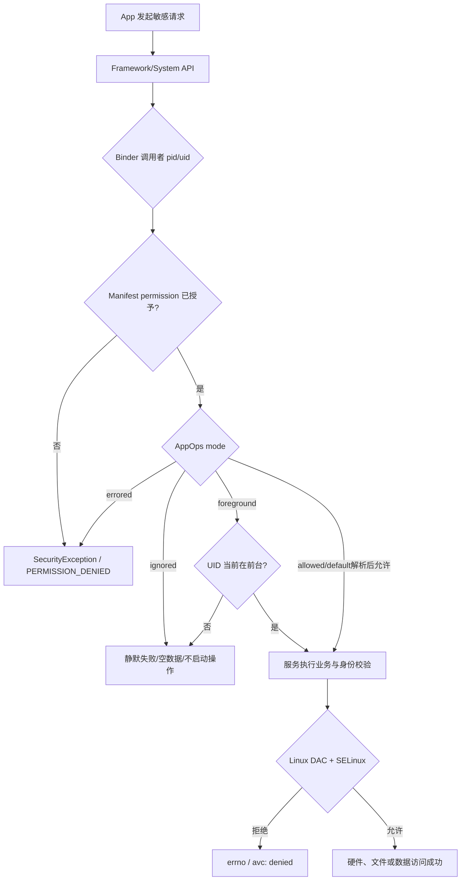
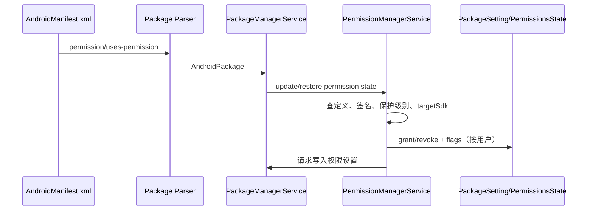
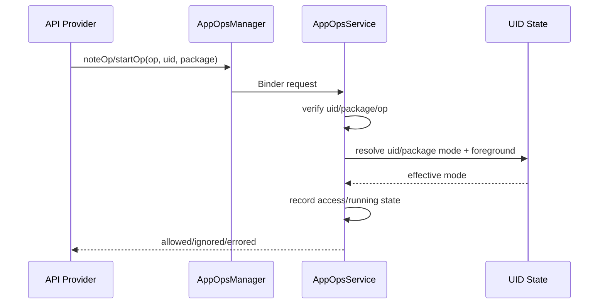
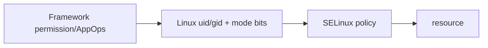

# 23 Android 权限、AppOps 与 SELinux

> 源码版本：Android 11 / API 30 / `android-11.0.0_r48`  
> 学习方式：macOS 只读源码，不要求编译。  
> 前置章节：[07-Binder基础与完整调用链](./07-Binder基础与完整调用链.md)、[13-PackageManagerService包管理与APK安装](./13-PackageManagerService包管理与APK安装.md)、[22-Android存储文件系统与数据持久化](./22-Android存储文件系统与数据持久化.md)

---

## 1. 本章要解决什么

Android 的“权限”不是一道门，而是一组位于不同层次的门：

```text
Manifest/安装状态：这个包是否声明、是否被授予某权限？
Binder 身份：这次请求真正来自哪个 pid/uid？
AppOps：这次具体敏感操作当前允许、忽略，还是只允许前台？
组件规则：Activity/Service/Provider 是否 exported，要求什么 permission？
Linux DAC：进程 uid/gid 是否能访问 inode？
SELinux：source domain 对 target type 的 class/permission 是否有 allow？
业务校验：包名、用户、token、角色、签名、前台状态是否匹配？
```

目标是能回答：

1. 权限从 Manifest 声明到运行时授予，状态存在哪里、由谁管理？
2. `checkSelfPermission()`、`checkCallingPermission()` 为什么不能混用？
3. 已授予 CAMERA，为什么摄像头仍可能不给数据？
4. `clearCallingIdentity()` 清除了什么，为什么必须在 `finally` 恢复？
5. Java permission 已通过，SELinux 为什么仍可能拒绝？
6. 如何从 `SecurityException`、AppOps mode 和 `avc: denied` 判断失败层次？

---

## 2. 一张总图：一次敏感访问的多层裁决



这不是所有 API 的固定模板。有的 API 没有 AppOp，有的由 native daemon 做最终检查，有的还要角色、签名或用户限制。正确读法是：**逐层找证据，不要把所有拒绝都叫“没权限”。**

---

## 3. 先区分四个经常混用的词

| 词 | 含义 |
|---|---|
| permission 定义 | `<permission>` 定义一个权限名及 protectionLevel |
| uses-permission | App 声明自己希望使用某权限 |
| grant state | 某包在某用户下当前是否被授予 |
| permission check | 某次调用针对指定 pid/uid/package/user 的即时判断 |

声明不等于授予，授予也不等于这次敏感操作一定成功。

---

## 4. 权限在哪里定义和声明

平台权限大量定义在：

```text
frameworks/base/core/res/AndroidManifest.xml
```

App 请求权限：

```xml
<uses-permission android:name="android.permission.CAMERA" />
```

组件可要求调用方权限：

```xml
<service
    android:name=".SecretService"
    android:exported="true"
    android:permission="com.example.ACCESS_SECRET" />
```

第一段描述“我要能力”，第二段描述“谁能进入我提供的组件”。方向完全不同。

---

## 5. protectionLevel 的基本类型

源码：

```text
frameworks/base/core/java/android/content/pm/PermissionInfo.java
```

基本类型：

| 类型 | 核心语义 |
|---|---|
| `normal` | 风险较低，安装时通常自动授予 |
| `dangerous` | 涉及敏感数据/能力，通常形成 runtime permission |
| `signature` | 定义者与申请者签名满足平台规则才授予 |

`signatureOrSystem` 已废弃，不应作为新设计。

保护级别还可叠加 flag，例如 `privileged`、`appop`、`development`。因此不能只把 protectionLevel 当成三个互斥字符串。

---

## 6. privileged 不是“装在 system 就行”

`signature|privileged` 权限可授予符合条件的特权系统应用，但还涉及：

- APK 是否位于允许的 `priv-app` 分区路径。
- 是否在相应分区的 `privapp-permissions-*.xml` 白名单中。
- 权限定义及签名关系。
- 构建版本和兼容规则。

`/system/app`、`/system/priv-app`、platform 签名、system UID 是不同概念，不能互相替代。

---

## 7. UID、appId、userId 与权限主体

简化关系：

```text
uid = userId * PER_USER_RANGE + appId
```

权限通常最终按 UID 语义检查，但包和用户仍不可忽略：

- 同一包在不同 Android 用户下有不同运行时授权状态。
- 历史 `sharedUserId` 可让多个包共享 UID，安全分析会更复杂。
- isolated process 使用临时隔离 UID，不能直接继承普通进程的全部身份假设。
- AppOps 常以 `uid + packageName + op` 建模，并验证包确实属于 UID。

只拿包名、不验证 UID，是跨进程服务常见安全漏洞来源。

---

## 8. PermissionManagerService 的位置

Android 11 核心入口：

```text
frameworks/base/services/core/java/com/android/server/pm/permission/PermissionManagerService.java
frameworks/base/core/java/android/permission/IPermissionManager.aidl
frameworks/base/services/core/java/com/android/server/pm/permission/PermissionsState.java
frameworks/base/services/core/java/com/android/server/pm/permission/BasePermission.java
```

`PermissionManagerService` 运行在 `system_server`，同 PMS 的包状态紧密协作。它负责权限定义、授予/撤销、flags、检查、持久化回调等核心逻辑。

---

## 9. 安装/扫描阶段怎样形成权限状态

简化链路：



源码阅读重点不是背一个巨大方法，而是观察 `restorePermissionState()` 如何同时考虑旧状态、升级、replace、用户和 protectionLevel。

---

## 10. normal、signature、dangerous 的授予时机

可先建立简化模型：

```text
normal       → 安装/恢复状态时自动处理
signature    → 比对签名及允许条件
dangerous    → 安装后“已请求但未必已授予”，按用户运行时决定
```

真实源码还会处理 legacy target SDK、权限拆分、权限组、固定 flag、系统默认授权和升级兼容，不要把简化模型当成全部条件。

---

## 11. 运行时权限请求不是 App 自己修改状态

App 调用 `requestPermissions()` 后，会进入系统提供的权限交互流程。Android 11 中权限 UI、策略和一部分管理能力主要位于：

```text
packages/apps/PermissionController/
frameworks/base/core/java/android/permission/PermissionControllerManager.java
```

最终核心授予仍通过受保护的系统接口进入 `PermissionManagerService.grantRuntimePermission()`。普通 App 不能直接调用它给自己授权，因为修改授权状态本身需要高权限。

---

## 12. grantRuntimePermission 的关键检查

阅读 `grantRuntimePermission()` 时重点标出：

1. 调用者是否拥有授予/撤销运行时权限的管理权限。
2. 跨用户操作是否合法。
3. 包、权限、用户是否存在。
4. 权限是否为 runtime/dangerous。
5. fixed、policy、restricted 等 flags 是否阻止修改。
6. `PermissionsState` 是否真正发生变化。
7. 是否通知监听者、写入设置、kill uid 或更新 AppOps。

“点击允许”只是 UI 事件，后面仍是一条带身份检查和持久化的系统服务链。

---

## 13. 权限 flag 为什么重要

仅看 granted/denied 不够。常见 flag 表达：

- 用户明确授予或拒绝。
- 用户选择“不再询问”相关状态。
- system fixed / policy fixed，普通 UI 不能改变。
- one-time、auto revoke、review required 等策略状态。
- restricted permission 的 exemption。

具体位定义可看 `PackageManager.FLAG_PERMISSION_*`。排查“为什么请求框不出现”时，flags 往往比 grant bit 更关键。

---

## 14. Android 11 的一次性权限与自动撤销

相关入口：

```text
frameworks/base/services/core/java/com/android/server/pm/permission/OneTimePermissionUserManager.java
packages/apps/PermissionController/
```

一次性权限不是创造新 protectionLevel，而是在运行时授权上附加会话/生命周期策略。自动撤销也不是 App 每次启动主动做，而是 PermissionController 与系统状态协同管理长期未使用 App 的授权。

版本行为、用户选项及兼容性会变化；读 Android 11 源码时不要套用最新 Android UI 文案。

---

## 15. checkSelfPermission 到哪里

典型 App 代码：

```java
if (checkSelfPermission(Manifest.permission.CAMERA)
        == PackageManager.PERMISSION_GRANTED) {
    // 只能说明 permission grant check 通过
}
```

它检查当前进程自身 UID，而不是“未来所有摄像头操作必成功”。真正 API 提供者还可能检查 AppOps、前台状态、传感器隐私和 SELinux。

---

## 16. Context 的几种检查必须分清

| API | 检查对象 |
|---|---|
| `checkSelfPermission` | 当前进程自己 |
| `checkPermission(permission,pid,uid)` | 明确指定 pid/uid |
| `checkCallingPermission` | Binder 远端调用者；本地调用时语义需特别小心 |
| `checkCallingOrSelfPermission` | 有远端调用者则查对方，否则查自己 |
| `enforce*` | 检查失败直接抛 `SecurityException` |

Android 11 的 `ContextImpl.checkCallingPermission()` 有一个刻意设计的保护：如果 `Binder.getCallingPid()` 等于本进程 PID，说明当前没有可区分的远端 IPC 调用者，它直接返回 `PERMISSION_DENIED`。这样可避免同一个方法被本地调用时，意外借用服务进程自身的高权限。`checkCallingOrSelfPermission()` 才会在这种情况下检查自己。

所以系统服务 Binder 入口应从威胁模型出发明确检查谁，避免为了让单元测试或本地调用“顺利通过”而随意改用 `CallingOrSelf`，那会真实地放宽安全边界。

---

## 17. Binder 驱动提供可信调用身份

服务端可读取：

```java
int uid = Binder.getCallingUid();
int pid = Binder.getCallingPid();
```

这些身份由 Binder 调用上下文提供，不是客户端 Parcel 里自报的数字。客户端传来的 `packageName`、`userId`、`uid` 参数仍是不可信输入，服务端必须校验其关系。

```text
可信起点：Binder.getCallingUid()
待验证声明：packageName 属于该 uid？userId 可跨越？token 属于它？
```

---

## 18. AMS 的通用 permission 检查

源码入口：

```text
frameworks/base/services/core/java/com/android/server/am/ActivityManagerService.java
```

重点阅读：

```text
checkPermission(permission, pid, uid)
checkComponentPermission(permission, uid, owningUid, exported)
```

组件检查不仅看 permission，还可能看：

- 调用者是不是 root/system。
- 调用者和拥有者是否同 UID。
- 组件是否 exported。
- isolated UID 是否被限制。

所以“组件没有配置 permission”不等于“任意 App 都能访问”，`exported` 仍是一道边界。

---

## 19. exported 与 permission 是两个维度

```text
exported=false：原则上不向其他 UID 暴露组件
exported=true + 无 permission：符合其他组件规则的外部调用者可进入
exported=true + permission：外部调用者还必须通过权限检查
```

Provider 还可能区分 readPermission/writePermission、path-permission 和 URI grant。不能用 Activity 的单一入口模型套所有组件。

---

## 20. URI 临时授权

`FLAG_GRANT_READ_URI_PERMISSION`、`FLAG_GRANT_WRITE_URI_PERMISSION` 可对具体 URI 给目标临时能力。它与全局存储权限不同：

```text
全局 permission：对某类能力的较宽授权
URI grant：对特定 content:// URI、目标 UID、读/写模式的能力票据
```

源码可从 AMS/UriGrantsManagerService、ContentProvider 调用链追踪。传递 Intent/ClipData 时还要检查 grant flags 是否覆盖所有 URI。

---

## 21. clearCallingIdentity 到底做什么

系统服务正在处理 App 的 Binder 请求时，线程携带远端调用者身份。若服务要以内层 system_server 身份调用另一个服务，可使用：

```java
final long token = Binder.clearCallingIdentity();
try {
    doWorkAsSystemServer();
} finally {
    Binder.restoreCallingIdentity(token);
}
```

它清除的是当前 Binder 调用身份上下文，使后续检查看到本进程身份；不是改变 Linux 进程真实 UID，也不是“临时 root”。

---

## 22. 为什么 clearCallingIdentity 很危险

正确顺序应是：

```text
读取可信 calling uid
 → 在原调用者身份下完成权限/包名/用户校验
 → clear identity
 → 只执行已经授权的内部动作
 → finally restore
```

若先 clear 再做 `enforceCallingPermission()`，检查到的可能是 system_server 自己，产生权限提升漏洞。若异常路径没有 restore，那么**当前这次 Binder 方法剩余的代码**以及它发起的嵌套调用，都会继续以服务进程身份做检查，足以造成权限提升或错误归因。

这里还要避免另一个过度推论：native `IPCThreadState` 在一次入站 transaction 分发结束时，会把分发前保存的 calling pid/uid 恢复回来，所以不能简单说“忘记 restore 会永久污染 Binder 池线程上以后的所有独立请求”。业务代码仍必须使用 `finally`，因为框架方法返回之前可能有大量敏感工作、回调或嵌套 Binder 调用；而且依赖底层 transaction 退栈来兜底，会让身份作用域完全失控。

---

## 23. AppOps 为什么存在

运行时 permission 适合表达“用户是否授予一类能力”，AppOps 还需要表达：

- 此刻具体操作允许、忽略还是报错。
- 只在 UID 前台时允许。
- 记录何时访问了相机、麦克风、位置等。
- 兼容旧应用时以静默失败代替崩溃。
- 系统设置/策略临时覆盖某项操作。

因此 AppOps 是具体 operation 的策略和审计层，不是 Manifest permission 的别名。

---

## 24. AppOps 核心源码

```text
frameworks/base/core/java/android/app/AppOpsManager.java
frameworks/base/core/java/com/android/internal/app/IAppOpsService.aidl
frameworks/base/services/core/java/com/android/server/appop/AppOpsService.java
frameworks/base/core/java/android/content/PermissionChecker.java
```

客户端 `AppOpsManager` 通过 Binder 调用 `system_server` 中的 `AppOpsService`。

---

## 25. permission 与 op 的映射

`AppOpsManager.permissionToOp(permission)` 可查平台定义 permission 对应的 op。重要限定：

- 不是每个 permission 都有 AppOp。
- 一个 op 的语义是具体操作，不等同于 grant bit。
- Android 11 的每个平台 runtime permission（背景修饰类除外）通常有关联 op，用于追踪及控制。

排查时先确认映射存在，再分析 mode。

---

## 26. 五种常见 AppOps mode

| mode | 直观含义 |
|---|---|
| `MODE_ALLOWED` | 允许操作 |
| `MODE_IGNORED` | 不执行/不给真实结果，通常静默失败 |
| `MODE_ERRORED` | 拒绝，调用方可能收到异常 |
| `MODE_DEFAULT` | 回落到该 op 的默认策略，常需结合 permission |
| `MODE_FOREGROUND` | UID 满足前台条件时才视为允许 |

`MODE_DEFAULT` 不是“默认允许”，`MODE_FOREGROUND` 也不是只看 Activity 是否肉眼可见；AppOpsService 根据 UID state 等系统状态解析。

---

## 27. checkOp、noteOp、startOp 的差异

```text
checkOp：查看当前模式，不代表真实访问已发生
noteOp：记录一次瞬时访问并返回裁决
startOp：开始一段持续访问
finishOp：结束持续访问
```

例如读取一次数据可 `note`，持续录音应 `start`/`finish`。只 `check` 后真正放行，会丢失审计；只 `start` 不 `finish`，会留下错误的活动状态。

---

## 28. AppOps 调用链



关键点是 API 提供者做检查，而不是恶意客户端“自觉”调用 AppOps。

---

## 29. uid mode 与 package op

AppOpsService 内部既可能有 UID 级 mode，也可能有包级 op 状态。解析时会考虑：

- UID 级覆盖。
- 指定包/op 的 mode。
- 默认 mode。
- UID 当前前后台 state。
- 用户限制及其他策略。

这解释了为什么只看一行配置未必能判断最终结果，应跟进 effective mode 的计算。

---

## 30. PermissionChecker 把两层检查串起来

`PermissionChecker` 面向提供敏感数据的代码，典型思路是：

```text
Context.checkPermission
 → permissionToOp
 → AppOps note/proxy note
 → 返回 GRANTED / SOFT_DENIED / HARD_DENIED
```

以 Android 11 的 runtime-permission 检查分支为例：基础 permission 不通过会返回 `PERMISSION_HARD_DENIED`；基础 permission 已通过、但关联 AppOp 不允许时会返回 `PERMISSION_SOFT_DENIED`。对 `appop` protection flag 等其他分支，mode 到结果的映射并不完全相同。调用者还要决定软拒绝表现为空数据、不回调还是其他兼容行为，不能把三个返回值机械映射成固定异常。

---

## 31. 数据传递与代理访问

如果 A 替 B 获取敏感数据，不能只记录 A。`noteProxyOp` 用于表达代理链：

```text
B（数据归属/最终使用者）
 → A（代理）
 → 系统敏感数据提供者
```

Android 11 还引入 attribution tag 等更细粒度归因。服务端必须验证 proxied package/uid，不能相信客户端随便填写一个“有权限的包名”。

---

## 32. 一个完整例子：为什么有定位权限仍无结果

可能依次是：

1. Manifest 声明存在。
2. 当前用户已授予 runtime permission。
3. 调用者 UID/包名匹配。
4. 对应 AppOp 是 `MODE_FOREGROUND`，但 UID 已进入后台。
5. Provider 返回空结果或不继续回调。

还可能叠加系统定位总开关、后台位置权限、传感器/设备策略。`checkSelfPermission()==GRANTED` 只证明第 2 层附近的事实。

---

## 33. SELinux 是什么

Android 使用 SELinux 强制访问控制（MAC）。核心判断可写成：

```text
allow source_domain target_type:object_class permissions;
```

例子的阅读方式：

```text
allow cameraserver camera_device:chr_file { open read write ioctl };
```

含义是允许 `cameraserver` domain 对标记为 `camera_device` type 的字符设备执行列出的操作。真实规则常通过宏展开，不一定直接写成这一行。

---

## 34. SELinux context 的四段

典型：

```text
u:r:untrusted_app:s0:c123,c456
```

可拆为：

```text
user : role : type/domain : level/categories
```

日常 AOSP 排查最常关注 type/domain；App 数据隔离还会使用 MLS/MCS category。不能只比较 `untrusted_app` 就断言两个 App 能互读数据。

---

## 35. subject、object、class、permission

一次 SELinux 判断至少包含：

| 元素 | 例子 |
|---|---|
| source/subject | `untrusted_app` 进程 |
| target/object type | `system_data_file` |
| object class | `file`、`dir`、`binder`、`service_manager` |
| requested permission | `read`、`write`、`call`、`find` |

同样的 source/target，读文件和搜索目录是不同 class/permission 组合；目录缺少 `search` 时，即使文件自身可读也走不到它。

---

## 36. domain 怎样分配给 App

重要入口：

```text
system/sepolicy/private/seapp_contexts
system/sepolicy/private/mac_permissions.xml
system/sepolicy/public/te_macros
```

签名、是否 privileged、包名、seinfo、target SDK 等信息参与选择 App domain。`mac_permissions.xml` 把签名/包映射到 seinfo，`seapp_contexts` 再据条件决定 domain 与数据目录 type。

不要把 APK Manifest permission 与 SELinux domain 分配混为一谈。

---

## 37. 文件怎样获得 label

入口：

```text
system/sepolicy/private/file_contexts
system/sepolicy/vendor/file_contexts
```

`file_contexts` 用路径正则给初始文件系统对象定义 label。运行时还可能由 `restorecon`、创建者 type transition 等设置。

```text
路径看起来正确 ≠ label 一定正确
chmod 777 ≠ 绕过 SELinux
```

复制文件到某目录后若 label 不对，DAC 全开仍会得到 `avc: denied`。

---

## 38. Binder 服务也有 SELinux label

入口：

```text
system/sepolicy/private/service_contexts
system/sepolicy/private/hwservice_contexts
system/sepolicy/vendor/vndservice_contexts
```

访问 Binder 服务通常至少涉及：

```text
service_manager find：能否查到服务
binder call：能否向目标 domain 发起 Binder 调用
```

Java permission 通过不代表 SELinux 一定允许 `find/call`；反过来能 Binder call 也不代表业务方法不检查 permission。

---

## 39. allow、dontaudit、neverallow

| 规则 | 作用 |
|---|---|
| `allow` | 明确允许访问向量 |
| `dontaudit` | 对某类拒绝减少审计日志，不等于允许 |
| `neverallow` | 编译期断言：策略绝不能出现这种允许 |

`neverallow` 是架构安全边界。遇到冲突时应重新审视 domain/接口设计，而不是想办法把断言删掉。

---

## 40. enforcing 与 permissive

```text
enforcing：拒绝并记录（受审计设置影响）
permissive：通常记录但不实际阻止
```

量产 Android 设备应处于 enforcing。把系统改为 permissive 只能作为极有限的定位信号，不是修复；而本课程在 macOS 上只读源码，不执行设备策略修改。

---

## 41. DAC 与 SELinux 是“都要通过”



某文件 `0666` 只说明传统 mode bits 较宽，不代表 SELinux 放行。某条 SELinux `allow` 也不会自动修复 Unix owner/mode 错误。

---

## 42. SELinux 与 Android permission 的根本差异

| Android permission | SELinux |
|---|---|
| Framework/系统服务语义 | 内核 LSM 强制访问控制 |
| 常围绕 package/uid/user | 围绕 domain/type/class/permission |
| 可有用户运行时授予 | 策略由系统构建和加载 |
| 常产生 SecurityException/返回码 | 常表现为 errno 与 `avc: denied` |
| 保护 API/组件/数据能力 | 限制进程对内核对象及 IPC 的能力 |

二者互补：Framework 提供用户可理解的能力模型，SELinux 限制被攻陷进程的横向活动范围。

---

## 43. 典型系统服务安全模板

```java
public void doSensitiveWork(String packageName, int userId) {
    final int callingUid = Binder.getCallingUid();
    mContext.enforceCallingPermission(MY_PERMISSION, "doSensitiveWork");
    enforcePackageBelongsToUid(packageName, callingUid);
    enforceCrossUserIfNeeded(callingUid, userId);

    final long token = Binder.clearCallingIdentity();
    try {
        performValidatedInternalWork(packageName, userId);
    } finally {
        Binder.restoreCallingIdentity(token);
    }
}
```

这是教学骨架，不是可直接复制的完整实现。真实服务还可能需要 AppOps、role、user restriction、token ownership、foreground、SELinux 和 TOCTOU 防护。

---

## 44. 常见漏洞一：相信客户端 packageName

错误思路：

```java
if (packageManager.checkPermission(PERM, packageName) == GRANTED) {
    grantAccess();
}
```

攻击者可传入另一个有权限的包名。必须先根据 Binder calling UID 验证 packageName 归属，或直接基于 calling UID 检查。

---

## 45. 常见漏洞二：先 clear identity 后检查

错误顺序：

```text
clearCallingIdentity
 → enforceCallingPermission
```

此时“calling”可能已变成本进程身份。安全审查看到 `clearCallingIdentity()` 时，应向上找所有外部输入校验，向下确认内部动作范围，并检查 `finally restore`。

---

## 46. 常见漏洞三：只检查 permission，不检查 AppOps

对与 AppOp 关联的敏感数据 API，如果只查 runtime permission：

- 用户/策略将 op 改为 ignored 时仍可能泄露数据。
- 隐私访问记录缺失。
- 前台限定失效。

优先使用该子系统已有的统一 checker，而不是自行拼一套近似逻辑。

---

## 47. 常见漏洞四：check 与 use 分离

```text
时刻 T1：检查 uid/package/token
时刻 T2：状态发生变化
时刻 T3：使用旧结论执行敏感动作
```

这是 TOCTOU。可通过锁内检查与使用、不可伪造 token、重新验证状态、以稳定对象引用代替可变名字等方式降低风险。不要为了避免竞态而长期持有全局锁做 Binder/I/O，需结合死锁风险设计。

---

## 48. 多用户检查

调用者操作另一个 user 时，通常需要：

1. 从 calling UID 得出 calling user。
2. 规范化传入 userId（留意 `USER_CURRENT` 等特殊值）。
3. 判断是否跨用户。
4. 要求 `INTERACT_ACROSS_USERS` 或更强权限，具体看 API。
5. 在目标用户的包/权限/AppOps 状态上执行。

“同一个 packageName”不代表跨用户天然可信。

---

## 49. isolated process 的意义

隔离进程用独立临时 UID，减少它继承宿主 App 权限和数据访问的能力。服务端代码若把 isolated UID 当普通 appId 处理，可能产生错误授权。AMS 的组件权限检查中能看到对 isolated caller 的特殊限制。

---

## 50. sharedUserId 的阅读提醒

Android 11 源码仍有 shared UID 历史逻辑。多个包共享 UID 时：

- Linux 层进程身份相同。
- 权限集合和包归属分析更复杂。
- AppOps 仍可能涉及 packageName 维度。
- 签名约束非常关键。

不要在现代新应用中把它当成推荐的进程间共享方案。

---

## 51. 错误现象怎样映射到层次

| 现象 | 优先排查 |
|---|---|
| `SecurityException: requires ...` | Framework permission/组件导出/调用身份 |
| API 成功返回但空数据、不回调 | AppOps ignored、隐私/总开关、兼容策略 |
| 仅后台失败 | MODE_FOREGROUND、后台权限/后台限制 |
| `Permission denied` + `avc: denied` | SELinux source/target/class/permission |
| `Permission denied` 无 AVC | DAC、路径、mount、FUSE，或 dontaudit |
| 某用户失败、另一用户成功 | user-specific grant/AppOps/包安装状态 |
| shell 成功、普通 App 失败 | UID、shell 专属授权、domain 不同 |

这是入口表，不是自动结论。

---

## 52. 读 avc: denied 的方法

典型字段：

```text
avc: denied { read } for ...
scontext=u:r:untrusted_app:s0:...
tcontext=u:object_r:some_data_file:s0
tclass=file
permissive=0
```

按顺序翻译：

```text
谁：scontext/domain
对谁：tcontext/type
什么对象：tclass
想做什么：{ read }
是否 enforcing：permissive=0
```

然后追“为什么进程/文件得到这个 label”和“架构上是否应该允许”，不要看到日志就直接生成 allow。

---

## 53. 为什么不能照抄 audit2allow

自动生成规则只能把观察到的拒绝翻译成候选 allow，无法判断：

- 访问是否本来就是攻击或 bug。
- target label 是否标错。
- 应否通过受控 Binder 服务访问，而不是直接读文件。
- 权限集合是否过宽。
- 是否违反 neverallow 或 Treble 边界。

正确修复可能是改 label、改进程 domain、增加中介服务、缩小文件范围，甚至删除错误访问。

---

## 54. public/private/vendor sepolicy 的边界

```text
system/sepolicy/public   平台向 vendor 暴露的稳定策略接口
system/sepolicy/private  平台内部实现
system/sepolicy/vendor   示例/通用 vendor 策略区域，设备树还会有 vendor policy
```

Android 8+ Treble 将 platform/vendor policy 边界制度化。读设备问题时还要查 `device/<vendor>/<product>/sepolicy` 等设备目录，不能只搜 `system/sepolicy`。

---

## 55. 权限状态如何持久化

Android 11 中包设置与每用户 runtime permission 状态由 PMS/PermissionManagerService 协同持久化。阅读方向：

```text
PermissionManagerService 状态变化
 → callback / PackageManagerInternal
 → Settings 写入
 → /data/system 与 /data/system/users/<id> 下的系统状态文件
```

不要让业务代码直接修改这些文件；内存状态、校验、备份恢复、用户状态和文件内容需要一致。

---

## 56. 默认权限授予策略

入口：

```text
frameworks/base/services/core/java/com/android/server/pm/permission/DefaultPermissionGrantPolicy.java
```

它为系统关键角色/默认处理者授予必要权限，例如默认电话、短信等角色相关组件。这里的“默认”是受严格规则的系统策略，不意味着所有预装 App 自动拿到 dangerous permission。

---

## 57. 权限组不是安全边界本身

权限组主要帮助用户呈现和管理相关权限。代码做授权判断时应检查具体 permission，不能只因为同组某一项已授予就推断另一项也已授予。不同 Android 版本还会调整组和 UI 行为。

---

## 58. targetSdk 为什么影响权限行为

系统为旧应用提供兼容行为，例如旧版本运行时权限模型、后台访问、拆分权限等。`targetSdkVersion` 是“应用声明自己按哪个行为契约适配”，不是设备 Android 版本，也不是 minSdk。

读 `restorePermissionState()` 或兼容分支时，把三者同时记下：

```text
平台版本 Android 11
App targetSdk
安装/升级历史状态
```

---

## 59. 权限拆分与升级兼容

平台可能把旧权限拆成多个新权限。系统维护 split permission 信息，在旧 target 应用升级/恢复时兼容处理。看到一个 App “没有显式请求却得到关联权限”，要查 split/default grant/角色策略，而不是立即断言 PMS 出错。

---

## 60. 读源码固定记录表

每追一个敏感 API，记录：

| 问题 | 记录内容 |
|---|---|
| 谁调用 | 进程、pid/uid、user、package |
| 谁提供 | system_server 还是 native daemon |
| permission | 名称、保护级别、grant 状态 |
| AppOp | op、check/note/start、effective mode |
| 身份切换 | clear/restore 的范围 |
| 额外条件 | exported、role、token、foreground、restriction |
| SELinux | source/target/class/permission |
| 失败表现 | exception、empty、errno、AVC |

---

## 61. 源码路线一：权限定义与状态

```text
frameworks/base/core/res/AndroidManifest.xml
frameworks/base/core/java/android/content/pm/PermissionInfo.java
frameworks/base/services/core/java/com/android/server/pm/permission/PermissionManagerService.java
frameworks/base/services/core/java/com/android/server/pm/permission/PermissionsState.java
frameworks/base/services/core/java/com/android/server/pm/permission/BasePermission.java
```

练习：选择 CAMERA，找到定义、protectionLevel、包请求信息，再追 `checkPermission()` 如何落到包/用户的 state。

---

## 62. 源码路线二：运行时授予

```text
frameworks/base/core/java/android/permission/IPermissionManager.aidl
frameworks/base/core/java/android/permission/PermissionControllerManager.java
frameworks/base/services/core/java/com/android/server/pm/permission/PermissionManagerService.java
frameworks/base/services/core/java/com/android/server/pm/permission/DefaultPermissionGrantPolicy.java
frameworks/base/services/core/java/com/android/server/pm/permission/OneTimePermissionUserManager.java
packages/apps/PermissionController/
```

练习：从 `grantRuntimePermission()` 标出调用者权限、跨用户、flags、状态更新和持久化通知五个位置。

---

## 63. 源码路线三：Binder 与组件边界

```text
frameworks/base/core/java/android/os/Binder.java
frameworks/base/core/java/android/content/Context.java
frameworks/base/core/java/android/app/ContextImpl.java
frameworks/base/services/core/java/com/android/server/am/ActivityManagerService.java
frameworks/base/services/core/java/com/android/server/uri/UriGrantsManagerService.java
```

练习：对比 self/calling/calling-or-self，找到 `checkComponentPermission()` 对 same UID、exported、isolated caller 的处理。

---

## 64. 源码路线四：AppOps

```text
frameworks/base/core/java/android/app/AppOpsManager.java
frameworks/base/core/java/com/android/internal/app/IAppOpsService.aidl
frameworks/base/services/core/java/com/android/server/appop/AppOpsService.java
frameworks/base/core/java/android/content/PermissionChecker.java
```

练习：选一个 op，对比 `checkOperation()`、`noteOperation()`、`startOperation()`，记录哪条路径会产生访问记录和 running 状态。

---

## 65. 源码路线五：SELinux

```text
system/sepolicy/private/seapp_contexts
system/sepolicy/private/mac_permissions.xml
system/sepolicy/private/file_contexts
system/sepolicy/private/service_contexts
system/sepolicy/public/app.te
system/sepolicy/private/app_neverallows.te
system/sepolicy/public/te_macros
```

练习：从 `untrusted_app` 找继承属性和宏，再选一个 Binder service，分别找 service label、`find` 和目标 domain 的 `binder call` 规则。

---

## 66. 推荐的八组只读练习

1. **权限定义**：从 CAMERA 定义读出 base protection 和 flags。
2. **权限恢复**：画出 APK 请求到 `PermissionsState` 的更新链。
3. **运行时授予**：列出 grant 方法拒绝修改的条件。
4. **Binder 身份**：找一个系统服务的 `clearCallingIdentity()`，核查是否先校验、finally 恢复。
5. **组件权限**：比较 exported=false、permission、same UID 三种情况。
6. **AppOps**：解释 allowed/ignored/foreground 对 API 表现的不同影响。
7. **SELinux**：把一条 allow 拆成 source/target/class/permissions。
8. **综合诊断**：为“权限已允许但后台无定位”列出逐层证据清单。

每组只要求输出半页笔记，不要求编译或修改源码。

---

## 67. 初学者最容易混淆的十点

1. Manifest 声明不等于运行时已授予。
2. permission granted 不等于 AppOp allowed。
3. AppOps ignored 可能静默失败，不一定抛异常。
4. `MODE_DEFAULT` 不等于默认允许。
5. `getCallingUid()` 与方法参数 uid 的可信度不同。
6. `clearCallingIdentity()` 不是 root，也不是修改进程 UID。
7. platform 签名、system app、priv-app、system UID 不是同义词。
8. `chmod 777` 不能绕过 SELinux。
9. SELinux allow 不能替代 Framework permission 检查。
10. AVC 出现后不应直接照抄 audit2allow。

---

## 68. 自测题

1. dangerous permission 为什么既有 grant state 又可能有关联 AppOp？
2. 服务端为什么不能信任客户端传入的 packageName？
3. `checkCallingPermission()` 在没有远端 Binder caller 时有什么陷阱？
4. 为什么持续录音要 `startOp/finishOp` 而不是只 `checkOp`？
5. `MODE_FOREGROUND` 由谁根据什么大类状态解析？
6. `/data` 文件 mode 为 0666，App 为什么仍可能访问失败？
7. `service_manager find` 与 `binder call` 分别约束什么？
8. `neverallow` 为什么不能当普通报错规则删除？
9. 跨用户调用为什么不能只检查包名相同？
10. 看见 `avc: denied` 后第一步应该提取哪四个字段？

---

## 69. 自测答案

1. grant 表达用户授予的能力；AppOp表达具体操作的动态策略、前台限制和审计。
2. packageName 是不可信参数，攻击者可冒充有权限包；需与 Binder calling UID 绑定验证。
3. 可能检查不到预期的“外部调用者”，因此必须明确 self/calling 语义。
4. 持续操作需要记录开始、活动状态和结束；只 check 不记实际访问。
5. `AppOpsService` 结合 UID state 等系统状态解析，而非简单看 Activity 名字。
6. DAC 只是其中一层，SELinux、目录 search、挂载/FUSE 等仍可拒绝。
7. 前者限制能否查找服务句柄，后者限制 source domain 能否调用目标 domain。
8. 它是编译期架构安全断言，冲突通常说明设计或 domain/label 有问题。
9. 不同用户有不同 UID、安装与授权状态，跨用户本身也要求额外授权。
10. `scontext`、`tcontext`、`tclass`、请求的 `{ permission }`。

---

## 70. 本章结论

把 Android 安全检查记成一句话：

```text
先确认“谁在调用”，再确认“被授予什么”；
再判断“这次操作此刻是否允许”，最后仍要通过内核强制访问控制。
```

最重要的源码阅读能力不是记住权限 API，而是始终标注：

```text
身份从哪里来？
状态属于哪个用户？
检查发生在 clear identity 之前还是之后？
AppOp 是否被 note/start？
最终资源由哪个 SELinux domain 访问？
```

能回答这五问，就能把大多数“明明有权限为什么还失败”和“这个 Binder 接口是否安全”的问题拆成可验证的源码链路。
