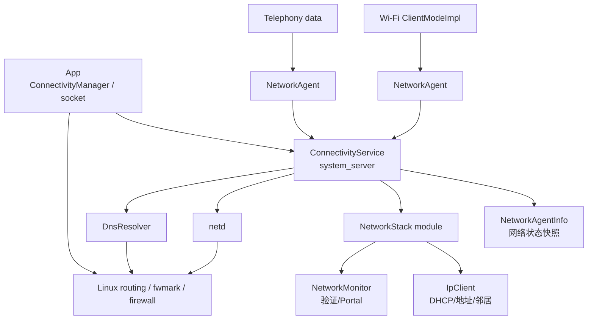
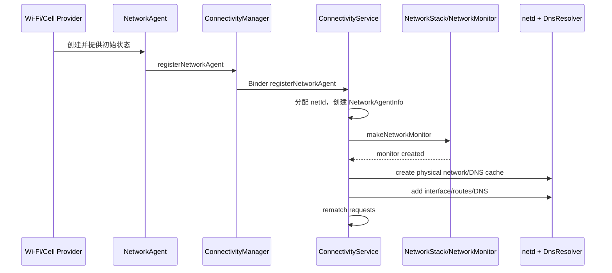
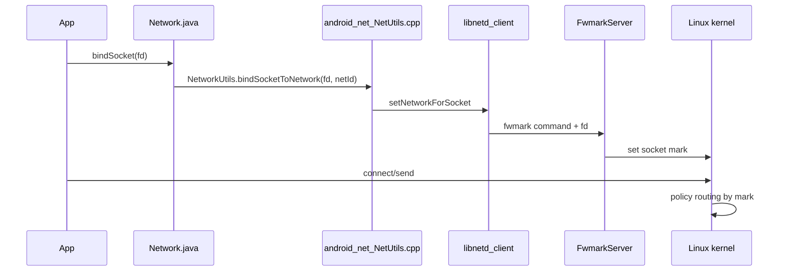

# 24 Android 网络栈、ConnectivityService 与 NetworkAgent

> 源码版本：Android 11 / API 30 / `android-11.0.0_r48`  
> 学习方式：macOS 只读源码，不要求编译或真机抓包。  
> 前置章节：[06-SystemServer与系统服务](./06-SystemServer与系统服务.md)、[07-Binder基础与完整调用链](./07-Binder基础与完整调用链.md)、[23-Android权限AppOps与SELinux](./23-Android权限AppOps与SELinux.md)

---

## 1. 先把“网络”拆成两条链

很多人第一次读网络源码，会把“Wi-Fi 连上了”和“App 的 HTTP 请求走 Wi-Fi”当成同一件事。实际至少有两条链：

```text
控制面：
Wi-Fi/蜂窝建立链路 → 上报 NetworkAgent → 分配 netId
→ 配置接口/路由/DNS → 网络验证 → 匹配请求 → 选择默认网络

数据面：
App 创建 socket/解析域名 → 选择默认或指定 Network
→ socket fwmark/netId → 内核 policy routing → 网卡 → 对端
```

控制面决定“有哪些网络、能力是什么、谁应该使用”；数据面负责“某个数据包实际怎样出去”。本章会一直区分这两条线。

---

## 2. 本章目标

读完应能解释：

1. `ConnectivityManager` 与 `ConnectivityService` 的进程边界。
2. Wi-Fi/蜂窝为什么要通过 `NetworkAgent` 注册网络。
3. `NetworkCapabilities`、`LinkProperties`、score 各描述什么。
4. `NetworkRequest` 如何匹配到一个或多个候选网络。
5. `INTERNET` 与 `VALIDATED` 为什么不是一回事。
6. 默认网络切换为什么不仅是换一个 Java 对象。
7. `Network.bindSocket()`、process default 与系统默认网络的差别。
8. DNS、Private DNS、netd、fwmark、内核路由如何衔接。
9. 遇到“已连 Wi-Fi 但不能上网”应该分层看哪些证据。

---

## 3. 整体架构图



几个进程边界要先记住：

- `ConnectivityManager` 是 App 进程中的客户端 API。
- `ConnectivityService` 运行于 `system_server`。
- Android 11 的 NetworkStack 是可更新模块，`NetworkMonitor`、`IpClient` 不应简单画成 ConnectivityService 内部普通类。
- `netd` 和 DnsResolver 是 native 服务/模块；最终发包由 Linux 内核完成。

---

## 4. 核心对象速查

| 对象 | 回答的问题 |
|---|---|
| `Network` | 哪一个逻辑网络，核心身份是 netId |
| `NetworkCapabilities` | 网络能做什么、是什么 transport |
| `LinkProperties` | 接口、地址、路由、DNS、MTU 等链路配置是什么 |
| `NetworkAgent` | Wi-Fi/蜂窝等网络提供者如何向系统持续上报 |
| `NetworkAgentInfo` | ConnectivityService 内对一个已注册网络的综合记录 |
| `NetworkRequest` | 调用者想要怎样的网络 |
| score | 多个满足请求的网络之间如何比较偏好 |
| `NetworkMonitor` | 网络是否真的能访问互联网、是否有 Portal |
| `netd` | 将 Framework 决策落实为网络、接口、路由、权限等 native 配置 |

---

## 5. ConnectivityManager 只是客户端门面

源码：

```text
frameworks/base/core/java/android/net/ConnectivityManager.java
frameworks/base/core/java/android/net/IConnectivityManager.aidl
frameworks/base/services/core/java/com/android/server/ConnectivityService.java
```

典型调用：

```text
App
 → ConnectivityManager.requestNetwork/registerNetworkCallback
 → IConnectivityManager Binder proxy
 → system_server ConnectivityService
```

回调并不是系统直接在 App 任意线程执行。`ConnectivityManager` 用 callback handler 把 Binder/内部消息转换成 `NetworkCallback` 方法，因此分析线程问题要继续看注册时选择的 Handler/Executor。

---

## 6. NetworkCapabilities：能力不是配置

常见 capability：

```text
INTERNET       声称可用于互联网
VALIDATED      系统探测确认具有可用互联网连接
CAPTIVE_PORTAL 检测到认证门户
NOT_METERED    非计费网络
TRUSTED        受系统信任
NOT_VPN        不是 VPN
NOT_RESTRICTED 非受限用途
```

常见 transport：

```text
WIFI / CELLULAR / ETHERNET / VPN / WIFI_AWARE ...
```

transport 描述承载类型，capability 描述能力/约束。`WIFI` 不等于 `INTERNET`，`INTERNET` 也不等于 `VALIDATED`。

---

## 7. INTERNET 与 VALIDATED 最容易混淆

```text
INTERNET：网络提供者声明“这条网络设计上可通互联网”
VALIDATED：NetworkMonitor 的实际探测认为互联网可用
```

连上一个没有外网的路由器，可能仍有 `WIFI + INTERNET`，但没有 `VALIDATED`。局域网网络也可能故意没有 INTERNET，却能访问打印机或 IoT 设备。

因此“Capabilities 里有 INTERNET”不能作为联网成功证据。

---

## 8. LinkProperties：这条链路怎样走

源码：

```text
frameworks/base/core/java/android/net/LinkProperties.java
```

它通常包含：

- interface name，如 `wlan0`、蜂窝数据接口。
- IPv4/IPv6 LinkAddress。
- RouteInfo，包括默认路由与直连路由。
- DNS server。
- search domain、MTU、TCP buffer 配置。
- stacked links，例如某些隧道/转换机制。
- Private DNS 状态和已验证服务器。

Capabilities 回答“能不能”，LinkProperties 回答“具体怎么走”。

---

## 9. Network 是 netId 的 Java 句柄

源码：

```text
frameworks/base/core/java/android/net/Network.java
```

`Network` 内部核心字段是 `netId`，但公开的 network handle 经过编码，源码明确提醒 handle 不等同于裸 netId。不要把二者当作可互换整数传递。

`Network` 还提供：

```text
bindSocket
getSocketFactory
getAllByName/getByName（在指定网络上解析）
openConnection
```

它代表“在某个逻辑网络上下文中做事”，不是一张网卡对象。

---

## 10. 为什么不能只用网卡名

Android 需要同时表达：

- 多个逻辑网络可能复用/叠加接口。
- VPN 可成为一个 Network，并将流量转入隧道。
- UID 可被限制使用某个网络。
- 每个网络有独立 DNS cache/config。
- socket 选择的是路由域/netId，不只是 `wlan0`。

所以 Framework 以 Network/netId 建模，再由 netd 和内核映射到接口及路由。

---

## 11. 网络提供者与 NetworkAgent

Wi-Fi、蜂窝、以太网、VPN 各自知道底层连接状态，但全局选择必须集中协调。`NetworkAgent` 是提供者与 ConnectivityService 的协议端点：

```text
provider 建立底层链路
 → 创建 NetworkAgent
 → registerNetworkAgent
 → 上报 NetworkInfo/Capabilities/LinkProperties/score
 → 后续继续发送变化
```

源码：

```text
frameworks/base/core/java/android/net/NetworkAgent.java
frameworks/opt/net/wifi/service/java/com/android/server/wifi/ClientModeImpl.java
frameworks/base/services/core/java/com/android/server/connectivity/NetworkAgentInfo.java
```

---

## 12. NetworkAgent 不是网络本身

应区分：

```text
真实链路：Wi-Fi association、蜂窝 data call、VPN tunnel
NetworkAgent：向 ConnectivityService 汇报/接收指令的控制对象
NetworkAgentInfo：ConnectivityService 内部汇总状态
Network：交给调用者的逻辑网络标识
```

Agent 消失通常意味着系统应撤销该逻辑网络，但它本身不负责每个应用数据包的转发。

---

## 13. 注册网络的主链



Android 11 的 `registerNetworkAgent()` 在 NetworkMonitor 创建回调之后继续完成注册；阅读异步链时不要以为方法返回就代表所有配置已完成。

---

## 14. NetworkAgentInfo 为什么关键

`NetworkAgentInfo` 将分散信息放在一个系统侧对象中：

- `Network`/netId。
- agent messenger/async channel。
- `NetworkCapabilities`。
- `LinkProperties`。
- NetworkInfo 与详细状态。
- score、validation、linger。
- 当前满足哪些 requests。
- NetworkMonitor 交互状态。

追默认网络切换时，以 NAI 为中心比在 Wi-Fi、Telephony 和 netd 之间乱跳更清晰。

---

## 15. IpClient 负责 IP provisioning

源码：

```text
packages/modules/NetworkStack/src/android/net/ip/IpClient.java
```

底层“已关联 Wi-Fi”后还需要：

```text
获取/配置 IPv4 地址（常通过 DHCP）
配置 IPv6 地址和 Router Advertisement 结果
维护路由、DNS、邻居可达性
生成新的 LinkProperties
监控 provisioning 成功或丢失
```

Wi-Fi 显示已连接但没有 IP、默认路由或 DNS，仍然无法正常联网。二层连接和三层 provisioning 必须分开。

---

## 16. NetworkMonitor 负责什么

源码：

```text
packages/modules/NetworkStack/src/com/android/server/connectivity/NetworkMonitor.java
frameworks/base/services/net/java/android/net/NetworkMonitorManager.java
packages/modules/NetworkStack/common/networkstackclient/src/android/net/INetworkMonitor.aidl
```

主要职责：

- 网络可用性验证探测。
- Captive Portal 识别。
- partial connectivity 判断。
- data stall 相关探测与通知。
- Private DNS 评估的一部分协作。

它把结果回报 ConnectivityService，后者更新 capabilities、通知用户、重新匹配请求。

---

## 17. Captive Portal 的状态演进

酒店/商场 Wi-Fi 常见：

```text
L2/L3 已连接
 → 探测请求被重定向/返回异常结果
 → 标记 CAPTIVE_PORTAL，通常没有 VALIDATED
 → 系统展示登录通知/界面
 → 用户认证
 → 重新探测
 → 成功后加入 VALIDATED
```

Portal 检测不是简单 ping，也不能保证任何国家/网络环境下都绝对准确；源码中会看到 HTTP/HTTPS 探测、配置 URL 和兼容逻辑。

---

## 18. NetworkRequest 描述“我要什么”

源码：

```text
frameworks/base/core/java/android/net/NetworkRequest.java
frameworks/base/core/java/android/net/NetworkCapabilities.java
```

示意：

```java
NetworkRequest request = new NetworkRequest.Builder()
        .addCapability(NetworkCapabilities.NET_CAPABILITY_INTERNET)
        .addTransportType(NetworkCapabilities.TRANSPORT_WIFI)
        .build();
```

它描述约束，不等于立即创建网络，也不等于独占网络。

---

## 19. listen 与 request 的区别

```text
registerNetworkCallback：监听所有匹配网络的出现/变化/消失
requestNetwork：提出主动需求，系统可通知 provider 尝试带起网络
registerDefaultNetworkCallback：观察调用者当前默认网络
```

request 具有资源生命周期，使用完必须 `unregisterNetworkCallback()`；泄漏 request 可能让昂贵网络长时间保持。

---

## 20. 回调顺序不能只记 onAvailable

常见 callback：

```text
onAvailable
onCapabilitiesChanged
onLinkPropertiesChanged
onLosing
onLost
onUnavailable（带超时 request）
```

回调反映动态状态。获得 `onAvailable` 后应从对应 callback 状态使用该 Network；不要再同步查询一次全局 active network 并假设还是同一个，网络可能已切换。

---

## 21. request 如何进入 ConnectivityService

简化：

```text
ConnectivityManager.requestNetwork
 → IConnectivityManager.requestNetwork
 → ConnectivityService 校验权限/UID/package
 → 创建 NetworkRequestInfo
 → 记录 request
 → 通知 NetworkProvider/Factory 潜在需求
 → 将现有网络与 request rematch
 → 回调匹配结果
```

request 属于调用者，Binder death/显式 unregister 会触发清理。

---

## 22. capability matching 的方向

判断的是：

```text
candidate NetworkCapabilities
是否满足
requested NetworkCapabilities 的全部必要约束
```

候选网络有更多能力通常没问题，但缺少 request 要求的一项就不匹配。transport 条件、specifier、UID 范围等还会缩小候选集。

---

## 23. score 用来做什么

选择必须先后经过两个阶段：

```text
阶段一：能力过滤——候选是否满足 request 的全部必要条件？
阶段二：偏好比较——只在满足条件的候选中比较有效 score/策略。
```

所以一个分数再高的蜂窝网络，也不能满足“必须是 `TRANSPORT_WIFI`”的 request；一个没有所需 capability 的网络也不会靠高分补齐能力。多个网络都满足 request 时，系统才需要选择更优者。score 是重要输入，但不是简单永久常量：

- transport/provider 给出基础分值。
- validation 可影响有效偏好。
- 用户“避免差 Wi-Fi”等设置影响选择。
- 当前已服务的网络可能有避免抖动的策略。
- VPN 和特殊请求有额外语义。

因此“Wi-Fi 分数永远比蜂窝高”不是安全的源码结论。

举例：默认 request 同时可由 validated Wi-Fi 和 validated 蜂窝满足时，Wi-Fi 可能胜出；当 Wi-Fi 失去 validation、有效分数或策略偏好变化后，rematch 可能把默认 request 交给蜂窝。但一个专门要求 Wi-Fi 的 callback 不会因此回调蜂窝。

---

## 24. rematch 是选择核心

ConnectivityService 中多处状态变化会触发：

```text
rematchAllNetworksAndRequests()
```

触发源包括：新网络注册、score/capability 更新、验证结果、网络断开、策略变化。rematch 的工作是重新判断每个 request 应由哪个网络满足，并产生默认网络切换与 callback。

阅读时记录“谁触发 rematch”和“比较前后 winner”，比只看循环细节更有价值。

---

## 25. 默认网络是什么

默认网络是没有显式绑定 Network 的普通流量通常采用的网络。ConnectivityService 内有一个代表系统默认需求的 request，满足它的最佳网络成为默认网络。

```text
系统默认网络 ≠ 当前唯一网络
```

Wi-Fi、蜂窝、VPN 可同时存在；不同 UID 看到的默认网络还可能因 VPN、策略和权限不同。

---

## 26. 默认网络切换发生了什么

简化过程：

```text
新候选满足默认 request 且更优
 → rematch 改变 winner
 → netd 更新默认网络/路由相关状态
 → 更新 DNS 选择
 → 向 callback/系统组件发送变化
 → 旧网络 linger 一段时间或断开
```

已有 TCP 连接不保证无缝迁移到新网络。新建连接可走新默认网络，旧 socket 常仍受创建/绑定时的网络与链路存活影响。

---

## 27. linger 防止切换过于粗暴

网络不再赢得 request 后不一定立即销毁。linger 给回调和现有连接一定过渡时间，也降低分数短暂波动造成的频繁切换。若旧网络重新赢得请求，可取消离开过程。

不要把 `onLosing()` 理解成“此刻已经完全不可用”；它是即将失去的提示。

---

## 28. ConnectivityService 如何配置 netd

注册/更新网络时可看到：

```text
mNetd.networkCreatePhysical/networkCreateVpn
networkAddInterface
updateRoutes
updateDnses
networkDestroy
```

源码：

```text
system/netd/server/NetdNativeService.cpp
system/netd/server/NetworkController.cpp
system/netd/server/RouteController.cpp
system/netd/server/aidl_api/netd_aidl_interface/current/android/net/INetd.aidl
```

ConnectivityService 做全局策略，netd 将其转成 native/内核配置。

---

## 29. netId、路由表与 fwmark

Android 多网络需要让同一台设备上的 socket 选择不同路由域。简化理解：

```text
socket 关联 netId/权限信息
 → netd client 设置 socket mark（fwmark）
 → Linux policy routing 根据 mark 查对应规则/路由表
 → 选择 interface/gateway
```

源码：

```text
system/netd/include/Fwmark.h
system/netd/client/FwmarkClient.cpp
system/netd/server/FwmarkServer.cpp
system/netd/server/RouteController.cpp
```

fwmark 不只是 netId 位，还编码显式选择、权限等信息；不要把整个 mark 直接当 netId。

---

## 30. socket 是怎样绑定 Network 的



`Network.bindSocket()` 要在 socket 已创建但尚未 connect 的合适时机调用；已连接 socket 不能随意迁移网络。

---

## 31. 三种“默认/绑定”不能混淆

| 方式 | 作用范围 |
|---|---|
| 系统默认网络 | 普通未绑定流量的全局/按 UID 选择基础 |
| process default network | 当前进程后续 socket 与名称解析默认选择；公开入口主要是 `bindProcessToNetwork()` |
| `Network.bindSocket(fd)` | 只绑定一个 socket |

源码中还会看到旧名称 `setProcessDefaultNetwork()` 的兼容入口，不要误以为这是第四种绑定层次。能用单 socket 绑定时，通常比改变整个进程默认网络影响更小。进程默认改变不会神奇迁移已经 connect 的 socket。

---

## 32. DNS 也必须选择网络

域名解析结果依赖目标网络提供的 DNS、Private DNS 和 NAT64 环境。Android 不能只维护一份全局 DNS：

```text
Network.getAllByName(host)
 → 携带目标网络 handle/netId
 → libc resolver / DnsResolver
 → 使用该网络的 resolver config/cache
 → 查询包从相应网络发出
```

若 DNS 在网络 A 解析、socket 却绑定网络 B，结果可能不可达或语义错误。因此 Network 同时提供 DNS 和 socket factory 能力。

---

## 33. DnsResolver 模块

源码：

```text
packages/modules/DnsResolver/DnsResolverService.cpp
packages/modules/DnsResolver/ResolverController.cpp
packages/modules/DnsResolver/res_cache.cpp
packages/modules/DnsResolver/PrivateDnsConfiguration.cpp
```

ConnectivityService 为每个 netId 创建/销毁 DNS cache，并通过 DnsManager 更新服务器、domain、参数与 Private DNS。DnsResolver 负责实际 resolver 状态和查询实现。

“能 ping IP 但域名不通”应优先检查当前 Network 的 DNS/Private DNS，而不是只看默认路由。

---

## 34. Private DNS 是什么

Android 11 主要涉及 DNS over TLS：

```text
off/automatic：按系统策略尝试机会式加密
strict hostname：验证指定提供商主机名及 TLS
```

严格模式验证失败时，即使普通 UDP DNS 可用，系统也可能认为 DNS 不可用。Private DNS 与 VPN 自带 DNS、Captive Portal 的交互是常见排障难点。

---

## 35. VPN 为什么改变“默认网络”理解

VPN 自己注册为 Network，并可覆盖 UID 范围。App 流量可能：

```text
App socket
 → VPN virtual interface/tunnel
 → VPN app/daemon
 → underlying physical Network
```

此时 App 看到的默认 Network 可能是 VPN，而 VPN 自身还要绑定 underlying network 防止流量递归回隧道。`NOT_VPN` capability 常用于请求底层物理网络。

---

## 36. Metered 与后台策略

`NOT_METERED` 是 capability；缺少它通常表示可能计费。NetworkPolicyManager、Data Saver、UID 前后台和白名单可进一步限制流量。

所以：

```text
网络存在且 validated
≠ 每个 UID 都允许在当前策略下使用
```

排查特定 App 不通、其他 App 正常时，要加入 UID policy/firewall/AppOps/权限视角。

---

## 37. INTERNET permission 在哪里

普通 App 建立互联网 socket 通常需要 Manifest：

```xml
<uses-permission android:name="android.permission.INTERNET" />
```

它是 normal permission，通常安装时授予。但通过这一权限只表示 App 具有使用网络 API 的基础资格，不保证网络存在、DNS 成功、服务器可达或明文 HTTP 被允许。

---

## 38. Network Security Config 不等于网络选择

明文 HTTP、证书信任、自定义 CA、域名安全策略主要属于应用网络安全配置。它可能导致 HTTPS/HTTP 请求失败，但不会决定 Wi-Fi 和蜂窝哪个成为默认 Network。

排障时区分：

```text
连接/路由问题：Network、netId、route、DNS
TLS/应用策略问题：证书、hostname、Network Security Config、客户端库
```

---

## 39. IPv6、NAT64 与 464XLAT

移动网络可能是 IPv6-only。Android 通过 DNS64/NAT64、CLAT 等机制让 IPv4-only 目标仍可访问。LinkProperties 可能包含 NAT64 prefix 和 stacked link。

只检查是否有 IPv4 地址会误判网络不可用；现代排障要同时观察 IPv6 地址、默认路由、DNS64、NAT64/CLAT 状态。

---

## 40. 网络切换中的竞态

典型竞态：

```text
收到 onAvailable(A)
 → 异步任务排队
 → A onLost
 → 任务才开始，用 A 建连接失败
```

正确设计需要把 Network 生命周期与业务任务绑定，处理 `onLost`、重试和幂等，而不是假设回调后网络永久存在。

---

## 41. 为什么同步 activeNetwork 查询容易误用

`getActiveNetwork()` 只是查询瞬间快照。查询与使用之间网络可切换。长期监听应使用 callback；需要确保流量走指定网络，应保留回调给出的 `Network` 并用它的 SocketFactory/DNS，而不是不断查“当前默认”。

---

## 42. callback 生命周期与泄漏

每次注册都对应系统侧 request/listen 记录和客户端 Binder callback。常见错误：

- 重复注册同类监听却不注销。
- Activity 销毁后 callback 持有它。
- requestNetwork 保持昂贵蜂窝网络。
- `onLost` 后继续复用旧 Network。

把 callback 当资源，用明确 owner 管理注册与注销。

---

## 43. 权限与敏感网络信息

请求普通互联网、读取 Wi-Fi 标识、管理网络、修改 tethering/VPN 等需要不同权限。ConnectivityService Binder 入口会检查 calling UID、package、权限和 AppOps/位置规则。

不要因为 `ConnectivityManager` 方法在本地可见，就认为任意 App 都能调用成功；第 23 章的调用身份模型在网络服务同样适用。

---

## 44. NetworkFactory/Provider 的需求侧角色

在 Android 11 迁移时期源码中会同时看到 NetworkFactory/NetworkProvider 相关抽象。它们接收系统对网络的需求与 score 信息，让 Wi-Fi/蜂窝等决定是否建立或保持一条网络。

```text
NetworkAgent：我已有/正在提供一条网络
NetworkRequest：调用者需要某类网络
NetworkFactory/Provider：看到需求后决定是否带起供给
```

这三个方向不能互换。

---

## 45. 线程模型：ConnectivityService 大量串行化

ConnectivityService 用 Handler/Looper 处理许多网络事件，避免在多个 Binder/agent 回调线程直接并发修改全局图。读代码时区分：

- Binder 入口的权限检查和参数封装。
- `mHandler` 上的实际状态变更。
- NetworkAgent 的 AsyncChannel/Messenger 消息。
- NetworkStack AIDL callback。
- netd Binder 回调。

“方法被调用”不等于网络状态已同步更新。

---

## 46. NetworkInfo 为什么不要作为主模型

Android 11 源码仍保留大量 `NetworkInfo` 兼容逻辑，但公开开发应更多使用 `Network`、`NetworkCapabilities`、`LinkProperties` 和 callback。`CONNECTED` 太粗，无法表达 validated、metered、VPN、capability 和多网络并存。

读旧源码可以认识 NetworkInfo，但不要把它作为现代网络状态判断的唯一依据。

---

## 47. 一次 HTTP 请求的完整简化链

```text
App HTTP client
 → 解析 hostname（默认/指定 Network 的 DNS）
 → socket()
 → 继承 process default，或 Network SocketFactory 显式绑定 netId
 → connect()
 → libnetd_client/fwmark
 → Linux policy routing 查对应 netId 路由
 → wlan/cellular/VPN interface
 → TCP/TLS/HTTP
```

ConnectivityService 通常不逐包转发 HTTP 数据；它提前建立网络和规则。真正数据包主要在 App、native library 与内核间流动。

---

## 48. 常见误解：所有流量经过 ConnectivityService

ConnectivityService 是控制中心，不是用户态 HTTP 代理。除 VPN、代理等特殊路径外，普通 App socket 数据不会每个包都 Binder 到 ConnectivityService。

这和 SurfaceFlinger/输入章节类似：控制路径和高频数据路径会刻意分离。

---

## 49. “Wi-Fi 已连接但不能上网”的分层诊断

```text
1. L2：是否关联 AP？信号/认证是否完成？
2. IP provisioning：是否有地址、前缀、网关？
3. Route：是否有正确默认/目标路由？
4. DNS：目标 Network 的 DNS/Private DNS 是否工作？
5. Validation：是否 VALIDATED/PORTAL/PARTIAL？
6. Selection：它是否成为该 UID/request 的网络？
7. Policy：Data Saver、VPN、UID firewall 是否拦截？
8. Transport：TCP/TLS/服务器本身是否失败？
```

每层都要证据，避免用“Wi-Fi 图标亮着”推断第 8 层。

---

## 50. dumpsys connectivity 怎么读（只读参考）

如果以后连接设备，可重点观察：

```text
NetworkAgentInfo 列表及 netId
Capabilities：INTERNET/VALIDATED/NOT_METERED...
LinkProperties：interface/address/routes/DNS
score 与默认网络
NetworkRequests 及满足关系
linger/validation/captive portal 状态
```

本章不要求实际执行 adb；目标是先能从源码理解 dump 中对象关系。

---

## 51. ip route 与规则的阅读方向

Android 多网络不能只看传统 main route table。以后真机诊断要结合：

```text
ip rule
ip route show table ...
socket mark/netId
接口地址
```

因为 policy routing 先按 fwmark/UID 等选择表，再在表内选路由。只执行一个不带 table 的 `ip route` 可能漏掉关键路径。

---

## 52. DNS 成功不代表 connect 成功

DNS 只把名字解析成地址。之后仍可能发生：

- 地址族选择不合适。
- 目标路由/网关不可达。
- 防火墙/UID policy 拒绝。
- TCP 超时或端口拒绝。
- TLS 证书/协议失败。
- HTTP 层错误。

排障记录要把 resolve、connect、TLS、HTTP 四个阶段分开。

---

## 53. VALIDATED 也不保证任意服务器可达

VALIDATED 只说明系统探测目标与判定规则认为互联网连接可用。特定服务仍可能因路由、DNS 污染、防火墙、服务器宕机、TLS 或区域策略失败。

同样，未 VALIDATED 的局域网也可能完全满足本地设备通信需求。

---

## 54. 源码路线一：公开 API 到系统服务

```text
frameworks/base/core/java/android/net/ConnectivityManager.java
frameworks/base/core/java/android/net/IConnectivityManager.aidl
frameworks/base/services/core/java/com/android/server/ConnectivityService.java
frameworks/base/core/java/android/net/NetworkRequest.java
frameworks/base/core/java/android/net/NetworkCapabilities.java
```

练习：从 `requestNetwork()` 标出 Binder 边界、权限检查、request 记录、handler 消息和 callback 返回。

---

## 55. 源码路线二：网络注册与选择

```text
frameworks/base/core/java/android/net/NetworkAgent.java
frameworks/base/services/core/java/com/android/server/connectivity/NetworkAgentInfo.java
frameworks/base/services/core/java/com/android/server/ConnectivityService.java
frameworks/opt/net/wifi/service/java/com/android/server/wifi/ClientModeImpl.java
```

练习：从 Wi-Fi 创建 NetworkAgent 追到 `registerNetworkAgent()`、netId、NetworkMonitor、netd network create 和 rematch。

---

## 56. 源码路线三：IP 与验证

```text
packages/modules/NetworkStack/src/android/net/ip/IpClient.java
packages/modules/NetworkStack/src/com/android/server/connectivity/NetworkMonitor.java
frameworks/base/services/net/java/android/net/NetworkMonitorManager.java
packages/modules/NetworkStack/common/networkstackclient/src/android/net/INetworkMonitor.aidl
```

练习：区分 provisioning success、LinkProperties 更新、validation result 三类事件，画出各自回到 ConnectivityService 的路线。

---

## 57. 源码路线四：netd 与内核路由

```text
system/netd/server/NetdNativeService.cpp
system/netd/server/NetworkController.cpp
system/netd/server/RouteController.cpp
system/netd/include/Fwmark.h
system/netd/client/FwmarkClient.cpp
system/netd/server/FwmarkServer.cpp
frameworks/base/core/jni/android_net_NetUtils.cpp
```

练习：从 `Network.bindSocket()` 追到 JNI 和 `setNetworkForSocket`，再解释 fwmark 如何影响 policy routing。

---

## 58. 源码路线五：DNS

```text
frameworks/base/services/core/java/com/android/server/connectivity/DnsManager.java
packages/modules/DnsResolver/DnsResolverService.cpp
packages/modules/DnsResolver/ResolverController.cpp
packages/modules/DnsResolver/PrivateDnsConfiguration.cpp
packages/modules/DnsResolver/res_cache.cpp
```

练习：找到 ConnectivityService 创建 netId DNS cache、更新 DNS 配置、销毁 cache 的位置，再对照 Network 指定解析。

---

## 59. 推荐八组只读练习

1. **对象辨析**：用一句话区分 Network、Capabilities、LinkProperties、NAI。
2. **Wi-Fi 注册**：画出 provider → agent → CS → netd/monitor。
3. **验证**：解释 INTERNET、VALIDATED、CAPTIVE_PORTAL 的状态变化。
4. **请求匹配**：构造 Wi-Fi+INTERNET request，列出候选为何匹配/失败。
5. **默认切换**：找 rematch 触发点，记录 winner 变化后的动作。
6. **socket 绑定**：从 Java `bindSocket()` 追到 fwmark。
7. **DNS**：解释为什么 resolver config/cache 按 netId 管理。
8. **综合诊断**：为“IP 可通、域名不通”列出至少五项证据。

---

## 60. 初学者最容易混淆的十二点

1. Wi-Fi connected 不等于 IP provisioning 成功。
2. INTERNET 不等于 VALIDATED。
3. Network 不等于物理网卡。
4. network handle 不等于裸 netId。
5. NetworkAgent 不转发每个 App 数据包。
6. LinkProperties 与 NetworkCapabilities 不是同类信息。
7. requestNetwork 不保证立刻创建或获得网络。
8. 默认网络不等于设备上唯一网络。
9. process default 不会迁移已连接 socket。
10. DNS 必须在正确 Network 上执行。
11. netd 做配置，不是 Java HTTP 栈。
12. VALIDATED 不保证每个目标服务都可达。

---

## 61. 自测题

1. 控制面和数据面分别经过哪些核心组件？
2. `NetworkCapabilities` 和 `LinkProperties` 分别回答什么？
3. 为什么有 INTERNET 的 Wi-Fi 仍可能没有外网？
4. NetworkAgent、NetworkAgentInfo、Network 三者是什么关系？
5. listen 与 request 在资源供给语义上有什么区别？
6. score 变化为什么可能导致默认网络切换？
7. socket fwmark 如何影响实际出接口？
8. 为什么指定 Network 时最好连 DNS 也用它解析？
9. VPN 下“默认网络”为什么可能因 UID 而不同？
10. `onAvailable()` 后为什么仍必须处理 `onLost()`？
11. 能 ping IP 但域名失败，应优先查哪些模块？
12. ConnectivityService 为什么不是数据包转发代理？

---

## 62. 自测答案

1. 控制面主要是 provider/Agent、ConnectivityService、NetworkStack、netd；数据面主要是 App/native socket、fwmark、内核路由和接口。
2. Capabilities 描述能力/约束/transport；LinkProperties 描述地址、接口、路由、DNS 等具体配置。
3. INTERNET 多为声明能力，NetworkMonitor 验证成功后才有 VALIDATED。
4. Agent 是提供者控制端，NAI 是 CS 内部综合记录，Network 是 netId 的对外逻辑句柄。
5. listen 观察匹配网络；request 表达主动需求，可能促使 provider 带起并保持资源。
6. rematch 重新比较满足默认 request 的候选，winner 可改变。
7. mark 参与 Linux policy rule/table 选择，从而选出对应接口和网关。
8. 不同 Network 的 DNS、地址可达性、Private DNS/NAT64 环境可能不同。
9. VPN 可只覆盖特定 UID 范围，系统按调用者返回/应用不同网络语义。
10. Network 生命周期动态，回调到业务使用之间可能已经断开。
11. 当前 netId 的 LinkProperties DNS、DnsManager、DnsResolver、Private DNS 和路由。
12. 它建立和选择网络、下发规则；普通 socket 数据主要直接进入内核数据路径。

---

## 63. 本章结论

用一句主线记住本章：

```text
网络提供者把链路包装成 NetworkAgent；
ConnectivityService 把它整理成 NetworkAgentInfo，验证并匹配 NetworkRequest；
netd/DnsResolver 把选择落实成按 netId 的路由和解析环境；
App socket 最终凭 fwmark 进入对应的 Linux 路由表。
```

以后看到任何网络问题，先问五个问题：

```text
链路建立了吗？
IP/路由/DNS 配好了吗？
Network 验证和能力是什么？
这个 UID/request 实际选中了哪个 netId？
失败发生在 DNS、connect、TLS 还是 HTTP？
```

只要坚持按这五层取证，就不会再用一个“有 Wi-Fi 图标”解释所有网络现象。
