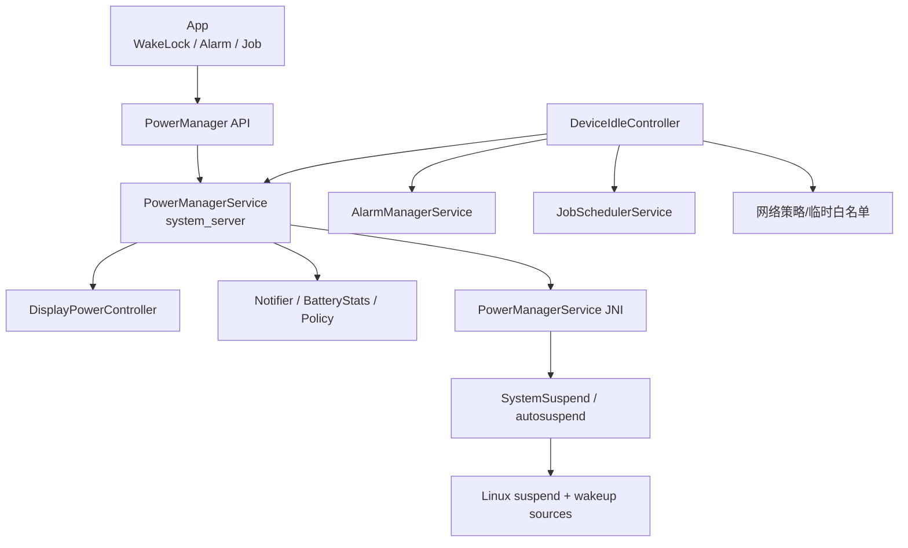
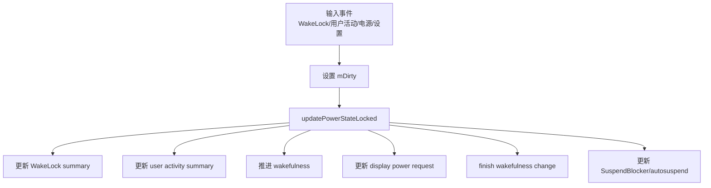
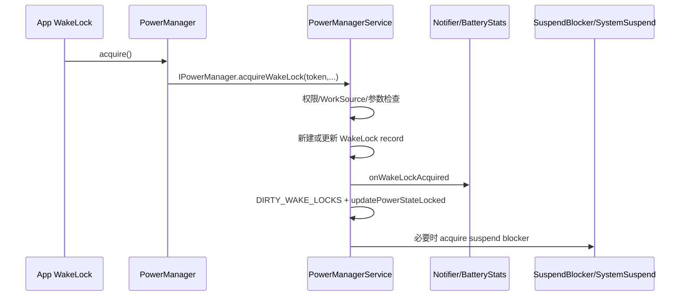
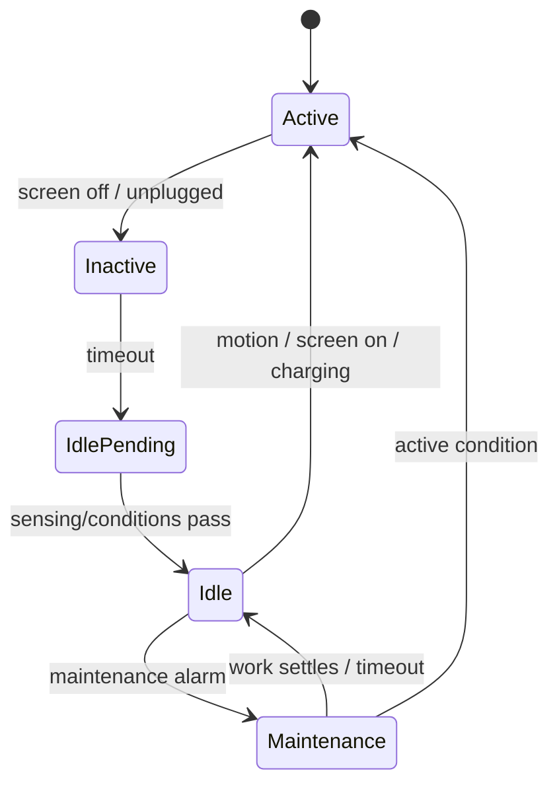

# 25 Android 电源管理、WakeLock 与 Doze

> 源码版本：Android 11 / API 30 / `android-11.0.0_r48`  
> 学习方式：macOS 只读源码，不要求编译或真机强制进入 Doze。  
> 前置章节：[06-SystemServer与系统服务](./06-SystemServer与系统服务.md)、[15-AMS进程管理与LMKD](./15-AMS进程管理与LMKD.md)、[24-Android网络栈ConnectivityService与NetworkAgent](./24-Android网络栈ConnectivityService与NetworkAgent.md)

---

## 1. “省电”不是一个开关

Android 电源管理至少包含四个不同问题：

```text
交互/显示：屏幕何时亮、暗、灭？设备是否 interactive？
CPU suspend：没有工作时，内核能否进入系统挂起？
后台调度：Alarm、Job、网络何时允许批量执行？
应用待机：某个 App 长期不用时，怎样限制它？
```

它们互相关联，但不是同一个状态机。最常见误解是：

- 屏幕熄灭等于 CPU 已休眠。
- 持有 `PARTIAL_WAKE_LOCK` 会点亮屏幕。
- WakeLock 可以绕过 Doze 的网络和调度限制。
- Doze 等于省电模式 Battery Saver。
- `isInteractive()==false` 等于已进入 deep Doze。

本章目标是把这些概念拆开，再看它们怎样协作。

---

## 2. 总体架构



PowerManagerService（PMS，本章缩写）控制设备级电源状态；不要与 PackageManagerService 的 PMS 混淆。后文涉及包管理时会写全名。

---

## 3. 两个 PMS 如何避免混淆

```text
PowerManagerService：frameworks/base/services/core/java/com/android/server/power/
PackageManagerService：frameworks/base/services/core/java/com/android/server/pm/
```

阅读调用栈时看完整包名。本章 `PMS` 默认指 PowerManagerService。

---

## 4. 核心源码入口

```text
frameworks/base/core/java/android/os/PowerManager.java
frameworks/base/core/java/android/os/IPowerManager.aidl
frameworks/base/services/core/java/com/android/server/power/PowerManagerService.java
frameworks/base/services/core/java/com/android/server/power/Notifier.java
frameworks/base/services/core/java/com/android/server/display/DisplayPowerController.java
frameworks/base/services/core/jni/com_android_server_power_PowerManagerService.cpp
```

App 进程中的 `PowerManager` 通过 `IPowerManager` Binder 调用 system_server 的 PowerManagerService。

---

## 5. Wakefulness 是设备级状态

Android 11 常见 wakefulness：

```text
AWAKE      清醒、通常可交互
DREAMING   处于 dream/屏保状态
DOZING     显示进入低功耗 doze 语义，如 Ambient Display 相关
ASLEEP     睡眠状态
```

注意：这里的 `WAKEFULNESS_DOZING` 与 DeviceIdleController 的“Doze 设备空闲模式”不是同一个状态机。名字相似，是本章第一大陷阱。

---

## 6. interactive 与 screen on 不完全等价

`PowerManager.isInteractive()` 表示设备是否处于可与用户交互的电源状态。显示硬件仍可能处于过渡、AOD 或被 proximity 控制。

```text
旧 isScreenOn() → 已废弃
现代语义 → isInteractive() + 具体 Display 状态
```

不要用单一布尔值描述所有显示和 CPU 状态。

---

## 7. wakeUp、goToSleep、nap

PowerManagerService 内部主入口：

```text
wakeUpNoUpdateLocked()
goToSleepNoUpdateLocked()
napNoUpdateLocked()
setWakefulnessLocked()
updatePowerStateLocked()
```

带 `NoUpdateLocked` 的方法通常只在锁内修改关键状态并设置 dirty bit，外层再统一调用 `updatePowerStateLocked()` 完成派生更新。这能避免状态改变一半就向外发布。

---

## 8. dirty bit 模型

PowerManagerService 用 `mDirty` 记录哪些输入变化：

```text
DIRTY_WAKE_LOCKS
DIRTY_WAKEFULNESS
DIRTY_USER_ACTIVITY
DIRTY_SETTINGS
DIRTY_IS_POWERED
DIRTY_BATTERY_STATE
DIRTY_PROXIMITY_POSITIVE
DIRTY_ACTUAL_DISPLAY_POWER_STATE_UPDATED
...
```

它不是磁盘 dirty page，而是“电源状态哪些方面需要重新计算”的位图。

---

## 9. updatePowerStateLocked 是收敛中心

简化结构：



阅读这个大方法不要逐行背。先标出每一步消费哪些 dirty bit、可能产生哪些新 dirty bit，以及循环何时收敛。

对照 Android 11 源码可按 phase 记忆：Phase 0 更新供电、stay-on 和亮度 boost；Phase 1 循环计算 WakeLock、用户活动、attentive 与 wakefulness，直到不再产生新的 wakefulness 变化；Phase 2 更新 profile timeout；Phase 3 请求显示状态；Phase 4 更新 dream；Phase 5 完成通知；Phase 6 最后处理 SuspendBlocker。最后才可能释放最终 blocker，是为了保证前面的状态和通知准备已完成。

---

## 10. 用户活动怎样影响熄屏

按键、触摸等会形成 user activity，更新最后活动时间。PMS 根据：

- screen-off timeout。
- sleep timeout/attentive timeout。
- 当前 wakefulness。
- WakeLock summary。
- stay-on、电源连接、管理员策略。

计算 `mUserActivitySummary`，安排下一次超时。到期后可能从 bright → dim → asleep，而不是一次直接关屏。

---

## 11. 显示控制为什么交给 DisplayPowerController

PowerManagerService 决定目标策略，`DisplayPowerController` 负责更具体的显示状态与亮度流程：

```text
PowerManagerService
 → DisplayManagerInternal.requestPowerState
 → DisplayPowerController
 → 亮度、proximity、动画、Display state
 → 回调 display ready
```

wakefulness 改变并不意味着屏幕硬件瞬时完成；PMS 会等待 display ready 后完成部分状态切换。

---

## 12. Notifier 的作用

源码：

```text
frameworks/base/services/core/java/com/android/server/power/Notifier.java
```

Notifier 把内部电源变化通知给其他子系统，例如：

- BatteryStats 记录 WakeLock/交互状态。
- ActivityManager/UserActivity 相关协作。
- WindowManagerPolicy 的唤醒/睡眠通知。
- 屏幕 on/off 广播的有序发送。
- AppOps 对 WakeLock 使用的记录。

PMS 不应在全局锁内直接做所有外部 Binder/广播工作，Notifier 也承担异步化与顺序协调。

---

## 13. WakeLock 到底锁住什么

WakeLock 是对系统表达“某项工作期间需要保持某种电源条件”的引用计数资源。最重要的是：

```text
PARTIAL_WAKE_LOCK：让 CPU 保持运行；不会自动点亮屏幕
显示类 WakeLock：历史 API，控制屏幕相关状态，现代应用不推荐依赖
```

WakeLock 不是线程锁，不保护 Java 临界区，也不会让进程永不被杀。

---

## 14. PARTIAL_WAKE_LOCK 的典型用途

适合必须在屏幕灭后短时间完成、且系统调度组件没有替你持锁的工作，例如某些底层播放/传输实现。

```java
PowerManager.WakeLock wl = powerManager.newWakeLock(
        PowerManager.PARTIAL_WAKE_LOCK, "Example:sync");
wl.acquire(30_000L);
try {
    doBoundedWork();
} finally {
    if (wl.isHeld()) wl.release();
}
```

超时是最后保险，不替代 `finally`。它只表示“到点后系统替这次 acquire 发起 release”，不表示 `doBoundedWork()` 已完成。多个重叠任务共用同一个 WakeLock 时，timeout、引用计数和手动 release 还可能相互干扰，因此要为 owner 和最大执行时间建立明确模型。实际业务优先考虑 WorkManager/JobScheduler/前台服务等生命周期正确的机制。

---

## 15. acquire 调用链



客户端传入 Binder token。进程死亡时 token death recipient 可帮助系统清理锁，仍不能替代应用正确 release。

---

## 16. release 调用链

```text
WakeLock.release()
 → IPowerManager.releaseWakeLock(token, flags)
 → 查找相同 Binder token 的 WakeLock record
 → 移除/更新记录
 → 通知 BatteryStats/AppOps
 → DIRTY_WAKE_LOCKS
 → updatePowerStateLocked
 → 若已无 CPU 需求，释放 WakeLock SuspendBlocker
```

release 只是撤销“阻止挂起”的理由；系统是否立即 suspend 还取决于 display blocker、其他锁、内核 wakeup source 和 autosuspend 条件。

---

## 17. 引用计数与 setReferenceCounted

WakeLock 默认引用计数：

```text
acquire 两次 → 需要 release 两次
```

`setReferenceCounted(false)` 后，多次 acquire 只表示 held，第一次 release 就释放。非引用计数更简单但容易让不同调用路径互相提前释放；引用计数则容易因不平衡永久持锁。最好为每段工作建立清晰 owner。

---

## 18. WakeLock level 与 flags

`PowerManager.java` 中 level 在低位，flags 可叠加：

```text
PARTIAL_WAKE_LOCK
SCREEN_DIM_WAKE_LOCK / SCREEN_BRIGHT_WAKE_LOCK / FULL_WAKE_LOCK（历史、已废弃方向）
PROXIMITY_SCREEN_OFF_WAKE_LOCK
DOZE_WAKE_LOCK / DRAW_WAKE_LOCK（系统内部）
ACQUIRE_CAUSES_WAKEUP
ON_AFTER_RELEASE
```

API 文档明确说 `ACQUIRE_CAUSES_WAKEUP` 不能与 `PARTIAL_WAKE_LOCK` 搭配；Android 11 的 `PowerManager.validateWakeLockParameters()` 却只校验 level 是否属于合法集合，并不会因这个 flag 组合直接抛异常。服务端 `applyWakeLockFlagsOnAcquireLocked()` 还要满足 `isScreenLock(wakeLock)` 才真正执行 wake-up，所以把该 flag 塞给 PARTIAL 在这一版不会获得“持 CPU 锁同时点亮屏幕”的效果。这里应以 API 合同选择正确的屏幕/通知方案，不能把“构造时没报错”误读为受支持组合。

---

## 19. 为什么现代 App 不应用屏幕 WakeLock

需要界面保持亮时通常用 Window flag，例如 `FLAG_KEEP_SCREEN_ON`；需要唤醒界面应使用与通知、Activity 可见性和平台政策相符的 API。历史 FULL/SCREEN WakeLock 粗暴影响全局显示，权限和行为也更难推理。

---

## 20. WorkSource：电量归因不是权限转让

系统服务可能代表客户端持 WakeLock。`WorkSource` 用于把耗电归因到真正受益/发起的 UID 或 WorkChain：

```text
system_server 持有锁
≠ 电量一定记到 system_server
```

设置 WorkSource 需要相应权限。它改变统计归因，不会把调用者的 Android 权限或 SELinux domain 转给服务。

---

## 21. WakeLock 权限与 AppOps

普通 WakeLock 使用需要 `android.permission.WAKE_LOCK`。PowerManagerService 在 Binder 入口检查权限、包名/UID、WorkSource 等；Notifier/AppOps/BatteryStats 记录使用。

“拥有 WAKE_LOCK permission”只表示可请求，系统仍可根据 level、状态、disabled policy 等影响其有效 summary。

---

## 22. WakeLock record 与 summary

PMS 保存每个锁的 token、flags、tag、uid/pid、WorkSource 等。`updateWakeLockSummaryLocked()` 把多个具体锁归纳为：

```text
WAKE_LOCK_CPU
WAKE_LOCK_SCREEN_BRIGHT/DIM
WAKE_LOCK_BUTTON_BRIGHT
WAKE_LOCK_PROXIMITY_SCREEN_OFF
WAKE_LOCK_DOZE
WAKE_LOCK_DRAW
```

后续状态机消费 summary，而不是每一步都重新理解每个 App tag。

---

## 23. disabled WakeLock 不等于 record 消失

系统可因 cached UID、device idle、低电量等策略将部分 WakeLock 标记为 disabled。记录仍存在，便于状态恢复和统计，但不再贡献有效 power summary。

排查“dumpsys 里看得到锁但 CPU 仍睡”时，要看 enabled/disabled 及 summary，而不只看列表中有没有 tag。

---

## 24. SuspendBlocker 是 Framework 到 suspend 的桥

PowerManagerService 内有典型 blocker：

```text
PowerManagerService.WakeLocks
PowerManagerService.Display
PowerManagerService.Broadcasts（由 Notifier 等使用）
```

`updateSuspendBlockerLocked()` 根据 CPU WakeLock summary、显示是否 ready、proximity 等决定 acquire/release。SuspendBlocker 是 system_server 内部资源；App 直接持有的是 Framework WakeLock。

---

## 25. 底层 SystemSuspend

本工程 Android 11 路径：

```text
frameworks/base/services/core/jni/com_android_server_power_PowerManagerService.cpp
system/hardware/interfaces/suspend/1.0/default/SystemSuspend.cpp
system/hardware/interfaces/suspend/1.0/default/SuspendControlService.cpp
system/core/libsuspend/
```

Framework native 层同 system suspend 服务协作，最终控制 autosuspend/wakeup source。设备 kernel 与 vendor 实现可能不同，不能把 Java WakeLock 直接等同于某一个固定 `/sys/power/...` 写操作。

---

## 26. autosuspend 的正确理解

```text
允许 autosuspend
≠ 立刻成功 suspend
```

内核还要确认没有活跃 wakeup source，处理 wakeup_count 竞态，并可能刚睡下就被中断唤醒。Framework 的 blocker 只是“不允许进入”或“允许尝试”的重要条件。

---

## 27. 唤醒源与 WakeLock 的区别

```text
Framework WakeLock：App/系统组件通过 Binder 表达 CPU/显示需求
kernel wakeup source：驱动/内核阻止 suspend 或记录唤醒事件
```

两层有关联但不是一对一。一个硬件中断可唤醒系统，却没有同名 App WakeLock；某个 Framework WakeLock 最终由聚合的 suspend blocker 表达到底层。

---

## 28. DeviceIdle/Doze 是后台策略状态机

源码路径（Android 11 本工程）：

```text
frameworks/base/apex/jobscheduler/service/java/com/android/server/DeviceIdleController.java
frameworks/base/apex/jobscheduler/framework/java/android/os/IDeviceIdleController.aidl
```

它观察屏幕、充电、运动等条件，进入 light/deep idle，并协调 Alarm、Job、网络和白名单。它不是 PowerManagerService wakefulness 的别名。

---

## 29. Deep Doze 的简化条件

经典模型：

```text
设备未充电
 + 屏幕关闭/不交互
 + 静止一段时间
 → inactive
 → idle pending / sensing / locating（具体版本和传感器能力相关）
 → idle
```

Android 11 具体状态和超时由常量、配置及设备能力决定。源码学习重点是状态转移条件，不要死记分钟数。

---

## 30. Deep idle 状态机

常见状态：

```text
ACTIVE
INACTIVE
IDLE_PENDING
SENSING
LOCATING
IDLE
IDLE_MAINTENANCE
QUICK_DOZE_DELAY（版本路径相关）
```

`stepIdleStateLocked(reason)` 推进状态；运动、充电、屏幕交互等事件可调用 `becomeActiveLocked()` 退出。

---

## 31. Light Doze 是另一条状态机

Light idle 更早、更轻地限制后台，通常不必等待设备静止。常见状态：

```text
LIGHT_STATE_ACTIVE
LIGHT_STATE_INACTIVE
LIGHT_STATE_PRE_IDLE
LIGHT_STATE_IDLE
LIGHT_STATE_WAITING_FOR_NETWORK
LIGHT_STATE_IDLE_MAINTENANCE
LIGHT_STATE_OVERRIDE
```

Deep 与 Light 状态可能相互影响；看到 `mState` 和 `mLightState` 时不要以为重复变量。

---

## 32. Idle 与 Maintenance 的节奏



进入 idle 后并非后台永远冻结。系统周期性打开 maintenance window，让积压的 Alarm、Job、网络工作批量执行，然后再次 idle。间隔通常逐步增长。

---

## 33. Doze 对后台能力的典型影响

Deep idle 期间通常会限制：

- 普通后台网络访问。
- 普通 Alarm 的准时触发。
- JobScheduler 作业运行。
- sync 等后台工作。
- 部分 WakeLock 的有效性/进程行为。

高优先级推送、闹钟类 exact alarm、临时白名单等有受控例外。具体行为受版本和 API 合同约束。

---

## 34. WakeLock 不能让网络绕过 Doze

这是关键结论：

```text
PARTIAL_WAKE_LOCK 解决“CPU 能否继续运行”
Doze 网络策略解决“后台 UID 能否使用网络”
```

即使 App 持锁，网络仍可能被限制；反过来在 maintenance window 网络开放时，任务执行框架可能替你处理必要的 CPU 保持。不要用长 WakeLock 对抗调度策略。

---

## 35. DeviceIdleController 怎样通知系统

状态变化会更新/通知：

- PowerManagerInternal 的 device idle mode。
- NetworkPolicyManagerInternal 的 idle 网络规则。
- AlarmManagerInternal 的 idle 状态与白名单。
- BatteryStats 统计。
- 广播与约束控制器。
- JobScheduler 的 idle/白名单约束。

DeviceIdleController 做策略编排，不亲自拦截每一个 socket 或执行每一个 Job。

---

## 36. Doze 白名单

大致分为：

```text
系统/用户永久 allowlist
except-idle allowlist（只豁免部分 idle 限制）
临时 allowlist（特定事件后短时开放）
```

白名单不是“完全不受任何后台限制”。Alarm、Job、网络、前台服务等各自消费不同白名单/状态，豁免范围必须看具体调用链。

---

## 37. 临时白名单的安全意义

高优先级消息等受控事件可让目标 UID 在有限时间内执行必要工作。设计目标是：

```text
给一次事件足够完成短工作
而不是让 App 永久退出省电模型
```

服务端必须控制谁能添加、添加哪个 UID、持续多久和原因；普通 App 不能任意把自己永久加入。

---

## 38. AlarmManager 与 Doze

源码：

```text
frameworks/base/services/core/java/com/android/server/AlarmManagerService.java
```

普通 Alarm 在 idle 中可能延迟到 maintenance window。特殊 API：

```text
setAndAllowWhileIdle
setExactAndAllowWhileIdle
setAlarmClock
```

它们仍受权限、频率限制和版本政策约束。“allow while idle”不等于可无限高频唤醒设备。

---

## 39. Alarm 怎样唤醒设备

```text
wakeup alarm 到期
 → kernel alarm/RTC 唤醒
 → AlarmManagerService 分发
 → 分发期间持内部 WakeLock
 → Receiver/PendingIntent 执行并完成
 → 内部 WakeLock 可释放
```

如果应用在 Receiver 里启动异步线程后立即返回，系统为 Alarm 分发持的锁不保证覆盖你的无限异步工作。应转交 Job/WorkManager/前台服务等合适机制。

---

## 40. JobScheduler 与 Doze

Android 11 路径：

```text
frameworks/base/apex/jobscheduler/service/java/com/android/server/job/JobSchedulerService.java
frameworks/base/apex/jobscheduler/service/java/com/android/server/job/controllers/
```

Job 用约束表达“何时适合运行”：网络、充电、idle、存储、电量、时间窗口。DeviceIdle/Background/Connectivity 等 controller 更新约束，只有满足调度策略的 Job 才进入执行。

---

## 41. Job 的 idle constraint 与 Device Doze 不同

`JobInfo.Builder.setRequiresDeviceIdle(true)` 是“只在设备空闲时运行”的作业约束，常用于维护工作；Doze 则是限制大多数后台活动的系统模式。一个 Job 要求 idle，不代表所有 Doze 期间都立即可运行，它仍需调度窗口和其他约束满足。

---

## 42. WorkManager 在哪一层

WorkManager 是 AndroidX 应用层任务编排库，不是 AOSP Framework 的 PowerManagerService。它通常选择 JobScheduler 等底层机制，在进程重启、约束、重试方面提供更高层抽象。

```text
WakeLock：低层、短期 CPU 保持
JobScheduler：系统约束调度
WorkManager：应用持久工作抽象
```

不要把三者当成可互换的“后台线程 API”。

---

## 43. Battery Saver 与 Doze 的区别

```text
Battery Saver：通常由低电量/用户开启，设备使用中也可生效
Doze/Device Idle：主要围绕设备不活跃时批处理后台工作
App Standby：围绕单个 App 的使用活跃度
```

它们可同时生效。PowerManagerService 有 battery saver policy/state，DeviceIdleController 管 idle 状态，UsageStats/AppStandby 参与应用级限制。

---

## 44. Low Power Standby 不属于 Android 11 本章主线

较新 Android 文档中会出现 Low Power Standby。它不是本工程 Android 11 的核心行为。阅读网上资料时先确认平台版本，避免把新版本 API 和状态直接套到 r48 源码。

---

## 45. App Standby Buckets

系统依据使用情况把 App 归入 active、working set、frequent、rare 等 bucket（版本还可能有 restricted）。bucket 会影响 Job、Alarm、网络等配额。

App Standby 是“这个 App 多久没用”的维度；Device Idle 是“整台设备是否长期不活跃”的维度。

---

## 46. 前台服务与电源

前台服务提升进程重要性并向用户展示持续通知，但：

- 不自动持有 PARTIAL_WAKE_LOCK。
- 不保证网络永远可用。
- 不豁免所有 Battery Saver/Doze/后台启动规则。
- 服务类型、启动时机和权限仍受平台政策控制。

需要 CPU 持续执行时仍要由对应子系统/短 WakeLock 保证，并严格管理生命周期。

---

## 47. 媒体播放为什么常看不到 App 自己持锁

MediaPlayer/Audio 等系统组件可能提供 `setWakeMode()` 或在服务层代持锁，并通过 WorkSource 做归因。分析耗电时要跨进程看 tag、owner UID、WorkSource，而不是只搜索 App 代码里的 `newWakeLock()`。

---

## 48. WakeLock 泄漏的典型路径

```text
异常提前 return
callback 永不回来
超时/取消路径漏 release
引用计数 acquire/release 不对称
对象 owner 已销毁但异步任务仍持锁
服务替客户端持锁，Binder death 未正确清理
```

修复原则是明确 owner、缩小持有区间、`try/finally`、设置合理 timeout，并让取消与失败共享释放路径。

---

## 49. 为什么锁持有时间不等于 CPU 活跃耗电

WakeLock 表示“禁止系统 suspend”，期间 CPU 仍可能进入较浅 idle，工作负载也可能为零。反之没有长期 App WakeLock，频繁 Alarm/网络/驱动唤醒也会造成高耗电。

诊断要结合：

```text
WakeLock duration
CPU time / scheduler activity
wakeup count/reason
Alarm/Job/网络批次
屏幕与无线电状态
```

---

## 50. BatteryStats 的角色

源码：

```text
frameworks/base/services/core/java/com/android/server/am/BatteryStatsService.java
frameworks/base/core/java/com/android/internal/os/BatteryStatsImpl.java
```

它记录 WakeLock、screen、radio、Job、Alarm 等事件并按 UID/WorkSource 归因。统计是对历史行为的建模，不是每次电源决策的唯一执行者。

---

## 51. 常见现象的分层定位

| 现象 | 优先检查 |
|---|---|
| 屏灭后任务立刻停 | 进程生命周期、CPU WakeLock、任务框架 |
| CPU 长时间不 suspend | Framework locks、kernel wakeup sources、display blocker |
| 有 WakeLock 但网络不通 | Doze/network policy/VPN/Connectivity |
| Alarm 晚很久 | idle batching、standby bucket、exact/allow-idle 类型 |
| Job 一直不执行 | constraints、quota、Doze、standby、scheduler pending reason |
| 屏幕不熄灭 | user activity、display WakeLock、Window flag、stay-on/proximity |
| 电量统计记错 App | WorkSource/WorkChain 归因 |

---

## 52. dumpsys power 应该看什么（只读参考）

以后连接设备时关注：

```text
mWakefulness / mWakefulnessChanging
mDirty
mWakeLockSummary
mUserActivitySummary
Wake Locks 列表及 disabled 状态
mHoldingWakeLockSuspendBlocker
mHoldingDisplaySuspendBlocker
Display Power 状态
```

不要只搜一个 WakeLock tag 就结束分析。

---

## 53. dumpsys deviceidle 应该看什么

```text
deep mState 与 light mLightState
screen/charging/motion 条件
next alarm/maintenance 时间
permanent/except-idle/temp whitelist
idle mode 是否真正启用
```

强制状态的 shell 命令会改变设备行为，本课程只记录阅读方向，不在 Mac 源码工程执行。

---

## 54. 源码路线一：WakeLock API 到 PMS

```text
frameworks/base/core/java/android/os/PowerManager.java
frameworks/base/core/java/android/os/IPowerManager.aidl
frameworks/base/services/core/java/com/android/server/power/PowerManagerService.java
frameworks/base/services/core/java/com/android/server/power/Notifier.java
```

练习：从 `WakeLock.acquire()` 追 token、Binder、record、dirty bit、summary、SuspendBlocker；再从 release 反向走一遍。

---

## 55. 源码路线二：wakefulness 与显示

```text
frameworks/base/services/core/java/com/android/server/power/PowerManagerService.java
frameworks/base/services/core/java/com/android/server/display/DisplayPowerController.java
frameworks/base/services/core/java/com/android/server/policy/PhoneWindowManager.java
```

练习：选择电源键睡眠或 user-activity timeout，追到 `goToSleepNoUpdateLocked()`、display request 和 display ready。

---

## 56. 源码路线三：Framework 到 suspend

```text
frameworks/base/services/core/jni/com_android_server_power_PowerManagerService.cpp
system/hardware/interfaces/suspend/1.0/default/SystemSuspend.cpp
system/hardware/interfaces/suspend/1.0/default/SuspendControlService.cpp
system/core/libsuspend/autosuspend.c
system/core/libsuspend/autosuspend_wakeup_count.cpp
```

练习：解释 acquire/release SuspendBlocker 如何影响 autosuspend，并标出 Framework blocker 与 kernel wakeup source 的区别。

---

## 57. 源码路线四：Device Idle

```text
frameworks/base/apex/jobscheduler/service/java/com/android/server/DeviceIdleController.java
frameworks/base/apex/jobscheduler/framework/java/android/os/IDeviceIdleController.aidl
frameworks/base/services/core/java/com/android/server/AlarmManagerService.java
frameworks/base/apex/jobscheduler/service/java/com/android/server/job/JobSchedulerService.java
frameworks/base/apex/jobscheduler/service/java/com/android/server/job/controllers/
```

练习：分别画 deep/light 状态机，再找进入 idle 和 maintenance 时通知 Alarm、Job、网络策略的代码。

---

## 58. 推荐八组只读练习

1. **状态辨析**：区分 wakefulness dozing 与 Device Idle Doze。
2. **WakeLock**：从 acquire 到 suspend blocker 画调用链。
3. **dirty 收敛**：选 DIRTY_WAKE_LOCKS，追 updatePowerStateLocked 消费路径。
4. **显示**：从 user activity timeout 追屏幕关闭。
5. **底层 suspend**：区分 Framework lock、SuspendBlocker、kernel wakeup source。
6. **Deep idle**：标注 ACTIVE 到 IDLE/MAINTENANCE 的条件和动作。
7. **任务协作**：比较 Alarm、Job 在 idle 中的行为。
8. **综合诊断**：为“屏灭后同步失败但持有 WakeLock”列出逐层证据。

---

## 59. 初学者最容易混淆的十二点

1. 屏幕灭不等于 CPU 已 suspend。
2. PARTIAL_WAKE_LOCK 不会点亮屏幕。
3. WakeLock 不是 Java 同步锁。
4. WakeLock 不保证进程不被杀。
5. WakeLock 不自动绕过 Doze 网络限制。
6. wakefulness DOZING 不等于 Device Idle deep Doze。
7. Device Idle 与 Battery Saver 不是一个模式。
8. Deep idle 与 Light idle 是两条状态机。
9. maintenance window 不代表退出 idle 永久恢复。
10. allow-while-idle Alarm 仍有频率约束。
11. 前台服务不自动持 CPU WakeLock。
12. SuspendBlocker 与 App WakeLock 不是一对一对象。

---

## 60. 自测题

1. wakefulness、display state、CPU suspend 三者为何不能互相推断？
2. `updatePowerStateLocked()` 为什么使用 dirty bit？
3. PARTIAL_WAKE_LOCK 最终怎样影响 autosuspend？
4. Binder token 对 WakeLock 生命周期有什么作用？
5. WorkSource 改变了权限还是耗电归因？
6. record 存在但 disabled 时意味着什么？
7. Deep/Light idle 的目标有何差异？
8. maintenance window 为什么能省电？
9. 有 WakeLock 时后台网络为何仍可能不可用？
10. allow-while-idle Alarm 为什么不能无限调用？
11. Job requires idle 与 Doze 是什么关系？
12. CPU 不休眠时为什么还要查 kernel wakeup source？

---

## 61. 自测答案

1. 它们分别描述交互抽象、显示硬件/策略状态和内核系统挂起，状态切换还有异步过程。
2. 多个输入在锁内统一标记，再按依赖顺序重新计算，避免发布半更新状态。
3. 锁贡献 `WAKE_LOCK_CPU` summary，使 PMS 持有 WakeLocks SuspendBlocker，从而不允许 autosuspend。
4. 它唯一标识客户端锁，并可通过 Binder death 协助清理进程死亡遗留状态。
5. 主要改变 BatteryStats/AppOps 的工作归因，不转让权限。
6. 系统保留锁记录和归因，但它当前不贡献有效 power summary。
7. Light 更早做轻量批处理；Deep 在更严格不活跃条件下施加更强限制。
8. 把零散唤醒集中处理，减少反复唤醒和无线电 tail energy。
9. CPU 保持与 UID 网络策略是不同层次，Doze 可继续限制网络。
10. 防止 App 用精确唤醒持续破坏设备空闲和电池目标。
11. 前者是 Job 的运行约束，后者是系统限制模式；仍要等待调度和全部约束满足。
12. Framework 已允许 suspend 后，驱动/硬件 wakeup source 仍可阻止或频繁唤醒。

---

## 62. 本章结论

用四句话记住完整关系：

```text
PowerManagerService 汇总用户活动、WakeLock、电源和显示需求。
PARTIAL_WAKE_LOCK 通过 summary 与 SuspendBlocker 阻止 CPU 系统挂起。
DeviceIdleController 在设备不活跃时限制后台网络、Alarm、Job，并周期开放维护窗口。
Battery Saver、App Standby、前台服务又是相邻但独立的策略维度。
```

分析问题时依次问：

```text
设备 wakefulness/display 是什么？
谁持有哪些有效 WakeLock，归因给谁？
Framework 是否允许 autosuspend，内核又为何醒着？
Device Idle/Battery Saver/App Standby 是否限制这项后台工作？
Alarm/Job/网络使用的是哪种受控例外？
```

这样才能把“屏幕”“CPU”“后台调度”“单个 App 策略”放回各自正确的源码层次。
