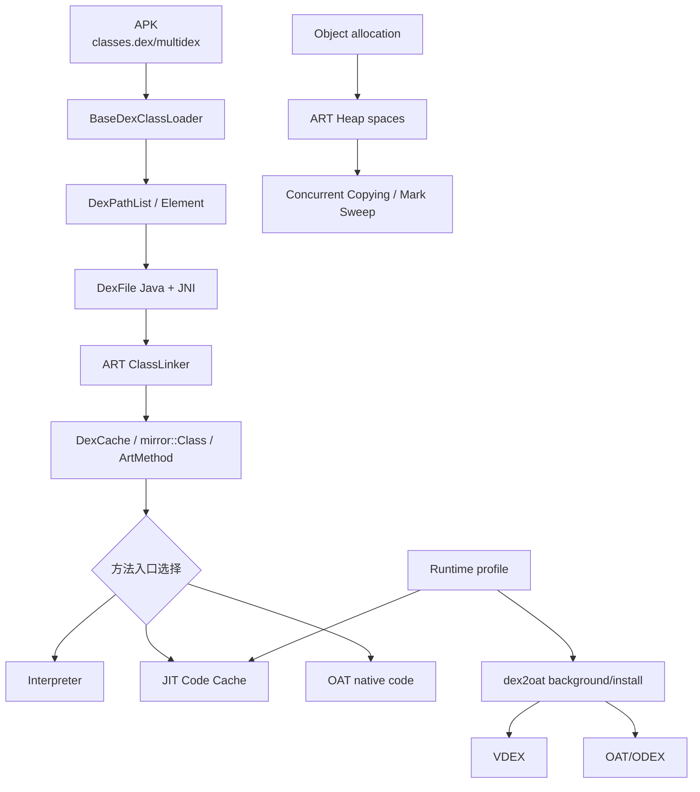
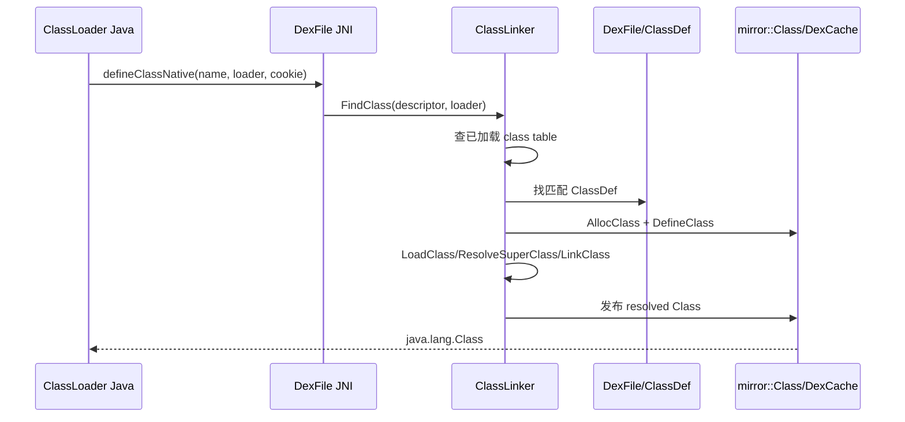
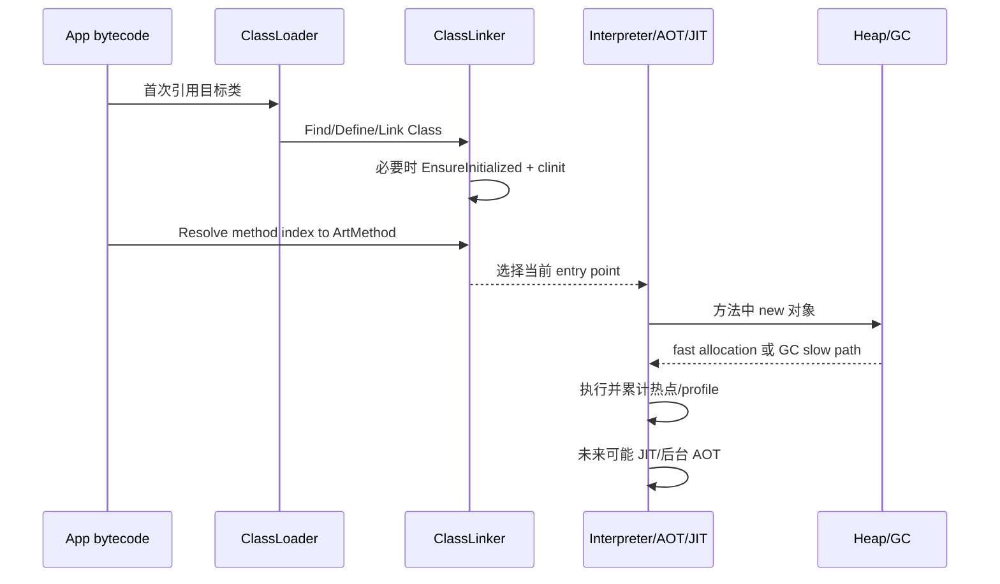

# 26 ART、ClassLoader、DEX 优化与垃圾回收

> 源码版本：Android 11 / API 30 / `android-11.0.0_r48`  
> 学习方式：macOS 只读源码，不要求运行 dex2oat 或编译 ART。  
> 前置章节：[05-Zygote启动与应用孵化](./05-Zygote启动与应用孵化.md)、[10-Activity启动流程之目标进程与生命周期](./10-Activity启动流程之目标进程与生命周期.md)、[15-AMS进程管理与LMKD](./15-AMS进程管理与LMKD.md)

---

## 1. 本章先拆成四条线

```text
类加载：ClassLoader 去哪里找 class，ART 如何定义/链接/初始化类？
代码执行：DEX 字节码由解释器、JIT 还是 AOT 机器码执行？
DEX 优化：安装/后台优化为什么产生 VDEX/OAT/ODEX，profile 做什么？
内存回收：对象在哪分配，GC 如何找到存活对象、移动对象并暂停线程？
```

四条线会相交，但不能互相替代。常见误解包括：

- APK 中有 `classes.dex`，运行时就只解释执行。
- AOT 与 JIT 二选一，一个进程只能选一种。
- `PathClassLoader` 自己解析 DEX 字节码。
- 类被 load 后一定执行了 `<clinit>`。
- GC 并发就完全没有 Stop-The-World。
- GC 能解决 native 内存、线程、Bitmap 等所有内存问题。

---

## 2. 总体架构



---

## 3. ART 在哪里

核心目录：

```text
art/runtime/       运行时、类链接、线程、堆、解释器、JIT 管理
art/compiler/      优化编译器、JIT compiler
art/dex2oat/       dex2oat 命令与 AOT 编译驱动
art/libdexfile/    DEX 文件解析
art/runtime/gc/    heap、space、collector、accounting
libcore/           Java 核心库和 dalvik.system Java API
```

ART 不只是“虚拟机可执行文件”，而是一组随进程加载的 runtime、编译器工具、格式和系统协作机制。

---

## 4. 从 Java 源码到 DEX

简化构建链：

```text
.java/.kt
 → javac/kotlinc 生成 JVM .class
 → D8/R8 转换、desugar、可选 shrink/optimize
 → classes.dex / classes2.dex ...
 → 打包进 APK
```

DEX 使用寄存器式指令和自己的 type/method/field/string tables，不是 JVM class 文件的简单压缩包。ART 执行 DEX 语义，但可把热点或预选方法编译为目标 CPU 机器码。

---

## 5. DEX 的重要结构

一份 DexFile 大致包含：

```text
header
string_ids / type_ids / proto_ids
field_ids / method_ids
class_defs
data section：code_item、class_data、annotations、debug info...
```

指令里的 method/type index 会经 DexCache 解析到运行时对象。理解“解析”就是理解如何把文件中的索引变为可直接使用的 `Class`、`ArtMethod` 等对象。

---

## 6. Boot Class Path 与应用类路径

```text
BootClassLoader：核心 Java/Android 类，通常由 ART 特殊处理，Java 对象可显示为 null parent 语义
PathClassLoader：已安装 App 的 APK/DEX 与 native library 路径
DexClassLoader：可从额外 dex/jar/apk 路径加载，历史上强调优化输出目录
InMemoryDexClassLoader：从内存 ByteBuffer 加载 DEX
```

系统还可能有 shared library class loader、DelegateLastClassLoader 等。不能只背“三层 ClassLoader”覆盖所有 Android 11 情形。

---

## 7. 双亲委派的基本流程

`java.lang.ClassLoader.loadClass()` 的经典思想：

```text
检查是否已经加载
 → 让 parent 尝试
 → parent 找不到时调用自己的 findClass
```

它减少核心类被应用重复定义，并保证同一 loader namespace 的一致性。但 Android 还支持 delegate-last 等特殊顺序，shared libraries 也会参与搜索；“永远 parent-first”不是绝对规律。

---

## 8. BaseDexClassLoader 的 Java 链路

源码：

```text
libcore/ojluni/src/main/java/java/lang/ClassLoader.java
libcore/dalvik/src/main/java/dalvik/system/BaseDexClassLoader.java
libcore/dalvik/src/main/java/dalvik/system/DexPathList.java
libcore/dalvik/src/main/java/dalvik/system/DexFile.java
```

应用类查找简化为：

```text
ClassLoader.loadClass
 → BaseDexClassLoader.findClass
 → DexPathList.findClass
 → 依次遍历 dexElements
 → Element.findClass
 → DexFile.loadClassBinaryName
 → DexFile.defineClassNative
```

Java 层负责路径、元素与委派；真正类定义进入 ART native。

---

## 9. DexPathList 与 dexElements

`DexPathList` 把 dexPath 拆成按顺序搜索的 `Element[]`。每个 Element 可能关联目录、zip/APK 或 DexFile。类冲突时，搜索顺序决定哪一个定义先被找到。

这也是热修复框架历史上修改 `dexElements` 顺序的出发点，但反射修改内部字段依赖隐藏实现，存在版本、安全和类已加载不可替换等风险，不是稳定公开接口。

---

## 10. 类身份不只由类名决定

运行时类型身份近似是：

```text
binary class name + defining ClassLoader
```

两个 loader 各自加载 `com.example.Model`，它们可成为两个不兼容类型，强转出现 `ClassCastException`，即使源码和字节完全相同。

因此插件化问题经常不是“找不到类”，而是 API 接口被不同 loader 各加载一份。

---

## 11. load、link、initialize 要分开

```text
Loading：找到字节并创建 Class 运行时表示
Linking：verification、preparation、resolution（解析可按需发生）
Initialization：执行静态字段初始化和 <clinit>
```

`ClassLoader.loadClass(name)` 通常不强制初始化；`Class.forName(name)` 的常用重载会初始化。读取编译期常量也可能不触发目标类初始化。

---

## 12. DexFile Java 到 ART native

`DexFile.defineClassNative()` 的 native 注册/实现可从：

```text
art/runtime/native/dalvik_system_DexFile.cc
art/runtime/class_linker.cc
```

继续追到 `ClassLinker::FindClass()`、`DefineClass()`、`LoadClass()`、`EnsureInitialized()`。不要把 `DexFile.java` 当成 DEX 解析终点。

---

## 13. ClassLinker 的职责

ClassLinker 维护和协调：

- boot/app class path 查找。
- class table 与已加载类。
- Class、DexCache、ClassLoader 关联。
- 字段/方法解析。
- superclass/interface 链接。
- verification 状态。
- 类初始化与并发等待。
- OAT/Dex 中已有元数据的利用。

它是“类生命周期和引用解析中心”，不只是名字查找器。

---

## 14. 一次定义类的简化链



真实代码还要处理数组类、错误状态、并发定义、verification、temporary class、事务和异常。

---

## 15. 类初始化为什么需要锁和状态

多个线程可能同时首次使用一个类。ART 必须保证 `<clinit>` 至多按规范执行一次：

```text
线程 A 抢到初始化权 → INITIALIZING
线程 B 发现正在初始化 → 等待
A 成功 → INITIALIZED，唤醒等待者
A 抛异常 → ERROR，后续使用收到初始化错误
```

初始化父类、接口默认方法与递归引用还会让流程更复杂。静态初始化中做阻塞 I/O 或互锁很容易制造启动卡顿和死锁。

---

## 16. ArtMethod 是什么

ART 为方法维护 `ArtMethod` 运行时结构，包含声明类、访问标志、Dex 索引/代码信息和 entry point 等。调用时入口可能指向：

```text
AOT compiled code
JIT compiled code
interpreter bridge
JNI trampoline
resolution/instrumentation stub
```

所以“这个 Java 方法在哪里执行”需要查看当时 entry point，而不是只看 APK 是否有 OAT 文件。

---

## 17. ART 的混合执行模型

Android 11 通常混合使用：

```text
Interpreter：直接执行 DEX 指令，启动快、无需先编译全部代码
JIT：运行时根据热点编译，利用真实类型/profile 信息
AOT：dex2oat 提前生成机器码，减少后续执行成本
```

同一进程、同一应用甚至同一方法在不同时间都可能经历不同执行形态。它们不是三个互斥“虚拟机模式”。

---

## 18. 解释器不是简单逐条 switch

ART 有 switch interpreter、mterp/汇编优化路径等版本实现，并使用 quickened 指令、inline cache、runtime stub。教学上可理解为“未进编译代码时执行 DEX 语义”，但不要由此推断每条指令都慢速 C++ switch。

源码入口：

```text
art/runtime/interpreter/
art/runtime/interpreter/interpreter.cc
art/runtime/interpreter/interpreter_switch_impl-inl.h
art/runtime/interpreter/mterp/
```

在 r48，`interpreter.cc` 会在编译期选择 switch-based 或 mterp 汇编实现；mterp 遇到不支持的指令、调试/访问检查等情形还会回落到 switch interpreter。`nterp` 的代码也已经位于同一子目录，但不能仅看见文件名就推断目标设备一定启用了它，具体还受 ISA、构建宏和运行时条件影响。

---

## 19. JIT 如何发现热点

源码：

```text
art/runtime/jit/jit.cc
art/compiler/jit/jit_compiler.cc
art/runtime/jit/jit_code_cache.cc
```

简化：

```text
解释/执行时采样或计数
 → 方法达到 warm/hot 阈值
 → 排入 JIT compilation
 → Optimizing compiler 生成机器码
 → 放入 JIT code cache
 → 更新调用入口/OSR 信息
```

阈值、采样和策略由 runtime options/设备配置决定，不应死记一个调用次数。

---

## 20. OSR：循环不用等方法重新进入

On-Stack Replacement 允许一个正在解释执行的长循环，在满足条件时跳进已编译代码。否则必须等整个方法返回、下次调用才享受 JIT，大循环会长期慢。

OSR 需要把解释器当前局部变量/寄存器状态映射到编译帧，因此比普通方法入口替换复杂。

---

## 21. JIT Code Cache

JIT 结果保存在进程私有 code cache，包含机器码和相关 metadata。它不是 APK 的永久修改：

- 进程退出，JIT 机器码消失。
- 热点 profile 可持久化，供以后 JIT/AOT 使用。
- code cache 有容量和回收策略。
- instrumentation/debugger 可让入口变化或 deoptimize。

---

## 22. Profile 是什么

runtime profile 记录应用实际使用信息，例如热点方法、启动时用到的类/方法。它帮助：

- JIT 判断热点。
- 后台 dexopt 的 `speed-profile` 选择值得 AOT 的代码。
- 布局优化，让启动常用内容更集中。

Profile 不是完整执行轨迹，也不包含用户业务数据的逐条日志。

---

## 23. Profile 从哪里到哪里

简化：

```text
App 运行 → ART 采集进程 profile
 → 写入 app profile 文件
 → installd/profile 管理合并 current/reference profile
 → 后台 dexopt 读取 profile
 → dex2oat speed-profile 编译热点
```

系统还要验证 profile 与 APK checksum/版本匹配。旧 APK profile 不能无条件套在新 DEX 上。

可以把 `current profile` 理解为各次运行仍在积累的近期观测，把 `reference profile` 理解为经过合并、供优化决策参考的稳定版本。二者保存的是类/方法使用摘要，不是两份机器码；真正的 JIT 机器码在进程 code cache，AOT 机器码在对应 OAT/ODEX 产物中。

---

## 24. AOT 与 dex2oat

源码：

```text
art/dex2oat/dex2oat.cc
art/dex2oat/driver/compiler_driver.cc
art/compiler/optimizing/
```

`dex2oat` 读取 DEX、compiler filter、profile、ISA、class loader context 等，执行验证/quickening/编译，产生 VDEX/OAT/ODEX 等产物。名字叫 dex2oat，不代表每次都把所有 DEX 方法编成机器码。

---

## 25. Compiler Filter

Android 11 常见：

| filter | 直观目标 |
|---|---|
| `verify` | 重点做验证，方法主要留给解释/JIT |
| `quicken` | 验证并做 Dex-to-Dex quickening，少量必要 stub |
| `speed-profile` | 根据 profile 编译热点代码 |
| `speed` | 尽可能面向性能编译更多代码 |
| `everything` | 更激进/完整的编译范围，代价更大 |

实际枚举及退化规则看 `art/runtime/compiler_filter.h`。filter 是策略目标，不保证所有方法都有机器码。

---

## 26. 为什么不在安装时全部 speed

全量 AOT 的代价：

- 安装/OTA 时间更长。
- 占用更多磁盘。
- 编译时缺少真实运行类型反馈。
- 大量冷代码永远不会运行。
- APK 更新后产物可能失效重做。

Android 的方向是安装快速可用，运行收集热点，设备空闲充电时按 profile 优化，在启动、吞吐、存储和电量间平衡。

---

## 27. APK、DEX、VDEX、OAT、ODEX 不要混

```text
APK：应用打包容器，通常包含原始 classes*.dex
DEX：字节码、类和元数据格式
VDEX：验证依赖、DEX/CompactDex、quickening 等版本相关内容
OAT：ART 编译产物容器，含编译代码/metadata，通常是 ELF 形式
ODEX：应用旁或 dalvik-cache 语境的优化产物命名，内容依版本
ART image：预初始化对象/类的堆映像，常与 boot/app image 相关
```

这些格式在 Android 版本间演进。不要用 Android 5 的文件布局解释 Android 11 的每个字段。

---

## 28. VDEX 不等于“只有验证结果”

名字来自 verified dex，但 Android 11 的 VDEX 可承载 Dex/CompactDex、verifier dependencies、quickening 信息等。具体内容受 compiler filter 和版本影响。

看到 `.vdex` 存在，只能说明有相关优化/验证产物，不能直接断言全部方法已 AOT。

---

## 29. OAT 如何被选择

运行时入口：

```text
art/runtime/oat_file_assistant.cc
art/runtime/oat_file_manager.cc
art/runtime/oat_file.cc
art/runtime/vdex_file.cc
```

OatFileAssistant 会综合：

- DEX checksum/位置。
- compiler filter 是否满足需求。
- boot image/checksum 与 ISA。
- class loader context。
- 文件可读性和版本。

判断已有产物能否使用、是否需要重新 dexopt。文件存在不等于有效。

---

## 30. ClassLoaderContext 为什么影响优化

AOT 编译时解析某个类/方法，取决于 class path 和 loader 顺序。运行时若使用不同 ClassLoaderContext，同名类可能指向别的定义，原优化假设不安全。

因此 dexopt 会记录/校验 loader context；插件、动态代码和错误上下文可能导致产物拒用或降级执行。

---

## 31. PackageDexOptimizer 的系统侧链路

源码：

```text
frameworks/base/services/core/java/com/android/server/pm/PackageDexOptimizer.java
frameworks/base/services/core/java/com/android/server/pm/dex/DexManager.java
frameworks/base/services/core/java/com/android/server/pm/BackgroundDexOptService.java
frameworks/native/cmds/installd/
```

简化：

```text
PMS/后台任务决定 package + reason + filter
 → PackageDexOptimizer
 → Installer Binder
 → installd dexopt
 → fork/exec dex2oat（带受控 fd、uid、路径、上下文）
 → 原子安装产物/更新状态
```

system_server 不直接用 Java 方法编译 DEX，installd 负责特权文件操作和进程执行边界。

---

## 32. 安装、首次启动、后台优化

一种常见生命周期：

```text
安装：按 install reason 使用较轻 filter，尽快可启动
首次/多次运行：解释器/JIT 执行并收集 profile
设备空闲且充电：BackgroundDexOptService 按 profile 优化
以后启动：更多热点可直接走 AOT，继续用 JIT 补充
更新 APK：checksum/context 变化，部分产物失效并重建
```

具体默认 filter 来自系统属性、PackageManager 编译映射和设备配置，不能把这一示意当所有 ROM 的固定值。

---

## 33. Secondary DEX

App 私有目录动态产生/加载的 secondary dex 不一定走主 APK 完全相同的优化路径。DexManager 会记录 dex usage、owner package、loader ISA/context，再安排 secondary dexopt。

动态代码加载增加供应链、完整性、ClassLoaderContext 和优化复杂度，应优先减少不必要使用。

---

## 34. Quickening 是什么

Dex-to-Dex quickening 用更直接的字段/方法访问信息替换部分符号引用，以减少运行时解析成本。它仍是 DEX 指令层优化，不等于生成 CPU 机器码。

```text
quicken ≠ JIT
quicken ≠ AOT native compilation
```

VDEX 保留 quickening 信息，以便验证、反 quicken 或更新流程正确处理。

---

## 35. Verification 做什么

字节码验证检查类型安全、寄存器使用、控制流、访问规则等，建立可安全执行/优化的前提。验证失败可能：

- 类加载抛 VerifyError。
- 某些情况降级为运行时验证/解释。
- 编译器跳过无法安全编译的方法。

验证不是应用签名验证；前者检查字节码语义，后者确认 APK 来源和完整性。

---

## 36. Deoptimization

已编译代码基于一些可验证假设做内联、去虚拟化等优化。当 debugger、instrumentation、类状态或运行时事件要求恢复更通用语义时，ART 可 deoptimize：

```text
compiled frame/state
 → reconstruct shadow/interpreter frames
 → 回到解释执行或较保守入口
```

所以 profiler/debugger 可能改变性能表现，编译代码也不是永久不可撤销。

---

## 37. 从 new 到对象分配

简化：

```text
new-instance DEX 指令/compiled allocation
 → 确保 Class 已解析/初始化条件满足
 → 尝试线程本地分配区 TLAB/Region
 → 设置对象 header/Class 指针
 → 必要时 slow path 进入 Heap
 → 空间不足触发/等待 GC 或扩堆
```

绝大多数小对象分配可非常快；“new 很慢”不能脱离逃逸、分配速率、GC 和对象生命周期讨论。

---

## 38. ART Heap 不是一整块连续列表

源码：

```text
art/runtime/gc/heap.cc
art/runtime/gc/space/
art/runtime/gc/accounting/
```

Heap 可包含：

- boot image/app image space。
- region space。
- malloc/rosalloc space。
- large object space。
- zygote space。
- non-moving space。

实际启用组合取决于 collector、进程、设备和运行阶段。

---

## 39. Zygote 与堆共享

Zygote 预加载类和资源后 fork App：

```text
Zygote image/预加载页
 → fork 后通过 copy-on-write 共享
 → App 写入某页才产生私有副本
```

因此预加载可减少总内存和启动成本，但 App 不应修改共享对象；运行时会区分 zygote/image 与应用分配空间。

---

## 40. GC 的根本问题

GC 要判断：

```text
从 GC Roots 出发还能到达哪些对象？
```

典型 roots：

- Java 线程栈与寄存器引用。
- JNI global/local references。
- static fields。
- ClassLoader/Class/DexCache 相关 roots。
- runtime 内部 handles。

不可达对象才有资格回收。循环引用只要整体不可达也能被 GC 回收。

---

## 41. Mark、Sweep、Compact、Copy

```text
Mark：从 roots 遍历并标记存活对象
Sweep：回收未标记对象占用的块
Compact：移动存活对象消除碎片
Copy：把存活对象复制到另一 region/space，同时完成压缩
```

不同 collector 组合这些阶段。移动对象时必须更新所有引用，并与并发运行的 mutator 协调。

---

## 42. Android 11 的 Concurrent Copying

源码：

```text
art/runtime/gc/collector/concurrent_copying.cc
art/runtime/gc/collector/concurrent_copying.h
```

CC 允许 GC 大部分工作与应用线程并发，并把存活对象复制/压缩。它使用 read barrier、region 状态和短暂停顿阶段维持“应用一边读写，GC 一边移动对象”的正确性。

“Concurrent”表示部分阶段并发，不表示零停顿。

---

## 43. Read Barrier 为什么需要

对象正在从 from-space 移到 to-space 时，应用线程可能仍持旧引用。read barrier 在读取引用时协助：

- 判断引用是否需要转发。
- 找到/创建 to-space 副本。
- 返回正确的新引用。
- 帮助并发 tracing。

Android 11 常见 Baker read barrier 利用对象/线程状态和编译器生成的 barrier 快速路径，绝不是每次读取都慢速 Binder/C++ 调用。

---

## 44. Stop-The-World 发生在哪里

GC 即使并发，也常在某些阶段暂停 mutator：

```text
切换/确认线程状态
扫描某些 roots
处理 checkpoint
完成关键 phase transition
```

停顿总时长受到线程到达 safepoint、持锁、native 临界区和调度影响。GC log 中总耗时与 paused time 必须分开看。

---

## 45. Thread suspension 与 safepoint

源码：

```text
art/runtime/thread_list.cc
art/runtime/thread.cc
art/runtime/suspend_reason.h
```

ART 不可在任意机器指令中粗暴移动线程栈引用。线程在 suspend check/checkpoint 等安全位置响应挂起，runtime 才能准确枚举 roots 或执行全局操作。

一个长时间不响应的线程会放大暂停，但原因未必是 GC 算法本身。

---

## 46. GC 触发原因

常见原因可包括：

- allocation failure / for alloc。
- concurrent threshold 达到。
- explicit `System.gc()`。
- native allocation pressure。
- background/collector transition。
- homogeneous space compact、zygote fork 等系统动作。

GC 日志中的 cause 和 collector type 要一起看。频繁 GC 往往是高分配速率或堆目标太紧，而不只是“堆满一次”。

---

## 47. Sticky、Partial、Full

传统 mark-sweep 路径可见：

```text
Sticky：关注自上次 GC 后的较新分配，范围小
Partial：回收部分可收集空间
Full：更广范围扫描/回收
```

在 Concurrent Copying 配置下日志分类和空间策略不同。不要仅凭“GC 类型名字”推断精确算法，要结合当前 collector 和 heap spaces。

---

## 48. Large Object Space

大对象可能进入专门 large object space，避免塞入普通小对象分配路径。大量短命大数组/Bitmap 会带来：

- LOS 扫描与回收压力。
- native/graphics 内存压力。
- 碎片和峰值内存。
- 更频繁 GC 或 OOM。

优化时先减少峰值和重复分配，而不是盲目调用 `System.gc()`。

---

## 49. Java heap 与 native heap

进程内存不只 ART managed heap：

```text
Java/ART heap
native malloc
thread stacks
JIT code cache
mapped DEX/OAT/VDEX/APK
graphics buffers
ashmem/memfd、Binder、共享库
```

`OutOfMemoryError` 的信息和分配路径决定是哪类资源失败。Java heap 看起来不大，进程 RSS/PSS 仍可很高。

---

## 50. JNI 引用导致的泄漏

JNI local ref 通常随 native frame 返回释放，但循环内大量创建可能需要 `DeleteLocalRef` 或 local frame；global ref 必须显式删除。global ref 是 GC root，会让 Java 对象一直可达。

Native 指针保存 Java 对象地址是错误的：moving GC 可移动对象，必须使用 JNI handle/ART 提供的受控引用。

---

## 51. ClassLoader 泄漏为什么严重

ClassLoader 通常强关联：

```text
已定义 Class
 → static fields
 → DexFile/DexCache
 → native libraries/resources
```

插件 loader 若被线程、ThreadLocal、单例、JNI global ref 持有，它加载的整批类和静态对象都难回收。一次小引用可保活整个 loader graph。

---

## 52. Finalizer 与 Reference

`finalize()` 执行不及时、不可预测，会延长对象生命周期并增加线程/队列压力；现代代码应使用显式 close、try-with-resources 或 Cleaner 等受控模式。

Soft/Weak/PhantomReference 有不同可达性语义，不应把 SoftReference 当可靠缓存容量策略。

---

## 53. GC 与 LMKD 的区别

```text
GC：进程内部回收不可达 Java 对象
LMKD：系统内存压力下终止整个低优先级进程
```

GC 无法回收仍可达对象和多数 native/共享资源；LMKD 也不分析哪个 Java 对象泄漏。第 15 章的 oom_adj/procState 与本章 managed heap 是不同层级。

---

## 54. 一次 Java 方法首次调用的完整链



“首次慢”可能来自类加载、验证、初始化、页面缺页、解释执行、JIT、I/O 中任意组合，不能都归咎于 GC。

---

## 55. 启动性能如何关联四条线

冷启动常同时发生：

- 映射 APK/DEX/OAT 和 page fault。
- 加载并初始化大量类。
- 执行解释/AOT/JIT 代码。
- 创建对象造成分配与首次 GC。
- 读取资源、Binder、磁盘 I/O。

优化方向是用 trace 证据找到主因：减少启动类和 `<clinit>` 工作、使用 baseline/runtime profile、降低同步 I/O 和分配峰值，而不是单独追求“所有代码 AOT”。

---

## 56. 常见诊断现象

| 现象 | 优先方向 |
|---|---|
| `ClassNotFoundException` | loader、dexElements、名称、ClassLoaderContext |
| `NoClassDefFoundError` | 定义/依赖/初始化失败，检查 cause |
| `VerifyError` | 字节码验证、版本/transform 错误 |
| `ClassCastException` 同名类 | defining ClassLoader 不同 |
| 首次调用慢、之后快 | 类初始化、page fault、JIT/inline cache |
| GC 很频繁但暂停短 | 分配速率、heap target、短命对象 |
| 单次 GC pause 很长 | roots、线程 safepoint、堆/collector phase |
| Java heap 小但 PSS 高 | native/graphics/mmap/code/stack |
| dexopt 反复发生 | checksum、filter、context、空间或产物有效性 |

二者最实用的区别是：主动调用 `loadClass()`/反射查找不到目标，常见 `ClassNotFoundException`；字节码执行过程中本应使用某类，但定义失败、依赖缺失，或该类先前 `<clinit>` 已失败，常见 `NoClassDefFoundError`。后者不一定表示 APK 中没有那个 dex 定义，必须沿最早的 `Caused by` 查第一次失败。

---

## 57. 源码路线一：ClassLoader 到 ClassLinker

```text
libcore/ojluni/src/main/java/java/lang/ClassLoader.java
libcore/dalvik/src/main/java/dalvik/system/BaseDexClassLoader.java
libcore/dalvik/src/main/java/dalvik/system/DexPathList.java
libcore/dalvik/src/main/java/dalvik/system/DexFile.java
art/runtime/native/dalvik_system_DexFile.cc
art/runtime/class_linker.cc
```

练习：从 `loadClass("x.Y")` 追到 `ClassLinker::FindClass()`，标出 Java/native 边界和 defining loader。

---

## 58. 源码路线二：执行与 JIT

```text
art/runtime/interpreter/
art/runtime/interpreter/interpreter.cc
art/runtime/interpreter/interpreter_switch_impl-inl.h
art/runtime/interpreter/mterp/
art/runtime/art_method.cc
art/runtime/jit/jit.cc
art/runtime/jit/jit_code_cache.cc
art/compiler/jit/jit_compiler.cc
art/compiler/optimizing/
```

练习：选择一个热点方法，画出解释执行、热点采集、JIT 入队、code cache 和入口切换。

---

## 59. 源码路线三：dexopt/AOT

```text
frameworks/base/services/core/java/com/android/server/pm/PackageDexOptimizer.java
frameworks/base/services/core/java/com/android/server/pm/BackgroundDexOptService.java
frameworks/base/services/core/java/com/android/server/pm/dex/DexManager.java
frameworks/native/cmds/installd/dexopt.cpp
art/dex2oat/dex2oat.cc
art/runtime/compiler_filter.h
art/runtime/oat_file_assistant.cc
```

练习：从一个 package 的 compilation reason/filter 追到 installd 和 dex2oat 参数，再解释产物为何可能失效。

---

## 60. 源码路线四：Heap 与 GC

```text
art/runtime/gc/heap.cc
art/runtime/gc/space/
art/runtime/gc/collector/concurrent_copying.cc
art/runtime/gc/collector/mark_sweep.cc
art/runtime/gc/accounting/
art/runtime/thread_list.cc
```

练习：从 allocation slow path 找一次 GC 请求，记录 collector、roots、并发阶段、pause 和回收结果。

---

## 61. 推荐八组只读练习

1. **Loader**：画出 parent-first 与 BaseDex findClass。
2. **类身份**：解释同名类为何强转失败。
3. **类生命周期**：区分 load/link/initialize，并找 EnsureInitialized。
4. **执行入口**：列出 ArtMethod 可能指向的五类入口。
5. **dexopt**：比较 verify/quicken/speed-profile/speed。
6. **产物**：用一句话区分 APK/DEX/VDEX/OAT/image。
7. **GC**：画出 roots→mark→copy/update reference。
8. **综合诊断**：为“首次启动慢、GC 两次、之后正常”列证据清单。

---

## 62. 初学者最容易混淆的十二点

1. ClassLoader 不直接解释每条 DEX 指令。
2. load class 不等于 initialize class。
3. 类名相同不保证类型相同，defining loader 也是身份。
4. APK 有 DEX 不代表只解释运行。
5. JIT 与 AOT 可在同一 App 中协作。
6. OAT 存在不代表其中编译了所有方法。
7. VDEX 不等于纯机器码。
8. quickening 不是 AOT native compilation。
9. profile 不是完整用户行为日志。
10. concurrent GC 仍有短暂停顿。
11. GC 只回收不可达 managed 对象，不能解决所有 RSS。
12. GC 与 LMKD 分属进程内和系统级内存管理。

---

## 63. 自测题

1. BaseDexClassLoader 怎样从 dexPath 找到一个类？
2. 为什么两个插件中的同名接口可能互相不能强转？
3. `<clinit>` 在 load、link、initialize 哪一步执行？
4. ArtMethod entry point 为什么会变化？
5. JIT code cache 与持久 profile 有何区别？
6. `speed-profile` 为什么比全量 speed 更节省资源？
7. OatFileAssistant 为什么检查 ClassLoaderContext？
8. verification 和 APK 签名验证有何区别？
9. quickening 产生的是机器码吗？
10. Concurrent Copying 如何处理旧引用？
11. 为什么并发 GC 仍需 safepoint/STW？
12. ClassLoader 泄漏为什么会保活大量对象？

---

## 64. 自测答案

1. loadClass 委派后进入 BaseDex.findClass，DexPathList 按序遍历 Element/DexFile，再由 JNI/ClassLinker 定义。
2. 类型身份包含 defining ClassLoader，各 loader 定义的是不同运行时类型。
3. initialization；load/link 本身不等于执行静态初始化。
4. 可从解释桥切到 AOT/JIT，也可因 instrumentation/deoptimization 改回通用入口。
5. code cache 是进程内机器码，退出即失；profile 是可持久化的热点/使用摘要。
6. 只 AOT 实际热点，减少编译时间和磁盘，同时让冷代码解释/JIT。
7. 编译解析假设依赖 loader 路径和顺序，上下文变化后同名引用可能指向别的类。
8. 前者验证字节码类型与控制流安全；后者验证 APK 来源/完整性。
9. 不是，它是 Dex-to-Dex 指令优化。
10. read barrier/forwarding 将 from-space 引用导向或复制到 to-space，并更新引用。
11. 某些 roots/phase transition 需要所有 mutator 处于可精确观察的一致状态。
12. loader 关联全部已定义 Class、静态字段、DexCache、库和资源，一条 root 可保活整张图。

---

## 65. 本章结论

把完整主线记成：

```text
ClassLoader 负责命名空间和搜索顺序；
ClassLinker 把 DEX 定义链接为 Class/ArtMethod；
解释器、JIT、AOT 根据当前产物和热点共同执行方法；
profile 把运行事实反馈给后台 dex2oat；
Heap/GC 在线程安全点和 barrier 协作下回收不可达对象。
```

遇到 ART 问题时依次问：

```text
哪个 ClassLoader 在找类？
类是未找到、链接失败，还是初始化失败？
方法当前走解释、JIT 还是 AOT 入口？
DEX 优化产物与 checksum/context/filter 是否匹配？
内存是 managed heap、native、mmap、graphics 还是线程栈？
GC 的 cause、collector、total time 和 paused time 分别是什么？
```

这六问能把“类加载错误、首次执行慢、dexopt、GC、OOM”从一个模糊的 ART 黑盒拆成可验证的源码路径。
