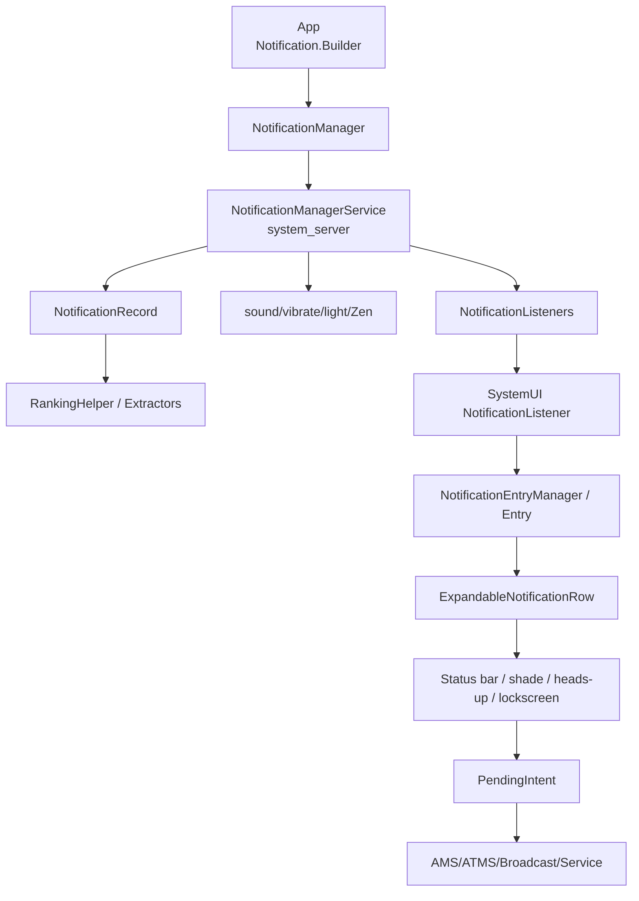
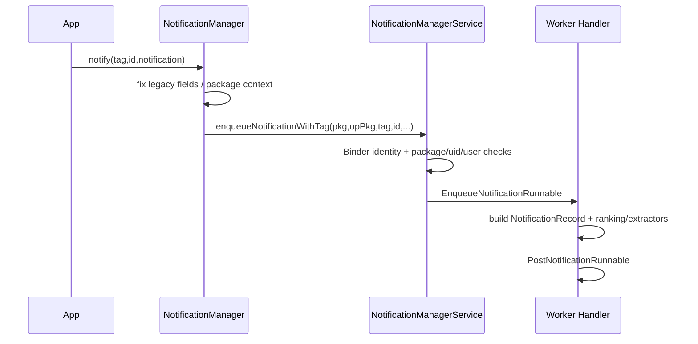
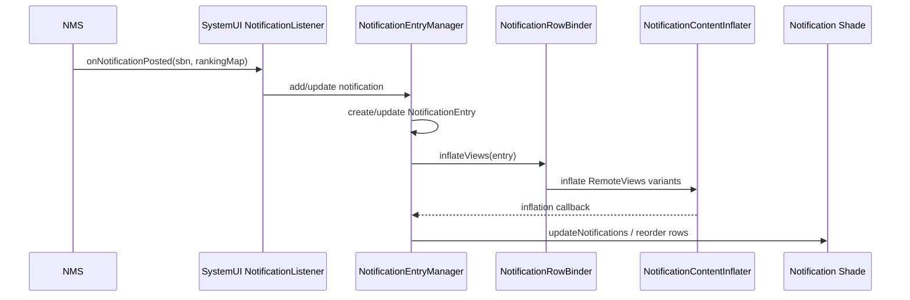
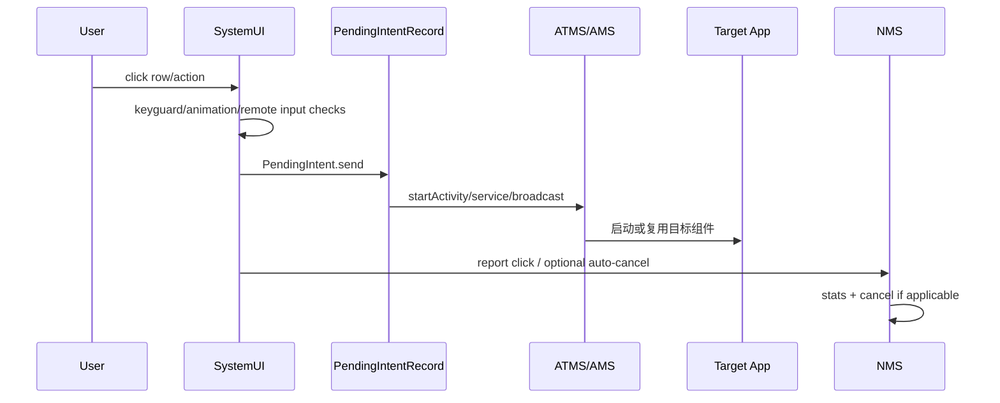

# 27 Android 通知系统与 SystemUI

> 源码版本：Android 11 / API 30 / `android-11.0.0_r48`  
> 学习方式：macOS 只读源码，不要求编译或真机发送通知。  
> 前置章节：[07-Binder基础与完整调用链](./07-Binder基础与完整调用链.md)、[16-Broadcast广播注册与分发](./16-Broadcast广播注册与分发.md)、[23-Android权限AppOps与SELinux](./23-Android权限AppOps与SELinux.md)

---

## 1. 通知不是“一张 View 发给状态栏”

一条通知至少经过五段：

```text
App：构建 Notification、Channel、PendingIntent
 → NotificationManager Binder 提交
system_server：NMS 校验、修正、入队、排序、提醒决策
 → NotificationListener Binder 分发
SystemUI：建立 NotificationEntry、inflate RemoteViews、分组/排序/展示
 → 用户点击/回复/清除
system_server：执行 PendingIntent、取消、记录可见性和交互
```

Notification 是可跨进程传输的数据模型，不是 App 进程中的真实通知栏 View。SystemUI 才拥有最终展示界面。

---

## 2. 本章目标

1. 从 `NotificationManager.notify()` 追到 NMS 入队和 posted 回调。
2. 解释 `(package, user, tag, id)` 如何决定更新还是新增。
3. 区分 Channel importance、通知 priority、ranking 和 heads-up。
4. 理解 `StatusBarNotification`、`NotificationRecord`、`NotificationEntry` 的层次。
5. 解释 RemoteViews 为什么能跨进程安全展示有限布局。
6. 从点击通知追到 PendingIntent 与目标 Activity/Service/Broadcast。
7. 理解 group、summary、conversation、bubble 与前台服务通知。
8. 分层诊断“notify 成功但看不到/不响/不弹/点不开”。

---

## 3. 整体架构



---

## 4. 三个进程必须先标清

```text
App 进程：创建 Notification，持有业务状态
system_server：NotificationManagerService，掌握系统权威通知状态
SystemUI 进程：作为受信任 NotificationListener，负责视觉呈现和用户交互
```

SystemUI 崩溃重启后可从 NMS 重新获取 active notifications；这说明通知权威列表不只保存在 SystemUI 的 View 树里。

---

## 5. App 侧基础对象

| 对象 | 职责 |
|---|---|
| `Notification.Builder` | 构建通知数据、style、actions、RemoteViews |
| `Notification` | 可 Parcelable 跨 Binder 的通知内容 |
| `NotificationChannel` | 用户可控制的一类通知行为 |
| `NotificationManager` | App 侧系统服务代理 |
| `PendingIntent` | 系统以后以创建者授权语义执行的操作 token |

源码：

```text
frameworks/base/core/java/android/app/Notification.java
frameworks/base/core/java/android/app/NotificationManager.java
frameworks/base/core/java/android/app/NotificationChannel.java
frameworks/base/core/java/android/app/PendingIntent.java
```

---

## 6. 最小通知的版本语义

Android 8+ target 的 App 通常先创建 Channel，再构建通知：

```java
NotificationChannel channel = new NotificationChannel(
        "messages", "消息", NotificationManager.IMPORTANCE_DEFAULT);
notificationManager.createNotificationChannel(channel);

Notification n = new Notification.Builder(context, "messages")
        .setSmallIcon(R.drawable.ic_message)
        .setContentTitle("新消息")
        .setContentText("点击查看")
        .setContentIntent(contentIntent)
        .build();
notificationManager.notify(1001, n);
```

这只是提交请求。是否显示、是否提醒、如何排序仍由 NMS、用户设置、Zen/策略和 SystemUI 决定。

---

## 7. Android 11 没有 POST_NOTIFICATIONS 运行时权限

`android.permission.POST_NOTIFICATIONS` 是较新 Android 引入的运行时权限，当前 Android 11 r48 平台 Manifest 中不存在。不能用 Android 13 的授权流程解释本章源码。

Android 11 仍有：

- 包级通知开关。
- Channel importance/block 状态。
- 用户 locked fields。
- AppOps/系统策略与 suspended package。
- 通知监听器单独授权。

“没有 POST_NOTIFICATIONS”不等于 App 可以绕过用户设置无限展示。

---

## 8. Channel 为什么由系统持久化

Channel 是 App 与用户之间的长期契约：App 定义“消息、下载、告警”等语义类别，用户可单独改变 importance、声音、振动、badge 等。NMS/RankingHelper 持久化 Channel，而不是每次完全相信 Notification 中临时声明的参数。

Channel ID 应稳定。一旦创建，App 不能随意提高用户已经看过或修改过的行为。

---

## 9. Channel 创建与更新规则

```text
NotificationManager.createNotificationChannel
 → INotificationManager.createNotificationChannels
 → NMS 校验 calling package/uid/user
 → RankingHelper.createNotificationChannel
 → 保留用户已锁定字段
 → 写 policy XML / 通知 listeners
```

重复创建同 ID 通常用于安全地更新允许 App 修改的元数据；不能借此覆盖用户手动降低的 importance 或声音选择。

---

## 10. Importance 的含义

Android 11 常见：

| importance | 直观行为 |
|---|---|
| `NONE` | 被阻止，不展示 |
| `MIN` | 极低，通常不在状态栏突出 |
| `LOW` | 静默展示 |
| `DEFAULT` | 常规展示，可有声音 |
| `HIGH` | 更强打断候选，如 heads-up，但仍需其他条件 |

Importance 是系统 ranking/alert 输入，不是“界面绝对位置”或“必定弹窗”的命令。

---

## 11. Priority 与 Importance

```text
priority：旧通知模型中的单条提示优先级，主要服务旧 target/兼容
channel importance：Android 8+ 的持久用户控制级别
ranking：系统综合 channel、时间、联系人、group、assistant 等得到的排序结果
```

对现代 Channel 通知，单纯把 `Notification.priority` 设为 MAX 不能覆盖低 importance Channel。

---

## 12. 用户 locked fields

`NotificationChannel` 中有 `USER_LOCKED_IMPORTANCE`、`SOUND`、`VIBRATION`、`SHOW_BADGE` 等位。用户修改后，系统记录对应字段已由用户决定。

```text
App 默认建议 < 用户明确选择
```

排查“代码把 importance 改 HIGH 但不生效”时，应检查已有 Channel 和 user locked fields，而不是只看本次构造参数。

---

## 13. notify 的 Binder 链

源码：

```text
frameworks/base/core/java/android/app/NotificationManager.java
frameworks/base/core/java/android/app/INotificationManager.aidl
frameworks/base/services/core/java/com/android/server/notification/NotificationManagerService.java
```

简化：



Binder 方法返回并不保证 SystemUI 已 inflate 完成；入队、排序、listener callback、UI inflate 都有异步边界。

---

## 14. 为什么 NMS 要复制/修正 Notification

来自 App 的 Parcelable 是不可信输入。NMS 会检查或修正：

- package 与 calling UID 是否匹配。
- userId 是否允许。
- small icon、channel、content 等合法性。
- PendingIntent 与 URI grant。
- notification 数量、大小、频率。
- foreground service 标志。
- group、bubble、shortcut 等元数据。

不能因为 Notification.Builder 是 Framework 类，就假设 system_server 可无条件信任其字段。

---

## 15. 通知的身份 key

App 更新通知通常复用相同 `(tag, id)`；系统完整 key 还包含 package、user 等：

```text
userId | packageName | id | tag | uid（具体 key 格式见 StatusBarNotification）
```

同一 App 相同 id 但不同 tag 是不同通知；不同用户下相同包/id 也是不同记录。更新不会天然重新提醒，是否 alert 取决于 flags、channel、内容变化和 only-alert-once 等。

---

## 16. StatusBarNotification

源码：

```text
frameworks/base/core/java/android/service/notification/StatusBarNotification.java
```

它包装：

- package/opPkg、uid、initialPid。
- tag、id、user。
- Notification 本体。
- postTime、overrideGroupKey。
- stable key/groupKey 计算。

它是 NMS 向 listener/SystemUI 传递的公开系统包装，不等于 SystemUI View。

---

## 17. NotificationRecord

源码：

```text
frameworks/base/services/core/java/com/android/server/notification/NotificationRecord.java
```

NMS 内部为每条通知创建 Record，除 SBN 外还包含：

- resolved channel 与 importance。
- ranking time、contact affinity、package priority。
- intercepted/hidden 状态。
- sound、vibration、light、audio attributes。
- stats、visibility、adjustments。
- group、conversation、bubble 等派生状态。

Record 是 system_server 的权威决策对象。

---

## 18. 入队与发布为何分 Runnable

`EnqueueNotificationRunnable` 执行耗时检查、Channel/Record 构建、extractor/ranking 等；`PostNotificationRunnable` 将结果合并进 active list、处理更新与 group、提醒并通知 listeners。

拆分可避免 Binder 线程长期持有大锁，也允许异步排序。但读取源码必须跟 Handler 消息，否则会误以为 enqueue 方法下面没有“真正显示”代码。

---

## 19. active、enqueued 与 snoozed

NMS 维护多类集合：

```text
mEnqueuedNotifications：正在处理、尚未正式发布
mNotificationList：当前 active records
snooze helper：被用户/assistant 暂停、等待恢复
```

取消时可能既要找 active 又要处理 enqueued；更新到达时旧记录可能位于不同阶段。

---

## 20. RankingHelper 与 SignalExtractor

源码：

```text
frameworks/base/services/core/java/com/android/server/notification/RankingHelper.java
frameworks/base/services/core/java/com/android/server/notification/NotificationSignalExtractor.java
frameworks/base/services/core/java/com/android/server/notification/*Extractor.java
```

extractor 从通知、Channel、联系人、Zen、usage 等提取信号并修改 Record；RankingHelper 排序并生成全局 sort key。某些 extractor 可返回异步 reconsideration，之后再更新 ranking。

---

## 21. Ranking 不是 importance 排序一下

排序可能综合：

- importance。
- ranking time/freshness。
- group summary/child。
- package/people/conversation 信号。
- system/assistant adjustments。
- sortKey 与 criticality。

SystemUI 收到 `RankingMap` 后还会应用视觉稳定性、section、filter 等 UI 规则，因此 NMS ranking 顺序也不等于每一帧 View 的机械顺序。

---

## 22. NotificationListenerService

源码：

```text
frameworks/base/core/java/android/service/notification/NotificationListenerService.java
frameworks/base/services/core/java/com/android/server/notification/ManagedServices.java
```

第三方通知监听器必须由用户在设置中授权；NMS 用 ManagedServices 管理组件、用户、绑定、死亡重连和权限。监听器不是拥有普通通知权限就能读取所有通知。

---

## 23. NMS 的 NotificationListeners

Android 11 中 `NotificationListeners` 是 `NotificationManagerService` 内部类，继承 ManagedServices。关键方法：

```text
notifyPostedLocked
notifyRemovedLocked
notifyRankingUpdateLocked
```

它按 listener 可见用户、profile、hidden/sensitive 和 target SDK 等规则裁剪，再通过 Binder 回调。锁内方法通常准备数据，远程调用需要谨慎避免死锁与长阻塞。

---

## 24. SystemUI 为什么是 Listener

源码：

```text
frameworks/base/packages/SystemUI/src/com/android/systemui/statusbar/NotificationListener.java
```

SystemUI 作为系统可信 listener 接收：

```text
onListenerConnected + active notifications
onNotificationPosted
onNotificationRemoved
onNotificationRankingUpdate
```

它没有通过直接读取 NMS 私有 ArrayList 来显示通知，进程间边界保持清晰。

---

## 25. Android 11 SystemUI 有两套 pipeline 痕迹

源码同时可见传统 `NotificationEntryManager` 和新 `NotifPipeline/NotifCollection`。Android 11 正处于迁移期，配置/功能可能选择不同路径。

```text
旧主线：NotificationListener → NotificationEntryManager
新管线：NotificationListener/GroupCoalescer → NotifCollection → coordinators/pipeline
```

读本版本不要把后续 Android 已完成迁移的教程硬套进来。本章以 EntryManager 主链理解，再认识新管线设计。

---

## 26. NotificationEntry

源码：

```text
frameworks/base/packages/SystemUI/src/com/android/systemui/statusbar/notification/collection/NotificationEntry.java
```

Entry 是 SystemUI 对一条通知的 UI 状态模型，包含 SBN、Ranking、row、icon、inflation task、remote input、heads-up、sensitive 等状态。

```text
NMS NotificationRecord ≠ SystemUI NotificationEntry
```

两者位于不同进程，解决不同问题。

---

## 27. SystemUI 收到 posted 后

传统主线简化：



通知已在 NMS active，不代表 SystemUI inflate 一定成功。资源错误、RemoteViews 异常等可造成 UI 侧失败。

---

## 28. RemoteViews 为什么能跨进程

RemoteViews 不是任意 View 树对象，而是：

```text
layout resource id
+ 受限制的 View 操作列表
+ package/user 资源上下文
```

SystemUI 在自己的进程中 inflate 布局，再应用白名单化操作。App 不能把自定义任意 View 实例或执行代码直接塞入 SystemUI。

---

## 29. 标准模板与自定义 RemoteViews

`Notification.Builder` 标准 style 生成系统可预测模板，能更好适配主题、折叠、锁屏、无障碍。自定义 contentView/bigContentView/headsUpContentView 受高度、控件和版本行为限制。

自定义 RemoteViews 可增加灵活度，却更容易出现资源、主题、点击区域和版本兼容问题。应优先使用 MessagingStyle、MediaStyle、BigTextStyle 等标准 Style。

---

## 30. NotificationContentInflater

源码：

```text
frameworks/base/packages/SystemUI/src/com/android/systemui/statusbar/notification/row/NotificationContentInflater.java
```

它按需要构建：

- contracted content。
- expanded content。
- heads-up content。
- public/锁屏替代内容。

可异步 apply/reapply RemoteViews，并在任务取消、通知更新、异常时回调。更新通知时并非总销毁整行重建。

---

## 31. ExpandableNotificationRow

源码：

```text
frameworks/base/packages/SystemUI/src/com/android/systemui/statusbar/notification/row/ExpandableNotificationRow.java
```

它承载通知行 UI：折叠/展开、高度、group child、敏感遮挡、菜单、滑动、远程输入、heads-up 状态等。Row 不是通知数据的最终权威，NMS cancel 后它应被移除。

---

## 32. Heads-up 不是 HIGH 的同义词

Heads-up eligibility 可能考虑：

- effective importance 足够高。
- 有声音/振动或合适 alert 行为。
- 屏幕/状态栏/Keyguard 状态。
- Zen/DND、snooze、package suppression。
- 最近是否已打断、是否只是更新。
- full-screen intent、bubble、group 状态。
- SystemUI `NotificationInterruptStateProvider` 判断。

HIGH 只是重要输入，不是强制 SystemUI 弹窗的指令。

---

## 33. 提醒声音、振动、灯由谁决定

NMS 的 `buzzBeepBlinkLocked()` 等路径综合：

```text
Channel sound/vibration/lights
importance
ZenMode/DND interception
ringer/audio 状态
group alert behavior
onlyAlertOnce
当前 foreground/user/profile
rate limit / update 状态
```

SystemUI heads-up 是视觉打断；声音/振动主要由 NMS 协调音频/振动服务。两者可不同步出现。

---

## 34. Do Not Disturb / ZenMode

ZenModeHelper 根据用户规则和 notification policy 判断 Record 是否 intercepted。被拦截不一定意味着通知完全从 shade 消失；常见是抑制声音、振动、heads-up、状态栏等 effects，具体看 suppression 和 policy。

因此“勿扰模式下还能在通知栏看到”不等于勿扰失效。

---

## 35. Group 与 Group Summary

App 可设置相同 group key，并发布一条 summary：

```text
summary：代表整个组
children：组内具体通知
```

NMS 管理 autobundling、group key、summary 生命周期；SystemUI 决定折叠/展开和 child row。取消 summary/child 的连带行为要看是 App group、自动 group 还是用户清除。

---

## 36. Group alert behavior

`GROUP_ALERT_SUMMARY`、`GROUP_ALERT_CHILDREN` 控制组中谁负责提醒，避免 summary 与 child 双响。它不决定谁显示，只影响 alert 抑制。

更新 group key、summary 状态时 NMS 可能重新排序和重新评估 alert，不能仅看单条 Notification flags。

---

## 37. Conversation 通知

Android 11 强化 conversation：通常结合 MessagingStyle、有效 shortcut、person 等元数据。系统可将其放入 conversation section，用户还能设置优先对话。

“使用 MessagingStyle”不一定自动满足所有 conversation 条件；NMS/ShortcutService/ranking 会验证 shortcut、people 和包关系。

---

## 38. Bubble

Bubble 不是任意通知自动浮窗。需要 BubbleMetadata、合适 PendingIntent/shortcut、Channel 允许、包/用户设置允许，并经 NMS 与 SystemUI pipeline 判断。

```text
Notification 仍是权威记录
Bubble 是一种展示/交互形态
```

关闭 bubble 不一定取消底层通知。

---

## 39. PendingIntent 为什么是通知点击核心

App 提交通知后可能被杀，SystemUI 不能依赖 App 内存中的 click listener。PendingIntent 是 system_server 保存的可跨进程操作 token：

```text
创建者预先描述 Intent + type + requestCode + flags
 → SystemUI 持有 token
 → 用户点击时 send
 → AMS/ATMS 以创建者授权语义解析并执行
```

源码：

```text
frameworks/base/services/core/java/com/android/server/am/PendingIntentController.java
frameworks/base/services/core/java/com/android/server/am/PendingIntentRecord.java
```

---

## 40. PendingIntent 身份与安全

PendingIntent 类似可转交能力。接收者不需要拥有创建者全部权限，却可触发创建者预授权的特定操作。因此必须：

- 尽量使用显式 Intent。
- 不需要接收 fill-in/RemoteInput 修改时优先使用 `FLAG_IMMUTABLE`。
- 避免让 fillIn Intent 覆盖敏感字段。
- requestCode/Intent identity 设计避免意外复用。
- 不把高权限宽泛 PendingIntent 交给不可信方。

Android 11 已有 `FLAG_IMMUTABLE`，但源码中还没有 Android 12/API 31 引入的显式 `FLAG_MUTABLE`；本版本不设置 immutable 时保留的是可被 fill-in 修改的传统语义。RemoteInput 等确实需要修改 Intent 的场景要谨慎设计。较新 target 对 mutability flag 的强制要求不能原样倒推到 r48。

---

## 41. 点击通知的主链



`setAutoCancel(true)` 通常在用户点击 content intent 后取消；不是 notify 后自动消失，也不等于 action 点击必然执行同样取消逻辑。

---

## 42. RemoteInput 内联回复

Action 可携带 `RemoteInput`。SystemUI 展示输入框，收集结果后把文本放入 Intent extras 并发送 action PendingIntent。

```text
SystemUI 只是采集与发送
目标 Receiver/Service 负责真正提交消息
App 更新通知显示发送中/已发送/失败
```

PendingIntent mutability、锁屏隐私、历史内容和生命周期都需正确处理。

---

## 43. cancel 的几种来源

```text
App：cancel(tag,id) / cancelAll
用户：滑动清除/全部清除
点击：FLAG_AUTO_CANCEL
系统：包卸载/清数据、用户移除、错误、timeout
listener/assistant：在授权范围内取消
前台服务：stopForeground 的选择
```

NMS 记录 removal reason 并通知 listeners。SystemUI `onNotificationRemoved` 才清理 Entry/Row，还可能有 lifetime extender 延迟视觉移除。

---

## 44. ongoing 与 no-clear

`FLAG_ONGOING_EVENT`/`FLAG_NO_CLEAR` 会限制普通用户清除，但不是永不可取消：App、系统策略、包停止、前台服务结束等仍可移除。SystemUI 还会根据 clearable 计算滑动行为。

不要用 ongoing 通知强行阻止用户控制无必要的后台工作。

---

## 45. TimeoutAfter

`setTimeoutAfter()` 请求 NMS 在相对时间后取消通知。它由 system_server 管理，即使 App 进程死亡仍可生效。

更新相同 key 的通知时要重新理解 timeout 计划；不能把它当 App 进程 Handler 的延迟消息。

---

## 46. 前台服务通知

前台服务需要及时调用 `startForeground(id, notification)`。AMS/ActiveServices 与 NMS 协作设置 `FLAG_FOREGROUND_SERVICE`、追踪对应 ServiceRecord 和通知。

```text
前台服务通知 ≠ 普通 notify 后再 startForeground 的任意组合
```

未按期限发布会触发服务停止/异常；通知过低、Channel blocked 等情况下系统仍需保持用户可感知的治理语义。

---

## 47. 前台服务通知能否被用户清除

Android 11 的具体可清除行为受 FGS flag、SystemUI 与服务状态约束。用户看不到某条 FGS 通知不等于服务一定停止，也不等于通知完全不存在：低 importance、Channel、折叠与系统专门呈现都可能影响 UI。

分析要同时看 ActiveServices 的 FGS 状态和 NMS Record，不能只看 shade 截图。

---

## 48. 通知数量与 enqueue rate 限制

NMS 防止 App 滥发：

- 单包 active notification 数量上限。
- enqueue rate/过快更新限制。
- 大图片/Parcelable 体积和 Binder 限制。
- over-quota 时丢弃或记录。

频繁用新 id 发布进度会堆积；应复用稳定 id 更新，并适当节流。

---

## 49. Bad notification

缺少小图标、无有效 Channel、RemoteViews/资源异常、非法 PendingIntent/URI 等可能导致拒绝、崩溃调用方或 UI inflate 失败，具体取决于阶段。

排查要看两端日志：

```text
system_server NotificationService/NMS
SystemUI notification inflation/error
```

只有 App 自己的 notify 返回日志不够。

---

## 50. 多用户与工作资料

通知属于 UserHandle。NMS 决定 listener 是否能看到当前 user/profile 的记录，SystemUI 根据当前用户、managed profile、quiet mode 和锁屏策略展示。

同一个包在个人与工作资料中是不同 UID/通知空间，key 和 Channel 设置也按用户区分。

---

## 51. 锁屏隐私

Notification visibility：

```text
PUBLIC  可在锁屏展示完整内容
PRIVATE 可显示通知但隐藏敏感内容，可能使用 publicVersion
SECRET  锁屏不展示
```

最终还受用户锁屏设置、工作资料政策和 SystemUI sensitive 判定影响。App 的 visibility 是输入，不是覆盖设备政策的命令。

---

## 52. Notification Assistant

Assistant 是比 listener 更具调整能力的受控系统角色，可提供 snooze、importance/ranking 调整、建议 action/reply 等。NMS 校验 assistant adjustment，不能让普通 App 任意重排其他包通知。

Assistant 的 adjustment 是 ranking 输入之一，不等于直接操作 SystemUI View。

---

## 53. StatusBarManagerService 与 NMS 的区别

```text
NotificationManagerService：通知记录、Channel、ranking、alert、listener
StatusBarManagerService：system_server 与 SystemUI 状态栏命令、图标、disable flags 等桥梁
```

普通 App 通知主要通过 NMS→NotificationListener 到 SystemUI，不是每条通知都通过 StatusBarManagerService 的 `setIcon` API 添加一个状态栏图标。

---

## 54. SystemUI icon 与 row

一条通知可能派生：

- status bar small icon。
- shade row。
- heads-up row。
- lockscreen row/public version。
- ambient/AOD icon。
- badge（由 Launcher 等消费）。

这些是同一 NotificationEntry 的不同表示，并非五条 NMS NotificationRecord。

---

## 55. Badge 不是 SystemUI 通知圆点的唯一实现

Launcher 可通过通知 listener/ranking/shortcut 等数据展示应用图标 badge/dot。Channel 的 `showBadge` 和用户设置是输入；具体 Launcher UI 不在 NMS 的通知行 View 中。

因此“通知栏有通知但桌面没角标”需继续检查 Channel badge、Launcher 实现和用户设置。

---

## 56. 通知更新的竞态

```text
notify v1 → SystemUI 开始异步 inflate
notify v2 → 取消 v1 inflation，reapply/重新 inflate
cancel → remove 到达
旧 inflation callback 晚到
```

SystemUI 用 inflation task、entry key 和 abort 机制避免旧结果覆盖新状态。读异步 UI 错误时必须记录 notification key 与 generation/任务生命周期。

---

## 57. Ranking 更新不等于 repost

Channel/Zen/contact/assistant 状态变化可只产生 `onNotificationRankingUpdate(RankingMap)`。SystemUI 应更新 Entry 的 ranking、过滤、section、敏感性和顺序，不需要 App 再 notify。

反之 repost 通知通常同时携带最新 RankingMap，但它还意味着内容/record 更新。

---

## 58. 常见问题分层诊断

| 现象 | 优先排查 |
|---|---|
| notify 抛异常 | channel、small icon、Parcelable、调用身份 |
| notify 返回但完全看不到 | 包开关、Channel NONE、user/profile、suspended、NMS reject |
| 有通知但不响 | importance、sound、DND、group alert、onlyAlertOnce |
| 有声音但不 heads-up | SystemUI interruption 条件、屏幕/keyguard、snooze |
| 状态栏没图标但 shade 有 | importance MIN、silent icon policy、SystemUI filter |
| 通知内容空白/布局坏 | RemoteViews 资源/inflation/SystemUI 日志 |
| 点击没反应 | PendingIntent identity、目标 exported/组件状态、cancel/exception |
| 更新变成两条 | tag/id/user/package key 不一致 |
| 前台服务异常 | startForeground 时限、通知有效性、Channel/Service 状态 |

---

## 59. dumpsys notification 阅读方向

以后连接设备可观察：

```text
NotificationRecord：key、channel、importance、flags、group
active/enqueued/snoozed
ranking config 与 package/channel preferences
Zen mode/policy
listeners/assistants 绑定
recent notification history / usage stats
```

本课程不执行 adb；这里只建立 dump 字段与源码对象的映射。

---

## 60. 源码路线一：App 到 NMS

```text
frameworks/base/core/java/android/app/Notification.java
frameworks/base/core/java/android/app/NotificationManager.java
frameworks/base/core/java/android/app/INotificationManager.aidl
frameworks/base/services/core/java/com/android/server/notification/NotificationManagerService.java
frameworks/base/services/core/java/com/android/server/notification/NotificationRecord.java
```

练习：从 `notify(tag,id,n)` 追到 Enqueue/Post Runnable，标出 Binder 身份、Handler 边界、key 和 active list 更新。

---

## 61. 源码路线二：Channel 与 Ranking

```text
frameworks/base/core/java/android/app/NotificationChannel.java
frameworks/base/services/core/java/com/android/server/notification/RankingHelper.java
frameworks/base/services/core/java/com/android/server/notification/NotificationChannelExtractor.java
frameworks/base/services/core/java/com/android/server/notification/ZenModeHelper.java
```

练习：创建一个 LOW Channel，再模拟用户锁定 importance，解释 App 重建 HIGH 为何不能覆盖。

---

## 62. 源码路线三：Listener 到 SystemUI

```text
frameworks/base/core/java/android/service/notification/NotificationListenerService.java
frameworks/base/services/core/java/com/android/server/notification/ManagedServices.java
frameworks/base/packages/SystemUI/src/com/android/systemui/statusbar/NotificationListener.java
frameworks/base/packages/SystemUI/src/com/android/systemui/statusbar/notification/NotificationEntryManager.java
frameworks/base/packages/SystemUI/src/com/android/systemui/statusbar/notification/collection/NotificationEntry.java
```

练习：从 NMS `notifyPostedLocked()` 追到 SystemUI `onNotificationPosted()` 和 Entry add/update。

---

## 63. 源码路线四：Row 与打断

```text
frameworks/base/packages/SystemUI/src/com/android/systemui/statusbar/notification/row/NotificationContentInflater.java
frameworks/base/packages/SystemUI/src/com/android/systemui/statusbar/notification/row/ExpandableNotificationRow.java
frameworks/base/packages/SystemUI/src/com/android/systemui/statusbar/notification/interruption/NotificationInterruptStateProviderImpl.java
frameworks/base/packages/SystemUI/src/com/android/systemui/statusbar/policy/HeadsUpManager.java
frameworks/base/packages/SystemUI/src/com/android/systemui/statusbar/phone/StatusBarNotificationActivityStarter.java
```

练习：分别追 shade row inflate、heads-up eligibility 和 content intent 点击。

---

## 64. 源码路线五：PendingIntent

```text
frameworks/base/core/java/android/app/PendingIntent.java
frameworks/base/services/core/java/com/android/server/am/PendingIntentController.java
frameworks/base/services/core/java/com/android/server/am/PendingIntentRecord.java
frameworks/base/services/core/java/com/android/server/wm/ActivityTaskManagerService.java
```

练习：记录 PendingIntent 创建者 UID、type、requestCode、base Intent、flags，再追 send 如何进入目标组件。

---

## 65. 推荐八组只读练习

1. **Channel**：解释创建、用户修改、App 重建三步后的最终 importance。
2. **入队**：画 notify→Record→active list。
3. **更新**：比较相同/不同 tag+id 的结果。
4. **Ranking**：区分 importance、ranking 和 SystemUI visual order。
5. **展示**：从 posted 追 Entry、RemoteViews、Row。
6. **打断**：列出 HIGH 但不 heads-up 的六种原因。
7. **点击**：从 contentIntent 追 PendingIntentRecord 到 Activity。
8. **综合诊断**：为“前台服务运行但通知静默且没图标”列证据。

---

## 66. 初学者最容易混淆的十二点

1. Notification 不是跨进程传递的 View。
2. Android 11 没有 POST_NOTIFICATIONS 运行时权限。
3. notify 返回不等于 SystemUI 已显示。
4. Channel importance 不能被单条 priority 随意覆盖。
5. HIGH 不保证 heads-up。
6. 勿扰拦截不一定让 shade 中完全消失。
7. NotificationRecord 与 NotificationEntry 不在同一进程。
8. RemoteViews 不是任意自定义 View 对象。
9. Group alert behavior 不决定 group 是否显示。
10. Bubble 是展示形态，不是另一条独立通知。
11. PendingIntent 是授权 token，不是普通 Intent 引用。
12. FGS 通知与普通 notify 生命周期不同。

---

## 67. 自测题

1. NMS 和 SystemUI 分别掌握什么状态？
2. 为什么相同 id、不同 tag 会出现两条通知？
3. 用户降低 Channel importance 后 App 为何不能再提高？
4. priority、importance、ranking、heads-up 是什么关系？
5. NotificationRecord、SBN、Entry、Row 如何对应？
6. notify 返回后还有哪些异步阶段？
7. RemoteViews 如何避免 App 在 SystemUI 执行任意代码？
8. 为什么 ranking update 不需要 repost？
9. PendingIntent 为什么在 App 被杀后仍能点击？
10. AutoCancel 与 cancelAll 有何区别？
11. 前台服务为何必须与特定通知绑定？
12. Android 13 的 POST_NOTIFICATIONS 为什么不能用于解释本章？

---

## 68. 自测答案

1. NMS 掌握权威 Record/Channel/ranking/alert；SystemUI 掌握 Entry、inflation 和视觉交互状态。
2. 通知 key 包含 tag，二者 key 不同，不是更新关系。
3. user locked field 的优先级高于 App 后续默认建议。
4. priority 是旧单条提示，importance 是 Channel 级别，ranking 综合多信号，heads-up 再由 SystemUI 打断规则决定。
5. Record 包装系统决策并持 SBN；SBN 跨进程；Entry 是 SystemUI 模型；Row 是具体 UI。
6. NMS Handler 入队/发布、ranking、listener Binder callback、SystemUI Entry 更新和异步 inflate。
7. 只传布局资源和受限制操作列表，由 SystemUI 自己 inflate/apply。
8. 内容未改变，只需重新应用最新 RankingMap、过滤、section 和顺序。
9. token 及创建者身份由 system_server PendingIntentController 保存，不依赖 App 对象存活。
10. AutoCancel 针对用户点击后的该通知；cancelAll 是 App 主动取消自己的通知集合。
11. 保证持续后台工作对用户可感知，并让 AMS/NMS 协同治理生命周期。
12. 它在后续平台引入，Android 11 源码没有该 runtime permission 与请求流程。

---

## 69. 本章结论

用一条主线记住通知系统：

```text
App 提交的是带 Channel 和 PendingIntent 的数据模型；
NMS 把它变成 NotificationRecord，执行系统级校验、排序和提醒；
SystemUI 作为 NotificationListener 收到 SBN/RankingMap，建立 Entry 并安全 inflate RemoteViews；
用户交互再通过 PendingIntent 和 NMS 回到组件生命周期与通知状态。
```

遇到问题依次问：

```text
App 提交是否合法，key 是否是预期的？
Channel/包/用户是否允许，NMS Record 的 effective importance 是什么？
是否被 Zen、group、onlyAlertOnce 等抑制提醒？
Listener 是否收到，SystemUI inflation 是否成功？
Heads-up、锁屏、状态栏是哪一层视觉策略？
PendingIntent 的创建者、identity、flags 和目标组件是否正确？
```

这样就能把“通知没显示”拆成提交、系统记录、提醒、分发、UI 和点击六个可验证阶段。
