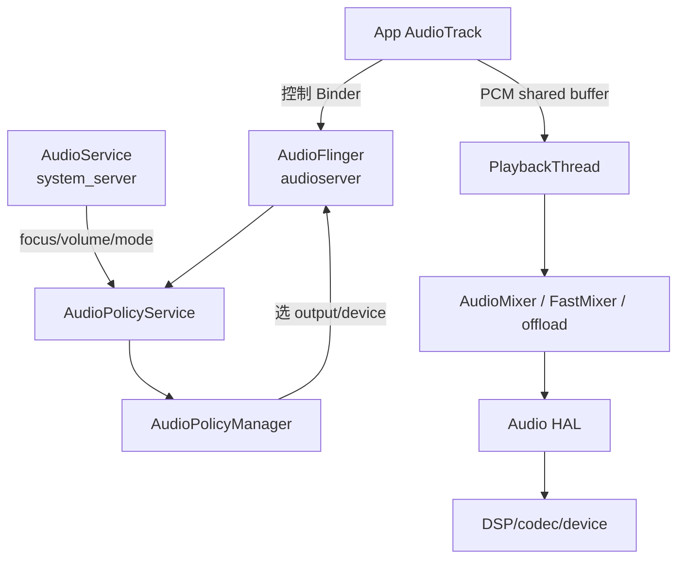
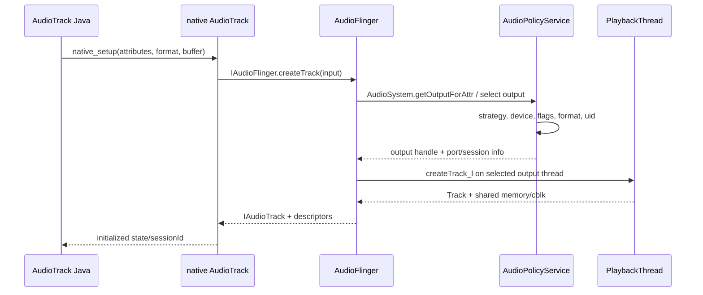
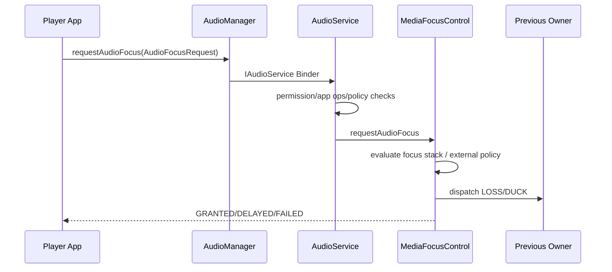

# 28 Android 音频系统、AudioFlinger 与 AudioPolicy

> 源码版本：Android 11 / API 30 / `android-11.0.0_r48`  
> 学习方式：macOS 只读源码，不要求编译或连接音频硬件。  
> 前置章节：[07-Binder基础与完整调用链](./07-Binder基础与完整调用链.md)、[23-Android权限AppOps与SELinux](./23-Android权限AppOps与SELinux.md)、[25-Android电源管理WakeLock与Doze](./25-Android电源管理WakeLock与Doze.md)

---

## 1. 先拆开五个层次

```text
应用 API：MediaPlayer/AudioTrack/AAudio/AudioRecord
Java 系统策略：AudioService，负责焦点、音量、模式、设备事件等
Native 服务：AudioFlinger 负责 Track、线程、混音、效果和 HAL I/O
路由策略：AudioPolicyService/Manager 选择 output/input、设备和策略
硬件抽象：Audio HAL 把 PCM/压缩流送往 codec、DSP、扬声器、耳机、蓝牙
```

最常见的误区：

- AudioFocus 就是独占声卡。
- 音量 stream 就等于 AudioTrack 的实际输出设备。
- 每次 `AudioTrack.write()` 都 Binder 一块 PCM 给 AudioFlinger。
- `MODE_STREAM` 一定经过 MixerThread。
- fast track 只要设置低延迟 flag 就必定获得。
- Audio HAL 自己决定所有路由，AudioPolicy 没作用。

---

## 2. 控制面与数据面



控制面用 Binder 创建 Track、开始/停止、设置参数、选择路由；高频 PCM 数据通常通过共享内存和生产者/消费者位置传递，避免每个 buffer 做 Binder 拷贝。

---

## 3. 关键进程

```text
App 进程：AudioTrack Java/JNI/native client、写数据/回调
system_server：AudioService、MediaFocusControl、音量和上层设备策略
audioserver：AudioFlinger、AudioPolicyService、AAudio service 等
HAL service/进程：具体 HIDL Audio HAL，设备实现可能不同
kernel/DSP：ALSA/厂商驱动、codec、DSP
```

Android 版本和厂商会调整 HAL 进程形态，但不要把 AudioService 与 AudioFlinger 画在同一个 Java system_server 对象里。

---

## 4. 主要源码目录

```text
frameworks/base/media/java/android/media/            Java API
frameworks/base/core/jni/android_media_AudioTrack.cpp Java AudioTrack JNI
frameworks/av/media/libaudioclient/                   native client/Binder interfaces
frameworks/av/services/audioflinger/                  AudioFlinger、Threads、Mixer、Effects
frameworks/av/services/audiopolicy/                   AudioPolicyService/Manager/engine
frameworks/av/media/libaudiohal/                      HAL wrapper
hardware/interfaces/audio/                           HIDL Audio HAL contract/default pieces
frameworks/base/services/core/java/com/android/server/audio/ AudioService/focus
```

---

## 5. 从高级播放器到 AudioTrack

MediaPlayer、NuPlayer、MediaCodec、ExoPlayer 等最终常把已解码 PCM 交给 AudioTrack，或为压缩 offload 建立特殊输出路径：

```text
compressed media
 → extractor/demux
 → codec decode
 → PCM frames
 → AudioTrack
 → AudioFlinger playback thread
```

AudioTrack 不负责 MP3/AAC 的一般软件解码；它主要消费配置好的 PCM，或在 direct/offload 场景承载受支持压缩格式。

---

## 6. AudioTrack Java 构造参数

源码：

```text
frameworks/base/media/java/android/media/AudioTrack.java
```

核心输入：

- `AudioAttributes`：usage、content type、flags、tags。
- `AudioFormat`：sample rate、channel mask、encoding。
- buffer size。
- transfer mode：STATIC 或 STREAM。
- sessionId。
- performance mode（低延迟/省电等提示）。

这些是需求和提示，最终线程、设备、格式转换由策略与服务器协商。

---

## 7. AudioAttributes 取代单纯 streamType

```text
usage：MEDIA、GAME、VOICE_COMMUNICATION、ALARM、NOTIFICATION...
content type：MUSIC、SPEECH、MOVIE、SONIFICATION...
flags：low latency、audibility enforced 等受控提示
```

AudioPolicy 用 attributes 决定 product strategy、volume group、output 和设备。旧 `STREAM_MUSIC` 等仍存在兼容映射，但现代代码应优先表达“用途”，而不是把 stream 当物理通道。

---

## 8. AudioFormat 三要素

```text
sample rate：每秒 frame 数，如 48000
channel mask：声道布局，如 stereo
encoding/format：PCM 16-bit、float 或压缩格式
```

一个 audio frame 包含同一采样时刻的所有声道 sample。立体声 PCM16：

```text
1 frame = 2 channels × 2 bytes = 4 bytes
480 frames at 48kHz = 10ms
```

frame、sample、byte、buffer 不能互换使用。

---

## 9. STATIC 与 STREAM

```text
MODE_STATIC：一次把较短完整 PCM 放入共享 buffer，适合重复播放小音效
MODE_STREAM：持续 write 新 PCM，适合音乐、语音、长流
```

STREAM 指传输模式，不代表互联网 streaming，也不表示只能播放 `STREAM_MUSIC`。

---

## 10. Java 到 native AudioTrack

简化调用：

```text
new AudioTrack(...)
 → native_setup
 → frameworks/base/core/jni/android_media_AudioTrack.cpp
 → native android::AudioTrack::set()
 → createTrack_l()
 → AudioSystem::get_audio_flinger()
 → IAudioFlinger::createTrack()
```

源码：

```text
frameworks/av/media/libaudioclient/AudioTrack.cpp
frameworks/av/media/libaudioclient/include/media/IAudioFlinger.h
frameworks/av/media/libaudioclient/IAudioFlinger.cpp
```

---

## 11. 创建 Track 的完整控制链



这里的顺序很容易被旧版调用图带偏：r48 的 native client 并不是先单独调用 AudioPolicyService、再调用 AudioFlinger。它先 Binder 调 `AudioFlinger::createTrack()`；AudioFlinger 在服务端通过 `AudioSystem::getOutputForAttr()` 询问策略，拿到 output handle 后，才在对应 PlaybackThread 创建 Track。逻辑上仍是“先选输出，再建 Track”，但跨进程调用者与身份检查位置不能画反。

---

## 12. output handle 不是设备 ID

AudioPolicy 返回的 output handle 对应 AudioFlinger 中一个已打开输出/播放线程。它背后可路由到一个或多个 device，且设备可随耳机插拔、蓝牙连接而改变。

```text
AudioTrack → output/PlaybackThread → device(s)
```

不能把 output handle、audio port handle、device type、物理 ALSA card/device 当同一编号。

---

## 13. AudioFlinger 的职责

源码：

```text
frameworks/av/services/audioflinger/AudioFlinger.cpp
frameworks/av/services/audioflinger/AudioFlinger.h
frameworks/av/services/audioflinger/Threads.cpp
frameworks/av/services/audioflinger/Tracks.cpp
```

主要负责：

- 创建/销毁 playback 与 record Track。
- 管理 PlaybackThread/RecordThread。
- 混音、重采样、声道/格式转换。
- 音量与 mute 应用。
- 音效链。
- 同 Audio HAL 读写。
- fast/MMAP/offload/direct 路径。
- 时间戳、underrun、latency 统计。

---

## 14. PlaybackThread 家族

常见线程：

| 类型 | 作用 |
|---|---|
| `MixerThread` | 多 Track 混音后写一个 HAL output |
| `DirectOutputThread` | 特殊格式/配置直通，通常不做普通多路混音 |
| `OffloadThread` | 把支持的压缩流交给 DSP/hardware offload |
| `DuplicatingThread` | 把混合结果复制到多个 output |
| `MmapPlaybackThread` | MMAP/低延迟共享 endpoint 路径 |

“播放线程”不是 App 的 Java 播放线程，而是 audioserver 中面向 output 的实时线程。

---

## 15. MixerThread 的周期

简化：

```text
threadLoop
 → prepareTracks_l：判断 active/ready、配置 mixer
 → AudioMixer processing：取各 Track buffer
 → resample/channel convert/volume/effects/mix
 → write output buffer to HAL
 → 更新 frame/timestamp/underrun
 → sleep/wait 下一周期
```

它的 deadline 由 sample rate 和 HAL period 决定。实时线程不能做长 Binder、磁盘 I/O 或不可控锁等待。

---

## 16. PCM 为什么不用每次 Binder

创建 Track 时 server 建共享 control block 和 data buffer。App/native AudioTrack 是 producer，AudioFlinger Track 是 consumer：

```text
client 写 frame → 更新 rear/user position
server 读 frame → 更新 front/server position
```

同步由 `audio_track_cblk_t`、ClientProxy/ServerProxy、futex/event 等机制协作。Binder 主要做生命周期和控制，不承载每一个音频帧。

---

## 17. AudioTrack.write 的链路

```text
Java write(byte[]/short[]/ByteBuffer)
 → JNI native_write
 → native AudioTrack::write
 → obtainBuffer
 → 把 PCM 拷入共享 buffer
 → releaseBuffer 更新 producer position/唤醒
 → PlaybackThread 后续周期读取
```

blocking write 在 buffer 满时等待可用空间；non-blocking write 可只写部分数据。返回值是实际写入量，调用者必须处理短写和错误。

---

## 18. callback transfer mode

Native AudioTrack 还可由回调线程周期请求数据，`processAudioBuffer()` 调用应用 callback 填充。Java AudioTrack 常见是主动 write；高级 native 播放器可能使用 callback。

回调中必须快速提供数据，不能分配大对象、锁竞争或做网络 I/O，否则易 underrun。

---

## 19. start 不是开始解码

`AudioTrack.start()`：

```text
native AudioTrack::start
 → IAudioTrack.start Binder
 → PlaybackThread 将 Track 激活
 → AudioPolicy startOutput 更新并发/路由策略
 → mixer 开始消费已经写入/即将写入的 buffer
```

解码通常由播放器/codec 线程完成。若 start 后没有 PCM 到达，Track 会 underrun，而非 AudioFlinger 自动解码媒体文件。

---

## 20. stop、pause、flush

```text
pause：暂时停止消费，可继续保留 queued data/position 语义
stop：结束当前播放段，streaming track 等待/处理 drain 语义依路径
flush：丢弃尚未播放的 queued data，通常在 stopped/paused 状态使用
release：释放 server Track 和 native 资源
```

三者不是同义词。不同 static/stream/offload 路径细节不同，应以 AudioTrack 状态机检查合法调用。

---

## 21. underrun 是什么

PlaybackThread 需要下一批 frame 时，client buffer 没有足够数据：

```text
producer 太慢
GC/调度停顿
buffer 太小
解码/网络抖动
sample rate/处理开销过大
```

结果可能是静音填充、爆音或断续。降低延迟通常缩小 buffer，却会减少抗抖动余量；延迟与稳定性天然权衡。

---

## 22. latency 的组成

```text
应用生成/解码 buffer
+ client shared buffer 排队
+ AudioFlinger mixer period
+ HAL buffer
+ DSP/codec/device pipeline
+ 无线链路（蓝牙）
```

`AudioTrack.getLatency` 或 timestamp 只覆盖特定范围。用户听到的端到端 latency 还包含输入/算法/无线设备等。

可以先用一个粗略公式建立量感：

```text
某段 PCM buffer 的时长 ≈ frameCount / sampleRate
例如 48kHz 下 960 frames ≈ 20ms
```

但这只是在该采样率下这一段 buffer 的排队容量；若前后还有 client queue、Mixer、HAL、DSP 和蓝牙 buffer，不能把 20ms 当成最终端到端 latency。重采样或动态 buffer 也会让简单估算需要换算。

---

## 23. Fast Track 的目的

FastMixer 使用更短、更确定的路径减少 mixer 周期和调度延迟。Track 获得 fast slot 通常要求：

- 请求 `AUDIO_OUTPUT_FLAG_FAST`/低延迟性能模式。
- sample rate 匹配或受支持。
- channel/format 合适。
- buffer/frame count 满足要求。
- output thread 支持且 fast slot 可用。
- 无不兼容效果/处理。

请求只是候选，AudioFlinger 可移除 FAST flag 并退回普通 mixer。

---

## 24. FastMixer 与 MixerThread

FastMixer 通常由 MixerThread 管理并通过 state queue 获得 fast tracks 配置。普通 MixerThread 仍负责常规 tracks、策略变化及向 HAL 的整体协作。

```text
fast track ≠ 完全绕过 AudioFlinger
```

它绕过部分普通混音慢路径，但仍在 audioserver 与 HAL 输出架构内。

---

## 25. Direct 与 Offload

```text
Direct：为特定格式/rate/channel 直接打开 HAL output，减少或避免普通 mixer 转换
Offload：将压缩解码/播放更多交给 DSP，降低 CPU 与功耗
```

代价是并发混音、效果、设备兼容和切换受限。通知声/系统音可能要求 offload 暂停、duck 或使用其他 output。

---

## 26. MMAP/AAudio

AAudio 面向低延迟 native 音频。可能走：

```text
MMAP_EXCLUSIVE：应用与 HAL 共享 MMAP endpoint，最低延迟但资源独占/受限
MMAP_SHARED：service mixer 共享 endpoint
Legacy：回落 AudioTrack/AudioRecord 路径
```

源码：

```text
frameworks/av/media/libaaudio/
frameworks/av/services/oboeservice/
frameworks/av/services/audioflinger/MmapTracks.h
```

性能模式是请求，设备/HAL 不支持时必须允许合理回退。

---

## 27. AudioPolicyService 与 AudioPolicyManager

```text
AudioPolicyService：Binder 服务、安全检查、命令线程、policy client 接口
AudioPolicyManager：核心路由算法、output/input/profile/device/strategy 状态
Audio Policy Engine：attributes/strategy/device 选择规则
```

源码：

```text
frameworks/av/services/audiopolicy/service/AudioPolicyService.cpp
frameworks/av/services/audiopolicy/managerdefault/AudioPolicyManager.cpp
frameworks/av/services/audiopolicy/engine/
```

---

## 28. Policy 配置文件

常见配置：

```text
/vendor/etc/audio_policy_configuration.xml
audio_policy_configuration.xml 中 modules、mixPorts、devicePorts、routes
audio_policy_volumes.xml / default_volume_tables.xml
```

AOSP 源码模板/配置散布于 frameworks/av 与 device/vendor 目录。实际设备路由必须结合 vendor 配置，不能只读默认 C++ 算法。

---

## 29. MixPort、DevicePort、Route

```text
mixPort：AudioFlinger/HAL stream 能力，role source/sink
devicePort：speaker、headphones、mic、BT 等设备能力
route：允许哪些 port 连接
profile：format/sample rate/channel mask 支持集合
```

策略只能在配置和 HAL 能力允许的连接中选择。一个 device type 存在不等于支持任意 192kHz/多声道格式。

---

## 30. getOutputForAttr 主线

```text
AudioAttributes + uid/session/flags/format
 → 映射 product strategy / stream / volume group
 → 判断已有 output 是否满足
 → 选择 device(s)
 → 选择 mixed/direct/offload profile
 → 必要时 openOutput
 → 返回 output handle/portId
```

之后 AudioFlinger 才在对应 output thread 创建 Track。

---

## 31. startOutput 与 stopOutput

Track start/stop 会通知 policy：

- 维护某 strategy/output 的 activity count。
- 处理路由切换延迟。
- 更新音量/duck/beacon 等并发规则。
- 关闭暂时不再需要的 direct output。
- 触发 device connection/patch 更新。

只在 createTrack 时选一次设备并不够，因为播放期间耳机、通话、蓝牙状态会变化。

---

## 32. 设备选择示例

播放 MEDIA 时：

```text
无外设 → speaker
插有线耳机 → wired headset/headphones
连接 A2DP 且策略允许 → Bluetooth A2DP
进入通话/通信 mode → 可能切到 earpiece/SCO/communication device
```

真实优先级受 force use、phone state、strategy、role/preferred device、vendor engine 配置影响。这是示意，不是固定 if-else 顺序。

---

## 33. Audio Patch

Audio patch 描述 source port 到 sink port 的连接。AudioPolicyManager 请求 AudioFlinger/HAL 创建/释放 patch，实现 mix→device 或 device→mix 的路由。

```text
策略选择 device
 → createAudioPatch
 → HAL 建立实际数据通路
```

Patch 是路由连接描述，不是 PCM buffer。

---

## 34. 音量从哪里来

用户设置的音量经过：

```text
AudioManager
 → AudioService（stream/volume group、用户、设备、安全限制）
 → AudioSystem/AudioPolicyService
 → 为 strategy/device 计算 index/curve
 → AudioFlinger track/thread 或 HAL gain 应用
```

最终线性 gain 不是 UI 音量整数的简单百分比。volume curve 按设备类别把 index 映射到 dB attenuation。

---

## 35. Stream、Volume Group、Product Strategy

Android 11 仍公开 legacy streams，但内部策略逐步转向：

```text
AudioAttributes
 → ProductStrategy
 → VolumeGroup
 → device-specific volume curve/index
```

多个 usage 可共享 volume group；同一 UI stream index 在 speaker 与 headset 上可能通过不同 curve 得到不同 dB。

---

## 36. AudioService 的职责

源码：

```text
frameworks/base/services/core/java/com/android/server/audio/AudioService.java
frameworks/base/services/core/java/com/android/server/audio/MediaFocusControl.java
frameworks/base/media/java/android/media/AudioManager.java
```

负责：

- 音量、ringer、safe media volume。
- audio mode 与通信状态。
- wired/Bluetooth 设备事件协作。
- AudioFocus。
- AudioPolicy 注册。
- playback/recording callback。
- 与 AudioSystem/native services 协作。

它通常不在 Java 中混合 PCM。

---

## 37. AudioFocus 是协作协议

App 在播放前请求 focus，AudioService/MediaFocusControl 维护 focus stack/owners，并通知旧 owner：

```text
GAIN
LOSS
LOSS_TRANSIENT
LOSS_TRANSIENT_CAN_DUCK
GAIN_TRANSIENT / MAY_DUCK / EXCLUSIVE
```

旧 App 收到 loss 后应 pause/duck/stop。Focus 主要是应用体验与政策协调，不等于分配独占 AudioFlinger output。

---

## 38. Focus 请求链



Focus callback 通过 Binder 回 App，再按 AudioManager 选择的 Handler 分发。回调线程需纳入播放器状态机。

---

## 39. Focus 不强制所有 App 停止

传统 focus 依赖 App 响应 callback；平台在部分版本/场景可由系统做 enforced duck/fade 或策略控制，但不能把 focus 描述为硬件互斥锁。

恶意或错误 App 可能忽略 focus loss 继续写 AudioTrack，AudioFlinger 是否仍混出声音取决于系统强制策略、AppOps、mute/duck 等。

---

## 40. Ducking

收到 `LOSS_TRANSIENT_CAN_DUCK` 时，内容适合的 App可降低音量继续播。语音书/播客可能设置 `willPauseWhenDucked`，要求暂停而不是降音量。

Android 可由 framework 自动 duck 某些 player，AudioPolicy 也可接管 ducking。应用不能假设每次都会收到相同 callback 组合。

---

## 41. Delayed Focus

若当前 focus owner 暂时不能被抢占，请求者设置接受 delayed gain 后，可收到 `AUDIOFOCUS_REQUEST_DELAYED`，稍后通过 callback 获得 GAIN。

请求返回 delayed 时不能立刻播放；还需处理取消、超时、Activity 销毁和 `abandonAudioFocusRequest()`。

---

## 42. Audio Mode

常见：

```text
MODE_NORMAL
MODE_RINGTONE
MODE_IN_CALL
MODE_IN_COMMUNICATION
```

Mode 影响路由、音量、AEC/NS、SCO 等通信策略，不是 AudioTrack transfer mode。`MODE_IN_COMMUNICATION` 也不表示系统已自动建立 VoIP socket 或录音。

---

## 43. 播放权限与 AppOps

普通媒体播放不需要录音权限，但系统会按 usage、capture policy、AppOps 和 UID 状态控制特殊能力。AudioService/AudioFlinger 校验 calling UID、attribution、session、flags。

修改全局音频设置、路由、策略、通话音频或捕获其他 App 输出需要更高系统权限。

---

## 44. AudioRecord 输入主链

```text
AudioRecord Java/JNI/native
 → AudioPolicy getInputForAttr 选 input/device
 → AudioFlinger createRecord
 → RecordThread 从 Audio HAL read
 → 预处理 effects/resample
 → shared buffer
 → client AudioRecord.read
```

方向与播放相反：HAL 是 producer，App 是 consumer。consumer 太慢会 overrun，旧数据可能被覆盖/丢弃。

---

## 45. 录音安全

录麦通常要求 `RECORD_AUDIO` runtime permission，并经过 AppOps、foreground/privacy、并发录音和敏感 source 规则。AudioPolicy 还决定不同 capture clients 谁得到真实、静音或拒绝的数据。

Java permission granted 不是录音一定有非零 PCM 的充分条件，第 23 章的多层权限模型在这里直接适用。

---

## 46. Audio Source

```text
MIC
VOICE_RECOGNITION
VOICE_COMMUNICATION
CAMCORDER
UNPROCESSED
REMOTE_SUBMIX（受保护）
```

source 是采集用途提示和策略输入，可影响设备与 preprocessing。请求 UNPROCESSED 不保证硬件绝对无处理，仍取决于 HAL 能力。

---

## 47. 同时录音的并发策略

多个 App 录音时系统按角色、前后台、privacy-sensitive、voice communication、assistant 等决定：

- 谁 active。
- 谁收到 silence。
- 是否共享输入。
- 是否触发 config callback。

不能假设第二个 AudioRecord 创建成功就一定得到真实麦克风数据。

---

## 48. Audio Effects

效果可挂在：

```text
per-session chain：Equalizer、BassBoost 等
output mix/session 0：全局输出效果（受权限）
input preprocessing：AEC、NS、AGC
device effect：设备/厂商路径
```

AudioFlinger `EffectChain/EffectModule` 管理 buffer 与执行顺序，具体实现可能在软件、HAL 或 DSP。

---

## 49. Audio Session ID

sessionId 把 Track/Record 与 effect、播放器指标等关联。相同 session 可共享效果链语义，但不表示共享 PCM buffer 或相同 output。

`AUDIO_SESSION_ID_GENERATE` 让系统分配。手工复用 session 需要明确 effect 生命周期和权限。

---

## 50. 蓝牙音频的额外链路

```text
A2DP：高质量媒体，延迟较高，通常单向播放
SCO/HFP：通话双向窄带/宽带语音，通信模式
```

设备连接不等于当前路由已切换。AudioService、Bluetooth stack、AudioPolicy、HAL 需协商 profile、codec、active device 与 route。蓝牙自身 buffer/codec 增加端到端 latency。

---

## 51. 有线/USB/HDMI 热插拔

设备事件进入 AudioService/AudioPolicy 后：

```text
setDeviceConnectionState
 → 更新 available devices
 → 重新选择 strategy device
 → 检查/打开/关闭 output
 → setOutputDevice/create patch
 → 通知 playback routing changed
```

正在播放的 Track 可继续绑定逻辑 output，也可能被迁移/重建到新 output，取决于 profile 与策略。

---

## 52. Audio HAL 边界

Android 11 常见 HIDL audio HAL：

```text
IDevicesFactory
IDevice
IStreamOut / IStreamIn
IEffect
```

libaudiohal 给 AudioFlinger/Policy 提供统一 C++ wrapper。HAL 负责 open stream、read/write、standby、parameters、presentation position 等，厂商再对接 ALSA/DSP。

---

## 53. HAL write 的阻塞语义

MixerThread 把 buffer 写给 `StreamOutHalInterface::write()`。HAL 可能阻塞直到有空间，也可能用 FMQ/异步 callback，取决于版本与 flag。

HAL 若长时间阻塞或 timestamp 错误，会表现为 audioserver deadline miss、underrun、A/V sync 异常。上层无法仅靠加大 App buffer 修复所有 HAL 问题。

---

## 54. Standby

输出长时间无 active track 时，PlaybackThread/HAL 可进入 standby，释放硬件和省电。新播放到来再 exit standby，可能产生启动 latency。

低延迟与省电存在权衡：长期保持设备活跃响应快但耗电，频繁 standby 节电却增加首帧延迟与 pop 风险。

---

## 55. Timestamp 与播放位置

```text
client written position
server consumed position
kernel/HAL presented position
实际扬声器听到位置
```

`AudioTimestamp` 组合 frame position 与 monotonic time，用于估算呈现时刻和 A/V sync。timestamp 质量依赖 HAL/kernel；written frame 绝不等于已发声 frame。

---

## 56. MediaSync 与 A/V Sync

视频播放需将音频时钟、视频 release time、播放速度和 display VSync 协调。音频常作为稳定时钟来源，但 offload、Bluetooth、seek、underrun 会改变 latency/position。

本章只建立 AudioTrack timestamp 基础；完整媒体管线还涉及 NuPlayer/MediaCodec/Surface。

---

## 57. audioserver 死亡与 Track 恢复

native AudioTrack 监听 AudioFlinger Binder death。服务重启后，`restoreTrack_l()` 可尝试重建 Track、共享 buffer 和状态；并非所有 offload/static/session/effect 状态都能无感恢复。

看到 `DEAD_OBJECT`、track invalid、restore 日志时，应检查 audioserver 是否崩溃，而不只重试 Java write。

---

## 58. 实时线程不能做什么

Audio callback/FastMixer/PlaybackThread 热路径应避免：

- 内存分配和 GC 风险。
- Java monitor/不可控 mutex。
- 文件、网络和 Binder 阻塞。
- 日志风暴。
- 复杂格式解码。
- 优先级反转。

实时音频的目标是 deadline 确定性，不只是平均 CPU 使用低。

---

## 59. Priority Inversion

高优先级音频线程等待普通线程持有的锁：

```text
RT thread blocked
 → low-priority owner 得不到调度
 → deadline miss / glitch
```

因此共享状态使用 lock-free/state queue、短临界区、priority inheritance futex 等设计。FastMixer state queue 就是减少控制更新干扰实时路径的例子。

---

## 60. 常见问题分层诊断

| 现象 | 优先检查 |
|---|---|
| create AudioTrack 失败 | format/channel/rate、buffer、output/profile、权限 |
| start 后无声 | 是否写入、track active、volume/mute、policy route、HAL |
| 间歇爆音 | underrun、callback stall、buffer、mixer/HAL deadline |
| 延迟很大 | app queue、mixer、HAL/DSP、Bluetooth、fast 是否真正获批 |
| 耳机插入仍扬声器 | device connection、strategy、force use、patch |
| Focus granted 但无声 | focus 与 Track/路由是不同层，继续查 AF/policy |
| Focus loss 仍有声 | App 未响应、系统未强制 duck/mute |
| 录音全零 | AppOps/并发录音/隐私、input route、HAL |
| Java write 卡住 | blocking buffer full、server未消费、track stopped/dead |
| written position 前进但没听到 | HAL/DSP queue、route/mute、timestamp |

---

## 61. dumpsys media.audio_flinger 阅读方向

以后连接设备时关注：

```text
Playback Threads：output、sample rate、frame count、latency、standby
Tracks：state、uid/session、format、flags、filling/underrun
FastMixer：command、track mask、cycle time、warmup
Record Threads/Tracks
Effect Chains
HAL stream/device/patch
```

本课程不执行 adb，只建立 dump 与源码对象映射。

---

## 62. dumpsys media.audio_policy

重点：

```text
available input/output devices
outputs/inputs descriptors
active clients、attributes、strategy、volume source
selected device/route/patch
direct/offload profiles
volume curves/index
phone state/force use
```

将 policy 的 output handle 与 AudioFlinger PlaybackThread handle 对上，能串起“为什么这个 Track 走这个设备”。

---

## 63. dumpsys audio

AudioService dump 关注：

```text
volume stream/group state
ringer/safe volume
mode owner
focus stack
wired/Bluetooth device state
registered audio policies
playback/recording monitors
```

Focus 问题主要看这里；PCM underrun 主要看 AudioFlinger；路由选择看 AudioPolicy。不要只用一个 dump 解释全部音频问题。

---

## 64. 源码路线一：AudioTrack 创建

```text
frameworks/base/media/java/android/media/AudioTrack.java
frameworks/base/core/jni/android_media_AudioTrack.cpp
frameworks/av/media/libaudioclient/AudioTrack.cpp
frameworks/av/media/libaudioclient/AudioSystem.cpp
frameworks/av/services/audioflinger/AudioFlinger.cpp
frameworks/av/services/audioflinger/Threads.cpp
```

练习：从 Java constructor 追到 `AudioFlinger::createTrack()`，记录 format、flags、output、session、frameCount 的每次协商变化。

---

## 65. 源码路线二：共享 buffer 与 Mixer

```text
frameworks/av/media/libaudioclient/AudioTrack.cpp
frameworks/av/media/libaudioclient/AudioTrackShared.cpp
frameworks/av/services/audioflinger/Tracks.cpp
frameworks/av/services/audioflinger/Threads.cpp
frameworks/av/services/audioflinger/FastMixer.cpp
frameworks/av/media/libaudioprocessing/AudioMixer.cpp
```

练习：从 write→obtainBuffer/releaseBuffer 追 producer/consumer position，再追 MixerThread 读和 HAL write。

---

## 66. 源码路线三：Policy 与 HAL

```text
frameworks/av/services/audiopolicy/service/AudioPolicyService.cpp
frameworks/av/services/audiopolicy/managerdefault/AudioPolicyManager.cpp
frameworks/av/services/audiopolicy/engine/
frameworks/av/media/libaudiohal/
hardware/interfaces/audio/6.0/
```

本工程同时保留多个 HAL version；设备 manifest 决定实际版本。练习：从 `getOutputForAttr()` 追 strategy、profile、device、openOutput 与 patch。

---

## 67. 源码路线四：Focus 与音量

```text
frameworks/base/media/java/android/media/AudioManager.java
frameworks/base/services/core/java/com/android/server/audio/AudioService.java
frameworks/base/services/core/java/com/android/server/audio/MediaFocusControl.java
frameworks/base/services/core/java/com/android/server/audio/FocusRequester.java
frameworks/av/services/audiopolicy/managerdefault/AudioPolicyManager.cpp
```

练习：从 request focus 追旧 owner callback，再选择一个 volume index 追到 policy curve 和 AudioFlinger gain。

---

## 68. 源码路线五：录音

```text
frameworks/base/media/java/android/media/AudioRecord.java
frameworks/base/core/jni/android_media_AudioRecord.cpp
frameworks/av/media/libaudioclient/AudioRecord.cpp
frameworks/av/services/audioflinger/RecordTracks.h
frameworks/av/services/audioflinger/Threads.cpp
```

练习：从 AudioRecord.read 反向追 shared buffer、RecordThread、HAL read，并标出 RECORD_AUDIO/AppOps/并发策略检查。

---

## 69. 推荐八组只读练习

1. **创建**：画 Java→JNI→client→policy→AudioFlinger。
2. **数据面**：解释为何 PCM 不逐 buffer Binder。
3. **Mixer**：追两个 Track 如何重采样、音量、混到 output。
4. **Fast**：列出请求 fast 后被拒的六种原因。
5. **路由**：模拟 speaker→A2DP 的 device/output/patch 变化。
6. **焦点**：区分 focus loss、duck 与真正 AudioTrack stop/mute。
7. **录音**：解释 permission granted 但全零的层次。
8. **综合诊断**：为“write 正常、耳机无声、扬声器有声”列证据。

---

## 70. 初学者最容易混淆的十二点

1. AudioService 不在 Java 中混 PCM。
2. AudioFlinger 与 AudioPolicyService 都在 native 服务侧但职责不同。
3. AudioFocus 不是硬件独占锁。
4. STREAM transfer mode 不等于 legacy stream type。
5. frame、sample、byte 不同。
6. output handle 不等于 device ID。
7. AudioTrack.write 通常写共享 buffer，不逐帧 Binder。
8. fast flag 只是申请，不保证获批。
9. direct 不等于 offload。
10. written frame 不等于已由扬声器呈现。
11. RECORD_AUDIO granted 不保证获得真实非零数据。
12. 蓝牙 connected 不等于当前 audio route 已切换。

---

## 71. 自测题

1. 控制面与 PCM 数据面分别经过什么？
2. AudioAttributes 比 streamType 多表达了什么？
3. 为什么 output handle 不能当 speaker ID？
4. App write 后 MixerThread 如何取得数据？
5. underrun 与 buffer latency 有何权衡？
6. FastMixer 为什么不能接受任意格式和效果？
7. Direct 与 Offload 的核心区别是什么？
8. AudioPolicyManager 如何从 attributes 选 device？
9. Focus granted 为什么仍可能无声？
10. Work callback 为什么不能做网络 I/O？
11. AudioRecord 创建成功为什么可能读到 silence？
12. 如何把 AudioService、AudioPolicy、AudioFlinger 三份 dump 对起来？

---

## 72. 自测答案

1. 控制用 Binder/策略调用；PCM 通常走 AudioTrack shared buffer→PlaybackThread→HAL。
2. usage、content type、flags，为策略选择 strategy、volume、route 提供语义。
3. 它标识一个 AudioFlinger output/线程，背后设备可变化或为多个。
4. 共享 cblk/proxy 维护 producer/consumer frame position，Mixer 周期 obtain server buffer。
5. buffer 大抗抖但排队延迟大；buffer 小延迟低却更易 underrun。
6. 它要求确定的短周期，转换/效果/资源不足会破坏 deadline。
7. Direct 是特殊配置直通 output；Offload 更进一步让 DSP 处理压缩解码/播放。
8. attributes 映射 strategy，结合设备状态、force use、profile/config、format/flags 选择。
9. Focus 只协调应用，仍可能没 PCM、被 mute、路由错误或 HAL 失败。
10. 回调需在音频 deadline 前填 buffer，不可控阻塞会造成 underrun。
11. AppOps、隐私、并发捕获策略可让 client 被静音，input/HAL 也可能异常。
12. 用 uid/session/attributes/output handle/device/port/patch 作为共同键串联。

---

## 73. 本章结论

完整播放主线：

```text
App 用 AudioAttributes/Format 创建 AudioTrack；
AudioPolicy 选择 output、profile 和 device；
AudioFlinger 在对应 PlaybackThread 创建 Track 与共享 buffer；
App 持续写 PCM，Mixer/Fast/Direct/Offload 路径按周期送 HAL；
AudioService 另行管理 focus、volume、mode 和上层设备状态。
```

遇到音频问题依次问：

```text
Track 是否成功创建、参数和 flags 最终是什么？
PCM 是否及时写入，共享 buffer 是否 underrun？
Track 属于哪个 PlaybackThread/output？
Policy 为 attributes 选择了哪个 device/patch？
音量、mute、focus、AppOps 是否影响它？
HAL write、timestamp、standby 和硬件输出是否正常？
```

坚持区分 App、system_server、audioserver、Policy 与 HAL，音频系统就不再是一条模糊的“播放 API”。
