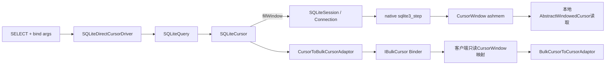
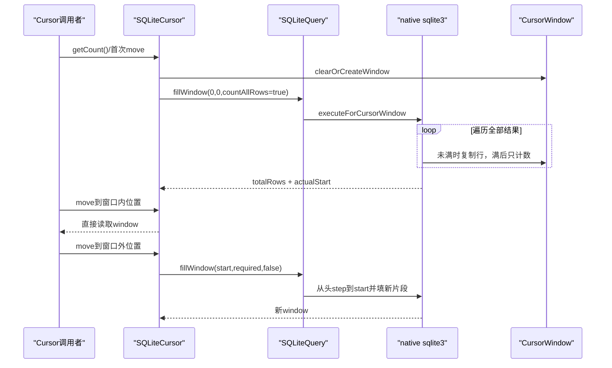
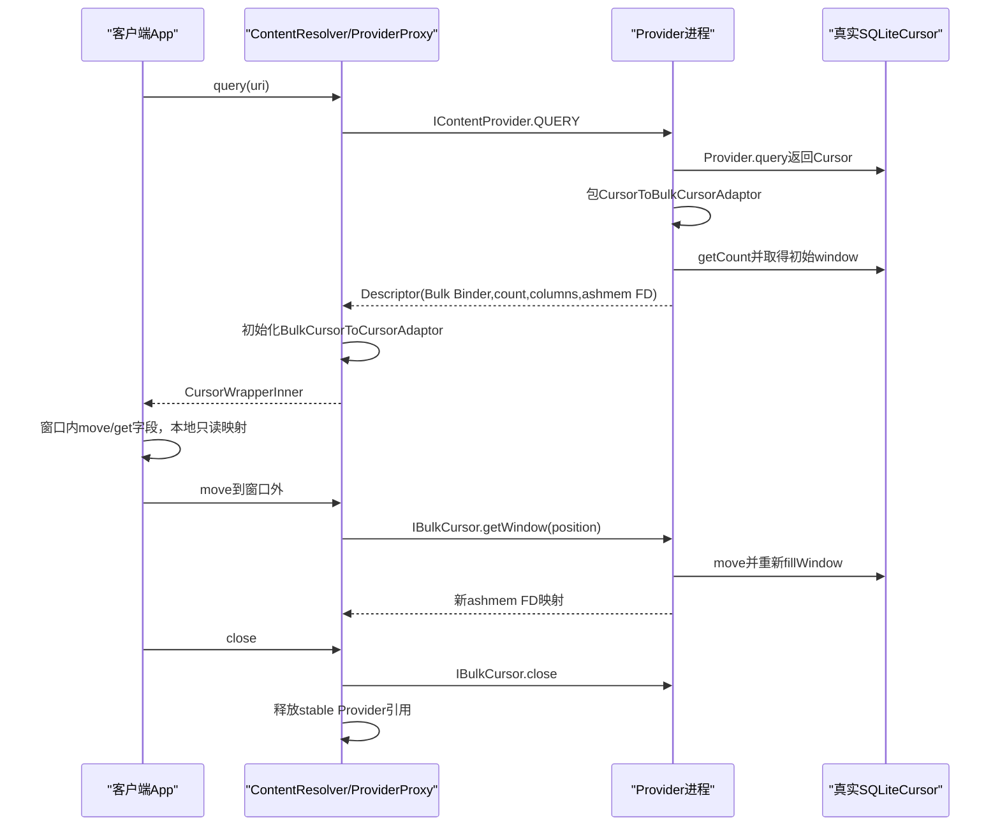

# 285 Android SQLiteQuery、SQLiteCursor、CursorWindow、窗口填充、跨进程BulkCursor与大结果集链

## 1. 本章目标

第284章讲连接和事务，本章沿SELECT结果向上追：SQL怎样变成`SQLiteQuery`和`SQLiteCursor`，为什么Cursor可代表十万行却只持一个小窗口，移动出窗口为何重跑查询，以及ContentProvider跨进程怎样用`IBulkCursor`按窗口搬运数据。

## 2. Android 11版本边界

本文依据本地`android-11.0.0_r48`。默认2MiB CursorWindow、ashmem实现、手写IBulkCursor协议、requery兼容行为均是该tag事实；新版可能改用不同共享内存或调整窗口大小。

## 3. 先区分三个数字

Cursor的`getCount()`是整个结果集行数；Cursor的`getPosition()`是逻辑当前位置；CursorWindow的`getNumRows()`只是当前缓存片段行数。三者相等只是小结果集偶然情况。

## 4. Cursor不是List

Cursor是带当前位置、列元数据、观察者和生命周期的结果访问接口。它通常不把所有行转成Java对象，更不保证所有行同时驻留内存。

## 5. CursorWindow是什么

它是装若干连续行的native共享内存缓冲区，保存NULL、INTEGER、FLOAT、STRING、BLOB五类字段。窗口有全局`startPosition`，行访问时以`row-startPos`换成本地行号。

## 6. 源码地图

```text
frameworks/base/core/java/android/database/sqlite/SQLiteDatabase.java
frameworks/base/core/java/android/database/sqlite/SQLiteDirectCursorDriver.java
frameworks/base/core/java/android/database/sqlite/SQLiteQuery.java
frameworks/base/core/java/android/database/sqlite/SQLiteCursor.java
frameworks/base/core/java/android/database/AbstractCursor.java
frameworks/base/core/java/android/database/AbstractWindowedCursor.java
frameworks/base/core/java/android/database/CursorWindow.java
frameworks/base/core/java/android/database/CursorToBulkCursorAdaptor.java
frameworks/base/core/java/android/database/BulkCursorToCursorAdaptor.java
frameworks/base/core/java/android/database/BulkCursorNative.java
frameworks/base/core/jni/android_database_SQLiteConnection.cpp
frameworks/base/libs/androidfw/CursorWindow.cpp
```

## 7. 两条使用链

应用直接查自己的SQLite时，Cursor和窗口都在本进程；通过ContentResolver查远程Provider时，真实Cursor留在Provider进程，客户端拿到`BulkCursorToCursorAdaptor`和当前窗口的只读映射。

## 8. 总体数据流图



## 9. query API先拼SQL

`SQLiteDatabase.query()`通常借`SQLiteQueryBuilder.buildQueryString`生成SELECT，再进入`rawQueryWithFactory`。selectionArgs作为值绑定，projection、table、order等结构部分不是占位符。

## 10. rawQuery创建Driver

`rawQueryWithFactory`建立`SQLiteDirectCursorDriver(db,sql,editTable,cancellationSignal)`，driver再创建`SQLiteQuery`，绑定字符串参数，并由默认或自定义CursorFactory产生Cursor。

## 11. Driver保存可requery信息

它持db、SQL、editTable、CancellationSignal和当前SQLiteQuery；`setBindArguments`可更新绑定，`cursorRequeried`等回调在默认实现中基本为空，但为旧Cursor协议保留扩展点。

## 12. SQLiteQuery继承SQLiteProgram

Program保存数据库引用、SQL和绑定参数，能从Database取得当前线程Session及connection flags。SQLiteQuery本身不维护行位置，它只提供“把查询结果填入窗口”的操作。

## 13. Cursor构造会读取列名

`SQLiteCursor`构造时执行`query.getColumnNames()`，需要prepare语句并取得native列元数据；但此时通常还没有sqlite3_step枚举行数据。

## 14. 本地查询具有惰性

直接`db.rawQuery()`返回Cursor不等于完整查询已跑完。第一次`getCount()`或移动导致`onMove→fillWindow`时，才会真正step结果行。

## 15. 惰性有异常时机差异

SQL prepare阶段错误可能在构造时出现，读取行、转换或数据库执行错误可能在getCount/move时出现。因此只成功拿到非null Cursor不能证明整个查询可成功枚举。

## 16. SQLiteCursor不是线程安全的

类注释明确说内部不同步。多个线程共享同一Cursor会竞争`mPos`、mWindow和生命周期；若确有需要，调用者必须同步，但通常更应让Cursor归一个消费线程。

## 17. Cursor初始位置是-1

AbstractCursor的`mPos`表示当前位置；-1是第一行之前，`count`是最后一行之后。读取字段前应先成功move，不能把刚返回Cursor当作已经指向第0行。

## 18. moveToPosition先取得count

AbstractCursor首先调用`getCount()`校验边界。对SQLiteCursor首次move而言，这往往先触发全量计数与首窗口填充，再进行具体位置的onMove。

## 19. 越界移动也更新哨兵位置

position≥count时把mPos置count并false；position<0时置-1并false。字段getter再调用checkPosition会抛`CursorIndexOutOfBoundsException`。

## 20. 同位置移动是快路

若目标position等于mPos，直接true，不调用onMove，也不会重新验证或刷新窗口。数据变化不会因为重复move到同一行自动重查。

## 21. SQLiteCursor.onMove只保证目标行在窗口

如果目标落在`[window.start, start+numRows)`内，直接true；否则调用fillWindow(newPosition)。它不为每次逐行移动执行SQL。

## 22. 首次getCount会fillWindow 0

`mCount`初始为`NO_COUNT=-1`。getCount调用`fillWindow(0)`，不仅计算总数，也顺便把从开头可容纳的一段结果放入window。

## 23. 第一次填充countAllRows=true

SQLiteCursor调用`mQuery.fillWindow(window,requiredPos,requiredPos,true)`。native即使窗口已满仍继续step但不再复制，用于得到完整`totalRows`。

## 24. 这不是SELECT COUNT星号查询

调试日志虽然写“received count(*)”，实现没有另发`SELECT COUNT(*) FROM (...)`；native实际枚举原查询所有结果行，边填首窗口边计数。

## 25. 首次count可能很贵

复杂JOIN、无索引过滤或十万行结果会被枚举到SQLITE_DONE。因此Cursor节省的是同时保存全部行的内存，不代表`getCount()`的数据库工作只处理一页。

## 26. 窗口容量按实际行宽估计

首填后`mCursorWindowCapacity = window.getNumRows()`。它是当前查询首段在当前窗口中容纳的行数，不是固定系统常量；字段越大，能容纳的行越少。

## 27. 后续填充不再全量计数

已有mCount时，refill传`countAllRows=false`；native窗口满即可停止step，返回值这次可能不是全结果数，SQLiteCursor也刻意忽略它。

## 28. 默认窗口起点向前留三分之一

`cursorPickFillWindowStartPosition(pos,capacity)`返回`max(pos-capacity/3,0)`，希望窗口约1/3在目标前、2/3在目标后，兼顾前后小幅滚动。

## 29. forwardOnly从目标行开始

调用`setFillWindowForwardOnly(true)`后，refill的startPos直接等于requiredPos，适合只向后遍历；它不改变已填窗口，也不改变SQL排序和总count。

## 30. 窗口命中与重填时序



## 31. native每次先清window

`nativeExecuteForCursorWindow`调用`window->clear()`和`setNumColumns`，因此refill替换旧片段，不是不断在原窗口尾部追加所有结果。

## 32. native仍从查询开头step

prepared statement执行从第0行开始；在达到startPos前只step并跳过复制。跳到很靠后的位置可能需要再次扫描前面大量结果，这是大Cursor随机seek昂贵的根因。

## 33. 它不会自动改写SQL加OFFSET

窗口层不知道任意SQL怎样安全分页，只能重跑并skip。真正的大数据分页应由业务查询设计稳定keyset/limit，而不是期待CursorWindow替SQL优化。

## 34. requiredPos必须进入窗口

若按预测start开始填，窗口在到requiredPos前就满，native清窗、把start向后推进已加入行数，再尝试复制，尽量确保调用者真正请求的那一行存在。

## 35. 行宽变化会打破容量预测

首窗口可能多是短字符串，后面突然出现大BLOB；按首段行数推算的start会过早。requiredPos重定位逻辑就是对此类不均匀行宽的补救。

## 36. 一行都放不下会抛TOOBIG

如果结果不空却`addedRows==0`，native抛`SQLITE_TOOBIG`并写“Row too big to fit into CursorWindow”。它不会把单个字段自动拆成多个窗口。

## 37. 不要在Cursor中返回巨大BLOB

图片、视频或大文档应通过`openFile/openAssetFile`等FD流式传输；Cursor只返回ID、路径/URI、大小和轻量元数据。否则单行可超过窗口并使整个查询失败。

## 38. 多列也消耗目录空间

即使字段值很小，每行还需要row slot和每列field slot。超宽projection会减少窗口可容纳行数，所以只查真正需要的列既省SQL工作也省共享内存。

## 39. 字段复制按SQLite动态类型

native逐列看`sqlite3_column_type`，分别putString、putLong、putDouble、putBlob、putNull。Cursor getter可以做部分类型转换，但原始FIELD_TYPE来自窗口保存类型。

## 40. 复制半行失败会撤最后一行

先allocRow，再逐列put；任一列空间不足，调用`freeLastRow()`，避免留下列不完整的可见行，然后把窗口标满。

## 41. SQLITE_BUSY存在短重试

fill native遇LOCKED/BUSY每次sleep约1ms，超过源码阈值后抛“retrycount exceeded”。这段约几十毫秒的循环不是连接池30秒busy日志，也不是通用busy_timeout。

## 42. CancellationSignal覆盖step过程

SQLiteQuery把创建时signal一路传到Session和Connection；native progress handler观察cancel并中止执行。取消后通常抛OperationCanceledException，但已经读到Java窗口的数据不代表查询可继续复用。

## 43. corruption从Query回调Database

SQLiteQuery捕获`SQLiteDatabaseCorruptException`时调用`onCorruption()`再重抛；一般SQLiteException只记录SQL后重抛。它和第284章打开阶段的损坏处理是不同触发点。

## 44. fill失败主动关闭窗口

SQLiteCursor捕获RuntimeException后`closeWindow()`，降低调用者没处理异常也没close时的共享内存泄漏。但Cursor/Query其余资源仍应由调用者finally或try-with-resources关闭。

## 45. AbstractWindowedCursor负责字段读取

`getString/getLong/getBlob/getType`先checkPosition，再用全局mPos访问mWindow；CursorWindow内部减startPos找到局部行。业务无需手工做偏移换算。

## 46. checkPosition还检查窗口是否存在

位置合法但window为null会抛`StaleDataException`，典型原因是deactivate或close后继续读取。合法逻辑位置不代表底层数据仍有效。

## 47. Cursor严格拥有当前Window

`setWindow(new)`会close旧window再接管新window；Cursor close/deactivate也close它。调用者把窗口交给Cursor后不能假设自己仍可独立管理其生命周期。

## 48. clear与close不同

clear保留同一native/ashmem分配、重置start/rows/columns以复用；close通过SQLiteClosable引用归零dispose，native pointer置0，之后不能再用。

## 49. 默认窗口是2048KiB

AOSP r48资源`config_cursorWindowSize=2048`，Java乘1024得到2MiB。厂商资源可能overlay；显式`CursorWindow(name,sizeBytes)`也可指定，但long最终转int传native。

## 50. 2MiB是上限而非立即实占承诺

Java注释说明随写入动态使用，实际数据可低于指定上限但不能超过；native用ashmem region映射，进程还持FD和地址空间资源。

## 51. 本地窗口初始可读写

producer进程创建ashmem，设为读写并mmap；随后把ashmem保护收紧为只读可共享。已存在的producer映射仍用于填充，而parcel接收方映射为PROT_READ。

## 52. 跨进程不是复制2MiB到Binder缓冲

`writeToParcel`写窗口名和dup后的ashmem文件描述符；客户端从FD mmap同一共享区域只读。Binder承担控制信息和FD传递，不承载全部行字节副本。

## 53. 客户端拿到的是独立映射对象

`createFromParcel`读取FD、dup为CLOEXEC、校验ashmem大小并PROT_READ映射，再建立新的native CursorWindow包装。双方Java对象不同，但指向共享内容。

## 54. 远端Window不能clear或put

native CursorWindow带`mReadOnly=true`，clear会INVALID_OPERATION。客户端Adaptor只读取；需要新片段时通过IBulkCursor请求Provider填一个producer窗口。

## 55. Parcelable返回值会消费一份引用

服务端在把window作为Binder返回值前额外`acquireReference()`，`PARCELABLE_WRITE_RETURN_VALUE`写完再release，平衡跨Parcel临时所有权，避免发送过程中窗口过早dispose。

## 56. CursorWindow泄漏会消耗FD和共享内存

Java有CloseGuard和按callingPid的窗口统计，finalize只做兜底告警/清理。大量未close Cursor可导致CursorWindowAllocationException或FD耗尽。

## 57. Cursor列名缓存一次

SQLiteCursor构造时把query列名保存到`mColumns`；`getColumnNames()`直接返回该数组。requery改变参数但不应改变projection列结构，否则元数据契约会不一致。

## 58. getColumnIndex惰性建Map

第一次按名查列才建立HashMap，重复列名后出现者覆盖前者。SQL projection若产生同名列，应使用明确alias，不能依赖重复名定位。

## 59. 带table前缀只做兼容剥离

传`table.column`会记录错误堆栈日志，再取最后一个点后的column查Map。这是历史hack，不是正式支持任意限定名。

## 60. setSelectionArguments要配合requery

driver更新SQLiteQuery绑定参数，但注释明确新值在requery后才生效。只set不requery，当前window和mCount仍是旧结果。

## 61. requery先清窗口与状态

SQLiteCursor确认未closed且db open，在同步块内clear window、mPos=-1、mCount=NO_COUNT，再通知driver，随后走AbstractCursor.requery重新注册观察者并发changed。

## 62. requery不会立即重新装全结果

状态重置后通常仍是惰性；下次getCount/move再fill。旧API已deprecated，现代代码更安全的方式是close旧Cursor并执行新query。

## 63. requery失败兼容返回false

SQLiteCursor捕获IllegalStateException只记warning并false；跨进程Adaptor失败也会deactivate。调用者若忽略boolean，之后可能读到StaleDataException。

## 64. deactivate与close语义不同

deactivate使数据暂时无效，旧设计允许requery复活；close是终止生命周期，之后requery不能恢复。两者都会经AbstractWindowedCursor关闭当前window。

## 65. SQLiteCursor.close还关SQLiteQuery

super.close关闭观察者和window，随后同步close mQuery并通知driver。只丢掉Cursor Java引用而不close，会让这些资源等到不确定的GC时机。

## 66. finalize只在window非null时主动close

r48 finalize检查`mWindow != null`才发StrictMode泄漏并close；若尚未触发窗口而Query仍存在，这段条件值得审计，不能把finalizer当可靠全面生命周期管理。

## 67. ContentProvider本地返回普通Cursor

Provider的query实现可返回SQLiteCursor、MatrixCursor或包装器。IContentProvider Binder层会统一把它变成CrossProcessCursor并包`CursorToBulkCursorAdaptor`。

## 68. 非CrossProcessCursor也能跨进程

服务端使用`CrossProcessCursorWrapper`包普通Cursor；其getWindow可能null，此时Adaptor自己建mFilledWindow并调用通用`cursor.fillWindow`逐行复制。

## 69. 通用fillWindow会保存原位置

`DatabaseUtils.cursorFillWindow`记oldPos，从请求位置开始move/alloc/put直到满，再move回oldPos。对自定义Cursor而言，填窗口可能触发大量getter和move回调。

## 70. 通用填充遇大行只停止

任一put失败会freeLastRow并跳出，不像SQLite native路径那样统一抛“Row too big”。若第一行就失败，可能返回非null但0行的窗口；客户端Adaptor只检查window非null，move甚至可能先返回true，直到字段访问才暴露范围问题。这是自定义Cursor需要主动防守的r48边界。

## 71. 初次跨进程返回Descriptor

`BulkCursorDescriptor`包含IBulkCursor Binder、columnNames、wantsAllOnMoveCalls、count和可选初始window。这些足以在客户端重建Cursor外观，但不传Provider真实Cursor对象。

## 72. Provider端Descriptor会强制getCount

`getBulkCursorDescriptor()`调用`mCursor.getCount()`。若底层是SQLiteCursor，这会枚举完整结果并填首window；因此远程query通常在IContentProvider QUERY reply前已经执行主要首轮工作。

## 73. ContentResolver客户端又调用一次getCount

代理Adaptor已经从descriptor保存count，所以Resolver的`qCursor.getCount()`只是读取mCount；它的目的仍是强制查询已执行并让异常在query调用内暴露，而真正远程工作多已在服务端构造descriptor时完成。

## 74. 本地和远程的惰性边界不同

本地rawQuery可把首次step推迟到消费；远程ContentProvider必须先给客户端总count和初窗，因而在Binder query返回前强制执行。不能把本地经验直接套到ContentResolver query耗时。

## 75. 客户端看到标准Cursor接口

`ContentProviderProxy.query`收到descriptor后初始化`BulkCursorToCursorAdaptor`并返回。业务通常不知道背后每次跨窗会发生同步Binder调用。

## 76. 窗口内移动不发getWindow Binder

客户端onMove先检查本地只读窗口范围；命中则直接读取。只有越界才同步调用远端`IBulkCursor.getWindow(newPosition)`。

## 77. wantsAllOnMoveCalls是额外协议

若目标仍在窗口且descriptor声明true，客户端也会调用远端onMove；默认很多Cursor不需要。它适合依赖每次移动副作用的特殊Cursor，但增加IPC。

## 78. 远端getWindow先移动真实Cursor

Provider Adaptor在锁内`mCursor.moveToPosition(position)`；失败则清辅助window并null。成功后若真实Cursor自带window就直接取，否则填mFilledWindow。

## 79. SQLiteCursor跨窗会在Provider重跑SQL

客户端越界→Binder getWindow→Provider真实SQLiteCursor onMove→fillWindow→native从查询开头step。跨进程只是多了一层IPC，窗口重填的数据库成本仍在Provider进程。

## 80. 客户端setWindow会关闭旧映射

BulkCursorToCursorAdaptor收到新window后交给AbstractWindowedCursor；旧客户端mapping随close释放。服务端自己的producer window仍由真实Cursor控制。

## 81. Binder调用是同步的

getWindow、onMove、requery、close均使用有reply的transact，不是oneway。主线程快速滚动到窗口外，可能直接等待Provider SQL和窗口映射。

## 82. BulkCursor协议没有逐字段Binder getter

它以窗口批量交付行，客户端字段读取全在本地共享内存完成。这比每个`getString()`都跨Binder高效得多，也是“Bulk”名字的意义。

## 83. ContentObserver桥接随Cursor建立

客户端Adaptor提供IContentObserver Binder；Provider端建立ContentObserverProxy注册到底层Cursor。底层notify变化时再把onChangeEtc转回客户端Cursor观察者。

## 84. 数据变化不会自动改当前window

通知只告诉观察者“结果可能失效”；不会原地patch共享window或自动重跑SQL。调用者需重新query，旧requery协议虽存在但已经deprecated。

## 85. 客户端死亡会关闭Provider Cursor

Provider端ObserverProxy的Binder同时linkToDeath给CursorToBulkCursorAdaptor；远端死亡时`binderDied→disposeLocked`注销观察者、close真实Cursor并关辅助window。

## 86. 正常close也要走远端

客户端CursorWrapper close→BulkCursorToCursorAdaptor.close→IBulkCursor.close→Provider dispose真实Cursor；ContentResolver外层还释放stable Provider引用。漏close会同时拖住Cursor与Provider生命周期。

## 87. 为什么Resolver升级stable引用

query最初用unstable Provider尝试，拿到Cursor后再获取stable引用包在`CursorWrapperInner`，直到Cursor close才release，避免使用远程Cursor期间Provider因仅有unstable关系死亡。

## 88. Provider若已死可能重试一次

初次unstable query抛DeadObjectException，Resolver通知unstableProviderDied、获取stable Provider并重试。已经返回Cursor后的死亡不等于窗口请求透明恢复。

## 89. 远程死亡时onMove返回false

BulkCursorToCursorAdaptor捕获RemoteException，记录远程进程已死并false；AbstractCursor把mPos重置-1。它不会自动重新获得Provider和复建同一查询。

## 90. 跨进程完整时序



## 91. requery跨进程会换Observer

Provider先关辅助window，调用真实Cursor.requery；成功后注销旧proxy、注册新IContentObserver并返回新count。客户端重置位置、close旧window再notify changed。

## 92. requery返回-1表示失败

客户端收到-1就deactivate并false。BulkCursorProxy还在成功requery reply中缓存extras；失败和RemoteException不能当作0行结果。

## 93. extras与respond也走IBulkCursor

BulkCursorProxy首次getExtras时Binder获取并缓存，requery会刷新；respond每次远程调用。extras是查询附加元数据，不在行窗口内。

## 94. CursorWindow只保证片段一致

一次填充由一条SQLite执行产生片段；关闭并重跑新窗口时，如果没有显式长事务和稳定快照，期间数据库可能变化，后续窗口未必与首窗口来自同一时间点。

## 95. 大结果遍历可能出现变化影响

例如前面插入/删除改变排序位置，重跑并skip可能导致重复或漏看。若业务要求严格稳定，应设计事务、版本条件、keyset或先固定ID集合，而非仅依赖Cursor逻辑count。

## 96. 长读事务又会占连接

为了强快照把遍历全包在显式事务，会让第284章的Session持续持连接并可能阻挡checkpoint/写者。稳定性与并发之间要做明确选择。

## 97. OFFSET分页也不是万能稳定方案

数据库变化仍会让OFFSET页漂移，且大OFFSET可能扫描丢弃大量行。稳定唯一排序键上的keyset条件通常更可控，但需结合业务重复/更新语义。

## 98. LIMIT减少count枚举范围

如果SQL自身带LIMIT，SQLiteCursor的totalRows只统计LIMIT后的结果。界面只需一页却查询无界全集，再由window截取，会白做全量getCount工作。

## 99. projection影响能否装下目标行

列表页只选ID和标题通常一个window可容纳很多行；加入大description或blob会频繁跨窗。projection不是只影响网络字段，它直接影响CursorWindow密度。

## 100. ORDER BY需要稳定的tie-breaker

仅按非唯一时间排序，同值行在重跑窗口时次序可变化。追加唯一`_id`作为次级排序可降低分页和窗口重跑的不确定性。

## 101. getCount可能不是UI真正需要的答案

无限流、搜索建议和逐页列表常只需“是否还有下一页”，不必精确总数。使用受限查询和分页模型可避免Android Cursor首轮全枚举。

## 102. MatrixCursor完全不同

MatrixCursor把Object[]行保存在Java内存，跨进程时若无自带window由通用fillWindow复制。小型系统元数据适合，海量数据库行不应先全部塞MatrixCursor。

## 103. 自定义Cursor的getWindow契约很重要

返回非null时Provider adaptor假定Cursor拥有并维护窗口；返回null则Adaptor代填。返回陈旧、范围不含当前位置或错误所有权的window会在跨进程放大成难诊断问题。

## 104. CursorFactory可换Cursor实现

rawQuery允许factory接收SQLiteQuery并产自定义Cursor；但它仍应正确处理window、move、close和线程约束。换类不能绕过底层SQLite查询和Session连接协议。

## 105. 列索引失败要早处理

`getColumnIndex`找不到返回-1，`getColumnIndexOrThrow`会给出列清单并抛。不要把-1继续传getter，否则得到难读的越界异常。

## 106. 数值转换有语义成本

CursorWindow getter对类型存在转换规则，但数据库schema和projection最好返回预期类型。把任意TEXT当Long会产生解析/默认行为差异，不能靠Cursor接口掩盖模型问题。

## 107. close应使用结构化写法

Java/Kotlin用try-with-resources或`use {}`包Cursor，让异常、提前return和空结果都关闭。只在正常循环末尾close是最常见泄漏来源。

## 108. 不要长期缓存Cursor作为数据模型

Cursor绑定窗口、Provider稳定引用、观察者和可能的native程序；ViewModel/跨配置长期持有会让生命周期复杂。读出必要轻量对象后尽快close通常更安全。

## 109. 故障诊断先看是哪一层

`CursorWindowAllocationException`看FD/窗口泄漏；`Row too big`看单行/projection；随机跳转慢看refill重扫；query返回前慢看getCount全枚举；窗口外滚动卡顿看同步BulkCursor Binder与Provider SQL。

## 110. 五个常见误解

Cursor不等全部行内存；window的2MiB不等Binder transaction 2MiB；getCount不等独立COUNT SQL；跨进程字段getter不逐项IPC；notifyChange不自动刷新现有window。

## 111. 一条完整远程读取链

Provider执行SQLiteQuery并把首片段写ashmem，descriptor传count/列/IBulkCursor/FD；客户端本地读当前映射，越界同步请求新window；close沿Binder关真实Cursor并让ContentResolver释放stable Provider引用。

## 112. macOS只读练习一：证明首次count全枚举

执行`rg -n "mCount == NO_COUNT|countAllRows|while.*windowFull|totalRows|Row too big" frameworks/base/core/java/android/database/sqlite/{SQLiteCursor.java,SQLiteQuery.java} frameworks/base/core/jni/android_database_SQLiteConnection.cpp`，解释窗口满后为什么首次调用仍继续sqlite3_step。

## 113. macOS只读练习二：手算窗口起点

执行`rg -n "cursorPickFillWindowStartPosition|mFillWindowForwardOnly|requiredPos" frameworks/base/core/java/android/database/{DatabaseUtils.java,sqlite/SQLiteCursor.java}`，假设首窗容量90行，分别算请求第200行时默认start和forwardOnly start。

## 114. macOS只读练习三：追ashmem跨进程

执行`rg -n "writeToParcel|readFileDescriptor|PROT_READ|writeDupFileDescriptor|config_cursorWindowSize" frameworks/base/core/java/android/database/CursorWindow.java frameworks/base/libs/androidfw/CursorWindow.cpp frameworks/base/core/res/res/values/config.xml`，回答为何窗口不受普通Binder数据拷贝大小的同一种约束，但仍消耗FD和共享内存。

## 115. macOS只读练习四：追BulkCursor生命周期

执行`rg -n "getBulkCursorDescriptor|getWindow\(int position\)|binderDied|CursorWrapperInner|releaseProvider" frameworks/base/core/java/android/{database/CursorToBulkCursorAdaptor.java,database/BulkCursorToCursorAdaptor.java,content/ContentResolver.java}`，画出正常close与客户端死亡两条清理路径。

## 116. 自测：十万行与窗口题

结果十万行、首窗只能装100行，getCount首次是否只step 100行？否。它复制约100行后继续step到DONE以得到十万count；后续refill才可在窗满后停止。

## 117. 自测：跨进程字段读取题

客户端每次`cursor.getString()`都会Binder吗？不会。目标行在当前window时只读本地只读ashmem映射；移动越过窗口边界才调用远端getWindow。

## 118. 自测：大BLOB题

单个BLOB大于窗口怎么办？SQLite native填充可能抛SQLITE_TOOBIG，不能自动跨窗拆字段。应返回URI/FD并流式读内容。

## 119. 复读纠偏记录

复读后修正七个高风险说法：本地Cursor延迟执行但远程descriptor强制count；count由原查询枚举行而非另发COUNT；默认2MiB可overlay；refill从头step而非自动OFFSET；ashmem传FD而非复制整窗；客户端窗口只读；跨窗口重跑若无长事务不保证同一快照。另记录通用Cursor填充首行过大时与SQLite native显式TOOBIG行为不完全相同。

## 120. 本章结论与下一章入口

CursorWindow用有限共享内存把“巨大逻辑结果”变成“可替换连续片段”，代价是首次精确count可能全枚举、随机越窗可能重扫SQL、远程越窗还增加同步Binder。第286章将继续研究ContentProvider的数据库事务与并发实践：批量操作、`yieldIfContendedSafely`、通知时机、取消以及一致性边界。
