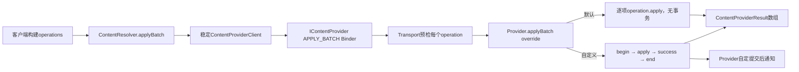
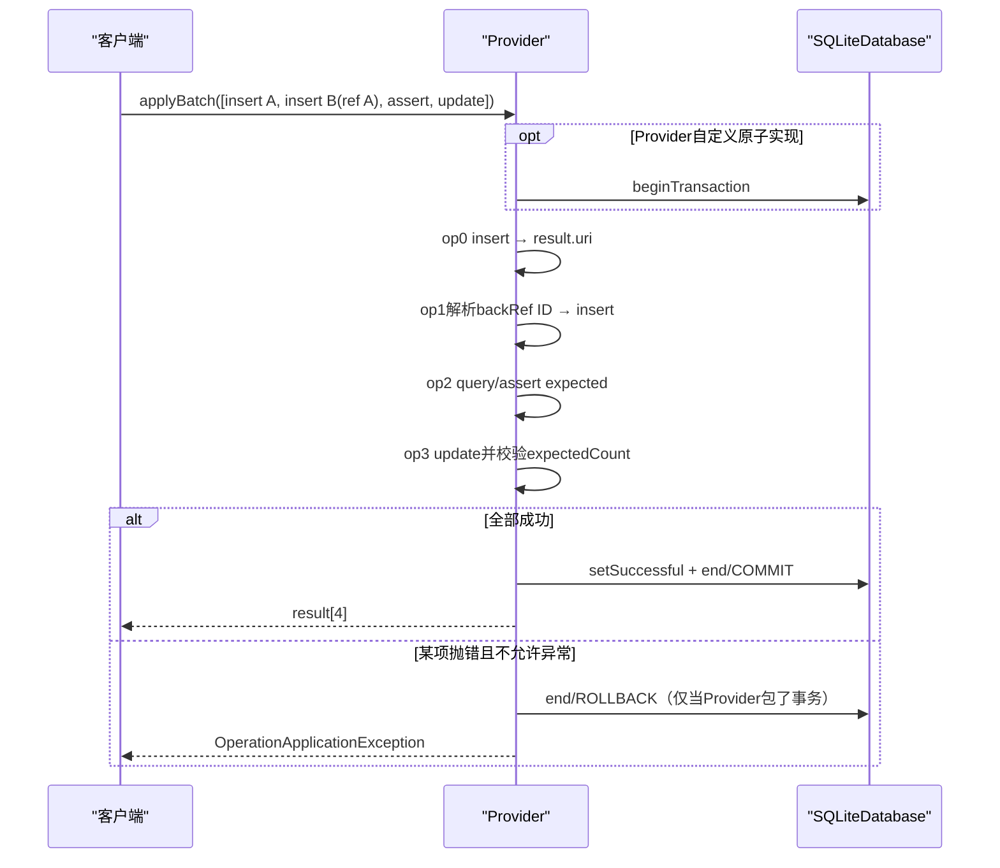
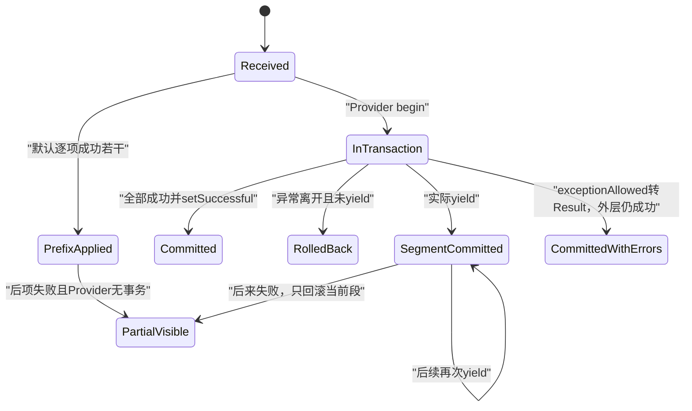

# 286 Android ContentProvider数据库事务、applyBatch、yield、通知时机、取消与一致性边界

## 1. 本章目标

本章回答一个常见但危险的问题：“调用`ContentResolver.applyBatch()`是否天然全成全败？”我们从框架默认循环开始，对比Calendar、Contacts、TV与MediaProvider的真实事务实现，再分析back reference、expected count、exception allowed、yield、通知和取消的边界。

## 2. Android 11版本边界

本文依据本地`android-11.0.0_r48`。`TYPE_CALL`、`withExceptionAllowed`、各系统Provider的批处理和通知策略均按该tag；第三方Provider、Room封装及后续版本不能默认拥有相同语义。

## 3. 最重要结论

`applyBatch`是“一次Binder调用传一组有顺序的操作”，不是框架自动开启SQLite事务。是否原子、是否yield、何时通知、是否跨多个数据库，由目标Provider的override决定。

## 4. bulkInsert也不保证原子

ContentResolver文档直接写“不保证insertions的atomicity”；ContentProvider默认实现只是逐项调用`insert()`。只有Provider主动包事务，批量插入才可能获得单库原子性。

## 5. 源码地图

```text
frameworks/base/core/java/android/content/ContentProvider.java
frameworks/base/core/java/android/content/ContentProviderOperation.java
frameworks/base/core/java/android/content/ContentProviderResult.java
frameworks/base/core/java/android/content/ContentResolver.java
frameworks/base/core/java/android/content/ContentProviderNative.java
packages/providers/CalendarProvider/.../SQLiteContentProvider.java
packages/providers/ContactsProvider/.../AbstractContactsProvider.java
packages/providers/ContactsProvider/.../ContactsTransaction.java
packages/providers/TvProvider/.../TvProvider.java
packages/providers/MediaProvider/.../DatabaseHelper.java
packages/providers/MediaProvider/.../MediaProvider.java
```

## 6. 四层职责

客户端Builder描述操作；Binder Transport校验authority/URI权限并搬运数组；ContentProvider决定顺序与事务；SQLiteDatabase只对同线程、同数据库上真正执行的BEGIN/COMMIT负责。

## 7. 总体调用图



## 8. ContentResolver先获取稳定ProviderClient

Resolver按authority调用`acquireContentProviderClient`，finally中release。这个稳定引用让Provider在同步批处理期间受生命周期保护，但不会给操作添加数据库事务。

## 9. 同一batch只有一个authority入口

API显式传authority，Transport还检查每个operation URI。它用于同一Provider内的相关操作；不同authority不能靠一个applyBatch形成跨Provider事务。

## 10. 数组整体写入一个Parcel

Proxy依次写calling package、feature、authority、数量和每个operation，再同步transact。大批量ContentValues/BLOB会增加Binder transaction大小，不能无限堆操作。

## 11. Binder一次不等数据库一次

一次IPC只是少往返；Provider内部可能执行0个、N个SQLite事务，甚至访问文件、网络或多个数据库。协议边界不能替代存储边界。

## 12. Transport先预检整批权限

第282章已验证：Transport逐operation检查URI、读写需求和AppOps，再进入Provider。这样可避免明显权限错误执行到中途，但业务异常仍可能中途发生。

## 13. TYPE_CALL是特殊操作

insert/update/delete/assert可由框架推断读写，call是Provider自定义能力；Transport通用批量权限逻辑对它存在例外，call实现仍必须做自己的权限验证。

## 14. applyBatch没有CancellationSignal参数

IContentProvider协议只传operations并同步等待结果，没有远程cancel transport。它不同于query/openFile，客户端无法用标准CancellationSignal中断已经开始的批处理。

## 15. 客户端线程中断也不等取消

Binder同步调用没有因为Java Thread.interrupt就自动撤回Provider工作。若客户端进程死亡，Provider Binder线程上已经开始的业务也不保证立刻停止。

## 16. 默认ContentProvider.applyBatch

实现创建等长results数组，从0到N-1调用`operations.get(i).apply(this,results,i)`。没有begin、yield、通知合并、异常清理或线程切换。

## 17. 默认失败可留下前缀结果

第k项抛OperationApplicationException时，前0..k-1项已经调用完成；文档明确说由实现决定有多少项生效。默认实现不会自动补偿前面写入。

## 18. 默认bulkInsert更简单

它逐个`insert(uri,values[i])`，最后无条件返回values.length；默认代码甚至不依据每次insert返回URI统计成功数，具体Provider应按需要override。

## 19. Provider入口可并发

ContentProvider文档提醒insert/update/delete/bulk/apply可由多个线程调用。事务状态和通知集合若用普通成员共享，会发生串批；系统样本常用ThreadLocal。

## 20. Operation有五种类型

`newInsert/newUpdate/newDelete/newAssertQuery/newCall`分别形成TYPE_INSERT、UPDATE、DELETE、ASSERT、CALL。它们共享URI、extras、back reference、yield与exception配置。

## 21. Builder先做结构约束

update必须有非空values；assert必须有values或expectedCount；expectedCount只允许update/delete/assert。build校验不是Provider业务schema校验。

## 22. selection优先于extras同名值

applyInternal先解析extras back references；若Builder显式设置selection/args，再写入标准QUERY_ARG_SQL_SELECTION和ARGS，覆盖extras中相同语义。

## 23. insert结果必须非null

Provider insert返回URI则包装`ContentProviderResult(uri)`；null会变成OperationApplicationException。是否真的创建一行仍由Provider契约保证。

## 24. update与delete返回count

框架调用Bundle版Provider API，得到受影响行数，校验expectedCount后包装`ContentProviderResult(count)`。

## 25. assert会真实query

它用expected values的key组成projection，调用Provider.query并取得count；若给了values，还遍历每行，把Cursor字符串与期望字符串逐项比较。

## 26. assert不是SQL约束

它是批处理中主动读取并抛错的乐观检查；只有Provider把整个batch包在同一数据库事务时，assert和后续写之间才有相应隔离语义。

## 27. assert总会close Cursor

query后在finally关闭Cursor。若Provider错误地返回null，后续getCount会NPE；exceptionAllowed可捕获这类Exception并转为结果。

## 28. call结果是Bundle

TYPE_CALL调用`provider.call(authority,method,arg,extras)`并包装extras结果。call可能做任意副作用，SQLite事务无法自动回滚文件、Binder调用或网络请求。

## 29. Result四选一

`ContentProviderResult`保证uri、count、extras、exception恰有一个非null。调用者必须按operation类型或字段判断，不能假设所有结果都有count。

## 30. 顺序与依赖时序图



## 31. back reference只能向前引用

resolve检查`fromIndex < numBackRefs`；当前项和未来项都非法。results数组虽已分配全长，只有当前索引之前才算有效。

## 32. insert back reference默认取URI末尾ID

前结果有uri时调用`ContentUris.parseId`。Provider返回URI末段不是数字会抛，因此不是所有自定义insert URI都适合作数值back reference。

## 33. count结果转long

前结果无extras/uri时使用count并转long。常用于把前一update/delete影响数填入后续values或selection arg，但业务意义需要调用者自行保证。

## 34. Bundle结果需指定fromKey

前结果有extras时优先`extras.get(fromKey)`。即使fromKey为null也走Bundle取值，不会退回URI/count。

## 35. 异常结果不能正常做back reference

exception结果的extras/uri/count均null，fallback解包count可能NPE。允许某项异常后继续，不代表后续仍可引用它。

## 36. back reference可进values

Builder把某个列值设为`BackReference`，执行前复制新ContentValues并解析；原operation不可变描述不会被就地改写。

## 37. 也可进selection args

SparseArray按参数索引解析并`String.valueOf`，数组长度由最大索引+1决定。跳过中间索引会留下null，需要selection占位符设计一致。

## 38. extras也能引用

Android 11将extras每项复制解析，支持call或Bundle版CRUD的扩展参数依赖前结果。目标Provider是否理解这些extras是另一层契约。

## 39. expectedCount在操作之后检查

update/delete/assert先执行得到numRows，再比较期望。不包事务时，更新已发生后才发现count不符并抛错，无法靠expectedCount自行撤销。

## 40. expectedCount用于乐观并发控制

例如`WHERE _id=? AND version=?`并期望1；若别人已改版本则0并失败。要让失败回滚同batch早先修改，Provider必须包住同一事务且未yield提交。

## 41. exceptionAllowed改变传播方式

为true时`apply`捕获`Exception`并返回`ContentProviderResult(exception)`，循环继续；为false则异常向外终止默认batch或触发Provider事务finally。

## 42. 它不捕获Error

源码catch的是`Exception`，OutOfMemoryError等Error仍传播。不要把exceptionAllowed理解为“任何故障都吞掉”。

## 43. 被允许的异常可与事务一起提交

外层Provider看到operation.apply正常返回一个异常Result，仍可能最终setTransactionSuccessful；此前和后续成功写入都会提交。它表达“这一项可失败”，不是全批回滚。

## 44. SQLite语句自身可能有更细冲突语义

ABORT/FAIL/IGNORE/REPLACE等会影响单语句及事务状态；exceptionAllowed只控制Java异常传播，不能覆盖SQLite已经完成或回滚的部分。

## 45. yieldAllowed只是元数据

ContentProvider框架默认循环完全不读它。只有Calendar、Contacts等override显式调用`operation.isYieldAllowed()`才产生效果。

## 46. flag标在“下一项前的边界”

Calendar与Contacts都在`i>0 && currentOperation.isYieldAllowed()`时先yield，再执行当前operation。因此给第k项标true，允许提交0..k-1后让路，不是执行完第k项才yield。

## 47. yield不一定真的发生

`yieldIfContendedSafely`先问连接池是否有重要waiter；无竞争返回false，原事务继续。设置yieldAllowed只是允许，不是强制切段。

## 48. 真yield会提交旧段

第284章已核准：它COMMIT当前事务、释放连接、可sleep，再以相同模式BEGIN新事务。旧段之后无法被后续失败回滚。

## 49. yield与全批原子性冲突

一旦实际yield，batch变成多个提交段；back references仍跨段可用，但数据库全成全败已不存在。吞吐/响应和原子性必须明确取舍。

## 50. Calendar样本包单库事务

`SQLiteContentProvider.applyBatch`取得writable db，beginTransactionWithListener，ThreadLocal标记applyingBatch，逐项apply，最终setSuccessful，finally end。

## 51. Calendar CRUD识别batch嵌套

applyingBatch为true时，insert/update/delete只执行`*InTransaction`，不再各自begin/end；否则单次CRUD自己包事务。这避免Android Java层嵌套事务栈造成额外语义混淆。

## 52. Calendar会清Binder身份

batch开始后缓存caller信息并`clearCallingIdentityInternal`，用Provider自身身份做内部工作，finally恢复。权限必须在Transport/清身份前完成，内部代码仍需保留真实调用者语义。

## 53. Calendar按操作yield

当前项允许且不是首项时调用`yieldIfContendedSafely(4000)`；只有真正竞争才提交切段并sleep。后来操作失败时，之前已yield段不会回滚。

## 54. Calendar用Listener做提交钩子

onBegin重置状态，onCommit调用`beforeTransactionCommit`，onRollback为空；end后`onEndTransaction`按mNotifyChange决定是否通知及是否请求网络同步。

## 55. 通知应在end之后

Calendar先endTransaction再onEndTransaction。这样观察者重新query时更可能看见已提交状态，也避免回调重入等待当前写事务。

## 56. mNotifyChange只是合并开关

单个insert/update/delete成功影响数据就置true，batch末尾通常只发Provider定义的聚合通知。它没有保留每条变化URI和类型；而且onRollback不清该标志、finally仍调用onEndTransaction，所以Calendar在后项失败回滚后也可能发一次假阳性通知。

## 57. Contacts样本增加批量治理

AbstractContactsProvider用ThreadLocal ContactsTransaction，让单次CRUD在batch内复用外层交易，并维护dirty、batch、已参与数据库与yield失败状态。

## 58. Contacts最多500项无yield点

`++opCount >= 500`时先抛OperationApplicationException，之后才会检查当前operation的yield标志；所以实现实际最多先完成499项，连第500项自身标yield也来不及处理。异常文案仍称最大500，这是r48的判断顺序边界。

## 59. 500阈值不是框架通用限制

它只在Contacts实现中存在；其他Provider可能没有、数值不同或按Parcel大小限制。客户端不能把500当ContentResolver规范。

## 60. Contacts bulk每50项尝试yield

`BULK_INSERTS_PER_YIELD_POINT=50`，不依赖客户端operation flag，因为bulkInsert只有values数组。仍是“尝试”，无竞争时不会切事务。

## 61. Contacts统计真实yield次数

`yield(transaction)`返回true才增加ypCount；异常会markYieldFailed再传播。OperationApplicationException可携带numSuccessfulYieldPoints供诊断。

## 62. Contacts可登记多个SQLiteDatabase

ContactsTransaction用tag→db map和列表，只对未登记db开启NonExclusive事务，并把新db插列表头，以相反参与顺序end。

## 63. 多库不是分布式事务

它会依次对各db setSuccessful并依次end；没有两阶段提交。某库commit后另一库end失败，框架不能原子撤销已提交库。

## 64. Profile库yield策略不同

ContactsProvider2 yield时先从交易移除profile db、标成功并end；它不会立刻重建，后续需要时再加入。主contacts db再调用安全yield。

## 65. 这进一步切断跨库原子性

profile段已经commit，即使后续contacts操作失败也不能回滚。源码选择避免死锁与提高可用性，而非承诺全库强原子。

## 66. Contacts dirty控制通知

insert有URI、update/delete count>0时markDirty；外层真正finish后若dirty才notifyChange。无变化操作不应制造通知风暴。

## 67. 通知发生在transaction.finish后

AbstractContactsProvider先记录notify需要，再finish所有db，之后调用notifyChange，finally清ThreadLocal。观察者不会在数据库仍持事务时被主动唤醒。

## 68. TV Provider展示URI集合合并

它用`ThreadLocal<Set<Uri>>`保存batch notifications；内部CRUD调用notifyChange时只add URI，outer finally在end后逐URI真正通知。

## 69. ThreadLocal避免并发串批

源码注释明确多个线程可能同时applyBatch，若用一个全局Set，A批会拿到B批URI。ThreadLocal让通知集合跟随Binder调用线程。

## 70. TV即使回滚也可能发失效提示

通知循环位于finally且不检查事务是否成功；若前项收集URI、后项失败回滚，仍可能通知。通知本质是“重新查询提示”，允许假阳性，但不应被当作提交证明。

## 71. MediaProvider采用更严格事务状态

DatabaseHelper用ThreadLocal TransactionState保存successful、blockingTasks、按flags聚合的URI集合和backgroundTasks；显式拒绝自己管理层的嵌套事务。

## 72. Media通知只在successful时派发

end先移除ThreadLocal并调用SQLite end、释放schema锁；只有state.successful才运行阻塞任务，并在ForegroundThread发送通知，之后排background任务。

## 73. rollback丢弃排队副作用

successful=false时notifyChanges和tasks不执行。这比TV的finally通知更接近“提交后副作用”语义。

## 74. Media按flags分别合并URI

TransactionState用SparseArray<ArraySet<Uri>>，INSERT/UPDATE/DELETE等不同flags不混，集合去重；提交后用Collection notify减少调用次数。

## 75. Media applyBatch可能跨volume数据库

它先根据每个operation URI找到DatabaseHelper，对尚未active的helper逐个begin，执行super.applyBatch，再对所有新开的helper setSuccessful并end。

## 76. 多volume同样非全局原子

多个独立SQLite文件没有统一commit记录；逐helper提交可能出现部分完成。Media实现提供尽力协调，不是XA事务。

## 77. Media处理已存在外层事务

若helper已经active，普通operation会拒绝nested；只有operation.isExceptionAllowed时允许借用更大外层事务。这个判断是MediaProvider特有策略。

## 78. 单库原子模板

标准结构是begin；try中逐项apply，全部完成后setSuccessful并return；finally中end。setSuccessful必须在最后，任何未允许异常离开都会令end回滚。

## 79. 不要把notify放在事务try中

事务内通知可能让另线程马上query却只看到旧提交，或在后续rollback后收到不存在的变化；还可能造成Binder回调与数据库锁的等待环。

## 80. 最好先记录再提交后派发

记录URI/flags到ThreadLocal交易状态，COMMIT成功后批量通知；rollback直接丢弃。MediaProvider展示了这一模式。

## 81. 但通知永远不是提交回执

ContentService callback可延迟、合并不足、进程死亡或出现TV式假阳性；观察者应重新query，以数据库状态为真相。

## 82. SQLite trigger不会自动notify

trigger修改其他表只发生在SQLite内部，ContentResolver不知道。Provider必须把所有受影响collection URI纳入提交后通知策略。

## 83. 对外副作用不能随SQLite rollback

事务里删除文件、发送广播、调用远程服务或修改另一个Provider后，SQLite rollback无法补偿。应尽量把可延迟副作用排到commit之后。

## 84. 必须事务内完成的文件操作需补偿设计

如果业务要求数据库与文件接近一致，可使用临时文件、rename发布、恢复扫描或操作日志；不能声称一个SQLite BEGIN覆盖文件系统。

## 85. 长batch占住Binder线程

applyBatch在Provider Binder线程同步执行；大量CPU/磁盘工作会占用线程池，其他调用排队，严重时形成Binder线程池饥饿。

## 86. 长事务还占住数据库连接

第284章的Session会在整个显式事务持有一条连接；无WAL时读写更易互堵，WAL也仍只有一个writer。

## 87. yield解决可响应性但牺牲原子性

它不是免费优化。Contacts和Calendar明确选择在客户端允许的边界提交旧段，让其他waiter运行；业务必须接受前段不可回滚。

## 88. 小批次常比随意yield更容易推理

若业务要求全批原子，应控制每批大小、缩短SQL和避免外部工作，而不是在中间yield。若允许分段提交，则应给每段设计幂等恢复。

## 89. 幂等键帮助重试

客户端在RemoteException后不知道Provider是否已提交，盲目重发可能重复insert。唯一业务ID、upsert或操作token可把“不确定提交”变成可安全查询/重试。

## 90. 失败状态图



## 91. OperationApplicationException不等RemoteException

前者表示Provider执行/校验操作失败，可含yield点数；后者表示Binder通信失败。通信失败时“服务端到底执行到哪里”可能未知。

## 92. TransactionTooLarge是调用前后边界

operations全部Parcel化，巨大batch可能根本到不了Provider；返回results也占Parcel。将大BLOB放ContentValues是双重坏设计。

## 93. exception result也需客户端检查

applyBatch正常返回不代表每项成功；使用withExceptionAllowed后应遍历`result.exception`。只判断外层没抛会漏掉允许失败项。

## 94. expectedCount和assert适合前置条件

它们能把“状态不符合预期”转为结构化失败，但只有同一未yield事务才阻止TOCTOU和回滚前项。

## 95. back reference是数据流不是事务

后项能拿到前项ID，只证明执行顺序和results依赖；不证明前项最终commit。后项失败时默认Provider仍可能留下前项。

## 96. 清Binder身份要保存业务caller

Calendar在清身份前读取sync-adapter参数并缓存calling package/uid语义。否则内部权限、审计和owner列可能错误地归给Provider进程。

## 97. 批内递归CRUD要避免重复事务

系统样本用ThreadLocal applyingBatch，让operation.apply调用公开insert/update/delete时转入`*InTransaction`。没有这层会形成嵌套交易和重复通知。

## 98. ThreadLocal只跟随同线程调用

若Provider在batch中把某项异步投到另一线程，ThreadLocal事务/通知状态不会自动传播，那项也不在原SQLite Session事务里。

## 99. 因此事务体不应随意异步化

要么在当前Binder线程完成数据库部分，要么显式在单一工作线程整体调度并同步等待；不能只把某几项fire-and-forget后仍声称batch完成。

## 100. applyBatch返回时机

同步Provider通常在endTransaction和必要的同步收尾后返回；Media通知被投ForegroundThread，可能在返回之后才真正发送。返回成功与观察者收到通知不是同一完成点。

## 101. post-commit任务也可能失败

SQLite已经COMMIT后，通知或后台任务异常不能回滚数据。实现应记录日志、可重试或让任务幂等，而不是把它们放进“数据库原子”承诺。

## 102. 空batch也由Provider定义细节

框架默认返回长度0；Calendar显式提前返回空数组，不打开事务。其他override若先begin再super也可能为空批创建无意义事务。

## 103. Provider可以施加自己的配额

Contacts限制yield间操作数；Provider还可限制总数、值大小或URI组合。ContentResolver通用API不保证任意规模都会被接受。

## 104. Authority相同仍可能多存储后端

MediaStore同authority按volume路由不同db；Provider也可混合SQLite与文件。因此“同authority”只是Binder路由一致，不等于“同一个SQLiteDatabase”。

## 105. 测试必须注入中途失败

只测全成功无法证明原子性。应让第k项expectedCount不符/constraint失败，检查前项是否回滚、通知是否发送、文件副作用是否残留。

## 106. 还要测试真实竞争下yield

无waiter时yield返回false，测试会误以为仍原子。要验证分段语义，必须制造另一线程等待同库重要连接并观察旧段已commit。

## 107. 多库测试要检查部分提交

让第二个db在结束阶段失败很难但很重要；源码没有两阶段提交就是架构证据，产品契约不应许诺无法保证的跨库全原子。

## 108. 诊断先问六个问题

Provider是否override applyBatch？是否begin？是否实际yield？exceptionAllowed是否吞错？涉及几个db/文件？通知是在commit后还是finally无条件发？

## 109. 推荐的文档用语

不要写“applyBatch保证事务”；应写“本Provider在不发生yield且只涉及某SQLite库时，以一个事务执行；允许异常、跨库和外部副作用另有说明”。

## 110. 与前三章的连接

第282章Transport决定能否操作；第283章notify只提示重查；第284章yield会真实提交；第285章观察者重查可能触发窗口查询。本章把四条链闭合成一致性模型。

## 111. 一条稳妥实现模板

预检业务输入→ThreadLocal建事务状态→BEGIN→逐项解析backref/执行/记录变化→无yield时全成功→setSuccessful→END→确认commit后批量notify与执行幂等副作用→清ThreadLocal。

## 112. macOS只读练习一：证明默认不原子

执行`rg -n "public .*applyBatch|operations.get\(i\).apply|public int bulkInsert|insert\(uri, values\[i\]\)" frameworks/base/core/java/android/content/ContentProvider.java`，指出默认实现中缺少哪四个SQLite事务调用。

## 113. macOS只读练习二：手算back reference

执行`rg -n "class BackReference|fromIndex >= numBackRefs|parseId|backRef.count|mExpectedCount" frameworks/base/core/java/android/content/{ContentProviderOperation.java,ContentProviderResult.java}`，推演insert URI末尾42、update count3、异常Result分别被后项引用时的结果。

## 114. macOS只读练习三：比较三种通知策略

执行`rg -n "mTLBatchNotifications|state.successful|notifyChanges|onEndTransaction|mNotifyChange" packages/providers/{TvProvider/src/com/android/providers/tv/TvProvider.java,MediaProvider/src/com/android/providers/media/DatabaseHelper.java,CalendarProvider/src/com/android/providers/calendar/SQLiteContentProvider.java}`，比较rollback后三者是否可能通知。

## 115. macOS只读练习四：证明yield切段

执行`rg -n "isYieldAllowed|yieldIfContendedSafely|SLEEP_AFTER_YIELD_DELAY|MAX_OPERATIONS_PER_YIELD_POINT" packages/providers/{CalendarProvider/src/com/android/providers/calendar/SQLiteContentProvider.java,ContactsProvider/src/com/android/providers/contacts/AbstractContactsProvider.java}`，回答flag属于当前项前还是后，并结合第284章解释为何真yield破坏全批原子性。

## 116. 自测：默认batch题

默认Provider第0项insert成功，第1项expectedCount不符，结果？外层抛OperationApplicationException，但没有框架事务，第0项通常仍生效，第1项update也可能已执行后才发现count不符。

## 117. 自测：允许异常题

事务型Provider中第1项withExceptionAllowed失败，第2项成功，外层最终setSuccessful，结果？第1项返回exception Result，其他成功操作可提交；客户端必须逐项检查。

## 118. 自测：yield题

第2项标yieldAllowed且存在竞争，Provider在它执行前真实yield，之后第3项失败。第0、1项已commit，第2、3所在新段按结果处理，无法再全批回滚。

## 119. 复读纠偏记录

复读后修正八处易错点：applyBatch/Binder一次不等事务；bulk默认计数不检查URI；expectedCount在写后校验；exceptionAllowed可让外层提交；yield flag常作用于当前项之前；真yield提交旧段；同authority可跨库；提交后通知仍可能假阳性。另记录Contacts的500/50仅为Provider策略、Media多helper无两阶段提交、标准batch没有CancellationSignal。

## 120. 本章结论与下一章入口

批处理的一致性必须沿“协议→Provider override→实际数据库数→yield→异常策略→post-commit副作用”逐层证明，不能从API名字推断。第287章继续研究SharedPreferences：内存快照、Editor合并、apply/commit、磁盘队列、进程死亡与多进程失效边界。
