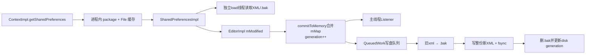
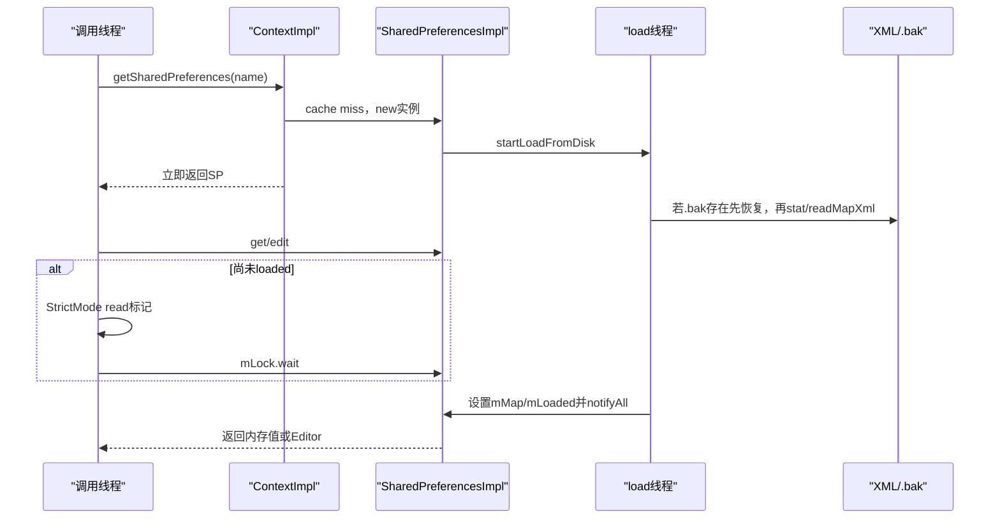
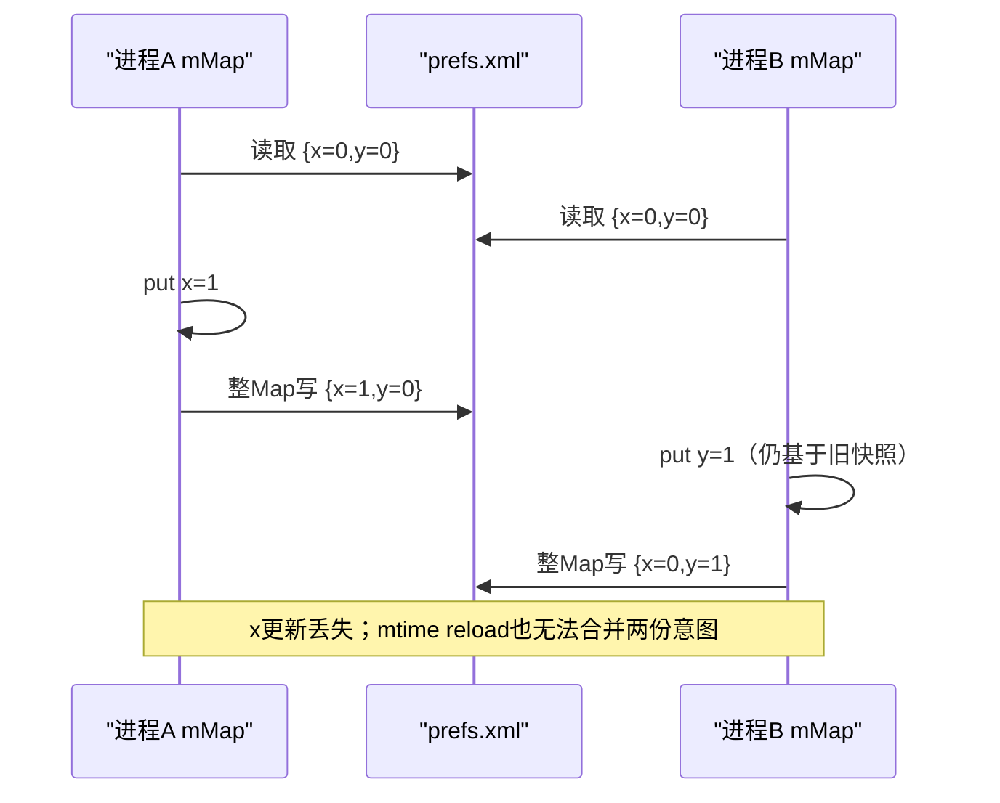

# 287 Android SharedPreferences：内存快照、Editor合并、apply/commit、磁盘队列、进程死亡与多进程失效边界

## 1. 本章目标

本章从`Context.getSharedPreferences`追到XML文件：实例怎样缓存和异步加载，Editor如何合并到进程内Map，`apply()`与`commit()`何时返回、何时通知、何时fsync，`.bak`怎样恢复，以及为何`MODE_MULTI_PROCESS`无法解决并发写。

## 2. Android 11版本边界

本文依据本地`android-11.0.0_r48`。100ms QueuedWork延迟、2把实现锁、generation跳写、clear的R版null-key回调、XML+.bak协议均以该tag为准。

## 3. 先分三种“成功”

Editor内容合入进程内mMap是一层；监听器收到变化是第二层；XML经过write、fsync并替换旧版本是第三层。`apply()`只同步完成第一层，`commit()`等待第三层并返回结果。

## 4. SharedPreferences不是数据库

它把整个键值Map序列化成一份XML，更新不是行级增量，也没有查询、事务日志或跨进程锁。适合少量低频配置，不适合高频计数、大集合或关键业务流水。

## 5. 源码地图

```text
frameworks/base/core/java/android/app/ContextImpl.java
frameworks/base/core/java/android/app/SharedPreferencesImpl.java
frameworks/base/core/java/android/app/QueuedWork.java
frameworks/base/core/java/android/app/ActivityThread.java
frameworks/base/core/java/android/content/SharedPreferences.java
frameworks/base/core/java/android/content/Context.java
frameworks/base/core/java/com/android/internal/util/XmlUtils.java
```

## 6. 文件位置

`ContextImpl.getSharedPreferencesPath(name)`返回应用data目录下`shared_prefs/name.xml`；device-protected与credential-protected Context使用各自data目录。

## 7. 总体链路图



## 8. 同进程同文件通常共享实例

ContextImpl有静态`sSharedPrefsCache`，先按package name取Map，再按File缓存`SharedPreferencesImpl`。不同Context访问同包同路径通常拿同一对象。

## 9. 缓存是每个进程自己的

静态字段只在当前进程地址空间内共享；另一个应用进程有独立实例、mMap、generation和写盘队列。这正是多进程不一致的根源。

## 10. name先映射File再缓存

每个Context还缓存name→File路径；真正SharedPreferences实例以File为key。File路径相同才能命中同一进程级对象。

## 11. 首次mode决定实例配置

只有cache miss时调用`checkMode(mode)`并把mode传给构造器；命中已有实例后不会重新构造。对同一文件用不同mode反复获取，不会产生不同实例。

## 12. Android O起CE解锁门

targetSdk≥O且当前Context是credential-protected storage，用户尚未unlock时首次创建会抛IllegalStateException，避免在凭据加密目录不可用时假装读到空配置。

## 13. 构造立即启动异步加载

SharedPreferencesImpl保存`.xml`、`.xml.bak`、mode，设mLoaded=false、mMap=null，然后新建名为`SharedPreferencesImpl-load`的线程执行loadFromDisk。

## 14. 每个新实例各建加载线程

加载不走统一线程池。短时间首次打开许多不同preferences文件会创建多条短生命周期线程；“构造异步”不等于没有调度成本。

## 15. 第一次读取仍可能阻塞调用线程

所有getter、contains和edit在mLock内调用`awaitLoadedLocked()`；后台尚未读完时当前线程wait。把getSharedPreferences放后台并不保证稍后主线程首次get一定无等待。

## 16. StrictMode主动记主调线程磁盘读

真实I/O在load线程，但await发现未加载会调用`BlockGuard.onReadFromDisk()`，让StrictMode仍能指出调用者触发了等待磁盘的风险。

## 17. wait忽略InterruptedException

await循环捕获中断后继续等到mLoaded，不恢复interrupt标志。它不是可取消加载API，线程中断不能让getter提前返回。

## 18. 加载先恢复backup

若`.bak`存在，源码删除主xml并把backup rename回主文件。它假定backup代表上次写入前的完整版本。

## 19. rename结果没有强校验

恢复路径未检查delete/rename返回值；随后按主文件实际状态读取。极端文件系统错误只能从日志、空Map或后续异常体现。

## 20. XML按Map整体读取

使用16KiB BufferedInputStream和`XmlUtils.readMapXml`，一次构造完整Map。文件越大，启动解析、对象分配和GC成本越高。

## 21. 普通解析异常通常变空Map

readMapXml的Exception被记录但不放进mThrowable，map保持null，加载结束创建空HashMap。损坏XML可能表现为“所有配置恢复默认”，而不是getter抛错。

## 22. 更严重Throwable会使访问失败

外层捕获Throwable写mThrowable；waiter醒来后`awaitLoadedLocked`抛IllegalStateException(cause)。加载finally总notifyAll，避免线程永久等待。

## 23. 成功加载记录mtime与size

除了mMap，还保存`stat.st_mtim`和`st_size`，供旧多进程reload启发式判断“文件是否被别人改过”。它不是内容hash或文件版本号。

## 24. getAll返回浅拷贝Map

实现new HashMap复制键和值引用，Map结构与内部隔开；但Set等可变值仍可能共享引用。接口明确要求返回对象及其内容都当作不可变。

## 25. getStringSet直接返回内部Set

r48没有在getter处复制Set。调用者修改返回集合会绕过Editor、generation、写盘和通知，破坏一致性；正确做法是自己new HashSet后修改再putStringSet。

## 26. putStringSet会复制输入

Editor存入`new HashSet(values)`，所以调用put后再改原Set通常不影响待提交值。输入侧防御复制与输出侧直接返回要区分。

## 27. 类型不匹配会ClassCastException

getInt/getString等直接cast mMap值，不做自动类型转换。同一key从String改成Int后，旧读取代码可能崩溃，而不是返回default。

## 28. default只用于缺失或null

getter取值为null时返回defValue；传null给put等价remove，因此正常持久化Map不把“存在且值为null”作为独立状态。

## 29. edit本身也等待加载

源码TODO希望未来edit+apply无需等读盘，但r48 edit先awaitLoaded。否则无法把局部修改正确合并到已有文件Map。

## 30. 首次加载时序图



## 31. Editor先积累私有修改

每个EditorImpl有自己的mEditorLock、HashMap mModified和mClear。put/remove/clear只修改Editor，不立刻改变SharedPreferences。

## 32. remove使用Editor对象作哨兵

`mModified.put(key,this)`表示删除；put null也按删除处理。该哨兵只在当前Editor内部解释，不会写进XML。

## 33. 同一Editor同key最后调用获胜

mModified是Map，后一次put/remove覆盖前一次条目。调用顺序不会保留成操作日志。

## 34. clear总在具体修改前执行

commitToMemory先clear当前Map，再遍历mModified；所以无论链式调用顺序，clear后本Editor设置的值会保留。接口也把clear描述为先执行。

## 35. HashMap遍历顺序不稳定

多个key的应用与listener收集顺序不能当业务协议。SharedPreferences只承诺最终键值，不承诺回调按put链顺序。

## 36. Editor可以复用但不推荐

commitToMemory会清mModified并重置mClear，之后同一Editor还能继续put；并发语义难读，通常一次逻辑修改创建一个Editor更清晰。

## 37. commitToMemory持全局mLock

它把Editor变更合入共享mMap、维护写盘计数和generation。多个线程apply/commit的内存合并因此串行。

## 38. 有写盘任务时先clone Map

若`mDiskWritesInFlight>0`，当前某个MemoryCommitResult拥有旧mMap作为写盘快照；新提交先`new HashMap(mMap)`，再修改新Map，避免后台序列化时被并发改变。

## 39. 无在途写时可原地修改

为减少复制，mapToWriteToDisk直接指向mMap。随后mDiskWritesInFlight加1，使下一次提交知道必须clone。

## 40. 这是Copy-on-write快照

快照复制是浅复制；StringSet在put时已复制，但若应用通过getStringSet非法修改内部Set，仍可能同时污染写盘快照。

## 41. 没变化不增加generation

删除不存在key、写入equals相同值会continue；只有真实changesMade才`mCurrentMemoryStateGeneration++`。

## 42. 但无变化仍产生写盘结果对象

mDiskWritesInFlight已经加1，后续enqueue会发现generation无需写并成功完成latch。apply/commit调用链仍需把这次在途计数减回。

## 43. listener只收真实变化key

r48实现对相同非null值不加入keysModified，因此通常不回调；接口说“may be called even if existing value”，这是允许其他实现的宽契约，不是本实现必然行为。

## 44. clear单独记录keysCleared

即便Map本来为空也设true；是否发null-key回调还受compat change控制，旧target不会因clear收到该特殊回调。

## 45. Android R目标收到clear的null key

`CALLBACK_ON_CLEAR_CHANGE`为EnabledAfter Q；设备R上target R及以后启用。它不是为每个被清key逐个回调。

## 46. listener集合在提交时快照

只有当WeakHashMap当前非空才复制成HashSet放进MemoryCommitResult。提交后再注册的listener不会收到这次变化。

## 47. listener注册表使用弱引用

应用必须自己强持有listener；只new后register而无其他引用，GC可使它悄然消失。这不是SharedPreferences随机漏通知。

## 48. 所有listener最终在主线程

若notify发生在main Looper就直接调用；否则post到`ActivityThread.sMainThreadHandler`后递归执行。后台commit也不会在后台线程回调业务listener。

## 49. 回调发生在锁外

MemoryCommitResult已保存listener/key快照，通知不持mLock，避免listener内再次读写SharedPreferences造成直接锁重入问题。

## 50. apply先完成内存合并

`apply()`同步调用commitToMemory，因此返回前同进程通过同一缓存实例读取即可看到新值。

## 51. apply不返回磁盘失败

方法返回void。后台打开文件、XML写、fsync或rename失败只记日志和结果latch，调用者没有成功boolean。

## 52. apply登记一个finisher

awaitCommit等待该MemoryCommitResult的latch；加入QueuedWork finishers，写盘后postWrite先等latch再移除，供组件生命周期收尾统一等待。

## 53. apply磁盘任务允许延迟100ms

enqueue传`shouldDelay=true`，QueuedWork在`sCanDelay`时发100ms延迟消息，用于合并短时间密集apply并减少同步次数。

## 54. apply可以跳过中间generation

异步write只在mcr generation仍等于当前最新内存generation时需要落盘；若后续apply已产生更新，旧任务可标“未写但成功”，等待最新快照写整Map。

## 55. 跳写不等丢旧key

最新Map是在旧Map上合并后的完整快照，最终XML包含尚未被覆盖的早期修改。只有业务后续覆盖/clear才改变最终值。

## 56. apply先通知后落盘

源码注释明确允许，因为同进程listener拿到同一实例，内存已更新。listener触发时拔电或强杀仍可能让磁盘保持旧值。

## 57. commit同样先改内存

`commit()`不是等写成功才让内存可见；它先commitToMemory，再enqueue并await latch，最后通知listener并返回writeToDiskResult。

## 58. 无其他在途写时commit在当前线程写

若mDiskWritesInFlight恰为1，说明只有本次，writeToDiskRunnable直接run。主线程commit会真实write+fsync并可能触发StrictMode或卡顿。

## 59. 有在途写时commit排队等待

它进入QueuedWork且不允许延迟，然后阻塞自己的latch；同一SharedPreferences之前的apply必须先按队列完成。接口文档也明确commit会等待未完成apply。

## 60. commit的true是持久化结果

成功写或判断无需再写时返回true；打开/rename/XML/fsync路径失败返回false。它不是“值是否发生变化”的返回值。

## 61. commit被中断会返回false

await捕获InterruptedException后直接return false，且不会执行后面的notifyListeners；磁盘任务可能仍继续。源码也未恢复interrupt标志。

## 62. commit/apply对比图

```text
Editor → commitToMemory（两者都立即更新mMap）
  ├─ apply  → 添加finisher → 后台队列（可延迟/跳旧代）→ 先返回、可先通知
  └─ commit → 无在途写：当前线程write+fsync
             有在途写：入队并等待前序与本次latch
             → 磁盘结果确定后通知并返回boolean
```

## 63. 写盘任务按入队顺序单线程处理

QueuedWork用进程全局LinkedList，`sProcessingWork`保证只有一个处理者；独立HandlerThread名`queued-work-looper`，优先级FOREGROUND。

## 64. 队列是进程全局的

不同SharedPreferences文件以及其他使用QueuedWork的任务共享队列。某个慢fsync可拖延后续异步工作和生命周期finisher。

## 65. processPendingWork克隆当前队列

锁内clone并清原列表、移除MSG_RUN，随后锁外逐Runnable执行。执行期间新加入任务留待下一轮，但相关finisher仍可能等待它自己的latch。

## 66. waitToFinish会禁止继续延迟

它移除延迟消息、设`sCanDelay=false`、允许当前线程磁盘写并主动processPendingWork，再逐个运行finisher，最后恢复可延迟。

## 67. lifecycle收尾可能在主线程做I/O

waitToFinish为保证状态切换前落盘，可能把排队工作直接在调用线程完成；这就是apply偶尔仍让Activity stop或Service完成阶段卡顿的来源。

## 68. 512ms只是等待告警阈值

QueuedWork统计wait时间，超过512ms记录直方图日志；不是超时取消。它会继续等finisher完成。

## 69. Activity新旧target等待点不同

Activity pause仅pre-Honeycomb调用wait；post-Honeycomb在stop阶段等待。SharedPreferences文档的“生命周期保障”通过这些ActivityThread边界实现。

## 70. Service和Receiver等也有收尾等待

ActivityThread在Service start/stop完成等路径调用waitToFinish，Broadcast Receiver完成链也有对应调用。apply并非每次返回后立即fsync，但正常组件交接前会尽力冲刷。

## 71. 正常生命周期保障不是强杀保证

`kill -9`、内核杀进程、断电不会先运行ActivityThread waitToFinish。apply已进内存但未写盘的generation仍可能丢失。

## 72. commit也不能对抗存储硬件所有故障

它调用FileUtils.sync并返回软件层结果，提高持久性，但介质/内核故障仍超出API绝对承诺。关键数据需要更合适存储和恢复策略。

## 73. 写盘是整Map重写

`XmlUtils.writeMapXml(mcr.mapToWriteToDisk,str)`序列化全部键。修改一个boolean也会重写整个XML，所以文件尺寸和频率决定性能。

## 74. r48没有直接使用AtomicFile类

SharedPreferencesImpl手写相似的backup协议：旧主文件rename为`.bak`，写新主文件、fsync、设权限、stat成功后删除backup。

## 75. 已有backup时删当前主文件

如果`.bak`已存在，说明旧完整版本仍保留；写前删除当前主文件而不覆盖backup，避免把可能损坏的新文件当备份。

## 76. rename旧文件失败则本次失败

无法把现有xml改名为backup时，立即setDiskWriteResult(false,false)并返回，不冒险覆盖唯一已知版本。

## 77. 新文件写完必须fsync

writeMapXml后`FileUtils.sync(str)`，再close、按mode设权限并stat。fsync超过256ms会触发耗时统计日志。

## 78. 成功最后删除backup

删除backup后更新mDiskStateGeneration并把result置true。若进程在删backup前崩溃，下次优先恢复backup，可能退回旧版本而不是使用已写新主文件。

## 79. 写异常会删不完整主文件

捕获XmlPullParserException/IOException，尝试delete新主文件并返回false；backup保留供下次加载恢复。

## 80. backup协议偏向旧数据完整性

崩溃窗口中宁可恢复上一次完整XML，也不冒险读取半写新XML。这提供单文件crash recovery，但不是事务日志和历史版本库。

## 81. generation只存在内存

`mCurrentMemoryStateGeneration`和`mDiskStateGeneration`不写入XML，进程重启后重新从初始字段开始使用；它们只协调当前进程写任务。

## 82. mtime/size用于发现“外来写”

自己的成功写更新stat缓存；当没有mDiskWritesInFlight时，reload比较文件mtime与size。相同mtime粒度和相同长度的内容变化可能漏检。

## 83. MODE_MULTI_PROCESS触发检查时机有限

只有再次调用ContextImpl.getSharedPreferences命中缓存时，才`startReloadIfChangedUnexpectedly`；长期持有旧sp直接get不会每次stat。

## 84. reload本身仍是异步

发现变化后startLoad把mLoaded=false并启动线程；随后的getter会等待。两个进程没有消息通知或版本握手。

## 85. 在途本进程写会跳过外变检测

`mDiskWritesInFlight>0`时hasFileChangedUnexpectedly直接false，TODO还写着是否应等待pending writes。恰逢另一进程写入时可能错过reload。

## 86. 多进程同时写是整Map覆盖

进程A和B各从旧XML加载，各自改不同key，然后分别写整Map；后写者可把前写者的另一个key还原成旧值，典型lost update。

## 87. 没有跨进程文件锁

mLock、mWritingToDiskLock和QueuedWork都只在单进程内。两个进程还可能同时操作`.bak`与主xml，使恢复协议互相干扰。

## 88. MODE_MULTI_PROCESS已废弃

Context文档明确说它不可靠且无并发修改合并机制，建议ContentProvider等显式跨进程数据管理方案。flag不是“开启共享内存事务”。

## 89. SharedPreferences接口也直说不支持多进程

Android 11接口类注释直接强调不支持cross-process。即使历史flag仍有代码路径，也只能作为兼容启发式reload理解。

## 90. 多进程丢更新时序



## 91. 同进程并发是按提交调用串行合并

多个Editor可并行准备，真正commitToMemory受mLock串行；不同key通常合并，同key由后进入commitToMemory者覆盖，不按Editor创建时间决定。

## 92. clear会覆盖其他Editor的新值

早创建Editor A稍后clear+put，期间Editor B已apply新key；A最终commit时先清当前最新mMap，能删掉B值。“最后提交获胜”是执行时语义。

## 93. 磁盘顺序跟随内存generation

在同一实例中commitToMemory分配单调generation，写盘串行且异步旧generation可跳过，最终目标是让磁盘达到最新内存快照。

## 94. listener不是跨进程通知

WeakHashMap只存本SharedPreferencesImpl中的Java listener；另一进程写XML不会通过Binder触发回调，即使之后reload也没有逐key差异通知链。

## 95. deleteSharedPreferences先逐出当前进程缓存

ContextImpl在类锁内remove File对应实例，再删xml和backup，并按残留文件判断结果。其他进程缓存和已持有旧对象不会被同步逐出。

## 96. 已持有旧实例仍可重新写回文件

删除只从Context缓存移除，调用者若保存原SharedPreferences引用，仍可edit/apply，重新创建文件。删除不是对象能力撤销。

## 97. moveSharedPreferences会迁移同名前缀文件

从source到target移动后，若有文件移动则逐出两个路径缓存。它常用于DE/CE迁移，调用前后仍需安排好进程与用户解锁生命周期。

## 98. 敏感信息不应仅靠“private mode”想当然

文件位于应用私有目录并设置权限，但备份、root设备、日志和内存暴露仍需威胁模型。密码/密钥应使用Keystore等专门机制。

## 99. 高频计数不适合apply循环

每次内存合并可能clone Map，最终整XML序列化+fsync；进程强杀还可丢最新异步值。数据库、DataStore或专用日志通常更合适。

## 100. 大StringSet是双重成本

put时复制HashSet，写时遍历序列化，后续在途写触发Map浅clone；getter又要求调用者再复制后修改。规模增长会放大CPU和内存。

## 101. main-thread commit的典型卡顿链

UI线程commit→XML整Map写→fsync→stat→删backup；慢闪存可超过一帧甚至数百毫秒。源码专门让这种路径暴露在StrictMode，鼓励使用apply。

## 102. apply也可能把卡顿推到stop

后台任务尚未跑时Activity stop调用waitToFinish，主线程主动处理队列并等finisher；大量apply并不能把所有成本永久藏到后台。

## 103. 连续apply可减少中间磁盘写

generation优化会跳过过时异步快照，但每次commitToMemory和可能的Map clone仍发生，listener也按每次内存变化通知。

## 104. commit夹在apply之间会形成屏障

同一sp有在途apply时commit排队并等待前序及自身；它不会超车写盘。commit返回后至少它对应generation已成功或被更新disk generation覆盖。

## 105. 读取“马上可见”限定在同进程实例

apply返回后同一缓存对象读到新值；新进程、已缓存的另一进程、磁盘直接读取者都没有这个保证。

## 106. 排障先分内存与磁盘

listener已回调但重启丢值，多半是apply未落盘/写失败；当前进程读旧值看是否另实例/多进程；文件变空看XML解析日志与backup；stop卡顿看QueuedWork/fsync。

## 107. 可观测日志边界

解析失败、rename失败、创建目录/文件失败、write异常和慢fsync都有日志；apply不把失败回传业务，所以线上要结合日志和默认值恢复策略。

## 108. 测试进程死亡要区分方式

正常finish/stop会触发QueuedWork等待，无法模拟强杀丢失窗口；测试apply耐久性需区分生命周期退出、`am force-stop`、SIGKILL和断电，各自保证不同。

## 109. 推荐存储选择

少量同进程偏好用SharedPreferences；跨进程权威状态用ContentProvider/数据库服务；结构化关系用SQLite/Room；密钥用Keystore；高频或异步流式配置考虑DataStore。

## 110. 七个常见误解

apply不是立刻落盘；commit不是等成功才改内存；SharedPreferences不是AtomicFile类直接封装；listener不是磁盘回执；MODE_MULTI_PROCESS不是锁；getStringSet不是安全可变副本；正常生命周期等待不等强杀零丢失。

## 111. 一条完整apply链

Editor在私有Map积累→mLock内必要时copy-on-write并合入mMap→generation增加→注册finisher→QueuedWork延迟/跳旧代写整XML→backup保护+fsync→latch完成；listener可在磁盘之前于主线程收到。

## 112. macOS只读练习一：追首次加载阻塞

执行`rg -n "startLoadFromDisk|loadFromDisk|awaitLoadedLocked|readMapXml|mBackupFile" frameworks/base/core/java/android/app/SharedPreferencesImpl.java`，画出构造返回、后台加载与主线程首次get等待的先后关系。

## 113. macOS只读练习二：比较apply和commit

执行`rg -n "public void apply|public boolean commit|addFinisher|writtenToDiskLatch|mDiskWritesInFlight == 1" frameworks/base/core/java/android/app/SharedPreferencesImpl.java`，回答两者何时通知、何时阻塞以及commit为何会等待旧apply。

## 114. macOS只读练习三：证明整文件恢复协议

执行`rg -n "renameTo\(mBackupFile\)|writeMapXml|FileUtils.sync|mBackupFile.delete|makeBackupFile" frameworks/base/core/java/android/app/SharedPreferencesImpl.java`，分别推演崩溃发生在rename后、写新文件中、删backup后的恢复结果。

## 115. macOS只读练习四：证明多进程不可靠

执行`rg -n "MODE_MULTI_PROCESS|startReloadIfChangedUnexpectedly|hasFileChangedUnexpectedly|mStatTimestamp|mStatSize" frameworks/base/core/java/android/{content/Context.java,app/ContextImpl.java,app/SharedPreferencesImpl.java}`，列出检测时机、检测字段与无法合并并发写三项限制。

## 116. 自测：apply可见性题

主线程apply后立即用同一进程同文件sp读值，通常能看到新值；此时listener可能已调用，但XML仍可能是旧generation。三个事实不矛盾。

## 117. 自测：commit返回题

commit返回false是否说明内存没变？不是。commitToMemory先执行，false只说明等待被中断或对应持久化失败；当前进程mMap可能已是新值。

## 118. 自测：多进程不同key题

A只改x、B只改y，是否天然合并？否。两边写的是各自完整旧快照，后写可能覆盖前写的另一个key，MODE_MULTI_PROCESS没有merge算法。

## 119. 复读纠偏记录

复读后修正九处易错点：加载异步但首次访问会等；解析Exception常退空Map；getAll是浅拷贝且getStringSet直接暴露内部Set；apply先通知后落盘；commit也先改内存；异步旧generation可跳写；实现手写.bak而非直接AtomicFile；lifecycle只尽力冲刷；多进程stat检查既非实时也不合并。另记录commit被中断不通知listener、backup优先可能在崩溃窗口回退旧完整版本。

## 120. 本章结论与下一章入口

SharedPreferences的强项是同进程、少量配置的内存一致性和简单crash recovery；其边界是整Map XML、异步耐久窗口与无跨进程协调。第288章继续研究Android文件I/O：AtomicFile、FileUtils、fsync、rename、权限、FileProvider URI与安全共享链。
