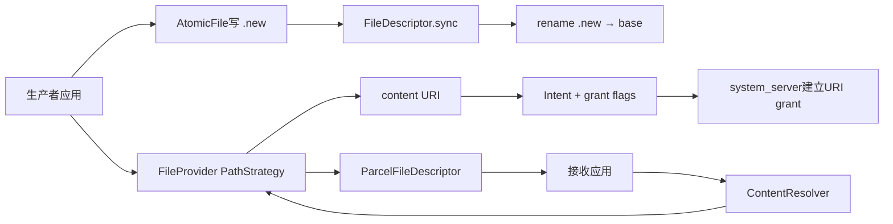
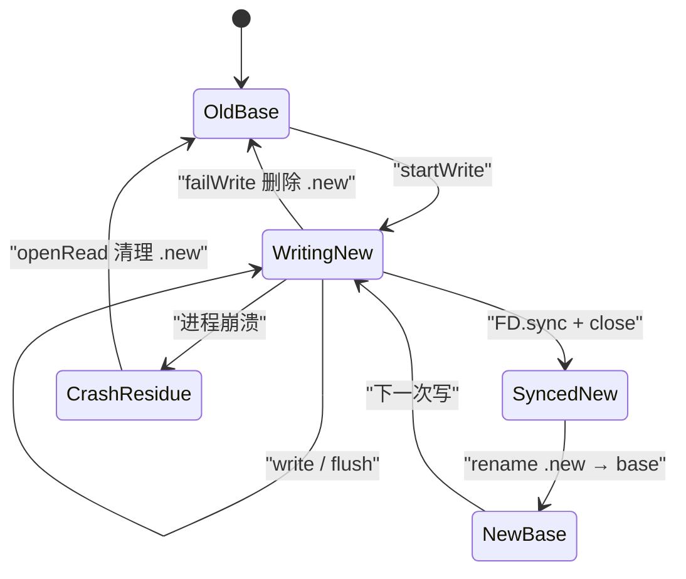
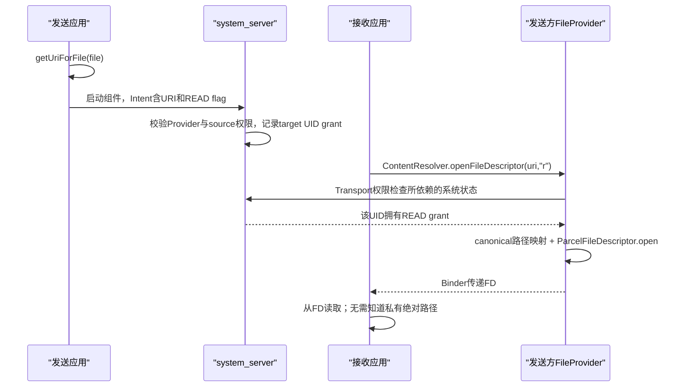

# 288 Android AtomicFile、FileUtils、fsync、rename、文件权限、FileProvider URI与安全共享链

## 1. 本章目标

本章研究一份文件从内存写到磁盘、从私有路径安全交给其他应用的完整链路：`AtomicFile`怎样用`.new`替换旧文件，`FileUtils.sync()`究竟保证什么，复制、关闭、`fsync`、`rename`为何不是同一个动作，Unix权限与SELinux怎样叠加，AndroidX `FileProvider`又怎样把白名单路径映射成可临时授权的`content://` URI。

## 2. Android 11与依赖版本边界

平台部分依据本地`android-11.0.0_r48`。`AtomicFile`和`FileUtils`来自Framework；`FileProvider`不是Android平台API中的`android.*`类，本章核读的是该源码树预置的`androidx.core:core:1.0.0-beta01`源码包。应用实际打包哪个AndroidX版本，就应以那个版本为准。

## 3. 先分四种问题

写入完整性回答“新文件会不会只写一半”；耐久性回答“掉电后数据是否还在”；访问控制回答“哪个UID能打开路径”；URI授权回答“能否只把某一个文件临时交给某个应用”。四者相互配合，却不能互相代替。

## 4. 不要把“成功”压成一个布尔值

`write()`返回只说明字节进入Java/内核路径；`flush()`把Java缓冲推给下层；`close()`释放描述符且可能报告迟到错误；`fsync()`要求内核把文件状态同步到存储；`rename()`切换目录项；接收方成功`openFileDescriptor()`还要通过Provider和URI grant检查。

## 5. 本章源码地图

```text
frameworks/base/core/java/android/util/AtomicFile.java
frameworks/base/core/java/android/os/FileUtils.java
frameworks/base/core/java/android/os/ParcelFileDescriptor.java
frameworks/base/core/java/android/net/Uri.java
frameworks/base/core/java/android/os/StrictMode.java
frameworks/base/core/java/android/content/Intent.java
frameworks/base/core/java/android/content/Context.java
prebuilts/maven_repo/android/androidx/core/core/1.0.0-beta01/
  core-1.0.0-beta01-sources.jar!/androidx/core/content/FileProvider.java
```

## 6. 运行位置先建立

`AtomicFile`和`FileUtils`是调用者进程里的普通Java工具；其文件操作最终进入Linux系统调用。`FileProvider`实例运行在声明Provider的应用进程，权限授予和检查由system_server协作完成，接收应用通过Binder取得`ParcelFileDescriptor`后读写内核文件对象。

## 7. 一条端到端心智模型

生产者先在自己的私有目录可靠生成文件，再由Provider把路径转换成`content://authority/tag/relativePath`；启动组件时系统根据Intent flags建立目标UID的URI能力，目标应用随后通过ContentResolver跨进程打开FD。文件可靠性与分享授权在这里是串联的两段。

## 8. 总体链路图



## 9. AtomicFile解决的核心故障

直接截断原文件再重写时，进程在中途崩溃会留下半份数据。`AtomicFile`让旧`base`继续可读，把完整新内容写入同目录的`base.new`，同步后再原子替换目录项，因此读者通常看到旧完整版本或新完整版本。

## 10. 它保证的是一份文件的替换

两个文件要同时变化、文件与数据库row要一起提交、目录树要保持整体一致，都超出`AtomicFile`能力。它没有事务日志，也不能回滚已发出的Binder调用、通知或网络副作用。

## 11. 三个路径对象

构造器保存`mBaseName`、`mNewName = base + ".new"`和兼容旧实现的`mLegacyBackupName = base + ".bak"`。Android 11新协议主要写`.new`，`.bak`只用于读取历史版本遗留的备份。

## 12. 新旧协议为什么并存

旧实现先把原文件改名成`.bak`，再写新主文件；首次创建没有旧主文件时存在特殊窗口。r48改为先写`.new`再覆盖`base`，同时保留`.bak`恢复逻辑，使升级前留下的状态仍能被读取。

## 13. startWrite第一步处理旧backup

若`.bak`存在，`startWrite()`先调用`rename(.bak, base)`。也就是说它把旧备份恢复成当前基线，再开始新一轮写，避免在尚未处理的历史失败状态上继续提交。

## 14. startWrite并不碰旧base

正常情况下它直接`new FileOutputStream(mNewName)`，默认会创建或截断`.new`；旧`base`在新内容写完前保持不变。此时其他正确调用`openRead()`的读者仍以旧主文件为准。

## 15. 父目录不存在时的补救

第一次打开`.new`若抛`FileNotFoundException`，实现尝试`parent.mkdirs()`，再把父目录权限设为`S_IRWXU | S_IRWXG | S_IXOTH`，即用户和组可读写执行、其他用户只有执行，然后重试创建文件。

## 16. mkdirs的竞态边界

源码把`mkdirs()`返回false直接视为失败；若目录恰好被另一线程并发创建，false也可能发生。这再次说明`AtomicFile`不提供并发协调，调用方需要在更外层串行化。

## 17. 返回的是必须特殊收尾的流

注释明确要求不要直接`close()`，必须调用`finishWrite(stream)`或`failWrite(stream)`。只关闭流会让`.new`留在旁边，却不会发布为`base`。

## 18. 正确写入模板

```java
FileOutputStream out = null;
try {
    out = atomicFile.startWrite();
    writeAll(out);
    atomicFile.finishWrite(out);
} catch (Throwable t) {
    atomicFile.failWrite(out);
    throw t;
}
```

这里的关键不是try/catch形式，而是所有失败分支都不能误调`finishWrite()`。

## 19. write辅助方法封装同一协议

r48还提供隐藏的`write(Consumer<FileOutputStream>)`：内部start、执行回调、finish；任意Throwable时fail并重新传播。finally又quiet close，但正常finish/fail已经先完成关键同步和关闭。

## 20. finishWrite的真实顺序

它依次调用`FileUtils.sync(str)`、关闭流、`rename(mNewName, mBaseName)`，最后可选写commit耗时EventLog。发布发生在sync之后，符合“新内容先稳定，再切换名字”的基本顺序。

## 21. FileUtils.sync做了什么

实现只在stream非null时执行`stream.getFD().sync()`，捕获`IOException`后返回false。这是Java `FileDescriptor.sync()`，意图是让与该描述符关联的缓冲数据同步到存储设备。

## 22. sync不是普通flush

`BufferedOutputStream.flush()`主要把用户态缓冲送到FileOutputStream；普通FileOutputStream本身没有大块Java缓冲，但写完仍可能只到页缓存。`FileDescriptor.sync()`跨过这层，要求内核执行更强的持久化动作。

## 23. sync之前仍要完成序列化

如果XML/JSON编码器还有未flush的用户态缓冲，直接对底层FD sync并不能同步尚未交给底层的字节。调用方要先让上层writer完成、flush，再finishWrite；不能一边保留未输出字符一边期待AtomicFile猜到它们。

## 24. fsync也不是绝对物理学保证

操作系统、文件系统、块设备缓存和硬件掉电保护共同决定实际耐久性。源码提供的是平台可调用的同步语义，而不是对损坏存储、撒谎控制器或瞬时拔电的数学证明。

## 25. finishWrite吞掉sync失败

如果`FileUtils.sync()`返回false，`AtomicFile`只打印`Failed to sync file output stream`，之后仍关闭并rename。`finishWrite()`返回void，调用者无法通过返回值获知这次耐久性已经降级。

## 26. close失败也只记录日志

关闭流抛`IOException`同样只写日志，接着仍尝试rename。关闭可能暴露延迟写错误，因此“执行过finishWrite”不能被误写成“每个底层动作都确认成功”。

## 27. rename失败仍不抛出

私有`rename()`调用`source.renameTo(target)`；false时只记录日志。于是新内容可能完整地留在`.new`，旧`base`仍是可见版本，而上层若不看日志会误以为提交完成。

## 28. 为什么rename不先删target

注释说明旧代码曾先删除目标，但“删旧→改名新”中间会出现目标不存在的窗口，不再原子。现在依赖rename系统调用原子替换已有目标，只有目标错误地是目录时才先删除以兼容历史误用。

## 29. 同目录很重要

`.new`由base路径直接追加后缀，因此与base同目录、通常同一文件系统。跨文件系统rename不能原子替换且常失败；该命名方式主动避开了这种常见错误。

## 30. rename原子不等于事务持久

原子回答观察者不会看到半个目录项切换；耐久回答掉电重启后哪个目录项仍存在。r48 `AtomicFile`在rename后没有显式打开并fsync父目录，因此不要把“源码称atomic”扩张成所有文件系统上的最强目录项掉电保证。

## 31. base已经打开时的语义

Unix FD引用的是已打开的文件对象。读者在rename前打开旧base，即使路径随后指向新文件，它通常仍从旧inode读；rename后的新open才看到新路径目标。这是快照式替换，不是把现有FD内容原地变新。

## 32. failWrite也会sync

r48的`failWrite()`先sync再close，然后删除`.new`。对即将删除的失败版本做sync看似浪费，却沿用了统一收尾行为；它不发布新版本，base保持旧值。

## 33. failWrite删除失败的后果

删除`.new`失败只记录日志。之后`openRead()`若同时发现base与`.new`，会把`.new`当作过时临时文件再删一次；若首次写没有base，则特殊兼容逻辑不会删除它。

## 34. openRead先恢复legacy backup

发现`.bak`时，先将其rename到base。历史协议下backup被视为最后完整版本，哪怕旁边存在更新但未完成的主文件，恢复也会优先回到backup。

## 35. openRead如何处理.new

若`.new`和`base`同时存在，说明有未完成或未发布的新写，`openRead()`尝试删除`.new`，然后打开base。它不会解析两份内容来判断谁更新，而是依据协议状态机选择旧完整版本。

## 36. 首次写入是特殊情况

如果只有`.new`而base尚不存在，openRead不删除`.new`，但最终打开base会`FileNotFoundException`。注释保留这个状态，是为了读写交错后正在进行的首次finish仍有机会把`.new`发布。

## 37. exists不把.new算作成功文件

`exists()`只检查base或legacy backup，不检查`.new`。仅有临时新文件表示没有已提交版本；这与“临时文件写了很多字节”无关。

## 38. delete删除三份状态

`delete()`依次删除base、`.new`、`.bak`，不检查返回值也不抛错。若业务需要确认敏感文件真的删除，必须额外核验，并理解删除目录项也不等于介质安全擦除。

## 39. truncate与openAppend被标记不安全

r48保留隐藏的deprecated `truncate()`和`openAppend()`，源码直接标注not safe。原地截断或追加绕过新文件替换协议，崩溃后可能留下部分状态。

## 40. AtomicFile不提供锁

类注释明确说没有file locking semantics。两线程同时startWrite会一起操作同一个`.new`；后完成者、先rename者与openRead清理者可互相破坏，必须由调用方锁、单线程执行器或跨进程协调服务保证互斥。

## 41. 线程锁也不自动覆盖多进程

Java`synchronized`只保护当前进程对象；两个进程各自new AtomicFile仍会争用相同路径。跨进程要有单一owner、Binder服务、数据库锁或经过验证的OS锁协议，并设计进程死亡释放与恢复。

## 42. 多读者也需要协议意识

即使只有一个writer，直接`new FileInputStream(base.new)`或绕过`openRead()`读取临时文件都会破坏抽象。所有参与者必须只把base视为提交版本，并在一致的互斥边界内调用AtomicFile API。

## 43. 崩溃窗口手算

写`.new`前崩溃：base旧值；写一半崩溃：base旧值并残留临时文件；sync后rename前崩溃：仍读base旧值；rename后崩溃：通常读新值。极端sync/rename/目录持久化错误则要结合日志与文件系统现实判断。

## 44. AtomicFile状态图



## 45. FileUtils是一组底层工具而非事务类

`android.os.FileUtils`包含权限、复制、删除、校验文件名、模式转换等大量静态方法。把其中几个方法按顺序调用，不会自动得到AtomicFile的恢复协议。

## 46. generic copy只承诺复制字节

`FileUtils.copy(File from, File to)`用输入输出流调用优化复制并返回字节数。它会替换目标内容，但源码没有在成功返回前显式`fsync`目标文件，也没有临时文件+rename，因此不是原子发布API。

## 47. copy失败可能留下部分目标

目标FileOutputStream一开始就创建/截断；中途I/O异常或CancellationSignal触发后，目标可能已经有前半段内容。返回异常并不会恢复此前目标文件。

## 48. 复制优化不改变语义

文件描述符复制会根据类型尝试`sendfile`或`splice`，最坏退回8KiB用户态缓冲。优化减少拷贝/上下文切换，却不会自动增加原子性、权限继承或持久性。

## 49. 取消是检查点式的

复制循环按`COPY_CHECKPOINT_BYTES`累计后检查CancellationSignal并派发进度；取消不是撤销，已经写入的字节仍在目标。业务若要求全有或全无，应复制到同目录临时文件、校验、sync后再替换。

## 50. deprecated copyToFileOrThrow更强一点

旧方法先删目标、复制到目标FileOutputStream，并显式`Os.fsync(out.getFD())`。它提高目标内容耐久性，却仍因先删/直接写目标而不是原子替换，也不为目录项建立恢复协议。

## 51. close不能替代显式fsync

try-with-resources保证释放流，并可能把Java缓冲刷给内核；普通close不等价于应用明确要求稳定存储。对关键状态，需要调用提供同步语义的协议并处理失败。

## 52. closeQuietly为何被弃用

FileUtils注释指出：可写资源的close异常可能表示底层flush失败，与write异常同样重要。静默吞掉它会把真实失败伪装为成功，尤其不适合持久化提交点。

## 53. copyPermissions复制三样东西

实现先`Os.stat(from)`，再对目标`chmod(stat.st_mode)`与`chown(stat.st_uid, stat.st_gid)`。它复制mode、uid和gid；不是复制SELinux label、ACL、扩展属性、时间戳或文件内容。

## 54. chmod位的基本读法

`S_IRUSR/S_IWUSR/S_IXUSR`是owner读写执行，`S_IRGRP...`是group，`S_IROTH...`是other。目录上的read表示列名字，write表示增删目录项，execute表示穿越/访问子路径，不能套用普通文件的直觉。

## 55. 八进制权限例子

`0700`是仅owner的rwx；`0600`是仅owner读写普通文件；`0750`允许组读取与穿越目录；`0777`把所有传统DAC位放开。Android应用私有数据不应为图方便设成全局可读写。

## 56. setPermissions还可改uid/gid

FileUtils有File、String和FileDescriptor重载，底层执行chmod/chown；uid或gid传`-1`表示不改变相应owner。普通应用是否有权chown/chmod仍由内核能力、挂载和SELinux决定。

## 57. 返回errno而非总抛异常

这些Framework helper的若干`setPermissions`重载捕获`ErrnoException`并返回errno，成功返回0。调用者若忽略返回值，就可能在权限配置失败后继续运行。

## 58. Unix DAC只是第一道门

内核先依据进程凭据、文件uid/gid/mode等做自主访问控制；Android还用SELinux强制访问控制限制domain与type的组合。mode显示可读，不代表SELinux一定允许。

## 59. 应用沙箱主要由UID构成

每个普通应用使用独立Linux UID，私有data目录归其UID并限制其他UID。Provider分享的价值在于不需要把底层文件改成world-readable，而是让系统记录特定URI、目标UID和读写mode的能力。

## 60. root、system与普通应用不能混为一谈

Framework源码中FileUtils常由system_server或特权守护进程调用，拥有普通应用没有的权限。看到平台代码成功chmod/chown，不能推断第三方应用可照搬。

## 61. SELinux标签不由copyPermissions复制

新文件通常根据创建目录和file_contexts规则获得标签；跨目录移动、restorecon或特权服务还可能调整。仅复制mode/owner不能保证目标处于正确安全域。

## 62. rename通常保留inode属性

同文件系统rename移动的是目录项，文件inode的owner、mode和内容通常保持；但目标路径的SELinux策略期望可能不同，平台在安全敏感迁移中不能只凭rename想当然。

## 63. symlink是路径安全的关键变量

字符串前缀看起来位于允许目录，不代表解析后仍在里面。路径白名单实现需要canonicalize并验证最终目标，否则`..`或符号链接可能跳出根目录。

## 64. TOCTOU仍需威胁模型

先canonical检查、后open之间若攻击者能替换路径组件，可能发生time-of-check/time-of-use竞态。应用私有不可写目录能显著缩小风险；把可被对手修改的共享目录作为高权限Provider根则更危险。

## 65. 为什么不用file URI分享

`file://`只表达接收者本机路径，没有Provider作为受控打开者，也不能天然附带按URI、按目标UID的临时能力。接收进程往往既看不到发送方私有路径，也不应因此修改全局文件mode。

## 66. Android N起的file URI暴露检测

`StrictMode`在targetSdk达到N时默认启用file URI exposure检测和death penalty；`Uri.checkFileUriExposed()`发现`file` scheme跨应用暴露会触发`FileUriExposedException`。这是推动应用改用content URI的调用侧保护。

## 67. 检测不等于底层加密

StrictMode阻止常见错误API使用，不改变文件内容、DAC位或存储介质。禁用检测也不会让私有路径自动可访问；反过来使用content URI也不会自动加密文件。

## 68. FileProvider的组件配置

推荐Manifest声明`androidx.core.content.FileProvider`，authority使用应用唯一命名，`exported="false"`，`grantUriPermissions="true"`，并通过名为`android.support.FILE_PROVIDER_PATHS`的meta-data引用`res/xml/file_paths.xml`。

## 69. attachInfo主动做安全断言

预置源码的`attachInfo()`在Provider实例初始化时检查：若exported为true直接抛SecurityException；若grantUriPermissions为false也抛异常；随后才按authority解析PathStrategy。

## 70. exported=false并非“谁都打不开”

它阻止外部应用凭组件导出状态普遍访问；系统建立的具体URI grant可以绕过一般Provider权限门，让获授权UID只访问那条URI及对应mode。这正是能力式分享。

## 71. paths XML是一组目录白名单

`files-path`映射`getFilesDir()`，`cache-path`映射`getCacheDir()`，`external-path`映射共享外部存储根，`external-files-path`、`external-cache-path`和API21+的`external-media-path`映射各自目录。

## 72. name与path不是一回事

`name`成为content URI中的逻辑首段，隐藏真实根目录名；`path`决定该根下允许分享的子目录。URI后续相对路径和文件名仍会编码出现，所以name不是匿名化或内容保密机制。

## 73. 白名单粒度是目录

这版FileProvider XML不能用通配符精确声明某一个文件；一项配置开放的是一个目录子树。若只想分享单文件，应把它放进窄小专用目录，并只对实际URI授予最小权限。

## 74. 不要配置过宽根

`root-path path="."`可把设备根加入映射，`files-path path="."`可让整个应用files目录进入Provider命名空间。即使仍需URI grant，一次错误的宽泛/prefix授权或逻辑漏洞会扩大影响面。

## 75. PathStrategy按authority缓存

静态`sCache`在类锁下以authority缓存解析结果；Provider实例也保存`mStrategy`。运行期修改XML不会让已运行进程自动重建策略，通常要进程重启/新版本加载。

## 76. getUriForFile先canonicalize

它取得文件canonical path，遍历所有配置root，挑选路径最长的匹配项。最具体root获胜，避免一个文件同时位于大根和小根时随HashMap顺序随机选择。

## 77. URI怎样编码路径

策略把root的逻辑name与root下相对路径分别`Uri.encode`，保留相对路径中的斜杠，再构造`content://authority/encodedName/encodedRelativePath`。URI不是磁盘绝对路径的直接公开副本。

## 78. getFileForUri执行反向映射

Provider取encodedPath第一个segment作为tag，余下部分作为相对path，找到配置root后构造File，再取canonical file并检查它仍位于root之下；找不到tag或越界会抛异常。

## 79. canonicalization防御的对象

例如URI相对路径含`../secret`，规范化后会跳到root外，边界检查应拒绝；指向root外的symlink也会在canonical路径中暴露真实目标。仅仅URL decode后拼字符串是不够的。

## 80. r48预置旧AndroidX的前缀边界

这份`1.0.0-beta01`源码用`filePath.startsWith(rootPath)`判断归属，没有额外比较“路径相等或紧跟分隔符”。从纯字符串安全看，`/allowed_evil`也以前缀`/allowed`开头，这是应在版本审计中明确记录的旧实现边界，不能代表新AndroidX版本必然相同。

## 81. 为什么版本说明非常重要

AOSP prebuilts用于构建树内依赖，不代表每台Android 11设备上存在一份全局FileProvider实现；AndroidX通常随APK打包。审计某应用必须打开它解析到的具体依赖源码或反编译产物，而不是只读Framework tag。

## 82. Provider权限先于业务方法检查

源码在`query()`、`getType()`、`delete()`和`openFile()`旁注释“ContentProvider has already checked granted permissions”。业务方法负责URI到File映射与动作，跨UID访问许可在ContentProvider Transport/system_server链先判定。

## 83. query只返回开放列

默认projection为`OpenableColumns.DISPLAY_NAME`和`SIZE`；对请求列逐一白名单过滤，用单行MatrixCursor返回文件名与`file.length()`。selection、selectionArgs、sortOrder并未用于过滤文件。

## 84. MIME来自扩展名

`getType()`取最后一个点后的扩展，经`MimeTypeMap`查询；查不到返回`application/octet-stream`。扩展名是提示而非内容验证，不能据此信任文件一定符合图片、PDF或APK格式。

## 85. 默认CRUD不是文件数据库

`insert()`和`update()`直接抛UnsupportedOperationException；`delete()`解析URI后调用`file.delete()`，成功返回1、失败0。URI可写权限与Provider实现是否支持某动作仍是两层条件。

## 86. openFile才交付真正FD

`openFile(uri, mode)`先映射到File，把字符串mode转换为ParcelFileDescriptor位，再`ParcelFileDescriptor.open()`。Binder传递的是文件描述符能力，不是把整个文件字节装进一次Parcel。

## 87. URI授权与打开时序图



## 88. mode字符串的精确含义

`r`只读；`w`/`wt`写、创建并截断；`wa`写、创建并追加；`rw`读写、必要时创建但不主动截断；`rwt`读写、创建并截断。把`w`误当“不覆盖”会直接清空原内容。

## 89. grant读与写必须最小化

仅预览附件就只给`FLAG_GRANT_READ_URI_PERMISSION`；只有接收者确实要修改底层文件时才给WRITE。FileProvider的delete/open写能力意味着误授写权限不只是“可以保存一份副本”。

## 90. Intent data与ClipData都会纳入授权

Android 11 `Intent`注释明确：顶层READ/WRITE grant flags作用于Intent data和ClipData中的URI，并递归处理ClipData item内的数据/Intent；嵌套URI不能只看`setData()`一处。

## 91. 多个附件要正确放入ClipData

发送多URI时，既要把它们放在系统能扫描授权的ClipData位置，也要在顶层Intent加grant flags。仅把Uri对象塞进任意自定义Bundle extra，不应假定系统会自动给每条URI授权。

## 92. 显式grantUriPermission的生命周期

`Context.grantUriPermission(package, uri, mode)`可直接给目标包临时能力，但调用者应在不再需要时显式`revokeUriPermission`；Framework注释也更推荐随组件启动Intent授予，让生命周期与交付动作绑定。

## 93. Activity与Service临时grant

FileProvider源码文档说明：随Activity Intent授予的权限通常随接收Activity任务栈存续，Service则随Service运行存续。精确所有权由系统URI grant记录管理，不是FileProvider对象里的HashMap。

## 94. 临时授权与persistable不要混淆

`FLAG_GRANT_PERSISTABLE_URI_PERMISSION`只是允许接收者进一步调用`takePersistableUriPermission()`；READ/WRITE仍是基础mode。FileProvider本身没有把“生成content URI”自动变成持久授权，本章默认分享场景应按临时能力设计。

## 95. prefix grant会扩大子树能力

`FLAG_GRANT_PREFIX_URI_PERMISSION`让scheme、authority及路径segment前缀匹配的后代URI也获得权限。FileProvider路径本来就是目录tag+相对路径，轻率对高层URI给prefix grant会把单文件分享扩大成目录子树。

## 96. URI不可猜不等于没有权限检查

即便文件名使用随机数，也必须依赖Provider不导出、窄paths和系统grant；可猜性只是附加属性。反之，URI里有可读文件名也不会让未授权UID自动打开它。

## 97. authority必须避免冲突

authority是Provider路由与PathStrategy缓存键，通常用`${applicationId}.fileprovider`。安装时Provider authority冲突会造成包安装/解析问题，硬编码库authority也容易让不同宿主应用碰撞。

## 98. 分享cache文件的生命周期

cache目录内容可被应用或系统清理。URI grant仍存在不代表文件仍存在；接收者延迟打开时可能得到FileNotFoundException。长期交付应选择合适存储与生命周期，而不是把授权当文件保活引用。

## 99. 原文件修改会影响已发URI

URI映射的是路径，不是内容不可变快照。发送后若生产者重写、替换或删除同一路径，接收者稍后打开可能看到新内容或失败；安全下载可先生成不可变分享副本并管理到期删除。

## 100. 已打开FD与后续revoke

撤销URI grant主要阻止未来Provider访问检查；接收者已经拿到的FD是内核能力，通常不会因为撤销记录而自动关闭。若内容高度敏感，设计上应缩短交付窗口并控制文件副本，而非只依赖事后revoke。

## 101. FileProvider不复制内容

标准实现返回原文件FD；接收者读到的就是该路径当前对象。若希望脱敏、转码、限速或按请求动态生成，可以自定义ContentProvider并用pipe，但那是另一种实现和资源生命周期。

## 102. FileProvider不负责写入原子性

给对方WRITE FD后，对方可以原地截断/写入，AtomicFile协议不会自动介入。若要接收修改并原子发布，应让对方写临时对象，再由owner校验后用自己的提交协议替换。

## 103. AtomicFile也不负责保密

它可能同时留下base、`.new`或legacy `.bak`；这些文件都受目录权限和SELinux约束，但内容未自动加密。敏感密钥应使用Keystore等机制，敏感文档还要考虑备份、调试和root威胁。

## 104. 一条可靠分享生产链

在私有窄目录生成临时内容→完整flush并用AtomicFile/等价协议提交→重新只读打开或校验长度/hash→用FileProvider生成URI→只授READ给明确目标→控制Intent解析与生命周期→到期revoke并删除副本。

## 105. 一条安全接收链

把content URI当不可信输入→先检查scheme/type/大小但不盲信扩展名→用ContentResolver打开→限制解析资源和输出位置→需要长期保存时复制到自己控制的临时文件、校验并原子发布→及时关闭FD。

## 106. 典型故障：文件偶尔回旧

先看是否写入中抛异常走fail、是否遗留legacy `.bak`导致恢复、rename是否失败只打日志、是否两个writer争用`.new`、是否另一个进程持旧缓存又覆盖。不要只凭最终base时间戳判断完整历史。

## 107. 典型故障：分享时报FileUriExposedException

检查Intent data/ClipData里是否仍是`file://`，改用FileProvider或合适ContentProvider生成`content://`；同时核对Manifest authority、paths XML、exported和grantUriPermissions，而不是关闭StrictMode掩盖错误。

## 108. 典型故障：Permission Denial

依次检查URI authority是否指向正确Provider、目标文件是否在配置root、Intent顶层是否有READ/WRITE flag、URI是否在data/ClipData、目标组件是否真是收到该Intent的UID，以及grant是否已随生命周期结束或被撤销。

## 109. 典型故障：Failed to find configured root

`getUriForFile`只接受canonical路径位于某个XML root下的文件。检查Context存储域、external目录选择、相对path、符号链接最终位置及debug/release applicationId authority，不要通过放宽到`root-path`草率修复。

## 110. 安全审计清单

确认Provider不导出、允许URI grant、authority唯一、paths最窄、没有无必要root/external大根、默认只授READ、不滥用prefix/persistable、所有URI都进入系统可识别字段、接收输入有限制、写入失败可观察、临时副本可到期清理。

## 111. 本章最容易混淆的十句话

flush不等fsync；fsync不等rename；rename原子不等父目录已持久；copy不等事务；chmod不等SELinux允许；content URI不等公开；URI难猜不等授权；revoke不等已发FD失效；AtomicFile不加锁；FileProvider不让对方写入自动变原子。

## 112. macOS只读练习一：手算AtomicFile崩溃窗口

执行`rg -n "startWrite|finishWrite|failWrite|openRead|FileUtils.sync|rename\(" frameworks/base/core/java/android/util/AtomicFile.java`，分别标出仅base、base+.new、仅.new、legacy .bak四种磁盘状态下下一次读取会怎样处理。

## 113. macOS只读练习二：比较copy与耐久提交

执行`rg -n "copyToFileOrThrow|Os.fsync|public static long copy|copyInternalSendfile|copyInternalSplice|closeQuietly" frameworks/base/core/java/android/os/FileUtils.java`，回答generic copy在哪些失败点会留下部分目标，以及旧copyToFile为何有fsync仍不是AtomicFile。

## 114. macOS只读练习三：解包核读FileProvider

执行`unzip -p prebuilts/maven_repo/android/androidx/core/core/1.0.0-beta01/core-1.0.0-beta01-sources.jar androidx/core/content/FileProvider.java | rg -n "attachInfo|getUriForFile|getCanonical|startsWith|openFile|modeToMode"`，画出File→URI→File的双向映射并指出版本化前缀检查边界。

## 115. macOS只读练习四：追URI授权载体

执行`rg -n "FLAG_GRANT_READ_URI_PERMISSION|FLAG_GRANT_WRITE_URI_PERMISSION|FLAG_GRANT_PREFIX_URI_PERMISSION|ClipData|checkFileUriExposed" frameworks/base/core/java/android/{content/Intent.java,net/Uri.java}`，说明data、ClipData、自定义extra和file URI暴露检测的差异。

## 116. 自测：finishWrite返回题

调用`finishWrite()`正常返回，能否证明sync与rename都成功？不能。r48两种失败都只记录日志，方法返回void；只能说提交流程被调用，最终可靠性还取决于日志、文件状态及更上层验证。

## 117. 自测：权限题

把私有文件chmod成0644是否等价于给某应用READ URI grant？不等价。0644对所有能穿越路径且未被SELinux拦截的UID开放读；URI grant以Provider URI、目标UID和mode为粒度，底层文件无需全局放宽。

## 118. 自测：撤销题

发送READ grant后立刻revoke，接收者已经打开的FD会自动断开吗？通常不会；revoke控制后续授权检查，不回收已经交付的内核描述符。设计敏感分享时必须考虑这个时间窗口。

## 119. 复读纠偏记录

复读后重点修正十二处：平台AtomicFile新协议以`.new`为主而非每次`.bak`；finish会吞sync/close/rename失败；rename后未显式fsync父目录；AtomicFile无任何锁；generic FileUtils.copy不显式fsync且失败可留半文件；copyPermissions不复制SELinux标签；file URI暴露检测不是权限授予；FileProvider来自随APK依赖而非平台单例；paths开放目录而非单文件；content URI不复制/加密内容；WRITE FD绕过AtomicFile；revoke不关闭已发FD。另单独标注r48预置AndroidX `1.0.0-beta01`使用原始字符串`startsWith`的路径边界，避免把旧依赖实现描述成所有版本结论。

## 120. 本章结论与下一章入口

可靠文件分享应分层完成：用临时文件、sync和rename争取单文件完整提交，用UID/DAC/SELinux保护私有路径，再用不导出的FileProvider和最小URI grant交付特定FD。第289章继续研究Android备份体系：BackupManager、BackupManagerService、key/value与Auto Backup、transport、restore token和加密/排除边界。
