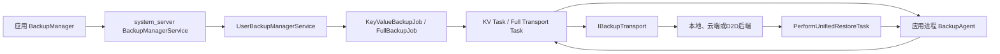
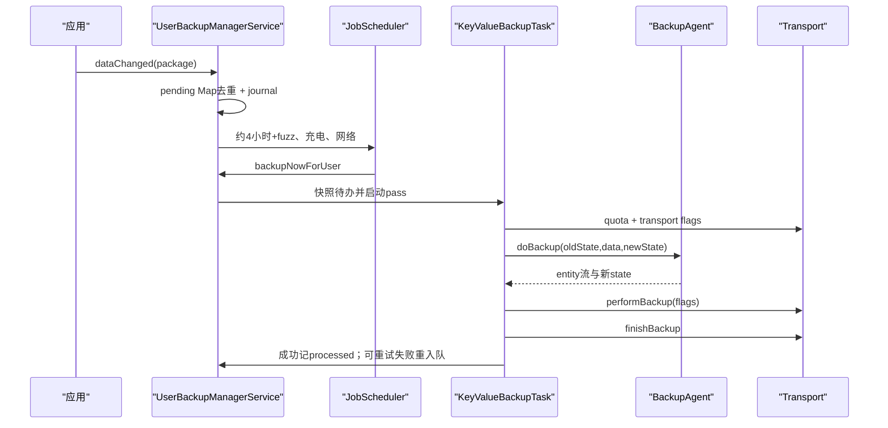
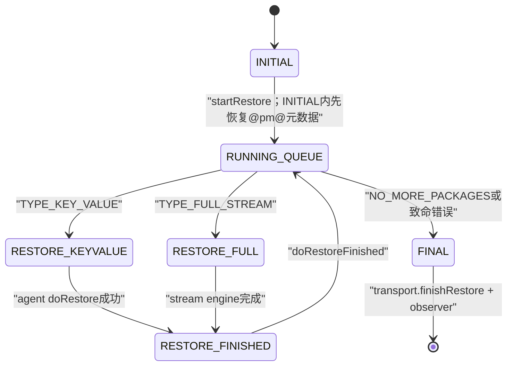

# 289 Android BackupManager、BackupManagerService、key/value、Auto Backup、transport、restore token与加密排除边界链

## 1. 本章目标

本章从应用调用`BackupManager.dataChanged()`开始，追到system_server的待办队列、JobScheduler、应用BackupAgent、key/value状态文件、full/Auto Backup文件流、可插拔transport与统一restore状态机；最后解释restore token、签名/版本门、XML include/exclude、客户端加密flag和设备到设备传输边界。

## 2. Android 11版本边界

本文依据本地`android-11.0.0_r48`。Android 11使用`android:fullBackupContent` XML；Android 12以后常见的`dataExtractionRules`不是本章版本的配置入口。具体厂商transport、云端保留期和服务端加密实现不在AOSP固定答案中。

## 3. 先分四条链

key/value backup由应用agent按key写实体，并用old/new state做增量判断；Auto Backup属于full backup，默认遍历允许的文件域并输出流；transport负责把数据送往某个后端；restore从transport数据集取回后再交给agent或full restore engine。

## 4. “备份已请求”不等于“已经上传”

`dataChanged()`只发Binder通知；服务端把包加入待办并安排job；真正运行还要满足启用、用户setup、transport、网络/充电等条件；agent成功产出数据后，transport `performBackup`和`finishBackup`都成功才是该轮提交。

## 5. “Auto Backup”在源码里的位置

源码未用一个单独的AutoBackupManager完成所有工作。对没有自定义key/value agent的普通应用，PackageManager标记其走full backup；系统绑定默认`FullBackupAgent`，最终调用`BackupAgent.onFullBackup()`遍历应用拥有的文件树。

## 6. 核心源码地图

```text
frameworks/base/core/java/android/app/backup/
  BackupManager.java  BackupAgent.java  FullBackup.java  BackupTransport.java
frameworks/base/core/java/com/android/internal/backup/IBackupTransport.aidl
frameworks/base/services/backup/java/com/android/server/backup/
  BackupManagerService.java  UserBackupManagerService.java
  KeyValueBackupJob.java  FullBackupJob.java  BackupManagerConstants.java
  keyvalue/KeyValueBackupTask.java
  fullbackup/PerformFullTransportBackupTask.java  fullbackup/FullBackupEngine.java
  restore/PerformUnifiedRestoreTask.java  restore/FullRestoreEngine.java
  utils/AppBackupUtils.java
```

## 7. 进程与线程边界

BackupManager客户端在应用进程；BackupManagerService与每用户UserBackupManagerService在system_server；transport通常是受信任组件的独立进程；BackupAgent运行在被备份应用进程；系统通过FD/pipe在agent、system_server与transport之间传数据。

## 8. 总体架构图



## 9. 服务按用户拆分

顶层BackupManagerService维护`SparseArray<UserBackupManagerService>`。用户解锁后在后台Handler线程创建对应服务；用户停止时移除并tear down。各用户有独立队列、状态目录、transport选择和restore token。

## 10. system user是总开关的一部分

`isUserReadyForBackup(userId)`要求system user服务存在且目标用户服务存在。system user的suppress文件可全局关闭；非system user还需自己的activated文件，不能因system user启用就自动加入。

## 11. 全局属性还能禁用框架

构造时读取备份禁用系统属性；若`mGlobalDisable`为true，解锁也不创建每用户服务。这是设备构建/管理级能力，不是普通应用能切换的设置。

## 12. enabled与setupComplete是两道运行门

每用户服务分别保存用户是否启用备份、设备/用户setup是否完成。任务入口同时检查两者；待办存在并不意味着未完成初始设置时会立即执行。

## 13. 普通应用不能随意控制全局备份

`setBackupEnabled`、`backupNow`、transport选择、任意包requestBackup与restore session等敏感入口要求`android.permission.BACKUP`。第三方应用日常可做的是声明策略、实现agent并通知自身数据变化。

## 14. allowBackup是总资格门

`AppBackupUtils.appIsEligibleForBackup()`首先检查`ApplicationInfo.FLAG_ALLOW_BACKUP`。Manifest中`android:allowBackup="false"`会让OS驱动的备份资格直接失败；它不是只关闭Auto Backup而保留key/value。

## 15. core UID还有更严条件

运行在core/system级UID的包通常必须提供自定义backup agent；非system user只允许极窄系统包白名单。避免一个高权限共享进程因默认遍历而意外导出系统数据。

## 16. 其他静态不合格对象

特殊shared-storage ADB备份伪包、instant app和disabled应用会被排除。运行期还会排除stopped应用，并询问当前transport是否愿意接收该包与对应备份类型。

## 17. stopped与restore的非对称

`appIsStopped()`不放在所有静态资格判断里，因为刚安装、清数据或force-stop的包虽然不应主动做backup，却仍可能需要restore-at-install。备份与恢复不能共用一个粗暴“stopped就拒绝”结论。

## 18. transport还有最终资格投票

Framework调用`transport.isAppEligibleForBackup(packageInfo, isFullBackup)`。后端可能按账号、策略、存储类型或产品规则拒绝；Manifest允许只代表进入候选，不代表所有transport必收。

## 19. 如何判定key/value还是full

应用声明自定义`backupAgentName`时，默认走key/value；只有同时设置`fullBackupOnly`标志才走full。未声明agent的普通应用被视为可走full，由系统默认agent处理。

## 20. fullBackupContent=false不是allowBackup=false

应用仍可能被分类为full backup候选，但默认`onFullBackup()`发现内容被禁用后直接返回空数据。allowBackup控制整体资格，fullBackupContent控制full文件内容，层级不同。

## 21. dataChanged客户端非常薄

实例方法把当前Context包名传给`sService.dataChanged(packageName)`；RemoteException只记日志。它没有等待、成功回调、网络上传或持久化回执。

## 22. 静态dataChanged可以点别的包

`BackupManager.dataChanged(String)`支持共享UID组合或特权调用；若目标包与调用者不是同UID，必须持BACKUP权限。服务端不会仅相信传入字符串。

## 23. participant表按UID组织

UserBackupManagerService扫描可做key/value的应用，构建`uid → package集合`。无BACKUP权限调用者只能获得自己calling UID对应集合；特权调用者才可命中所有参与包或`@pm@`伪包。

## 24. targets不等于把共享UID全排队

服务端先得到calling UID允许请求的targets集合，再检查该集合是否包含传入packageName；真正加入`mPendingBackups`的仍是请求的那个包，而不是无条件把共享UID全部包同时加入。

## 25. pending Map天然去重

`mPendingBackups`以包名为key；同包连续多次dataChanged只保留一项。备份系统把它理解成“自上次成功后有变化”，不是每一次业务写操作的事件日志。

## 26. 首次入队才写journal

Map中此前没有该包时，服务端把包名追加到DataChangedJournal；重复通知不反复写盘。system_server崩溃/重启后会解析遗留journal，重新调用dataChangedImpl恢复待办。

## 27. journal不是备份数据

它只记“哪些包需要再跑”，不含应用key/value内容，也不证明某次业务状态已安全保存。应用自己的持久化仍由SharedPreferences、SQLite或文件协议负责。

## 28. 入队后安排KeyValueBackupJob

无论本次包是否真是新pending，末尾都会调用schedule；Job类用每用户静态标志避免重复调度。它是合批触发器，不是每包一个job。

## 29. Android 11默认KV延迟

BackupManagerConstants默认间隔4小时，再加0到10分钟随机fuzz；这些值来自可变Settings.Secure配置，不是永恒API常量。已有显式delay时使用该delay。

## 30. KV默认约束

r48默认要求充电、任意网络，并设置最大延期1天。到override deadline时JobScheduler可不再等待普通约束；实际运行还会经过备份服务内部状态检查。

## 31. Job启动只负责敲门

`KeyValueBackupJob.onStartJob()`先清scheduled标记，再调用`backupNowForUser()`，返回false。真正任务和wakelock由Backup Manager接管，JobService本身不长期持有上传工作。

## 32. backupNow不是普通应用即时API

它要求BACKUP权限。即便特权调用触发，也仍要面对当前transport、任务互斥与服务状态；“now”表示跳过常规等待发起一次pass，不是后端同步完成承诺。

## 33. KV主链时序



## 34. KeyValueBackupTask先处理PM元数据

队列通常把`@pm@`PackageManagerBackupAgent伪包放在前面，用于保存包版本和签名摘要等恢复政策元数据。restore没有这份元数据就无法安全校验普通包，会终止系统恢复。

## 35. agent绑定有10秒上限

UserBackupManagerService同步等待ActivityManager创建/返回IBackupAgent，默认绑定超时10秒。绑定成功只代表agent可调用，不代表onBackup成功。

## 36. KV agent默认操作超时30秒

`BackupAgentTimeoutParameters`中key/value agent默认30秒，且可由全局设置调整。超时会使当前包失败/清理，不应在onBackup执行长网络请求或无界锁等待。

## 37. agent以应用权限运行

BackupAgent Binder入口先`clearCallingIdentity()`，使实际回调在应用自身身份下访问数据，而不是借system_server Binder调用者权限读取任意路径。

## 38. oldState是应用私有增量线索

服务端为每transport、每包保留上次成功state文件，以只读FD传给onBackup；应用可记录hash、版本或时间戳，判断哪些实体需要写。它不是后端数据内容，也不是Framework自动diff。

## 39. data是结构化entity流

`BackupDataOutput.writeEntityHeader(key,size)`后写value字节；size为负可表示删除实体。key是稳定逻辑标识，恢复时顺序读取完整快照/变更结果。

## 40. newState只在成功后尝试晋升

agent把本轮最终状态写入空newState文件。只有agent、数据校验和transport提交成功，服务端才调用`newState.renameTo(savedState)`；但r48没有检查该boolean返回值，因此语义上只在成功后尝试晋升，极端rename失败可让远端已提交而本地增量state未更新。

## 41. non-incremental怎样触发

显式请求、空saved state或transport要求可走非增量；此时agent拿到blank state，并向transport带NON_INCREMENTAL flag。transport返回`TRANSPORT_NON_INCREMENTAL_BACKUP_REQUIRED`时，任务会把包重新放到队首按全量重试。

## 42. Framework会检查受保护key

普通非system应用输出的每个entity key都会再扫描；首字符大于等于`0xff00`属于系统保留命名空间，服务端通知agent fail并把该包视为永久agent错误。

## 43. 配额来自transport

任务调用`getBackupQuota(package,false)`并把值传给agent；没有一条AOSP通用的固定5MiB真理。默认BackupTransport实现返回Long.MAX_VALUE，但产品transport可以给实际限制。

## 44. 超额有两处反馈

BackupDataOutput可感知quota，transport也可在perform阶段返回`TRANSPORT_QUOTA_EXCEEDED`。服务端随后调用agent `doQuotaExceeded(size,quota)`，默认仅给3秒，应用可记录/调整下轮策略，不能在回调里假装本轮成功。

## 45. transport flags也交给agent

`BackupDataOutput.getTransportFlags()`让agent知道当前后端是否声称支持客户端加密或D2D。它用于选择敏感数据是否输出，不是应用自行验证后端密码学实现的远程证明。

## 46. performBackup仍不是最终提交点

IBackupTransport注释允许perform时立即处理或先缓冲；调用后必须`finishBackup()`。只有finish返回OK，Framework才把该包当作成功提交并推进本地state。

## 47. 不同错误有不同重试策略

PACKAGE_REJECTED和QUOTA_EXCEEDED通常是该包永久失败；NOT_INITIALIZED会触发transport初始化路径；普通transport error可能中止整轮并按后端建议时间重排。不能用一个“失败后立刻无限重试”处理。

## 48. journal何时删除

任务开始使用旧journal，执行结束后尝试删除；运行中又发生dataChanged会进入新journal/待办。删除失败只记报告，因此启动恢复路径必须容忍重复包名，幂等比精确一次更现实。

## 49. restore后为何常再备份

KV恢复生成的新state在r48统一restore cleanup中被删除，源码TODO说明当前数据可能需要重新送往新设备的current dataset。因此恢复完成不等于当前transport已拥有同样基线，后续会再建立备份状态。

## 50. SharedPreferences专门同步

BackupAgent Binder在onBackup返回后的finally调用`QueuedWork.waitToFinish()`，`SharedPreferencesBackupHelper`在读XML前也主动等待；full backup前后都等一次；restore前等旧写完成、后reload内存实例。它降低SP异步落盘与直接文件复制打架的风险。

## 51. 这不自动冻结SQLite

Framework的SP同步钩子不等于对所有数据库建立快照。应用若在agent期间并发写多文件/数据库，仍应使用SQLite事务、关闭/checkpoint或专用导出快照，避免逐文件遍历跨越不同逻辑时刻。

## 52. BackupAgentHelper简化KV

FileBackupHelper、SharedPreferencesBackupHelper等把文件状态diff与entity编码封装起来；它们仍受相同调度、state、quota和transport语义约束，不会把dataChanged变成立即上传。

## 53. Full Backup的调度队列

每用户维护按`lastBackup`排序的`mFullBackupQueue`。默认full interval为24小时；Job要求device idle、充电和非计费网络，可由BackupManagerConstants设置覆盖。

## 54. FullBackupJob一次处理一个包

源码注释明确每次scheduled job execution只做一个应用，完成后若仍有工作再以零延迟重排，从而让JobScheduler重新检查条件，避免一项无限长job独占整队列。

## 55. full还会检查省电模式

即使Job约束满足，`beginFullBackup()`发现FULL_BACKUP服务类型处于battery saver仍延期，延迟使用key/value interval。JobScheduler条件不是唯一运行门。

## 56. 前台应用默认延期

未声明允许foreground backup的应用若当前在前台，服务按最小退避+随机fuzz重新调整其队列时间，再考虑下一个候选，减少直接遍历活跃数据与卡顿风险。

## 57. full前提依赖已有dataset

`fullBackupAllowable`失败时源码注释指出常见原因是还没跑过key/value初始化/没有current token，于是按KV间隔延期。full流并非与transport数据集初始化完全独立。

## 58. Full task的三方pipe

PerformFullTransportBackupTask让transport先`performFullBackup(package, socket, flags)`，同时FullBackupEngine让agent向另一端输出tar样式流；system_server从pipe读块并以`sendBackupData(n)`通知transport消费。

## 59. full预检会先测量

agent执行`doMeasureFullBackup`，复用onFullBackup但FullBackupDataOutput只累计大小；transport用`checkFullBackupSize(total)`决定是否接受。实际内容仍可能在测量后变化，因此运行期quota反馈仍保留。

## 60. Full agent默认超时5分钟

Android 11参数默认full backup agent 5分钟，明显长于KV的30秒；shared-storage特殊agent可到30分钟。时间更长不代表适合无界扫描或在agent里自行上传网络。

## 61. onFullBackup默认遍历CE与DE

它显式建立credential-protected与device-protected Context，分别识别root、files、database、sharedpref域；外部域只指应用管理的`getExternalFilesDir(null)`，不是任意共享存储根。

## 62. 永久排除目录

cache、code_cache、no_backup和native library目录不会进入默认full backup，即使应用显式`fullBackupFile()`也会被忽略。它们分别代表可重建缓存、代码缓存、明确不备份和安装产物。

## 63. 默认“全备”仍有边界

默认实现备份应用owned tree减去永久排除；不含APK代码本身、任意外部路径、其他应用数据或系统全盘。Full Backup是应用数据文件流，不是磁盘镜像。

## 64. domain token保持可迁移路径

流中保存`r/f/db/sp`及设备保护/外部等domain token加相对路径，restore时在目标设备重新解析到当前应用目录。绝对路径不应被当作跨设备稳定协议。

## 65. fullBackupContent=true的含义

未给自定义XML或资源值表示true时，使用默认全域减永久排除；设置false时默认onFullBackup直接不输出；指向XML时按include/exclude规则收窄。

## 66. 一旦写include就进入白名单模式

解析结果若有任意include，默认整域遍历不再作为主选择，只遍历显式include集合，再套永久排除和exclude。漏写的其他域不会因为“默认会备份”自动补回来。

## 67. exclude始终是减法

exclude可排文件或目录，requiredFlags只允许用于include。应用不能用一个exclude规则反向开启本来永久禁用的cache/no_backup路径。

## 68. XML支持的Android 11域

包括`root`、`file`、`database`、`sharedpref`、`device_root`、`device_file`、`device_database`、`device_sharedpref`和`external`。写成未知domain会触发严格解析错误或无效规则。

## 69. 路径解析拒绝明显穿越

`extractCanonicalFile`拒绝包含`..`或`//`的path，并基于各domain目录构造File；规则还会canonical化用于集合比较。XML是安全策略，不应通过字符串技巧指向域外。

## 70. include可要求transport能力

`requireFlags="clientSideEncryption|deviceToDeviceTransfer"`被转换为BackupAgent transport位。默认onFullBackup只有当前transport flags包含所有所需位时才遍历该include。

## 71. requireFlags是条件包含，不是启动加密

它不会命令transport现场开启客户端加密；只是“transport已报告该能力才输出这批文件”。如果flag不满足，敏感include会被跳过，而非让整轮自动切换后端。

## 72. clientSideEncryption flag的源码定义

注释定义为备份用仅设备知道的key加密，使远端存储root攻击者也不应能解密。Framework传播这一声明，但真正密钥生成、封装、账户恢复和服务端保存由具体transport/产品实现。

## 73. D2D flag不是云加密同义词

`FLAG_DEVICE_TO_DEVICE_TRANSFER`表示数据直接发往另一设备、没有第三方中间存储，例如USB或Wi‑Fi。它可让应用在迁机时传某些不愿长期上云的数据。

## 74. 两个flag可以组合要求

解析器用位OR，default traversal检查`(transportFlags & includeFlags) == includeFlags`。规则写两个条件时必须同时满足，不是满足其中任一个。

## 75. full stream不是逐文件独立提交

一包的多个tar entry形成顺序流；中途agent、pipe或transport失败时，transport应放弃/清理该包当前流。不能依据前几个文件已发送就认为它们是可恢复版本。

## 76. finishBackup仍是full提交门

数据流传完后调用transport `finishBackup()`；成功才更新full schedule/processed状态。网络写完socket不等于后端数据集已经原子发布。

## 77. ADB backup是另一条路线

Android 11仍有`adb backup/restore`相关任务、用户确认与本地archive处理，它不等同当前云transport定时备份。调试本地archive的结果不能直接证明生产transport的quota、加密或恢复行为。

## 78. restore从数据集token开始

transport把某个备份集合标识为long token；`getCurrentRestoreSet()`给本设备当前dataset，`getAvailableRestoreSets()`可列其他集合。token由transport解释，不是Framework从时间戳自行推导。

## 79. current与ancestral token

每用户服务保存`mCurrentToken`和`mAncestralToken`。当前集合代表本设备正在写的后端；ancestral集合代表设备初始化/迁移时选择的祖先数据，用于尚未在当前集合处理过的包。

## 80. getAvailableRestoreToken的选择

默认先取ancestral；若current非0且ProcessedPackagesJournal已记录该包在当前数据集处理过，则选择current。它是“哪个dataset更可能有该包”的本地策略，不读取两边内容比较新旧。

## 81. restore-at-install协作PackageManager

新安装包完成后，PMS可调用`restoreAtInstall(package, pmToken)`；备份服务选择可用restore set并异步恢复，最后必须回报PackageManager该安装token完成，避免安装流程永久等待。

## 82. 用户主动restore session是特权API

ActiveRestoreSession可查询sets、恢复全部/部分/单包，并受BACKUP权限、目标包和transport约束。普通应用从Android P起旧`requestRestore()`已经no-op，不能任意拉取云端快照覆盖自己。

## 83. UnifiedRestore状态机总览



## 84. startRestore先给候选包清单

Framework调用`transport.startRestore(token, packages)`，随后反复`nextRestorePackage()`。transport返回RestoreDescription，类型只能是KEY_VALUE或FULL_STREAM；NO_MORE_PACKAGES表示正常结束，null表示transport错误。

## 85. PM metadata为什么必须第一

统一系统restore在`INITIAL`状态内先恢复`@pm@`到进程内PackageManagerBackupAgent，从中取每包备份时versionCode和签名hash；它不是枚举中的独立state。若集合缺metadata，源码直接终止，不把无法验证来源的数据交给应用。

## 86. 包必须当前已安装

nextRestorePackage返回的名字还会经PackageManager按目标user查询；包不存在就跳过。restore stream不能凭一个包名在这里偷偷安装任意应用，APK restore另有受控策略路径。

## 87. 签名是身份连续性门

Framework把备份元数据签名摘要与当前PackageInfo签名历史比较；不匹配则跳过该包，防止同名但不同签名应用接收前一个开发者的私有数据。

## 88. 版本默认不允许“从未来恢复”

若备份versionCode大于当前安装版本，默认跳过；仅声明`restoreAnyVersion=true`的agent表示能解析未来格式时才继续。低版本数据则由agent根据传入appVersionCode迁移。

## 89. KV restore先完整stage

transport `getRestoreData(outFd)`把当前包entity流下载到临时文件。大多数包随后再读stage，过滤系统blocked keys和AppWidget特殊key，输出真正交给agent的数据文件。

## 90. excludedKeys由系统先过滤

r48支持每包排除恢复key：Framework不把命中的entity传给agent，并把集合传入隐藏的`onRestore(..., excludedKeys)`重载，让agent可清除本地相关派生状态。

## 91. widget state不直接交给应用

特殊`KEY_WIDGET_STATE`从KV流剥离，保存到mWidgetData，之后由AppWidgetBackupBridge恢复ID映射等系统状态。普通agent只看业务entity。

## 92. onRestore不是系统自动clear-data

BackupAgent文档明确：KV agent负责删除旧数据并用输入替换；系统不会在正常调用前自动clear user data。若onRestore抛异常，系统才假设状态不一致并在失败清理中清数据。

## 93. KV restore默认超时60秒

服务为agent doRestore准备默认60秒operation timeout；doRestoreFinished另有默认30秒。回调、超时与状态机消息共同推进，Binder方法发出不等恢复已完成。

## 94. restore前后同步SharedPreferences

agent Binder先等待旧QueuedWork落盘，调用onRestore，finally执行`reloadSharedPreferences()`，让进程里缓存实例重新读取被helper替换的XML。它仍不能替应用修正其他内存单例缓存。

## 95. Full restore按chunk流入engine

transport反复`getNextFullRestoreDataChunk(socket)`；正数表示本chunk字节数，结束码表示当前包完成，错误可调用abortFullRestore。system_server用独立feeder线程把流送给FullRestoreEngine，避免堵住状态Handler。

## 96. tar manifest先定RestorePolicy

FullRestoreEngine先读manifest，取得package、version、installer、hasApk和signature，再决定ACCEPT、ACCEPT_IF_APK或IGNORE；文件entry只有在当前package政策允许时才交给agent。

## 97. full restore也做路径防御

engine校验domain/path、manifest顺序、canonical目标和不允许目录；BackupAgent.onRestoreFile还按fullBackupContent include/exclude再次判断。tar里的绝对路径、穿越路径不能直接作为任意写盘指令。

## 98. 文件恢复由agent落盘

系统把单个entry的FD、size、type、domain、relative path、mode和mtime传给`doRestoreFile()`；默认agent解析目标File并调用FullBackup.restoreFile。目录和普通文件分开处理，符号链接不会被当成普通任意链接恢复。

## 99. full restore何时clear旧数据

FullRestoreEngine第一次建立包的restore agent前可调用`clearApplicationDataBeforeRestore(pkg)`，保证文件型恢复落到干净基线；这与KV文档要求agent自行替换旧数据的路径不同。

## 100. 失败后的清理不等事务回滚

恢复可能已经写入若干文件或修改业务状态；失败时clear data可把应用恢复到空状态，却不能撤回应用已在onRestore中发出的网络/Binder副作用。restore agent应尽量局部、幂等，推迟外部副作用。

## 101. restoreFinished是应用收尾点

单包数据完成后，Framework调用`agent.doRestoreFinished()`，让应用重建索引/通知内部组件；其成功/超时再决定进入下个包。transport的finishRestore则是整个session收尾，二者不是同一个callback。

## 102. 系统restore通常会杀应用进程

非core UID在整机restore后，full数据目标总会kill；KV目标通常受`killAfterRestore`标志控制。单应用主动restore路径明确不按相同规则杀进程，以便旧API observer回调，但该API在P后已no-op。

## 103. 为什么要kill

backup模式可能用stub Application，且进程内单例、数据库连接和缓存仍指向恢复前状态。杀掉后下次正常启动能从磁盘重建一致内存；它不是因为restore一定崩溃。

## 104. transport是可插拔受信任组件

TransportManager只注册系统配置白名单内、具备正确服务声明/权限的组件，并缓存name、dirName、配置Intent、destination等描述。Framework不内置“所有Android 11都备份到某云”的结论。

## 105. transportDirName隔离本地状态

Backup Manager把每个transport的agent saved-state放在相应目录；切换transport不能继续拿另一个后端的oldState假装同一增量基线，通常需要初始化并重建dataset。

## 106. 初始化语义

transport返回NOT_INITIALIZED或首次选择时，系统安排`initializeDevice()`等任务，清理/建立后端dataset，再做`@pm@`和应用非增量备份。初始化失败会重试，不应把空current token当作“云端确定没有数据”。

## 107. 配额和频率都不是应用SLA

4小时与24小时只是r48默认调度参数，设备可覆盖，约束和退避可继续推迟；transport quota也动态查询。需要立即跨设备一致性的业务应使用自己的同步协议，而不是把OS backup当实时数据库复制。

## 108. 备份不是账号同步

Backup通常面向设备恢复/迁移，批量、延迟且可能不运行；SyncAdapter或应用服务处理持续双向数据同步。两者的冲突解决、用户可见性和删除传播完全不同。

## 109. 敏感数据的策略

密钥、认证令牌、设备绑定凭据通常放`no_backup`或XML exclude；可迁移但只允许安全后端的数据用条件include；真正密钥材料优先依赖Keystore重建/重新登录。transport flag不是把不当备份变安全的万能开关。

## 110. 一致性设计清单

KV key要稳定、可删除、可按版本迁移且onRestore幂等；full要排除缓存/临时/不可迁移凭据，为数据库提供一致快照；两条链都要容忍重复、延迟、quota、进程死亡、transport重置和部分restore失败。

## 111. 十二个常见误解

dataChanged不立即上传；Auto Backup不是KV helper；allowBackup不等有可恢复数据；full不是磁盘镜像；oldState不是远端副本；finishBackup才是transport提交门；配额不固定；云端实现不在AOSP；requireFlags不启动加密；token不是时间戳；restore不总先clear；observer完成不等应用所有外部副作用成功。

## 112. macOS只读练习一：追dataChanged到job

执行`rg -n "dataChanged\(|dataChangedImpl|mPendingBackups|writeToJournalLocked|KeyValueBackupJob.schedule|setMinimumLatency|setOverrideDeadline" frameworks/base/{core/java/android/app/backup/BackupManager.java,services/backup/java/com/android/server/backup/{UserBackupManagerService.java,KeyValueBackupJob.java}}`，解释重复通知、崩溃恢复和默认延迟。

## 113. macOS只读练习二：手算KV提交

执行`rg -n "doBackup\(|mSavedStateFile|mNewStateFile|performBackup|finishBackup|TRANSPORT_NON_INCREMENTAL|checkBackupData|doQuotaExceeded" frameworks/base/services/backup/java/com/android/server/backup/keyvalue/KeyValueBackupTask.java`，标出agent成功、transport失败、quota超限三种情况下newState能否晋升。

## 114. macOS只读练习三：核对Auto Backup域

执行`rg -n "onFullBackup|noBackupDir|codeCacheDir|DEVICE_.*TREE|maybeParseAndGetCanonical|requireFlags|areIncludeRequired" frameworks/base/core/java/android/app/backup/{BackupAgent.java,FullBackup.java}`，列出CE/DE、永久排除、include白名单和条件include四层过滤。

## 115. macOS只读练习四：追统一restore

执行`rg -n "startRestore|nextRestorePackage|TYPE_KEY_VALUE|TYPE_FULL_STREAM|getRestoreData|getNextFullRestoreDataChunk|restoreAnyVersion|signaturesMatch|doRestoreFinished|finishRestore" frameworks/base/services/backup/java/com/android/server/backup/restore/{PerformUnifiedRestoreTask.java,FullRestoreEngine.java}`，画出包级失败与transport级失败的分叉。

## 116. 自测：调度题

应用每分钟调用一次dataChanged，系统会每分钟上传吗？不会。pending按包去重且Job已安排后不重复安排；实际pass按约束合批执行，运行中再次变化才进入下一轮待办。

## 117. 自测：加密题

XML include写`requireFlags="clientSideEncryption"`是否开启加密？否。它只在transport已报告该flag时包含该路径；不满足时跳过数据，具体加密由transport实现。

## 118. 自测：恢复版本题

备份来自versionCode 200，当前安装100，默认会把数据交给agent吗？不会；签名通过后仍因未来版本被跳过，除非应用显式声明restoreAnyVersion并能安全迁移。

## 119. 复读纠偏记录

复读后修正十五处：dataChanged只入队且共享UID不会自动全包排队；journal只存包名；KV默认4小时+fuzz并有1天deadline；full默认24小时且一次job一包；quota由transport查询；old/new state只服务KV增量；finishBackup才确认后端；state晋升的renameTo返回值未检查；SP有专门同步但SQLite无自动快照；full同时遍历CE/DE；include出现后转白名单；requireFlags是条件而非开关；current/ancestral token按processed包选择；KV正常restore不自动clear；整机restore与单包restore杀进程规则不同。另记录AOSP只定义transport接口与能力位，不把任一厂商云端、保留期或密码学实现写成Android 11通用事实。

## 120. 本章结论与下一章入口

Android备份是一条延迟、可重试、由transport决定后端的多进程提交链：应用提供可迁移数据，system_server负责调度与政策，transport负责dataset，restore再以签名、版本和路径规则落回应用。第290章继续研究Android Keystore：KeyStore服务、keystore2前身、Keymaster HAL、密钥生成/使用、硬件绑定、认证与备份不可迁移边界。
