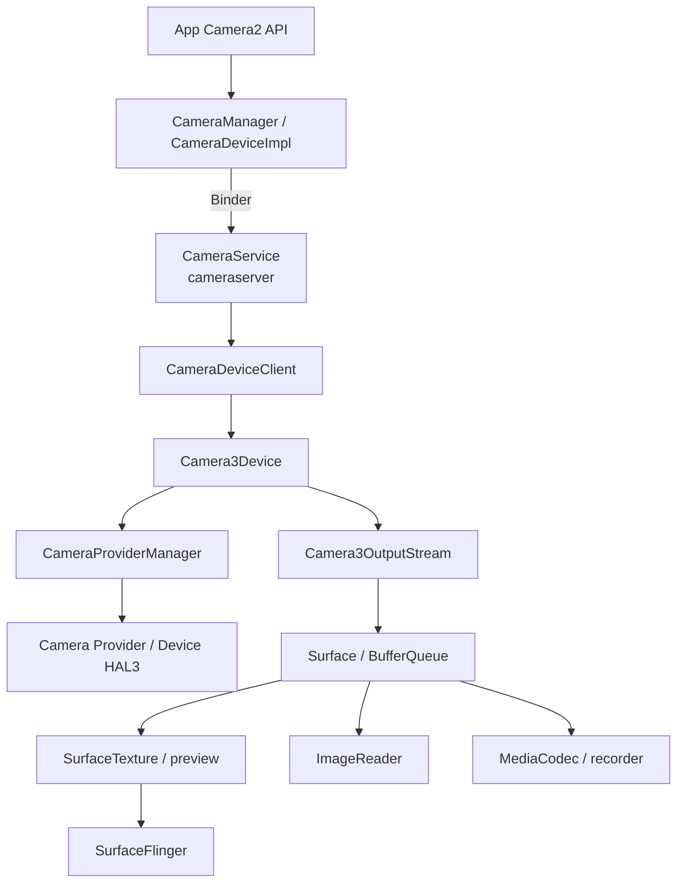
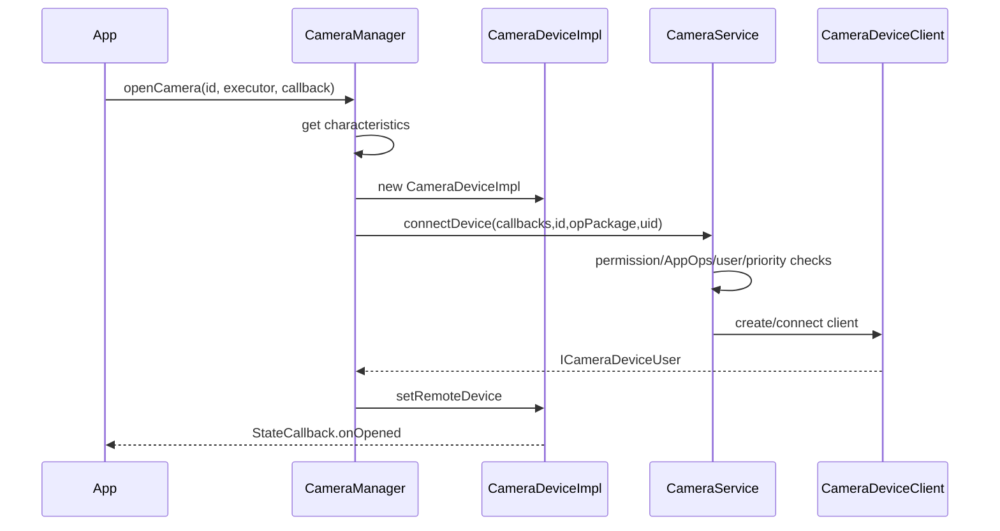
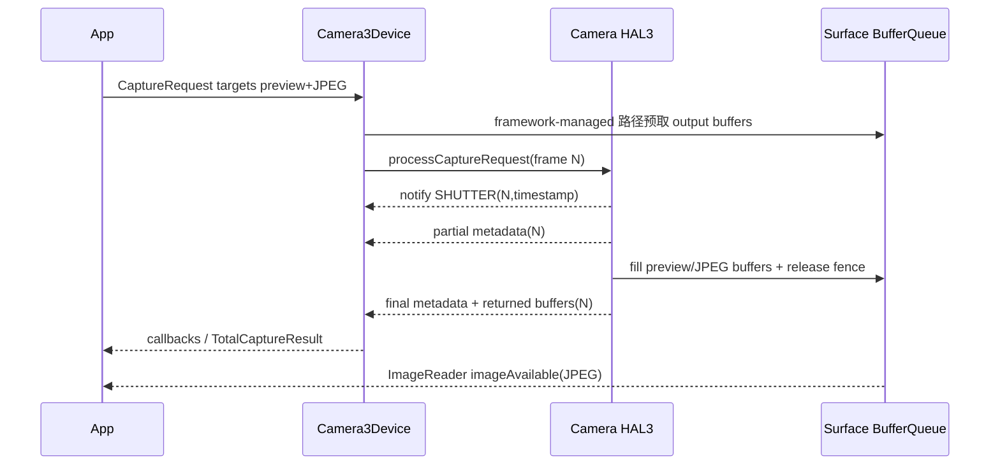

# 29 Android 相机系统、Camera2 与 CameraService

> 源码版本：Android 11 / API 30 / `android-11.0.0_r48`  
> 学习方式：macOS 只读源码，不要求编译、打开摄像头或抓取图像。  
> 前置章节：[07-Binder基础与完整调用链](./07-Binder基础与完整调用链.md)、[12-Surface到SurfaceFlinger显示链路](./12-Surface到SurfaceFlinger显示链路.md)、[23-Android权限AppOps与SELinux](./23-Android权限AppOps与SELinux.md)

---

## 1. Camera2 有两条并行通路

相机最容易读乱，是因为控制和图像同时流动：

```text
Metadata 控制/结果通路：
CaptureRequest（曝光、AF、AE、AWB、crop、target）
 → CameraService/Camera3Device → HAL
 → CaptureResult（实际曝光、状态、时间戳、统计）

Image Buffer 通路：
sensor/ISP 生成图像
 → HAL 获取目标 Surface 的 GraphicBuffer
 → 写入并归还 buffer + fence
 → SurfaceTexture/ImageReader/MediaCodec 消费
```

CaptureResult 不是 JPEG/预览像素，Surface 也不携带 CaptureRequest 的全部结果。两条通路靠 frame number、sensor timestamp 等关联。

---

## 2. 本章目标

1. 从 `CameraManager.openCamera()` 追到 CameraService 和 HAL provider。
2. 区分 CameraDevice、CaptureSession、CaptureRequest、CaptureResult。
3. 解释创建 session 为什么必须先配置全部输出 Surface。
4. 区分 single capture、burst、repeating request。
5. 解释 HAL3 request/result pipeline 与 partial result。
6. 追预览 buffer 到 SurfaceTexture/SurfaceFlinger。
7. 追 JPEG/YUV buffer 到 ImageReader。
8. 理解 3A、pipeline depth、flush、disconnect 和错误回调。
9. 分层诊断“能 open 但没有预览/拍照卡住/结果与图像对不上”。

---

## 3. 整体架构



---

## 4. 核心进程

```text
App 进程：CameraManager、CameraDeviceImpl、session/callback、Surface consumers
cameraserver：CameraService、CameraDeviceClient、Camera3Device、stream/request 管理
camera provider/HAL 进程：厂商 Camera HAL3，sensor/ISP pipeline
surfaceflinger：合成预览 Surface（如果目标最终显示）
media.codec：视频编码可能进入 codec service/组件
system_server：CameraServiceProxy、权限/用户/设备状态协作
```

厂商实现与 Treble 配置会改变 HAL 进程细节，但 CameraService 与 App 之间的 Binder 边界是主线。

---

## 5. 主要源码入口

```text
frameworks/base/core/java/android/hardware/camera2/
frameworks/base/core/java/android/hardware/camera2/impl/
frameworks/av/camera/aidl/android/hardware/ICameraService.aidl
frameworks/av/services/camera/libcameraservice/
frameworks/av/services/camera/libcameraservice/api2/
frameworks/av/services/camera/libcameraservice/device3/
frameworks/av/services/camera/libcameraservice/common/CameraProviderManager.cpp
hardware/interfaces/camera/provider/
hardware/interfaces/camera/device/3.*
```

---

## 6. 为什么叫 Camera2，却接 HAL3

```text
Camera2：面向 App 的 Java/NDK API 代际
Camera HAL3：Framework 与厂商设备实现的 request-based HAL 代际
```

两者编号不是同一层版本。CameraService 还保留 API1 compatibility client；本章主线是 Camera2 App API → CameraDeviceClient → Camera3Device → HAL3。

---

## 7. CameraManager

源码：

```text
frameworks/base/core/java/android/hardware/camera2/CameraManager.java
```

职责：

- 获取 camera ID 列表和 Characteristics。
- 注册 Availability/Torch callback。
- 连接 ICameraService。
- openCamera 并创建 `CameraDeviceImpl`。
- 把 service death/status 变化分发到 Executor/Handler。

CameraManager 不直接 mmap sensor，也不自己生成 preview frame。

---

## 8. Camera ID 不是固定前后序号契约

ID 常见为字符串 `"0"`、`"1"`，但应用必须读取 `LENS_FACING`、capabilities、physical IDs 等，不应假设 0 永远后摄、1 永远前摄。

逻辑多摄可用一个 logical camera ID 聚合多个 physical camera；physical ID 不一定能单独 `openCamera()`。

---

## 9. CameraCharacteristics

它是打开前可查询的静态/长期能力描述：

- lens facing、sensor orientation。
- supported stream configurations、sizes、formats。
- hardware level/capabilities。
- AE/AF/AWB modes 与 regions。
- flash、focal lengths、sensor active array。
- max digital zoom、pipeline depth。
- logical/physical camera 信息。

Characteristics 不是“当前一帧实际曝光结果”。后者在 CaptureResult。

---

## 10. Hardware Level

```text
LEGACY / LIMITED / FULL / LEVEL_3 / EXTERNAL
```

Level 是一组能力保证，不是简单相机画质排行。设备可通过额外 capability 支持 level 之外的某些功能。应用应查询具体 key/stream combination，而不是只判断 FULL。

---

## 11. CameraManagerGlobal

CameraManager 内部全局对象连接 `media.camera` 服务，注册 `ICameraServiceListener`，缓存 device/torch status，并处理 Binder death/reconnect。

```text
getCameraIdList
≠ 每次都同步打开所有 HAL device
```

列表来自 service/provider 状态；外接相机插拔会异步改变 availability。

---

## 12. openCamera 的 Java 链



`openCamera()` 是异步 API：调用返回不等于相机已打开，应只在 `onOpened()` 后配置 session。

---

## 13. CameraService 的连接检查

源码：

```text
frameworks/av/services/camera/libcameraservice/CameraService.cpp
```

`connectDevice → connectHelper` 关注：

- CAMERA permission 与 AppOps。
- calling PID/UID/package/featureId。
- 当前 user/profile 与 device policy。
- sensor privacy/摄像头禁用。
- camera status、provider 状态。
- 已有 client、资源 cost/conflict、优先级驱逐。
- 最大并发 camera 数。

拥有 CAMERA runtime permission 不是 open 成功的充分条件。

---

## 14. Camera Client 优先级与驱逐

CameraService 的 client manager 结合进程优先级、owner、camera conflict 等决定是否接纳新 client。高优先级前台 client 可能驱逐后台 client，被驱逐者收到 disconnected/error。

```text
AvailabilityCallback 显示 available
≠ 下一微秒 open 必定成功
```

状态查询与真正连接之间存在竞态，应用必须处理 `CAMERA_IN_USE`、`MAX_CAMERAS_IN_USE` 等错误。

---

## 15. CameraDeviceImpl

源码：

```text
frameworks/base/core/java/android/hardware/camera2/impl/CameraDeviceImpl.java
```

它是 App 侧 CameraDevice 实现，持有远程 `ICameraDeviceUser`，负责：

- createCaptureRequest。
- configure streams/create session。
- submit single/burst/repeating requests。
- 序列/frame number 跟踪。
- 接收 device callbacks/result/error。
- 在指定 Executor 上分发 State/Capture callback。

---

## 16. CameraDeviceClient

源码：

```text
frameworks/av/services/camera/libcameraservice/api2/CameraDeviceClient.cpp
```

它是 cameraserver 面向一个 Camera2 App client 的 Binder 服务对象，负责：

- 权限和调用者 PID 检查。
- output stream create/delete/update。
- session configure begin/end。
- request metadata 与 Surface target 转换。
- submit/cancel/flush。
- 将 Camera3Device result/error 回调给 App。

---

## 17. Camera3Device

源码：

```text
frameworks/av/services/camera/libcameraservice/device3/Camera3Device.cpp
```

它是 HAL3 设备控制核心：

- initialize provider device/session。
- configureStreams。
- 管理 Camera3Stream、RequestThread、StatusTracker。
- 将 CaptureRequest 转为 HAL request。
- 处理 HAL notify/result/buffer 返回。
- flush、error、disconnect。
- 维护 inflight requests 与 frame number。

---

## 18. CameraProviderManager

CameraService 不直接依赖某个 vendor HAL 类。ProviderManager：

- 发现/连接 HIDL camera providers。
- 管理 provider/device 状态。
- 查询 characteristics/resource cost/concurrent combinations。
- 打开 device session。
- 处理 provider death/hotplug。

源码：

```text
frameworks/av/services/camera/libcameraservice/common/CameraProviderManager.cpp
hardware/interfaces/camera/provider/2.4/ICameraProvider.hal
hardware/interfaces/camera/device/3.2/ICameraDeviceSession.hal
```

Android 11 同时兼容更高 3.x minor version；运行时按 provider 能力选择接口。

---

## 19. 打开成功还不能预览

`onOpened(CameraDevice)` 只表示 client/device 连接完成。还必须：

```text
准备输出 Surface
 → createCaptureSession(outputs)
 → Framework/HAL configureStreams
 → onConfigured
 → build request 并 addTarget(surface)
 → setRepeatingRequest
 → buffer 开始流动
```

缺任何一步都不会自动产生 preview。

---

## 20. Surface 为什么必须提前给 Session

HAL 需要预先知道所有 stream：尺寸、格式、usage、旋转、dataspace、最大 buffer 等，才能配置 sensor/ISP pipeline、内存和带宽。

Session configuration 是 output 拓扑合同；CaptureRequest 只能从已配置 outputs 中选择 target，不能临时塞入陌生 Surface。

---

## 21. 常见 Surface consumer

| Consumer | 用途 |
|---|---|
| `SurfaceTexture`/TextureView | GPU texture 预览 |
| `SurfaceView` | 直接图层/低额外合成预览 |
| `ImageReader` | App 获取 YUV/JPEG/RAW Image |
| `MediaRecorder`/MediaCodec input Surface | 视频编码 |
| `ImageWriter` | reprocess input 等 |

Surface 是 producer 端句柄；真正 consumer 决定 buffer 格式、usage 和处理方式。

---

## 22. createCaptureSession 链

```text
CameraDeviceImpl.createCaptureSession
 → createCaptureSessionInternal
 → configureStreamsChecked
 → remote.beginConfigure
 → delete/create/update output stream
 → remote.endConfigure / CameraDeviceClient
 → Camera3Device.configureStreams
 → HAL ICameraDeviceSession.configureStreams_3_x
 → 返回最终 stream usage/maxBuffers 等
 → CameraCaptureSession.StateCallback.onConfigured
```

创建新 session 通常关闭/替代旧 session；不是多个 session 随意同时控制同一 CameraDevice。

---

## 23. Stream Configuration Map

`SCALER_STREAM_CONFIGURATION_MAP` 告诉 App 每种 format/class 支持哪些 size、min frame duration、stall duration。选择组合时还受硬件 level 和 guaranteed combinations 约束。

单独支持 4K preview 和 RAW，不代表两者加 JPEG、录像可同时配置。组合带宽/ISP output 数才是关键。

---

## 24. configureStreams 的 HAL 输入输出

Framework 给 HAL：

- operation mode（normal/high-speed/vendor）。
- input/output stream 列表。
- width/height/format/dataspace/rotation/usage。
- session parameters。

HAL 可返回/调整：

- override format/dataspace。
- producer/consumer usage。
- maxBuffers。
- physical camera ID/supportOffline 等版本字段。

Framework 再据此创建/配置 Camera3OutputStream 与 BufferQueue。

---

## 25. CaptureRequest

Request 包含：

```text
settings metadata：CONTROL_MODE、AE/AF/AWB、exposure、crop、JPEG...
target Surfaces：本帧要输出到哪些已配置 stream
tag：App 自己关联用途的对象
reprocess/session 信息
```

Request 是“希望 HAL 对未来一帧/一批帧如何工作”，不是同步函数返回的照片。

---

## 26. Request Template

常见模板：

```text
TEMPLATE_PREVIEW
TEMPLATE_STILL_CAPTURE
TEMPLATE_RECORD
TEMPLATE_VIDEO_SNAPSHOT
TEMPLATE_ZERO_SHUTTER_LAG
TEMPLATE_MANUAL
```

Template 只是合理默认 metadata 集。App 可在支持范围内修改；模板名不保证最终曝光、画质或延迟，也不自动添加 target。

---

## 27. Repeating 与 Single Capture

```text
setRepeatingRequest：request queue 空闲时不断重复，典型预览
capture：插入一次性 request，典型单张 still
captureBurst：提交有限 request list
setRepeatingBurst：重复一组 request
```

Still capture 可临时插入 repeating preview 流中；完成后 repeating 继续。`stopRepeating()` 停止未来重复请求，不等于已 inflight frame 立即消失。

---

## 28. submitCaptureRequest

App 侧：

```text
CameraCaptureSessionImpl.capture/setRepeatingRequest
 → CameraDeviceImpl.submitCaptureRequest
 → 检查 target 属于 configured output
 → ICameraDeviceUser.submitRequestList
 → 返回 requestId/lastFrameNumber
```

CameraDeviceImpl 建立 CaptureCallbackHolder 和 sequence tracking，以便把后续 frame results 映射到正确 callback。

---

## 29. RequestThread 到 HAL

Camera3Device 内 RequestThread：

```text
从 repeating/one-shot request list 取下一批
 → 处理 triggers/session parameters
 → 为目标 streams 准备 output buffer 描述
 → 注册 inflight request/frame number
 → HalInterface.processBatchCaptureRequests
 → ICameraDeviceSession.processCaptureRequest_3_x
```

这是持续流水线，不是 App 每 capture 一次就新建一个 native thread。

“准备 buffer”有版本分支。传统 Framework-managed 路径会在送 request 前由 `Camera3OutputStream` 从 BufferQueue dequeue；若设备启用了 HAL 3.5 buffer management API，request 中可以先不给实际 buffer，HAL 需要时再通过 `ICameraDeviceCallback.requestStreamBuffers()` 向 cameraserver 请求，并通过 `returnStreamBuffers()` 或 capture result 归还。两条路最终都受 stream 的 buffer 上限、fence 和 inflight 状态约束。

---

## 30. Frame Number 与 Request ID

```text
requestId：一次 submit 调用/序列的逻辑 ID
subsequenceId：burst 中第几个 request
frameNumber：设备流水线中每个 capture 的单调编号
sensor timestamp：曝光/图像时间基准
```

一个 repeating requestId 可产生无数 frameNumber。不能用 requestId 当图像帧序号。

---

## 31. Pipeline Depth

HAL 内可同时处理多个 request：

```text
frame N 正在 sensor exposure
frame N-1 在 ISP
frame N-2 输出 YUV/JPEG
```

修改 request metadata 通常经过若干帧才完全反映。`REQUEST_PIPELINE_DEPTH` 和 sync latency 描述部分行为；不要期待 setRepeatingRequest 后下一瞬间画面立即改变。

---

## 32. HAL3 processCaptureRequest 合同

每个 HAL request 包含：

- frame number。
- settings metadata（某些连续 request 可复用语义）。
- input buffer（reprocess 时）。
- output stream buffers。
- physical camera settings 等版本字段。

HAL 接受 request 后异步返回 notify、metadata result 和 buffers。返回 `OK` 只表示请求被接受，不表示图像已经产生。

---

## 33. CaptureResult

Result metadata 描述实际发生的状态：

- sensor timestamp/exposure/sensitivity/frame duration。
- AE/AF/AWB state。
- lens focus distance/state。
- crop、flash、face/statistics。
- request pipeline depth。

Request 设置 `AE_MODE_ON`，Result 才告诉你某帧 AE 是否 SEARCHING/CONVERGED/FLASH_REQUIRED。

---

## 34. Partial 与 Total Result

HAL 可把一帧 metadata 分多次返回，Framework 产生 `onCaptureProgressed()`；收齐 partial metadata 后形成 `TotalCaptureResult` 并回调 `onCaptureCompleted()`。

图像 buffer 返回时序可与 metadata partial 交错。`onCaptureCompleted` 意味该帧 result 完整，不等于 App 已关闭 Image 或 JPEG 已保存到磁盘。

---

## 35. HAL notify

两大类：

```text
SHUTTER：曝光开始/关键时刻，含 timestamp
ERROR：device/request/result/buffer 级错误
```

Camera3Device 把 notify 与 inflight map 关联，推进 callback 和错误清理。Shutter callback 不携带整张图像。

---

## 36. 一帧的双通路时序



结果 callback 与 `onImageAvailable()` 顺序不可用简单先后假设；应以 sensor timestamp/frame mapping 关联。

对普通实时输出，常见做法是在 `onCaptureCompleted()` 读取 `CaptureResult.SENSOR_TIMESTAMP`，在 `ImageReader` 回调读取 `Image.getTimestamp()`，以 timestamp 为 key 暂存两侧数据，等配对后处理并及时 close Image。不要用“第一个 Result 配第一个 Image”的队列位置假设：不同 stream 有 stall、callback executor 速度不同，还可能发生 buffer lost。reprocess、厂商特殊时间戳语义或错误帧需要再结合 request tag、sequence/frame number 和 error callback，而不是只靠 timestamp 猜测。

---

## 37. Camera3OutputStream 与 BufferQueue

源码：

```text
frameworks/av/services/camera/libcameraservice/device3/Camera3OutputStream.cpp
frameworks/native/libs/gui/BufferQueueProducer.cpp
frameworks/native/libs/gui/Surface.cpp
```

Camera3OutputStream 包装目标 Surface producer：

```text
Framework-managed：Camera3OutputStream dequeueBuffer
或 HAL-managed：HAL 回调 requestStreamBuffers 后由 cameraserver dequeue
 → 等待 acquire fence
 → HAL/ISP 写入
 → return buffer + release fence
 → queueBuffer
 → consumer 获取
```

因此不要把“每一帧一定在 `processCaptureRequest()` 之前就附带真实 output buffer”当成 Android 11 的统一合同；具体分支由 HAL 版本和 `ANDROID_INFO_SUPPORTED_BUFFER_MANAGEMENT_VERSION` 能力协商。producer/consumer、buffer 所有权和 fence 模型仍是共同核心。

---

## 38. Fence 为什么重要

GPU、ISP、codec、display 异步工作。Fence 表示：

```text
acquire fence：使用 buffer 前等待前一生产/消费完成
release fence：本方何时完成，可交给下一方等待
```

没有 fence 就可能在 ISP 仍写图像时 SurfaceFlinger 读取，或 consumer 未读完时 HAL 覆盖。

---

## 39. 预览到屏幕

TextureView 示例：

```text
Camera HAL producer
 → Surface(SurfaceTexture producer endpoint)
 → BufferQueue
 → SurfaceTexture/GL consumer
 → App View/RenderThread 绘制 texture
 → App window Surface
 → SurfaceFlinger 合成
```

相机 buffer 不一定直接成为 display layer；TextureView 通常先作为纹理进入 App UI。SurfaceView 可有更直接独立 Surface 图层路径。

---

## 40. 预览旋转

需要同时考虑：

- sensor orientation。
- display rotation。
- lens facing/mirror。
- Surface buffer dimensions。
- TextureView transform 或 HAL stream rotation。

Camera2 不保证把 sensor 原始方向自动变成 View 正方向。JPEG orientation metadata 与 preview transform 也是不同机制。

---

## 41. ImageReader

App 创建：

```text
width/height/format/maxImages
 → ImageReader.getSurface 作为 session output
 → HAL queue buffer
 → OnImageAvailable
 → acquireNextImage/acquireLatestImage
 → 读取 planes/buffer
 → image.close 归还 buffer
```

ImageReader 是 consumer；它的 Surface 才给 CameraDevice 作为 producer target。

---

## 42. maxImages 与“相机卡死”

每个未 close Image 占一个 consumer-held buffer。若持有达到 `maxImages`：

```text
consumer 不归还
 → HAL/Camera3Stream 无 buffer 可取
 → pipeline backpressure
 → 预览/拍照停顿或 acquire 异常
```

必须 `try/finally image.close()`。`acquireLatestImage()` 能丢旧帧降低积压，但仍要 close 获得的 Image。

---

## 43. YUV_420_888 planes

通常有 Y、U、V planes，但必须读取：

- rowStride。
- pixelStride。
- buffer position/limit。

不能假设紧密 NV21 连续布局。厂商可给交错/共享 chroma buffer 视图；转换时按 plane stride 访问。

---

## 44. JPEG Capture

```text
TEMPLATE_STILL_CAPTURE
 + JPEG ImageReader Surface
 + JPEG_ORIENTATION/QUALITY 等 metadata
 → capture(request)
 → HAL/ISP/JPEG encoder 生成 BLOB buffer
 → ImageReader imageAvailable
 → App 读取 bytes 并写文件/MediaStore
```

Capture 完成不等于文件已保存。磁盘写入是 App 后续 I/O，应避免阻塞 camera callback thread。

---

## 45. 3A：AE、AF、AWB

```text
AE：自动曝光
AF：自动对焦
AWB：自动白平衡
```

它们是跨帧状态机。Request 控制 mode/trigger/regions，Result 返回 state。典型 still flow 会先触发 AF/AE precapture，等待合适 state，再发 still request，但设备能力与 fixed-focus 等会改变流程。

---

## 46. AF Trigger 不是同步对焦函数

设置 `CONTROL_AF_TRIGGER_START` 并 capture 一次，只是向 pipeline 发送 trigger。后续多个 CaptureResult 中观察 AF state，最终可能 FOCUSED_LOCKED 或 NOT_FOCUSED_LOCKED。

Trigger 通常应在后续 request 中恢复 IDLE，避免重复触发语义混乱。

---

## 47. AE Precapture 与 Flash

低光 still capture 可能：

```text
AE precapture trigger
 → AE 搜索/测光，可能需要预闪
 → Result AE_STATE_CONVERGED/FLASH_REQUIRED
 → still request 设置合适 AE/flash
 → main flash + exposure
```

设备具体流程由 HAL 3A 实现。App 不应只 sleep 固定毫秒等待曝光。

---

## 48. Manual Sensor

具备 `MANUAL_SENSOR` capability 时，可关闭 AE 并设置 exposure time、sensitivity、frame duration 等。约束：

```text
exposureTime ≤ frameDuration（还受 readout/设备限制）
值必须在 Characteristics range
长曝光降低 frame rate、增加 pipeline latency
```

手动曝光不自动关闭 AF/AWB，需分别控制。

---

## 49. Crop 与 Zoom

Android 11 Camera2 主要用 `SCALER_CROP_REGION` 表达数字变焦：从 active array 裁剪，再缩放到 outputs。不同 aspect ratio outputs 还会额外 crop。

逻辑多摄可能在 zoom 范围切换 physical camera。Result 中 active physical ID/metadata 才能说明某帧实际由哪个 sensor 主导。

---

## 50. Logical Multi-Camera

一个 logical device 暴露多个 physical IDs，可：

- 框架/HAL 自动根据 zoom 切镜头。
- 某些输出绑定 physical camera ID。
- Result 携带 physical metadata。

并非所有 physical streams/组合都保证支持；查询 logical multi-camera capability 与 stream combination。

---

## 51. 视频录制

```text
CameraDevice session targets preview Surface + MediaCodec/MediaRecorder Surface
 → repeating TEMPLATE_RECORD
 → HAL 同时输出 preview 与 encoder-compatible buffers
 → codec 编码 H.264/HEVC
 → muxer/MediaRecorder 写容器
```

相机 HAL 一般不负责 MP4 容器写入。停止顺序必须协调 repeating、session、encoder drain 和 muxer，避免 buffer 卡住。

---

## 52. High-Speed Session

Constrained high-speed capture 使用受限 size/fps/Surface 组合和 request list，换取 120/240fps 等。它不是普通 session 把 `CONTROL_AE_TARGET_FPS_RANGE` 改大就能实现。

高帧率增加 sensor、ISP、内存带宽和温控压力，支持组合由 Characteristics 指定。

---

## 53. Reprocessing

YUV/private reprocess：把之前 capture 的 input Image 通过 ImageWriter 输入 reprocessable session，再输出 JPEG/YUV 等。适合 ZSL/后处理。

它需要 input configuration、支持 capability 和匹配格式，不能把任意 Bitmap 当 HAL input。

---

## 54. ZSL

Zero Shutter Lag 通常维护最近帧 ring buffer，根据 3A/时间选择接近按键时刻的帧再 reprocess，从而减少按下到成片延迟。

ZSL 不等于 sensor 零曝光时间；它用已经在流水线中的历史帧换取响应速度，并受运动、flash、内存影响。

---

## 55. flush、abortCaptures、close

```text
stopRepeating：不再产生新的 repeating request
abortCaptures：尽快丢弃/完成 pending/inflight，callback sequence aborted
flush（远端/HAL）：排空或返回 inflight buffers/results
session.close：停止该 session，释放配置关系
device.close：断开 client/device，释放 camera 资源
```

close 是异步清理过程的一部分；必须仍处理 onClosed/error/disconnected 回调。

---

## 56. Capture Sequence 完成

提交返回 sequence ID。Framework 依据 lastFrameNumber 与 frame tracker 判断：

```text
onCaptureSequenceCompleted(sequenceId,lastFrame)
或 onCaptureSequenceAborted(sequenceId)
```

单帧 onCaptureCompleted 与整组 sequence completed 不同。Repeating sequence 被替换/停止后才知道它的 last frame。

---

## 57. Error 层次

CameraDevice StateCallback：

```text
onDisconnected
onError(ERROR_CAMERA_IN_USE / MAX_CAMERAS / DISABLED / DEVICE / SERVICE)
onClosed
```

CaptureCallback：

```text
onCaptureFailed
onCaptureBufferLost
sequence aborted
```

Device/service 错误影响整个连接；request/result/buffer 错误可只影响部分帧/stream。恢复策略不能一律重新 open。

---

## 58. Service/HAL 死亡

ICameraService 或 provider Binder death 后：

- CameraManagerGlobal 标记 service unavailable 并通知 callbacks。
- CameraDeviceImpl 收到 remote device error/disconnect。
- CameraService 清理 client/inflight/streams。
- buffer 必须以 error/return 方式解除占用。
- service/provider 重启后 availability 可能恢复。

App 应关闭旧 CameraDevice，等待合适生命周期再重新枚举/open。

---

## 59. Callback 线程

Camera2 大多数异步 API 接受 Handler/Executor。回调中不要：

- 在同一 serial executor 长时间做 JPEG I/O/图像算法。
- 阻塞等待另一个也需该 executor 的 callback。
- 持应用全局锁调用 close/configure。
- 假设 callbacks 与 UI thread 必然相同。

错误的 executor 设计会让相机看似“HAL 卡死”，实际是 App 不消费回调/Image。

---

## 60. 生命周期建议

```text
onResume/可见且 Surface ready → 尝试 open
onOpened → configure session
onConfigured → start repeating
onPause/不可见 → stop/close session、device、Image
Surface destroyed → 停止以该 Surface 为 target 的 request/session
```

具体 UI 架构可不同，但资源 owner 必须唯一，open/close 串行化并处理竞态。

---

## 61. 权限与隐私

相机访问涉及：

- CAMERA runtime permission。
- AppOps camera mode。
- sensor privacy camera toggle。
- device policy/user restriction。
- UID 前后台/使用可见性政策。
- CameraService client attribution。
- HAL/SELinux 设备访问。

App 获得 Java permission 后，CameraService 仍会做 Binder calling UID/package 和策略检查。

---

## 62. Camera indicator

Android 11 已有相机/麦克风隐私治理基础，但后续版本的绿色隐私指示器 UI 行为不能原样套用。CameraServiceProxy、AppOps 与 system UI/permission controller 可获知活动状态；具体呈现以本版本源码为准。

---

## 63. Vendor Tags

厂商可扩展 metadata tag。CameraProviderManager/VendorTagDescriptor 向 Framework 注册，App 可能通过厂商 SDK/反射或公共暴露使用。

Vendor tag 不具备跨设备稳定性。缺少 tag、类型变化或 provider 重启会影响兼容，通用应用不应依赖未标准化语义。

---

## 64. Metadata 类型系统

`CameraMetadataNative` 在 Java/native metadata 之间转换，key 有明确类型，但底层 camera_metadata 以 tag/type/count 存储。

源码：

```text
frameworks/base/core/java/android/hardware/camera2/impl/CameraMetadataNative.java
frameworks/base/core/jni/android_hardware_camera2_CameraMetadata.cpp
system/media/camera/src/camera_metadata.c
```

跨 Binder 传 metadata 仍不是把 Java Map 序列化那么简单。

---

## 65. 性能与内存

相机 buffer 很大：

```text
4K YUV420 一帧约 3840×2160×1.5 ≈ 12.4MB（未计 stride/alignment）
多个 stream × maxBuffers × pipeline depth
```

实际 GraphicBuffer 可能是 gralloc/native 内存，不计入普通 Java heap，却显著增加 PSS/系统内存和带宽。不要只看 Java GC 判断相机内存。

---

## 66. Backpressure 不只来自 ImageReader

还可能来自：

- SurfaceTexture consumer 不 update/release。
- MediaCodec input/encoder 堵塞。
- Surface 被 abandon。
- HAL 未及时归还 buffer/fence。
- JPEG stall duration 长。
- App callback executor 堵塞。

分析要找哪一个 stream 的 outstanding buffer 达到上限。

---

## 67. JPEG Stall

某些输出格式（尤其高分辨率 JPEG/RAW）有非零 stall duration。一次 still request 可占用 ISP/stream 较久，影响预览 frame cadence。

读取 StreamConfigurationMap 的 output min frame duration 与 stall duration，不能只用分辨率推断 FPS。

---

## 68. 常见问题分层诊断

| 现象 | 优先检查 |
|---|---|
| ID 列表为空 | provider/service 状态、权限可见性、external hotplug |
| open 失败 | permission/AppOps/privacy、camera in use、priority、provider |
| onOpened 但黑屏 | Surface/session/configure、request target、buffer consumer |
| onConfigured 失败 | stream format/size/组合、Surface abandoned、HAL configure |
| repeating 无 callback | submit、RequestThread、HAL request/result、executor blocked |
| 有 result 无图像 | output buffer/BufferQueue/ImageReader、stream error |
| 有图像无 completed | partial/final metadata、inflight/error callback |
| 预览几秒后卡死 | Image 未 close、consumer/encoder backpressure |
| 拍照方向错 | sensor/display/JPEG orientation 与 preview transform |
| AF 一直 searching | mode/trigger/regions、镜头能力、低光/场景 |
| CameraDevice 突然断开 | 高优先级 client 驱逐、privacy/policy、HAL death |

---

## 69. dumpsys media.camera 阅读方向

以后连接设备可看：

```text
camera IDs/provider/device status
active clients、PID/UID/package、priority/cost/conflicts
Camera3Device status
streams：id、size、format、usage、maxBuffers、outstanding
request thread/repeating request/inflight map
latest request/result metadata
errors、latency、histogram/events
```

本课程不执行 adb，只建立 dump 与源码对象的对应关系。

---

## 70. 源码路线一：枚举与打开

```text
frameworks/base/core/java/android/hardware/camera2/CameraManager.java
frameworks/av/camera/aidl/android/hardware/ICameraService.aidl
frameworks/av/services/camera/libcameraservice/CameraService.cpp
frameworks/av/services/camera/libcameraservice/common/CameraProviderManager.cpp
frameworks/av/services/camera/libcameraservice/api2/CameraDeviceClient.cpp
```

练习：从 `openCamera()` 追到 `connectDevice/connectHelper`，标出 App/cameraserver/provider 三个进程边界和失败检查。

---

## 71. 源码路线二：Session 与 Stream

```text
frameworks/base/core/java/android/hardware/camera2/impl/CameraDeviceImpl.java
frameworks/base/core/java/android/hardware/camera2/impl/CameraCaptureSessionImpl.java
frameworks/av/services/camera/libcameraservice/api2/CameraDeviceClient.cpp
frameworks/av/services/camera/libcameraservice/device3/Camera3Device.cpp
frameworks/av/services/camera/libcameraservice/device3/Camera3OutputStream.cpp
```

练习：用 preview+JPEG 两个 Surface 追 createStream、configureStreams、HAL 返回 usage/maxBuffers。

---

## 72. 源码路线三：Request 与 Result

```text
frameworks/base/core/java/android/hardware/camera2/CaptureRequest.java
frameworks/base/core/java/android/hardware/camera2/CaptureResult.java
frameworks/base/core/java/android/hardware/camera2/impl/CameraDeviceImpl.java
frameworks/av/services/camera/libcameraservice/device3/Camera3Device.cpp
hardware/interfaces/camera/device/3.2/ICameraDeviceSession.hal
```

练习：提交一条 still request，记录 requestId、frameNumber、shutter、partial、total、sequence complete。

---

## 73. 源码路线四：Buffer

```text
frameworks/base/core/java/android/view/Surface.java
frameworks/native/libs/gui/Surface.cpp
frameworks/native/libs/gui/BufferQueueProducer.cpp
frameworks/av/services/camera/libcameraservice/device3/Camera3Stream.cpp
frameworks/av/services/camera/libcameraservice/device3/Camera3OutputStream.cpp
frameworks/base/media/java/android/media/ImageReader.java
```

练习：从 HAL output buffer 追 fence/queue 到 ImageReader acquire/close，解释 maxImages backpressure。

---

## 74. 源码路线五：HAL

```text
hardware/interfaces/camera/provider/2.4/ICameraProvider.hal
hardware/interfaces/camera/device/3.2/ICameraDevice.hal
hardware/interfaces/camera/device/3.2/ICameraDeviceSession.hal
hardware/interfaces/camera/device/3.2/ICameraDeviceCallback.hal
hardware/interfaces/camera/device/3.4/ICameraDeviceSession.hal
```

练习：区分 configureStreams、processCaptureRequest、processCaptureResult、notify 的调用方向与线程。

---

## 75. 推荐八组只读练习

1. **枚举**：从 ID 找 facing、orientation、stream map。
2. **打开**：画 App→CameraService→Provider/HAL。
3. **Session**：配置 preview+JPEG，列出每个 Surface consumer。
4. **Request**：区分 template、metadata、targets、tag。
5. **Result**：画 frame N 的 shutter/partial/total/buffer。
6. **3A**：用 Result state 驱动 AF+AE still 流程。
7. **Buffer**：解释 maxImages 不 close 如何卡住全管线。
8. **综合诊断**：为“有 result、ImageReader 无回调”列证据。

---

## 76. 初学者最容易混淆的十二点

1. Camera2 API 与 HAL3 不是同一层版本号。
2. open 成功不等于自动开始 preview。
3. Session 是 stream 拓扑，不是一次拍照。
4. CaptureRequest 是控制 metadata，不是图像。
5. CaptureResult 不是像素 buffer。
6. requestId 不等于 frameNumber。
7. repeating request 会产生很多 frame。
8. processCaptureRequest 返回 OK 不等于 capture 完成。
9. onCaptureCompleted 不等于 JPEG 已写入文件。
10. Surface 是 producer endpoint，真正 consumer 在另一端。
11. ImageReader 的 Image 必须 close。
12. permission granted 不保证 CameraService 一定允许 open。

---

## 77. 自测题

1. CameraManager、CameraDeviceImpl、CameraDeviceClient、Camera3Device 分别在哪层？
2. 为什么 physical camera ID 不一定能直接 open？
3. createCaptureSession 为什么要提前给全部 Surface？
4. Request template 与最终 request 有何关系？
5. repeating requestId 与 frameNumber 如何对应？
6. partial result 与 TotalCaptureResult 有何区别？
7. 如何把 ImageReader Image 与 CaptureResult 关联？
8. Fence 防止了什么数据竞争？
9. maxImages 为什么可反压到 HAL？
10. AF trigger 为什么不能 sleep 固定时间后直接拍？
11. stopRepeating、abortCaptures、close 有何区别？
12. Java heap 不高时相机为何仍可能占大量内存？

---

## 78. 自测答案

1. Manager/DeviceImpl 在 App Java；DeviceClient/Camera3Device 在 cameraserver native。
2. 它可能只是 logical camera 的组成部分，是否公开可打开由 provider/Characteristics 决定。
3. HAL 要据尺寸/格式/usage/组合配置 sensor、ISP、buffer 和带宽。
4. Template 提供默认 metadata，App 修改并添加 targets 后才成为实际 request。
5. 一个 repeating requestId 连续生成多个单调 frameNumber。
6. Partial 是一帧部分 metadata；Total 合并齐该帧最终 metadata/physical results。
7. 使用 sensor timestamp、frame/result 元数据和应用队列，不依赖回调绝对先后。
8. 防止 producer/consumer 或异步硬件同时读写同一 buffer。
9. consumer 持满 buffer 后 producer 无可用 buffer，stream/request pipeline 阻塞。
10. 3A 是跨帧状态机，应观察 AF/AE Result state，时长随场景和设备变化。
11. 分别停止未来重复、尽快中止 inflight、释放 session/device 资源。
12. GraphicBuffer/gralloc、ISP/HAL/codec 映射属于 native/共享内存，多个大 stream buffer 很昂贵。

---

## 79. 本章结论

完整主线：

```text
CameraManager 通过 CameraService 打开 CameraDeviceClient；
CameraDevice 先用 Surfaces 配置 CaptureSession/Camera3 streams；
CaptureRequest 持续进入 Camera3Device RequestThread 和 HAL；
HAL 异步返回 shutter/metadata results，并把图像写入各 Surface BufferQueue；
App 用 frame/timestamp 把 CaptureResult 与 Image/preview 对应起来。
```

遇到问题依次问：

```text
open 是否通过权限、AppOps、资源竞争与 provider 检查？
session 的 Surface/size/format 组合是否受支持？
request targets 是否属于已配置 stream，是否真正提交？
HAL 是否接受 request 并返回 shutter/result？
每个 output buffer 是否按 fence 正确归还，consumer 是否 close？
错误在整个 device、某个 request、result 还是单个 buffer？
```

只要把 metadata 与 buffer 两条通路并排记录，相机系统就会从“回调很多的黑盒”变成一条可按 frame number 取证的流水线。
