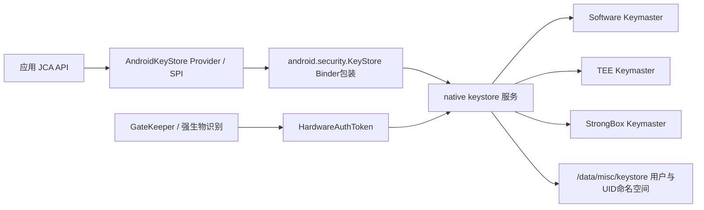
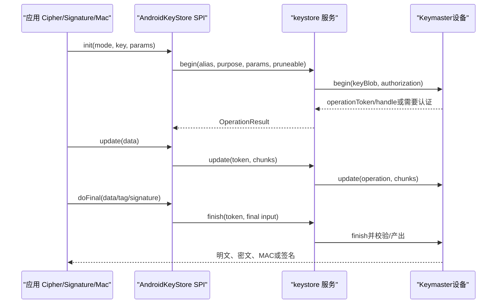
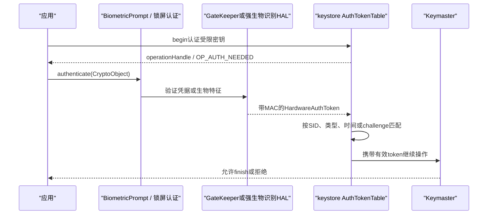

# 290 Android Keystore、KeyStore服务、Keymaster HAL、密钥生成/使用、硬件绑定、用户认证与不可迁移边界链

## 1. 本章目标

本章从应用调用JCA的`KeyGenerator`、`KeyPairGenerator`和`Cipher`开始，追踪AndroidKeyStore Provider、Java Binder包装、native `keystore`守护进程、Keymaster HIDL HAL以及TEE/StrongBox；然后解释alias与UID隔离、密钥授权、用户认证、硬件认证令牌、证明链、卸载清理和备份不可迁移边界。

## 2. Android 11版本边界

本文依据本地`android-11.0.0_r48`。这一版的主链是旧`keystore`守护进程、服务名`android.security.keystore`和Keymaster 3/4/4.1 HIDL；Android 12开始成为主线的keystore2、KeyMint与AIDL安全级别架构不能倒灌到本章。

## 3. 先把三个同名对象分开

`java.security.KeyStore`是JCA抽象容器；`android.security.KeyStore`是Framework对Binder服务的客户端包装；native `keystore`是实际守护进程。看到`KeyStore.getInstance()`时必须结合包名判断，否则很容易把API层、IPC层和服务实现混在一起。

## 4. Android Keystore解决什么问题

普通文件加密要求应用自己持有密钥字节；Android Keystore允许应用只持有一个逻辑句柄，把生成、导入和运算交给系统。若设备提供可信硬件，私钥或对称密钥的明文可只在安全环境内出现，应用进程即使被读取也拿不到原始密钥材料。

## 5. 它不自动保护所有业务数据

Keystore保存的是密钥及其授权，不会自动发现并加密数据库、SharedPreferences或网络报文。应用仍需选择AES-GCM等算法，保存IV、密文与认证标签，并设计丢钥、重装、换机和并发更新策略。

## 6. 核心源码地图

```text
frameworks/base/keystore/java/android/security/
  KeyStore.java  Credentials.java
  keystore/AndroidKeyStoreProvider.java
  keystore/AndroidKeyStoreSpi.java
  keystore/AndroidKeyStoreKeyGeneratorSpi.java
  keystore/AndroidKeyStoreKeyPairGeneratorSpi.java
  keystore/AndroidKeyStoreCipherSpiBase.java
  keystore/KeyGenParameterSpec.java  keystore/KeymasterUtils.java
system/security/keystore/
  keystore_main.cpp  key_store_service.cpp  KeyStore.cpp
  keymaster_worker.cpp  operation.cpp  auth_token_table.cpp
  user_state.cpp  blob.cpp  grant_store.cpp  permissions.cpp
hardware/interfaces/keymaster/4.0/  hardware/interfaces/keymaster/4.1/
```

## 7. 进程与信任边界

JCA对象在应用进程；Java包装经Binder进入native `keystore`进程；守护进程再经HIDL调用软件、TEE或StrongBox Keymaster。GateKeeper或强生物识别组件产生带MAC的`HardwareAuthToken`，让Keymaster判断用户认证是否满足，而不是相信应用传入一个布尔值。

## 8. 总体架构图



## 9. init怎样启动keystore

`system/security/keystore/keystore.rc`声明`/system/bin/keystore /data/misc/keystore`，以`keystore`用户运行并加入少量系统组。目录参数由`main()`执行`chdir()`后成为文件型数据库的根，但仅知道目录并不等于有权限读取或使用其中密钥。

## 10. Binder服务如何发布

`keystore_main.cpp`创建`KeyStore`和`KeyStoreService`后执行：

```cpp
service->setRequestingSid(true);
sm->addService(String16("android.security.keystore"), service);
IPCThreadState::self()->joinThreadPool();
```

`setRequestingSid(true)`让服务获得调用方SELinux SID，用于传统UID权限之外的SELinux密钥访问裁决。

## 11. Keymaster设备枚举顺序

守护进程先枚举Keymaster 4包装，若没有可信执行环境实例再回退枚举Keymaster 3。结果按`SOFTWARE`、`TRUSTED_ENVIRONMENT`和`STRONGBOX`安全级别放槽位，同一槽位已有较新实现时不会被后发现实现覆盖。

## 12. Software Keymaster总会存在

若HAL没有软件实例，源码调用`makeSoftwareKeymasterDevice()`补一个软件实现，用于兼容旧密钥等场景。它仍能执行密码算法，但“由系统服务执行”不等于“密钥受TEE或独立安全芯片保护”。

## 13. 没有TEE时的特殊降级

r48源码若只发现不安全的软件HAL却没有TEE，会记录警告并把该软件实现放进`TRUSTED_ENVIRONMENT`默认槽。因此“默认选中TEE槽”本身不是硬件证明；应用要查看`KeyInfo`或远端验证attestation，而不能只看Provider名称。

## 14. 新密钥的软件回退限制

当默认硬件Keymaster主版本至少为2时，守护进程把新生成/导入允许的最低级别设为`TRUSTED_ENVIRONMENT`，软件设备主要保留给历史密钥。不同产品实现仍有差异，所以安全需求必须用能力检查和失败处理表达，不能假设所有Android 11设备相同。

## 15. Provider把JCA名称映射到SPI

`AndroidKeyStoreProvider`注册`KeyStore.AndroidKeyStore`以及AES、HMAC、RSA、EC的`KeyGenerator`、`KeyPairGenerator`、`Cipher`、`Signature`、`Mac`和工厂实现。应用写标准JCA代码，实际对象由这些SPI把参数翻译成Keymaster标签和Binder调用。

## 16. 加载容器的标准入口

典型入口是：

```java
java.security.KeyStore ks =
        java.security.KeyStore.getInstance("AndroidKeyStore");
ks.load(null);
```

这里的`load(null)`不是从某个应用文件反序列化，也没有应用自定义密码；它初始化面向当前UID命名空间的系统Provider视图。

## 17. alias只是逻辑名字

应用看到`login_key`，服务端还会结合调用UID、目标用户和内部类型前缀定位条目。两个普通应用可使用相同alias却不会得到同一个密钥；真正隔离基础是Linux UID、服务端权限和SELinux，而不是开发者起了一个“足够随机”的名字。

## 18. 一条逻辑非对称条目包含什么

私钥条目通常由`USRPKEY_<alias>`、叶子证书`USRCERT_<alias>`和其余证书链`CACERT_<alias>`组成。JCA的一个alias因此可能对应多个底层文件，删除或替换时要处理整组，而不是只删证书。

## 19. 对称密钥前缀的版本陷阱

在r48中，新生成的AES/HMAC同样使用`Credentials.USER_PRIVATE_KEY + alias`，即`USRPKEY_`。`USRSKEY_`被标为旧前缀，`AndroidKeyStoreSpi.engineGetKey()`只在新前缀不存在时尝试它；所以不能根据字符串`PRIVATE`推断条目一定是私钥。

## 20. 为什么还能区分密钥类型

Provider获取Keymaster characteristics中的`KM_TAG_ALGORITHM`，再构造`AndroidKeyStoreSecretKey`或公私钥对象。类型来自受控元数据和加载流程，不来自文件名前缀的英文含义。

## 21. 私钥与对称密钥默认不可导出

`AndroidKeyStoreKey`基类的`getFormat()`和`getEncoded()`返回`null`。这意味着常见的`secretKey.getEncoded()`或`privateKey.getEncoded()`不能获得字节；应用持有的是带alias、UID和算法信息的操作句柄对象。

## 22. 公钥可以导出

`AndroidKeyStorePublicKey`可以返回X.509编码，证书也可读取，因为公开材料不要求保密。非对称场景应区分“私钥不离开安全边界”和“公钥/证书可分发给服务器”这两个事实。

## 23. 生成AES密钥的最小示例

```java
KeyGenerator g = KeyGenerator.getInstance(
        KeyProperties.KEY_ALGORITHM_AES, "AndroidKeyStore");
g.init(new KeyGenParameterSpec.Builder("db_key",
        KeyProperties.PURPOSE_ENCRYPT | KeyProperties.PURPOSE_DECRYPT)
        .setBlockModes(KeyProperties.BLOCK_MODE_GCM)
        .setEncryptionPaddings(KeyProperties.ENCRYPTION_PADDING_NONE)
        .build());
SecretKey key = g.generateKey();
```

Builder描述的是长期授权集合；一次`Cipher.init()`仍要选择其中某个purpose和具体模式。

## 24. KeyGenParameterSpec不是提示

算法、位数、purpose、block mode、padding、digest、有效期和认证要求被转成`KM_TAG_*`写入密钥授权。后续操作若超出集合，Keymaster应拒绝；它不是Provider生成后可忽略的Java侧备注。

## 25. purpose限定方向

`PURPOSE_ENCRYPT`、`DECRYPT`、`SIGN`、`VERIFY`、`WRAP_KEY`等表达允许的动作。只为签名生成的私钥不能因为算法同为RSA就拿去解密；最小授权能缩小密钥被错误复用后的损害面。

## 26. 模式、填充与摘要也被约束

AES-GCM密钥不能在未授权的CBC模式使用；RSA签名与加密的padding集合各自转换；HMAC要求确定摘要。Provider会做一部分参数组合校验，Keymaster在操作时再次依据授权判断。

## 27. 有效期分成三类

`ACTIVE_DATETIME`表示开始可用时间；`ORIGINATION_EXPIRE_DATETIME`限制加密/签名；`USAGE_EXPIRE_DATETIME`限制解密/验证。这样可以停止产生新数据，却保留一段时间读取旧数据，不能把一个“过期日”粗暴理解为所有方向同时失效。

## 28. 对称密钥还会补充MAC约束

AES-GCM会加入最小认证标签长度；HMAC会把对应摘要输出长度作为最小MAC长度。源码中的`KeymasterUtils.addMinMacLengthAuthorizationIfNecessary()`是防止调用侧随意缩短认证强度的重要一环。

## 29. 随机化加密默认开启

`KeyGenParameterSpec`默认`randomizedEncryptionRequired=true`。用于加密时，Provider会拒绝明显不满足IND-CPA的配置，例如某些确定性RSA padding；目标是避免同一明文反复产生可关联的固定密文。

## 30. CALLER_NONCE代表什么

只有应用显式关闭随机化要求，生成代码才加入`KM_TAG_CALLER_NONCE`，允许调用者在加密时提供IV/nonce。它不是推荐的通用开关；若业务错误重用GCM nonce，同一密钥下的机密性和完整性都可能崩溃。

## 31. IV不是秘密

正常AES-GCM加密由Provider/Keymaster生成随机IV，应用在`Cipher.init(ENCRYPT_MODE,key)`后读取并和密文一起保存。解密时使用相同IV；丢失IV无法解密，但公开保存IV不会泄露密钥。

## 32. 认证标签必须被校验

GCM输出包含认证标签，解密`doFinal()`会验证它。出现`AEADBadTagException`应当视为密文、IV、AAD、密钥或标签不匹配，不能返回“尽量解出的部分明文”。

## 33. AAD绑定上下文

`updateAAD()`可把用户ID、记录类型或协议版本等非秘密元数据纳入认证，但加解密双方必须提供完全相同字节。AAD本身不被加密；设计时要定义稳定编码，避免字符串拼接歧义。

## 34. 生成会先删除同alias旧条目

对称和非对称生成器都先调用`Credentials.deleteAllTypesForAlias()`，然后生成新密钥；失败路径也再次清理。因此“覆盖生成失败就自动保留旧密钥”是错误假设，关键业务应先用新alias完成迁移验证，再切换引用。

## 35. 非对称生成还要存证书

生成私钥后，Provider加载公钥并保存叶子证书和可能的CA链。没有attestation challenge时通常生成短的自签证书；证书可读不代表其中私钥可导出。

## 36. 导入密钥与生成密钥不同

导入需要应用在调用时拥有原始密钥材料，系统随后按`KeyProtection`授权保存；生成则可让明文从一开始就在Keymaster边界内产生。若威胁模型要求应用从未见过私钥，应优先在Keystore内生成。

## 37. WrappedKey是另一条高级路径

AndroidKeyStore支持受包装密钥导入，使用包装密钥alias和转换参数由安全硬件解包。它需要设备和HAL能力支持，失败会映射为`SecureKeyImportUnavailableException`等；不能把它当作所有Android 11设备都可用的普通导入。

## 38. StrongBox请求如何下传

`setIsStrongBoxBacked(true)`令生成器加入`KeyStore.FLAG_STRONGBOX`，服务端据此选择`SecurityLevel::STRONGBOX`设备。StrongBox通常是独立安全芯片/安全元素级实现，隔离更强但算法、性能和并发资源可能更有限。

## 39. StrongBox缺失不会静默降级

指定StrongBox而服务端没有对应设备时，`HARDWARE_TYPE_UNAVAILABLE`被转换为`StrongBoxUnavailableException`。若产品策略允许降级，应用应捕获后明确重新用不带StrongBox的spec生成；安全敏感场景则应终止，而不是无声换级别。

## 40. TEE是默认选择但不是产品承诺

未请求StrongBox或软件标志时，服务端走可信环境槽。由于前述软件顶替槽位和厂商能力差异，真正要求应写成“生成后核查，或由服务器校验证明链”，而不是“AndroidKeyStore必定硬件级”。

## 41. KeyInfo怎样判断硬件内

`AndroidKeyStoreSecretKeyFactorySpi`查看`KM_TAG_ORIGIN`落在`hwEnforced`还是`swEnforced`：前者令`insideSecureHardware=true`。这表示密钥材料只在安全硬件内以明文出现；并不保证特定芯片型号，也不直接区分TEE与StrongBox。

## 42. KeyInfo还告诉你什么

它提供位数、origin、purpose、模式、padding、digest、有效期、认证超时、认证是否由安全硬件强制、在身延长、可信在场和确认等信息。它是运行时核对授权的工具，不应被日志完整上传成新的隐私泄漏源。

## 43. hwEnforced与swEnforced

Keymaster characteristics把授权分成硬件强制和软件强制。算法等能力可能由硬件执行，而日期检查等某些条件落在软件；“密钥硬件内”不自动意味着每一条授权都由同一硬件时钟或组件强制。

## 44. 守护进程仍会在磁盘保存blob

硬件保护不等于`/data/misc/keystore`完全没有文件。常见实现把硬件返回的不透明、已包装key blob持久化；没有正确设备状态和硬件根密钥，复制这些blob通常不能获得原始密钥或在另一设备使用。

## 45. 一文件一条目的数据模型

`keystore_main.cpp`注释说明每个文件保存一个key/value，key编码进文件名。`blob.cpp`还可保存characteristics侧文件；这套旧实现是文件型数据库，不是后来keystore2所用的同一存储设计。

## 46. 用户目录与UID共同命名

条目位于类似`/data/misc/keystore/user_<userId>/`的目录，文件名包含目标UID与编码后的alias。多用户下相同appId会组合成不同完整UID，因此用户0和工作资料里的同包默认也不是同一密钥空间。

## 47. 文件权限不是唯一防线

目录属主、进程UID、Binder权限、目标UID检查、SELinux `keystore_key`类规则和Keymaster授权共同形成防线。绕过某一层的读权限不代表能调用操作，更不代表能解开硬件blob。

## 48. 传统权限表按操作分类

`permissions.cpp`定义get、insert、delete、exist、list、sign、verify、grant、clear_uid、add_auth等位。普通应用主要能操作自身UID条目；跨UID、清理、注入认证令牌和设备ID证明等能力受额外权限限制。

## 49. 服务不会盲信targetUid

Binder入口把calling UID与target UID做`is_granted_to()`或self/system检查，系统、Wi-Fi、VPN等有少量历史映射。普通应用不能仅把参数改成另一个UID就读取其alias。

## 50. SELinux在Binder服务内继续裁决

请求方SID与目标密钥上下文会经过SELinux检查；这是“同UID规则”之外的一层强制访问控制。分析`PERMISSION_DENIED`时既要看Java权限/UID，也要看AVC日志和密钥标签，而不能只检查Manifest。

## 51. grant不是复制密钥

服务可为被授权UID创建形如`<alias>_KEYSTOREGRANT_<随机号>`的不透明别名。`GrantStore`保存它指向原`KeyBlobEntry`的关系；被授权者通过句柄用密钥，原始密钥字节没有复制到对方进程。

## 52. grant有生命周期

撤销、删除原键、清理grantee UID都会移除相应关系；该旧实现的`GrantStore`是进程内结构，不能把grant alias当作永久可备份凭据。普通应用API也未把所有底层grant能力开放成任意共享机制。

## 53. KeyChain与AndroidKeyStore不同

AndroidKeyStore主要是应用私有UID命名空间；KeyChain通过系统选择器和KeyChainService让用户选择共享客户端证书/私钥并授予应用使用权。两者底层可能都经过keystore服务，但权限模型和产品交互完全不同。

## 54. 旧UserState有三态

`UserState`维护`UNINITIALIZED`、`LOCKED`和`UNLOCKED`，并管理每用户`.masterkey`。存在masterkey文件时初始化为LOCKED，不存在时为UNINITIALIZED；成功解锁才把主密钥保留在内存。

## 55. 主密钥怎样由锁屏凭据保护

`user_state.cpp`以密码派生密钥解密`.masterkey`：当前256位路径使用PBKDF2-HMAC-SHA256、8192轮和随机salt，旧128位格式兼容SHA-1；blob层用AES-GCM并兼容更老格式。锁定会清零内存主密钥；但这描述的是旧`FLAG_ENCRYPTED`存储层，不能外推到每个现代KeyGenParameterSpec条目。

## 56. 三种保护不要混为一谈

第一，硬件绑定决定原始密钥是否在TEE/StrongBox外明文出现；第二，用户认证授权决定某次运算是否需要HAT；第三，`FLAG_ENCRYPTED`决定旧blob是否由用户主密钥再加密。它们可组合，也可独立存在。

## 57. 现代spec默认不要求旧FLAG_ENCRYPTED

r48的`AndroidKeyStoreKeyGeneratorSpi`生成对称密钥时默认flags为0，只按StrongBox和关键加密等选项加位；现代非对称`KeyGenParameterSpec`也通常不会打开`mEncryptionAtRestRequired`。旧`KeyPairGeneratorSpec.isEncryptionRequired()`才会显式走锁屏主密钥加密路径。

## 58. 所以“没解锁就不能用任何Keystore键”是错的

服务端在创建或读取带`KEYSTORE_FLAG_ENCRYPTED`的旧式blob时才依赖旧UserState解锁；`begin()`遇到锁定的super-encrypted blob还会转成用户未认证错误。现代密钥能否在锁屏时使用主要取决于Keymaster授权、`setUnlockedDeviceRequired()`、认证要求以及设备启动阶段，必须逐键读取spec和characteristics。

## 59. `unlockedDeviceRequired`是独立授权

`setUnlockedDeviceRequired(true)`加入`KM_TAG_UNLOCKED_DEVICE_REQUIRED`，要求设备处于解锁状态才允许使用。这不是旧blob加密开关，也不等于每次都弹生物识别；设备锁上后，即便认证窗口时间尚未过，也可能被该条件挡住。

## 60. EARLY_BOOT_ONLY是HAL 4.1边界

Keymaster 4.1加入`EARLY_BOOT_ONLY`等标签，用于只允许早期启动阶段使用的系统密钥。它不是普通应用用来“开机前访问数据库”的通用API；服务和权限边界仍由系统实现控制。

## 61. Cipher初始化不会拿出密钥

`Cipher.getInstance("AES/GCM/NoPadding")`结合AndroidKeyStore key执行`init()`时，SPI收集purpose、mode、padding、IV等参数，然后调用`KeyStore.begin()`。返回的是操作上下文，不是把key blob解包进应用堆。

## 62. begin/update/finish主链



## 63. operation token与handle不同

operation token是Binder对象，用来让守护进程查找并管理该次操作；`operationHandle`是硬件操作标识，可交给`BiometricPrompt.CryptoObject`绑定一次认证。二者都不是密钥字节，也不能持久化后当作长期alias。

## 64. update为何要分块

`KeyStoreCryptoOperationChunkedStreamer`把任意长度输入切成Keymaster可接受的块，并跟踪已消费字节。应用看到一次`update()`不代表底层只有一次IPC；大文件应流式处理，避免同时把全部明文和密文放进内存。

## 65. finish是安全语义关键点

加密时`finish`产出最后块和标签；解密时验证AEAD标签；签名/验签在此完成最终数学与授权检查。调用方不能把`update()`的部分输出当成已认证明文提交业务，必须等`doFinal()`成功。

## 66. reset与abort

SPI初始化新操作、失败或对象释放时会调用`abort(operationToken)`，守护进程再让Keymaster释放资源。忘记结束大量操作可能耗尽有限硬件槽位，最终出现资源类错误或触发可裁剪操作回收。

## 67. pruneable操作

普通应用开始的是可裁剪操作；资源不足时服务可回收较旧可裁剪操作。非pruneable只允许system appId请求，防止普通应用永久占住有限的TEE/StrongBox操作槽。

## 68. additionalEntropy不是密钥本身

生成和某些finish路径会把Java `SecureRandom`字节混入Keystore RNG。最终随机性仍由Keymaster流程负责；传入额外熵不意味着应用可以控制或重现密钥。

## 69. 错误会翻译成JCA异常

Keymaster的负错误码和Keystore正错误码先包装为`KeyStoreException`，再按场景变成`InvalidKeyException`子类。上层应区分未认证、永久失效、尚未生效、已过期、StrongBox不可用和数据认证失败，而不是统一捕获后无条件重建键。

## 70. 临时未认证与永久失效

`KM_ERROR_KEY_USER_NOT_AUTHENTICATED`或`OP_AUTH_NEEDED`会触发characteristics检查：若当前root SID或全部相关biometric SID仍能满足，映射为`UserNotAuthenticatedException`；若已无任何可满足SID，则映射为`KeyPermanentlyInvalidatedException`。

## 71. 认证要求怎样写入密钥

未要求认证时加入`KM_TAG_NO_AUTH_REQUIRED`；要求时加入一个或多个`KM_TAG_USER_SECURE_ID`及`KM_TAG_USER_AUTH_TYPE`。有效期为0表示每次操作认证，不加入`AUTH_TIMEOUT`；大于0则加入秒数超时窗口。

## 72. Android 11的认证类型API

API 30可用`setUserAuthenticationParameters(timeout, type)`明确选择`AUTH_DEVICE_CREDENTIAL`、`AUTH_BIOMETRIC_STRONG`或组合。已废弃的`setUserAuthenticationValidityDurationSeconds(-1)`在本版映射为每次使用的强生物识别，非负值则映射为设备凭据或强生物识别均可。

## 73. root SID是什么

GateKeeper在设备设置安全锁屏后提供secure user ID。要求设备凭据，或同时接受凭据与强生物识别时，源码通常把密钥绑定到root SID；认证产生的HAT携带对应身份信息，Keymaster才能授权。

## 74. 没有安全锁屏不能生成认证键

当需要root SID却得到0，`KeymasterUtils.getRootSid()`抛出状态异常，生成器转为`InvalidAlgorithmParameterException`。应用应先检查设备安全状态并引导用户设置锁屏，而不是生成一个“暂时不认证、以后再自动变安全”的键。

## 75. 每次使用认证怎样工作

timeout为0时，应用先用该Key初始化`Cipher`或`Signature`获得操作handle，再把`CryptoObject`交给`BiometricPrompt`。成功认证产生绑定到此次challenge/operation的HAT，随后同一操作才能继续；另起一个操作不能复用这个一次性批准。

## 76. 时间窗口认证怎样工作

timeout大于0时，最近一次满足类型的设备解锁或认证可在窗口内授权多个操作。窗口不是应用自己记录的时间戳，而由受信任认证令牌和Keymaster策略判断；锁定、重启、离身策略或实现状态还可能缩短实际可用性。

## 77. HAT为什么不能由应用伪造

`HardwareAuthToken`包含challenge、user/authenticator ID、认证类型、时间戳和MAC。GateKeeper或可信生物识别组件与Keymaster共享验证秘密；普通应用即使能构造同字段，也不能产生有效MAC。

## 78. 认证令牌时序



## 79. AuthTokenTable的职责

守护进程保存收到的HAT，按超时型或每操作型规则查找可授权令牌，并处理完成、清除和离身事件。`addAuthToken`受`P_ADD_AUTH`保护；应用不能直接向表中注入“我已经认证”的自签消息。

## 80. `OP_AUTH_NEEDED`并不等于begin完全没建立操作

服务端源码在结果为`NO_ERROR`或`OP_AUTH_NEEDED`时都可记录操作设备和token，使后续认证后继续成为可能。上层应遵守Provider/BiometricPrompt协议，不能看到错误码就随意丢掉并用新Cipher冒充同一handle。

## 81. 生物识别注册变化的失效规则

生物识别专用键且`invalidatedByBiometricEnrollment=true`时，源码把当时各biometric authenticator ID写成SID；新增或移除导致ID变化后，旧键可能永久失效。这样可防止在密钥创建后偷偷加入新的手指/面孔获得授权。

## 82. 不因注册变化失效怎样实现

若设置false，生物识别路径改绑root SID，使注册变化不自动废键。便利性提高，但信任集合会随新注册扩大；涉及高价值资产时应结合服务器重新注册、风险确认和账号恢复策略选择。

## 83. 不是每次改锁屏密码都会废键

普通凭据变更可能保留root SID，因此不能写成“改一次密码所有键都失效”。移除/重置安全锁屏使SID不可满足，或认证器ID发生被绑定的变化，才是永久失效的典型来源；具体仍看键绑定了哪些SID。

## 84. 公钥操作通常不受私钥认证限制

用户认证主要约束秘密密钥和非对称私钥操作。公开证书、导出公钥和用公钥验签/加密不应要求用户解锁私钥；这是公钥可分发的密码学属性，不是绕过私钥授权。

## 85. 用户在场与用户确认不是普通BiometricPrompt

`TRUSTED_USER_PRESENCE_REQUIRED`和`TRUSTED_CONFIRMATION_REQUIRED`是独立Keymaster授权，依赖安全硬件/ConfirmationUI能力。它们不等同于`setUserAuthenticationRequired()`，设备不支持时可能无法生成或使用。

## 86. on-body延长有限制

`ALLOW_WHILE_ON_BODY`只用于有正超时窗口的认证键；每次生物识别认证键设置它会被源码拒绝。即使支持，它表达的是特定传感/安全策略的延长，不是“只要手机没关机就永不过期”。

## 87. attestation从challenge开始

非对称`KeyGenParameterSpec`设置非null challenge后，Provider加入`KM_TAG_ATTESTATION_CHALLENGE`并调用`attestKey()`取得证书链。null表示不请求证明；空字节数组仍是一个实际challenge，不应与null混为一谈。

## 88. challenge提供新鲜度和请求绑定

服务器应生成不可预测的一次性challenge，收到链后核对证书扩展中的challenge。若应用长期复用固定字符串，攻击者可能重放旧证明；challenge本身不证明包名、账号或业务请求，服务器还需把这些上下文纳入协议。

## 89. attestation能证明什么

证明扩展可包含公钥、软件/TEE授权列表、安全级别、verified boot状态、补丁级别和应用ID等，具体取决于HAL与设备。服务器要验证完整链、根信任、签名、challenge、授权和自身策略；只解析一项`isInsideSecureHardware`不等于完成远程验证。

## 90. 软件证明链可能不受信任

软件Keymaster也可能返回某种证明结果，但根链未必属于服务器信任的硬件根。安全结论来自验证后的链和安全级别，而不是“API成功返回了多个Certificate”。

## 91. 设备标识证明受特权限制

序列号、IMEI等设备ID attestation会扩大跟踪能力，服务端检查system身份或特权电话权限。普通应用不能把`AttestationUtils`能构造标签理解为有权请求真实硬件设备标识。

## 92. 证书有效期不等于密钥授权有效期

自签/证明证书的notBefore/notAfter是X.509元数据；Keymaster的ACTIVE、ORIGINATION_EXPIRE和USAGE_EXPIRE才决定密钥运算授权。二者应协调，但检查证书日期不能替代Keymaster错误处理。

## 93. 卸载和清数据会清Keystore UID

PackageManager在清应用数据流程中计算appId，并对目标用户完整UID调用`KeyStore.clearUid()`；全用户时逐个用户调用。这样即使以后Linux appId被复用，新应用也不应继承旧UID的密钥条目。

## 94. clearUid具体删除什么

服务先删除授予该UID的全部grant，再列举用户目录中UID匹配的锁定条目逐个删除。system UID下标记`criticalToDeviceEncryption`的键有特殊保留；普通应用不能依赖这个系统例外。

## 95. sharedUserId是历史特殊边界

共享Linux UID的包天然共享Keystore UID命名空间，alias冲突和访问能力也可能共享。它不是现代应用安全共享密钥的推荐机制；设计审计时应把共享UID中的所有包视为同一安全主体。

## 96. 删除alias不可恢复

`KeyStore.deleteEntry()`或覆盖失败清掉底层key blob后，系统没有“回收站”。如果该键是唯一解密钥，即使密文备份完好也无法恢复；高价值数据必须预先设计密钥轮换和恢复协议。

## 97. Auto Backup不会搬走Keystore密钥

第289章的full backup遍历应用允许的数据域，而Keystore条目位于系统`/data/misc/keystore`并由UID/硬件管理，不属于应用沙箱文件树。恢复应用数据到新设备时，不能期待原AndroidKeyStore alias自动带着同一密钥出现。

## 98. “备份密文但不备份密钥”陷阱

若数据库或SharedPreferences密文被Auto Backup带到新设备，而密钥没有迁移，恢复后将永久无法解密。可把设备绑定密文放入`no_backup`或XML exclude，或把业务设计为服务器重新下发/用户恢复/重新登录后再生成键。

## 99. 硬件绑定本来就追求不可迁移

TEE/StrongBox key blob通常绑定设备硬件根、启动状态和安全组件；复制文件到另一台设备无法使用是安全属性，不是备份Bug。远程身份场景应把换机视为注册一把新公钥，而不是克隆旧私钥。

## 100. 重装后的正确恢复思路

应用启动时检查alias是否存在，再判断密文是否与该alias同一代；缺键时不要反复尝试解密或静默清空用户数据。根据产品选择重新登录、服务端恢复数据密钥、重新注册设备、提示不可恢复或丢弃设备缓存。

## 101. Envelope Encryption更适合可恢复数据

可用随机数据密钥加密大量数据，再用Android Keystore键包装数据密钥；若业务要求跨设备恢复，可额外用用户秘密或服务器公钥建立合规恢复包。恢复能力会改变威胁模型，不能同时宣称“任何服务器都无法恢复”和“用户忘记所有凭据仍可恢复”。

## 102. 密钥轮换要有版本

不要永久硬编码单一alias。保存`key_v3`等key id、算法版本、IV和密文格式；新数据用新键，旧数据按需解密重加密，确认迁移完成后才删除旧键。仅覆盖同alias会失去区分新旧密文的能力。

## 103. 并发创建alias要有应用层协调

两个线程同时发现alias不存在并生成，后到的删除/覆盖可能让先到线程得到的句柄立即对应不同状态。用进程内锁、单独初始化组件和幂等状态机协调；多进程应用还需要跨进程协议。

## 104. 加密文件更新也要原子提交

Keystore只保证运算和密钥授权，不保证“密文文件+元数据+数据库索引”跨文件一致。应先写临时文件，完整`doFinal()`，同步并原子rename，再提交索引；崩溃恢复时验证格式、key id与GCM标签。

## 105. 不要把认证异常全部当作丢钥

`UserNotAuthenticatedException`通常应触发认证UI；`KeyPermanentlyInvalidatedException`才进入重新注册/恢复；`KeyExpiredException`可能需要轮换；`AEADBadTagException`更多表示数据或参数不匹配。无差别删除alias会把可恢复问题变成永久数据丢失。

## 106. 性能模型

每次begin/update/finish跨进程，硬件操作资源有限，StrongBox通常更慢。不要为每个小字段生成一把硬件键或逐字节update；可按安全域生成少量主包装键，在应用层批量/流式加密数据。

## 107. 诊断入口

源码静态定位优先看Provider SPI怎样构造参数、Java `KeyStore`怎样映射错误、native service怎样检查权限和选择设备。真机调试还可结合应用异常、`logcat`中的keystore/Keymaster日志、包UID和设备能力；敏感alias、明文、认证令牌不得写入日志。

## 108. 代码评审清单一：生成

确认alias版本、算法/模式/padding、位数、purpose、随机化、StrongBox降级政策、认证类型/超时、注册变化失效和无安全锁屏分支。再确认生成失败是否会删旧alias，以及运行后是否用`KeyInfo`核对所需属性。

## 109. 代码评审清单二：使用

确认IV唯一且随密文保存、AAD编码稳定、只有`doFinal()`成功才消费明文、异常分类正确、操作及时abort/释放、文件原子提交、并发受控。对签名则确认服务端验签上下文和防重放，而不只是签名算法名称。

## 110. 代码评审清单三：生命周期

确认清数据、卸载、锁屏移除、生物识别变化、系统升级、换机、备份恢复和账号注销分别会发生什么。明确哪些数据是设备缓存，哪些必须可恢复，恢复秘密由谁掌握，旧键何时安全删除。

## 111. 十五个常见误解

Android 11主线不是keystore2；Provider名称不证明硬件；TEE槽不绝对证明真实TEE；磁盘有blob不等于私钥明文落盘；`USRPKEY_`不只装私钥；alias不跨UID；私钥不可导出但公钥可；Keystore不自动加密数据库；认证要求不等于旧`FLAG_ENCRYPTED`；设备已解锁不等于满足每次认证；每次改密码不必然废键；StrongBox请求不静默降级；attestation返回不等于验证通过；Auto Backup不迁移键；删除/覆盖alias不能撤销。

## 112. macOS只读练习一：追生成参数

在源码根目录执行`rg -n "engineGenerateKey|KM_TAG_CALLER_NONCE|FLAG_STRONGBOX" frameworks/base/keystore/java/android/security/keystore/AndroidKeyStoreKeyGeneratorSpi.java`，再用`sed -n '270,345p'`阅读。写下AES-GCM spec的每个字段如何变成Keymaster标签，并解释为何新对称键使用`USRPKEY_`。

## 113. macOS只读练习二：追安全级别选择

执行`sed -n '1,190p' system/security/keystore/keystore_main.cpp`和`rg -n "flagsToSecurityLevel|HARDWARE_TYPE_UNAVAILABLE" system/security/keystore frameworks/base/keystore`。画出默认、StrongBox请求、无StrongBox以及只发现软件HAL四种分支，全程不编译不改源码。

## 114. macOS只读练习三：追认证SID

执行`sed -n '80,225p' frameworks/base/keystore/java/android/security/keystore/KeymasterUtils.java`，分别手算“每次强生物识别”“30秒凭据或生物识别”“生物识别且注册变化不失效”的SID、auth type和timeout标签。再解释哪一种需要BiometricPrompt的operation handle。

## 115. macOS只读练习四：验证不可迁移边界

执行`rg -n "removeKeystoreDataIfNeeded|clearUid" frameworks/base/services/core/java/com/android/server/pm/PackageManagerService.java system/security/keystore/key_store_service.cpp`，再回看第289章full backup域。写一份恢复矩阵：清数据、卸载重装、同机升级、换机restore四种情况下alias、密文和服务器注册各怎样处理。

## 116. 自测：三层保护题

某AES键位于TEE、未要求用户认证、也未设置`unlockedDeviceRequired`。设备锁屏时它是否必然不可用？答案是不必然；硬件归属、用户认证和解锁状态授权是独立维度，必须看该键完整characteristics和实现。

## 117. 自测：覆盖失败题

应用已有`key_v1`并直接用同alias生成StrongBox新键，但设备无StrongBox。旧键是否一定保留？不一定；生成器先删除同alias全部类型，失败路径还清理。安全迁移应使用新alias并在验证成功后切换。

## 118. 自测：换机恢复题

Auto Backup恢复了AES-GCM密文、IV和key alias字符串，为什么仍解不开？因为alias只是名字，目标设备没有原UID/硬件绑定的同一密钥。应用需要重新认证并恢复数据密钥、重新下载原文，或把这类密文排除出备份。

## 119. 复读纠偏记录

复读后特别修正六处易错点：本版不是keystore2/KeyMint主链；新对称键也走`USRPKEY_`；默认TEE槽可在异常产品配置中由软件实现顶替；现代spec不等于旧`FLAG_ENCRYPTED`；每次改密码并不必然废键；证明链只有经服务器完整验证后才形成硬件安全结论。全文还把“密钥不可导出”限定为秘密/私钥，避免误写成公钥也不可读取。

## 120. 本章结论与下一章入口

Android Keystore的核心不是“一个安全文件夹”，而是UID/SELinux隔离、不可导出句柄、Keymaster授权、可选TEE/StrongBox、认证令牌和生命周期清理组成的系统。读源码时始终追问密钥在哪里生成、谁能发起何种操作、哪层强制授权、何时永久失效、备份后如何恢复。下一章继续追`BiometricPrompt`、`BiometricService`、Fingerprint/Face、`CryptoObject`与HAT如何把一次用户认证接入本章的operation handle。
