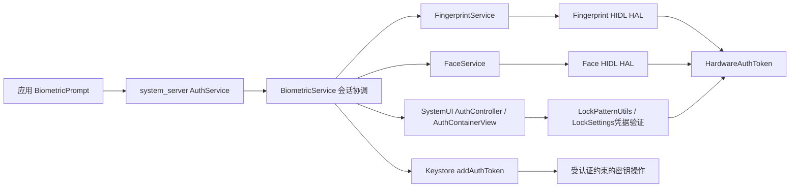
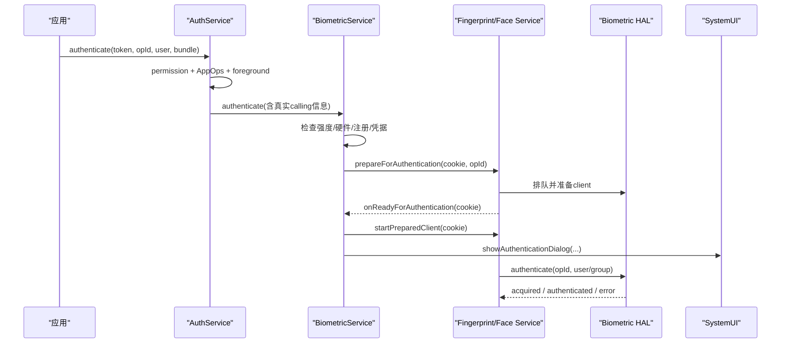
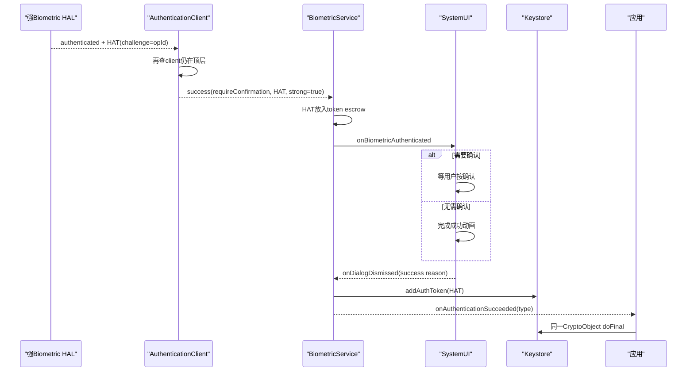

# 291 Android BiometricPrompt、BiometricService、Fingerprint/Face、CryptoObject、HardwareAuthToken与锁屏认证协作链

## 1. 本章目标

本章从应用构造`BiometricPrompt`开始，追踪公开`AuthService`、内部`BiometricService`、SystemUI认证对话框、Fingerprint/Face服务与HIDL HAL；重点解释authenticator强度、`CryptoObject` operation handle、HAT暂存/提交、设备凭据回退、确认、重试、取消、lockout与回调终态。

## 2. Android 11版本边界

本文依据本地`android-11.0.0_r48`。Android 11已有统一BiometricPrompt、`setAllowedAuthenticators()`和Class 3/2/1强度术语，但服务实现仍是旧`AuthService → BiometricService → 各模态Service`体系；不能套用后来统一sensor scheduler、AIDL biometric HAL或新版Prompt内部结构。

## 3. 先分清四种“认证”

应用身份由UID/签名决定；用户凭据认证是PIN/图案/密码；生物识别认证匹配已注册模板；Keystore授权则判断某个HAT是否满足密钥的SID、类型、时间或operation challenge。BiometricPrompt负责组织后两类交互，但不会替代应用账号登录或服务器授权。

## 4. BiometricPrompt的价值

应用不直接绘制指纹/人脸可信界面，也不直接调用传感器HAL。系统统一检查权限、前台状态、已注册模板、强度、锁定和用户设置，由SystemUI显示受控界面，再只把成功/失败等结果交给应用。

## 5. 它不是“返回生物特征数据”的API

应用拿不到指纹图像、人脸帧或模板；BiometricPrompt成功回调只有认证类型和原`CryptoObject`引用。模板匹配、活体/防欺骗能力与HAT生成在HAL/可信组件边界内完成。

## 6. 核心源码地图

```text
frameworks/base/core/java/android/hardware/biometrics/
  BiometricPrompt.java  BiometricManager.java  CryptoObject.java
  IAuthService.aidl  IBiometricService.aidl
frameworks/base/services/core/java/com/android/server/biometrics/
  AuthService.java  BiometricService.java  AuthenticationClient.java
  BiometricServiceBase.java  SensorConfig.java  BiometricStrengthController.java
  fingerprint/FingerprintService.java  face/FaceService.java
frameworks/base/packages/SystemUI/src/com/android/systemui/biometrics/
  AuthController.java  AuthContainerView.java  AuthBiometricView.java
  AuthCredentialView.java
hardware/interfaces/biometrics/fingerprint/2.1/
hardware/interfaces/biometrics/face/1.0/
```

## 7. 进程边界

BiometricPrompt对象和应用回调在应用进程；AuthService、BiometricService及Fingerprint/Face服务在system_server；统一对话框在SystemUI进程；HAL通常在vendor侧进程或实现边界。Binder/HIDL回调再被各层Handler/Executor切线程，不能假设所有方法都在主线程顺序执行。

## 8. 总体架构图



## 9. 客户端先连AuthService

`BiometricPrompt`构造函数通过`ServiceManager.getService(Context.AUTH_SERVICE)`取得`IAuthService`，并非直接连内部BiometricService。AuthService是公开门面，负责调用者权限、AppOps、用户和前台检查，再转给内部服务。

## 10. 两个系统服务各做什么

AuthService尽量不保存认证会话，只注册sensor并做公共入口校验；BiometricService保存current/pending `AuthSession`、选择模态、准备各服务、协调SystemUI和Keystore。源码注释虽说后者应是pass-through，实际因取消和UI握手仍维护一套状态机。

## 11. 传感器来自产品配置

`config_biometric_sensors`条目格式为`ID:Modality:Strength`，并要求按强度递减排列。AuthService解析后为指纹、人脸或虹膜创建`IBiometricAuthenticator`包装，并注册到BiometricService；AOSP默认数组可为空，真实设备由产品overlay提供。

## 12. 一个设备可有多个sensor但本版仍有模态限制

注册时ID唯一，BiometricService也保存每个sensor的配置和实现；但r48认证路径多处仍按modality匹配，并有“未来改用ID避免歧义”的TODO。不能把后来完善的多sensor并发调度能力倒推到本版。

## 13. Builder的最小配置

普通纯生物识别Prompt至少要有非空title和negative button；若允许设备凭据，凭据入口取代negative button，二者同时设置会在`build()`抛异常。subtitle与description可选，文字由应用提供但界面由SystemUI绘制。

## 14. 典型非加密调用

```java
BiometricPrompt prompt = new BiometricPrompt.Builder(context)
        .setTitle("确认是你")
        .setAllowedAuthenticators(
                BiometricManager.Authenticators.BIOMETRIC_WEAK
                | BiometricManager.Authenticators.DEVICE_CREDENTIAL)
        .build();
prompt.authenticate(cancel, executor, callback);
```

这只证明用户满足了所选本地认证器之一，不自动授权一把auth-per-use Keystore键。

## 15. allowedAuthenticators是OR集合

`BIOMETRIC_STRONG`、`BIOMETRIC_WEAK`与`DEVICE_CREDENTIAL`可按规则组合；只要一个请求类型当前可用，`canAuthenticate()`就可返回成功。它不表示所有类型都必须依次通过，也不是多因素认证表达式。

## 16. 强度位值是包含关系

r48中STRONG为`0x000F`，WEAK为`0x00FF`，因此`STRONG | WEAK == WEAK`。请求WEAK允许达到或超过Class 2的sensor，强sensor也满足；不要把这些常量当作互斥枚举用`==`逐个判断。

## 17. CONVENIENCE不是公开请求值

`BIOMETRIC_CONVENIENCE`用于系统配置/动态降级，不是公共BiometricManager API的合法参数。便利级模态不能参与Keystore强生物识别授权；“能解锁某些低风险UI”与“能授权密钥”是不同能力。

## 18. sensor强度可被降级但不能动态升级

`BiometricStrengthController`监听DeviceConfig的`biometric_strengths`，按sensor ID更新实际强度；设计说明只允许从OEM声明强度降级，不能借动态配置升级。原本够强、后来被降级的sensor可使`canAuthenticate(STRONG)`返回安全更新相关错误。

## 19. canAuthenticate检查哪些条件

BiometricService按配置顺序检查实际强度、硬件是否检测到、用户是否注册模板以及该模态是否允许用于应用；请求凭据时还询问TrustManager的`isDeviceSecure(userId)`。这是调用时快照，不是下一秒认证必然成功的预订。

## 20. canAuthenticate不是授权结果

它不会扫描用户特征、产生HAT或打开某把Keystore键。硬件可能随后忙碌、HAL死亡、用户取消、模板不匹配或前台Activity切走，因此应用仍须完整处理authenticate回调。

## 21. 本版选择第一个可用模态

`checkAndGetAuthenticators()`按已注册列表寻找第一个强度足够、已注册且可用的authenticator，找到就break。主路径随后准备该modality，而非默认同时启动指纹与人脸，让“谁先成功谁赢”。

## 22. 凭据可作为真正回退

若同时请求biometric与credential，只要任一可用就可继续；生物识别不可用但设备有安全锁屏时，服务会把bundle改成仅`DEVICE_CREDENTIAL`并直接显示凭据UI。它不是应用自己绘制的备用密码框。

## 23. 只有凭据时不启动sensor

`authenticateInternal()`发现authenticators恰为`DEVICE_CREDENTIAL`，直接把状态设为`STATE_SHOWING_DEVICE_CREDENTIAL`并调用SystemUI，不等待Fingerprint/Face ready cookie。凭据由LockSettings链验证，生物HAL不参与。

## 24. 权限入口

AuthService接受历史`USE_FINGERPRINT`或现代`USE_BIOMETRIC`权限；跨用户和隐藏选项要求`USE_BIOMETRIC_INTERNAL`。应用不能通过在Bundle中私塞内部标题、DPM检查或system-event字段获得特权，服务会再次检查。

## 25. AppOps是第二道门

入口对calling UID和`opPackageName`执行生物识别AppOp检查。包名不是应用随便声称的安全身份；系统结合UID验证/记账，使权限存在但AppOp被策略关闭时仍可拒绝。

## 26. 开始门与成功门不是同一强度

AuthService在请求开始时按calling UID/PID查询进程importance，r48允许到`IMPORTANCE_FOREGROUND_SERVICE`，进程列表意外为null时还保守返回true；不满足才记录并返回。真正收到HAL成功后，`AuthenticationClient`会进一步要求顶层Activity包匹配或调用者是Keyguard，防止扫描过程中发起方变得不可见仍取得成功。

## 27. SystemUI还观察任务栈

AuthController发现top package不再是当前client，会移除对话框并通知user cancel；收到`ACTION_CLOSE_SYSTEM_DIALOGS`也会取消。安全性不是只靠启动瞬间检查，而是服务端和UI共同监控会话可见性。

## 28. CancellationSignal是主动取消入口

客户端给signal设置listener，`cancel()`后调用`IAuthService.cancelAuthentication(token, package)`。如果signal在`authenticate()`前已经取消，r48客户端只记录“already canceled”并直接返回，不会从这段代码主动发送error回调；调用方不要等待一个必来的终态。

## 29. token绑定客户端会话

每个BiometricPrompt持有一个Binder token，服务用它识别取消者；AuthSession还对client receiver注册死亡通知。应用进程死亡时，若sensor正在运行会先请求HAL cancel并等待`ERROR_CANCELED`清理，否则直接隐藏UI并丢弃会话。

## 30. sessionId来自CryptoObject

带CryptoObject认证时，客户端调用`crypto.getOpId()`，对Cipher/Signature/Mac最终取AndroidKeyStore operation handle；不带crypto则sessionId为0。BiometricService用`sessionId != 0`判断isCrypto，并把它交给各模态和凭据验证路径。

## 31. CryptoObject不是密钥容器

它只是包装已用Keystore键初始化的`Cipher`、`Signature`、`Mac`或IdentityCredential。里面的操作句柄把未来HAT绑定到已经begin的具体操作；把未初始化Cipher塞进去会得到无效/零handle或更早失败，不能靠Prompt替你初始化算法参数。

## 32. auth-per-use的正确顺序

先取AndroidKeyStore键并`cipher.init()`，让Keystore创建需要认证的operation；再用该Cipher构造CryptoObject；认证成功后从result拿回同一CryptoObject并调用`doFinal()`。若在成功后重新new/init另一个Cipher，handle不同，先前HAT可能不授权它。

## 33. Crypto调用默认要求STRONG

带CryptoObject而未显式设置authenticator时，客户端把默认改成`BIOMETRIC_STRONG`。若显式请求包含WEAK中超出STRONG的位，`authenticate(crypto,...)`直接抛`IllegalArgumentException`，因为Class 2不能集成Keystore auth-per-use操作。

## 34. Android 11允许crypto结合设备凭据

r48文档明确旧版本曾拒绝`setDeviceCredentialAllowed(true)`与crypto组合，R版可通过`setAllowedAuthenticators()`让强生物识别或设备凭据授权。关键是密钥生成时的`AUTH_BIOMETRIC_STRONG`/`AUTH_DEVICE_CREDENTIAL`集合也要匹配Prompt请求。

## 35. Prompt集合与密钥集合必须一致

Prompt允许凭据并不代表一把仅绑定biometric SID的键接受凭据HAT；反之亦然。认证UI成功只说明用户通过了某个允许的Prompt方式，最终`doFinal()`还由Keymaster按密钥auth type、SID和challenge裁决。

## 36. 时间窗口键通常不传CryptoObject

timeout大于0的键由最近一次允许类型认证打开一段窗口，可先调用无crypto的BiometricPrompt或依靠设备解锁，再初始化/使用键。CryptoObject主要服务timeout=0的每次使用键；两种模型不能混成“任何Prompt成功都永久解锁alias”。

## 37. 客户端回调在哪个线程

BiometricPrompt的Binder receiver不直接执行应用逻辑，而是把success、failed、error、help等投递给调用者提供的Executor。若Executor串行主线程且回调做重I/O，会卡应用UI；若是线程池，则应用自己的状态读写必须同步。

## 38. 一个Prompt对象保存可变回调状态

`mCryptoObject`、`mExecutor`和`mAuthenticationCallback`在每次authenticate时被覆盖。文档允许复用并让新请求替换旧client，但业务上仍应给每次请求独立状态标识，避免旋转、重复点击和迟到回调污染当前页面。

## 39. 请求入口时序



## 40. 为什么要cookie两阶段启动

BiometricService为待启动模态生成非零随机cookie；各Fingerprint/Face服务先创建prepared client，准备好后原样回报cookie。只有所有等待项匹配完，中央服务才启动client并显示UI，避免传感器已扫描很久而可信提示尚未就绪。

## 41. pending与current同时存在的原因

新请求准备期间，旧current会话可能仍在等待HAL取消错误；错误回调因此必须用cookie判断属于current还是pending。只靠“当前全局client”会把旧sensor的迟到错误误发给新Prompt。

## 42. 状态机的主要节点

`CALLED`表示已要求模态prepare，`STARTED`表示扫描和UI开始，`PAUSED`用于人脸/被动模态重试，`PENDING_CONFIRM`等待显式确认，`AUTHENTICATED_PENDING_SYSUI`等待退场动画，`ERROR_PENDING_SYSUI`等待错误展示结束，另有凭据UI和客户端死亡取消态。

## 43. FingerprintService和FaceService仍各自管理client

中央服务通过`FingerprintAuthenticator`/`FaceAuthenticator`调用各自Service；后者继承BiometricServiceBase并使用ClientMonitor/AuthenticationClient调度当前、待办和取消。中央AuthSession并没有取代模态服务内部队列。

## 44. opId会下传到HAL

`AuthenticationClient.start()`调用daemon wrapper的`authenticate(mOpId, groupId)`。HAL以operationId作为HAT challenge的一部分；非crypto时通常为0，crypto时对应Keystore操作handle，从而阻止一份HAT随意授权另一操作。

## 45. Fingerprint HAL成功回调

Fingerprint 2.1适配器在fingerId非0时把`hw_auth_token_t`的完整字节转成HIDL vector，调用`onAuthenticated(deviceId,fingerId,groupId,token)`；fingerId为0表示未识别，回传空token。应用看不到fingerId和token原文。

## 46. Face HAL成功回调

Face 1.0同样以faceId、userId和token回调；还提供更丰富acquired信息和HAL报告的lockout变化。Framework把它们归一到AuthenticationClient，但人脸作为被动模态在确认和失败重试上有不同UI语义。

## 47. acquired不是终态

传感器可报告图像过暗、移动太快、部分指纹等采集质量；模态Service把可展示消息转给BiometricService，后者调用SystemUI `onBiometricHelp()`，应用最终收到`onAuthenticationHelp()`。这通常是引导用户调整，不代表本轮已经结束。

## 48. 未匹配回调也不是终态

`onAuthenticationFailed()`表示采样完成但没有匹配，用户通常可以继续尝试。应用不应在第一次failed就关闭页面、记为账号失败或自己重建Prompt；真正结束由success、error、用户操作或取消决定。

## 49. 指纹与人脸失败行为不同

指纹未匹配后HAL通常继续等待下一次触摸；r48对Face未匹配把中央状态设为PAUSED，并由SystemUI显示“try again”。这是被动模态一次采样后回到idle的实现差异，不是所有设备都具有相同交互节奏。

## 50. timeout在本版是可重试软错误

内部receiver把`BIOMETRIC_ERROR_TIMEOUT`单独转给`handleAuthenticationTimedOut()`，SystemUI显示错误并把状态设PAUSED，而不是立即把terminal error发给应用。用户可通过try again准备新client；应用层只看源码常量名容易误判为会话必终止。

## 51. 硬错误先让UI展示

除cancel等特殊路径外，服务把错误和vendor code暂存在AuthSession，状态设`ERROR_PENDING_SYSUI`，让SystemUI显示一小段时间并退场；对话框dismiss后再把原error发给应用。这解释了HAL报错与应用callback之间的可见延迟。

## 52. user cancel与app cancel不同

用户按返回、点外部或系统关闭对话框时，应用收到`BIOMETRIC_ERROR_USER_CANCELED`；应用调用CancellationSignal通常最终收到`BIOMETRIC_ERROR_CANCELED`。业务可用前者表示用户选择退出，用后者表示生命周期/逻辑主动结束，但都不应算生物特征不匹配。

## 53. negative button是独立回调

纯生物Prompt点击negative时，BiometricService先通知`onDialogDismissed(NEGATIVE)`，客户端再在button专用Executor执行listener；服务同时取消sensor。它不等同于AuthenticationCallback的一次failed，也不要依赖它一定再附带一个error回调。

## 54. 允许凭据后没有negative button

Builder显式禁止同时配置negative与device credential，因为同一按钮位置将用于“使用PIN/图案/密码”。用户点它后SystemUI通知BiometricService取消生物扫描，再把会话状态切到凭据界面。

## 55. SystemUI不是装饰层

AuthController接收system_server的show调用，创建AuthContainerView并持内部receiver；它负责显示帮助/错误、按钮、显式确认、凭据切换、退场动画、配置变化恢复和任务切换清理。业务App不能用自绘Dialog替代这条可信系统链获得HAT。

## 56. 对话框运行在SystemUI窗口

AuthContainerView通过WindowManager添加系统受控窗口，并在睡眠开始时按user cancel退场。它显示应用传入的标题和说明，因此应用仍要避免诱导文案；系统外观只保证认证控件可信，不证明标题中的业务金额真实。

## 57. 配置变化不会简单结束认证

AuthController在configuration change时保存当前dialog状态，移除旧View并按需重建；若正在退场则让已有pending callback完成。应用也应避免Activity旋转时立刻cancel+restart制造两个交错会话。

## 58. confirmationRequired默认true

Builder的确认提示默认true，主要影响Face/虹膜等被动模态；指纹触摸本身已有显式动作，通常无需额外确认。`setConfirmationRequired(false)`只是hint，系统设置可强制Face仍需确认。

## 59. Face设置可以提升确认要求

BiometricService在请求要求之外OR上`getFaceAlwaysRequireConfirmation(userId)`。系统可以把低风险应用的“不确认”请求收紧；应用不能用false覆盖用户或系统更严格的选择。

## 60. 成功不会立刻回给应用

AuthenticationClient确认顶层Activity后，把HAL token传给中央服务；BiometricService先通知SystemUI成功。如果需要确认，状态进入PENDING_CONFIRM；不需要也进入等待SystemUI动画完成的状态，最终dismiss事件才闭合会话。

## 61. Strong HAT会先进入escrow

只有`isStrongBiometric=true`时，token保存到`mTokenEscrow`；弱模态即使HAL传来token也被丢弃并记警告。这样Class 2成功可用于非crypto本地认证，但不会被注入Keystore冒充强认证。

## 62. 为何延迟addAuthToken

需要显式确认时，若HAL一成功就把HAT放进Keystore，用户尚未按“确认”却可能已有操作获准。r48把token暂存到AuthSession，等SystemUI报告`BIOMETRIC_CONFIRMED`或无需确认的退场完成，再调用`KeyStore.addAuthToken()`。

## 63. 成功/HAT提交时序



## 64. addAuthToken发生在应用success之前

`handleOnDismissed()`先把escrow token提交Keystore，再调用client receiver success。因此应用在success回调里对同一CryptoObject执行`doFinal()`时，正常情况下授权表已收到HAT；但最终仍可能因SID、类型、操作失效或并发取消而失败。

## 65. 非crypto成功也可能提交强HAT

强生物识别即使sessionId为0，成功token仍可被加入Keystore，用于满足时间窗口型认证键。它不会授权auth-per-use的非零challenge操作，却可能开启与该认证类型匹配的timeout窗口。

## 66. 设备凭据路径怎样产生attestation

SystemUI的PIN/图案/密码View调用`LockPatternChecker.verifyCredential()`，传入Prompt operationId和effective user；成功返回非null credential attestation/HAT。AuthContainerView保存它并以`CREDENTIAL_CONFIRMED`原因退场。

## 67. 凭据成功的fall-through细节

BiometricService的switch在credential confirmed分支先`addAuthToken(credentialAttestation)`，随后刻意fall through到公共success逻辑；由于通常没有biometric token escrow，会多记一条null日志，但仍把认证类型映射为DEVICE_CREDENTIAL并成功回调。读源码时不要把这条日志误判为凭据认证失败。

## 68. effective user用于工作资料

凭据View同时保存请求user与effective user，托管资料可能根据独立挑战/统一挑战映射到相应锁屏主体。认证和失败计数必须作用于正确用户，不能用当前Activity用户粗暴代替。

## 69. 错误凭据有独立计数与wipe策略

AuthCredentialView在非timeout失败时调用`reportFailedPasswordAttempt()`，读取DPM最大失败次数并可提示最后一次/即将擦除；LockSettings返回timeout时显示倒计时。这不是生物识别failed计数，也不能由应用清零。

## 70. AuthenticationResult告诉你通过方式

r48返回`AUTHENTICATION_RESULT_TYPE_BIOMETRIC`或`DEVICE_CREDENTIAL`。若业务要求“必须强生物识别、凭据不可替代”，请求集合就不应包含credential；仅在结果回调后拒绝会造成用户已经完成无意义认证。

## 71. success仍不是业务授权

本地认证只证明当前设备的某个已注册主体通过系统规则；账号是否登录、交易金额是否允许、nonce是否有效仍由业务/服务器判断。高价值操作要把服务器challenge、操作摘要和签名绑定，防止认证成功被复用到别的动作。

## 72. HAT字段与信任根

HAT包含challenge、user ID、authenticator ID、认证类型、时间戳和MAC。HAL/GateKeeper与Keymaster共享验证秘密，system_server只负责传递；应用既不需要读取token，也无法伪造有效MAC。

## 73. authenticator ID连接到第290章

只有达到STRONG且ID非0的sensor会由`getAuthenticatorIds()`返回给Keystore生成逻辑。生物识别注册集合变化可改变ID，使绑定旧ID且要求注册变化失效的键永久不可用。

## 74. 弱生物识别为什么不能解auth-per-use键

弱模态的抗欺骗强度不足以满足CDD的Keystore集成等级；客户端拒绝crypto+WEAK，服务端也丢弃非strong token。应用不能先用WEAK非crypto Prompt成功，再把同一结果手工标记成“已授权密钥”。

## 75. 模板在哪里

Framework保存对模板的逻辑标识/用户关联并与HAL枚举同步，但原始模板和匹配数据由vendor安全实现管理。普通应用只能问是否已注册、发起系统认证；不能列出某根手指、人脸向量或复制模板到服务器。

## 76. 注册是系统设置流程

Fingerprint预注册/Face challenge生成后，Settings通过LockSettings验证设备凭据获得HAT，再以特权权限调用enroll；HAL用challenge/HAT确认是在受信任用户授权下修改模板集合。第三方App持`USE_BIOMETRIC`不获得enroll/remove能力。

## 77. 注册变化影响的不只是UI

注册成功/删除会更新authenticator ID，通知Keystore相关生命周期，并可能让第290章的biometric-only键失效。业务在捕获`KeyPermanentlyInvalidatedException`时应重新生成/注册，而不是不断弹Prompt。

## 78. Fingerprint AOSP lockout数值

r48 Framework指纹实现记录每用户失败次数：5次的倍数触发30秒timed lockout，20次进入permanent lockout，成功可重置失败。厂商HAL和系统策略可能共同处理，不能把这些数值当成跨版本公共API保证。

## 79. Face lockout由HAL状态驱动

Face callback的`onLockoutChanged(duration)`把0映射为none，-1/Long.MAX_VALUE映射permanent，其他正值映射timed。Framework不在同一位置硬编码指纹式5/20规则，说明模态实现边界不同。

## 80. lockout且允许凭据时切UI

当前扫描收到timed/permanent lockout，若session允许device credential，BiometricService不立即终止，而把状态切到SHOWING_DEVICE_CREDENTIAL并让SystemUI动画转入凭据界面。用户仍可能完成同一Prompt。

## 81. prepare阶段就lockout

若模态Service尚未ready就返回lockout/错误，pending session也用cookie接住；允许凭据时服务移除biometric bits、直接展示credential-only对话框，否则把错误回给应用。这是为何current和pending都需错误路由。

## 82. resetLockout不是普通应用按钮

Fingerprint/Face的reset接口要求内部/专用权限，并接收可信token；设备凭据成功等系统事件可解锁对应状态。应用遇到lockout应提供系统凭据回退或稍后重试，不能自行把计数清零。

## 83. 后台成功被降为失败

AuthenticationClient收到HAL `authenticated=true`后仍查询顶层任务；若client包已不是top且不是Keyguard，会把authenticated改为false并记录安全事件。传感器真实匹配不等于结果可以交给一个已不可见应用。

## 84. SystemUI任务栈检查是另一层

UI层也会在task变化时驱逐对话框。两次检查覆盖不同竞态窗口：一个防止看不见的App获得HAL成功，一个确保用户看到的可信Prompt随发起页面离开而消失。

## 85. 取消是异步协议

服务调用各模态`cancelAuthenticationFromService()`后，通常等待HAL发`BIOMETRIC_ERROR_CANCELED`再清current client。立即开始下一请求可能与旧cancel回调交错；cookie和pending/current设计只减少误路由，并不鼓励高频cancel/restart。

## 86. 部分状态取消不会等HAL

如果当前会话不在STARTED，例如等待确认或凭据UI，`handleCancelAuthentication()`可直接给client CANCELED、清session并隐藏UI，因为此时不会期待sensor再给可用终态。读取消代码必须结合状态机，而不是只看HAL `cancel()`。

## 87. 新请求会替换旧请求

公共文档说明同一Prompt再次authenticate会停止先前client并启动新client，旧client应收到cancel错误。实际跨进程回调仍是异步的；应用应在ViewModel/状态机里用request generation忽略过期结果。

## 88. HAL死亡如何处理

Fingerprint/Face服务实现`serviceDied()`，清daemon引用并让当前client收到硬件不可用/清理，后续调用再尝试重连。应用应把`HW_UNAVAILABLE`视为可能临时故障，不要立即删除Keystore键或用户数据。

## 89. NO_HARDWARE与HW_UNAVAILABLE不同

未配置/无合适sensor常映射`HW_NOT_PRESENT`；设备声明过但当前检测失败、忙或服务异常可为`HW_UNAVAILABLE`；没有模板是`NO_BIOMETRICS`；无安全凭据是`NO_DEVICE_CREDENTIAL`。产品UI应给不同下一步。

## 90. SECURITY_UPDATE_REQUIRED的含义

sensor原OEM强度曾满足请求，但动态安全降级后不再满足，会返回安全更新相关错误，而非假装设备从未有硬件。这允许系统在发现实现风险时阻止强认证用途。

## 91. vendorCode不能跨设备解释

只有error/acquired为VENDOR时vendorCode才有厂商定义；Framework通过FaceManager/FingerprintManager取本地字符串。业务不要按某厂商数字硬编码安全分支，除非有明确设备协议和兼容层。

## 92. help文本不是审计证据

帮助消息用于人机引导，可受vendor资源和本地化影响；不能把字符串“识别成功/移动手指”解析成状态。安全状态只以结构化success/error和后续crypto操作结果为准。

## 93. Confirmation只表达用户意图

显式确认防止被动人脸在用户未意识到时立刻批准操作，但它不提升传感器本身的抗欺骗等级。WEAK人脸即使加确认仍不能成为STRONG HAT；两个维度不可互换。

## 94. Device credential不是App密码

Prompt中的PIN/图案/密码是设备或资料锁屏凭据，由LockSettings/GateKeeper验证。它不应与应用登录密码、支付PIN或服务器密码混用；应用也拿不到用户输入明文。

## 95. Face启用于App有额外设置

r48的`isEnabledForApp()`对fingerprint/iris直接返回true，而Face读取每用户“enabled for apps”设置。用户可能允许Face解锁Keyguard却禁止App认证；`canAuthenticate()`和authenticate要尊重这个差异。

## 96. DPM检查不是所有公开请求的默认门

BiometricService有按模态查询`KEYGUARD_DISABLE_*`的逻辑，但是否执行由隐藏bundle选项`EXTRA_DISALLOW_BIOMETRICS_IF_POLICY_EXISTS`控制，普通应用不能设置。不要笼统写成每次公共Prompt都在这一方法里强制DPM；企业环境还有其他系统策略链共同作用。

## 97. 会话日志不应包含敏感输入

Framework记录sensor ID、modality、状态、包名、错误和延迟用于诊断；不会把原始指纹/人脸或PIN交给应用日志。业务日志也不应记录标题中的交易秘密、alias、认证次数细节或任何尝试还原HAT的字节。

## 98. 统计成功不等于服务器成功

Framework StatsLog衡量采集到认证、待确认/确认、错误和延迟；它是系统可观测性，不表示网络请求已提交。应用应另设业务transaction ID，将本地认证结果与服务器nonce/响应建立幂等关联。

## 99. 防重放的正确组合

服务器生成一次性nonce与交易摘要，应用用auth-per-use私钥初始化Signature，把CryptoObject交给Prompt；成功后对规范化摘要签名并回传证书/公钥身份、nonce和签名。服务器验证nonce未用、摘要一致和签名有效，才授权交易。

## 100. AES解密的正确组合

先读取密文格式中的key version、IV和AAD，再用对应Keystore键初始化AES-GCM Cipher并发Prompt；success后对同一Cipher `doFinal(ciphertext)`。任何`AEADBadTagException`、永久失效或缺alias都走明确恢复路径，不能因Prompt成功而忽略。

## 101. 不要在success前执行敏感操作

`onAuthenticationFailed()`、help和SystemUI显示“已识别”等中间状态都不是业务提交点；只有应用`onAuthenticationSucceeded()`且必要crypto `doFinal()/sign()`成功后才进入下一步。需要显式确认的会话尤其不能监听HAL内部事件抢跑。

## 102. 不要在callback里无限重试

failed本来可继续扫描，timeout/face pause有系统try-again，lockout有凭据回退；应用自行递归调用authenticate会制造旧cancel与新ready交错。让系统完成当前会话，终态后按退避和用户动作重新开始。

## 103. 生命周期状态建议

把请求建模为Idle、Checking、Prompting、Authenticated、CryptoCommitted、Canceled、RecoverableError、PermanentKeyLoss；保存request generation和业务nonce。Activity重建只重新绑定UI状态，不盲目新建第二个Prompt。

## 104. 用户取消不是业务失败次数

USER_CANCELED、NEGATIVE和应用主动CANCELED表示没有完成本地认证，不应累计账号密码失败或风险锁定；真正biometric mismatch与设备凭据错误也分别由系统计数。应用风控可记录事件，但要区分原因和隐私最小化。

## 105. 评审清单一：请求能力

核对是否先`canAuthenticate(exact mask)`，Prompt mask是否与KeyGenParameterSpec auth type一致，crypto是否只用STRONG/credential合法组合，是否提供无硬件、未注册、无凭据、安全降级和企业策略提示。

## 106. 评审清单二：会话

核对CancellationSignal所有权、Executor线程、旋转/退后台、重复点击、request generation、negative/user/app cancel区分、failed/help非终态、lockout回退和binder/HAL故障。不要假设每条开始路径必有callback，尤其预先cancel的signal。

## 107. 评审清单三：密码学

核对Cipher/Signature先init再包装、成功后使用同一对象、服务端nonce与交易摘要、防重放、`doFinal`异常、key永久失效/轮换、换机恢复。Prompt成功不能替代最终密码学结果。

## 108. 调试阅读顺序

先在BiometricPrompt确认mask、opId和callback；再看AuthService权限/前台；进入BiometricService的check、AuthSession state/cookie；再追具体Fingerprint/Face AuthenticationClient和HAL回调；最后看SystemUI dismiss reason与Keystore addAuthToken。按这条链比从某个error字符串反搜更稳。

## 109. 常见误解一组

Prompt不返回生物数据；WEAK不授权Keystore；STRONG不是“100%不会被骗”；allowed mask是OR不是AND；canAuthenticate成功不是预授权；本版默认选一个模态不是多模态竞速；help/failed不是终态；confirmation false可被系统收紧；success callback前HAT已提交但crypto仍可能失败。

## 110. 常见误解二组

设备凭据不是App密码；negative不等于failed；user cancel与app cancel错误不同；lockout不等于永久锁死账号；改注册可能废键但不会把模板交给App；SystemUI不是应用Dialog；HAT不是应用token；非crypto强认证可打开时间窗口键，但不能授权不匹配的每操作handle。

## 111. 版本相关实现边界

r48对一个modality一个cookie、多sensor歧义有显式TODO；Face和Fingerprint lockout来源不同；凭据success switch会fall-through并可能打印null escrow日志；预先cancel的signal直接返回；DPM检查依赖隐藏选项。这些是读本地版本得出的实现事实，不应宣传成所有Android版本的永恒契约。

## 112. macOS只读练习一：追Prompt到AuthService

执行`sed -n '830,1000p' frameworks/base/core/java/android/hardware/biometrics/BiometricPrompt.java`和`sed -n '135,220p' frameworks/base/services/core/java/com/android/server/biometrics/AuthService.java`。列出crypto/noncrypto默认mask、opId来源、permission、AppOps、前台与跨用户六道检查，不编译不改源码。

## 113. macOS只读练习二：手算authenticator选择

执行`sed -n '1040,1215p' frameworks/base/services/core/java/com/android/server/biometrics/BiometricService.java`并阅读`config_biometric_sensors`注释。为“强指纹已注册、弱人脸已注册、设备有PIN”分别手算STRONG、WEAK、STRONG|CREDENTIAL、CREDENTIAL四种请求的结果和实际首选UI。

## 114. macOS只读练习三：追HAT escrow

执行`sed -n '1330,1590p' frameworks/base/services/core/java/com/android/server/biometrics/BiometricService.java`，画出strong/weak、需确认/无需确认、credential四条成功分支。标记token何时保存、何时丢弃、何时`addAuthToken`、何时应用success，以及credential fall-through日志为何不等于失败。

## 115. macOS只读练习四：追取消和lockout

执行`rg -n "STATE_|handleCancelAuthentication|BIOMETRIC_ERROR_LOCKOUT|MAX_FAILED_ATTEMPTS" frameworks/base/services/core/java/com/android/server/biometrics`，再阅读FingerprintService 5/20/30秒常量和Face `onLockoutChanged`。为用户返回、App cancel、Face timeout、指纹timed lockout、允许凭据的permanent lockout写出最终UI与回调。

## 116. 自测：弱生物识别题

应用先用`BIOMETRIC_WEAK`非crypto Prompt成功，随后使用一把每次STRONG认证的Cipher，是否应成功？不应。客户端没有把弱token用于Keystore，且该HAT不绑定Cipher operation handle；需以同一已初始化Cipher做STRONG CryptoObject认证。

## 117. 自测：确认题

Face HAL已匹配，但UI仍显示“确认”，此时应用能否立刻收到success或使用键？正常不能。HAT仍在BiometricService escrow，用户确认并完成SystemUI退场后才加入Keystore并通知应用。

## 118. 自测：凭据回退题

Prompt允许STRONG|DEVICE_CREDENTIAL，强sensor正处于lockout，设备PIN可用，会话必然error吗？不必然；r48可切换到credential UI，LockPatternChecker用同一operationId验证并产出credential HAT，最终result type为DEVICE_CREDENTIAL。

## 119. 复读纠偏记录

复读后修正七处容易讲错的地方：公开客户端先连AuthService而非直接BiometricService；本版选择首个可用模态而非默认多模态并发；预先取消signal可能无callback；Face timeout是可重试软状态；强HAT延迟到SystemUI dismiss才提交；非crypto强认证也可影响时间窗口键；credential confirmed分支的null biometric escrow日志不否定凭据成功。并将DPM检查限定为本路径的隐藏选项，避免夸大公共Prompt默认行为。

## 120. 本章结论与下一章入口

BiometricPrompt是一条跨应用、system_server、SystemUI、HAL与Keystore的会话协议：可信UI只是一层，真正安全性来自前台约束、sensor强度、operation challenge、HAT MAC、确认时序和Keymaster最终裁决。下一章继续阅读`LockSettingsService`、GateKeeper、Synthetic Password、Weaver、FBE解锁与凭据变更，解释本章设备凭据HAT和第290章root SID从哪里来。
