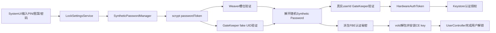
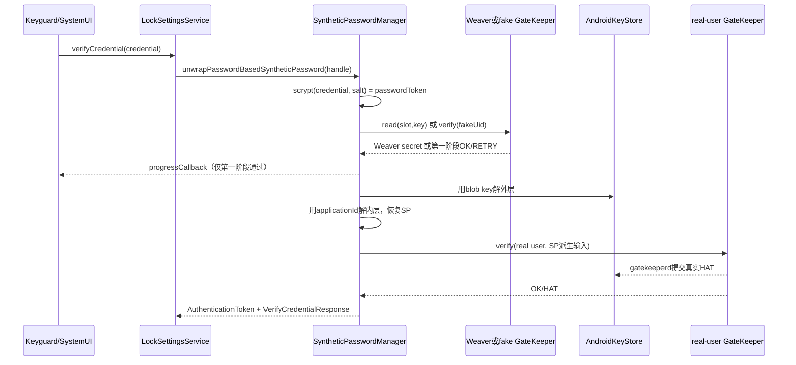
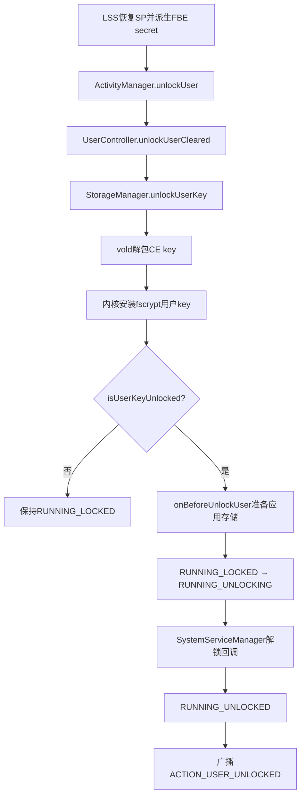

# 292 Android LockSettingsService、GateKeeper、Synthetic Password、Weaver、FBE用户解锁与凭据变更恢复链

## 1. 本章目标

本章从用户输入PIN、图案或密码开始，追踪`LockSettingsService`怎样借助GateKeeper或Weaver限速并验证凭据，恢复随机Synthetic Password（下文简称SP），生成真实用户HAT，再把SP派生的秘密交给Keystore、vold和用户生命周期系统。读完应能解释：为什么PIN不是`userdata`解密密钥，为什么普通改密码通常不让旧密钥失效，以及“凭据验证成功”和“用户数据已经可用”为何不是同一事件。

## 2. Android 11版本边界

本文依据本地`android-11.0.0_r48`。本版主链是`LockSettingsService + SyntheticPasswordManager + gatekeeperd + GateKeeper HIDL 1.0 + Weaver HIDL 1.0 + vold/fscrypt + 旧Keystore服务`；SP新建格式为v3，同时兼容旧v1/v2 blob。不要套用后来的GateKeeper/Weaver AIDL、Keystore2、KeyMint或新版LockSettings架构。

## 3. 先纠正最大的误解

用户设置的PIN、图案或密码不是直接拿去解密文件，也不会原样交给文件系统。它先经scrypt变成`passwordToken`，再通过GateKeeper或Weaver受限验证；验证成功后才能解开一个高熵随机SP，最后由SP派生FBE认证秘密、Keystore密码、GateKeeper输入等不同材料。

## 4. 五类秘密不要混名

`LockscreenCredential`是用户记得的低熵输入；`passwordToken`是带盐scrypt结果；SP是系统随机主秘密；SID是GateKeeper为安全用户维护的身份标识；HAT是一次成功认证产生的短期证明。FBE用户CE key又是vold随机生成并包装保存的文件系统密钥，不等于前面任何一个对象。

## 5. 本章源码地图

```text
frameworks/base/services/core/java/com/android/server/locksettings/
  LockSettingsService.java
  SyntheticPasswordManager.java
  SyntheticPasswordCrypto.java
  LockSettingsStorage.java
  LockSettingsStrongAuth.java
  RebootEscrowManager.java / RebootEscrowData.java
frameworks/base/services/core/java/com/android/server/am/UserController.java
frameworks/base/services/core/java/com/android/server/StorageManagerService.java
system/core/gatekeeperd/gatekeeperd.cpp
hardware/interfaces/gatekeeper/1.0/
hardware/interfaces/weaver/1.0/
system/vold/FsCrypt.cpp
```

## 6. 参与进程与可信边界

锁屏界面通常在SystemUI；`LockSettingsService`、`UserController`和`StorageManagerService`位于system_server；`gatekeeperd`是独立native Binder服务，并调用vendor GateKeeper HAL；Weaver实现通常位于更可信的硬件或安全环境；vold是native守护进程；Keystore及Keymaster承担密钥授权。Binder/HIDL穿越多个线程和进程，源码中的顺序不能简化成一个Java方法栈。

## 7. 一句话总链

用户凭据通过受限验证解开SP，SP再派生真实用户GateKeeper输入和存储认证秘密；真实用户GateKeeper验证生成HAT，vold利用存储秘密解包并安装随机CE key，最后`UserController`把用户从`RUNNING_LOCKED`推进到`RUNNING_UNLOCKED`。

## 8. 总体架构图



## 9. LockSettingsService是协调者

`LockSettingsService`不自己实现抗暴力破解算法，也不直接安装fscrypt key。它保存锁屏设置，选择旧凭据或SP路径，调用`SyntheticPasswordManager`完成包装/解包，调用GateKeeper，通知Keystore和vold，并协调StrongAuth、生物识别、工作资料与重启托管恢复。

## 10. SyntheticPasswordManager负责什么

`SyntheticPasswordManager`负责创建随机SP、从SP派生用途隔离的秘密、创建密码型或token型wrapper、管理Weaver槽、与fake/real GateKeeper身份交互，并保存`spblob`、`pwd`、`secdis`、`weaver`、`metrics`等状态。它是理解本章最重要的中心类。

## 11. LockSettingsStorage保存什么

锁屏布尔值、long值等设置进入SQLite键值表；SP相关二进制状态位于每用户`spblob`目录；旧凭据文件、子资料凭据和reboot escrow也有独立文件。数据库里的“当前SP handle”只是索引，真正解密还需要同一handle下的一组状态文件和AndroidKeyStore中的blob key。

## 12. gatekeeperd与GateKeeper HAL的分工

`gatekeeperd`发布`android.service.gatekeeper.IGateKeeperService`，检查`ACCESS_KEYGUARD_SECURE_STORAGE`后调用GateKeeper HIDL HAL。HAL执行密码handle验证、SID维护和可信限速；daemon还保存每UID的SID信息，并在验证成功时把HAL返回的HAT送入Keystore。

## 13. Weaver是什么

Weaver提供一组固定大小的安全槽，每槽保存“key匹配才返回value”的记录；错误读取必须被限速。它适合把低熵锁屏凭据变成受硬件节流的秘密释放条件，但设备不一定实现Weaver，槽数也有限，Framework必须支持非Weaver回退路径。

## 14. vold与fscrypt是什么关系

vold保存并管理每用户随机DE/CE key的包装形式，调用内核fscrypt安装或驱逐密钥。SP派生的`deriveDiskEncryptionKey()`是解开CE key包装所需的认证秘密之一，不是内核最终用来加密每个文件块的CE key本身。

## 15. UserController负责最后一公里

即使CE key已安装，系统仍需准备应用数据、通知系统服务、切换用户运行状态并发送`ACTION_USER_UNLOCKED`。这些属于`UserController`状态机；因此日志中“credential verified”“user key unlocked”“user unlocked”是三个层次的事件。

## 16. GateKeeper的enroll输入输出

HIDL接口语义是`enroll(uid, currentHandle, currentPassword, desiredPassword)`。初次设置时旧handle与旧密码为空；改密时可带旧材料。成功返回的opaque password handle含可信实现可验证的信息，Framework不应解析为明文密码或可逆密文。

## 17. GateKeeper的verify输入输出

`verify(uid, challenge, enrolledHandle, providedPassword)`可能返回成功、要求重新注册、带等待秒数的重试，或错误。成功响应可携带HAT；HAT绑定challenge、SID、认证类型和时间戳，供Keystore等可信消费者验证。

## 18. SID不是userId

Android的整数`userId`用于多用户隔离；SID是GateKeeper产生的64位安全身份。两者没有数值相等要求。密钥设置“绑定某SID”时，真正约束的是GateKeeper安全身份，不是Linux UID或Android userId字符串。

## 19. HAT不是长期口令

HAT是一次认证事实的带MAC结构，通常只能满足相应SID、认证类型、challenge或时间窗口。它不是用户密码副本，也不应被长期持久化为恢复凭据。Keystore/Keymaster验证HAT真实性后，才允许受认证约束的密钥操作。

## 20. gatekeeperd会把HAT送给Keystore

本版`gatekeeperd.cpp`在成功verify后查找`android.security.keystore`并调用`addAuthToken(payload)`。所以真实用户GateKeeper验证不仅把响应返回LSS，也在daemon侧刷新Keystore认证状态；不能把“LSS收到payload”误写成唯一入库动作。

## 21. GateKeeper限速的意义

PIN空间很小，若攻击者可离线高速尝试，scrypt仍可能不够。GateKeeper在可信环境内记录失败与等待期限，返回`RESPONSE_RETRY`及timeout。LSS据此要求`STRONG_AUTH_REQUIRED_AFTER_LOCKOUT`，UI只能等待，而不是在Framework里自行绕开重试。

## 22. REENROLL不是本次失败

成功响应可同时携带`shouldReEnroll`，表示旧handle格式或安全参数应升级。SP解包代码尝试用同一输入重新enroll并保存新handle；即使重注册失败，源码仍允许当前成功流程继续。不要把REENROLL理解为“密码错误，请重新输入”。

## 23. 两套GateKeeper身份

非Weaver路径会用`fakeUid(userId) = 100000 + userId`保护“锁屏凭据→SP wrapper”的第一阶段；恢复SP后又以真实`userId`验证SP派生的GateKeeper密码。前者提供低熵凭据限速和blob key短时授权，后者维护用户长期SID并产生真实HAT。

## 24. fake UID为什么存在

若直接让用户PIN对应的GateKeeper handle成为真实SID根，普通改PIN就可能改变真实SID并破坏所有SID绑定密钥。fake UID把可更换凭据wrapper隔离出去；真实用户GateKeeper密码由稳定SP派生，因此只要SP和真实SID不变，普通改密不会自然摧毁旧认证绑定。

## 25. fake UID的HAT不能替代真实HAT

fake UID验证也可能产生HAT并由gatekeeperd送入Keystore，但其SID来自fake handle，只能满足绑定该SID的SP blob key。随后`verifyChallenge()`使用真实用户handle和SP派生输入，生成绑定真实SID的HAT，才可满足用户其他认证密钥。

## 26. clearSecureUserId的破坏性

`gateKeeperClearSecureUserId(userId)`让GateKeeper清除真实用户SID状态；对应SID绑定的Keymaster密钥以后不再能由新身份授权。清除锁屏凭据时LSS会执行此动作并移除生物特征，语义比普通换PIN强得多。

## 27. 冷启动与GateKeeper持久状态

`gatekeeperd`在自己的数据目录维护SID文件，并协调HAL中的用户状态；代码还有清用户和清全部用户路径以处理重置/陈旧状态。分析恢复问题时要同时看Framework文件、daemon目录、HAL/RPMB状态，不能只检查`locksettings.db`。

## 28. GateKeeper失败的四种观察面

应用/UI可看到密码错误或等待；LSS看到`VerifyCredentialResponse`；gatekeeperd看到Binder/HIDL错误与HAL响应；HAL内部还可能因安全存储损坏拒绝handle。定位时先分清是输入不匹配、节流、服务死亡还是持久可信状态不一致。

## 29. 锁屏凭据先过scrypt

`PasswordData`为每个wrapper保存随机盐和scrypt指数。本版常量`N=11、R=3、P=1`并非直接参数值，调用时对应`2^11、2^3、2^1`；输出`passwordToken`为32字节。盐让不同wrapper对相同PIN产生不同结果。

## 30. scrypt不能独自解决低熵问题

scrypt提高单次猜测的CPU/内存成本，却不能把四位PIN变成真正高熵秘密。安全性还依赖GateKeeper/Weaver的可信限速、设备安全边界和用户选择的凭据强度；因此不能只看到哈希函数就宣称PIN可抵抗任意离线攻击。

## 31. PasswordData不是密码数据库

`PasswordData`保存凭据类型、scrypt参数、盐，以及非Weaver路径的opaque GateKeeper handle；Weaver路径令`passwordHandle=null`并另存槽索引。它足以指导验证，却不包含可直接还原的用户明文凭据。

## 32. wrapper handle只是文件组标识

`createPasswordBasedSyntheticPassword()`生成随机非零long handle。它用来关联`<handle>.pwd`、`<handle>.spblob`等文件，与GateKeeper返回的password handle不是一个东西。数据库当前SP handle指向活跃wrapper，命名相似最容易误读。

## 33. SP为何必须随机

如果直接从PIN派生所有系统密钥，改PIN会要求重加密大量状态，低熵也会扩散到所有用途。随机SP把“稳定高熵主秘密”和“可替换的用户入口”分离：改凭据只需重新包装同一SP，多类下游派生值保持不变。

## 34. SP创建的P0/P1结构

`AuthenticationToken.create()`生成两个随机32字节块P0、P1，用个性化派生组合得到SP；P0不明文保存，而是用SP加密成E0，P1可以作为escrow数据保存。只有在具备额外escrow secret并保留E0/P1时，才可从托管路径重建同一SP。

## 35. 新SP版本是v3

v3使用`SP800Derive(...).withContext(personalization, context)`产生不同用途秘密；旧版本使用个性化SHA-512。blob读取逻辑支持旧格式并可做存储升级，但注释明确：v2到v3改变了派生方式，不能仅改blob版本字节假装升级。

## 36. 用途隔离派生

同一SP可派生`deriveKeyStorePassword()`、`deriveGkPassword()`、`deriveDiskEncryptionKey()`、`deriveVendorAuthSecret()`、`derivePasswordHashFactor()`和`deriveMetricsKey()`。不同personalization/context使某一用途的输出不能直接当另一用途的密钥。

## 37. SP本身不是磁盘CE key

`deriveDiskEncryptionKey()`这个名字也容易误导：它返回给vold作为用户key包装认证秘密，vold再解包自己生成的CE key并交给fscrypt。源码分层意味着拿到SP派生值不等于可以跳过vold直接解释文件密文。

## 38. 每个SP wrapper有哪些文件

`spblob`始终存在；密码型wrapper有`pwd`；非Weaver密码型通常有`secdis`；Weaver型有`weaver`槽元数据；`metrics`保存加密的密码指标。token型wrapper又有不同组合。缺一文件可能导致第一阶段成功却无法还原SP。

## 39. spblob是双层AES-GCM

`SyntheticPasswordCrypto.createBlob()`先用`applicationId`经个性化哈希形成软件AES key，加密SP；再生成随机256位AES key导入AndroidKeyStore，以AES-GCM再次加密。解密顺序相反：先过Keystore key，再过applicationId层。

## 40. blob key为何只有解密用途

导入AndroidKeyStore时`KeyProtection`只声明`PURPOSE_DECRYPT`，并设置GCM、NoPadding和`criticalToDeviceEncryption`。Framework在导入前已持有临时随机key并完成加密，所以长期保存侧只需解密能力，缩小可用操作面。

## 41. SID绑定的15秒窗口

当非Weaver路径传入非零fake SID时，blob key设置`setUserAuthenticationRequired(true)`、绑定具体SID，并允许15秒认证有效期。源码注释说明GateKeeper验证与blob解密应紧接发生；窗口只为跨层操作留余量，不是通用的15秒屏幕解锁会话。

## 42. Weaver路径为何blob SID为0

Weaver已经在安全槽内完成低熵凭据限速并释放随机value，故密码型SP blob创建时使用`INVALID_SECURE_USER_ID`，不再绑定fake SID；applicationId由`passwordToken + Weaver secret`变换得到。之后仍需真实用户GateKeeper验证SP派生输入。

## 43. secdiscardable做什么

非Weaver路径创建16KiB随机`secdis`，其个性化哈希与`passwordToken`共同形成applicationId。销毁wrapper时覆盖并删除该文件，同时删除Keystore blob key；失去二者后，即使残留`spblob`也难以恢复原SP。

## 44. “安全删除”不是保证闪存物理清零

`deleteSyntheticPasswordState()`会尝试用零覆盖文件再删除，blob key也从Keystore删除。这是密码学不可恢复与best-effort覆盖设计；闪存磨损均衡、控制器缓存和文件系统行为使Framework无法承诺每个旧物理页都被原位抹掉。

## 45. LockSettingsStorage不是AtomicFile

`writeFile()`在锁内用`RandomAccessFile(name, "rws")`原地写入，再fsync父目录；空数据会`setLength(0)`。它没有“写临时文件后rename”的AtomicFile提交协议，而且多份SP文件和数据库handle也不是同一事务。掉电点仍需纳入故障分析。

## 46. 一个容易忽略的长度细节

非空写入分支直接从文件起点`write(hash)`，源码没有先显式`setLength(0)`；若新内容比旧内容短，理论上旧尾部可能保留。正常SP状态格式多由固定/受控长度替换，但审计时不应把该帮助函数描述成通用的安全原子覆盖器。

## 47. Weaver注册wrapper

可用Weaver时，SPM找未占用槽，把`passwordToken`个性化/裁剪为槽key，调用`weaverEnroll(slot, key, null)`生成或写入随机value，保存槽号，并以该value和token构造applicationId。槽耗尽会直接抛`IllegalStateException`。

## 48. 非Weaver注册wrapper

无Weaver时先清理fake UID旧SID，随后以`passwordTokenToGkInput(pwdToken)`向GateKeeper enroll fake UID，保存opaque handle和其中SID；另建`secdis`，将token与其变换为applicationId，再创建绑定fake SID的双层SP blob。

## 49. 创建顺序意味着什么

新wrapper会依次占Weaver/GateKeeper状态、写元数据/metrics、写spblob。任一步异常都可能留下尚未成为当前handle的孤立材料；后续清理很重要。源码的有序创建降低替换风险，但不等于跨HAL、Keystore、文件与SQLite的ACID事务。

## 50. 输入凭据后的完整解包时序



## 51. 第一步先检查凭据类型

`credential.checkAgainstStoredType(pwd.credentialType)`不匹配会立即返回错误，例如把图案对象拿去验证PIN wrapper。类型检查不是密码正确性证明，只是防止使用错误的编码/转换方式继续计算。

## 52. Weaver解包第一阶段

读到有效槽号后，SPM用passwordToken派生Weaver key并读取槽。正确时得到Weaver secret，错误或节流则直接返回相应响应；只有成功值与token共同恢复applicationId。Weaver服务缺失时不会悄悄切到GateKeeper，因为现有wrapper已依赖那个槽。

## 53. GateKeeper解包第一阶段

没有槽号时，SPM使用保存的fake UID password handle验证派生输入。成功可顺便reenroll并更新`pwd`；重试立即返回timeout；错误立即返回。之后从handle取fake SID，并用token与`secdis`恢复applicationId。

## 54. progressCallback并非最终成功

源码在第一阶段Weaver/GateKeeper通过后就调用`progressCallback.onCredentialVerified()`，接下来才解SP blob并验证真实用户GateKeeper。UI可据此更快推进动画，但如果blob key、`secdis`或真实handle损坏，最终认证仍可能失败。

## 55. 解开spblob可能失败

外层需要AndroidKeyStore中的别名key及满足其fake SID授权，内层需要正确applicationId，GCM标签还验证完整性。任何材料不匹配都会导致解密失败或返回空token；“用户PIN正确”不能修复已损坏的系统包装状态。

## 56. 真实用户verifyChallenge

恢复`AuthenticationToken`后，`verifyChallenge(gatekeeper, authToken, 0, userId)`用`auth.deriveGkPassword()`验证真实用户password handle。用户有锁屏时得到OK/HAT；无真实SID的未设防用户可返回null响应，但仍可能拥有可用SP。

## 57. 为什么真实GateKeeper输入可稳定

真实GateKeeper密码由随机SP派生，而普通改PIN只创建新wrapper，不改变SP。所以真实handle/SID可继续验证同一派生输入，避免所有依赖真实SID的密钥随每次改PIN失效。

## 58. AuthenticationResult的两个字段

`authToken`非空表示SP已恢复；`gkResponse`表示真实/第一阶段GateKeeper结果。源码注释允许无锁屏用户出现“token非空、response为null”。调用者必须按状态语义判断，不能只写`response == OK`一条通用规则。

## 59. 错误凭据不会进入FBE解锁

`doVerifyCredential()`只有在最终响应OK时调用`onCredentialVerified()`；RETRY还会触发StrongAuth lockout要求。也就是说，仅收到progress callback或某次fake UID验证日志，并不代表vold已得到SP派生秘密。

## 60. onCredentialVerified的动作顺序

它更新密码指标，先以`deriveKeyStorePassword()`解锁旧式Keystore用户状态，再临时生成`deriveDiskEncryptionKey()`调用用户解锁，随后清零该byte数组；之后激活待处理escrow token、处理独立工作资料、报告强认证成功，并通知AuthSecret/RebootEscrow。

## 61. FBE先分DE与CE

Device Encrypted（DE）数据在用户尚未输入凭据的Locked Boot阶段即可用；Credential Encrypted（CE）数据要等用户CE key安装。Direct Boot aware组件可用device-protected storage，普通credential-protected应用数据要等`ACTION_USER_UNLOCKED`之后。

## 62. 每用户CE key是随机生成的

vold为用户创建随机CE key并以KeyStorage机制包装落盘。锁屏凭据变化时通常只需改变这个随机key的保护方式，不需要逐文件重加密；内核fscrypt policy仍引用相应用户key标识。

## 63. vold收到的token与secret

旧凭据迁移路径可能传GateKeeper response payload作为`token`，并由旧凭据派生`secret`；SP正常成功路径调用`unlockUser(userId, null, deriveDiskEncryptionKey())`，token为空。不能假定每个Android 11解锁都同时向vold传HAT和PIN派生值。

## 64. addUserKeyAuth是重新包装

`fscrypt_add_user_key_auth`以空认证读取当前CE key包装，再用新token/secret写入新的保护路径，主要用于“原来无凭据、现在新设凭据”的转换。它改变的是“如何取出CE key”，不是生成一个新CE key并重加密所有现存文件。

## 65. clearUserKeyAuth的语义

清除锁屏时，vold用当前认证秘密解包CE key，再创建无需锁屏秘密的包装，使系统以后能以空secret解锁用户。数据仍可能受设备级硬件/系统保护，但不再等待该用户PIN。

## 66. fixateNewestUserKeyAuth做什么

认证保护转换过程中vold可短暂保留新旧两份CE key包装以降低中途失败风险；`fixateNewestUserKeyAuth()`删除除最新路径外的其他包装。`StorageManagerService`会吞下vold异常并写`wtf`日志，LSS也容忍Binder失败；故失败时可能暂留多份包装直到后续启动清理，不能描述成每次都同步彻底删除。

## 67. unlockUserKey安装内核密钥

`fscrypt_unlock_user_key`解析token/secret，读取并解包用户CE key，再把key加入内核fscrypt/keyring。若已解锁，源码会告警但返回成功。安装key只是让文件系统能访问CE目录，还没完成应用和广播阶段。

## 68. lockUserKey驱逐内核密钥

锁定/停止用户时，native FBE路径尝试从内核驱逐CE key，使后续CE文件访问失败；模拟加密环境可能退化为权限控制。因缓存页、打开文件描述符和内核支持差异，分析“锁定后何时完全不可读”要结合具体实现和内核行为。

## 69. StorageManagerService是Java桥

`StorageManagerService.unlockUserKey()`检查调用权限、序列号与加密状态，然后调用vold。成功后维护本地已解锁用户集合；Remote/Runtime异常在`UserController`调用侧会被记录，后续还会以`StorageManager.isUserKeyUnlocked()`再次确认。

## 70. 从凭据到ACTION_USER_UNLOCKED



## 71. 用户没启动也可先尝试解存储

`unlockUserCleared()`先尝试`storageManager.unlockUserKey()`，之后才从`mStartedUsers`取`UserState`。若用户并未运行，它通知listener完成并返回false；这说明“CE key尝试”和“运行中用户状态推进”在源码中明确分离。

## 72. StorageManager异常没有直接抛回UI

`UserController`捕获`RemoteException | RuntimeException`并记录`Failed to unlock`，随后`finishUserUnlocking()`通过`isUserKeyUnlocked()`决定是否继续。因此最终状态检查比单看Binder调用是否返回更可靠。

## 73. RUNNING_LOCKED到UNLOCKING

只有用户仍是当前有效`UserState`且CE key确实已解锁，才启动进度并异步调用`UserManager.onBeforeUnlockUser()`准备数据；然后原子检查状态从`RUNNING_LOCKED`切到`RUNNING_UNLOCKING`，向系统服务分发unlock阶段。

## 74. RUNNING_UNLOCKING到UNLOCKED

系统服务阶段完成后`finishUserUnlocked()`再次确认CE key和UserState，把状态切为`RUNNING_UNLOCKED`，完成进度，启动Direct Boot unaware持久应用/Provider，并发送`ACTION_USER_UNLOCKED`。工作资料还会向父用户发送专门广播。

## 75. BOOT_COMPLETED与USER_UNLOCKED不是同一广播

Locked Boot可以先发送`LOCKED_BOOT_COMPLETED`；CE就绪后发送`USER_UNLOCKED`；若系统指纹变化，还要先跑PRE_BOOT receiver，最后才走完整BOOT_COMPLETED阶段。应用应选择正确存储区域和广播，而不是把开机完成等同于用户已解锁。

## 76. LSS的15秒等待不是事务超时

LSS调用`ActivityManager.unlockUser()`后用latch最多等待15秒，但没有根据`await()`返回值判定并回滚。超时只表示同步等待窗口结束，异步用户解锁可能仍在继续；日志不能把它解读成“15秒后系统强制取消”。

## 77. 解锁后会尝试工作资料

父用户完成解锁后，`UserController`遍历运行中的profile并`maybeUnlockUser()`；LSS也处理统一challenge资料。但每个profile有独立userId、CE key和生命周期，父用户解锁不意味着所有工作资料必然同时可用。

## 78. tokenProvided影响资料语义

`UserState.tokenProvided`记录ActivityManager解锁请求是否携带token，管理资料完成阶段据此决定某些通知是否quiet。SP主路径传给ActivityManager的token为空，因此不要用这个字段判断用户是否曾经过GateKeeper；它只是该次存储解锁调用参数状态。

## 79. 普通改密码的核心是不换SP

`setLockCredentialWithAuthTokenLocked()`注释明确：创建新的SP blob并更新handle，但底层SP永不改变。流程先用旧凭据恢复auth token，再创建由新凭据保护的新wrapper，更新当前handle，最后销毁旧wrapper。

## 80. 新wrapper先建、旧wrapper后删

`spBasedSetLockCredentialInternalLocked()`先调用`setLockCredentialWithAuthTokenLocked()`；该方法内部创建新wrapper并切换当前handle。方法返回后，外层才`destroyPasswordBasedSyntheticPassword(oldHandle)`。这降低“旧入口先删而新入口尚未成形”的风险，但中途崩溃仍可能留下新旧孤立状态。

## 81. 当前handle怎样切换

`setSyntheticPasswordHandleLocked()`先写新的`sp-handle`，再把旧值写入`prev-sp-handle`并记录时间。三次设置与状态文件/HAL操作不是一个原子事务。尤其要注意：本版`prev-sp-handle`仅在dump中展示，源码没有用它做自动回滚解包。

## 82. 为什么普通改密保持真实SID

已有安全凭据且`hasSidForUser(userId)`为真时，新wrapper创建已经处理其fake GateKeeper/Weaver入口；LSS只重新`verifyChallenge()`刷新真实HAT，不创建真实SID。SP派生真实GateKeeper密码不变，所以SID也保持。

## 83. 对认证绑定Keystore密钥的影响

普通PIN→新PIN且真实SID不变时，绑定该SID的密钥通常继续可用；用户仍需按新凭据恢复SP并产生新HAT。若应用密钥还绑定生物识别注册状态、授权类型或其他策略，是否可用还要结合Keymaster参数，不能只看SID。

## 84. 第一次设置凭据时会新建SID

原来无凭据的SP用户没有真实SID。第一次设置非空凭据时，LSS调用`newSidForUser()`，再验证SP派生密码、为vold添加认证保护、固定最新包装，并设置Keystore密码。这个转换比普通改PIN多了真实安全身份建立。

## 85. 清除凭据时SP仍保留

源码不删除随机SP，而用“无凭据/默认入口”的wrapper继续保护它；同时清真实SID、清vold认证保护、清旧Keystore密码并移除生物特征。以后重新设置凭据可以继续围绕同一SP建立入口，但新的真实SID不同。

## 86. 清凭据为何移除生物特征

生物模板/HAT依赖用户安全身份和主凭据恢复能力。清掉真实SID后保留原模板会造成身份语义错位，因此LSS异步请求FingerprintManager/FaceManager移除全部注册。移除有最长等待与错误日志，硬件异常时应继续核查实际模板状态。

## 87. 凭据变化不是全盘重加密

同一SP意味着FBE派生秘密、Keystore派生密码和真实GateKeeper输入保持；已有安全凭据之间的普通改密无需改vold包装。只有无凭据→有凭据时添加认证保护，有凭据→无凭据时清除保护；文件的fscrypt CE key始终不因这些操作重建，所以成本不会随用户文件数量线性增长。

## 88. 故障恢复要看四套状态

至少检查`locksettings.db`当前handle、`spblob`目录文件组、AndroidKeyStore blob alias、GateKeeper/Weaver和vold CE包装。仅恢复其中一份备份可能产生handle存在但key缺失、槽被复用、SID不符或CE key包装无法打开等不可恢复组合。

## 89. 不能把SP文件复制到另一设备

外层blob key位于本机AndroidKeyStore并可能绑定硬件SID，Weaver slot/GateKeeper状态和vold包装也属于本机可信状态。复制`spblob`目录不是跨设备迁移方案；Android备份不会把本地硬件绑定密钥连同所有可信根一起导出。

## 90. 统一工作资料凭据并非复用父PIN

统一challenge模式为子profile生成随机管理密码，把它加密保存并用父用户认证约束的AndroidKeyStore key保护。父凭据验证后系统解开这个随机子密码，再独立验证/解锁profile；父PIN不会作为子profile明文凭据直接写入。

## 91. 独立challenge资料

若工作资料启用separate challenge，它有自己的用户凭据验证、真实SID、SP wrapper和CE key解锁流程。父用户进入桌面不代表资料CE数据已解锁，策略还可让资料保持quiet/locked。

## 92. verifyTiedProfileChallenge的双验证

该路径先验证父用户challenge，成功后解密`child-profile`随机凭据，再以同一challenge验证子profile。这让最终HAT/锁定重置仍对应正确profile安全身份，不是只凭父用户一次OK就绕过子用户GateKeeper。

## 93. Escrow token是什么

token型SP wrapper允许受授权的设备管理/恢复流程用高熵外部token恢复同一SP。token先以pending状态驻内存，只有用户成功认证、系统已知auth token后才激活并持久化wrapper，避免未获主凭据确认就建立永久后门。

## 94. 禁用escrow的密码学含义

SP初建时E0/P1支持托管重建；若系统销毁escrow数据，token路径缺少必要split，即使API记录仍在也无法重建SP。这里的“不可托管”应以秘密材料是否存在判断，而不是只看一个设置开关。

## 95. Weaver下的escrow token

token型wrapper若有Weaver，会把随机Weaver secret写入一个用空key可读的受保护槽，并用该secret加密磁盘上的secdiscardable；外部token与解出的secdiscardable再形成applicationId。它不是用用户PIN作为槽key，和密码型Weaver wrapper不要混为一谈。

## 96. FRP验证是另一条目的不同的链

设备未provision完成时，SPM可把密码元数据同步到PersistentDataBlock：非Weaver型保存GateKeeper相关`PasswordData`，Weaver型保存槽号和元数据。`USER_FRP`验证用于恢复出厂后的所有权保护，不会因此解开旧用户CE数据。

## 97. FRP为什么不能当数据恢复

FRP证明“允许继续激活这台设备”，而用户数据恢复需要旧SP、AndroidKeyStore blob key、GateKeeper/Weaver状态和vold包装。工厂重置按设计销毁用户数据密钥，FRP凭据即使相同也不提供旧文件解密入口。

## 98. Reboot Escrow解决什么

无人值守OTA需要重启后在用户未再次输入凭据前恢复CE数据，以完成更新。`RebootEscrowManager`在显式prepare/arm流程中临时托管SP；它不是普通每次重启都会启用的自动解锁，也不是面向应用的云备份。

## 99. Reboot Escrow怎样加密

管理器生成32字节随机escrow key，用AES-GCM把每用户SP和版本写入reboot escrow文件；arm时才把escrow key交给`IRebootEscrow` HAL。磁盘blob与HAL中的key分离，任一缺失都不能恢复。

## 100. 重启后key只取一次

恢复时HAL `retrieveKey()`返回32字节非零key，Framework随后立即`storeKey(new byte[32])`覆盖HAL中的旧key；各用户blob读出后也被删除。失败、HAL缺失或key缺失会清理escrow存储并上报结果，不能把它当长期可重复恢复凭据。

## 101. prepare、ready与arm不同

`prepareRebootEscrow()`只是清旧状态并标记wanted；之后用户认证使`callToRebootEscrowIfNeeded()`写各用户加密SP并进入ready；`armRebootEscrowIfNeeded()`才把待用key存入HAL并记boot count。只调用prepare并不保证下一次启动可恢复。

## 102. Reboot Escrow的安全取舍

该机制故意在受控更新窗口建立临时旁路，所以依赖系统权限、HAL保护、一次性清除和StrongAuth策略。恢复启动后系统仍可要求主凭据以重新允许生物识别/信任；“CE已为更新解锁”不等于所有锁屏信任条件都被永久满足。

## 103. AuthSecret HAL是另一消费者

`onAuthTokenKnownForUser()`还会把主用户SP派生的`deriveVendorAuthSecret()`交给AuthSecret HAL，供厂商硬件做设备特定认证。GSI运行时源码会跳过AuthSecret与RebootEscrow调用。这个秘密不是通用应用API，也不应和FBE secret互换。

## 104. StrongAuth不负责解密文件

`LockSettingsStrongAuth`记录“开机后、DPM锁定、锁定失败、超时、用户lockdown、无人值守更新、非强生物识别超时”等原因，决定生物识别/Trust是否可代替主凭据。它是锁屏认证政策状态，不是CE key或GateKeeper SID本身。

## 105. 凭据成功怎样改变StrongAuth

`onCredentialVerified()`最后调用`reportSuccessfulStrongAuthUnlock()`，它重排主认证超时、取消非强生物识别计时并重新允许非强生物识别；强认证原因位的清除还通过锁屏解开后的`userPresent()`→`reportUnlock()`等路径完成，不能只凭这个方法名推断已经清零。本版非强生物识别总时限默认24小时、空闲时限4小时；即使Class 3生物识别能生成HAT，开机后或lockdown等原因仍可强制输入主凭据。

## 106. 生物识别与本章链的连接点

生物识别成功可产生绑定真实SID的HAT，使已解锁系统中的认证约束密钥操作继续；但冷启动时CE key尚未由SP路径安装，且StrongAuth常要求主凭据。因此“指纹能解某把Keystore key”和“指纹能独立完成首次FBE解锁”是不同问题。

## 107. 常见误解一：PIN就是userdata key

错误。PIN经scrypt并由Weaver/GateKeeper限速，只是恢复SP wrapper的入口；SP派生认证秘密；vold再解包随机CE key；fscrypt最后用CE key访问文件。把这四层合并会错误推导出“改PIN必须重加密全部userdata”。

## 108. 常见误解二：有Weaver就不需要GateKeeper

错误。Weaver可替代fake UID GateKeeper的第一阶段低熵wrapper保护；恢复SP后仍调用真实用户GateKeeper验证SP派生输入，刷新真实SID对应HAT。两者解决的阶段不同。

## 109. 常见误解三：验证成功回调等于数据可用

错误。progress callback可能早于spblob解密；最终凭据OK之后还要vold解包/安装CE key、准备应用数据、推进UserState并广播`USER_UNLOCKED`。排障必须寻找每一阶段的独立证据。

## 110. 常见误解四：普通改密会让所有认证密钥失效

通常错误。普通改密保持SP和真实SID，因而真实SID绑定密钥通常继续可用；清除凭据再重设会重建SID，才会破坏旧SID授权。密钥是否还受生物注册、认证类型等额外条件影响，需要逐把查看KeyInfo/Keymaster参数。

## 111. 建议的源码阅读顺序

先读LSS的`doVerifyCredential()`与`onCredentialVerified()`，再读SPM的create/unwrap、`AuthenticationToken`派生和`SyntheticPasswordCrypto`；随后读gatekeeperd、Weaver接口、`FsCrypt.cpp`，最后读`UserController.unlockUserCleared()`状态机。每一步都写下“输入秘密、输出证明、持久状态、失败结果”。

## 112. macOS只读练习一：画出SP派生树

在源码根目录执行：

```bash
rg -n "derive(KeyStorePassword|GkPassword|DiskEncryptionKey|VendorAuthSecret|PasswordHashFactor|MetricsKey)" \
  frameworks/base/services/core/java/com/android/server/locksettings/SyntheticPasswordManager.java
```

手动画SP到六个派生值的树，并标出哪些进入GateKeeper、vold、Keystore、vendor HAL；不要编译或修改源码。

## 113. macOS只读练习二：对比Weaver与fake UID

```bash
sed -n '710,845p' \
  frameworks/base/services/core/java/com/android/server/locksettings/SyntheticPasswordManager.java
sed -n '980,1070p' \
  frameworks/base/services/core/java/com/android/server/locksettings/SyntheticPasswordManager.java
```

分别列出注册与解包时的槽号、password handle、SID、secdiscardable、applicationId，回答：为什么Weaver分支的blob SID为0？

## 114. macOS只读练习三：验证用户解锁的三阶段

```bash
rg -n "unlockUserCleared|finishUserUnlocking|finishUserUnlocked" \
  frameworks/base/services/core/java/com/android/server/am/UserController.java
rg -n "fscrypt_unlock_user_key|read_and_install_user_ce_key" system/vold/FsCrypt.cpp
```

按“vold安装CE key→RUNNING_UNLOCKING→RUNNING_UNLOCKED/广播”写三行证据，并解释为何第一步成功不等于第三步完成。

## 115. macOS只读练习四：审计凭据变更故障窗口

```bash
rg -n "setLockCredentialWithAuthTokenLocked|setSyntheticPasswordHandleLocked|destroyPasswordBased" \
  frameworks/base/services/core/java/com/android/server/locksettings/{LockSettingsService,SyntheticPasswordManager}.java
sed -n '360,420p' \
  frameworks/base/services/core/java/com/android/server/locksettings/LockSettingsStorage.java
```

记录新wrapper创建、当前handle切换、旧wrapper删除的顺序，再指出为何`prev-sp-handle`和`rws`写入不能证明跨文件自动回滚。

## 116. 自测一：口述正确主链

不看文档，用一分钟说清：用户PIN→scrypt token→Weaver/fake GateKeeper→applicationId→双层spblob→随机SP→真实GateKeeper/HAT→FBE secret→vold CE key→UserController。若把PIN、SP、FBE secret或CE key说成同一个值，回读第3、36、37、62节。

## 117. 自测二：解释三种凭据变化

回答普通改PIN、第一次从无锁设PIN、清除PIN三种情况中，SP、真实SID、vold保护、生物模板分别如何变化。关键答案是：SP保持；普通改密保持SID；初设新建SID；清除销毁SID并移除生物特征。

## 118. 自测三：从症状定位层级

“PIN提示等待”优先查GateKeeper/Weaver节流；“PIN动画通过但最终失败”查spblob/key/SID；“credential OK但应用数据打不开”查vold/fscrypt；“CE已开但应用没收到解锁”查UserController状态机。能做这四分法，说明已掌握本章。

## 119. 复读修订与准确性边界

本章完成后已按r48源码复读：修正了“`prev-sp-handle`可自动回滚”的错误推断，它在本版只被设置并用于dump；明确`LockSettingsStorage.writeFile()`是`RandomAccessFile("rws")`原地写而非AtomicFile；明确SP路径给ActivityManager的token为空、FBE secret来自SP；明确Weaver只替代第一阶段fake GateKeeper；明确progress callback早于最终blob/真实SID验证；并把Reboot Escrow限定为显式无人值守更新窗口。厂商HAL内部、RPMB实现和内核fscrypt细节不在AOSP通用代码中，需结合具体设备验证。

## 120. 本章小结与下一章

锁屏安全的核心不是“用PIN加密磁盘”，而是让低熵凭据经过可信限速后恢复稳定高熵SP，再把SP以用途隔离方式连接到真实SID/HAT、Keystore和随机FBE key；凭据入口可以替换，真正的用户秘密与文件密钥保持稳定。下一章进入`RecoverableKeyStore、KeyChainSnapshot、RecoveryAgent、密钥同步与端到端恢复边界链`，分析本地硬件绑定之外，受管应用密钥怎样被设计为可恢复而又不把明文交给服务器。
