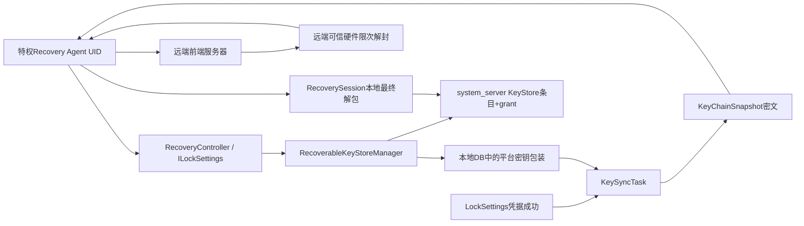
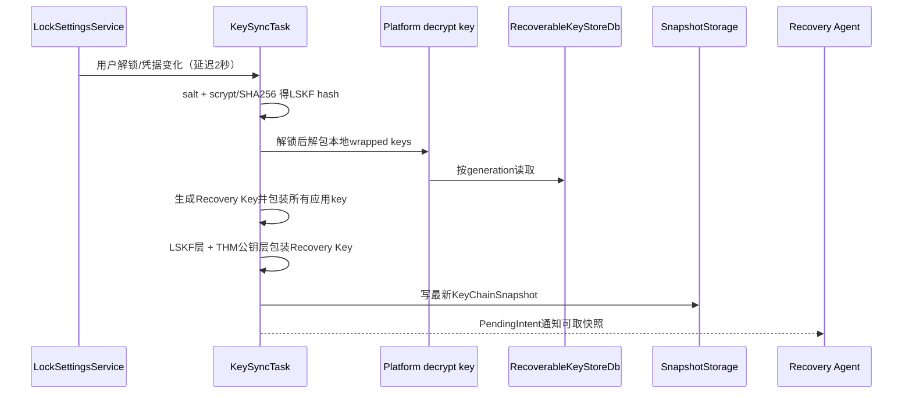
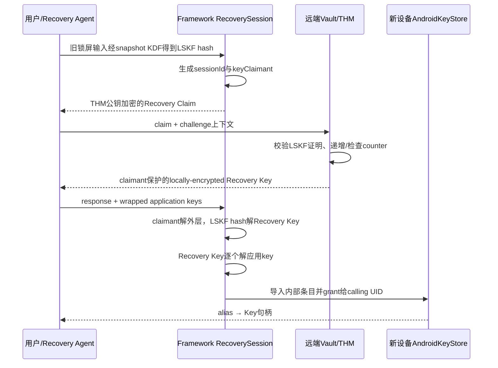

# 293 Android RecoverableKeyStore、KeyChainSnapshot、RecoveryAgent密钥同步与端到端恢复边界链

## 1. 本章目标

本章追踪特权系统应用怎样创建可恢复AES密钥、本机怎样包装保存、用户解锁后怎样生成`KeyChainSnapshot`、Recovery Agent怎样上传密文，以及新设备怎样借助旧锁屏秘密和远端可信硬件恢复同一应用密钥。

## 2. Android 11版本边界

本文依据`android-11.0.0_r48`的隐藏`@SystemApi` RecoverableKeyStore实现。它经`ILockSettings`进入system_server，使用旧AndroidKeyStore与`SecureBox`；不是Android Credential Manager、端到端消息备份，也不能套用后来KeyMint/Keystore2实现。

## 3. 它解决什么问题

普通硬件绑定AndroidKeyStore密钥原则上不可导出，设备丢失后也无法搬走。RecoverableKeyStore为少数特权服务提供另一种密钥类型：原始AES材料可在系统内部被多层包装，从而在另一设备恢复，但调用应用仍只拿KeyStore句柄。

## 4. 它不恢复所有Keystore密钥

只有通过`RecoveryController.generateKey/importKey`纳入可恢复链的256位AES密钥才参与快照。应用自己用`KeyGenParameterSpec`创建的RSA、EC、HMAC或不可导出AES密钥不会自动出现在`KeyChainSnapshot`。

## 5. 权限边界

`android.permission.RECOVER_KEYSTORE`是`signature|privileged`，公开注释也明确不供第三方应用使用。服务端每个入口再次`enforceCallingOrSelfPermission()`，并以Binder calling UID/UserId划分恢复代理和密钥命名空间。

## 6. 核心源码地图

```text
frameworks/base/core/java/android/security/keystore/recovery/
  RecoveryController.java  RecoverySession.java
  KeyChainSnapshot.java  KeyChainProtectionParams.java
frameworks/base/services/core/java/com/android/server/locksettings/recoverablekeystore/
  RecoverableKeyStoreManager.java  RecoverableKeyGenerator.java
  PlatformKeyManager.java  WrappedKey.java  KeySyncTask.java
  KeySyncUtils.java  SecureBox.java
  storage/{RecoverableKeyStoreDb,ApplicationKeyStorage,
           RecoverySnapshotStorage,RecoverySessionStorage}.java
```

## 7. 四个参与者

特权Recovery Agent调用System API并与自己的服务器通信；LockSettingsService/RecoverableKeyStoreManager保存本地状态；远端普通前端服务器保存和转发快照；远端Trusted Hardware Module（THM）持有认证公钥对应私钥并实施最多尝试次数。

## 8. 总体架构



## 9. RecoveryController只是客户端门面

`RecoveryController.getInstance()`取得`lock_settings` Binder，并把服务端返回的grant alias加载成Java `Key`。证书解析、数据库、包装、快照和恢复会话的核心逻辑都在system_server。

## 10. Recovery Agent按UID隔离

数据库键包含userId、recoveryAgentUid、alias；快照文件也按agent UID命名。一个拥有权限的代理只能通过自己的calling UID获取自己的快照和密钥，不能在API参数中随意指定另一个代理UID。

## 11. generateKey生成什么

`RecoverableKeyGenerator`用普通JCA `KeyGenerator`生成256位AES，因为必须短暂取得raw material才能包装；它不能直接让AndroidKeyStore生成不可导出key。最终应用用途限定为AES/GCM/NoPadding的加解密。

## 12. importKey的约束

导入只接受32字节AES材料，否则返回`ERROR_INVALID_KEY_FORMAT`。这条API意味着调用方本来就知道导入key的raw bytes；与`generateKey()`“原始材料不暴露给调用应用”的安全语义不同。

## 13. alias的三层名字

应用看到逻辑alias；system_server内部KeyStore条目名包含`userId/uid/alias`；旧Keystore `grant()`又返回调用UID可用的grant alias。不要把数据库alias当成可直接传给所有JCA API的真实KeyStore名字。

## 14. 生成后为何有两份形态

同一应用key一份以平台密钥包装后放RecoverableKeyStoreDb，供以后快照；另一份导入system_server的AndroidKeyStore，再grant给原调用UID供业务加解密。数据库密文不是日常业务Cipher直接使用的对象。

## 15. ApplicationKeyStorage的授权

它把raw AES导入内部命名空间，声明encrypt/decrypt、GCM、NoPadding，再调用旧Keystore `grant(internalAlias, uid)`。应用拿到的是可操作句柄，不能借grant导出secret material。

## 16. metadata是什么

可选metadata在云端包装时作为认证header的一部分，未加密但受到AEAD完整性保护；恢复时必须提供相同metadata才能过tag。它适合绑定版本/上下文，不适合存明文隐私秘密。

## 17. removeKey的效果

删除会移除数据库wrapped key、标记应重建快照，并删除本地AndroidKeyStore业务条目。远端旧快照不会被Framework直接召回，Recovery Agent仍需上传新版本并在服务器执行自己的旧版本淘汰策略。

## 18. recovery status不是密码学证明

`SYNC_IN_PROGRESS/SYNCED/PERMANENT_FAILURE`由代理通过API维护，用于观察同步状态。标记SYNCED不证明服务器确实持久化、THM可恢复或密文未损坏，仍需端到端恢复演练。

## 19. 平台密钥的角色

应用key在本机数据库中先由每用户Platform Key以AES-GCM包装。这样磁盘数据库泄露者拿不到raw keys；用户成功解锁后，受认证约束的decrypt entry才允许KeySyncTask临时解开它们。

## 20. 同一平台key为何导入两次

同一随机AES材料以`.../encrypt`和`.../decrypt`两个alias导入：encrypt entry可随时包装新业务key；decrypt entry受设备解锁/用户认证限制。用途分离避免后台任意时刻从数据库批量取出raw keys。

## 21. 主用户的真实r48约束

源码注释笼统说decrypt key在解锁后15秒可用，但`generateAndLoadKey()`对system user实际设置`unlockedDeviceRequired(true)`，没有15秒HAT期限。分析必须以代码分支为准，而不是只读类注释。

## 22. 次用户/资料的约束

非system user设置`userAuthenticationRequired`和15秒有效期，并绑定其GateKeeper SID；还设置`criticalToDeviceEncryption`。若该用户没有有效SID，源码记录错误并直接返回，平台key可能未完整建立。

## 23. generation ID

数据库记录平台密钥代数，wrapped application key也记录包装代数。解包时发现代数不一致会抛`BadPlatformKeyException`，避免拿新key静默尝试旧密文并把损坏误判为普通alias缺失。

## 24. 平台key失效的后果

关闭再重设锁屏、SID变化、KeyStore条目丢失或永久失效会触发重新生成；旧代包装的应用key可能被标成永久失败。尚未成功上传远端快照时，本地平台key丢失可让那些raw keys不可恢复。

## 25. 本地wrapped key格式

`WrappedKey.fromSecretKey()`用平台encrypt key执行AES/GCM wrap，保存nonce、密文、metadata、generation和初始同步状态。GCM同时提供保密性与篡改检测，nonce必须与对应密文一起保存。

## 26. 为什么不能包装普通AndroidKeyStoreKey

`fromSecretKey()`要求`key.getEncoded()`非null。硬件不可导出AndroidKeyStore key通常返回null，因此明确抛`InvalidKeyException`；RecoverableKeyStore的可迁移性来自其专门生成方式，不是绕过硬件不可导出保证。

## 27. 解锁触发同步

LSS成功处理锁屏凭据后调用`lockScreenSecretAvailable()`；凭据设置/变更调用`lockScreenSecretChanged()`。FRP和统一challenge子资料有专门跳过/父凭据转发规则，避免把随机子资料密码当用户应记得的恢复秘密。

## 28. 明文凭据在内存中的边界

LSS把`LockscreenCredential.getCredential()`字节交给manager，后者延迟任务使用它计算恢复KDF。此链发生在system_server内存，不会把明文写入snapshot；但源码注释和内存生命周期提示审计者仍要关注数组清零与崩溃转储边界。

## 29. 为什么延迟两秒

`SYNC_DELAY_MILLIS=2000`，同步被调度到单独执行器以免阻塞解锁关键路径。频繁解锁产生的任务还通过` synchronized(KeySyncTask.class)`串行化，但不是持久Job；进程死亡后要靠下一次触发恢复机会。

## 30. 哪些情况不生成快照

无锁屏、定制的未知凭据类型、主用户仍锁定、未注册agent、没有THM公钥/serverParams、secret types不含LOCKSCREEN，或没有pending变更时，任务都会返回或跳过。

## 31. 仅支持锁屏秘密

API结构为未来多层secret预留List，但r48 `startRecoverySession()`硬性要求`secrets.size()==1`，KeySyncTask也只识别`TYPE_LOCKSCREEN`。不要把接口的List误写成已经支持多因素组合恢复。

## 32. PIN/密码的KDF

KeySyncTask为PIN和密码生成16字节salt，使用scrypt：N=4096、r=8、p=1、输出32字节。参数随snapshot保存，恢复端才能对用户输入的旧凭据重复同一派生。

## 33. 图案的KDF

图案在本版走带长度前缀的`salt + credential` SHA-256，而非scrypt。长度以前缀、小端编码加入，避免简单拼接歧义；安全强度仍受3×3图案空间和远端限次机制制约。

## 34. snapshot不含派生secret

创建`KeyChainProtectionParams`时写UI格式、salt/KDF参数，但`setSecret(new byte[0])`。远端快照携带如何提示和派生的信息，不携带本机算出的LSKF hash本身。

## 35. UI格式只是提示元数据

`UI_FORMAT_PATTERN/PIN/PASSWORD`帮助恢复端显示相符输入界面；它不是凭据验证器。真正对错由派生结果能否通过THM协议和本地AEAD tag决定。

## 36. Recovery Key

每次新snapshot生成随机256位AES Recovery Key。所有application keys先分别用这把key包装；随后只需复杂保护这一把Recovery Key，而不是为每个应用key单独执行远端非对称协议。

## 37. 应用key云端包装

`encryptKeysWithRecoveryKey()`以Recovery Key raw bytes作为SecureBox shared secret，按alias输出密文；metadata若存在会拼入认证header。因此任一key密文损坏可以单独失败，不必让全部条目都不可解。

## 38. Recovery Key的本地层

`locallyEncryptRecoveryKey()`先以LSKF hash作为shared secret保护Recovery Key，并使用固定版本header。即便THM释放了外层，错误旧PIN仍无法通过本地SecureBox认证解开Recovery Key。

## 39. Recovery Key的THM层

随后`thmEncryptRecoveryKey()`用THM EC公钥、`SHA-256("THM_KF_hash" || lskfHash)`、以及包含vaultParams的header再次SecureBox加密。远端可信硬件据此验证恢复请求并限制猜测次数。

## 40. SecureBox提供什么

SecureBox把ECIES式密钥协商/共享秘密、HKDF和AES-GCM组合起来，并把不同协议header作为认证上下文。固定`V1 ...`标签防止一种blob被误当成另一种消息解密。

## 41. vaultParams的组成

`packVaultParams()`按小端拼接65字节编码THM公钥、8字节counterId、4字节maxAttempts和agent提供的vaultHandle/serverParams。恢复端还会核对证书公钥与vaultParams开头公钥完全一致。

## 42. maxAttempts是10

r48快照固定`TRUSTED_HARDWARE_MAX_ATTEMPTS=10`。AOSP客户端只把该值封入vault参数；真正不可重置的猜测计数和超限销毁必须由符合协议的远端可信硬件实现，普通云数据库无法提供同等保证。

## 43. counterId为何随凭据轮换

每个agent为一份凭据值生成随机counterId；凭据更新时重建，普通key列表变化则可沿用。THM可把尝试计数绑定到该恢复世代，避免攻击者用旧计数状态无限重置猜测。

## 44. snapshotVersion

首次通常为1，发生新snapshot时递增；若数据库知道版本但磁盘snapshot丢失，可重建相同版本而不是错误递增。它是同步/新旧判断标识，不是加密nonce或全局单调防回滚根。

## 45. KeyChainSnapshot包含什么

包括snapshotVersion、maxAttempts、counterId、serverParams、可信硬件CertPath、KDF/UI参数、各wrapped application key和encrypted Recovery Key blob。没有明文LSKF、Recovery Key或application key。

## 46. metadata和serverParams的可见性

它们随snapshot传给agent/服务器，不能当机密字段。metadata受到应用key密文的AEAD绑定；serverParams/vaultHandle用于服务器定位旧设备链和THM vault，也进入认证header防替换。

## 47. 快照生成主链



## 48. THM证书初始化

agent用系统内置root alias和签名XML初始化服务。Framework先验证签名文件，再解析endpoint证书列表、随机选一个证书并验证到内置root，最终保存CertPath和公钥。

## 49. 防证书降级

证书XML带serial；非测试root下，新serial小于数据库旧值会返回`ERROR_DOWNGRADE_CERTIFICATE`，相同值跳过更新。证书变化会标记snapshot pending并轮换counterId。

## 50. 随机选endpoint的含义

同一认证列表可列多个远端硬件endpoint，客户端随机选择一个公钥。snapshot携带对应CertPath，服务器依据公钥路由到正确THM；不能假设全体设备共用同一远端私钥。

## 51. 测试证书是受限例外

源码有test-only insecure root和白名单凭据/alias逻辑供端到端测试。生产分析不能把测试路径当正式后门；非白名单凭据在测试不安全模式下也会被拒绝用于快照。

## 52. serverParams何时导致重建

首次设置只完成初始化；已有snapshot后更改serverParams会标记应创建新snapshot。因为它参与vault标识和AEAD header，旧密文不能只替换字段而继续使用。

## 53. secretTypes何时导致重建

从已配置集合改为另一集合会标记pending；但r48实际只支持LOCKSCREEN。把空集合设置为初始值不会凭空生成可用snapshot，还需要其余证书、serverParams和key条件。

## 54. shouldCreateSnapshot标志

生成、导入、删除key会设置数据库标志；凭据改变且已有旧snapshot时也设置。KeySyncTask成功持久化并通知后才清false，失败通常保留重试机会。

## 55. getKeysToSync的本地门

任务取得当前Platform Decryption Key，只查询同generation的wrapped keys并逐个unwrap。主用户若设备仍锁定直接跳过；次用户还依赖15秒SID认证窗口，延迟/调度异常可能错过窗口。

## 56. 单key解包失败

`WrappedKey.unwrapKeys()`对某个alias的unwrap异常记录并继续，generation整体不匹配则抛出。最终snapshot可能缺失局部损坏key，Recovery Agent应结合status和预期alias集合检测不完整。

## 57. SnapshotStorage路径

最新快照按agent UID序列化为`/data/system/recoverablekeystore/snapshots/<uid>.xml`，并有内存缓存。XML只是容器，敏感key材料字段已在生成时加密。

## 58. 快照文件写入不是AtomicFile

`RecoverySnapshotStorage`直接`FileOutputStream(snapshotFile)`序列化；失败会删除文件，避免继续上传旧版本。它没有临时文件rename事务，掉电可导致本地snapshot消失，但数据库版本使下一次解锁有机会重建当前版本。

## 59. 读取损坏快照

反序列化或IO失败会删除坏文件并返回null；`getKeyChainSnapshot()`随后报告没有pending snapshot。是否能立即重建取决于下一次KeySync触发和数据库状态，不应由agent盲目重复上传缓存旧文件。

## 60. PendingIntent只是通知

新snapshot写入后，listeners storage向agent注册的PendingIntent发送信号；没有listener时只在内存记录pending agent，后注册即尝试发送。PendingIntent成功不代表agent已经调用get、上传或获服务器确认。

## 61. listener状态不持久

listener和“待通知agent”集合仅在内存。system_server重启后，agent应主动注册并检查snapshot，而不能把一次PendingIntent当唯一可靠消息队列。

## 62. 每个agent只保留最新快照

本地storage覆盖同UID文件，RecoveryController文档也按most recent snapshot描述。需要历史审计、跨版本保留或服务器原子发布时，必须由agent/服务端额外设计。

## 63. 上传由谁完成

Framework不实现网络传输。Recovery Agent取`KeyChainSnapshot`后自行认证服务器、上传、重试和设置recovery status；AOSP只定义本地密文结构与恢复协议接口。

## 64. 普通服务器看得到什么

它看到证书、公钥标识、serverParams、KDF salt/参数、UI格式、alias/metadata及密文长度等元数据，看不到raw keys和LSKF hash。端到端加密不等于“零元数据”。

## 65. 服务器不能自行离线验PIN的目标

Recovery Key外层依赖THM公钥与THM_KF_hash，协议要求猜测进入远端可信硬件计数器；但这项安全保证不由AOSP客户端单独证明，必须审计服务端THM实现、密钥保管和不可重置计数。

## 66. 恢复发生在哪台设备

可以是新设备。agent用serverParams定位旧设备snapshot，取得对应THM证书、vaultParams、challenge、encrypted Recovery Key和wrapped application keys，再在新设备创建`RecoverySession`。

## 67. 用户输入的是旧设备凭据

恢复UI按照snapshot中的format/KDF参数提示用户输入旧锁屏秘密，算出旧LSKF hash并放到`KeyChainProtectionParams.secret`。新设备当前锁屏PIN并不会自动等于旧设备恢复秘密。

## 68. agent不应直接得到最终key claimant

session生成16字节随机`keyClaimant`并保存在system_server内存；发给THM的claim里包含经THM公钥加密的THM_KF_hash与claimant。THM用claimant保护响应，agent只搬运响应blob。

## 69. vaultChallenge防重放

远端服务为本次会话提供challenge，Framework把它与vaultParams放进claim认证header。旧claim不能简单复制到新challenge会话；服务端仍需保证challenge新鲜、一次性和正确绑定账号请求。

## 70. 恢复会话主链



## 71. start先验证CertPath

新设备以系统内置root验证远端返回的endpoint CertPath，格式错误与签名/有效性失败使用不同错误码。只有受信公钥才可接收包含旧凭据证明的claim。

## 72. 公钥必须匹配vaultParams

Framework比较CertPath末端公钥编码与vaultParams前65字节。否则攻击者可给合法证书却替换vault参数，引导用户秘密证明被另一个vault上下文消费。

## 73. sessionId的隔离

客户端生成16字节随机sessionId，服务端内存以calling UID和sessionId关联LSKF hash、claimant、vaultParams。另一UID或不存在的ID得到`ERROR_SESSION_EXPIRED`。

## 74. session并非持久恢复事务

`RecoverySessionStorage`位于内存，system_server重启、显式close或一次recover完成都会让会话失效。agent应重新获取challenge并启动新会话，不能永久缓存claim。

## 75. THM成功返回什么

远端解开THM层后返回的仍是“由旧LSKF hash本地层保护”的Recovery Key，并再以keyClaimant包装。THM或agent都不必得到最终明文Recovery Key。

## 76. Framework最终解两层

`decryptRecoveryClaimResponse()`先用claimant与vaultParams header解响应，再`decryptRecoveryKey()`用会话保存的LSKF hash解本地层。任一AEAD tag错误都映射为`ERROR_DECRYPTION_FAILED`。

## 77. 应用key逐项恢复

Framework用Recovery Key和每项metadata header解密。某项tag失败会记录并跳过，其他项仍可恢复；如果输入列表非空却一个都没成功，则整体抛解密失败。

## 78. 部分恢复的API结果

成功解出的alias被逐个导入新设备system_server KeyStore并grant，返回`Map<String,Key>`。调用方必须检查所需alias是否齐全，不能把方法正常返回等同于列表中每一项都恢复。

## 79. recover结束必销毁session

`finally`中先`sessionEntry.destroy()`清敏感数组，再移除该UID的会话集合。即使部分key导入后后续异常，也不会保留同一session重试，可能形成需要业务幂等处理的部分提交。

## 80. 导入不是跨key原子事务

`importKeyMaterials()`逐alias写KeyStore和取grant，没有包住全列表的事务。中间失败时先前条目可能已落地；重试策略必须容忍覆盖/已存在，而不是假设全成或全败。

## 81. 恢复后key仍按新设备UID隔离

内部alias包含新设备calling userId/uid，grant也只发给恢复agent UID。远端snapshot中的key并不会成为所有应用共享全局key。

## 82. 包重装与UID变化

隔离依赖UID；系统应用升级通常保持签名/UID，但卸载重装、sharedUser变化或多用户环境可能改变所有权。服务器账号映射不能替代Framework的本地UID授权。

## 83. CleanupManager

每次权限检查会注册当前agent，CleanupManager对比已知用户/serial，删除被移除用户或UID归属变化留下的数据库key、snapshot和KeyStore条目，避免新主体继承旧秘密。

## 84. 用户serial的重要性

Android userId数字可在用户删除后复用，serial用于识别“同一个编号但不是同一个人”。清理若只按userId会把旧资料泄给新用户，因此恢复数据库维护已知user serial。

## 85. 锁屏被清除时

KeySyncTask看到`CREDENTIAL_TYPE_NONE`不会生成snapshot，并按generation/user条件失效平台key。此后未同步的本地wrapped keys可能永久失败；产品UI应在清锁前明确恢复影响。

## 86. 定制锁屏凭据

非AOSP pattern/PIN/password被视为unsupported；旧generation或非主用户还会让数据库key失效。厂商若扩展凭据类型，必须同步扩展KDF、UI格式和可信恢复协议，不能只让LSS验证成功。

## 87. 凭据更改与快照轮换

旧快照依旧由旧LSKF保护；凭据改变后新counterId和新snapshot用新LSKF重新保护相同应用keys。服务器发布顺序若处理不当，可能让用户只记新PIN却服务器仍持有旧版本。

## 88. 为什么要保留旧快照直到新上传成功

从可用性看应原子替换；从安全性看旧凭据版本又增加攻击面。Framework只生成版本，真正“两阶段发布、确认、淘汰旧vault”的策略属于agent/服务器，需同时权衡恢复成功率和旧PIN暴露窗口。

## 89. snapshotVersion不是唯一防回滚

恶意服务器可返回旧snapshot时，客户端需要结合账号状态、counterId和服务端协议拒绝不合期望版本。AOSP对象只携带版本字段，没有展示完整业务服务器状态机。

## 90. counter猜测保护的前提

THM必须让counter不可被普通服务器复制、清零或无限新建；还要把counterId、vaultHandle和公钥正确认证。否则“最多10次”只是客户端声明，不是攻击者无法绕过的事实。

## 91. CertPath信任不等于服务可信

Framework验证endpoint key由内置root认证，证明key属于认可硬件集合；它不证明服务器账号授权、网络业务逻辑、日志和运营流程没有漏洞。端到端系统仍需多层审计。

## 92. 网络TLS仍然需要

snapshot内容虽加密，TLS还保护账号token、请求完整性、metadata隐私、服务可用性与流量关联。应用层E2EE不能替代传输认证。

## 93. Recovery Agent能看到旧PIN吗

恢复UI/agent流程可能接触用户输入或派生secret，具体UI实现必须受信；Framework API并未让普通第三方参与。安全目标主要是普通服务器与搬运层不能从snapshot离线获得key，不是所有本地特权代码都天然零知情。

## 94. 本地KeySync也接触raw keys

Platform decrypt key解包后，`SecretKey.getEncoded()`被Recovery Key重新包装，system_server堆中短暂存在raw material。RecoverableKeyStore选择可恢复性就接受了受信系统进程接触key的边界，与硬件永不导出key不同。

## 95. 生成API为何仍说不暴露raw key

调用应用收到AndroidKeyStore `Key`引用而非byte[]，日常业务不能`getEncoded()`导出；但system_server内部生成器确实持有raw bytes。这两句话不矛盾，主语和信任边界不同。

## 96. 应用数据本身如何恢复

RecoverableKeyStore只恢复密钥，不传业务密文。应用还需通过Backup/云同步恢复由该key加密的数据，并保证nonce、AAD、版本和alias关联一致；只有key没有ciphertext同样无法恢复用户数据。

## 97. AES-GCM使用要求

恢复出的key支持GCM/NoPadding，业务每次加密必须使用唯一随机nonce并保存tag/AAD上下文。RecoverableKeyStore保证key连续性，不替应用修复nonce复用或错误密文格式。

## 98. 与Auto Backup的关系

Auto Backup不会导出普通AndroidKeyStore key；RecoverableKeyStore snapshot也不自动携带应用文件。常见设计是Backup传业务密文，KeyChainSnapshot单独传包装key，两条恢复链在应用协议层汇合。

## 99. 与Reboot Escrow的区别

Reboot Escrow临时托管整用户SP，面向同一设备无人值守更新；RecoverableKeyStore长期、按agent UID托管选定应用AES key，可跨设备恢复。前者解锁CE用户，后者不解锁旧设备userdata。

## 100. 与SP escrow token的区别

SP token wrapper可重建本机同一用户SP，权限和设备管理语义很强；RecoverableKeyStore恢复的是独立应用key，不获得用户SP、真实SID、HAT或FBE secret。

## 101. 与KeyChain证书的区别

名字`KeyChainSnapshot`容易让人想到VPN/TLS客户端证书KeyChain；这里实际是RecoverableKeyStore应用AES key链快照，不自动备份用户安装CA或私钥证书集合。

## 102. 日志与dump的敏感性

源码会记录agent UID、alias、版本和部分错误，甚至某些测试/调试路径打印vaultParams十六进制。生产日志采集需按敏感元数据管理，避免账号标识和密钥恢复拓扑泄露。

## 103. 常见误解一：云端保存明文key

错误。应用key由Recovery Key包装，Recovery Key又被旧LSKF本地层和THM层保护。普通服务器应只存密文；若服务端设计另行上传raw key，那已超出并破坏AOSP方案边界。

## 104. 常见误解二：知道PIN即可无限离线猜

目标设计不是这样：恢复claim要进入带计数器的THM，最多10次。但最终成立依赖远端可信硬件真正不可绕过；仅检查客户端Java常量不能完成安全结论。

## 105. 常见误解三：snapshot能恢复手机全部数据

错误。它只含一个agent UID下登记的AES key和恢复元数据，不含FBE CE key、SP、应用数据库或照片。业务密文仍要从另一备份源取得。

## 106. 常见误解四：成功通知等于云端已同步

错误。PendingIntent只表示本地新snapshot可取；agent还需读取、网络上传、服务器持久化、版本确认并设置status。每一步都可能独立失败。

## 107. 常见误解五：恢复返回就全量成功

错误。坏tag的单个application key会被跳过，已解出的其他key仍可返回；KeyStore逐项导入也非事务。必须按alias核对结果并执行幂等补偿。

## 108. 排障分层

生成失败查权限/平台key/DB；解锁后无snapshot查pending、凭据类型、agent初始化和两秒任务；有snapshot未上传查PendingIntent/网络；THM拒绝查证书、counter、challenge和旧PIN；本地恢复失败查session、AEAD metadata与KeyStore导入。

## 109. 建议的源码阅读顺序

先读`RecoveryController`类注释建立协议，再读Manager的generate/recover入口；然后读PlatformKeyManager与WrappedKey本地层、KeySyncTask与KeySyncUtils快照层，最后读RecoverySession、snapshot/listener storage和CleanupManager。

## 110. 一张密钥层次清单

业务AES key加密应用数据；Platform Key只保护本机数据库副本；Recovery Key只保护一个snapshot内业务keys；LSKF hash来自旧锁屏；THM EC key控制远端解封；keyClaimant只保护一次session响应。六者都不可互换。

## 111. 本章审计问题模板

对每个blob问：谁生成、谁能看到明文、用什么key/AAD、保存在哪里、版本如何变化、失败是否部分提交、旧版本何时删除。用这七问可以快速发现“服务器零知识”“10次限额”“已同步”等过度承诺。

## 112. macOS只读练习一：追本地key双形态

```bash
rg -n "generateAndStoreKey|setSymmetricKeyEntry|getGrantAlias|WrappedKey.fromSecretKey" \
  frameworks/base/services/core/java/com/android/server/locksettings/recoverablekeystore
```

画出raw key短暂出现、数据库wrapped copy、KeyStore内部条目和应用grant四个节点。

## 113. macOS只读练习二：核对KDF与snapshot字段

```bash
rg -n "SCRYPT_PARAM_|hashCredentialsBy|setSecret\(|setMaxAttempts|setCounterId" \
  frameworks/base/services/core/java/com/android/server/locksettings/recoverablekeystore/KeySyncTask.java
```

回答PIN与图案为何用不同KDF，以及snapshot中的`secret`为什么是空数组。

## 114. macOS只读练习三：逐层解Recovery Key

```bash
rg -n "thmEncryptRecoveryKey|locallyEncryptRecoveryKey|encryptRecoveryClaim|decryptRecovery" \
  frameworks/base/services/core/java/com/android/server/locksettings/recoverablekeystore/KeySyncUtils.java
```

按生成逆序写出THM层、claimant响应层、LSKF本地层，标出每层header绑定的数据。

## 115. macOS只读练习四：验证非原子边界

```bash
sed -n '600,665p' \
  frameworks/base/services/core/java/com/android/server/locksettings/recoverablekeystore/RecoverableKeyStoreManager.java
sed -n '70,150p' \
  frameworks/base/services/core/java/com/android/server/locksettings/recoverablekeystore/storage/RecoverySnapshotStorage.java
```

指出snapshot写失败为何删除旧文件，以及多alias恢复在哪些点可能部分成功。

## 116. 自测一：解释“可恢复但不直接导出”

应用只拿KeyStore grant，不能取得generateKey的raw bytes；受信system_server为远端恢复必须短暂持有raw material并多层包装。若能同时说清这两个信任边界，就没有把“不可导出”绝对化。

## 117. 自测二：口述同步链

业务key→Platform Key本地包装→用户解锁后解包→随机Recovery Key包装→LSKF hash层→THM公钥层→snapshot→agent上传。漏掉Platform层或Recovery Key层时，回读第19—45节。

## 118. 自测三：口述恢复链

旧PIN按snapshot KDF派生→证书/公钥/vault参数核验→claim+challenge→THM限次释放→claimant解响应→旧LSKF解Recovery Key→逐key解包→新设备KeyStore导入与grant。

## 119. 复读修订与准确性边界

本章按r48复读后特别修正：主用户Platform decrypt key实际用`unlockedDeviceRequired`，不是类注释所称统一15秒；只有专门生成/导入的AES key可恢复，不能包装`getEncoded()==null`的硬件key；snapshot的ProtectionParams不含LSKF hash；PendingIntent不代表上传成功；最大10次由远端THM兑现而非客户端常量保证；snapshot文件和多key导入都不是原子事务。AOSP未包含具体云服务器/THM实现，因此其账号认证、计数不可重置性与密文保留策略需另行审计。

## 120. 本章小结与下一章

RecoverableKeyStore用“本地平台包装 + snapshot Recovery Key + 旧锁屏KDF + 远端可信硬件限次 + 新设备会话导入”换取选定AES key的跨设备恢复，同时明确牺牲了硬件key永不离开可信边界的属性。下一章进入`DevicePolicyManagerService的密码质量、凭据复杂度、wipe阈值、StrongAuth与企业恢复策略协作链`，观察管理策略如何约束第292—293章的认证与恢复入口。
