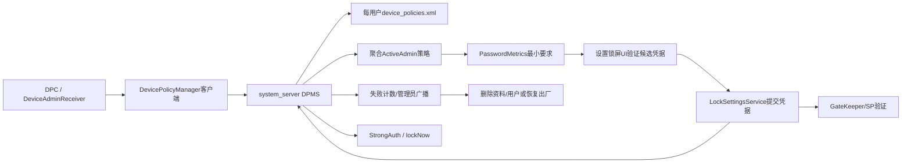
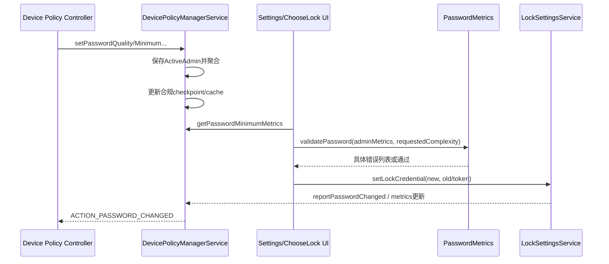
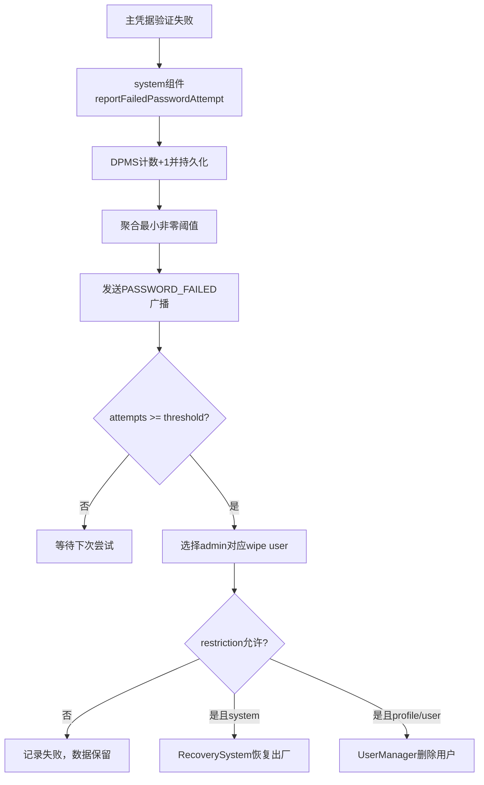

# 294 Android DevicePolicyManagerService密码质量、复杂度、失败wipe、StrongAuth与企业凭据恢复策略链

## 1. 本章目标

本章从设备管理员设置锁屏要求开始，追踪`DevicePolicyManagerService`（DPMS）怎样保存、聚合和验证密码策略，怎样统计失败并选择wipe目标，怎样通过`lockNow()`与StrongAuth强制主凭据，以及Profile Owner怎样用escrow token重置凭据。

## 2. Android 11版本边界

本文依据本地`android-11.0.0_r48`。Android 11已有`PASSWORD_COMPLEXITY_*`计算和`EXTRA_PASSWORD_COMPLEXITY`建议，但DPMS还没有后来版本的`setRequiredPasswordComplexity()`管理策略入口；企业强制要求仍以`PASSWORD_QUALITY_*`、最小长度和字符数量API为主。

## 3. 策略不是密码学实现

DPMS决定“凭据应满足什么条件、失败多少次采取什么动作、何时必须重新输入”，实际凭据保存/验证由LockSettingsService、GateKeeper与Synthetic Password完成，CE key由vold/fscrypt管理。策略层不能直接读取PIN或自行验证哈希。

## 4. 四类主体

传统Device Admin依赖receiver声明的`uses-policies`；Device Owner管理整台设备；Profile Owner管理其用户/工作资料；组织所有设备上的Profile Owner还能在受限条件下影响父用户。相同API在不同角色、parent实例和目标SDK下权限可能不同。

## 5. 核心源码地图

```text
frameworks/base/core/java/android/app/admin/
  DevicePolicyManager.java  PasswordPolicy.java  PasswordMetrics.java
  DeviceAdminInfo.java  DeviceAdminReceiver.java
frameworks/base/services/devicepolicy/java/com/android/server/devicepolicy/
  DevicePolicyManagerService.java
frameworks/base/core/java/com/android/internal/widget/
  LockPatternUtils.java  LockscreenCredential.java
frameworks/base/services/core/java/com/android/server/locksettings/
  LockSettingsService.java  LockSettingsStrongAuth.java
```

## 6. ActiveAdmin保存单个管理员状态

每个激活管理员有`ActiveAdmin`，内部保存`PasswordPolicy`、history、expiration、最大失败次数、最大锁定时间、StrongAuth timeout等；parent实例另有`parentAdmin`。它们被序列化到每用户device policy XML，不等于LockSettings中的真实凭据状态。

## 7. 聚合是本章主线

设备上可能同时有Device Owner、父用户admin、多个工作资料Profile Owner。查询`who=null`时DPMS通常选择最严格值：quality和最低字符数取最大，超时与失败wipe阈值取最小的有效正值，但参与集合先由用户/profile challenge关系决定。

## 8. 总体协作图



## 9. uses-policy是传统能力声明

`limit-password`允许设置质量/最小条件，`watch-login`允许接收成功失败并参与失败计数，`wipe-data`允许清除，`force-lock`允许锁屏，`expire-password`允许到期策略。服务端通过`getActiveAdminForCallerLocked()`验证receiver和对应policy。

## 10. Owner能力不等于所有admin能力

新企业API常只允许Device Owner/Profile Owner，而传统uses-policy仅提供旧能力。分析某调用时需同时检查active admin、声明policy、owner角色、组织所有状态、parent布尔值、调用userId和targetSdk。

## 11. 调用身份怎样确定用户

多数setter从`UserHandle.getCallingUserId()`取得管理员所在用户，而不是让调用方传任意userId；跨用户getter另有`INTERACT_ACROSS_USERS_FULL`检查。清除Binder identity只发生在权限检查之后，用system_server身份执行系统动作。

## 12. 策略写入不立即改用户密码

管理员把最小长度从4改为8时，DPMS更新XML和“当前凭据是否仍合规”的checkpoint，却不会秘密替用户生成新PIN。系统UI/合规检查会要求用户后续设置满足策略的凭据。

## 13. 策略缓存

DPMS维护`DevicePolicyCache`中的聚合password quality供其他system_server组件快速查询。某profile策略可能影响同组其他用户，因此更新时遍历profile group；缓存是派生结果，权威配置仍是ActiveAdmin持久状态。

## 14. 无安全锁屏特性的设备

汽车或特殊设备可能没有`FEATURE_SECURE_LOCK_SCREEN`。若`hasSecureLockScreen()`为false，不少密码、失败wipe和StrongAuth API直接返回默认值；不能假设所有Android产品都有手机式Keyguard。

## 15. 先分清三个词

quality是旧管理员政策等级；complexity是Android 11根据实际凭据形态计算的低/中/高桶，也可由应用在设置密码Intent中提出建议；metrics是长度、字符类别和最长序列等事实数据。三者相关但不等价。

## 16. PASSWORD_QUALITY_UNSPECIFIED

表示该管理员不要求凭据类型，`PasswordPolicy.getMinMetrics()`返回`CREDENTIAL_TYPE_NONE`。它不表示用户当前一定无锁屏，也不清除其他管理员设置的要求。

## 17. SOMETHING与旧BIOMETRIC_WEAK

`PASSWORD_QUALITY_SOMETHING`至少要求图案级凭据；旧`BIOMETRIC_WEAK`在`PasswordPolicy`中也映射为pattern级最小metrics。它们是历史quality枚举，不等于BiometricPrompt的Class 2/3强度体系。

## 18. NUMERIC

要求密码型credential，但不限制数字序列，最低长度由单独`setPasswordMinimumLength()`聚合。仅设置NUMERIC并不自动意味着六位PIN或禁止`1234`。

## 19. NUMERIC_COMPLEX

除密码型与长度外，把`seqLength`上限设为3，拒绝过长重复/等差数字序列。`PasswordMetrics.maxLengthSequence()`会把`1234`、`2468`、`4444`等识别为长序列。

## 20. ALPHABETIC与ALPHANUMERIC

ALPHABETIC要求至少一个非数字字符；ALPHANUMERIC同时要求至少一个数字和至少一个非数字字符。源码用`nonNumeric`而不是仅ASCII字母计数，因此名称比实际最低metric稍宽。

## 21. COMPLEX

`PASSWORD_QUALITY_COMPLEX`才启用letters、upperCase、lowerCase、numeric、symbols和nonLetter等逐项管理员最小值。若quality低于COMPLEX，这些字段即使旧配置残留，也不会通过`getMinMetrics()`生效。

## 22. MANAGED的版本语义

`PASSWORD_QUALITY_MANAGED`数值最高，API注释表示密码由Profile Owner管理、用户不能自行修改；Settings通过可由厂商扩展的`ManagedLockPasswordProvider`处理，AOSP默认provider并不支持选择它。还要注意`PasswordPolicy.getMinMetrics()`没有专门case，会落入password型最低metrics；因此不能只按数值或“如UNSPECIFIED”注释推断实际UI与验证行为。

## 23. target R的调用顺序检查

针对R+管理员，设置较低quality会重置当前不生效的长度/字符条件；设置字符类条件前若未先设COMPLEX，相关API会抛异常或被compat行为限制。旧target应用可能保留历史宽松调用顺序。

## 24. 为什么要重置inactive字段

否则DPC先设10位，再把quality降到pattern，后来再次提升quality时旧10位要求会意外复活。`resetInactivePasswordRequirementsIfRPlus()`让现代DPC的显式质量变化更可预测。

## 25. PasswordMetrics记录什么

它记录credential type、长度、letters、大小写、数字、symbol、nonLetter、nonNumeric和最长sequence。PIN与password在该类内部都暂用`CREDENTIAL_TYPE_PASSWORD`，另靠`isPin`参数区分只允许数字。

## 26. metrics不保存字符内容

DPMS从LockSettingsInternal得到聚合计数，不需要知道真实PIN。metrics仍是敏感安全元数据，例如可暴露长度和字符构成，读取API因此受权限/管理员身份约束。

## 27. 字符范围边界

`validatePassword()`只允许非控制ASCII范围，源码实际判断byte转char `<32`或`>127`为非法。Android 11这条内部校验不支持任意Unicode密码，不能用现代UI印象反推。

## 28. 最短长度还会被系统钳制

验证时管理员合并结果与complexity要求结合，最后长度至少是`MIN_LOCK_PASSWORD_SIZE`且最多`MAX_PASSWORD_LENGTH`。DPC存储值不是最终唯一约束来源。

## 29. 多条件重叠会消除

若要求2个大写和2个小写，已隐含4个letters；若数字和symbols已满足nonLetter，系统不重复报同一缺口。`removeOverlapping()`用于生成更准确的错误列表，而不是放松总要求。

## 30. 验证返回错误列表

`PasswordMetrics.validatePasswordMetrics()`可返回TOO_SHORT、NOT_ENOUGH_DIGITS、CONTAINS_SEQUENCE等多个错误；credential type或PIN含非数字等根本错误会提前返回单项。设置UI可据此给用户具体提示。

## 31. Android 11 complexity四档

NONE允许无凭据；LOW允许pattern或简单PIN；MEDIUM要求至少4位且不能有超过3的序列；HIGH要求非序列PIN至少8位，或含非数字的密码至少6位。它是固定桶，不读取DPC自定义逐项字段。

## 32. HIGH并不等于字母数字符号全有

六位纯字母且无长序列可落入HIGH；八位复杂PIN也可HIGH。complexity强调长度和序列而非旧COMPLEX的每类最小字符数量，不能按quality名称做一一映射。

## 33. determineComplexity怎样选择

`ComplexityBucket`按HIGH→MEDIUM→LOW→NONE排列，实际metrics满足第一个即返回。由于PIN/password共享内部credential type，是否含非数字影响HIGH最小长度是8还是6。

## 34. getPasswordComplexity权限

DPMS要求调用用户已解锁，并要求`REQUEST_PASSWORD_COMPLEXITY`；parent查询还要求Profile Owner或system user。它读取当前credential owner的PasswordMetrics，再调用`determineComplexity()`。

## 35. 本版没有required complexity持久策略

Android 11应用可在`ACTION_SET_NEW_PASSWORD`中附`EXTRA_PASSWORD_COMPLEXITY`，让Settings本次流程把它与管理员metrics合并；但DPMS没有持久的`setRequiredPasswordComplexity()`。后者属于更新版本，不能写进r48企业策略主链。

## 36. 应用请求与管理员政策并存

`validatePassword(adminMetrics, minComplexity, isPin, candidate)`先应用credential type，再把complexity桶的序列/长度要求max进管理员metrics。最终候选必须同时满足，而不是“复杂度高就覆盖管理员规则”。

## 37. quality取最大

聚合`getPasswordQuality(who=null)`遍历参与admin，取数值最大的quality。对常规旧quality枚举这代表更严格，但MANAGED等特殊值说明仍需看`PasswordPolicy.getMinMetrics()`的具体映射。

## 38. 字符最小值取最大

每个admin先转成自己的min metrics，再由`PasswordMetrics.merge()`逐字段max、seqLength取min。这样admin A要求8位、admin B要求2个symbol时，最终两者同时生效。

## 39. 聚合不一定可由一个admin值表达

返回的合并metrics可能组合来自多个admin，无法用单个`who`的配置解释。排障应列出所有参与admin及来源，而不是只看Device Owner。

## 40. 密码history

各admin可设置历史长度，聚合取最大；LockSettings使用SP派生的hash factor和历史记录阻止最近密码复用。DPMS保存“要求几次”，不持有可验证的旧明文密码。

## 41. history的边界

密码历史用于用户主动改密时校验，并非远程服务器泄露检测；清用户、重置某些状态或平台迁移会影响历史可用性。哈希历史也不能证明两个不同编码的凭据语义完全相同。

## 42. 密码expiration timeout

管理员设置从每次密码更新开始计算的到期时长；有效聚合取最短非零timeout。凭据改变时DPMS为受影响admin更新绝对expiration date并设置alarm。

## 43. 到期不是自动删除数据

expiration alarm向管理员发送`ACTION_PASSWORD_EXPIRING`等提醒并推动合规UI；它不会在日期一到就直接wipe或随机改密码。实际企业DPC需响应并引导用户更新。

## 44. maximumTimeToLock

该策略限制无操作后屏幕锁定时间，参与admin取最短正值。DPMS把结果交给`PowerManagerInternal.setMaximumScreenOffTimeoutFromDeviceAdmin()`；有有限值时还清除`STAY_ON_WHILE_PLUGGED_IN`以免常亮绕过。

## 45. 屏幕超时不是StrongAuth timeout

maximumTimeToLock决定多久关屏/锁屏；requiredStrongAuthTimeout决定使用生物识别/Trust一段时间后何时必须再输入主凭据。二者时钟、执行组件和安全语义不同。

## 46. 策略持久化与checkpoint

每次质量/最小条件变化会更新`mPasswordValidAtLastCheckpoint`，前提是LockSettings已知metrics。checkpoint让某些启动阶段能回答上次是否合规，但不是新的实时验证结果。

## 47. FBE设备为何要求用户已解锁

FBE下当前密码metrics应在主凭据解锁后由LockSettings提供；若仍为null，`isActivePasswordSufficient`视为异常并抛出。DPMS不会为了查询合规去解开CE数据或读取凭据。

## 48. 非FBE旧兼容路径

源码在非FBE且metrics未知时可回退持久checkpoint。管理员若开机期间修改要求，该值可能暂时陈旧，直到用户再次输入凭据并刷新metrics。

## 49. 合规判断主链

`isActivePasswordSufficient()`验证caller admin、确定credential owner、取得实际metrics和所有参与admin min metrics，再调用`validatePasswordMetrics(..., COMPLEXITY_NONE)`；空错误列表才合规。

## 50. 从策略设置到候选密码提交



## 51. UI校验不是唯一安全门

可信Settings通常先显示错误，但企业token reset、系统迁移等路径也必须在服务端调用`resetPasswordInternal()`校验min metrics。只依赖前端禁用按钮会被Binder或系统组件路径绕过。

## 52. LockSettings反馈密码变化

凭据真正更新后，DPMS重置expiration、更新合规checkpoint并向参与`limit-password`的admins广播`ACTION_PASSWORD_CHANGED`。setter策略动作和真实密码变化广播不可混为一谈。

## 53. parent参数

工作资料Profile Owner可通过parent DPM实例针对父用户设置允许的策略。服务端使用`ActiveAdmin.parentAdmin`并把affected user定为profile parent；普通Profile Owner不能任意管理其他用户。

## 54. separate challenge参与集合

工作资料有独立challenge时，其锁屏策略只看该资料admin；父用户聚合可包含显式parent policy。资料凭据有自己的metrics、SID、失败计数和CE解锁链。

## 55. unified challenge参与集合

资料与父用户共用可见锁屏时，资料admin策略会影响父credential owner，父凭据必须同时满足参与profile要求。系统内部子资料仍有随机凭据，但不拿它作为用户复杂度对象。

## 56. unification前预检查

`isPasswordSufficientAfterProfileUnification()`临时合并父用户与即将统一profile的策略，验证父密码metrics。若不合规，应先让用户增强父凭据，不能先统一后留下违规入口。

## 57. 组织所有Profile Owner

组织所有设备上的PO有更强父侧能力，例如某些parent policy和全设备wipe；普通BYOD工作资料PO通常只删除自己的profile。代码用`isProfileOwnerOfOrganizationOwnedDevice()`分支，而不只看“是PO”。

## 58. 同阈值时偏向primary

多个admin设置相同失败wipe阈值时，`getAdminWithMinimumFailedPasswordsForWipeLocked()`优先返回将wipe primary profile的admin。这一tie-break会改变最终是删资料还是整机清除。

## 59. 参与admin列表要动态计算

profile challenge分离/统一、用户删除、owner迁移或admin停用都会改变聚合集合。因此不能长期缓存“最严格admin名字”作为业务真相，应从DPMS实时查询并结合策略cache失效。

## 60. 策略XML与LockSettings状态不同步风险

DPMS写策略、LSS写凭据、vold写CE包装分属不同存储和事务。崩溃或恢复单份备份可能造成策略已严格但凭据旧、凭据已改但expiration/checkpoint旧等短期不一致，启动和下次认证负责重新收敛。

## 61. 失败次数由谁上报

Keyguard/LockSettings相关系统组件以`BIND_DEVICE_ADMIN`权限调用`reportFailedPasswordAttempt(userHandle)`。DPC不能随意伪造失败计数；DPMS先检查跨用户和separate challenge条件。

## 62. 失败计数按credential owner状态保存

DPMS递增对应`DevicePolicyData.mFailedPasswordAttempts`并立即保存。统一challenge下调用者需使用正确用户语义，参与admin集合再决定哪个阈值和wipe目标生效。

## 63. GateKeeper lockout与DPM计数不同

GateKeeper在可信环境内做重试节流/lockout；DPMS失败计数用于通知admin和wipe政策。两套状态来源与持久化不同，某次尝试可能同时推进二者，但不能用一个数值替代另一个。

## 64. 生物识别失败不计入密码wipe

`reportFailedBiometricAttempt()`有独立SecurityLog事件，不递增`mFailedPasswordAttempts`。否则传感器噪声或人脸未匹配可能触发企业数据清除，风险不可接受。

## 65. strictest wipe阈值取最小正值

0表示admin不参与；其余阈值越小越严格。DPMS遍历参与admin并选最小，达到`attempts >= max`后才在退出全局锁的情况下执行wipe。

## 66. 设置阈值需要两个uses-policy

`setMaximumFailedPasswordsForWipe()`先验证`wipe-data`，又以`watch-login`取得ActiveAdmin。管理员既要观察登录失败，又要有清除权限，缺一不能建立自动wipe政策。

## 67. 失败广播先于wipe调用

计数持久化后DPMS向参与admin发送`ACTION_PASSWORD_FAILED`，随后锁外调用`wipeDataNoLock()`。广播处理并不是阻止wipe的确认点，也不能保证在设备马上重启清除前完成任意网络上报。

## 68. 达阈值不保证wipe成功

wipe仍受`DISALLOW_FACTORY_RESET`、`DISALLOW_REMOVE_MANAGED_PROFILE`或`DISALLOW_REMOVE_USER`等限制，以及admin是否受该restriction影响。SecurityException被记录，失败次数保持超过阈值，后续尝试可能再次触发。

## 69. 成功主凭据会清零

`reportSuccessfulPasswordAttempt()`把失败计数归零、清`mPasswordOwner`并保存，再发送`ACTION_PASSWORD_SUCCEEDED`。生物识别成功不是这个方法，不应清除企业的主凭据失败累计。

## 70. mPasswordOwner是什么

旧`resetPassword(REQUIRE_ENTRY)`会记录设置密码的calling UID，阻止其他UID在用户尚未输入前再次替换；成功密码输入清除owner。它不是Android多用户的credential owner概念，两者名称相似。

## 71. SecurityLog

设置wipe阈值、远程锁定、密码成功/失败和wipe失败会写安全日志事件，供Device Owner合规审计。日志是证据流，不是动作事务；没有日志不能单独证明wipe没发生，写日志也不证明介质已清除。

## 72. wipe目标由admin角色决定

普通工作资料admin通常删除该profile；secondary user admin删除其用户；system/Device Owner路径恢复出厂；组织所有PO的父实例可指向system user从而整机wipe。

## 73. 工作资料wipe

若目标不是system user，DPMS必要时先切回system user，再调用`removeUserEvenWhenDisallowed()`；成功删除managed profile后默认发“工作资料已删除”通知，`WIPE_SILENTLY`仅在允许的profile语义下抑制通知。

## 74. 整机wipe

system user目标调用`RecoverySystem.rebootWipeUserData(force=true)`，可选先wipe adoptable disks和eUICC。调用通常触发重启进入恢复清除流程，返回路径不能当同步完成确认。

## 75. WIPE_EXTERNAL_STORAGE

该flag先调用StorageManager wipe adoptable disks；它针对可采纳外部介质，不表示所有物理SD卡/云端副本一定安全擦除。具体介质和厂商实现仍需验证。

## 76. WIPE_RESET_PROTECTION_DATA

只有Device Owner或组织所有PO父级能力可清PersistentDataBlock中的FRP数据。普通profile admin不能借删除工作资料清掉整机Factory Reset Protection。

## 77. WIPE_EUICC

整机wipe可请求清eSIM配置，但成功依赖RecoverySystem/eUICC实现。它与Android user数据目录删除是不同子系统，不能把一个成功回执推广到另一个。

## 78. wipe不是密码学瞬时事件

删除用户会销毁其CE key和数据目录，恢复出厂会重置userdata；真正不可恢复性依赖密钥销毁、文件系统、恢复环境和存储介质。DPMS只发起受权限约束的高层动作。

## 79. 失败到wipe的完整流程



## 80. lockNow不只是熄屏

`lockNow()`先要求调用admin具备`force-lock`或调用方持`LOCK_DEVICE`，再设置`STRONG_AUTH_REQUIRED_AFTER_DPM_LOCK_NOW`，最后锁WindowManager/Trust状态并通常让PowerManager熄屏。

## 81. DPM StrongAuth flag

该flag让Keyguard要求PIN/图案/密码，生物识别和Trust不能立即替代。它不改变SID、不清CE key，也不自动删除Keystore密钥；主凭据成功和userPresent路径才清相应要求。

## 82. lock all还是只锁profile

若调用parent实例或资料没有separate challenge，`userToLock=USER_ALL`；独立challenge资料可只标记该profile locked，通过TrustManager设置用户锁定，而不必把整机所有用户熄屏。

## 83. FLAG_EVICT_CREDENTIAL_ENCRYPTION_KEY

仅FBE设备上的Profile Owner、仅自己的managed profile、且不能在parent实例使用。它调用`UserManager.evictCredentialEncryptionKey()`，把资料CE key从内核驱逐，强于只隐藏UI。

## 84. 驱逐CE key的后果

已打开文件/缓存的精确行为仍受内核影响，但新CE访问需要再次用资料凭据恢复SP并安装key。该flag不删除资料，用户正确解锁后可恢复访问。

## 85. 汽车设备例外

`lockNow()`在automotive build上可不调用goToSleep，但仍执行StrongAuth和Window/用户锁逻辑。把“远程锁定成功”仅定义为屏幕关闭会误判汽车产品。

## 86. RemoteException处理边界

WindowManager远程调用异常在`lockNow()`中被空catch忽略，方法仍写事件日志。审计必须检查实际Keyguard/StrongAuth状态，不能只以API无异常返回证明画面已锁。

## 87. requiredStrongAuthTimeout

Owner可设置多久后必须再次主认证；0表示该admin不参与。多个参与admin取最短，再钳制在系统最小值与默认最大值之间，并通知LockSettingsInternal刷新已有alarm。

## 88. production最小StrongAuth timeout

非debug build使用固定`MINIMUM_STRONG_AUTH_TIMEOUT_MS`，DPC不能设成每秒强制输入。debug build允许用受限系统属性把最小值调低，方便测试，但不能把测试值当量产保证。

## 89. timeout不是从策略设置时开始

LockSettingsStrongAuth在成功主凭据认证时记录最新时间并调度alarm；DPMS改变政策只refresh已有基准。若从未有基准或用户当前已需StrongAuth，setter不会凭空认证用户。

## 90. StrongAuth与生物识别

达到DPM timeout或执行lockNow后，Keyguard读取StrongAuthTracker flags拒绝仅靠生物识别/Trust解锁。生物识别HAL仍可能产生HAT供其他操作，但锁屏政策是否接受由Framework状态机决定。

## 91. maximumTimeToLock和FBE key eviction

普通超时/关屏主要锁UI，不保证立即驱逐主用户CE key；只有特定profile lockNow flag显式驱逐。企业“屏幕锁定后数据在内核不可用”的高强度需求不能只设置screen timeout。

## 92. resetPassword旧API的退场

Android 11限制普通Device Admin使用传统`resetPassword()`；目标SDK和owner角色决定返回false或抛SecurityException。现代企业恢复应使用Profile/Device Owner控制的reset token路径。

## 93. reset token要求

`setResetPasswordToken()`要求至少32字节token和Profile Owner策略能力。DPMS把token交给LockPatternUtils添加SP escrow token，只在策略XML保存long handle，不保存token明文。

## 94. token不是立刻都active

在已有安全凭据用户上，新escrow token通常要等用户下一次成功主凭据认证后激活；DPC应调用`isResetPasswordTokenActive()`确认。只收到非零handle不等于已可远程重置。

## 95. token生命周期

设置新token会先移除旧handle；`clearResetPasswordToken()`删除SP token wrapper并清handle。若DPC丢失token bytes而handle仍在，Framework不能把原token读回给它，只能清除后重新建立。

## 96. resetPasswordWithToken

DPC提交新密码、原token和flags；DPMS用保存handle调用`setLockCredentialWithToken()`。SPM通过token wrapper恢复同一SP，再创建新密码wrapper，所以不需要知道旧用户PIN。

## 97. token reset仍校验企业政策

`resetPasswordInternal()`先取得聚合`getPasswordMinimumMetrics()`，对候选密码调用`PasswordMetrics.validatePassword(..., COMPLEXITY_NONE)`；不满足quality/长度/字符条件就返回false。

## 98. token reset不是跳过所有安全控制

它绕过“提供旧锁屏凭据”，但仍受owner权限、token possession/activation、SP escrow可用性、管理员password policy和LockSettings内部状态约束。token应按设备级高价值secret保护。

## 99. RESET_PASSWORD_REQUIRE_ENTRY

设置此flag后DPMS对所有用户要求`STRONG_AUTH_REQUIRED_AFTER_DPM_LOCK_NOW`，并把`mPasswordOwner`设为calling UID，强制用户亲自输入新凭据后才清除。它防止后台重置后长期无用户确认。

## 100. DO_NOT_ASK_CREDENTIALS_ON_BOOT

只有Device Owner可设置`RESET_PASSWORD_DO_NOT_ASK_CREDENTIALS_ON_BOOT`相关持久标志。它影响特定启动/企业配置行为，不代表FBE安全凭据被移除，也不是通用“自动解锁所有用户”开关。

## 101. reset token与RecoverableKeyStore区别

reset token恢复的是同一用户SP入口，能重设锁屏并继续解FBE；RecoverableKeyStore恢复少量应用AES key，不恢复SP或CE key。前者权限更强、设备绑定更深，不能用云端key snapshot替代。

## 102. token与普通改密的SID影响

只要用户原来有真实SID且SP保持，token重置通常像普通改密一样维持真实SID；若清除凭据则LSS清SID和生物模板。最终影响以第292章的credential transition分支为准。

## 103. 企业“恢复”不是备份旧PIN

DPC应随机生成高熵token并安全托管，Framework仅保存其wrapper handle。恢复过程证明token possession后重包SP，而不是解出或显示用户旧PIN。

## 104. DPC服务器的责任

若token上传企业服务器，账号授权、设备绑定、轮换、撤销、审计和泄露响应均不由AOSP实现。服务端拿到token可能拥有强重置能力，必须比普通配置数据更严格保护。

## 105. 用户移除与owner清理

删除profile/user会清DPMS政策、escrow wrapper、Keystore与CE数据；旧服务端token不应在userId复用后重新绑定。企业后台也要接收退役信号并销毁对应secret。

## 106. 常见误解一：设置策略会立即换密码

错误。DPMS只保存要求并更新合规状态；用户或受权token流程真正调用LockSettings设置后，密码才改变。当前密码可能暂时不合规，但不会被DPMS猜测性替换。

## 107. 常见误解二：complexity high就是旧complex全部字符类

错误。HIGH允许六位非数字密码或八位非序列PIN，并不要求大小写、数字、symbol全部出现；旧COMPLEX才使用管理员逐字符最小值。

## 108. 常见误解三：第N次错误必定擦除成功

错误。DPMS会尝试wipe，但restriction、角色、RecoverySystem、UserManager或存储故障都可能阻止完成。应记录“触发”“请求接受”“重启/用户删除完成”三类证据。

## 109. 常见误解四：lockNow会清磁盘key

通常错误。它锁UI并要求StrongAuth；只有符合条件的managed profile配合`FLAG_EVICT_CREDENTIAL_ENCRYPTION_KEY`才显式驱逐CE key。

## 110. 常见误解五：生物失败会触发企业wipe

错误。密码失败计数只由主凭据失败上报推进；生物识别失败单独记安全日志。生物lockout属于Biometric/GateKeeper之外的另一套状态。

## 111. 推荐阅读和排障顺序

先列admin角色与challenge关系，再看ActiveAdmin XML值，调用`getActiveAdminsForLockscreenPoliciesLocked()`确定参与集合，计算PasswordMetrics；失败问题再追report→threshold→target→restriction→实际wipe，远程锁问题追StrongAuth flag→Window/Trust→可选CE eviction。

## 112. macOS只读练习一：手算聚合密码要求

```bash
sed -n '1,180p' frameworks/base/core/java/android/app/admin/PasswordPolicy.java
sed -n '330,720p' frameworks/base/core/java/android/app/admin/PasswordMetrics.java
```

假设admin A要求8位，admin B要求2个symbol和1个数字，手算merge及removeOverlapping后的有效要求。

## 113. macOS只读练习二：对比quality与complexity

```bash
rg -n "PASSWORD_QUALITY_|PASSWORD_COMPLEXITY_" \
  frameworks/base/core/java/android/app/admin/{DevicePolicyManager,PasswordMetrics}.java
```

分别判断`1234`、`1357`、`2580`、`abcdef`可能落入的complexity，并说明为何不能从桶反推某admin的quality。

## 114. macOS只读练习三：追失败wipe目标

```bash
sed -n '5615,5705p' \
  frameworks/base/services/devicepolicy/java/com/android/server/devicepolicy/DevicePolicyManagerService.java
sed -n '7510,7595p' \
  frameworks/base/services/devicepolicy/java/com/android/server/devicepolicy/DevicePolicyManagerService.java
```

标出最小阈值、primary tie-break、组织所有PO目标选择和restriction失败四个决策点。

## 115. macOS只读练习四：核对token恢复

```bash
sed -n '14940,15085p' \
  frameworks/base/services/devicepolicy/java/com/android/server/devicepolicy/DevicePolicyManagerService.java
rg -n "addEscrowToken|setLockCredentialWithToken|isEscrowTokenActive" \
  frameworks/base/core/java/com/android/internal/widget/LockPatternUtils.java
```

画出token bytes、token handle、SP token wrapper和新credential四者关系，确认DPMS不能读取旧PIN。

## 116. 自测一：解释三种“更严格”

quality/字符最低值取最大，wipe threshold取最小正值，maximumTimeToLock与StrongAuth timeout也取最短有效值。若只会说“所有字段取最大”，说明尚未掌握聚合方向。

## 117. 自测二：区分锁定层次

能分别说明关屏、WindowManager Keyguard、StrongAuth拒绝生物、TrustManager profile locked、fscrypt CE key eviction五层，才不会把一次`lockNow()`描述成“磁盘已经加密并卸载”。

## 118. 自测三：分析失败wipe事件

给出“工作资料PO设5次，父DO设10次”的场景，先判断challenge参与集合，再选阈值和admin，最后判断删除profile还是整机wipe；答案不能只比较数字。

## 119. 复读修订与准确性边界

本章按r48复读后明确：本版没有DPMS持久`setRequiredPasswordComplexity()`；HIGH complexity不等于旧COMPLEX字符组合；metrics不含明文；统一/独立profile会改变参与admin；生物失败不累计password wipe；达到阈值只发起受restriction约束的wipe；`lockNow()`默认不驱逐CE key；reset token基于SP escrow且仍校验聚合策略。厂商Settings UI、RecoverySystem和存储擦除实现不完全包含在DPMS中，最终行为需结合设备验证。

## 120. 本章小结与下一章

DPMS把多个企业主体的声明合成为凭据最低要求、超时和破坏性响应，再让LockSettings、StrongAuth、Power/Window、UserManager与RecoverySystem执行；正确理解的关键是始终分开策略、认证、UI锁定、CE key和数据清除。下一章进入`Android DevicePolicyManagerService证书、KeyChain私钥委托、KeyPair生成、attestation与企业身份生命周期链`。
