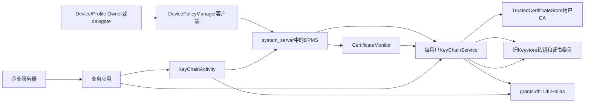
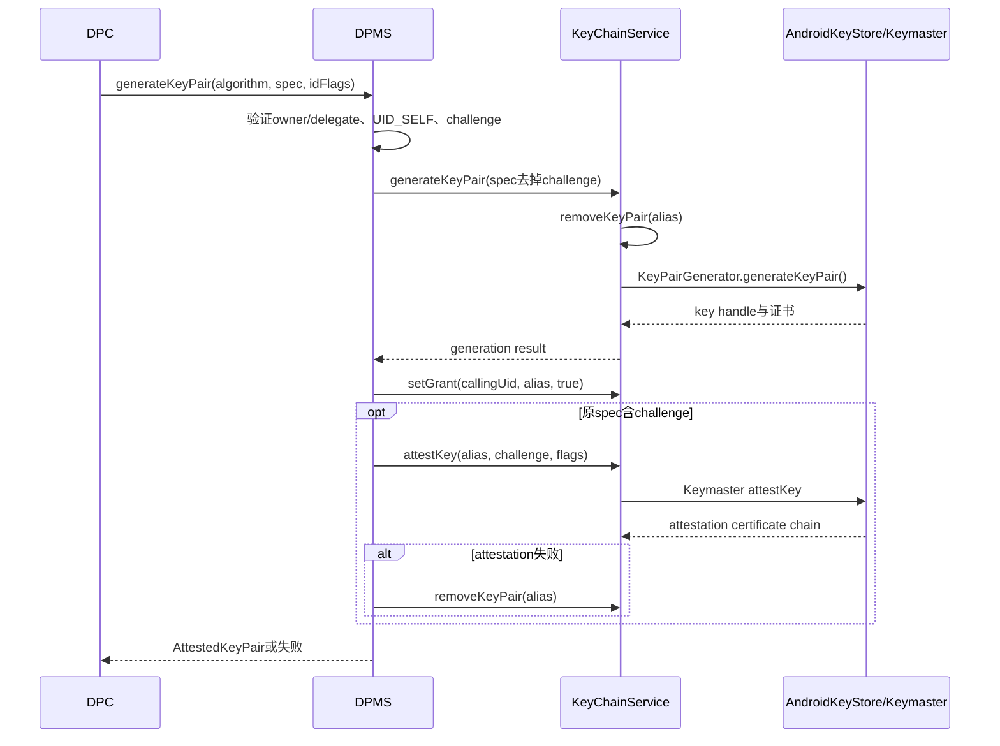
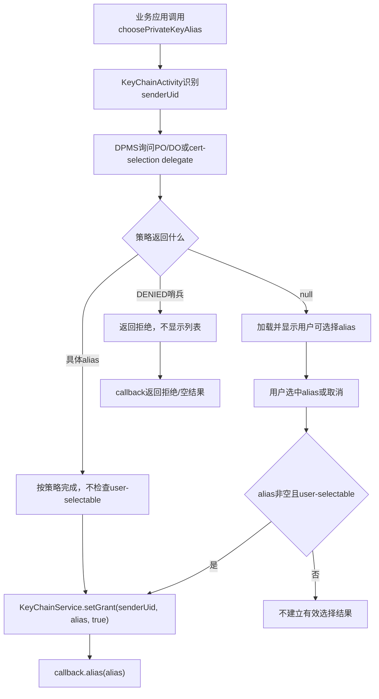

# 295 Android DevicePolicyManagerService证书、KeyChain私钥委托、KeyPair生成、attestation与企业身份生命周期链

## 1. 本章目标

本章从企业DPC调用`DevicePolicyManager`开始，追踪三条容易混在一起的凭据链：安装用户CA改变信任锚、导入或生成客户端私钥与证书、把某个私钥别名授权给业务应用。最后解释设备标识attestation、证书续期、吊销和清理为何不是一个原子操作。

## 2. Android 11版本边界

本文只依据本地`android-11.0.0_r48`。这一版仍以旧`android.security.KeyStore`、`USRPKEY_`等前缀、Keymaster和KeyChain Binder服务为主；不能把Android 12以后Keystore2/KeyMint的数据库、授权令牌和AIDL实现倒灌进来。

## 3. 先分清三类对象

CA证书是验证别人的信任锚，客户端证书把一个公钥身份绑定到主体，私钥则用来签名或解密且不应离开安全边界。安装CA不会凭空得到客户端私钥，给应用私钥grant也不会让该应用自动信任新的服务器CA。

## 4. 企业身份的典型用途

企业Wi-Fi EAP-TLS、VPN、双向TLS、邮件S/MIME或内部Web服务可能需要客户端证书；内部HTTPS还可能需要企业CA。它们的共同点只是都使用X.509，授权方向和泄露风险完全不同。

## 5. 本章核心进程

DPC和业务应用运行在各自UID；DPMS位于`system_server`；KeyChain是独立系统应用中的服务与选择界面；旧Keystore服务保存私钥对象；CA信任材料由`TrustedCertificateStore`管理。跨进程边界必须看调用UID何时被检查、何时清除Binder identity。

## 6. 核心源码地图

```text
frameworks/base/core/java/android/app/admin/DevicePolicyManager.java
frameworks/base/services/devicepolicy/java/com/android/server/devicepolicy/
  DevicePolicyManagerService.java  CertificateMonitor.java
frameworks/base/keystore/java/android/security/
  KeyChain.java  IKeyChainService.aidl  Credentials.java
packages/apps/KeyChain/src/com/android/keychain/
  KeyChainService.java  KeyChainActivity.java
  internal/GrantsDatabase.java
```

## 7. 四类管理主体

Device Owner管理整台设备；Profile Owner管理自己的用户或工作资料；证书安装delegate持有`DELEGATION_CERT_INSTALL`；证书选择delegate持有`DELEGATION_CERT_SELECTION`。两个delegation scope用途不同，能导入密钥不等于能替应用选择现有密钥。

## 8. admin参数为什么可为空

DPC作为owner调用时传自己的`ComponentName`；受委托应用调用时通常传`null`，同时传`callerPackage`。DPMS会核对包名属于调用UID，并确认该包在当前用户确有相应scope，不能仅靠伪造包名取得能力。

## 9. 同一用户边界

这些API通常以Binder调用UID推导`UserHandle`，再通过`KeyChain.bindAsUser()`连接该用户的服务实例。工作资料中的证书、别名和grant与父用户隔离；同一个字符串alias出现在两个用户中，也不是同一把密钥。

## 10. 清除Binder identity的含义

DPMS先以原始调用身份完成owner/delegate权限检查，再清除identity，以system_server权限绑定KeyChain或访问系统组件。清除identity不是把调用者变成所有者；授权决定已经在清除之前完成，后续仍保存原`callingUid`用于建立grant。

## 11. 先画完整角色关系

把“策略控制者”“私钥保管者”“私钥使用者”和“远端验证者”分开，后面的源码才不会乱。



## 12. 第一条链：安装CA

`DevicePolicyManager.installCaCert()`接收DER或PEM可解析的X.509证书字节，客户端跨Binder交给DPMS。DPMS调用`enforceCanManageCaCerts()`，然后让`CertificateMonitor`绑定目标用户的KeyChain服务完成安装。

## 13. CertificateMonitor先规范化证书

监控器先用`CertificateFactory`解析X.509，再通过`Credentials.convertToPem()`转换成PEM交给KeyChain。这一步既验证基本编码，也让底层得到规范格式；它不验证该CA是否可信、是否仍有效或是否真的属于企业。

## 14. KeyChainService写入用户信任库

`installCaCertificate()`解析证书后，在`TrustedCertificateStore`同步块中调用`installCertificate()`并取得alias。这里写的是用户CA区域，不是应用私钥区域；成功后广播信任库变化和兼容的存储变化。

## 15. alias不是DPC指定的友好名称

CA安装返回的alias由`TrustedCertificateStore`根据证书和存储位置决定。DPMS只把它加入该用户的`mOwnerInstalledCaCerts`，用于识别“由owner侧安装”的证书；调用方不能把这个alias当成全球稳定业务ID。

## 16. owner-installed集合的作用

`mOwnerInstalledCaCerts`保存在device policy XML中，主要用于归属和清理判断。真实证书内容在信任库中；XML集合丢失不会把证书字节自动删除，反过来信任库条目消失后集合也可能暂时陈旧。

## 17. 安装与批准是两套状态

DPMS另有`mAcceptedCaCertificates`。`approveCaCert()`要求`MANAGE_USERS`，只把alias加入或移出批准集合，然后通知`CertificateMonitor`刷新；它不是再安装一份证书，也不是给某个应用授予私钥。

## 18. 为什么需要批准集合

系统要向用户提示当前用户信任库中存在尚未确认的用户CA。`CertificateMonitor`比较KeyChain返回的用户CA aliases与DPMS批准集合，未批准数量大于零时展示安全通知；全部批准后取消通知。

## 19. 通知不是阻断开关

未批准状态主要驱动可见的安全提醒，不能简单理解为“证书尚未参与TLS验证”。是否被TrustManager接受还取决于调用应用、Network Security Config和具体TLS实现；本章的批准集合不是通用TLS信任数据库。

## 20. 何时刷新CA通知

`CertificateMonitor`监听用户启动、用户解锁和信任库变化。只有用户已经unlock时才绑定KeyChain并查询aliases，因为凭据加密状态和用户服务生命周期可能尚未就绪。

## 21. 不安全用户会清批准记录

`removeCaApprovalsIfNeeded()`遍历用户及其profiles；若该用户不安全，且managed profile与父用户也都不安全，就清空对应批准集合。含义是锁屏保护消失后需要重新面对用户CA告警，不是删除CA本体。

## 22. 卸载CA主链

`uninstallCaCerts()`先检查owner或cert-install delegate，再让`CertificateMonitor`逐alias调用KeyChain删除。之后DPMS从`mOwnerInstalledCaCerts`移除这些alias并保存策略；底层某项失败时，元数据和真实存储可能出现需要排障的差异。

## 23. 系统CA与用户CA

系统根证书来自只读系统信任集合，用户CA是后安装的条目。卸载用户CA不能删除只读系统根；KeyChain/设置界面对系统根的“停用”与真正移除文件也不是一回事。

## 24. CA链的信任方向

安装企业CA意味着设备可能接受由它签发的服务器或其他证书，扩大的是信任边界。若企业CA私钥泄露，攻击者可能签发可被接受的证书；因此DPC部署CA应配合域名范围、应用NSC和撤销流程，而不是只看安装返回true。

## 25. CA证书没有秘密

CA证书本身含公钥，可公开分发；真正敏感的是签发CA的私钥，它不应随DPC安装到终端。若一个文件同时含私钥和证书，`installCaCert()`也只把可解析证书作为信任锚处理，不是PKCS#12导入器。

## 26. 第二条链：导入客户端KeyPair

`installKeyPair()`用于把已有私钥、叶子证书和可选中间链放入KeyChain管理区。公开客户端把`PrivateKey.getEncoded()`得到的PKCS#8与证书PEM跨Binder传输；若私钥不可导出、`getEncoded()`为null，就不能走这条导入路径。

## 27. 导入意味着DPC见过私钥

私钥先存在DPC进程内，再序列化成字节交给system_server和KeyChain。因此“导入的软件私钥”与“在硬件内生成且从未导出”是不同威胁模型；即便导入后Keystore不再允许导出，也无法抹去之前存在过的副本。

## 28. 两个安装flag

`INSTALLKEY_REQUEST_CREDENTIALS_ACCESS`表示立即给调用DPC/delegate的UID授予访问；`INSTALLKEY_SET_USER_SELECTABLE`表示普通用户选择器可以展示该alias。一个控制显式grant，一个控制可选择性，两位可以独立组合。

## 29. DPMS导入调用

服务端绑定调用者所在用户的KeyChain，调用`installKeyPair(privKey, cert, chain, alias, UID_SELF)`。成功后按需`setGrant(callingUid, alias, true)`，再写`setUserSelectable(alias, flag)`；任一步远程异常都可能让前面已经写入的部分仍存在。

## 30. UID_SELF不是调用应用UID

传给KeyChain的`KeyStore.UID_SELF`表示安装到当前用户KeyChain所管理的系统Keystore命名空间，而不是把条目直接放进DPC UID私有命名空间。应用访问依靠后续Keystore grant桥接。

## 31. 旧Keystore三个前缀

私钥使用`USRPKEY_<alias>`，叶子证书使用`USRCERT_<alias>`，其余证书链使用`CACERT_<alias>`。这些是Android 11旧实现细节；业务应用只应使用KeyChain API和逻辑alias，不应拼接底层名称。

## 32. alias覆盖先删除旧条目

KeyChainService的源码顺序非常关键：

```java
if (!removeKeyPair(alias)) return false;
if (privateKey != null && !mKeyStore.importKey(...)) return false;
if (userCertificate != null && !mKeyStore.put(...)) {
    mKeyStore.delete(Credentials.USER_PRIVATE_KEY + alias);
    return false;
}
```

同名更新不是“新条目完全成功后原子替换”，而是先删旧条目再逐项写新条目。

## 33. 覆盖失败会丢旧身份

若旧alias已经用于生产mTLS，导入新私钥时先执行`removeKeyPair()`；随后私钥或证书写入失败，旧key、旧证书及其grants已被删除。调用返回false不代表系统仍安全保留旧版本，这是本链最重要的恢复边界之一。

## 34. 叶子证书失败的清理

私钥导入成功而叶子证书写入失败时，服务尝试删除刚导入的私钥。删除失败只记录日志，因此仍可能留下不可用孤儿；这是一种best-effort补偿，不是数据库事务回滚。

## 35. 中间链失败的清理

若叶子证书已写入而`CACERT_`链写入失败，服务调用`removeKeyPair(alias)`清掉三类条目以及grant信息。清理本身也可能失败并只记日志，所以错误处理必须把“可能部分完成”纳入运维检查。

## 36. 保留alias值

`KeyChain.KEY_ALIAS_SELECTION_DENIED`是策略明确拒绝私钥选择的哨兵，不能用作安装alias。空alias、保留值和算法/编码错误应在部署端预检，避免进入会先删除旧alias的危险路径。

## 37. removeKeyPair清理范围

KeyChainService通过`Credentials.deleteAllTypesForAlias()`删除私钥、叶子证书和CA链，成功后调用`mGrantsDb.removeAliasInformation(alias)`删除所有UID grants与user-selectable记录，再发变化广播。删除身份等于同时撤销后续查取权限。

## 38. 删除仍不是远端吊销

本地删除私钥可阻止设备继续用它完成签名，但企业CA或服务器并不知道该证书已被删除。真正撤销还需服务端账户禁用、CRL/OCSP、MDM资产状态或短证书有效期等机制。

## 39. 第三条链：设备内生成KeyPair

`generateKeyPair()`让DPC提供算法和`KeyGenParameterSpec`，KeyChain在AndroidKeyStore中生成密钥。私钥通常以句柄使用，不经过DPC明文字节；这是实现不可导出企业身份的首选起点。

## 40. 生成与证明是两个阶段

DPMS复制原spec并清除attestation challenge，让KeyChain先生成key；生成成功后给调用UID建grant；如果原spec有challenge，再单独调用`attestKey()`。因此返回的是“生成成功并可选完成证明”的组合结果，不是一个底层原子命令。

## 41. 生成/证明时序图



## 42. KeyGenParameterSpec表达什么

spec包含alias、purpose、digest、签名/加密padding、密钥大小、有效期、用户认证、StrongBox请求等授权。它决定密钥能做哪些密码学操作，不负责赋予任意应用访问权；访问仍由KeyChain grant控制。

## 43. UID必须是UID_SELF

DPMS检查`keySpec.getUid() == KeyStore.UID_SELF`。因为生成后只给原调用UID建立grant，若允许spec指定另一个底层UID，会造成授权语义不一致；不满足时服务记录错误并返回false。

## 44. 生成也会先删旧alias

KeyChainService拒绝空alias和保留alias后，仍会先`removeKeyPair(alias)`，再创建`KeyPairGenerator`并生成。StrongBox不可用、参数不支持或provider失败都可能发生在旧身份已删除之后，因此轮换不应只用同一alias盲目覆盖。

## 45. 更安全的轮换模式

先以版本化新alias生成并完成证明、证书签发和服务端登记；验证新链可用后，将业务grant切到新alias；最后撤销服务端旧证书并删除旧alias。这样可以显著降低“覆盖失败导致身份真空”，代价是短期维护两套身份。

## 46. StrongBox请求的边界

spec显式要求StrongBox而设备没有可用StrongBox时，KeyChain返回专门错误，客户端转为`StrongBoxUnavailableException`。不能悄悄把“必须StrongBox”降级为TEE或软件，否则设备证明和合规等级都会改变。

## 47. 硬件支持不等于StrongBox

TEE-backed与独立StrongBox都是硬件保护但隔离等级不同；某些设备或算法还可能落到软件实现。应通过`KeyInfo`和attestation中的security level核验实际结果，而不是只因为调用AndroidKeyStore就宣称硬件级。

## 48. 什么是attestation challenge

challenge是验证方提供的一次性随机字节，进入证明证书扩展，用于把证明绑定到本次注册会话。它不是PIN、设备秘密或签名私钥；若复用、可预测或不在服务端核对，旧证明链可能被重放。

## 49. 为什么DPMS先移除challenge

KeyChain的`generateKeyPair()`明确不接受这里“顺便证明”的challenge，DPMS让生成和设备标识授权走统一策略门，再调用`attestKey()`传入转换后的ID flags。这样Device Policy层能控制隐私敏感的设备标识请求。

## 50. 0 flags的精确含义

`translateIdAttestationFlags(0)`返回`null`，表示不请求设备ID attestation信息。若spec仍带challenge，可做普通key attestation；不能把“有challenge”自动等同于包含IMEI/序列号。

## 51. BASE_INFO的特殊表示

只设置`ID_TYPE_BASE_INFO`时，转换结果是非null但长度为0的数组。这个区别会让证明包含一般设备/构建信息，却不要求具体唯一标识；源码用`null`与空数组表达两种不同请求。

## 52. SERIAL、IMEI和MEID

这些flag会映射到`AttestationUtils`对应标识，并要求非null challenge。它们是强隐私标识，DPMS额外检查调用者角色，普通应用或普通BYOD工作资料Profile Owner不能借证书delegate任意读取。

## 53. 谁能请求设备标识证明

Device Owner及其同用户cert-install delegate可走设备所有者路径；Profile Owner只有在组织所有设备上的managed profile场景才可请求，其delegate能力随之传递。普通个人设备工作资料会抛`SecurityException`。

## 54. individual attestation

`ID_TYPE_INDIVIDUAL_ATTESTATION`要求设备声明`FEATURE_DEVICE_UNIQUE_ATTESTATION`，让证明使用设备唯一的individual attestation证书，而非通常的批量证书。它可能提高设备可关联性，因此只应在确有合规需求时使用。

## 55. 标识flag必须逐位理解

DPMS用bitmask翻译SERIAL/IMEI/MEID/INDIVIDUAL，`BASE_INFO`仅负责制造非null数组而不占输出元素。审查时要区分“请求任意证明”“请求一般设备信息”“请求唯一标识”和“请求唯一证明证书”四层含义。

## 56. attestation由谁产生

KeyChain最终调用旧Keystore/Keymaster的attest接口，`AttestationUtils.prepareAttestationArguments()`把challenge和标识构造成Keymaster参数。硬件或受信执行环境用证明密钥签出证书链；DPMS只编排流程，不自己伪造硬件声明。

## 57. 误配置设备ID兼容路径

若普通参数准备或证明遇到特定设备标识配置问题，源码存在`prepareAttestationArgumentsIfMisprovisioned()`兼容尝试。这是设备厂商配置兜底，不意味着任意IMEI错误都会自动修复，也不应成为服务端跳过字段校验的理由。

## 58. attestation失败会删新key

生成和grant成功后，若`attestKey()`返回非成功，DPMS明确调用`removeKeyPair(alias)`；不能证明所请求ID时还会抛`UnsupportedOperationException`。应用看到失败后不应继续假设alias可用。

## 59. grant也随失败删除

因为`removeKeyPair()`会删除`grants.db`中该alias的全部记录，刚给DPC建立的grant也被撤销。清理是合理补偿，但仍属于多组件best-effort流程，进程崩溃或远程异常时应以实际存储状态为准。

## 60. 客户端还会解析证明链

`DevicePolicyManager.generateKeyPair()`拿到服务端填充的`KeymasterCertificateChain`后，调用`AttestationUtils.isChainValid()`和`parseCertificateChain()`；解析失败会再请求DPMS删除key并返回null。语法可解析仍不等于业务可信。

## 61. 服务端必须验证什么

企业注册服务至少应验证证书链到受信证明根、challenge完全匹配、叶子公钥就是新注册公钥、security level、Verified Boot状态、OS/patch level、应用ID及所请求标识。只检查“收到了多张X.509证书”没有安全意义。

## 62. 证明不是永恒结论

证明描述生成时的环境和密钥授权；之后设备可能升级、补丁过期、boot状态变化或策略改变。是否需要周期重证明、密钥轮换或在线设备完整性信号，是企业协议层的决定。

## 63. 证明链不是业务证书链

attestation证书链证明密钥来源和设备状态；企业CA签发的客户端证书链证明该公钥被映射到员工/设备账户。前者通常提交给注册服务，后者随后写入KeyChain供mTLS使用，二者根和用途不同。

## 64. 生成后怎样得到业务证书

DPC取新key的公钥与证明链，向企业注册服务申请签发；服务端验证证明后用企业CA签叶子客户端证书；DPC再调用`setKeyPairCertificate()`把叶子和中间链绑定到原alias，私钥保持不变。

## 65. setKeyPairCertificate不换私钥

该API只更新`USRCERT_`与`CACERT_`内容，不重新生成`USRPKEY_`。因此适合相同公钥续签证书；如果安全策略要求换钥，必须生成新KeyPair，不能只换一张证书就宣称完成密钥轮换。

## 66. 更新前要验证公钥匹配

源码写证书时并未展示一个完整业务级“叶子公钥必须等于私钥公钥”的远端验证协议。DPC和CA应确保CSR/签发结果对应新key，否则安装可能成功，但TLS签名与证书公钥无法匹配，使用时才失败。

## 67. 证书更新也非原子

KeyChainService先写新叶子，再写中间链。若链写失败，它删除刚写的叶子，但旧叶子可能已经被覆盖，无法完整恢复；若新链为空则best-effort删除旧`CACERT_`。续期前仍应保留可回退alias。

## 68. 证书链的排列

公开DPM客户端将第一个证书作为叶子，其余转换成PEM chain。调用方需按API契约提供属于该叶子的中间链；通常无需把受信根塞入客户端发送链，具体TLS构链还会参考信任库。

## 69. 有效期不会自动续签

KeyChain保存证书字节，不负责联系企业CA续期。DPC要在到期前触发注册、更新证书、验证业务连接并处理失败；过期后私钥仍可能存在，但对端会因证书有效期拒绝认证。

## 70. 第四条链：UID与alias grant

KeyChain的私钥并非“用户内所有应用可见”。`grants.db`用`(alias, uid)`唯一对记录显式能力；应用请求私钥时，KeyChain先以Binder calling UID检查记录，再让Keystore建立底层grant并返回可使用的私钥句柄名称。

## 71. GrantsDatabase结构

数据库version 2有`grants(alias, uid)`和`userselectable(alias, is_selectable)`两张表。前者回答谁已获权，后者回答普通选择器能否列出；数据库不保存私钥字节，也不替代底层Keystore访问控制。

## 72. 显式grant API

owner或`DELEGATION_CERT_SELECTION`应用可调用`setKeyGrantForApp(alias, packageName, hasGrant)`。DPMS在同一用户解析目标包的`ApplicationInfo.uid`，再让KeyChain按该UID授予或撤销。

## 73. 为什么授权的是UID

Linux进程和Keystore访问控制以UID为主体。同一包升级通常保持UID，grant可继续使用；卸载重装常得到新UID，旧grant不再匹配。API虽接收packageName，真正数据库键仍是解析后的UID。

## 74. sharedUserId边界

若多个包共享同一UID，给其中一个包授权实际上让同UID内其他包也处在相同Linux/Keystore身份边界。企业DPC不能用packageName表象假设密钥只属于一个共享UID成员。

## 75. 清理已卸载应用grant

`purgeOldGrants()`按UID分组，若`PackageManager.getPackagesForUid(uid)`返回null才删除该UID全部记录。只要共享UID仍有包存在，记录会保留；新包若合法复用同UID，也会继承这个UID安全边界。

## 76. grant不导出私钥

应用调用`KeyChain.getPrivateKey()`拿到的是AndroidKeyStore支持的`PrivateKey`对象/操作句柄，典型`getEncoded()`仍为null。应用可以请求允许的签名或解密操作，但不能因此读取硬件私钥原始材料。

## 77. grant也受Key授权限制

有grant只表示应用能找到该alias；若key spec只允许签名、不允许解密，或要求用户认证、算法padding不匹配，底层operation仍会失败。grant和密码学`KM_TAG_*`授权必须同时满足。

## 78. user-selectable是什么

`setUserSelectable(false)`使普通KeyChain选择界面不应向用户列出alias。它不会撤销已经存在的显式UID grant，也不会阻止Device/Profile Owner通过策略回调直接选择该alias。

## 79. 数据库升级行为

`grants.db`从version 1升到2时创建`userselectable`表，并把当时已有keys标为可选择，避免升级后所有旧身份突然从选择器消失。这是兼容默认值，不代表新安装key也默认可选。

## 80. 普通应用怎样请求alias

应用调用`KeyChain.choosePrivateKeyAlias()`并给出可接受key types、issuer、目标URI和建议alias。系统启动`KeyChainActivity`；它先加载符合过滤条件且可由用户选择的证书，再允许企业策略给出建议或拒绝。

## 81. DPMS策略拦截选择

KeyChainActivity调用`devicePolicyManager.choosePrivateKeyAlias(senderUid, uri, alias, callback)`。DPMS只允许system发起此入口，再找到当前用户Profile Owner或system user上的Device Owner，并优先解析`DELEGATION_CERT_SELECTION`接收者。

## 82. 有序广播交给DPC

DPMS发送前台有序广播`ACTION_CHOOSE_PRIVATE_KEY_ALIAS`，附请求应用UID、URI和建议alias，并把最终result data通过oneway callback返回。DPC可返回某个alias、null表示没有策略建议，或保留哨兵表示明确拒绝。

## 83. 选择与授权闭环图



## 84. 策略alias为何可跳过可选择性

`ResponseSender`对用户选中的alias再次调用`isUserSelectable()`做安全检查；若`mFromPolicy`为true则跳过。设计意图是企业管理员可使用隐藏key，而普通用户不能从UI发现或自行授予它。

## 85. 策略建议仍会建立grant

跳过的是user-selectable检查，不是grant。只要最终alias非null，KeyChainActivity仍执行`setGrant(mSenderUid, mAlias, true)`，再调用原应用提供的`IKeyChainAliasCallback.alias()`返回逻辑alias。

## 86. null与DENIED不要混淆

DPC回调null表示“我不指定，继续显示系统选择UI”；`KEY_ALIAS_SELECTION_DENIED`表示策略拒绝，KeyChainActivity直接结束而不让用户绕过。错误地返回null可能把原本应强制的身份选择交给用户。

## 87. URI只是选择上下文

目标URI可帮助DPC按主机或用途选择alias，但grant最终按UID+alias保存，并不自动限制到该URI。获得grant的应用可在key授权允许的任何协议上下文中请求签名；域名约束应由应用、DPC策略和服务端共同落实。

## 88. issuer与keyType过滤边界

普通UI会按应用传入的key types和issuers筛候选证书；策略直接返回alias时KeyChainActivity信任owner/delegate的决定，不应假设系统替DPC做了完整业务适配。DPC应自行确认算法、证书链和目标服务要求。

## 89. callback是异步的

选择通过Activity和Binder callback完成，调用者不能在发起API后立刻同步读取结果。Activity退出、调用进程死亡、远程异常或用户取消都可能得到null或无成功结果，业务必须能恢复交互。

## 90. grant变化广播

KeyChain对key、证书或grant变化会发相应广播，使相关组件刷新缓存。广播表示本地状态发生变化，不证明应用已重新建立TLS连接，也不证明企业服务器接受了新证书。

## 91. cert-install与cert-selection分权

证书安装delegate可安装/删除CA、导入/生成key，并在生成时访问自身key；证书选择delegate负责决定或显式授予现有key给应用。最小权限部署可把这两项分给不同受信组件，降低单点能力。

## 92. delegation的持久和排他边界

Owner通过`setDelegatedScopes()`在当前用户记录包与scope，DPMS验证包归属和兼容条件。某些scope具有排他迁移语义，授给新包时会从旧delegate移除并发送变化广播；运维不能只检查APK是否安装。

## 93. delegate不是新的owner

delegate只获得列出的scope，没有擦除设备、改密码策略或跨用户管理等完整owner权力。其API仍需提供匹配UID的callerPackage，并受用户、组织所有状态和目标API版本约束。

## 94. KeyChain为何独立进程

KeyChain集中管理用户凭据选择、授权数据库和与Keystore/信任库的系统交互，避免每个应用直接遍历所有私钥。DPMS以策略层身份编排，业务应用只看到被允许的alias和句柄，形成职责分离。

## 95. 进程隔离不等于事务

DPMS、KeyChain、Keystore、SQLite grants和企业网络服务分别提交状态，没有一个跨全部组件的两阶段提交。任何Binder异常都要区分“调用肯定未执行”与“服务端已执行但reply丢失”的不确定结果。

## 96. 幂等重试也要谨慎

相同alias重试安装或生成会先删旧key，并非无害幂等；重复setGrant通常接近幂等，因为数据库有唯一约束；重复CA安装可能由信任库去重但不能仅凭假设。为每个阶段设计查询与对账比盲重试更安全。

## 97. 推荐状态机

企业DPC可记录`GENERATED → ATTESTED → CERT_ISSUED → CERT_BOUND → GRANTED → VERIFIED → RETIRING → REVOKED → REMOVED`。每个状态都保存版本化alias、证书序列号和服务器登记ID，使崩溃恢复时能知道下一步而非重新覆盖。

## 98. 远端登记应晚于验证

服务端验证attestation、CSR/公钥绑定和账户策略后才签发；DPC绑定证书并完成一次真实mTLS探测后再把新身份标为active。若先撤销旧证书再验证新身份，网络故障会把设备锁在管理平面之外。

## 99. 证书续期的两种模式

同key续期只调用`setKeyPairCertificate()`，连续性好但延长同一私钥寿命；换key续期生成新alias并重新证明，安全隔离更强但需要双身份切换。选择取决于企业风险、硬件证明需求和服务端协议。

## 100. 吊销顺序

设备丢失时可先在服务端禁用账户/证书，再通过管理通道撤销本地grant并删除key；正常轮换则通常先确认新身份，再吊销旧身份，最后删除本地旧key。顺序由“立即阻断”还是“保持可用”目标决定。

## 101. 工作资料移除

删除managed profile会移除该用户的应用、KeyChain数据和Keystore命名空间，父用户同名alias不受影响。服务端仍需识别并吊销资料里的企业证书，因为本地用户删除不会自动发OCSP/CRL事件。

## 102. 锁屏与凭据可用性

用户尚未解锁时，KeyChain服务、CE数据库或需要用户认证的key可能不可用；即使grant存在，StrongAuth或key的认证有效期也可能要求用户再次输入主凭据。认证策略与应用grant是正交条件。

## 103. 业务应用常见调用链

应用取得alias后调用`KeyChain.getPrivateKey()`和`getCertificateChain()`，把它们交给TLS client authentication。TLS库使用私钥句柄完成`CertificateVerify`签名，并发送叶子/中间证书；私钥字节不会出现在网络上。

## 104. 服务端验证仍是最终门

本地DPC可以把某key授给应用，但服务端必须验证客户端证书链、扩展用途、有效期、撤销、账户绑定和握手签名。KeyChain grant不是网络登录token，也不能代替服务器授权。

## 105. 企业CA与客户端CA可能不同

设备为HTTPS安装的私有服务器CA、服务器用于签发客户端证书的企业CA、硬件attestation根可以是三套独立PKI。将它们笼统叫“企业证书”会导致错误的链验证和过宽信任。

## 106. 排障先看哪一层

按顺序确认用户/资料、owner与delegated scopes、真实alias条目、叶子和链、公钥匹配、user-selectable、UID grant、key授权/认证要求、TLS构链和远端账户。只看`installKeyPair()`返回true无法覆盖后七层。

## 107. 日志与安全事件

DPMS对安装/删除CA、安装/生成key等写DevicePolicy事件；KeyChain在启用安全日志时记录CA安装结果。日志可证明调用和局部结果，但不应输出私钥、完整挑战或不必要设备标识。

## 108. 失败矩阵

CA解析失败通常不写入；key覆盖在新导入前已删旧项；叶子/链写失败只best-effort清理；attestation失败会删新key；证书更新链失败可能已覆盖旧叶子；reply丢失则结果不确定。恢复逻辑必须针对具体阶段查询，而不是统一“重试一次”。

## 109. 常见误解一

“装了CA，App就有客户端证书”是错的。CA解决信任谁；客户端KeyPair解决我是谁；grant解决哪个UID能使用我的私钥。三者可能同时用于一次mTLS，却由三套API和状态完成。

## 110. 常见误解二

“attestation成功就证明设备永远安全”是错的。它证明指定challenge下生成时的密钥与设备声明，结论取决于根、扩展字段和服务端策略；证书签发、账户授权、后续补丁状态仍需单独治理。

## 111. 阅读本章后的最小心智模型

记住一句话：CA扩大验证信任，KeyPair产生本地身份，attestation证明身份来源，certificate把身份绑定到账户，grant把使用权给UID，chooser决定谁能得到grant，服务器最终决定是否接受；任何一步都不能替代相邻步骤。

## 112. macOS只读练习一：核对CA安装与批准

在源码根目录执行只读命令：

```bash
rg -n "installCaCert|approveCaCert|mOwnerInstalledCaCerts|mAcceptedCaCertificates" \
  frameworks/base/services/devicepolicy/java/com/android/server/devicepolicy
sed -n '60,230p' \
  frameworks/base/services/devicepolicy/java/com/android/server/devicepolicy/CertificateMonitor.java
```

画出真实证书存储、owner-installed集合和accepted集合三列，分别注明谁写、谁读、是否直接改变TLS信任。

## 113. macOS只读练习二：手推覆盖失败

```bash
rg -n "installKeyPair|removeKeyPair|USER_PRIVATE_KEY|USER_CERTIFICATE|CA_CERTIFICATE" \
  packages/apps/KeyChain/src/com/android/keychain/KeyChainService.java
sed -n '330,470p' packages/apps/KeyChain/src/com/android/keychain/KeyChainService.java
```

不运行系统，只在纸面枚举：旧alias存在时，分别在删除旧项、导入新私钥、写叶子、写中间链后崩溃，最后可能剩哪些条目和grants。把“返回false”等同“旧身份还在”的错误圈出来。

## 114. macOS只读练习三：核对证明flag

```bash
sed -n '6390,6585p' \
  frameworks/base/services/devicepolicy/java/com/android/server/devicepolicy/DevicePolicyManagerService.java
rg -n "ID_TYPE_BASE_INFO|ID_TYPE_SERIAL|ID_TYPE_IMEI|INDIVIDUAL_ATTESTATION" \
  frameworks/base/core/java/android/app/admin/DevicePolicyManager.java
```

手算0、仅BASE_INFO、BASE_INFO|IMEI、仅INDIVIDUAL四种输入转换成null、空数组或具体数组的结果，并标记权限检查和challenge要求。

## 115. macOS只读练习四：闭合选择与grant

```bash
sed -n '150,220p' packages/apps/KeyChain/src/com/android/keychain/KeyChainActivity.java
sed -n '526,605p' packages/apps/KeyChain/src/com/android/keychain/KeyChainActivity.java
sed -n '1,260p' packages/apps/KeyChain/src/com/android/keychain/internal/GrantsDatabase.java
```

比较策略返回具体alias、DENIED、null以及用户选择四条路径，逐条回答：是否显示UI、是否检查user-selectable、是否调用`setGrant(senderUid, alias, true)`、回调得到什么。

## 116. 自测题

1. 为什么导入私钥不能证明它从未离开硬件？ 2. 只设置BASE_INFO为何得到非null空数组？ 3. 策略alias如何跳过选择性却不跳过grant？ 4. 为什么同alias更新失败可能丢旧身份？ 5. shared UID为何扩大授权范围？

## 117. 自测题答案

导入前DPC持有PKCS#8；空数组用于请求一般设备信息但无唯一ID；策略选择跳过`isUserSelectable`后仍由ResponseSender给senderUid授权；KeyChain覆盖先删旧项再写新项；grant数据库和Keystore都以UID而非包名作为实际安全主体。

## 118. 复读检查清单

复读时逐项确认：旧Keystore而非Keystore2；CA安装、批准和归属三状态已拆分；import与generate的私钥暴露模型已区分；0与空ID数组已区分；attestation链与业务证书链已区分；chooser、user-selectable和grant已区分；所有回滚均未夸大为原子事务。

## 119. 本章复读后修正

初稿容易把“策略直接选alias”写成无需授权；源码表明`ResponseSender`仍给`mSenderUid`调用`setGrant()`，只是`mFromPolicy`跳过user-selectable复核。另修正“证书续期可安全覆盖”的表述：`setKeyPairCertificate()`先写叶子再写链，链失败不能保证恢复旧叶子；以及0 flags返回null、BASE_INFO返回空数组，两者绝不能合并解释。

## 120. 下一章

下一章进入Android Network Security Config、TrustManager、Conscrypt证书链验证、用户CA、证书pinning与企业信任边界链：继续追“证书已经安装”之后，具体应用为何可能信任、拒绝或只在调试环境信任它。
