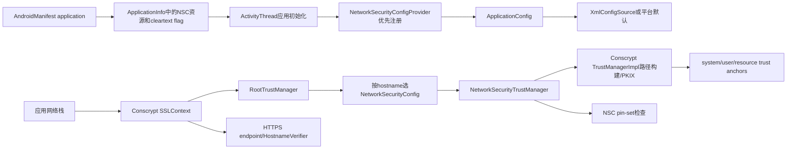
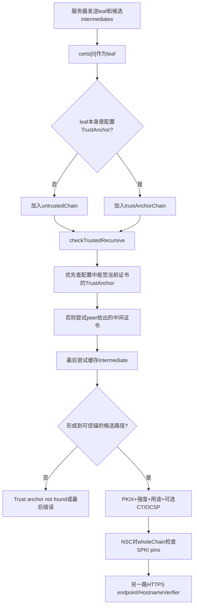
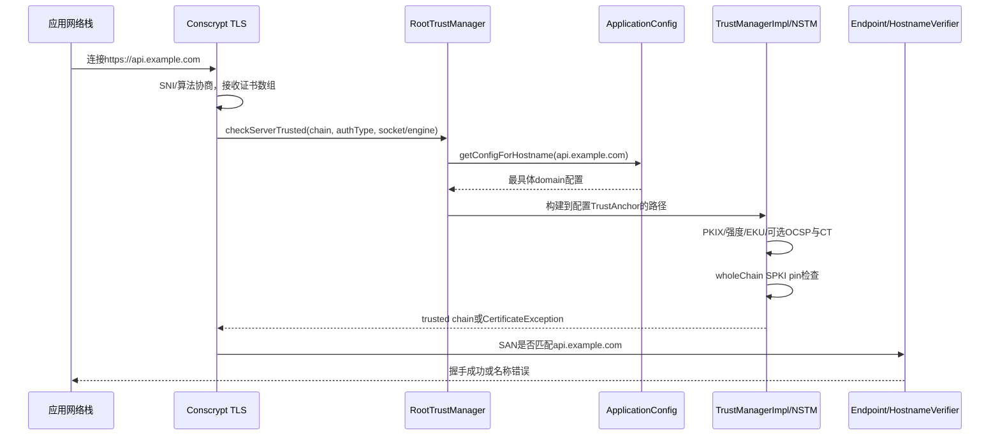

# 296 Android Network Security Config、TrustManager、Conscrypt证书链验证、用户CA、pinning与企业信任边界链

## 1. 本章目标

上一章解释证书怎样进入设备，本章回答更关键的问题：某个应用连接某个主机时，究竟选择哪套信任锚，Conscrypt怎样从服务器证书拼出可信路径，pinning何时执行，主机名何时验证，以及安装了企业用户CA后为什么有的应用仍拒绝连接。

## 2. Android 11版本边界

本文依据本地`android-11.0.0_r48`。主线是应用进程内的Network Security Config（NSC）、`RootTrustManager`、`NetworkSecurityTrustManager`和内置Conscrypt `TrustManagerImpl`；不引入后来平台的CT配置扩展、现代Cronet差异或厂商网络栈行为。

## 3. 先区分五个安全问题

TLS版本/密码套件决定通道算法；证书路径验证回答链是否到达受信锚；主机名验证回答证书是否属于目标主机；pinning进一步限制可接受公钥集合；明文策略回答是否允许绕开TLS。五者互补，任何一个通过都不能替代其他四个。

## 4. 本章讨论服务器认证

重点是应用验证HTTPS/TLS服务器。客户端证书选择和私钥签名属于上一章的mTLS客户端认证方向；`RootTrustManager`的domain规则只用于服务器信任检查，验证客户端链时使用默认配置。

## 5. 核心源码地图

```text
frameworks/base/core/java/android/security/net/config/
  NetworkSecurityConfigProvider.java  ManifestConfigSource.java
  XmlConfigSource.java  ApplicationConfig.java
  RootTrustManager.java  NetworkSecurityTrustManager.java
  *CertificateSource.java  CertificatesEntryRef.java  Pin.java
external/conscrypt/repackaged/common/src/main/java/com/android/org/conscrypt/
  TrustManagerImpl.java  TrustedCertificateIndex.java
```

## 6. 代码运行在哪里

NSC解析、域名匹配、证书路径构建和pin检查主要在发起连接的应用进程中执行，不是每次都向system_server询问。系统证书和用户证书是文件/存储源；信任库变化由系统通知应用进程清理缓存。

## 7. 为什么要在应用代码之前安装provider

`ActivityThread`创建应用Context后、加载应用代码前调用`NetworkSecurityConfigProvider.install(appContext)`。注释明确要避免应用提前创建TLS对象，从而缓存一套尚未受NSC约束的默认TrustManager。

## 8. AndroidNSSP插到第一位

Provider注册`TrustManagerFactory.PKIX`和`X509`别名，并通过`Security.insertProviderAt(..., 1)`成为最高优先级；若位置不是1直接抛异常。默认`TrustManagerFactory`因此能取得基于本应用配置的`RootTrustManager`。

## 9. ApplicationConfig是一进程默认配置

安装时用`ManifestConfigSource(context)`构造`ApplicationConfig`并设为静态默认实例，同时把`libcore.net.NetworkSecurityPolicy`换成按domain查询的实现。默认TrustManager和明文策略由同一配置源派生，但执行点不同。

## 10. 配置是惰性解析的

`ManifestConfigSource`缓存一份`ApplicationInfo`副本，首次请求default/domain config时才选择XML或平台默认；`XmlConfigSource`也在首次访问时解析资源。解析失败会抛RuntimeException，可能让应用启动或首次TLS初始化失败，而不是静默忽略错误配置。

## 11. 总体加载与握手图



## 12. Manifest的两个入口

`android:networkSecurityConfig="@xml/..."`把资源ID写入`ApplicationInfo.networkSecurityConfigRes`；`android:usesCleartextTraffic`写为flag。若资源ID非0，`ManifestConfigSource`选择XML配置；否则才用manifest cleartext flag与平台默认trust anchors构建配置。

## 13. 有XML时cleartext flag不再主导

一旦声明NSC资源，XML中的`base-config`/`domain-config`及其平台父配置决定明文策略。不要同时修改manifest flag和XML后只观察manifest值；源码分支只选择一套ConfigSource，不把两者逐项合并。

## 14. XML顶层结构

根是`network-security-config`，最多一个`base-config`、多个`domain-config`、最多一个`debug-overrides`。未知元素被跳过，但重复base/debug、重复domain、非法位置的domain/pin-set或缺少domain会抛解析错误。

## 15. Builder继承模型

每个domain builder可以继承外层domain或base；base再继承平台默认。cleartext、HSTS、pin-set和trust-anchor列表分别寻找最近一个显式值。尤其是子层一旦声明自己的`trust-anchors`，就使用这份列表，而不是自动与父层相加。

## 16. 平台默认系统CA

`NetworkSecurityConfig.getDefaultBuilder()`始终加入`SystemCertificateSource`，且`overridesPins=false`。系统源读取`$ANDROID_ROOT/etc/security/cacerts`，同时查看当前用户`cacerts-removed`标记，从而排除用户在设置中停用的系统根。

## 17. 用户CA的目标SDK分界

Android 11源码只对`targetSdkVersion <= M`且非privileged应用默认加入`UserCertificateSource`。目标API 24及以上应用默认不信任用户安装CA，必须在NSC中显式`<certificates src="user"/>`。

## 18. privileged应用边界

运行在Android 11上的privileged应用不通过这条旧兼容默认信任用户CA，即使target较旧。系统组件若需要企业CA应显式配置自己的信任来源，不能依赖普通三方应用的历史兼容规则。

## 19. 用户CA文件源

`UserCertificateSource`指向当前用户配置目录下`cacerts-added`。工作资料和父用户具有不同目录；上一章在某用户安装企业CA，不会让另一个用户内的应用自动看到它。

## 20. resource证书源

`<certificates src="@raw/roots"/>`由`ResourceCertificateSource`解析资源中的一个或多个X.509证书，并建立内存索引。资源随APK发布、运行期不变化，适合私有根或受控中间锚，但更新它需要发布新APK。

## 21. 自定义锚不必是自签根

PKIX trust anchor可以是受控中间证书，路径在它处终止，不要求必须包含它的上级自签根。这样能缩小信任范围，但锚轮换、有效期与签发层级变化需要更谨慎的兼容设计。

## 22. 显式trust-anchors会替换继承值

若base只写`<certificates src="user"/>`，它不会自动继续包含system，因为Builder发现本层已有列表便不再取父列表。若企业需求是两者都信任，必须在同一`trust-anchors`内同时列出`system`和`user`。

## 23. domain-config可嵌套

只有domain-config内部允许再嵌domain-config。子配置继承父配置未设置的项，可以对更具体域收紧cleartext、换锚或加pins。解析器先建立父子Builder关系，最后等base父链就绪后统一build。

## 24. domain必须唯一

XML解析将domain去空白并转小写，`seenDomains`禁止同一domain出现两次，不论`includeSubdomains`是否不同。若想表达不同子域策略，应写更具体的子域，而不是重复同一个名字企图依靠顺序覆盖。

## 25. 运行时选最具体规则

`ApplicationConfig.getConfigForHostname()`先做精确匹配，否则在`includeSubdomains=true`的后缀规则中选择hostname最长者。没有匹配才回base/default，声明顺序不是优先级。

## 26. 后缀匹配有点边界

源码不仅检查`endsWith(domain)`，还要求前一个字符是`.`，所以`evil-example.com`不会匹配`example.com`。调用hostname会转小写并去掉末尾`.`；以`.`开头则抛`IllegalArgumentException`。

## 27. domain选择不是主机名验证

domain匹配只选择“要用哪套trust anchors、pins与cleartext规则”。即使`api.example.com`选中了正确配置，证书仍需在另一步证明SAN覆盖`api.example.com`；配置domain不会自动给证书添加名称。

## 28. IP与国际域名边界

`ApplicationConfig`本身主要做字符串小写、末尾点和标签边界匹配，没有在此显式完成IDN转换。网络栈交给它的peerHost格式很重要；IP证书则需匹配iPAddress SAN，不能用DNS通配符代替。

## 29. 默认明文规则

平台默认builder在target API 28以下允许明文，在target 28及以上拒绝；instant app始终不采用旧默认允许。显式XML仍可按base/domain配置true或false，因此target只是未显式配置时的默认来源。

## 30. 全局查询为何取最严格

`ApplicationConfig.isCleartextTrafficPermitted()`只要任一domain配置禁止就返回false，表达“是否对所有网络通信都允许”。按host查询才选具体domain；库若只调用无参方法，可能比host级策略更保守。

## 31. 明文策略不是内核防火墙

`NetworkSecurityPolicy`文档明确是best effort。平台HTTP/FTP栈、DownloadManager、MediaPlayer等可拒绝明文请求，三方库应主动查询；原始`java.net.Socket`无法判断载荷是否明文，不会被这个布尔值统一阻断。

## 32. 禁止HTTP不等自动升级HTTPS

cleartext=false通常使遵守策略的组件拒绝请求，不保证把`http://`改写成`https://`。服务器重定向也只能在第一次HTTP已被允许和发出后发生；安全设计应直接使用HTTPS URL。

## 33. hstsEnforced的r48边界

XML解析并保存`hstsEnforced`，但本地framework搜索只见配置类和测试读取，未形成一条通用应用网络栈强制HSTS的执行链。不能仅因XML设true就宣称所有Socket/HTTP实现自动预加载或升级HSTS。

## 34. shared进程配置冲突

同一进程加载另一个应用时，`handleNewApplication()`比较cleartext总值；若不一致且任一含per-domain规则就抛异常，否则选择较宽松、允许cleartext的配置。共享进程会削弱包级隔离，是分析配置时必须检查的架构边界。

## 35. 自定义SSLContext可能绕开NSC

默认PKIX工厂由最高优先级AndroidNSSP提供；但应用若显式构造自定义TrustManager数组并传给`SSLContext.init()`，验证逻辑就由它控制。NSC无法修复“信任所有证书”的自定义实现，代码审计仍要搜索SSLContext、TrustManager与HostnameVerifier。

## 36. RootTrustManager负责路由

它不自己做PKIX，而是从SSLSocket/SSLEngine的handshake session取peerHost，调用`ApplicationConfig.getConfigForHostname(host)`，再把链交给该config的`NetworkSecurityTrustManager`。

## 37. 无hostname重载的限制

若应用配置含per-domain规则，却调用旧`checkServerTrusted(chain, authType)`，RootTrustManager会抛`CertificateException`，因为无法知道该选哪套规则。正确的网络栈必须使用带Socket、Engine或hostname的路径。

## 38. 客户端链检查用default

`checkClientTrusted()`无论是否存在domain规则，都用空hostname得到default config。因为domain规则描述应用连接哪个服务器，不适合拿来决定服务器端验证哪个客户端证书。

## 39. NetworkSecurityTrustManager的适配

每套NetworkSecurityConfig创建一个NSTM。它构造空KeyStore，再把`TrustedCertificateStoreAdapter(config)`交给Conscrypt `TrustManagerImpl`，让路径构建时按配置查询动态锚，而不是把全部证书复制到普通KeyStore。

## 40. acceptedIssuers单独实现

Conscrypt delegate的空KeyStore无法给出配置锚，NSTM因此遍历`NetworkSecurityConfig.getTrustAnchors()`生成accepted issuers并缓存。返回时clone数组，避免调用方直接改缓存引用。

## 41. trust store变化怎样传播

系统通过应用线程Binder回调`handleTrustStorageUpdate()`；ApplicationConfig遍历已初始化的default/domain configs，清证书源缓存、锚集合、accepted issuers和Conscrypt索引。尚未初始化的配置不解析，等首次使用再读新状态。

## 42. 更新不重验现有连接

清缓存影响后续信任决策；已经完成握手的TLS连接不会因用户删除CA立即被强制断开，session resumption和连接池也可能延长状态可见时间。高风险撤销应配合关闭连接、清池或重启相关会话。

## 43. DirectoryCertificateSource索引方式

系统/用户CA文件名使用subject name旧hash加`.0`、`.1`等序号。查issuer时从hash.0连续扫描，核对X500Principal，再用公钥签名验证确认候选；目录全量枚举则惰性缓存证书集合。

## 44. 缺号会停止连续扫描

`findCerts()`遇到第一个不存在的`hash.index`就break，因此存储布局必须维持TrustedCertificateStore约定的连续命名。普通应用不应手动操作这些目录，否则可能让存在的后续条目无法被索引路径发现。

## 45. 证书路径的输入

TLS peer提供一个证书数组，Conscrypt要求非空，约定`certs[0]`是叶子；后续证书被当成候选bag，并不要求严格排列。缺失中间证书时还可能使用进程内先前缓存的中间证书补链。

## 46. TrustManager总链路图



## 47. leaf也可能直接是锚

若leaf的subject和public key已在配置锚中，Conscrypt把它放入trusted chain，但仍继续尝试构建更完整路径，以便pinning等验证看到全链。信任某叶子资源本质上是把它当anchor，不等同公钥pin的轮换语义。

## 48. 递归先检查黑名单

每轮对当前证书调用`checkBlacklist()`，整链验证前也再次检查wholeChain。公钥黑名单命中会抛CertificateException；这是平台额外拒绝层，不因证书数学签名有效而放行。

## 49. 优先寻找可信issuer

递归先从配置的CertificateSource查找能验证当前证书签名的所有TrustAnchor，并按证书优先级排序尝试。找到anchor也不一定立刻停止，因为该anchor可能非自签，还可向上构造更完整trusted chain。

## 50. peer中间证书的早期筛选

对`certs[1..]`候选先比较当前issuer DN与候选subject DN，再检查候选有效期和强度，加入untrustedChain递归。最终PKIX才完整验证签名、Basic Constraints、路径约束等，名称相等从来不是信任证明。

## 51. 缓存中间证书的容错

若peer没发必要中间证书，Conscrypt最后查询`intermediateIndex`；此前成功路径中的非叶子untrusted证书会被加入该索引。于是同进程访问过另一站点后，错误配置服务器可能暂时“能用”，冷启动又失败。

## 52. 缓存不是TrustAnchor

缓存中间证书仍加入untrustedChain，必须继续构造到当前配置的可信锚并通过PKIX。它只补材料，不把以前见过的中间证书自动升级为信任根。

## 53. 防环集合

递归维护`used`证书集合，尝试某分支前加入、失败回溯时移除，避免交叉签发或错误链造成无限循环。路径构建是搜索问题，服务端证书顺序并不能强制客户端采用某一条链。

## 54. 多路径选择的含义

同一叶子可能经不同中间证书到不同根；Conscrypt逐分支尝试，第一条完整验证成功的路径成为wholeChain。NSC pins是在实际选中链上检查，因此跨签和根变更可能改变pin命中结果。

## 55. 没有锚时的错误

所有peer、中间缓存与配置锚都无法形成路径时，构造`CertPathValidatorException("Trust anchor for certification path not found")`。具体异常不保证是所有候选中“最严重”的原因，源码注释禁止应用基于错误文案提供点击绕过。

## 56. verifyChain先拼wholeChain

wholeChain是`untrustedChain + trustAnchorChain`，从leaf到最终可信锚。它用于平台pin manager、黑名单、CT和NSC pin；PKIX验证的CertPath则排除作为TrustAnchor的那部分。

## 57. PKIX至少要有一个锚

`trustAnchorChain`为空立即失败。证书自签、有效或在服务端发送链尾都不让它自动可信；只有被当前应用配置选中的system/user/resource来源才能成为anchor。

## 58. PKIX验证哪些事实

JCA validator检查签名链、证书有效期、Basic Constraints、pathLen、critical extensions、名称约束和算法规则等；Conscrypt还运行`ChainStrengthAnalyzer`。不能用手工“逐张verify公钥”替代完整PKIX。

## 59. 叶子Extended Key Usage

自定义`ExtendedKeyUsagePKIXCertPathChecker`只检查leaf。服务器认证允许anyExtendedKeyUsage、serverAuth和历史SGC OID；客户端认证允许anyExtendedKeyUsage或clientAuth。CA签出用途不匹配的证书会被拒绝。

## 60. 强度检查的层次

候选中间在递归加入前检查有效期与证书强度，完整untrustedChain在verify时再整体检查。平台最低算法/密钥强度会随实现版本变化，企业不能只把“链到私有根”当作忽略弱RSA或弱签名的理由。

## 61. TrustAnchor自身的特殊性

PKIX把第一个可信锚作为信任起点，通常不会像普通路径证书一样验证其自签名可信性；信任来自配置本身。把错误证书放入resource trust anchors等于显式授予它根地位。

## 62. 默认不在线做完整撤销

源码创建`PKIXParameters`后调用`setRevocationEnabled(false)`，不会为每条链主动联网下载CRL/OCSP。若TLS session携带stapled OCSP，代码可把响应交给revocation checker处理endpoint；这不等于全链实时在线撤销保障。

## 63. stapled OCSP的边界

Conscrypt从handshake session取第一份status response，映射到endpoint证书。没有响应就跳过这条设置；响应过期、签名或状态仍由checker判断。服务器不staple时，默认路径不会自动补一次网络查询。

## 64. Certificate Transparency钩子

TrustManagerImpl能在平台要求特定host时验证TLS/OCSP/证书内SCT。但Android 11的`ConfigNetworkSecurityPolicy.isCertificateTransparencyVerificationRequired()`直接返回false，NSC XML本身没有一个通用“开启CT”字段；不要把`hstsEnforced`误当CT。

## 65. 路径成功后缓存中间证书

只有validator成功后，untrustedChain索引1以后的证书才进入`intermediateIndex`。失败链不会污染成功缓存；trust storage更新会重置相关可信索引，但中间缓存的生命周期仍应按具体TrustManager实例理解。

## 66. NetworkSecurityTrustManager再做NSC pin

delegate返回可信wholeChain后，NSTM调用自己的`checkPins(trustedChain)`。这套静态NSC pin与Conscrypt通用`CertPinManager`是不同层；构造NSTM时后者传null，实际应用配置pins由NSTM执行。

## 67. pin的对象是SPKI

每个证书取`cert.getPublicKey().getEncoded()`，计算配置算法摘要。也就是SubjectPublicKeyInfo哈希，不是整张证书DER哈希；同一公钥重新签发证书仍可命中，换key则需备用pin。

## 68. Android 11只支持SHA-256

`Pin.isSupportedDigestAlgorithm()`只接受`SHA-256`，摘要必须恰好32字节，XML中用Base64表达。写SHA-512、十六进制或长度错误会在配置解析阶段失败，而不是握手时忽略。

## 69. 多pin是OR关系

代码遍历wholeChain每张证书和每种算法，只要计算结果存在于pin集合就返回成功。多个pins不是要求全部同时出现；正确做法是当前key pin加至少一个已准备好的备份key pin。

## 70. pin可命中链上任何证书

叶子、中间或锚的SPKI任一命中就通过。pin叶子控制最细但轮换频繁；pin中间相对稳定但信任范围更宽；pin根更宽且可能受跨签路径影响。必须按PKI运营能力选择层级。

## 71. expiration会关闭整套pin

若当前时间大于`pin-set expiration`，`checkPins()`直接返回，不再要求任何pin。expiration是灾难恢复逃生窗，不是自动下载新pin；设备时钟异常也会影响判断。

## 72. expiration不是证书有效期

pin expiration只控制附加pin约束，PKIX仍会检查证书NotBefore/NotAfter。pin过期后连接并非无验证，而是退回该domain配置的普通CA路径信任。

## 73. overridePins机制

每个CertificatesEntryRef携带`overridesPins`。实际路径最后的TrustAnchor若标记true，NSTM跳过pin检查；debug anchors默认true，便于开发代理证书调试，同时生产非debug构建不会加载它们。

## 74. 同一锚来自多源时的优先

NetworkSecurityConfig先把`overridesPins=true`的entry排在前面，再按证书去重，保留首次出现的TrustAnchor。因此同一证书同时来自override与非override源时，最终会采用可绕pin的属性。

## 75. debug-overrides只看debuggable

XML中的debug-overrides只有APK带`FLAG_DEBUGGABLE`时解析；否则整段跳过。若debuggable且主XML未含该段，还会尝试同名`_debug` XML资源。它依赖构建标志，不依赖USB调试开关。

## 76. debug锚如何加入各层

解析器把debug certificates加入platform default、base和显式声明anchors的domain builder；没有本地anchors的子层从父层继承已加入的集合。默认`overridePins=true`，所以调试CA可让代理连接绕过静态pins。

## 77. 生产包误设debuggable的风险

若生产签名包仍为debuggable，debug-overrides也会生效，企业代理或测试CA可能扩大信任并绕过pin。发布审计应检查最终merged manifest与签名产物，不只看某个源码flavor。

## 78. 用户CA与pin的关系

显式信任`src="user"`且默认`overridePins=false`时，经用户CA构建的链仍必须命中domain pins；只有被标记override的锚才绕过。安装企业CA本身不会天然击穿应用pinning。

## 79. 企业TLS代理为何有时失败

目标API 24+应用若未信任user源，路径阶段就找不到企业代理CA；即便显式信任，生产pin仍可能失败；即便两者通过，代理证书SAN仍要匹配目标主机。三道门解释了“浏览器可用、某App不可用”的常见现象。

## 80. 主机名验证是独立阶段

路径验证证明“这个公钥证书由受信锚签出且用途有效”，并不证明它属于当前host。攻击者拥有同一CA签出的另一个域证书时，若跳过hostname检查，仍可能被错误接受。

## 81. Socket/Engine endpoint identification

Conscrypt带Socket/SSLEngine的`checkTrusted()`读取`SSLParameters.endpointIdentificationAlgorithm`；只有值忽略大小写等于`HTTPS`时，调用hostname verifier检查handshake session。未设置该算法时，TrustManager路径本身不主动做名称匹配。

## 82. HttpsURLConnection的HostnameVerifier

`HttpsURLConnection`通常在HTTPS语义层使用默认或实例级`HostnameVerifier`核对peerHost与证书SAN。应用若设置一个永远返回true的verifier，即使TrustManager仍正确验证CA，也会失去域名身份保护。

## 83. String hostname重载的微妙点

`TrustManagerImpl.checkServerTrusted(chain, authType, hostname)`把hostname用于路径相关host上下文、CT/pinning，但直接进入底层`checkTrusted`，不经过检查`SSLParameters`的分支。因此不能仅凭参数名就断言它完成了HTTPS SAN验证。

## 84. X509TrustManagerExtensions边界

Android扩展可调用带hostname的信任检查以选domain配置并得到完整可信链，适合网络栈做清理/验证；调用方仍需确认自身API契约是否另做hostname verification。安全审计应追到最终SAN比较，而不是停在“传了host字符串”。

## 85. DNS SAN与IP SAN

连接DNS名时应匹配dNSName SAN，连接IP字面量时应匹配iPAddress SAN。把`CN=10.0.0.1`或`DNS:10.0.0.1`当IP SAN可能被正确实现拒绝；企业私有证书模板必须按访问形式签发。

## 86. 通配符边界

典型HTTPS verifier只允许通配符覆盖单个最左标签，例如`*.example.com`可覆盖`api.example.com`，不应覆盖`a.b.example.com`或裸`example.com`。NSC的`includeSubdomains`与证书通配符是两个独立机制。

## 87. SNI也不是hostname验证

客户端SNI帮助服务器选择要发送的证书；服务器选择正确与否仍需客户端验证SAN。无SNI、代理或多租户可能让服务器发错证书，路径可信仍会在hostname阶段失败。

## 88. 一次HTTPS成功的完整门序

网络栈先建立TCP/TLS、协商算法并收证书；TrustManager按host选config、构路径、PKIX、可选CT/OCSP、NSC pins；endpoint/HostnameVerifier核对SAN；应用层再验证HTTP状态、账户和响应内容。实际内部顺序可能交织，但安全条件缺一不可。

## 89. 握手决策时序图



## 90. “自签证书”不是单一错误

服务器自签leaf若未被配置为resource/user/system anchor，路径失败；若应用资源显式把它作为anchor，路径可成功，但仍需SAN、有效期、用途和算法满足要求。自签只描述签名结构，不直接等于可信或不可信。

## 91. 缺中间证书的现象

服务器只发leaf、设备无对应中间缓存时会找不到anchor；同进程访问过其他站点缓存中间后可能成功。正确修复是在服务器发送完整必要中间链，而不是让用户反复重启或额外信任中间为根。

## 92. 私有根安装后仍失败的矩阵

依次检查：CA是否装在正确用户；应用target是否默认信任user；NSC是否替换了system/user列表；domain是否匹配；代理叶子SAN/EKU是否正确；算法是否过弱；pin是否命中；hostname verifier是否执行；连接池是否仍复用旧结果。

## 93. 证书变更广播与缓存

KeyChain发信任库变化后，system_server通知应用线程刷新。DirectoryCertificateSource清全量集合，NetworkSecurityConfig清锚，TrustManagerImpl重置trusted index。resource source不变，`handleTrustStorageUpdate()`为空实现。

## 94. 多进程应用分别初始化

每个应用进程都有自己的provider、ApplicationConfig和证书缓存。主进程收到/处理刷新不等远程service进程同步刷新完成；排障要确定真正建立TLS连接的是哪个进程。

## 95. WebView与独立网络栈

NetworkSecurityPolicy文档说明WebView对target 26+遵守cleartext flag，但具体证书验证可能由WebView/Chromium栈实现并读取平台配置。不要把Java Conscrypt某个方法的调用链机械等同于所有WebView或native库请求。

## 96. Native TLS库边界

应用自带OpenSSL/BoringSSL并直接读socket时，不会自动使用Java AndroidNSSP TrustManager。它必须自行加载合适锚、验证hostname/pins并查询cleartext策略；否则manifest XML只是声明，并非内核级强制。

## 97. 第三方HTTP库

使用平台`SSLSocketFactory`和默认TrustManager的库通常继承NSC；显式注入TrustManager、证书Pinner或native transport的库可能增加、替换或绕开规则。版本升级时应核对实际transport，而不是只看调用API名称。

## 98. “Trust all”代码的危害

空实现`checkServerTrusted()`接受任意链；恒true HostnameVerifier接受任意主机；两者任一都削弱身份验证，二者组合相当于只加密而不认证对端。debug临时代码若进入生产，比漏配企业CA更危险。

## 99. 不要做错误点击继续

Conscrypt注释指出候选路径可能有多种失败原因，抛出的具体错误不保证最严重。应用不应看到“过期”或“找不到锚”就给用户一个通用继续按钮，因为实际可能同时存在hostname、弱算法或pin失败。

## 100. pinning的运营风险

若只pin当前叶子key，紧急换钥后旧APK全部断网；若pin太高层根，约束价值很小。至少准备离线保存的备份key pin、灰度验证、新旧并存窗口、远程可观察失败率和可控expiration策略。

## 101. pin不是CA替代品

代码先完成可信路径再检查pins。即便SPKI匹配，若证书过期、SAN错误、用途不对或链不到配置锚，仍失败；NSC pin不是“无CA也接受这个公钥”的裸公钥模式。

## 102. resource anchor与pin如何选

内网私有PKI可只信resource根，限制最清晰；若还要访问公共网络，可在base列system、对内网domain改resource或同时列出；pin用于进一步限制合法CA误签风险。不要把所有内部根加到全局base而扩大无关域信任。

## 103. 企业TLS代理的合理作用域

若业务必须做审计代理，可只对明确domain信任user/代理root，并避免覆盖高价值pin域；工作资料内安装CA只影响该用户。技术配置之外还需用户告知、隐私与合规治理。

## 104. cleartext与私有IP

NSC不会因目标是`10.0.0.0/8`就自动允许HTTP；domain规则以hostname字符串匹配，也不提供CIDR语法。企业内网也应优先TLS；确需例外时应尽量用具体主机而非全局base允许。

## 105. 配置审计顺序

先读最终merged Manifest取得target、debuggable、NSC资源和process；再画base/domain继承树；列每个domain的有效anchors、overridePins、pins、cleartext；最后搜索自定义SSLContext/TrustManager/HostnameVerifier与native网络库，才能得到真实结论。

## 106. 运行排障证据

收集目标host、实际连接IP、进程、peer证书全链、选中anchor、SAN、有效期、算法、NSC domain与pin摘要、异常cause链。避免上传私钥、会话secret或敏感HTTP内容；证书公钥虽非秘密，也可能暴露内部组织信息。

## 107. 使用openssl的边界

macOS `openssl s_client`可观察服务器发送链、SNI和证书字段，但它使用Mac信任库，不会复现Android应用的targetSDK、用户CA、NSC domain和pin逻辑。它是服务器证据，不是Android最终判定器。

## 108. 常见误解一

“手机设置里显示企业CA，所以所有App都信任”错误。Android 11上target 24+默认排除user CA，App还可用resource anchors或自定义TrustManager；工作资料和父用户也隔离。

## 109. 常见误解二

“证书链有效，所以域名一定正确”错误。PKIX路径与hostname验证是不同代码路径；尤其带String hostname的TrustManager重载可能只用host选NSC/pin/CT上下文，并不自动执行SAN比较。

## 110. 常见误解三

“配置了pins就不需要CA和有效期”错误。NSTM只在delegate返回可信wholeChain之后运行pin，pin只是附加约束；expiration还可能让整套pin自动失效并退回普通CA信任。

## 111. 最小心智模型

记住：Manifest/XML先为host选择策略；CertificateSource定义谁能当锚；Conscrypt搜索并PKIX验证路径；NSTM对实际wholeChain做SPKI pin；HTTPS层核对SAN；cleartext策略由能理解协议的网络组件尽力执行。每层失败都应在本层修复。

## 112. macOS只读练习一：手算默认配置

```bash
sed -n '150,230p' frameworks/base/core/java/android/security/net/config/NetworkSecurityConfig.java
sed -n '45,110p' frameworks/base/core/java/android/security/net/config/ManifestConfigSource.java
```

在纸上填写四格：target 23普通应用、target 23 privileged应用、target 24普通应用、target 30普通应用，各自默认system/user CA和cleartext值。再加入instant app条件，解释哪些结论由平台版本、target或manifest/XML决定。

## 113. macOS只读练习二：手算domain继承

```bash
sed -n '210,390p' frameworks/base/core/java/android/security/net/config/XmlConfigSource.java
sed -n '35,115p' frameworks/base/core/java/android/security/net/config/ApplicationConfig.java
```

设计base信system、`example.com`含子域信resource、`api.example.com`额外pin的三层XML草图；分别判断example.com、a.example.com、api.example.com、x.api.example.com与evil-example.com选哪层，并说明子层声明anchors是否保留父层。

## 114. macOS只读练习三：追一条证书路径

```bash
sed -n '480,710p' \
  external/conscrypt/repackaged/common/src/main/java/com/android/org/conscrypt/TrustManagerImpl.java
sed -n '35,190p' \
  frameworks/base/core/java/android/security/net/config/NetworkSecurityTrustManager.java
```

假设peer发送leaf和两个交叉签中间证书，配置中有两个可达根。按源码列出anchor、peer candidate、cached intermediate的尝试顺序，并标记PKIX、wholeChain和NSC pins各自看到哪些证书。

## 115. macOS只读练习四：区分hostname与pin

```bash
sed -n '300,440p' \
  external/conscrypt/repackaged/common/src/main/java/com/android/org/conscrypt/TrustManagerImpl.java
rg -n "HostnameVerifier|endpointIdentificationAlgorithm|checkPins" \
  external/conscrypt/repackaged/common/src/main/java/com/android/org/conscrypt \
  frameworks/base/core/java/android/security/net/config
```

对四种情况写结论：链可信但SAN错、SAN对但无锚、锚与SAN都对但pin错、三者都对但自定义HostnameVerifier恒true。明确哪一层拒绝，以及恒true究竟绕过了什么、没有绕过什么。

## 116. 自测题

1. target 30为何默认不信用户CA？ 2. domain规则为何不等hostname验证？ 3. pin为何是SPKI而非整证书？ 4. debug anchor如何绕pin？ 5. 缺中间证书为何可能冷启动失败、热进程成功？ 6. cleartext=false为何挡不住任意原始Socket？

## 117. 自测题答案

N+应用必须显式选择user源；domain只选config，SAN另验；SPKI允许同key续证；debug entry默认`overridesPins=true`；成功连接缓存过中间证书可补服务器漏发；原始Socket不知道载荷协议，NSC cleartext是高层组件best-effort策略。

## 118. 复读检查清单

复读逐项确认：平台/target/privileged三个版本维度未混淆；XML anchors是替换继承而非默认相加；user/profile目录隔离；peer尾部证书是候选bag；中间缓存不升格为anchor；PKIX默认不主动在线撤销；pin在可信链后执行；String host重载未夸大为SAN验证；明文策略未夸大为防火墙。

## 119. 本章复读后修正

初稿最容易出现三处错误，已按r48源码修正：第一，target API 24+才默认排除用户CA，而非“Android 11所有App都不信”；第二，`checkServerTrusted(..., String hostname)`使用host选择策略和做host相关附加检查，但不会经过`SSLParameters=HTTPS`的SAN分支；第三，pin expiration后只是跳过pin，PKIX、锚和hostname验证仍继续，不能写成TLS验证完全关闭。

## 120. 下一章

下一章进入Android TLS握手、Conscrypt NativeSsl、SSLSocket/SSLEngine、TLS 1.3、session resumption、ALPN与客户端证书KeyManager链：把本章的信任决策放回完整网络握手时序，继续追私钥签名和连接复用边界。
