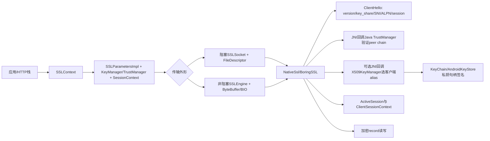
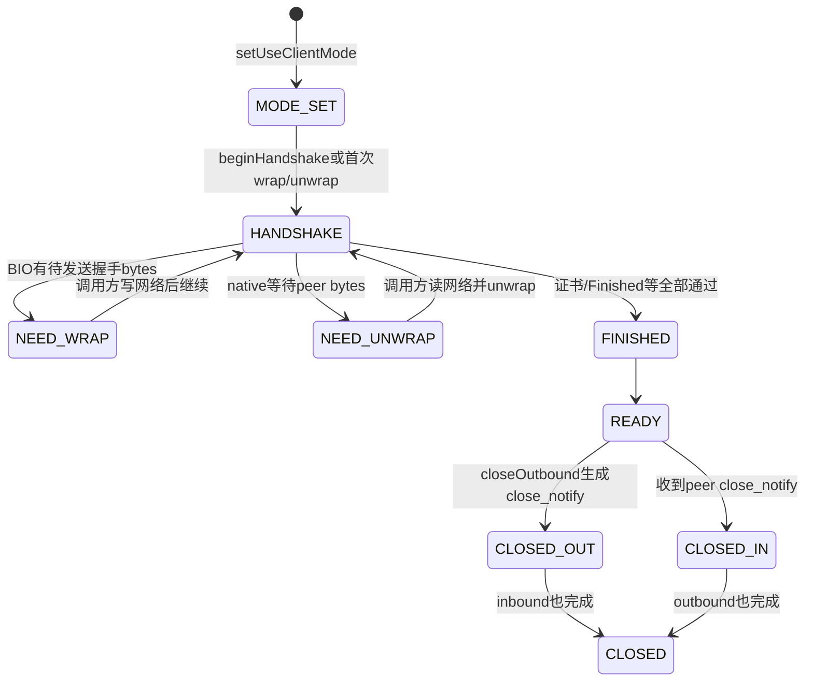
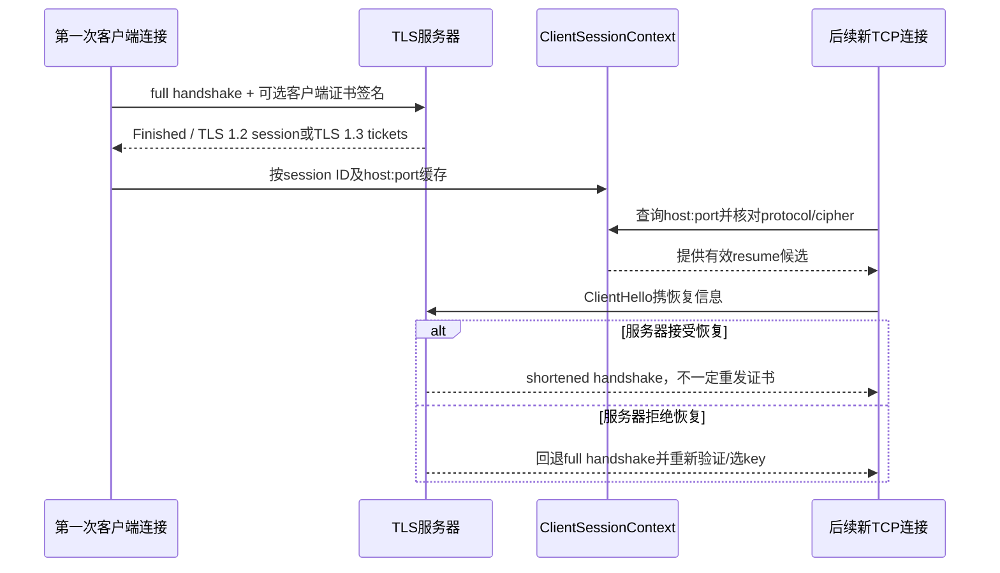

# 297 Android TLS握手、Conscrypt NativeSsl、SSLSocket/SSLEngine、TLS 1.3、session resumption、ALPN与客户端证书KeyManager链

## 1. 本章目标

本章把上一章的TrustManager放回完整TLS握手：Java `SSLContext`怎样产生参数，Conscrypt如何用NativeSsl/BoringSSL驱动协议，native握手怎样回调Java验证服务器证书和选择客户端证书，阻塞SSLSocket与非阻塞SSLEngine怎样搬运record，最后解释ALPN、session ticket和mTLS撤销延迟。

## 2. Android 11版本边界

本文只依据本地`android-11.0.0_r48`内置repackaged Conscrypt。源码路径以`com.android.org.conscrypt`为准；独立更新版Conscrypt、厂商补丁、Cronet和新Android版本可能改变默认协议、cipher、TLS 1.3 ticket与引擎实现。

## 3. TLS不只是“把HTTP加密”

握手协商协议版本与算法，认证服务器并可认证客户端，建立共享traffic secrets；record层随后对应用数据做机密性与完整性保护。TLS不能自动证明HTTP业务账户正确，也不能阻止终端在加密前后泄露明文。

## 4. 本章四层对象

`SSLContext`持KeyManager、TrustManager和session contexts；`SSLSocket`或`SSLEngine`代表一次连接；`NativeSsl`包装native SSL指针并桥接回调；`SSLSession`是协商结果视图。不要把Context、连接和可恢复session当成同一生命周期。

## 5. 核心源码地图

```text
external/conscrypt/repackaged/common/src/main/java/com/android/org/conscrypt/
  OpenSSLContextImpl.java  SSLParametersImpl.java  NativeSsl.java
  ConscryptFileDescriptorSocket.java  ConscryptEngine.java
  NativeCrypto.java  ClientSessionContext.java  NativeSslSession.java
  KeyManagerImpl.java  TrustManagerImpl.java  ActiveSession.java
external/conscrypt/common/src/jni/main/cpp/conscrypt/native_crypto.cc
packages/apps/KeyChain/tests/.../KeyChainTestActivity.java
```

## 6. SSLContext.init三类输入

调用方可传`KeyManager[]`、`TrustManager[]`和`SecureRandom`。null key managers触发默认X509KeyManager，null trust managers触发上一章由AndroidNSSP提供的默认TrustManager；显式数组只取其中首个支持的X509/PSK实现。

## 7. 传入SecureRandom的r48边界

`SSLParametersImpl`注释写明忽略调用方传入的SecureRandom，native代码直接使用`/dev/urandom`。因此注入一个固定Java随机数不能让握手随机可重现，也不应据此测试生产TLS密码学。

## 8. 默认KeyManager不是KeyChain选择器

默认KeyManagerFactory以null KeyStore初始化一个普通默认store，通常没有用户KeyChain中被grant的企业客户端身份。应用需要mTLS时，不能期待握手自动弹出系统证书选择器；应主动取得alias并注入能访问KeyChain的X509KeyManager。

## 9. 默认TrustManager来自NSC

`createDefaultX509TrustManager()`取默认算法PKIX、`TrustManagerFactory.init(null)`；由于AndroidNSSP优先级最高，会返回按本应用Network Security Config路由的RootTrustManager。显式自定义TrustManager则改变这条路径。

## 10. SSLParametersImpl是连接模板

它保存enabled protocols、TLS 1.0—1.2 cipher列表、client/server mode、need/want client auth、session creation、endpoint identification、SNI、ALPN、ticket、CT/OCSP等。Socket/Engine通常拿到clone，握手开始后多数参数不能再安全改变。

## 11. 总体握手跨层图



## 12. r48支持的协议名

NativeCrypto列出TLSv1、TLSv1.1、TLSv1.2、TLSv1.3；SSLv3被作为obsolete过滤。默认`TLS`/TLSv1.3 Context的协议数组仍包含1.0—1.3，不等于每次使用旧版，正常协商会选双方共同支持的最高版本。

## 13. “支持”不等于“应启用”

企业安全策略通常应淘汰TLS 1.0/1.1，但本文记录的是r48源码默认而非现代建议。设备安全补丁、应用显式参数或服务端最低版本都可能收紧；排障必须读取连接实际`SSLSession.getProtocol()`。

## 14. setEnabledProtocols的检查

null数组抛异常，SSLv3从输入中被过滤，其余名称交`NativeCrypto.checkEnabledProtocols()`验证。若调用方只传SSLv3，初始化握手时会提示没有enabled protocols，而不是偷偷恢复默认TLS。

## 15. TLS 1.3三组cipher suite

r48列出`TLS_AES_128_GCM_SHA256`、`TLS_AES_256_GCM_SHA384`和`TLS_CHACHA20_POLY1305_SHA256`。TLS 1.3把AEAD+HKDF hash与证书签名/密钥交换拆开，名称不再包含RSA/ECDHE认证组合。

## 16. TLS 1.3 cipher不可逐个定制

`SSLParametersImpl.setEnabledCipherSuites()`过滤掉调用方传入的TLS 1.3 suites，只保存1.0—1.2列表；注释明确TLS 1.3三组始终启用，只要TLSv1.3协议启用。想禁用某一组不能靠这个Java API逐项删除。

## 17. getEnabledCipherSuites为何又看得到它们

若enabled protocols含TLSv1.3，getter把固定TLS 1.3 suites拼在旧列表前后返回。字段不保存它们但查询能看到，不能据内部字段为空误判TLS 1.3没有cipher。

## 18. cipher与证书算法不是一回事

TLS 1.3 cipher只决定record AEAD与HKDF hash；服务器/客户端证书可用RSA或EC签名方案单独协商。看到`TLS_AES_128_GCM_SHA256`不能推断服务器证书一定是RSA或ECDSA。

## 19. TLS 1.2组合更紧

TLS 1.2 suite名称通常同时表达key exchange、认证、record cipher与MAC，例如ECDHE_RSA与AES_GCM。NativeCrypto按启用协议将Java名字转OpenSSL名字，SCSV只是信号值，不是真正数据加密suite。

## 20. ClientHello包含什么

客户端native握手发送支持版本、random、cipher、extensions，并可含key_share、signature algorithms、SNI、ALPN、session ID/ticket等。具体字段随版本和参数变化；Java层先把这些开关写入native SSL对象。

## 21. SNI设置条件

客户端`parameters.getUseSni()`为true且`AddressUtils.isValidSniHostname(hostname)`时调用`SSL_set_tlsext_host_name`。IP字面量或非法host不会发送SNI；服务器多租户可能因此返回默认站点证书。

## 22. SNI不是服务器认证

SNI只告诉服务器想访问哪个名字，帮助其选择证书和虚拟主机；客户端仍需TrustManager和HostnameVerifier验证返回证书。Android 11这里没有ECH主线，SNI通常在ClientHello可被路径观察者看到。

## 23. ALPN的用途

Application-Layer Protocol Negotiation在TLS握手中选择`h2`、`http/1.1`等上层协议，避免先连TLS再猜协议。它不替代证书验证，也不决定HTTP权限；只是双方对加密通道内后续字节格式达成一致。

## 24. ALPN编码

`setApplicationProtocols(String[])`经SSLUtils编码成连续的1字节长度前缀字符串。空协议、单项超过255字节、无法编码或重复策略应由API验证；wire上不是Java字符串数组。

## 25. 客户端与服务器选择

客户端发送优先列表；服务器可使用配置列表或应用提供的`ApplicationProtocolSelector`回调。自定义selector优先于普通服务器列表，无重叠时可以NOACK而不选协议，随后HTTP栈决定回退或报错。

## 26. 何时读取协商结果

握手后`ActiveSession.getApplicationProtocol()`从native读取并缓存。握手前通常为空/null视图；应用不能在ClientHello发出前把getter结果当成已协商协议。

## 27. TLS 1.2完整握手心智图

典型顺序是ClientHello；ServerHello、Certificate、可选CertificateRequest、ServerHelloDone；客户端可选Certificate、ClientKeyExchange、CertificateVerify；双方ChangeCipherSpec/Finished。实际suite与扩展可改变消息，但服务端证书验证发生在应用数据可信前。

## 28. TLS 1.3消息变化

ClientHello通常带key_share；ServerHello后握手消息已加密，随后EncryptedExtensions、可选CertificateRequest、Certificate、CertificateVerify、Finished；客户端若被请求再发Certificate/CertificateVerify/Finished。没有TLS 1.2式ServerHelloDone和静态RSA key exchange。

## 29. TLS 1.3前向保密

正常TLS 1.3使用临时(EC)DHE建立握手secret，证书私钥只对握手transcript签名，不直接解密pre-master secret。服务器证书私钥日后泄露不应解开已录制的完整握手流量，但会威胁未来冒充。

## 30. Finished证明什么

Finished基于握手派生secret覆盖transcript，证明双方看到一致协商内容并拥有相应secret。它不替代X.509路径与主机名验证；攻击者若成功让客户端接受错误证书，Finished仍可数学正确。

## 31. native并未绕开Java策略

BoringSSL执行状态机和密码学，但native证书验证callback通过JNI调用`verifyCertificateChain()`，客户端证书请求回调`clientCertificateRequested()`，ALPN可回调selector。Java KeyManager/TrustManager仍处于握手关键路径。

## 32. native回调线程

回调发生在执行`SSL_do_handshake`或Engine wrap/unwrap的调用线程上，不自动切主线程或后台池。TrustManager、KeyManager若阻塞网络/UI/锁，会直接延长握手并可能造成死锁或超时。

## 33. 服务器证书callback

Conscrypt把native DER数组解码成X509Certificate[]，先写入ActiveSession的peer信息，再取`SSLParametersImpl`中的X509TrustManager。客户端模式调用`Platform.checkServerTrusted(..., socket/engine)`，进入上一章NSC/Conscrypt路径验证。

## 34. TrustManager异常怎样传播

CertificateException从callback返回native并终止握手；FileDescriptor socket把它包装成`SSLHandshakeException`，保留cause。应用排障要展开异常链，而不是只看到顶层“Handshake failed”。

## 35. hostname验证所在位置

若SSLParameters设置endpoint identification为HTTPS，带Socket/Engine的TrustManager路径可在握手callback中核对SAN；HttpsURLConnection也有自己的HostnameVerifier阶段。应用自定义transport必须确认至少有一个正确且不可绕过的名称验证点。

## 36. SSLSocket是阻塞外形

`ConscryptFileDescriptorSocket.startHandshake()`在调用线程把native SSL连接到真实FileDescriptor，`SSL_do_handshake`内部等待读写直到成功、超时、关闭或错误。它封装了网络事件循环，调用方看到一个同步方法。

## 37. 握手可隐式触发

应用显式调用`startHandshake()`最清晰；首次读写或需要session的API也可能触发/等待握手。不要以“代码没调用startHandshake”为由判断数据在明文Socket上传输，关键看对象是否SSLSocket。

## 38. SSLSocket状态门

新连接从STATE_NEW到HANDSHAKE_STARTED，重复startHandshake通常直接返回；成功进入READY或cut-through状态，异常退出则标CLOSED并释放native资源。状态与native指针由`ssl`锁协调。

## 39. handshake timeout

若单独设置handshake timeout，startHandshake暂时替换socket读/写timeout，完成后恢复原值。0表示无限；未设置时沿用读timeout。DNS、TCP connect通常发生在此前，不一定受同一握手timeout覆盖。

## 40. 并发close

握手中另一线程close会调用`SSL_interrupt`打断native等待，再由startHandshake的finally完成关闭与释放。源码仍需处理native可能先抛WANT_READ/WANT_WRITE旧错误的竞态，不能假设close立刻无异常返回。

## 41. 握手完成监听器

native发`SSL_CB_HANDSHAKE_DONE`后socket更新state，调用handshake completed listeners并notify等待线程。监听器运行在完成握手的线程，耗时回调会拖延后续流程；只应快速转发状态。

## 42. cut-through状态边界

startHandshake从native返回时，如果完成callback尚未把state改READY，会进入`READY_HANDSHAKE_CUT_THROUGH`，允许相关读写/等待逻辑继续，之后callback再完成状态。它是实现时序状态，不等同不验证证书的“提前放行”。

## 43. record读写

握手后`SSL_read`从网络record校验并解密到应用buffer，`SSL_write`把明文切record、加密并写FileDescriptor。每次调用仍可遇到close、timeout、alert或peer异常，不因握手成功保证HTTP请求一定完成。

## 44. TLS record与TCP边界无关

一个TLS record可能跨多个TCP segment，多个record也可在一次read中到达。应用必须使用流/协议 framing，不可把一次Socket read等同一条完整HTTP消息。

## 45. close_notify

正常TLS关闭会尝试发送/接收close_notify，说明加密流有序结束；单纯TCP FIN/RST或进程死亡可能没有alert。应用仍需在业务协议层判断响应是否完整，不能把EOF自动当成功提交。

## 46. SSLEngine是状态机外形

SSLEngine不直接拥有网络FileDescriptor。调用方把明文交`wrap()`得到加密bytes，把网络bytes交`unwrap()`得到明文；Conscrypt用内存BIO连接native SSL，事件循环负责真正Socket I/O。

## 47. SSLEngine握手驱动图



## 48. NEED_WRAP

表示native/BIO里有ClientHello、Finished、alert或加密应用数据需要取出，调用方应给足目标ByteBuffer并把produced bytes写到网络。它不是“再喂入明文”的固定含义。

## 49. NEED_UNWRAP

表示握手或解密需要更多peer record，调用方应从网络读取并把完整/足够字节送unwrap。若只给不足TLS header或不足完整packet，会返回BUFFER_UNDERFLOW而非握手失败。

## 50. Conscrypt Engine没有NEED_TASK

`getDelegatedTask()`固定返回null，证书验证和key回调不会被包装成JSSE delegated task。事件循环若在同一线程调用wrap/unwrap，耗时硬件私钥或TrustManager也在该线程同步发生。

## 51. BUFFER_OVERFLOW

目标buffer不足容纳待输出encrypted record或待解密plaintext时返回OVERFLOW，通常不消费输入。调用方应按session packet/application buffer size或Conscrypt计算扩容，不能无限原样重试。

## 52. BUFFER_UNDERFLOW

输入没有完整TLS packet时返回UNDERFLOW，调用方需要compact并继续从网络填充。它不是证书错误；若错误地丢弃残片，下一次从中间字节解析就会变成protocol exception。

## 53. direct与heap buffer

native适合direct buffer；传heap buffer时Conscrypt申请或复用临时direct buffer并复制。高吞吐框架可提供BufferAllocator降低分配，但必须正确管理position/limit和buffer所有权。

## 54. Engine同步锁

wrap/unwrap等主要路径以`ssl`对象同步，保护状态和BIO。即使网络框架多线程，也不应并发无序驱动同一Engine；最佳实践是由单事件循环串行推进并把应用任务外移。

## 55. Engine timeout由谁负责

Engine没有阻塞网络read，因此也没有SSLSocket式内部握手超时。事件循环必须自己记录deadline、取消注册、关闭Engine/Channel；一直NEED_UNWRAP而不收数据否则可永久挂起。

## 56. FINISHED只返回一次语义

handshake()完成时设置`handshakeFinished=true`并返回FINISHED；随后`getHandshakeStatus()`通常NOT_HANDSHAKING。事件循环应把FINISHED当一次状态边沿，不能要求每轮都再次看到它才允许应用数据。

## 57. handshake session与正式session

握手期间`getHandshakeSession()`提供当前peerHost、证书/OCSP等供TrustManager使用；握手前或结束后语义不同。正式`getSession()`在未完成时可能是`SSL_NULL_WITH_NULL_NULL`无效session，不能当成功证据。

## 58. ActiveSession缓存字段

完成握手后可查询protocol、cipher suite、peer/local certs、ALPN、creation time等。Session是协商快照，不包含可供应用导出的traffic secret；`exportKeyingMaterial`另有严格用途和label/context语义。

## 59. 客户端证书由服务器请求

mTLS不是客户端无条件发送证书。服务器在握手中发CertificateRequest，包含可接受key types/signature algorithms和CA principals；native callback把它们转换后询问X509KeyManager。

## 60. clientCertificateRequested链

Socket/Engine callback调用`NativeSsl.chooseClientCertificate()`；SSLUtils合并旧certificate types与signature algorithms为Java keyTypes，DER principals转X500Principal[]，再通过AliasChooser选择alias并调用`setCertificate(alias)`。

## 61. Socket与Engine的KeyManager方法

Socket调用`chooseClientAlias(keyTypes, issuers, socket)`；Engine若KeyManager实现`X509ExtendedKeyManager`则调用`chooseEngineClientAlias(..., engine)`，否则退回旧方法并传null Socket。需要peer上下文的自定义实现必须覆盖正确重载。

## 62. issuer列表只是提示

服务器列出的CA principals帮助客户端选择可能被接受的链；它不是授权证明，也未必穷举所有可接受路径。客户端返回某alias后，服务器仍会独立验证其证书链、用途、撤销和账户。

## 63. null alias的行为

KeyManager返回null时`setCertificate()`直接返回，不发送客户端证书。服务器仅wantClientAuth时握手可继续匿名；服务器needClientAuth时native验证策略会令握手失败。

## 64. need与want在服务端

服务端`needClientAuth`设置`SSL_VERIFY_PEER | SSL_VERIFY_FAIL_IF_NO_PEER_CERT`；want只设`SSL_VERIFY_PEER`；都未设置则`SSL_VERIFY_NONE`。need优先，并与want互相重置，不能同时解释为两级累加。

## 65. 服务端CA列表来源

请求客户端证书时，Conscrypt取服务端TrustManager的`getAcceptedIssuers()`，把subjects编码为CA list发给客户端。列表可很大且只是选择辅助；服务端最终TrustManager仍以实际chain做决定。

## 66. 默认KeyManagerImpl是快照

它构造时枚举KeyStore，把PrivateKeyEntry放入HashMap；之后KeyStore变化不会反映。选择按key algorithm、证书签名算法提示和chain issuer匹配，注释明确不使用socket/engine的host与port。

## 67. “第一个alias”不稳定

generic KeyManagerImpl从HashMap候选返回数组第一个，没有企业host、账户或证书新旧优先逻辑。多身份应用不应依赖枚举顺序，应实现明确、可测试的alias路由。

## 68. KeyChain集成需要自定义KeyManager

AOSP KeyChain测试先构造`KeyChainKeyManager extends X509ExtendedKeyManager`，把它传入`SSLContext.init()`；选择回调调用KeyChain chooser，`getCertificateChain()`和`getPrivateKey()`再按alias取对象。这说明平台没有自动把chooser嵌入默认TLS。

## 69. 不要在握手回调里临时等UI

测试代码为演示在`chooseClientAlias()`中启动Activity并wait；生产中这会阻塞握手线程，主线程/生命周期/timeout组合还可能死锁。更稳妥是连接前完成异步选择和grant，再让KeyManager同步返回已缓存alias。

## 70. DPC直授可避免交互

上一章的owner/delegate可给业务UID显式grant。业务应用仍需知道alias并实现KeyManager，但无需每次弹选择器；若grant撤销，KeyChain取key/chain返回失败，后续完整握手无法使用该身份。

## 71. setCertificate的三件事

Conscrypt用alias向KeyManager取PrivateKey和X509Certificate[]，编码证书链；再调用`OpenSSLKey.fromPrivateKeyForTLSStackOnly(privateKey, leafPublicKey)`获得native可用key wrapper；最后把local certs和key native ref设给SSL对象。

## 72. 证书链和私钥必须匹配

若leaf公钥与私钥不对应，CertificateVerify签名不能被peer用leaf公钥验证，握手失败。KeyManager返回非空对象并不代表组合正确；证书续期后应在上线前做实际mTLS探测。

## 73. 私钥不需要可导出

若PrivateKey是OpenSSL holder可直接取native ref；若是PKCS#8可解析材料；否则RSA/EC opaque key可包装成JCA回调，native需要签名/解密时委托支持该PrivateKey的Signature/Cipher provider。

## 74. AndroidKeyStore句柄如何工作

KeyChain返回的AndroidKeyStorePrivateKey通常`getEncoded()==null`。Conscrypt用leaf公钥提供RSA modulus或EC参数，建立wrapper；真实CertificateVerify签名经JCA进入AndroidKeyStore/Keystore/Keymaster，私钥字节不进入应用或BoringSSL内存。

## 75. 硬件key会让握手同步等待

TEE/StrongBox签名需要Binder/HAL操作，可能比软件key慢；若key要求用户认证但token缺失，还会失败。Engine没有NEED_TASK，所以延迟直接出现在驱动wrap/unwrap的线程上。

## 76. TLS 1.2 RSA key exchange边界

旧TLS 1.2 static RSA suites可能需要私钥解密，而ECDHE_RSA只需要签名；TLS 1.3只用证书私钥签名。企业限制key purpose时应与目标协议/suite一致，现代部署应避免static RSA key exchange。

## 77. 客户端CertificateVerify

客户端发送证书后，用对应私钥对握手transcript签名，证明不是只复制了一张公开证书。服务器用leaf公钥验证，再把证书身份映射到设备/用户账户；签名正确仍不自动赋予业务权限。

## 78. 服务器也可配置客户端TrustManager

Conscrypt处于server mode时收到peer chain，会以leaf公钥算法构造authType并调用`Platform.checkClientTrusted()`。上一章domain-specific NSC只面向服务器验证，客户端链检查使用TrustManager默认配置。

## 79. full handshake完成后的session

`onNewSessionEstablished()`给native SSL_SESSION增加引用，结合ActiveSession的host、port、peer cert、OCSP/SCT构造NativeSslSession，再交对应SessionContext缓存。任何异常被忽略，因此“握手成功”不保证“缓存成功”。



## 80. ClientSessionContext双索引

AbstractSessionContext按session ID保存，ClientSessionContext另按`HostAndPort`保存list。默认最大10个session、默认timeout 8小时；Context和native session timeout取较小值判断有效。

## 81. resume候选过滤

新客户端握手先按hostname+port查缓存，再确认缓存protocol仍在enabled protocols、cipher仍在enabled suites；符合才`SSL_set_session`提供给native。提供只是候选，服务器或native仍可拒绝并退回full handshake。

## 82. 查找没有显式比较全部参数

Java lookup未逐项比较ALPN列表、TrustManager、pins、client alias等；部分不兼容由native握手拒绝或重协商。不要把“找到cache entry”解释为所有当前策略已重新验证。

## 83. TLS 1.2多次使用session

源码注释把TLS 1.2 session称为multi-use，可留在host/port列表并写入可选persistent cache。跨进程持久缓存数据还序列化peer cert、首个OCSP和SCT，解析失败则丢弃。

## 84. TLS 1.3 ticket是single-use

TLS 1.3 server在握手后可发一个或多个NewSessionTicket；Conscrypt把对应NativeSslSession标为single-use，取出候选时立刻从缓存移除。多个ticket可形成同host/port的多个single-use条目。

## 85. persistent cache不存TLS 1.3 single-use

`onBeforeAddSession()`只有`!session.isSingleUse()`才序列化到SSLClientSessionCache，源码注释明确避免持久保存TLS 1.3一次性ticket。内存进程死亡后这些ticket随之消失。

## 86. TLS 1.3 resumption仍有新密钥

PSK ticket用于认证先前session，并可与新的key exchange结合派生新traffic secrets；它不是原封不动复用旧record key。是否使用PSK+DHE及具体模式由协议/native协商。

## 87. r48不要假设0-RTT

本地Java主线未找到面向应用的early-data读写API。session resumption减少握手成本不等于应用请求在服务器认证完成前以0-RTT发送；不要把TLS 1.3 ticket与early data混为一谈。

## 88. resumption可能不重发证书

成功恢复会话时，peer通常不重复完整Certificate/CertificateVerify，TrustManager和KeyManager也可能不再走与full handshake相同的回调。安全基础是先前已验证session和双方持有恢复secret。

## 89. 信任库更新与session cache

上一章`handleTrustStorageUpdate()`重置TrustManager锚/索引，但没有在这里清ClientSessionContext。已缓存、仍有效的session可能在证书不重发的恢复路径继续使用；若要求删除CA立即生效，还需清连接/session或重建SSLContext。

## 90. mTLS撤销的延迟

撤销KeyChain grant或删除private key会阻止新的full handshake签名，但已有TCP连接和可恢复TLS session可能继续代表先前客户端身份。服务器应同时使账户/证书/session tickets失效，并关闭连接，才能实现快速远端撤销。

## 91. session ticket不是业务登录token

ticket由TLS服务器保护，用于恢复加密会话；应用cookie/OAuth token仍在HTTP层独立认证。TLS恢复成功也不应绕过业务token过期、设备禁用或权限变化。

## 92. enableSessionCreation=false

初始化时若禁止创建新session，native仅能恢复合适session；没有可恢复候选或服务器拒绝时握手失败。它不是“禁用session cache”，反而更依赖已有session。

## 93. timeout为0的含义

`SSLSessionContext.setSessionTimeout(0)`按Java契约表示不设超时；实现向native传Integer.MAX_VALUE近似68年，并仍受native session自身timeout影响。0不是立即清空缓存。

## 94. cache size为0的含义

AbstractSessionContext的eldest移除判断只在`maximumSize > 0`时执行，所以0表示无尺寸限制而非禁止缓存。要立即停用旧session不能简单`setSessionCacheSize(0)`，应理解具体API并重建Context/关闭连接。

## 95. ALPN与session resumption

恢复session必须保持协议上下文一致，native会处理ticket/session兼容；Java cache只显式先筛protocol与cipher。HTTP栈应读取本次`getApplicationProtocol()`，不可仅复用上次记忆假定仍为h2。

## 96. HTTP/2与TLS

ALPN选`h2`后HTTP栈使用二进制帧和多路复用；选`http/1.1`则使用文本请求/响应。TLS只交付有序安全字节流，不理解stream ID、header compression或HTTP重试。

## 97. 连接池比session cache更高一层

HTTP连接池复用同一个已握手Socket，不发生任何新TLS握手；TLS session resumption则新建TCP并缩短握手。删除证书后，连接池通常比session ticket更直接地延长旧认证状态。

## 98. 失败发生在哪一阶段

TCP connect失败没有SSLSession；protocol/cipher无交集多为SSLProtocolException；路径/SAN/pin失败包成SSLHandshakeException且cause是CertificateException；客户端key不可用可能在CertificateRequest后失败；应用数据超时则可能握手已成功。

## 99. alert只是对端可见摘要

TLS会向peer发送handshake_failure、bad_certificate等alert，但为安全和兼容，远端通常看不到本地完整Java异常。服务端日志与客户端cause链需按时间、connection ID关联，不能要求两边文案一致。

## 100. 协议降级与fallback

正常version negotiation在一个ClientHello中选择共同最高版本；应用捕获失败后手工重试更低版本可能扩大downgrade面。Conscrypt支持TLS_FALLBACK_SCSV信号，但现代设计更应明确最低版本而非无限回退。

## 101. renegotiation边界

NativeSsl允许服务器触发某些旧TLS renegotiation以兼容不理想配置，BoringSSL不支持客户端主动发起的部分路径；TLS 1.3移除旧式renegotiation。不要依赖“握手后再请求客户端证书”的旧方案跨版本工作。

## 102. post-handshake ticket不是第二次认证

TLS 1.3 NewSessionTicket在主握手后到达并触发cache callback，它为未来连接建立恢复材料，不表示本连接又通过一次TrustManager或业务登录。票据缓存失败也不影响已完成连接。

## 103. 线程与性能诊断

记录DNS、TCP、startHandshake/wrap-unwrap、TrustManager、KeyManager/Keystore签名和首字节分别耗时。硬件私钥慢、证书链搜索、UI alias选择、事件循环未及时NEED_WRAP/UNWRAP都可能表现为“TLS很慢”。

## 104. 安全日志不要泄密

可以记录protocol、cipher、ALPN、证书subject/serial摘要、是否resumed、alias业务ID哈希和异常类型；不要记录private key、traffic secrets、完整session ticket、exported keying material或用户认证token。

## 105. macOS读源码而不编译

本章练习只使用`rg`/`sed`核对本地r48，不需要在Mac构建BoringSSL或AOSP。协议包可用概念图手推；未来真机验证才用抓包、key log受控测试或服务端日志，生产不得随意导出secrets。

## 106. 常见误解一

“native完成握手，所以Java TrustManager没参与”错误。native_crypto.cc明确回调Java`verifyCertificateChain`；Java异常能中止native状态机，NSC/pinning/hostname仍在关键路径。

## 107. 常见误解二

“KeyChain里有客户端证书，SSLContext会自动使用”错误。应用需预先chooser/grant并提供X509KeyManager，让回调返回alias、chain和PrivateKey句柄；默认KeyManager通常看不到这套选择语义。

## 108. 常见误解三

“删除private key后所有mTLS访问立即断开”错误。既有连接无需再签名，session resumption也可能复用旧认证状态；必须同时治理客户端连接池、TLS ticket和服务器账户/证书撤销。

## 109. 常见误解四

“TLS 1.3 cipher列表传空就禁用TLS 1.3 cipher”错误。r48过滤应用传入的TLS 1.3 suite并在启用TLSv1.3时固定加入三组；要禁用TLS 1.3需从enabled protocols移除版本，而非只改旧cipher数组。

## 110. 排障最小矩阵

列出client/server mode、Socket或Engine、host/SNI、enabled/negotiated protocol、cipher、ALPN、full/resumed、服务器chain、TrustManager、endpoint identification、是否CertificateRequest、keyTypes/issuers、chosen alias、grant/key auth与异常cause，基本能定位主链。

## 111. 最小心智模型

Context提供策略和缓存；Socket替你阻塞搬运，Engine要求事件循环搬运；BoringSSL跑协议但回调Java做信任和key选择；KeyManager给证书与不可导出私钥句柄；session恢复复用先前认证；ALPN只选择上层协议。边界清楚后，TLS错误不再是一团黑盒。

## 112. macOS只读练习一：核对默认协议与cipher

```bash
sed -n '735,810p' \
  external/conscrypt/repackaged/common/src/main/java/com/android/org/conscrypt/NativeCrypto.java
sed -n '960,1010p' \
  external/conscrypt/repackaged/common/src/main/java/com/android/org/conscrypt/NativeCrypto.java
sed -n '240,295p' \
  external/conscrypt/repackaged/common/src/main/java/com/android/org/conscrypt/SSLParametersImpl.java
```

手算：enabled protocols含/不含TLSv1.3时getter返回哪些TLS 1.3 suites；调用setter只传其中一组后内部旧cipher字段保存什么；为何不能据setter输入推断实际TLS 1.3 suite只剩一组。

## 113. macOS只读练习二：对比Socket与Engine

```bash
sed -n '175,305p' \
  external/conscrypt/repackaged/common/src/main/java/com/android/org/conscrypt/ConscryptFileDescriptorSocket.java
sed -n '940,1010p' \
  external/conscrypt/repackaged/common/src/main/java/com/android/org/conscrypt/ConscryptEngine.java
sed -n '1360,1565p' \
  external/conscrypt/repackaged/common/src/main/java/com/android/org/conscrypt/ConscryptEngine.java
```

画两列：谁等待FileDescriptor、谁搬ByteBuffer、谁负责timeout、何时返回NEED_WRAP/NEED_UNWRAP、证书回调在哪个线程。不要运行或编译代码。

## 114. macOS只读练习三：追客户端证书

```bash
sed -n '205,275p' \
  external/conscrypt/repackaged/common/src/main/java/com/android/org/conscrypt/NativeSsl.java
sed -n '185,300p' \
  packages/apps/KeyChain/tests/src/com/android/keychain/tests/KeyChainTestActivity.java
sed -n '130,225p' \
  external/conscrypt/repackaged/common/src/main/java/com/android/org/conscrypt/OpenSSLKey.java
```

从CertificateRequest的keyTypes/issuers开始，写出alias、chain、PrivateKey、OpenSSLKey wrapper、AndroidKeyStore Signature操作到CertificateVerify的对象流；标出私钥字节从未出现的位置。

## 115. macOS只读练习四：手算session恢复

```bash
sed -n '35,205p' \
  external/conscrypt/repackaged/common/src/main/java/com/android/org/conscrypt/ClientSessionContext.java
sed -n '70,240p' \
  external/conscrypt/repackaged/common/src/main/java/com/android/org/conscrypt/AbstractSessionContext.java
sed -n '180,270p' \
  external/conscrypt/repackaged/common/src/main/java/com/android/org/conscrypt/NativeSslSession.java
```

比较TLS 1.2 multi-use与TLS 1.3 single-use，回答内存/持久缓存、取出时删除、host/port、protocol/cipher过滤、8小时context timeout和server拒绝resume后的行为；再解释为何grant撤销后仍要服务端吊销session。

## 116. 自测题

1. SSLEngine为何从不返回NEED_TASK？ 2. TLS 1.3 cipher为何不能逐个关闭？ 3. KeyChain私钥如何在不导出时完成CertificateVerify？ 4. SNI、ALPN、SAN分别解决什么？ 5. TLS 1.3 ticket为何single-use？ 6. 连接池和session恢复有何不同？

## 117. 自测题答案

Conscrypt同步在wrap/unwrap线程执行回调；r48固定启用三组TLS 1.3 suite；opaque key经JCA/AndroidKeyStore签名桥；SNI选虚拟站、ALPN选上层协议、SAN认证主机；ticket按实现一次消费以降低重放/管理风险；连接池复用同一TCP，session恢复是新TCP上的缩短握手。

## 118. 复读检查清单

确认默认协议数组与安全建议未混写；TLS 1.3 cipher和签名算法已分开；native与Java职责已闭合；Socket阻塞和Engine外部事件循环已区分；Engine无NEED_TASK；默认KeyManager不等KeyChain；opaque私钥未写成native可读取；TLS1.2/1.3 cache持久性、size=0/timeout=0及撤销延迟均按源码表述。

## 119. 本章复读后修正

复读修正三处易错：`setSessionCacheSize(0)`在该实现不是禁用缓存，而是移除最大尺寸限制；`setSessionTimeout(0)`不是立即过期，而是近似无超时；TLS 1.3固定cipher共有AES-128-GCM、AES-256-GCM和ChaCha20-Poly1305三组。另将“删key即阻止身份”限定为新full handshake，因为既有连接和可恢复session可能不再请求私钥签名。

## 120. 下一章

下一章进入Android网络连接建立、ConnectivityService、NetworkAgent、NetworkRequest、默认网络、VPN、Private DNS与socket网络绑定链：解释TLS之前应用流量到底走哪张Network，以及网络切换为何会让连接、DNS和会话状态分裂。
