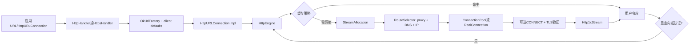
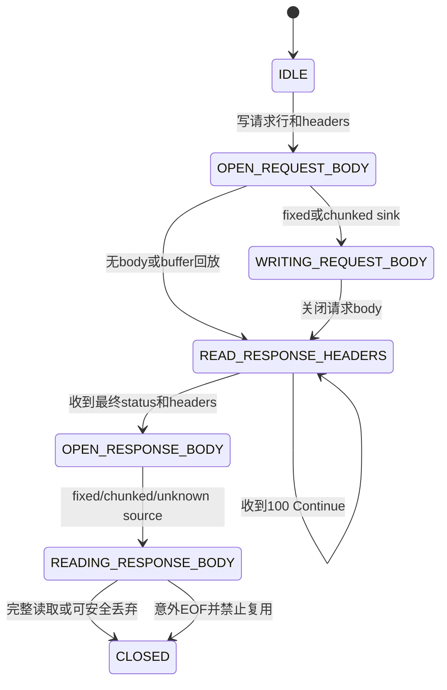
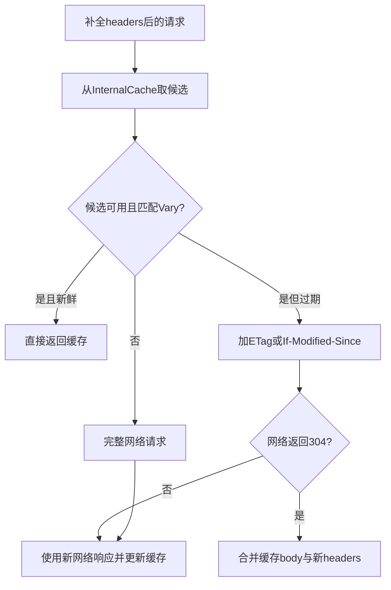

# 298 Android HttpURLConnection内置OkHttp、代理、DNS、连接池、HTTP/1.1、重定向、缓存、Cookie与重试链

## 1. 本章目标

本章从应用的一次`URL.openConnection()`出发，沿Android 11平台内置的`com.android.okhttp`追到URL handler、代理选择、DNS、多IP路由、TCP/TLS、连接池、HTTP/1.1报文、响应体、重定向、认证、缓存、Cookie和故障重试。重点不是背API，而是判断“一次业务请求究竟可能发出几次网络请求、复用了哪条连接、为什么不能重试”。

## 2. Android 11版本边界

本文只依据本地`android-11.0.0_r48`的repackaged OkHttp 2.x风格源码。包名是隐藏API `com.android.okhttp`，不是应用依赖的`okhttp3`；现代OkHttp的`OkHttpClient.Builder`、应用interceptor、HTTP/2连接合并、Call timeout等结论不能直接搬来。

## 3. 本章与前三章的连接

第295章解释企业私钥与证书，第296章解释服务器证书信任，第297章解释TLS握手；本章把它们装进HTTP运输过程。DNS成功不等于TLS可信，TLS成功也不等于HTTP业务成功，收到HTTP 200更不等于响应体已完整消费。

## 4. 核心源码地图

```text
external/okhttp/repackaged/android/src/main/java/com/android/okhttp/
  HttpHandler.java  HttpsHandler.java  ConfigAwareConnectionPool.java
external/okhttp/repackaged/okhttp-urlconnection/src/main/java/com/android/okhttp/
  OkUrlFactory.java  internal/huc/HttpURLConnectionImpl.java
  internal/huc/HttpsURLConnectionImpl.java
external/okhttp/repackaged/okhttp/src/main/java/com/android/okhttp/
  OkHttpClient.java  ConnectionPool.java  Address.java  Route.java
  internal/http/HttpEngine.java  RouteSelector.java  StreamAllocation.java
  internal/http/Http1xStream.java  CacheStrategy.java  AuthenticatorAdapter.java
  internal/io/RealConnection.java
```

## 5. 先建立九层心智模型

一次请求至少可拆为：URL API、handler/factory、请求状态机、缓存策略、route选择、物理连接、TLS、HTTP framing、响应消费。把所有现象都归因于“网络不好”会掩盖代理407、DNS多地址、陈旧池连接、证书失败、重定向循环和响应体未关闭等不同故障。

## 6. URL怎样找到协议handler

`java.net.URL`按scheme选择`URLStreamHandler`；Android把`http`交给`com.android.okhttp.HttpHandler`，把`https`交给其子类`HttpsHandler`。`openConnection()`此时主要创建Java对象，不代表DNS、TCP或HTTP报文已经发生。

## 7. HttpHandler的入口

源码核心很短：

```java
@Override protected URLConnection openConnection(URL url) throws IOException {
    return newOkUrlFactory(null).open(url);
}
```

没有显式Proxy时传null，稍后由客户端默认`ProxySelector`决定；`URL.openConnection(proxy)`则只使用调用方给定的代理。

## 8. OkUrlFactory做什么

`OkUrlFactory.open()`先对客户端做`copyWithDefaults()`，再按scheme构造`HttpURLConnectionImpl`或`HttpsURLConnectionImpl`。每个URLConnection得到可独立改超时、重定向等配置的浅拷贝，同时共享连接池等底层对象。

## 9. HttpURLConnectionImpl的角色

它把公开`HttpURLConnection`的可变属性翻译成OkHttp内部`Request`，用一个或多个`HttpEngine`得到最终响应。重定向或认证挑战会创建后续engine，因此“一个URLConnection对象”不等于“只发一个HTTP exchange”。

## 10. connected字段真正含义

本实现明确说明：继承的`connected`表示“曾经尝试建立连接”，不是此刻socket仍连接。它一旦为true，请求方法和header等配置被冻结；随后即使请求失败或物理socket关闭，也不会恢复为可编辑状态。

## 11. 总体调用链



## 12. 惰性执行

`setRequestProperty()`、`setRequestMethod()`只改内存。`connect()`会初始化engine并发送请求准备，但可不读取最终响应；`getOutputStream()`、`getInputStream()`、`getResponseCode()`、读取响应header等会逐步触发真实工作。

## 13. connect不等于响应已读完

`connect()`循环调用`execute(false)`，令`HttpEngine.sendRequest()`完成缓存决策和必要的连接/请求准备，却不要求`readResponse()`完成。对无body请求，真正读取状态行常发生在`getResponseCode()`或`getInputStream()`。

## 14. 请求属性冻结点

`initHttpEngine()`先设`connected = true`，之后`setRequestProperty()`和`addRequestProperty()`抛`IllegalStateException`。所以所有method、header、超时、streaming mode都应在首次I/O型调用前设置。

## 15. 支持的方法集合

r48实现只接受`OPTIONS、GET、HEAD、POST、PUT、DELETE、TRACE、PATCH`。比较是大小写敏感的，传自定义方法或小写`get`会抛`ProtocolException`；这不是任意token透传实现。

## 16. doOutput会把GET改成POST

若`setDoOutput(true)`且method仍是GET，`initHttpEngine()`会改成POST；若方法不允许body则拒绝。这个历史兼容行为很隐蔽，诊断“明明写GET却收到POST”要先找`setDoOutput(true)`。

## 17. 请求体三种模式

指定fixed length时写`Content-Length`；指定chunk length时写`Transfer-Encoding: chunked`；两者都没指定则把请求体先缓存在`RetryableSink`，关闭后计算长度再发header。模式影响内存、首字节延迟与能否重放。

## 18. 默认缓冲模式

未知长度且未启用chunked时，header要等完整body写入后才知道`Content-Length`。优点是可重试和兼容不接受chunked的服务器；缺点是大body占内存，超过2 GiB会要求改用fixed/chunked streaming。

## 19. fixed-length约束

写入超过声明长度立即抛`ProtocolException`；关闭时仍有剩余也抛“unexpected end of stream”。它让接收方清楚边界并允许流式发送，但已经发送的字节不能像内存buffer那样安全重放。

## 20. chunked请求体

每块写十六进制长度、CRLF、数据、CRLF，关闭时写`0\r\n\r\n`。它无需预知总长度，但经过HTTP/1.0代理或服务器时兼容性可能较差，并且流式body发生故障后通常不可自动重试。

## 21. 默认Content-Type

只要方法允许body且应用未设置，URLConnection层会补`application/x-www-form-urlencoded`。这不会把任意对象自动编码成表单；应用写出的原始字节若其实是JSON，应自己设置正确media type。

## 22. 默认User-Agent

若应用未设置，先取系统属性`http.agent`并转换不可显示字符，否则用OkHttp版本字符串。服务端看到的UA因此可能受设备系统属性影响，不能仅凭UA精确识别应用版本。

## 23. 网络请求补充header

`HttpEngine.networkRequest()`会按缺失情况补`Host`、`Connection: Keep-Alive`、`Accept-Encoding: gzip`和User-Agent，再询问CookieHandler。它不默认添加`Accept`，因为平台不知道业务期望的内容类型。

## 24. Host header

Host由目标`HttpUrl`生成，非默认端口会包含端口。即便通过代理建立连接，HTTP虚拟主机和TLS SNI仍围绕origin host；“连接到代理IP”不意味着Host应改为代理地址。

## 25. 明文安全策略门

`HttpHandler`安装`CleartextURLFilter`，在每次engine执行前调用`NetworkSecurityPolicy.isCleartextTrafficPermitted(host)`。不允许时抛IOException；重定向后的新URL也会再次检查，而原始Socket等其他API未必经过这道门。

## 26. HTTPS handler的差异

`HttpsHandler`移除明文URL filter，配置TLS socket factory、HostnameVerifier和空的OkHttp CertificatePinner；证书pinning由Network Security Config完成，而不是开放隐藏OkHttp pinner给应用。

## 27. 重要纠偏：平台URL HTTPS只走HTTP/1.1

r48的`HttpsHandler`明确把protocols设为仅`HTTP_1_1`，注释写着禁用SPDY/HTTP/2。因此虽然底层OkHttp库包含framed HTTP/2代码，普通`https://...openConnection()`这条平台入口不会协商h2。

## 28. TLS参数不硬编码旧列表

HTTPS ConnectionSpec使用所有socket已启用cipher和TLS版本，并支持TLS扩展。这让系统或应用提供的SSLSocketFactory决定实际安全能力，避免平台OkHttp在发布时固化一份很快过期的TLS名单。

## 29. 默认HostnameVerifier与Factory

handler显式读取`HttpsURLConnection.getDefaultHostnameVerifier()`和`getDefaultSSLSocketFactory()`设置到客户端，因为OkHttp不会自动尊重这两个全局值。修改全局默认会影响后续新连接，已有池连接不一定重新握手。

## 30. 默认超时是无限

Android handler创建客户端后把connect、read、write timeout都显式设为0；在该实现中0表示无超时。生产应用必须主动设置合理的连接和读取超时，否则断网、黑洞路由或不完整响应可长时间占住线程。

## 31. 没有统一Call deadline

公开HttpURLConnection只有connect/read timeout，平台内部虽有write timeout字段，但没有现代OkHttp那种覆盖DNS、重定向、全部读取的总Call timeout。一次20次follow-up的总时长可能远大于单次超时。

## 32. 同步线程模型

URLConnection路径在调用者线程同步执行DNS、connect、握手、写入和读取；没有自动Dispatcher替应用搬到后台。Android主线程发网通常会触发StrictMode/NetworkOnMainThreadException风险，业务应在可取消的后台任务中运行。

## 33. HttpURLConnection并非线程安全会话

它的请求字段和engine状态不是设计给多线程并发修改/读写。一个线程可调用`disconnect()`尝试取消另一个线程的I/O，但不应让多个线程同时写body或读同一响应流。

## 34. Proxy优先级

显式`URL.openConnection(proxy)`只尝试该代理；未显式指定时，客户端从`ProxySelector.getDefault()`取候选。若selector给多个代理，按序尝试，最后追加一次`Proxy.NO_PROXY`直连。

## 35. 禁用代理的正确表达

要明确直连，应传`Proxy.NO_PROXY`，而不是null；null的含义是允许系统ProxySelector决定。`usingProxy()`在真正选路前可能为false，响应后才根据实际Route变成true。

## 36. HTTP代理请求行

明文HTTP经HTTP代理时，请求行包含完整URL，如`GET http://example/a?q=1 HTTP/1.1`；直连或HTTPS隧道内只写path和query。`RequestLine.includeAuthorityInRequestLine()`按HTTPS和代理类型判断。

## 37. HTTPS代理先CONNECT

HTTPS经HTTP代理先发送明文`CONNECT host:port HTTP/1.1`建立字节隧道，再在隧道中做TLS。代理能看到目标host:port和连接元数据，但正常情况下看不到隧道内HTTP header/body。

## 38. CONNECT最小header

隧道请求只带Host、`Proxy-Connection: Keep-Alive`和User-Agent，避免把业务Cookie等敏感header在TLS前交给代理。200后若buffer残留异常字节，RealConnection会拒绝继续握手。

## 39. 407代理认证

CONNECT或普通请求收到407时，`AuthenticatorAdapter`只处理Basic challenge，通过全局`java.net.Authenticator`请求凭据并加`Proxy-Authorization`。它不等同现代OkHttp可插拔的完整认证生态，也不应把origin Authorization误发给代理。

## 40. 401服务器认证

401同样经AuthenticatorAdapter处理Basic，生成`Authorization: Basic ...`后发follow-up。凭据是可逆Base64而非加密；只有HTTPS才能保护传输中的header，应用还需考虑日志和跨域泄漏。

## 41. DNS解析目标随代理变化

DIRECT或SOCKS route以origin host为socket host；HTTP代理route解析的是代理host。SOCKS使用未解析`InetSocketAddress`，可把名称解析交给代理；因此抓到本机没有origin DNS不代表没有访问域名。

## 42. Dns.SYSTEM

若客户端未设Dns，`copyWithDefaults()`使用`Dns.SYSTEM`，通过系统名称解析返回地址列表。Android网络绑定、Private DNS、缓存和netd细节已在第41章解释；本章从OkHttp接收到`List<InetAddress>`开始。

## 43. 多IP按序尝试

RouteSelector把DNS结果依次转换为socket地址，逐个返回route。这里没有现代“Happy Eyeballs并行竞速”逻辑；前一个地址连接超时可能延迟后一个可用地址。

## 44. route的三个主要维度

Route由Address、Proxy和`InetSocketAddress`组成；Address又包含origin host/port、DNS、socket factories、TLS验证器、authenticator、protocol/spec和ProxySelector。只有这些连接语义相等，池连接才可直接复用。

## 45. 失败route后置

新连接失败会记入共享RouteDatabase；下次选择时先把已失败route加入`postponedRoutes`，尝试其他新route，最后才重试旧失败route。这是降低重复踩坑，不是永久封禁IP。

## 46. ProxySelector失败回调

非直连代理的新连接失败时，RouteSelector调用`ProxySelector.connectFailed()`，让系统策略获知代理不可用；随后仍可尝试其他代理或最终直连，具体取决于候选列表和错误是否可恢复。

## 47. 建立物理socket

RealConnection根据代理类型创建raw Socket，调用`Platform.connectSocket(address, connectTimeout)`，再用Okio包装source/sink。连接超时只约束这一步，不自动覆盖此前DNS的全部耗时。

## 48. TLS在socket之上

HTTPS先按需CONNECT，再由SSLSocketFactory在raw socket上创建SSLSocket，配置TLS扩展、强制`startHandshake()`、验证hostname，最后记录Handshake与protocol。证书链信任由Factory内部TrustManager完成，详见296/297章。

## 49. TLS失败重试边界

证书导致的`SSLHandshakeException`、`SSLPeerUnverifiedException`不会通过换route重试；某些TLS协议/套件协商错误可由`ConnectionSpecSelector`尝试兼容spec。但平台HTTPS只配置一个“all enabled”spec，不能假定存在多级TLS降级。

## 50. Address相等才复用

ConnectionPool遍历连接，要求Address相等、未`noNewStreams`且allocation未满。HTTP/1.1 allocationLimit为1，因此同一物理连接不能同时承载两个未完成exchange。

## 51. 默认网络变化感知池

通过Java URL创建的连接不直接用普通systemDefault，而由`ConfigAwareConnectionPool`提供池。收到`NetworkEventDispatcher.onNetworkConfigurationChanged()`后丢弃池引用，后续请求用新池，防止把旧默认网络socket借给新请求。

## 52. 丢池引用不等于立刻杀旧请求

配置变化只是让未来`get()`创建新ConnectionPool；旧池和其中正在使用的连接可由已有对象继续持有，直至释放/关闭/GC。它保护“后续不复用”，不是对所有在途请求做强制迁移。

## 53. 连接池默认参数

默认最多保留5条idle连接，keep-alive 5分钟；`http.keepAlive=false`令最大idle为0，`http.maxConnections`和`http.keepAliveDuration`可改初始值。属性在类初始化时读取，运行中再改不一定生效。

## 54. “最多5条”是idle策略

ConnectionPool可暂时含更多活动连接；cleanup统计idle并淘汰空闲最久者，使idle不超过上限或超出保活期限。不要把5误解成整个进程最多并发5个HTTP请求。

## 55. 健康检查

复用候选若曾承载过stream，会检查socket是否closed/input shutdown/output shutdown；对非GET还做更严格探测，降低把副作用请求写到对端已关闭连接的概率。健康检查仍有竞态，检查后服务器也可能立刻关连接。

## 56. 陈旧池连接恢复

若复用连接在发送/读取时失败，StreamAllocation可放弃它并选择新route；但仅当错误可恢复且body可重放。源码专门把“stale pooled connections”列为默认retryOnConnectionFailure要处理的场景。

## 57. 泄漏检测

每次allocation以WeakReference挂到RealConnection；cleanup发现引用已被GC会移除引用、标记`noNewStreams`，最后一个泄漏引用还会让连接立即具备淘汰条件。复读源码可见Android r48专门移除了上游泄漏warning，因为只访问header的调用方未必做错；没有日志不代表资源管理正确。

## 58. 响应体决定连接归还时机

HTTP/1.1只有读到body边界并结束stream，allocation才可释放回池。只读status/header却不消费或关闭body，会让连接仍被占用，造成池复用下降和文件描述符压力。

## 59. 关闭时的快速丢弃

fixed/chunked body提前close时，实现尝试在短时间内丢弃剩余字节以恢复报文边界；丢弃失败则`noNewStreams`并关闭连接。因而“close即可复用”不是绝对，body大小和网络速度会影响结果。

## 60. 未知长度响应不能复用

无Content-Length且非chunked的HTTP/1响应靠服务器关闭socket标记结束。`newUnknownLengthSource()`立即`noNewStreams()`，因为无法在同一连接上安全识别下一响应起点。

## 61. HTTP/1.1严格状态机

`Http1xStream`按IDLE→OPEN_REQUEST_BODY→WRITING/READ_RESPONSE_HEADERS→OPEN_RESPONSE_BODY→READING→CLOSED迁移。顺序错误立即抛IllegalStateException，说明请求头、body、响应头、body不是可随意交错的四个独立流。

## 62. HTTP/1.1 framing图



## 63. 请求行始终发HTTP/1.1

RequestLine末尾固定`HTTP/1.1`，即使服务器可回应HTTP/1.0。路径至少为`/`并包含query，不包含fragment，因为fragment只供客户端定位，不应发给服务器。

## 64. header编码边界

每个header写成`name: value\r\n`，最后空行。OkHttp的Headers Builder会做基本名字/值检查，但应用仍不应把不可信输入直接拼header，以免语义混淆或敏感信息泄漏。

## 65. 100 Continue

读响应header时若status code是100，状态保持等待并继续读下一组status/header；只有非100才进入响应body阶段。但这段URLConnection请求发送流程没有现代客户端完整的“先等100再发送大body”策略，不应据此宣称可节省上传。

## 66. 哪些响应有body

HEAD永远按无body；普通2xx以上多数有body；1xx、204、304通常无body。但若这些status又带Content-Length或chunked，兼容逻辑尊重header并按有body处理，以避免报文边界错位。

## 67. fixed-length响应

读满Content-Length即`endOfInput()`并归还stream；提前EOF则抛ProtocolException且禁止连接复用。只凭status 200就提交业务成功会漏掉“声明1000字节实际只到500字节”的传输损坏。

## 68. chunked响应

客户端逐块解析十六进制长度，0块后读取trailers并结束。trailers也会交给CookieHandler的header接收逻辑；异常chunk长度或提前EOF会污染边界，因此连接不可再用。

## 69. Connection close

若请求或响应含`Connection: close`，HttpEngine调用`noNewStreams()`。即使body完整读完，该物理socket也不会回池；这是协议端明确要求，不是连接池参数失效。

## 70. getInputStream与错误码

`getInputStream()`在response code >=400时抛`FileNotFoundException`，并非返回错误body。调用方应在需要时用`getErrorStream()`读取服务端错误内容，同时仍要关闭它。

## 71. getErrorStream的边界

仅当响应确有body且code >=400才返回流；网络异常时返回null。null不能解释成“服务器没有错误”，也可能是根本没拿到可解析的HTTP响应。

## 72. disconnect的语义

`disconnect()`调用`HttpEngine.cancel()`，最终取消stream或关闭raw socket；它不替调用方关闭已暴露的请求/响应流。并发取消提供有限保证，服务器可能已收到并处理请求，尤其不能把取消POST当作回滚。

## 73. 透明gzip启用条件

只要用户请求没有`Accept-Encoding`，engine设置`transparentGzip=true`并加`Accept-Encoding: gzip`。本r48代码没有“Range时自动禁用gzip”的额外条件，因此不要套用其他OkHttp版本的结论。

## 74. 透明解压

若服务器返回`Content-Encoding: gzip`且由客户端自动协商，engine用GzipSource解压，并从暴露给应用的header删除Content-Encoding与Content-Length；后者是压缩长度，对解压流已不再准确。

## 75. 显式Accept-Encoding会关闭透明模式

应用自己设置`Accept-Encoding`后，engine不标记transparentGzip，即便值仍是gzip也不会自动解压。此时应用看到原始Content-Encoding/Length并负责解压，避免双重处理。

## 76. Cookie出站链

`copyWithDefaults()`获取全局`CookieHandler.getDefault()`；engine将当前header映射交给`cookieHandler.get(uri, headers)`，把返回的Cookie/Cookie2值加入网络请求。Cookie匹配策略由Handler实现，不由HttpEngine自己维护jar。

## 77. Cookie入站链

收到网络响应headers以及chunked trailers后，engine调用`cookieHandler.put(uri, multimap)`。若没有安装CookieManager/自定义Handler，就没有自动跨请求持久保存；设置请求Cookie header也不等于建立持久cookie库。

## 78. Cookie与重定向

每个follow-up创建新HttpEngine，会再次基于新URI询问CookieHandler，因此域、路径、Secure等规则可改变携带内容。跨host跳转不应手工复制原Cookie，否则会绕过Cookie策略造成泄漏。

## 79. ResponseCache接入点

HttpHandler读取`ResponseCache.getDefault()`；若非null，AndroidInternal把它适配为OkHttp InternalCache。默认没有安装就没有磁盘HTTP缓存，连接池只复用socket，不保存HTTP响应内容。

## 80. useCaches只影响当前连接

如果全局客户端有cache但当前URLConnection的`getUseCaches()`为false，构建engine时clone客户端并清空cache。它不会删除已有缓存条目，只让本次请求不从该cache读写。

## 81. 缓存三种决策

CacheStrategy可返回：networkRequest=null且cacheResponse存在，直接命中；两者都存在，发条件请求验证；只有networkRequest，完整联网。`only-if-cached`且缓存不够时构造504，不会偷偷联网。



## 82. 缓存候选先验检查

HTTPS缓存缺少Handshake就丢弃；不可缓存status或`no-store`也丢弃；请求已有条件header或`no-cache`则走网络。缓存实现即使返回错误候选，策略层仍重新校验。

## 83. 新鲜度计算

优先Cache-Control max-age，其次Expires；没有两者且有Last-Modified、URL无query时，以资源表观年龄的10%作启发式寿命。`Age`、Date、发送/接收时间共同计算当前缓存年龄。

## 84. stale与warning

请求max-stale且响应非must-revalidate时可接受过期缓存，并加110 Warning；启发式缓存年龄超过一天再加113 Warning。拿到body不等于它来自网络或仍新鲜，可看平台附加的响应来源header辅助诊断。

## 85. 条件请求优先级

过期候选优先用ETag生成`If-None-Match`，否则用Last-Modified，再否则用Date生成`If-Modified-Since`。服务器返回304时合并缓存body与网络end-to-end headers，并更新缓存元数据。

## 86. 304不是空业务响应

对应用暴露的是组合后的原status/body视图，而不是简单把304空body交出去。排障应区分networkResponse code 304与最终用户response code；URLConnection还添加`X-Android-Response-Source`表示CONDITIONAL_CACHE。

## 87. Vary

缓存保存响应`Vary`指定的原请求headers；再次请求只有这些字段匹配才可复用。`Vary: *`不可缓存。若忽视Vary，可能把不同Accept-Language或Encoding的表示串给错误请求。

## 88. 哪些方法使缓存失效

不可缓存响应若对应的方法会使cache失效，engine尝试删除该URL条目；写缓存失败或删除失败通常被忽略，不让缓存故障直接破坏网络响应。缓存只是性能层，业务一致性不能只依赖客户端删除成功。

## 89. 缓存写入随读取推进

网络响应body被包装成边读边写cache的Source；完整EOF才关闭cache body完成条目。读取中发生IOException或提前close且无法快速丢弃剩余数据会abort缓存，防止保存半截响应。

## 90. 重定向属于follow-up

`getResponse()`每获得一次用户响应就调用`followUpRequest()`；非null则更新URL/header，关闭旧engine，并可能复用同一StreamAllocation创建下一engine。最终只把最后一个响应作为主要结果，priorResponse保留无body链。

## 91. follow-up上限

重定向与401/407认证共用计数，超过20次抛`ProtocolException("Too many follow-up requests")`。所以20不是“只允许20个Location”，认证循环同样会消耗额度。

## 92. 300/301/302/303方法转换

若允许重定向，具body方法通常按`HttpMethod.redirectsToGet()`转GET，并移除Transfer-Encoding、Content-Length、Content-Type。源码注释选择浏览器兼容行为，而非机械保留原POST。

## 93. 307/308边界

若原方法不是GET或HEAD，收到307/308直接不自动跳转；GET/HEAD才进入通用Location处理。这样避免未经应用确认重放POST，但也意味着调用方要自己处理需要保留方法/body的redirect。

## 94. scheme跨越默认被禁止

Android Handler先将`followSslRedirects`设为false，所以普通URL连接不会自动http→https或https→http；`setInstanceFollowRedirects()`只控制是否跟随redirect，并不打开跨scheme开关。

## 95. 相对Location

Location通过当前HttpUrl解析，可处理相对路径；无法解析或目标protocol不支持时不跳转。每个新URL都应重新经过安全策略、route、Cookie与缓存判断。

## 96. 跨origin移除Authorization

若host、port或scheme任一改变，`sameConnection()`为false并删除Authorization。源码只明确移除该header；敏感自定义header不会自动全部清理，应用不应把token随意放进其他可跨域继承的header。

## 97. sameConnection比同host更严格

只有host、port、scheme都相等才允许follow-up继续复用原StreamAllocation；改变端口或http/https都释放旧allocation。它是本版本的连接复用边界，不包含现代HTTP/2跨域coalescing。

## 98. streamed body不能follow-up重放

若后续请求仍需要旧body而body不是RetryableSink，URLConnection抛`HttpRetryException("Cannot retry streamed HTTP body")`。内存buffer能重放不代表业务语义幂等，自动网络重试仍需谨慎。

## 99. 连接前route错误恢复

`RouteException`表示具体route连接阶段失败且请求未发出；若还有route、错误可恢复且retryOnConnectionFailure开启，会沿相同RouteSelector尝试下一个IP/代理。connect timeout在这里可尝试下一route。

## 100. 通信中IOException恢复

请求可能已发出时更严格：ProtocolException、一般InterruptedIOException不恢复；若是流式body也不恢复。复用旧连接失败时可换新route，但首条新连接首个stream失败通常避免盲重发。

## 101. TLS错误分类

证书链CertificateException和hostname/pinning的PeerUnverified属于确定性策略失败，不换IP重试；其他握手I/O或协议兼容错误可能尝试route/spec。重试不会绕过TrustManager或HostnameVerifier。

## 102. 自动重试与幂等不是同义词

源码以“是否可能安全重放字节、是否还有route”作传输层判断，无法知道服务端是否已经扣款。重要POST应使用业务幂等键、服务端去重和结果查询，而不是仅关闭`retryOnConnectionFailure`或相信异常代表未执行。

## 103. 错误分层诊断表

`UnknownHostException`看DNS；ConnectException/timeout看route与代理；407看代理认证；SSLHandshakeException看证书/协议；ProtocolException看framing/redirect；FileNotFoundException可能只是HTTP >=400；body中途异常看长度、chunk与连接关闭。先判层再抓日志。

## 104. 一次GET的最短路径

配置冻结→补header/Cookie→查cache→池命中或Proxy/DNS/connect→可选TLS→写request line/header→读status/header→按长度读body→写cache→body结束归还连接。任一步都可能让“简单GET”变成缓存命中或多route尝试。

## 105. 一次POST的更长路径

除上述步骤外还需决定buffer/fixed/chunked、写完body、判断可重放性，并面对401/407/3xx。服务器可能在客户端读到响应前已完成副作用；网络错误后必须以业务查询确认，而非直接重复提交。

## 106. 企业代理场景

系统ProxySelector选代理→本地只解析代理地址→HTTPS发CONNECT→可能407→TLS仍针对origin host验证→HTTP/1.1在隧道中传输。若企业安装用户CA并做TLS inspection，是否信任由目标应用NSC决定，代理配置本身不授予信任。

## 107. mTLS场景

HttpsURLConnection使用的SSLSocketFactory必须含能选择企业客户端alias的KeyManager，TLS握手才会在CertificateRequest时提交证书。HTTP层看不到可导出的私钥；但连接池和TLS session复用可能让撤销grant后旧连接暂时继续工作。

## 108. 网络切换场景

默认网络变化会让后续URL请求取得新池，避免复用旧池socket；已经持有的URLConnection/stream仍可能失败或完成。业务应把网络callback当重新评估信号，不要假定所有在途I/O瞬间迁移到新网络。

## 109. 性能优化顺序

先确保响应流完整关闭，再设置合理超时和缓存，最后才看DNS/代理/连接池参数。未关闭body造成的“每次都重新握手”比微调max idle更常见；错误缓存策略又可能把陈旧数据当网络性能提升。

## 110. 安全检查顺序

先限制明文与目标host，再验证证书链和hostname，保护凭据不跨origin，正确隔离Cookie/cache，最后处理重试幂等。只做pinning却允许token跟随自定义header跨域，同样会泄露身份。

## 111. 阅读源码的建议路线

先读Handler和OkUrlFactory确认入口，再读HttpURLConnectionImpl理解公开API状态，接着HttpEngine看cache/follow-up，RouteSelector与RealConnection看建连，最后Http1xStream看字节边界。按一次具体请求画对象和状态，不要从所有类横向扫起。

## 112. macOS只读练习一：确认平台入口

在源码根目录执行：

```bash
rg -n "createHttpOkUrlFactory|setFollowSslRedirects|setProtocols|setConnectTimeout" \
  external/okhttp/repackaged/android/src/main/java/com/android/okhttp/{HttpHandler,HttpsHandler}.java
```

回答：默认超时是多少、是否允许跨scheme redirect、HTTPS开放哪些HTTP protocol。只读取文件，不编译、不修改源码。

## 113. macOS只读练习二：追请求体与follow-up

```bash
rg -n "doOutput|bufferRequestBody|MAX_FOLLOW_UPS|Cannot retry streamed|followUpRequest" \
  external/okhttp/repackaged/okhttp-urlconnection/src/main/java/com/android/okhttp/internal/huc/HttpURLConnectionImpl.java \
  external/okhttp/repackaged/okhttp/src/main/java/com/android/okhttp/internal/http/HttpEngine.java
```

画出GET+doOutput、buffered POST、chunked POST遇到302/307时的不同结果。

## 114. macOS只读练习三：追代理、DNS与连接池

```bash
rg -n "resetNextProxy|lookup\(|postponedRoutes|address.equals|noNewStreams" \
  external/okhttp/repackaged/okhttp/src/main/java/com/android/okhttp/internal/http/RouteSelector.java \
  external/okhttp/repackaged/okhttp/src/main/java/com/android/okhttp/{ConnectionPool.java,internal/http/StreamAllocation.java}
rg -n "onNetworkConfigurationChanged|connectionPool = null" \
  external/okhttp/repackaged/android/src/main/java/com/android/okhttp/ConfigAwareConnectionPool.java
```

记录显式代理、ProxySelector、多个IP、失败route、网络配置变化各自改变哪一层。

## 115. macOS只读练习四：追body与cache完成条件

```bash
rg -n "newUnknownLengthSource|unexpectedEndOfInput|cacheWritingResponse|If-None-Match|Heuristic expiration" \
  external/okhttp/repackaged/okhttp/src/main/java/com/android/okhttp/internal/http/{Http1xStream,HttpEngine,CacheStrategy}.java
```

解释为什么“拿到200”仍不能判定下载完整，以及提前close什么时候能复用连接、什么时候会abort缓存。

## 116. 易混点复读一：库有HTTP/2不等于入口启用

初稿最容易从`OkHttpClient.DEFAULT_PROTOCOLS`看到HTTP_2便断言平台URL支持h2；复读Handler后应以更具体配置为准：`HttpsHandler`覆盖为`HTTP_1_1_ONLY`。底层能力、客户端默认、实际入口配置必须分开。

## 117. 易混点复读二：open、connect、response、body四个时刻

`openConnection()`只创建对象；`connect()`尝试准备/发送；`getResponseCode()`取得最终header并处理follow-up；读到body EOF才证明传输完整并通常可回池。把这四者合成“连接成功”会造成资源和业务判断错误。

## 118. 易混点复读三：缓存、Cookie和连接池不是一回事

连接池保存socket，ResponseCache保存可复用HTTP表示，CookieHandler保存或计算状态header；三者生命周期、key和安全风险都不同。没有ResponseCache仍能keep-alive，没有CookieHandler仍能手工Cookie，但都没有自动持久能力。

## 119. 易混点复读四：重试成功不代表业务只执行一次

RouteException通常发生在请求发送前，通信IOException却可能发生在发送后；buffered body只说明字节可重放，不说明服务端操作幂等。支付、开锁、下发设备命令等必须使用业务唯一请求ID和服务端去重。

## 120. 本章总结与下一章预告

Android 11的HttpURLConnection是“公开兼容API + 内置repackaged OkHttp执行器”：Handler确定安全与协议边界，HttpEngine协调缓存/请求/follow-up，RouteSelector组合代理与DNS，StreamAllocation和ConnectionPool管理物理连接，Http1xStream守住报文边界。下一章将进入企业网络日志链，追DNS/connect事件怎样由netd回调到DevicePolicyManagerService，并解释批次token、检索窗口与隐私边界。
