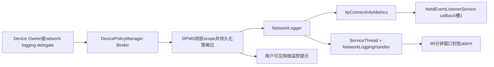
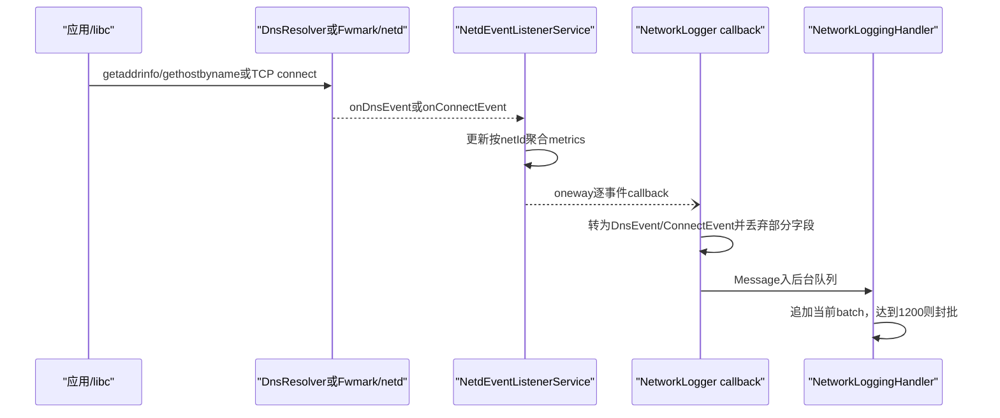
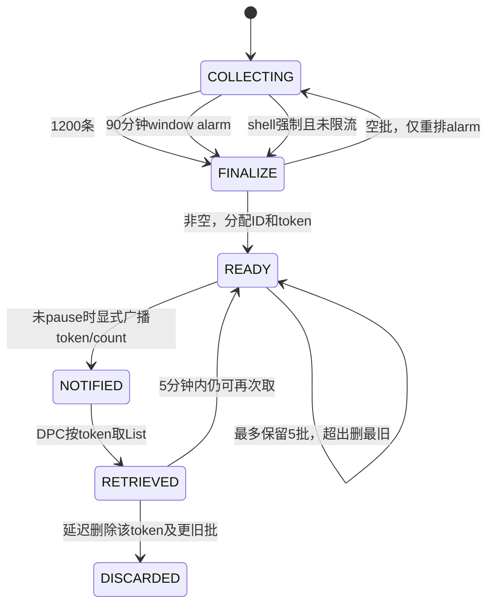

# 299 Android企业网络日志、DPMS、NetworkLogger、netd、DNS/connect、批次token、检索与隐私边界链

## 1. 本章目标

本章追Android 11企业网络日志的完整链：Device Owner或其网络日志delegate启用策略，DPMS向`IIpConnectivityMetrics`注册回调，DNS Resolver/netd报告DNS和connect事件，NetworkLoggingHandler按数量或时间封批，最后以token通知DPC检索。重点解释它记录什么、丢弃什么，以及为什么它不是抓包或完整审计日志。

## 2. Android 11版本边界

本文依据本地`android-11.0.0_r48`。Android Enterprise API、netd/DnsResolver模块、callback字段和隐私策略在后续版本可能改变；厂商也可能修改事件来源。结论只覆盖AOSP r48主线，不把现代NetworkStack或第三方EDR能力倒推回来。

## 3. 与第298章的关系

第298章的一次HttpURLConnection可能产生一次DNS lookup和一个或多个TCP connect尝试；本章从这些较低层事件被系统观察开始。企业日志不会知道HTTP method、URL path、header、status、TLS证书或响应body，也无法还原连接池中的每个HTTP exchange。

## 4. 核心源码地图

```text
frameworks/base/services/devicepolicy/java/com/android/server/devicepolicy/
  DevicePolicyManagerService.java  NetworkLogger.java  NetworkLoggingHandler.java
frameworks/base/services/core/java/com/android/server/connectivity/
  IpConnectivityMetrics.java  NetdEventListenerService.java
frameworks/base/core/java/android/net/
  IIpConnectivityMetrics.aidl  INetdEventCallback.aidl
frameworks/base/core/java/android/app/admin/
  NetworkEvent.java  DnsEvent.java  ConnectEvent.java  DevicePolicyManager.java
packages/modules/DnsResolver/DnsProxyListener.cpp
system/netd/server/FwmarkServer.cpp
```

## 5. 先区分三种“网络日志”

`NetdEventListenerService`自己的NetworkMetrics是按netId聚合的连接/DNS统计；NetworkWatchlist关注恶意域名/IP；DevicePolicy NetworkLogger保存给企业DPC的逐事件批次。三者可同时接同一源callback，但目的、字段和保留策略完全不同。

## 6. 企业能力主体

`setNetworkLoggingEnabled()`要求Device Owner作用域，或由Device Owner授予`DELEGATION_NETWORK_LOGGING`的delegate调用。它不是普通Device Admin、任意Profile Owner或拥有INTERNET权限的应用可用能力。

## 7. admin为null的含义

公开API允许`admin == null`，但这不是“跳过身份检查”，而是告诉DPMS按调用package校验delegate scope。DPMS还记录策略事件中的admin包和isDelegate布尔值，便于管理操作审计。

## 8. 只有状态为true还不够

策略位保存在Device Owner的ActiveAdmin中；运行时还需要`mNetworkLogger`成功注册系统回调。若IIpConnectivityMetrics尚不可用，策略位可能已为true而logger启动失败，`isNetworkLoggingEnabled()`仍主要反映策略位，不证明当前事件必然被收集。

## 9. 为什么开机后重新启动logger

策略位持久化，但批次和handler都在内存。DPMS等Device Owner用户收到`ACTION_USER_STARTED`后，若策略已启用才调用`setNetworkLoggingActiveInternal(true)`重新注册；源码注释说明更早阶段IIpConnectivityMetrics尚未就绪。

## 10. 启用主链

DPMS先更新并保存`isNetworkLoggingEnabled`，再清调用身份创建NetworkLogger。NetworkLogger取得IIpConnectivityMetrics，注册caller type DEVICE_POLICY的INetdEventCallback，启动后台ServiceThread、创建Handler、安排封批alarm，最后把原子开关设为true。

## 11. 启用流程图



## 12. IIpConnectivityMetrics的权限门

`IpConnectivityMetrics.Impl.addNetdEventCallback()`只允许SYSTEM_UID。DPC不会直接注册netd监听，而是通过system_server中的DPMS代理；这把敏感全设备事件能力限制在受信系统服务链。

## 13. callback槽是固定的三个

NetdEventListenerService只有ConnectivityService、DevicePolicy和NetworkWatchlist三个caller type，每种一个数组槽。再次注册同type会覆盖旧callback，不会建立任意数量监听器；非法caller type返回false。

## 14. callback没有显式death recipient

r48的槽数组直接保存Binder接口，注册代码未在此处linkToDeath。远端死亡时oneway调用可能抛RemoteException并沿事件入口传播；system_server主要调用方通常同进程或随系统生命周期管理，不能把它视为通用健壮订阅总线。

## 15. 原子开关的竞态作用

`mIsLoggingEnabled`让Binder callback在停用后尽快丢弃新事件。启动顺序是先建线程/handler再设true；停止顺序先设false再discard与注销，避免callback访问尚未初始化或已停止的handler。

## 16. DNS事件从哪里来

DnsResolver的标准`getaddrinfo/gethostbyname`代理路径完成查询后调用`reportDnsEvent()`，把netId、eventType、returnCode、latency、hostname、截断后的IP数组、总IP数和UID送给INetdEventListener。

## 17. DNS不只代表外部UDP查询

这是解析函数调用结果事件，可能命中resolver cache、使用TCP、DoT或其他系统解析路径；它不能等同“一定向53端口发出一个DNS包”。Private DNS的传输与验证机制也不会作为企业DnsEvent字段暴露。

## 18. DNS IP数组最多10个

INetdEventListener常量`DNS_REPORTED_IP_ADDRESSES_LIMIT = 10`；A/AAAA答案超过限制时只保存前10个字符串，但另传`ipAddressesCount`表示总数。因此`getInetAddresses().size()`小于`getTotalResolvedAddressCount()`并不一定丢了整个事件。

## 19. DNS失败也可形成事件

底层带returnCode和可能为空的地址数组报告解析尝试；但NetworkLogger构造企业`DnsEvent`时丢弃returnCode和eventType。DPC看到空结果可怀疑失败，却无法从该对象精确分辨NXDOMAIN、timeout或API类型。

## 20. connect事件从哪里来

bionic socket连接通过Fwmark client与netd交互；`ON_CONNECT_COMPLETE`在connect完成后报告netId、目标IP/port、UID、延迟和errno。FwmarkServer用数值形式格式化IPv4/IPv6与端口，再调用INetdEventListener。

## 21. UDP被明确跳过

FwmarkServer读取`SO_PROTOCOL`，获取失败或协议为UDP就不报告此connect事件。UDP应用可以直接sendto/sendmsg，也可使用其他路径，所以企业ConnectEvent不能覆盖QUIC、游戏或自定义UDP通信全貌。

## 22. connect失败也可能被报告

ON_CONNECT_COMPLETE携带error和latency，说明成功与失败尝试都可进入监听器；但DevicePolicy callback只收到IP、port、timestamp、uid，error与latency已被NetdEventListenerService丢弃。因此一个ConnectEvent不等于TCP握手成功。

## 23. NetdEventListenerService做两条输出

每个DNS/connect入口先更新按netId的NetworkMetrics聚合，再遍历三个callback槽发送逐事件。聚合connect延迟受TokenBucket采样，不应据此推断DevicePolicy逐事件也使用同一采样；callback循环仍对每次入口执行。

## 24. 时间戳在哪里生成

NetdEventListenerService进入`onDnsEvent/onConnectEvent`时调用`System.currentTimeMillis()`，再传给DevicePolicy callback。它是system_server接收时的墙上时钟，不是单调时钟，也不是DNS开始或TCP SYN发出的精确时刻。

## 25. 墙钟可跳变

用户/网络校时改变系统时间会让timestamp倒退或前跳。NetworkEvent文档称列表按时间排序，但实现按handler到达顺序追加并在封批时分配ID，未按timestamp重新排序；排障可同时参考ID顺序与timestamp。

## 26. 回调是oneway

INetdEventCallback是oneway，发送方不等DPC处理；NetworkLogger callback也只构造对象并投Message到后台Handler。这样减少netd监听入口阻塞，但Binder/消息队列拥塞、进程故障或停用竞态都可能造成延迟或丢失。

## 27. DNS事件进入企业对象时保留什么

保留hostname、最多10个IP字符串、总IP数量、`PackageManagerInternal.getNameForUid(uid)`结果和timestamp。netId、解析API类型、returnCode、latency和原始UID不进入公开`DnsEvent`字段。

## 28. ConnectEvent保留什么

只保留目标数值IP、port、UID对应名称和timestamp。netId、errno、connect latency、源IP/port、协议细节和socket标识不保留；多个连接到同一endpoint只能靠event ID与时间区分。

## 29. 包名其实是UID名称

`NetworkEvent.getPackageName()`文档明确说返回`PackageManager.getNameForUid`语义。普通独占UID常得到包名；shared UID可能得到shared user名称，孤立/系统/native UID也可能是特殊字符串或null，不能强行映射成唯一APK。

## 30. 原始UID为何重要却丢失

底层UID能区分用户和appId，但企业Parcelable只存名称；同名跨用户、shared UID、包卸载/更新都削弱事后归属。DPC若要更强证据，应在检索时记录设备用户/包清单快照，而不是事后只凭字符串猜测。

## 31. 事件继承结构

抽象`android.app.admin.NetworkEvent`保存packageName、timestamp和id；子类只有DnsEvent与ConnectEvent。Parcel首个token为1或2，通用CREATOR据此恢复异构列表，这也是DPMS注释不用同质ParceledListSlice的原因。

## 32. DnsEvent.getInetAddresses

它逐个对已是数值地址的字符串调用`InetAddress.getByName()`，注释说明不会再做DNS；解析异常被忽略。返回新List而不是暴露原String数组，但顺序仅代表已记录子集的顺序。

## 33. ConnectEvent异常回退

`getInetAddress()`若数值字符串意外无法解析，会返回loopback address。调用方若忽视这种兜底，可能把损坏数据误认成真实127.0.0.1/::1连接，应结合原系统可信度和toString/序列化来源分析。

## 34. 事件采集主链图



## 35. Handler线程

NetworkLogger创建后台优先级ServiceThread，`allowIo=false`，所有企业事件经Message串行进入NetworkLoggingHandler。Binder callback不直接持有批次锁做重活，ID和批次顺序由这条队列统一。

## 36. 当前批次容器

`mNetworkEvents`是内存ArrayList，事件到达只append。达到`MAX_EVENTS_PER_BATCH = 1200`立即finalize；因此正常数量触发的批次最多1200条，时间/强制触发的批次可能更小。

## 37. 90分钟时间封批

启动后安排`ELAPSED_REALTIME_WAKEUP` alarm，目标为当前elapsed realtime加90分钟，window长度30分钟。它可唤醒睡眠设备，但窗口alarm允许系统在约90—120分钟范围批处理，不是精确90分钟回调。

## 38. 为什么不用postDelayed

源码明确选择AlarmManager以便设备睡眠时仍能finalize；普通Handler延迟消息在深度睡眠时不能按期运行。使用elapsed realtime还避免墙钟修改直接改变封批deadline。

## 39. 空批次不会生成token

alarm触发但当前事件数为0时不增加batch token、不通知DPC，只记录日志并重新安排下一次alarm。`forceBatchFinalization()`在空队列上也更新最后finalization时间并重新调度，但没有新批次。

## 40. event ID何时分配

不是采集时，而是封批时按当前ArrayList顺序逐个`setId(mId++)`。ID跨batch单调增加；到Long.MAX_VALUE后回绕0。停用重建或重启创建新NetworkLogger时初始mId又从0开始。

## 41. token与event ID不同

batch token从`mCurrentBatchToken`递增，用来选择整批；event ID标识批内/跨批顺序。两者都只在当前logger内存生命周期内有意义，不是永久全局审计序号。

## 42. 最多保留5批

`mBatches`是LongSparseArray，加入新批前若已有5批就删除index 0的最旧批。最坏只保留约6000个已封批事件，DPC不及时取会静默失去最早token对应数据。

## 43. 内存而非磁盘日志

批次、当前事件、token和ID均未写文件；重启system_server/设备、停用logger或显式discard会丢失。持久化的是启用策略、用户提示计数和最近检索时间，不是网络事件内容。

## 44. 封批状态机



## 45. 可用广播

非空封批且未pause时，Handler调用DPMS发送显式`ACTION_NETWORK_LOGS_AVAILABLE`，extras包含当前token和最后一批count。DeviceAdminReceiver最终回调`onNetworkLogsAvailable()`；delegate存在时优先把广播发给delegate receiver，否则发Device Owner组件。

## 46. 广播不是日志内容

广播只传token与数量，真正List要用`retrieveNetworkLogs()`拉取。这样避免1200个Parcelable直接塞广播Intent，也让DPMS再次检查调用身份和用户affiliation。

## 47. receiver线程约束

DeviceAdminReceiver.onReceive通常在DPC主线程，回调里应快速安排后台检索和持久化。即使返回List约100 KiB量级，后续序列化、数据库写入、上传和关联分析也不应阻塞广播线程。

## 48. 检索的身份门

DPMS再次调用`enforceCanManageScope()`校验Device Owner或network logging delegate；不是拿到token的任意应用都能检索。token只是批次选择器，不是绕过Binder身份的bearer capability。

## 49. 所有用户必须affiliated

`retrieveNetworkLogs()`在加锁前调用`ensureAllUsersAffiliated()`；存在任一未关联secondary user/profile就抛SecurityException。启用状态仍可为true，但DPC暂时无权查看可能涉及其他用户的数据。

## 50. pause到底暂停什么

NetworkLogger注释和实现都说明：pause继续收集、继续封批，但停止通知Device Owner；`mPaused`只控制build/发送availability消息。它不是停止netd callback，也不是暂停敏感数据进入内存。

## 51. 为什么继续收集

用户刚创建到设置affiliation之间可能短暂不一致；继续收集可在重新关联后恢复取证连续性。但只有5批上限，长时间处于未关联状态会把旧批挤掉，文档明确提醒日志可能因内部buffer满而丢弃。

## 52. resume行为

重新满足全部用户关联后，若先前paused且存在尚未通知的当前batch，resume重新安排alarm并构建当前token/count广播。它不会为每个错过的历史batch分别广播，只通知最新current token。

## 53. 新增用户的处理

`ACTION_USER_ADDED`触发`maybePauseDeviceWideLoggingLocked()`。此时批次不立即清空；检索被affiliation门阻止。之后给新用户配置与Device Owner重叠的affiliation ID，可resume通知。

## 54. 删除未关联用户的处理

USER_REMOVED先在删除policy data前判断该用户是否affiliated；若未关联，则`discardDeviceWideLogsLocked()`清全部安全和网络日志，再在剩余用户全部关联时resume。这样防止用户删除后Device Owner读取其先前不可见数据。

## 55. affiliation判断

Device Owner用户自身视为关联；其他用户需要Profile Owner且其affiliation ID集合与system user中Device Owner集合至少有一个交集。空集合或无Profile Owner的普通secondary user会使全设备检查失败。

## 56. 检索token的真实实现

Handler用`mBatches.indexOfKey(batchToken)`查找，只要该token仍在最多5批内就返回，不要求一定等于最新token。公开javadoc强调“most recent”与新batch，但r48实现还专门注释支持out-of-order collection；读源码应记录这个差异。

## 57. 返回null的几种原因

策略未启用、运行时logger为null、token无效、批次被5批上限淘汰或已延迟删除都会返回null；feature不存在也返回null。affiliation不满足不是null，而是在更早处抛SecurityException。

## 58. 检索后的5分钟宽限

成功找到batch后，Handler用`postDelayed`在5分钟后删除“该token以及更旧”的批次，让DPC可短时间重复或乱序处理。设备睡眠会进一步延迟，因为这里刻意不用AlarmManager。

## 59. 重复检索不是严格禁止

5分钟内再次传同token通常仍能得到同一批，源码没有“一次读取即标记拒绝”的硬门。javadoc所说rate limited主要由封批/通知节奏体现；DPC应以event ID/token去重，不把重复返回当新事件。

## 60. 乱序检索陷阱

取较新的token会安排删除它及所有更旧批；若还需要旧token，应先处理旧批。虽然每次删除延迟5分钟，DPC崩溃或上传慢仍可能错过，可靠做法是先本地持久化每批再确认业务处理。

## 61. 返回List的Binder边界

DPMS返回的是DnsEvent和ConnectEvent混合List，Parcelable token解决异构反序列化。服务端注释估算最多1200条约100 KiB，故直接List可接受；极长hostname等仍会增加Parcel大小，不能认为恒定100 KiB。

## 62. 最近检索时间

DPMS在成功进入检索路径后以`System.currentTimeMillis()`更新system user的`mLastNetworkLogsRetrievalTime`，只在新值更大时保存。即使token最后无效返回null，这个时间也已可能更新；它记录调用，不是成功拿到非空批次的证明。

## 63. 强制封批API不是给DPC

`forceNetworkLogs()`在服务端`enforceShell()`，主要供`dpm force-network-logs`测试/运维命令。Device Owner应用不能用它任意提高通知频率；生产应等待数量或alarm封批。

## 64. 强制封批10秒节流

Handler用`System.nanoTime()`计算距上次finalization的10秒间隔，若过早返回还需等待的毫秒数并向上取整；允许时返回0。空批finalize也会刷新节流时间，所以连续空调用仍受限。

## 65. 停用顺序

DPMS先把ActiveAdmin策略设false并重置用户提示计数，再调用NetworkLogger.stop：原子开关false、discard当前/已封批日志、从IIpConnectivityMetrics移除DEVICE_POLICY callback、最后`quitSafely()`线程并取消系统通知。

## 66. 注销失败的选择

即使服务不可用或RemoteException，stop也返回倾向“已强制禁用”，因为本地原子开关已false；残留远端callback继续到达时会立刻return。安全状态以不再接受事件为优先，而不是必须等远端确认。

## 67. quitSafely与已排消息

在原子开关置false前已经enqueue的Message可能还在handler队列；stop先discard再quitSafely，理论上安全退出会处理部分已到期消息，但整个NetworkLogger随后从DPMS置null并待回收。不能把停用边沿解释成具备磁盘级原子切断证明。

## 68. 用户透明通知

启用运行时logger时DPMS发送`NOTE_NETWORK_LOGGING`系统通知，点击打开设备监控说明；SystemUI安全footer也查询`isNetworkLoggingEnabled(null)`展示受管理状态。企业采集不是设计为对设备用户完全隐形。

## 69. 通知次数限制

ActiveAdmin保存已显示次数与上次时间：最多显示2次，前两次至少间隔一天；达到2次后不再重复。停用会把计数和时间清0，下次重新启用可重新提示。

## 70. 透明通知与batch广播不要混淆

系统通知面向设备用户，说明网络被监控；`ACTION_NETWORK_LOGS_AVAILABLE`是显式发给DPC/delegate的批次就绪信号。前者限两次，后者每个非空批次都可发，二者计数和生命周期不同。

## 71. 它记录的是调用线索而非数据包

公开javadoc直接说明这是低开销forensics，未保证full system-call logging，也未强制所有进程必须上报。替代libc、直接内核调用、刻意混淆、硬编码IP、UDP和自定义resolver均可减少或绕过事件。

## 72. 硬编码IP的可见性

应用不做DNS时没有DnsEvent，但若通过标准TCP connect，仍可能有ConnectEvent的目标IP/port。DPC无法仅靠该IP可靠反查当时域名，CDN、共享主机、代理和NAT会让映射多义。

## 73. 应用内DoH

自建DoH通常表现为连接到DoH服务器的普通TCP endpoint；查询的业务hostname在加密HTTP body内，系统标准resolver未参与，因此企业DnsEvent看不到它。日志可能只显示DoH服务域名/IP。

## 74. TLS与HTTP不可见

ConnectEvent发生在TCP connect完成报告点，既早于TLS握手结果也早于HTTP请求。它不包含SNI、ALPN、证书、URL、status或字节数；连接成功后多个HTTP/1.1请求复用也不会各产生新ConnectEvent。

## 75. HTTP代理场景

应用连接企业HTTP代理时，ConnectEvent目标通常是代理IP/port；系统resolver可能记录代理host，origin域名是否出现取决于客户端/代理解析方式。HTTPS CONNECT中的origin host属于HTTP代理报文，不是此日志的独立字段。

## 76. VPN场景

ConnectEvent记录标准socket connect所选择的网络上下文和目标，但企业Parcelable丢失netId；VPN隧道内外可产生不同进程/UID事件。要直接观察三层离机流量，官方javadoc建议always-on VPN，仍需明确隧道和业务流量归属。

## 77. Native进程和系统UID

事件源带UID而非Java包对象，native/system进程也可能产生事件；getNameForUid可能返回系统名称。一个system UID下多个服务共享身份时，企业日志无法定位具体组件、进程或线程。

## 78. isolated UID

isolated进程的临时UID可能无稳定包名映射，NetworkEvent只保存采集当时getNameForUid结果。进程退出后再做包归属推理更困难，说明丢原始UID会损失取证关联信息。

## 79. 多用户包名碰撞

同一包安装在多个用户时package name相同，而Parcelable没有userId。虽然底层UID编码含userId，转换时被替换成名称；DPC不能从事件对象精确区分是哪位用户触发。

## 80. shared UID碰撞

多个包共享UID时网络栈只能可靠归因到UID，PackageManager返回shared名称而非真实发起包。应用层库、进程名或HTTP header不进入该日志，不能越过Linux UID记账粒度。

## 81. DNS hostname是敏感元数据

域名可揭示医疗、宗教、政治、客户与内部系统活动；目标IP/端口、时间与包名也能重建行为模式。DPC应按最小留存、访问审计、加密存储和事件响应目的处理，而非无限上传或与无关数据合并。

## 82. hostname不一定可信业务域

应用可查询任意诱饵名称、查询失败名称或使用DNS预取；DnsEvent证明某UID调用标准解析路径查询过字符串，不证明随后连接或用户访问了对应服务。

## 83. IP不等于主体

同一IP可承载大量虚拟主机，同一域可随时间映射许多IP，代理/CDN进一步模糊。ConnectEvent证明一次标准TCP connect完成报告，不能单独指控访问了某具体网站内容。

## 84. 时间关联也有误差

DNS和connect分别排队，timestamp在system_server入口生成，时钟可跳，线程调度可延迟；按“相差100 ms”关联只是一种推断。更可靠分析应使用event ID顺序、候选IP集合、包名和较宽时间窗，并标注置信度。

## 85. 批次丢失的可观察性

旧批被MAX_BATCHES删除时没有专门丢失计数交给DPC；token不再可取只表现为null。DPC可从event ID间隙发现部分缺口，但重启/重新启用ID从0开始，必须同时记录会话边界。

## 86. ID回绕

到Long.MAX_VALUE后下一个ID回0；现实中极难达到，但算法不保证永久唯一。数据库主键应组合设备/启用会话/batch token/event ID，而不是只用long ID。

## 87. token也不是秘密

token从1递增且随logger重建重置，容易猜；安全性来自DPMS Binder scope校验。把token写日志不是立即越权，但仍会泄露批次节奏和操作信息，应按管理元数据保护。

## 88. 回调异常的放大边界

NetdEventListenerService在`synchronized`入口内遍历callback并执行oneway Binder调用，方法声明RemoteException且未逐callback catch。某callback传输错误可能影响当前事件对后续callback的分发；这不是持久可靠消息队列。

## 89. synchronized串行化的代价

多个netd Binder线程进入DNS/connect会被同一服务锁串行，期间还查NetworkCapabilities和发送callbacks。高峰事件可能排队；注释要求不做长操作，DevicePolicy端因此只投Message。

## 90. callback覆盖风险

同一callerType只有一个槽且add直接赋值，没有“已占用”拒绝。若system_server错误地创建第二个NetworkLogger并注册，旧callback会被覆盖；DPMS通过单个`mNetworkLogger`和锁避免正常路径发生这种情况。

## 91. 重复启用保护

DPMS比较请求enabled与持久状态，相同就直接return，避免重复线程和覆盖callback。但若策略true而此前运行时start失败，再次set(true)也会return；通常依靠User Started重试，源码没有在该API相同值路径自愈。

## 92. 启用失败的状态不回滚

DPMS先保存策略true，再尝试start；失败只把`mNetworkLogger=null`并wtf，没有把ActiveAdmin位改回false。因此管理界面可能显示已启用而暂时无采集，这是一处必须监控system_server日志/运行态的边界。

## 93. stop返回值的反直觉

注销service缺失或RemoteException时NetworkLogger.stop返回true，因为本地已经forcefully disabled；只有正常远端remove明确返回false才使DPMS打印停止失败。这一bool更接近“是否需要告警”，不是端到端无残留证明。

## 94. discard不取消alarm

`discardLogs()`只清batches和current events，未取消已安排的AlarmManager listener；logger仍启用时alarm会继续封批并重排。停止最终退出handler线程和DPMS取消用户通知，但源码没有在discard方法内独立cancel alarm。

## 95. schedule调用线程边界

Alarm listener可在Handler关联线程执行，finalize在同步块内，通知在释放锁后调用DPMS。源码显式检测若持锁调用notify则wtf并return，避免Handler锁与DPMS全局锁形成反向调用死锁。

## 96. pause期间batch仍轮转

每次非空finalize仍增加token、执行5批淘汰，只是不构建broadcast extras。长时间未关联用户后恢复时，只能通知最新token；早期token可能已被淘汰且没有摘要。

## 97. 提前force的批次大小

shell在只有少量事件时force会生成小batch并消耗一个保留槽；频繁force虽有10秒节流，仍可能加速挤掉旧批。它是测试工具，不应被当成无副作用“刷新”。

## 98. count的语义

广播`EXTRA_NETWORK_LOGS_COUNT`取最后加入batch的size，范围1—1200；它不是所有未取batch总事件数，也不含current未封批事件。DPC不能用count判断是否发生过丢批。

## 99. current token通知语义

resume和正常finalize都构建`mCurrentBatchToken`，不枚举所有retained tokens。若DPC只保存最后广播token并每次只取它，可能跳过pause期间产生但仍在内存的较旧批；公开API又没有列token接口。

## 100. out-of-order支持有限

实现允许知道token的DPC取任意未淘汰批，但DPC通常只从广播得到最新token，无法可靠发现中间token是否存在。可以尝试递减token，但重启/重启用重置和null多义性使它不是稳定协议。

## 101. DPC本地持久化建议

收到广播后尽快在后台按token取批，先写加密、事务化本地队列并记录采集会话，再异步上传；以event ID/token做去重，遇ID回0或时间倒退标新会话/时钟事件。不要等服务器确认后才保留内存List。

## 102. 上传重试建议

上传批次使用业务幂等键，服务端按设备+会话+token去重；先持久化再重试，成功后按企业保留策略删除。网络上传本身也会产生新的DNS/connect事件，需防止自监控数据形成噪声或循环告警。

## 103. 关联分析建议

对DnsEvent建立`包名/时间窗/返回IP集合`索引，再与同包ConnectEvent候选匹配；标记“可能关联”而非确定因果。代理、共享UID、多用户、缓存DNS、预连接和连接池都会破坏一对一关系。

## 104. 异常检测建议

可观察首次域名、新国家/ASN、罕见端口、失败后多IP尝试、固定周期beacon等模式，但本对象没有connect结果和流量大小。告警应结合服务器侧、VPN、应用资产和威胁情报，避免只凭一个IP自动处罚。

## 105. 合规最小化建议

先明确采集目的和适用用户，设置短期保留及授权查看角色，对hostname/IP做分级或散列时保留调查可用性，记录检索/导出操作。AOSP提供采集能力，不替组织完成告知、合法基础和跨境合规判断。

## 106. 排障：启用但没广播

依次检查Device Owner/delegate身份、运行时mNetworkLogger是否启动、是否有标准DNS/TCP事件、是否达到1200或alarm窗口、是否因用户未affiliated而paused、callback槽是否被覆盖。系统透明通知出现只证明策略启用流程，不证明已有batch。

## 107. 排障：收到token却返回null

检查logger是否停用/重启、token是否超过5批保留、是否已在5分钟延迟清理范围、调用包scope是否仍有效。若用户不关联应看到SecurityException而非null，可用这一差异缩小范围。

## 108. 排障：事件少于抓包

寻找UDP/QUIC、应用内DoH、自带libc、直接syscall、硬编码IP、已有连接复用、代理/VPN和shared UID。企业日志的设计目标是低开销线索，不以pcap逐包等价为验收标准。

## 109. 排障：包名不对

先查事件UID名称映射语义，再查shared UID、isolated/system UID和多用户；不要假定NetworkLogger通过PackageManager定位了真实发起package。原始UID未进Parcelable，事后可能无法消歧。

## 110. 与SecurityLog的边界

SecurityLogMonitor记录系统安全审计事件并有独立pause/检索节流；NetworkLogger只收DNS/connect。两者在用户affiliation变化时由DPMS一起pause/discard，但内部线程、batch格式、token和事件来源不相同。

## 111. 推荐源码阅读顺序

先读DevicePolicyManager javadoc明确“非完整日志”，再读DPMS身份与affiliation门；随后读NetworkLogger看字段裁剪，NetworkLoggingHandler看批次；最后反向读NetdEventListenerService、FwmarkServer和DnsProxyListener确认底层原始字段与遗漏。

## 112. macOS只读练习一：启停与身份门

```bash
rg -n "setNetworkLoggingEnabled|setNetworkLoggingActiveInternal|ensureAllUsersAffiliated|retrieveNetworkLogs" \
  frameworks/base/services/devicepolicy/java/com/android/server/devicepolicy/DevicePolicyManagerService.java
```

回答：策略位何时保存、运行态何时创建、哪些失败不会回滚策略位、未关联用户返回null还是抛异常。只读源码，不编译。

## 113. macOS只读练习二：字段减法

```bash
rg -n "onDnsEvent|onConnectEvent|new DnsEvent|new ConnectEvent|getNameForUid" \
  frameworks/base/services/core/java/com/android/server/connectivity/NetdEventListenerService.java \
  frameworks/base/services/devicepolicy/java/com/android/server/devicepolicy/NetworkLogger.java
```

列出Netd入口字段、DevicePolicy callback字段、最终Parcelable字段三列，标出netId、returnCode、error、latency和原始UID在哪一步消失。

## 114. macOS只读练习三：手算批次

```bash
rg -n "MAX_EVENTS_PER_BATCH|MAX_BATCHES|BATCH_FINALIZATION|mCurrentBatchToken|retrieveFullLogBatch|removeAt" \
  frameworks/base/services/devicepolicy/java/com/android/server/devicepolicy/NetworkLoggingHandler.java
```

推演连续产生6200条事件且DPC从未检索时保留哪些token；再推演先取token 4、5分钟后哪些更旧批会被删除。

## 115. macOS只读练习四：确认盲区

```bash
rg -n "low-overhead|not guaranteed|alternative implementations|datagram|always-on VPN" \
  frameworks/base/core/java/android/app/admin/DevicePolicyManager.java
rg -n "SO_PROTOCOL|IPPROTO_UDP|ON_CONNECT_COMPLETE|DNS_REPORTED_IP_ADDRESSES_LIMIT" \
  system/netd/server/FwmarkServer.cpp packages/modules/DnsResolver/DnsProxyListener.cpp
```

用自己的话说明为什么没有事件不能证明没有联网、ConnectEvent为什么不能证明连接成功、DnsEvent为何不等于一包明文DNS。

## 116. 易混点复读一：pause不是停止采集

初稿最容易把“unaffiliated时暂停网络日志”写成注销callback；源码实际只设置`mPaused`停止batch广播，事件仍入队、封批并按5批淘汰。检索资格和收集行为是两道不同开关。

## 117. 易混点复读二：ConnectEvent不是成功连接证据

Fwmark原始事件含connect errno与latency，但NetdEventListener转企业callback时删掉它们；失败完成同样可变成只含IP/port的ConnectEvent。再加上TCP成功不代表TLS/HTTP成功，证据强度必须逐层降低。

## 118. 易混点复读三：文档“最新批”与实现保留批

javadoc强调most recent和新batch通知，而r48 Handler按任意仍存在token查LongSparseArray，并明确为out-of-order保留5分钟。应写成“实现可取已知token的保留批，但API通知只可靠给当前token”，避免把实现细节包装成稳定发现协议。

## 119. 易混点复读四：时间与ID不是永久审计坐标

timestamp是接收时墙钟，可跳变；ID在封批时分配、重启/重启用从0开始，极限还会回绕；token也重置。DPC若要长期审计，必须自行添加设备、会话和持久接收时间维度。

## 120. 本章总结与下一章预告

Android 11企业网络日志是一条受Device Owner权限、用户affiliation和用户透明提示约束的低开销事件链：标准DNS/connect进入NetdEventListener，DevicePolicy裁剪成两类Parcelable，后台Handler按1200条或时间封批，最多内存保留5批并以token通知检索。它擅长给出域名/IP/端口/UID名称线索，却不保证完整、不证明成功、更不是HTTP/TLS内容审计。第300章将把201—299章的关键链路放进一次企业设备端到端案例，并完成201—300统一审计与恢复收口。
