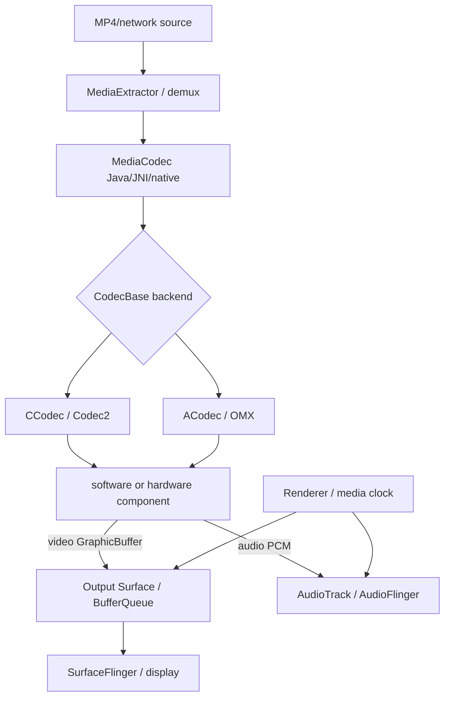
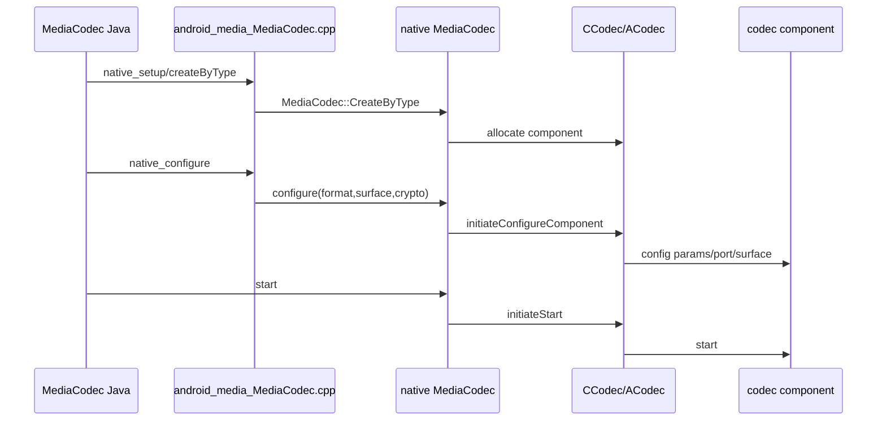
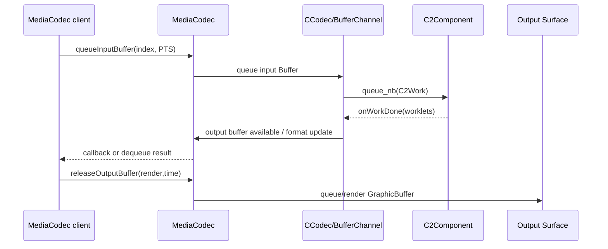

# 30 Android MediaCodec、Codec2 与视频播放

> 源码版本：Android 11 / API 30 / `android-11.0.0_r48`  
> 学习方式：macOS 只读源码，不要求编译、播放视频或运行 codec。  
> 前置章节：[12-Surface到SurfaceFlinger显示链路](./12-Surface到SurfaceFlinger显示链路.md)、[28-Android音频系统AudioFlinger与AudioPolicy](./28-Android音频系统AudioFlinger与AudioPolicy.md)、[29-Android相机系统Camera2与CameraService](./29-Android相机系统Camera2与CameraService.md)

---

## 1. 先分清三个动作

```text
解封装 demux：从 MP4/MKV/TS 容器取出音视频压缩 sample、时间戳和格式信息
解码 decode：H.264/H.265/VP9/AAC 等压缩 sample 变成 raw video frame/PCM
渲染 render：视频 frame 按时间送 Surface，音频 PCM 送 AudioTrack
```

MediaExtractor 主要做解封装，MediaCodec 做编解码，Surface/AudioTrack 做输出。`MediaCodec` 不会因为你传入一个 MP4 文件名就自动完成全部播放器功能。

---

## 2. 两条并行数据流

```text
压缩输入流：Extractor sample → codec input buffer/C2Work
解码输出流：codec output → ByteBuffer 或 GraphicBuffer/Surface

控制与时序：MediaFormat、CSD、PTS、flags、format change、EOS、error
```

视频像素在 Surface 模式通常不回到 Java ByteBuffer；控制回调和 GraphicBuffer 是不同通路。

---

## 3. 总体架构



---

## 4. Android 11 的版本边界

Android 11 同时存在：

```text
ACodec：Stagefright 对 OMX components 的适配与状态机
CCodec：Stagefright 对 Codec2 components 的适配
```

`MediaCodec::GetCodecBase()` 根据 component name/owner 选择 CCodec 或 ACodec。不能写成“Android 11 已完全移除 OMX”，也不能只学 ACodec 忽略 Codec2。

---

## 5. 核心源码入口

```text
frameworks/base/media/java/android/media/MediaCodec.java
frameworks/base/media/jni/android_media_MediaCodec.cpp
frameworks/av/media/libstagefright/MediaCodec.cpp
frameworks/av/media/libstagefright/CodecBase.cpp
frameworks/av/media/libstagefright/ACodec.cpp
frameworks/av/media/codec2/sfplugin/CCodec.cpp
frameworks/av/media/codec2/sfplugin/CCodecBufferChannel.cpp
frameworks/av/media/codec2/hidl/client/client.cpp
frameworks/av/media/codec2/hidl/client/include/codec2/hidl/client.h
frameworks/av/media/codec2/core/include/C2Work.h
```

---

## 6. MediaExtractor

Java 入口：

```text
frameworks/base/media/java/android/media/MediaExtractor.java
frameworks/base/media/jni/android_media_MediaExtractor.cpp
frameworks/av/media/libstagefright/NuMediaExtractor.cpp
frameworks/av/media/libstagefright/MediaExtractorFactory.cpp
frameworks/av/services/mediaextractor/MediaExtractorService.cpp
```

常用流程：

```text
setDataSource
 → getTrackCount/getTrackFormat
 → selectTrack
 → readSampleData
 → getSampleTime/getSampleFlags/getSampleTrackIndex
 → advance
```

Extractor 不保证 sample 是完整视频帧的可显示像素；它通常返回 codec-specific compressed access unit。

---

## 7. Track 与 Sample

容器可包含 video、audio、subtitle、metadata tracks。每个 selected track 产生 sample：

- compressed bytes。
- presentation timestamp（PTS）。
- sync/key frame flags。
- encryption information。

一个 MP4 sample 常对应一个 access unit，但容器/codec/plugin 细节不同。不要按固定字节大小切 H.264 输入。

---

## 8. MediaFormat

Extractor 的 track format 常包含：

```text
KEY_MIME
KEY_WIDTH / KEY_HEIGHT
KEY_FRAME_RATE（可能是声明/估计）
KEY_DURATION
KEY_MAX_INPUT_SIZE
csd-0 / csd-1 ...
color standard/range/transfer、rotation、crop
```

输入 format 是配置请求；真正 codec 输出 format 可能在运行中通过 `INFO_OUTPUT_FORMAT_CHANGED`/callback 改变。

---

## 9. Codec-Specific Data

CSD 携带解码初始化信息，例如 AVC SPS/PPS、HEVC VPS/SPS/PPS、AAC AudioSpecificConfig。通常由 Extractor 放入 `csd-*`，`configure()` 时交给 codec。

若手工喂裸流，需要正确构造/提交 codec config buffer。CSD 格式可能是 Annex B、length-prefixed 或 codec-specific structure，不能互换猜测。

---

## 10. 创建 Codec

```java
MediaCodec codec = MediaCodec.createDecoderByType(mime);
// 或 createByCodecName 精确选择组件
```

按 MIME 创建会由 MediaCodecList 找可用 decoder；按名称创建锁定 component。系统可能有：

- hardware accelerator。
- software codec（如 c2.android.*）。
- vendor codec（如 c2.vendor.* / OMX.vendor.*）。
- secure decoder。

“硬件解码”不能只靠 codec 名称字符串猜，需查 capabilities、vendor 实现和实际 metrics。

---

## 11. MediaCodec 状态机

简化状态：

```text
Uninitialized
 → create：Initialized
 → configure：Configured
 → start：Executing
    ├─ Flushed
    ├─ Running
    └─ End-of-Stream
 → stop：Initialized
 → release：Released
```

只有正确状态才可 dequeue/queue/flush。大量 `IllegalStateException` 来自状态调用顺序，而不是 decoder 不支持码流。

---

## 12. configure 参数

```text
format：mime、size、CSD、profile/level 等
surface：video decoder output Surface；可为 null 走 ByteBuffer
crypto/descrambler：加密内容
flags：CONFIGURE_FLAG_ENCODE 表示编码器
```

`configure()` 只是谈妥参数/Surface，不会开始消费输入；必须 `start()`。

---

## 13. Java 到 native



native MediaCodec 是公共状态机/缓冲 API 适配层；真正 component 在 CCodec/ACodec 后面。

---

## 14. ALooper/AMessage 异步架构

Stagefright MediaCodec、ACodec、CCodec 大量使用 `ALooper`、`AHandler`、`AMessage`。Java 同步方法可能：

```text
JNI 发消息给 native looper
 → 等待 reply
 → codec backend 异步处理
 → callback/message 更新状态
```

阅读调用链要跟 `kWhat...` message case，不能只在 public C++ 方法向下搜普通函数调用。

---

## 15. 同步 Buffer 模式

典型 decoder loop：

```java
int in = codec.dequeueInputBuffer(timeoutUs);
if (in >= 0) {
    ByteBuffer b = codec.getInputBuffer(in);
    int size = extractor.readSampleData(b, 0);
    if (size < 0) {
        codec.queueInputBuffer(in, 0, 0, 0,
                MediaCodec.BUFFER_FLAG_END_OF_STREAM);
    } else {
        codec.queueInputBuffer(in, 0, size,
                extractor.getSampleTime(), extractor.getSampleFlags());
        extractor.advance();
    }
}
int out = codec.dequeueOutputBuffer(info, timeoutUs);
if (out >= 0) codec.releaseOutputBuffer(out, true);
```

示例省略 format change、try/finally、seek、error 和 A/V scheduling。

---

## 16. Buffer 所有权

```text
dequeueInputBuffer(index)：codec 把一个空 input slot 的临时所有权交给 App
queueInputBuffer(index)：App 归还 slot，之后不得再写对应 ByteBuffer
dequeueOutputBuffer(index)：codec 把 output slot 交给 App
releaseOutputBuffer(index)：App 归还/渲染，之后对象失效
```

index 是当前 generation 的 slot，不是帧永久 ID。flush/stop 后旧 index 全部失效。

---

## 17. Input PTS

`queueInputBuffer(... presentationTimeUs ...)` 的 PTS 来自容器 sample time，而不是 `System.currentTimeMillis()`。它用于：

- 输出 frame 时间戳。
- B-frame reorder 后恢复呈现顺序。
- A/V sync。
- Surface release scheduling。

PTS 可不按输入顺序严格递增（编码/解码 reorder），播放端应依输出 BufferInfo 的 PTS。

---

## 18. DTS 与 PTS

包含 B-frame 的码流：

```text
decode order ≠ presentation order
```

容器/Extractor/codec 负责足够信息让 decoder 重排。MediaCodec 公共输出主要暴露 presentationTimeUs；不要按 input queue 次序直接安排屏幕显示。

---

## 19. Output BufferInfo

```text
offset
size
presentationTimeUs
flags：KEY_FRAME、CODEC_CONFIG、END_OF_STREAM、PARTIAL_FRAME 等
```

Surface output 时，输出 ByteBuffer 通常不可用于读取像素，但 BufferInfo 仍用于 PTS/EOS/size 等控制。`size==0` 也可能携带重要 EOS flag。

---

## 20. INFO_OUTPUT_FORMAT_CHANGED

同步 dequeue 可返回：

```text
INFO_TRY_AGAIN_LATER
INFO_OUTPUT_FORMAT_CHANGED
INFO_OUTPUT_BUFFERS_CHANGED（旧 buffer-array API 兼容）
```

视频实际 crop/color/stride，音频 sample rate/channel 等可在 output format 出现。必须处理 format changed，不能永远使用输入 format 推断输出布局。

---

## 21. 异步 Callback 模式

```java
codec.setCallback(new MediaCodec.Callback() {
    onInputBufferAvailable(...)
    onOutputBufferAvailable(...)
    onOutputFormatChanged(...)
    onError(...)
}, handler);
codec.configure(...);
codec.start();
```

异步模式不能再调用同步 dequeue。Callback 应快速 queue/release 或转交受控队列，不能阻塞其 Handler 导致 codec 饥饿。

---

## 22. 同步与异步不能混用

在 async mode，native MediaCodec 明确拒绝 dequeueInput/OutputBuffer。两种模式都是同一 codec buffer ownership 协议的不同通知方式：

```text
sync：App 主动询问可用 index
async：codec callback 通知可用 index
```

不是“异步模式内部无限线程自动播放”。App 仍负责输入、输出 release、EOS 和状态机。

---

## 23. ByteBuffer 输出模式

`configure(format, null, ...)` 的 video decoder 可能输出可读 YUV buffer。限制：

- 输出 color format/stride/slice height/crop 必须按 output format。
- 某些 hardware codec 不支持灵活 ByteBuffer 输出。
- CPU 拷贝/转换成本大。
- 受保护内容禁止 CPU 读取。

若只是显示视频，应优先 Surface，避免 GPU/CPU 往返拷贝。

---

## 24. Surface 输出模式

配置 output Surface 后：

```text
decoder 得到/产生 GraphicBuffer
 → 解码器写 YUV/private format
 → App releaseOutputBuffer(index, render)
 → buffer queue 到 Surface consumer
 → SurfaceFlinger/GL/其他 consumer 使用
```

Java 获得 output index 和 metadata，但通常不直接触摸像素。

---

## 25. releaseOutputBuffer(true) 意味什么

`render=true` 表示把该 decoded output 送到配置 Surface。它不表示用户在调用返回瞬间已看到像素：

```text
release → queue buffer
 → 等 acquire fence
 → consumer latch
 → SurfaceFlinger composition
 → display scanout
```

真实显示还受 BufferQueue、VSync、合成和显示硬件时序影响。

---

## 26. 按时间渲染

`releaseOutputBuffer(index, renderTimestampNs)` 使用纳秒级 monotonic time 安排 Surface release。不要把 input PTS 微秒直接原样传入：

```text
PTS(us)：媒体时间轴
renderTimestamp(ns)：系统 monotonic 目标时间
```

播放器用 media clock 将二者映射，考虑 seek、pause、speed、audio latency。

举一个只为说明单位和时间轴的简化例子：

```text
当前系统 monotonic time       = 100,000,000,000 ns（100 秒）
此刻 media clock 对应媒体位置 = 4,980,000 us（4.98 秒）
待显示视频帧 PTS             = 5,000,000 us（5.00 秒）
还需要等待                   = 20,000 us = 20,000,000 ns
目标 renderTimestampNs       ≈ 100,020,000,000 ns
```

所以不能把 `5,000,000 us` 机械乘 1000 后当成系统目标时间；那只完成了单位转换，没有完成“媒体时间轴 → 系统 monotonic 时间轴”的映射。暂停、倍速、seek 和音频延迟都会改变这次映射。

---

## 27. Surface 与 BufferQueue

```text
codec component：producer
SurfaceTexture/SurfaceView：consumer/display route
```

实际 CCodec/ACodec 通过 buffer channel、GraphicBufferSource/ANativeWindow、generation 等管理 buffer。release output 后 buffer 才进入 consumer 可见队列。

换 Surface 时需遵守 `setOutputSurface()` 能力和状态；不是把 Java Surface 字段替换即可。

---

## 28. Fence 与 GraphicBuffer

codec hardware、GPU、SurfaceFlinger 异步访问同一 GraphicBuffer。acquire/release fence 保证写完才读、读完才复用。

Codec output “完成”可能指硬件已产出并给出 fence，不代表 CPU 可忽略 fence 立即读取。

---

## 29. CCodec 是什么

`CCodec` 实现 `CodecBase`，把 Stagefright MediaCodec 协议映射到 Codec2：

- 选择/创建 `C2Component`。
- 用 `CCodecConfig` 映射 MediaFormat 与 C2 params。
- 用 `CCodecBufferChannel` 管 input/output buffers。
- 把输入包装为 `C2Work` queue 给 component。
- 接收 work done，映射为 MediaCodec output callback。
- flush/stop/release component。

---

## 30. Codec2Client 与 ComponentStore

源码：

```text
frameworks/av/media/codec2/hidl/client/client.cpp
frameworks/av/media/codec2/hidl/client/include/codec2/hidl/client.h
frameworks/av/media/codec2/core/include/C2Component.h
```

Codec2 component 可在进程内或通过 Codec2 HAL/service 远程提供。Client 从 component store 按名称创建 component，并进行 config/query/queue/flush。

不要假设所有 hardware decoder C++ 都链接在 App 或 mediaserver 进程中。

---

## 31. C2Work

一项 work 大致包含：

```text
input ordinal：timestamp、frameIndex
input buffers
input flags/config updates
worklets：output buffers、output ordinal、config updates、result
```

CCodec 把 MediaCodec input slot 转成 C2Work，component 异步完成后通过 listener 返回 work done，再转成 output buffer/format/error。

---

## 32. C2Buffer 类型

```text
linear buffer/block：压缩 bitstream、PCM 等线性字节
graphic buffer/block：视频 frame、GraphicBuffer/planes
```

Allocator/BlockPool 决定内存来源和共享方式。CCodecBufferChannel 负责在 MediaCodec ByteBuffer/Surface slot 与 C2Buffer 间适配。

---

## 33. Codec2 参数模型

C2 params 描述 stream/picture/bitrate/profile/color 等，分 input/output、port/stream、read-only/tunable。CCodecConfig 将 `MediaFormat` key 映射到这些 params，再把 component 的 config updates 反映回 output format。

不是每个任意 MediaFormat key 都会被 hardware component接受；configure 可拒绝、不支持或调整。

---

## 34. CCodec queue 与 work done



一项 input work 不保证恰好产生一个 output buffer；codec delay、CSD、B-frame、filtering 都可能改变关系。

---

## 35. ACodec/OMX 路径

ACodec 使用 OMX node/ports/buffers：

```text
allocate component
 → configure OMX parameters
 → Loaded→Idle→Executing state
 → emptyBuffer 输入
 → fillBuffer 输出
 → port settings changed / flush
```

Android 11 为兼容 vendor components 仍保留。概念上同样遵守 input/output buffer ownership，但内部状态与 Codec2 C2Work 不同。

---

## 36. MediaCodecList 与组件选择

源码：

```text
frameworks/av/media/libstagefright/MediaCodecList.cpp
frameworks/av/media/libmedia/MediaCodecInfo.cpp
frameworks/av/media/codec2/sfplugin/Codec2InfoBuilder.cpp
```

选择考虑：

- encoder/decoder 与 MIME。
- profile/level、size/rate、color format。
- secure/tunneled/low-latency feature。
- software/hardware/vendor 排名。
- XML 配置和设备暴露组件。

支持 MIME 不代表支持任意分辨率、profile 和帧率组合。

---

## 37. Codec Capabilities

应用可查：

```text
VideoCapabilities：size/rate/bitrate/alignment
AudioCapabilities：sample rate/channel/bitrate
EncoderCapabilities
profileLevels
colorFormats
features：adaptive/secure/tunneled/partial-frame...
```

Capabilities 是组件声明，configure 仍可能因资源不足、并发 session、vendor 限制失败。

---

## 38. Hardware Resource 竞争

硬件 codec instance 数有限。多个 4K decoder、encoder、camera、secure session 可能超过资源。系统可返回：

- `CodecException.ERROR_INSUFFICIENT_RESOURCE`。
- `ERROR_RECLAIMED`（资源被系统回收）。
- configure/start failure。

App 必须释放无用 codec，并准备降分辨率/软件 fallback 或重建。

---

## 39. Secure Playback

DRM 内容：

```text
MediaExtractor/Drm session
 → MediaCrypto
 → configure secure decoder + secure Surface
 → queueSecureInputBuffer(subsamples,key/iv/mode)
 → protected buffers
 → trusted display path
```

加密 payload 不应暴露给普通 ByteBuffer/截图。secure decoder、Surface 和 HDCP/输出政策必须共同满足。

---

## 40. CryptoInfo 与 subsamples

一个 sample 可由若干 clear/encrypted byte 区间组成，附 key、IV、AES mode/pattern。`queueSecureInputBuffer()` 将这些描述交给 secure component。

CryptoInfo 不包含解密后的明文；错误的 subsample 边界会导致解码/DRM 错误。

---

## 41. EOS 输入

ByteBuffer 输入模式：在最后有效 sample 上附 `BUFFER_FLAG_END_OF_STREAM`，或再送一个 size=0 EOS buffer。Surface encoder 输入用 `signalEndOfInputStream()`。

```text
input EOS queued
≠ output EOS 立即出现
```

codec 还要 drain 内部重排/缓存帧，直到 output BufferInfo 带 EOS 才算输出结束。

---

## 42. Drain

decoder/encoder 内部可能缓存：

- B-frame reorder。
- lookahead。
- codec delay。
- encoder pipeline。

停止喂输入后必须等待 output EOS，不能看到 Extractor EOF 就直接 `stop()`，否则尾帧/尾音频会丢失。

---

## 43. flush 的语义

`flush()`：

- 丢弃 queued/inflight input/output。
- 使此前获得的 buffer index 失效。
- 重置 codec pipeline 到 flushed 状态。
- 保留 component/configuration，通常无需重新 configure。

同步模式会在下次 `dequeueInputBuffer()` 时恢复；如果配置了 input Surface，则会自动恢复。异步模式在 Android 11 的 `MediaCodec.java` API 合同中明确要求：`flush()` 返回后再次调用 `start()`，codec 才会继续请求 input buffer。与此同时，flush 前已经排队但尚未处理的 callback 仍可能到达，其中的旧 index 已失效，必须丢弃。

---

## 44. flush 不等于 seek

播放器 seek 通常：

```text
Extractor.seekTo(target,sync mode)
 + codec.flush
 + 从目标附近 sync frame 重新喂数据
 + 丢弃 PTS 早于精确目标的 decoded frames
 + 重置 audio/video clock
```

单独 flush 不会移动数据源位置；单独 extractor seek 不清旧 codec frames，会混入 seek 前输出。

---

## 45. stop 与 reset/release

```text
stop：结束 Executing，回 Initialized，可重新 configure
reset：回到近似刚 create 的 Uninitialized 状态并重建配置语义
release：释放 native component、buffer、Surface connection
```

异常路径必须 release。等待 GC/finalizer 释放 hardware codec 会造成资源耗尽。

---

## 46. recoverable 与 transient CodecException

`MediaCodec.CodecException` 提供 diagnostic info，并可标记：

```text
isRecoverable：stop/configure/start 可能恢复
isTransient：稍后重试可能成功
```

不能仅 catch 后继续用旧 buffer index；错误发生后 codec 状态/ownership 可能已变化，应按分类重建或退出。

---

## 47. Output format 与 crop

视频 decoder 可能输出对齐后的 buffer width/height，但有效画面由 crop-left/right/top/bottom 指定。Surface path 通常让 gralloc/consumer处理；ByteBuffer YUV 必须使用 stride/slice-height/crop。

显示分辨率不是简单 `buffer.capacity()` 反推。

---

## 48. Color Aspects

```text
color standard：BT.601/709/2020
range：limited/full
transfer：SDR gamma、ST2084(PQ)、HLG
dataspace/HDR static metadata
```

Extractor→decoder→GraphicBuffer→SurfaceFlinger/display 必须保留/转换色彩信息。解码成功但颜色灰、偏色、HDR 过曝常是 color metadata/dataspace 链问题。

---

## 49. HDR 与 10-bit

HDR 解码要求 codec profile/bit depth、GraphicBuffer format、Surface、composer/display 都支持。组件支持 HEVC 不代表支持 Main10/HDR10。

无 HDR display 时需要 tone mapping，可能由 codec、GPU、SurfaceFlinger或硬件完成，依设备实现。

---

## 50. Adaptive Playback

支持 adaptive playback 的 decoder 配合 Surface，可在不完全重建 codec 的情况下切换一定范围内的分辨率。通常需在 configure 提供 max-width/max-height，并正确输入新 CSD/key frame。

它不是任意 codec/profile/secure 状态无缝切换；超出能力仍需重建。

---

## 51. 视频帧调度

播放器不能 output 一来就 `render=true`。它需要比较：

```text
frame PTS
当前 media clock position
目标 VSync/display timing
audio latency/playback speed
```

太早则等待，适时用 renderTimestamp release，太晚则 drop。`VideoFrameScheduler` 帮助把目标呈现对齐 VSync。

---

## 52. 音频为何常作为主时钟

AudioTrack 持续由硬件消费，timestamp 相对稳定，播放器常以 audio media time 为主时钟：

```text
video early → 等待
video late slightly → 尽快显示
video too late → drop
```

无音轨、音频未启动或 seek 时可用 system clock/standalone media clock。A/V sync 是播放器/renderer职责，不是 decoder 自动完成。

---

## 53. NuPlayer 完整播放器

源码：

```text
frameworks/av/media/libmediaplayerservice/nuplayer/NuPlayer.cpp
NuPlayerSource.cpp / NuPlayerDecoder.cpp / NuPlayerRenderer.cpp
```

NuPlayer 把 source/demux、MediaCodec decoder、AudioSink、Renderer 和 clock 组织起来。它说明为什么完整 MediaPlayer 比手写 MediaCodec loop 多出 buffering、seek、track switch、DRM、subtitle、A/V sync 和 error recovery。

---

## 54. NuPlayerRenderer

Renderer 管理 audio/video queues、media clock、late frame、pause/resume、EOS。视频 dequeue 后并非立即显示，而是根据 audio sink position 和 PTS 计算延迟/丢帧。

阅读同步问题可从 `NuPlayerRenderer.cpp` 的 drainAudioQueue/drainVideoQueue 入口建立模型。

---

## 55. Surface 生命周期

Activity/TextureView Surface 可销毁重建。策略：

- 若 codec 支持且状态允许，`setOutputSurface(newSurface)`。
- 否则 stop/reconfigure/recreate codec。
- 旧 Surface abandon 后继续 render 会出错。
- 生命周期操作与 output callback 串行协调。

不能只把 UI 中 Surface 引用换掉，codec native window connection 仍指旧 producer。

---

## 56. TextureView 与 SurfaceView

```text
TextureView：codec→SurfaceTexture，作为 App UI texture 再合成，变换方便
SurfaceView：独立 Surface layer，可能减少额外合成/拷贝，适合视频
```

两者都可作为 MediaCodec output Surface，但显示路径、变换、生命周期和功耗不同。

---

## 57. Decode Zero-Copy 是相对说法

Surface decode 可避免把 YUV 拷到 Java/CPU，但 pipeline 仍可能：

- codec 内部转换。
- gralloc buffer import/map。
- GPU texture/composition。
- colorspace/tone map。
- display hardware scanout。

“zero-copy”通常指减少 CPU 可见拷贝，不代表硬件中完全没有数据移动。

---

## 58. 编码器输入 ByteBuffer

音频/软件生成视频可 dequeue input buffer 写 raw data，PTS 必须单调、符合时间轴。视频 raw input 还需正确 color format、stride、frame size，CPU 拷贝昂贵。

对于 camera/GL 视频编码，通常使用 encoder input Surface。

---

## 59. Encoder Input Surface

```text
configure encoder with COLOR_FormatSurface
 → createInputSurface
 → Camera 或 EGL 成为 producer
 → GraphicBuffer queue 到 codec GraphicBufferSource/CCodec input surface
 → codec 编码
 → dequeue compressed output
```

此时不能 dequeueInputBuffer；EOS 用 `signalEndOfInputStream()`。

---

## 60. Camera 到编码器

第 29 章录像链：

```text
Camera CaptureSession target = MediaCodec input Surface
 → Camera HAL 写 GraphicBuffer
 → encoder 读取 frame + timestamp
 → H.264/HEVC output ByteBuffer
 → MediaMuxer.writeSampleData
```

避免 Camera YUV→Java→codec 的大拷贝。相机 sensor timestamp 进入 buffer/encoder PTS，需与音频时钟/录音 PTS 对齐。

---

## 61. Encoder Output 与 CSD

编码开始可能先返回 `BUFFER_FLAG_CODEC_CONFIG` 或 output format 的 `csd-*`。MediaMuxer 通常在 output format changed 后 `addTrack()` 并 start，再写正常 samples；不要把 codec config 当普通视频帧重复写入容器。

不同 encoder/container 的 CSD 处理以 API 合同为准。

---

## 62. Key Frame

解码随机访问通常从 sync/key frame 开始；编码可配置 I-frame interval 或动态请求 sync frame。Key frame 不依赖前一图像完整重建，但 H.264 IDR 与一般 sync sample 语义仍有细节。

seek 到最近 sync frame 后，仍可能要解码并丢弃若干帧才能到精确目标 PTS。

---

## 63. Bitrate 与码率模式

编码常见 CBR/VBR/CQ，由 EncoderCapabilities 决定。设置 bitrate 是目标/约束，不保证每秒字节绝对固定；复杂场景、VBV、key frame 会波动。

运行中 `setParameters()` 可调 bitrate/request-sync 等受支持参数，不等于所有 configure key 都可动态修改。

---

## 64. Low Latency

低延迟需要整个 pipeline 配合：

- codec low-latency feature。
- 少 B-frame/重排/encoder lookahead。
- 小 input/output queue。
- 网络 jitter buffer。
- Surface buffer 与 VSync。
- AudioTrack buffer。

只把 dequeue timeout 设为 0 不会降低 codec pipeline latency，反而可能 busy-loop。

---

## 65. Dropped Frame 的层次

```text
source/network 未送到
extractor/sample 丢失
decoder 丢/报错
renderer 因 PTS 太晚主动 drop
BufferQueue consumer 丢旧 frame
SurfaceFlinger missed deadline
display refresh 重复/跳过
```

必须用 PTS/frame number/queue depth 区分在哪一层掉帧。

---

## 66. Backpressure

若 App 不及时 release output：

```text
output slots 占满
 → component 无处放 decoded frame
 → 停止消费 input
 → input dequeue 不再可用
 → 整条 pipeline 堵塞
```

Surface consumer 太慢也会通过 BufferQueue 反压 codec。input 不可用不一定是 decoder 线程死锁。

---

## 67. Buffer 数量与内存

4K YUV/10-bit GraphicBuffer 很大，codec、Surface、consumer、reorder 各持多帧。内存主要在 gralloc/native/codec service，不全计入 Java heap。

多个 decoder、adaptive max size、B-frame reorder 和 Surface queue 会放大峰值；Java GC 正常不代表媒体内存没有压力。

---

## 68. Codec Service 死亡

远程 component/service death 可产生 `DEAD_OBJECT`/CodecException。旧 buffer indices、GraphicBlocks 和 component 状态不可继续使用。

应用应释放旧 MediaCodec，按资源/生命周期重新创建，且处理 Surface、Extractor、DRM session 是否仍有效。

---

## 69. 常见问题分层诊断

| 现象 | 优先检查 |
|---|---|
| createByType 失败 | MIME、MediaCodecList、组件服务、资源 |
| configure 失败 | profile/level/size/rate、CSD、Surface、secure feature |
| input 一直不可用 | 未 start、output 未 release、component stalled、状态错误 |
| output 一直无数据 | CSD/码流、未 queue input、缺 key frame、EOS/DRM |
| 解码有 output 但黑屏 | release render、Surface 生命周期、BufferQueue/color/secure |
| 画面快慢不对 | PTS 单位/时间轴、media clock、release timestamp |
| seek 后旧画面 | 未同时 extractor seek + codec flush + clock reset |
| 结尾少几帧 | 未 queue input EOS 或未 drain 到 output EOS |
| 颜色异常 | output color aspects/dataspace/tone mapping |
| 运行一会卡死 | output buffer 未 release、Surface consumer backpressure |
| ERROR_RECLAIMED | hardware codec 资源被回收，需重建/降级 |

---

## 70. MediaCodec metrics/dumpsys 阅读方向

以后连接设备可关注：

```text
codec component name/owner（c2/OMX、vendor/software）
mime、size、profile/level、secure
input/output buffer counts
queued/dequeued/released、latency histogram
errors/reclaimed
color aspects、rotation、crop
Surface generation/usage
```

本课程不执行 adb，只建立诊断字段和源码路径。

---

## 71. 源码路线一：Extractor

```text
frameworks/base/media/java/android/media/MediaExtractor.java
frameworks/base/media/jni/android_media_MediaExtractor.cpp
frameworks/av/media/libstagefright/NuMediaExtractor.cpp
frameworks/av/media/libstagefright/MediaExtractorFactory.cpp
frameworks/av/services/mediaextractor/MediaExtractorService.cpp
```

练习：选 MP4 video track，记录 format/CSD、sample bytes、PTS、sync flag 和 advance。

---

## 72. 源码路线二：MediaCodec 公共状态机

```text
frameworks/base/media/java/android/media/MediaCodec.java
frameworks/base/media/jni/android_media_MediaCodec.cpp
frameworks/av/media/libstagefright/MediaCodec.cpp
frameworks/av/media/libstagefright/CodecBase.cpp
```

练习：从 configure/start/queue/dequeue/release/flush 追 `kWhat...` 消息和 buffer ownership。

---

## 73. 源码路线三：Codec2

```text
frameworks/av/media/codec2/sfplugin/CCodec.cpp
frameworks/av/media/codec2/sfplugin/CCodecConfig.cpp
frameworks/av/media/codec2/sfplugin/CCodecBufferChannel.cpp
frameworks/av/media/codec2/sfplugin/Codec2Buffer.cpp
frameworks/av/media/codec2/hidl/client/client.cpp
frameworks/av/media/codec2/hidl/client/include/codec2/hidl/client.h
frameworks/av/media/codec2/core/include/C2Work.h
```

练习：从 MediaCodec input index 追成 C2Work，再从 onWorkDone 回到 output index/format。

---

## 74. 源码路线四：ACodec/OMX

```text
frameworks/av/media/libstagefright/ACodec.cpp
frameworks/av/media/libstagefright/ACodecBufferChannel.cpp
frameworks/av/media/libstagefright/omx/
frameworks/av/media/libstagefright/MediaCodecList.cpp
```

练习：比较 OMX empty/fill buffer 与 Codec2 queue C2Work 的所有权对应关系。

---

## 75. 源码路线五：Surface 与同步

```text
frameworks/av/media/libstagefright/SurfaceUtils.cpp
frameworks/av/media/libstagefright/VideoFrameScheduler.cpp
frameworks/native/libs/gui/Surface.cpp
frameworks/native/libs/gui/BufferQueueProducer.cpp
frameworks/av/media/libmediaplayerservice/nuplayer/NuPlayerRenderer.cpp
```

练习：用一个 output PTS 追 media clock→renderTimestamp→BufferQueue→SurfaceFlinger。

---

## 76. 推荐八组只读练习

1. **解封装**：区分 track format、CSD、sample、PTS。
2. **状态机**：画 create/configure/start/flush/stop/release 合法迁移。
3. **所有权**：追一个 input/output index 的完整生命周期。
4. **Codec2**：画 input buffer→C2Work→work done→output。
5. **Surface**：解释 release(true) 后为何还没立刻显示。
6. **EOS**：从 extractor EOF 追 input EOS 到 output EOS。
7. **Seek**：列出 extractor、codec、renderer/clock 三层动作。
8. **综合诊断**：为“有 output callback 但黑屏”列证据。

---

## 77. 初学者最容易混淆的十二点

1. Extractor 解封装，不解码视频像素。
2. MediaCodec 不是完整播放器。
3. Android 11 同时有 CCodec 和 ACodec。
4. configure 不等于 start。
5. buffer index 不是永久帧 ID。
6. queue 后不能继续写 input ByteBuffer。
7. output PTS 不应按 input queue 顺序猜。
8. Surface mode 通常不能从 output ByteBuffer 读像素。
9. release(render=true) 不等于调用返回时已经上屏。
10. input EOS 不等于 output 已 drain 完。
11. flush 不等于 seek。
12. 解码成功不等于 A/V sync 正确。

---

## 78. 自测题

1. demux、decode、render 分别由谁负责？
2. CSD 与普通 compressed sample 有什么区别？
3. MediaCodec 如何选择 CCodec 或 ACodec？
4. dequeue/queue/release 如何转移 buffer 所有权？
5. PTS 微秒与 render timestamp 纳秒是什么关系？
6. C2Work 为什么不保证一进一出？
7. output format changed 为什么必须处理？
8. Surface 模式为何能减少 CPU 拷贝？
9. EOS 为什么要 drain？
10. seek 为什么要同时操作 Extractor、Codec 和 Clock？
11. Focus/AudioTrack 与视频 decoder 的 A/V sync 如何关联？
12. output 不及时 release 为什么连 input 都会停？

---

## 79. 自测答案

1. Extractor、codec component、Surface/AudioTrack+renderer 分别负责。
2. CSD 是 decoder 初始化参数；sample 是时间轴上的压缩媒体 access unit。
3. native `MediaCodec::GetCodecBase` 根据 component name/owner/配置创建后端。
4. dequeue 交给 App，queue/release 归还 codec或送 Surface；flush/stop 使旧 index 失效。
5. 播放器用 media clock 把媒体 PTS 映射到 monotonic system time，并做单位转换和速度/暂停调整。
6. codec 可缓存、重排、多 output/无 output、仅 config update 或 EOS。
7. 实际 crop/stride/color/audio 参数可与输入请求不同或动态变化。
8. decoder 直接写 GraphicBuffer 并 queue 到 Surface，避免 YUV 经 Java/CPU 往返。
9. 内部仍有 reorder/lookahead/cache，output EOS 前还有有效尾帧。
10. 分别移动数据源、清旧 pipeline、重置呈现时间基准，缺一会混入旧帧或时序错误。
11. renderer 常以 AudioTrack timestamp 为主时钟，按 PTS 调度/丢弃 video output。
12. output slots/Surface buffers 耗尽，component 无处放结果，于是停止消费更多 input。

---

## 80. 本章结论

完整视频播放主线：

```text
MediaExtractor 从容器读压缩 sample 和 PTS；
MediaCodec 公共状态机把 buffer 交给 CCodec/Codec2 或 ACodec/OMX component；
decoder 异步产生 output 和 format changes；
播放器按 audio/media clock 把 output PTS 映射为 renderTimestamp；
GraphicBuffer 经 Surface/BufferQueue、SurfaceFlinger 和显示硬件上屏。
```

遇到问题依次问：

```text
Extractor 是否选对 track，CSD/sample/PTS 是否正确？
codec 状态是否合法，实际组件与 capabilities 是什么？
input/output buffer 所有权是否及时归还？
output format、crop、color 和 Surface 是否匹配？
媒体 PTS 如何映射到 monotonic render time？
EOS、flush、seek、Surface 生命周期是否完整收敛？
```

把压缩输入、解码工作、GraphicBuffer 输出和媒体时钟四条线并排记录，就能看清“能解码”和“能正确播放”之间的全部距离。
