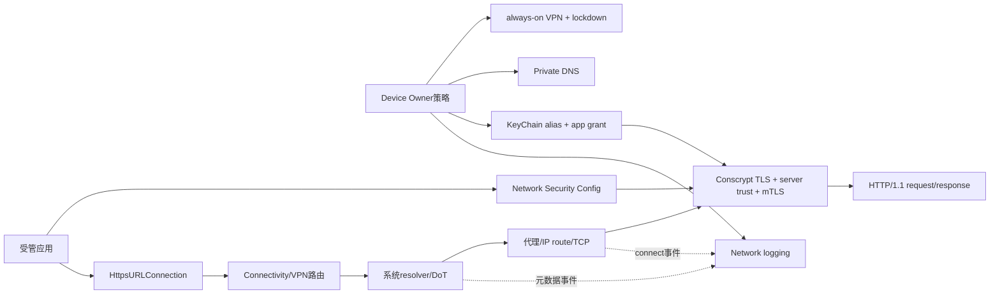
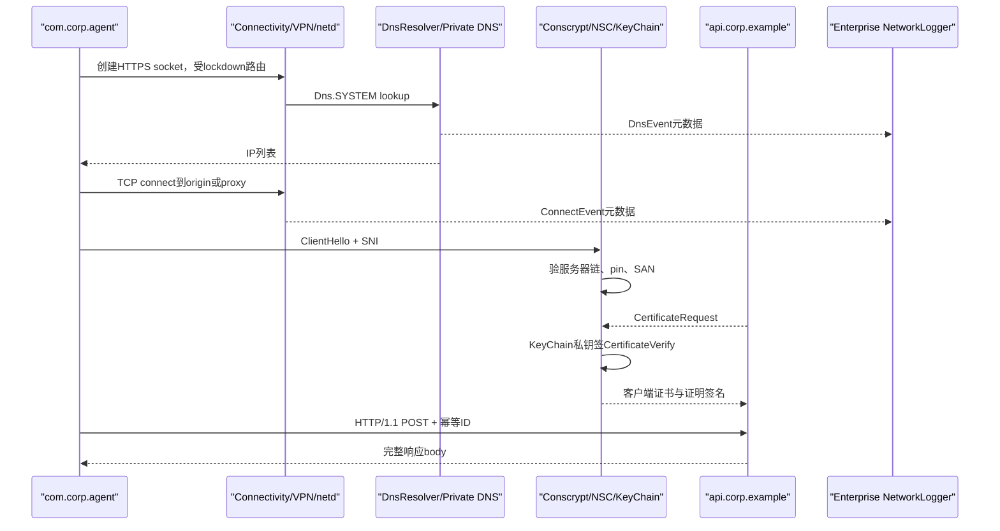
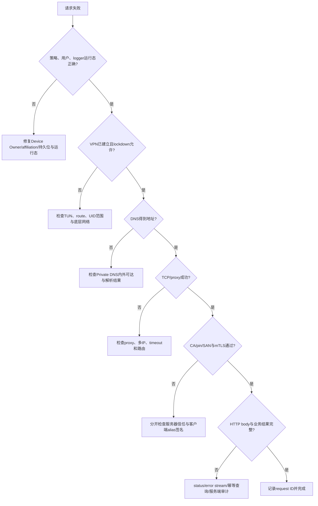

# 300 Android企业受管应用mTLS请求端到端综合案例：策略、VPN、DNS、信任、私钥、HTTP、日志、故障与轮换闭环

## 1. 本章目标

本章用一个完整案例收束第201—299章：公司全托管Android 11设备上的受管应用，通过always-on VPN访问`api.corp.example`，使用指定Private DNS解析、企业CA验证服务器、KeyChain非导出私钥完成mTLS，并由Device Owner收集低开销网络日志。我们逐层推演成功、失败、重试、轮换和撤销。

## 2. Android 11版本边界

案例只按本地`android-11.0.0_r48`。它使用旧KeyChain/keystore服务、平台repackaged OkHttp、Android 11 Connectivity/Vpn/Private DNS和DPMS；不使用keystore2/KeyMint、现代okhttp3、HTTP/3、后续企业API或厂商专用VPN/证书代理。

## 3. 场景假设

Device Owner为`com.corp.dpc`，受管业务应用为`com.corp.agent`，VPN为`com.corp.vpn`；服务端域名`api.corp.example:443`，服务器链由Corp Root签发，客户端身份alias按版本命名`corp-agent-v2`。所有用户均已affiliated，网络日志已启用。

## 4. 不做真实编译与联网

用户使用macOS，本章只读本地AOSP并做设计推演，不编译system image、不安装证书、不生成真实私钥、不连接企业服务。命令练习只用`rg/sed`定位源码，任何生产配置都需在隔离测试设备上验证。

## 5. 核心源码地图

```text
frameworks/base/services/devicepolicy/.../DevicePolicyManagerService.java
frameworks/base/services/core/.../connectivity/Vpn.java
frameworks/base/services/core/.../ConnectivityService.java
frameworks/base/core/java/android/security/net/config/*.java
frameworks/base/services/devicepolicy/.../{NetworkLogger,NetworkLoggingHandler}.java
packages/apps/KeyChain/src/com/android/keychain/KeyChainService.java
external/conscrypt/repackaged/common/src/main/java/com/android/org/conscrypt/*.java
external/okhttp/repackaged/{android,okhttp,okhttp-urlconnection}/src/main/java/**/*.java
packages/modules/DnsResolver/DnsProxyListener.cpp
system/netd/server/FwmarkServer.cpp
```

## 6. 八套独立状态

至少有设备管理角色、VPN/lockdown、Private DNS、服务器信任锚、客户端KeyChain grant、TLS session/连接、HTTP请求状态、企业日志批次八套状态。任何一套“enabled”都不能替另一套提供安全保证。

## 7. 端到端总图



## 8. 先定义成功标准

成功不是“connect返回”或“收到200”单一点，而是：策略生效、请求确实经允许路径、DNS得到预期地址、服务器链/hostname/pin通过、客户端证书被服务器接受、HTTP响应body完整、业务签名/nonce校验通过，并且重试没有重复副作用。

## 9. Device Owner为何适合此场景

全托管Device Owner能设置全局Private DNS、always-on VPN、网络日志，并管理企业CA/KeyPair；普通应用没有这些全设备权限。Profile Owner能力多限定工作资料，不能把本案例的全设备结论直接搬到BYOD个人侧。

## 10. 权限不应都塞进DPC进程

DPC可把证书安装、证书选择、网络日志分别delegation给专门包；最小权限能降低DPC被攻破后的爆炸半径。案例为清晰使用一个DPC，但生产应按角色、签名、更新与审计能力拆分。

## 11. 第一步：建立VPN策略

DPMS的`setAlwaysOnVpnPackage()`要求Profile/Device Owner，校验VPN包和lockdown whitelist已安装，再调用`ConnectivityManager.setAlwaysOnVpnPackageForUser()`；成功后保存admin的包名与lockdown状态。

## 12. always-on与lockdown不同

always-on负责系统持续启动/恢复指定VPN；lockdown限制其他应用在VPN未连通时绕过。只设always-on不一定阻止瞬时直连，只设网络日志也不会阻断流量。

## 13. lockdown白名单

白名单包可在lockdown时绕过VPN，VPN自身也需要建立底层隧道。把`com.corp.agent`加入白名单会破坏“业务只经VPN”目标；白名单应只包含确有引导/修复需要且风险已评估的组件。

## 14. VPN prepare与establish

系统为指定包准备VPN，VPN进程通过VpnService建立TUN、提交地址/路由/DNS/允许与拒绝应用集合，Vpn在system_server注册NetworkAgent。策略设置成功不等TUN已经established，运行时仍需观察VPN网络状态。

## 15. protect的用途

VPN进程对隧道外层socket调用`protect()`，避免外层数据再次被路由回TUN形成递归。业务应用不应随意获此绕过能力；lockdown还在内核UID规则层限制未走VPN的socket。

## 16. VPN故障时预期行为

lockdown开启时，VPN断开应使受管应用网络失败而不是静默转到Wi‑Fi/蜂窝直连。业务UI应明确“安全通道不可用”，后台任务退避，不应诱导用户关闭管理策略。

## 17. VPN不是服务器认证

即使流量进入企业VPN，VPN出口、内部DNS或中间设备仍可能错误/被攻破；应用TLS必须继续验证服务器证书和hostname。把“在内网”当成跳过TLS验证的理由会把单点网络控制升级为全局信任。

## 18. 第二步：配置Private DNS

Device Owner可调用`setGlobalPrivateDnsModeSpecifiedHost()`；公开API先做阻塞连通性检查，DPMS再以系统身份写Global的mode/specifier。该方法应在worker线程调用，不应阻塞DPC UI。

## 19. 指定host模式

模式为provider hostname时，系统要求通过TLS验证指定DoT服务器；验证失败的网络通常不能把该resolver当作可用Private DNS。它保护DNS传输和resolver身份，不保证resolver返回的业务地址一定正确。

## 20. 与VPN的双可达要求

DevicePolicyManager javadoc明确：Private DNS与VPN并用时，resolver应在VPN内外都可达，否则某些系统流量不经VPN可能导致设备失去解析能力。策略上线前必须测试启动前、VPN建立中、已连接和恢复四种阶段。

## 21. opportunistic的边界

opportunistic尝试对网络提供的resolver建TLS，失败可退回明文；specified host更接近严格模式。企业若要求强制DoT，应使用指定host并验证可达性，不能把opportunistic解释为“绝不明文”。

## 22. Private DNS不是应用DoH管控

应用内置DoH可绕过系统resolver，从系统视角只是访问DoH服务器的HTTPS。要强制解析路径，还需VPN/防火墙/应用治理；DPMS写Private DNS设置本身不拦截所有自定义名称解析实现。

## 23. 第三步：准备服务器信任

DPC可用`installCaCert()`把Corp Root加入用户证书store并记录owner-installed alias；CertificateMonitor处理用户可见通知/批准状态。但“安装成功”与“目标应用TLS信任”是不同判断。

## 24. target 30默认不信任用户CA

NetworkSecurityConfig默认只让targetSdk <=23的非特权应用追加user store；`com.corp.agent`若target 30，仅安装Corp Root不会自动通过服务器链。应用必须在自身NSC显式选择user anchor或资源证书。

## 25. 显式user anchor示例

受管域可在应用资源中配置：

```xml
<domain-config cleartextTrafficPermitted="false">
    <domain includeSubdomains="false">api.corp.example</domain>
    <trust-anchors>
        <certificates src="user" />
    </trust-anchors>
</domain-config>
```

这允许该域使用所有用户安装锚，不只DPC安装的Corp Root；范围必须谨慎。

## 26. 更窄的资源锚

若企业Root稳定，可把PEM/DER作为`@raw/corp_root`随应用发布，只在受管domain-config中信任它。这样不信任其他用户CA，但CA轮换需应用更新或预置新旧双锚。

## 27. trust-anchors的替换语义

在某config显式声明trust-anchors时，不会自动把父级system锚继续相加；需要同时接受公有CA和企业CA就显式列`system`与目标resource/user。遗漏会造成公网依赖突然全部证书失败。

## 28. hostname仍必须匹配

Corp Root可信只证明链到受信锚；leaf SAN还必须包含`api.corp.example`。内部CA签了别的域、只填CN或把IP证书用于DNS名，HttpsURLConnection仍应拒绝。

## 29. pinning可选但需轮换设计

NSC pin比较可信wholeChain的SHA-256 SPKI，多个pin是OR；至少准备backup pin和过渡期，避免单钥丢失锁死客户端。pin expiration只是停止强制pin的可用性开关，不是证书自动续期。

## 30. 第四步：生成客户端密钥

DPC可`generateKeyPair()`令KeyChain/AndroidKeyStore内生成RSA或EC私钥，设备支持时进入TEE/StrongBox且不可导出；服务端用attestation challenge验证硬件与授权后，再为公钥签发客户端证书。

## 31. attestation与业务证书分开

attestation链证明生成环境和key authorization，客户端业务证书把公钥绑定企业设备/账户。TLS握手通常发送业务证书链，不把Android attestation链当日常客户端身份链。

## 32. alias版本化

使用`corp-agent-v2`而非永远覆盖`corp-agent`。r48同alias生成/导入会先删除旧项并撤销旧grants，失败非原子；版本化alias支持新旧并存、灰度切换和快速回滚。

## 33. 安装私钥的边界

`installKeyPair()`要求调用方能导出PKCS#8 private material，适合导入既有软件key；希望私钥从不离开设备时用`generateKeyPair()`。把不可导出的AndroidKeyStore PrivateKey传给安装API通常拿不到PKCS8EncodedKeySpec。

## 34. 第五步：授权业务应用

DPC调用`grantKeyPairToApp(admin, "corp-agent-v2", "com.corp.agent")`；DPMS解析目标包在当前用户的真实UID，再让KeyChain对UID+alias设置grant。包名只是输入，最终能力绑定UID。

## 35. shared UID影响

若业务包与其他包共享UID，grant可被同UID进程使用，不能实现包级隔离。企业敏感mTLS客户端应避免sharedUserId，并把签名、安装来源和UID变化纳入生命周期管理。

## 36. grant变化广播

目标应用会收到`KeyChain.ACTION_KEY_ACCESS_CHANGED`，可清理缓存身份并重新评估alias。广播是变化信号，不保证在途TLS连接终止，也不应在receiver主线程立刻做阻塞KeyChain操作。

## 37. 直接grant与chooser策略

直接grant后应用可`KeyChain.getPrivateKey/getCertificateChain`而无需弹chooser；另一模式是应用调用choosePrivateKeyAlias，由DPC/delegate按URI返回alias并为请求UID建立grant。固定受管服务更适合显式预授权和严格alias配置。

## 38. user-selectable是另一维度

`setUserSelectable`控制普通用户选择器是否展示；grant表决定某UID能否请求私钥。非user-selectable key仍可由DPC策略选择或直接grant，不能用一个布尔值代替两个能力判断。

## 39. 第六步：应用取得身份

在worker线程按alias取得PrivateKey与X509Certificate[]；PrivateKey通常是不可导出的AndroidKeyStore句柄，`getEncoded()`为null。应用只把对象交给JCA/Conscrypt签名，不把原始私钥写文件或上传。

## 40. 不要在握手回调里等UI

X509KeyManager选择发生在TLS握手线程；临时启动Activity、等待用户或远程请求会占住握手并产生超时/死锁。案例在请求前确定alias，KeyManager同步返回已准备的chain/key。

## 41. 自定义X509ExtendedKeyManager

实现`chooseClientAlias/chooseEngineClientAlias`只为目标域和兼容keyType返回`corp-agent-v2`，`getPrivateKey/getCertificateChain`返回预取对象。不要无条件把企业证书发给任意请求客户端证书的网站。

## 42. KeyManager还需校验issuers

服务器CertificateRequest给出key types、signature algorithms和CA principals；KeyManager应确认本链兼容，而不是只匹配host。服务器最终仍会验证证书用途、有效期、吊销和企业账户状态。

## 43. SSLContext组合

应用用自定义KeyManager初始化SSLContext，同时让TrustManager参数为null以使用Android默认NSC TrustManager，再把生成的SSLSocketFactory设置给HttpsURLConnection。只替换client identity，不应顺便装“信任所有”TrustManager。

## 44. 自定义Factory仍受hostname verifier

HttpsURLConnectionImpl将实例SSLSocketFactory交OkHttp RealConnection，随后仍调用HostnameVerifier；不要为了内部证书改成恒true。若Factory自己改变TrustManager，NSC锚/pin可能不再按预期生效，必须明确验证。

## 45. 应用请求伪代码

```java
URL url = new URL("https://api.corp.example/v1/report");
HttpsURLConnection c = (HttpsURLConnection) url.openConnection();
c.setSSLSocketFactory(corpSslContext.getSocketFactory());
c.setConnectTimeout(10_000);
c.setReadTimeout(20_000);
c.setRequestMethod("POST");
c.setDoOutput(true);
c.setFixedLengthStreamingMode(body.length);
c.setRequestProperty("Content-Type", "application/json");
```

示例只表示配置顺序；生产还需幂等键、响应大小限制、取消、错误分类和资源关闭。

## 46. 第七步：选择默认网络

应用未显式绑定Network时，ConnectivityService按NetworkRequest、capabilities、评分和默认网络为UID选择路径；always-on VPN作为该用户的网络叠加与UID路由策略介入。选择结果不是应用直接从Wi‑Fi/蜂窝二选一那么简单。

## 47. socket mark与路由

bionic/netd为socket关联netId与权限mark，内核policy routing把业务流量导向VPN TUN或底层网络。Java URL层只看到Socket；真实出接口由每网络路由、VPN UID范围和fwmark共同决定。

## 48. 显式Network绑定的风险

使用`network.openConnection()`或bindProcessToNetwork会选择特定网络，但仍受VPN/lockdown/权限规则；不应把绑定底层Wi‑Fi当成合法绕过VPN。受管应用通常让系统策略选择，避免与企业路由打架。

## 49. 网络切换

Wi‑Fi切蜂窝会触发NetworkEventDispatcher，平台URL handler让后续请求换ConfigAwareConnectionPool，减少复用旧默认网络socket；已在途DNS、connect、TLS或body读写不会自动无缝迁移，可能失败后由业务重试。

## 50. 第八步：系统DNS解析

OkHttp RouteSelector通过`Dns.SYSTEM.lookup("api.corp.example")`进入系统resolver；指定Private DNS有效时查询可经DoT。Resolver返回IPv4/IPv6列表，OkHttp r48按顺序逐个route尝试，不做并行Happy Eyeballs。

## 51. DNS搜索结果不等可信服务

DoT只保护到resolver；resolver仍可返回错误IP。后续TLS用原始hostname做SNI、链验证和SAN检查，pinning可进一步限制公钥。DNS、路由和应用身份三层必须同时成功。

## 52. DNS日志出现的位置

系统resolver报告query name、结果IP、returnCode等给NetdEventListener；企业NetworkLogger最终只保留hostname、最多10个IP、总数、UID名称和接收时间。即使DoT加密线上DNS，system_server仍能在解析器内部观察元数据。

## 53. DNS cache命中

企业DnsEvent描述标准解析函数事件，不必对应外部DNS packet；缓存命中仍可能被报告。反过来应用复用已有IP/连接或自带DoH时可能没有业务域DnsEvent。

## 54. 多地址回退

首个IPv6 connect timeout后RouteSelector可尝试下一个IPv4，企业日志可能出现多个ConnectEvent；但最终对象不含errno/latency，不能仅从事件判断哪个连接成功。应用异常链与服务端日志需共同定位。

## 55. 第九步：代理选择

若系统ProxySelector为VPN/企业网络返回HTTP代理，RouteSelector先连代理；HTTPS发送CONNECT建立隧道。ConnectEvent可能只显示代理IP/port，而不是`api.corp.example`的origin IP。

## 56. CONNECT认证

407由平台AuthenticatorAdapter只处理Basic并从java.net.Authenticator取凭据；认证循环与重定向共享最多20次follow-up。企业更复杂代理认证可能由VPN、系统组件或应用其他HTTP栈实现，不能假定平台URLConnection全支持。

## 57. 代理与mTLS是两次身份关系

Proxy-Authorization证明客户端对代理的访问权；TLS客户端证书证明应用/设备对origin服务端身份。两种凭据不能互换，也不应把业务client cert发给代理作为通用登录材料。

## 58. 第十步：TCP connect

RealConnection从池找Address完全相等且健康的socket；无可复用连接时按proxy/IP创建raw Socket并调用connect timeout。通过Vpn时真实外层传输还包含VPN隧道连接，但业务socket逻辑终点仍是origin或代理。

## 59. ConnectEvent时机

Fwmark在标准非UDP connect完成后报告目标IP/port/UID；DevicePolicy最终丢失error与latency。因此看到事件只证明系统观察到connect完成报告，不能证明成功、更不能证明后续TLS和HTTP完成。

## 60. 连接池改变日志数量

同一HTTPS连接可顺序承载多个HTTP/1.1 exchange，只有最初TCP connect产生ConnectEvent；DNS也可能缓存。企业日志的“连接次数”不等于API请求数，不能直接拿来计费或计算接口调用量。

## 61. 第十一步：TLS ClientHello

SSLSocketFactory在raw socket上创建SSLSocket，发送支持版本/cipher、SNI=`api.corp.example`和TLS扩展。平台HttpsHandler只给内置OkHttp开放HTTP/1.1，所以ALPN不会在这条入口协商h2。

## 62. 服务器链验证

Conscrypt native握手回调Java RootTrustManager，按hostname选NSC domain config，用显式Corp anchor构建并验证leaf→intermediate→root，检查有效期、签名、BasicConstraints、EKU和算法强度。

## 63. pin与hostname的顺序概念

先得到配置允许的可信链，再对wholeChain做NSC SPKI pin；hostname/SAN验证是另一道身份约束。CA可信、pin匹配、SAN正确三者缺一都应失败。

## 64. 服务器请求客户端证书

mTLS服务器发送CertificateRequest，Conscrypt把可接受keyTypes/issuers交KeyManager。只有此时客户端才发送业务证书链；普通TLS不会因为应用持有KeyChain身份就主动泄露它。

## 65. 私钥签名链

KeyManager返回opaque PrivateKey，Conscrypt/JCA调用AndroidKeyStore operation，经keystore/Keymaster让TEE/StrongBox签CertificateVerify；私钥原始bytes不回应用。硬件安全级别仍应从KeyInfo/attestation验证，不能只看类名。

## 66. 服务端最终裁决

服务端验证客户端链、CertificateVerify、EKU、有效期、吊销和账户映射；Android本地grant只允许应用尝试使用key，不保证服务端接受。HTTP 401/403可能发生在TLS成功之后，需与TLS alert区分。

## 67. TLS session与旧身份

已建立连接后多次HTTP请求不重新签名；TLS session resumption也可能恢复旧认证状态。撤销本地grant、更新证书或服务端策略时，旧连接/session会造成短暂延迟，敏感轮换需主动排空连接并在服务端限制恢复。

## 68. 第十二步：HTTP请求准备

HttpsURLConnectionImpl冻结method/header，HttpEngine补Host、Keep-Alive、gzip、Cookie和UA，先做ResponseCache决策，再选连接。对提交报告的POST应明确Content-Type、长度、幂等键和超时。

## 69. 为什么用fixed length

已知body大小时fixed-length可边写边发且严格校验总字节；但流式body发送后不可自动重放。若需要传输层重试，可先在应用层生成可重放的不可变body，同时仍依赖服务端幂等键防重复业务执行。

## 70. 请求幂等键

为每次业务操作生成稳定ID，如`X-Request-Id`或body字段；重试必须复用同一ID，服务端以账户+ID原子去重并可查询最终结果。IOException不证明服务端未处理，HTTP响应丢失是典型不确定提交。

## 71. transparent gzip

应用未设Accept-Encoding时平台自动加gzip并解压响应，删除暴露header中的Content-Encoding/Length。若业务签名覆盖传输bytes，要明确签名的是压缩前语义内容还是wire bytes，避免客户端透明变换破坏校验。

## 72. Cookie与企业token

CookieHandler是全局适配点且默认不保证持久jar；企业API更适合显式短期OAuth/token并限制origin。跨hostredirect会删除Authorization，但自定义敏感header不会全部自动删除，应用需禁用或严格验证redirect。

## 73. 重定向策略

平台handler不自动跨http/https scheme；307/308对非GET/HEAD不自动跟随，300/301/302/303可能把POST转GET并去body。企业写接口通常关闭自动redirect或只允许固定同origin Location。

## 74. 缓存策略

状态查询GET可用ETag/If-None-Match和ResponseCache；提交POST不应靠客户端cache保证一致性。304组合缓存body与新header，DPC网络日志也无法区分cache hit与真实HTTP response。

## 75. 响应完整性

只有按Content-Length读满、chunked读到0块，或合法未知长度EOF，才证明HTTP body传输结束；提前EOF会ProtocolException并禁止连接复用。业务还需验证JSON schema、服务端签名、request ID和状态字段。

## 76. 关闭资源

使用try/finally关闭output/input/error stream并`disconnect()`作取消兜底；完整消费/可快速丢弃body才可能把socket归池。只读取response code会占住连接或依赖GC清理，影响性能和撤销及时性。

## 77. 一次成功请求序列



## 78. 日志能证明到哪里

DnsEvent证明某UID名称调用标准resolver查询域名并得到部分地址；ConnectEvent证明某UID对IP/port产生标准非UDP connect完成报告。它们不能证明VPN路径、TLS身份、HTTP path、mTLS alias或业务成功，端到端证据必须跨层组合。

## 79. 服务端日志的重要性

服务端应记录client certificate serial/SPKI或企业subject、TLS version、request ID、账户、结果和时间；代理/VPN记录路径健康；DPC记录策略与alias版本。三侧以request ID关联，才能处理客户端只看到IOException的模糊状态。

## 80. 故障一：lockdown阻断

症状通常是connect失败且可能没有业务origin ConnectEvent；检查VPN是否prepared/established、TUN路由与UID范围、白名单和底层网络。不要先放宽lockdown验证生产问题，可在测试设备用受控策略对比。

## 81. 故障二：Private DNS不可达

specified host连通性失败可在设置时返回HOST_NOT_SERVING，运行时网络变化也可使验证失效；检查resolver在VPN内外可达、路由和证书名。临时改opportunistic会改变安全属性，需明确审批而非静默降级。

## 82. 故障三：DNS成功但首IP不通

RouteSelector顺序尝试多IP，前一地址超时会拉长总耗时；企业日志可能有多个IP connect但无error。结合客户端异常最后route、DNS答案顺序、IPv4/IPv6可达和服务端负载均衡健康排查。

## 83. 故障四：用户CA不受信

典型SSLHandshakeException cause为CertificateException；检查targetSdk、manifest的networkSecurityConfig、最具体domain config、trust-anchors替换和Corp Root是否安装。CertificateMonitor“已批准”不等目标应用NSC必然包含user锚。

## 84. 故障五：hostname不匹配

链可构建但SAN无`api.corp.example`时PeerUnverified；检查请求URL是否误用IP、代理是否返回错误站点、内部LB证书SAN和SNI。禁止用恒true HostnameVerifier掩盖部署错误。

## 85. 故障六：pin失败

CA与SAN正确但SPKI不在pin set时失败；检查leaf/intermediate轮换、公私钥是否换代、backup pin和pin到期。pin匹配的是可信wholeChain中任一配置值，不是证书文件SHA-256。

## 86. 故障七：客户端alias不可用

KeyChain.getPrivateKey返回null/异常时，检查alias所在用户、grant绑定UID、包重装换UID、shared UID、key是否被覆盖删除及ACTION_KEY_ACCESS_CHANGED。不要把证书chain可读误判为私钥可签名。

## 87. 故障八：服务器不请求证书

若服务器/LB TLS配置未发CertificateRequest，KeyManager不会被调用，客户端也不会主动发送证书；服务端随后可能HTTP 401。用握手日志或服务端配置确认mTLS发生在正确终止点。

## 88. 故障九：keyType或issuer不匹配

服务器只接受EC而alias为RSA，或CA principal提示与chain不匹配，KeyManager可能返回null；needClientAuth会令握手失败。记录KeyManager收到的keyTypes/issuers时要避免输出完整敏感证书内容。

## 89. 故障十：硬件操作失败

Keymaster operation资源不足、用户未解锁、认证要求未满足、key永久失效或StrongBox错误都可使CertificateVerify签名失败。展开KeyStoreException/SSLHandshakeException cause，并检查KeyInfo授权，而非重试无限次。

## 90. 故障十一：代理407

此时TCP可能成功、TLS尚未开始，异常属于代理认证；检查ProxySelector、java.net.Authenticator和Basic支持。不要把407当origin HTTP状态，也不要把客户端证书问题混入代理层。

## 91. 故障十二：TLS成功但HTTP 403

说明传输身份可能通过，但业务授权拒绝；读取error stream、request ID和服务端审计，检查证书到账户映射、权限、证书吊销和token。重新安装CA或关闭hostname验证没有帮助。

## 92. 故障十三：响应中断

服务器已处理POST但客户端只读到半截body，Http1xStream抛unexpected end，连接不回池。应用用相同幂等ID查询/重试，不能生成新ID再次提交。

## 93. 故障十四：网络切换

旧池连接在Wi‑Fi断开时失败，后续请求取得新池并经VPN在蜂窝重建DNS/TCP/TLS；这可能产生新Dns/ConnectEvent和新客户端签名。业务重试需等VPN重新validated/available而非立即忙循环。

## 94. 故障十五：日志没有事件

可能是已有连接复用、resolver cache、DoH、UDP/QUIC、自带libc、logger启动失败、unaffiliated pause只影响通知或批次被淘汰。日志缺失不能否定请求，需检查客户端/服务端/VPN其他证据。

## 95. 诊断顺序

先看策略/用户/运行态，再看VPN可用，之后DNS、route/connect、TLS服务器验证、客户端alias签名、HTTP status/body、业务结果，最后看日志批次。按层定位可避免用“重装证书”解决DNS故障或用“换网络”解决403。



## 96. 失败分类与重试

DNS/route临时失败可退避重试；证书、hostname、pin、grant、策略错误应快速失败并报警；HTTP 429/503按服务端Retry-After；不确定POST用幂等查询。自动重试必须同时考虑传输可重放与业务可重复。

## 97. 超时预算

分别设置connect/read，并在业务层设置总deadline覆盖DNS、多IP、代理认证、TLS和redirect；平台handler默认0无限且无统一Call timeout。后台调度还应有Job/worker生命周期取消，避免网络恢复后过期任务继续提交。

## 98. 取消不是回滚

`disconnect()`可关闭socket/打断I/O，但服务端可能已经验证mTLS并处理请求。取消后把结果标为UNKNOWN，用request ID查询；只有服务端事务/补偿才能提供业务回滚。

## 99. 轮换阶段一：生成新key

保留v2正常服务，生成`corp-agent-v3`并带服务端nonce做attestation；服务端验证证明后签发v3业务证书。任何失败都不触碰v2 alias和grant。

## 100. 轮换阶段二：双接受

服务端在过渡期同时信任v2/v3客户端证书策略；DPC给业务包grant v3，应用收到变化后优先v3、失败可受控回退v2。记录所用alias版本但不记录私钥/完整证书。

## 101. 轮换阶段三：切流量

关闭/排空旧HTTP连接和TLS session cache，强制新握手观察v3占比；连接池复用会延迟新身份生效。服务端按request ID与certificate identity统计，而不是只看DPC配置已更新。

## 102. 轮换阶段四：撤旧

服务端先撤销/拒绝v2或缩短接受窗口，再DPC revoke v2对业务包grant，最后remove旧key。顺序要避免本地删旧但服务端仍依赖它，也要防本地仍有旧连接继续请求。

## 103. 服务器证书/CA轮换

资源锚或pin需先发布新旧双信任，服务端换chain/key后观察，最后移除旧锚/pin；若使用user CA，先安装新Root并确认应用domain config可见，再换服务端。一次性覆盖旧CA会造成不可恢复锁死。

## 104. Private DNS轮换

先验证新resolver host在VPN内外可达及证书正确，再切Global setting；保留旧服务观察回退窗口。指定hostAPI的预检只是切换时检查，后续网络环境仍需持续监控。

## 105. VPN升级

升级VPN包要测试always-on自动重启、UID/签名、TUN恢复、underlying network和lockdown窗口；若包卸载/不可always-on，DPMS设置可能失败。业务任务应在VPN重新建立后再恢复。

## 106. 日志处理闭环

DPC收到token后尽快后台检索，先加密事务落本地，再幂等上传，成功后按短期保留删除；最多5批、5分钟延迟删除和内存重启丢失要求“先持久化再分析”。所有用户未关联时只pause通知仍收集，需关注buffer淘汰。

## 107. 隐私闭环

只采集完成安全目的所需字段，限制hostname/IP访问，记录导出审计和保留期，向设备用户提供管理说明。AOSP的用户可见通知不替企业完成法律告知、员工政策和数据跨境评估。

## 108. 最小权限闭环

DPC不持久保存私钥；业务app只有指定alias grant；VPN包只处理隧道；日志delegate只取网络批次；服务器用短期证书和最小账户权限。任何组件被攻破都不应自动获得其他三类能力。

## 109. 零信任式结论

VPN证明路径策略，Private DNS保护解析传输，CA/pin/hostname证明服务器，mTLS证明客户端key持有，业务token证明账户权限，日志提供取证线索。每层验证自己的命题，不把上一层成功当下一层授权。

## 110. 发布前验收矩阵

至少覆盖Wi‑Fi/蜂窝、VPN启动/断开/升级、Private DNS内外可达、IPv4/IPv6、代理有无、服务器证书/pin新旧、client alias新旧/撤销、用户locked/unlocked、网络切换、HTTP中断/重复、unaffiliated用户和日志满5批。

## 111. 运行指标

客户端记录分层错误码、耗时与request ID；VPN记录建立/恢复；DPC记录策略/alias版本和批次缺口；服务端记录mTLS identity与幂等结果。禁止记录private key、完整Authorization、业务body或无必要完整hostname历史。

## 112. macOS只读练习一：画策略表

```bash
rg -n "setAlwaysOnVpnPackage|setGlobalPrivateDns|grantKeyPairToApp|setNetworkLoggingEnabled" \
  frameworks/base/core/java/android/app/admin/DevicePolicyManager.java \
  frameworks/base/services/devicepolicy/java/com/android/server/devicepolicy/DevicePolicyManagerService.java
```

为四个API写出调用主体、持久状态、运行时执行者、失败返回和它不能保证的事情。

## 113. macOS只读练习二：验证信任与客户端身份分离

```bash
rg -n "targetSdkVersion <=|UserCertificateSource|checkPins|checkServerTrusted" \
  frameworks/base/core/java/android/security/net/config/{NetworkSecurityConfig,NetworkSecurityTrustManager,RootTrustManager}.java
rg -n "setKeyGrantForApp|setGrant\(|choosePrivateKeyAlias" \
  frameworks/base/services/devicepolicy/java/com/android/server/devicepolicy/DevicePolicyManagerService.java
```

解释为何安装CA不等grant私钥、grant私钥不等信任服务器、两者都成功仍可能SAN失败。

## 114. macOS只读练习三：从请求追到字节

```bash
rg -n "newOkUrlFactory|initHttpEngine|networkRequest\(|RouteSelector|connectTls|writeRequest" \
  external/okhttp/repackaged/android/src/main/java/com/android/okhttp/{HttpHandler,HttpsHandler}.java \
  external/okhttp/repackaged/okhttp-urlconnection/src/main/java/com/android/okhttp/internal/huc/HttpURLConnectionImpl.java \
  external/okhttp/repackaged/okhttp/src/main/java/com/android/okhttp/internal/{http/HttpEngine.java,http/RouteSelector.java,io/RealConnection.java,http/Http1xStream.java}
```

按对象写出一次新HTTPS连接的顺序，并标注缓存命中、池复用、代理CONNECT各自会跳过或增加哪些步骤。

## 115. macOS只读练习四：做故障证据矩阵

```bash
rg -n "onDnsEvent|onConnectEvent|new DnsEvent|new ConnectEvent|MAX_EVENTS_PER_BATCH|MAX_BATCHES" \
  frameworks/base/services/core/java/com/android/server/connectivity/NetdEventListenerService.java \
  frameworks/base/services/devicepolicy/java/com/android/server/devicepolicy/{NetworkLogger,NetworkLoggingHandler}.java
```

为DNS失败、TCP失败、TLS证书失败、mTLS拒绝、HTTP 403、响应中断列出客户端异常、企业日志可见字段和服务端证据，标明哪些只能推断。

## 116. 收官复读一：策略启用不等运行成功

always-on设置不等VPN已establish，Private DNS设置成功不等所有网络永远可达，network logging策略true不等logger注册成功，CA安装不等target30应用信任。每个持久策略都要配运行态健康检查。

## 117. 收官复读二：身份链不可混用

服务器CA/pin/SAN回答“我连接的是谁”，客户端证书/private key回答“客户端是谁”，OAuth/业务权限回答“它能做什么”，attestation回答“key怎样生成和授权”。把其中任意两者合并都会产生越权或误诊。

## 118. 收官复读三：观测不是控制

企业Dns/ConnectEvent用于线索和关联，无法强制流量、证明成功或恢复HTTP内容；真正控制来自VPN/lockdown、NSC/TLS、KeyChain grant和服务端授权。没有日志不等没有流量，有日志也不等业务访问成功。

## 119. 收官复读四：恢复与撤销是时间过程

连接池、TLS session、缓存、异步广播和服务端状态使配置变化不会瞬时覆盖所有在途对象。可靠轮换采用新旧并存→切流→排空→服务端拒旧→本地撤旧，故障恢复用幂等ID和状态查询而非盲重试。

## 120. 第201—300章阶段总结

第201—300章从包解析、权限与AppOps、存储/Provider/SQLite、备份与Keystore、锁屏/企业策略，走到证书、TLS、HTTP和网络日志。本章把这些共同原则收束为：先分身份与状态，再沿进程/线程/Binder/native边界追输入输出；把持久配置、运行态、缓存、外部事实分开；用源码确认版本边界，用幂等、轮换、最小权限和可恢复审计完成真正工程闭环。
