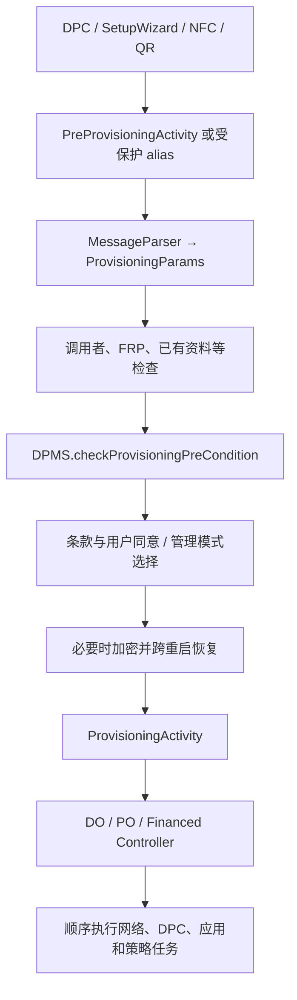
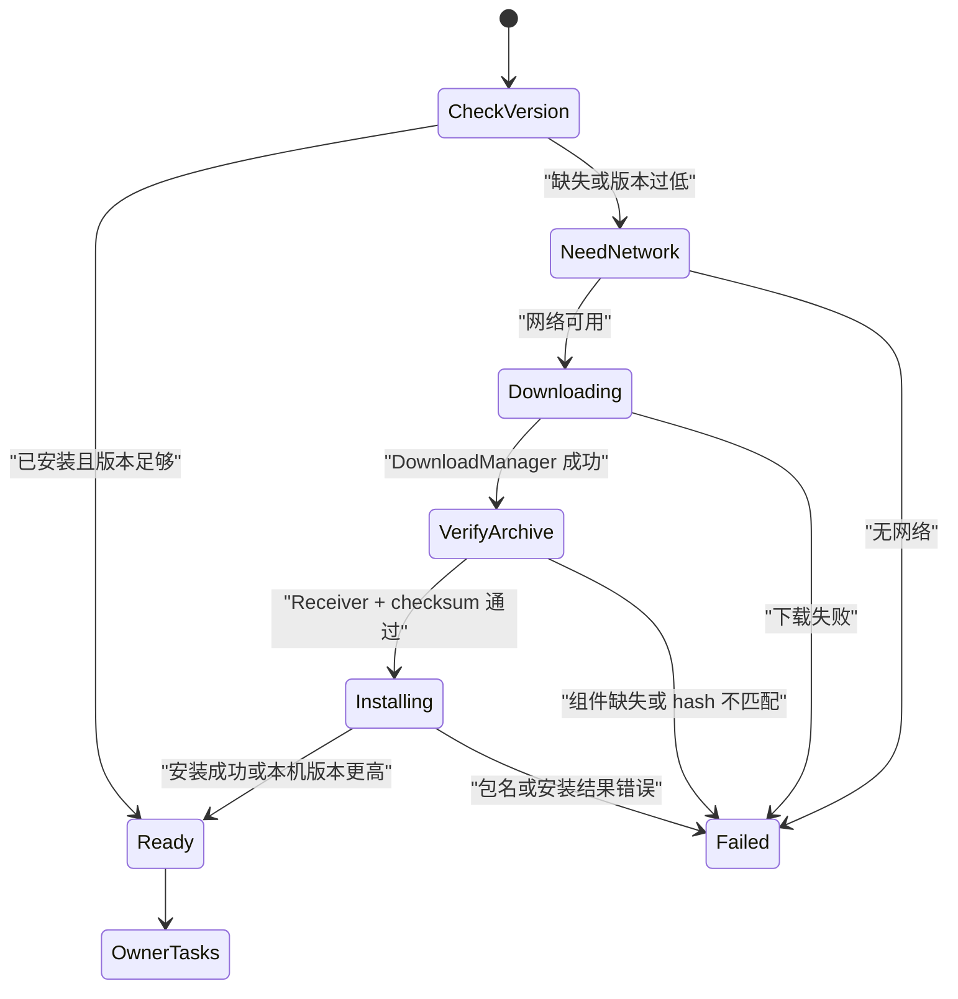

# 301 Android ManagedProvisioning 企业配置入口：参数解析、前置检查、DPC 准备与可恢复流程

## 1. 本章目标

本章从 Android 11 的企业配置入口开始，回答五个最容易混在一起的问题：是谁启动配置、入口为什么不止一个、Intent 数据怎样变成统一参数、系统在何处拒绝不合法配置、DPC 未安装时怎样下载并校验。读完应能从 `AndroidManifest.xml` 一路追到 `ProvisioningActivity` 启动任务链。

## 2. 本章版本边界

源码基于本机 `android-11.0.0_r48`。Android 12 以后组织所有设备的工作资料、零接触配置和管理角色接口继续变化，不能把新版本文档反推到这里；本章也不讨论厂商 SetupWizard 的私有扩展。

## 3. macOS 学习方式

本章只读源码，不编译 AOSP、不刷机、不真正触发恢复出厂设置。`ManagedProvisioning` 会使用安装包、用户、加密和恢复出厂等高权限能力，真实验证必须放在可清空的测试设备上；Mac 上只做调用链和状态推演。

## 4. 先记住一句话

`ManagedProvisioning` 不是 DPC，也不是 `DevicePolicyManagerService`。它是系统预装的“企业配置编排应用”：接收配置请求、展示同意界面、准备网络和 DPC，再调用 system_server 中的设备策略能力完成所有者建立。

## 5. 三个角色不要混淆

DPC 是企业的管理应用；`ManagedProvisioning` 是平台编排者；`DevicePolicyManagerService`（下文简称 DPMS）是持有权威设备策略状态的 system_server 服务。DPC 提出“把我设为管理者”，编排应用组织流程，DPMS 最终裁决并保存结果。

## 6. 为什么不能由 DPC 自己直接完成

建立 Device Owner 或 Profile Owner 会改变整台设备或整个资料的信任边界，还可能创建用户、删除应用、安装管理包。普通应用不能自己授予这些能力；只有平台签名、受权限保护的系统组件才能安全地跨越这些阶段。

## 7. 核心源码地图

```text
packages/apps/ManagedProvisioning/AndroidManifest.xml
packages/apps/ManagedProvisioning/src/com/android/managedprovisioning/
  parser/{MessageParser,ExtrasProvisioningDataParser,PropertiesProvisioningDataParser}.java
  model/{ProvisioningParams,PackageDownloadInfo,WifiInfo}.java
  preprovisioning/{PreProvisioningActivity,PreProvisioningController,EncryptionController}.java
  provisioning/{ProvisioningActivity,AbstractProvisioningController,
                DeviceOwnerProvisioningController,ProfileOwnerProvisioningController}.java
  task/{DownloadPackageTask,VerifyPackageTask,InstallPackageTask,SetDevicePolicyTask}.java
frameworks/base/services/devicepolicy/java/com/android/server/devicepolicy/
  DevicePolicyManagerService.java
```

## 8. 配置不是一次 Binder 调用

完整配置可能经历扫描二维码、连 Wi‑Fi、下载 DPC、要求加密并重启、显示条款、创建工作资料、删减非必要系统应用、设 Owner、迁移账户和发送完成广播。它天然是跨 Activity、跨进程、甚至跨重启的长事务。

## 9. 本章的范围终点

本章重点讲“准备阶段”和进入任务控制器的第一步。`SetDevicePolicyTask` 如何真正建立 Device Owner/Profile Owner、`Owners` 如何持久化以及失败清理，会在第 302 章继续拆解，避免把入口验证和所有者提交混成一个完成点。

## 10. 配置模式概览

Android 11 r48 仍可看到全托管设备、受管工作资料、受管用户、可共享设备和融资设备等动作。源码还兼容旧式 fully managed device 流程，并支持组织所有设备场景先由 DPC 选择“全托管还是工作资料”。

## 11. 一条主链先建立方向感

外部请求先匹配 `PreProvisioningActivity` 或受保护 alias；Controller 解析数据、检查调用者和设备状态、处理网络/加密/同意；随后 `ProvisioningActivity` 创建对应 Controller，按顺序运行若干 `AbstractProvisioningTask`。

## 12. 入口到任务链总图



## 13. 普通入口 Activity

Manifest 中真实 Activity 是 `.preprovisioning.PreProvisioningActivity`。它直接声明 `PROVISION_MANAGED_PROFILE`、`PROVISION_MANAGED_USER`、`PROVISION_MANAGED_DEVICE` 和 `PROVISION_MANAGED_SHAREABLE_DEVICE`，优先级为 10。

## 14. Activity alias 的意义

NFC、受信任应用和加密后恢复并未各写一套 Activity，而是用 `activity-alias` 指向同一个 `PreProvisioningActivity`。这样 UI/状态逻辑复用，但每个入口可拥有不同的 exported 和 permission 安全边界。

## 15. NFC 入口

`PreProvisioningActivityViaNfc` 只接受 `NDEF_DISCOVERED`，MIME 为 `application/com.android.managedprovisioning`，并要求 `android.permission.DISPATCH_NFC_MESSAGE`。这不是“任意应用构造一个 NFC Intent 就能配置设备”。

## 16. 受信任来源入口

`PreProvisioningActivityViaTrustedApp` 接收 `PROVISION_MANAGED_DEVICE_FROM_TRUSTED_SOURCE` 与 `PROVISION_FINANCED_DEVICE`，受 `DISPATCH_PROVISIONING_MESSAGE` 保护。二维码通常由 SetupWizard 等受信任组件解析后，携带 trigger 进入这条入口。

## 17. 加密恢复入口

`PreProvisioningActivityAfterEncryption` 接收内部 `RESUME_PROVISIONING`，`exported=false`。它只负责回到同一套准备流程；恢复数据不是重新从外部二维码读取，而是从应用私有文件中装回。

## 18. 为什么入口身份必须二次验证

仅靠 Intent action 不足以证明来源。Controller 会检查实际 Component 是否以期望 alias 名结束；普通自发起流程则比较 calling package 与待设为管理者的包名，阻止应用把另一个包偷偷设成 Owner。

## 19. 普通 DPC 自发起约束

源码 `verifyCaller()` 要求 `callingPackage` 非空且等于 `mParams.inferDeviceAdminPackageName()`。注释还提醒应使用 `startActivityForResult()`，否则系统可能无法提供调用包身份，配置会被拒绝。

## 20. 受保护入口不是万能通行证

受信任 alias 只解决“谁有资格递交完整配置数据”，并不跳过设备策略前置条件、FRP、Owner 已存在、用户状态或 APK 校验。入口可信与请求最终可执行是两层判断。

## 21. `PreProvisioningActivity` 的职责

Activity 保存界面状态、接收 Wi‑Fi/加密/条款/管理模式等子流程结果，并实现 Controller 的 `Ui` 接口。复杂业务判断主要放在 `PreProvisioningController`，使 UI 与决策相对分离。

## 22. `onCreate` 并非每次从零开始

屏幕旋转或进程内重建时，Activity 可从 `savedInstanceState` 取回 `ProvisioningParams` 和页面状态。跨加密重启则不依赖 Bundle，而走 `EncryptionController` 的磁盘恢复，这是两套不同寿命的恢复机制。

## 23. `initiateProvisioning()` 是准备总入口

Controller 先记录会话开始时间，然后依次检查全局是否允许、解析参数、检查 FRP、验证 action/调用者，再处理已有工作资料、网络、组织所有设备模式、融资模式或普通同意页。任何一步失败都会提前返回。

## 24. 顺序本身就是安全设计

不能先下载或安装 DPC 再判断调用者，也不能先显示一个“看似可信”的企业名称再校验参数。r48 先完成基础解析和来源判断，之后才进入用户可见与高成本动作，降低伪造和半完成状态。

## 25. `MessageParser` 是分流器

它自身几乎不解释字段，只根据 action 是否为 `NDEF_DISCOVERED` 选择 parser：NFC 属性文本走 `PropertiesProvisioningDataParser`，其余 Bundle extras 走 `ExtrasProvisioningDataParser`。

## 26. 为什么 NFC 不直接复用 Bundle

NDEF payload 本质上是字节/文本记录，不天然是 Android 进程内的 Parcelable Bundle；属性解析器把 key-value 文本转成同一业务模型。入口格式不同，但后续不应保留两套配置状态机。

## 27. 参数归一化的价值

无论 NFC、二维码、SetupWizard 还是 DPC 自发起，最后都得到 `ProvisioningParams`。后续 Controller 和 Task 只依赖这个对象，不需要反复判断数据最初来自哪种载体，来源差异用布尔字段显式保存。

## 28. `ProvisioningParams` 不是普通 DTO

它既实现 Parcelable 便于 Activity/Service 间传递，又可转成 `PersistableBundle`，还能使用 XML 保存和恢复。它同时承担内存合同、跨组件合同和跨重启合同，因此字段默认值和兼容性很重要。

## 29. 最小身份字段

构造完成时 `validateFields()` 要求 `deviceAdminPackageName` 与 `deviceAdminComponentName` 至少一个非空。只有包名时可从包内查找 `DeviceAdminReceiver`；有 Component 时则能明确指定接收器。

## 30. 为什么优先使用 Component

包内可能声明多个 receiver；只给包名需要推断并面对歧义。显式 Component 能把“哪个包”和“哪个管理接收器”都固定下来，不过系统仍必须确认该组件确实存在于目标 APK 且满足 Device Admin 声明。

## 31. 动作字段

`provisioningAction` 决定走 DO、PO、managed user 等哪条策略路径。不要把 `provisioningMode` 与 action 当成同一个字段：组织所有设备的新流程可能先以未决模式进入，再让 DPC 返回最终模式并更新 action。

## 32. 网络字段

参数可携带 `WifiInfo`、`useMobileData` 和 DPC 下载信息。它们服务于“设备尚未完成 SetupWizard、管理应用也可能尚未安装”的冷启动场景，而不是一般应用的长期网络配置 API。

## 33. DPC 下载字段

`PackageDownloadInfo` 包括下载 URL、可选 Cookie、最低版本、整个 APK 的 SHA-256 checksum 或签名 checksum。URL 只回答“去哪里取”，checksum 才回答“取回来的是否是预期对象”。

## 34. 企业定制字段

组织名称、支持 URL、主色、图标、标签和免责声明用于受信任的配置 UI。它们影响展示但不授予策略权限；屏幕显示某公司名字绝不等于 Owner 已经建立。

## 35. 账户与管理额外参数

工作资料可携带待迁移 `Account` 和是否保留原账户；`adminExtrasBundle` 是企业自定义的可持久化键值，配置完成后交给 DPC。系统不应把它解释成平台策略，也不能允许任意 Parcelable 混入跨重启数据。

## 36. 跳过开关要看来源

`skipEncryption`、`skipUserConsent`、`skipEducationScreens`、`skipUserSetup` 看似只是布尔值，实际受 action、来源和设备状态约束。解析出 `true` 不代表系统无条件执行，安全敏感跳过必须由特定可信流程触发。

## 37. 来源标记

`startedByTrustedSource`、`isNfc`、`isQrProvisioning` 被写进统一参数。它们让后续网络、FRP、UI和日志逻辑知道请求来源，但不能替代 alias permission 和 caller 校验。

## 38. 组织所有设备模式

`isOrganizationOwnedProvisioning` 表示需要 DPC 参与选择/确认管理模式。r48 的 `ProvisioningParams` 定义 fully managed、managed profile、在全托管设备上的 managed profile、legacy fully managed 和 financed 等内部 mode。

## 39. 源码中的拼写不代表概念变化

r48 常量名里可看到 `PROVISIONING_MODE_MANAGED_PROFILE_ON_FULLY_NAMAGED_DEVICE` 的 `NAMAGED` 拼写错误。学习源码时应记录这是标识符历史问题，不能据此创造一个新的“namaged”业务概念。

## 40. extras 支持分层

`ExtrasProvisioningDataParser` 把 action 分为“支持全部配置数据”和“只支持最小配置数据”两组。受信任来源/融资流程能传下载、Wi‑Fi等完整参数；普通自发起 action 权限更小，减少 DPC 借入口控制不属于它的数据。

## 41. 短 key 的用途

解析器维护诸如 `a.a.e.PDAPN` 的短字段名映射，主要服务二维码/NFC 等载荷大小受限场景。短 key 与完整 `DevicePolicyManager.EXTRA_*` 最后表示同一语义，不是另一版协议状态。

## 42. locale 解析也可能失败

区域、时区、端口、URI、checksum Base64 等都必须按预期类型和格式解析。异常会被包装为 `IllegalProvisioningArgumentException`，Controller 显示通用错误并结束，而不是带着半有效参数继续。

## 43. 参数对象的不可变外观

字段大多是 final，并通过 Builder 创建；需要更新 mode 时用 `toBuilder()` 复制后再 build。注意源码注释明确 `adminExtrasBundle` 可变，所以不能把整个对象理解为严格深不可变值对象。

## 44. `inferDeviceAdminPackageName()`

当只给 Component 时可直接取其 package；只给 package 时保留包名。后续验证 caller、检查安装版本和下载任务都应使用推断方法，避免一处读旧字段、一处读 Component 导致身份不一致。

## 45. `inferDeviceAdminComponentName()`

若 Component 未提供，工具会在指定用户的包信息中寻找合法 Device Admin receiver。推断成功也只是确定候选组件，真正安装包校验和 Owner 建立仍是后续不同阶段。

## 46. `PersistableBundle` 的限制是优点

它只支持跨重启可稳定保存的基础类型和嵌套可持久化 Bundle，避免任意 Binder 对象、文件描述符或自定义 Parcelable 被写入 XML。企业自定义 extras 因而也必须遵守这套类型合同。

## 47. XML 保存采用 `AtomicFile`

`ProvisioningParams.save(File)` 先 `AtomicFile.startWrite()`，序列化 `<provisioning-params>` 和 Bundle，成功 `finishWrite()`；异常时删除目标并 `failWrite()`。目的是避免断电留下“看似存在但只写了一半”的恢复参数。

## 48. 恢复并不意味着一定继续

`load()` 文件不存在或解析失败会返回 null；即使读出对象，Controller 还会检查设备是否真的已加密、action 是否属于 PO/DO，并再次经过相应入口校验。持久化数据只是恢复输入，不是绕过检查的授权票据。

## 49. 参数解析完成点

`tryParseParameters()` 只说明 Intent 已成功转为结构化对象；它不说明 caller 可信、设备允许、DPC 安全、用户已同意，更不说明 Owner 已建立。源码阅读时给每个“成功”标注具体层级很重要。

## 50. 参数与检查分层图


## 51. 第一层：全局可配置判断

`isProvisioningAllowed()` 是进入流程的早期门，用于阻止不适合当前设备/用户状态的配置。它不是 DPMS 的全部权威前置条件；后面仍会调用 `checkProvisioningPreCondition()`。

## 52. 第二层：FRP 检查

设备尚未 provisioned 时，Controller 查询 `PersistentDataBlockManager.getDataBlockSize()`。持久数据块中存在 FRP 数据会阻止配置，避免未经原账户授权的恢复出厂设备被新的企业所有者接管。

## 53. 何时不检查 FRP

设备已完成 provisioning 时这条 SetupWizard FRP 检查不适用；设备不支持 Persistent Data Block 也会跳过。另有非常窄的恢复例外：caller 必须是配置指定的系统 FRP 数据维护包，且参数来自 trusted source。

## 54. FRP 例外为何要同时校验多项

只看包名可被同名第三方伪造，只看 system app 又过宽，只看 trusted flag 也可能来自篡改输入。r48 同时比较资源配置包名、系统应用身份、真实 calling package 与受信任来源标志，缩小恢复旁路。

## 55. 第三层：action 与 caller

恢复、NFC、trusted-source、financed 分别要求正确 alias；其余流程要求 DPC 自己调用并把自己设为 Owner。`verifyActionAndCallerInner()` 把不同来源的证明方式显式分支，而不是一律相信 action 字符串。

## 56. 第四层：已有工作资料

PO 配置发现已有 managed profile 时，不会直接再创建一个。若用户限制禁止删除旧资料，则报错；允许删除时先展示旧 Profile Owner 名称和组织域，要求用户处理替换。

## 57. 这一步不是自动覆盖

工作资料包含独立应用数据、账户和策略，覆盖不是普通包升级。先识别现有 userId，再询问删除，能避免把用户以为的“换管理应用”变成静默删除整套工作数据。

## 58. 第五层：网络准备判断

仅当 DO 路径携带 DPC 下载信息、尚无 Wi‑Fi 配置且当前没有合适连接时，才考虑打开 Wi‑Fi picker。若 DPC 已预装或无需更新，没有下载需求就不应强迫联网。

## 59. QR/NFC 对移动数据的特殊处理

`shouldShowWifiPicker()` 对 QR/NFC 明确考虑 `useMobileData`；允许移动数据时可不要求 Wi‑Fi。源码注释指出这里刻意不只看当前 mobile connected，因为配置期间网络还可能由任务建立。

## 60. 锁屏时不能随意弹 Wi‑Fi 选择

如果 Keyguard 处于受限输入状态，Controller 记录无法打开 picker；若系统没有可处理 Wi‑Fi 选择 Intent 的组件，则显示错误。UI 可达性也是状态机的一部分，不是所有分支都能立即推进。

## 61. 第六层：DPMS 权威前置条件

用户同意页前会调用：

```java
int code = mDevicePolicyManager.checkProvisioningPreCondition(
        mParams.provisioningAction,
        mParams.inferDeviceAdminPackageName());
if (code != DevicePolicyManager.CODE_OK) {
    // 记录原因，显示对应错误并结束
}
```

这才把 action 和目标包交给 system_server 的权威状态判断。

## 62. 为什么 UI 应用不能自己判断全部条件

Owner、用户和 setup 状态由多个系统服务持有，并可能并发变化。若 `ManagedProvisioning` 复制全部规则，版本漂移会造成 UI 说可行、DPMS 提交却拒绝；公开预检查 API让最终服务提供一致原因码。

## 63. 常见前置条件码

r48 Controller 显式处理 `CODE_HAS_DEVICE_OWNER`、`CODE_USER_SETUP_COMPLETED`、`CODE_CANNOT_ADD_MANAGED_PROFILE`、`CODE_MANAGED_USERS_NOT_SUPPORTED`、`CODE_NOT_SYSTEM_USER`、split system user 相关错误等。`CODE_OK` 只表示此刻允许继续。

## 64. `CODE_HAS_DEVICE_OWNER`

全托管设备通常只能有一个 Device Owner。已有 DO 时不能再通过新 provisioning 抢占；更换所有权需要受控转移或清除旧状态，而不是重复运行配置向导。

## 65. `CODE_USER_SETUP_COMPLETED`

传统 DO 配置要求处于设备初始设置窗口，完成普通用户设置后再静默提升应用会破坏“设备从一开始就由组织拥有”的信任语义。测试专用、组织场景的例外必须看具体 action 和源码分支。

## 66. `CODE_CANNOT_ADD_MANAGED_PROFILE`

可能来自已有资料、用户数上限、设备特性或用户限制。错误码只给上层分类；诊断时要继续看 `UserManager`、用户列表、限制和产品是否支持 managed users，不能一概归因于 DPC。

## 67. system user 与 split system user

某些动作必须在系统用户或特定“肉身用户”上执行。Android Automotive/多用户产品可能启用 split system user，user 0 不一定是日常交互用户，因此 r48 存在多个专门错误码和创建 primary user 分支。

## 68. 预检查存在竞态

从 `checkProvisioningPreCondition()` 返回到真正 `setDeviceOwner()` 之间，系统状态仍可能变化。预检查用于早反馈，不是事务锁；最终提交仍必须在 DPMS 内重新校验，不能依赖 UI 曾经拿到 `CODE_OK`。

## 69. 测试静默配置例外

`Utils.isSilentProvisioningForTestingDeviceOwner()` 为 test-only 设备所有者提供窄路径，源码说明当前组件必须已经是 DO，因此不会再次 `setDeviceOwner()`。这是测试辅助，不是生产 DPC 绕过用户同意的通用方式。

## 70. 用户同意页展示什么

Controller 组合 `CustomizationParams`、DPC 包信息、组织名称、图标、免责声明标题、支持 URL、是否已有设备管理和配置模式。展示信息既来自输入，也可能从已安装 DPC 包中推断。

## 71. 展示字段不是信任根

攻击者可以声称任意组织名称或提供漂亮图标，所以安全身份最终落在入口权限、目标包、签名/checksum、DeviceAdminReceiver 和 DPMS 授权上。UI 文案帮助用户理解，不替代密码学或系统权限校验。

## 72. 跳过同意的边界

源码注释说明 `skipUserConsent` 只能由 Device Owner 在“为设备创建工作资料”的特定路径设置。Controller 还会结合 `Utils.isSilentProvisioning()` 判断；普通第三方 Intent 填一个 true 不应获得静默管理能力。

## 73. 组织所有设备的新式协商

`isOrganizationOwnedProvisioning` 时，Controller 调用 `prepareAdminIntegratedFlow()`，让 DPC 通过 `ACTION_GET_PROVISIONING_MODE` 返回 fully managed 或 managed profile，并可更新 admin extras、账户和是否跳过教育页。

## 74. 为什么把模式选择交给 DPC

同一个企业 DPC 可能依据 enrollment token、组织策略或用户归属选择公司全托管与公司所有工作资料。平台负责限定允许值与最终执行，DPC 负责企业业务决策，两者职责互补。

## 75. 返回模式必须白名单化

`updateProvisioningParamsFromIntent()` 只接受平台定义的 fully managed 与 managed profile 返回值；未知值记录 warning 并失败。不能把 DPC 返回的任意整数直接转换为内部 action。

## 76. 模式更新使用 Builder

返回 fully managed 时同时设置内部 mode 和 `ACTION_PROVISION_MANAGED_DEVICE`；返回 managed profile 时设置对应 mode/action，并按存在性更新账户、admin extras、教育页。多个字段必须作为一组更新，避免 mode 与 action 分裂。

## 77. 条款查看是独立 Activity

`TermsActivity` 接收同一个 `ProvisioningParams`，`TermsProvider` 合并组织免责声明和平台说明。用户返回后仍在原准备流程；打开条款不表示已同意，更不表示配置任务已开始。

## 78. 何时检查加密

用户同意之后，`continueProvisioningAfterUserConsent()` 调用 `isEncryptionRequired()`。条件是未请求合法跳过且设备策略工具认为需要加密；若硬件报告不支持，则显示错误而不是继续创建 Owner。

## 79. 为什么加密会切断 Activity 流程

旧式设备加密可能要求重启，内存中的 Activity、Binder 和 Bundle 都会消失。若不先持久化配置参数，重启后系统不知道原 DPC、action、网络和条款上下文，容易留下无法恢复的半流程。

## 80. `EncryptionController.setEncryptionReminder()`

它把参数写入应用私有文件 `encryption_controller_provisioning_params.xml`。若 SetupWizard 尚未完成，还启用一个 HOME 接收组件并刷新 package restrictions，确保组件启用状态真正落盘。

## 81. 为什么用应用私有文件

参数可能包含企业自定义数据、网络信息和账户元数据，不应放在公共外部存储。私有目录配合系统应用 UID 权限减少其他应用读取或篡改的机会，`AtomicFile` 则处理写入中断。

## 82. 重启后的触发

`PostEncryptionActivity` 或 boot 相关路径调用 `resumeProvisioning()`。方法强制运行在主线程，并用 `mProvisioningResumed` 防止 HOME 与 BOOT_COMPLETED 等多次触发造成重复启动。

## 83. 恢复前再次验证物理加密

读到参数后，源码检查 `mUtils.isPhysicalDeviceEncrypted()`；若仍未加密，记录错误并停止。存在恢复文件不等于用户真的完成加密，状态机必须验证外部动作结果。

## 84. PO 与 DO 的恢复 UI 不同

用户设置已完成的 PO 流程可能通过通知让用户主动恢复；SetupWizard 内的 PO 与 DO 可直接拉起恢复 Activity。这样避免已正常使用的设备被后台突然全屏打断，同时保证初始设置能连续推进。

## 85. 恢复入口再次携带统一参数

Controller 构造内部 `RESUME_PROVISIONING` Intent，并以 `EXTRA_PROVISIONING_PARAMS` 放入恢复对象。`tryParseParameters()` 发现已有 params 时直接使用，不再把内部 Intent 当外部 provisioning extras 重解析。

## 86. 取消 reminder 的时机

真正开始 PO/DO 任务前调用 `cancelEncryptionReminder()`，删除 XML 并禁用恢复组件。过早删除会导致启动任务前崩溃无法恢复；过晚删除会让已开始配置被重复唤起。

## 87. 工作资料还要检查 Launcher

PO 路径在启动真实任务前确认当前 Launcher 支持 managed profiles。不支持时提示用户更换；因为资料即使创建成功，用户若无法从 Launcher 清晰区分工作应用，产品语义仍不完整。

## 88. Device Owner 的目标用户

一般在当前 user handle 上开始；split system user 某些动作需要先执行 `CreatePrimaryUserTask` 创建日常用户，任务成功后再继续。不能硬编码“Device Owner 永远在 user 0 的可见桌面用户”。

## 89. `startProvisioning()` 是重要边界

当 Controller 调用 UI 的 `startProvisioning(userId, params)`，准备阶段才正式交给 `ProvisioningActivity`。此前的同意、Wi‑Fi picker 和加密都属于 pre-provisioning，不应在日志中记作 Owner 已建立。

## 90. Controller 工厂选择

`ProvisioningActivity` 依据参数 action/mode 创建 `DeviceOwnerProvisioningController`、`ProfileOwnerProvisioningController` 或融资设备控制器。公共的顺序执行、错误和清理逻辑在 `AbstractProvisioningController`。

## 91. 任务控制器不是通用 WorkManager

它是应用内专用状态机：构造时 `setUpTasks()` 建立有序列表，`HandlerThread` 逐个调用 `task.run(userId)`，Task 通过 `onSuccess/onError` 回调推进。它不提供持久 Job 队列或系统级重试语义。

## 92. 六种控制器状态

r48 把 Controller 状态分为 NOT_STARTED、RUNNING、TASKS_COMPLETED、ERROR、CANCELLING、CLEANED_UP。`mCurrentTaskIndex` 只在成功回调时推进；错误会进入 cleanup，不会继续执行余下任务。

## 93. 为什么 Task 顺序重要

例如需先准备网络，才能下载；先下载才能校验；先校验才能安装；DPC 可用后才能设策略。把相同步骤并行化会产生“安装未可信 APK”或“Owner 指向不存在组件”等危险中间状态。

## 94. DO 任务链开头

`DeviceOwnerProvisioningController.setUpTasks()` 先加入 `DeviceOwnerInitializeProvisioningTask`，再按流程类型选择网络和 DPC 下载任务，之后才删非必要应用、执行 `SetDevicePolicyTask` 和禁止添加用户等。

## 95. 新式组织流程为何可能不下载

源码写明若 `isOrganizationOwnedProvisioning` 为 true，旧下载分支不执行，因为 admin-integrated prepare 流程已负责确保 DPC 可用。理解条件分支时不能看到 DO 就断言一定运行 `DownloadPackageTask`。

## 96. 已安装且版本足够时

`DownloadPackageTask.run()` 先用 `packageRequiresUpdate(packageName, minVersion)` 判断。若本机包已满足最低版本，直接 success；此时下载位置为空，后续 Verify/Install 也会正常短路成功。

## 97. 下载前必须有网络

若 DPC 需要更新且设备未联网，任务返回 `ERROR_OTHER`。网络选择 UI 与 `AddWifiNetworkTask/ConnectMobileNetworkTask` 是准备连接，`DownloadManager` 的实际成功仍是另一完成点。

## 98. 下载实现

任务通过 `DownloadManager.Request` 请求 URL，把目标设为应用 external files 下的 download cache，并可添加 Cookie header。完成广播后查询自己的 downloadId，只有 `STATUS_SUCCESSFUL` 才记录本地文件路径。

## 99. 下载成功不等于可信

`onDownloadSuccess()` 的注释说要检查预期文件，但实现只标记路径并 success；真正 checksum 与 DeviceAdminReceiver 检查位于独立 `VerifyPackageTask`。阅读时应以执行代码和任务链为准，不能仅凭过时注释下结论。

## 100. DPC 准备与失败图



## 101. `MANAGED_PROVISIONING_DPC_DOWNLOADED`

开始下载时任务把 Secure 设置 `MANAGED_PROVISIONING_DPC_DOWNLOADED` 置 1，用于防止 SetupWizard 因下载阶段重启而错误从头开始。它是流程提示位，不是“DPC 已通过验证”或“Owner 已建立”的权威状态。

## 102. `VerifyPackageTask` 第一关

它用 `getPackageArchiveInfo(...GET_SIGNATURES | GET_RECEIVERS)` 解析尚未安装的 APK，确认包信息和预期包名存在，再用 `findDeviceAdminInPackageInfo()` 确认期望 `DeviceAdminReceiver` 确实在归档中。

## 103. checksum 优先级

若 `packageChecksum` 非空，计算整个 APK 文件的 SHA-256 并比较；否则计算归档中全部签名证书字节的 SHA-256，只要一个匹配 `signatureChecksum` 即通过。两者都给时整个包 checksum 优先。

## 104. 包 checksum 与签名 checksum 区别

包 checksum 锁定精确 APK 字节，重新压缩或同证书的新版本也会变化；签名 checksum 锁定签名者，允许同证书签发不同版本。最低版本、签名信任和服务端下载控制应共同设计，不能只依赖 HTTPS URL。

## 105. 这里使用旧签名 API 的版本边界

r48 读取 `PackageInfo.signatures` 与 `GET_SIGNATURES`，这是 Android 11 源码当时的实现。现代应用代码通常使用 `SigningInfo` 处理签名轮换；本章描述平台旧流程，不建议复制为新应用安全校验模板。

## 106. `InstallPackageTask`

校验通过后通过 `PackageInstaller.Session` 以 full install 写入 APK，flags 含 `INSTALL_REPLACE_EXISTING` 与 restricted permissions 白名单标记。数据写完后用一次性 PendingIntent 接收 session commit 结果。

## 107. 安装完成还检查包名

Receiver 比较 `PackageInstaller.EXTRA_PACKAGE_NAME` 与预期 DPC 包名。即使前面解析过归档，也不能忽略安装服务最终报告对象；不一致返回 `ERROR_PACKAGE_INVALID`。

## 108. 版本降级结果的特殊处理

若安装服务报告 `INSTALL_FAILED_VERSION_DOWNGRADE`，源码把“当前版本更高”视为成功，不强行降级。前面的最低版本判断和系统签名兼容规则共同保证继续使用本机较新 DPC。

## 109. 临时 APK 清理

`InstallPackageTask.run()` 的 finally 删除 source 文件，`DownloadPackageTask.cleanUp()` 还会注销 receiver 并移除 DownloadManager 项。临时下载物与已安装包是两套生命周期；清理失败会记录日志，但不应错误撤销已完成安装。

## 110. 错误是否要求恢复出厂

DO Controller 对网络准备/初始化早期错误可不要求 factory reset；一旦流程越过更多不可逆任务，错误通常要求清空设备。具体由 `getRequireFactoryReset(task,errorCode)` 按失败 Task 决定，不是所有 provisioning 错误都同样严重。

## 111. 本章断点清单

可按八个完成点读日志：参数已解析、来源已验证、DPMS 预检查通过、用户已同意、加密已验证、`ProvisioningActivity` 已启动、DPC 已准备可信、Owner Task 已开始。定位问题时先问停在哪一层，再看对应源码。

## 112. macOS 只读练习一：核对四类入口

在源码根目录执行：

```bash
sed -n '80,170p' packages/apps/ManagedProvisioning/AndroidManifest.xml
```

请写出普通 Activity、NFC alias、trusted alias、加密恢复 alias 的 action、permission 与 exported 差异，并解释为何都指向同一 targetActivity。

## 113. macOS 只读练习二：追参数分流

执行：

```bash
sed -n '35,90p' packages/apps/ManagedProvisioning/src/com/android/managedprovisioning/parser/MessageParser.java
rg -n "PROVISIONING_ACTIONS_SUPPORT_|parse\(" packages/apps/ManagedProvisioning/src/com/android/managedprovisioning/parser/ExtrasProvisioningDataParser.java
```

画出 NDEF 与普通 extras 的分支，并从源码找出“全参数 action”和“最小参数 action”分别包含哪些动作。

## 114. macOS 只读练习三：核对检查顺序

执行：

```bash
rg -n "initiateProvisioning|tryParseParameters|checkFactoryResetProtection|verifyActionAndCaller|checkDevicePolicyPreconditions" packages/apps/ManagedProvisioning/src/com/android/managedprovisioning/preprovisioning/PreProvisioningController.java
```

按真实调用顺序列出检查，说明哪一步只是语法归一化、哪一步证明 caller、哪一步向 DPMS 请求权威原因码。

## 115. macOS 只读练习四：核对下载、校验、安装边界

执行：

```bash
rg -n "addTasks|DownloadPackageTask|VerifyPackageTask|InstallPackageTask" packages/apps/ManagedProvisioning/src/com/android/managedprovisioning/provisioning/DeviceOwnerProvisioningController.java
rg -n "doesPackageHashMatch|doesASignatureHashMatch|findDeviceAdminInPackageInfo" packages/apps/ManagedProvisioning/src/com/android/managedprovisioning/task/VerifyPackageTask.java
```

证明 checksum 不在下载 Task 中完成，并解释整个 APK checksum 与签名 checksum 各自锁定什么。

## 116. 常见误解一：配置 Intent 发出就已经受管

错。Intent 只是候选输入；在 Owner Task 成功前，DPC 没有 Device/Profile Owner 权限。即使同意页出现、DPC 下载完成或安装成功，也都不能当作策略已生效。

## 117. 常见误解二：HTTPS 下载足以保证 DPC 正确

错。TLS 只保护到下载端点的连接，服务端配置错误、URL 被替换或证书体系风险仍可能给出非预期 APK。r48 还验证目标 DeviceAdminReceiver 和预置 checksum，安装服务再检查签名升级兼容。

## 118. 常见误解三：预检查通过就不会再失败

错。网络、磁盘、下载、checksum、安装、用户创建、应用删减和最终 DPMS 提交都可能失败，且预检查与提交之间存在竞态。`CODE_OK` 只是允许进入下一阶段。

## 119. 复读后的易混点修订

本章特意修正四处高风险表述：QR 不是直接等同 NFC；`ProvisioningParams` 只有外观近似不可变；下载成功不执行 checksum；加密恢复文件不是授权凭证。还把“预检查”和“最终 Owner 提交”明确拆成两章，避免把完成点说早。

## 120. 本章小结与下一章

Android 11 企业配置的核心不是某个 API，而是入口身份、统一参数、设备前置条件、用户知情、跨重启恢复、DPC 供应链校验和顺序任务共同组成的防线。下一章进入 `SetDevicePolicyTask → DevicePolicyManager → DPMS`，追踪 Device Owner/Profile Owner 的正式建立、`Owners` 持久化、用户状态与完成广播。
