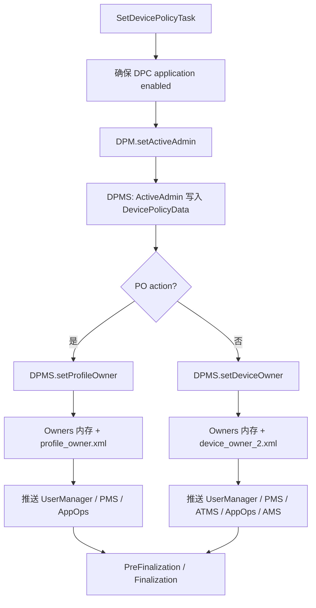
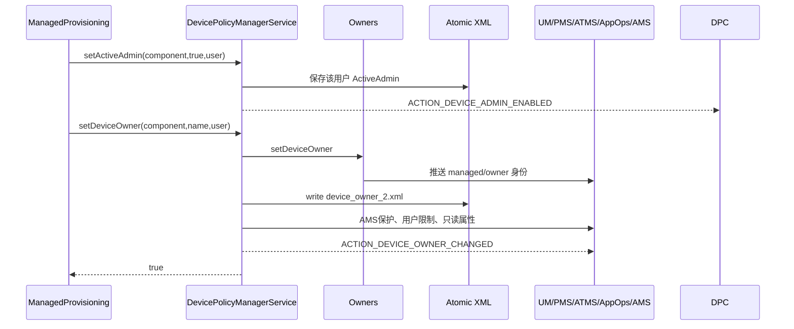
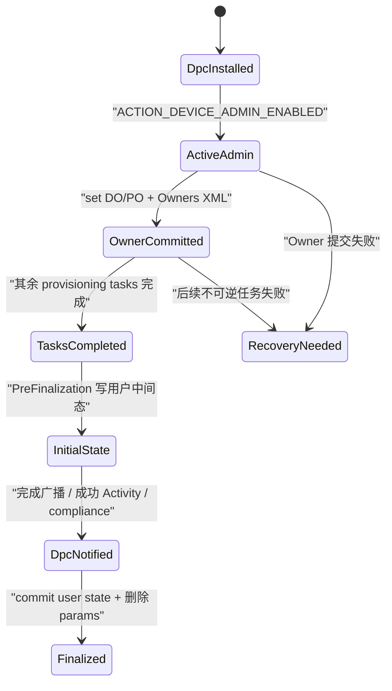

# 302 Android Device Owner / Profile Owner 正式建立：Owners 持久化、用户状态与完成通知链

## 1. 本章目标

上一章停在 DPC 已准备完成。本章继续追 `SetDevicePolicyTask → DevicePolicyManager → DevicePolicyManagerService`，说明 active admin、Device Owner、Profile Owner、用户 provisioning state 和“通知 DPC 完成”为什么是五个不同状态。

## 2. Android 11 边界

只按本机 `android-11.0.0_r48`。后续 Android 版本对组织所有工作资料、Device Admin 弃用范围、SetupWizard 协作和完成 action 有变化；本章不使用新版本接口反向解释 r48。

## 3. 不做真实配置

Mac 上只读源码，不执行 `dpm set-device-owner`，不创建资料，不清空设备。Owner 建立会改变不可轻易恢复的安全状态，练习全部是 `rg` 与 `sed`。

## 4. 一句话主线

平台先让 DPC receiver 成为 active admin，再把它登记为 DO 或某用户的 PO；DPMS 同时把权威 owner 数据写盘并推送给其他系统服务；之后 ManagedProvisioning 还要管理 SetupWizard 状态并通知 DPC 收尾。

## 5. 五张账

第一张是应用/组件安装与 enabled 状态；第二张是 `DevicePolicyData` 的 active admin；第三张是 `Owners` 中的 DO/PO；第四张是每用户 provisioning state；第五张是 DPC 是否收到完成广播或启动 Intent。任意一张都不能代替其他四张。

## 6. 为什么 active admin 不等于 owner

普通 active admin 只拥有 Manifest `uses-policies` 声明且仍受旧 Device Admin 模型限制；DO/PO 是唯一或按用户唯一的管理角色，额外获得大量企业 API。所有 Owner 必须是 active admin，但 active admin 未必是 Owner。

## 7. 核心源码地图

```text
packages/apps/ManagedProvisioning/src/com/android/managedprovisioning/
  task/SetDevicePolicyTask.java
  provisioning/{AbstractProvisioningController,ProvisioningActivity}.java
  finalization/{PreFinalizationController,FinalizationController,
                UserProvisioningStateHelper,ProvisioningIntentProvider,
                SendDpcBroadcastService,DpcReceivedSuccessReceiver}.java
frameworks/base/services/devicepolicy/java/com/android/server/devicepolicy/
  {DevicePolicyManagerService,Owners,DevicePolicyData}.java
frameworks/base/core/java/android/app/admin/
  {DevicePolicyManager,DeviceAdminReceiver}.java
```

## 8. `SetDevicePolicyTask` 在任务链的位置

DO 路径通常先完成初始化、网络/DPC 准备和非必要应用处理，再执行该 Task；PO 路径在创建资料、启动用户和安装 DPC 后执行。它不是 provisioning 的第一步，也不是整个 provisioning 的最后一步。

## 9. Task 的三个动作

`run(userId)` 推断明确的 admin Component，取包名，调用 `enableDevicePolicyApp()`，接着 `setActiveAdmin()`，最后按 action 选择 `setProfileOwner()` 或 `setDeviceOwner()`。任一异常都会回调 error。

## 10. 总调用图



## 11. 先重新启用 DPC

DPC application 若处于显式 disabled 状态，Task 将 enabled setting 恢复为 DEFAULT，并加 `DONT_KILL_APP`。如果本来是 DEFAULT 或 ENABLED 则不改，避免无意义的包状态写入。

## 12. 为什么不是强制设 ENABLED

恢复 DEFAULT 可重新遵循 Manifest 默认配置；强设 ENABLED 会覆盖包开发者的默认语义。这里的目标只是消除用户/系统先前显式禁用，而不是永久制造一个额外 override。

## 13. `DONT_KILL_APP` 的原因

DPC 可能正是发起 ManagedProvisioning 的应用。改变 enabled setting 默认可能杀它；加此 flag 避免配置编排过程中因修正包状态把调用方进程意外终止。

## 14. admin Component 再推断

Task 不仅复用包名，而是调用 `inferDeviceAdminComponentName(..., userId)`。这是因为安装完成后必须在目标用户实际包状态中找到合法 receiver；配置输入只有包名时，此刻才有条件确定 Component。

## 15. 第一次 Binder：`setActiveAdmin`

ManagedProvisioning 作为持有 `MANAGE_DEVICE_ADMINS` 的系统应用调用 DPM。DPMS 还要求完整跨用户权限，因为目标 userId 可能是新建的工作资料，并非调用进程所在用户。

## 16. DPMS 先解析 `DeviceAdminInfo`

`findAdmin()` 从 PackageManager 读取 receiver、`BIND_DEVICE_ADMIN` 权限和 device-admin XML 元数据。能安装一个 APK 不代表其中任意 BroadcastReceiver 都可被登记为 admin。

## 17. `checkActiveAdminPrecondition`

服务在锁内检查组件、包和当前策略状态是否允许加入。最终验证必须在 system_server 内完成，不能信任 ManagedProvisioning 先前对 APK 的检查结果。

## 18. `refreshing=true`

Task 传 true，表示已有 active admin 时允许刷新，而非抛“Admin is already added”。这使重入/恢复路径可用，但刷新会新建 `ActiveAdmin` 对象并保留已有对象的 `testOnlyAdmin` 标记。

## 19. ActiveAdmin 的两张索引

`DevicePolicyData` 同时维护 `mAdminMap<ComponentName,ActiveAdmin>` 和有序 `mAdminList`。新增时两处都加入；刷新时 Map 覆盖并在 List 原索引替换，避免同一组件出现重复策略对象。

## 20. 新增 admin 的附带动作

若是首次加入，DPMS 必要时启用包，并通知 UsageStatsManagerInternal active admin 已增加。刷新已有项则不重复触发首次加入动作。

## 21. active admin 先持久化

DPMS 调用 `saveSettingsLocked(userHandle)` 写该用户的 device policy 数据，然后发送显式 `ACTION_DEVICE_ADMIN_ENABLED` 给新 admin。这样 receiver 运行时，服务端已能查询到它是 active admin。

## 22. enabled 广播不是 Owner 完成广播

`ACTION_DEVICE_ADMIN_ENABLED` 只说明 active admin 建立；此时 `setDeviceOwner/setProfileOwner` 甚至还没执行。DPC 若在该回调中调用 Owner-only API，可能因角色尚未提交而失败。

## 23. `setActiveAdmin` 成功仍可能后续失败

Owner 前置条件可能在下一次 Binder 中拒绝，留下 active admin。Controller 会进入错误清理，但“active admin 已写盘、owner 未建立”是必须认识的部分提交状态。

## 24. 为什么不是单个原子 Binder

r48 复用既有 Device Admin 与 Owner API，编排层分两次调用。代码易复用，但跨调用无法提供数据库式事务；因此每一步都需幂等判断、错误清理和最终权威状态查询。

## 25. DO/PO 分支依据

Task 用 `Utils.isProfileOwnerAction(provisioningAction)` 判断；PO action 才走 profile owner，其余受支持 owner action 走 device owner。调用前参数 action 已被入口/parser/模式协商约束。

## 26. 重入的 owner 快路

调用前 Task 查询当前 DO Component 或指定用户 PO。若已等于目标 Component，直接返回 true，不再次调用 set Owner；这是跨 Activity 恢复时的幂等保护。

## 27. 快路的边界

Component 相等只说明 owner 角色已存在，不证明后续用户 state、DPC 完成回调或账户迁移完成。Task 成功后仍要继续 finalization，不能因 owner 已存在直接宣告整个流程完成。

## 28. 第二次 Binder：`setDeviceOwner`

DPMS 首先检查设备具有 device admin feature、Component 非空且包在目标用户已安装；失败抛 `IllegalArgumentException` 或返回 false。Task 捕获普通 Exception 并统一上报错误。

## 29. 锁外账户检查

服务先计算 `hasIncompatibleAccountsOrNonAdbNoLock()`，再进入 DPMS 锁调用 `enforceCanSetDeviceOwnerLocked()`。账户、ADB 来源、SetupWizard 和用户状态共同决定是否还允许设 DO。

## 30. 为什么提交时再检查

第301章的 `checkProvisioningPreCondition()` 与此刻之间可能经过用户同意、联网、下载和安装，时间很长。最终 set API 必须重新验证，防止其他流程已建立 Owner 或设备状态发生变化。

## 31. DO 必须已是 active admin

锁内用 `getActiveAdminUncheckedLocked(admin,userId)` 查找；不存在或正处于 `mRemovingAdmins` 就抛错。这直接证明“先 active admin、后 owner”不是 UI 偏好，而是服务端硬前置条件。

## 32. 设置 DO 前关闭 Backup

DPMS 调用 BackupManager 的 `setBackupServiceActive(USER_SYSTEM,false)`。企业全托管设备不能让此前个人备份/恢复继续按普通设备假设运行；调用失败会以 IllegalStateException 终止提交。

## 33. Backup 状态与 Owner 不是同一事务

关闭 Backup 是外部 Binder 副作用，之后才写 Owners。若后续异常，不能假定所有外部服务自动回滚；这再次说明 provisioning 是补偿式长事务，而非 ACID 事务。

## 34. ADB 入口记录

若实际 caller 被判定为 shell/ADB，DPMS 记录 Metrics 与 DevicePolicyEvent。ADB 是开发/测试入口，不应与生产 SetupWizard enrollment 的来源统计混在一起。

## 35. `Owners.setDeviceOwner`

它构造 `OwnerInfo`，记录 owner 名、admin Component、userId、限制已迁移标记、远程 bugreport 字段和 `isOrganizationOwnedDevice=true`。内存对象是 system_server 的 owner 权威快照。

## 36. DO 用户 ID 独立保存

OwnerInfo 内有包与 Component，但 DO 所属 userId 存在 `mDeviceOwnerUserId`。在 split system user 产品上，不能通过包 UID 或假设 user 0 来推断 Owner 用户。

## 37. `UserManagerInternal.setDeviceManaged(true)`

Owners 在内存设置 DO 时立即通知 UserManagerInternal 整台设备受管。多用户创建、用户限制和产品行为会依赖这个全局标记。

## 38. 推送到 PackageManager

`pushToPackageManagerLocked()` 让 PMS 知道 DO/PO 包与用户身份，供包保护、查询、安装/卸载约束等内部判断使用。仅写 `device_owner_2.xml` 而不推内存消费者会产生暂时不一致。

## 39. 推送到 ActivityTaskManager

DO 还会推送到 ATMS，使任务/Activity 管理知道设备所有者身份。PO 的 `setProfileOwner()` 在 r48 此处不调用该 ATMS 推送，不能把 DO 与 PO 的消费者列表完全等同。

## 40. 推送到 AppOps

Owners 把各 owner 用户映射到真实包 UID，交 `AppOpsManagerInternal.setDeviceAndProfileOwners()`。角色判断最终按当前 user/package UID 传播，包升级保 UID与卸载换 UID的边界需要重新同步。

## 41. `mSystemReady` 门

Owners 的 AppOps 推送在系统尚未 ready 时可先跳过，稍后启动流程再补推。初始化阶段“内存已读到 Owner”与“所有消费者已收到”存在时序，源码专门处理这种启动依赖。

## 42. DO 持久化文件

`writeDeviceOwner()` 使用 `DeviceOwnerReadWriter` 写 `Environment.getDataSystemDirectory()` 下的 `device_owner_2.xml`。文件还包含系统更新策略、待处理 OTA 信息和 freeze period，不只一个 Component。

## 43. DO XML 内容

OwnerInfo 写名称、package/component、限制迁移、远程 bugreport 和组织所有标记；`device-owner-context` 单独写 userId。读取时 userId 先默认 system user，再由 context tag 覆盖，兼容旧文件。

## 44. 持久化使用 `AtomicFile`

Owners 的 `FileReadWriter` 用 AtomicFile 写 XML，只有 `shouldWrite()` 为真才保留；无数据时删除文件。它降低半写文件风险，但无法让 UserManager/PMS/AppOps 的外部内存更新与文件形成跨服务原子事务。

## 45. 写盘先于后续通知

`setDeviceOwner()` 中先 `mOwners.setDeviceOwner()`、`writeDeviceOwner()`，再 `updateDeviceOwnerLocked()` 和只读 property 等。系统崩溃重启时可从磁盘恢复角色，是这一顺序的重要目的。

## 46. `updateDeviceOwnerLocked()`

DPMS 清除 Binder caller identity，调用 ActivityManager `updateDeviceOwner(packageName)`。源码 TODO 说明主要为了防 DO 被 clear data，但 r48 只传包名，用户 ID 和其他 active admin 保护仍有边界。

## 47. `ro.organization_owned`

DPMS 根据 DO 或组织所有工作资料设置只读系统属性。设备尚未 provisioned 且当前无管理时先不写，给 enrollment 留机会；一旦属性已有值，后续不同值只警告，不能修改。

## 48. 为什么只读属性不可作为实时 Owner 查询

它表达设备曾确定的组织所有属性，写后不可变；清除当前 Owner 也不一定能反向修改。实时角色应查询 DPMS/Owners，不能用属性替代 Component、userId 和当前状态。

## 49. DO 默认禁止新增 managed profile

Owner 写盘后，DPMS 以 clean identity 设置 `DISALLOW_ADD_MANAGED_PROFILE=true`。注释说明传统 DO 与普通 managed profile 不共存；组织所有工作资料是另一路特殊模型。

## 50. DO 提交与通知时序图



## 51. `ACTION_DEVICE_OWNER_CHANGED`

DPMS 向 Owner 用户发送包含后台 receiver 的广播，表示系统 owner 角色变化。它不是只发给 DPC 的 provisioning complete，也不携带企业 admin extras。

## 52. 启动 Owner service

提交末尾 `DeviceAdminServiceController.startServiceForOwner(package,user,"set-device-owner")` 启动 DPC 声明的 owner service。服务运行表示角色已建立后的常驻管理入口，不等于 SetupWizard 已完成。

## 53. DO API 返回 true 的精确定义

它表示 DPMS 完成这段 setDeviceOwner 流程并登记角色；不表示后续 `DeleteNonRequiredAppsTask` 之外所有 Task、ProvisioningActivity、DPC 合规页面或用户最终状态全部完成。

## 54. PO 入口的共同前置条件

`setProfileOwner()` 同样验证 feature、Component、目标用户安装、账户/ADB条件、最终可设置规则以及 active admin 不在 removal 中。共同部分说明 PO 也不是“普通 admin 加个标签”。

## 55. PO 的 parent 检查

DPMS 获取 profile parent；若目标是资料且父用户有 `DISALLOW_ADD_MANAGED_PROFILE`，返回 false。即使 profile user 已创建，也不能绕过父用户最终限制强行设 PO。

## 56. PO 也关闭本用户 Backup

这里关闭的是 `userHandle` 对应用户备份服务，不固定 user 0。工作资料与父用户是不同 Android user，备份策略必须按资料用户隔离。

## 57. `Owners.setProfileOwner`

OwnerInfo 放入 `mProfileOwners[userId]`，`isOrganizationOwnedDevice` 初始为 false；随后 `UserManagerInternal.setUserManaged(userId,true)`，并推送 PMS 与 AppOps。

## 58. PO 为什么是按用户表

一台设备可有多个不同用户，每个用户最多一个 PO；managed profile 本身也是 user。`SparseArray`/映射以 userId 区分，不能只用包名判断“设备上有某 PO”。

## 59. PO 持久化文件

每个用户的 `profile_owner.xml` 位于 `Environment.getUserSystemDirectory(userId)`。DO 使用全局 data/system 文件，PO 使用每用户 system 目录，结构与角色范围一致。

## 60. PO 文件只写该用户 Owner

`ProfileOwnerReadWriter(userId)` 的 `shouldWrite()` 只看该 user 的 map 项，`writeInner()` 写一个 `profile-owner`。删除该用户 PO 时对应文件可删除，不影响其他用户 PO。

## 61. managed profile 默认限制

若目标确为 managed profile，DPMS 给 admin 设置平台默认限制，并确保 unknown sources 限制。默认限制写入 ActiveAdmin 策略账，不是 UserManager 不可追踪的临时开关。

## 62. PO changed 广播

DPMS 向该 user 发送 `ACTION_PROFILE_OWNER_CHANGED`，然后启动 Owner service。它通知系统角色改变，仍不是面向 DPC 初始化业务的 `ACTION_PROFILE_PROVISIONING_COMPLETE`。

## 63. DO 与 PO 消费者差异

DO 设置全局 device managed、推 PMS/ATMS/AppOps、通知 AMS 并加全局性质限制；PO 设置某 user managed、推 PMS/AppOps并按 managed profile 加默认限制。角色范围不同导致传播面不同。

## 64. Owner 名称不是安全身份

DO 使用平台资源里的默认 owner display name，PO 代码传 packageName 作为 name。安全判断始终使用 Component/package/user，name 主要用于展示，不能依赖其唯一性或稳定性。

## 65. `OwnerInfo.packageName` 与 Component

新文件保存完整 admin Component，同时保留 packageName 便于消费者。历史迁移可能只有包名，源码会兼容推断；现代判断应尽量使用 Component，避免同包多 receiver 歧义。

## 66. 旧文件迁移

Owners 能读取 legacy `device_owner.xml`，把旧 DO 默认放在 system user，并读取旧 PO userId；成功后迁到新分文件结构。读取兼容不意味着新写仍使用旧格式。

## 67. restriction migrated 标记

旧版本限制可能存在 UserManager base restrictions，新模型把可由 Owner 改的部分迁入 ActiveAdmin。新设 Owner 直接标为 migrated=true，只有历史升级才需运行迁移逻辑。

## 68. 组织所有工作资料标记晚一步

PO 初建时 `isOrganizationOwnedDevice=false`。`PreFinalizationController` 在参数指明组织所有后，切到 profile 用户上下文调用 `markProfileOwnerOnOrganizationOwnedDevice(admin)`，再限制删除资料。

## 69. 为什么不能在普通 PO 一律设组织所有

BYOD 工作资料只管理工作侧；组织所有工作资料可获得影响设备侧的扩展能力。若把两者混为一个布尔值，会把公司权限错误扩大到员工个人设备。

## 70. `DISALLOW_REMOVE_MANAGED_PROFILE`

组织所有工作资料建立后，PreFinalization 设置禁止移除 managed profile。这样用户不能通过删资料绕过组织所有设备管理；普通 BYOD PO 不应自动得到同样不可移除语义。

## 71. Task 成功后的 Controller 行为

`AbstractProvisioningController.onSuccess()` 递增 index 并运行下一个 Task；只有列表全部完成才回调 `provisioningTasksCompleted()`。Owner Task 的 success 只是队列中一个节点。

## 72. Error 之后不继续

Task 抛异常或 Owner API 返回 false 时 Controller 进入 STATUS_ERROR，运行特定 cleanup 并通知 UI 是否需要 factory reset。已写入的 active admin 或其他外部副作用需要清理路径处理，不能靠 index 回退。

## 73. DO 错误通常更严重

DO Controller 对越过初始化/网络后的失败多要求 factory reset，因为应用删除、Owner/限制等可能已改变设备。PO 通常可删除新建资料作为补偿，二者恢复策略不同。

## 74. Owner 已建立为何还需要 finalization

DPC 需要 admin extras、账户迁移结果和初始化机会；SetupWizard 需要知道是否继续个人设置；工作资料父用户还需清理迁移账户；系统还需最终状态和隐私提示。角色提交只解决权限，不解决产品流程。

## 75. `PreFinalizationController`

ProvisioningActivity 全部任务成功后调用 `deviceManagementEstablished(params)`。方法名称很准确：设备管理已经建立，但 provisioning 可能尚未 finalized。

## 76. 防重复门

若当前 user provisioning state 已处于中间态，说明该方法运行过，直接返回；UNMANAGED 或某些 FINALIZED 情况才允许开始。这防止 Activity 重建重复发送完成流程。

## 77. 初始 user state 的因素

`UserProvisioningStateHelper` 同时看 action、当前 SetupWizard 是否完成、是否跳过余下 SetupWizard，以及是否从普通用户转 child。它不是简单把所有路径都写 FINALIZED。

## 78. DO 在 SetupWizard 内的状态

若 DPC 请求 skip user setup，当前 user 设 `STATE_USER_SETUP_COMPLETE`；否则设 `STATE_USER_SETUP_INCOMPLETE`。两者都表示 Owner 已存在但最终 SetupWizard 协作尚未统一收尾。

## 79. PO 涉及两个 user state

SetupWizard 内创建工作资料时，父用户设 `STATE_USER_PROFILE_COMPLETE`，资料用户设 `STATE_USER_SETUP_COMPLETE`。一个状态告诉父用户“资料阶段完成”，另一个告诉资料用户等待最终化。

## 80. SetupWizard 后创建 PO

父用户已正常完成设置时，新资料可直接设 `STATE_USER_SETUP_FINALIZED`，无需等待整机 SetupWizard；随后立即向资料内 DPC 发送完成通知。

## 81. user state 的权威存储

`DevicePolicyManager.setUserProvisioningState()` 进入 DPMS，把值写入该 user 的 `DevicePolicyData.mUserProvisioningState` 并 `saveSettingsLocked(user)`。它与 Owners XML 分开持久化。

## 82. 为什么 state 不能随意写

DPMS 要求目标 user 是 DO user、存在 PO，或关联 managed user；非 ADB caller还需 `MANAGE_PROFILE_AND_DEVICE_OWNERS`。普通应用不能把自己用户伪装成 finalized。

## 83. 合法状态迁移

UNMANAGED 可转到除自身外的任意初始态；INCOMPLETE/COMPLETE 只能转 FINALIZED；PROFILE_COMPLETE 最终应回 UNMANAGED。服务端校验迁移，防止编排应用写出逆序状态。

## 84. ADB 的窄迁移

shell 仅能在直接设 Owner 场景把 UNMANAGED 直接变 FINALIZED；其他迁移拒绝。ADB 快路不是任意改状态的调试后门。

## 85. SetupWizard 内先保存 params

PreFinalization 把 ProvisioningParams 保存到 finalization 专用文件，等待 SetupWizard 尾部重新读取。这个文件不同于第301章的加密恢复文件，生命周期和消费方也不同。

## 86. 两个参数文件不要混淆

加密恢复文件用于“Owner 任务尚未开始前跨重启继续”；finalization 文件用于“Owner 已建立、等待 SetupWizard 尾部通知 DPC并提交最终 state”。同为 XML 不代表相同完成阶段。

## 87. SetupWizard 外为何立即通知

普通工作资料常在用户已进入桌面后创建，没有未来 SetupWizard 页面替它收尾。PreFinalization 立即启动 `SendDpcBroadcastService`，保证 ManagedProvisioning 进程在 DPC 界面出现期间保持存活。

## 88. 完成广播的目标

`ProvisioningIntentProvider.createProvisioningCompleteIntent()` 创建 `ACTION_PROFILE_PROVISIONING_COMPLETE`，显式指向推断出的 DeviceAdminReceiver，并加 INCLUDE_STOPPED_PACKAGES 与 RECEIVER_FOREGROUND。

## 89. 为什么显式 Component

完成广播携带敏感 enrollment 上下文，只应交给刚设为 Owner 的 receiver。显式 Component 避免其他包声明相同 action 截获，也消除隐式解析歧义。

## 90. admin extras 的传递

Intent 只把 `EXTRA_PROVISIONING_ADMIN_EXTRAS_BUNDLE` 交给 DPC。系统参数对象本身不整体暴露；企业 token/配置应放可持久化 Bundle，并由 DPC自行解释。

## 91. Ordered broadcast 的作用

`SendDpcBroadcastService` 对 managed profile user 发送 ordered broadcast，并把 `DpcReceivedSuccessReceiver` 作为最终 receiver。这样平台知道 DPC receiver 已返回，再执行父用户侧账户清理等动作。

## 92. Ordered 不等业务初始化成功

DPC receiver 返回只证明广播调用完成；DPC 若异步启动网络 enrollment，ordered broadcast 不等待其业务结果。长工作应启动 Service/Activity 并使用自己的可靠状态机。

## 93. `ACTION_PROVISIONING_SUCCESSFUL`

平台还构造 package-scoped Activity Intent 尝试启动 DPC UI。只有目标用户中存在可 resolve 的 Activity 才启动；广播 receiver 与成功 Activity 是两种不同接入方式。

## 94. Service 为何 `START_STICKY`

它希望在完成广播与 DPC 切换期间保持流程，但进程重建仍需面对 Intent/状态恢复；START_STICKY 不等于精确一次执行，也不保证业务 side effect 天然幂等。

## 95. SetupWizard 尾部的 `FinalizationController`

它读取存储的 params，先检查当前 state 不是 unmanaged/finalized，再询问特定 Logic 是否 ready，然后按普通或 admin-integrated flow 通知/启动 DPC。

## 96. admin-integrated flow 的不同

这类流程在 provisioning Activity 内已通过 policy compliance action 与 DPC交互，因此 finalization 不再重复发传统 PROFILE_PROVISIONING_COMPLETE 或 PROVISIONING_SUCCESSFUL；DO 可显示专门 final screen。

## 97. 为什么 finalization 可被多次调用

SetupWizard Activity 生命周期和子 Activity 结果可能导致重复进入。`provisioningFinalized()` 允许重试准备/通知，真正不可逆的 state 更新放到 `commitFinalizedState()`。

## 98. `commitFinalizedState()`

DO 显示隐私提醒通知；PO 可能在父资料做账户迁移清理；然后标记用户 provisioning state finalized、安排延迟 metrics dump，最后删除 params 文件。

## 99. 删除参数是提交标记

再次 commit 发现文件已删除会记录 warning，不再执行。文件不存在在这里代表 finalization 输入已消费，不代表整个 Owner 可被清除；Owner 权威仍在 DPMS 的 Owners 文件。

## 100. Owner 与 finalization 状态图



## 101. `STATE_USER_SETUP_FINALIZED` 不等于 Owner 类型

它只描述用户 provisioning 流程完成。该 user 是 DO、PO、managed user 的哪一种，仍要查 Owners；父用户在 PO 完成后甚至会回到 UNMANAGED，而资料 user 保持 FINALIZED。

## 102. 父用户回 UNMANAGED 的含义

BYOD 父用户本身并不受 Profile Owner 管理，只有其 managed profile 受管。因此 finalization 把资料设 FINALIZED、父用户设 UNMANAGED，准确表达管理范围。

## 103. Owner changed 与 provisioning complete

Owner changed 由 DPMS 在角色提交时发给该用户，面向系统状态观察者；provisioning complete 由 ManagedProvisioning 在流程收尾时显式发给 DPC，携带 admin extras。二者 action、发送者、时机和受众都不同。

## 104. `ACTION_DEVICE_ADMIN_ENABLED` 又是第三种通知

它发生在 active admin 保存后、Owner 提交前，调用 DPC receiver 的 `onEnabled()`。不要在日志里把三个 action 都翻译成模糊的“设备管理完成”。

## 105. 开机恢复 Owner

system_server 启动时 Owners 先读全局 DO 文件和各用户 PO 文件，再把 device/user managed 与 owner UID推给各内部服务。磁盘是跨重启来源，消费者缓存是运行期派生状态。

## 106. 文件存在不代表包仍健康

Owner XML 可指向被破坏、禁用或升级异常的包；启动加载还需 PackageManager 状态和 admin policy 文件配合。诊断必须同时查 Owners、`device_policies.xml`、包安装/UID与服务日志。

## 107. 包名相同也不够

Owner 身份包括 userId 与 Component，包升级还受签名兼容保护。另一个用户安装同包、同包声明另一个 receiver，不能自然继承原 Owner 角色。

## 108. 清除 Owner 不是删除 XML 一步

DPMS 清除时还会清策略、用户限制、网络/安全日志、应用限制、uninstall block、Owner服务、Backup 状态并推送消费者。手工删文件会留下跨服务不一致，绝不能作为真实设备操作方法。

## 109. 并发与锁

DPMS 用自己的全局锁保护 DevicePolicyData 与调用顺序；Owners 还有 `mLock`。跨服务调用常清 Binder identity，但并非所有磁盘/广播/服务调用都可组成同一临界事务，分析时应区分锁内一致与跨系统最终收敛。

## 110. 失败诊断证据顺序

先看 DPC 包/receiver；再看 active admin map；再看 DO/PO Component+user；再看 Owners XML；再看 user provisioning state；最后看 owner-changed、device-admin-enabled、profile-provisioning-complete 和 DPC Activity日志。

## 111. 本章完成点表

`setActiveAdmin` 返回：admin 可用；`setDevice/ProfileOwner` 返回：角色提交；Controller tasks completed：编排任务完成；PreFinalization：用户进入中间/直接态；Finalization commit：SetupWizard 协作完成。五个“成功”必须带主语。

## 112. macOS 只读练习一：核对三步顺序

```bash
sed -n '60,150p' packages/apps/ManagedProvisioning/src/com/android/managedprovisioning/task/SetDevicePolicyTask.java
```

写出 enable、active admin、owner 的顺序，并说明 Component 已是当前 Owner 时为何直接 true。

## 113. macOS 只读练习二：对比 DO 与 PO

```bash
sed -n '8660,8740p' frameworks/base/services/devicepolicy/java/com/android/server/devicepolicy/DevicePolicyManagerService.java
sed -n '8970,9045p' frameworks/base/services/devicepolicy/java/com/android/server/devicepolicy/DevicePolicyManagerService.java
```

列出共同前置条件、不同 UserManager 限制、广播、内部服务推送和持久化文件。

## 114. macOS 只读练习三：查看 Owners 文件合同

```bash
sed -n '705,965p' frameworks/base/services/devicepolicy/java/com/android/server/devicepolicy/Owners.java
sed -n '1105,1125p' frameworks/base/services/devicepolicy/java/com/android/server/devicepolicy/Owners.java
```

找到 AtomicFile、`shouldWrite()`、DO/PO XML 内容与实际目录来源，解释为何两类 Owner 分文件。

## 115. macOS 只读练习四：追最终通知

```bash
rg -n "markUserProvisioningState|ACTION_PROFILE_PROVISIONING_COMPLETE|ACTION_PROVISIONING_SUCCESSFUL|commitFinalizedState" packages/apps/ManagedProvisioning/src/com/android/managedprovisioning/finalization -g '*.java'
```

按“初始 state→通知 DPC→最终 state→删除参数”画出顺序，并标出 SetupWizard 内外的分支。

## 116. 常见误解一：active admin 就是 Device Owner

错。ActiveAdmin 先写入每用户策略文件，Owner 再写独立 Owners 文件；同一用户可有多个 active admin，但全设备只有一个 DO、每用户最多一个 PO。

## 117. 常见误解二：Owner API 返回就全部完成

错。它只完成角色登记。Controller 任务、用户 state、SetupWizard、DPC 完成广播、账户迁移与最终参数清理仍可能尚未完成。

## 118. 常见误解三：三个完成广播等价

错。DEVICE_ADMIN_ENABLED、OWNER_CHANGED、PROFILE_PROVISIONING_COMPLETE/PROVISIONING_SUCCESSFUL 分别对应 admin 激活、系统角色改变和 DPC业务收尾，时机与权限语义完全不同。

## 119. 复读修订

复读后特别收紧四点：DO XML 文件名是 r48 的 `device_owner_2.xml` 而非笼统 `device_owner.xml`；PO 初建并不自动成为 organization-owned；父用户在 PO finalization 后回 UNMANAGED；ordered broadcast 只等 receiver 返回，不等 DPC 异步 enrollment 成功。

## 120. 本章小结与下一章

Owner 建立是一条“包可用→active admin→Owners内存/磁盘→系统消费者→用户状态→DPC通知→finalized”的分阶段提交链。下一章将深入 managed profile 的用户创建、parent/profile 关系、启动解锁、quiet mode、跨用户包安装与失败删除补偿。
