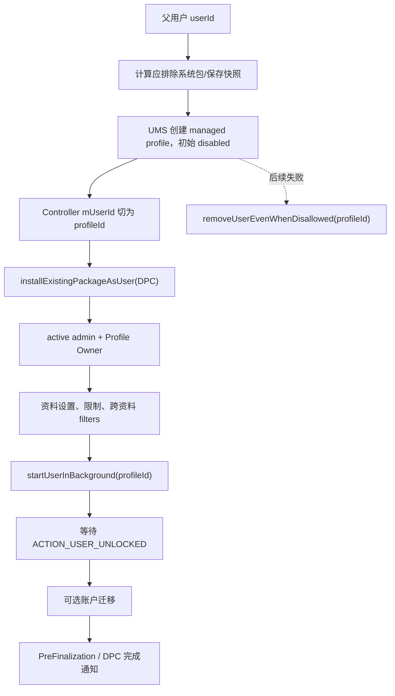
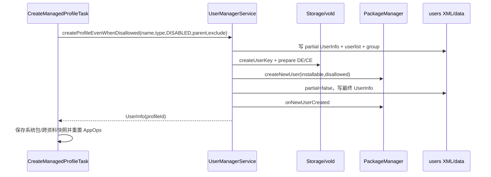
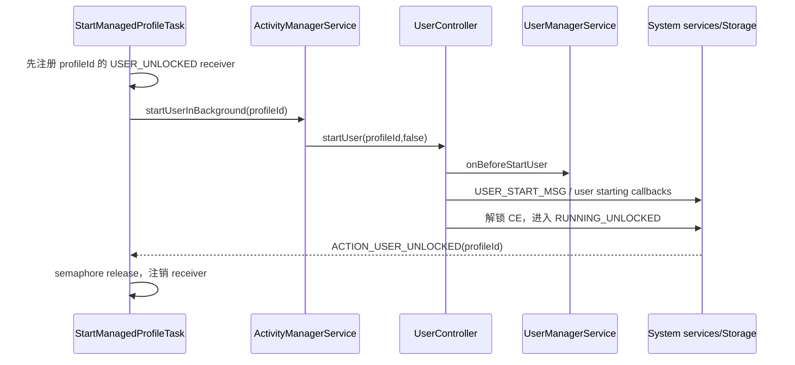

# 303 Android Managed Profile 创建：父子用户、DPC 准备、启动解锁与失败删除补偿链

## 1. 本章目标

本章沿 `ProfileOwnerProvisioningController` 还原工作资料从无到有的过程：怎样创建一个新的 Android user、怎样绑定父用户、哪些包进入资料、DPC 如何跨用户安装并成为 PO、资料如何启动解锁，以及中途失败为何通过删除整个 profile 补偿。

## 2. 版本边界

只讨论本机 `android-11.0.0_r48`。Android 12 以后 user type、组织所有工作资料和跨资料交互策略继续演进；本章的 flag、任务顺序与超时均以 r48 实现为准。

## 3. macOS 只读范围

不在 Mac 上创建 Android 用户、不执行 `pm create-user`、不删除任何真实资料。所有练习只用 `rg`、`sed` 阅读源码；真正验证需可清空的 Android 11 测试设备。

## 4. 先纠正“资料是一个目录”

Managed profile 是完整 Android user：有独立 userId、UID 命名空间、包安装状态、DE/CE 数据目录、账户、设置、Keystore、进程与生命周期。它与父用户形成 profile group，但不是父用户某个应用目录。

## 5. 又要纠正“资料是第二个桌面用户”

它不是可切到前台的 full user。父用户保持前台，Launcher 把 profile 中可见 Activity 以工作徽标混合展示；资料 user 在后台运行，跨资料启动受 Intent filter、权限与策略控制。

## 6. 本章的核心不变量

创建前 Controller 的 `mUserId` 是父用户；`CreateManagedProfileTask` 成功后必须替换成新 profile userId，之后安装 DPC、设 PO、写设置、启动和迁移账户全部针对新 user。

## 7. 核心源码地图

```text
packages/apps/ManagedProvisioning/src/com/android/managedprovisioning/
  provisioning/ProfileOwnerProvisioningController.java
  task/{CreateManagedProfileTask,InstallExistingPackageTask,SetDevicePolicyTask,
        ManagedProfileSettingsTask,DisableInstallShortcutListenersTask,
        StartManagedProfileTask,CopyAccountToUserTask}.java
frameworks/base/core/java/android/os/UserManager.java
frameworks/base/services/core/java/com/android/server/pm/
  {UserManagerService,UserTypeFactory,SystemPackageInstaller}.java
frameworks/base/services/core/java/com/android/server/am/UserController.java
frameworks/base/services/core/java/com/android/server/StorageManagerService.java
```

## 8. Profile Owner Controller 其实管两类流程

源码 TODO 明确建议将 managed profile 与 managed user 拆开。r48 中同一个 `ProfileOwnerProvisioningController` 根据 action 选择两套任务；本章只讲 `ACTION_PROVISION_MANAGED_PROFILE`。

## 9. 完整任务序列

受管资料依次执行：创建 profile、让现有 DPC 对新 user 可用、设 PO、写资料默认设置、禁用安装快捷方式监听、启动并等待解锁、复制可选账户。任一 Task error 都停止队列。

## 10. 总流程图



## 11. `mParentUserId` 的来源

Controller 构造时保存初始 `userId` 为 `mParentUserId`。它不会随 `mUserId` 更新，因为最后 `CopyAccountToUserTask` 仍需知道账户来自哪个父用户。

## 12. 构造期调用 `setUpTasks()` 的细节

父类构造器会调用覆写的 `setUpTasks()`，此时子类字段 `mParentUserId` 尚未在构造体赋值。不过任务列表中只有账户 Task 构造使用它；源码实际写在子类字段赋值之后吗？答案是否定的：这是 Java 构造动态分派需要警惕的实现边界。

## 13. 对上一节必须复核源码行为

`AbstractProvisioningController` 构造末尾调用 `setUpTasks()`，而 `mParentUserId = userId` 在 `super(...)` 返回后才执行。因此 r48 创建 `CopyAccountToUserTask(mParentUserId,...)` 时该 int 仍是默认 0；这在非 user 0 父用户上可能产生错误来源用户，是本章重要实现疑点。

## 14. 不把疑点包装成设计

大多数手机父用户就是 user 0，所以问题可能长期隐藏；split system user 或次用户创建资料时才暴露。学习源码要区分“代码实际如此”与“产品希望保存传入父 userId”。

## 15. 创建前先计算非必要系统应用

`NonRequiredAppsLogic.getSystemAppsToRemove(parentUserId)` 根据 provisioning 类型、系统配置、DPC要求与历史快照计算不应安装到新资料的系统包。计算发生在创建 user 前，结果作为 `disallowedPackages` 传给 UMS/PMS。

## 16. 这里不是创建后逐个卸载

UserManagerService 创建用户时让 `SystemPackageInstaller` 与 PMS 建立该 user 的包状态，并直接排除列表。这样减少先暴露应用再删除的窗口，也避免产生多余数据。

## 17. 创建 API 名称中的 EvenWhenDisallowed

ManagedProvisioning 使用 `createProfileForUserEvenWhenDisallowed()`，意味着系统编排者可越过普通调用者的 `DISALLOW_ADD_MANAGED_PROFILE` API门。但 UMS 仍检查系统级权限、user type、父用户、数量和资源条件。

## 18. 越过 restriction 不等于越过所有校验

普通 `createProfileForUser` 在入口执行 user restriction； even-when-disallowed 只跳过这一层，随后进入 `createUserInternalUnchecked()` 的 user type、最大 profiles、低存储、parent 存在性和 flag 一致性检查。

## 19. 传入的 user type

Task 使用 `UserManager.USER_TYPE_PROFILE_MANAGED`，而不是只依赖旧 `FLAG_MANAGED_PROFILE`。Android 11 已引入 user type 配置，type 决定默认 flags、限制、允许的系统包和 profile 数量。

## 20. `FLAG_DISABLED` 的意图

创建时额外传 `UserInfo.FLAG_DISABLED`，使尚未装 DPC/设 PO/写策略的资料不会被当作可正常使用的 profile 暴露。后续配置完成后，启动链会使其进入可运行状态。

## 21. type 默认 flags 会合并

UMS 取 `UserTypeDetails`，把 `getDefaultUserInfoFlags()` OR 进调用 flags。managed profile type 自带 `FLAG_PROFILE|FLAG_MANAGED_PROFILE` 等语义；调用方不需要手拼完整 flags。

## 22. r48 的重复 OR

源码连续两次执行 `flags |= userTypeDetails.getDefaultUserInfoFlags()`，结果幂等但显然重复。它不导致 flag 加倍，也不应解释成两阶段策略；这是可记录的实现冗余。

## 23. flag 与 type 一致性

`checkUserTypeConsistency(flags)` 阻止 SYSTEM、PROFILE、GUEST 等互斥组合。字符串 user type 合法不代表调用者附加 flags 一定合法，二者共同定义用户类别。

## 24. profile 不能预创建复用

UMS 仅在 `parentId < 0` 且 type 可预创建时尝试复用预创建 user。managed profile 有 parentId，所以本流程从头创建，不走 full user 的预创建池转换。

## 25. 低存储门

`DeviceStorageMonitorInternal.isMemoryLow()` 为真时抛用户操作错误。创建 user 会写元数据、密钥、每包状态和目录；磁盘紧张时继续容易留下大范围 partial 数据。

## 26. 最大数量门

`canAddMoreUsersOfType()` 检查该 user type 全局数量，`canAddMoreProfilesToUser()` 检查指定父用户还能否添加该类资料。profile 不受普通 full user 数量计算的完全同一公式。

## 27. parent 必须存在

UMS 在 `mUsersLock` 下查 `getUserDataLU(parentId)`；不存在则返回 UNKNOWN 错误。一个 profile 不可能先孤立创建、稍后再随意挂到父用户。

## 28. parent 是否允许 profile

`canAddMoreProfilesToUser()` 还考虑父 user 的能力、profile group、已有数量和设备特性。入口有 parentId 并不证明该用户可拥有工作资料。

## 29. userId 分配

UMS 调用 `getNextAvailableId()`，避开当前用户与本次启动内 recently removed IDs。删除后的数字将来可能复用，所以持久身份不能只用裸 userId；还需 serialNumber。

## 30. 先建系统目录

`Environment.getUserSystemDirectory(userId).mkdirs()` 为 `/data/system/users/<id>` 准备元数据目录。此时应用 CE/DE 数据尚未准备，目录存在不等于 user 创建完成。

## 31. `UserInfo.partial=true`

新 UserInfo 首先以 partial 状态写盘。若 system_server 在创建中崩溃，开机扫描能识别半创建用户并清理，而不是把缺包/缺密钥的对象当作正常用户。

## 32. 先写 user XML 和列表

UMS 把新 UserData 放入 `mUsers`，写单用户 XML，再写 userlist。先持久化 partial 标记让后续昂贵外部调用具有可恢复锚点。

## 33. profile group 建立

如果父用户尚无 `profileGroupId`，设为父自己的 id 并写父 XML；新 profile 的 `profileGroupId` 复制该值。父与所有资料因而通过稳定 group id 关联。

## 34. profile group 不等于同一 UID

父与资料拥有不同 userId；同一 appId 在两侧形成不同 UID，例如 `userId * PER_USER_RANGE + appId`。group 只表达关联关系，不合并 Linux 身份或数据目录。

## 35. profile badge

带 badge 的 user type 会为父用户下同类 profile 选择可用 `profileBadge`。Launcher/系统 UI 可据此显示工作徽标或区分多个 profile，badge 不是权限标记。

## 36. serialNumber

新用户取单调递增 `mNextSerialNumber`。userId 删除后可能重用，serial 用于存储、备份等防止把旧 userId 的残留错认成新用户。

## 37. 创建 FBE user key

UMS 清除 caller identity 后调用 `StorageManager.createUserKey(userId,serial,isEphemeral)`。这准备该用户的存储加密密钥元数据，不表示 CE 已解锁。

## 38. 准备 DE 与 CE 数据根

`UserDataPreparer.prepareUserData()` 同时传 `FLAG_STORAGE_DE | FLAG_STORAGE_CE`，建立系统需要的用户级目录、权限和 installd/vold 状态。CE 目录存在与密钥当前可访问仍是两回事。

## 39. PMS 创建 per-user 包状态

`mPm.createNewUser(userId, installablePackages, disallowedPackages)` 给每个包生成该用户的 installed/enabled/stopped 等状态，并创建必要 app data。APK code 常是全设备共享，用户数据与安装位独立。

## 40. installablePackages 的来源

`SystemPackageInstaller.getInstallablePackagesForUserType(userType)` 结合 overlay allowlist/denylist 与 user type 决定系统包集合。不是默认把 system 分区所有 APK 都暴露给工作资料。

## 41. DPC 此时可能仍未安装到新 user

创建用户只建立 type 允许的系统包状态；企业 DPC 常是父用户已有的 data app，需后续 `InstallExistingPackageTask` 单独启用到 profile。不要把“APK code 在 /data/app”与“该 user 已安装”混为一谈。

## 42. partial 何时清除

存储和 PMS 创建成功后，UMS 将 `userInfo.partial=false` 并重写用户 XML。这个完成点表示基础 user 创建完，不表示 PO、策略或用户启动完成。

## 43. 更新 userId 快照

`updateUserIds()` 刷新可用用户数组，供其他服务查询。新资料开始出现在系统用户结构中，但由于 disabled 与尚未启动，功能仍受限制。

## 44. 默认 user type restrictions

UMS 从 `UserTypeDetails` 加入默认 restrictions，并写入 `mBaseUserRestrictions`。这是 user type 基线，后来 PO 在 ActiveAdmin 上施加的是另一层 device policy restrictions。

## 45. `PMS.onNewUserCreated`

PMS 完成后收到新用户已创建回调，可执行默认权限、包状态和其他初始化。创建 API 返回前已越过多个系统服务边界，并非简单插入一行 users 表。

## 46. `dispatchUserAdded`

非预创建用户会发送 user-added 通知。该广播表示用户对象建立，不表示其进程已启动或 CE 已解锁；监听者不可在这里假定工作应用可运行。

## 47. Create Task 成功后的快照

ManagedProvisioning 保存系统应用快照，供未来 OTA/配置变化判断哪些应用是创建时基线；还保存跨资料 apps snapshot，用于后续更新 interact-across-profiles AppOp。

## 48. 为什么创建后才保存新 profile 快照

只有获得真实 profileId 后才能基于该 user 的包状态记录基线。创建前计算的是排除输入，创建后快照是未来差异比较账，两者目的不同。

## 49. 重置跨资料 AppOps

Task 调 `clearInteractAcrossProfilesAppOps()`，再对平台默认跨资料包进行预授权。新 profile 改变同包跨两个 profile 存在性，需要重新计算能力，而不是保留旧单用户状态。

## 50. 创建与资料准备时序图



## 51. Controller 切换 `mUserId`

`onSuccess()` 发现完成的是 CreateManagedProfileTask，先取 `getProfileUserId()` 写入 `mUserId`，再调用父类推进 index。因此紧接着的所有 Task 收到 profileId。

## 52. 为什么更新必须早于 `super.onSuccess`

父类 `onSuccess()` 会立即 `runTask(nextIndex)`；若先调用 super，下一任务仍会拿到父 userId，可能把 DPC/PO 配到错误用户。这是一个典型的回调顺序不变量。

## 53. 第二步：安装现有 DPC

`InstallExistingPackageTask` 调 `PackageManager.installExistingPackageAsUser(packageName,profileId)`。它不重新下载/复制 APK code，只把设备已知包安装状态扩展到新 user，并准备其数据。

## 54. 为什么包必须已存在

PO 流程由父用户已安装 DPC 发起；若全设备 PackageManager 根本不知道包，API 抛 `NameNotFoundException`。这与 DO 冷启动下载 DPC 的任务链不同。

## 55. 安装成功的完成点

返回 `INSTALL_SUCCEEDED` 只说明 package 对 profile user 可用；DeviceAdminReceiver 尚未 active，PO 尚未建立，DPC 进程也未必启动。

## 56. 第三步：设 Profile Owner

第302章的 SetDevicePolicyTask 此刻以 profileId 推断 receiver，先 active admin，再 `setProfileOwner(component,packageName,profileId)`。Owners 记录和 `profile_owner.xml` 都属于 profile 用户。

## 57. PO 建立早于 profile 启动

资料仍未通过 StartManagedProfileTask 启动，但 system_server 可根据安装状态与 manifest 建 ActiveAdmin/Owner。Owner service 的真正进程运行与用户生命周期随后收敛。

## 58. 第四步：资料默认设置

`ManagedProfileSettingsTask` 打开联系人远程搜索与跨资料日历，禁止资料壁纸访问，可设置组织主色，并安装平台默认 cross-profile intent filters。

## 59. 联系人远程搜索的语义

它允许父用户的联系人组件在受控条件下查询工作资料联系人；是否展示、哪些字段可见仍受 ContactsProvider、DPC和用户设置约束，不是任意应用跨 user 读通讯录。

## 60. 跨资料日历开关

默认启用表示系统日历数据可按对应 provider/权限机制跨 profile 展示。它是一项平台设置，不等同于给所有应用 `INTERACT_ACROSS_PROFILES`。

## 61. 禁止工作资料壁纸

对 profile user 设置 `DISALLOW_WALLPAPER`，避免资料拥有独立壁纸入口或产生混淆。父用户壁纸不因此被 PO读取或控制，限制作用域仍是目标 user。

## 62. 组织色

参数有 `mainColor` 时，DPM 对 profile user 保存 organization color，供系统 UI/工作资料界面使用。颜色是展示策略，不能用于安全识别组织。

## 63. CrossProfileIntentFilters

平台配置一组明确方向与 action 的 filter，让某些系统行为能从父到资料或资料到父解析。跨资料并非普通隐式 Intent 自动扫描另一个 user。

## 64. 设置 `USER_SETUP_COMPLETE`

Task 最后对 profile user 写 user setup completed。它告诉系统该 profile 不需要独立运行普通 SetupWizard；这与 DPMS 的 `mUserProvisioningState` 是两张不同状态账。

## 65. 两种 setup 状态不要混淆

Settings.Secure `USER_SETUP_COMPLETE` 是一般用户设置完成标志；DevicePolicy `STATE_USER_SETUP_*` 描述企业 provisioning 协作。资料 Task 可先写前者，PreFinalization 再维护后者。

## 66. 第五步：禁安装快捷方式监听

`DisableInstallShortcutListenersTask` 限制旧式 shortcut install 广播在 profile 中的监听者，降低跨资料或未受管 Launcher 接收工作应用快捷方式的风险。它不等于现代 ShortcutManager 的全部策略。

## 67. 第六步：启动 profile

`StartManagedProfileTask` 先为指定 user 注册 `ACTION_USER_UNLOCKED` receiver，再调用 `IActivityManager.startUserInBackground(profileId)`。先注册可避免用户快速解锁后才开始监听导致丢广播。

## 68. managed profile 不能前台启动

UserController 明确拒绝 `foreground && userInfo.isManagedProfile()`；Task 使用 background=false foreground 参数，父用户继续在前台。

## 69. start 返回 true 的含义

它表示请求被接受或用户已经处于可启动状态，不表示 CE 已解锁。Task 仍需等待专属 userId 的 `ACTION_USER_UNLOCKED`。

## 70. UserController 的权限门

`startUser()` 要求 `INTERACT_ACROSS_USERS_FULL`，ManagedProvisioning 是受信任系统应用。普通父用户 App 不能直接启动任意 Android user。

## 71. 获取 UserInfo

UserController 查询目标 user；不存在返回 false。若是前台启动 managed profile 会拒绝，若是后台则继续创建/复用 `UserState`。

## 72. `UserState` 与 `UserInfo` 不同

UserInfo 是持久身份、type、flags和group；UserState 是 AMS 运行期 BOOTING/RUNNING_LOCKED/RUNNING_UNLOCKED/STOPPING/SHUTDOWN。用户存在不表示正在运行。

## 73. 首次启动创建 UserState

若 `mStartedUsers` 无记录，创建 `UserState(UserHandle)`，添加 unlock progress listener，放入 started map，更新运行用户数组，并通知 UserManagerInternal 当前 state。

## 74. 后台启动更新 profile 集合

不切换 current user，只调用 `updateCurrentProfileIds()` 并让 WindowManager 更新 current profile IDs。系统 UI 因而知道当前前台用户关联的工作资料已进入运行集合。

## 75. BOOTING 前的准备

UserController 调 UMS `onBeforeStartUser(userId)`，让用户限制推给其他服务并准备应用存储，然后在同一 Handler 上排 `USER_START_MSG`，保证系统服务 user-start 回调早于后续广播。

## 76. `ACTION_USER_STARTED`

首次真正启动时发送 registered-only/foreground broadcast。它表示 user 进入 started，不表示 CE 解锁，也不表示所有 `BOOT_COMPLETED` receiver 已完成。

## 77. Direct Boot 阶段

在凭据加密可用前，用户可处于 RUNNING_LOCKED；directBootAware 组件能访问 DE 并运行。工作资料 DPC 是否能在此阶段工作取决于组件声明和所需数据。

## 78. 新资料为何通常能自动解锁

刚创建的 managed profile 尚无独立 challenge，锁屏凭据/统一 challenge 流程会提供所需解锁材料；UserController/LockSettings/StorageManager 完成 CE key 解锁后进入 RUNNING_UNLOCKED。

## 79. 本章不把统一 challenge 简化成“无加密”

工作资料仍有独立 CE key和 user storage。与父凭据统一只改变认证解封方式，不代表父/资料共享同一明文目录或没有 FBE 隔离。

## 80. `ACTION_USER_UNLOCKED`

系统在 user 进入 RUNNING_UNLOCKED 后发送。Task receiver还核对 `EXTRA_USER_HANDLE == profileId`，避免父用户或另一个 profile 的广播误释放信号量。

## 81. 120 秒超时

Task 使用 Semaphore `tryAcquire(120,SECONDS)`。超时返回 error，不代表系统之后绝不解锁；它只说明 ManagedProvisioning 在等待窗口内未观察到完成事件。

## 82. 为什么不用固定 sleep

启动耗时取决于存储、包数、系统服务回调和首次初始化。监听明确状态广播比猜测延时可靠，并能在真正完成时立即推进。

## 83. receiver 清理

无论 start 失败、RemoteException、超时还是成功，finally 都注销 receiver。避免 Task 结束后泄漏 Context 或未来广播触发陈旧 semaphore。

## 84. 中断处理

等待线程被 interrupt 时返回 false，但源码不恢复 interrupt flag。Controller 把它当普通启动失败；这是 r48 的线程取消语义边界。

## 85. 解锁不等应用都 ready

ACTION_USER_UNLOCKED 表示 CE 可用和 user 状态跃迁；每个应用的进程、ContentProvider、Job、广播 receiver仍按需要启动。DPC完成广播在更后面的 finalization 阶段。

## 86. 第七步：账户迁移

`CopyAccountToUserTask` 若参数有 account 才实际复制，从父用户向 profile user添加。账户数据不直接复制父应用私有文件，而由 AccountManager authenticator 的跨用户流程协调。

## 87. 为什么放在解锁后

Authenticator 与账户数据库可能依赖 profile CE 存储和应用组件。先等待 USER_UNLOCKED 可避免在用户尚未可用时触发认证器。

## 88. `keepAccountMigrated`

决定迁移完成后是否保留父用户原账户。复制成功、删除原账户与 DPC最终化是多个动作；失败补偿要避免误删唯一账户。

## 89. 构造期 parentId 疑点再次出现

如第13节所述，r48 Controller 在 super 构造期间创建 Account Task，可能捕获默认 0。阅读 `CopyAccountToUserTask` 时应验证它保存的是构造参数还是运行时动态查询，不能假定 `mParentUserId` 后赋值能修正已建 Task。

## 90. 启动解锁序列图



## 91. 失败清理的触发条件

Controller `performCleanup()` 仅对 managed-profile action 且 `mCurrentTaskIndex != 0` 删除 profile。index 0 表示创建 Task本身失败，通常没有有效 profileId可删。

## 92. index 判断的边界

Create Task 创建 user 后若在保存快照/AppOp阶段抛未捕获异常，Controller是否已把 index推进、profileId是否已复制，需要按回调点判断。清理逻辑依赖 Task 只在完整成功后回调。

## 93. 删除绕过用户限制

补偿调用 `removeUserEvenWhenDisallowed(profileId)`，因为 provisioning 可能已设置禁止删除资料。系统编排清理不能被自己刚写入的限制锁死。

## 94. 组织所有 PO 的不同后果

admin-integrated organization-owned 流程任一错误要求 factory reset；普通 BYOD PO 通常删除新 profile 即可，不清父用户。相同 Task failure因设备所有权语义不同而恢复范围不同。

## 95. `removeUser` 不是同步擦除

UMS 先标 removing，写 `partial=true`、加 `FLAG_DISABLED`，通知 AppOps，发送 managed profile removed，再请求 AMS stop user。API 返回成功仅说明移除已安排。

## 96. 为什么先 partial+disabled

若停止或进程在中途崩溃，开机恢复能看到需清理用户；同时 profile 查询不再把它作为正常资料返回，减少半删除对象继续被启动的机会。

## 97. 不能删除当前前台 user

UMS 拒绝删除 ActivityManager current user，也拒绝 system user、无效 userId或已在 removing map 的用户。Managed profile 是后台关联 user，因此满足基本条件。

## 98. 记住 recently removed IDs

`mRemovingUserIds` 与 `mRecentlyRemovedIds` 防止本次启动立刻重用 userId。稍后/重启仍可能回收，因此日志关联最好同时记录 serialNumber与时间。

## 99. 先清 AppOps user 状态

UMS 调 `mAppOpsService.removeUser(userId)`，防止被删 UID范围留下模式。RemoteException只记录警告，删除主链继续，说明清理是 best-effort 多服务收敛。

## 100. 删除状态图

```text
正常 profile
  → 标记 removing（partial=true、disabled、记录 removingId）
  → AMS.stopUser(force=true)
  → userStopped
  → ordered USER_REMOVED
  → 异步 removeUserState
  → 销毁 FBE key、GateKeeper SID、包状态、DE/CE 和 user XML

若中途崩溃：下次启动根据 partial/removing 状态继续清理。
```

## 101. profile removed 广播早于物理擦除

只要 UserInfo 是 managed profile 且有 profileGroupId，UMS先发送 profile removed 通知。观察者收到它时，后台 stop/目录清理可能尚未完成。

## 102. `stopUser(force=true)`

AMS 停止 user进程、服务和生命周期，回调 `userStopped()` 后 UMS 才进入 `finishRemoveUser()`。若 stop aborted，空回调没有恢复正常 profile 的代码，需结合上层重试/开机清理。

## 103. Ordered `ACTION_USER_REMOVED`

停止完成后向 ALL 用户发送带 MANAGE_USERS 保护的 ordered broadcast，让系统服务先清各自状态。最终 receiver 再开线程执行不可逆的 `removeUserState()`。

## 104. 清 FBE key

最终清理调用 StorageManager `destroyUserKey(userId)`。部分创建用户可能根本没有 key，异常被记录后继续，不能因一项缺失阻止其余清理。

## 105. 清 GateKeeper SID

若 GateKeeper service 可用，清除该 user 的 secure user ID。凭据身份与存储数据都要删除，避免 userId复用关联旧认证状态。

## 106. 清 PMS 与应用数据

`mPm.cleanUpUser()` 删除每包 user state、权限等，再由 UserDataPreparer 销毁 DE/CE 数据。共享 APK code通常仍供其他用户使用，不等于卸载全设备 DPC。

## 107. 最后删除用户元数据

UMS 从 mUsers、managed标记、运行状态与 restrictions缓存移除 user，并清用户 XML/list 等。完成前任何单一目录消失都不足以证明全系统已忘记该 user。

## 108. 删除是补偿，不是事务回滚

父用户可能已收到广播、跨资料 AppOps/快照可能已改变、外部 DPC服务可能观察到中间态。删除 profile尽量恢复安全边界，但不能保证世界回到每一字节都与创建前相同。

## 109. 如何诊断创建失败

依次查：precondition与数量、low storage、users XML partial、profileGroupId、vold/installd/PMS创建、DPC per-user installed、active admin/PO、UserState、USER_UNLOCKED、最后 removing/USER_REMOVED。

## 110. 四个常被混淆的“存在”

UserInfo存在、profile在父用户查询中可见、user正在运行、user已解锁是四个命题。`createProfile`、清 disabled、`startUserInBackground`、`ACTION_USER_UNLOCKED` 分别提供不同证据。

## 111. 本章断点表

创建返回 profileId；PMS安装返回 DPC可用；SetPolicy成功说明 PO建立；Settings Task完成说明资料基础设置就绪；start true说明启动受理；USER_UNLOCKED说明CE可用；PreFinalization才开始DPC完成通知。

## 112. macOS 只读练习一：还原任务顺序

```bash
sed -n '45,115p' packages/apps/ManagedProvisioning/src/com/android/managedprovisioning/provisioning/ProfileOwnerProvisioningController.java
```

标出父 userId 何时保存、profileId何时替换，并检查构造期动态分派对 `CopyAccountToUserTask` 参数的影响。

## 113. macOS 只读练习二：追 profile 创建

```bash
sed -n '75,145p' packages/apps/ManagedProvisioning/src/com/android/managedprovisioning/task/CreateManagedProfileTask.java
sed -n '3260,3610p' frameworks/base/services/core/java/com/android/server/pm/UserManagerService.java
```

按 partial XML、group、FBE key、DE/CE、PMS、partial=false 和 user-added 列出完成点。

## 114. macOS 只读练习三：追后台启动解锁

```bash
sed -n '45,150p' packages/apps/ManagedProvisioning/src/com/android/managedprovisioning/task/StartManagedProfileTask.java
sed -n '1190,1435p' frameworks/base/services/core/java/com/android/server/am/UserController.java
```

解释为何先注册 receiver、为何不能前台启动 managed profile，以及 start true 与 USER_UNLOCKED 的差异。

## 115. macOS 只读练习四：追失败删除

```bash
sed -n '3855,4045p' frameworks/base/services/core/java/com/android/server/pm/UserManagerService.java
```

画出 partial/disabled→stopUser→ordered USER_REMOVED→destroy key/data→删元数据，并指出 API返回早于最终擦除。

## 116. 常见误解一：工作资料只是应用沙箱

错。它是带 userId、存储密钥、包状态和运行状态的完整 profile user；单个应用沙箱只是其中某 appId 对应的数据与 UID。

## 117. 常见误解二：创建返回即可启动工作应用

错。创建仅完成基础 user；还需DPC对该 user安装、设PO、写设置、启动并解锁。任一步都可能失败并触发删除补偿。

## 118. 常见误解三：删除返回已擦净

错。删除先标记并停止，再经 ordered广播后异步销毁密钥、包状态和数据。返回值通常只证明移除流程已成功安排。

## 119. 复读后的修订

复读确认三处易错边界：Create Task明确传 `FLAG_DISABLED`；USER_UNLOCKED等待固定120秒；profile删除是异步补偿而非同步回滚。另记录 Controller 在父类构造中动态调用 `setUpTasks()` 可能让账户 Task捕获默认 user 0 的 r48 疑点，不把它误说成预期设计。

## 120. 本章小结与下一章

Managed profile 是以 partial恢复锚创建、绑定profile group、准备FBE与包状态、再安装DPC/设PO/启动解锁的多服务长事务；失败后通过删除整个user收敛。下一章继续讲工作资料的 quiet mode、统一/独立 challenge、自动启停、可用性广播和应用/通知暂停边界。
