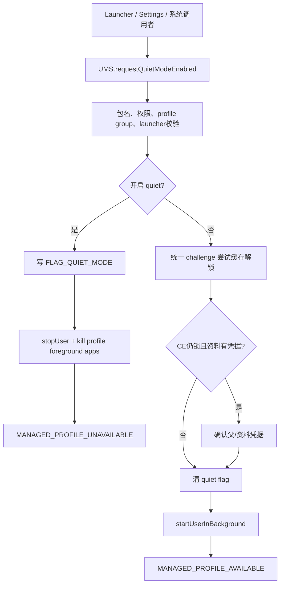
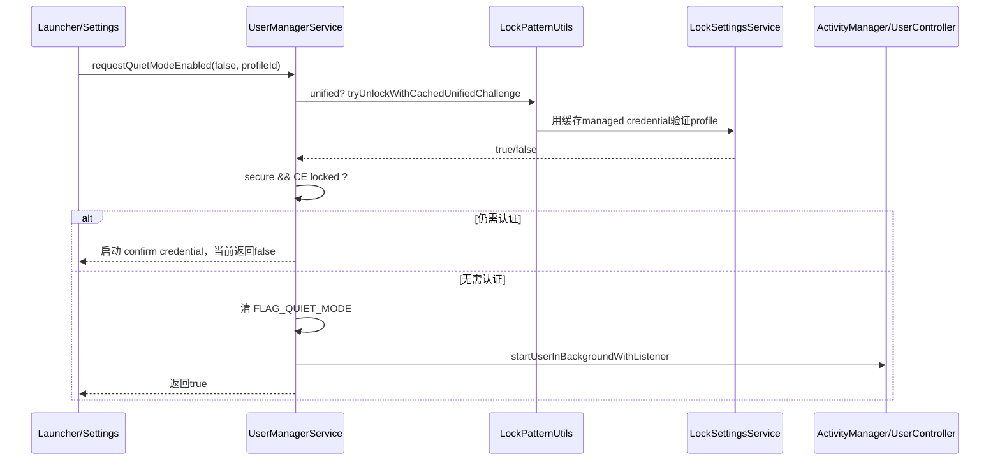
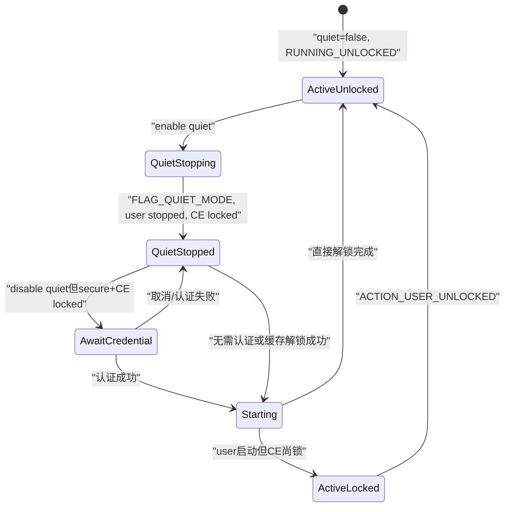

# 304 Android 工作资料 Quiet Mode：统一/独立 Challenge、启停广播与应用暂停边界

## 1. 本章目标

本章解释用户点击“暂停工作应用/开启工作模式”后系统真正做了什么：谁能切 quiet mode、何时要求凭据、统一与独立资料密码怎样解锁 CE、为什么启用 quiet mode 会停止整个 profile，以及 Launcher、Widget、Activity 和通知如何体现不可用状态。

## 2. 版本边界

只按 `android-11.0.0_r48`。后续版本的统一 challenge 缓存期限、Work Profile UI、权限和后台限制可能变化；不要用当前 Android 行为替换本章的 r48 源码结论。

## 3. macOS 只读学习

不修改 Mac 或真实设备的凭据，不打开/关闭实际工作资料。练习只读 UserManagerService、LockSettingsService、UserController、Launcher3 和窗口管理源码。

## 4. 一句话定义 quiet mode

Quiet mode 是 managed profile 的持久 flag 与运行状态操作：开启时停止 profile、杀其前台应用并广播 unavailable；关闭时可能先认证，再后台启动 profile，解锁后广播 available/执行目标 Intent。

## 5. Quiet mode 不是“静音”

它不只是屏蔽通知声音，而是让整个资料 user 停止运行。资料应用进程、Job、Service、Provider 和 CE 数据都会受 user stop/lock影响；父用户个人应用继续运行。

## 6. Quiet mode 也不等于删除资料

UserInfo、PO、应用安装状态、账户和 DE/CE 数据仍在，只是 profile 标记 quiet 并停止。关闭 quiet mode 后同一个 userId、serial 与数据重新启动，不创建新资料。

## 7. Quiet mode 不等于锁屏

父设备可处于解锁但工作资料仍 quiet；工作资料可不 quiet却因独立 challenge 尚未输入而 CE 锁定。Quiet flag、UserState 和存储 key 是三张不同状态账。

## 8. 核心源码地图

```text
frameworks/base/core/java/android/os/UserManager.java
frameworks/base/services/core/java/com/android/server/pm/UserManagerService.java
frameworks/base/core/java/com/android/internal/widget/LockPatternUtils.java
frameworks/base/services/core/java/com/android/server/locksettings/LockSettingsService.java
frameworks/base/services/core/java/com/android/server/am/UserController.java
frameworks/base/services/core/java/com/android/server/wm/ActivityStartInterceptor.java
frameworks/base/services/appwidget/java/com/android/server/appwidget/AppWidgetServiceImpl.java
packages/apps/Launcher3/src/com/android/launcher3/**/*.java
frameworks/base/core/java/android/content/Intent.java
```

## 9. 五个相关状态

`FLAG_QUIET_MODE` 表示产品开关；UserState 表示 stopped/locked/unlocked；StorageManager表示 CE key 是否解锁；separate challenge 表示认证模型；Launcher/SystemUI 缓存表示界面呈现。诊断时应逐项核对。

## 10. 总流程图



## 11. API 入口

公开/隐藏 UserManager 最终调用 UMS `requestQuietModeEnabled(callingPackage,enable,userId,target,flags)`。`callingPackage` 不是日志装饰；服务会把它与 Binder UID 的真实包关系核对。

## 12. 为什么验证 callingPackage

若只信字符串，恶意应用可冒充默认 Launcher 或有权限包。`verifyCallingPackage()` 让包名、UID和当前 user安装状态形成一致身份。

## 13. enable 时不能带 target

源码规定 `enableQuietMode && target != null` 直接抛 IllegalArgumentException。目标 Intent 只用于“关闭资料后继续打开某工作内容”，暂停资料没有合理的资料内后续启动目标。

## 14. 两个 disable flags

`QUIET_MODE_DISABLE_DONT_ASK_CREDENTIAL` 要求不询问凭据；`QUIET_MODE_DISABLE_ONLY_IF_CREDENTIAL_NOT_REQUIRED` 表示只在无需交互认证时关闭，否则返回 false。二者同时出现是矛盾输入，服务拒绝。

## 15. `DONT_ASK_CREDENTIAL` 的权限

绕过凭据 UI 只允许 MANAGE_USERS 调用者；普通 Launcher 即使可切工作模式，也不能要求系统在资料 key锁定时无认证解锁。

## 16. `ONLY_IF...` 的含义

调用方希望一次无 UI 尝试：若缓存/现状足以解锁则继续，否则不弹确认界面并返回 false。适合系统组件探测能否平滑恢复，不是绕过密码。

## 17. SystemUI 的额外限制

源码禁止 SystemUI 包使用 `ONLY_IF_CREDENTIAL_NOT_REQUIRED`，避免快速设置 tile 在 Keyguard仍锁时意外自动打开资料。不同系统 UI入口有不同交互安全假设。

## 18. 谁能修改 quiet mode

system/root、持 `MODIFY_QUIET_MODE`、持 `MANAGE_USERS`，或同 profile group 中当前前台默认 Launcher可调用。不是任何能看见工作图标的应用都能暂停资料。

## 19. 默认 Launcher 的动态条件

UMS 通过 ShortcutServiceInternal 检查调用包是否为 foreground default launcher。只是被设置为默认但当前不在前台，或只是声明 HOME intent，都不一定满足。

## 20. 跨 profile group 更严格

普通 Launcher/`MODIFY_QUIET_MODE` 只能操作自己所在 profile group。目标 user属于另一组时必须 MANAGE_USERS，防止一个登录用户控制另一个用户的资料。

## 21. 带后续 Intent 更严格

请求在关闭 quiet 后启动 `IntentSender` 也要求 MANAGE_USERS。启动能力会跨 user带入任意目标，不能只凭 Launcher 身份授予。

## 22. 目标必须是 managed profile

`setQuietModeEnabled()` 锁内查询 UserInfo和parent；不存在或不是 managed profile就抛。Quiet mode不是通用 full user暂停 API。

## 23. 相同状态幂等返回

若当前 `isQuietModeEnabled()==enableQuietMode`，记录日志后 return，不重复 stop/start和广播。请求成功返回不必然代表本次产生了状态转换。

## 24. flag 的实际存储

服务用 `profile.flags ^= UserInfo.FLAG_QUIET_MODE` 翻转位，并在 packages lock 下 `writeUserLP(profileUserData)`。状态跨 system_server/设备重启保留，不只在 Launcher内存。

## 25. 为什么 XOR 在这里安全

代码先确认当前布尔值与目标不同，所以 XOR恰好切到目标值；若省略前置判断，重复 enable 会反向关闭，这是理解 bit更新条件的重要例子。

## 26. 写 flag 先于 stop/start

UMS 先持久化目标状态，再调用 ActivityManager。若进程随后崩溃，重启可看到应处于 quiet/active 的目标，其他组件不会只依赖尚未完成的运行态。

## 27. 但这仍不是原子事务

写 flag成功后 stop/start可能失败或稍后完成；广播也在外部调用之后。短窗口内持久 flag、UserState和 UI观察可能不一致，系统依靠后续生命周期收敛。

## 28. 开启 quiet 的第一动作

调用 `ActivityManager.stopUser(userId,force=true,null)`。force允许停止关联资料，即使其中有前台服务或其他活动；父用户不被切出前台。

## 29. 又为何杀前台应用

UMS 还调用 `ActivityManagerInternal.killForegroundAppsForUser(userId)`。即使 stop user流程异步，显式杀资料前台应用能更快终止可见/重要工作进程。

## 30. stopUser 返回并非清除数据

它推动 UserState到 STOPPING/SHUTDOWN并停组件、锁 CE key；不会删除 user、包或数据。下一次关闭 quiet仍能启动原 profile。

## 31. 关闭 quiet 的第一目标

不是简单清 flag，而是确认资料能否安全解锁。UMS先处理统一 challenge缓存，再判断是否需要凭据 UI，避免把 active标记暴露给无法访问 CE 的半启动资料。

## 32. 什么是独立 challenge

资料维护自己的 PIN/图案/密码，用户可在个人设备已解锁后仍需单独解锁工作资料。LockSettings中 `SEPARATE_PROFILE_CHALLENGE_KEY=true` 表示此模型。

## 33. 什么是统一 challenge

资料没有用户直接输入的独立凭据 UI，但仍有随机 managed password和独立 FBE key。平台把随机资料密码加密绑定到父用户认证，再在父凭据成功后解封资料。

## 34. “统一”不等于同一密码字节

父用户的 PIN不会直接作为 profile凭据存储；系统为资料生成随机 managed password，再用 AndroidKeyStore受认证密钥保护它。这样保留每 user独立 GateKeeper/FBE身份。

## 35. 切到独立 challenge

`setSeparateProfileChallengeEnabled(enabled=true)` 先写 separate标记，然后删除 child profile lock文件和 profile Keystore keys。之后 profile用自己的用户凭据，不再依赖父用户加密的随机密码副本。

## 36. 切回统一 challenge

enabled=false 时调用 `tieManagedProfileLockIfNecessary()`，把现有/新 managed password通过 `tieProfileLockToParent()`加密保存。失败会恢复旧 separate布尔值再抛异常。

## 37. 布尔回滚不是完整事务证明

异常时恢复标记，但 Keystore entry或 child lock写入的分步副作用仍需查看具体失败点。源码尽力保持语义，不等于跨 Keystore/文件完全 ACID。

## 38. 锁避免 DPMS 死锁

Separate challenge变化后 LSS 不直接同步调用 DPM，而是在 Handler上让 DevicePolicyManagerInternal报告。注释明确同步调用可能死锁，说明锁顺序也是跨服务设计的一部分。

## 39. DPC 对统一密码的策略门

DevicePolicy可通过 `DISALLOW_UNIFIED_PASSWORD` 或密码合规条件禁止统一。UI 的“使用一个锁屏”是否可选，不只由用户偏好决定。

## 40. `isSeparateProfileChallengeAllowedToUnify`

LockPatternUtils同时检查资料当前密码对父策略是否足够，以及 profile没有 `DISALLOW_UNIFIED_PASSWORD`。只有两者都满足才允许合并。

## 41. 绑定用两条 Keystore key alias

`PROFILE_KEY_NAME_ENCRYPT+userId` 用于一次加密，`...DECRYPT+userId` 用于之后解密。加密完成后删除 encrypt entry，保留受用户认证约束的 decrypt entry。

## 42. AES-GCM 保护随机资料凭据

`tieProfileLockToParent()` 生成 AES key，以 GCM/NoPadding加密 managed password，将 IV与ciphertext写 child profile lock文件。GCM同时提供机密性和完整性。

## 43. decrypt key 的认证限制

KeyProtection设置 `setUserAuthenticationRequired(true)`、有效期30秒，并标为 critical-to-device-encryption。只有父用户近期提供有效认证时，LSS才能取该 key解密资料密码。

## 44. 30秒代表哪一层

它是 Keystore decrypt key单次可用的用户认证有效窗口，不等于 quiet mode缓存凭据总寿命，也不等于 profile保持解锁的时长。

## 45. 解密后立即缓存

`getDecryptedPasswordForTiedProfile()` 解 GCM后创建 managed credential，清零临时 byte[]，并写 `mManagedProfilePasswordCache`。缓存用于以后快速验证资料 challenge。

## 46. 缓存仍是敏感状态

它不是明文写普通 SharedPreferences；由 LockSettings受控内存/加密机制持有，并有移除接口。即便如此，平台仍结合 Keyguard与flags限制何时自动使用。

## 47. r48 公开注释中的缓存期限

LockPatternUtils注释称统一 challenge缓存可在父用户近期解锁后约7天内重新推导/使用。该期限来自缓存实现策略，与第43节的30秒 Keystore认证窗口是两层机制。

## 48. 不把注释当唯一证据

具体缓存失效还受重启、内存、显式清理、凭据变化和实现细节影响。诊断应以 `tryUnlockWithCachedUnifiedChallenge()`实际返回与 LSS日志为准，不能承诺固定7天必成功。

## 49. quiet关闭时何时尝试缓存

仅当 `isManagedProfileWithUnifiedChallenge(userId)`；并且通常要求父用户当前不处于 device locked。`ONLY_IF...`模式例外，会始终尝试一次但失败后不弹 UI。

## 50. Challenge与quiet关闭序列



## 51. needToShowConfirmCredential 公式

没有 DONT_ASK、`LockPatternUtils.isSecure(profileId)` 为真、且 `StorageManager.isUserKeyUnlocked(profileId)` 为假，三者同时成立才弹确认凭据。

## 52. 为什么同时检查 secure 与 key

资料可能无安全凭据，或 CE key已经被统一 challenge提前解锁。只看 quiet flag无法决定认证；真正目标是安全获得 CE key。

## 53. `ONLY_IF...` 失败返回

需要确认凭据时直接 return false，不改 quiet flag、不启动 profile、不弹界面。调用方可保持现状并提示用户主动操作。

## 54. Confirm Device Credential 的 userId

UMS 调 `createConfirmDeviceCredentialIntent(...,profileId)`，即使是统一 challenge也传资料 userId。确认界面知道资料与父关系，可展示/验证个人 challenge并同时解锁工作资料。

## 55. 不直接传父 userId 的原因

若固定父 userId，独立 challenge会验证错对象；传 profileId让 Keyguard/LockSettings根据 separate/unified模型选择实际 credential owner。

## 56. 回调 PendingIntent

UMS创建一次性、immutable、foreground的内部 broadcast，带 profileId和可选原 IntentSender；确认界面成功后触发它，再由 BackgroundThread关闭 quiet。

## 57. 为什么回调在后台线程

BroadcastReceiver注释说明避免 ANR。`setQuietModeEnabled()`会写盘并调用 AMS start user，不应阻塞 receiver主线程。

## 58. 确认界面启动时本次 API 返回 false

false不一定代表用户最终取消，也可能表示“已发起交互，尚未完成”。调用方不能把它统一显示成错误；真正结果由后续 profile available/目标 Intent判断。

## 59. 认证成功后的内部调用

回调直接调用私有 `setQuietModeEnabled(false,target,null)`，不重新经过外部 callingPackage权限判断，因为 Intent是 system_server自建、包限定、one-shot的受控路径。

## 60. 关闭 quiet 的 flag 操作

在确认无需认证后，UMS翻转并写 `FLAG_QUIET_MODE`，然后调用 `startUserInBackgroundWithListener()`。此时profile product状态已改active，UserState尚在启动收敛。

## 61. 带 target 时注册进度 listener

UMS构造 `DisableQuietModeUserUnlockedCallback(target)`，只有 user启动解锁完成后才发送目标 IntentSender，避免工作Activity在 CE仍锁或组件未ready时启动。

## 62. 不带 target 时无需 listener

普通工作模式开关只需启动 profile；Launcher通过 available/unlocked广播和模型刷新更新 UI，不必由 UMS回调某个 Activity。

## 63. available 广播的发送时机

`setQuietModeEnabled()`在调用 startUser后立即调用 `broadcastProfileAvailabilityChanges(...,false)`；它不严格等待 USER_UNLOCKED。Available表示 quiet flag关闭/资料正在可用化，不等于 CE已解锁。

## 64. target为何仍等 unlock

正因为 available可能早于 unlock，带 target另用 `IProgressListener` 等UserController unlock完成。两个通知解决“界面可刷新”和“可安全启动具体内容”不同需求。

## 65. 开启 quiet 的 unavailable 广播

同样在请求 stop user后发送，而 stop流程可能异步。观察者应立即把工作内容标不可用，不等最后一个资料进程完全退出才更新 UI。

## 66. 广播携带的 extras

包含 `EXTRA_QUIET_MODE`、`EXTRA_USER` 和旧式 `EXTRA_USER_HANDLE`。接收者必须确认目标 profile，不能假定当前用户只有一个资料。

## 67. Manifest receivers 的特殊投递

UMS先借 DevicePolicyManagerInternal把 Intent发给有权限的跨资料 manifest receivers；随后加 REGISTERED_ONLY发父用户普通动态 receiver。公开文档强调一般只发注册 receiver。

## 68. 为什么限制 manifest receiver

quiet切换不应唤醒所有静态声明应用造成性能/隐私泄漏；平台只给经过设备策略许可的特殊跨资料组件例外，其余在前台/活跃时动态监听。

## 69. `ACTION_MANAGED_PROFILE_UNLOCKED`

这是 CE真正解锁后发给父用户的另一 action。它与 AVAILABLE可先后相邻但语义不同：available是quiet可用性，unlocked是凭据加密存储可用。

## 70. `ACTION_MANAGED_PROFILE_ADDED/REMOVED`

Added/Removed描述profile生命周期；Available/Unavailable描述同一profile可用性；Unlocked描述存储状态。不要用 Removed处理临时quiet，也不要把 Available当新建资料。

## 71. Launcher如何知道 quiet

Launcher3加载用户时调用 `UserManager.isQuietModeEnabled(user)`，把结果写 `FLAG_QUIET_MODE_ENABLED` 模型位；available/unavailable触发更新，而非只靠图标点击本地切布尔值。

## 72. 工作图标为何变灰

AppInfo构造时接收 user quiet状态，Launcher据此为工作应用添加 disabled/quiet视觉状态。Intent文档也明确 Launcher icons会灰化。

## 73. 灰化是 UI，不是安全边界

真正阻止运行的是 profile stopped、Activity拦截、UserManager状态和存储锁。只改 Launcher图标无法暂停后台服务；反之自定义Launcher即使画错，system_server仍控制 user。

## 74. WorkModeSwitch

Launcher工作标签根据模型 flag显示开关状态，并在具有修改能力时请求 UserManager。它不自行 `forceStopPackage()`每个应用。

## 75. Activity 启动拦截

ActivityStartInterceptor 查询目标 user quiet状态；quiet时不直接启动目标工作Activity，而是引导用户关闭quiet/确认凭据的系统流程。绕过Launcher发显式Intent也不能直接启动。

## 76. RecentTasks 过滤

窗口管理在加载/展示最近任务时识别 managed profile quiet状态，避免把不可启动的工作任务当普通可恢复任务。具体 UI可能显示占位或隐藏，安全判断仍在启动端复核。

## 77. AppWidget 掩码

AppWidgetService在profile quiet时把 provider/host状态视为 masked，父桌面上的工作资料Widget显示不可用而不继续提供实时工作数据。

## 78. Widget掩码不删除绑定

关闭quiet后原 widget可恢复；系统保留绑定关系，只改变 provider可用性和展示。这和删除profile时永久清理Widget状态不同。

## 79. 通知为什么消失/暂停

开启quiet会停止user并杀应用；资料进程无法继续发通知，已有通知也按user停止/包状态由通知系统和 SystemUI处理。它不是逐通知设置静音 channel。

## 80. 通知 channel仍保留

profile数据未删除，NotificationChannel偏好属于该 user/包的持久状态；关闭quiet后应用可继续按原channel发通知，不需要重建全部用户设置。

## 81. Job/Alarm 的边界

user停止后应用组件不运行，JobScheduler/Alarm等按用户生命周期暂停或不投递；已登记任务通常保留并在用户重启后重新评估。quiet不等于取消所有任务定义。

## 82. Binder/Provider 调用

父应用不能因持有旧ContentProvider引用就保证继续读工作CE数据；user stop会终止资料进程和连接，跨资料API需处理 DeadObject/不可用并等待恢复广播。

## 83. 网络状态

资料应用进程停止意味着其socket关闭、VPN/网络请求按用户/应用生命周期变化。Quiet不是 NetworkPolicy firewall单独开关，也不会暂停父用户个人网络。

## 84. Foreground Service也不能保活

UMS明确 stopUser(force=true)并 kill profile foreground apps；资料应用不能用前台服务抵抗用户/系统暂停工作资料。

## 85. Direct Boot不能绕过 quiet

即便组件 directBootAware能在RUNNING_LOCKED工作，quiet开启会把整个user停止。Direct Boot解决“user运行但CE未解锁”，不解决“user被quiet停止”。

## 86. Separate challenge资料的恢复

关闭quiet时若资料安全且CE锁定，必须显示资料确认界面；输入正确后 LockSettings解锁profile key，再回调UMS启动/继续目标。父设备已解锁不替代独立工作密码。

## 87. Unified challenge资料的恢复

UMS可先尝试缓存managed credential；成功则CE已解锁，无额外UI。失败时仍可显示确认父凭据，由Keyguard按profile关系解封工作资料。

## 88. 父设备锁定时为何保守

即使缓存可能存在，普通快速设置操作在父Keyguard显示时不自动解锁工作资料，避免锁屏界面上的无意触摸使企业数据后台恢复可用。

## 89. DONT_ASK不是“忽略锁”

有MANAGE_USERS的系统调用者可选择不弹凭据，但如果 key仍锁，直接 set quiet false并启动user可能停在RUNNING_LOCKED；调用者必须理解并处理后续unlocked状态，权限不等于密码学解锁。

## 90. 状态组合图



## 91. 返回值真值表

enable成功通常返回 true；disable无需交互并启动返回 true；ONLY_IF遇需认证返回 false；弹确认界面也先返回 false；异常则抛。false既可能是“保持quiet”，也可能是“等待用户交互”。

## 92. 调用方不要只看同步返回值

可靠 UI还应观察 `isQuietModeEnabled()`、AVAILABLE/UNAVAILABLE与UNLOCKED，必要时检查目标 Intent是否实际启动。异步用户生命周期不能压成一个布尔完成点。

## 93. quiet事件日志

UMS记录调用包、目标 enable值以及距上次请求或profile创建的时间。时间用于设备策略分析，不是强制冷却窗口；源码并未因请求过快直接拒绝。

## 94. 最近请求时间持久化

UserData的 last request quiet mode时间写入用户 XML tag，跨重启可继续计算 period。它是遥测字段，不决定当前 quiet flag。

## 95. 自动启动关联资料

UserController在启动父用户相关profiles时会跳过 `isQuietModeEnabled()` 的profile。设备重启后 quiet资料不会因父用户解锁自动恢复工作模式。

## 96. 非quiet profile的自动启动上限

相关profiles还受 `getMaxRunningUsers()-1` 限制；数量超出会警告。quiet只是跳过条件之一，未quiet也不保证资源限制下立即运行。

## 97. `setUserEnabled` 与 quiet不同

前章创建profile用了 `FLAG_DISABLED`，UMS有 `setUserEnabled()` 清该位；quiet使用 `FLAG_QUIET_MODE`。Disabled表示用户是否启用，quiet表示已启用managed profile的临时工作暂停。

## 98. 两个 flag 可同时出现吗

创建中profile可能disabled而尚无正常工作模式；产品完成后一般enabled。诊断半配置对象时要分别读两个bit，不能用quiet解释 disabled创建态。

## 99. Quiet模式与用户删除

删除profile会销毁key、包状态、数据和Owner；quiet只stop并保留。管理界面必须把“暂停工作应用”和“删除工作资料”明确分开。

## 100. 端到端故障分层

```text
1. SecurityException：callingPackage/权限/launcher/profile group不满足。
2. IllegalArgumentException：目标不是managed profile或flags/target组合非法。
3. 同步false：仅无交互尝试失败，或已发起凭据确认。
4. quiet flag已清但应用仍不可用：user尚在启动或CE仍锁。
5. AVAILABLE已收但Activity打不开：等待UNLOCKED/目标listener，检查UserController。
6. UI仍灰：Launcher模型/广播丢失，重新查询UserManager权威状态。
```

## 101. 诊断权限问题

记录 Binder calling UID、callingPackage、caller userId、target profileId、两者profileGroupId、是否前台默认Launcher、是否有MANAGE_USERS/MODIFY_QUIET_MODE，以及是否携带target/DONT_ASK。

## 102. 诊断凭据问题

区分 separate flag、profile `isSecure()`、StorageManager user key unlocked、父Keyguard是否locked、缓存统一challenge是否存在/验证成功，以及确认界面是否回调内部broadcast。

## 103. 诊断启动问题

检查 FLAG_QUIET_MODE已清、UserInfo enabled、UserState、startUser返回、FBE解锁、LOCKED_BOOT_COMPLETED/USER_UNLOCKED和资料进程；不要只看Launcher开关动画。

## 104. 诊断广播问题

确认接收器注册在父用户、是动态receiver还是获DPM许可manifest receiver，并核对 EXTRA_USER。AVAILABLE可能早于UNLOCKED，顺序假设错误会形成偶发问题。

## 105. 安全边界总结

权限决定谁能请求；profile group限制作用域；Keyguard/LockSettings决定能否解锁；UserController停止/启动执行隔离；Launcher/Widget只呈现状态。每层防的是不同问题。

## 106. 性能边界

开启quiet涉及stop user和杀进程，关闭涉及启动系统服务/应用与可能解锁存储，不应假定瞬时完成。频繁切换可能引发进程冷启动、磁盘和广播开销。

## 107. 数据一致性边界

应用被强停前应像普通进程死亡一样使用事务/AtomicFile保存关键数据；系统不保证收到优雅退出回调。Quiet不是让应用执行完所有异步写再暂停。

## 108. 企业策略边界

DPC可以影响密码统一、资料行为和允许的跨profile组件，但用户/Launcher quiet开关仍由UMS统一裁决。DPC不能靠普通App API自行伪造系统可用性广播。

## 109. 测试应覆盖的矩阵

至少覆盖 unified/separate × 父锁定/解锁 × CE已解锁/锁定 × 普通/ONLY_IF/DONT_ASK × 有/无target，并观察同步返回、quiet flag、AVAILABLE和UNLOCKED。

## 110. 版本注释要保留

r48 LockPatternUtils注释写缓存统一challenge“近期约7天”，而Keystore decrypt key配置为30秒；二者必须按缓存与密钥解密授权分层，不能合并成单一有效期。

## 111. 本章断点表

权限通过、flag写盘、stop/start请求、UNAVAILABLE/AVAILABLE、凭据验证、CE key解锁、USER_UNLOCKED、目标Intent发送、Launcher模型刷新，是九个不同完成点。

## 112. macOS 只读练习一：还原权限与flags

```bash
sed -n '980,1105p' frameworks/base/services/core/java/com/android/server/pm/UserManagerService.java
```

列出四类合法调用者、何时必须MANAGE_USERS，以及两个disable flag同时设置为何被拒绝。

## 113. macOS 只读练习二：追quiet启停

```bash
sed -n '1098,1175p' frameworks/base/services/core/java/com/android/server/pm/UserManagerService.java
```

证明flag先写盘，再stop/start，最后发availability广播；说明广播为何不等于user已完全停/解锁。

## 114. macOS 只读练习三：追统一challenge

```bash
sed -n '1090,1140p' frameworks/base/services/core/java/com/android/server/locksettings/LockSettingsService.java
sed -n '1730,1785p' frameworks/base/services/core/java/com/android/server/locksettings/LockSettingsService.java
sed -n '3168,3200p' frameworks/base/services/core/java/com/android/server/locksettings/LockSettingsService.java
```

画出随机资料密码→AES-GCM child lock→父认证约束decrypt key→缓存credential→profile验证链。

## 115. macOS 只读练习四：观察UI消费者

```bash
rg -n "isQuietModeEnabled|FLAG_QUIET_MODE_ENABLED" packages/apps/Launcher3/src frameworks/base/services/appwidget frameworks/base/services/core/java/com/android/server/wm -g '*.java'
```

分别找Launcher灰图标/工作开关、Widget mask和Activity启动拦截，并解释它们为何不是quiet权威存储。

## 116. 常见误解一：quiet只是通知免打扰

错。它停止整个profile user并杀资料前台应用，通知暂停只是应用无法运行和user状态变化的结果之一。

## 117. 常见误解二：统一challenge共享父密码

错。资料使用随机managed credential和独立FBE身份；父认证只解封其加密副本，避免直接复制父PIN。

## 118. 常见误解三：AVAILABLE表示CE已解锁

错。UMS在发起start后即可广播AVAILABLE；要启动依赖CE的目标，应等待UserController unlock listener或MANAGED_PROFILE_UNLOCKED。

## 119. 复读修订

复读后明确修正四点：quiet flag与disabled flag不同；关闭quiet同步false也可能表示凭据UI已启动；AVAILABLE早于最终解锁是允许的；30秒Keystore认证窗口与注释所述统一challenge缓存期限不是一个计时器。

## 120. 本章小结与下一章

Quiet mode是一条“授权请求→凭据判断→持久flag→user stop/start→可用性广播→CE解锁→UI刷新”的异步链。下一章进入企业 delegated scopes：DPC如何把证书、应用限制、权限、网络日志等窄能力交给delegate，以及包名、scope持久化与调用身份裁决。
