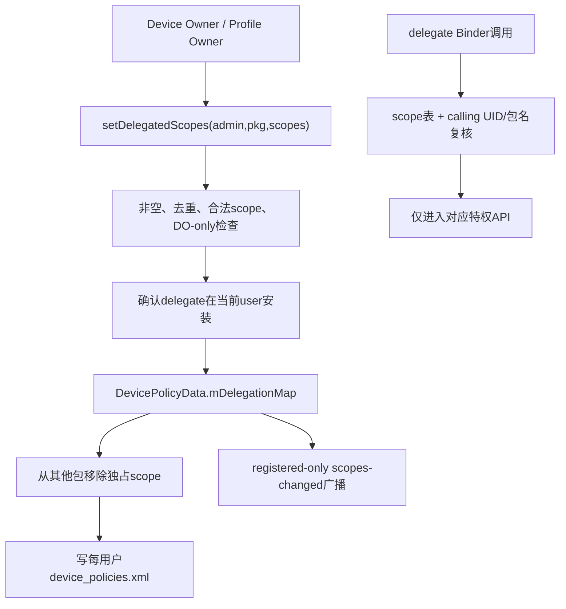
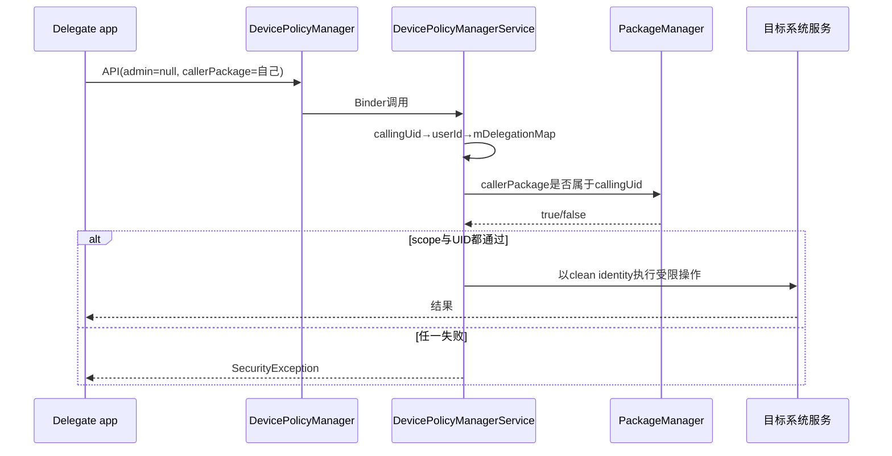
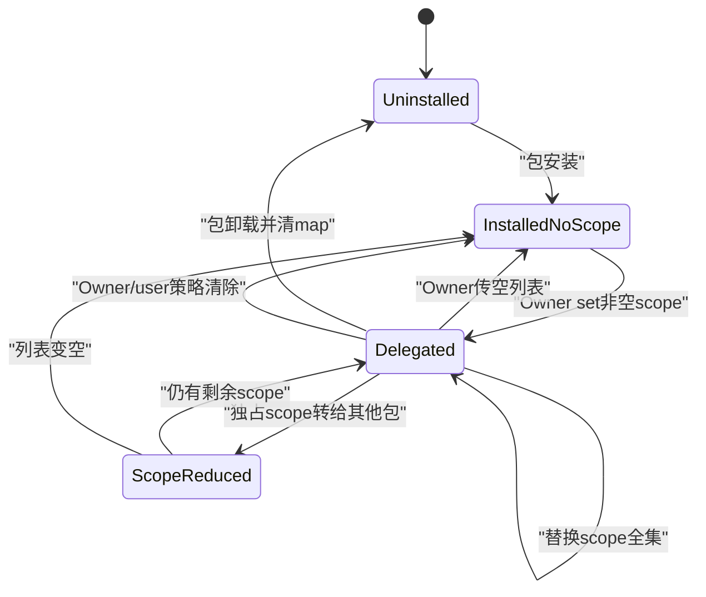

# 305 Android DevicePolicy Delegated Scopes：授予、持久化、身份、独占与撤销链

## 1. 本章目标

本章回答企业管理中的“最小权限拆分”问题：DO/PO怎样把一组特权API交给另一个应用，DPMS如何保存 scope、确认真实调用包、转移独占能力、通知delegate，并在包卸载或Owner清除时撤销。

## 2. Android 11边界

只讨论 `android-11.0.0_r48` 中十类 delegation常量和对应DPMS实现。后续版本可能新增scope或调整API归属，不能把现代列表直接套回本章。

## 3. macOS只读范围

不在真实设备授予证书、权限或网络日志能力。练习只读 `DevicePolicyManager.java`、`DevicePolicyManagerService.java` 与每用户策略XML序列化代码。

## 4. 为什么需要delegate

大型DPC不应把证书、应用分发、权限审批和网络审计全部塞进一个进程。Owner可把明确能力交给专门包，降低主DPC复杂度，也缩小单个辅助组件被攻破后的权限范围。

## 5. Delegation不是Android运行时权限

它不是PackageManager permission grant，也不是AppOp。它是DPMS每用户策略表中的“包名→scope列表”，只有调用对应DevicePolicy API时由DPMS解释。

## 6. Delegation也不把delegate变成Owner

delegate没有Owner Component、不能随意调用全部DPM API，也不会进入Owners XML。它只能在列出的scope对应入口以 `admin=null`、自己的包名调用。

## 7. 核心源码地图

```text
frameworks/base/core/java/android/app/admin/
  {DevicePolicyManager,DelegatedAdminReceiver}.java
frameworks/base/services/devicepolicy/java/com/android/server/devicepolicy/
  DevicePolicyManagerService.java
  ├─ DevicePolicyData.mDelegationMap
  ├─ set/getDelegatedScopes
  ├─ isCallerDelegate
  ├─ enforceCanManageScope
  └─ saveSettingsLocked / package lifecycle cleanup
```

## 8. r48的scope总表

证书安装、应用限制、阻止卸载、启用系统应用、保留已卸载包、包访问、权限授予、安装现有包、网络日志、证书选择，共十种公开常量。

## 9. 源码列表的重复项

DPMS `DELEGATIONS[]` 中 `DELEGATION_KEEP_UNINSTALLED_PACKAGES` 出现两次。合法性仍是contains语义，重复不会形成第二份能力；这是r48数组冗余，不是两种keep scope。

## 10. 总体授权图



## 11. 每用户状态

文档明确delegated scopes是per-user。相同包在父用户与工作资料有不同UID和策略表，一侧被委托不自动获得另一侧能力。

## 12. 授予入口

DPC调用 `setDelegatedScopes(admin,delegatePackage,scopes)`；客户端先拒绝parent instance，再通过Binder进入DPMS。父实例不能借父侧管理视图随意创建delegate。

## 13. admin必须非空

设置scope时 `who` 必须是Owner Component。delegate只能查询/使用自己的scope，不能自行给自己或其他包新增能力。

## 14. delegate包名校验

DPMS要求字符串非空；scope列表元素也不得为null。空字符串和null不是“清除全部”的替代表示，清除要传同包名与空列表。

## 15. scope去重

输入先经 `ArraySet` 再转ArrayList，同一scope重复只保存一次。顺序不应作为业务语义，调用方要把它视为集合。

## 16. 未知scope fail closed

源码用retainAll合法列表；若移除了任何未知项，直接抛 `IllegalArgumentException`，不会悄悄保留合法子集继续授权。

## 17. 为什么拒绝而非忽略

忽略拼写错误会让DPC以为安全能力已授予，delegate运行时才失败。整次拒绝能尽早暴露版本不匹配或配置错误。

## 18. DO-only scope

r48只有 `DELEGATION_NETWORK_LOGGING` 被列入 `DEVICE_OWNER_DELEGATIONS`。请求列表包含它时，caller必须通过USES_POLICY_DEVICE_OWNER验证，普通PO不能授予。

## 19. 为什么网络日志只允许DO委托

网络日志覆盖设备级DNS/connect元数据，超出普通工作资料的局部管理范围。第299章的全设备隐私边界仍适用于delegate。

## 20. 其他scope的Owner门

不含DO-only scope时，`getActiveAdminForCallerLocked(who,USES_POLICY_PROFILE_OWNER)` 接受PO或DO。并不表示所有后续API能力完全相同，目标API还会执行自身角色/用户边界。

## 21. 调用用户决定存储位置

DPMS用真实calling process的userId选择 `DevicePolicyData`。admin Component、delegate安装与scope表都在这一user上下文解释。

## 22. delegate通常必须已安装

目标Sdk N及以上一律检查当前user已安装；未安装抛异常。避免为未来同名包预埋持久特权，之后任意签名包安装即继承。

## 23. 旧版兼容例外

Owner targetSdk低于N时，只有单独授予CERT_INSTALL或清空scope可跳过安装检查。这是兼容旧`setCertInstallerPackage`行为，不应作为新DPC设计模式。

## 24. 检查的是Owner targetSdk

`shouldCheckIfDelegatePackageIsInstalled()` 接收 `getTargetSdk(who.getPackageName(),userId)`，即Owner/DPC的target，不是delegate target。兼容责任绑定发起旧API语义的DPC。

## 25. 保存映射

非空scope列表复制后放入 `policy.mDelegationMap[delegatePackage]`；空列表移除整个map项。每次set是替换该包全部scope，不是增量add。

## 26. 替换语义的风险

DPC若只想新增一个scope却传单元素，会丢掉delegate旧scope。正确做法是读取/维护期望全集，再一次性设置。

## 27. 两个独占scope

`DELEGATION_NETWORK_LOGGING` 与 `DELEGATION_CERT_SELECTION` 在同一user最多一个delegate持有。证书安装并非独占，多个包在新scope模型下可同时拥有。

## 28. 独占转移算法

新包映射写入后，DPMS遍历其他delegate，从其列表removeAll本次独占scope；列表空则移除包项，并向受影响旧包发送更新广播。

## 29. 一次可转移两个独占scope

若DO同时给新包网络日志与证书选择，算法会从所有旧holder移除两项。旧包的其他非独占scope保留。

## 30. “独占”是每用户而非全设备包名

工作资料中的证书选择delegate与另一用户同scope可并存；网络日志本身只有DO用户能授予，仍按调用user的map持久化。

## 31. 广播在写盘前发送

`setDelegatedScopes()`先更新内存并调用广播，处理独占转移，最后 `saveSettingsLocked()`。动态receiver可能很快回调，但权威内存已更新；若写盘随后失败，跨重启仍有风险。

## 32. 广播为何REGISTERED_ONLY

平台不为scope变化强行唤醒未运行delegate。应用若在运行可动态监听；冷启动时应主动调用 `getDelegatedScopes(null,ownPackage)` 获取当前权威状态。

## 33. 广播限定package

Intent `setPackage(delegatePackage)`，避免所有应用收到企业授权变化。它不是显式Component，因为delegate可自行选择动态receiver。

## 34. 广播extra

`EXTRA_DELEGATION_SCOPES` 携带新ArrayList，包括空列表。delegate应把它当完整新状态，不是增量变化通知。

## 35. 旧holder也会收到通知

独占scope被转移时，DPMS向每个失去能力的包广播其剩余scope。delegate必须能处理权限撤回，而不能只在首次授权初始化。

## 36. 持久化格式

每个delegate-scope对写成一个 `<delegation delegatePackage="..." scope="..."/>`，位于该user `device_policies.xml` 的 `<policies>` 内。

## 37. 一个包多scope写多tag

map中是包→List，XML却按pair展开。读取时以包名聚合、去重，重建列表；文件tag顺序不应成为优先级。

## 38. 非法旧XML的边界

读取分支直接取scope字符串并加入map，没有再次对照DELEGATIONS合法表。正常文件只由DPMS写；损坏/手改文件可能产生未知项，但API检查仍只认可请求的合法scope。

## 39. 获取任意包scope

DO/PO传非null admin可查询当前user任意delegate；服务验证Owner身份后从map返回列表或空表。

## 40. delegate自查scope

普通包传 `who=null` 与自己包名；DPMS用 `isCallingFromPackage(delegatePackage,callingUid)`确认Binder UID确属该包。不能查询其他包的委托列表。

## 41. 查询空列表不代表包未安装

它只表示该user策略表无scope；包可能已安装但从未委托、被撤销，或Owner清除了策略。

## 42. getDelegatePackages

Owner可按合法scope扫描map，返回所有holder包名。对独占scope正常最多一个，对非独占scope可能多个。

## 43. `resolveDelegateReceiver`

网络日志、证书选择等回调需要receiver时，DPMS先按scope找包。零个返回null；多于一个独占holder会wtf并拒绝选择，防止不确定泄露。

## 44. 同包多个receiver

若delegate包为同一action声明多个receiver，源码warning后取查询结果第一个，选择非确定。生产delegate应只声明一个明确 `DelegatedAdminReceiver`。

## 45. 使用API时的参数形态

Owner通常传admin Component；delegate传admin=null、callerPackage=自身包名。DPMS据 `who` 是否为空选择Owner验证或scope验证。

## 46. `isCallerDelegate`两道门

先在callingUid对应user的map中确认 callerPackage含所需scope；只有命中后再查PackageManager确认该UID真属于callerPackage。

## 47. 为什么先查scope再查UID

大部分未授权调用可快速失败，且只有可能授权的包才做包UID查询。安全上两者最终都必须通过，短路顺序不改变结论。

## 48. 包名不能作为认证凭据

攻击应用可把字符串写成delegate包名；`isCallingFromPackage`用Binder callingUid与PMS解析阻止冒充。scope表+运行身份缺一不可。

## 49. shared UID边界

若delegate与别包共享UID，UID层能力隔离会变弱；PMS包归属检查可能认可同UID包集合中的声明。敏感delegate应避免shared UID，并控制签名与安装来源。

## 50. 使用委托序列图



## 51. `enforceCanManageScope`

who非null时只走Owner `getActiveAdminForCallerLocked`；who为null时才要求callerPackage是对应delegate。delegate不能同时传伪造Owner Component获得Owner分支。

## 52. 可选系统permission旁路

少数入口用 `enforceCanManageScopeOrCheckPermission`，若不是delegate还可检查指定系统permission。例如查询网络日志enabled状态可允许MANAGE_USERS；具体API必须逐一阅读。

## 53. CERT_INSTALL能力

可管理用户CA证书、安装/移除KeyPair等。它不自动拥有证书选择回调，也不能直接把任意私钥授权给其他App，后者属于CERT_SELECTION。

## 54. CERT_SELECTION能力

接管 `onChoosePrivateKeyAlias`，并可 `grantKeyPairToApp/revoke`。因选择回调只能有一个裁决者，所以它是独占scope。

## 55. 两类证书scope为何分开

安装密钥材料与决定某App可使用哪个现有身份是不同风险。企业可让PKI代理负责供应证书，另让策略代理负责运行时选择。

## 56. installKeyPair的调用用户

DPMS用真实callingUid得到UserHandle，绑定该user KeyChain；delegate安装的key不会自动进入父/其他用户KeyChain。

## 57. requestAccess授予谁

delegate调用installKeyPair且requestAccess=true时，KeyChain grant给callingUid，即delegate自身。它不自动grant给DPC或所有受管应用。

## 58. APP_RESTRICTIONS能力

允许set/get目标应用restrictions Bundle。delegate负责企业配置内容，目标应用仍通过UserManager/ApplicationRestrictions接口读取自己user中的配置。

## 59. BLOCK_UNINSTALL能力

允许为指定包设置卸载阻止。它不包含隐藏、暂停或启用系统应用，这些属于其他scope。

## 60. PACKAGE_ACCESS能力

覆盖应用隐藏和packages suspended查询/设置。它不授予任意PMS查询可见性之外的全包数据读取；DPMS以系统身份执行的目标操作仍有保护包例外。

## 61. ENABLE_SYSTEM_APP能力

允许把系统映像中对该user未安装/禁用的包或匹配Intent组件启用。它不允许安装任意外部APK。

## 62. INSTALL_EXISTING_PACKAGE能力

允许把设备上已知package安装到当前user，类似第303章DPC per-user安装。code必须已存在，不能代替PackageInstaller下载验证。

## 63. KEEP_UNINSTALLED_PACKAGES能力与r48不一致

该API管理卸载后仍保留的包列表，Owner直调要求Device Owner；但此scope未列入授予阶段的DO-only子集，而`who=null`的delegate校验通过scope后不会使用`reqPolicy`。PO因而可能授出一个后续实现仍读取DO ActiveAdmin的scope，形成失败/NPE风险；不能把它当成安全支持PO委托的证明。

## 64. PERMISSION_GRANT能力

可设置permission policy和运行时permission grant state。最终PermissionController/PMS还检查目标Sdk、权限类型、fixed flags和restricted permission规则。

## 65. 委托不突破底层合同

scope只让caller通过DPMS角色门；参数合法性、目标包存在、签名/权限类型、用户范围、日志affiliation等目标API检查照常执行。

## 66. NETWORK_LOGGING能力

可启停、查询和检索网络日志；回调从DO转给delegate。它不创建第二份日志，也不让DO与delegate各自独立消费同一批。

## 67. 日志策略仍存DO ActiveAdmin

delegate调用 `setNetworkLoggingEnabled` 时，DPMS修改的是device owner admin的 `isNetworkLoggingEnabled`。能力被代理执行，权威策略归属仍是DO。

## 68. affiliation仍必须满足

delegate取日志也要 `ensureAllUsersAffiliated()`，不能因scope绕过第299章的多用户隐私门。

## 69. 回调接收者变化

一旦网络日志scope给delegate，`resolveDelegateReceiver`把 `onNetworkLogsAvailable` 发给它，DO receiver不再收到。撤销后回调归属再由当前scope状态决定。

## 70. set与使用的时间竞态

Owner可在delegate调用前后撤销scope。每次特权API都重新查map与callingUid，不依赖delegate进程启动时缓存，因而撤销对后续调用立即生效。

## 71. 已完成副作用不会回滚

撤销CERT_INSTALL不删除已装CA/key；撤销PERMISSION_GRANT不自动恢复已设置permission；撤销BLOCK_UNINSTALL不自动解除已有block。撤销的是未来管理能力，不是历史操作补偿。

## 72. delegate必须设计撤权处理

收到空/缩减scope后停止定时任务、清敏感缓存、隐藏UI并避免重试SecurityException。不要把scope只在首次启动读取一次。

## 73. 包卸载自动撤销

DPMS处理package changed/removed时遍历 `mDelegationMap`；若delegate包被移除，从map删除并保存用户策略。

## 74. 为什么包更新不必撤销

正常签名兼容更新保持同包与UID，PMS保证升级身份；DPMS的 `isRemovedPackage` 只在真正不再安装时清理。异常换UID仍会在调用时UID复核失败。

## 75. 卸载清理不发送scope-changed给已卸载包

包已不存在，动态receiver无法接收；DPMS直接移除持久记录。再次安装同名包不会从旧map自动继承该scope。

## 76. Owner清除时撤销全部

`clearUserPoliciesLocked(userId)` 调 `policy.mDelegationMap.clear()` 并保存。没有Owner语义基础时，delegate能力不应孤立存活。

## 77. 删除user也删除委托

DevicePolicyData属于user，删除profile/user时其策略文件和map随user清理。父用户同包的scope不受影响。

## 78. 空列表主动撤销

Owner调用同一set API传empty list，DPMS移除目标包项、广播空scope并保存。没有单独的removeDelegate API。

## 79. 只撤一个scope的方法

Owner必须构造“旧全集减去目标scope”的新列表再set；直接传空会撤该包所有scope。

## 80. 独占转移不是先撤后授的两次API

一次set先把新holder写入内存，再从旧holder移除并通知，最后统一保存；减少无holder窗口，但广播/写盘仍不构成跨进程事务。

## 81. 广播顺序

新delegate先收到新scope广播调用，然后旧holder在遍历中收到剩余scope广播。接收异步，实际处理顺序不保证与send调用完全一致。

## 82. 冷启动恢复

DPMS从XML按delegatePackage聚合scope；delegate应用启动后应主动get自己的scope，因为它不会收到开机重放的静态广播。

## 83. 旧cert installer API

`setCertInstallerPackage` 通过 `setDelegatedScopePreO`映射为CERT_INSTALL，并清其他旧holder的该scope，保留旧API单delegate语义。

## 84. 新scope模型允许多个CERT_INSTALL

CERT_INSTALL不在EXCLUSIVE_DELEGATIONS；直接setDelegatedScopes可给多个包。旧setter为兼容仍主动只留一个，两个入口语义有差异。

## 85. 旧application restrictions manager

对应deprecated setter同样映射APP_RESTRICTIONS并清其他holder，以维持旧单管理包合同；现代scope API可表达更一般集合。

## 86. 兼容helper中的嵌套set

`setDelegatedScopePreO` 在DPMS锁中调用 `setDelegatedScopes`；Java synchronized可重入，因此不会因同线程再次取锁死锁，但会多次广播/保存。

## 87. Scope列表没有依赖自动补齐

授予CERT_SELECTION不会自动授予CERT_INSTALL；授予PACKAGE_ACCESS不会自动加BLOCK_UNINSTALL。DPC必须明确列出delegate需要的每项能力。

## 88. 最小权限设计示例

证书供应代理只给CERT_INSTALL；合规审批代理只给PERMISSION_GRANT；软件目录代理给ENABLE_SYSTEM_APP与INSTALL_EXISTING_PACKAGE；审计代理只给NETWORK_LOGGING。

## 89. 不要把所有scope给一个“万能代理”

这会把DPC单体风险原样复制到delegate，还增加广播、包生命周期和签名供应链。委托价值来自职责隔离，不只是代码搬家。

## 90. 生命周期图



## 91. 安全审计字段

应记录真实calling UID/userId、callerPackage、who是否null、scope、目标包/alias/permission、结果和DPC配置版本。只记“DPM调用成功”无法还原代理身份。

## 92. DevicePolicyEventLogger

目标API常以callerPackage作为admin字段，并增加 `isDelegate=(who==null)` 布尔。分析事件时不要把字段名admin误解为一定是Owner Component。

## 93. Scope变化本身的可观测性

主要证据是device_policies XML、DPMS dump、delegate动态广播和Owner查询。广播可能因进程未运行而不存在，不能作为唯一审计账。

## 94. 诊断SecurityException

先确认调用user、map中包名与scope、真实UID、包在该user安装、API传admin是否null，再看该API是否允许system permission旁路。

## 95. 诊断“已授予但无回调”

对独占回调scope检查是否被新holder转移、delegate包是否只有一个匹配receiver、receiver action/用户是否正确，以及应用是否期望静态接收registered-only scopes-changed广播。

## 96. 诊断重启后丢失

检查set是否走到saveSettingsLocked、对应user device_policies.xml是否有delegation pair、XML解析日志和包是否在启动package reconcile中被判removed。

## 97. 诊断错误用户

同包在父/profile各有UID；Owner在哪个Context实例调用决定map。打印 `UserHandle.getUserId(callingUid)`，不要只比较包名。

## 98. 诊断独占转移

Owner查询 `getDelegatePackages(admin,scope)`，再查新旧包各自scope全集。多个holder若异常存在，resolveDelegateReceiver会wtf并返回null。

## 99. 轮换delegate方案

先安装并验证新包签名/版本，授予非独占scope并验证；独占scope用单次set转移；确认新回调与API后撤旧包剩余scope，最后卸载旧包。

## 100. 轮换失败回滚

若新独占holder故障，可对旧包重新set包含独占scope，DPMS自动从新包移除；历史API副作用仍需各系统单独核查，scope回滚不等数据回滚。

## 101. Delegate更新策略

包升级前保持签名连续、避免shared UID变化，升级后主动get scope并做自检。Owner可按版本门先撤敏感scope，再升级、健康检查后恢复。

## 102. Delegate进程被杀

scope持久存在但不会保持进程存活。回调型能力由系统按事件启动/解析相应receiver；scopes-changed本身registered-only不会唤醒。

## 103. Binder identity清除边界

DPMS先以原callingUid完成delegate校验，再清identity调用KeyChain/PMS等系统服务。若先清身份再验，会把所有请求看成system；当前顺序是安全关键。

## 104. Delegate不能再委托

`setDelegatedScopes`要求非nullOwner Component并验证Owner；scope没有传递性。delegate不能把自己的CERT_INSTALL再转授第三包。

## 105. CERT_INSTALL的“隐式设备标识”边界

源码注释对设备标识attestation有特殊说明：DO委托的cert installer在特定链中可被视为有相关访问，但最终仍由 `enforceCallerCanRequestDeviceIdAttestation` 结合Owner类型和flags判断，不是所有证书操作都可读标识。

## 106. Network logging不是抓包权限

delegate取得的仍是DPMS整理后的DnsEvent/ConnectEvent批次，没有payload、errno等字段；scope扩大调用者，不扩大第299章事件模型。

## 107. App restrictions不是任意跨包数据

delegate能写平台定义的restrictions Bundle，但不能读取目标应用私有文件；目标App选择如何执行配置，系统只负责持久与分发合同。

## 108. Permission delegate仍受用户隐私规则

只有运行时权限和允许状态可设置，Sensor/Location后台限制、AppOps、restricted白名单等仍可能使“权限GRANTED”不等于运行时数据可用。

## 109. 完成点清单

set调用返回、内存map更新、旧holder独占scope移除、广播排队、策略XML写盘、delegate下一次API通过、目标系统副作用成功，是七个不同完成点。

## 110. 阅读源码的固定四问应用

授权在DPC进程发起、DPMS Binder线程验证并持锁更新、广播到delegate进程、目标操作可能再跨KeyChain/PMS；每次identity切换与userId来源都要标注。

## 111. 本章断点表

输入合法性、Owner角色、包安装、map替换、exclusive迁移、广播、持久化、调用时scope、调用UID、目标API合同，共十层。

## 112. macOS只读练习一：列scope矩阵

```bash
sed -n '1715,1805p' frameworks/base/core/java/android/app/admin/DevicePolicyManager.java
sed -n '440,470p' frameworks/base/services/devicepolicy/java/com/android/server/devicepolicy/DevicePolicyManagerService.java
```

列出十个scope、DO-only与exclusive子集，并找出DELEGATIONS数组重复项。

## 113. macOS只读练习二：追授予与转移

```bash
sed -n '6730,6820p' frameworks/base/services/devicepolicy/java/com/android/server/devicepolicy/DevicePolicyManagerService.java
```

按去重、合法性、Owner、安装、map、exclusive迁移、广播和save写顺序，说明传空列表与替换全集语义。

## 114. macOS只读练习三：追调用身份

```bash
sed -n '6935,7020p' frameworks/base/services/devicepolicy/java/com/android/server/devicepolicy/DevicePolicyManagerService.java
```

解释为什么scope表和calling UID/包归属必须同时通过，以及who非null/为null的分支。

## 115. macOS只读练习四：追持久化与卸载

```bash
rg -n "mDelegationMap|<delegation|delegatePackage|removedDelegate" frameworks/base/services/devicepolicy/java/com/android/server/devicepolicy/DevicePolicyManagerService.java
```

找到XML pair展开/聚合读取、包卸载清map和clearUserPolicies全清，画出scope跨重启生命周期。

## 116. 常见误解一：delegate是第二个DPC

错。它没有Owner角色，只能用明确scope对应API，且每次调用都重新验证包名与UID。

## 117. 常见误解二：撤scope会撤销历史策略

错。撤销只阻止未来调用；已安装证书、已固定权限、已隐藏应用等需要Owner显式恢复。

## 118. 常见误解三：scope是全设备状态

错。它保存在每用户DevicePolicyData；相同包在父用户和资料需要分别安装、分别授权。

## 119. 复读修订

复读后特别限定：授予列表中只有NETWORK_LOGGING被标DO-only，NETWORK_LOGGING和CERT_SELECTION才是exclusive；CERT_INSTALL在现代scope API可多holder，但旧setter仍保持单holder；KEEP_UNINSTALLED_PACKAGES的PO授予门与后续DO状态依赖存在r48不一致；广播为registered-only且早于最终save，不是持久化证明。

## 120. 本章小结与下一章

Delegation是一条Owner授予、每用户map/XML持久、独占scope转移、调用时UID复核和生命周期撤销链。下一章深入用户限制：base、global/local device policy restrictions、Owner归属、合并、推送与“设置成功但目标服务尚未收敛”的边界。
