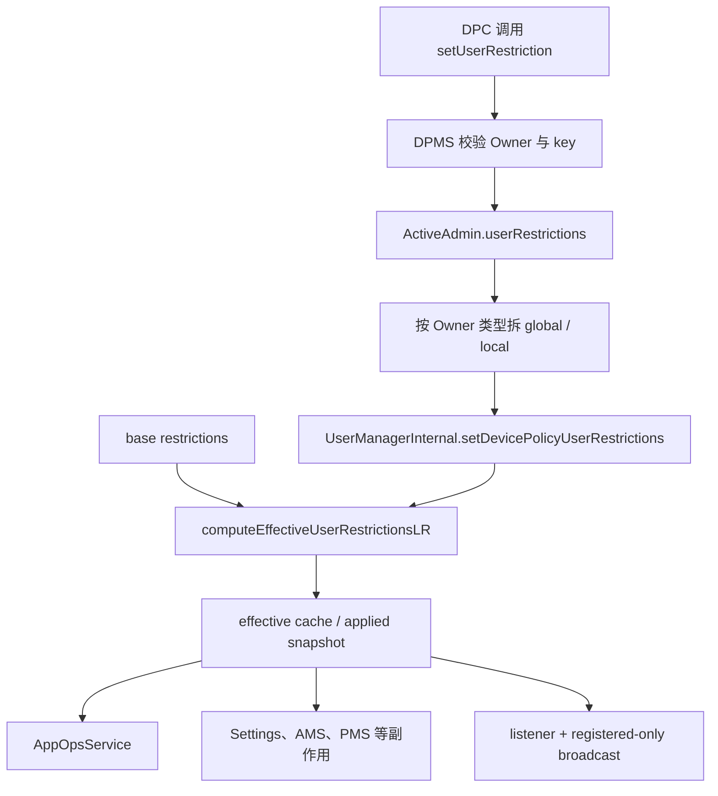
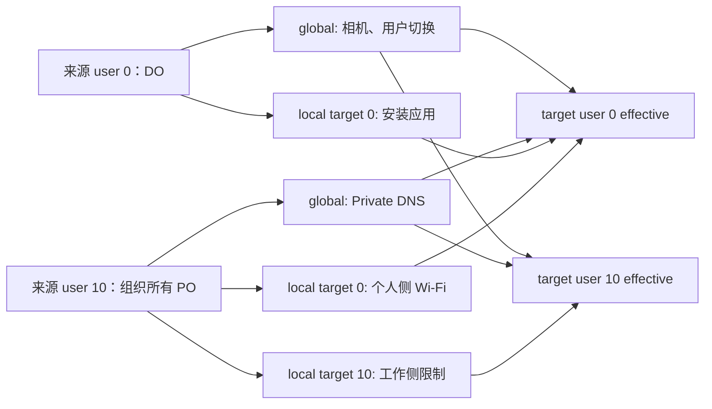
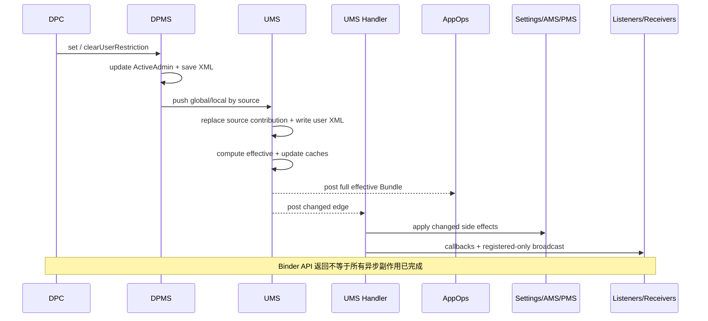

# 306 Android User Restrictions：基础、全局、本地策略合并、持久化与服务收敛链

## 1. 本章目标

本章不只背 `DISALLOW_*` 常量，而是回答五个更关键的问题：限制由谁提出、记在哪本账、对哪些用户有效、重启后怎样恢复，以及“查询返回 true”之后哪些系统组件才真正执行了限制。

## 2. 版本边界

结论以 AOSP `android-11.0.0_r48` 为准。后续 Android 对组织所有工作资料、限制集合和服务分工都有调整；尤其不能拿新版本文档中的权限矩阵反推 r48 源码。

## 3. 本章源码地图

主要阅读四处：`DevicePolicyManagerService.java` 负责 Owner API 与 `ActiveAdmin`；`UserRestrictionsUtils.java` 负责合法集合、全局/本地分类和副作用；`UserManagerService.java` 负责多来源合并、缓存、持久化和传播；`RestrictionsSet.java` 保存“用户ID→Bundle”。

## 4. 先建立正确心智模型

User restriction 不是一张 `Map<String, Boolean>`。r48 至少有基础限制、设备策略全局限制、设备策略本地限制、有效值缓存、已应用快照五类状态；同一个 key 还可能同时由多个来源贡献。

## 5. 限制不是运行时权限

它不会像 runtime permission 那样把某个 permission grant 从应用 UID 上删除。它表达“这个用户不允许进行某类操作”，具体入口可能由 Settings、PackageManager、AppOps 或其他系统服务检查。

## 6. 限制也不等于立即改设置

有些 key 只在业务入口查询 `hasUserRestriction()`；有些变化会主动关闭 ADB、位置或飞行模式；还有些会通知 AppOps。必须分别观察“策略真值”和“副作用是否完成”。

## 7. 三类权威贡献

`mBaseUserRestrictions` 是系统/用户类型的基础限制；`mDevicePolicyGlobalUserRestrictions` 按来源用户保存全局贡献；`mDevicePolicyLocalUserRestrictions` 先按目标用户、再按来源用户保存局部贡献。

## 8. 两类派生状态

`mCachedEffectiveUserRestrictions` 缓存 OR 合并结果，避免每次查询重算；`mAppliedUserRestrictions` 保存上次已进入传播流程的快照，用来计算变化边沿。它们都不是新的政策来源。

## 9. 一句话公式

对目标用户 `u`：`effective(u) = base(u) OR mergeAll(globalSources) OR mergeAll(localSources[u])`。这里 OR 表示只合并值为 true 的 key，不存在“某来源写 false 抵消另一来源 true”。

## 10. 总体数据流



## 11. 公共 API 入口

DPC 通过 `DevicePolicyManager.setUserRestriction(admin,key)` 或 `clearUserRestriction()`，最终进入 DPMS 的 `setUserRestriction(ComponentName,String,boolean,boolean parent)`。最后一个参数区分当前资料实例与组织所有资料的 parent 实例。

## 12. null Component 直接失败

DPMS 使用 `Objects.requireNonNull(who)`。这类 API 没有 delegated scope 入口，普通 delegate 不能像第305章那样传 `admin=null` 代替 Owner。

## 13. 未知 key 的处理

`UserRestrictionsUtils.isValidRestriction(key)` 先对照固定 `USER_RESTRICTIONS` 集合。未知 key 会记录调用 UID/包名，系统应用来源甚至可能 `wtf`，随后 API 直接返回，不会写入策略。

## 14. 为什么先有合法集合

字符串 API 很容易拼错。集中白名单既防止无意义数据进入 XML，也让写盘、读取、设置拦截和副作用代码能围绕同一组 key 演进。

## 15. ActiveAdmin 身份门

`getActiveAdminForCallerLocked(who, USES_POLICY_PROFILE_OWNER, parent)` 同时核对 Component、Binder 调用 UID、admin 激活状态和 Owner 角色。知道一个 DPC 包名或 Component 名称不构成授权。

## 16. Device Owner 可改范围

DO 先经过 `canDeviceOwnerChange(key)`；只要 key 不在 `IMMUTABLE_BY_OWNERS` 就可提出。r48 中录音、壁纸和 OEM unlock 三项不能由 Owner 通过本 API 任意改变。

## 17. DO 不可使用 parent 实例

当 caller 本身是 DO，`parent=true` 会抛 `IllegalArgumentException`。DO 已处于设备管理语义，不存在借工作资料 parent facade 再管理一次父用户的必要。

## 18. 普通 Profile Owner 的范围

普通 PO 只能在 `parent=false` 时设置 `canProfileOwnerChange(key,userId)` 允许的限制。设备所有者专属项，以及非 system user 上的 primary-user-only 项会被拒绝。

## 19. 组织所有资料的 parent 范围

只有 organization-owned managed profile 的 PO，才能在 `parent=true` 时设置专门的全局集合或父用户本地集合。普通 BYOD 工作资料不能越过资料边界控制个人侧。

## 20. PRIMARY_USER_ONLY 的真正含义

这组限制不是简单“只对 user 0 生效”。分类函数规定：DO 设置时它们进入全局贡献；PO 只有运行在 system user 才可能改变。名称描述授权历史，最终作用域仍由 `isGlobal()` 决定。

## 21. DEVICE_OWNER_ONLY 集合

r48 包含 `DISALLOW_USER_SWITCH` 和 `DISALLOW_CONFIG_PRIVATE_DNS`。`canProfileOwnerChange()` 会拒绝普通 PO，而 `isGlobal()` 又无条件把这些 key 分类为全局。

## 22. IMMUTABLE_BY_OWNERS 集合

`DISALLOW_RECORD_AUDIO`、`DISALLOW_WALLPAPER`、`DISALLOW_OEM_UNLOCK` 不能经 DO/PO 改变。它们仍在总合法集合中，因为系统基础限制或其他内部路径可能使用它们。

## 23. 合法不等于 Owner 可设置

`isValidRestriction()` 只回答“平台认识这个 key”；`canDeviceOwnerChange()`、`canProfileOwnerChange()` 和组织所有 parent 规则才回答“当前 Owner 能否设置”。读源码时不要合并这两个问题。

## 24. ActiveAdmin 中的原始保存

校验通过后，DPMS 调用 `activeAdmin.ensureUserRestrictions()`。启用时写 `key=true`，清除时直接 `remove(key)`；不会持久保存 `false` 来表示反向覆盖。

## 25. 为什么清除要 remove

策略合并只有正向限制。删除表示“这个 admin 不再贡献”，而不是“这个 admin 保证允许”。只要系统基础或另一个 Owner 来源仍贡献 true，最终有效值仍为 true。

## 26. 一个重要的多来源例子

假设 DO 和系统基础限制都禁止安装应用。DPC 清除自己的 `DISALLOW_INSTALL_APPS` 后，ActiveAdmin 中该 key 消失，但 UMS 的 base 仍为 true，因此应用安装依然被禁止。

## 27. DPMS 的保存顺序

`saveUserRestrictionsLocked(userId)` 依次调用 `saveSettingsLocked()`、`pushUserRestrictions()`、`sendChangedNotification()`。这意味着先保存 DPMS 自己的 admin 原始账，再把派生贡献推给 UMS。

## 28. 第一份持久化在哪里

`ActiveAdmin.userRestrictions` 由 `DevicePolicyManagerService` 写入对应用户的 `device_policies.xml`。它保留“某个 admin 原始配置了什么”，是 DPC 策略的来源账。

## 29. 非持久 key 的例外

`UserRestrictionsUtils.writeRestrictions()` 会跳过 `NON_PERSIST_USER_RESTRICTIONS`，r48 这里只有 `DISALLOW_RECORD_AUDIO`。它本来又不可由 Owner 改，因此主要服务于内部瞬态语义。

## 30. 写盘只写 true

序列化遍历 Bundle，只对合法且值为 true 的 key 写 XML attribute。未知 key 只警告，false 不写；读取则只扫描平台认识的固定集合。

## 31. push 的“来源用户”

`pushUserRestrictions(originatingUserId)` 的参数不是所有目标用户，而是贡献策略的 Owner 所在用户。UMS 后续以它作为来源键，才能在 Owner 消失时只移除对应贡献。

## 32. Device Owner 的拆分

若来源用户是 DO 用户，DPMS 取 DO `ActiveAdmin`，分别调用 `getGlobalUserRestrictions(OWNER_TYPE_DEVICE_OWNER)` 与 `getLocalUserRestrictions(...)`；local 的目标键就是 DO 所在用户。

## 33. Profile Owner 的拆分

普通 PO 同样按 `OWNER_TYPE_PROFILE_OWNER` 过滤，但全局集合通常只包含“无论谁设置都全局”的特殊项，其余 local 只落在资料用户自身。

## 34. 组织所有 parent 的合并

组织所有资料 PO 还拥有 parent `ActiveAdmin`。DPMS 将 parent 的 global 贡献合并进该 PO 来源的 global Bundle，并把 parent local 以 profile parent userId 为目标加入 local `RestrictionsSet`。

## 35. 一个来源可有两个 local 目标

因此组织所有资料场景中，来源可能是工作资料 user 10，但 local 同时包含 `{10: 工作侧限制, 0: 个人侧限制}`。来源用户和目标用户绝不能混为一谈。

## 36. 合成限制

`ActiveAdmin.getEffectiveRestrictions()` 还会把旧字段 `disableCamera` 合成为 `DISALLOW_CAMERA`，把 `requireAutoTime` 合成为 `DISALLOW_CONFIG_DATE_TIME`，再删除废弃 key。

## 37. 合成的兼容价值

旧版策略字段与新版 user restriction API 可能表达同一效果。统一转成 restriction 后，UMS 的合并、来源查询和传播逻辑无需维护两套执行路径。

## 38. global/local 分类入口

`getGlobalUserRestrictions()` 和 `getLocalUserRestrictions()` 都从同一份有效 admin Bundle 过滤，谓词分别是 `UserRestrictionsUtils.isGlobal(ownerType,key)` 与 `isLocal()`。

## 39. 分类取决于 Owner 类型

同一个 key 可因设置者角色不同而改变作用域。例如 `DISALLOW_CAMERA` 位于 `GLOBAL_RESTRICTIONS`：DO 设置时全局，普通 PO 设置时不是全局，因而只作用于其资料。

## 40. PROFILE_GLOBAL_RESTRICTIONS

`ENSURE_VERIFY_APPS`、`DISALLOW_AIRPLANE_MODE`、`DISALLOW_INSTALL_UNKNOWN_SOURCES_GLOBALLY` 不论哪类允许的 Owner 设置，都由 `isGlobal()` 归为全局。这是源码明确的例外集合。

## 41. 组织所有全局集合

parent 实例允许将飞行模式、日期时间和 Private DNS 配置限制作用到全设备。授权检查与 `isGlobal(OWNER_TYPE_PROFILE_OWNER_OF_ORGANIZATION_OWNED_DEVICE)` 的集合必须成对阅读。

## 42. 组织所有父用户本地集合

Wi-Fi、位置、调试、通话、相机等一批项可由 parent 实例只约束个人用户。它们被放进以 profile parent 为目标的 local，而不是错误扩大到所有用户。

## 43. merge 只传播 true

`UserRestrictionsUtils.merge(dest,in)` 遍历输入，只将 true 写入目标。不存在负值优先级，也不存在“后写覆盖前写”；限制模型是多个禁止条件的并集。

## 44. 进入 UserManagerInternal

DPMS 最后调用 `mUserManagerInternal.setDevicePolicyUserRestrictions(originatingUserId,global,local,isDeviceOwner)`。这是 system_server 内 LocalServices 调用，不是跨进程 Binder。

## 45. 为什么仍要分 DPMS 与 UMS

DPMS 擅长理解 admin、Owner 类型和企业 API；UMS 拥有用户生命周期、基础限制和跨用户持久化。通过明确的数据合同分工，避免每个服务自己重算企业策略。

## 46. UMS 的 global 数据结构

`mDevicePolicyGlobalUserRestrictions` 是 `RestrictionsSet`：键为 originatingUserId，值为该来源的全局 Bundle。多个来源并存时 `mergeAll()` 取并集。

## 47. UMS 的 local 数据结构

`mDevicePolicyLocalUserRestrictions` 是 `SparseArray<RestrictionsSet>`：外层键为 targetUserId，内层键为 originatingUserId。这个二维结构保留“谁对谁施加了什么”。

## 48. 为什么不能只保存 effective

若只保存合并后的 true，Owner A 清除时无法判断该 key 是否仍由 Owner B 或 base 提供。保留来源维度，才可精确撤销而不误开放设备。

## 49. UMS 更新总览

`setDevicePolicyUserRestrictionsInner()` 在 `mRestrictionsLock` 下分别更新 global 和 local，计算哪些目标用户发生变化；锁外/另一把包锁负责写 XML，之后再应用有效限制。

## 50. 来源与目标的二维关系



## 51. global 更新语义

`updateRestrictions(originatingUserId,global)` 是替换该来源的完整 global Bundle，不是增量添加。空 Bundle 会移除旧来源项，因此 DPMS 必须每次推完整派生状态。

## 52. local 目标差集

`getUpdatedTargetUserIdsFromLocalRestrictions()` 不只收集新 local 的目标，还扫描旧二维表：若旧目标含该来源、而新集合不再含目标，也加入更新列表，以便清掉陈旧贡献。

## 53. 为什么差集扫描很关键

组织所有 PO 曾控制父 user 0，后来 parent 策略被清空时，新 local 可能只剩工作 user 10。若不扫描旧目标，user 0 上旧限制会永远残留。

## 54. local 空值的含义

对每个待更新目标，若新 `RestrictionsSet` 找不到 Bundle，UMS 用空 Bundle 替换该来源。`RestrictionsSet.updateRestrictions()` 随后会把空项删除。

## 55. DO 来源标记

若 `isDeviceOwner=true`，UMS 记录 `mDeviceOwnerUserId=originatingUserId`。它主要用于 `getUserRestrictionSources()` 把 enforcing user 解释为 DO 还是 PO，并不参与有效值 OR 计算。

## 56. DO 转为 PO 的边界

若同一来源之后以非 DO 身份推送，且恰好等于旧 `mDeviceOwnerUserId`，UMS 清为 `USER_NULL`。源码注释把它视为 DO 消失后同用户又存在 PO 的迁移情况。

## 57. 锁的边界

内存限制表在 `mRestrictionsLock` 下更新；XML 写入使用 `mPackagesLock`，应用副作用不应在持有限制锁时直接做跨服务阻塞调用。理解锁边界比只看方法名更重要。

## 58. 第二份持久化

UMS 在每个用户 XML 中写 base、以该用户为目标的完整 local `RestrictionsSet`，以及以该用户为来源的 global Bundle。这是运行期合并账的重启恢复副本。

## 59. 为什么 DPMS 与 UMS 都写

DPMS XML 保留 admin 原始意图；UMS XML 保留已分类、带来源/目标的执行输入。双写不是简单重复：两者的数据模型和恢复职责不同。

## 60. 写哪些用户 XML

global 变化至少写 originating user。local 变化的多目标分支确实遍历 `updatedLocalTargetUserIds`，但调用的是 `writeAllTargetUsersLP(targetUserId)`；要理解它，必须继续展开被调用方法，不能仅凭参数名断言“直接写这个 target”。

## 61. r48 的 writeAllTargetUsersLP 疑点

该方法的形参实际名为 `originatingUserId`，会扫描所有 target，只有其内层 `RestrictionsSet` 仍包含这个来源才写目标 XML。普通 DO/PO 的来源与目标相同，组织所有 PO 通常也会因传到来源 userId 而写多个目标；但清除一个非来源目标的最后贡献后，内层项已删除，当前调用可能匹配不到该目标。这里记录为 r48 潜在持久化边角疑点；内存 effective 更新仍按前述目标列表正确执行。

## 62. XML 标签

用户 XML 中基础限制写 `restrictions`，local 集合写 `device_policy_local_restrictions`，global 写 `device_policy_global_restrictions`。具体 XML 是实现细节，应用不应直接依赖。

## 63. 开机读取

`readUserLP()` 读取后，在 `mRestrictionsLock` 下重建三本来源账。旧格式 local 还会被包装成 `new RestrictionsSet(id,legacyBundle)`，体现版本迁移兼容。

## 64. 双份恢复的一致性问题

若系统在 DPMS 写完、UMS 尚未写完时异常掉电，两份 XML 可能短暂不一致。正常启动及 Owner 初始化会再次 push；因此不能把跨文件更新误称为单一原子事务。

## 65. effective 的计算代码

核心逻辑可压缩为：

```java
Bundle effective = clone(base(userId));
merge(effective, globalSources.mergeAll());
merge(effective, localSourcesForTarget(userId).mergeAll());
```

## 66. 常见快路径

若 global 为空且目标 local 为空，`computeEffectiveUserRestrictionsLR()` 直接返回 base Bundle。源码注释称其为 common case，减少无策略设备上的复制。

## 67. 快路径的共享引用提醒

注释明确 Bundle 可能在 base 与 effective cache 间共享，所以更新时不能原地修改表内 Bundle。UMS 总是 clone 后再通过 `updateRestrictions()` 替换。

## 68. effective cache

查询 `getEffectiveUserRestrictions(userId)` 先看缓存；未命中才重算并存入。调用方拿公开 `getUserRestrictions()` 时又 clone 一份，避免外部修改内部权威对象。

## 69. global 变化为何清全缓存

全局贡献影响所有用户，`applyUserRestrictionsForAllUsersLR()` 先 `removeAllRestrictions()` 清除整个 effective cache，不能只失效来源用户。

## 70. local 变化只重算目标

若 global 未变、local 变了，只对 `updatedLocalTargetUserIds` 调用 `applyUserRestrictionsLR()`。这既保持正确性，也避免无关用户承受副作用和广播。

## 71. global 变化只立即应用运行中用户

UMS 异步向 AMS 查询 `getRunningUserIds()`，随后对运行用户重算应用。未运行用户不需要立即触发设置副作用；其启动流程会再次应用。

## 72. 竞态如何兜底

源码注释说明：若获取 runningUsers 后又启动了新用户也没关系，用户启动路径会重算并应用。这里靠生命周期重复收敛，不靠一次快照绝对完整。

## 73. applied snapshot 的意义

`mAppliedUserRestrictions[userId]` 是上次已安排传播的 effective 副本。新 effective 与它比较，只有真正变化时才运行昂贵副作用、listener 和广播。

## 74. “已应用”的谨慎解释

名字叫 applied，但实际副作用被 post 到 Handler。快照更新表示传播任务已经安排，不保证 Settings 写入、用户停止或接收者回调在当前 Binder 返回前完成。

## 75. AppOps 通知

若 `mAppOpsService` 已在 system-ready 初始化，UMS 把完整 effective Bundle 通过 Handler 传给 `setUserRestrictions(effective,token,userId)`。这是一份用户级约束输入。

## 76. system-ready 前的处理

`mAppOpsService == null` 时暂时跳过，源码注释写明“until system-ready”。系统就绪/用户启动路径会重新应用，不能凭早期一次调用推断 AppOps 永远缺状态。

## 77. propagate 的去重

`UserRestrictionsUtils.areEqual(new,prev)` 把 null 与空视为相同，并逐 key 比较布尔值。没有有效差异便直接返回，不发 listener 或广播。

## 78. 为什么先复制再异步

UMS 创建 new/prev Bundle 副本再 post Handler，防止锁释放后内部表继续变化，导致异步任务看到与本次边沿不一致的可变对象。

## 79. 主动副作用入口

Handler 首先调用 `UserRestrictionsUtils.applyUserRestrictions(context,userId,new,prev)`，遍历完整合法集合，只对布尔值发生变化的 key 执行 `applyUserRestriction()`。

## 80. 并非每个 key 都有 switch 分支

大量限制依靠业务入口实时查询，因此 `applyUserRestriction()` 没有对应 case 也正常。switch 只负责那些状态变化时需要主动修正系统设置或运行态的项目。

## 81. 设置限制时关闭数据漫游

`DISALLOW_DATA_ROAMING=true` 会把活动多 SIM 的各 subscription 数据漫游和单 SIM 兼容键写为 0。清除限制不会自动恢复原值，因为平台不知道原来是否开启。

## 82. 设置限制时关闭位置

`DISALLOW_SHARE_LOCATION=true` 将该用户 `LOCATION_MODE` 设为 OFF；清除同样不自动打开。限制撤销只是重新允许用户选择，不代表替用户恢复一个猜测值。

## 83. 调试限制与 user 0

`DISALLOW_DEBUGGING_FEATURES=true` 仅在目标是 system user 时主动将 ADB 和 Wi-Fi ADB 设为 0，因为这些设置是设备全局性质。

## 84. 未知来源安装组合

全局与局部未知来源限制变化时，会通过 `getNewUserRestrictionSetting()` 联合计算并更新旧兼容设置。清除一项不能忽略另一项仍为 true。

## 85. 禁止后台运行

`DISALLOW_RUN_IN_BACKGROUND=true` 时，若目标既非当前用户也非 system user，调用 AMS `stopUser()`。这里的副作用可能显著晚于策略表更新。

## 86. Safe Boot 的对称例外

`DISALLOW_SAFE_BOOT` 无论变为 true 还是 false 都写 `SAFE_BOOT_DISALLOWED`。源码特别解释它可以安全对称恢复，不同于位置等无法知道旧值的设置。

## 87. 飞行模式限制

若新增 `DISALLOW_AIRPLANE_MODE` 时设备正处飞行模式，平台主动写关闭并向所有用户发送 `ACTION_AIRPLANE_MODE_CHANGED`。清除限制不会主动打开飞行模式。

## 88. Ambient display 与位置配置

禁止 ambient display 会关闭多项 doze 设置；禁止配置位置时会撤销 global location kill switch。它们体现“限制设置变化”可修改多个下游状态。

## 89. 应用控制限制的清理动作

`DISALLOW_APPS_CONTROL` 或 `DISALLOW_UNINSTALL_APPS` 变化会让 PMS 移除所有非系统包 suspension 与 distracting restrictions 并 flush。源码这里不只在 newValue=true 时执行，需按真实 switch 阅读。

## 90. 从真值到行为的收敛链



## 91. Listener 顺序

同一个 Handler 任务中，主动副作用先执行，然后复制 listener 数组并逐个回调，最后发送广播。因此观察者收到通知时，本任务内的同步设置修改已尝试，但其他服务自身仍可能异步。

## 92. 广播语义

UMS 向目标用户发送 `ACTION_USER_RESTRICTIONS_CHANGED`，带 `FLAG_RECEIVER_REGISTERED_ONLY`。它不为静态 receiver 唤醒应用，也不携带哪一个 key 变化。

## 93. 接收者应该怎么做

广播只是“重新查询”的提示。接收者应调用 UserManager 获取当前 effective Bundle，不能把广播次数当修改次数，也不能假定自己见过每个中间状态。

## 94. SettingsProvider 的 listener

Binder API `addUserRestrictionsListener()` 仅允许 system UID；注释指出主要客户端是 SettingsProvider，安装一个进程级永久 listener。设置写入口还会调用 `isSettingRestrictedForUser()` 做实时防护。

## 95. 为什么主动关闭还要实时拦截

只在策略开启时把 ADB 写为 0 不够，之后 adb 或其他代码仍可能尝试写回 1。SettingsProvider 写入路径依据当前 restriction 拒绝重新启用，二者共同构成收敛与持续防护。

## 96. 查询 effective

`hasUserRestriction(key,userId)` 最终查询有效合并结果；`getUserRestrictions(userId)` 返回所有有效 key 的副本。它们回答“当前被限制吗”，不回答来源。

## 97. 查询基础限制

`hasBaseUserRestriction()` 只看 `mBaseUserRestrictions`，并需要更强的管理用户权限。它可区分系统固有限制与企业 Owner 贡献。

## 98. 查询来源

`getUserRestrictionSources(key,userId)` 先确认 effective 为 true，再分别检查 base、该目标的 local 来源和所有 global 来源，返回多个 `EnforcingUser`。

## 99. 来源可能不止一个

`getUserRestrictionSource()` 只是把所有来源类型按位 OR，可能同时含 SYSTEM、DEVICE_OWNER、PROFILE_OWNER。调用方不能假定只会得到一个枚举值。

## 100. global 来源的 enforcing user

全局限制可由另一个用户中的 Owner 发起，因此查询目标 user 0 时，返回的 enforcing user 可能是工作资料 user 10。来源身份与受限目标再次分离。

## 101. 基础限制从哪里来

UMS 可通过用户类型默认限制、guest 默认限制、创建用户流程或内部 `setUserRestriction()` 更新 base。企业 DPC 不应尝试把 base 当成自己的可撤销策略。

## 102. 用户创建时的默认值

不同 user type 可带默认 restrictions；创建后它们进入该用户 base。故新用户即使还没有任何 Owner，也可能在首次启动前已有有效限制。

## 103. 用户删除清理

UMS 删除用户时移除其 base、effective cache、作为目标的 local；还扫描其他目标的内层来源，删除这个 user 作为 originating source 的贡献，并移除其 global 来源。

## 104. 删除来源后的全局重算

如果移除用户导致 global 贡献变化，必须 `applyUserRestrictionsForAllUsersLR()`，因为所有存活用户的 effective 都可能变小。只清被删 user 的缓存会留下错误限制。

## 105. Owner 清除不能只删 ActiveAdmin

清除 Owner 后还必须向 UMS 推空 global/local 或走相应清理路径，否则 UMS 的第二份执行账仍可能保留旧来源。多账系统的撤销必须沿与建立相反的方向闭环。

## 106. 失败定位第一问：原始策略是否存在

先看 DPMS dump/`device_policies.xml` 对应 ActiveAdmin 是否有 key。没有则检查调用身份、Owner 类型、parent 参数和可设置集合，不要先怀疑 Settings 页面。

## 107. 失败定位第二问：分类是否正确

确认该 key 在当前 ownerType 下应是 global 还是 local，并记录 originating/target userId。多数“个人侧不生效”问题本质是把普通 PO local 误想成全局。

## 108. 失败定位第三问：effective 是否正确

查看 UMS dump 中 base、device policy global、device policy local、cached effective 和 applied。若 effective 已 true，问题已越过策略合并层。

## 109. 失败定位第四问：消费方是否检查

查目标操作入口是否实时调用 UserManager/AppOps/SettingsProvider 检查，或依赖 `applyUserRestriction()` 副作用。不是每个 `DISALLOW_*` 都由同一个中央 if 执行。

## 110. 失败定位第五问：时间边界

DPMS Binder 返回、UMS 内存更新、用户 XML 落盘、Handler 副作用、下游服务刷新、广播接收是不同完成点。日志必须带 userId、来源、目标和时间，才能还原顺序。

## 111. 本章复读前的核对表

看到一个限制时依次问：key 合法吗、当前 Owner 能改吗、写入哪个 ActiveAdmin、按哪个 ownerType 分类、来源与目标是谁、三类贡献怎样 OR、谁消费变化、撤销是否还被其他来源保持。

## 112. macOS只读练习一：画出集合分类

执行 `sed -n '70,250p' frameworks/base/services/core/java/com/android/server/pm/UserRestrictionsUtils.java`，任选相机、飞行模式、安装应用、Private DNS 四项，手写它们在 DO、普通 PO、组织所有 parent 三种身份下的“可设置/全局/本地”表，不编译代码。

## 113. macOS只读练习二：追一次 set

执行 `sed -n '11040,11175p' frameworks/base/services/devicepolicy/java/com/android/server/devicepolicy/DevicePolicyManagerService.java`，从 `setUserRestriction()` 标出身份校验、ActiveAdmin 更新、DPMS 写盘、global/local 拆分和进入 UMS 的五个位置。

## 114. macOS只读练习三：手算 effective

阅读 `UserManagerService.java` 的 `setDevicePolicyUserRestrictionsInner()` 与 `computeEffectiveUserRestrictionsLR()`。自拟 base、两个 global 来源和两个 local 来源，各含重叠 key，按 OR 规则算 user 0 与 user 10 的结果，再模拟清除其中一个来源。

## 115. macOS只读练习四：区分真值与副作用

阅读 `updateUserRestrictionsInternalLR()`、`propagateUserRestrictionsLR()` 和 `UserRestrictionsUtils.applyUserRestriction()`。为“禁止位置”“禁止后台运行”“禁止安装应用”分别写出：effective 何时变化、Handler 做什么、哪个操作入口还需持续检查。

## 116. 易错点复读一：global 不是存一份总 Bundle

源码按 originating user 保存多份 global，查询时才 `mergeAll()`。这使来源可解释、撤销可精确，也意味着调试时必须展开各来源而非只看最终并集。

## 117. 易错点复读二：local 的外层是目标

`mDevicePolicyLocalUserRestrictions[target][origin]`，不是 `[origin][target]`。DPMS 传入的是按目标组织的 `RestrictionsSet`，UMS 再把同一来源写入多个目标的内层账。

## 118. 易错点复读三：清除不是允许

Owner 从自己的 Bundle remove key，只撤销这一来源；base、其他 global 或其他 local 来源任一仍为 true，effective 都不会改变，自然也不会产生“解除限制”的边沿广播。

## 119. 易错点复读四：返回不等于收敛

DPMS 与 UMS 的内存/写盘大多已更新后 API 才返回，但 AppOps 通知、设置副作用、停止用户、listener 和广播依赖 Handler 或下游服务。测试应等待可观测行为，而非只等待 Binder 调用结束。

## 120. 本章结论与下一章

User Restrictions 是“Owner 原始意图→按角色拆成来源化 global/local→与 base 取并集→缓存并异步传播”的多账状态机。掌握这条链后，下一章进入应用隐藏、暂停与阻止卸载，比较这些包级策略为何不能只靠一个 user restriction 完成。
