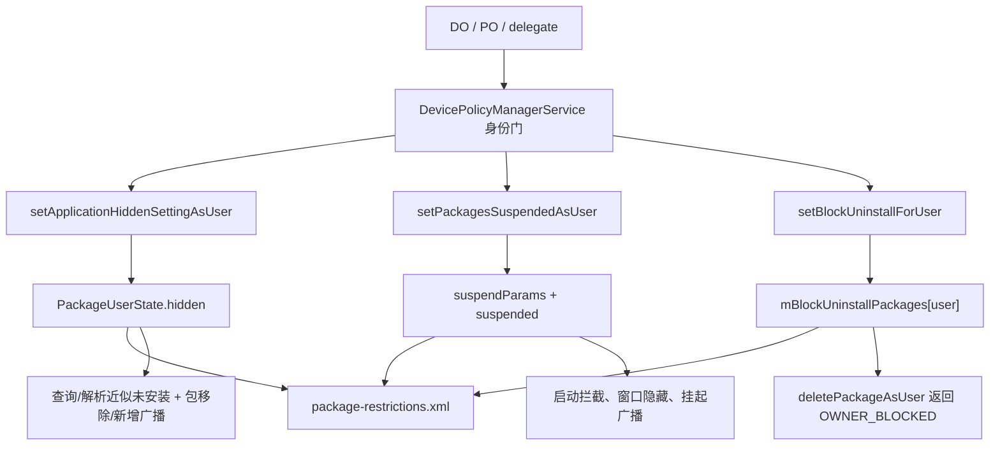
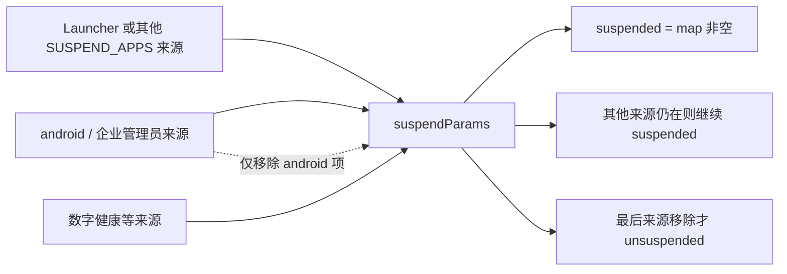
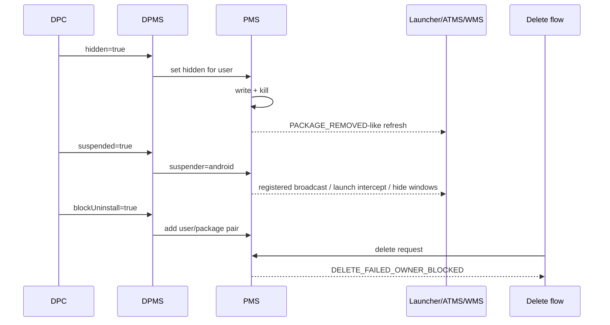

# 307 Android 企业应用隐藏、暂停与阻止卸载：身份、状态、广播、执行和撤销链

## 1. 本章目标

本章比较三类经常被混淆的包级企业策略：hidden 让应用在某用户中近似“不可用/已移除”，suspended 保留应用可见身份但拦截使用，block uninstall 只在删除入口拒绝卸载。三者不能互相替代。

## 2. Android 11 边界

源码以 `android-11.0.0_r48` 为准，重点看 DPMS、PMS、`Settings`、`PackageSettingBase`、`PackageUserState` 和 ATMS 的启动拦截。后续版本的 archived app、distracting restrictions 等语义不直接套用。

## 3. macOS 阅读原则

本章不在 Mac 上安装、隐藏或暂停真实应用，只读源码、手算每用户状态和广播。所有命令都限制在工程内，不执行编译和设备命令。

## 4. 三者共同点

它们最终都由 PackageManager 维护每用户状态，调用时都需要强身份门，并会写 `package-restrictions.xml`。同一包在 user 0 与工作资料 user 10 可有完全不同状态。

## 5. 三者最重要差异

hidden 改 `PackageUserState.hidden`；suspended 改 `suspended` 加“挂起者→参数”映射；block uninstall 存入 `Settings.mBlockUninstallPackages[userId]` 集合。它们不是同一个枚举的三个值。

## 6. 与第306章的区别

`DISALLOW_UNINSTALL_APPS` 是用户级总开关，禁止该用户卸载任何应用；`setUninstallBlocked(package)` 是包级规则。隐藏和暂停也不是 user restriction key，而是具体包的 per-user PMS 状态。

## 7. 三本账可以同时为 true

一个包可以同时 hidden、suspended、block-uninstall。最终表象通常由最早拦截的状态主导，但清除其中一项不会自动清除另外两项。

## 8. DPMS 的角色

DPMS 负责确认 DO/PO 或对应 delegate 有权管理，再清除 Binder 调用身份，以 system_server 权限调用 `IPackageManager`。包状态和持久化权威仍在 PMS。

## 9. PMS 的角色

PMS 重新执行 `MANAGE_USERS`、`SUSPEND_APPS`、`DELETE_PACKAGES`、跨用户和包归属等底层门，检查不可操作包，修改状态，写盘并发包生命周期通知。

## 10. 三条主链

## 11. hidden 的客户端入口

`DevicePolicyManager.setApplicationHidden(admin,package,hidden)` 可在当前实例使用；组织所有工作资料 PO 还可通过 parent 实例处理父用户，但 r48 对 parent 目标施加额外隐私限制。

## 12. hidden 的 target user

DPMS 计算 `userId = parent ? getProfileParentId(callingUser) : callingUser`。这里 Binder caller 仍在资料 user 10，目标却可能是 parent user 0。

## 13. hidden 的一般身份门

`enforceCanManageScope()` 接受 DO/PO，或拥有 `DELEGATION_PACKAGE_ACCESS` 的 delegate。第305章的 scope 表和 calling UID/包名双验证在这里复用。

## 14. parent 不接受普通 delegate

parent 分支额外调用 `getActiveAdminForCallerLocked(...USES_POLICY_ORGANIZATION_OWNED_PROFILE_OWNER,parent)`。因此仅有 package-access scope、却没有组织所有 PO admin 身份的 delegate 过不了 parent 门。

## 15. parent 只允许系统包

DPMS 对父用户目标调用 `enforcePackageIsSystemPackage()`。这是为防止工作侧 DPC用返回值探测个人侧某个非系统包是否安装，形成跨资料隐私泄露。

## 16. hidden 进入 PMS

DPMS 清 Binder identity 后调用 `setApplicationHiddenSettingAsUser(package,hidden,userId)`。PMS 看到的是 system UID，但仍要求 `MANAGE_USERS` 和 full cross-user permission。

## 17. active admin 不可隐藏

PMS 首先在 `hidden=true` 时检查 `isPackageDeviceAdmin(package,userId)`；有 active device admin 就返回 false，避免管理组件把自己隐藏到难以恢复的状态。

## 18. 包不存在返回 false

锁内找不到 `PackageSetting` 时返回 false。此 API 不为未来同名包预埋 hidden 状态，也不会把不存在误报为成功。

## 19. 包可见性仍参与

PMS 调用 `shouldFilterApplicationLocked(pkgSetting,callingUid,userId)`。DPMS 已 clear 成 system 后通常可见，但底层 API 自身仍保留通用过滤防线。

## 20. android 包不可隐藏

平台包名 `android` 被显式拒绝。若隐藏它，系统组件解析与基础资源都会失去合理语义，不能把企业 API 变成系统自毁开关。

## 21. static shared library 不可隐藏

静态共享库被视为使用者应用的静态链接组成，并始终位于内部存储。PMS 若发现 `getStaticSharedLibName()!=null` 就拒绝。

## 22. protected package 门

若目标在 `ProtectedPackages` 中，只有 same-app caller 能隐藏自己；其他 caller 即使持 MANAGE_USERS 也被拒。DPMS clear identity 后不是目标 app，故受这道保护。

## 23. hidden 的幂等返回

只有旧 hidden 与新值不同才写状态、写盘并触发通知。相同值最终返回 false；这里 false 可表示“没有变化”，不必然表示异常。

## 24. hidden 如何持久化

`PackageSetting.setHidden(hidden,userId)` 修改 `PackageUserState.hidden`，随后同步调用 `mSettings.writePackageRestrictionsLPr(userId)`，在该用户包条目写 `hidden="true"`。

## 25. hidden 不删除 APK

代码路径没有删除 codePath、data 目录或全局 `PackageSetting`。只是该 user 的可用性状态变化；其他用户仍可使用同一安装的代码。

## 26. isAvailable 公式

`PackageUserState.isAvailable(flags)` 默认要求 `installed && !hidden`。只有请求 `MATCH_UNINSTALLED_PACKAGES`，或更宽的 `MATCH_ANY_USER` 时，查询才可能继续看到 hidden 包。

## 27. hidden 像“为该用户卸载”

普通 PackageManager 查询和 Intent 解析通常不再匹配，Launcher 图标也随包移除语义消失。这比“图标设为 disabled”更深，但仍不等于物理卸载。

## 28. 隐藏时先 kill

状态改变后，PMS 调用 `killApplication(package,uid,"hiding pkg")`，随后构造 `PackageRemovedInfo` 发 per-user 包移除广播，避免旧进程继续运行并让观察者刷新。

## 29. removed 广播不表示代码删除

`sendApplicationHiddenForUser()` 复用 PackageRemovedInfo 的广播机制，只把 `removedUsers/broadcastUsers` 设为目标 user。消费者看到的是包生命周期表象，磁盘 APK 仍可能存在。

## 30. 取消隐藏的通知

hidden 从 true 变 false 时，PMS 调用 `sendPackageAddedForUser()`。这让 Launcher、快捷方式和其他包缓存按“重新出现”刷新。

## 31. hidden 查询的反直觉返回

`getApplicationHiddenSettingAsUser()` 找不到包或包被可见性过滤时返回 true。源码注释明确“not found or error → true”，这是 fail-closed 查询，不应解读为确认真实 hidden 位存在。

## 32. DPMS 查询与 target

`isApplicationHidden()` 使用与设置相同的 current/parent 目标和系统包隐私门，再调用 PMS。返回 true 可能来自真实 hidden，也可能来自底层不可见/不存在语义。

## 33. hidden 的恢复

清除 hidden 只改 `hidden=false` 并发 added 语义；应用数据、权限和代码因未删除通常仍在。但进程已经被 kill，之后由正常启动重新创建。

## 34. suspended 的客户端入口

`setPackagesSuspended(admin,packageNames,suspended)` 一次处理数组，返回“未能操作的包名数组”，不是简单 boolean。调用方必须检查返回值。

## 35. suspended 的身份门

DPMS 同样允许 DO/PO 或 `DELEGATION_PACKAGE_ACCESS` delegate。它以当前 Binder user 为目标，不提供 parent 变体。

## 36. DPMS 作为 suspending package

DPMS 调 PMS 时把 `callingPackage` 固定为 `PLATFORM_PACKAGE_NAME`，即 `android`，而非 DPC/delegate 包。PMS 的多来源挂起账因此把企业挂起归因给平台。

## 37. 为什么归因给 android

PMS 对普通 suspender、Launcher/数字健康与企业管理共享一套机制。平台来源使 ATMS 能识别“管理员挂起”，展示 admin support UI，而不是普通 suspended-app 对话框。

## 38. DPMS RemoteException 回退

若 IPackageManager 远程调用异常，`result` 保持 null，DPMS 返回原 `packageNames`，即把全部目标报告为未处理，属于保守失败。

## 39. PMS 再验调用资格

`enforceCanSetPackagesSuspendedAsUser()` 接受 root/system、对应 user 的 DO/PO，或持 `SUSPEND_APPS` 且 callingPackage 确属 callingUid 的调用者。包名不是单独凭据。

## 40. DPC 为什么能过 PMS 门

DPMS 已 clear identity，以 system UID、`callingPackage="android"` 进入；PMS 走 system 特权分支。最初 DPC 身份已由 DPMS 负责验证。

## 41. 空数组

PMS 收到 null/空数组直接返回原值，不写盘、不发广播。客户端仍应把返回数组按失败列表处理，而不是期待异常。

## 42. user restriction 与普通 suspender

`isSuspendAllowedForUser()` 对非 Owner caller 检查 `DISALLOW_APPS_CONTROL` 与 `DISALLOW_UNINSTALL_APPS`；任一存在便禁止挂起。DO/PO/system 例外，防止用户限制反过来阻断企业管理员。

## 43. 不能挂起自己

PMS 比较 `callingPackage.equals(target)`，若相同则加入 unactioned。DPMS 以 android 为 suspender，因此目标 android 还会被后面的平台包门拒绝。

## 44. 未知或不可见包

找不到 PackageSetting 或被包可见性过滤时，该元素加入 unactioned，批处理中其他包继续。数组操作是逐项容错，不是全有或全无事务。

## 45. canSuspend 预计算

只有执行 suspended=true 时先调用 `canSuspendPackageForUserInternal()` 生成与输入同长 boolean 数组。解除挂起不受这些“不可新挂起”门限制，否则保护项可能永远无法恢复。

## 46. active admin 不可挂起

任何拥有 active device admin 的目标包都不可挂起，不只当前 Owner。这样不会让仍承担管理职责的 receiver 和 UI 被平台挡住。

## 47. active Launcher 不可挂起

PMS 解析当前 `ACTION_MAIN+CATEGORY_HOME` 默认项并保护它。否则用户可能失去主界面和启动其他应用的入口。

## 48. 安装关键组件不可挂起

required installer、uninstaller、verifier、permission controller 均被拒；默认 dialer 也被保护。这些是设备可恢复性、安全与基本通信的最小集合。

## 49. protected/static/platform 包

ProtectedPackages、静态共享库和 `android` 平台包不可挂起。Owner 可绕过“被管理员阻止卸载的目标不可由普通 caller 挂起”这一项，但不能绕过上述核心保护。

## 50. suspension 多来源模型

## 51. 真实存储不是一个 boolean

`PackageUserState.suspendParams` 是 `suspendingPackage→SuspendParams`；`suspended` 只是 map 是否非空的派生位。每个来源可带 dialog、app extras 和 launcher extras。

## 52. addOrUpdateSuspension

挂起时以 callingPackage 为 key 覆盖该来源参数，并把 suspended 设 true。相同目标可同时保留多个来源，后写一个来源不会删除其他来源。

## 53. removeSuspension

解除时只移除 callingPackage 对应项，然后用 map 是否仍非空重算 suspended。DPMS 的“解除”只撤 `android` 来源，不承诺解除其他系统应用的挂起。

## 54. DPMS 没传 extras

r48 的 DPMS 调用传入三个 null：appExtras、launcherExtras、dialogInfo。因此企业挂起的个性化信息不是由这条 API 保存，ATMS 识别 android 来源后改走 admin support UI。

## 55. 何时算 changed

挂起请求只要可操作就加入 changed；解除请求则只有移除 android 来源后包整体已不再 suspended，才加入 changed 列表。若还有其他来源，不发送“已解除”表象。

## 56. 潜在重复挂起通知

`addOrUpdateSuspension()` 没有先比较相同来源参数是否变化，PMS 对每个成功 suspended 请求都把包加入 changed。重复调用可能再次发 suspended 通知并安排写盘。

## 57. suspension 写盘

有 changed 包时，PMS 调 `scheduleWritePackageRestrictionsLocked(userId)`，不是 hidden 的立即同步写。`package-restrictions.xml` 保存 suspended 属性和每个 `suspend-params` 来源节点。

## 58. 为什么要保存来源

重启后若只恢复 suspended=true，就不知道哪个包有权解除、该展示哪种说明、extras 来自谁。XML 中的 suspending-package 让多来源撤销可继续精确工作。

## 59. 全局变化广播

PMS 发送 `ACTION_PACKAGES_SUSPENDED` 或 `UNSUSPENDED`，extras 含 changed package list 与 UID list，标志为 `REGISTERED_ONLY`，用于 Launcher 等运行中观察者刷新。

## 60. 发给目标包的广播

PMS 还逐包发送 `ACTION_MY_PACKAGE_SUSPENDED/UNSUSPENDED`，允许后台 receiver，并在挂起时合并所有来源 appExtras 放入 `EXTRA_SUSPENDED_PACKAGE_EXTRAS`。

## 61. extras 的冲突语义

合并使用 `Bundle.putAll()` 按 map 迭代顺序覆盖同名 key，不能把多来源 extras 当成带命名空间的可靠账。企业 DPMS 本身传 null，通常不参与冲突。

## 62. 启动 Activity 时的拦截

ATMS `ActivityStartInterceptor` 检查解析出的 `ApplicationInfo.FLAG_SUSPENDED`。若 suspender 是 `android`，转到 `createShowAdminSupportIntent(...POLICY_SUSPEND_PACKAGES)`。

## 63. 普通挂起 UI

非 android 来源读取对应 `SuspendDialogInfo`，创建 `SuspendedAppActivity`，并封装原 Intent 的 immutable IntentSender，供解释页面允许后重试。

## 64. 挂起不等于从解析结果消失

ATMS 必须先解析到目标 Activity 才能检测 FLAG_SUSPENDED 并替换为说明页面。因此 suspended 通常仍保留包/组件身份，与 hidden 的默认不可用过滤不同。

## 65. 跨资料转发的额外门

PMS 创建 cross-profile forwarding ResolveInfo 时，若目标资料所有匹配 Activity 都 suspended，则不生成转发项。避免用户跨资料点击后只进入不可用应用。

## 66. 新窗口也被隐藏

WMS addWindow 时查询 `PackageManagerInternal.isPackageSuspended()`，调用 `win.setHiddenWhileSuspended(true)`。这防止已存在或绕过 Activity 启动的新窗口继续可见。

## 67. 进程是否一定被 kill

setPackagesSuspended 路径本身没有像 hidden 那样直接 `killApplication()`。限制更多由启动拦截、窗口隐藏和相关组件检查实现，不应写成“挂起等于杀进程”。

## 68. Service/Provider 的边界

suspended 是整包受限状态，公开合同还包括隐藏通知/最近任务、禁止 toast/对话框和响铃，但执行点分散在 SystemUI、通知、窗口等服务中。仅凭 ActivityStartInterceptor 不能证明所有已建立 Binder、Provider 引用或后台工作瞬间终止。

## 69. 查询 suspended

DPMS `isPackageSuspended()` 重验 Owner/delegate 后调用 PMS。PMS 找不到或过滤目标时抛 `IllegalArgumentException`，DPMS 不捕获；客户端 `DevicePolicyManager` 再把它转换为 `NameNotFoundException`，所以应用侧看到的是受检异常。

## 70. 谁是展示用 suspender

`PackageManagerInternal.getSuspendingPackage()` 在多来源时需要选一个用于 UI。阅读调用方时不要误以为它返回了全部来源；权威状态仍是 suspendParams map。

## 71. suspender 包卸载后的清理

PMS 提供 `unsuspendForSuspendingPackage()` / `removeSuspensionsBySuspendingPackage()`，在来源包消失时从所有目标移除该来源，最后来源消失才发整体 unsuspended。

## 72. block uninstall 入口

`DevicePolicyManager.setUninstallBlocked(admin,package,blocked)` 只作用当前 user，客户端禁止 parent instance。它允许 DO/PO 或 `DELEGATION_BLOCK_UNINSTALL` delegate。

## 73. delegate scope 与 suspended 不同

阻止卸载使用专门 scope；隐藏/暂停使用 `DELEGATION_PACKAGE_ACCESS`。DPC 应按最小权限拆分，不能用一个 scope 推断拥有另外两类 API。

## 74. PMS 权限门

DPMS clear identity 后调用 `setBlockUninstallForUser()`；PMS 要求 `DELETE_PACKAGES`。底层接口本身没有 DPC 概念，企业角色已在上层消化。

## 75. 不存在包的 r48 行为

源码 TODO 明确“应该对不存在包失败”，但当前实现仍会把任意包名加入 block 集合并返回 true。这等于可以为未来安装的同名包预埋阻止卸载状态。

## 76. static shared library 例外

若当前存在的目标包是 static shared library，PMS 返回 false，不写 block。若包根本不存在，因拿不到静态库信息，反而会走预埋路径。

## 77. block 的存储结构

`Settings.mBlockUninstallPackages` 是 `SparseArray<ArraySet<String>>`。外层 userId，内层包名集合；它不存设置者身份，也不支持多个独立来源计数。

## 78. 后写覆盖语义

任一有权 caller 设置 false 就从集合移除，系统无法判断此前是哪个 Owner/delegate 设置。与 suspension 的多来源 map 相比，这是一张单值策略账。

## 79. block 写盘

PMS 同步调用 `writePackageRestrictionsLPr(userId)`；Settings 在包限制文件末尾写 block-uninstall 包集合，读取时重建该 user 的 ArraySet。

## 80. 设置 block 时的额外清理

当 `uninstallBlocked=true`，DPMS 让 PackageManagerInternal 移除该包所有“非系统来源”的 suspension 和 distracting restrictions，再 flush 包限制。

## 81. 为什么 block 会解除普通挂起

普通应用若既能挂起又无法被卸载，可能被第三方长期控制。管理员决定保护该包时，平台清除非系统 suspender；但保留 `android` 企业来源，因此管理员自己仍可 suspend。

## 82. removeNonSystem 的精确定义

predicate 是 `!PLATFORM_PACKAGE_NAME.equals(suspendingPackage)`。所谓 non-system 这里实际是“来源包名不是 android”，并非检查 ApplicationInfo 是否 system app。

## 83. block=false 不恢复旧状态

取消阻止卸载时不会恢复之前被清除的 suspension 或 distracting restrictions。策略副作用不是可逆事务，调用方必须接受历史状态已改变。

## 84. isUninstallBlocked 的窄语义

DPMS 源码注释要求只报告 `setUninstallBlocked()` 这张账。系统应用不可卸载、active admin、用户总限制等其他原因都不应让它返回 true。

## 85. 查询时 who 可为 null

`isUninstallBlocked(who,package)` 仅在 who 非 null 时验证 ActiveAdmin；who=null 时没有像 setter 那样的 delegate scope/包身份检查。这是 r48 API 查询面的宽松边界。

## 86. 底层查询的包可见性

PMS 找不到 PackageSetting 或 `shouldFilterApplicationLocked()` 为 true 时返回 false。由于 DPMS clear 后以 system 身份查询，正常企业路径主要区分真实集合成员。

## 87. 删除入口先看用户总限制

`deletePackageAsUser()` 先检查 `DISALLOW_UNINSTALL_APPS`，命中返回 `DELETE_FAILED_USER_RESTRICTED`。这与包级 block 的错误码不同。

## 88. 单用户删除再看 package block

非 DELETE_ALL_USERS 且集合包含包名时，返回 `DELETE_FAILED_OWNER_BLOCKED`。代码不会进入真正异步 `deletePackageX()`。

## 89. all-users 删除的处理

DELETE_ALL_USERS 会收集所有 block 的 userId；若有人阻止，则只对未阻止用户逐个卸载，最终仍向 observer 报 OWNER_BLOCKED，包代码可能因部分用户仍安装而保留。

## 90. 三类策略的用户体验时序

## 91. hidden 与 suspended 的可见性比较

hidden 使默认 `isAvailable()` 为 false，很多查询看不到包；suspended 通常仍返回组件，只在启动时换成说明 UI，并给 ApplicationInfo 加 suspended flag。

## 92. suspended 与 block 的运行比较

suspended 直接影响启动和窗口；block 对日常运行没有限制，只在卸载请求到来时裁决。一个不能卸载的应用仍可正常启动。

## 93. hidden 与 block 的数据比较

hidden 不删除代码，所以管理员常会同时 block uninstall 以防用户通过卸载路径改变包状态；但两者独立，隐藏本身不是阻止所有删除 API 的证明。

## 94. 三类通知比较

hidden 复用 PACKAGE_REMOVED/PACKAGE_ADDED 语义；suspended 使用 PACKAGES_SUSPENDED/UNSUSPENDED 和 MY_PACKAGE_*；block 设置时没有面向所有应用的对应变化广播，删除失败由 observer 获知。

## 95. 三类返回值比较

hidden boolean 表示是否实际改变成功；suspend 返回未处理包数组；block setter 是 void，底层 boolean 被 DPMS 忽略。客户端错误处理不能共用一套模板。

## 96. block 底层失败被吞

`mIPackageManager.setBlockUninstallForUser()` 返回 boolean，但 DPMS 调用未接收返回值；例如 static shared library 被拒，公开 setter 仍无同步失败结果，只能随后查询或观察删除行为。

## 97. RemoteException 语义

hidden 调用通过 lambda 返回结果，RemoteException 由接口包装路径处理；suspend 明确把全部视为失败；block 只记录日志。三条 API 的失败可观测性不一致。

## 98. 包状态锁与跨服务调用

PMS 在 `mLock` 内只做状态表检查/修改和部分写盘调度，kill、广播等尽量在锁外。DPMS 自己的 lock 包住身份校验与 PMS 调用，阅读时注意不要反向调用形成锁顺序误判。

## 99. 每用户 UID

广播 UID 和 kill UID 用 `UserHandle.getUid(userId,appId)` 计算。同一 appId 在 user 0 与 10 是两个 Linux UID，策略改变不应误杀另一个用户进程。

## 100. 包更新后的延续

三类状态都以 packageName/per-user 设置持久化，不绑定某个 versionCode。正常更新同包后策略通常延续；静态库和保护规则仍可能在再次操作时改变结论。

## 101. 包真正卸载后的清理

PMS 的包删除与设置清理会移除 per-user PackageUserState/相关集合。不能假定为未来重装永久保留所有状态；block 对“未存在包预埋”是 setter 的特定 r48 行为。

## 102. Owner/delegate 被撤销

撤销调用权限不会自动回滚其已经写进 PMS 的 hidden 或 block 状态。suspension 因来源记为 android，也不会仅凭某个 delegate scope 删除自动定位原调用者。

## 103. 为什么撤权不自动回滚

PMS 账没有保存“是哪一个 DPC/delegate 发起 hidden/block”，suspension 也统一归因 android。要撤销业务策略，Owner 必须在失权前显式恢复或由专门清理流程执行。

## 104. 诊断 hidden

先看对应 user 的 `PackageUserState hidden`，再看普通查询与 MATCH_UNINSTALLED 差异、目标进程 kill、PACKAGE_REMOVED-like 广播和 Launcher 缓存。不要只看 APK 是否还在 `/data/app`。

## 105. 诊断 suspended

展开 suspendParams 的所有 suspendingPackage，确认 android 来源是否存在；再看 ApplicationInfo flag、ATMS 拦截、WMS hiddenWhileSuspended 和广播。单看总 boolean 会漏掉“解除一个来源仍挂起”。

## 106. 诊断 block uninstall

区分用户总限制、包级 block、系统包、active admin 与静态库等拒绝原因，并核对 PackageInstaller observer 错误码。`isUninstallBlocked()` 只回答其中一张窄账。

## 107. 组织所有 parent 的隐私测试

如果 parent hide 非系统包抛异常，这是设计边界而非包不存在证明；DPMS 故意不允许工作侧利用 true/false 探测个人侧安装清单。

## 108. 批量 suspend 的部分成功

输入 `[A,B,C]` 可能只挂起 A，返回 `[B,C]`。PMS 不回滚 A；DPC 若想实现业务原子性，需要先查询可操作集合或在失败时显式补偿 A。

## 109. 持久化完成点不同

hidden 和 block 直接写 package restrictions；suspended 安排延迟写，并随后发广播。内存状态可先于磁盘；异常掉电时三条链的持久性窗口不同。

## 110. 广播不是权威账

广播可被合并、只发给运行 receiver，且 hidden 使用近似包增删语义。恢复时始终重新查询 PMS 状态，不用历史广播重建真值。

## 111. 本章复读检查表

每次看到“应用被管控”，先问 userId、状态类型、谁有权设置、PMS 存储字段、是否多来源、不可操作包、返回值、写盘时机、哪个入口消费，以及清除是否只撤一层。

## 112. macOS只读练习一：对比三个 setter

用 `sed` 阅读 DPMS 的 `setApplicationHidden()`、`setPackagesSuspended()`、`setUninstallBlocked()`，写表比较 target user、允许的 delegate scope、parent 支持、PMS 方法和公开返回值，不运行设备命令。

## 113. macOS只读练习二：手算 suspended 多来源

阅读 `PackageSettingBase.addOrUpdateSuspension()` 与 `removeSuspension()`。令 android、launcher 两个来源同时挂起包 A，依次移除 android、再移除 launcher，写出 map、boolean 与应发 UNSUSPENDED 的时点。

## 114. macOS只读练习三：追 hidden 表象

阅读 `setApplicationHiddenSettingAsUser()`、`sendApplicationHiddenForUser()` 与 `PackageUserState.isAvailable()`，解释为什么普通查询像已卸载、MATCH_UNINSTALLED 仍可见、代码与数据没有被删除。

## 115. macOS只读练习四：模拟删除错误码

阅读 `deletePackageAsUser()`：分别模拟 user restriction=true、package block=true、DELETE_ALL_USERS 中只 user10 block 三种输入，写出删除哪些用户、observer 返回什么，仍不实际卸载。

## 116. 复读修正一：hidden 返回 false 不总是失败

状态本来就等于请求值时没有 sendAdded/sendRemoved，最终返回 false。若上层把 false 统一提示为安全错误，会把幂等调用误判为策略未生效。

## 117. 复读修正二：unsuspend 不总能解除

DPMS 只删除 `android` 这一 suspender。另一个来源仍在时 PMS 不把包加入 changed/unsuspended 列表，查询仍为 true，这是多来源设计而非缓存延迟。

## 118. 复读修正三：block 查询不等于可否卸载

它刻意忽略系统应用、active admin 和用户总限制等原因。要回答“实际能否卸载”，必须走完整删除前置条件，而不是只调 `isUninstallBlocked()`。

## 119. 复读修正四：设置者归属并不一致

suspension 明确保留 suspendingPackage，但 DPMS 统一写 android；hidden 是单 per-user 位；block 是单包名集合。撤销 delegate/Owner 时无法用同一种来源追踪算法自动回滚三者。

## 120. 本章结论与下一章

hidden 控制“该用户能否把包视为已安装可用”，suspended 控制“保留身份但阻止使用”，block uninstall 控制“删除入口是否放行”。下一章进入 Lock Task/Kiosk，观察系统怎样把允许包、任务栈、导航键和状态栏组合成专用设备体验。
