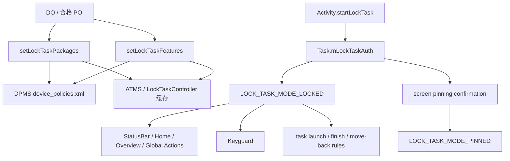
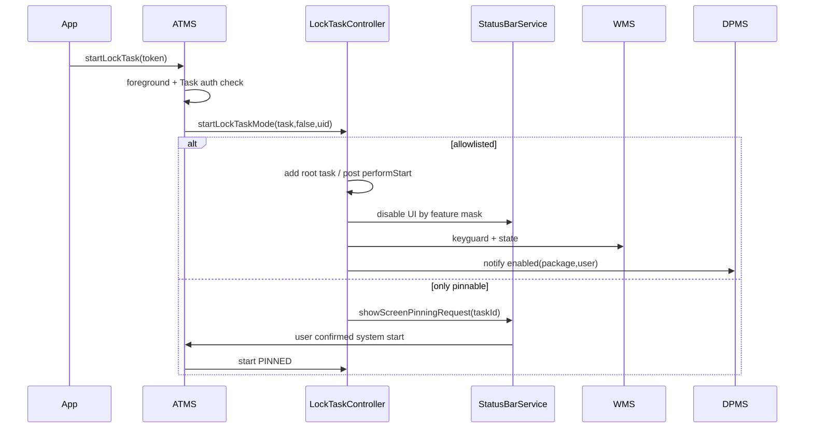
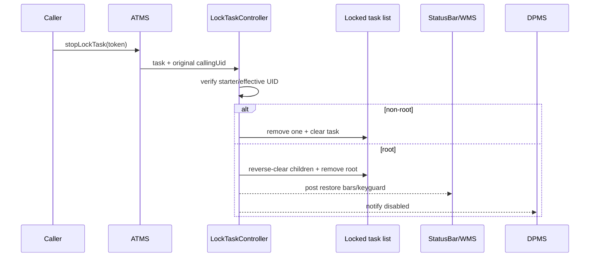

# 308 Android Lock Task / Kiosk：允许名单、任务状态、SystemUI、Keyguard 与违规启动链

## 1. 本章目标

本章回答专用设备为何不会因一个 `startLockTask()` 就自动成为安全 Kiosk：DPC 先配置每用户允许包和功能位，ATMS 再根据任务授权进入 LOCKED 或 PINNED，LockTaskController 最后限制任务、SystemUI 与 Keyguard。

## 2. Android 11 边界

以 `android-11.0.0_r48` 为准，主要阅读 DPMS、ATMS、`LockTaskController`、`Task`、`ActivityRecord`。后续版本的 dedicated device API、角色和多窗口规则可能不同。

## 3. 两个模式必须分开

`LOCK_TASK_MODE_LOCKED` 是企业 Kiosk/Lock Task；`LOCK_TASK_MODE_PINNED` 是用户确认的 screen pinning；`NONE` 表示未启用。二者共享控制器，却有不同进入、退出和 UI 策略。

## 4. “锁任务”锁的是什么

核心对象是 ATMS 的 `Task` 链，不是 Linux 进程，也不是只锁一张 Activity 页面。允许多应用 Kiosk 时可有多个 locked tasks，按首次进入顺序保存。

## 5. 两套权威状态

DPMS `DevicePolicyData` 持久化 `mLockTaskPackages` 与 `mLockTaskFeatures`；LockTaskController 维护运行态 `mLockTaskModeTasks`、per-user 缓存和 `mLockTaskModeState`。

## 6. policy 不等于 session

允许名单非空只证明某包可进入 Kiosk，不证明当前正在 Lock Task。反过来 session 已运行时更改名单或功能位会主动影响当前任务和 UI。

## 7. 应用 Manifest 也参与

Activity 的 `android:lockTaskMode` 可为 default、never、always、if_whitelisted；ATMS 将 Manifest 模式与 DPC allowlist 合成为 Task 的 `mLockTaskAuth`。

## 8. 多层执行者

DPMS 认证企业角色，ATMS 管任务与启动，StatusBarService 落导航/状态栏禁用，WMS 管 Keyguard 和窗口状态，DPC 接收 Lock Task 状态变化。

## 9. 先记住安全边界

Lock Task 主要限制交互逃逸和任务切换，不是应用沙箱、SELinux 策略或网络隔离。Kiosk 应用仍必须按正常权限、AppOps、网络与数据安全规则设计。

## 10. 总体链路

## 11. 配置允许名单的 API

DPC 调用 `setLockTaskPackages(admin,String[])`。客户端禁止 parent instance，DPMS 要求 Component 与数组非 null，并把数组完整替换为新的 per-user List。

## 12. 不是增量 add

每次 set 都替换全部名单。若 DPC 想新增 B 却只传 `[B]`，原先 A 会失去授权；正确做法是维护期望全集。

## 13. 名单不要求包立即存在

DPMS 这里没有逐包安装/签名验证，仅保存字符串。未来安装同名包会按包名匹配，因此 Kiosk 部署还必须控制安装来源和签名。

## 14. 配置者身份

`enforceCanCallLockTaskLocked()` 先验证 caller 是具 `USES_POLICY_PROFILE_OWNER` 的 active admin，再通过 `canUserUseLockTaskLocked(userId)` 检查用户/设备关系。

## 15. 已关联用户可使用

`isUserAffiliatedWithDeviceLocked(userId)` 为 true 时直接允许。企业多用户设备可用 affiliation IDs 把次要用户纳入同一管理域。

## 16. 有 DO 时的未关联 PO

设备已有 DO，而当前用户未关联，则普通 PO 不可配置 Lock Task。这样未受同一企业信任域控制的用户不能改变专用设备体验。

## 17. 无 DO 的 PO 例外

设备没有 DO 时，非 managed-profile 的 PO 可使用 Lock Task；managed profile 明确被拒。Lock Task 面向完整用户界面，不适合只锁工作资料子空间。

## 18. 失去关联后的清理

`maybeClearLockTaskPolicyLocked()` 遍历用户，对不再有资格者把 packages 清空、features 设 NONE，并分别写盘、推送运行态。

## 19. allowlist 的持久化

DPMS 在每用户 `device_policies.xml` 保存 package 列表。开机 `loadSettingsLocked()` 读回后，立即向 ActivityManager/ATMS 推 packages 和 features。

## 20. 推送的进程边界

DPMS 清 Binder identity，调用 `IActivityManager.updateLockTaskPackages()` 和 `IActivityTaskManager.updateLockTaskFeatures()`；均在 system_server 内对象间经 Binder 接口/本地实现协作。

## 21. 查询 packages

`getLockTaskPackages(admin)` 重验同一角色和用户资格，返回 List 转成的新数组。调用方不能修改 DPMS 内部 List。

## 22. isLockTaskPermitted 的窄含义

该接口只看当前调用 user 的 `mLockTaskPackages.contains(pkg)`，回答包名是否在 policy allowlist，不证明其 Activity Manifest 允许自动启动，也不证明 session 正在运行。

## 23. features 总览

r48 有 SYSTEM_INFO、NOTIFICATIONS、HOME、OVERVIEW、GLOBAL_ACTIONS、KEYGUARD、BLOCK_ACTIVITY_START_IN_TASK 七个功能位，NONE 表示全部可配置 UI 功能禁用。

## 24. 默认值的历史兼容

新 `DevicePolicyData` 的 `mLockTaskFeatures` 初始为 `GLOBAL_ACTIONS`；公开文档也说明在第一次 set 前全局操作默认可用。调用 set 后传 NONE 才进入严格全禁用。

## 25. HOME 是两个功能的前置

DPMS 拒绝“OVERVIEW 没有 HOME”和“NOTIFICATIONS 没有 HOME”。允许最近任务或通知抽屉却无 Home 退出/导航基础，会形成不一致 UI。

## 26. 未知 feature 位

本段源码只显式校验上述组合，没有先按已知 mask 拒绝所有未知 bit；但 StatusBar 映射只消费认识的位。DPC 应只用 SDK 常量。

## 27. features 也是完整替换

`setLockTaskFeatures(admin,flags)` 把整数整体写入 policy，保存并推 ATMS。新增一个功能必须 OR 上希望保留的旧功能。

## 28. 运行中更新功能

LockTaskController 若发现 flags 改变，更新 per-user 缓存；若当前 root locked task 属于该 user 且模式为 LOCKED，post 到 Handler 重新计算 StatusBar 与 Keyguard。

## 29. PINNED 不吃 DPC features

运行中 feature 更新只在 LOCKED 模式重新应用。screen pinning 使用固定 `STATUS_BAR_MASK_PINNED` 和自己的退出规则，不是 DPC 的可定制 Kiosk。

## 30. Task 授权的五种内部值

`DONT_LOCK`、`PINNABLE`、`LAUNCHABLE`、`ALLOWLISTED`、`LAUNCHABLE_PRIV` 是 ATMS 内部判定结果，不等同公开三种运行模式。

## 31. Manifest default

default + 包在 allowlist → `ALLOWLISTED`；不在 → `PINNABLE`。应用主动 `startLockTask()` 时前者进入 LOCKED，后者先请求用户 screen pinning。

## 32. Manifest never

`lockTaskMode="never"` 映射 `DONT_LOCK`，即便包名在 allowlist 也不能把该 Task 锁定。Manifest 是应用对页面用途的额外限制。

## 33. Manifest always

`always` 映射 `LAUNCHABLE_PRIV`，但 `ActivityRecord.getLockTaskLaunchMode()` 会把非 privileged app 的 always/never 降回 default，普通应用不能自行获得特权自动锁定。

## 34. if_whitelisted

在名单中映射 `LAUNCHABLE`，不在则 `PINNABLE`。与 default 的关键差异是：LAUNCHABLE task 获授权后可在更新名单时被自动拉入 LOCKED。

## 35. Task 按 root Activity 定授权

`Task.setLockTaskAuth()` 读取 root Activity 的 launchMode，并用 `realActivity` 包名查 allowlist。栈顶 Activity 包名不一定决定整个 Task 的授权。

## 36. ActivityOptions 可覆盖

内部 ActivityOptions 可设置 useLockTask；当 Manifest 为 default 时变为 if-whitelisted。系统启动路径因此也能请求“仅在名单中自动 Lock Task”。

## 37. App 入口

`Activity.startLockTask()` 经 Activity token 进入 `ATMS.startLockTaskModeByToken()`，服务端取 ActivityRecord 和其 Task，而不是相信客户端传 taskId。

## 38. 必须是前台顶层 Task

ATMS 要求目标是当前 focused stack 的 top-most task，否则抛 `IllegalArgumentException`。后台应用不能远程把任意旧任务锁到前台。

## 39. DONT_LOCK 静默返回

task 为 null 或授权为 DONT_LOCK 时不进入控制器。应用不能仅凭 API 无异常就宣称 Kiosk 已启动，应查询 `getLockTaskModeState()` 或观察 DPC 回调。

## 40. App caller 与 system caller

普通 `startLockTask()` 以 `isSystemCaller=false`；SystemUI 的 `startSystemLockTaskMode(taskId)` 需 MANAGE_ACTIVITY_STACKS，并固定启动 PINNED。

## 41. system 不能直接开企业 LOCKED

源码注释与实现都明确 system-initiated 路径只做 screen pinning。企业 LOCKED 依赖任务的 DPC allowlist/Manifest 授权和应用启动路径。

## 42. PINNABLE 的确认流

普通应用请求但 Task 仅 PINNABLE 时，LockTaskController 记录 callingUid，通知 StatusBarManagerInternal 显示 screen pinning 请求，然后立即返回；用户确认后 system path 再进 PINNED。

## 43. 进入前先移除 PiP stack

ATMS 在实际请求前移除 `WINDOWING_MODE_PINNED` stacks。这里 pinned windowing mode 是画中画，与 `LOCK_TASK_MODE_PINNED` 同词不同概念。

## 44. 二次授权检查

`setLockTaskMode()` 再拒 DONT_LOCK，并调用 `isLockTaskModeViolation()`。即使上层已检查，状态可能在调用间变化，控制器仍 fail closed。

## 45. 第一个 Task 是 root

`mLockTaskModeTasks` 为空时加入的任务开始 session，成为 root。典型多应用 Kiosk 中它往往是企业 Launcher/Home。

## 46. root 不能随意 finish

若 root task 只剩 root/top non-finishing Activity，且不是 LAUNCHABLE_PRIV，`activityBlockedFromFinish()` 拒绝 finish，防止应用自行把 Kiosk 根任务结束。

## 47. root 不能 moveToBack

`canMoveTaskToBack(root)` 返回 false。非 root locked task 可以后退/清理，但不能借此让未授权普通任务露出。

## 48. 多任务链

允许的第二个 Task 可加入 list。停止 root 会逆序清除其他 locked tasks，再退出模式；停止非 root 只清该 task，session 继续。

## 49. UID 归属

普通 app 启动时 Task 记录 `mLockTaskUid=callingUid`；Manifest/系统自动路径可能为 0 或 -1，后续以 effectiveUid 补齐，用于 stop 时验证同一调用者。

## 50. 进入模式的时序

## 51. 任务加入与 UI 生效不是同一步

控制器先把 Task 加入 list，首次 session 的 `performStartLockTask()` 却 post 到 Handler。任务约束和 SystemUI/Keyguard 状态存在短暂异步窗口。

## 52. 运行模式字段何时更新

`performStartLockTask()` 先通知 WMS，再写 `mLockTaskModeState`，再设置 StatusBar/Keyguard 并通知 DPMS。不能把 task list 非空与 volatile state 已更新视为原子。

## 53. RecentTasks 也接收状态

首次进入时 `mRecentTasks.onLockTaskModeStateChanged()`，让最近任务持久/展示逻辑按模式调整；退出也由对应路径恢复。

## 54. bring-to-front

显式 start 的 `andResume=true` 会把 Task 移到前台、resume top Activity 并执行 app transition。allowlist 更新自动启动时可用 `andResume=false`，不完全相同。

## 55. allowlist 更新重算所有 Task

`updateLockTaskPackages()` 先保存 per-user 数组，再倒序遍历当前 locked tasks，调用 `setLockTaskAuth()` 重算授权，之后还遍历所有系统 Task 重算。

## 56. 运行中被移出名单

仅在当前模式 LOCKED、同 user、任务此前 allowlisted 而现在不再 allowlisted 时，将其从 locked list 移除并 `performClearTaskLocked()`。

## 57. root 失权会结束 session

`updateLockTaskPackages()` 这里直接 `removeLockedTask()`，只有 list 变空才 post `performStopLockTask()`；若原 root 失权而后续 locked task 仍获授权，后者会成为新的 list 首项。与显式 `clearLockedTask(root)` 会逆序清全部不同，必须按调用路径区分。

## 58. 新增 LAUNCHABLE 可自动进入

若 locked list 为空，而当前 top task 重算为 LAUNCHABLE，更新名单会直接 `setLockTaskMode(...LOCKED,andResume=false)`。这只针对 Manifest if-whitelisted 语义。

## 59. default allowlisted 不自动进入

default 在名单中为 ALLOWLISTED，不满足上述自动启动条件；应用仍需调用 `startLockTask()`。这一区分常被“白名单后自动 Kiosk”说法掩盖。

## 60. 违规 Task 的总规则

已有 lock session 时，新 Task 只有已在 locked list、allowlisted/launchable，或命中特殊 Recents/紧急呼叫例外才放行；否则是 violation。

## 61. 已锁 Task 的 clear 例外

已在 list 的 Task 通常可再次操作，但若启动选项会 clear task，仍重新做 violation 判断，防止借 CLEAR_TASK 摧毁受保护根状态。

## 62. Overview 例外

功能位允许 OVERVIEW 时，Recents activity task 可以启动；DPMS 又强制 OVERVIEW 必须伴随 HOME，使用户有合理任务导航路径。

## 63. 紧急呼叫例外

只有 KEYGUARD feature 允许且任务匹配 emergency dialer、`ACTION_CALL_EMERGENCY` 或系统 dialer 组件时放行，避免锁屏紧急呼叫被 Kiosk 阻断。

## 64. 违规提示差异

`showLockTaskToast()` 只在 PINNED 显示逃离提示；LOCKED 中违规时 no-op。企业 Kiosk 不用 screen pinning 的手势提示教用户退出。

## 65. 同一 Task 内 Activity 的额外限制

`LOCK_TASK_FEATURE_BLOCK_ACTIVITY_START_IN_TASK` 开启时，控制器还按目标 Activity 包名与 launchMode 裁决，即便它试图进入已经 locked 的现有 Task。

## 66. BLOCK 功能默认关闭

不启用该 feature 时，同一 locked Task 内的 Activity 启动返回允许。这保留跨包 Activity 组件协作，但 Kiosk 设计需评估其逃逸面。

## 67. Activity always/never 优先

同 Task 内检查中 privileged `ALWAYS` 始终允许，`NEVER` 始终拒绝；其他模式再查目标 package allowlist。

## 68. 拦截后的页面

`ActivityStartInterceptor.interceptLockTaskModeViolationPackageIfNeeded()` 将违规目标替换为 `BlockedAppActivity`，避免直接启动目标，同时给出受限制反馈。

## 69. SystemUI 默认全部禁用

LOCKED 下 `getStatusBarDisableFlags()` 从 `DISABLE_MASK/DISABLE2_MASK` 开始；每个已允许 feature 清掉相应 disable 位，最后再套 LockTask mask。

## 70. SYSTEM_INFO

该位允许状态栏系统信息区域，如时间、网络和电量。它不自动允许展开通知 shade 或 Quick Settings。

## 71. NOTIFICATIONS

允许通知图标、heads-up 与可展开通知栏，但 Quick Settings 仍禁用；且必须同时 HOME。Kiosk 可展示业务通知而不开放系统设置入口。

## 72. HOME

允许 Home 按钮。如果使用自定义 Launcher，还必须把它设为 persistent preferred Home，并将 Launcher 包加入 Lock Task allowlist，否则按 Home 仍可能无可用目标。

## 73. OVERVIEW

允许 Recents 按钮与 Overview 页面；实际能看到/切换的任务仍受 locked task 与 allowlist 规则约束，不等于恢复任意应用切换。

## 74. GLOBAL_ACTIONS

允许长按电源的全局操作菜单。禁用时用户可能无法通过普通 UI 关机，但硬件长按、设备故障和 OEM 行为不由这一 framework 位完全保证。

## 75. KEYGUARD

允许 Lock Task 中显示 Keyguard；若 DPC 已用另一策略禁用 Keyguard，此位不能把它强制重新开启。策略是多层合成而非单开关。

## 76. status bar 使用 token

LockTaskController 用固定 `mToken` 调 `disable/disable2`。退出时以同 token 传 DISABLE_NONE 释放自己的贡献，不覆盖其他 token 设置的禁用状态。

## 77. LOCKED 的 Keyguard 默认

没有 KEYGUARD feature 时，WMS disableKeyguard。若当前非安全 Keyguard 正锁住，先异步 dismiss，成功回调且 pending user 仍一致时再 disable。

## 78. 为什么要 pending user

在 dismiss 回调返回前 session/feature 可能已改变。`mPendingDisableFromDismiss` 防止迟到成功回调在已经取消意图后错误禁用 Keyguard。

## 79. PINNED 的 Keyguard

screen pinning 也 disableKeyguard，但退出时可能依据 `LOCK_TO_APP_EXIT_LOCKED` 立即锁设备并要求所有用户重新输入凭据。

## 80. 退出 PINNED 的防护

若设置项缺失，源码记录 SafetyNet 事件并以 `LockPatternUtils.isSecure(userId)` 回退。退出手势是否锁屏不是 Kiosk features 决定。

## 81. DPMS 状态通知

LTC 通过 Binder 调 `notifyLockTaskModeChanged(enabled,pkg,userId)`，DPMS 只允许 system caller，然后更新与状态栏策略的协作并通知 admin。

## 82. statusBarDisabled 策略协调

若 DPC 另设 `mStatusBarDisabled`，Lock Task 开始时 DPMS 暂停该单独策略，因为 LTC 正在管理 StatusBar；结束时再重新应用，避免 token/规则互相打架。

## 83. DPC 回调不是进入起点

`ACTION_LOCK_TASK_ENTERING/EXITING` 等 admin 通知发生在 LTC Handler 执行期。应用 `startLockTask()` 返回与 DPC 收到状态变化不是同一完成点。

## 84. App 主动退出

`Activity.stopLockTask()` 通过 token 找当前 Task；控制器要求调用 UID 等于 start 时记录的 `mLockTaskUid`，或在自动路径符合 effectiveUid。

## 85. 错 UID 的退出

不匹配抛 `SecurityException`。locked Task 内另一包的 Activity 不能随便调用 stop 把整个企业 session 结束。

## 86. 非 root Task 退出

清除该 Task 后，若 root 仍在则只 `performClearTaskLocked()` 并 resume 适当顶层；整体 mode 保持 LOCKED。

## 87. root Task 退出

先逆序清除所有其他 locked tasks，再移除 root；list 空后 post UI/Keyguard 恢复和 DPMS 退出通知。

## 88. SystemUI 只能退出 PINNED

`stopSystemLockTaskMode()` 是用户 screen pinning 退出路径；若当前 LOCKED，控制器记录错误并显示/尝试提示，不允许 SystemUI 手势突破企业 Kiosk。

## 89. 用户切换强制清理

`clearLockedTasks(reason)` 可由 UserController 在切换前台用户时调用，不做普通 UID 检查。Lock Task session 不应跨前台用户继承。

## 90. 退出时序

## 91. 退出状态字段先更新

`performStopLockTask()` 先把 volatile mode 写 NONE，再恢复 UI，源码注释是避免 SystemUI 在 setStatusBarState 期间查询到旧值；这与进入时的赋值顺序不同。

## 92. PINNED 退出 toast

只有旧模式 PINNED 才显示 enter/exit toast，并执行可能锁 Keyguard 的逻辑；企业 LOCKED 退出由 DPC/应用流程管理。

## 93. WMS 状态回调

进入和退出都调用 `mWindowManager.onLockTaskStateChanged(mode)`，窗口策略可据此调整。StatusBar 禁用不是 Lock Task 唯一 UI 执行点。

## 94. RemoteException 处理

performStart/Stop 中对关键服务 Binder 调用捕获 RemoteException 后抛 RuntimeException。任务 list 与部分 UI 可能已改变，因此失败不是自动事务回滚。

## 95. 多显示边界

入口要求目标位于 top focused stack；任务和 Activity 仍可能分布多 display。Kiosk 设计若使用外接屏，需额外审查 display policy，不能只测试默认屏。

## 96. 多窗口边界

进入前移除的是 PiP stacks，控制器还处理 non-resizable task；Lock Task 不等于普通 split-screen 管理。专用设备通常还需禁止/规避多窗口入口。

## 97. 允许名单只按包名

一个包内所有合格 Activity 共享 allowlist 资格，但每个 Activity 的 Manifest launch mode 仍可能不同。名单没有 Component 粒度。

## 98. 允许包不等于可信 Intent

被 allowlist 的应用仍可能响应外部 deep link、加载不可信 Web 内容或暴露 exported 组件。Kiosk 防逃逸不能替代组件和输入验证。

## 99. Home Kiosk 的组合

多应用模式通常需要：企业 Launcher 成为 persistent preferred Home、Launcher 与业务包均 allowlist、HOME feature 开启，必要时 OVERVIEW/NOTIFICATIONS 按需求最小化开放。

## 100. 单应用 Kiosk 的组合

通常只 allowlist 业务包，features 设 NONE 或极小集合，应用前台后调用 startLockTask；还需处理开机启动、崩溃恢复、升级和管理员维护入口。

## 101. 崩溃不等于自动退出

锁的是 Task/session。Activity 崩溃后任务状态与系统恢复路径取决于栈是否仍存在；必须通过实机故障演练验证，而非假定进程死亡自动解除或自动重启。

## 102. 更新 allowlist 的危险操作

运行中全量替换漏掉某 locked 包会立即移除并清对应 Task；若因此 list 变空才退出 session，若仍有获授权 Task 则可能由下一项接替 root。DPC 应先构造、校验完整新集合，再一次提交。

## 103. 包更新与 auth 重算

包/Activity 信息更新会触发 Task auth 重新计算；Manifest lockTaskMode 改变可使旧任务授权变化。升级计划要把 policy 与新 Manifest 一起验证。

## 104. 无关联用户的恢复

affiliation 丢失时 DPMS 主动清 packages/features；即使 XML 中曾配置，运行态也会收敛到无资格。重新关联后不会凭空恢复已清掉的旧名单。

## 105. 诊断第一层：policy

查看 DPMS dump 中 user 的 lock task packages/features，确认 admin、affiliation、managed-profile 条件和 XML 已保存。

## 106. 诊断第二层：Task auth

查看 Task 的 realActivity、root Activity launchMode、mLockTaskAuth 与 userId。包在名单中但 Manifest never，仍是 DONT_LOCK。

## 107. 诊断第三层：session

核对 `mLockTaskModeTasks` 顺序、root、mode state、mLockTaskUid。不要用状态栏是否可见反推 session，因为 features 可允许部分 UI。

## 108. 诊断第四层：UI

把 feature mask 翻译成 StatusBar disable/disable2 位，并查看 Keyguard pending dismiss、WMS state 和 token；其他策略 token 也可能继续禁用 UI。

## 109. 诊断第五层：启动拦截

区分新 Task violation 与同 Task Activity BLOCK feature，检查 Recents/紧急呼叫例外和 `BlockedAppActivity` 重定向。

## 110. 完成点清单

“配置成功”“Task 加入 list”“mode state 更新”“SystemUI 收敛”“Keyguard 收敛”“DPC 收到回调”是六个完成点；自动化测试应分别取证。

## 111. 本章复读检查表

每次分析 Lock Task 依次问：哪个 user、谁配置、包是否在名单、root Activity 的 Manifest、Task auth、LOCKED/PINNED、root task、feature mask、谁能 stop、异步 UI 是否已完成。

## 112. macOS只读练习一：手算 Task auth

阅读 `Task.setLockTaskAuth()`，为 default/never/always/if-whitelisted 与“在/不在 allowlist”组合制表；另标注普通 app 的 always 会在 ActivityRecord 层被降级，不编译。

## 113. macOS只读练习二：比较 LOCKED 与 PINNED

阅读 `startLockTaskMode()`、`stopLockTaskMode()`，写出发起者、是否需用户确认、feature 来源、退出者、toast 与退出锁屏行为的差异。

## 114. macOS只读练习三：模拟名单热更新

设 locked list 为 `[Launcher,A,B]`，依次从 allowlist 移除 B、移除 Launcher，再加入一个 Manifest if-whitelisted 的前台 C；按 `updateLockTaskPackages()` 推演 list、Task clear 与 session 状态。

## 115. macOS只读练习四：翻译 feature mask

阅读 `STATUS_BAR_FLAG_MAP_LOCKED` 和 `getStatusBarDisableFlags()`，选 NONE、HOME、HOME|NOTIFICATIONS、HOME|OVERVIEW|KEYGUARD 四组，写出用户还能操作什么以及仍被禁用什么。

## 116. 复读修正一：白名单不等于已锁定

default Activity 在 allowlist 中仅获得 ALLOWLISTED，仍需调用 startLockTask；只有 LAUNCHABLE 场景在名单更新后可能自动开始 LOCKED。

## 117. 复读修正二：pinned 一词有两种

`LOCK_TASK_MODE_PINNED` 是 screen pinning，`WINDOWING_MODE_PINNED` 是 PiP。ATMS 进入 Lock Task 前会移除后者，不能把这行误读成“先退出 screen pinning”。

## 118. 复读修正三：features 初始并非严格 NONE

r48 `DevicePolicyData` 初值是 GLOBAL_ACTIONS，以兼容第一次显式设置前的行为；失去 Lock Task 资格的清理才明确写 NONE。诊断默认设备时要看是否调用过 setter。

## 119. 复读修正四：退出不是原子回滚

Task list 清空后 UI 恢复由 Handler 执行，mode 字段、StatusBar、Keyguard、DPMS 通知顺序不同；短暂观察到任务已退而状态栏尚未恢复并不必然是永久故障。

## 120. 本章结论与下一章

Lock Task 是“持久 policy→Task 授权→运行 session→SystemUI/Keyguard/启动约束”的状态机，企业 LOCKED 与用户 PINNED 只共享机制、不共享安全语义。下一章进入 cross-profile intent filters，追工作资料与个人资料之间的显式路由白名单。
