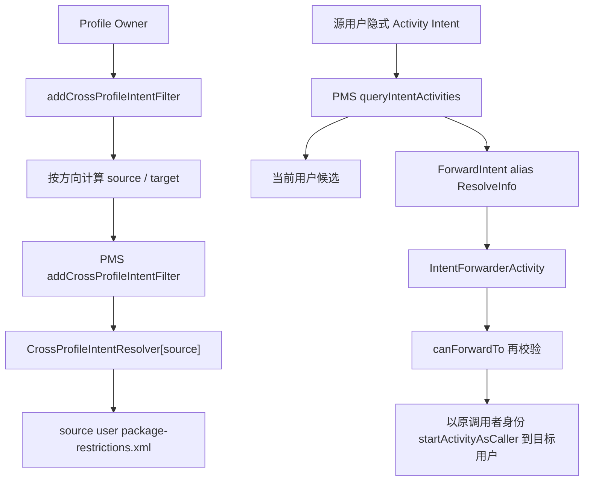
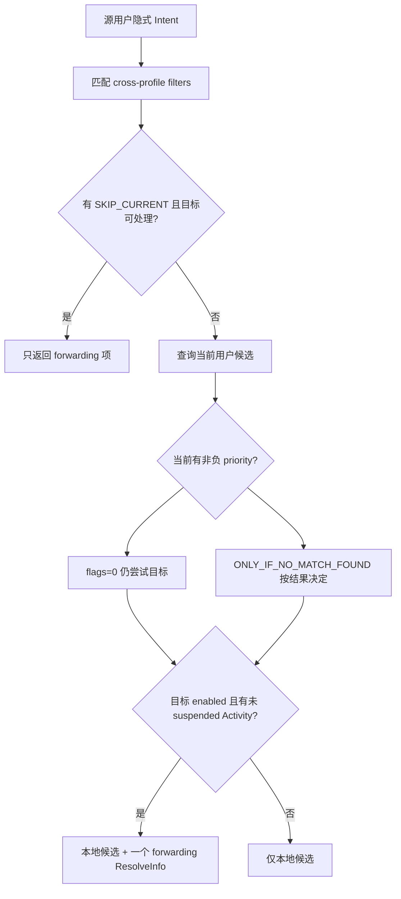
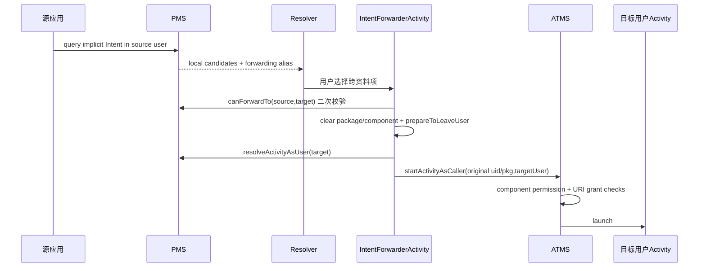

# 309 Android CrossProfileIntentFilter：配置、解析、跳板、URI授权与清理链

## 1. 本章目标

本章追踪工作资料与个人资料之间的 Activity Intent 如何被有限开放：DPC 写匹配规则，PMS 在源用户解析中生成系统 forwarding 候选，`IntentForwarderActivity` 再以原调用者身份到目标用户启动。

## 2. Android 11 边界

以 `android-11.0.0_r48` 为准。只讨论 Activity Intent；广播、Service、Provider 不会因为 CrossProfileIntentFilter 自动跨用户。

## 3. 为什么默认隔离

两个 profile 使用不同 userId、UID、包状态和数据目录。普通隐式 Intent 默认只在当前用户解析，不能把另一资料的 Activity 当成本用户组件。

## 4. 过滤器是路由白名单

它允许“某类隐式 Intent 可在指定目标用户继续解析”，不是把目标包权限复制到源用户，也不是允许任意显式 Component 跨用户启动。

## 5. 四个核心字段

PMS 的 `CrossProfileIntentFilter` 继承 `IntentFilter`，另保存 `targetUserId`、`ownerPackage` 与内部解析 flags；它所在 resolver 的键就是 sourceUserId。

## 6. 一句话数据模型

`mCrossProfileIntentResolvers[sourceUserId] -> {IntentFilter,targetUserId,ownerPackage,flags}`。方向不另存布尔值，而由 source 和 target 的位置表达。

## 7. 两类规则来源

DPC 可经 DevicePolicyManager 增加自定义双向规则；ManagedProvisioning 在创建资料时还写一组系统默认规则，保障拨号、短信、Home、文件选择、分享等体验。

## 8. 两层 flags

DPM 的 `FLAG_PARENT_CAN_ACCESS_MANAGED` / `FLAG_MANAGED_CAN_ACCESS_PARENT` 是配置方向位；PMS 的 `SKIP_CURRENT_PROFILE` / `ONLY_IF_NO_MATCH_FOUND` 是解析优先级位。它们不是同一命名空间。

## 9. 最终不是直接返回目标 Activity

源用户 PMS 返回的是 `android` 包中的 forwarding alias ResolveInfo。用户选择它之后，系统跳板才重新校验并跨用户启动真实目标。

## 10. 总体链路

## 11. DPC API 入口

`DevicePolicyManager.addCrossProfileIntentFilter(admin,filter,flags)` 禁止 parent instance；DPMS 要求 admin Component 非 null，并验证 active DO/PO 身份。

## 12. 实际需要 profile parent

身份门虽可接受 DO/PO，DPMS 随后调用 `getProfileParent(callingUserId)`；没有 parent 就记录错误并返回。因此常规有效调用者是 managed profile 中的 PO。

## 13. 方向一：父访问工作

设置 `FLAG_PARENT_CAN_ACCESS_MANAGED` 时，DPMS 写 `source=parent.id,target=callingManagedUserId`。个人侧解析匹配 Intent 时可出现工作侧候选。

## 14. 方向二：工作访问父

设置 `FLAG_MANAGED_CAN_ACCESS_PARENT` 时，写 `source=callingManagedUserId,target=parent.id`。工作侧可把匹配 Intent 交给个人侧。

## 15. 双向一次调用

两个方向 bit 同时存在就写两条独立记录，分别落在两个 source user 的 resolver/XML。它们不是一条天然对称规则。

## 16. flags=0 的效果

若两个方向位都没设置，DPMS 不调用 PMS，却仍写 DevicePolicyEventLogger 事件。API 无异常不证明实际增加了过滤器。

## 17. 未知方向位

DPMS 只用按位与检查认识的两位，没有显式拒绝其他位；未知位不会生成额外方向。DPC 应只传公开常量。

## 18. DPC 规则的 PMS flags 固定为0

DPMS 调 `IPackageManager.addCrossProfileIntentFilter(...,0)`。因此 DPC 自定义 API 不能请求 PMS 内部的 SKIP_CURRENT_PROFILE 或 ONLY_IF_NO_MATCH_FOUND 优先级。

## 19. IntentFilter 的匹配内容

action 是必要核心，还可配置 category、scheme、authority、path 与 MIME type。规则放得过宽会扩大跨资料数据面；生产配置应按最小用途拆分。

## 20. 无 action 被拒

PMS 若 `intentFilter.countActions()==0`，记录 warning 后返回。只有 category/type 而无 action 的过滤器不会进入表。

## 21. DPMS 清身份

DPMS 在持锁完成企业角色验证后 clear Binder identity，再以 system 权限调用 PMS，最后 restore。跨用户 full permission 由 system 身份满足。

## 22. PMS 的底层权限门

PMS 要求 `INTERACT_ACROSS_USERS_FULL`、校验 ownerPackage 确属 calling UID，并对 shell 检查 DISALLOW_DEBUGGING_FEATURES。system appId 在 `enforceOwnerRights()` 中拥有全部 owner 权。

## 23. ownerPackage 的意义

DPC 路径写 `who.getPackageName()`，用于之后只清除此管理包创建的规则。它不是解析时允许响应 Intent 的目标包名。

## 24. 去重规则

PMS 先用 resolver `findFilters(intentFilter)` 找内容相等的过滤器，再比较 target、owner、flags；全部相同则直接返回，不重复写盘。

## 25. 同匹配可有不同目标

IntentFilter 内容相同但 targetUserId 不同，不视为重复。数据结构理论上支持一源多目标，尽管 r48 跳板获取 managed profile 时仍有单资料假设。

## 26. 同匹配可有不同 owner

两个 ownerPackage 可建立内容和方向相同的规则，各自保留；清除一个 owner 后，另一个规则仍能使路由存在。

## 27. CrossProfileIntentResolver

它继承通用 `IntentResolver`，复用 action/type/scheme/category 匹配；不排序结果，`isPackageForFilter()` 恒 false，因为 filter owner 不是普通目标包过滤语义。

## 28. 写盘时机

新增后 `scheduleWritePackageRestrictionsLocked(sourceUserId)`，属于延迟写。内存路由可先于 source user 的 `package-restrictions.xml` 落盘生效。

## 29. XML 内容

每项写 targetUserId、flags、ownerPackage 和嵌套 IntentFilter。sourceUserId 由文件所属用户表达，不在每项重复写。

## 30. 开机恢复

Settings 读取 source user 包限制文件，构造 CrossProfileIntentFilter 并加入对应 resolver；缺属性使用 USER_NULL、空 owner 或0 flags并记录问题。

## 31. 显式 Intent 不走此路

PMS query 中只有 `pkgName==null` 的隐式解析分支才查询 cross-profile filters。指定 package 或 Component 的 Intent 不会借过滤器越过用户边界。

## 32. 为什么禁止显式跨资料

路由政策批准的是一类用途，不是源应用对目标资料某个包的精确控制权。目标用户仍应按自己的默认应用、Resolver 和包状态选择。

## 33. 第一步匹配规则

PMS 用源 user resolver 对原 Intent 与 resolvedType 做 `queryIntent(...defaultOnly=false)`，得到所有匹配 CrossProfileIntentFilter。

## 34. SKIP_CURRENT_PROFILE 优先

若系统默认规则带 SKIP_CURRENT_PROFILE，PMS 先查询目标；有可用候选便只返回 forwarding ResolveInfo，当前用户候选甚至不进入后续合并。

## 35. 紧急用途为何 skip

ManagedProvisioning 对紧急呼叫、SMS/MMS、Home、移动网络设置等使用 SKIP_CURRENT_PROFILE，强制交给个人/主用户基础能力处理。

## 36. 普通本地候选

没有可用 skip 结果时，PMS 查询当前用户 Activity，并计算是否存在 non-negative priority 结果，而不是只判断列表非空。

## 37. ONLY_IF_NO_MATCH_FOUND 的真实门

系统规则带此 flag 时，只有当前资料没有 non-negative priority match 才尝试目标用户。负 priority 候选不阻止 fallback。

## 38. flags=0 的合并

DPC 自定义规则 flags=0，不跳过当前、也不等待本地失败；只要目标有可用候选，forwarding 项可与本地候选一起进入 Resolver。

## 39. 一目标只查一次

多个匹配 filter 指向相同 target 时，`alreadyTriedUserIds` 防止重复 query。第一个成功便返回一个 forwarding ResolveInfo，而非每条规则各显示一项。

## 40. 目标用户必须 enabled

`createForwardingResolveInfo()` 查询目标组件后还要求 `isUserEnabled(targetUserId)`；这里最终只检查 `UserInfo.FLAG_DISABLED`，并不把 `FLAG_QUIET_MODE` 算作 disabled。quiet profile 可能仍生成 forwarding 候选，真正启动时另由 ActivityStartInterceptor 处理。

## 41. 目标至少一个真实 Activity

仅有规则不够；目标用户的 ComponentResolver 必须找到匹配 Activity。过滤器不会创建不存在的处理能力。

## 42. 全部 suspended 时拒绝

目标结果若全带 `ApplicationInfo.FLAG_SUSPENDED`，PMS 返回 null。第307章的挂起策略因此会让跨资料入口消失。

## 43. 部分 suspended 仍可转发

只要至少一个目标候选未 suspended，就创建一个 forwarding 项；进入目标后的 Resolver 再决定具体可选应用。

## 44. 源侧包可见性后过滤

forwarding ResolveInfo 还会经过 `filterIfNotSystemUser` 与 post-resolution filter。规则匹配不自动绕过 instant app/包可见性等公共解析边界。

## 45. Web URI 的旁路

`canForwardTo()` 对普通 filter 无匹配时，还允许从 managed profile 到 parent 的 cross-profile app linking/domain preferred 路径。它只向 parent 工作，与 DPC filter 是相邻机制。

## 46. Web 候选去重

主 query 若 domain preferred 也生成同一跨资料 forwarding 候选，会移除先前 filter 产生项，避免 Resolver 显示两个相同跳板。

## 47. forwarding ResolveInfo 的身份

PMS 构造 `android` 包中 `ForwardIntentToManagedProfile` 或 `ForwardIntentToParent` alias 的 ActivityInfo，而不是伪造目标应用 ActivityInfo。

## 48. alias 运行在哪个用户

ActivityInfo 从 sourceUserId 获取，跳板先在源用户启动；ResolveInfo 的 `targetUserId` 另外告诉 Resolver 这项代表另一个 profile。

## 49. 父用户图标提示

目标不是 managed profile 时设置 `showUserIcon=targetUserId` 且 `noResourceId=true`；目标是工作资料时 alias 自带企业 badge 图标与 managed-profile label。

## 50. 解析决策图

## 51. 跳板不能被直接滥用吗

两个 alias 在 Manifest 中 exported，但直接启动不等于获准跨资料；`IntentForwarderActivity` 会根据 alias 名确定方向，再调用 PMS `canForwardTo()` 重新验证当前 Intent。

## 52. 真实 Activity 共用实现

两个 alias 都指向 `IntentForwarderActivity`，运行在 framework `:ui` 进程；onCreate 根据 getComponent().getClassName() 判断 parent 或 managed 方向。

## 53. 非法类名

若直接命中基础 Activity 或未知 alias，代码 `wtf`，target=USER_NULL，随后 finish。只有两种预期 className 可继续。

## 54. 找 parent

ForwardIntentToParent 调 UserManager.getProfileParent(myUserId)。没有 parent 时记录 wtf 并结束。

## 55. 找 managed profile

ForwardIntentToManagedProfile 遍历 `getProfiles(myUserId)`，返回第一个 managed profile；源码 TODO 明确存在“只假定一个 managed profile”的限制。

## 56. Chooser 特殊处理

收到 ACTION_CHOOSER 时不直接把 chooser 整体转发到另一用户，而在当前用户启动 sharesheet，并通过 `EXTRA_SELECTED_PROFILE` 选中另一资料 tab。

## 57. 为什么 Chooser 不走 canForward

`canForward()` 明确对 ACTION_CHOOSER 返回 null；Chooser 分支先取内部 EXTRA_INTENT、清理显式目标，再用 Resolver/Chooser 自身的跨 profile tab 模型处理。

## 58. 普通 Intent 的复制

`canForward()` 先 new Intent(incoming)，加入 FORWARD_RESULT 与 PREVIOUS_IS_TOP，再 sanitize。源 Activity 的结果链和返回栈语义因此尽量延续。

## 59. sanitize 的核心

对外层及 selector 都执行 `setPackage(null)`、`setComponent(null)`。即使恶意应用直接启动 alias 并塞目标 Component，跳板也会把它降成隐式解析。

## 60. selector 的匹配

若存在 selector，PMS `canForwardTo()` 检查 selector 的 action/type等；最终转发的外层 Intent 保留 selector，但 selector 同样已清 package/component。

## 61. resolvedType

跳板在源用户 ContentResolver 上对待检查 Intent 调 `resolveTypeIfNeeded()`，再把 Intent、type、source、target 交给 PMS 权威验证。

## 62. 二次校验不是重复浪费

从 Resolver 展示到用户点击期间，DPC 可能清规则、资料可能 quiet、包可能变化。`canForwardTo()` 重新查询 source resolver，避免使用过期 ResolveInfo。

## 63. canForwardTo 的普通结论

只要源 resolver 有匹配项且其 targetUserId 等于请求目标就返回 true；它不在此处重新确认目标当前是否有 Activity，该确认稍后由 target resolve/start完成。

## 64. prepareToLeaveUser

校验通过后 `newIntent.prepareToLeaveUser(callingUserId)` 设置 content user hint 为最初源用户，帮助 content URI 在跨用户传递时保留来源语义；该 hint 不是安全认证凭据。

## 65. 目标预解析异步执行

跳板用单线程 Executor 调 `resolveActivityAsUser(target)`，CompletableFuture 完成后决定直接启动真实目标还是打开合适的 Resolver tab。

## 66. 目标 Resolver 情况

若目标解析到 ResolverActivity，跳板不简单跨过去，而根据源侧是否也只解析到 forwarder，决定 Resolver 在 source 还是 target user 展示，并传 selected profile/calling user。

## 67. 直接目标启动

若目标只有明确默认处理者，调用 `startActivityAsCaller(newIntent,...ignoreTargetSecurity=false,targetUserId)`。显式安全检查仍开启。

## 68. 为什么使用 AsCaller

普通 framework跳板若以 system UID 启动，会错误放大组件权限和 URI grant。AsCaller 从跳板 ActivityRecord 取 `launchedFromUid/package`，按原应用身份执行目标检查。

## 69. AsCaller 的危险门

ATMS 只允许 android package 的 Activity 使用；sourceRecord 必须存在并有进程，且运行 UID 必须 system 或等于原 launchedFromUid。跳板不能把此能力转交普通 Activity。

## 70. 原调用者进入 ActivityStarter

ATMS 设置 callingUid、callingPackage、callingFeatureId 为 sourceRecord 的 launched-from 值；只有 Resolver 子类的 filterCallingUid 特殊取 system，以完成系统解析职责。

## 71. 后台启动例外

AsCaller 设置 `allowBackgroundActivityStart=true`，因为目标 profile 的系统跳转本就由当前前台交互触发；这不把通用后台启动豁免授给原应用后续请求。

## 72. ignoreTargetSecurity=false

目标 Activity 的 exported/permission 等检查仍按原 caller 执行。Cross-profile filter 只批准路由，不批准绕过目标组件保护。

## 73. URI grant 不是自动全开

跨资料过滤器本身不授予 ContentProvider 权限。只有 Intent 携带 grant flags/ClipData URI，且原 calling UID 有权委托时，Activity 启动的 UriGrants 链才创建目标 user grant。

## 74. prepareToLeaveUser 的边界

它只保存 contentUserHint，不证明源 URI 可读，也不替代 `checkGrantUriPermission`。第280章的 GrantUri sourceUserId、provider policy和mode检查仍完整执行。

## 75. ClipData 与 EXTRA_STREAM

分享流程通常需要正确把 URI 放入 ClipData并设置 READ/WRITE grant flags；只把字符串或未迁移 URI 放 extras，目标应用可能启动成功却读不到内容。

## 76. 目标 Provider 方向

如果 URI 指向源资料 Provider，grant 的 sourceUserId 保留源侧；目标 Activity 在另一 user 使用被授予 URI。若 Provider 不允许 grant 或路径不匹配，转发也不能修复。

## 77. 结果返回

FORWARD_RESULT 使目标结果尽量回到原发起 Activity，而非停留在透明跳板。跨用户结果中的 URI 同样需要反向 grant/来源处理。

## 78. disclosure toast

直接跨资料启动后，系统通常显示“转到个人/工作”长 Toast，让用户知道数据或操作穿越资料边界。

## 79. 未 provisioned 不提示

DEVICE_PROVISIONED=0 时不显示 disclosure，避免 Setup 阶段干扰；路由本身仍可按规则进行。

## 80. 电话短信的提示例外

若目标是 system app 且 Intent 是 dialer或短信 scheme的受控动作，不显示 disclosure；Resolver/Chooser 目标也不提示，因为界面本身已展示资料选择。

## 81. target ResolveInfo 为空

`shouldShowDisclosure()` 对 null 返回 true；随后 direct start 可能失败并记录 wtf。预解析结果不是跨用户启动成功的承诺。

## 82. 启动异常的处理

`startActivityAsCaller()` RuntimeException 被捕获，代码向 ATMS查询 launchedFrom UID/package并 `wtf`，不把异常直接抛回原 app；最后异步链仍 finish跳板。

## 83. 默认过滤器不是 DPC 自定义过滤器

ManagedProvisioning 使用隐藏 PackageManager API，以自己的 ownerPackage与 PMS内部 flags 写规则；DPC 的 clear 只按 DPC ownerPackage删，不会清这些默认项。

## 84. 默认 TO_PARENT 强制项

紧急呼叫、SMS/MMS、Home、移动网络设置使用 SKIP_CURRENT_PROFILE，确保资料侧不截获主用户承担的设备基础能力。

## 85. 默认 fallback 项

普通 DIAL、CALL_BUTTON 使用 ONLY_IF_NO_MATCH_FOUND：工作侧有合格处理者时留在工作侧，否则给个人侧机会。

## 86. 默认可选择项

GET_CONTENT、OPEN_DOCUMENT、PICK、媒体捕获、语音识别、闹钟等多为 flags=0，可让用户在 Resolver 中选择个人侧能力。

## 87. 默认 TO_PROFILE 项

ACTION_SEND/SEND_MULTIPLE 可把个人内容分享给工作应用；USB device/accessory attached 也可转入工作资料，具体仍由目标 Activity filter 与权限裁决。

## 88. DISALLOW_SHARE_INTO_MANAGED_PROFILE

设置默认规则时，ManagedProvisioning读取工作资料 restriction；若为 true，跳过标记 `letsPersonalDataIntoProfile` 的规则，减少个人→工作数据流。

## 89. restriction 变化重建

RestrictionChangedReceiver 收到数据分享限制变化，定位 profile parent，清两侧默认 resolver并重新 setFilters，最后向 profile发送 APPLIED 广播。

## 90. 点击 forwarding 项的时序

## 91. clear API 的范围

`clearCrossProfileIntentFilters(admin)` 找到 calling managed profile和 parent，分别清 source=managed 与 source=parent 中 ownerPackage 等于 DPC包的所有规则。

## 92. clear 不是按 target 精确删

源码注释承认若支持多个 managed profiles，清 parent source 时需只删 target=calling profile；r48 当前实现按 owner 清该 parent表中的全部规则。

## 93. clear 不影响别的 owner

PMS复制 resolver.filterSet 后逐项比较 `filter.getOwnerPackage().equals(ownerPackage)`；系统默认 owner或其他管理包规则保留。

## 94. clear 是延迟写

删除内存项后 schedule 写 source user package restrictions。当前解析立即看不到规则，磁盘稍后收敛。

## 95. owner 包卸载的思考

CrossProfileIntentFilter独立保存 owner字符串；是否随包删除清理由 PMS生命周期路径决定。安全设计不应仅靠DPC包卸载，Owner清除流程要显式clear/重建默认规则。

## 96. 用户删除作为 source

Settings.removeUserLPw 删除该 user整个 resolver及包限制文件，源侧自然不能再发起跨资料路由。

## 97. 用户删除作为 target

Settings还扫描所有其他 source resolver，移除 `targetUserId==deletedUser` 的项，并立即写各受影响 source文件，避免悬空跳板。

## 98. quiet mode 的收敛

quiet mode 不删除规则，PMS 的 `isUserEnabled()` 也不因 quiet 直接返回 false；Resolver 会展示工作资料关闭状态，若仍尝试启动，ATMS `interceptQuietProfileIfNeeded()` 改为 `UnlaunchableAppActivity` 并提供启用后重试的 IntentSender。关闭 quiet 后原规则继续使用，无需 DPC 重写。

## 99. suspended 的收敛

目标所有处理应用被暂停时不转发；任一恢复后原规则再次可用。规则账与包运行态分离，由每次解析组合。

## 100. hidden/uninstalled 的收敛

ComponentResolver对目标user只返回可匹配可用Activity；目标包hidden或未为该user安装，不能仅凭filter出现在源Resolver。

## 101. Filter 不指定目标包

即便 DPC 希望只开放企业文件应用，规则也只能匹配 Intent特征；目标user内所有匹配应用都可能由Resolver选择。还需管理目标默认应用/安装集合。

## 102. MIME 过宽风险

`ACTION_VIEW` + `*/*` + 双向会扩大大量内容流；应优先具体action/type/scheme，区分只读选择与可写编辑，并审查 URI grant flags。

## 103. category 的常见错误

目标 Activity常要求 CATEGORY_DEFAULT；DPC漏加或多加category都会改变 IntentFilter.match。规则存在但不匹配时，先比较实际Intent而非怀疑跨用户权限。

## 104. selector 的常见错误

Intent有selector时PMS匹配selector；只检查外层action可能得出错误结论。跳板还会分别sanitize外层和selector。

## 105. 诊断第一层：配置方向

记录 calling managed user、parent、DPM flags，确认实际 source/target。名称“PARENT_CAN_ACCESS_MANAGED”从源的视角表达，不要反向理解。

## 106. 诊断第二层：resolver/XML

查看 source user CrossProfileIntentResolver中 filter、target、owner、PMS flags，并核对 package-restrictions.xml；DPC规则 flags应为0，系统默认规则可能为2/4。

## 107. 诊断第三层：匹配与目标状态

手算 action/category/type/scheme，再确认目标 user enabled、至少一个Activity匹配且未全部suspended。

## 108. 诊断第四层：forwarder再校验

若Resolver有项但点击后结束，检查源/目标是否变化、canForwardTo、explicit字段sanitize、单managed-profile假设和target预解析。

## 109. 诊断第五层：启动和URI

Activity启动失败看原callingUid的目标permission/exported门；内容读取失败看ClipData、grant flags、GrantUri sourceUser与Provider grant policy。

## 110. 五个完成点

规则入内存、source XML落盘、Resolver生成forwarding候选、跳板二次校验通过、目标Activity真正启动并能读URI，是五个不同完成点。

## 111. 本章复读检查表

每条跨资料Intent依次问：仅Activity吗、是否隐式、source/target、owner、filter精确匹配、内部flags、目标enabled/unsuspended、跳板是否重验、原caller是否有组件与URI权限。

## 112. macOS只读练习一：翻译方向位

阅读DPMS `addCrossProfileIntentFilter()`，假设parent=0、managed=10，分别为两个DPM方向flag和双flag写出PMS调用的source、target、owner、内部flags。

## 113. macOS只读练习二：手算解析优先级

阅读 `querySkipCurrentProfileIntents()` 与 `queryCrossProfileIntents()`，对flags 0、SKIP_CURRENT_PROFILE、ONLY_IF_NO_MATCH_FOUND，分别模拟本地无结果、负priority结果、正priority结果和目标全部suspended。

## 114. macOS只读练习三：追一次分享URI

从 `IntentForwarderActivity.canForward()` 追到 `startActivityAsCaller()`，标出sanitize、contentUserHint、原callingUid恢复和URI grant检查；说明filter为何不等于Provider读权限。

## 115. macOS只读练习四：比较默认与DPC规则

阅读 `CrossProfileIntentFiltersSetter.FILTERS`，任选SMS、DIAL、GET_CONTENT、ACTION_SEND四项，写方向、PMS flags、是否向工作资料带个人数据，以及restriction开启时是否跳过。

## 116. 复读修正一：两个flag体系不可混用

DPM的1/2位决定写哪条方向；PMS的2/4位决定skip/fallback。数值甚至有重叠，但DPMS传给PMS的解析flags固定0，不能跨类型解释。

## 117. 复读修正二：filter不是显式包白名单

forwarder主动清package/component，目标Resolver可选择任何匹配应用。若需求是只允许一个目标包，还要结合安装、默认处理器或其他企业包策略。

## 118. 复读修正三：URI可路由不等于可读取

prepareToLeaveUser只标源user；真正授权仍要求grant flags、ClipData/URI被收集、原UID有委托能力、Provider允许grant及目标mode匹配。

## 119. 复读修正四：clear不清系统默认项

DPC clear按ownerPackage删除；ManagedProvisioning默认filter使用不同owner，并受数据分享restriction重建。看到清除后仍有Home/短信等转发不应直接判为缓存错误。

## 120. 本章结论与下一章

CrossProfileIntentFilter是“source表中的用途白名单→PMS生成系统跳板→跳板按原caller二次校验并跨user启动”的受控路由，而非权限隧道。下一章进入 CrossProfileApps 与 Launcher，比较包级跨资料启动授权和图标/活动发现链。
