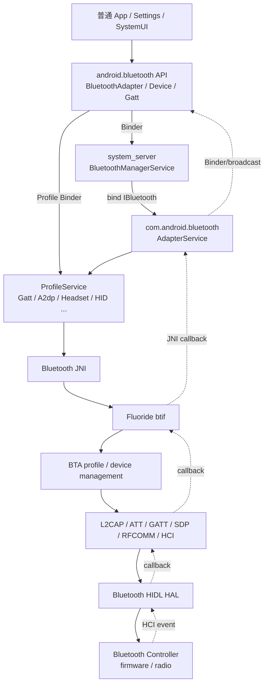
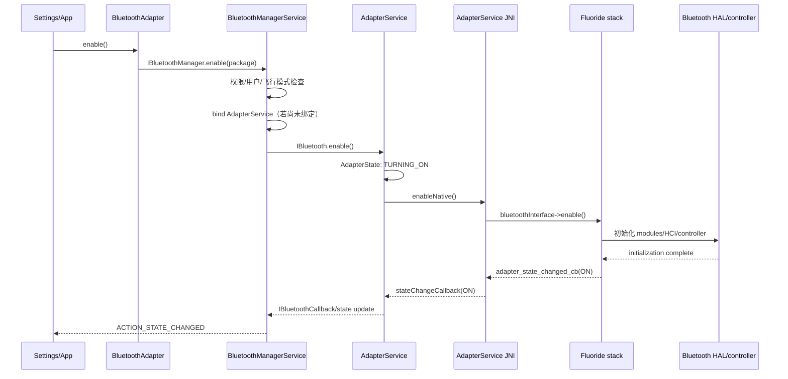
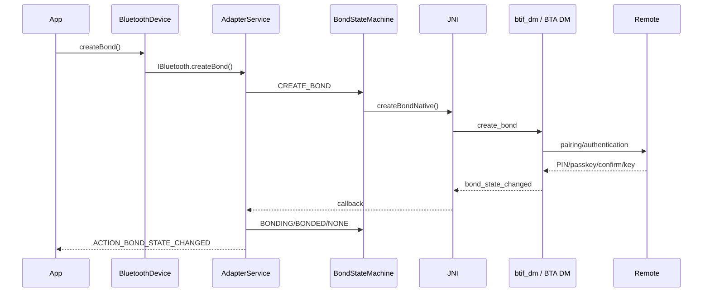
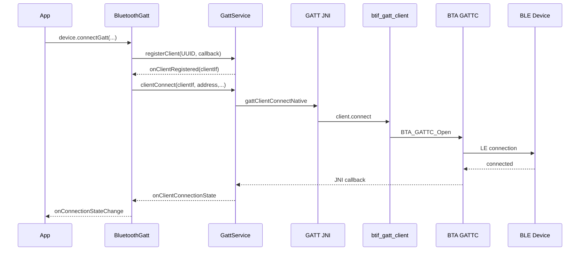

# 31 Android 蓝牙系统、BluetoothService 与 Profile

> 源码版本：Android 11 / API 30 / `android-11.0.0_r48`  
> 学习方式：macOS 只读源码，不要求编译  
> 前置章节：[06 SystemServer 与系统服务](./06-SystemServer与系统服务.md)、[07 Binder 基础](./07-Binder基础与完整调用链.md)、[28 Android 音频系统](./28-Android音频系统AudioFlinger与AudioPolicy.md)

这一章不要一开始就钻进 `system/bt`。蓝牙代码跨 Java Framework、系统应用、JNI、Fluoride 协议栈、HAL 和控制器，多条状态机又同时运行。最有效的读法是先固定一条用户动作，再沿调用和回调往返追踪。

本章围绕五条主线：

1. 打开蓝牙：谁启动蓝牙进程，谁维护全局开关状态？
2. 扫描设备：Classic discovery 和 BLE scan 有何不同？
3. 配对：bond、pairing、authentication 和连接是什么关系？
4. 连接 Profile：为什么“设备已配对”不等于“耳机已连接”？
5. 数据传输：A2DP 音频、GATT characteristic 和 BluetoothSocket 分别走哪条路径？

---

## 1. 先建立整体地图



先记住三个进程角色：

| 位置 | 主要职责 | 不应误解为 |
|---|---|---|
| App 进程 | 调用公开 API、接收 callback/broadcast | 蓝牙协议栈本身 |
| `system_server` | 全局开关、绑定蓝牙服务、用户切换、崩溃恢复 | 承载所有 Profile |
| `com.android.bluetooth` | Adapter、Profile、JNI 和 native stack 的宿主 | 普通第三方 App |

控制器通常是芯片及其固件，Android 主机通过 HCI 命令、事件和 ACL/SCO/ISO 类数据与它通信。

---

## 2. Bluetooth、BR/EDR、BLE 分别是什么

日常说的“经典蓝牙”通常指 BR/EDR，BLE 指 Bluetooth Low Energy。

| 对比 | Classic BR/EDR | BLE |
|---|---|---|
| 常见用途 | 音频、电话、键鼠、串口 | 传感器、手环、低功耗控制 |
| 发现 | inquiry/discovery | advertising + scanning |
| 服务描述 | SDP | GATT service/characteristic |
| 常见承载 | ACL、L2CAP、RFCOMM；语音还可用 SCO | LE ACL、L2CAP、ATT |
| 连接特点 | 传统 Profile 丰富 | 低功耗、小数据、连接参数可调 |

双模设备可同时支持两类无线技术。Android 的 `BluetoothDevice` 是远端设备抽象，不代表当前一定已连接，也不代表只属于 Classic 或 BLE。

---

## 3. Profile 是什么

Profile 是“某类蓝牙用途的协议和行为约定”，不是 Java 接口的另一个名字。

常见 Profile：

- A2DP：高质量媒体音频。
- AVRCP：播放控制、媒体信息。
- HFP：通话控制和通话音频。
- HID Host：键盘、鼠标、手柄。
- PAN：蓝牙网络共享。
- PBAP：电话簿访问。
- MAP：短信/消息访问。
- GATT：BLE 属性数据访问框架。

一台耳机可能同时连接 A2DP、AVRCP 和 HFP；各 Profile 有各自状态机，所以“蓝牙设备连接状态”不是一个简单布尔值。

---

## 4. Android 11 的重要版本边界

本工程是 API 30：

- 普通蓝牙操作主要检查 `BLUETOOTH`、`BLUETOOTH_ADMIN`。
- BLE 扫描结果可能暴露位置，因此还受位置权限、位置开关和前后台限制影响。
- Android 12/API 31 才引入 `BLUETOOTH_SCAN`、`BLUETOOTH_CONNECT`、`BLUETOOTH_ADVERTISE` 运行时权限组。
- `system/bt/gd` 已存在，是 Gabeldorsche 新架构的渐进迁移；Android 11 不能简单描述成“全栈都已经由 GD 重写”。
- 主体仍可从 Java Profile → JNI → `btif` → `bta`/legacy stack 追踪。

阅读新文章时必须先看 Android 版本，否则权限、模块位置和进程模型很容易对不上源码。

---

## 5. 核心源码入口

```text
frameworks/base/core/java/android/bluetooth/BluetoothAdapter.java
frameworks/base/core/java/android/bluetooth/BluetoothDevice.java
frameworks/base/core/java/android/bluetooth/BluetoothGatt.java
frameworks/base/services/core/java/com/android/server/BluetoothService.java
frameworks/base/services/core/java/com/android/server/BluetoothManagerService.java

packages/apps/Bluetooth/src/com/android/bluetooth/btservice/AdapterService.java
packages/apps/Bluetooth/src/com/android/bluetooth/btservice/AdapterState.java
packages/apps/Bluetooth/src/com/android/bluetooth/btservice/BondStateMachine.java
packages/apps/Bluetooth/src/com/android/bluetooth/btservice/RemoteDevices.java
packages/apps/Bluetooth/src/com/android/bluetooth/gatt/GattService.java
packages/apps/Bluetooth/src/com/android/bluetooth/a2dp/A2dpService.java
packages/apps/Bluetooth/src/com/android/bluetooth/hfp/HeadsetService.java

packages/apps/Bluetooth/jni/com_android_bluetooth_btservice_AdapterService.cpp
packages/apps/Bluetooth/jni/com_android_bluetooth_gatt.cpp
packages/apps/Bluetooth/jni/com_android_bluetooth_a2dp.cpp

system/bt/btif/src/btif_core.cc
system/bt/btif/src/btif_dm.cc
system/bt/btif/src/btif_ble_scanner.cc
system/bt/btif/src/btif_gatt_client.cc
system/bt/btif/src/btif_av.cc
system/bt/bta/dm/bta_dm_main.cc
system/bt/bta/gatt/bta_gattc_main.cc
system/bt/hci/src/hci_layer.cc
```

---

## 6. SystemServer 只启动一个管理入口

`SystemServer` 启动：

```java
mSystemServiceManager.startService(BluetoothService.class);
```

`BluetoothService` 自身很薄，主要创建 `BluetoothManagerService`，并在合适 boot phase 调用其启动逻辑。

因此要区分：

```text
BluetoothService        = SystemService 生命周期外壳
BluetoothManagerService = system_server 中真正的全局蓝牙管理者
AdapterService          = Bluetooth App 进程中的 IBluetooth 实现与核心服务
```

名字相似是本章第一个高频迷惑点。

---

## 7. BluetoothManagerService 管什么

`BluetoothManagerService` 主要维护：

- 蓝牙是否应当开启的持久化意图。
- 当前 adapter 状态。
- 到 `AdapterService` 的 Binder 连接。
- `IBluetooth`、`IBluetoothGatt` 等 Binder 引用。
- Airplane mode、用户切换、权限和前台用户约束。
- 蓝牙进程死亡后的解绑、重试和有限次数恢复。
- 向注册者通知 service up/down 和 state change。

它更像蓝牙系统的“总电闸与服务监工”，而不是 GATT/A2DP 业务实现。

---

## 8. 为什么还需要独立 Bluetooth App

`packages/apps/Bluetooth` 是平台签名、拥有特殊权限的系统应用，进程通常为 `com.android.bluetooth`。把复杂协议栈放在独立进程有几个意义：

- 协议栈故障不必直接拖垮 `system_server`。
- Profile 以 Android Service 组织，便于独立生命周期和 Binder 接口。
- Java 与 native stack 放在同一宿主内，JNI callback 更直接。
- 系统可检测 Binder death 并尝试重启/重绑。

“是 APK”不等于“权限和生命周期与普通 APK 一样”。

---

## 9. 打开蓝牙的 API 起点

应用侧常见入口：

```java
BluetoothAdapter adapter = BluetoothAdapter.getDefaultAdapter();
adapter.enable();
```

Android 11 中 `BluetoothAdapter` 持有 `IBluetoothManager`，`enable()` 先进入 `BluetoothManagerService.enable(packageName)`。

公开 API 返回 `true` 通常表示请求被接受，不表示 radio 已经同步变成 ON。最终状态要看 `ACTION_STATE_CHANGED` 或 manager callback。

---

## 10. 开关状态不是 boolean

核心状态：

```text
STATE_OFF
STATE_TURNING_ON
STATE_ON
STATE_TURNING_OFF
```

还存在 BLE-only 相关中间状态，例如 `STATE_BLE_ON`。原因是即使用户界面显示传统蓝牙关闭，系统功能仍可能需要 BLE 扫描。

因此：

- “用户开关状态”不完全等于“controller 是否上电”。
- `isEnabled()`、BLE scan availability 和底层状态不能随意互换。
- 状态广播是异步状态机的结果，不是 UI 自己猜出来的。

---

## 11. 打开蓝牙完整主链



这里至少跨越两次进程边界和一次 Java/native 边界。

---

## 12. AdapterState 与 native callback

`AdapterState` 管理 OFF、BLE_TURNING_ON、BLE_ON、TURNING_ON、ON 等迁移。`AdapterService` 调 native 方法后不会假设成功，而是等：

```text
controller/HAL event
 → stack callback
 → btif callback
 → JNI JniCallbacks
 → AdapterService/AdapterState message
```

这是蓝牙源码的通用模式：向下层发命令，稍后由反向 callback 驱动状态机。

---

## 13. native stack 怎样初始化

JNI 在 `com_android_bluetooth_btservice_AdapterService.cpp` 获取 `bt_interface_t`，再调用 `init/enable/disable/cleanup` 等接口。

`system/bt/btif/src/stack_manager.cc` 组织协议栈启动关闭；`btif_core.cc` 负责 framework-facing adapter 功能。初始化包含配置、线程、controller、HCI、device manager 和 profile modules。

不要把 `enableNative()` 理解成一次直接写 GPIO 的调用。它启动的是一套异步模块依赖链。

---

## 14. HCI 是主机与 Controller 的边界

HCI 包含：

- Command：主机向控制器下命令。
- Event：控制器报告命令完成、连接、断开、扫描结果等。
- ACL data：异步连接数据。
- SCO data：经典蓝牙同步语音数据。

Android Bluetooth HAL 负责把上层 HCI packet 送到具体传输，并把收到的数据回调上来。真实物理传输可能是 UART、USB 或厂商内部通道。

HAL 边界不等于 Profile 边界：A2DP/GATT 状态机位于 HAL 之上。

---

## 15. 关闭蓝牙为何也很复杂

关闭需要反向收敛：

```text
停止/断开 Profile
 → 停止发现和扫描
 → 清理 connection 与 pending work
 → disable stack/controller
 → native callback OFF
 → 解绑或停止 AdapterService
```

如果某个 Profile、JNI callback 或 controller command 没有完成，状态可能卡在 TURNING_OFF。诊断时必须找“最后一个完成回调”，不能只看最初的 disable 请求。

---

## 16. Classic Discovery

应用调用：

```java
adapter.startDiscovery();
```

主链大致为：

```text
BluetoothAdapter
 → IBluetooth.startDiscovery
 → AdapterService.startDiscovery
 → startDiscoveryNative
 → btif_dm_start_discovery
 → BTA device manager
 → HCI inquiry
```

发现结果沿 callback 返回 `RemoteDevices`，再发出 `ACTION_FOUND`。发现是耗时且影响连接/吞吐的操作，连接设备前常见做法是先 `cancelDiscovery()`。

---

## 17. BLE Scan 与 Classic Discovery 不同

BLE scan API：

```text
BluetoothLeScanner.startScan(filters, settings, callback)
```

主要进入 `IBluetoothGatt` 和 `GattService`，而不是 `AdapterService.startDiscovery()`：

```text
BluetoothLeScanner
 → IBluetoothGatt
 → GattService register scanner/start scan
 → com_android_bluetooth_gatt.cpp
 → btif_ble_scanner.cc
 → controller LE scan
```

把两者都叫“扫描”可以，但追源码时必须先问：Classic inquiry 还是 LE advertising scan？

---

## 18. ScanFilter 与 controller offload

BLE 可按地址、service UUID、manufacturer data 等过滤。过滤可能发生在：

- controller 硬件 offload；
- native stack；
- framework/service 层。

具体由控制器能力和请求配置决定。硬件 offload 可减少唤醒和主机处理，但不能假设所有设备都支持所有 filter/batch 能力。

---

## 19. 扫描结果不是连接

扫描结果说明“在某时刻收到某设备的广播”，其中常见信息有：

- 地址或可解析私有地址。
- RSSI。
- advertising data。
- service UUID/manufacturer data。
- connectable 等属性。

它不保证设备仍在附近、不保证能连接，更不表示已认证或已发现 GATT services。

---

## 20. BLE 地址隐私

BLE 设备可能使用随机地址，甚至周期性变化。配对后的 IRK 可帮助解析 Resolvable Private Address。

所以不能把“当前看到的 MAC 字符串”永久当作业务身份。Android 内部会结合 identity address、bond 信息和 resolving list 管理设备身份。

---

## 21. Android 11 扫描权限

在 API 30，BLE 扫描通常还与位置权限/位置服务关联，因为附近设备信息可能推断用户位置。后台扫描另有限制。

阅读权限失败时分层检查：

1. Manifest 是否有 `BLUETOOTH`/`BLUETOOTH_ADMIN`。
2. 是否具备所需 location runtime permission。
3. location 开关和前后台状态。
4. 调用 UID/package 校验。
5. scan 配额、注册数量和硬件资源。

不要用 API 31 的错误修复方式倒推 API 30。

---

## 22. Bond、Pairing、Connection 的关系

三个概念必须分开：

```text
pairing：协商认证方式、确认/PIN/passkey、生成密钥的过程
bond：把配对密钥持久保存，形成长期信任关系
connection：当前建立的一条物理或逻辑链路
```

可能出现：

- 已连接但未 bond：BLE 临时连接。
- 已 bond 但未连接：常见的已配对耳机当前关机。
- 正在 pairing 但连接失败。
- 基础 ACL 已连接，但某个 Profile 没连上。

---

## 23. createBond 主链



`createBond()` 返回成功只表示请求发出。最终应等待 `BOND_BONDED` 或 `BOND_NONE` 及原因。

---

## 24. BondStateMachine

源码：

```text
packages/apps/Bluetooth/src/com/android/bluetooth/btservice/BondStateMachine.java
```

它序列化 create/remove/cancel bond 请求，处理 native bond state callback，并更新 `RemoteDevices`、存储和广播。

关注的不是状态名本身，而是每条消息由谁发送、什么时候收到 native 完成、失败原因是否保存。

---

## 25. SSP 与用户交互

Secure Simple Pairing 可能采用：

- Just Works。
- Numeric Comparison。
- Passkey Entry。
- Out-of-Band。

选择取决于两端 IO capability 和安全要求。无输入输出的设备可能无法抵抗中间人攻击；“配对成功”不自动意味着最高安全等级。

Android 收到 pairing request 后可能通过广播/系统 UI 请求用户确认，再调用 `setPairingConfirmation()`、`setPin()` 等把结果交回 stack。

---

## 26. 密钥存在哪里

bond 后需要保存 link key、LE keys、设备属性和 Profile preference。相关入口包括：

```text
system/bt/btif/src/btif_config.cc
system/bt/btif/src/btif_storage.cc
packages/apps/Bluetooth/src/com/android/bluetooth/btservice/bluetoothKeystore/
```

不要在笔记中记录真实设备地址、link key 或 snoop 中的敏感载荷。删除 bond 会触发本地密钥和关联状态清理，但远端是否同步清理取决于远端设备。

---

## 27. Service Discovery

Classic 常用 SDP 查询远端支持的服务记录；BLE 连接后通过 GATT service discovery 获取 service/characteristic/descriptor。

```text
SDP discovery != BLE GATT discovery
```

它们解决的目标类似——了解远端提供什么——但协议、数据模型和代码路径不同。

---

## 28. ProfileService

Bluetooth App 中许多 Profile 继承 `ProfileService`。它提供统一的：

- 服务启动停止。
- Binder 暴露与权限检查。
- adapter state 配合。
- service available 状态。
- dump 支持。

`AdapterService` 会根据资源配置启动支持的 Profile。设备厂商可通过 overlay/config 改变启用集合，所以不能看到源码目录就断言运行时一定启用。

---

## 29. 配对不等于 Profile 自动连接

Bond 只保存认证材料。Profile 是否自动连接还受：

- 远端是否支持该 Profile。
- connection policy/priority。
- 用户是否允许电话、媒体、联系人访问。
- 当前是否已有互斥设备。
- Profile 状态机与资源限制。
- incoming/outgoing connection policy。

因此排查耳机时分别看 bond、ACL、A2DP、HFP、AVRCP 状态。

---

## 30. A2DP 连接控制链

```text
BluetoothA2dp.connect（系统/隐藏入口）
 → IBluetoothA2dp
 → A2dpService.connect
 → A2dpStateMachine
 → A2dpNativeInterface.connectA2dp
 → com_android_bluetooth_a2dp.cpp
 → btif_av.cc
 → BTA AV state machine
 → L2CAP/AVDTP signaling
```

连接完成后 native event 反向驱动 `A2dpStateMachine`，再广播 connection state。

---

## 31. A2DP 控制面与音频数据面

控制面处理 discovery、codec capability、open/start/suspend/close。数据面传输编码后的音频 packet。

播放大致是：

```text
App PCM
 → AudioTrack
 → AudioFlinger / AudioPolicy
 → Bluetooth audio interface
 → A2DP encoder（如 SBC/AAC）
 → RTP/AVDTP/L2CAP
 → HCI ACL
 → 耳机解码播放
```

Android 版本和设备实现会影响软件编码、offload 以及 audio HAL 位置。不能把 `A2dpService.connect()` 当成每帧音频数据经过的函数。

还要区分两个完成条件：A2DP Profile 进入 `STATE_CONNECTED`，只证明蓝牙媒体通道可用；AudioPolicy 选中蓝牙输出设备、AudioFlinger 实际把某条播放流路由过去，是音频系统的另一步。于是会出现“Profile 显示已连接，但当前声音仍从扬声器播放”，这时应同时检查第 28 章的设备路由，而不是反复重新配对。

---

## 32. A2DP 与 AVRCP 为何常一起出现

A2DP 负责媒体音频流，AVRCP 负责播放/暂停、曲目 metadata、绝对音量等控制。用户感觉它们是一个“蓝牙音乐功能”，协议上却是不同 Profile。

可能出现：

- A2DP 已连接但按键控制异常。
- AVRCP metadata 正常但音频没路由到耳机。
- 音频已建立但 absolute volume 同步失败。

要分别看状态和日志。

---

## 33. HFP 与 SCO

HFP 控制链通常基于 RFCOMM/AT command，通话语音常走 SCO/eSCO。它和 A2DP 的目标不同：

| A2DP | HFP/SCO |
|---|---|
| 高质量单/双声道媒体 | 低延迟双向通话 |
| 通常单向下行 | 麦克风与听筒双向 |
| 媒体 codec | CVSD/mSBC 等语音 codec |

“通话时音乐音质下降”常是音频路由切到 HFP/SCO 的结果，不一定是 A2DP decoder 故障。

---

## 34. HID Host

Android 作为 Host 连接键盘、鼠标、手柄。Profile 连接后，输入报告最终要进入 Android 输入系统。

概念链：

```text
Bluetooth HID report
 → HID host stack/Profile
 → virtual/input device integration
 → Linux input event
 → EventHub/InputReader/InputDispatcher
```

可结合第 20 章理解。Profile “connected” 只说明协议连接，不保证按键映射和输入设备注册完全正常。

---

## 35. GATT 的数据模型

GATT 是层级属性模型：

```text
Server
 └─ Service
     └─ Characteristic
         ├─ value
         └─ Descriptor
```

每个 attribute 在 ATT 层有 handle。UUID 表达类型/语义，handle 是当前 attribute table 中的寻址编号。不要把 UUID 和 handle 混为一谈。

---

## 36. GATT Client 与 Server 是角色

通常手机是 GATT Client，传感器是 Server，但不是强制：Android 也可通过 `BluetoothGattServer` 提供服务。

角色与链路发起方也不是同一概念。应明确：

- 谁发起 physical connection？
- 谁是 ATT Client，发送 read/write request？
- 谁维护 attribute database？

---

## 37. connectGatt 主链



先注册 client，得到 `clientIf`，再建立连接。`BluetoothGatt` 是一次 client 会话对象，不是全局 adapter。

这几个编号处于不同抽象层，排查日志时不能混用：

| 标识 | 表示什么 | 生命周期 |
|---|---|---|
| `clientIf` | 本机注册到 GATT stack 的 client application | 从 registerClient 到 unregisterClient/进程失效 |
| `connId` | 某个 GATT client 与远端之间的连接上下文 | 本次连接建立到断开 |
| ATT handle | 远端 attribute table 中某一项属性的编号 | 由远端 database 决定，database 改变后可能变化 |
| UUID | service/characteristic/descriptor 的类型标识 | 语义稳定，但同一 UUID 可能出现多个实例 |

因此日志里“connId=3”绝不是第三个 characteristic，“handle=3”也不是第三次连接。

---

## 38. autoConnect 容易误解

`connectGatt(..., autoConnect, ...)` 的 `autoConnect=true` 通常表达后台/机会式连接意图，不等于“更快自动重连”。直接连接和后台连接在 native 层进入不同策略与队列。

理解它时要结合地址类型、设备是否已知、controller accept list、扫描和系统调度；不能仅从 Java 参数名推断时延。

---

## 39. discoverServices

连接成功后调用：

```java
gatt.discoverServices();
```

stack 通过 ATT 发现 primary service、included service、characteristic 和 descriptor，结果可能缓存在 native/framework 中，最后触发 `onServicesDiscovered()`。

“connected” 与“services ready”是两个阶段。连接成功后立刻按 UUID 取 characteristic，可能得到 null。

---

## 40. GATT 操作是异步串行协议

典型调用：

```text
readCharacteristic
writeCharacteristic
readDescriptor
writeDescriptor
requestMtu
```

方法返回 `true` 一般表示成功提交，不是远端已完成。最终结果在 callback 中。

ATT 通常一次只有一个未完成 request。应用连续无节制发多个操作，常出现 busy、失败或回调对应混乱。稳妥做法是维护 operation queue：收到上一个 callback 后再发下一个。

---

## 41. Notification、Indication 与本地开关

```text
notification：Server 推送，不需要 ATT confirmation
indication：Server 推送，需要 Client confirmation
```

Android 侧常需两步：

1. `setCharacteristicNotification()` 配置本地接收路由。
2. 写 CCCD descriptor，通知远端 Server 开启 notify/indicate。

只做第一步，远端可能根本不会发送数据；只写 CCCD，本地 callback 路由也可能没配置好。

---

## 42. MTU 不等于一次可随意发送的业务长度

ATT MTU 决定 ATT PDU 上限，characteristic value 单包有效载荷还要扣除 opcode/handle 等头部。更底层还有 L2CAP 和 controller data length。

例如 MTU 23 时，常见 write/notification value 有效载荷是 20 bytes，但不同操作头部和 long write 机制不同。不要把 MTU 数字直接当所有 API 的 payload 上限。

---

## 43. Write Type 与可靠性

Characteristic write 常见：

- Write Request：远端返回 response，可靠但有往返延迟。
- Write Command/No Response：无 ATT response，吞吐可能更高，但提交成功不证明远端业务已处理。
- Prepare/Execute Write：用于长值或可靠写入事务。

业务协议若要求确认，应设计应用层 sequence/ack，不能把 Java 方法返回值当成对端确认。

---

## 44. GATT cache

Android 可能缓存已发现的 GATT database。设备固件更新后若 attribute table 改变，而 Service Changed 机制处理不正确，就可能看到旧 service/handle。

排查需考虑：

- 设备是否发送 Service Changed indication。
- bond 与 cache 的关系。
- 是否重新发现服务。
- firmware 是否复用了 identity 却改变 database。

不要把隐藏的 refresh 方法当正式通用 API 方案。

---

## 45. BluetoothSocket、RFCOMM 与 L2CAP

`BluetoothSocket` 提供类似 socket 的字节流/packet 接口。Classic 串口场景常用 RFCOMM，底层建立在 L2CAP 上；也有 L2CAP channel API。

```text
App BluetoothSocket
 → IBluetoothSocketManager
 → AdapterService socket manager
 → JNI bt socket
 → btif_sock_rfc / btif_sock_l2cap
 → RFCOMM/L2CAP
 → HCI ACL
```

这条数据路径与 GATT characteristic 完全不同。`InputStream.read()` 阻塞也不是 Binder 线程一直携带每个字节；底层会建立 fd/socket 通道传输数据。

---

## 46. 为什么 Binder 不适合搬运所有蓝牙数据

Binder 适合控制调用和少量结构化数据，不适合持续高吞吐流。Android 会按场景使用：

- Binder：注册、连接、状态、配置。
- fd/socket/shared buffer：BluetoothSocket 或音频数据。
- JNI callback：native event 回到 Java service。
- HCI transport：主机和控制器之间的数据。

读源码始终区分控制面与数据面，可避免误追大量 Binder wrapper。

---

## 47. 线程模型

至少会遇到：

- App main/自建线程。
- Binder thread pool。
- `BluetoothManagerService` Handler thread。
- Profile StateMachine/Handler thread。
- JNI callback 所在线程及切换。
- btif thread。
- BTA/stack main thread。
- HCI/reactor/worker thread。

回调进入 Java 后常再次 post 到状态机线程，以保证状态串行。不要在 Binder callback 或 native callback 中做长耗时业务。

---

## 48. 状态为什么会“看起来乱序”

蓝牙操作跨多个队列，日志时间可能表现为：

```text
connect request
bond broadcast
ACL connected
profile connecting
service discovery
profile connected
```

不同层状态不是同一个事件，且 callback、broadcast、Binder 调度存在延迟。正确方法是给每条日志标出层次、设备、Profile、thread 和 timestamp，而不是只按文本出现顺序猜因果。

---

## 49. 权限检查在哪里

权限可能同时出现在：

- Framework API/Binder service。
- `BluetoothManagerService`。
- `AdapterService` 和 Profile Binder stub。
- location/AppOps 检查。
- user/managed profile 限制。

Binder 服务端不能信任调用者传来的 packageName，通常还要核对 calling UID。系统组件跨 Binder 调用后若 `clearCallingIdentity()`，也必须成对恢复。

---

## 50. 多用户与前台用户

蓝牙 radio 是全局硬件，但 Android 有多用户。系统需要决定：

- 哪个用户可以开关、扫描、配对。
- 用户切换后哪些 profile/service 状态重建。
- bond 数据哪些全局、哪些授权或偏好按用户。
- managed profile 是否受策略限制。

所以某些请求权限看似足够，仍可能因非 foreground user 被拒绝。

---

## 51. 飞行模式与 BLE-only

`BluetoothManagerService` 监听 Airplane mode 和相关 Settings。飞行模式是否关闭蓝牙还与用户此前选择、设备配置有关。

BLE-only 使用场景使状态更加复杂：定位或系统扫描客户端可能持有 BLE app count，传统 adapter UI 关闭后底层仍暂时保持 BLE 能力。

看到 `BLE_ON` 不要直接判为开关状态错误。

---

## 52. 崩溃和 Binder death 恢复

如果 Bluetooth App 进程崩溃：

1. `system_server` 发现 service disconnected/Binder death。
2. 清空旧 `IBluetooth`/`IBluetoothGatt` 引用。
3. 通知 manager callbacks service down。
4. 依据期望开关状态安排重绑定/重启。
5. 有重试次数和退避，避免无限 crash loop。

旧 Profile proxy、Gatt clientIf、connection id 和 callback session 都不能盲目继续使用。

---

## 53. 蓝牙地址与日志隐私

MAC、设备名、联系人、消息、音频 metadata、GATT value 都可能敏感。代码中常用地址脱敏或受 user build 日志级别限制。

btsnoop 能记录 HCI packet，调试价值极高，也可能包含认证和业务信息。只在授权设备和必要范围内使用，分享前脱敏。

---

## 54. 常见失败的分层诊断

| 症状 | 首先检查 |
|---|---|
| 开关卡住 | BMS 绑定、AdapterState、native enable、HAL/controller callback |
| Classic 找不到设备 | discovery 是否启动、scan mode、远端 discoverable、inquiry result |
| BLE 无结果 | 权限/位置、filter、scan registration、controller 能力、广播类型 |
| 配对失败 | bond reason、SSP/PIN 交互、密钥冲突、认证等级 |
| 已配对但耳机不连 | A2DP/HFP policy、各 Profile state、远端服务能力 |
| GATT 133/连接失败 | 地址/隐私、直连或后台连接、链路、资源、超时，不能只凭 133 定根因 |
| characteristic 找不到 | service discovery 是否完成、cache、UUID、固件 database |
| notify 没数据 | 本地 notification 注册、CCCD、远端是否真的发送 |
| 蓝牙串口卡住 | RFCOMM channel/SDP、fd 生命周期、阻塞线程、远端断开 |

---

## 55. dumpsys 阅读方向

可选真机观察：

```bash
adb shell dumpsys bluetooth_manager
adb shell dumpsys activity service com.android.bluetooth
adb shell dumpsys package com.android.bluetooth
```

重点找：

- enabled/expected state。
- Bluetooth service 是否 connected。
- crash/restart 计数。
- Adapter properties。
- bonded devices。
- Profile services 和 connection state。
- GATT clients/scanners/connections。

不同厂商 dumpsys 字段会变化，本章不要求实际连接设备。

---

## 56. 日志与 HCI snoop 的层次

建议按证据成本逐层深入：

1. App callback/broadcast。
2. BluetoothManager/Adapter/Profile Java log。
3. JNI 与 btif/BTA log。
4. dumpsys 状态快照。
5. bugreport。
6. btsnoop/HCI packet。

HCI snoop 能证明 controller 实际收发了什么，但无法单独解释 App 权限拒绝或 Java 状态机为什么没发命令。

---

## 57. 源码路线一：开关蓝牙

按顺序阅读：

```text
frameworks/base/core/java/android/bluetooth/BluetoothAdapter.java
frameworks/base/services/core/java/com/android/server/BluetoothManagerService.java
packages/apps/Bluetooth/src/com/android/bluetooth/btservice/AdapterService.java
packages/apps/Bluetooth/src/com/android/bluetooth/btservice/AdapterState.java
packages/apps/Bluetooth/jni/com_android_bluetooth_btservice_AdapterService.cpp
system/bt/btif/src/btif_core.cc
system/bt/btif/src/stack_manager.cc
```

练习：记录每一步所在进程、线程、返回值语义和最终完成 callback。

---

## 58. 源码路线二：Classic Discovery

搜索：

```text
BluetoothAdapter.startDiscovery
IBluetooth.startDiscovery
AdapterService.startDiscovery
startDiscoveryNative
btif_dm_start_discovery
ACTION_FOUND
```

练习：解释为何 `startDiscovery()==true` 不表示已经找到设备。

---

## 59. 源码路线三：BLE Scan

```text
frameworks/base/core/java/android/bluetooth/le/BluetoothLeScanner.java
packages/apps/Bluetooth/src/com/android/bluetooth/gatt/GattService.java
packages/apps/Bluetooth/jni/com_android_bluetooth_gatt.cpp
system/bt/btif/src/btif_ble_scanner.cc
```

练习：从 scanner registration 追到 scan result callback，标出 filter 可能在哪层执行。

---

## 60. 源码路线四：配对

```text
frameworks/base/core/java/android/bluetooth/BluetoothDevice.java
packages/apps/Bluetooth/src/com/android/bluetooth/btservice/AdapterService.java
packages/apps/Bluetooth/src/com/android/bluetooth/btservice/BondStateMachine.java
packages/apps/Bluetooth/jni/com_android_bluetooth_btservice_AdapterService.cpp
system/bt/btif/src/btif_dm.cc
system/bt/bta/dm/bta_dm_main.cc
```

练习：画出 BOND_NONE → BOND_BONDING → BOND_BONDED，以及失败回 NONE 的原因来源。

---

## 61. 源码路线五：GATT

```text
frameworks/base/core/java/android/bluetooth/BluetoothGatt.java
packages/apps/Bluetooth/src/com/android/bluetooth/gatt/GattService.java
packages/apps/Bluetooth/jni/com_android_bluetooth_gatt.cpp
system/bt/btif/src/btif_gatt_client.cc
system/bt/bta/gatt/bta_gattc_main.cc
```

练习：追 registerClient → connect → discoverServices → read characteristic → callback，写出 clientIf、connId、handle、UUID 各自含义。

---

## 62. 源码路线六：A2DP

```text
packages/apps/Bluetooth/src/com/android/bluetooth/a2dp/A2dpService.java
packages/apps/Bluetooth/src/com/android/bluetooth/a2dp/A2dpStateMachine.java
packages/apps/Bluetooth/src/com/android/bluetooth/a2dp/A2dpNativeInterface.java
packages/apps/Bluetooth/jni/com_android_bluetooth_a2dp.cpp
system/bt/btif/src/btif_av.cc
system/bt/bta/av/bta_av_main.cc
```

练习：分两张图画连接控制链和 PCM→编码 packet→耳机的数据链。

---

## 63. 推荐八组只读练习

1. **进程图**：标出 App、system_server、com.android.bluetooth、HAL/controller。
2. **开关图**：追 enable request 和 ON callback 的完整往返。
3. **扫描对比**：列表比较 Classic discovery 与 BLE scan。
4. **配对状态机**：区分 pairing、bond、ACL connection、Profile connection。
5. **GATT 队列**：模拟 connect/discover/read/enable notify 的异步顺序。
6. **A2DP 双路径**：分别画控制面和音频数据面。
7. **故障分层**：为“已配对但没声音”列出逐层证据。
8. **版本审计**：找出 API 30 与 API 31 蓝牙权限差异，笔记只采用本源码结论。

---

## 64. 初学者最容易混淆的十五点

1. `BluetoothService` 不等于 `AdapterService`。
2. system_server 管总开关，但 Profile 主体在 Bluetooth App 进程。
3. 开关请求成功不等于状态已经 ON。
4. UI 显示关闭不一定等于所有 BLE 能力立即下电。
5. Classic discovery 不走 BLE scanner 主链。
6. 扫描到设备不等于已连接。
7. pairing 是过程，bond 是持久关系。
8. bond 不等于当前 connection。
9. ACL connected 不等于所有 Profile connected。
10. A2DP 和 AVRCP 是不同 Profile。
11. HFP/SCO 通话音频不是 A2DP 媒体音频。
12. GATT Client/Server 角色不等于谁主动建立物理连接。
13. UUID 不等于 ATT handle。
14. GATT API 返回 true 不等于远端操作完成。
15. API 30 没有面向普通 App 的 Android 12 Nearby Devices 三权限模型。

---

## 65. 自测题

1. BluetoothManagerService、AdapterService 各运行在哪，职责是什么？
2. 为什么 enable() 返回 true 后不能立即假设蓝牙已打开？
3. Classic discovery 和 BLE scan 的服务入口有何不同？
4. pairing、bond、connection、Profile connection 如何区分？
5. createBond 最终结果从哪里返回？
6. 为什么耳机可能 A2DP 正常但按键不可用？
7. GATT 中 UUID 与 handle 有何区别？
8. 为什么 discoverServices 必须等 callback？
9. 开启 notification 为什么通常需要两步？
10. MTU=23 为什么常见 payload 是 20 bytes？
11. BluetoothSocket 数据为什么不适合逐字节走 Binder？
12. Android 11 BLE 扫描权限为何常涉及 location？
13. com.android.bluetooth 崩溃后旧 BluetoothGatt 对象为何不可靠？
14. “已配对但没有声音”应怎样分层定位？

---

## 66. 自测答案

1. BMS 在 system_server 管全局开关、绑定和恢复；AdapterService 在 com.android.bluetooth 提供 IBluetooth、Adapter/Profile 协调及 native 入口。
2. enable 是异步请求，需等待 stack/controller 完成并由 callback 驱动到 ON。
3. Classic 进入 AdapterService/device manager/inquiry；BLE 主要进入 IBluetoothGatt/GattService/LE scanner。
4. pairing 是生成认证密钥过程，bond 是保存密钥，connection 是当前链路，Profile connection 是某项业务协议状态。
5. controller/远端认证事件经 stack、btif、JNI 回到 BondStateMachine，再广播最终 bond state。
6. A2DP 传媒体，按键/metadata 多由 AVRCP 负责。
7. UUID 表示属性类型，handle 是当前 GATT database 中的寻址编号。
8. 服务发现需与远端进行多轮 ATT 交互，是异步操作。
9. 本地注册 callback 路由，并写远端 CCCD 请求 Server 发 notification/indication。
10. ATT Write Command/Notification 等还需 opcode、handle 等协议头。
11. Binder 适合控制，持续流用 fd/socket 可避免事务开销和大小限制。
12. 扫描附近设备可推断位置，API 30 将其纳入 location 权限/开关约束。
13. 进程重启后 Binder session、clientIf、connId 和 callback 注册都可能失效。
14. 依次看 adapter、bond、ACL、A2DP connection、AudioPolicy route、audio stream/codec 和 HCI 证据。

---

## 67. 本章结论

一条蓝牙操作的通用模型是：

```text
App 调用公开 API
 → Binder 到 system_server 或 Bluetooth App
 → Adapter/Profile 状态机
 → JNI
 → btif/BTA/协议栈
 → HCI/HAL/controller
 → 无线远端
 → event/callback 沿原路返回
```

真正掌握本章，不是背出所有 Profile 类名，而是每次都能回答：

```text
这是 Classic 还是 BLE？
这是全局 adapter、物理链路，还是某个 Profile 的状态？
这是控制面还是数据面？
请求在哪个线程发出，最终完成由哪个 callback 证明？
跨越了哪些 Binder、JNI、HAL 边界？
当前结论属于 Android 11，还是误用了新版本行为？
```

做到这六点，即使面对 A2DP、HFP、HID、GATT 或厂商扩展，也能沿相同方法继续读下去。
