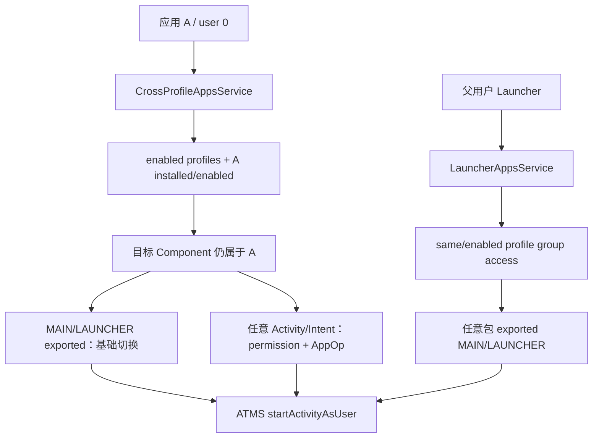
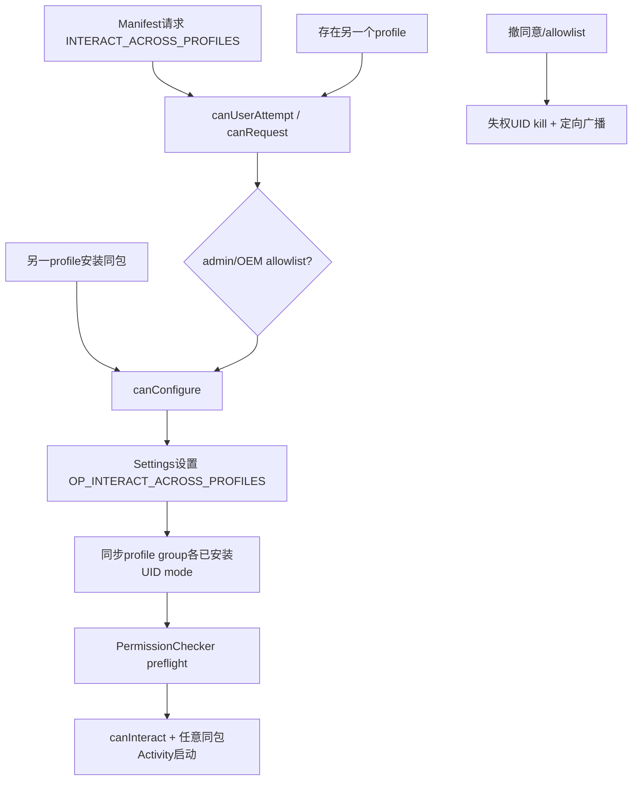
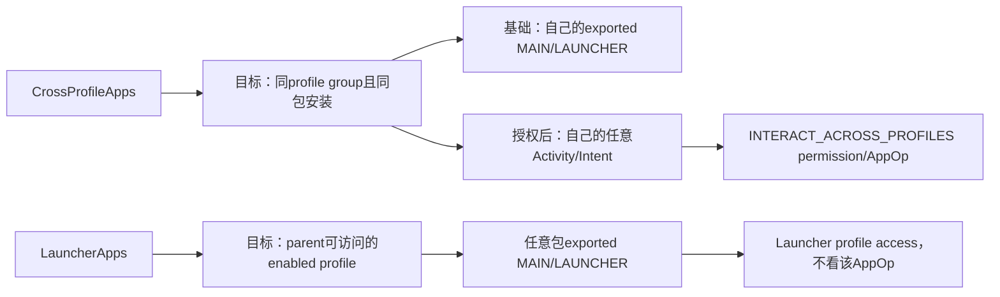

# 310 Android CrossProfileApps 与 Launcher：目标发现、同包启动、AppOps授权及资料可见性链

## 1. 本章目标

本章比较两条跨资料 Activity 启动能力：CrossProfileApps 让同一应用切换到自己在另一 profile 的实例；LauncherApps 让个人侧 Launcher 发现并启动工作资料的入口 Activity。

## 2. Android 11 边界

以 `android-11.0.0_r48` 为准，重点阅读 `CrossProfileAppsServiceImpl`、`LauncherAppsService`、DPMS cross-profile package allowlist、PermissionChecker/AppOps 与 ATMS 启动入口。

## 3. 与第309章的区别

CrossProfileIntentFilter 是“隐式用途→系统跳板→目标解析”；CrossProfileApps 是“同包明确切换实例”；LauncherApps 是“Launcher 以目标 Component 启动”。三者授权模型不同。

## 4. same package 是核心约束

CrossProfileApps 不让应用任意启动另一个包。service 同时校验 Binder callingPackage归UID、目标 Component.packageName等于 callingPackage、目标user也安装并启用同包。

## 5. 两档 CrossProfileApps 能力

基础 `startMainActivity()` 不要求 INTERACT_ACROSS_PROFILES，但只准已导出的 MAIN/LAUNCHER入口；启动同包任意 Activity或自定义Intent则需要跨资料permission/AppOp。

## 6. LauncherApps 的能力形状

LauncherApps 可启动目标资料中任意包的已导出 MAIN/LAUNCHER Activity，但调用者必须能访问该 profile；典型调用者是父用户中的 Launcher。

## 7. 目标列表不是所有用户

CrossProfileApps目标来自调用user的 enabled profile group，排除自身，并要求callingPackage在目标user可查询、已安装且 application enabled。

## 8. 许可与可达分开

即便 AppOp已允许，目标profile被禁用或目标包卸载时也不可达；反过来目标列表非空只证明基础同包main切换可尝试，不证明任意Activity权限已开。

## 9. 关键状态账

需要同时看 profile group、PackageUserState、Manifest requested permission、DPMS/OEM allowlist、OP_INTERACT_ACROSS_PROFILES mode及目标Activity exported/filter。

## 10. 两条启动主链

## 11. 服务注册与客户端

应用从 Context 获取 CrossProfileApps；客户端只包装 Binder 参数、标签/图标与设置Intent，真正安全判断均在 system_server 的 service。

## 12. callingPackage 不是凭据

每个公开入口先 `verifyCallingPackage()`，内部 AppOpsManager.checkPackage(callingUid,package)。攻击者不能把字符串伪装成另一包。

## 13. 获取目标 profiles

`getTargetUserProfiles(callingPackage)` 先验包归属并记录DevicePolicy事件，再调用 unchecked实现；“unchecked”只表示已完成Binder caller验证，不表示无规则。

## 14. enabledProfileIds

UMS返回与调用user同profile group的 enabled IDs，通常包含自身和工作/父profile；service明确跳过等于当前user的ID。

## 15. enabled 不等于 unlocked

UserInfo.isEnabled只排 FLAG_DISABLED。目标可处于locked或quiet状态；列表仍可能包含它，后续启动再由ATMS拦截凭据/quiet UI。

## 16. 目标必须装同包

对每个候选profile，PackageManagerInternal用source callingUid作为filter caller查询相同packageName；PackageInfo为null即跳过。

## 17. package enabled 门

还要求 `info.applicationInfo.enabled`。整个应用在目标user被disable时不作为目标；仅某个Activity disable则在具体启动验证阶段失败。

## 18. hidden 的效果

目标包hidden时普通PackageInfo匹配通常为空，目标profile从列表消失。CrossProfileApps不能绕过第307章的hidden策略。

## 19. suspended 的区别

target列表只看package存在/enabled，没有显式排suspended；启动时ATMS会按suspended包策略重定向管理员支持/挂起页面。

## 20. quiet mode 的区别

quiet不等FLAG_DISABLED，因此profile可能仍在列表；真正start时 `ActivityStartInterceptor.interceptQuietProfileIfNeeded()` 改为UnlaunchableAppActivity，允许用户启用后重试。

## 21. 基础 startMainActivity

客户端传 Component、targetUser、`launchMainActivity=true`。service要求target在刚计算的allowedTargetUsers中，不能指定当前group外user。

## 22. Component 必须同包

`callingPackage.equals(component.getPackageName())` 不成立直接SecurityException。这阻断应用借基础API打开目标资料中其他应用。

## 23. 为什么构造package-only Intent

service先构造 ACTION_MAIN+CATEGORY_LAUNCHER+NEW_TASK+RESET_TASK_IF_NEEDED，并只setPackage；若一开始setComponent，Intent解析会忽略action/category，无法验证目标确实是Launcher入口。

## 24. 精确匹配目标 Component

PM查询package内所有main/launcher结果，逐项找package/class都等于请求Component且activityInfo.exported；否则SecurityException。

## 25. exported 为什么必须

同一个package在不同user有不同完整UID。source实例对target实例不是same UID，非exported Activity不能被跨user外部调用。

## 26. 验证后改成显式

通过后先清package，再setComponent，确保ATMS最终启动用户指定的确切入口，而不是目标user的另一个Launcher Activity。

## 27. 基础API为何不需跨资料permission

能力被压缩为“同包、已安装启用、同profile group、导出Launcher入口”。它相当于受控profile切换按钮，不能携带任意组件能力。

## 28. start flags

launchIntent带NEW_TASK与RESET_TASK_IF_NEEDED，内部调用还传 `Intent.FLAG_ACTIVITY_NEW_TASK` 作为startFlags；目标按正常Launcher任务语义创建/复用。

## 29. 跨资料动画

基础main切换传 `ActivityOptions.makeOpenCrossProfileAppsAnimation()`，让WMS/ATMS展示profile切换动画；功能正确性不应以动画是否出现判断。

## 30. 结果返回

基础入口resultTo=null且NEW_TASK，不建立onActivityResult链。若业务需要结果，需要带callingActivity的Intent API并满足更强权限。

## 31. SystemApi Component 任意Activity

隐藏/SystemApi `startActivity(Component,target)` 传launchMain=false，可启动同包任意已导出Activity；跨user时必须通过INTERACT_ACROSS_PROFILES preflight且同group。

## 32. launchMain=false 的Intent

service直接setComponent，不要求MAIN/LAUNCHER；随后queryIntentActivities验证目标可处理且exported。

## 33. PermissionChecker preflight

使用callingPid、callingUid、callingPackage检查INTERACT_ACROSS_PROFILES；它综合Manifest permission与关联AppOp，不记录data-delivery访问。

## 34. same profile group 双门

即便PermissionChecker granted，`isSameProfileGroup(callerUserId,targetUserId)`仍必须true。跨资料permission不是任意跨Android user权限。

## 35. Cross-user大权限并未用于此旧入口

`startActivityAsUser(...launchMain=false)`这段显式检查固定INTERACT_ACROSS_PROFILES；与下面Intent API可接受INTERACT_ACROSS_USERS/FULL的helper不同。

## 36. 自定义Intent API

`startActivity(intent,target,callingActivity,options)` 要求Intent已有Component；service clone后setPackage(callingPackage)，拒绝Component指向其他包。

## 37. current user 特例

若target等于caller，允许不在target list也不要求跨资料permission；它仍只能启动同包Component并通过Intent handle验证。

## 38. cross user Intent门

target不同则必须在allowedTargetUsers，且 `hasCallerGotInteractAcrossProfilesPermission()` 为true；该helper也接受INTERACT_ACROSS_USERS或FULL。

## 39. target group为何仍受限

allowedTargetUsers本身只由enabledProfileIds产生，所以即便caller持跨用户permission，此API的target仍限同profile group；大权限只替代具体profiles permission检查。

## 40. Intent解析验证

service以目标user和source callingUid查询clone后的显式Intent；结果为空就抛“Activity cannot handle intent”。type、action、category、data仍会影响组件匹配。

## 41. exported 在哪里检查

Intent版helper没显式检查exported，但随后ATMS以source calling identity执行常规组件安全门；source/target UID不同，因此非exported最终仍不能启动。

## 42. callingActivity token

非null时传其Activity token为resultTo，影响目标任务归属和结果返回；null时客户端文档说明总以新task启动且无结果。

## 43. options 不可信

调用者可传ActivityOptions Bundle，但ATMS仍会清理/校验远端动画、display、launch bounds等受权限保护字段；CrossProfileApps不把options变成系统特权。

## 44. 同包不等于同数据

两个profile中的包名/签名/代码通常相同，但UID和data目录不同。切换Activity不会共享SharedPreferences、数据库或内存对象。

## 45. URI/结果数据

Intent API若携带content URI，仍需grant flags和Provider政策；跨资料同包也不是same UID，不能省略UriGrant。

## 46. canRequestInteractAcrossProfiles

此查询只要求enabled profile至少两个、包不是profile group任一PO、Manifest请求INTERACT_ACROSS_PROFILES。它不要求包已装到另一profile或已在admin/OEM allowlist。

## 47. 为什么PO不能请求用户同意

Profile Owner本身已有管理职责，不应走普通应用的用户consent AppOp页面来扩展能力；其跨profile操作使用专门DPM/系统API。

## 48. requested permission 查询

service通过PMS `getAppOpPermissionPackages(opToPermission(OP_INTERACT_ACROSS_PROFILES))` 判断包是否声明了该AppOp permission，而非只看当前grant。

## 49. createRequest Intent

客户端先调用canRequest，false直接SecurityException；true则返回ACTION_MANAGE_CROSS_PROFILE_ACCESS与 `package:callingPackage`，由Settings呈现用户决定。

## 50. 用户同意状态机

## 51. canConfigure 比 canRequest 更严格

它要求用户可尝试、另一profile安装包、Manifest请求permission、且包在admin所有PO合并allowlist或OEM默认allowlist。

## 52. admin allowlist 来源

PO 调 `setCrossProfilePackages(admin,Set)`，DPMS将完整列表保存在该ActiveAdmin `mCrossProfilePackages`，后写覆盖前次；不是增量追加。

## 53. profile group 合并

`getAllCrossProfilePackages()`收集当前profile group各PO的列表，再加resource `cross_profile_apps` 与vendor数组默认包；任一来源命中即可。

## 54. allowlist 不直接授予

它只让Settings有资格配置用户consent AppOp。包在列表中但用户未同意/OP仍default或denied，任意Activity能力仍不可用。

## 55. 从allowlist移除

DPMS保存新列表后调用CrossProfileApps.reset，对previous有但new无的包检查是否仍可配置；若不能，AppOp重置到default。

## 56. OEM默认例外

若包仍在default allowlist，canConfigure仍true，reset不会清其AppOp；admin不能通过自己列表移除OEM明确保留的配置资格。

## 57. platform-signed自动授权

平台签名包可由signature permission自动获得能力；若它不在OEM default allowlist，用户不应看到可配置项，避免对不可真正控制的权限展示开关。

## 58. AppOp按profile group同步

设置OP时枚举profileIds(enabledOnly=false)，对每个已安装同包的profile UID设置相同mode。不能只改当前user，否则两实例对能力理解不一致。

## 59. 未安装profile跳过

某profile没有包就不设置mode。之后安装时还需安装/策略收敛路径确保正确状态，不能从旧循环推断未来UID已有AppOp。

## 60. MODE_ALLOWED 前置复核

若请求allowed但 `canConfigureInteractAcrossProfiles()` false，service记录错误并return，防止Settings竞态下把不合格包打开。

## 61. 修改AppOp的权限

调用setter需INTERACT_ACROSS_USERS/FULL加MANAGE_APP_OPS_MODES或CONFIGURE_INTERACT_ACROSS_PROFILES；普通应用不能给自己直接setMode。

## 62. CONFIGURE权限的窄代理

caller只有CONFIGURE时，service clear identity再调用AppOps setMode，允许专门Settings组件完成这一项，而不授予广泛AppOps管理。

## 63. 先记 hadPermission

改mode前用PermissionChecker判断UID是否能跨profile；改后再查。若从有到无，先kill UID，避免旧进程继续依赖缓存权限。

## 64. kill不是撤销全部状态

kill只终止对应profile UID进程；磁盘数据、任务记录和其他profile UID按各自mode处理。真正权威是permission+AppOp新状态。

## 65. 变化广播

每个安装profile都会收到定向 `ACTION_CAN_INTERACT_ACROSS_PROFILES_CHANGED`，应用应重新调用canInteract/canRequest，不把广播当allowed/denied布尔值。

## 66. android:crossProfile 属性

Manifest声明crossProfile=true时，广播允许include-background/foreground，可送manifest receiver；否则加REGISTERED_ONLY，只通知运行中动态receiver。

## 67. 广播并非所有可达变化都发

公开文档明确profile关闭/删除、包卸载等实践可达变化不触发此广播。它主要表示用户/admin/OEM consent相关permission变化。

## 68. canInteractAcrossProfiles

先要求target list非空，再要求hasInteractAcrossProfilesPermission。故AppOp允许但另一profile disabled/包缺失仍返回false。

## 69. 大跨用户权限捷径

helper若UID持INTERACT_ACROSS_USERS或FULL直接true，不再走profiles permission AppOp；这类system级caller能力来源不同。

## 70. signature|appop 组合

Manifest将INTERACT_ACROSS_PROFILES声明为signature|appop。PermissionChecker先走app-op permission分支：raw mode为ALLOWED/FOREGROUND直接GRANTED；MODE_DEFAULT才回退 `context.checkPermission()` 的signature grant。因此平台签名包可凭默认+permission，普通获准包可由用户配置的ALLOWED mode获得结论。

## 71. target list每次重算

getTargetUserProfiles不持久缓存到客户端；标签/图标的verifyCanAccessUser也会重新取列表。资料或包状态变化可立即使旧UserHandle失效。

## 72. profile switching label

目标是managed profile返回工作资料label，否则返回user owner label。它只用于UI语义，不泄露profile名称或企业组织名。

## 73. profile switching icon

managed目标使用corp badge，父用户使用默认系统user icon；调用前同样确认target仍在可访问列表。

## 74. LauncherApps 的视角

LauncherApps不是“同包切换”；它提供Launcher对profile group应用入口、包变化、快捷方式和安装session的统一观察与启动。

## 75. Launcher callingPackage验证

LauncherAppsService每个入口同样核对callingPackage UID，防止伪造Launcher包名获取其缓存/回调语义。

## 76. canAccessProfile 同user

target等于calling user直接true；持INTERACT_ACROSS_USERS_FULL也可访问。普通profile group路径在后面处理。

## 77. profile不能反向扮Launcher

若calling user自身是profile，访问另一个profile会记录warning并返回false，不抛；典型只允许parent/full user中的Launcher查看工作profile，而非工作应用扫描个人侧。

## 78. parent访问profile

调用user不是profile时，UMS `isProfileAccessible(caller,target,throw=true)`要求target存在、enabled且profileGroupId相同；unrelated会SecurityException。

## 79. disabled与quiet再区分

isProfileAccessible只看UserInfo.isEnabled，不直接排quiet；Launcher UI另根据quiet mode显示灰态/启用入口，实际启动仍会被ATMS quiet拦截。

## 80. getActivityList

Launcher可查询目标profile中MAIN/LAUNCHER Activity并包装为LauncherActivityInfo，携userHandle、label、icon、firstInstallTime等展示信息。

## 81. 包可见性

PMS查询仍接收launcher callingUid作为filter caller；能访问profile不等于绕过所有package visibility/instant app过滤。

## 82. Launcher startMainActivity

客户端传Component、目标user、图标sourceBounds与options；service先canAccessProfile，不可访问同group profile时可静默return。

## 83. package-only验证技巧

与CrossProfileApps相同，先构造MAIN+LAUNCHER并setPackage，查询候选后逐项匹配请求Component，避免显式Intent让category验证失效。

## 84. Launcher可启动其他包

这里没有要求component.package==callingPackage；Launcher职责就是打开目标profile任意可展示应用，但必须是查询到的Launcher入口。

## 85. exported 门

匹配Component若 `activityInfo.exported=false`，立即SecurityException。Launcher和目标应用跨UID，非exported front door本就是应用配置错误。

## 86. 验证后显式启动

service清package、setComponent，保留NEW_TASK、RESET_TASK_IF_NEEDED、sourceBounds和opts，交ATMS目标user启动。

## 87. LauncherApps 不使用CrossProfileApps AppOp

它靠Launcher profile access模型与MAIN/LAUNCHER限制，不要求目标包或Launcher通过OP_INTERACT_ACROSS_PROFILES；两套授权不可互相推断。

## 88. Launcher详情页

`showAppDetailsAsUser()`也先canAccessProfile，再以 `ACTION_APPLICATION_DETAILS_SETTINGS package:` 在目标user启动；这不等于应用获得跨profile设置权限。

## 89. session details

PackageInstaller session callback/详情按enabled profiles聚合，但启动market details仍走profile access；Launcher可展示正在安装的工作应用。

## 90. 两条能力对照

## 91. CrossProfileApps不能代替Launcher

它无法列出或启动其他包；即使持permission，service仍要求Component属于callingPackage。企业应用选择器应使用合适系统API而非试图绕过。

## 92. LauncherApps不能代替任意IPC

它只启动入口Activity/详情并观察Launcher数据，不给Launcher直接访问目标应用Provider、Service或私有数据。

## 93. 启动调用身份

两者都把原caller的IApplicationThread、callingPackage、featureId传ATMS；service clear identity只用于PMS查询，最终组件permission等仍按原调用者裁决。

## 94. same package跨user仍非same UID

`UserHandle.getUid(userId,appId)`高位不同。目标nonexported、URI权限、AppOps、runtime permission均按目标/源各自UID处理。

## 95. 目标未解锁

查询用MATCH_DIRECT_BOOT_AWARE|UNAWARE可找到两类Activity，但实际CE依赖与启动生命周期由UserController/ATMS处理；“出现在列表”不证明数据可用。

## 96. 包版本差异

同package在两个profile通常共享code版本，但per-user enable/hidden/component state不同。启动验证总在目标user重新查询，不复用源侧ActivityInfo。

## 97. AppOp MODE_DEFAULT

MODE_DEFAULT不是直接拒绝：PermissionChecker会回退基础signature permission，平台签名包仍可能GRANTED；普通包基础permission不成立则HARD_DENIED。业务应调用canInteract，而不是只比较mode字符串。

## 98. allowlist变化的非原子性

DPMS先保存ActiveAdmin新列表，再调用reset AppOps；中间异常可能短暂出现policy已变而旧mode尚存。重复reset与运行时canConfigure检查负责收敛。

## 99. AppOp设置的多UID时序

profile group逐个setMode、可能kill并broadcast，不是跨所有profile的原子事务。观察者可短暂看到一侧更新、一侧未更新。

## 100. 新profile创建

旧目标列表和UID mode不能自动证明新profile状态；ManagedProvisioning/permission policy需安装同包并重新协调AppOp。应用每次使用前重查canInteract。

## 101. profile删除

target list立即因enabledProfileIds变化缩小；AppOps旧UID状态随user/package清理。ACTION_CAN_INTERACT广播不保证因删除而发。

## 102. quiet profile UX

Launcher通常展示带badge的灰色图标/工作tab关闭页；CrossProfileApps调用可能进入UnlaunchableAppActivity。两者都不应把quiet当SecurityException固定处理。

## 103. suspended profile app UX

目标包仍可能在target list/Launcher列表，但启动被ActivityStartInterceptor替换为管理员支持或挂起说明；查询成功与Activity真正onCreate分离。

## 104. 诊断第一层：目标发现

核对enabledProfileIds、profileGroupId、package在目标安装/hidden/enabled、callingUid包可见性；不要先看AppOp。

## 105. 诊断第二层：API档位

确认调用的是基础main、SystemApi Component还是Intent版；三者对MAIN/LAUNCHER、exported、permission、resultTo和options要求不同。

## 106. 诊断第三层：consent状态

分别看Manifest requested、PO身份、admin/OEM allowlist、other-profile install、各profile UID AppOp mode和PermissionChecker结论。

## 107. 诊断第四层：目标Activity

在target user查询Component enabled/exported/filter/directBoot状态；不能拿source user的PackageManager结果证明目标可启动。

## 108. 诊断第五层：ATMS收敛

检查quiet/suspended/locked-profile拦截、background start例外、task/options、UriGrant和目标进程启动；service返回不等onCreate。

## 109. 返回/异常差异

CrossProfileApps非法target或组件通常SecurityException；LauncherApps对同group但不可访问profile的某些入口只return，unrelated则可抛。调用者需按具体API处理。

## 110. 完成点清单

target出现、用户可配置、AppOp同步、PermissionChecker granted、目标Activity验证、ATMS接受、目标onCreate，是七个不同完成点。

## 111. 本章复读检查表

每次跨资料启动依次问：谁调用、哪条API、目标是否同group、同包还是Launcher任意包、main还是任意Activity、exported、AppOp、quiet/suspended、URI与结果链。

## 112. macOS只读练习一：比较三个CrossProfileApps入口

阅读service两个start方法，为startMainActivity、Component任意Activity、Intent+callingActivity列出target list、同包、exported、MAIN/LAUNCHER、permission、flags、resultTo与animation。

## 113. macOS只读练习二：手算consent

设包A声明permission、两profile均安装、非PO；依次模拟不在allowlist、在admin list但OP default、OP allowed、移出admin但仍在OEM default，写canRequest/canConfigure/canInteract结果。

## 114. macOS只读练习三：追一次撤权

阅读 `setInteractAcrossProfilesAppOpForProfileOrThrow()`，标出旧permission快照、setMode、复查、kill UID、定向broadcast与多profile循环，说明为何不是原子提交。

## 115. macOS只读练习四：对比LauncherApps

阅读LauncherAppsService `canAccessProfile()` 与 `startActivityAsUser()`，模拟parent Launcher、managed-profile app、持FULL权限system app三种caller，写可访问目标和MAIN/exported验证。

## 116. 复读修正一：基础main切换不需AppOp

只要同包在enabled目标profile安装、入口exported且声明MAIN/LAUNCHER，startMainActivity可用；canInteractAcrossProfiles主要约束任意同包Activity/Intent能力。

## 117. 复读修正二：quiet不等target禁用

getEnabledProfileIds与isProfileAccessible依据FLAG_DISABLED，不自动排quiet；候选仍可存在，实际启动由ATMS quiet拦截和UI引导收敛。

## 118. 复读修正三：same package不等same UID

跨user实例UID不同，所以exported、组件permission、URI grant仍必须成立；“自己启动自己”只是包名约束，不是进程内调用。

## 119. 复读修正四：admin allowlist不直接授权

setCrossProfilePackages只赋予用户配置资格并在移除时reset旧AppOp；当前能力应以target list加PermissionChecker/canInteract为准。

## 120. 本章结论与下一章

CrossProfileApps用“同包+分档能力+用户AppOp同意”安全切换应用实例，LauncherApps用“父Launcher+入口Activity”承载工作图标。下一章进入企业权限策略，追DPC如何设置runtime permission policy、grant state与用户选择边界。
