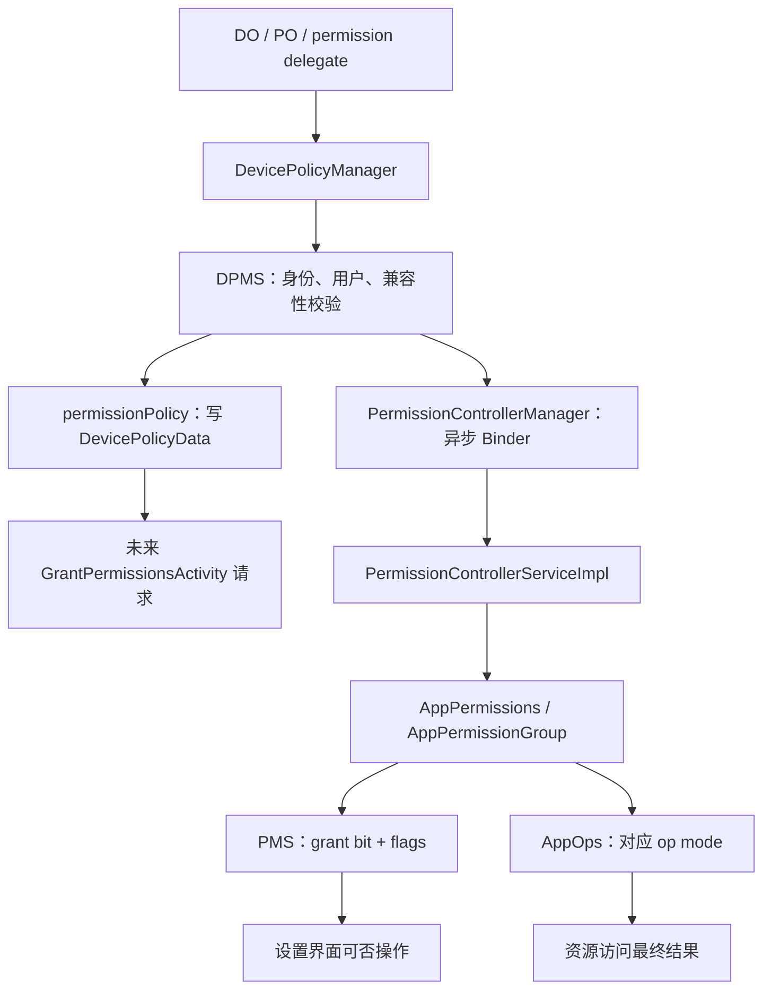
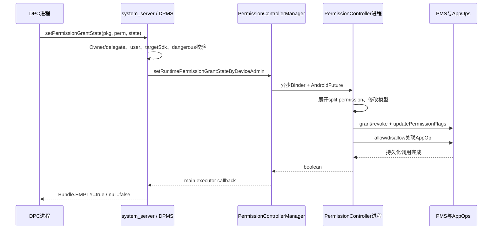
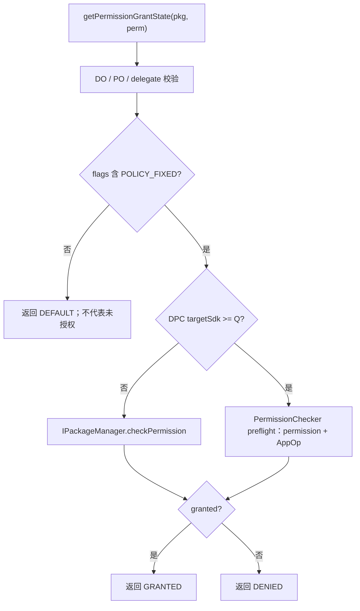

# 311 Android 企业 Runtime Permission：默认请求策略、Grant State、Policy Fixed 与 AppOps 收敛链

## 1. 本章目标

本章从 DPC 调用 `DevicePolicyManager` 开始，追踪 Android 11 企业运行时权限管理的两套能力：面向未来权限请求的默认 `permissionPolicy`，以及面向“应用包名 + 单个危险权限”的 `permissionGrantState`。

## 2. Android 11 版本边界

源码以 `android-11.0.0_r48` 为准，重点阅读 `DevicePolicyManager`、`DevicePolicyManagerService`、`PermissionControllerManager`、`PermissionControllerServiceImpl`、`GrantPermissionsActivity` 与 `AppPermissionGroup`。

## 3. 先拆成两根旋钮

`setPermissionPolicy()` 决定应用下一次请求尚未决定的运行时权限时，是弹窗、自动授予还是自动拒绝；`setPermissionGrantState()` 则立即管理一个具体包的一个具体权限。两者不能混为“批量授权”。

## 4. 三类状态不要放进一张表

至少有四本账：DPMS 保存的默认策略、PMS 保存的 runtime grant bit、PMS 保存的 permission flags、AppOps 保存的 operation mode。界面能否点击只是这些账共同投影出的结果。

## 5. 默认策略的三个值

`PERMISSION_POLICY_PROMPT=0`、`AUTO_GRANT=1`、`AUTO_DENY=2`。默认值是 PROMPT；它只表示新请求走普通用户交互，并不把既有策略固定权限全部恢复成默认。

## 6. 单权限状态的三个值

`PERMISSION_GRANT_STATE_DEFAULT=0`、`GRANTED=1`、`DENIED=2`。DEFAULT 的核心含义是“不再由设备策略固定”，不是“恢复成未授权”。

## 7. 谁可以调用

DPMS 用 `enforceCanManageScope()` 允许 Device Owner、对应用户的 Profile Owner，或持有 `DELEGATION_PERMISSION_GRANT` 的 delegate。普通应用即使拥有目标权限，也不能成为企业权限管理员。

## 8. delegate 怎样表明身份

Owner 传非空 `ComponentName admin`；delegate 传 `admin=null` 并提供 `callerPackage`。DPMS 不信任字符串，会将 Binder UID、用户、包归属和该用户的 delegation map 一起核对。

## 9. 作用域按用户隔离

DPMS 取 `UserHandle.getCallingUserId()` 或 Binder calling user，策略保存在该用户的 `DevicePolicyData`。工作资料 PO 管的是资料用户里的包权限，不等于可以顺手修改父用户实例。

## 10. 两条总链



## 11. 客户端不是执行者

`DevicePolicyManager` 是应用进程里的代理。它把 admin、调用包、目标包、权限名和状态送进 system_server；真正授予/拒绝最终发生在独立的 PermissionController 包中。

## 12. setPermissionPolicy 的入口

DPMS 取得 calling user，在锁内做管理范围校验，更新 `DevicePolicyData.mPermissionPolicy`，值变化时调用 `saveSettingsLocked(userId)`，之后记录 DevicePolicy event。

## 13. 为什么值没变不写盘

默认策略是纯状态设置，幂等调用不需要重复写 `device_policies.xml`。不过事件日志仍在锁外记录本次 API 调用，因此“无磁盘变化”不等于“没有审计事件”。

## 14. DPMS 是否校验 policy 枚举

r48 这段 DPMS setter 没有显式列出三个合法值；公开 API 依赖注解与可信管理客户端合同。读源码时不要把 `@IntDef` 误当运行时检查，它主要服务编译器和工具。

## 15. 策略怎样持久化

只有非 PROMPT 值才作为根 `<policies>` 的 `permission-policy` 属性写入用户的 device policy XML；读取时若属性存在就 `Integer.parseInt()` 恢复，否则字段默认保持 0。

## 16. 为什么省略 PROMPT

PROMPT 与 Java int 默认值相同，省略可减少 XML；也使旧版本没有此属性时自然得到普通提示行为。这是“缺省即默认”，不是另有一份默认文件。

## 17. getPermissionPolicy 很简单

它按 calling user 取得 `DevicePolicyData` 并返回 `mPermissionPolicy`。这里没有去遍历所有 ActiveAdmin，因为该值已经是该用户最终采用的单值策略。

## 18. admin 参数没有参与读取鉴权

r48 的 service `getPermissionPolicy(ComponentName admin)` 没用 `admin` 做 Owner 校验。PermissionController 的授权界面也以 `getPermissionPolicy(null)` 读取；因此该 getter 是系统授权流程的策略查询接口。

## 19. 默认策略何时被消费

它不是 setter 时扫描所有安装包，而是在 `GrantPermissionsActivity` 处理一次权限请求时读取。故其语义是“未来请求的默认答复”，而非“立刻遍历所有危险权限”。

## 20. 已经决定的权限不受影响

三个常量的注释都强调 already granted or denied 不受影响。如果某权限已经 policy-fixed、system-fixed 或处于其他固定状态，授权界面会先跳过，默认策略不会覆盖它。

## 21. 请求界面的前置过滤

`addRequestedPermissions()` 先检查 group 是否允许授予、权限是否受 restricted 约束、是否 user-fixed、是否 policy-fixed；只有尚可决定的请求才进入 default policy switch。

## 22. 默认策略的核心源码

```java
switch (getPermissionPolicy()) {
    case PERMISSION_POLICY_AUTO_GRANT:
        group.grantRuntimePermissions(false, false, filter);
        group.setPolicyFixed(filter);
        break;
    case PERMISSION_POLICY_AUTO_DENY:
        group.setPolicyFixed(filter);
        break;
    default:
        // 已有 group grant 等普通流程
}
```

自动授予会同时 grant 并 fixed；自动拒绝对尚未授予的新请求设置 fixed，避免用户随后从该请求 UI 改写管理员决定。

## 23. AUTO_DENY 为什么没显式 revoke

这里处理的是本次尚待决定的请求，目标权限本来就未获授；因此设置 policy-fixed 并标记请求 denied 已足够。若要撤销一个已授予权限，应使用具体的 `setPermissionGrantState(...DENIED)`。

## 24. AUTO_GRANT 的通知

授权界面调用 `AutoGrantPermissionsNotifier.onPermissionAutoGranted()`，之后可向用户说明权限由管理员自动授予。企业自动授权并非必须完全不可见。

## 25. PROMPT 也可能不弹窗

default 分支发现该 permission group 已经整体满足运行时授权时，会把本权限记为 allowed 并跳过交互。因此 PROMPT 是允许正常流程，不承诺每次都显示对话框。

## 26. targetSdk M 边界

默认策略文档限定 targetSdk M 及以后应用，因为这些应用使用真正的运行时 grant model。pre-M 应用安装时权限位通常保持 granted，用户/管理员拒绝主要借 AppOps 兼容表达。

## 27. 应用更新的新权限

文档明确说明默认策略也作用于应用更新后新声明的权限；原因不是更新时 DPMS 预授予，而是应用后来请求这些新权限时仍会进入同一授权界面策略判断。

## 28. 默认策略不是 permission group 模板

DPMS 只保存一个 per-user int，不保存“相机自动拒绝、位置自动授予”这种分类规则。细粒度差异必须逐包逐权限调用 grant-state API。

## 29. 默认策略也不是角色默认授权

系统为 Dialer、SMS、PermissionController 等角色/默认处理器授予权限，走 default permission grant/role 机制。企业默认请求策略只在应用主动请求运行时权限时介入。

## 30. 与 restricted permission 的关系

硬限制/软限制、allowlist、system-fixed 等检查先于 default policy。AUTO_GRANT 不是万能绕过器；若 `AppPermissionGroup.isGrantingAllowed()` 为 false，请求会被忽略而不是强行成功。

## 31. setPermissionGrantState 的调用形状

DPC 指定目标 package、完整 permission name 和三个 state 之一。公开 Java API 返回 boolean，但内部 service 是异步 callback；这一差异决定了超时与“已提交”概念。

## 32. public API 为什么看似同步

客户端建立 `CompletableFuture<Boolean>`，RemoteCallback 收到非 null Bundle 时完成 true；同时在 BackgroundThread 安排 20 秒超时把 future 完成 false，然后当前调用线程 `result.get()` 等待。

## 33. 不要在主线程滥用

虽然 API 表面返回 boolean，它可能等待跨进程 PermissionController 工作或最长 20 秒。DPC 应在自己的后台执行上下文调用，并为 false 留出查询、重试或告警路径。

## 34. 20 秒不是事务回滚

客户端超时只让本次 future 返回 false，不能取消已送达 PermissionController 的操作。极端情况下调用方先看到 false，底层随后仍完成；应再调用 getter/权限检查确认最终状态。

## 35. service 首先要求 callback 非空

DPMS `Objects.requireNonNull(callback)`，避免底层完成后无结果通道。其他字符串的非空检查主要由 manager/service层和后续包、权限查找完成。

## 36. DPMS 管理范围校验

锁内执行 `enforceCanManageScope(admin, callerPackage, USES_POLICY_PROFILE_OWNER, DELEGATION_PERMISSION_GRANT)`，把 Owner 老策略声明与现代 delegation scope 统一到一个入口。

## 37. 为什么随后 clearCallingIdentity

目标包查询、权限类型查询和绑定 PermissionController 应以 system_server 身份执行，而不是继承 DPC UID。DPMS 在 finally 中恢复身份，防止 Binder identity 泄漏到后续调用。

## 38. DPC targetSdk 的兼容分支

DPMS 先查询 callerPackage 的 targetSdk 是否至少 Q。这个版本判断针对“管理应用的行为预期”，不是目标应用是否支持运行时权限。

## 39. 旧 DPC 管 pre-M 目标

若 DPC targetSdk 小于 Q 且目标包 targetSdk 小于 M，DPMS 直接用 null callback 结果表示失败。旧管理应用历史上假设自己不能控制 legacy app，r48 保留该合同。

## 40. 新 DPC 管 pre-M 目标

targetSdk 至少 Q 的 DPC 可以管理所有目标应用。对 pre-M 目标执行 DENIED 时，Manifest permission bit可能仍保持 granted，但对应 AppOp 被设为 ignored，形成兼容拒绝。

## 41. permission 类型检查

DPMS 用 PackageManager 读取 `PermissionInfo`，只有 protection base 等于 `PROTECTION_DANGEROUS` 才认作 runtime permission。普通、signature 或不存在的 permission 不进入企业 grant-state 执行。

## 42. 不存在 permission 的异常

`getPermissionInfo()` 的 `NameNotFoundException` 被包装为 RemoteException，说明服务无法判断该名称是否运行时权限。它与“存在但不是 dangerous”返回 false 是两种故障。

## 43. 非 runtime permission 的结果

若权限存在但不是 dangerous，DPMS `callback.sendResult(null)` 后返回；公开 API 因 Bundle 为 null 得到 false。不会静默把 signature permission 变成企业可授予权限。

## 44. grantState 枚举门

DPMS 只在 GRANTED、DENIED、DEFAULT 三个值之一时调用 PermissionController。上游 `PermissionControllerManager` 也用 `checkArgument` 校验，形成多层合同。

## 45. DPMS 不直接改权限位

Android 11 将用户权限决策模型放在 PermissionController。DPMS 只做设备管理身份、版本和危险权限判断，再调用目标 user 对应的 `PermissionControllerManager`。

## 46. 具体状态设置时序



## 47. Remote service 的异步桥

Manager 向远端 service 发送 `AndroidFuture<Boolean>`，远端完成后在指定 executor 调用 `Consumer<Boolean>`。错误路径被转换成 `callback.accept(false)`，不把所有内部异常直接抛回 DPC。

## 48. DPMS callback 在主执行器

DPMS 传 `mContext.getMainExecutor()`，因此 PermissionController 完成通知回到 system_server 主执行器。耗时的包权限变更已在 PermissionController 的 `AsyncTask.execute()` 中进行。

## 49. 为什么不应在 DPMS 锁内做重活

入口虽然在 synchronized 块中发起异步调用，但真正模型变更不在此同步执行。回调稍后运行；这样避免 Binder 线程持 DPMS 全局锁跨进程等待权限写盘。

## 50. PermissionController 再查调用包

实现先读取 `callerPackageName` 的 PackageInfo。找不到 DPC/delegate 包则返回 false；该 PackageInfo 的 targetSdk 还用于 split permission 展开。

## 51. 目标包必须存在

随后读取目标 PackageInfo；找不到目标包同样返回 false。管理能力不能为尚未安装的包预埋某个 runtime grant state，这一点与某些 PMS per-user预设不同。

## 52. split permission 展开

实现将输入权限放入列表，根据 DPC 的 targetSdk 与系统 split permission 表追加新权限。旧 DPC 对历史权限的一个决定可以覆盖兼容拆分出的新权限。

## 53. 为什么按 DPC targetSdk 展开

兼容合同面向管理应用编译时所理解的权限模型。它决定旧名称是否隐含新权限，而非简单以目标业务应用 targetSdk 作为唯一尺度。

## 54. AppPermissions 是延迟修改模型

`new AppPermissions(..., false, true, null)` 中 delayChanges 为 true，使若干 group/permission 的内存变更先积累，最后统一 `app.persistChanges()`，减少半途持久化。

## 55. 找不到 group 怎么办

每个展开权限都通过 `app.getGroupForPermission()` 寻找目标组。group 不存在就 continue；函数最后仍可能返回 true，因此 true 代表流程完成，不严格等于每个展开项都产生变化。

## 56. system-fixed 优先级更高

若 group 为 system-fixed，企业策略跳过。系统固定是更高层保护，DPC 的 policy-fixed 不能覆盖它。

## 57. 找不到 Permission 对象

group存在但具体 `Permission` 为 null 时也跳过。读返回值时要记住实现并未统计“实际成功修改了多少个权限”。

## 58. GRANTED 的三步

先 `perm.setPolicyFixed(true)`，再 `group.grantRuntimePermissions(false,false,{perm})`，最后记录自动授权通知。持久化时会把 grant bit、flags 和 AppOp 收敛到可访问状态。

## 59. 为什么先设 policy-fixed

模型在一次延迟事务里积累最终值，先后顺序不是对外可见的瞬时安全窗。最终 `persistChanges()` 才把状态写到系统服务。

## 60. DENIED 的三步

先设置 policy-fixed，再调用 `revokeRuntimePermissions(false,{perm})`；runtime-aware 应用会清 grant bit并禁止关联 AppOp，legacy 应用主要通过 AppOp兼容拒绝。

## 61. DEFAULT 只做一件事

实现只有 `perm.setPolicyFixed(false)`，不调用 grant 或 revoke。这正是文档“retains the previous grant, if any”的源码落点。

## 62. DEFAULT 后为何 UI 可管理

用户设置页发现 `FLAG_PERMISSION_POLICY_FIXED` 清除后，不再把开关锁定为管理员控制；当前开或关仍保留，下一次用户操作才改变 grant/AppOp。

## 63. DEFAULT 不是 PROMPT

grant state DEFAULT 是某个权限解除固定；permission policy PROMPT 是未来请求走普通流程。若用户权限当前已授予，解除固定并不会让应用再次弹请求框。

## 64. 先 DEFAULT 再 AUTO_DENY

解除一个已授予权限的 policy-fixed 后，既有 grant仍保留；把全局默认策略设 AUTO_DENY 也只影响未来未决定请求，不会自动撤销它。

## 65. 先 DENIED 再 PROMPT

把默认策略改 PROMPT 不会清单权限上的 policy-fixed。必须对该包权限调用 grant state DEFAULT，用户才重新获得界面控制权。

## 66. permission group 的连带 UI

公开文档提示：固定一个权限后，受影响 group 中其他权限在 UI 里也可能无法由用户管理，其 grant state保持当前值。因此建议 DPC 对相关组内权限形成一致策略。

## 67. 连带不可操作不等于连带改值

例如管理员固定组内一个权限，其他权限可能被 UI 一并锁住，但实现的 filter只更新目标权限。不要把“整组开关锁住”误读成“整组全部授予/拒绝”。

## 68. 前台与后台权限

位置等组可能拆为 foreground/background group，且后台权限依赖前台权限。逐权限调用时必须按依赖顺序设计；某个状态调用返回 true不保证违反依赖的组合最终可用。

## 69. restricted 与 fixed 的优先级

hard/soft restricted、system-fixed、policy-fixed、user-fixed 是不同 flag与规则。企业 grant请求仍可能被 restriction/allowlist机制阻止，不能只查 policy-fixed 判断失败原因。

## 70. AppOp 为什么必须同步

很多 dangerous permission 有对应 AppOp。只改 Manifest grant bit可能仍被 AppOps 拒绝；只放开 AppOp又可能没有权限位。PermissionController 模型同时维护两者。

## 71. runtime-aware 授予顺序

`grantRuntimePermissions()` 对 target M+应用先确保关联 AppOp allowed，再把 permission granted设为 true，并清理不合适的 user-fixed/user-set 标记。

## 72. runtime-aware 拒绝顺序

`revokeRuntimePermissions()` 清 grant bit，按非用户操作更新 user flags，并将关联 AppOp设为不允许。持久化阶段根据变化决定是否需要杀 UID。

## 73. legacy app 的兼容表达

pre-M应用的权限位通常不能按现代模型撤销；PermissionController 保留 granted，改关联 AppOp并设置 `REVOKED_COMPAT`。因此 `checkPermission()` 可能 granted，而真实访问仍被拒。

## 74. 持久化 flags 的源码形状

```java
int flags = (permission.isUserSet() ? FLAG_PERMISSION_USER_SET : 0)
        | (permission.isUserFixed() ? FLAG_PERMISSION_USER_FIXED : 0)
        | (permission.isRevokedCompat() ? FLAG_PERMISSION_REVOKED_COMPAT : 0)
        | (permission.isPolicyFixed() ? FLAG_PERMISSION_POLICY_FIXED : 0);
packageManager.updatePermissionFlags(permissionName, packageName,
        /* mask 包含上述 flags、ONE_TIME、AUTO_REVOKED 等 */, flags, user);
```

企业决定不仅写一个 policy flag，还会与一次性授权、自动撤权等状态发生收敛。

## 75. policy-fixed 的常量

`PackageManager.FLAG_PERMISSION_POLICY_FIXED = 1 << 2`。它保存在 PMS 的 per-user runtime permission state 中，而不是 DPMS 的 ActiveAdmin XML 里逐项列出。

## 76. 为什么 DPMS 不保存逐项 grant state

具体权限值和 flags由 PMS/PermissionController管理，DPMS getter实时读取它们。这样包升级、权限拆分、AppOps与用户界面共享同一权限权威数据，而不是维护重复表。

## 77. 默认策略与逐项状态持久化位置

默认策略写 device policy XML；逐项 grant与flags写每用户 runtime-permissions持久状态，AppOp又有自己的状态存储。诊断备份时只看一个文件一定不完整。

## 78. persistChanges 的 kill 参数

实现传入 `grantState==DENIED || !callerPackageName.equals(packageName)` 作为 AppOps变化可否触发 kill 的条件。delegate/DPC管理其他包时通常允许必要的 UID重启以收敛访问。

## 79. DPC 管自己时的细节

若 callerPackage与target package相同且不是 DENIED，mayKill为 false，避免授权自己的过程中因 AppOps变化杀掉正在调用的管理进程；调用方需要理解状态生效与既有进程资源之间的边界。

## 80. revoke 后为什么可能杀进程

进程可能已持有相机、位置等资源或基于旧 AppOp建立状态。AppOps从 allowed变拒绝时杀 UID可让资源与缓存重新按新策略建立，不应把 kill 当作 API失败。

## 81. 自动授权通知不等审批 UI

GRANTED路径的 notifier用于透明度提示，不是让用户批准。policy-fixed仍意味着普通用户不能从权限设置界面反向撤销管理员决定。

## 82. onSet 最终 boolean 的局限

只要调用包和目标包存在、循环未遇非法枚举，函数通常返回 true；group/permission不存在或system-fixed会被跳过。故 boolean更像“请求被处理”，不是严格的后置条件证明。

## 83. Q+ DPC 的失败传播

DPMS 回调中，若管理应用 targetSdk至少Q且 PermissionController返回 false，就向客户端发 null，公开 API返回 false；现代DPC能看到更严格的失败结果。

## 84. pre-Q DPC 的兼容成功

若旧 DPC走到了 PermissionController，即使 `permissionWasSet` 为 false，DPMS仍记录事件并返回 `Bundle.EMPTY`。这是为历史客户端保留较宽松的成功语义。

## 85. 事件日志何时写

逐项 grant state事件在异步回调成功/兼容成功分支记录，包含 callerPackage、permission、grantState和是否delegate；入口校验失败不会伪造成功事件。

## 86. 安全异常怎样返回

DPMS 捕获执行期间的 `SecurityException`，记录错误并 callback null。公开客户端通常得到 false，而不是所有安全失败都作为 SecurityException穿透。

## 87. getter 不是简单 checkPermission

`getPermissionGrantState()` 先确认调用方管理范围，再在 clean identity 下综合 policy-fixed与真实访问判断；没有 policy-fixed时一律返回 DEFAULT。

## 88. DEFAULT 不说明当前 grant

文档明确：getter 返回 DEFAULT只表示设备策略没固定它，不能据此判断权限当前是否授予。要判断业务权限还需 `PackageManager.checkPermission`或更完整的 PermissionChecker。

## 89. GRANTED/DENIED 才有策略含义

只有 flags含 POLICY_FIXED时，getter才把当前有效权限结果映射为 GRANTED或DENIED。策略控制权和访问结果二者缺一不可。

## 90. getter 的判定树



## 91. pre-Q getter 的历史行为

旧 DPC只调用 `IPackageManager.checkPermission()`，不看 AppOps。对 legacy目标，permission bit仍 granted但AppOp ignored时，它可能报告 GRANTED，这是注释所说的 pre-Q behavior。

## 92. Q+ getter 为什么用 PermissionChecker

现代 DPC调用 `PermissionChecker.checkPermissionForPreflight()`，它综合权限位与关联 AppOp，更接近“请求资源前是否允许”，能正确看见 legacy app的兼容拒绝。

## 93. preflight 仍不是一次真实访问

它不执行相机打开、位置读取，也不产生完整 data-delivery note。资源服务还可能有前后台、传感器隐私、用户限制等额外门。

## 94. 包不存在的 getter

Q+分支取目标 UID时若 `NameNotFoundException`，包装为 RemoteException。调用方应把卸载竞态视为可能故障，而不是默认 DENIED。

## 95. 共享 UID 的 AppOp影响

AppOps经常落在 UID或package operation维度；共享 UID应用可能相互影响。企业DPC不应只看一个package字符串就假设所有运行时效果完全隔离。

## 96. 一次性权限的交互

持久化 mask包含 `FLAG_PERMISSION_ONE_TIME`，输出flags又保留模型当前的one-time值；因此企业设置不会无条件清掉既有一次性标记，必要时还会继续启动one-time session。policy-fixed与one-time是两条独立维度。

## 97. 自动撤权的交互

`updatePermissionFlags` mask包含 `FLAG_PERMISSION_AUTO_REVOKED`，但输出flags没有重新带上该位，所以本次持久化会明确清除旧的自动撤权标记。它与上一节“保留当前one-time值”的行为不同。

## 98. 用户从设置页看到什么

policy-fixed权限通常显示“由管理员控制”且开关不可编辑。显示层来自 flags与DevicePolicy资源，不是 DPMS 给Settings推送一个临时布尔值。

## 99. 用户清数据会怎样

清应用数据与清权限状态不是同一个动作；PMS的per-user grant/flags可按系统规则重置。企业DPC应监听包变化/合规检查并重新核对，不把一次setter当永久事实。

## 100. 包升级会怎样

目标包新增、删除、重命名权限，split规则和group模型都可能改变。默认策略可覆盖未来请求，但具体旧grant state不应凭字符串历史无限延伸。

## 101. Owner 被移除时的清理

DPMS `clearUserPoliciesLocked()` 把 `mPermissionPolicy` 重置为 PROMPT，并调用 `updatePermissionFlagsForAllApps(POLICY_FIXED,0,userId)` 清该用户所有应用的policy-fixed位。

## 102. 清 Owner 不等于统一撤权

清理只解除管理员固定并重置未来默认策略，不逐个撤销已授予权限。用户接管后会看到当前 grant值保留，可自行管理。

## 103. 为什么要全应用清 fixed

逐项权限状态不存于DPMS，Owner移除时无法仅靠ActiveAdmin列表重放；PMS提供按用户全应用清指定flag的批量入口，避免留下“没有管理员却仍不可编辑”的孤儿状态。

## 104. delegate 撤销的边界

撤销 `DELEGATION_PERMISSION_GRANT` 会阻止未来API调用，但已写入PMS的policy-fixed状态不会因delegate scope消失自动逐项回滚。Owner应在交接前明确恢复或重设策略。

## 105. profile 删除的边界

工作资料删除会连同该user的包状态、runtime permission与AppOps数据一起销毁；这与仅移除Profile Owner、保留用户和应用数据完全不同。

## 106. 可靠的 DPC 设置流程

先确认角色/delegation和目标user，再确认目标包安装与权限为dangerous；后台调用setter，检查boolean，随后用grant-state getter加实际权限/AppOp检查验证，并记录期望值与观测值。

## 107. 批量策略不要只看最后一个返回值

对一组权限逐个设置时，每项都可能因包卸载、system-fixed、受限权限或超时不同而失败。应记录 `{user, package, permission, desired, apiResult, observed}`，支持幂等重试。

## 108. 故障定位顺序

先查DPC角色和delegate scope，再查调用/目标user、目标包与targetSdk、PermissionInfo protection、permission flags、grant bit、AppOp mode，最后检查资源服务的额外限制与进程是否尚未重启。

## 109. 常见误判一

“`setPermissionPolicy(AUTO_GRANT)` 后所有权限都已授予”是错的。它只处理今后进入授权流程的新请求，且仍受restricted/system-fixed等门限制。

## 110. 常见误判二

“grant-state getter返回DEFAULT，所以权限被拒绝”是错的。DEFAULT只表示没有policy-fixed，当前权限可能开也可能关。

## 111. 常见误判三

“setter返回true，所以目标一定能访问资源”也不严谨。还需考虑跳过的system-fixed/未知group、AppOps、前后台限制、传感器隐私、用户限制以及异步进程收敛。

## 112. macOS只读练习一：对比两套 setter

执行 `sed -n '13135,13245p' frameworks/base/services/devicepolicy/java/com/android/server/devicepolicy/DevicePolicyManagerService.java`，画表记录两者的存储位置、立即效果、校验和完成信号；无需编译。

## 113. macOS只读练习二：核对 DEFAULT

执行 `sed -n '490,555p' packages/apps/PermissionController/src/com/android/permissioncontroller/permission/service/PermissionControllerServiceImpl.java`，圈出 DEFAULT分支唯一调用，并用一句话解释为何旧grant保留。

## 114. macOS只读练习三：追 AppOps 收敛

用 `rg -n "grantRuntimePermissions|revokeRuntimePermissions|persistChanges" packages/apps/PermissionController/src/com/android/permissioncontroller/permission/model` 定位调用，分别写出 target M+与pre-M拒绝的差异。

## 115. macOS只读练习四：验证 getter 语义

执行 `sed -n '13240,13305p' frameworks/base/services/devicepolicy/java/com/android/server/devicepolicy/DevicePolicyManagerService.java`，手工推演“POLICY_FIXED清除但grant=true”与“pre-M grant=true、AppOp ignored”在pre-Q/Q+ DPC下的返回值。

## 116. 一张最小状态表

AUTO_GRANT/AUTO_DENY/PROMPT属于未来请求策略；GRANTED/DENIED/DEFAULT属于具体权限策略；grant bit表示PMS授权；POLICY_FIXED表示用户能否改；AppOp mode影响实际访问。回答问题前先说自己查的是哪一列。

## 117. 本章源码阅读入口

客户端看 `frameworks/base/core/java/android/app/admin/DevicePolicyManager.java`；身份与兼容看 DPMS；异步桥看 `PermissionControllerManager/Service`；真正权限模型看 PermissionController 的 service、`AppPermissions`、`AppPermissionGroup`。

## 118. 本章复读修正

复读后特别修正四点：DEFAULT不撤权；AUTO策略不扫描既有权限；setter的true不保证每个split项都改变；Q+ getter看PermissionChecker/AppOp，而pre-Q只看permission bit。

## 119. 本章结论

企业运行时权限不是一个布尔开关，而是“DPMS管理授权 → PermissionController模型决策 → PMS grant/flags → AppOps → UI与资源服务”的收敛链。`POLICY_FIXED`表达控制权，grant与AppOp共同表达可访问性。

## 120. 下一章预告

下一章进入 Application Restrictions：DPC怎样为受管应用写入结构化Bundle，PMS怎样按用户持久化和广播，应用怎样通过RestrictionsManager读取，以及Restrictions Provider怎样处理用户发起的管理请求。
