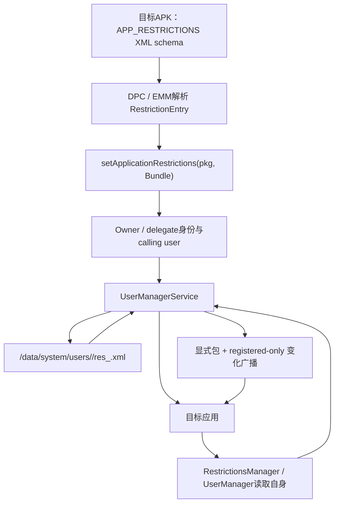
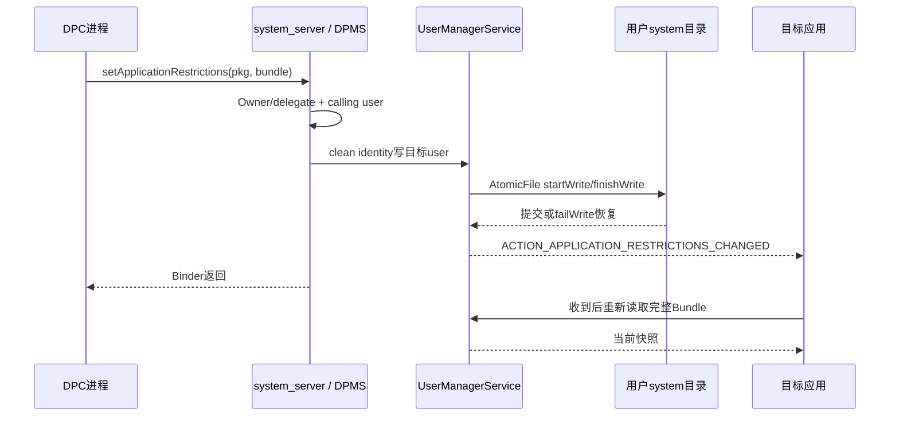
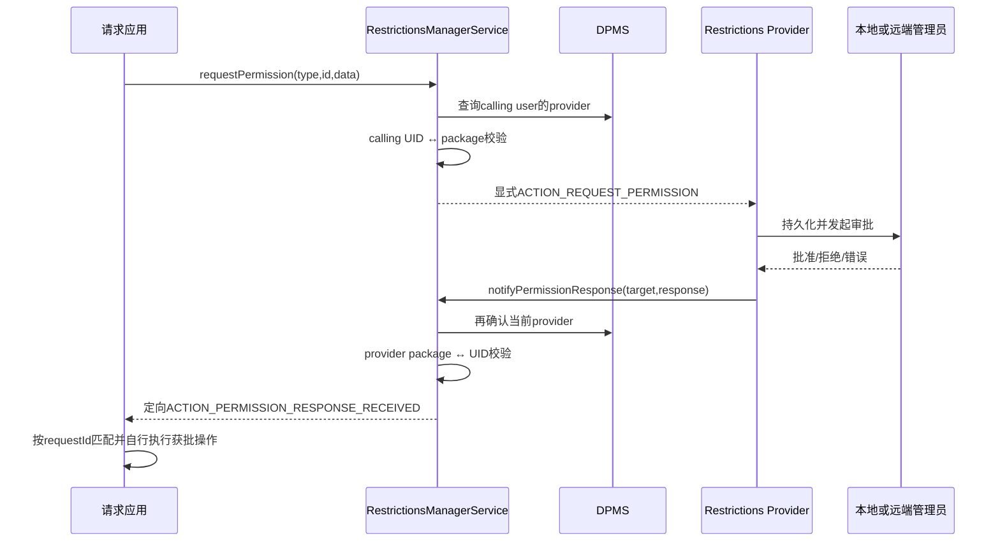

# 312 Android Application Restrictions 与 RestrictionsManager：结构化配置、持久化、广播及 Provider 审批链

## 1. 本章目标

本章追踪受管应用配置的完整链路：应用在Manifest里声明可配置项，DPC写入每用户实际值，UserManagerService持久化并通知目标应用，应用读取；另拆Restrictions Provider的动态审批请求/响应链。

## 2. Android 11版本边界

以 `android-11.0.0_r48` 为准，重点阅读 `DevicePolicyManagerService`、`UserManagerService`、`RestrictionsManagerService`、`RestrictionsManager`、`RestrictionEntry` 和 `RestrictionsReceiver`。

## 3. 名称相似但不是User Restrictions

Application Restrictions是“某个应用自己解释的键值配置”，例如禁用导出、固定服务器地址；User Restrictions是系统理解的 `DISALLOW_*` 用户能力门。前者不能自动产生系统级阻断。

## 4. 也不是runtime permission

应用配置中的 `allow_camera=false` 只是业务键；除非目标应用主动遵守，它不会撤销CAMERA权限，也不会修改AppOps。企业合规需要区分“配置意图”和“系统强制执行”。

## 5. 三类参与者

目标应用定义schema并消费值；DO/PO或delegate决定实际配置；可选Restrictions Provider接收应用提出的临时审批请求，并把管理员响应送回应用。

## 6. 两类数据不要混

静态Manifest restrictions描述“有哪些键、类型、标题和默认值”；DPC写入的Bundle描述“当前真正生效的值”。只发布schema不会自动生成每用户实际配置文件。

## 7. 每用户每包隔离

实际值按 `{userId, packageName}` 存储。同一包在个人用户和工作资料可以获得完全不同配置，读取时由Binder calling user自然选中对应副本。

## 8. 管理权限

`set/getApplicationRestrictions()` 允许调用用户上的Device Owner、Profile Owner，或具有 `DELEGATION_APP_RESTRICTIONS` 的delegate。delegate用空admin并以callingPackage证明身份。

## 9. 目标应用的读取权

目标应用不需要成为管理员即可读取自己的Bundle；UserManagerService核对calling user和Linux UID是否对应所请求包。应用不能把另一个包名传进去窥视其配置。

## 10. 静态配置总链



## 11. Manifest schema入口

应用在 `<application>` 中声明meta-data `android.content.APP_RESTRICTIONS`，resource指向XML。RestrictionsManager用 `PackageManager.GET_META_DATA` 找它，并在目标包资源上下文解析。

## 12. schema不是机密

它随APK分发，包含键名、标题、描述、选项与默认值，EMM控制台可读取生成配置UI。不要把口令、token或私钥硬编码在schema。

## 13. restriction的必填字段

每个 `<restriction>` 至少需要key、title和restrictionType；r48解析器代码硬检查type和key，缺失就记录warning并跳过。title虽文档要求，代码不会以同样方式拒绝null。

## 14. 基础类型

支持boolean、integer、string、choice、multi-select与hidden；M以后还支持bundle和bundle_array。schema类型最后要映射到Bundle可持久化类型。

## 15. choice与multi-select

`entries` 是管理员看到的标签，`entryValues` 是写入Bundle的稳定值。业务代码应匹配value而不是展示文案，否则本地化或改名会破坏合同。

## 16. hidden类型

hidden必须有默认值且不展示给管理员，可携带schema版本等不可编辑元数据；它不是加密字段，任何能读取APK资源或最终Bundle的一方仍可看到。

## 17. bundle嵌套

TYPE_BUNDLE可包含多项子restriction并转换成子Bundle；适合把一组服务器参数或账户策略聚合，而不是靠带点号的扁平key模拟层级。

## 18. bundle_array约束

TYPE_BUNDLE_ARRAY的直接子元素应全部是TYPE_BUNDLE；每个bundle再包含字段。它适合表示多条结构相同或相近的规则记录。

## 19. 默认值的真实位置

默认值来自APK schema，`getManifestRestrictions()`返回的RestrictionEntry携带它；`getApplicationRestrictions()`读取实际文件，不会在文件不存在时自动把这些默认值填进去。

## 20. 应用如何选择默认值

应用读取实际Bundle后，对缺失key自行采用代码/schema约定的安全默认值。升级新增key时尤其要保证旧DPC未写该key也能稳定运行。

## 21. schema解析失败

目标包不存在会抛IllegalArgumentException；没有meta-data返回null；XML解析IOException/XmlPullParserException通常记录warning并返回null。控制台应把“无schema”和“schema损坏”区分记录。

## 22. 核心schema示例

```xml
<restrictions xmlns:android="http://schemas.android.com/apk/res/android">
    <restriction android:key="allow_export"
        android:title="@string/allow_export"
        android:restrictionType="bool"
        android:defaultValue="false" />
    <restriction android:key="server_url"
        android:title="@string/server_url"
        android:restrictionType="string" />
</restrictions>
```

这是可配置项说明，不是实际政策；DPC仍需写Bundle，应用仍需主动读取并执行。

## 23. RestrictionEntry到Bundle

`convertRestrictionsToBundle()` 将boolean→putBoolean、integer→putInt、string/hidden→putString、choice/multi-select→putStringArray、bundle→putBundle、bundle_array→putParcelableArray。

## 24. choice为何也转StringArray

r48转换逻辑把TYPE_CHOICE、TYPE_CHOICE_LEVEL和TYPE_MULTI_SELECT都走 `getAllSelectedStrings()` 并写String[]。不要仅凭“单选”直觉硬用getString读取控制台生成结果。

## 25. Bundle允许的DPM类型

公开文档限定boolean、int、String、String[]，M以后可用Bundle或Bundle[]。long、double、自定义Parcelable等不属于这条持久化合同。

## 26. 非法类型的危险

UMS writer最后的else直接把值强转String[]。传入Long或任意Parcelable可能在系统端写盘时触发ClassCastException；writer会捕获异常、failWrite回滚并仅记录日志，DPC不一定收到失败。故必须在DPC本地严格校验schema与Bundle类型。

## 27. Bundle[]的运行时检查

writer接受Parcelable[]分支，但逐项要求实例是Bundle；任一元素不是Bundle就抛IllegalArgumentException并使AtomicFile写入失败回滚。

## 28. null String语义

value为null或String都按string写；null被序列化为空文本，读取后得到空字符串。若业务必须区分“key缺失、null、空串”，此格式不能完整保存三态。

## 29. String[]中的null

数组每个null元素也写为空文本，读取时还会trim。因此前后空白和null/空串差异都不应作为业务协议语义。

## 30. Bundle不是PersistableBundle

静态应用配置API使用Bundle但只支持有限可XML化类型；动态审批链使用PersistableBundle，确保请求可跨进程/跨重启保存。二者不要随意互换自定义对象。

## 31. DPC setter入口

`DevicePolicyManager.setApplicationRestrictions(admin, packageName, settings)`先拒parent instance，再把自身包名一并送DPMS。文档标记WorkerThread，因为下游执行同步磁盘I/O。

## 32. 为什么不能在主线程调用

DPMS调用UMS后，UMS在锁内直接AtomicFile写盘；它不是像部分policy那样只排队异步写。DPC主线程调用可能造成卡顿甚至ANR风险。

## 33. 身份核验

DPMS的 `enforceCanManageScope(...DELEGATION_APP_RESTRICTIONS)` 同时处理Owner和delegate，并验证callerPackage与Binder UID。字符串admin或包名本身不是能力票据。

## 34. 目标user从哪里来

DPMS使用 `binderGetCallingUserHandle()`，API文档也写明目标应用运行在calling user。setter不接受任意userId，因此不能靠包名跨profile配置另一个实例。

## 35. clean calling identity

通过管理身份门后，DPMS以system身份调用UserManager.setApplicationRestrictions，并在同一clean identity代码块记录DevicePolicy事件。

## 36. 事件日志内容

事件包含callerPackage、是否delegate及目标packageName，但不记录整个Bundle内容，避免把企业配置值直接塞进政策事件日志。

## 37. UMS只接受system/root写

UMS `setApplicationRestrictions()` 调用 `checkSystemOrRoot()`；普通DPC不能绕开DPMS直连IUserManager写文件。DPMS是管理授权边界，UMS是最终存储边界。

## 38. setDefusable的意义

非nullBundle先 `setDefusable(true)`，使反序列化遇到坏Parcelable时更偏向丢弃问题值而不是让system_server崩溃；这不是类型合同验证，也不能让不支持的类型可持久化。

## 39. 空Bundle等于清除

restrictions为null或isEmpty时走 `cleanAppRestrictionsForPackageLAr()` 删除对应文件。没有“存在但完全空”的持久状态，读取结果同样表现为空Bundle。

## 40. 非空Bundle总写

r48有TODO说明尚未避免无变化广播；只要Bundle非空就写文件并把changed设true，即使内容与旧值完全相同。

## 41. AtomicFile提交

writer用startWrite、FastXmlSerializer与finishWrite；任何异常调用failWrite恢复旧文件。setter本身没有向DPC返回“每个key写入结果”的结构。

## 42. 文件位置

文件位于 `Environment.getUserSystemDirectory(userId)` 下，名称由 `RESTRICTIONS_FILE_PREFIX + packageName + .xml` 生成，r48前缀为 `res_`，例如 `res_com.example.app.xml`。

## 43. XML根与entry

根是restrictions，每个key写entry并带key、type等属性；String[]用multiple计数和多个value子元素；Bundle递归entry；Bundle[]写多个type=bundle的子entry。

## 44. 读取锁

UMS用 `mAppRestrictionsLock` 同步读、写、清理，避免同一进程中读取半写状态；AtomicFile再承担崩溃/异常时旧版本恢复。

## 45. 读取错误如何表现

文件不存在返回新空Bundle；XML解析错误也记录warning并返回已经构造的Bundle，可能为空或只有此前成功解析的项。应用应对缺失/部分值采取安全默认。

## 46. 写盘与通知时序



## 47. 变化广播的Action

UMS发送 `Intent.ACTION_APPLICATION_RESTRICTIONS_CHANGED`，且在core Manifest中声明为protected-broadcast，普通应用不能伪造同名系统广播。

## 48. 广播只定向目标包

Intent调用 `setPackage(packageName)`，不会把某应用配置变化泄露给所有包。它仍是包级定向，不指定某一个receiver组件。

## 49. registered-only的后果

UMS添加 `FLAG_RECEIVER_REGISTERED_ONLY`，只有当时进程中动态注册的receiver能收到；Manifest静态receiver不会因配置变化自动拉起冷进程。

## 50. 应用不能只靠广播初始化

应用首次启动、进程重建和Activity恢复时都应主动读取当前Bundle；广播只是热更新提示。否则在变更时进程未运行会永远错过通知。

## 51. 广播不携带值

Intent没有塞完整restrictions Bundle。receiver收到后重新读取权威快照，可避免大Bundle广播、过时diff及额外泄露。

## 52. 写盘先于广播

UMS在退出锁后才发广播，且前面AtomicFile写已经完成；receiver立即读取通常得到新快照。若写入异常，writer内部回滚但上层仍可能认为changed，应用应按实际读取结果处理。

## 53. 清空何时广播

清理函数只有真的删除了既有文件才返回changed=true；原本没有文件时再传空Bundle不会广播。这与非空重复写每次广播形成差异。

## 54. 应用读取入口一

`RestrictionsManager.getApplicationRestrictions()` 把自己的 `mContext.getPackageName()`传给RestrictionsManagerService，后者直接调用IUserManager同名方法。

## 55. 应用读取入口二

也可用 `UserManager.getApplicationRestrictions(packageName)`。DPM文档指出目标应用通过UserManager可见；RestrictionsManager只是为schema与动态审批额外提供统一入口。

## 56. UMS的same-app门

若请求user不是calling user，或Binder UID与package UID不是sameApp，就要求system/root。普通应用只能读取当前用户下属于自己UID的包配置。

## 57. shared UID边界

`UserHandle.isSameApp()`按appId判断；共享UID包可能满足sameApp检查并读取同UID另一个包名的配置。使用sharedUserId的企业应用不应把application restrictions当同UID内秘密隔离。

## 58. 包不存在时UID查询

UMS的 `getUidForPackage()` 用MATCH_ANY_USER查询，找不到返回-1；普通调用者不会与-1 sameApp，于是落入system/root门而被拒绝。

## 59. 读方法返回空还是null

UMS文件不存在时返回空Bundle；RestrictionsManager文档仍写可能null，service为null时客户端也返回null；健壮代码同时接受null与empty。

## 60. DPM getter的额外保证

Owner/delegate调用 `DevicePolicyManager.getApplicationRestrictions()` 时，DPMS把UMS可能null规范为 `Bundle.EMPTY`，符合DPM文档的非空合同。

## 61. KEY_RESTRICTIONS_PENDING

DPC尚未拿到最终云端配置时，可在Bundle放 `UserManager.KEY_RESTRICTIONS_PENDING=true`，告诉应用策略可能近期到达。它只是约定key，不会让系统自动重试下载。

## 62. 应用处理pending

应用应采用安全受限默认、展示“配置同步中”并监听变化；不要把pending等同于无限制放行，也不要忙轮询磁盘。

## 63. schema版本设计

推荐放显式schema/version key，并保持未知key忽略、缺失key有默认、旧值可迁移。APK与DPC控制台升级并不保证同步发生。

## 64. 敏感数据边界

配置文件在用户system目录由系统保护，但目标应用可读且DPC可读。不要把长期私钥、通用管理员密码或无需暴露给应用的秘密放入Bundle。

## 65. 配置不是强一致远程事务

DPC云端保存、设备写盘、应用收到广播和业务模块重载是多个完成点。EMM显示“策略下发成功”不必然证明目标进程已经应用新配置。

## 66. 推荐应用内状态机

读取Bundle→验证schema与值域→构造不可变业务配置→原子替换内存快照→按需重建网络/会话。不要让每个业务点直接零散读Bundle导致新旧混用。

## 67. 失败安全默认

布尔安全开关缺失、类型错或越界时应选择明确的安全默认并记录诊断；字符串URL要校验scheme/host；列表要限制数量与单项长度。

## 68. Owner移除时的清理

DPMS清DO/PO流程调用 `clearApplicationRestrictions(userId)`，把工作投到background handler，枚举该用户所有已安装包并为每包设置null。

## 69. 清理是异步的

Owner角色清除返回时，所有 `res_*.xml` 不一定已删完；background handler随后逐包清理并向有变化的目标包发送广播。

## 70. 为何枚举已安装包

DPMS没有一张自己维护的目标包列表，因为实际配置由UMS分文件存储。它遍历当前已安装包清理；这意味着诊断时应关注已卸载包残留文件由包清理流程处理。

## 71. delegate撤销不清配置

撤销APP_RESTRICTIONS delegation只收回未来读写管理能力，不会自动清目标应用已保存Bundle。Owner必须明确决定保留、覆盖或清空。

## 72. Restrictions Provider是什么

它是PO为当前用户指定的一个 `RestrictionsReceiver`组件，充当应用与本地/远端管理员之间的审批通道。它不是静态application restrictions的唯一写入者。

## 73. 谁能指定Provider

DPM文档说只有Profile Owner；但r48 DPMS使用 `getActiveAdminForCallerLocked(...USES_POLICY_PROFILE_OWNER)`，而其helper明确把Device Owner也视为拥有PO power，所以实现实际上也接受DO。provider参数可null以移除，这是文档与实现应分开记录的版本事实。

## 74. Provider怎样持久化

DPMS把ComponentName存到 `DevicePolicyData.mRestrictionsProvider`，根policies XML的 `permission-provider` 属性保存flatten字符串；启动读取时再unflatten恢复。

## 75. Provider组件是否立即校验

setter只是保存ComponentName，没有在这段代码中查询它是否存在、是否为receiver或是否要求正确权限。配置错误会在请求广播或本地approval解析时表现出来。

## 76. Provider不是delegate

Restrictions Provider接收并回答动态请求；`DELEGATION_APP_RESTRICTIONS`允许包读写静态应用配置。两种角色可由同包承担，但授权、存储和API完全不同。

## 77. 服务启动

SystemServer启动 `RestrictionsManagerService`，并以 `Context.RESTRICTIONS_SERVICE` 发布Binder。它持有IUserManager与IDevicePolicyManager代理来读取静态值和查询Provider。

## 78. hasRestrictionsProvider

应用调用后，service取calling user、清Binder identity并让DPMS `getRestrictionsProvider(userId)`返回是否非null。它只证明配置了ComponentName，不证明组件当前可用或网络管理员在线。

## 79. 动态request输入

`requestPermission(requestType, requestId, PersistableBundle)`要求三者非null；requestType可以用标准approval，也可使用带命名空间的Provider自定义类型。

## 80. requestId由谁生成

应用生成能关联请求参数的唯一ID，response中必须带回。它既支持异步匹配，也允许Provider按相同requestId返回缓存结果。

## 81. NEW_REQUEST语义

request Bundle里 `REQUEST_KEY_NEW_REQUEST=true` 要求Provider创建新请求；缺失或false时Provider可以查询并返回相同ID的缓存响应，避免重复打扰管理员。

## 82. 标准approval内容

至少包含message，可选title、data、压缩图片byte[]、批准/拒绝按钮文案。应用应限制图像与文本大小，Binder/PersistableBundle不是无限载荷通道。

## 83. requestPermission的身份顺序

service先查当前user已配置Provider，没有则IllegalStateException；再核对传入packageName属于calling UID。客户端固定传自身Context包名，降低伪装空间。

## 84. 显式广播给Provider

service构造 `ACTION_REQUEST_PERMISSION`，直接setComponent为DPMS保存的Provider，并附请求包、类型、ID与Bundle，然后以当前user发送。

## 85. Receiver的保护要求

文档要求Provider的BroadcastReceiver声明 `android.permission.BIND_DEVICE_ADMIN`，确保普通应用不能直接伪造系统请求广播。系统服务显式投递仍会通过receiver权限检查。

## 86. RestrictionsReceiver的作用

基类 `onReceive()`识别request action，取出四个extra，再调用抽象 `onRequestPermission()`。实现者不应重写分发细节，而应在callback中持久化请求并异步联系管理员。

## 87. BroadcastReceiver时间限制

`onRequestPermission()`运行在普通广播receiver生命周期内，不能同步做长网络请求。Provider应快速入队Job/Service或使用合适异步机制，稍后再notify response。

## 88. Provider必须自己保存关联

RestrictionsManagerService不建立请求数据库，也不保证恰好一次。Provider需按 `{user, requestingPackage, requestId}` 去重、鉴权、持久化和恢复。

## 89. 响应内容最低要求

`notifyPermissionResponse()`客户端强制PersistableBundle包含 `REQUEST_KEY_ID` 与 `RESPONSE_KEY_RESULT`；result可为APPROVED、DENIED、NO_RESPONSE、UNKNOWN_REQUEST或ERROR。

## 90. 动态审批总链



## 91. response调用者鉴权

service重新查询当前user的Provider；没有Provider抛SecurityException，再要求Binder calling UID拥有该Provider的packageName。普通请求应用不能自己伪造service的响应API。

## 92. Provider更换竞态

请求发出后若PO更换Provider，旧Provider即使拿到管理员答复也无法通过当前Provider身份检查。新Provider也未必有旧请求数据库，因此应用必须处理超时/UNKNOWN_REQUEST。

## 93. response目标包

认证通过后，service构造response action，setPackage(packageName)，放入response Bundle并以相同user广播。这里不验证目标包就是原始请求者，因为service不保存请求账。

## 94. Provider应验证目标

由于系统service不关联原请求，Provider必须从自己的持久记录恢复requestingPackage，不能接受远端返回任意目标包名，否则可能把审批信息送错应用。

## 95. response广播的r48边界

真正的notify API会认证Provider并定向目标包；但r48 core Manifest只把 `APPLICATION_RESTRICTIONS_CHANGED`列为protected-broadcast，没有找到response action同等声明。应用仍应校验requestId、预期状态和自身请求账，不能把单独收到同名广播当高价值身份凭证。

## 96. APPROVED不会自动执行操作

结果只送回应用，系统不会替它购买内容、开放业务功能或修改静态Bundle。应用在自己的业务规则里决定如何消费批准，并防重放。

## 97. NO_RESPONSE不是DENIED

它表示管理员暂未回答；应用可显示等待状态并在适当时机重查/重发。不要把它永久缓存成拒绝，也不要高频骚扰Provider。

## 98. UNKNOWN_REQUEST

当应用复用ID请求缓存结果但Provider找不到记录时返回；应用可用NEW_REQUEST重新建立，但要避免因为网络重试重复创建真实付费/授权请求。

## 99. ERROR信息

ERROR可附BAD_REQUEST、NETWORK或INTERNAL code，以及可显示的message和response timestamp。message来自管理链，展示前仍应控制长度并避免当作富文本执行。

## 100. 本地审批Intent

应用可调用 `createLocalApprovalIntent()`；service查Provider包，用package限定ACTION_REQUEST_LOCAL_APPROVAL并解析当前user中exported Activity，找到后改成显式Component返回。

## 101. exported为何必要

approval Activity由请求应用跨包启动，因此必须exported。返回显式Intent也防止调用方启动时解析到其他包伪造的通用action处理器。

## 102. Provider包内解析仍需谨慎

service先setPackage再resolve，并确认ResolveInfo.activityInfo.exported；但它没有在这里声明额外启动permission。Provider应在Activity内部执行管理员PIN/身份验证，不能把“能启动页面”等同已批准。

## 103. startActivityForResult合同

应用添加至少含REQUEST_KEY_MESSAGE的request Bundle，启动本地approval；`RESULT_OK`才表示成功。Activity取消、进程死亡或null Intent都要作为未批准处理。

## 104. 静态配置与动态批准的关系

管理员批准一次动态请求，不会自动写application restrictions；若希望批准产生长期配置，Provider或DPC必须另走受权的setter，并定义两套状态的优先级。

## 105. 冷启动读取策略

应用进程启动先读取Bundle并验证；再注册动态receiver；若有pending动态请求则从自己的数据库恢复。不能期待系统重放错过的registered-only静态变化广播。

## 106. 热更新策略

收到静态变化广播只设置“需要刷新”，在单线程配置协调器中重新读取完整Bundle、比对版本并原子应用。避免receiver里直接重建所有业务组件。

## 107. 大Bundle问题

setter经Binder传输且写XML，动态request/response也经Binder和广播extra传输；都受事务大小与内存限制。大型证书、图片或策略列表应存到受控文件/服务，只传标识与摘要。

## 108. 故障定位顺序

静态链查角色/delegation、calling user、Bundle类型、`res_<pkg>.xml`、变化广播与应用默认值；动态链再查provider Component、receiver权限、请求ID账、当前Provider身份和response target。

## 109. 常见误判一

“Manifest声明了restrictions，应用就自动受限”是错的。schema只描述可配置项；必须有DPC写值，应用代码还必须读取并执行。

## 110. 常见误判二

“变化广播保证应用一定收到”是错的。它registered-only且不拉起冷进程，应用必须在每次关键启动时主动读取快照。

## 111. 常见误判三

“动态审批APPROVED等于系统授予Android权限”是错的。它只是Provider返回的业务审批结果，与runtime permission、AppOps及DPM permission grant无自动联系。

## 112. macOS只读练习一：追静态写入

执行 `sed -n '10055,10085p' frameworks/base/services/devicepolicy/java/com/android/server/devicepolicy/DevicePolicyManagerService.java` 与 `sed -n '4085,4265p' frameworks/base/services/core/java/com/android/server/pm/UserManagerService.java`，画出身份、锁、文件与广播顺序。

## 113. macOS只读练习二：验证类型

阅读UMS的 `writeBundle()` 与 `readEntry()`，为boolean、int、null String、String[]、Bundle、Bundle[]各写一个XML形状，并指出Long会落入哪个危险分支；无需编译。

## 114. macOS只读练习三：追动态请求

执行 `sed -n '80,195p' frameworks/base/services/restrictions/java/com/android/server/restrictions/RestrictionsManagerService.java`，分别标出请求应用鉴权、Provider鉴权，以及service没有保存请求对应表的位置。

## 115. macOS只读练习四：设计健壮读取器

为假想键`server_url`、`allow_export`、`schema_version`写伪代码：处理null/empty、类型异常、值域校验、不可变快照替换与日志脱敏；只做源码推演。

## 116. 最小状态账

至少记录APK schema版本、DPC期望Bundle、UMS持久快照、应用已应用版本、动态requestId与Provider响应。任何“已下发”结论都要注明来自哪本账。

## 117. 关键源码入口

schema解析和request常量看 `RestrictionsManager.java`；静态授权看DPM/DPMS；XML和变化广播看UMS；动态Binder转发看RestrictionsManagerService；Provider接收看RestrictionsReceiver。

## 118. 本章复读修正

复读后明确四点：空Bundle会删文件；非空相同值仍可能广播；registered-only不唤醒冷应用；r48 response action不能仅凭文档“protected”描述就当作应用侧唯一真实性凭证。

## 119. 本章结论

Application Restrictions是一份由管理员写、系统按用户保存、目标应用主动解释的结构化配置合同；Restrictions Provider则是另一条异步业务审批总线。系统负责身份与传递，但不替应用实现业务限制和请求幂等。

## 120. 下一章预告

下一章进入企业Always-on VPN与Lockdown：DPC怎样保存VPN包、UMS/Connectivity怎样启动与重试、lockdown怎样阻断VPN外流量，以及应用豁免、用户限制和故障恢复边界。
