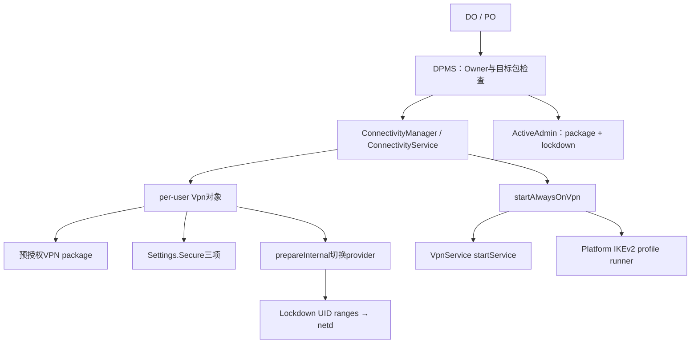
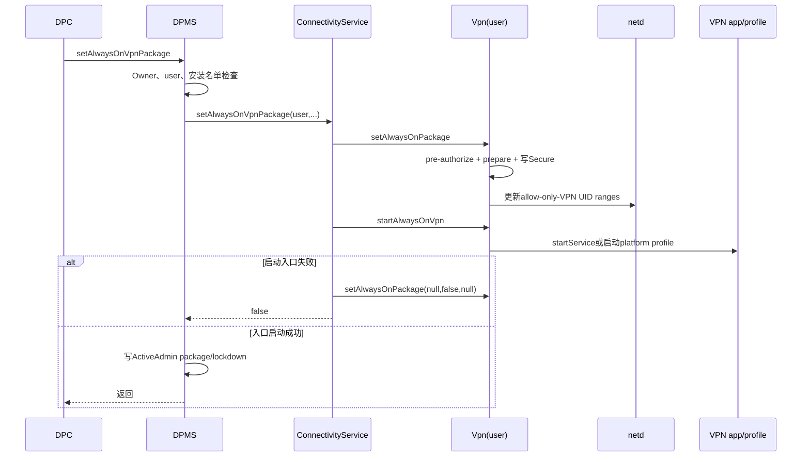
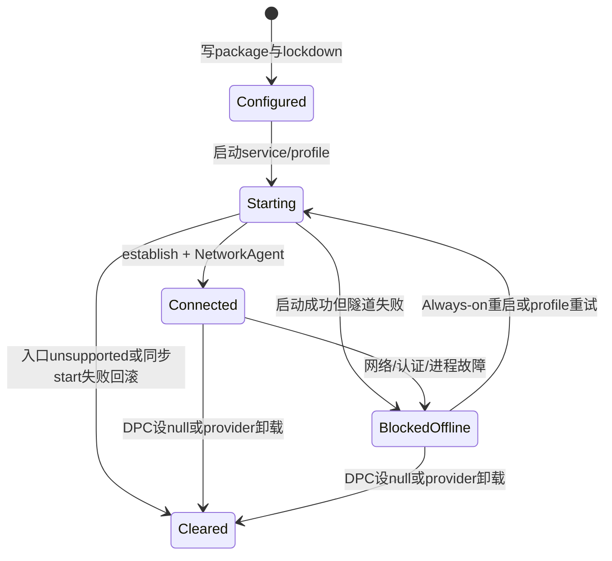

# 313 Android 企业 Always-on VPN 与 Lockdown：策略持久化、启动、UID阻断、允许列表及故障恢复链

## 1. 本章目标

本章从DPC调用 `setAlwaysOnVpnPackage()` 开始，追踪Owner授权、VPN应用兼容检查、Settings.Secure与ActiveAdmin双份状态、开机/解锁启动、Lockdown的netd UID范围阻断，以及卸载、升级、失败和撤销。

## 2. Android 11版本边界

以 `android-11.0.0_r48` 为准，核心是 `DevicePolicyManagerService`、`ConnectivityService` 与 `com.android.server.connectivity.Vpn`；不把新版VpnManager行为倒灌进本章。

## 3. 与第38章的分工

第38章讲普通VpnService、TUN与路由；本章只回答企业“谁强制选择VPN、何时自动启动、没连上时谁还能联网、策略状态怎样恢复”。

## 4. Always-on不是“永远已连接”

它表示系统保存指定VPN提供者并在适当时机主动启动/重启。网络、认证、证书或服务本身失败时仍会处于未连接状态。

## 5. Lockdown补上失败窗口

Always-on而lockdown=false时，VPN未连接期间应用可能走普通默认网络；lockdown=true则让受管UID只能通过VPN或被内核拒绝，防止直连泄漏。

## 6. 三张状态账

DPMS ActiveAdmin保存企业声明的package与lockdown；Vpn对象将运行配置写Settings.Secure并持有内存状态；netd保存当前allow-only-VPN UID ranges。三者可能短时不一致。

## 7. 调用者是谁

公开DPM API只允许当前用户的Device Owner或Profile Owner，不提供delegate scope。设置发生在calling user，不能用一个PO直接配置另一个用户实例。

## 8. 目标VPN的最低合同

普通VpnService应用需声明受 `BIND_VPN_SERVICE`保护的service、targetSdk至少N，并且没有通过 `SERVICE_META_DATA_SUPPORTS_ALWAYS_ON=false` 明确退出。

## 9. Platform VPN例外

r48 `Vpn.isAlwaysOnPackageSupported()` 先查该包是否已有平台VPN profile；若有则可支持always-on，不必只依赖应用VpnService路径。

## 10. 企业配置总链

## 11. public API两个重载

三参数版本内部调用四参数版本并传空Set，因此每次使用旧重载都会清除之前的lockdown允许列表；要保留例外包必须始终使用带Set版本。

## 12. 清除配置

vpnPackage传null表示取消Always-on；lockdown参数此时无效，允许列表也被清空。不要用“同包 + lockdown=false”误当完全取消。

## 13. 设置可能抛出的两类错误

包或allowlist成员未安装映射为NameNotFoundException；包存在但不支持always-on、legacy lockdown冲突或底层不能建立配置时抛UnsupportedOperationException。

## 14. DPM的ServiceSpecificException映射

DPMS用 `ERROR_VPN_PACKAGE_NOT_FOUND`返回缺包，客户端把该errorCode翻译成PackageManager.NameNotFoundException；未知errorCode被包装为RuntimeException。

## 15. parent instance被拒绝

API调用 `throwIfParentInstance()`，组织所有工作资料PO不能通过parent DPM实例把这个策略写到父用户。VPN作用域仍跟随实际调用用户。

## 16. DPMS先验Owner

service `enforceProfileOrDeviceOwner(who)`，不是普通active admin uses-policy检查。即使应用拥有CONTROL_VPN，也不能从DPM企业入口冒充Owner。

## 17. calling user

DPMS取 `userHandleGetCallingUserId()`；包安装检查、Connectivity调用和ActiveAdmin状态全部使用该userId，形成per-user配置。

## 18. 目标VPN安装门

vpnPackage非null且未安装时，DPMS立即抛package-not-found。这里先查存在，是否真的支持Always-on留给Vpn.start路径核验。

## 19. allowlist安装门

只有vpnPackage非null、lockdown=true且list非null时，DPMS逐包检查安装；lockdown=false时列表被忽略，也不因未安装成员报错。

## 20. 安装检查后的竞态

源码注释承认检查后包仍可能被卸载，Connectivity侧会忽略找不到的allowlist包。一次成功setter不能永久证明名单成员仍存在。

## 21. 允许列表名称

Android 11源码和API使用whitelist命名，本章保留其标识符但语义称“Lockdown允许列表”：只在VPN未连接时允许这些包直连。

## 22. 系统应用例外

DPM文档明确System apps总能bypass VPN。Lockdown不是连UID 0和所有系统关键流量都封死，否则VPN自身建链、IPsec和系统恢复会陷入死锁。

## 23. 允许列表的时间语义

VPN未连上时名单包可直连；VPN连接后，如果该VPN覆盖其UID，它们会切到VPN。名单不是“永远绕过VPN”的split-tunnel配置。

## 24. 空名单语义

lockdown=true且list为null或empty时，普通应用没有直连例外，仅系统流量和VPN提供者等必要UID被排除。

## 25. 包安装变化不自动维护名单

文档明确系统不会在包安装/卸载时自动更新允许列表字符串；DPC必须重新调用setter维护期望集合。

## 26. 逗号限制

Vpn把名单用逗号连接写Settings.Secure，因而拒绝包含逗号的包名。合法Android包名本来也不含逗号，但底层仍防止序列化歧义。

## 27. DPMS调用Connectivity

通过clean calling identity调用 `setAlwaysOnVpnPackageForUser(userId, package, lockdown, list)`；返回false就抛UnsupportedOperationException，不继续写ActiveAdmin。

## 28. Connectivity的权限门

Binder入口要求CONTROL_ALWAYS_ON_VPN并检查跨用户权限。普通VPN应用不能直接指定自己为Always-on；DPMS以system身份跨越这一门。

## 29. 旧Legacy Lockdown冲突

若 `LockdownVpnTracker.isEnabled()`，Connectivity直接返回false。应用Always-on Lockdown和旧式credentials-based legacy lockdown不能同时接管同一机制。

## 30. per-user Vpn对象必须存在

`mVpns.get(userId)`为空时返回false。用户尚未建立Vpn运行对象的异常生命周期会让企业设置失败，而不是只写一个以后再生效的愿望值。

## 31. set与start是连续两步

Connectivity先 `vpn.setAlwaysOnPackage()`保存/准备，再立刻 `startAlwaysOnVpn()`；后者失败时又调用set null回滚Settings与运行配置。

## 32. 为什么先预授权

企业Owner决定后无需用户再点VpnService consent。Vpn根据是否有platform profile选择TYPE_VPN_PLATFORM或TYPE_VPN_SERVICE，并调用setPackageAuthorization。

## 33. 授权不等于连接

预授权只允许该包建立VPN；真正service仍需启动、创建受保护的控制socket、调用Builder.establish并让NetworkAgent连接。

## 34. legacy伪包不能设

传 `VpnConfig.LEGACY_VPN` 被 `setAlwaysOnPackageInternal()`拒绝。取消配置内部才用legacy标识作为“当前无应用Always-on”的prepared package。

## 35. mAlwaysOn与mPackage

package非null时mAlwaysOn=true；null会改成legacy伪包并mAlwaysOn=false。公开getter只在mAlwaysOn时返回mPackage，所以取消后返回null。

## 36. mLockdown派生

`mLockdown = mAlwaysOn && lockdown`，因此没有Always-on时不可能保留应用型Lockdown true；allowlist也只有mLockdown时复制为不可变List。

## 37. prepare切换提供者

若当前prepared package不同，`prepareInternal(newPackage)`撤销旧VPN状态、切换owner UID，并在更新状态的副作用里刷新Always-on通知与forced规则。

## 38. 当前包相同的路径

若已经prepared同包，不做完整切换，只刷新断线通知并直接 `setVpnForcedLocked(mLockdown)`，使lockdown或名单变化立即下沉netd。

## 39. Settings.Secure三项

Vpn保存 `ALWAYS_ON_VPN_APP`、`ALWAYS_ON_VPN_LOCKDOWN`、`ALWAYS_ON_VPN_LOCKDOWN_WHITELIST`，都按user写入；名单用逗号连接字符串。

## 40. ActiveAdmin双份状态

Connectivity成功后，DPMS才在锁内把package和lockdown写入Owner的ActiveAdmin XML；r48不把allowlist复制进ActiveAdmin，只能从Connectivity查询。

## 41. 为什么会有双份

Settings.Secure驱动Vpn运行态和重启恢复；ActiveAdmin字段供system-only DPM getter/政策持久记录。它们服务不同消费者，不应假设永远原子一致。

## 42. setter不是跨两份原子事务

Connectivity与Settings先成功，随后DPMS XML写盘；进程崩溃或磁盘故障可能留下分歧。诊断必须同时查DPM/Connectivity getter和Secure settings。

## 43. whitelist为何没有ActiveAdmin副本

DPMS公开getter直接向Connectivity取 `getVpnLockdownWhitelist(userId)`，因此名单权威在Vpn/Settings侧；ActiveAdmin只保留package和boolean。

## 44. 事件日志

成功调用记录admin、vpnPackage、lockdown布尔和名单size，不写完整名单；这既提供审计轮廓，也减少把包清单复制进事件日志。

## 45. setter返回点

DPM void返回意味着Connectivity配置、一次start尝试和ActiveAdmin保存完成；它不证明VPN隧道已握手成功或目标业务请求已通过。

## 46. 设置与启动时序

## 47. 支持性检查顺序

`startAlwaysOnVpn()`先取当前包；若不支持就主动清Always-on并返回false。故unsupported不会留下新的应用型Secure配置。

## 48. Service应用targetSdk门

无platform profile时读取ApplicationInfo，targetSdk<N直接unsupported。仅仅能作为普通VpnService运行，不代表能被系统持续自动拉起。

## 49. Service发现门

以 `VpnConfig.SERVICE_INTERFACE`和目标package查询当前user services；一个都没有则unsupported。Manifest中service名字不是由DPC指定。

## 50. opt-out如何聚合

遍历该包所有匹配VpnService，任何service meta-data显式false都会使整个package不支持Always-on。多service应用需保持声明一致。

## 51. BIND_VPN_SERVICE在哪里保障

公开合同要求service由signature级BIND_VPN_SERVICE保护，正常VpnService发现/绑定链会校验；DPC不应仅以query到action就认为安全实现正确。

## 52. 已连接快速返回

若NetworkInfo已CONNECTED，start返回true不重复启动。源码也承认mid-setup尚未bind时可能再次send onStartCommand，VPN应用必须承受幂等启动。

## 53. Platform profile路径

若Keystore里存在该包provisioned profile，优先 `startVpnProfilePrivileged()`；解析成功即认为异步runner已启动，临时失败由platform实现持续重试。

## 54. VpnService路径

系统先把VPN包临时加入Doze power-save allowlist一小段时间，再用SERVICE_INTERFACE package Intent `startServiceAsUser()`，给它建立隧道的启动机会。

## 55. startService非null的含义

只说明service启动请求被接受，不表示它已经调用establish、更不表示服务器认证完成。企业监控应再观察VPN network state和实际流量。

## 56. RuntimeException路径

service启动抛RuntimeException时记录日志并返回false；Connectivity随后清Always-on设置，DPMS把整体setter视为unsupported/failure。

## 57. 已启动后永久故障

应用service入口成功后才发生的认证失败、服务器不可达等不会让setter同步回滚。Always-on仍配置，Lockdown仍可持续阻断普通流量。

## 58. Lockdown下沉点

`setVpnForcedLocked()`计算应该被阻断的UID范围，再调用netd `setAllowOnlyVpnForUids(enforce,ranges)`；这不是仅在Java网络选择器里标记“不推荐”。

## 59. 内核行为

注释说明非VPN流量会收到kernel PROHIBIT；只有通过VPN或对底层socket调用protect的允许流量能建立。应用侧常表现为立即网络错误而非静默改路由。

## 60. VPN自身为何豁免

计算exemptedPackages时把lockdown名单加上VPN provider package，避免VPN控制连接没有正确protect时自锁。正确VpnService仍应主动protect其隧道socket。

## 61. UID 0特殊处理

若阻断范围从0开始，代码把0从range剔除，因为内核IPsec流量可能标记uid=0；否则平台VPN可能被自己的Lockdown规则阻断。

## 62. 受影响用户范围

Vpn先覆盖其top-level user；若该用户可拥有restricted profiles，还把归属它的restricted profile UID范围纳入。它不是任意profile group的通用跨资料合并。

## 63. 工作资料独立Vpn

Managed profile通常有自己的per-user Vpn对象与Owner策略；不能从restricted-profile特殊代码推断个人侧VPN自动覆盖工作资料。

## 64. 名单到UID

底层按每个用户解析包名为UID；同包在不同用户有不同UID。包不存在返回-1并被忽略，解释了“检查后卸载”不会凭字符串永久开洞。

## 65. 共享UID边界

allowlist最终豁免UID范围，若包使用shared UID，和它共享UID的其他包也可能一起获得直连能力。DPC审核名单时需把shared UID视作能力扩张。

## 66. 已阻断集合缓存

Vpn维护 `mBlockedUidsAsToldToNetd`，每次重新计算新集合，先求需移除与需增加的差集，避免无谓重复写所有range。

## 67. netd失败怎么办

RemoteException或RuntimeException只记录错误并返回false；调用者 `setVpnForcedLocked()`不把失败一路抛回DPC。setter成功不严格证明所有内核阻断range都写入。

## 68. 为什么这是关键审计点

Lockdown是防泄漏安全属性，若netd调用失败而上层仍显示enabled，会形成“策略账为true、执行账不完整”。高保障设备需用dumpsys/netd状态和真实网络测试验证。

## 69. 连接后是否仍有forced规则

allow-only-VPN range保留；受管UID通过匹配它的VPN network工作。`isBlockingUid()`在connected时还会检查VPN是否appliesToUid，避免误报所有range已畅通。

## 70. VPN的allowed/disallowed apps

VpnService Builder自身还可设置VPN适用包范围；Lockdown名单只控制断线时直连例外。两套名单组合不当可能造成“VPN连着但某UID仍被判blocked”。

## 71. allowBypass被Lockdown压制

创建VPN NetworkAgent时 `allowBypass = mConfig.allowBypass && !mLockdown`。Lockdown开启后，即便VPN配置请求allowBypass，也不能让普通应用选择显式底层网络绕过。

## 72. 显式Network不能绕过

Vpn字段注释强调仅路由配置不足，应用可bind到显式network；forced UID规则正是用来封住这类旁路。

## 73. 断线通知

Always-on且network state非CONNECTED时显示持续系统通知；Intent携带lockdown布尔并打开OEM/系统配置对话组件，连接后取消。

## 74. 通知不是执行证明

有通知说明Always-on断线状态可见，不说明Lockdown netd规则一定成功；无通知也可能只是已连接或通知层异常，不能替代网络状态检查。

## 75. 构造Vpn对象时恢复

Vpn构造函数最后 `loadAlwaysOnPackage(keyStore)`，从当前user Settings.Secure读package、lockdown和逗号名单，再走内部prepare与forced规则恢复。

## 76. 恢复不立即保存

load调用不持久化的 `setAlwaysOnPackageInternal()`，避免把刚读出的值又写一遍；真正启动由Connectivity用户生命周期路径随后触发。

## 77. 用户解锁触发

Connectivity `onUserUnlocked(userId)` 对非legacy-lockdown路径调用startAlwaysOnVpn；此时CE/Keystore等依赖更可能可用。

## 78. 包升级触发

收到PACKAGE_REPLACED且package等于当前Always-on provider时，Connectivity再次start，帮助升级后重建service/隧道。

## 79. 包卸载触发

非replace的PACKAGE_REMOVED命中当前provider时，Vpn调用set null，清Always-on、Lockdown和名单；DPC ActiveAdmin副本却不在这段Connectivity代码中同步修改。

## 80. 卸载后的双账差异

DPM面向Owner的 `getAlwaysOnVpnPackage(admin)`实时问Connectivity，通常返回null；system-only `getAlwaysOnVpnPackageForUser()`却读ActiveAdmin字段，可能仍保留旧包名，需按getter来源解释。

## 81. 用户停止

`Vpn.onUserStopped()`先关闭forced networking、把mAlwaysOn置false并断开Agent。Settings.Secure仍是恢复锚，用户再次创建Vpn对象/启动时加载。

## 82. restricted profile增删

若属于该top-level user，onUserAdded/Removed会调整VPN capabilities的UID ranges并重新调用forced规则，使Lockdown覆盖随用户关系变化。

## 83. 普通查询getAlwaysOnVpnPackage

Owner getter经DPMS clean identity直接问Connectivity当前Vpn对象，返回运行配置；没有应用型Always-on或由legacy system路径控制时返回null。

## 84. Lockdown查询

Owner以及R中持MAINLINE_NETWORK_STACK的NetworkStack可调用isAlwaysOnVpnLockdownEnabled；DPMS实际问Connectivity `isVpnLockdownEnabled(userId)`。

## 85. system-only查询差异

隐藏的for-user package/lockdown getter从Owner ActiveAdmin字段读取，服务于系统策略视图；它不一定等于Connectivity实时状态，尤其在包卸载或外部设置变化后。

## 86. whitelist查询

DPMS鉴权Owner后直接问Connectivity，Vpn只有在mLockdown时返回不可变名单，否则返回null。空Set与null分别表示“Lockdown无例外”和“当前非Lockdown”。

## 87. 设置成功后的验证

DPC应读取package、lockdown与list，再让受管测试UID在VPN断开窗口尝试访问受控探针；同时确认VPN provider能访问服务器并最终建立Network。

## 88. 不要用公共互联网作唯一探针

DNS缓存、IPv6/IPv4、代理和captive portal会干扰判断。使用企业控制的双端点：一个只应经VPN可达，一个可检测直连源地址。

## 89. Lockdown故障状态机

## 90. Configured不是Connected

ActiveAdmin/Secure settings写好只证明策略配置；startService非null只证明入口已发起；CONNECTED才说明VPN network建立，业务可用还需DNS/路由/认证探针。

## 91. Lockdown断网是预期安全结果

当VPN服务器不可达，普通应用全部断网并非Android随机故障，而是Lockdown的设计。运维必须为VPN基础设施、高可用DNS、证书轮换和应急撤销准备out-of-band通道。

## 92. VPN provider网络例外的风险

provider UID被豁免是为了建隧道，也意味着该包若被攻陷可直接访问底层网络。VPN应用应最小权限、签名校验、受管更新并限制自身非隧道业务。

## 93. allowlist的风险

名单包在断线时可直连，等于明确的数据防泄漏例外。只应加入恢复/认证必需组件，并审核shared UID、SDK和其能否被其他应用借用IPC代理流量。

## 94. Captive portal困境

严格Lockdown可能让登录门户应用无法直连完成Wi-Fi认证；把浏览器整体加入名单又扩大泄漏面。企业需选用受控网络、专用小权限门户组件或避免依赖交互门户。

## 95. DNS依赖

隧道建立前VPN provider可能需要解析网关域名；其UID豁免可走底层DNS。普通受管应用则应在Lockdown下等待VPN DNS，不应自行绑定底层网络。

## 96. Private DNS组合

Private DNS是底层/具体network的名字解析策略，VPN还可提供自己的DNS。两者共同启用时要分别验证“VPN建链前网关解析”和“隧道内业务域名解析”。

## 97. 证书轮换

客户端密钥或CA过期会把设备推入BlockedOffline。轮换应先部署新材料并验证双信任，再切服务器/配置，最后撤旧；Lockdown设备尤其不能先删旧凭据。

## 98. Doze与后台限制

系统启动前临时allowlist VPN app仅给bootstrap窗口；长期保活仍依赖VpnService前台/系统VPN语义和正确重试，不能滥用一般后台service假设。

## 99. 应用崩溃

Always-on机制会在生命周期事件和系统逻辑中重新start，但频繁崩溃可能造成长时间阻断；DPC需监控版本、崩溃率与VPN连接态，而非无限等待。

## 100. factory reset network行为

Connectivity factoryReset在用户未被 `DISALLOW_NETWORK_RESET`阻止且可配置VPN时，会清Always-on、撤VPN授权并关闭当前VPN。企业限制可能故意阻止用户走此逃逸路径。

## 101. DISALLOW_CONFIG_VPN

该User Restriction控制用户设置/重置VPN的能力，不替代DPC的Always-on设置，也不自动开启Lockdown。常见企业组合是禁止用户改VPN，同时Owner维持指定provider。

## 102. DPC撤销顺序

安全退管应先 `setAlwaysOnVpnPackage(admin,null,false)` 并验证Connectivity与netd解除，再清Owner角色；否则可能留下网络不可用或双份状态难解释。

## 103. r48退管源码疑点

复读DPMS的clearDeviceOwner/clearProfileOwner、clearUserPolicies和removeAdminArtifacts，没有看到显式调用Connectivity清Always-on；而ActiveAdmin被移除后Secure设置仍可能独立存在。实际产品应显式设null，并在OEM分支验证退管结果。

## 104. 为什么只称“疑点”

包卸载、用户删除、Settings或其他系统流程还可能清理运行配置；仅凭局部源码不能断言所有设备必然残留。但核心退管方法缺少直连清理调用，足以要求专项测试。

## 105. netd失败恢复

Vpn缓存只在netd调用成功后更新blocked ranges；失败时后续 `setVpnForcedLocked()`重新计算仍会尝试差集。触发网络/VPN状态变化或重新设置策略可促成重试，但没有DPC级事务确认。

## 106. 推荐配置流程

预装并验证VPN版本→部署证书/profile→先Always-on非Lockdown连通→验证稳定重连→开启Lockdown小名单→做断线负测→持续监控→退管前显式清除。

## 107. 诊断五本账

查DPC期望、DPMS ActiveAdmin、Settings.Secure、Vpn内存/NetworkInfo、netd allow-only ranges；再加VPN应用日志与服务器侧会话。单看“钥匙图标”不足以定位。

## 108. 常见误判一

“setter没有异常，所以VPN已经连上”是错的。Service入口启动成功即可返回，握手和establish通常在之后异步发生。

## 109. 常见误判二

“允许列表中的包永远不走VPN”是错的。它只在Lockdown且VPN未连接时允许直连，连接后仍按VPN适用UID规则切换。

## 110. 常见误判三

“Lockdown=true就绝对没有泄漏”也不严谨。还要验证netd规则写入成功、provider/系统例外、shared UID、allowlist和VPN Builder适用范围。

## 111. 常见误判四

“Always-on与legacy Lockdown是一套状态”是错的。Connectivity显式阻止二者同时设置，legacy由LockdownVpnTracker和Keystore旧profile维护。

## 112. macOS只读练习一：追setter两份存储

执行 `sed -n '7080,7135p' frameworks/base/services/devicepolicy/java/com/android/server/devicepolicy/DevicePolicyManagerService.java` 与 `sed -n '650,810p' frameworks/base/services/core/java/com/android/server/connectivity/Vpn.java`，标出Secure先写、ActiveAdmin后写的顺序。

## 113. macOS只读练习二：推演UID范围

阅读 `setVpnForcedLocked()` 与 `createUserAndRestrictedProfilesRanges()`，假设user10、VPN UID、两个allowlist包和一个shared UID包，手动画出最终被加入netd的range。

## 114. macOS只读练习三：区分启动完成点

阅读 `startAlwaysOnVpn()`，列出“无配置、unsupported、已CONNECTED、platform runner已发起、startService返回非null、异常”六种返回值和后续是否清配置。

## 115. macOS只读练习四：审计退管

用 `rg -n "mAlwaysOnVpnPackage|setAlwaysOnVpnPackage" frameworks/base/services/devicepolicy` 核对clearOwner路径是否调用Connectivity；写一份只读风险说明，不修改或编译源码。

## 116. 最小判断口诀

Always-on回答“系统会不会主动拉VPN”，Lockdown回答“断线时普通UID能不能直连”，allowlist回答“哪些非系统UID例外”，CONNECTED回答“隧道现在是否建立”。

## 117. 关键源码入口

DPM文档看Always-on三个重载与getter；Owner校验看DPMS 7084附近；设置、恢复、支持性检查和forced ranges看Vpn；生命周期事件看ConnectivityService。

## 118. 本章复读修正

复读后特别确认：旧三参数重载清名单；名单只在断线时直连；set入口成功不等隧道成功；netd失败未上抛；DPMS只复制package/lockdown而不复制名单。

## 119. 本章结论

企业Always-on VPN是一条“Owner声明→Vpn授权与Secure持久化→自动启动→NetworkAgent连接”的恢复链；Lockdown则是独立的UID执行层。可靠性和防泄漏必须同时验证策略账、连接账与netd规则账。

## 120. 下一章预告

下一章进入Private DNS与企业网络设置：DO可写的Global/Secure键、R版本location API变化、Private DNS strict/opportunistic状态、DnsResolver验证与VPN组合边界。
