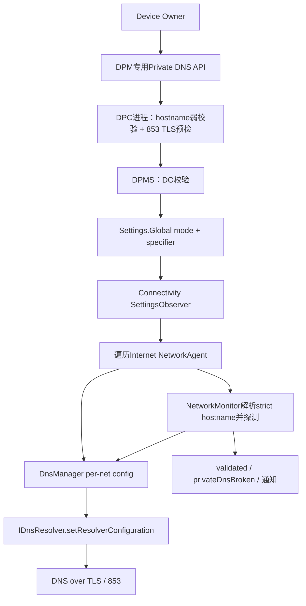
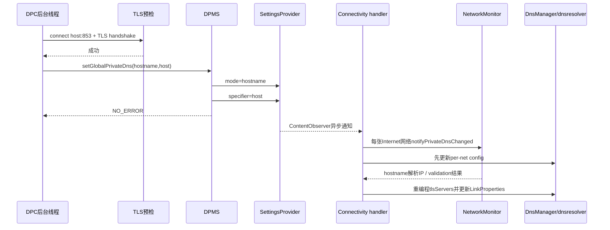
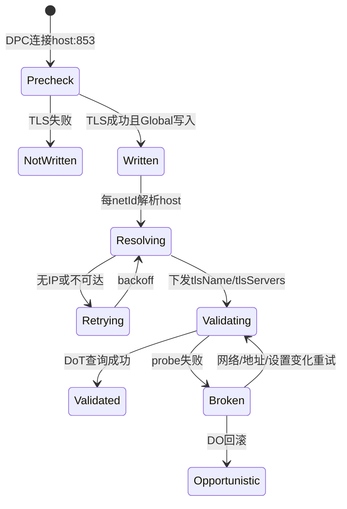

# 314 Android 企业 Private DNS 与 DPM 全局网络设置：DO权限、DoT验证、DnsResolver及VPN组合链

## 1. 本章目标

本章从Device Owner配置全局Private DNS出发，追专用DPM API的主线程前检、Global Settings落盘、Connectivity观察、NetworkMonitor hostname解析/验证、DnsManager向dnsresolver编程，以及VPN/Lockdown组合故障。

## 2. Android 11版本边界

以 `android-11.0.0_r48` 为准，重点阅读 `DevicePolicyManager`、`DevicePolicyManagerService`、`ConnectivityService`、`DnsManager`、NetworkMonitor回调和 `PrivateDnsConnectivityChecker`。

## 3. 与第41章分工

第41章讲通用DNS查询、netId、缓存与DoT；本章聚焦企业管理员能写什么、专用API返回值意味着什么，以及策略写入后怎样异步成为每张网络的resolver配置。

## 4. Private DNS是全局策略

r48用 `Settings.Global.PRIVATE_DNS_MODE` 与 `PRIVATE_DNS_SPECIFIER` 保存，影响设备上的Internet网络，而非仅DPC所在用户的一份per-user偏好。

## 5. 因此只有DO

专用 `setGlobalPrivateDns*` 和getter都调用 `enforceDeviceOwner(who)`；Profile Owner即使管理工作资料，也不能改变整个设备的全局DoT提供者。

## 6. 三种公开查询模式

DPM定义OFF、OPPORTUNISTIC、PROVIDER_HOSTNAME和UNKNOWN。专用setter只暴露opportunistic与specified-host，未提供“关闭Private DNS”的企业便捷方法。

## 7. opportunistic语义

对网络下发的DNS服务器尝试DoT握手；验证成功则加密查询，不能建立TLS时可回退明文。它优先可用性，不提供strict的强制身份保证。

## 8. specified host语义

指定一个DoT hostname；系统解析其IP、以该hostname进行TLS身份验证，并在strict模式下要求使用它。验证失败可能让普通域名解析不可用。

## 9. 四本状态账

Global settings保存期望；DnsManager按netId保存PrivateDnsConfig；dnsresolver持每网servers/tlsServers/tlsName；LinkProperties/NetworkCapabilities保存已验证server与broken状态。

## 10. 企业Private DNS总链

## 11. 专用API优于裸setGlobalSetting

虽然r48 generic global whitelist仍包含两个Private DNS键，专用API提供DO语义、hostname检查、错误码和成对写mode/specifier。直接分别写两键更容易产生瞬时或永久不一致。

## 12. setGlobalSetting权限

通用setter用 `USES_POLICY_DEVICE_OWNER`检查，因此也只有DO；不在GLOBAL_SETTINGS_WHITELIST且非demo设备会SecurityException。

## 13. Global whitelist范围

r48还允许ADB、ADB Wi-Fi、自动时间/时区、data roaming、Wi-Fi sleep、stay awake、DO Wi-Fi lockdown等少数键。DPM不是任意WRITE_SECURE_SETTINGS后门。

## 14. deprecated global keys

BLUETOOTH_ON、DEVELOPMENT_SETTINGS_ENABLED、MODE_RINGER、NETWORK_PREFERENCE、WIFI_ON等会记录“no longer supported”并直接return，为兼容旧DPC不抛SecurityException。

## 15. 审计事件在校验前

`setGlobalSetting()`先写DevicePolicy事件再进入Owner与allowlist校验，因此事件可能记录一次最终被拒绝/忽略的尝试。不能把事件存在等同设置已生效。

## 16. Secure setting是另一套表

PO可写DEFAULT_INPUT_METHOD、SKIP_FIRST_USE_HINTS、旧INSTALL_NON_MARKET_APPS；DO额外可写LOCATION_MODE。Private DNS不在Secure表，而在Global表。

## 17. Android R的location变化

target R等兼容门启用后，DO再用setSecureSetting写LOCATION_MODE会UnsupportedOperationException，应改用 `setLocationEnabled()`；说明Generic setting API会逐步被类型安全专用API替代。

## 18. Private DNS也有专用API

这正是企业代码应避免裸写字符串的原因：专用API把合法mode/host组合固定下来，也为调用线程和连通性预检提供文档合同。

## 19. Opportunistic setter

客户端拒parent instance；service不存在返回FAILURE_SETTING，否则调用 `setGlobalPrivateDns(admin, OPPORTUNISTIC, null)`，没有阻塞网络探测。

## 20. Specified-host setter

要求host非null，先做弱hostname验证；若通过则在DPC调用进程同步尝试连接host:853并完成TLS handshake，失败返回HOST_NOT_SERVING，不调用DPMS写设置。

## 21. 为什么标WorkerThread

预检socket connect和TLS handshake最多可阻塞数秒，且DNS解析本身也可能等待网络。DPC必须在后台线程调用，避免UI冻结/ANR。

## 22. 预检在哪里运行

`PrivateDnsConnectivityChecker`由DevicePolicyManager客户端直接调用，所以使用DPC进程当时可见的默认网络、DNS、代理外条件，而不是system_server强制指定的某张network。

## 23. 预检超时

checker连接TCP 853并设5秒SO timeout，然后startHandshake；任何IOException返回false。它不是对设备所有网络逐一验证。

## 24. TLS验证

使用默认SSLSocketFactory，握手会校验证书链并从InetSocketAddress提取peer hostname用于SNI等；但checker没有显式设置HTTPS endpoint-identification算法，因此“预检握手成功”不能严格证明证书SAN匹配该host。真正strict resolver仍需按tlsName验证。

## 25. TrafficStats标签

checker把当前线程tag设为系统应用DNS相关标签，但r48代码没有在finally恢复旧tag。DPC若复用该线程做其他网络I/O，统计归属可能被影响，这是客户端实现边界。

## 26. weak hostname规则

只允许字母、数字、下划线、点和短横线，并显式拒绝IPv4/IPv6 literal；它不是完整RFC域名验证，名字含下划线仍可能通过“weak”检查。

## 27. 非法host的两级处理

客户端仅在weak valid时做连接检查；weak invalid不会在客户端立即抛，但进入DPMS后再次检查并抛IllegalArgumentException。最终仍不会写入非法字符串。

## 28. 为什么不能传IP

strict模式需要TLS hostname/SNI与证书身份，并在不同网络解析到可达地址；DPM明确要求provider hostname，不接受裸IP规避名字验证。

## 29. HOST_NOT_SERVING的局限

它只表示调用时从DPC默认网络未成功完成一次853 TLS握手；可能是临时断网、防火墙、当前DNS故障或证书链问题，不必然证明服务器永久不支持RFC7858。

## 30. NO_ERROR的局限

一次预检握手成功并写Global settings，不保证预检已经完成严格SAN匹配，也不保证所有Wi-Fi、蜂窝、VPN底层和未来网络都能解析并到达该host。

## 31. DPMS feature门

设备没有Device Admin feature时setter返回FAILURE_SETTING，getter返回UNKNOWN/null；不是所有Android形态都支持企业管理API。

## 32. DPMS严格DO门

who非null且必须是Device Owner。没有delegate、Profile Owner或NetworkStack代替写入的分支；NetworkStack权限只出现在其他DPM网络查询等接口。

## 33. Opportunistic参数校验

mode为OPPORTUNISTIC时host必须empty；带host会IllegalArgumentException，避免“模式说自动、specifier又指定固定host”的矛盾配置。

## 34. Strict参数校验

PROVIDER_HOSTNAME要求host非空且weak valid；其他mode包括OFF/UNKNOWN传入setter都会IllegalArgumentException。

## 35. 成对写入顺序

`putPrivateDnsSettings(mode,host)`在clean identity里先写PRIVATE_DNS_MODE，再写PRIVATE_DNS_SPECIFIER。两次Global写不是数据库原子事务，observer可能看见短暂中间态。

## 36. Opportunistic清specifier

切回opportunistic时显式把specifier写null，避免旧strict hostname留在设置中误导诊断或未来模式切换。

## 37. Strict写specifier

mode写字符串`hostname`，specifier写实际host。DnsManager只有mode等于provider-hostname时才读取specifier构造strict config。

## 38. returnCode实现

r48 DPMS有效两种模式均无条件返回NO_ERROR；`PRIVATE_DNS_SET_ERROR_FAILURE_SETTING`主要用于client无service/feature缺失，并不反馈SettingsProvider落盘或后续resolver编程是否成功。

## 39. setter没有事件日志

专用 `setGlobalPrivateDns()`这段没有像generic setGlobalSetting那样显式DevicePolicyEventLogger调用。审计时不要假设所有专用网络策略都有相同事件。

## 40. getter读取Global

getMode若mode为null就用 `PRIVATE_DNS_DEFAULT_MODE_FALLBACK`，r48即opportunistic；识别off/opportunistic/hostname，否则返回UNKNOWN。

## 41. getHost不看mode

DPMS直接返回PRIVATE_DNS_SPECIFIER。若外部/旧代码留下host但mode非hostname，getter仍可能返回字符串；调用方要结合mode解释。

## 42. Global不是Owner专属文件

策略值不写ActiveAdmin XML，而写SettingsProvider的Global表。Owner清除时能否恢复默认取决于显式清理/重置路径，不能只看device_policies.xml。

## 43. DISALLOW_CONFIG_PRIVATE_DNS

这是User Restriction，阻止用户在Settings修改Private DNS；它不等于指定某个resolver，也不自动改变当前mode。企业常将DO setter与该restriction组合使用。

## 44. restriction对Global reset

Connectivity factoryReset只有在没有DISALLOW_CONFIG_PRIVATE_DNS时，才把mode改回opportunistic。该限制用于防止用户借网络重置绕过企业配置。

## 45. SettingsObserver

Connectivity为PRIVATE_DNS_DEFAULT_MODE、MODE和SPECIFIER三个URI注册observer；任一变化发送EVENT_PRIVATE_DNS_SETTINGS_CHANGED到Connectivity handler。

## 46. 为什么要观察default mode

当显式mode为空时，DnsManager退回PRIVATE_DNS_DEFAULT_MODE，再退回代码fallback。设备资源/系统默认变化也应触发重新配置。

## 47. 设置传播时序

## 48. DPM返回早于传播完成

NO_ERROR在Global writes之后立即返回，ContentObserver、NetworkMonitor解析、dnsresolver配置和DoT验证都在随后异步进行。不要马上用getter成功推断全设备DNS已切换。

## 49. 处理线程

DnsManager文档要求除诊断getter外都在ConnectivityService线程调用；Settings变化被消息串行化，避免并发修改per-net map。

## 50. 遍历所有网络

settings changed时Connectivity遍历 `mNetworkAgentInfos`，为每张符合条件的网络处理Private DNS，并在需要validation时刷新LinkProperties。

## 51. 只作用Internet网络

`networkRequiresPrivateDnsValidation()`为false的IMS等非Internet网络直接跳过；Private DNS不是强塞给设备内部每个netId的resolver。

## 52. 新网络也读取当前配置

NetworkAgent首次进入CONNECTED时也调用per-network处理，因此策略设置后新出现的Wi-Fi/蜂窝无需DPC再次写入。

## 53. DnsManager全局转per-net

它从Global构造PrivateDnsConfig，再由Connectivity把同一政策放入每个network.netId的map；网络解析出的strict IP却可因可达性不同而不同。

## 54. OFF配置

mode字符串为空并不等off：会走default/fallback。只有明确值`off`才构造useTls=false；专用DO setter本身不提供off入口。

## 55. Opportunistic配置对象

useTls=true、hostname为空；dnsresolver的tlsServers直接使用LinkProperties普通DNS servers，tlsName为空，逐server尝试机会式DoT。

## 56. Strict配置对象

hostname非空；初始ips可为空，NetworkMonitor负责解析provider name并把结果回调Connectivity，随后更新DnsManager per-net config。

## 57. 为什么先更新空strict config

r48支持Private DNS bypass，Connectivity可先把strict hostname配置送入DnsManager，即使IP尚未解析；NetworkMonitor稍后补IP，避免阻塞主handler。

## 58. hostname解析重试

DnsManager类注释说明NetworkMonitor对未解析出IP的strict host使用简单backoff重新执行CMD_EVALUATE_PRIVATE_DNS，而不是一次失败永久放弃。

## 59. resolved回调

NetworkMonitor通过 `notifyPrivateDnsConfigResolved()`带PrivateDnsConfigParcel回system_server，Connectivity发EVENT_PRIVATE_DNS_CONFIG_RESOLVED并调用updatePrivateDns。

## 60. tlsServers可达过滤

strict模式只把已解析IP中 `LinkProperties.isReachable(ip)` 的地址写入tlsServers。解析成功但该网络无路由可达时，列表仍可能为空。

## 61. 普通servers仍保留

ResolverParamsParcel.servers始终来自LinkProperties DNS；strict还设置tlsName与tlsServers。是否允许回退由resolver的strict配置语义决定，不是删掉普通server字符串。

## 62. resolver参数

除servers/domains外，还下发sample validity、success threshold、min/max samples、transportTypes与ResolverOptions；Private DNS是在完整per-net resolver配置中收敛。

## 63. 编程入口

DnsManager调用 `IDnsResolver.setResolverConfiguration(paramsParcel)`；RemoteException或ServiceSpecificException只记录错误并return，不回滚Global policy。

## 64. 又一个“策略成功、执行失败”窗口

DPM早已返回NO_ERROR，即使dnsresolver配置失败。后续网络/LinkProperties变化可能再次send配置，但企业监控仍应观察resolver与实际查询。

## 65. validation map

useTls时为netId建立PrivateDnsValidationStatuses，并按tlsServers+tlsName跟踪；off时移除。结果不是单个设备全局boolean。

## 66. opportunistic成功判定

只要该网络至少一个server的DoT验证成功，LinkProperties可标记usingPrivateDns并列出validated servers；失败仍可用明文DNS，不一定privateDnsBroken。

## 67. strict状态展示

strictMode时LinkProperties的usePrivateDns直接为true并设置serverName，即使验证尚未成功；validated server列表单独反映已通过的IP。

## 68. 不要把usePrivateDns当握手成功

在strict下它表达政策启用，不等价validated。诊断需同时看privateDnsServerName、validatedPrivateDnsServers和NetworkCapabilities privateDnsBroken。

## 69. 探测方式

NetworkMonitor在成功解析strict host后发起一次使用Private DNS的随机/一次性hostname lookup，借此验证TLS resolver真正能完成查询。

## 70. broken能力

probe完成但Private DNS probe未成功时，Connectivity把networkCapabilities.privateDnsBroken设true并更新capabilities。

## 71. broken通知

每次从正常变broken且此前未展示时，显示PRIVATE_DNS_BROKEN系统通知；恢复/重新评估会清状态与相应通知标记。

## 72. 网络仍可能显示连接

IP连通、TCP甚至HTTP探测可能正常，但strict DoT失败导致域名解析不可用。用户感知为“Wi-Fi已连接但应用打不开域名”。

## 73. 明文IP访问不代表DNS健康

用IP直连能成功只证明路由/传输可用；Private DNS故障需以目标netId的DNS查询、853 TLS和validation状态判断。

## 74. Captive portal冲突

门户登录前网络可能只允许其DNS/HTTP并阻断853；strict Private DNS会妨碍解析登录页面。企业Wi-Fi应避免交互门户或对DoT基础设施做预认证放行。

## 75. host自身如何解析

系统必须先用网络可用的非strict/bootstrap DNS解析Private DNS hostname，之后才能用其IP建立DoT；这是strict配置中不可消除的引导依赖。

## 76. DNS劫持风险边界

bootstrap解析可能被网络篡改到错误IP，但TLS hostname与系统信任验证应阻止冒充；攻击者仍可造成拒绝服务，不能轻易窃取通过验证的DoT内容。

## 77. 证书要求

DoT服务证书需链到设备信任锚、时间有效并匹配hostname。企业私有CA若未正确进入系统/受管信任路径，DPM客户端预检和后续resolver都可能失败。

## 78. 网络切换

DPC预检只发生setter当时；之后从企业Wi-Fi切蜂窝，每张新网络会独立解析/验证。某网络成功不能代表另一网络可用。

## 79. 多IP提供者

NetworkMonitor可解析多个IPv4/IPv6，DnsManager只下发当前network可达者；validation状态按netId、IP、hostname跟踪，部分IP失败不等所有地址失败。

## 80. TTL与变化

provider地址变化依赖重新解析与NetworkMonitor backoff/网络事件收敛。不要把第一次resolved IP当永久固定地址加入防火墙而无DNS更新策略。

## 81. VPN组合的官方警告

DPM文档明确：指定Private DNS与VPN并用时resolver必须在VPN内外都可达，否则system traffic到resolver可能不走VPN并导致设备失去域名解析。

## 82. 为什么需要“内外可达”

VPN建立前要解析VPN网关/访问DoT；VPN建立后目标netId和路由又可能改变。只在隧道内可达会卡建链，只在外可达则可能被Lockdown/路由阻断。

## 83. Always-on Lockdown组合

VPN provider UID虽可访问底层网络，但系统DNS/DoT流量的UID、netId与protect路径不等同provider业务socket。必须在真实设备上验证Lockdown规则没有封住853。

## 84. VPN提供DNS

VPN LinkProperties可声明隧道DNS server；Private DNS opportunistic会尝试对它们做DoT，strict则继续使用指定host。企业VPN设计需明确由谁提供递归解析。

## 85. split tunnel组合

即便VPN只覆盖部分应用，Private DNS是全局/每Internet网络政策；查询可能走不同netId。应用流量路由与其DNS查询路径不应靠直觉假设一致。

## 86. provider是域名时的循环

若VPN网关也用域名，而该域名只能通过strict resolver解析，strict resolver又只能通过VPN到达，就形成启动环。至少一个bootstrap路径必须在隧道外成立。

## 87. 安全上线流程

先保证DoT host在Wi-Fi/蜂窝/VPN内外可解析和853可达，部署证书链；后台调用specified-host，等待每个关键netId validated，再施加DISALLOW_CONFIG_PRIVATE_DNS与Lockdown。

## 88. 回滚流程

strict故障时DO可切opportunistic并清specifier；等待observer传播和resolver重编程后再判断恢复。不要只改host为空而保留mode=hostname。

## 89. 为什么没有专用OFF

企业API偏向维持加密DNS尝试或指定严格provider；若产品确需off，r48 generic Global whitelist技术上允许DO写，但应谨慎处理成对键与版本兼容。

## 90. strict故障状态机

## 91. precheck失败不改旧策略

HOST_NOT_SERVING在客户端调用service前返回，因此设备继续使用此前mode/host。DPC UI应显示“新设置未应用”，不能误认为系统自动回到opportunistic。

## 92. service写入失败不可见

DPMS的settings put没有检查布尔返回，仍返回NO_ERROR；极端SettingsProvider故障需靠getter与ContentObserver后的实际状态发现。

## 93. observer通知可合并

mode和specifier连续写可能产生两次消息；handler每次读取当时完整Global状态并重配所有网络。中间态可能短暂触发额外解析，但最终以最后快照收敛。

## 94. getter读到目标不等执行完成

getMode/getHost直接读Settings，不查DnsManager或validation；它们适合确认政策存储，不适合确认DoT业务健康。

## 95. 应用可见状态

应用可通过Network/LinkProperties相关API看到Private DNS server name和validated addresses的受限视图，但真正诊断常需dumpsys connectivity/dnsresolver与系统权限。

## 96. 缓存影响

设置切换会更新resolver配置，Java/native DNS缓存也可能保留旧结果短时间。用已有域名请求不能精确证明新DoT已工作，应使用随机测试名或受控低TTL域名。

## 97. IP literal绕过DNS

Private DNS只保护名字解析，不加密应用到目标服务器的业务流量，也不能阻止应用直接连接IP。网络DLP仍需VPN、代理、防火墙与TLS策略协作。

## 98. DoT不是内容过滤

指定resolver决定递归查询去向和传输保护；是否过滤恶意域名、记录日志、按用户策略返回结果是resolver运营能力，不由Android自动提供。

## 99. 日志隐私

Private DNS减少本地网络看到明文查询，但resolver运营方仍能看到域名。企业应告知用户、限制保留期并保护resolver访问日志。

## 100. 时钟依赖

TLS证书验证依赖正确时间；若自动时间被DO关闭且设备时钟漂移，Private DNS与VPN mTLS可能同时失败。网络设置不是互相独立的开关。

## 101. 代理关系

PrivateDnsConnectivityChecker直接创建SSLSocket到853，不走HTTP CONNECT代理语义；只允许Web代理而禁止直连853的网络会让预检失败。

## 102. IPv6边界

host可解析AAAA，但DnsManager只保留LinkProperties判断可达的IP。没有可用IPv6默认路由时不应仅因AAAA存在认为DoT可用。

## 103. fail-open与fail-closed

Opportunistic验证失败回明文，属于DNS层fail-open；specified-host失败阻断正常解析，属于fail-closed。选择前必须与业务可用性和合规目标一致。

## 104. 监控指标

按网络记录mode/host、resolved IP数、validated IP数、privateDnsBroken、853握手时延、DNS成功率、VPN状态和网络transport；避免只报一个设备级“DNS正常”。

## 105. 故障定位顺序

先查Global mode/specifier，再查目标network LinkProperties DNS与路由、bootstrap A/AAAA、853 TCP/TLS证书、DnsManager tlsServers、dnsresolver配置、validation/broken，最后查VPN/Lockdown。

## 106. 常见误判一

“DPM返回NO_ERROR，所以DoT已经验证”是错的。NO_ERROR主要证明service接受并写了设置；per-network传播与validation随后异步发生。

## 107. 常见误判二

“opportunistic启用就绝无明文DNS”是错的。它允许TLS失败时回退普通DNS，只有strict provider-hostname提供强制语义。

## 108. 常见误判三

“getHost非null说明当前strict”是错的。getter不看mode，遗留specifier可能存在；必须先查mode是否PROVIDER_HOSTNAME。

## 109. 常见误判四

“Wi-Fi上预检成功，VPN内一定成功”是错的。官方文档要求resolver在VPN内外都可达，且每个netId独立解析与验证。

## 110. 常见误判五

“Private DNS能替代VPN”是错的。它只保护DNS查询传输，不能隐藏目标IP、加密普通业务流量或阻止IP直连。

## 111. 企业最小闭环

DO后台预检并写策略→读取Global确认→等待关键网络validated→做随机域名正/负测试→验证VPN内外→施加用户配置限制→持续健康监测→准备opportunistic回滚。

## 112. macOS只读练习一：对比专用与通用setter

阅读DPMS的 `setGlobalSetting()` 与 `setGlobalPrivateDns()`，列出权限门、允许mode、host检查、事件日志、返回值和两键写入差异；无需编译。

## 113. macOS只读练习二：核对客户端预检

执行 `sed -n '11455,11495p' frameworks/base/core/java/android/app/admin/DevicePolicyManager.java` 与 `sed -n '33,80p' frameworks/base/core/java/android/net/PrivateDnsConnectivityChecker.java`，标注运行进程、5秒超时、默认信任和失败返回。

## 114. macOS只读练习三：追per-net编程

执行 `sed -n '3150,3210p' frameworks/base/services/core/java/com/android/server/ConnectivityService.java` 与 `sed -n '345,415p' frameworks/base/services/core/java/com/android/server/connectivity/DnsManager.java`，画出settings→NetworkMonitor→resolver。

## 115. macOS只读练习四：推演VPN循环依赖

假设VPN网关`vpn.corp`只能由企业DoT解析，而DoT `dns.corp`只能从隧道内853到达；写出启动失败循环，并给出至少两种打破bootstrap循环的设计。

## 116. 最小判断口诀

mode/host回答“想怎么解析”，tlsServers回答“此网络准备连谁”，validated servers回答“谁握手成功”，privateDnsBroken回答“strict探测是否坏”，随机查询才回答“业务此刻能否解析”。

## 117. 关键源码入口

DPM 11400附近看专用API；DPMS 15550附近看DO门与Global写；Connectivity 3164附近看settings传播；DnsManager看ResolverParamsParcel；checker看客户端预检。

## 118. 本章复读修正

复读后确认：客户端预检发生在DPC进程默认网络且未显式开启HTTPS endpoint identification；NO_ERROR不等待per-net验证；strict的usePrivateDns标记不等validated；getHost不自动核对mode；resolver编程失败不回滚Global。

## 119. 本章结论

企业Private DNS是一条“DO全局意图→Settings异步传播→每网络hostname解析→dnsresolver DoT配置→validation状态”的链。正确性必须按netId验证，尤其要处理VPN内外可达、bootstrap和fail-closed故障。

## 120. 下一章预告

下一章进入企业Wi-Fi策略：DO/PO添加网络、WifiConfigManager持久化、Device Owner configured networks lockdown、用户修改边界、证书与Passpoint配置及网络选择协作。
