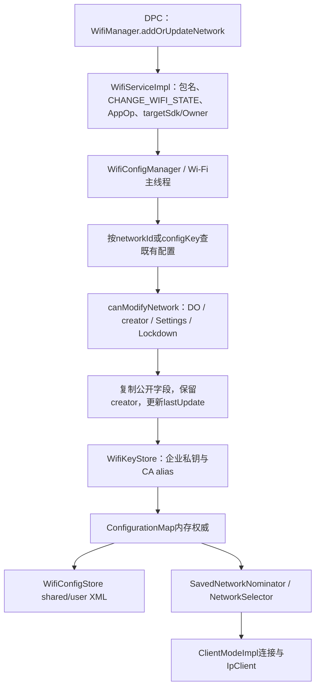
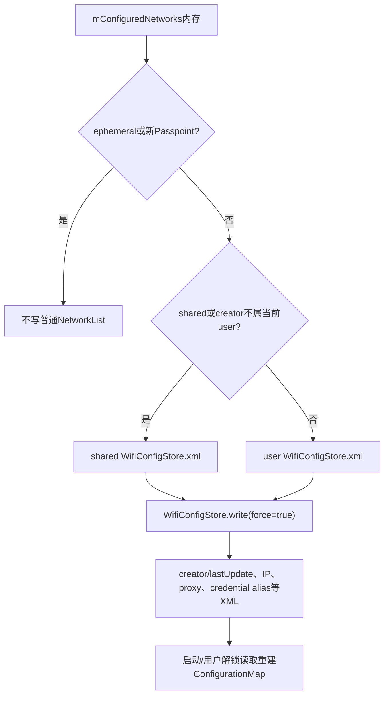
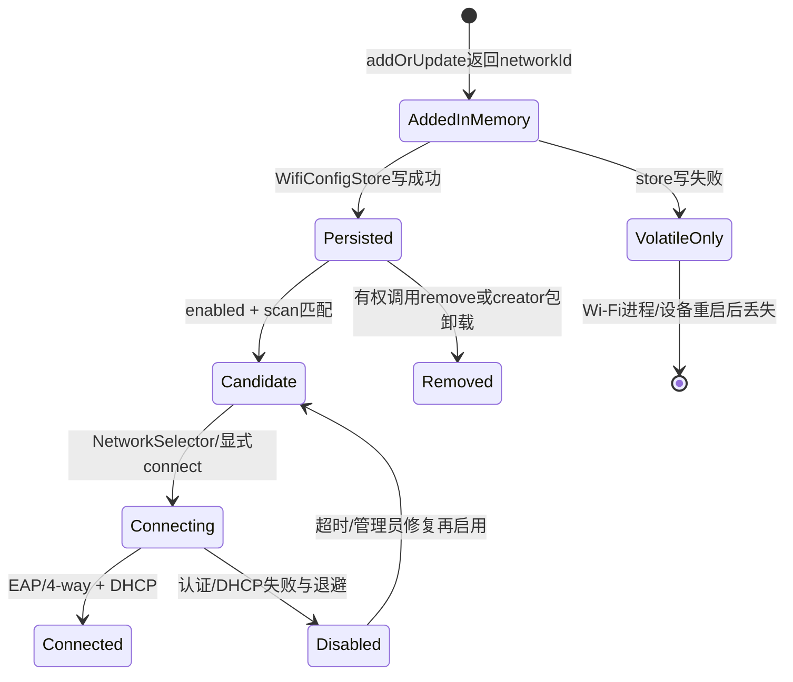

# 315 Android 企业 Wi-Fi 配置：Creator归属、Lockdown修改门、WifiConfigStore、证书及网络选择链

## 1. 本章目标

本章追踪DPC通过WifiManager添加/更新saved network的路径，重点解释creatorUid/creatorName怎样形成所有权、DO configured-networks lockdown怎样参与修改授权、配置怎样写shared/user store，以及企业证书、Passpoint与选网的边界。

## 2. Android 11版本边界

以 `android-11.0.0_r48` 为准，核心阅读 `DevicePolicyManagerService`、`WifiServiceImpl`、`WifiConfigManager`、`WifiConfigStore`、`WifiKeyStore`、`PasspointManager` 和 `WifiPermissionsUtil`。

## 3. DPM不直接添加Wi-Fi

DPM只提供“锁住管理员创建网络”的策略setter；真正新增、更新、删除与启用网络仍由DPC调用WifiManager，进入Wi-Fi system service。

## 4. Lockdown不是Wi-Fi开关

`setConfiguredNetworksLockdownState(true)`不会打开Wi-Fi、不会创建SSID，也不会强制立即连接；它只改变后续调用者是否可修改某类已保存配置。

## 5. Lockdown也不锁所有网络

r48 `canModifyNetwork()`只把creator被识别为Device Owner的配置视为eligible。用户自己、普通应用、系统或其他来源创建的配置不因全局位自动全部冻结。

## 6. 四张状态账

Global setting保存Lockdown开关；WifiConfiguration保存creator/lastUpdate与凭据引用；WifiConfigStore保存网络快照；WifiNetworkSelector/ClientModeImpl保存当前候选、禁用原因和连接运行态。

## 7. 管理角色

设置Lockdown API允许Device Owner或organization-owned managed profile的Profile Owner；普通PO与delegate不可调用。网络新增本身则由WifiService分别识别DO/PO作为privileged调用者。

## 8. 作用域的微妙之处

Lockdown值位于Settings.Global，是设备级单值；但network creator带UID/user。组织所有PO能改全局开关，不代表其创建配置在r48执行层一定被判为DO-created。

## 9. 先区分三种供网方式

Saved WifiConfiguration是系统持久网络；WifiNetworkSuggestion是应用建议、按应用管理；WifiNetworkSpecifier是一次请求。configured-network lockdown主要针对第一类creator所有权。

## 10. 企业saved network总链



## 11. DPC仍需CHANGE_WIFI_STATE

WifiService `enforceChangePermission(packageName)`先用AppOps checkPackage核对UID与包，再接受NETWORK_SETTINGS或要求CHANGE_WIFI_STATE并note对应AppOp。Owner身份不替代基本Wi-Fi权限合同。

## 12. 包名不可伪造

`mAppOps.checkPackage(Binder.getCallingUid(),callingPackage)`阻止DPC传另一个包名冒充creator；creatorName会成为后续DO识别和卸载清理依据。

## 13. Q以后旧API限制

addOrUpdateNetwork/remove/enable等传统API对target Q+普通应用收紧；`isTargetSdkLessThanQOrPrivileged()`仍把DO、PO、系统/privileged等纳入例外，所以DPC可继续管理saved networks。

## 14. 权限失败的两种形状

缺CHANGE_WIFI_STATE会SecurityException；AppOp为ignored时service通常静默返回-1/false。DPC不能只捕异常，还要检查返回networkId或boolean。

## 15. 调用跨线程

WifiService Binder线程通过 `mWifiThreadRunner.call()`把修改串到Wi-Fi主线程；WifiConfigManager注明自身非线程安全，只应在该线程使用。

## 16. 返回-1含义

WifiConfiguration.INVALID_NETWORK_ID表示校验、授权、证书、store前置或其他更新失败；它不是合法配置ID。新建成功才返回分配的networkId。

## 17. networkId不是永久业务ID

内部递增分配，重置/迁移/删除后不适合作为企业云端唯一键。SSID+security/configKey仍可能冲突，DPC应有自己的策略ID映射。

## 18. 新增与更新判定

先按提供networkId或configKey查现有内部配置；找不到走新增并再次用规范化后的key查重，找到则转更新。

## 19. 新增校验

`WifiConfigurationUtil.validate(...VALIDATE_FOR_ADD)`检查SSID、安全参数等结构；无效直接返回失败，不会留下半个内存配置。

## 20. 更新校验

现有配置走VALIDATE_FOR_UPDATE，再调用 `canModifyNetwork(existing,uid,package)`；更新权限看旧配置creator，不信任外部对象伪造creatorUid。

## 21. 外部对象不是权威

WifiConfigManager对外返回的WifiConfiguration都是副本；修改副本字段本身无效，必须带networkId通过API重新提交并再次过授权。

## 22. creator如何写入

新增内部配置时，creatorUid和lastUpdateUid都设为Binder calling UID；creatorName/lastUpdateName取calling package或PM按UID反查名称。

## 23. creator为何关键

它决定谁是原创建者、配置放哪个user store、包卸载是否删除、Lockdown是否eligible，以及部分凭据/Passpoint管理权限。

## 24. 更新不转移creator

更新基于旧内部配置拷贝，只改lastUpdateUid/Name，不改creator。即便DO修改用户创建网络，它仍不是“由DO创建”的Lockdown eligible配置。

## 25. DO可修改所有网络

`canModifyNetwork()`最先识别当前调用UID/package是否Device Owner，是则直接true；Lockdown不会反过来阻止DO更新或删除其自身及其他来源配置。

## 26. System与Wi-Fi UID例外

SYSTEM_UID总能改；WIFI_UID可管理Passpoint生成配置，并可为SIM EAP网络回写anonymous identity。这些是框架维护路径，不是用户绕过。

## 27. 普通配置的默认修改门

若旧creator不是DO，creator本人或持NETWORK_SETTINGS的Settings可修改。Profile Owner虽能作为privileged新增，后续canModify并没有通用“当前PO可改所有网络”分支。

## 28. DO-created的Lockdown门

若creatorUid/creatorName仍被WifiPermissionsUtil识别为当前Device Owner，则配置eligible；当前调用者又不是DO时，只有Lockdown=false且调用者有NETWORK_SETTINGS才能改。

## 29. creator本人也会被锁

eligible配置的非DO调用者分支不再看isCreator。典型边界是共享UID兄弟包：UID等于creatorUid，但calling package不是DO包；Lockdown=true时仍不能只靠“UID相同”绕过。

## 30. Settings用户修改

Lockdown=false时NETWORK_SETTINGS调用者可改DO-created配置；true时返回false。UI应据此禁用/拒绝编辑，但最终安全门在WifiConfigManager。

## 31. Global开关

DPMS写 `Settings.Global.WIFI_DEVICE_OWNER_CONFIGS_LOCKDOWN` 为1/0；getter只读大于0。没有ActiveAdmin逐网列表或per-user副本。

## 32. 专用DPM API

Android R推荐 `setConfiguredNetworksLockdownState()`，旧DO也可用 `setGlobalSetting(WIFI_DEVICE_OWNER_CONFIGS_LOCKDOWN,...)`；专用API把允许角色扩展到组织所有PO并表达清晰语义。

## 33. Owner权限门

DPMS使用 `enforceDeviceOwnerOrProfileOwnerOnOrganizationOwnedDevice(who)`；个人设备上的普通managed-profile PO不能设置全局锁定。

## 34. parent instance仍被拒绝

客户端throwIfParentInstance；组织所有PO直接以自身admin调用全局API，而不是通过parent DPM实例。

## 35. 值写入与事件

clean identity写Global后记录 `ALLOW_MODIFICATION_OF_ADMIN_CONFIGURED_NETWORKS`事件并把lockdown布尔写入；事件名像“允许修改”，参数却是lockdown，分析日志时要结合源码而非只看枚举名。

## 36. 不需要重写每个配置

WifiConfigManager每次canModifyNetwork时实时读Global位，所以开关切换无需遍历网络或修改其XML；既有DO creator标记立即受到新规则。

## 37. Global传播延迟

这里没有专门通知WifiConfigManager缓存，因为它每次检查直接Settings.Global.getInt；setter返回后后续修改调用通常立刻读新值。

## 38. r48组织所有PO执行疑点

API允许organization-owned PO设置，但 `isConfigEligibleForLockdown`只调用 `isDeviceOwner(config.creatorUid,creatorName)`；WifiPermissionsUtil的isDeviceOwner严格查询实际DO，不把PO算DO。

## 39. 疑点的直接后果

按这段r48代码，组织所有PO创建的saved network可能不被标成eligible，从而Settings用户仍能按普通规则修改；全局位主要锁真正DO-created配置。

## 40. 为什么需要实机/OEM验证

OEM可能修改Wifi栈或DPC可能借system/ManagedProvisioning身份创建网络，改变creator。故正文记录源码行为与风险，不把所有组织所有设备一概断言为失效。

## 41. add/update与Lockdown时序

```text
sequenceDiagram
    participant DPC as DPC
    participant WS as WifiService Binder
    participant WCM as WifiConfigManager
    participant SET as Settings.Global
    participant STORE as WifiConfigStore
    DPC->>WS: addOrUpdateNetwork(config,pkg)
    WS->>WS: UID↔pkg + CHANGE_WIFI_STATE/AppOp + Owner例外
    WS->>WCM: Wi-Fi主线程调用
    WCM->>WCM: 找现有internal config
    alt 新增
        WCM->>WCM: creatorUid/name = caller
    else 更新
        WCM->>SET: 若旧creator为DO则读Lockdown
        SET-->>WCM: 0或1
        WCM->>WCM: 允许/拒绝；保留creator，改lastUpdate
    end
    WCM->>STORE: 非ephemeral/非Passpoint强制写
    WCM-->>DPC: networkId或-1
```

## 42. 字段合并

新增先设DHCP、无proxy、disabled等默认，再合并外部公开字段；更新在旧配置副本上只覆盖外部显式字段，避免外部对象清空系统内部状态。

## 43. networkId/status不直接复制

networkId由内部管理；status通过enable/disable API改变。DPC在WifiConfiguration里随意写status不会替代专门状态机。

## 44. hidden字段新增限定

requirePmf、ephemeral、fromSuggestion/fromSpecifier、shared等内部/隐藏属性只在新增时复制，更新时不会让普通外部对象篡改来源身份。

## 45. shared配置

externalConfig.shared会进入内部配置；saveToStore时shared网络写shared general store，跨用户可见性仍由ConfigurationMap与权限过滤控制。

## 46. private配置

非shared且creator属于当前user的网络写user general store；用户未解锁/切换时store读写生命周期会影响其是否加载进内存。

## 47. WifiConfigStore持久化链



## 48. 文件名相同目录不同

shared与user general都叫WifiConfigStore.xml，但位于不同system/DE/CE相关目录；不要因basename相同误认覆盖同一文件。

## 49. 强制写

saved network新增/更新在非ephemeral且非Passpoint时调用 `saveToStore(true)`；返回值未一路作为networkId失败传播，写异常可能导致内存成功但重启丢失。

## 50. Pending store read门

在store尚未读取完成时add/update直接失败，避免新配置随后被磁盘旧快照覆盖。DPC开机过早下发要处理重试。

## 51. 写盘失败边界

WifiConfigStore IOException/IllegalState/XML异常会wtf日志并返回false；上层已把配置放入内存且addOrUpdate返回结果未检查saveToStore返回，形成“当前可用、重启可能消失”。

## 52. 变化广播隐私

Android R不再在CONFIGURED_NETWORKS_CHANGED广播附WifiConfiguration；总把multiple=true且config extra=null，避免凭据/SSID细节被广播观察者获取。

## 53. 广播不能证明持久化

广播在saveToStore之前发送；接收者看到changed只说明内存更新路径成功，不保证XML写盘完成。

## 54. backup通知

配置变化调用BackupManagerProxy.notifyDataChanged，提示SettingsProvider/Wi-Fi备份数据变化；企业凭据能否备份还受密钥不可导出和备份过滤约束。

## 55. 企业网络识别

非Passpoint、非Suggestion且 `config.isEnterprise()` 时，WifiConfigManager调用WifiKeyStore.updateNetworkKeys安装/更新私钥、客户端证书与CA。

## 56. 为什么不把原始key写XML

WifiKeyStore把key/cert写AndroidKeyStore并把WifiEnterpriseConfig改成alias，随后reset内存中的原始key entry；store保存引用而不是可导出的私钥字节。

## 57. alias派生

用网络credential keyId生成alias；更新时比较existing alias，成功安装新材料后删除不再需要的旧私钥/CA aliases。

## 58. 部分失败补偿

安装多个CA中途失败会删除本次已加入alias和主key；但跨Keystore与配置内存仍不是通用数据库事务，轮换需保留可重试来源。

## 59. app-installed标记

删除网络时WifiKeyStore只移除标记为app-installed的device key/cert或CA；手工用户安装的共享证书不应被网络删除顺带清掉。

## 60. Suite-B校验

WPA3-Enterprise 192-bit会根据CA证书签名算法设置Suite B cipher并拒绝不满足要求的证书；“证书能导入”不保证配置可用于该安全套件。

## 61. server身份必须验证

企业EAP配置应提供CA、domain suffix/alt subject匹配等服务器验证参数。仅用户名/密码连企业SSID会暴露evil-twin凭据风险。

## 62. 客户端私钥边界

若DPC传PrivateKey给WifiEnterpriseConfig，WifiKeyStore写入自己的alias；连接时wpa_supplicant/keystore协作签名，应用不应期待之后从WifiConfiguration取回原始key。

## 63. 证书轮换顺序

先让RADIUS信任新client CA或服务端部署双证书，再更新Wi-Fi配置并验证多AP漫游，最后撤旧；不要先删旧alias导致设备离线无法再收策略。

## 64. proxy权限

若IP configuration的proxy发生变化，调用者还需NETWORK_SETTINGS、DO、PO、SetupWizard或ManagedProvisioning等权限之一；普通creator不能仅凭创建权设置代理。

## 65. static IP边界

IP变更会在NetworkUpdateResult标记，通知IpClient重建；配置保存成功不等当前连接立即取得可达地址，仍要观察provisioning结果。

## 66. MAC randomization权限

r48修改randomization setting要求NETWORK_SETTINGS/NETWORK_SETUP_WIZARD，或Passpoint creator特例；DO/PO并未在这段条件里直接列入，DPC需测试返回而非假设所有字段都可改。

## 67. credential变更

检测到安全凭据变化会把hasEverConnected重置false，后续连接重新经历认证与no-internet/selection评价。

## 68. 新配置初始状态

内部默认status disabled并带DISABLED_BY_WIFI_MANAGER，但add/update完成会对非Suggestion、合适Passpoint调用userEnabledNetwork，使saved网络进入可选状态。

## 69. add不等connect

返回networkId只证明配置进入数据库；真正连接由enable/connect或NetworkSelector扫描候选决定，还受Wi-Fi开关、信号、禁用计时、评分和用户选择。

## 70. enableNetwork两种路径

disableOthers=true走ClientModeImpl connect并用CountDownLatch等待有限时间；false只更新配置enabled状态。boolean成功也不等DHCP和Internet validation完成。

## 71. 等待超时

triggerConnect最多等待RUN_WITH_SCISSORS_TIMEOUT，超时返回false，但异步连接可能继续。DPC不要把false直接解释为配置一定无效。

## 72. remove权限

WifiService先过CHANGE_WIFI_STATE/AppOp与target/privileged门，再由WifiConfigManager canModifyNetwork；Lockdown可使Settings删除DO-created network失败。

## 73. remove副作用

删除会清enterprise keys、connect choice、内存Map、scan cache、LRU记录，发变化广播并强制写store；不是只从UI列表隐藏。

## 74. creator包卸载

WifiService监听包移除/禁用，在Wi-Fi线程调用removeNetworksForApp，按uid和creator package匹配删除其saved networks，并移除suggestions、request approvals和Passpoint provider。

## 75. DO卸载与Lockdown

正常Owner不应直接被普通卸载；退管/包删除若发生，其creator networks可能被清理。若配置因shared/migration留下，isDeviceOwner旧creator也会变false，Lockdown资格消失。

## 76. Profile Owner创建网络

PO作为privileged可调用旧saved-network API并成为creator；但普通PO既不能设置Global lockdown，配置修改仍按creator/NETWORK_SETTINGS普通分支。

## 77. 组织所有PO源码落差

它可以设置Lockdown，但它创建的creator仍只被 `isProfileOwner()`而非 `isDeviceOwner()`识别；r48执行门没有把两者合并。这是本章最需实测的版本边界。

## 78. getConfiguredNetworks限制

调用者需ACCESS_WIFI_STATE与scan/location可见性；target Q+普通应用通常拿不到列表。DO/PO被视为privileged，并可请求包含真实随机MAC等更完整视图。

## 79. 凭据仍会遮罩

普通getConfiguredNetworks返回外部副本并按权限脱敏；只有READ_WIFI_CREDENTIAL的特权API才可见更多credential。Owner身份不应被当作任意明文导出私钥能力。

## 80. PASSWORD_MASK

外部配置中的`*`可能表示“保留旧密码”，不是实际PSK。DPC更新其他字段时若错误把mask当新密码，会破坏连接合同。

## 81. Passpoint分流

旧addOrUpdateNetwork若检测isPasspoint，会转换成PasspointConfiguration并调用专用API；成功返回0且Passpoint profile没有普通networkId。

## 82. Passpoint持久化

PasspointManager自己保存provider、credential和creator，而WifiConfigManager中的动态Passpoint WifiConfiguration用于匹配/连接，不按普通saved网络写NetworkList。

## 83. Passpoint权限

专用add/update同样过CHANGE_WIFI_STATE/AppOp，target R+普通应用受限，DO/PO/privileged仍是例外；返回boolean而非networkId。

## 84. Passpoint证书

provider安装时处理CA、client chain与private key；旧WifiConfiguration转化路径会复制证书材料。证书有效不等ANQP/realm/EAP匹配正确。

## 85. Suggestion不是saved owner配置

Suggestion明确 `fromWifiNetworkSuggestion=true`，按per-app建议数据库管理；删除应用会清建议，用户可对应用建议授权，Lockdown的DO-created saved config规则不应直接套用。

## 86. Suggestion企业key

企业suggestion在加入建议时安装key，而不是WifiConfigManager普通add路径；同一SSID可同时存在saved与suggested候选，来源字段用于避免互相覆盖。

## 87. NetworkSpecifier

Specifier是应用请求某网络的临时匹配/用户选择流程，不持久成为企业managed saved network；DPC若要求自动重连，应使用合适saved/Passpoint政策而非specifier。

## 88. 选网输入

SavedNetworkNominator从可见scan与saved configs产生候选，NetworkSelector还比较禁用状态、信号、Internet历史、用户connect choice、metered和评分。

## 89. 企业creator不保证最高优先级

Lockdown只保护配置不可改，不把它设置为唯一候选或最高分。若必须禁止其他Wi-Fi，应结合用户限制、删除非合规网络和网络策略，而非只锁一个SSID。

## 90. 配置生命周期状态机



## 91. networkId成功不是持久成功

saveToStore结果没反映到public networkId，所以高可靠DPC应稍后重新读取配置、重启场景抽测，并监控WifiConfigStore写异常。

## 92. 配置可见但认证失败

SSID/security key正确只说明候选匹配；EAP identity、CA、domain、client key、系统时间和RADIUS策略任一错误都可在连接阶段失败。

## 93. 连接但无Internet

四次握手/DHCP成功后还需DNS、Private DNS、代理、VPN与NetworkMonitor验证；Wi-Fi“Connected”不等企业业务可达。

## 94. Hidden SSID

hidden网络需要主动扫描，增加功耗且SSID仍可能通过probe泄露；企业部署优先广播SSID并用WPA2/3-Enterprise身份安全，而不是靠隐藏当安全措施。

## 95. shared配置风险

shared=true可能使网络对其他用户可见/可选，creator仍是DPC UID。工作资料专用网络若误设shared，会扩大凭据使用范围。

## 96. 用户切换

ConfigurationMap按当前user/profile可见性过滤，user store随切换读取；Global Lockdown不切换，但eligible配置集合会随加载的creator网络变化。

## 97. 用户锁定

用户CE store未解锁时private网络可能尚未加载，开机早期自动连接依赖shared/DE可用配置设计。不要把DPC开机receiver时列表为空当永久丢失。

## 98. 备份恢复的creator

store序列化creatorUid/name；迁移/恢复若creator无效，NetworkListStoreData可回退SYSTEM_UID并修正名称，可能改变后续Lockdown归属判断。

## 99. UID重用风险缓解

卸载清理同时比较uid与creator package，避免只因新包复用旧UID就继承/删除旧配置。canModify的DO判断也同时需要UID所在user和packageName匹配当前DO。

## 100. 退管策略

先关闭Lockdown或明确保留策略，再删除/转移DPC-created networks与企业key，验证普通用户接管结果，最后清Owner；不要留下不可解释的shared配置。

## 101. 开启Lockdown顺序

先由DO创建并验证网络creator确属DO、连接和凭据持久稳定，再开启Lockdown；若先开后以其他身份创建，配置可能根本不eligible。

## 102. 组织所有PO建议

在r48/AOSP分支上专项测试：PO创建网络→开Lockdown→Settings尝试改/删；记录creatorUid/name和isDeviceOwner判断。若不满足需求，需要OEM修复或由受信system/DO路径配置。

## 103. 不要伪造creator

external WifiConfiguration中的creator字段新增时会被内部覆盖为Binder caller；通过反射/Parcel写假UID不能把普通网络伪装成DO-created。

## 104. 审计字段

记录networkId、configKey脱敏摘要、creatorUid/name、lastUpdateUid/name、shared、security type、enterprise aliases、store归属、Lockdown值和当前selection disable reason。

## 105. 密码日志

源码local log使用printable SSID并避免直接打印PSK；DPC与运维工具也应对SSID按政策脱敏，绝不能记录PSK、EAP password或private key。

## 106. 故障定位顺序

先查WifiService权限/AppOp/targetOwner例外，再查internal config与creator、canModify/Global位、key alias、store写入、selection disable reason、supplicant认证、IpClient、DNS/VPN。

## 107. 常见误判一

“Lockdown=true后所有Wi-Fi都不能改”是错的。r48只锁creator仍被认作DO的配置，其他来源继续走creator或NETWORK_SETTINGS规则。

## 108. 常见误判二

“PO能设置Lockdown，所以PO创建网络必然被锁”不符合r48这段执行代码；eligible只调用isDeviceOwner，应做版本/OEM实测。

## 109. 常见误判三

“addOrUpdate返回networkId，所以重启一定还在”是错的。强制store写失败没有改变public成功结果，可能只在内存中存在。

## 110. 常见误判四

“配置被锁就一定自动连接”是错的。锁定只管修改授权，选网、认证、DHCP、validation仍是独立链。

## 111. 常见误判五

“企业private key保存在WifiConfigStore XML”是错的。XML保存Keystore alias，原始私钥由WifiKeyStore导入后从配置对象reset。

## 112. macOS只读练习一：推演canModifyNetwork

执行 `sed -n '860,920p' frameworks/opt/net/wifi/service/java/com/android/server/wifi/WifiConfigManager.java`，为DO、PO、creator、Settings、SYSTEM在Lockdown开/关下填写返回表。

## 113. macOS只读练习二：追creator不转移

阅读 `createNewInternalWifiConfigurationFromExternal()` 与 `updateExistingInternalWifiConfigurationFromExternal()`，圈出creator和lastUpdate的赋值差异，解释DO更新用户网络为何不使其eligible。

## 114. macOS只读练习三：核对内存/磁盘完成点

阅读addOrUpdateNetwork和saveToStore，标出Map put、变化广播、force write及未检查返回值；推演写盘异常后当前进程与重启后的不同结果。

## 115. macOS只读练习四：审计组织所有PO

对比DPMS `enforceDeviceOwnerOrProfileOwnerOnOrganizationOwnedDevice()`与WifiPermissionsUtil `isDeviceOwner/isProfileOwner`，写一份r48源码差异说明；不编译、不修改源码。

## 116. 最小判断口诀

creator回答“谁建立”，lastUpdate回答“谁最后改”，Lockdown回答“Settings能否改DO-created”，store回答“重启后还在否”，selection/IpClient回答“当前能否连通”。

## 117. 关键源码入口

DPM/DPMS看Lockdown API；WifiServiceImpl看Binder权限与旧APItarget门；WifiConfigManager看creator、canModify和store；WifiKeyStore看证书alias；NetworkSelector看实际候选。

## 118. 本章复读修正

复读后确认：Lockdown不遍历配置而是修改时实时读Global；更新保留creator；store失败不改变public networkId；PO是legacy API privileged但Lockdown eligibility在r48仍仅认DO creator。

## 119. 本章结论

企业Wi-Fi可靠性来自“DPC调用身份→creator归属→字段级修改授权→Keystore凭据→ConfigStore持久化→选网与IP配置”完整链。Lockdown只保护其中一个修改门，不能代替连接策略或凭据安全。

## 120. 下一章预告

下一章进入企业代理策略：Global HTTP Proxy与per-Wi-Fi Proxy的Owner权限、PAC解析、ProxyTracker广播、应用代理选择、VPN组合及绕过边界。
