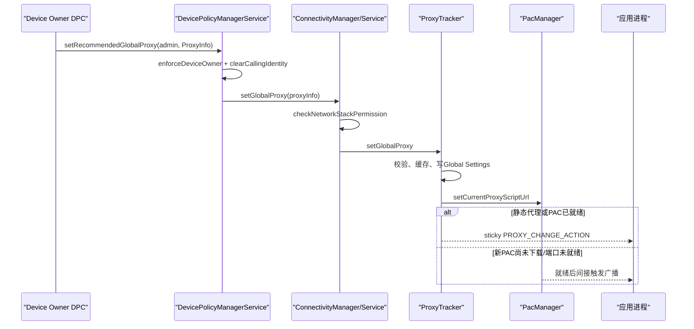
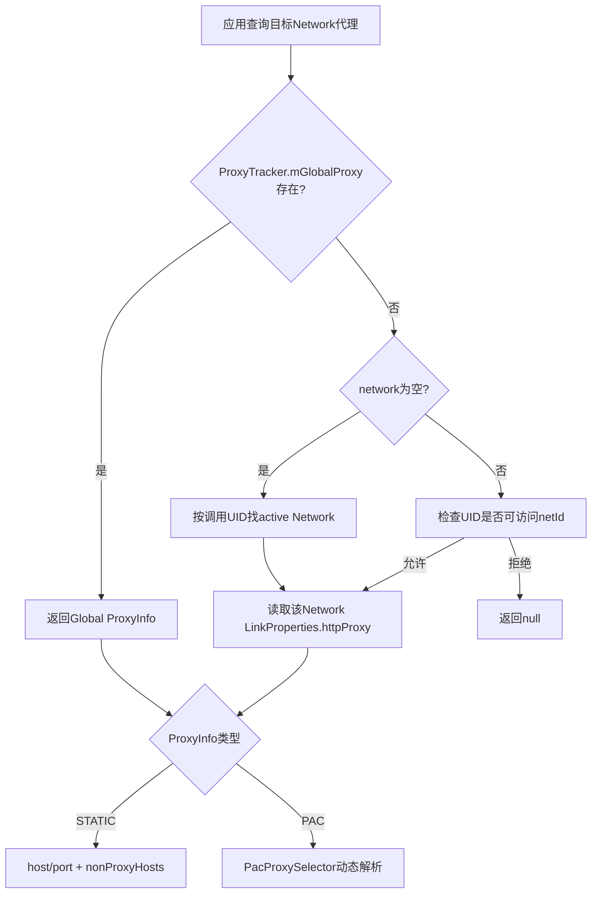
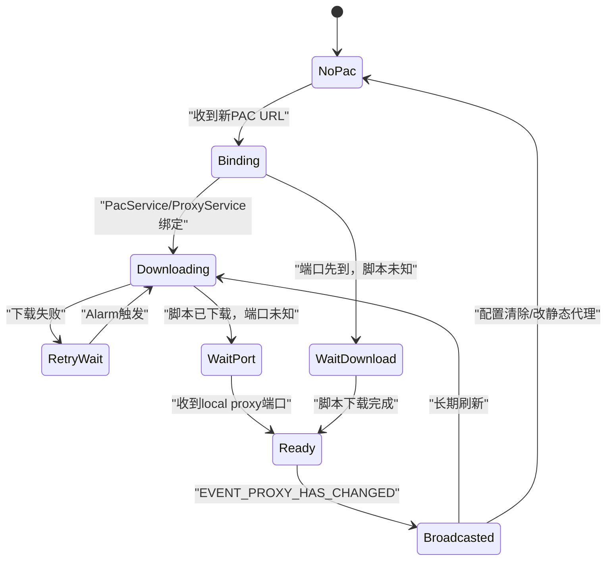

# 316 Android 企业 Global HTTP Proxy：每网络Proxy、PAC下载、ProxyTracker广播及VPN绕过边界链

## 1. 本章目标

本章从DPC设置代理开始，追踪策略怎样进入DevicePolicyManagerService、ConnectivityService、ProxyTracker、PAC服务和应用进程，并解释全局代理、Wi-Fi网络代理、VPN与真正流量强制之间的边界。

## 2. Android 11版本边界

内容以本地 android-11.0.0_r48 为准。重点源码是 DevicePolicyManager、DevicePolicyManagerService、ConnectivityService、ProxyTracker、PacManager、Proxy、PacProxySelector、WifiConfigManager 与 LinkProperties。

## 3. 先记结论

Android这里的HTTP Proxy是“推荐给应用使用的代理配置”，不是内核转发规则。遵循Java ProxySelector的HTTP客户端通常会使用它；原生Socket、自带网络栈或主动指定NO_PROXY的程序仍可能绕过。

## 4. 三种容易混淆的代理

全局代理与网络无关，存在时覆盖网络专属代理；每网络代理挂在该Network的LinkProperties上；PAC则不是第三种覆盖层，而是一种动态计算“本次URL该走哪个代理”的配置形式。

## 5. VPN不是HTTP代理

VPN通过路由、UID范围和虚拟接口接管IP流量；HTTP代理通过应用层客户端选择一个中继服务器。二者可以同时存在，但解决的问题和强制能力不同。

## 6. 企业管理入口有新旧两条

旧隐藏API setGlobalProxy要求管理员声明 USES_POLICY_SETS_GLOBAL_PROXY；公开API setRecommendedGlobalProxy要求调用者是Device Owner。两条路径在r48并不是同一份实现的简单包装。

## 7. 推荐不等于可选配置是否保存

API文档明确称其为recommended，因为应用可能忽略代理；但一旦调用新API，系统仍会把ProxyInfo作为全局代理写Settings、缓存到ProxyTracker并发送更新广播。

## 8. 四份状态账

ActiveAdmin保存旧API的策略所有者与host字符串；Settings.Global保存重启状态；ProxyTracker保存当前内存全局/默认代理；每个Network的LinkProperties保存该网络自己的HTTP proxy。

## 9. 阅读时不要只搜global_proxy

真正应用到进程还经过 PROXY_CHANGE_ACTION、ActivityThread.updateHttpProxy、JVM的 http.proxyHost/https.proxyHost 属性，以及ProxySelector。只看到Settings写入并不能证明客户端已切换。

## 10. 新API的主链

## 11. 客户端先做parent检查

DevicePolicyManager.setRecommendedGlobalProxy先调用 throwIfParentInstance。组织所有profile的parent实例不能借此替父用户设置全局代理；API合同是直接由Device Owner管理设备级值。

## 12. 服务端权限门

DPMS的实现只有三行关键逻辑：enforceDeviceOwner(who)，清除Binder调用身份，再调用ConnectivityManager.setGlobalProxy。普通Profile Owner、delegate与普通管理员都会在这里失败。

## 13. 为什么还要清除身份

ConnectivityService.setGlobalProxy要求Network Stack级系统权限。DPC本身没有该权限，因此DPMS验证Owner后必须以system_server身份继续调用，形成“业务授权后提权执行”。

## 14. null表示清除

新API传null会沿链传给ProxyTracker。后者把host、port、exclusion和PAC URL写为空值，并令mGlobalProxy为null，然后退回默认网络代理。

## 15. ProxyInfo支持两种构造

静态形式包含host、port与exclusion list；PAC形式主要包含PAC URI。ProxyTracker通过host是否为空和PAC URI是否为Uri.EMPTY判断是否存在有效代理。

## 16. 无效配置被静默忽略

ProxyTracker发现ProxyInfo.isValid为false时只记录调试日志并return，ConnectivityManager/DPMS接口没有布尔成功值。因此setRecommendedGlobalProxy正常返回不等于新值一定被接受。

## 17. 所以要读回验证

DPC应在调用后通过受支持的管理状态、设备诊断或ConnectivityManager读回，并做实际HTTP探测；不能把“Binder未抛异常”当作端到端成功。

## 18. ProxyTracker的全局优先级

getDefaultProxy先返回mGlobalProxy；只有全局为空且mDefaultProxyEnabled为true时才返回mDefaultProxy。这里的default是当前默认网络代理的进程级近似值。

## 19. getProxyForNetwork更精确

ConnectivityService.getProxyForNetwork首先无条件检查global；存在就直接返回。否则network为null时按调用UID的active network查，显式network时先核对调用UID能否访问该netId，再读LinkProperties。

## 20. 全局会覆盖显式Network查询

即便调用者询问某个非默认Wi-Fi或VPN Network，只要mGlobalProxy非空，getProxyForNetwork也先返回global。这是r48源码中的查询优先级，不是“每网络永远更具体所以优先”。

## 21. default proxy不是所有Network真值

ProxyTracker注释明确提醒：进程实际使用的Network可能不是默认Network。多网络应用应查询目标Network的LinkProperties，而不是缓存一次getDefaultProxy后到处使用。

## 22. Global Settings四字段

新路径写 GLOBAL_HTTP_PROXY_HOST、GLOBAL_HTTP_PROXY_PORT、GLOBAL_HTTP_PROXY_EXCLUSION_LIST 与 GLOBAL_HTTP_PROXY_PAC。静态代理PAC字段为空，PAC代理则保存URL。

## 23. 设置写入在同一锁内

setGlobalProxy持有mProxyLock，更新mGlobalProxy、写Settings，再调用sendProxyBroadcast。它保证ProxyTracker自己的状态转换有序，但不能保证所有应用已同步处理广播。

## 24. Settings写失败如何看

Settings.Global.putString/putInt返回值没有被检查，方法也没有向DPC返回结果；受异常或provider问题影响时，内存值、持久值和调用者认知可能分叉。

## 25. 启动恢复

ConnectivityService.systemReady调用loadGlobalProxy，从四个Global字段恢复静态或PAC ProxyInfo，并放入mGlobalProxy。恢复后还会检查废弃的单字段HTTP_PROXY。

## 26. loadGlobalProxy的PAC遗留TODO

恢复函数源码留有“是否应调用mPacManager.setCurrentProxyScriptUrl”的TODO。仅加载mGlobalProxy并不在此处显式启动PAC下载，这提示启动恢复路径需要版本实测，不能只按设计想象。

## 27. 废弃HTTP_PROXY兼容项

旧 Settings.Global.HTTP_PROXY 是 host:port 单字符串。loadDeprecatedGlobalHttpProxy解析它、构建静态ProxyInfo，再走ProxyTracker.setGlobalProxy，因而会写回新四字段并广播。

## 28. 实时观察者只盯旧字段

r48 ConnectivityService.registerSettingsCallbacks只观察 Settings.Global.HTTP_PROXY，不观察HOST、PORT、EXCLUSION_LIST或PAC四个新字段。

## 29. 关键推论

绕过ConnectivityManager而直接写新四字段，虽然可能持久化成功，却不会依靠该观察者立即刷新mGlobalProxy。下次systemReady可能读到，当前运行态则不能据此保证已生效。

## 30. 旧隐藏API的角色

DevicePolicyManager.setGlobalProxy是隐藏兼容接口，参数使用java.net.Proxy和域名排除列表。它要求管理员在receiver元数据声明 sets-global-proxy policy，并限制为system user调用。

## 31. 旧API只有一个管理员

DPMS遍历system user的ActiveAdmin；若另一组件已令specifiesGlobalProxy为true，就返回该组件名。原设置者可重复更新，形成“首个管理员占有槽位”的模型。

## 32. 非system user静默失败

权限policy检查之后，若Binder calling user不是USER_SYSTEM，DPMS只写warning并返回null。可怕之处是null在API合同里同时代表设置成功，因此调用者可能误判。

## 33. 旧API的ActiveAdmin字段

非空proxySpec时写 specifiesGlobalProxy=true、globalProxySpec和globalProxyExclusionList；清除时把三者清空。随后调用resetGlobalProxyLocked选择当前占槽管理员。

## 34. 旧API字符串解析缺陷

saveGlobalProxyLocked用split(":")拆host:port，默认端口8080。这不适合包含冒号的IPv6字面量；客户端旧API的hostname校验本身也偏向旧式域名/IP格式。

## 35. 旧API设置时只写三个字段

设置非空静态代理时，最终仅写HOST、PORT和EXCLUSION_LIST，不写GLOBAL_HTTP_PROXY_PAC，也不直接调用ConnectivityManager.setGlobalProxy。

## 36. 旧API清除路径还有失效缺陷

传Proxy.NO_PROXY时，DPMS先把proxySpec改成空串，却仍使用默认端口8080构造ProxyInfo("",8080,"")；Proxy.validate判定“空host配非空port”为PROXY_HOSTNAME_EMPTY，saveGlobalProxyLocked随即return，原有三个Settings字段不会被清掉。

## 37. PAC残留是另一项独立风险

即使不是清除，而是用旧API写一个新静态host，代码也没有清空GLOBAL_HTTP_PROXY_PAC；若此前新路径保存过PAC URL，下次loadGlobalProxy看到PAC非空会优先构造PAC ProxyInfo，刚写的静态host可能被忽略。

## 38. 即时生效与移除管理员风险

r48观察者只监听废弃HTTP_PROXY，旧路径也不直接刷新ProxyTracker；删除管理员虽会resetGlobalProxyLocked，但在“无管理员”分支又落入上述无效空host清除。因此ActiveAdmin可能已清、getGlobalProxyAdmin返回null，旧Settings与运行态代理却仍残留。

## 39. 新旧API不要混用

企业产品应选公开的setRecommendedGlobalProxy作为r48主路径；若维护历史代码，必须专项测试旧字段、PAC字段、即时广播、重启恢复和管理员移除，不要交替调用。

## 40. “首个管理员”不适用于新API

公开新API直接要求唯一Device Owner并进入ConnectivityManager，不读写ActiveAdmin.specifiesGlobalProxy，也不通过getGlobalProxyAdmin报告其所有者。

## 41. getGlobalProxyAdmin的真实含义

这个隐藏getter只扫描旧ActiveAdmin状态。它返回null不能证明当前没有由新API设置的mGlobalProxy或Global Settings值。

## 42. 代理排除列表

静态ProxyInfo把逗号分隔排除项保存为字符串。应用进程设置JVM属性时，Proxy.setHttpProxySystemProperty会把逗号换成竖线，写入http.nonProxyHosts与https.nonProxyHosts。

## 43. 排除规则不是防火墙白名单

排除列表的意思是匹配目标可直连，不是阻止访问；客户端若完全不使用ProxySelector，列表也不参与。安全策略不要把它当作网络访问控制。

## 44. 静态代理同时影响HTTP与HTTPS属性

同一host/port被写入http.proxyHost和https.proxyHost。对HTTPS通常是通过HTTP CONNECT建立隧道，不代表系统在代理端自动解密TLS。

## 45. TLS检查需要额外信任链

若企业代理要中间人解密HTTPS，还需要设备/工作资料的CA安装、Network Security Config信任行为以及应用证书固定策略配合；仅设置ProxyInfo不会让应用信任代理证书。

## 46. 证书固定仍可能失败

应用内置pinning或自定义TrustManager可拒绝企业CA。代理推荐、用户CA、企业CA和TLS pinning是不同层，部署时要分别验证。

## 47. 每Wi-Fi代理保存在哪里

WifiConfiguration的IpConfiguration含ProxySettings枚举与httpProxy。STATIC、PAC、NONE、UNASSIGNED分别代表静态、PAC、清除和保留既有值。

## 48. 每网络代理最终进入LinkProperties

Wi-Fi连接时IP配置链把所选配置的ProxyInfo交给IpClient/网络代理，随后出现在该Network的LinkProperties.mHttpProxy，ConnectivityService从这里对外回答。

## 49. LinkProperties也说它只是hint

setHttpProxy源码注释明确：HTTP代理是recommended，系统不强制应用使用。这与全局代理文档一致，说明“每Wi-Fi代理更底层所以不可绕过”也是错误理解。

## 50. 三层状态与优先级

## 51. 谁能修改Wi-Fi proxy

WifiConfigManager检测到hasProxyChanged后调用canModifyProxySettings。允许Device Owner、Profile Owner、NETWORK_SETTINGS、NETWORK_SETUP_WIZARD或NETWORK_MANAGED_PROVISIONING身份。

## 52. 普通网络creator也不自动能改proxy

普通应用即使创建了saved network，也不会仅凭creator身份获得代理字段修改权；代理是高影响字段，要单独通过canModifyProxySettings。

## 53. 更新对象不能伪造权限

权限使用Binder UID与经过AppOps核验的packageName，不信任WifiConfiguration里由调用者填写的creatorUid或其他所有权字段。

## 54. 代理变化与一般网络变化分开算

WifiConfigurationUtil.hasProxyChanged比较旧、新IpConfiguration。只有确实变化时才触发代理专用授权门，避免普通字段更新被不必要拒绝。

## 55. per-Wi-Fi配置持久化

通过授权后，ProxySettings与ProxyInfo跟随WifiConfigStore的NetworkList写入shared或user store；能否重启保留仍受第315章讨论的store写入结果约束。

## 56. 当前网络需要更新链路

修改已连接Wi-Fi的持久配置，不等于现有所有Socket瞬间迁移。Wi-Fi状态机是否重连、LinkProperties何时更新、连接池是否刷新都影响观察时点。

## 57. ConnectivityService观察所有Network变化

updateProxy比较新旧LinkProperties的httpProxy，只要任何Network代理变化就调用sendProxyBroadcast；这也是广播extra在多网络时代不可靠的原因。

## 58. 广播extra已废弃

PROXY_CHANGE_ACTION的EXTRA_PROXY_INFO可能描述默认代理，却无法表达“哪个Network变了”。源码建议应用收到广播后按目标Network重新查询ConnectivityManager/LinkProperties。

## 59. 广播是sticky

ProxyTracker使用sendStickyBroadcastAsUser发给ALL用户，并带REPLACE_PENDING与REGISTERED_ONLY_BEFORE_BOOT标志。后来的接收者可能看到最近值，但仍不能把extra当多网络真值。

## 60. 广播只有系统能发

Proxy.java注释称它是protected intent，普通应用不能用同名广播可靠伪造系统代理改变；应用仍应把Binder查询结果而非广播内容作为权威。

## 61. 新进程初始化

ActivityThread在应用bind阶段调用ConnectivityService.getProxyForNetwork(null)，再用Proxy.setHttpProxySystemProperty写本进程JVM属性，因此应用无需等一次广播才获得启动时代理。

## 62. 已运行进程更新

ActivityThread提供updateHttpProxy，通过ConnectivityManager.getDefaultProxy重新设置JVM属性；系统广播接收链最终会触发相应更新。更新存在异步窗口。

## 63. 进程绑定Network时

ConnectivityManager.bindProcessToNetwork成功且netId变化后，也尝试重新设置HTTP代理属性、清DNS缓存并通知NetworkEventDispatcher清理连接池。

## 64. 一个细节上的局限

这段绑定逻辑调用getDefaultProxy，而不是显式把network传给getProxyForNetwork；理解多网络代理时应跟踪具体Android版本实现及客户端是否主动查询LinkProperties。

## 65. JVM系统属性是进程内可写的

ProxyTracker注释甚至指出这些信息已作为world read/writable JVM property可见。应用代码可以System.clearProperty或替换ProxySelector，这再次证明代理不是强制隔离。

## 66. 默认ProxySelector

Proxy类在静态初始化时保存原ProxySelector；静态代理通过host/port系统属性由默认选择器读取，PAC非空时则把默认选择器替换为PacProxySelector。

## 67. 客户端是否遵循取决于实现

HttpURLConnection等通常走ProxySelector；第三方HTTP库可能遵循、缓存或自定义；Cronet、WebView、自带native curl及直接Socket要分别审计，不能由Java代码路径概括全部。

## 68. 显式NO_PROXY可绕过

PacManager下载PAC脚本本身就用urlConnection.openConnection(java.net.Proxy.NO_PROXY)，这是为避免“获取代理脚本又依赖代理脚本”的循环，也直观证明调用者可请求直连。

## 69. PAC是什么

PAC文件包含FindProxyForURL之类JavaScript逻辑，根据URL、host和网络条件返回DIRECT、PROXY host:port或SOCKS host:port列表，由PacProxySelector转成java.net.Proxy顺序表。

## 70. PAC URL并非每次请求在线执行

PacManager先下载脚本文本，交给com.android.pacprocessor的IProxyService保存/执行；请求时PacProxySelector通过Binder调用resolvePacFile，而不是每个URL重新下载PAC。

## 71. 两个系统组件

PacManager同时绑定com.android.pacprocessor.PacService和com.android.proxyhandler.ProxyService。前者处理脚本，后者提供本地代理监听端口并通过callback回报。

## 72. PAC为何需要本地端口

Android兼容路径把PAC代理包装成带PAC URL与本地port的ProxyInfo；只有脚本下载完成且本地proxy handler端口有效，系统才认为可广播一个可运行配置。

## 73. 就绪有两个条件

sendProxyIfNeeded明确要求mHasDownloaded为true且mLastPort不等于-1。任一未完成就不发送PAC changed消息。

## 74. 首次设置会压住广播

ProxyTracker.sendProxyBroadcast先调用PacManager.setCurrentProxyScriptUrl；遇到新PAC URL时返回DONT_SEND_BROADCAST，PacManager负责异步准备好后再经EVENT_PROXY_HAS_CHANGED回到ProxyTracker。

## 75. 已就绪PAC可直接广播

若URL相同且传入ProxyInfo port大于0，setCurrentProxyScriptUrl返回DO_SEND_BROADCAST，避免重复绑定和下载阻塞同一配置的通知。

## 76. 下载线程

PacManager创建名为android.pacmanager的HandlerThread，把下载放到该线程，避免阻塞ConnectivityService主处理器。

## 77. 最大脚本限制

r48 MAX_PAC_SIZE为20,000,000字节。既检查Content-Length，也在流式读取中检查实际累计字节，防止服务端漏报或谎报长度。

## 78. Content-Length不是可信边界

头缺失、非数字时会忽略，真正安全边界依靠读取循环中的bytes.size检查。阅读网络代码时要区分“预检查优化”和“最终强制检查”。

## 79. 下载明确绕过代理

openConnection(NO_PROXY)避免循环依赖；代价是PAC服务器必须能从当前网络直接访问。若企业只允许经代理访问该URL，配置会永远无法bootstrap。

## 80. 下载失败退避

默认延迟串是8、32、120、14400、43200秒；失败从短间隔逐步推进到14400秒索引，成功后重置并按43200秒长期刷新。

## 81. 延迟可配置

系统属性 conn.pac_change_delay提供默认，Settings.Global.PAC_CHANGE_DELAY可覆盖。格式解析缺少强校验，OEM或管理侧错误值可能导致NumberFormatException等运行风险。

## 82. 成功也会周期刷新

脚本下载成功、下发给IProxyService后安排长期刷新。PAC不是“一次下载永久使用”，服务端更新最终可传播到设备。

## 83. 同内容不重复下发

只有新文本与mCurrentPac不同时才调用setCurrentProxyScript；但即使相同仍标记已下载、检查是否需要广播并安排长期刷新。

## 84. PAC响应隐私处理

PacProxySelector对非HTTP URI会移除用户名、密码、路径、query与fragment，只把scheme/host/port和根路径交给脚本，减少凭据或敏感路径泄露。

## 85. HTTP URI的例外

源码只在scheme不是http时重建URI；对HTTP会直接toURL字符串。因此企业PAC脚本和服务器仍应按可能接触完整HTTP URL的敏感组件治理。

## 86. PAC解析容错

返回串按分号拆分，识别DIRECT、PROXY与SOCKS；非法host:port项被忽略。若最终列表为空则回退NO_PROXY，而不是阻断请求。

## 87. 解析失败倾向直连

IProxyService缺失、resolve异常、null响应或完全非法响应都可能回NO_PROXY。这是可用性优先的fail-open行为，不适合承担“必须经审计代理”的强制合规。

## 88. connectFailed为空实现

PacProxySelector.connectFailed没有上报、切换或熔断逻辑；java客户端能否尝试列表中后续代理取决于调用者实现，系统选择器本身不做遥测。

## 89. 静态代理也可能fail-open

即使没有PAC，忽略ProxySelector的客户端、显式直连Socket或native库仍可绕过。PAC只是又增加下载/解析失败面，不是推荐属性的根本原因。

## 90. PAC准备与广播状态机

## 91. 清除PAC

新ProxyInfo没有PAC URL时，PacManager取消刷新Alarm、清mPacUrl/mCurrentPac，调用stopPacSystem并解绑两个service，然后允许静态/空代理广播。

## 92. 解绑后的端口

unbind把mLastPort重置为-1、清service引用和连接对象。下次PAC必须重新满足“下载+端口”两条件。

## 93. 全局代理与VPN组合

getProxyForNetwork先返回global，因此从API视角VPN Network也得到全局代理；HTTP客户端会尝试连接代理host，而这个连接最终走哪个路由仍由VPN的UID/route规则决定。

## 94. VPN可承载代理连接

若应用UID被always-on VPN覆盖，访问全局代理服务器的TCP连接通常也进入VPN，除非VPN允许该应用或目标绕过。此时路径是“HTTP客户端→代理连接→VPN隧道”。

## 95. VPN也可有自己的LinkProperties代理

NetworkAgent可在LinkProperties提供httpProxy。没有global时，查询该VPN Network可得到它；有global时仍被global优先覆盖。

## 96. 代理不能替代Lockdown VPN

想强制所有允许流量经过企业控制点，应依靠always-on VPN lockdown、路由/防火墙和服务端策略；global HTTP proxy最多作为兼容客户端的应用层推荐。

## 97. VPN也不自动让代理不可绕过

应用可绕过HTTP代理但仍被VPN承载；这代表“绕过代理服务器”不等于“绕过企业VPN”。两层审计数据与策略要分别设计。

## 98. DNS路径也要分层

静态代理时客户端可能让代理解析目标host，也可能先本地解析；PAC脚本自身会用DNS辅助函数；VPN、Private DNS和代理服务器解析各有观测面，不能笼统说DNS全在代理端。

## 99. captive portal与启动可达性

在需要门户登录或代理服务器仅内网可达的网络上，过早设置全局代理可能让HTTP探测和登录流程异常。API文档直接警告：私网无法访问该代理时会破坏HTTP。

## 100. 多用户不是多份全局值

Settings.Global和ProxyTracker的mGlobalProxy都是设备范围；新API只允许DO。广播发给ALL用户，但各用户应用是否信任代理证书、是否走同一VPN仍可不同。

## 101. 安全威胁模型

若目标只是提供企业内网出口，推荐代理可能足够；若目标是防数据外泄或强制审计，必须假设恶意应用会用native Socket、QUIC、DoH、显式Network与自定义TLS栈。

## 102. QUIC/UDP边界

HTTP代理host/port通常描述TCP HTTP代理，不能自动承载QUIC/HTTP3的UDP流量。客户端可能回退TCP，也可能绕过；需要VPN/防火墙层验证。

## 103. WebView与浏览器要单测

不要由HttpURLConnection结果推断WebView、Chrome或OEM浏览器行为。它们可能有独立代理同步、连接池和网络栈，应测试冷启动、热更新、PAC、证书与VPN组合。

## 104. 变更发布顺序

先确保代理/PAC服务器可从所有目标网络直达，再部署CA与例外域，随后小范围下发ProxyInfo，验证读回和流量，最后扩大；清除策略也要验证PAC服务确实停止。

## 105. 可观测性最小集合

记录DPC调用时间、脱敏后的ProxyInfo类型/host摘要、Settings四字段、ProxyTracker dump、当前Network及LinkProperties、PAC下载日志、本地端口、广播时间与实际请求出口。

## 106. 不记录敏感URL

PAC和代理日志可能暴露内网域名、完整HTTP路径、用户名或token。生产诊断应按host聚合、路径脱敏，并限制日志读取权限和保留时间。

## 107. 故障定位顺序

先查DO权限与参数validity，再查mGlobalProxy和Settings四字段，然后查PAC下载/绑定/端口、广播与进程JVM属性，最后查客户端是否遵循ProxySelector、VPN路由、TLS和服务端。

## 108. 常见误判一

“setRecommendedGlobalProxy返回就说明所有应用已走代理”错误：参数可能被ProxyTracker静默拒绝，广播异步，客户端还可忽略代理。

## 109. 常见误判二

“每Wi-Fi代理比global更具体所以优先”错误：r48 getProxyForNetwork先检查global，存在时直接返回，不再看该Network的LinkProperties。

## 110. 常见误判三

“PAC失败会阻断网络”错误：下载阶段延迟广播，解析阶段多种错误回NO_PROXY，整体更偏向可用性而非强制封锁。

## 111. 常见误判四

“旧setGlobalProxy与新setRecommendedGlobalProxy等价”错误：前者写ActiveAdmin和三个Settings字段，且r48空值清除会被ProxyInfo校验拒绝；后者直接进入ConnectivityManager并维护四字段、内存与广播。

## 112. macOS只读练习一：比较新旧DPM路径

在源码根目录执行 rg -n "setGlobalProxy\\(|setRecommendedGlobalProxy" frameworks/base/core/java/android/app/admin/DevicePolicyManager.java frameworks/base/services/devicepolicy/java/com/android/server/devicepolicy/DevicePolicyManagerService.java，再画出权限、状态与生效调用差异；只读，不编译。

## 113. macOS只读练习二：验证代理优先级

执行 sed -n '110,320p' frameworks/base/services/core/java/com/android/server/connectivity/ProxyTracker.java 和 sed -n '4380,4450p' frameworks/base/services/core/java/com/android/server/ConnectivityService.java，逐行解释global、default、显式Network三者的返回顺序。

## 114. macOS只读练习三：推演PAC状态机

阅读 PacManager.java 的setCurrentProxyScriptUrl、mPacDownloader、sendProxyIfNeeded与bind，分别推演“先下载后端口”“先端口后下载”“持续下载失败”三种时序；不联网、不运行服务。

## 115. macOS只读练习四：寻找可绕过证据

执行 rg -n "NO_PROXY|setHttpProxySystemProperty|ProxySelector.setDefault" frameworks/base/services/core/java/com/android/server/connectivity/PacManager.java frameworks/base/core/java/android/net，解释为什么代理是hint，以及VPN lockdown为何属于另一层强制机制。

## 116. 最小判断口诀

Global决定查询覆盖，LinkProperties描述单网建议，ProxyTracker负责缓存与广播，PAC负责动态选择，ActivityThread负责进程属性，ProxySelector负责客户端采用，VPN/防火墙才负责更强的流量约束。

## 117. 关键源码入口

DPM/DPMS看Owner与新旧API；ConnectivityService/ProxyTracker看优先级、Settings和广播；PacManager/PacProxySelector看下载解析；Proxy/ActivityThread看进程应用；WifiConfigManager看每Wi-Fi修改授权。

## 118. 本章复读修正

复读源码后特别修正五点：global先于显式Network；旧API不清PAC字段且不直接刷新ProxyTracker；旧API空值清除还会因host为空、port为8080而校验失败；PAC需脚本与本地端口双就绪；解析失败可回NO_PROXY。

## 119. 本章结论

Android 11企业代理是一条“Owner授权→ProxyInfo→ProxyTracker/Settings→PAC准备或静态属性→应用ProxySelector”的协作链，而不是透明流量劫持。可靠部署既要验证状态传播，也要把恶意绕过交给VPN与网络控制面处理。

## 120. 下一章预告

下一章进入企业Override APN：Device Owner/Carrier权限、ApnSetting校验、TelephonyProvider持久化、preferred/override选择、启停状态与多SIM边界。
