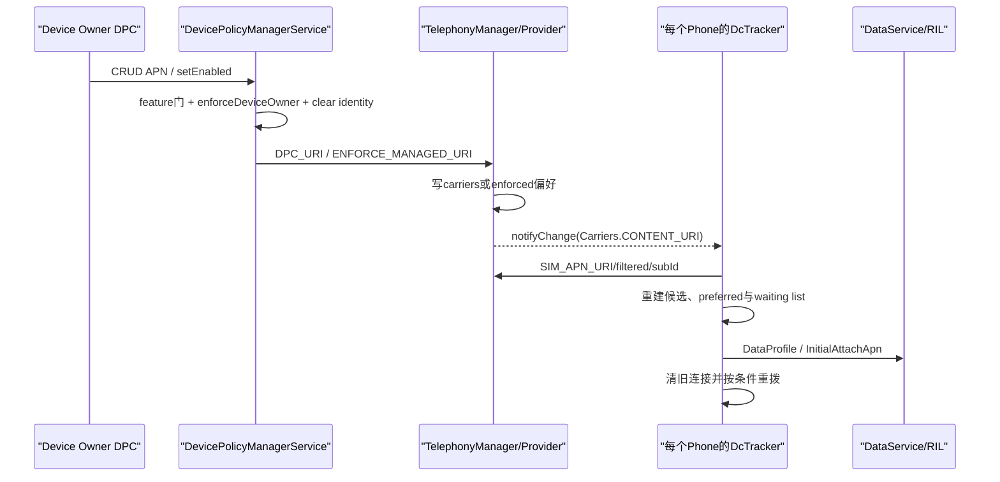
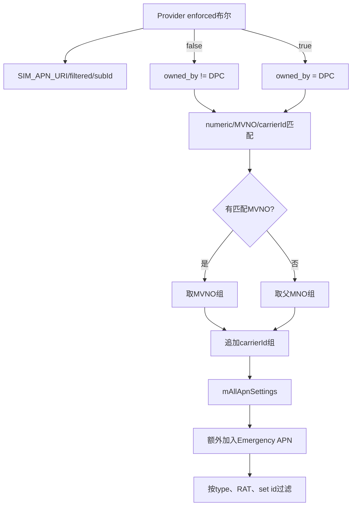
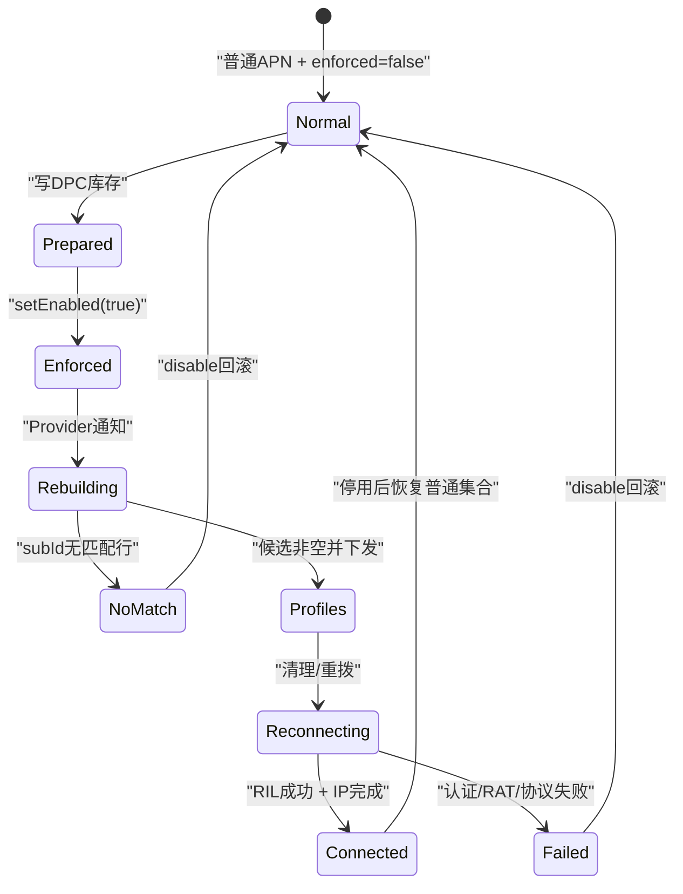

# 317 Android 企业 Override APN：DPC专属记录、TelephonyProvider过滤、DcTracker重建及多SIM边界链

## 1. 本章目标

本章追踪Device Owner添加、更新、删除和启用Override APN的完整链，解释记录怎样进入TelephonyProvider、怎样替换普通APN候选、怎样触发DcTracker重建，以及多SIM和失败边界。

## 2. Android 11版本边界

以 android-11.0.0_r48 为准，阅读DevicePolicyManager、DevicePolicyManagerService、TelephonyManager、ApnSetting、TelephonyProvider、DcTracker和DataServiceManager。

## 3. APN不是HTTP代理

APN描述蜂窝数据承载：运营商标识、接入点、认证、协议、用途和RAT范围。它可带HTTP/MMS proxy字段，但不等同上一章的全局HTTP代理。

## 4. Override的含义

DPC记录与carrier/user记录同在carriers表，由OWNED_BY_DPC隔离。启用enforcement后，Telephony的filtered查询只返回DPC记录，普通APN不再成为常规候选。

## 5. 只有Device Owner

r48所有Override APN API都由DPMS enforceDeviceOwner；普通PO、组织所有PO和delegate均不可调用，单元测试也专门覆盖PO失败。

## 6. 两个独立动作

添加记录不自动启用覆盖；setOverrideApnsEnabled(true)也不保证表里已有匹配记录。部署必须分别管理“DPC记录集合”和“全局enforced位”。

## 7. 启用是设备级

Provider只有一个mManagedApnEnforced和一份SharedPreferences布尔，不按subId分开。双卡设备一旦启用，两个活动订阅都会切到DPC集合。

## 8. 记录按SIM匹配

DPC表项仍依靠operator numeric、MVNO和carrierId参与每订阅过滤；同一库存可覆盖多运营商，每张SIM只看到与自身匹配的子集。

## 9. 四张状态账

SQLite保存DPC APN行；Provider SharedPreferences保存enforced；每个DcTracker保存候选和preferred；DataService/modem保存DataProfile与当前data call。

## 10. 从DPC到数据连接总链

## 11. parent实例被拒绝

五个DPM API都先throwIfParentInstance。蜂窝接入覆盖是设备策略，只能由真实Device Owner admin直接调用。

## 12. feature短路

DPMS检查mHasFeature与mHasTelephonyFeature；不支持时add=-1、update/remove=false、get空、getter=false，void setter直接return。

## 13. 短路不抛异常

所以“未抛异常”不证明设备支持。DPC应先判断telephony feature，再检查每个API的具体返回形状。

## 14. add输入门

admin或ApnSetting为null会NPE，随后enforceDeviceOwner。服务不重新执行Builder校验，而信任已跨Binder传入的对象。

## 15. Builder最小要求

公开build要求entryName、apnName非空，且APN type bitmask至少含一个已知type，否则返回null；调用前必须检查结果。

## 16. APN type决定用途

DEFAULT、MMS、SUPL、DUN、IMS、IA、EMERGENCY等对应不同ApnContext，只有canHandleType匹配请求的记录才进入waiting list。

## 17. operatorNumeric

通常为MCC+MNC。Provider按subId的getSimOperator筛选；写错会让记录出现在DPC库存，却不出现在该SIM的运行候选。

## 18. carrierId支路

Provider还会追加carrierId匹配记录；UNKNOWN_CARRIER_ID不形成有效匹配，且carrierId变化会改变候选。

## 19. MVNO顺序

SQL先取numeric或carrierId候选，再用matchesCurrentSimOperator分MVNO、父MNO和carrierId组：MVNO存在时优先，否则用父MNO，最后追加carrierId组。

## 20. 两个名称

entryName是可读标签，apnName才是接入点字符串。二者非空只满足对象校验，不证明网络侧会接受认证和分配IP。

## 21. 协议字段

protocol与roamingProtocol控制常驻/漫游PDP类型，如IP、IPV6、IPV4V6；设备、运营商和网络侧仍会限制最终协议。

## 22. RAT位图

buildWaitingApns用canSupportNetworkType核对当前radioTech。位图过窄会导致LTE可用、切NR或UMTS后候选消失。

## 23. carrierEnabled

isEnabled映射数据库CARRIER_ENABLED。false记录可成功保存却不能正常使用，库存成功不等于可拨号。

## 24. 认证敏感数据

toContentValues写USER、PASSWORD、AUTH_TYPE。DPC日志、崩溃报告和后台都不得输出完整ContentValues。

## 25. APN内proxy字段

PROXY/PORT描述该APN的HTTP proxy；MMSC/MMSPROXY/MMSPORT服务MMS。它们不替代蜂窝bearer建立。

## 26. null转空串

ApnSetting.toContentValues明确把未指定字符串写成空串，而非null，以配合Provider默认值和UNIQUE比较。

## 27. 字段并非全量穿透

r48 Parcel与toContentValues只保留公开子集；profileId、persistent、MTU和连接限额等隐藏字段不会完整从DPC对象落库。

## 28. mvnoMatchData丢失

Parcel重建把mvnoMatchData传null，toContentValues也不写MVNO_MATCH_DATA，只写MVNO_TYPE；需要SPN/IMSI/GID/ICCID数据的MVNO规则无法由此链完整表达。

## 29. apnSetId也未落库

Parcel虽传apnSetId，toContentValues未写APN_SET_ID，Provider采用默认0。不要按调用前对象的非零set id推演运行态。

## 30. 分组后果

DcTracker只采用preferred set相同或MATCH_ALL的记录；DPC实际落成set 0，历史preferred非0可能让已匹配记录再次被排除。

## 31. 清Binder身份

DPMS验证DO后以system_server身份访问DPC_URI；DPC进程自身不能直接访问这个专用Provider入口。

## 32. 双层授权

DPMS判断业务角色，Provider再要求SYSTEM_UID或PHONE_UID。仅有WRITE_APN_SETTINGS或carrier privilege不能访问DPC_URI。

## 33. 一般权限门

Provider insert/update/delete仍先checkPermission，接受WRITE_APN_SETTINGS或任一电话carrier privilege；system随后继续通过专用UID门。

## 34. add强制归属

URL_DPC复制输入，强制OWNED_BY_DPC和USER_EDITABLE=false，调用者不能把企业记录伪装为普通记录或让用户编辑。

## 35. 同表隔离

普通URI插入强制OWNED_BY_OTHERS；一般查询、更新、删除多处追加IS_NOT_OWNED_BY_DPC，避免设置或carrier维护误改企业行。

## 36. restore不会删DPC

恢复运营商默认APN和普通删除逻辑排除DPC记录；企业行只由DPC专用id URI或Owner清理路径回收。

## 37. add冲突策略

DPC插入用CONFLICT_IGNORE。UNIQUE列冲突时返回负rowID，不覆盖旧行，也不返回旧记录id。

## 38. add返回id

TelephonyManager从result URI末段解析主键；URI为null或解析失败时返回INVALID_APN_ID(-1)，该id是后续update/remove句柄。

## 39. id需对账

DPC可保存id，但迁移、Owner清除或恢复会使其失效；更稳妥是getOverrideApns回读并按业务键核对。

## 40. 冲突以表约束为准

SQLite UNIQUE还含MCC/MNC、bearer、profileId、userEditable、ownedBy、apnSetId、carrierId等；DPM文档只是可表达字段视角，最终由Provider约束裁决。

## 41. 普通与DPC可同值共存

OWNED_BY属于UNIQUE列，普通值1、DPC值0，因此其他字段相同也不冲突；这正是启停时在两套集合间切换的基础。

## 42. update只改DPC行

URL_DPC_ID要求where/args为null，并附加_id=? AND owned_by=DPC；拿普通APN id调用只会返回0。

## 43. update冲突忽略

Provider用updateWithOnConflict(CONFLICT_IGNORE)。若新值与另一DPC行冲突，count为0，DPMS返回false，不自动merge。

## 44. update保留归属

toContentValues不含OWNED_BY，既有DPC行保持标记；where条件也阻止普通行被篡改。

## 45. remove也校验归属

delete DPC/id附加owned_by=DPC，删除数大于0才为true；负id在DPMS提前返回false。

## 46. get是全局库存

getOverrideApns查询DPC_URI，不带subId或SIM条件，逐行makeApnSetting；它不表示每行会被当前任一SIM采用。

## 47. 回读揭示落库默认值

makeApnSetting读取数据库完整列。用它对比调用前对象，可发现apnSetId变0、mvnoMatchData为空等传递差异。

## 48. CRUD变化会通知

Provider实际变化后notifyChange(Carriers.CONTENT_URI, ALL users)；每个DcTracker以descendants=true观察该根URI。

## 49. 返回值只证明数据库

add id>=0或update/remove=true只说明行变化；Observer、Handler、modem profile、连接清理和重拨都在后续异步发生。

## 50. 两套集合过滤链

## 51. setEnabled不是行字段

ENFORCE_MANAGED_URI更新Provider私有SharedPreferences的enforced键及内存布尔，不修改各行carrierEnabled。

## 52. Provider启动恢复

onCreate从ENFORCED_FILE读布尔，默认false。覆盖开关与SQLite库存分别持久化，二者可能不一致。

## 53. apply窗口

setManagedApnEnforced用SharedPreferences.apply后同步更新内存；当前进程立刻变，异步落盘窗口内崩溃可能在重启后恢复旧值。

## 54. setter无成功结果

DPMS忽略ContentResolver.update返回count，DPM API为void；Provider异常返回0时调用者没有直接布尔证据。

## 55. getter读Provider

isOverrideApnEnabled查询ENFORCE_MANAGED_URI的MatrixCursor；null、无行或缺enforced列都回false，缺列会记录错误。

## 56. getter不是连接证明

true只证明Provider开关，不证明DcTracker已收敛、候选非空、modem使用DPC profile或数据已连接。

## 57. 开关也通知根URI

Provider更新enforced后count=1，走默认notifyChange(CONTENT_URI)，从而驱动所有DcTracker重建。

## 58. Observer无变化详情

ApnChangeObserver只发送EVENT_APN_CHANGED，没有row id、subId或变化类型；每个Phone都按完整APN变化处理。

## 59. 线程切换

Observer绑定DcTracker Handler，onChange仅入消息，避免在Provider通知线程直接操作电话状态机。

## 60. onApnChanged顺序

更新current carrier、补默认preferred、重建全部APN、下发DataProfile/InitialAttach、清受影响连接，再为默认数据订阅setup。

## 61. 运行查询URI

createAllApnList查询sim_apn_list/filtered/subId/<id>并按_id排序；filtered使Provider按enforced选择DPC或非DPC。

## 62. subId必须active

Provider先检查isActiveSubscriptionId；非活动subId返回null，DcTracker记录cursor null并得到空候选。

## 63. SIM状态改变候选

getSimOperator、getSimCarrierId、SIM ready和换卡会改变同一DPC库存对该subId的可见结果。

## 64. SQL后仍有Java匹配

SQL一次取numeric或carrierId候选，Java再用matchesCurrentSimOperator处理IMSI等MVNO特殊规则。

## 65. 删除状态过滤

subscription matching还排除USER_DELETED、CARRIER_DELETED及present-in-XML变体，异常或迁移记录仍可能被剔除。

## 66. 空集合会断业务

enforced=true且无匹配DPC行时，常规mAllApnSettings为空，可能报告MISSING_UNKNOWN_APN，默认数据、MMS和IMS均可能失败。

## 67. Emergency是例外

DcTracker在filtered查询后调用addEmergencyApnSetting；“只用Override APN”对普通候选成立，但框架仍可补Emergency记录。

## 68. 加载后会去重

DcTracker用similar合并相似APN，避免重复data call；数据库行数可多于运行态候选数。

## 69. preferred可能失配

preferred id按subId存于Provider偏好。切DPC集合后，只有id在mAllApnSettings中且能处理当前type才被采用。

## 70. 换运营商清preferred

preferred operatorNumeric与当前operator不同时，DcTracker清mPreferredApn并写-1，避免换卡沿用旧偏好。

## 71. preferred不绕过enforcement

enforcement先决定集合，preferred只在该集合内排序；普通preferred APN不能穿过DPC过滤。

## 72. set id二次过滤

下发profile和waiting list都要求set id匹配preferred或为MATCH_ALL；DPC实际默认0，历史preferred非0可能再度排除。

## 73. 实用核对

启用前要验证每subId的preferred set；否则Provider查询有DPC行，DcTracker仍可能构造不出候选。

## 74. DataProfile下发

setDataProfilesAsNeeded把匹配set的APN转成DataProfile，与上次列表比较；非空且变化时才调用DataServiceManager。

## 75. 空列表不会主动下发空集

源码要求dataProfileList非空才setDataProfile；空候选不会用空列表覆盖modem旧profile，实际连接由后续清理/setup决定。

## 76. Initial Attach APN

DcTracker重新选择IA、preferred default、default或首个非emergency记录并下发，供蜂窝附着阶段使用。

## 77. 连接清理不是全杀

cleanUpConnectionsOnUpdatedApns比较当前连接与新集合，以APN_CHANGED为reason决定断开，不是一律无条件立即清全部。

## 78. 默认数据订阅主动重拨

末尾只有Phone subId等于default data subId时主动setupDataOnAllConnectableApns；其他订阅可能等待请求或状态事件。

## 79. Binder早于modem

DPC setter返回时一般尚未执行Handler链，更没有RIL建链结果；UI应区分“策略已保存”和“蜂窝已连通”。

## 80. 双卡全局风险

只为SIM1准备记录却打开全局enforced，会让SIM2也只查DPC；SIM2无匹配行时，其数据、MMS或IMS可能一起中断。

## 81. 双卡部署事务

先枚举所有active subscription，准备每个numeric/carrierId及所需type的记录；读回校验后再开全局位，失败时优先disable回退。

## 82. 非活动SIM

可预置未来SIM记录，但无法用当前filtered查询验证；换卡或eSIM profile激活后必须重新对账与探测。

## 83. type必须完整

只配置DEFAULT不让MMS、IMS、SUPL、DUN自动可用；可以一行多type或多行拆分，但必须符合运营商能力和UNIQUE约束。

## 84. IMS风险

IMS APN影响VoLTE/VoWiFi相关注册，错误配置可能同时影响语音和短信；上线不能只测浏览器。

## 85. DUN风险

热点可能请求TYPE_DUN并受carrier config限制。默认数据正常不证明tethering有合适候选。

## 86. 漫游仍有独立门

roamingProtocol、data roaming开关、运营商策略和注册状态共同决定连接；Override不会绕过漫游禁用。

## 87. Mobile data仍独立

enforced只选择集合，不打开移动数据，也不绕过DataEnabledSettings、Data Saver、subscription policy或无线无服务。

## 88. 网络侧仍会拒绝

库存与候选正确也可能收到认证失败、未订阅或协议不支持等fail cause，必须追DataConnection/RIL。

## 89. 各返回值的最小语义

add id>=0是插入；update/remove true是行变化；setEnabled无结果；isEnabled只读开关。没有任何一个单独证明数据路径成功。

## 90. 异步收敛状态机

## 91. 先写后切

保持enforced=false准备完整库存并校验，再切换；已启用时尽量先加可用新行、确认后删旧行，减少空窗。

## 92. UNIQUE限制双版本

若新旧只在password、user或type等非UNIQUE字段不同，仍会冲突而无法并存；只能原地update，并保存可回滚旧值。

## 93. 每次更新都全局重建

即便只改密码，Provider也通知根URI，所有DcTracker重建并可能清连接；逐条批量更新会造成多轮抖动。

## 94. 批量缓解有代价

可先disable、批量CRUD、再enable，但两次开关本身也会切集合和重建，仍可能中断业务。

## 95. 没有原子集合替换

DPM逐行操作，enforced另存SharedPreferences；系统没有“一次提交整套”事务，DPC必须实现幂等对账和恢复状态机。

## 96. 清Owner主动回收

clearDeviceOwnerLocked调用clearOverrideApnUnchecked：先disable，再get全体DPC记录逐条remove。

## 97. 清Owner也非事务

disable与逐行删除分开执行，崩溃可留部分DPC行；但enforced通常已false，残留不会继续覆盖普通集合。

## 98. 先disable偏向可用性

即使后续删除失败，filtered查询也先恢复普通APN，避免退管后继续强制残缺企业集合。

## 99. 用户不能修正

USER_EDITABLE=false且普通URI排除DPC记录，设置UI不能修改；错误只能由DO或退管清理恢复。

## 100. carrier privilege不能夺取

carrier app可过一般权限门，却过不了DPC URI的system/phone UID门；普通update/delete又排除ownedBy DPC。

## 101. OTA后仍需审计

普通APN XML升级逻辑排除DPC行，但数据库schema、SharedPreferences和电话进程状态都可能迁移；OTA后应核对库存、开关与实际候选。

## 102. 最小审计字段

记录业务policy id、数据库id、numeric、type、协议、RAT、carrierEnabled、carrierId、实际set id、enforced与适用subId；密码只记版本或存在性。

## 103. toString也要脱敏

源码称ApnSetting.toString不含username/password，但仍可能暴露APN名、proxy、MMSC和运营商拓扑，日志仍需受控。

## 104. 定位第一层

确认telephony feature、真实DO、Builder非null、CRUD返回和getOverrideApns回读。

## 105. 定位第二层

查Provider enforced、OWNED_BY/USER_EDITABLE、根URI通知、subId active及numeric/MVNO/carrierId匹配。

## 106. 定位第三层

查mAllApnSettings、preferred/set id、type/RAT waiting list、DataProfile、InitialAttach、cleanup reason和RIL fail cause。

## 107. 常见误判一

“add后立刻覆盖”错误：还需setEnabled，且DcTracker异步处理通知。

## 108. 常见误判二

“enforced是per-SIM”错误：r48是一枚全局布尔，各subId只在匹配阶段分开。

## 109. 常见误判三

“启用后绝对只剩DPC行”不完整：filtered常规集合只取DPC，但DcTracker额外补Emergency。

## 110. 常见误判四

“Builder字段全落库”错误：r48 Parcel/toContentValues丢mvnoMatchData、apnSetId和若干隐藏字段。

## 111. 常见误判五

“getter=true证明企业APN正在承载流量”错误：它只读Provider开关。

## 112. macOS只读练习一：CRUD矩阵

执行 sed -n '15370,15510p' frameworks/base/services/devicepolicy/java/com/android/server/devicepolicy/DevicePolicyManagerService.java 和 sed -n '12760,12860p' frameworks/base/telephony/java/android/telephony/TelephonyManager.java，列权限、URI、返回值和失败形状。

## 113. macOS只读练习二：Provider隔离

执行 rg -n "URL_DPC|IS_OWNED_BY_DPC|IS_NOT_OWNED_BY_DPC|URL_ENFORCE_MANAGED" packages/providers/TelephonyProvider/src/com/android/providers/telephony/TelephonyProvider.java，找query/insert/update/delete保护条件。

## 114. macOS只读练习三：双卡推演

阅读getSubscriptionMatchingAPNList与createAllApnList，假设SIM1=46001、SIM2=310260而库存只有46001 DEFAULT，推演enforced前后两卡候选；不编译。

## 115. macOS只读练习四：字段丢失表

对比ApnSetting writeToParcel/readFromParcel、Builder与toContentValues，制作“调用对象→Binder副本→SQLite列”表，标出mvnoMatchData、apnSetId、MTU和profileId。

## 116. 最小判断口诀

CRUD管库存，enforced管集合，SIM匹配管可见，type/RAT/set管候选，DataProfile管modem，DataConnection结果才管连通。

## 117. 关键源码入口

DPM/DPMS看Owner；TelephonyManager/ApnSetting看对象转列；Provider看隔离与开关；DcTracker看filtered查询、候选和重拨。

## 118. 本章复读修正

复读确认：enforced全局非per-sub；普通与DPC因ownedBy不同可共存；DPC过滤后仍补Emergency；DPC序列化/ContentValues会丢mvnoMatchData、apnSetId等字段。

## 119. 本章结论

Override APN是“DO库存→全局集合切换→每SIM匹配→type/RAT候选→modem连接”的分层机制。最危险的是开关成功但目标SIM没有完整候选，所以必须可回滚、逐订阅验证。

## 120. 下一章预告

下一章进入企业System Update Policy：Automatic、Windowed、Postpone、Freeze Period、90天限制、系统时间回拨防护、持久化与Owner清除。
