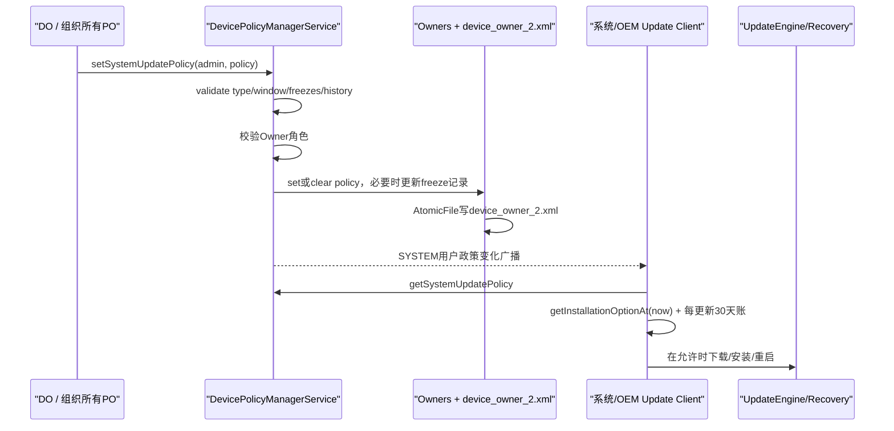
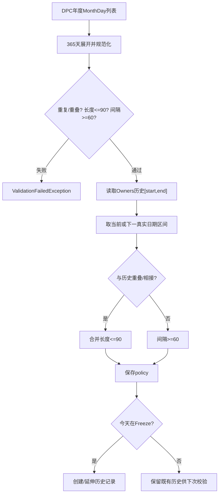
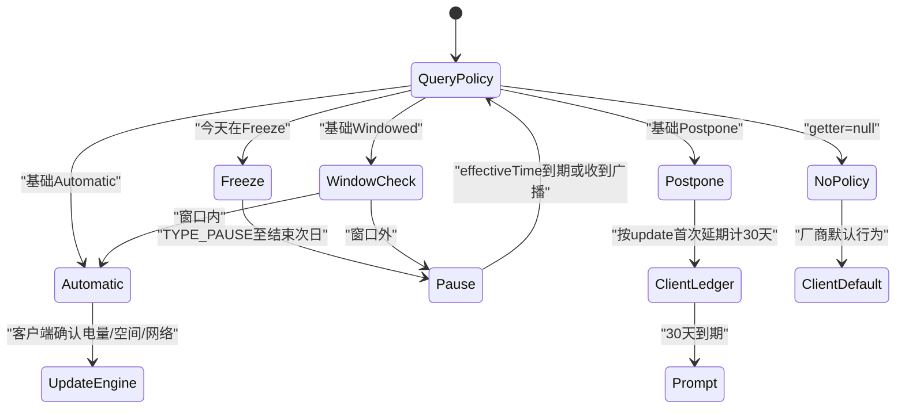

# 318 Android 企业 System Update Policy：维护窗口、Freeze Period、历史记录、OTA客户端及时间边界链

## 1. 本章目标

本章追踪DPC设置系统更新策略的权限、校验、持久化、广播与消费模型，重点解释Automatic、Windowed、Postpone、Freeze Period、历史冻结账和本地时间边界。

## 2. Android 11版本边界

以 android-11.0.0_r48 为准，阅读SystemUpdatePolicy、FreezePeriod、DevicePolicyManager(Service)、Owners及相关测试；不假设OEM OTA客户端实现与AOSP外部相同。

## 3. 策略不是OTA本身

这里保存的是“更新客户端应如何处理更新”的政策对象。它不下载payload、不调用UpdateEngine、不验证签名，也不直接重启设备。

## 4. 三个完成点

setSystemUpdatePolicy返回只证明策略验证并写入Owners；广播只证明政策变化被通知；OTA是否下载、进入安装窗口、安装成功和重启完成属于更新客户端的后续状态。

## 5. 允许角色

公开文档允许Device Owner或organization-owned managed profile的Profile Owner；DPMS用USES_POLICY_ORGANIZATION_OWNED_PROFILE_OWNER特殊策略门实现。

## 6. 普通PO不可设置

个人BYOD工作资料PO和delegate不能设置设备级OTA策略；parent DPM实例也被客户端throwIfParentInstance拒绝。

## 7. 三种基础策略

Automatic要求可用时无交互安装；Windowed只在每天本地维护窗口自动安装；Postpone将每个更新最多延迟30天。

## 8. Freeze叠加在基础策略上

任一基础策略都可附年度重复Freeze Period。进入Freeze时返回内部TYPE_PAUSE，离开后才恢复基础策略。

## 9. 四张状态账

Owners保存当前policy；Owners另存上次连续freeze真实日期；OTA客户端保存每个update的延期/窗口尝试时间；UpdateEngine和slot状态保存真正安装进度。

## 10. 策略发布总链

## 11. admin参数不是policy owner字段

policy保存在全局Owners，不记录哪一组件最后写入；文档允许Owner包中组件更新，最近一次策略生效。

## 12. null清策略

传null跳过policy校验，清mSystemUpdatePolicy并写盘，随后仍发送变化广播和事件日志。

## 13. 校验发生在授权前

r48先对非空policy执行validateType/freezes/history，进入synchronized后才检查Owner；无权调用者传无效对象可能先收到IllegalArgumentException而非SecurityException。

## 14. 类型校验

只接受AUTOMATIC、WINDOWED、POSTPONE；内部TYPE_PAUSE不能由DPC直接设，它只作为当前有效安装选项返回。

## 15. Window参数范围

start/end都是本地午夜起的分钟数，必须在[0,1440)；工厂方法与服务端validateType都会检查，防止伪造Parcel绕过。

## 16. 本地时区语义

计算使用Calendar默认时区和ZoneId.systemDefault；更改时区会移动真实UTC窗口，策略并不固定在某个UTC时刻。

## 17. Automatic

没有Freeze列表或更早边界时，getInstallationOptionAt返回TYPE_INSTALL_AUTOMATIC和Long.MAX_VALUE；若存在下一Freeze，有效期会被截短。真正安装仍受电量、空间、网络和Updater约束。

## 18. Windowed

窗口内被转换成当前TYPE_INSTALL_AUTOMATIC，窗口外转换成TYPE_PAUSE；更新客户端不必自己理解window结构，只需执行option并在effectiveTime到期重查。

## 19. Postpone

没有下一Freeze边界时返回TYPE_POSTPONE和Long.MAX_VALUE。Policy对象本身没有“本update已延期几天”的字段，30天上限由更新客户端按具体update维护。

## 20. 30天不能靠重设延长

API合同要求同一更新只延期一次，反复设置POSTPONE不能重置起点；但这需要OTA客户端用稳定update身份和首次延期时间执法。

## 21. AOSP消费边界

本地树中getInstallationOptionAt主要由测试引用，未看到通用UpdateEngine调用点；实际OEM updater必须监听广播、读策略并执行，不能由DPMS代码存在推断设备一定遵守。

## 22. 安全更新文档差异

TYPE_POSTPONE总文档说厂商/运营商可豁免重要安全更新，工厂方法注释又说安全补丁不受Postpone影响；Policy计算并不识别更新类别，最终由更新客户端解释。

## 23. Freeze更明确

setFreezePeriods文档明确包括security patches在内都暂停；但最终仍需要特权更新客户端采纳TYPE_PAUSE。

## 24. Window超过30天

合同说某更新尝试窗口安装30天后应提示用户并不再受窗口限制；这一 per-update 期限同样不在SystemUpdatePolicy对象中。

## 25. Window起止相等的合同

createWindowedInstallPolicy文档规定start==end表示完整24小时，理论上等价全天允许自动安装。

## 26. r48等值窗口实现落差

计算条件把相等窗口当普通非跨午夜区间，只在whenMillis精确等于该分钟起点的那一毫秒判为窗口内。

## 27. 有效期还是0

即便精确命中，(end-when+day)%day得到0，返回AUTOMATIC但effectiveTime=0；客户端应立即重查，无法形成全天自动区间。

## 28. 复读结论

在r48 AOSP中不要用start==end表达全天；若产品需要全天行为，应使用Automatic，并对OEM分支另行验证。

## 29. 普通窗口边界

条件使用start<=now<=end，end时刻仍返回Automatic，但到end的有效期计算为0；下一次查询会进入Pause。

## 30. 跨午夜窗口

start>end时，now>=start或now<=end都在窗口，例如22:00—02:00；有效期用模24小时计算到次日end。

## 31. 窗口外有效期

返回TYPE_PAUSE，有效期是到下一次window start的毫秒数；到期后客户端必须重新查询。

## 32. DST不是固定24小时

窗口内部用固定TimeUnit.DAYS=24小时做模运算，而日期与Freeze用时区日历；夏令时切换附近可能与真实下一本地边界相差一小时，需OEM地区测试。

## 33. Freeze用MonthDay

FreezePeriod只保存月日并每年重复；end早于start表示跨年，如12月15日至1月10日。

## 34. 闭区间

开始与结束日都计入长度；90天上限也是含首尾的连续日数。

## 35. 闰日忽略

2月29日在定义、包含、长度和间隔计算中按2月28处理，不额外计一天。

## 36. Canonicalize算法

源码把365天展开为boolean数组再重建区间，可自然合并重叠/相邻以及年末和年初片段。

## 37. 重复或重叠

规范化后的区间数与输入数不同，就抛ERROR_DUPLICATE_OR_OVERLAP；相接日期也会合并，因此不能用两个贴合区间规避长度。

## 38. 单段最长90天

任一规范区间getLength>90抛NEW_FREEZE_PERIOD_TOO_LONG；正好90天允许。

## 39. 相邻至少空60天

间隔计算排除前段end和后段start，少于60天就抛TOO_CLOSE；年末到年初的环形间隔也检查。

## 40. 列表自校验只是第一层

policy.setFreezePeriods检查新列表自身；DPMS设置时还会把新/current freeze与设备历史freeze记录组合再验证。

## 41. 为什么需要历史账

若只验年度模板，DPC可每天换一个短Freeze无限暂停。历史[start,end]记录设备实际经历的最近连续冻结，堵住动态改表绕过。

## 42. 历史组合过长

新/current区间与历史重叠或相接时，合并后超过90天抛ERROR_COMBINED_FREEZE_PERIOD_TOO_LONG。

## 43. 历史间隔过短

若二者不重叠但空档少于60天，抛ERROR_COMBINED_FREEZE_PERIOD_TOO_CLOSE。

## 44. 只检查当前或下一段

validateAgainstPreviousFreezePeriod从规范列表找包含now的区间或之后最近区间，再与历史记录比较，不是把所有未来年份展开。

## 45. 已在区间中设置新策略

若now晚于新段理论start，比较用now作为当前段起点，避免把尚未真正经历的过去日期算入新冻结。

## 46. 历史在未来

系统时间回拨使prev start/end晚于now时只写warning，仍继续距离/长度校验，不直接丢弃历史。

## 47. 历史记录位置

Owners把freeze start/end与policy一起写入全局device_owner_2.xml，不在每用户device_policies.xml。

## 48. policy XML

保存policy type、window start/end和每个freeze的start/end；restoreFromXml重建对象，getter发现存储对象isValid=false时返回null并记录warning。

## 49. 广播不是状态载荷

ACTION_SYSTEM_UPDATE_POLICY_CHANGED只提示重新查询，发送给SYSTEM用户且为protected broadcast；更新客户端不能依赖普通应用伪造。

## 50. Freeze计算与历史账

## 51. policy设置时更新历史

新policy保存进内存后立即updateSystemUpdateFreezePeriodsRecord(false)，随后统一writeDeviceOwner，避免两次磁盘写。

## 52. 非Freeze不改历史

当前日期不在任何Freeze时，update函数直接return；历史记录保留，不因离开冻结就清除。

## 53. 新历史起点

历史为空且今天在Freeze时记录[now,now]，而不是直接写模板的理论start；只记录设备确认经历的日期。

## 54. 正常跨日延伸

若now等于旧end+1天，记录从旧start延长到now，形成连续实际Freeze。

## 55. 设备关机补段

若now晚于end+1，但旧start/end都位于当前模板真实区间，源码假设关机期间仍冻结，延伸为[start,now]。

## 56. 不同区间则重开

若历史不在当前Freeze真实范围，记录重置为[now,now]，代表新的连续段。

## 57. 时间回拨处理

now早于历史start时，记录重置为[now,now]；它防止产生start>end，但也改变历史锚，需要把手动改时当安全审计事件。

## 58. now落在已有记录内

start<=now<=end时不变化，避免回拨到记录内部缩短end。

## 59. 触发更新的事件

DPMS在ACTION_DATE_CHANGED、ACTION_TIME_CHANGED、服务启动恢复和设置新policy时调用记录更新。

## 60. 没有持续定时器逐秒写

历史按日期/时间事件和启动点推进，粒度是LocalDate；短时关机由同一模板范围推断补齐。

## 61. clear历史只给shell

clearSystemUpdatePolicyFreezePeriodRecord服务端enforceShell，DPC不可在生产中自行清账；客户端公开方法也是隐藏开发入口。

## 62. shell清账用于开发

文档建议adb shell dpm clear-freeze-period-record解决测试迭代，但生产绕过历史会破坏90/60天安全约束。

## 63. 清policy不清历史

setSystemUpdatePolicy(admin,null)只清当前policy；history仍保留，未来新policy必须继续与曾经历冻结比较。

## 64. 这正是反重置设计

若清policy顺带清历史，DPC可先清再立即设置近邻Freeze，从而绕过间隔约束。

## 65. 持久化shouldWrite

DeviceOwnerReadWriter在有DO、systemUpdatePolicy或pending update info时写文件；freeze历史本身不在shouldWrite条件。

## 66. 组织所有PO的边角

若设备没有DO，组织所有PO先设置policy会因policy非空保留文件；再清policy且无pending info时，shouldWrite可能为false，使只剩的freeze历史无法独立维持文件。

## 67. 历史丢失风险的表述

FileReadWriter在shouldWrite=false时会直接删除已有文件，因此AOSP r48确有该丢失路径；OEM若改写Owners则需另行核对。

## 68. 清Device Owner疑点

Owners.clearDeviceOwner只清Owner身份，DPMS清Owner链没有调用clearSystemUpdatePolicy；全树中clear policy仅出现在setter传null。

## 69. 直接后果

按r48 AOSP，DO退管后mSystemUpdatePolicy可能仍非空，device_owner_2.xml也因policy继续shouldWrite；这是需OEM/实机验证并在退管前主动清policy的风险。

## 70. 组织所有PO移除也要审计

由于policy不记录来源组件，移除最后一个可管理Owner后谁负责清全局策略并不由policy对象表达，生命周期测试不可省略。

## 71. getter没有Owner门

DPMS getSystemUpdatePolicy只锁内存并校验isValid，没有调用者角色检查；系统更新客户端和一般调用可读取非敏感全局策略结构。

## 72. 返回对象的有效性

跨Binder后客户端得到Parcel副本；服务端保留Owners对象。DPC修改本地对象不会自动改服务端，必须再次set。

## 73. Freeze列表只读视图

getFreezePeriods返回unmodifiableList，防止调用者直接增删内部列表；FreezePeriod本身基于不可变起止日。

## 74. InstallationOption是快照

option包含type和从查询时起的有效毫秒数；时间到期或收到政策广播后应重新读policy和计算，不能永久缓存。

## 75. Freeze优先级最高

getInstallationOptionAt先看current freeze，命中直接TYPE_PAUSE到结束次日午夜，不再看Automatic/Window/Postpone。

## 76. 下一Freeze限制有效期

不在Freeze时先算基础option，再以距离下一Freeze的时间取min，保证客户端在Freeze开始前重新查询。

## 77. Freeze结束的effectiveTime

返回到current end后一天本地午夜的毫秒数；在闰年2月28结尾时roundUpLeapDay会把结束推进至2月29，避免提前恢复。

## 78. 空Freeze列表

不会调用timeUntilNextFreezePeriod，基础Automatic/Postpone可返回Long.MAX_VALUE，Windowed仍按日边界给有限有效期。

## 79. Postpone的Long.MAX不是无限延期

它只表示policy形态不会因日历窗口自动改变；同一update的30天上限必须由OTA客户端另行缩短。

## 80. policy变化即时打断缓存

广播用于让客户端在effectiveTime尚未到期时也重查；不监听广播会在DPC改策略后继续执行旧option。

## 81. 广播只发SYSTEM用户

DPMS用sendBroadcastAsUser(...UserHandle.SYSTEM)，工作资料中的普通receiver不会自然收到；真正消费者应是系统更新组件。

## 82. policy不控制下载

TYPE_PAUSE/POSTPONE的注释主要描述installation；OEM可预下载payload但不安装，也可能连下载都停，取决于updater合同。

## 83. policy不控制重启细节

Automatic称无用户交互安装，但何时reboot、AB slot如何切换、是否等待空闲和电量仍由更新客户端/UpdateEngine决定。

## 84. Window不是JobScheduler窗口

它只是分钟区间和InstallationOption计算，不会由DPMS自动创建Alarm或Job。消费者自己安排下一次检查。

## 85. 没网络的窗口

文档指出网络、空间、电量不足会错过窗口；系统不会因为一晚失败就越窗安装，而是下个窗口重试，直到每更新30天策略由客户端解除。

## 86. 本地时间被用户修改

手动前拨可能跳入/跳出窗口或Freeze，后拨可能重复窗口；DPMS会更新时间历史，但Updater也必须基于当前时间重新计算。

## 87. 禁止改时间不是充分条件

DISALLOW_CONFIG_DATE_TIME可阻止普通UI修改，网络时间、时区、RTC异常与维护仍能改变时间；策略代码必须能处理。

## 88. Freeze与窗口相遇

即便当前在维护窗口，只要日期在Freeze中，优先返回PAUSE；Freeze结束后才重新按当天窗口判断。

## 89. 变更策略不结束正在安装

DPMS只保存和广播，没有取消UpdateEngine操作。若payload已进入不可逆阶段，改成Postpone/Freeze是否生效由更新客户端定义。

## 90. 运行决策状态机

## 91. null policy语义

getter null代表DPC未设置有效策略，系统更新客户端回到厂商默认流程，不代表禁止更新。

## 92. 存储无效时也返回null

restore出的policy若isValid失败，getter记录warning并返回null；磁盘仍可能留无效XML，消费者看到的是无策略。

## 93. 写盘在广播前

set在Owners锁内更新并writeDeviceOwner，解锁后才广播；正常路径消费者收到通知时可读新状态。

## 94. 写盘异常边界

Owners的FileReadWriter会记录AtomicFile错误，但setter无布尔持久化结果；内存策略可能生效、重启后却恢复旧值，需通过重启后读回测试。

## 95. 广播无ack

DPC不会等Updater处理完；没有“所有更新客户端已采用”的完成回调。

## 96. 多个Updater风险

OEM若有系统升级、Play系统组件升级、carrier固件等多条通道，SystemUpdatePolicy可能只被其中部分消费；Freeze文档的“all incoming system updates”仍需实现审计。

## 97. A/B与非A/B

策略层不区分无缝A/B、Virtual A/B或recovery OTA；下载、slot、merge和重启风险不在本类状态机。

## 98. 安全回滚

更改OTA策略前记录原policy；若新策略导致业务风险可set回旧对象或null，但已安装/切slot的更新不能靠policy回滚。

## 99. 推荐发布顺序

先验证OEM updater监听广播和读取策略，再部署简单Automatic/Windowed，随后增加Freeze；每阶段都用可控测试OTA验证真实行为。

## 100. Freeze配置策略

使用少量清晰区间，预先按365天环形计算90/60约束；跨年和2月29必须通过SystemUpdatePolicy API本身校验，不自行猜测。

## 101. 不要每天重写

同一policy无需每日set；DPMS通过日期变化更新历史。频繁修改只增加校验失败、写盘和消费者竞态。

## 102. 维护窗口要留余量

窗口不只是开始下载，还要满足校验、安装、快照/merge和可能重启；过短窗口会持续错过并进入30天用户提示。

## 103. 审计字段

记录policy type、window分钟、时区、freeze MonthDay列表、历史真实start/end、设置者角色、广播时间、Updater计算option/effectiveTime和update id首次延期时间。

## 104. 隐私较低但完整性高

策略不含用户内容，却能影响补丁时效；日志应防篡改并能关联Owner变更、时间调整和OTA状态。

## 105. 故障定位第一层

确认Owner角色、parent实例、policy type/window范围、Freeze自身校验和历史组合错误码。

## 106. 故障定位第二层

查Owners内存、device_owner_2.xml、freeze record、protected broadcast是否发给SYSTEM用户及Updater是否注册。

## 107. 故障定位第三层

查Updater的option/effectiveTime、per-update 30天账、电量/空间/网络门、UpdateEngine状态、slot与重启完成。

## 108. 常见误判一

“set成功即OTA安装完成”错误：DPMS甚至不调用UpdateEngine。

## 109. 常见误判二

“Postpone可通过重设再延30天”违背合同；policy类不记账，Updater必须锁定同一update首次延期时间。

## 110. 常见误判三

“start==end在r48一定全天”错误：文档如此，但本地计算只产生0有效期瞬时Automatic，应改用Automatic。

## 111. 常见误判四

“清当前policy也清freeze历史”错误：DPMS故意保留history防绕过；但无DO/无policy时的文件shouldWrite边角另需验证。

## 112. macOS只读练习一：手算窗口

阅读getInstallationOptionRegardlessFreezeAt，分别计算02:00—03:00、22:00—02:00和00:00—00:00在01:00、02:30、23:00的type/effectiveTime；不运行测试。

## 113. macOS只读练习二：画365天环

阅读FreezePeriod.canonicalizePeriods/validatePeriods，手算12-15至01-10与03-15至04-01的长度及环形间隔，标出首尾闭区间。

## 114. macOS只读练习三：历史组合

以历史2026-01-01至01-30为例，分别设计新Freeze使COMBINED_TOO_CLOSE和COMBINED_TOO_LONG，沿validateAgainstPreviousFreezePeriod逐行验证。

## 115. macOS只读练习四：查消费者缺口

执行 rg -n "ACTION_SYSTEM_UPDATE_POLICY_CHANGED|getInstallationOptionAt\\(" . -g '*.java' --glob '!out/**'；区分framework发布点、测试调用与真实OTA消费者，记录本地树缺少什么。

## 116. 最小判断口诀

Policy管意图，Option管当前动作，effectiveTime管重查时刻，history管反绕过，Updater管30天账，UpdateEngine才管安装。

## 117. 关键源码入口

SystemUpdatePolicy看类型/窗口；FreezePeriod看365天校验；DPMS看角色、历史和广播；Owners看XML；OEM Updater看真正执行。

## 118. 本章复读修正

复读确认：start==end文档与计算不一致；30天账不在policy；AOSP本地无通用UpdateEngine消费者；clearOwner不显式清policy，freeze记录又未单独进入shouldWrite条件。

## 119. 本章结论

System Update Policy是一份由Owner发布、由特权Updater解释的时间合同。可靠性取决于策略校验、历史账、时区边界、消费者实现和OTA执行五层，任何一层都不能替另一层证明完成。

## 120. 下一章预告

下一章进入企业System Update状态报告：PendingSystemUpdate、updateReceivedTime、Security Patch状态、DPC回调、Owners持久化以及“发现更新”与“安装完成”的证据边界。
