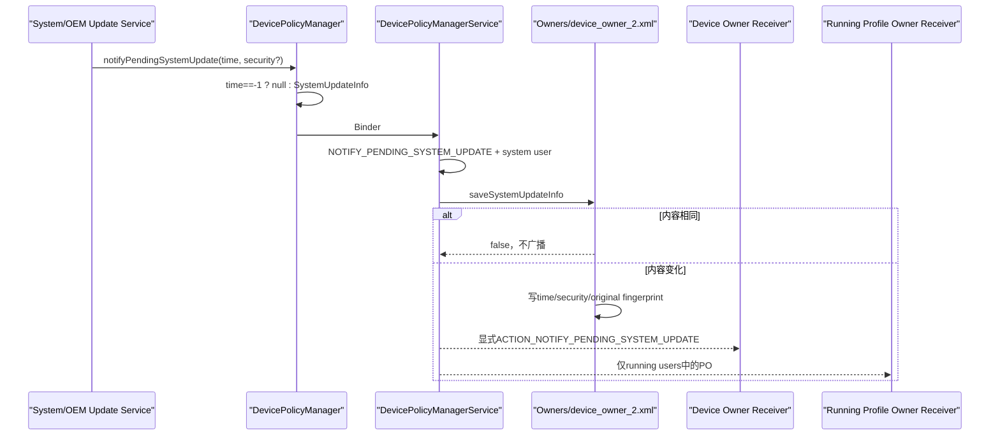
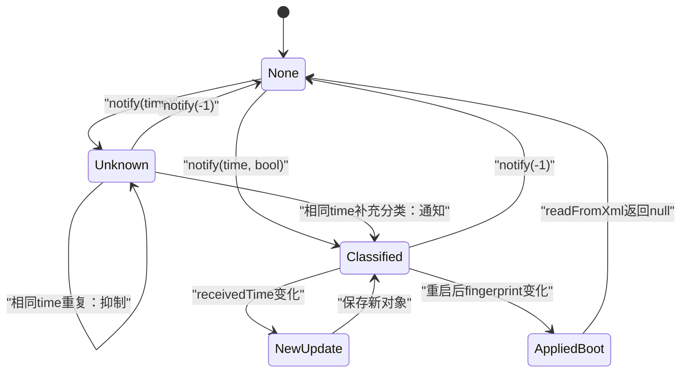
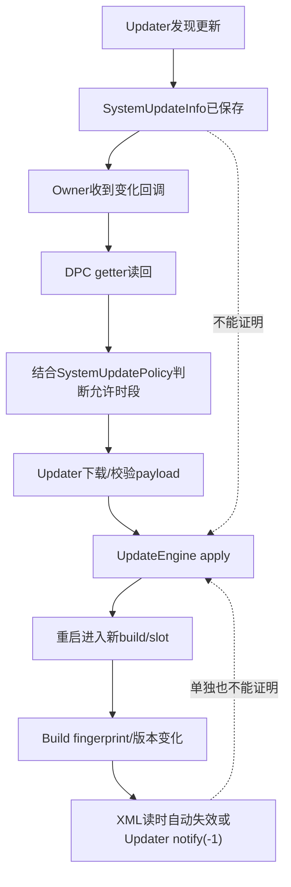

# 319 Android 企业 Pending System Update：SystemUpdateInfo上报、Owner通知、指纹失效及完成证据链

## 1. 本章目标

本章追踪系统更新服务怎样报告待处理OTA、DPMS怎样持久化SystemUpdateInfo并通知DO/PO，以及DPC怎样区分“发现更新”“安全补丁”“更新消失”和“已安装”。

## 2. Android 11版本边界

以android-11.0.0_r48为准，阅读DevicePolicyManager、DevicePolicyManagerService、DeviceAdminReceiver、SystemUpdateInfo和Owners。

## 3. 它不是上一章的Policy

SystemUpdatePolicy回答“何时允许安装”；SystemUpdateInfo回答“Updater报告当前有何待处理信息”。二者独立存储、独立写入、没有自动互相推导。

## 4. Info也不是安装状态机

对象只有receivedTime和securityPatchState，没有版本号、下载进度、payload id、安装百分比、slot、错误码或重启状态。

## 5. 谁负责上报

隐藏System API供system update service调用，要求NOTIFY_PENDING_SYSTEM_UPDATE；DPC只能接收或查询，不能伪造上报。

## 6. 谁能查询

getPendingSystemUpdate要求admin是Device Owner或任意Profile Owner；普通应用和delegate无权读取。

## 7. 通知谁

状态变化后显式通知DO，并通知所有当前running user对应的PO；不要求PO组织所有或affiliated。

## 8. -1代表清除

两个notify重载都把receivedTime=-1转换成null，表示没有pending update；这会持久清空并发送receivedTime=-1回调。

## 9. 四张状态账

Updater有真实更新库存；Owners有一份全局SystemUpdateInfo；每个Owner进程有回调/查询快照；UpdateEngine有下载、验证、安装和slot状态。

## 10. 上报与通知总链

## 11. parent实例被拒绝

notify与getter客户端都throwIfParentInstance；系统更新状态是设备全局信息，不通过工作资料parent DPM投影。

## 12. 两个notify重载

只传time时securityPatchState=UNKNOWN；传time和boolean时为TRUE或FALSE，优先使用后者表达已知分类。

## 13. boolean的精确语义

isSecurityPatch=true表示该更新“纯粹是安全补丁”；false并不表示更新不含任何安全修复，只表示不是纯安全补丁。

## 14. UNKNOWN不是FALSE

旧Updater或尚未分类时应使用UNKNOWN。DPC UI和合规逻辑必须保留三态，不能把UNKNOWN当非安全更新。

## 15. receivedTime合同

应是currentTimeMillis时间轴上“当前pending update首次可用”的毫秒值，不是下载完成、安装计划或最后一次轮询时间。

## 16. 同一更新应保持time

Updater重复发现同一OTA时应复用首次时间；每次轮询都写now会制造变化、重发通知并破坏DPC对等待时长的理解。

## 17. 服务端不校验时间

SystemUpdateInfo.of只把恰好-1视为null；-2、未来时间或极老值都会成为有效对象，DPMS不做范围/单调性检查。

## 18. 信任边界

安全性依靠只有受信系统Updater持signature权限，而不是数据校验；OEM错误上报仍可污染Owner可见状态。

## 19. system user限制

即便持权限，Binder calling user不是USER_SYSTEM时，DPMS只warning并return，不保存也不广播。

## 20. 这里是静默拒绝

非system user不会收到SecurityException或失败boolean，调用正常返回；Updater必须运行在system user并通过查询/测试确认。

## 21. permission先检查

缺NOTIFY_PENDING_SYSTEM_UPDATE会SecurityException，然后才检查calling user；这与system-user静默分支是两种失败形状。

## 22. info是不可变值对象

receivedTime与security state都是final；Parcel只传两值，equals/hashCode也只比较这两值。

## 23. 重复抑制

Owners用Objects.equals(newInfo, oldInfo)。两字段都相同或二者都null时save返回false，不写盘、不发送Owner回调。

## 24. 分类变化会重发

相同receivedTime从UNKNOWN更新为TRUE/FALSE时equals变化，会保存并通知；回调Intent本身仍只有time。

## 25. 回调没有security extra

ACTION_NOTIFY_PENDING_SYSTEM_UPDATE只放EXTRA_SYSTEM_UPDATE_RECEIVED_TIME。Owner要调用getPendingSystemUpdate获取三态。

## 26. 为什么回调参数不够

DeviceAdminReceiver旧API只接受receivedTime，为兼容不能随意改签名；新增信息放在可查询Parcelable中。

## 27. Callback分发

DeviceAdminReceiver.onReceive匹配ACTION_NOTIFY_PENDING_SYSTEM_UPDATE，读取long extra，默认-1，再调用onSystemUpdatePending。

## 28. 显式组件

DPMS对每个Owner把intent.setComponent(ownerComponent)，不是隐式全局广播，减少其他应用观察。

## 29. DO优先

clean identity后先在锁内查DO并发送，再获取running user列表，随后遍历PO。

## 30. DO不受running列表过滤

DO发送路径不检查getRunningUserIds；DO通常位于system user，但源码结构与PO路径不同。

## 31. PO只通知running users

停止、尚未启动或quiet/停止状态不在running列表的资料用户不会收到当次回调。

## 32. 漏回调不等于漏状态

SystemUpdateInfo先写全局Owners；PO以后运行时可主动getPendingSystemUpdate恢复，不应只依赖广播。

## 33. 多个PO共享同一info

状态不是per-profile；每个有权PO查询到同一全局对象，receivedTime和security分类完全相同。

## 34. 通知没有ordered/ack

sendBroadcastAsUser不等待DPC处理，也不收结果；上报API返回不证明任何Owner完成业务动作。

## 35. Remote running-user失败

AMS getRunningUserIds RemoteException时记录错误并return；DO可能已收到，而所有PO本轮都漏掉。

## 36. 锁内逐PO查组件

running user遍历中每次短暂持DPMS锁取PO component并发送；Owner移除竞态由当时快照决定，DPC仍应以getter复核。

## 37. SystemUpdateInfo全局持久化

Owners.saveSystemUpdateInfo立即调用DeviceOwnerReadWriter.writeToFileLocked，写device_owner_2.xml。

## 38. 无Owner也可保存

shouldWrite条件包含mSystemUpdateInfo，因此即便当前无DO/policy，pending info非null也能让全局文件存在。

## 39. null可能删除文件

清info后若同时没有DO、system update policy和其他pending info，shouldWrite=false会删除device_owner_2.xml；残余freeze历史也可能随之丢失。

## 40. XML三个属性

pending-ota-info写received-time、security-patch-state和original-build；最后一项不是API字段，而是重启后判断更新是否已应用的锚。

## 41. original-build取写入时值

每次writeToXml使用当前Build.FINGERPRINT，不是SystemUpdateInfo构造时捕获；同一进程中它通常稳定。

## 42. 启动读取时比较

readFromXml先比较存储fingerprint与当前Build.FINGERPRINT，不同就返回null，认为OTA已经应用并丢弃旧pending信息。

## 43. 它是启发式完成判据

指纹改变通常意味着新系统build启动，但不直接证明特定pending update就是导致变化的那一包。

## 44. 同指纹更新边界

若某更新应用后fingerprint未变，自动失效不会发生；Updater仍须notify(-1)清除，否则状态可能跨重启残留。

## 45. 其他构建变化

刷入另一build或工厂升级也会改变fingerprint并清旧info，即使原pending OTA未按计划安装；这是合理的“旧提示不再可信”处理。

## 46. 读取异常

received/security属性用parseLong/parseInt；损坏XML会走Owners外层解析错误恢复，而非返回一个部分有效对象。

## 47. security状态缺少运行校验

私有构造和XML读取没有显式检查0/1/2；异常整数能存入对象，直到toString映射时可能IllegalArgumentException。

## 48. Binder路径较安全

公开两个of工厂只产生UNKNOWN/FALSE/TRUE，正常Updater无法通过DPM API传任意int；磁盘损坏/OEM反射是主要异常来源。

## 49. getter的权限门

Objects.requireNonNull(admin)后enforceProfileOrDeviceOwner；admin必须属于调用UID/user的真实Owner，不接受delegate。

## 50. Pending状态生命周期

## 51. Info不含update id

只能用receivedTime近似区分更新；两个不同OTA若误用同time同classification，equals会把第二次当重复。

## 52. Info不含版本号

DPC不能从此API得知目标Android版本、build、补丁级别或包大小，需要OEM管理协议另行提供。

## 53. Info不含强制截止时间

30天Postpone/Window期限也不在对象中；DPC要理解政策需同时读SystemUpdatePolicy，Updater则维护自己的per-update账。

## 54. Info不含下载状态

pending可能仅代表服务发现更新，也可能已经下载；framework接口没有统一定义更细阶段。

## 55. Info不含安装允许性

有pending info时仍可能处在Freeze或Window外；无pending info也不代表当前policy为空。

## 56. Info不控制通知UI

DPMS只通知Owner receiver，不直接展示系统更新页面或用户通知；Updater/UI决定面向用户的呈现。

## 57. DPC回调应快速

DeviceAdminReceiver运行在广播接收时限内，应只入队工作并查询状态，不在onSystemUpdatePending执行长网络或数据库事务。

## 58. 回调要幂等

虽然framework抑制完全相同对象，DeviceAdminReceiver文档仍提醒同一pending update可多次回调；DPC必须按time+security+自身业务状态去重。

## 59. 为什么文档说可重复

不同classification、服务重报、Owner生命周期/OEM扩展都可能造成多次；不能依赖r48 Objects.equals实现作为永久API合同。

## 60. 冷启动恢复

DPC每次启动或Owner启用后主动调用getter；收到回调只是加速，不是唯一一致性机制。

## 61. cleared回调

receivedTime=-1应被视为“framework当前无pending info”，DPC应清本地告警，但不要把它记为安装成功。

## 62. 无pending的多种原因

可能是安装完成、用户取消、Updater撤回、服务器替换、fingerprint变化、Updater错误清除或从未发现。

## 63. 安装成功需要别的证据

至少结合新Build.FINGERPRINT/版本、boot completed、UpdateEngine结果或OEM回执；单独null不足以作合规完成证明。

## 64. 安全补丁完成也要核验

securityPatchState=true只分类待处理包，不证明当前Build.VERSION.SECURITY_PATCH已经推进；安装后应读新系统补丁级别。

## 65. receivedTime受墙钟影响

它来自currentTimeMillis，用户/网络校时可能使不同更新时间不单调；不能直接当数据库自增序号。

## 66. 未来时间处理

framework不拒绝未来值，DPC展示“等待时长”前应校验并标记时钟异常，而非计算负天数后继续自动决策。

## 67. 极老时间处理

也可能是Updater持久恢复的首次发现时间；应结合当前update身份和OEM信息判断，不自动改写。

## 68. 权限声明

NOTIFY_PENDING_SYSTEM_UPDATE是系统级权限；普通DPC即使声明也不会获得，管理应用不应尝试调用隐藏notify。

## 69. clean identity的时点

DPMS用原Binder身份执行permission/user检查和Owners保存，只有发送Owner广播阶段clear identity。

## 70. 写盘使用调用线程

saveSystemUpdateInfo同步写AtomicFile，notify返回前持久化通常已尝试完成；随后广播异步交付。

## 71. 写盘失败无返回

Owners记录IO错误但save仍返回“内容改变”true，DPMS继续发广播；内存/回调可见新info，重启后可能丢失。

## 72. 重复判定在内存

若前次写盘失败但mSystemUpdateInfo已更新，下次完全相同上报被抑制，不会再次尝试写盘，直到内容变化或进程重启。

## 73. 这是重要恢复缺口

因此Updater不能认为重复notify一定修复持久化；设备测试应包含磁盘失败/重启后的getter核对。

## 74. Owner回调内容最小化

Intent只含time且显式定向，没有Parcelable，降低跨版本序列化和敏感分类广播面。

## 75. 查询返回同一全局对象

服务端Owners返回对象，Binder序列化给调用者；不同Owner不能各自清或标记已处理。

## 76. DPC本地确认另存

若企业后台需要“管理员已知晓”，DPC应以receivedTime/设备id自建ack；framework没有ack字段。

## 77. Owner转移

SystemUpdateInfo不绑定Owner component，所有权转移后新Owner可getter看到同一pending状态；旧Owner失去查询权限。

## 78. DO清除的状态边界

Owners.clearDeviceOwner不清mSystemUpdateInfo；pending info仍可因shouldWrite保留，但没有DO时只会通知running POs。

## 79. PO移除

移除某PO不改变全局pending info，也不影响其他Owner；重新创建PO后可查询当前状态。

## 80. 用户停止

被停止PO用户不在running列表，状态变化时不唤醒其receiver；后续启动应执行冷恢复。

## 81. quiet mode与running不同

Quiet profile可能仍有UserState差异；DPMS只依据AMS runningUserIds和PO存在性，不主动判断DPC业务是否可执行。

## 82. DO与PO接收顺序

源码先发DO，再枚举PO，但广播交付是异步的，不能据此建立跨Owner全局顺序或事务。

## 83. 一个Intent对象被复用

循环中不断setComponent后发送；Context在send时封送Intent，正常不会让后一个component改写已发消息，但自定义测试桩要复制语义。

## 84. Owner查询竞态

收到time=T回调后，Updater可能已上报新T2或清除；getter结果比Intent更晚、更权威，DPC应接受它不同于回调参数。

## 85. 本地事件模型

把回调视作“状态可能变化”，读取getter后再更新本地状态，类似ContentObserver，而不是直接把extra覆盖数据库。

## 86. 并发上报

Owners锁串行比较和写入；两个Updater线程T1/T2的最后到达者成为全局值，不做receivedTime新旧排序。

## 87. 旧值可覆盖新值

因为没有单调检查，迟到的旧上报可把T2改回T1并触发通知；系统Updater应单一权威或自行序列化。

## 88. security重新降级

同time从TRUE重新用旧重载上报UNKNOWN也会被接受；framework不阻止信息质量倒退。

## 89. DPC防御

可记录最近观察历史并标注倒退/未来/分类降级，但不能擅自忽略framework当前getter；应同时上报诊断。

## 90. 证据层级

## 91. 发现完成点

非null getter只证明受权Updater曾上报且当前Owners仍保留对象。

## 92. 通知完成点

onSystemUpdatePending只证明该DPC receiver被调度，甚至不证明DPC已成功持久化企业后台任务。

## 93. 分类完成点

TRUE/FALSE/UNKNOWN来自Updater声明，framework不解析payload或验证补丁类型。

## 94. 安装完成点

必须来自UpdateEngine/OEM状态与新build启动证据，不能由Info对象推导。

## 95. 清除完成点

null只证明pending记录当前不存在；结合fingerprint变化和update id才能合理归因到安装。

## 96. 推荐DPC流程

回调到达→立即getter→校验time→持久本地事件→结合policy/OEM详情→向后台报告→在重启后核对build和getter。

## 97. 推荐Updater流程

首次发现固定receivedTime→尽快分类→状态变化才notify→同一update不刷新time→撤回/安装完成明确notify(-1)。

## 98. 安装跨重启

若Updater来不及清除，原fingerprint锚会在新build读XML时自动丢弃，减少Owner看到已安装更新仍pending的概率。

## 99. 指纹不是更新id

不能把original-build当目标fingerprint；它只保存发现状态所在的旧build。

## 100. 同build进程重启

fingerprint相同，Info从XML恢复，说明system_server/设备重启本身不应清pending。

## 101. XML输出日志

dumpsys Owners会打印receivedTime和security状态；时间本身不敏感，但可能暴露企业补丁节奏，访问应受dump权限保护。

## 102. 最小审计字段

记录receivedTime、security三态、观察时currentTime、fingerprint、Owner类型/user、回调与getter时间、policy、OEM update id/版本和最终build。

## 103. 避免日志误导

字段名叫Pending System Update，不等于已下载；报告中应使用“Updater已上报待处理”而非“更新包已就绪”。

## 104. 故障定位第一层

查Updater是否持权限、是否在system user、传time是否稳定、classification是否倒退。

## 105. 故障定位第二层

查Owners内存/XML、original fingerprint、save重复判定和AtomicFile错误。

## 106. 故障定位第三层

查DO/PO存在、PO user是否running、显式广播、DeviceAdminReceiver action与DPC冷启动getter。

## 107. 常见误判一

“只有DO会收到”错误：所有running user的PO也收到同一全局状态。

## 108. 常见误判二

“相同time永不再通知”不完整：security状态变化仍会触发；完全相同两字段才抑制。

## 109. 常见误判三

“receivedTime=-1表示安装成功”错误：只表示当前无pending info。

## 110. 常见误判四

“securityPatchState=false表示没有安全修复”错误：boolean合同说的是是否纯安全补丁。

## 111. 常见误判五

“fingerprint不同能证明指定OTA安装成功”过强：它只让旧pending记录失效。

## 112. macOS只读练习一：权限与静默分支

阅读DPMS.notifyPendingSystemUpdate，画出缺权限、非system user、重复info、新info四条路径的异常、写盘和广播结果。

## 113. macOS只读练习二：广播对象

阅读13080—13135行和DeviceAdminReceiver.onReceive，列DO、running PO、stopped PO各自是否收到，以及Intent里有哪些/没有哪些字段。

## 114. macOS只读练习三：指纹恢复

阅读SystemUpdateInfo.writeToXml/readFromXml，推演同build重启、fingerprint变化、Updater显式-1和同fingerprint OTA四种结果；不修改文件。

## 115. macOS只读练习四：写盘失败窗口

对照Owners.saveSystemUpdateInfo与FileReadWriter，解释内存赋值、AtomicFile异常、true返回、广播、重复抑制和重启恢复的先后关系。

## 116. 最小判断口诀

Updater负责上报，Owners负责一份全局快照，Receiver只负责提醒，getter负责当前真值，fingerprint负责旧快照失效，UpdateEngine才负责安装。

## 117. 关键源码入口

DPM看System API；DPMS看权限与Owner分发；SystemUpdateInfo看三态/指纹；Owners看去重写盘；OEM Updater看真实update id和进度。

## 118. 本章复读修正

复读确认：-1以外负值也会保存；非system user持权限会静默return；回调只含time；同time分类变化会重发；写盘失败后的相同上报被内存equals抑制。

## 119. 本章结论

Pending System Update是一条“受权Updater声明→全局快照→Owner变化提示”的轻量证据链。它适合让DPC知情，不足以独立证明下载、分类真实性或安装完成。

## 120. 下一章预告

下一章进入DPC主动Install System Update：文件URI授权、UpdateInstaller线程、AB/non-AB分流、电池门、UpdateEngine回调、错误码和重启完成边界。
