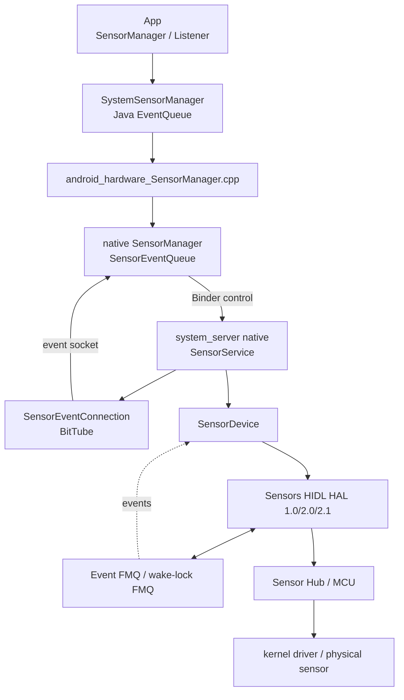
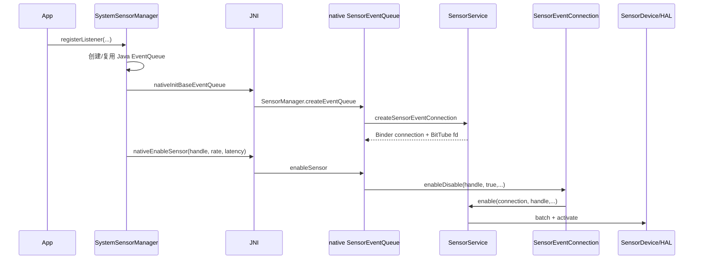
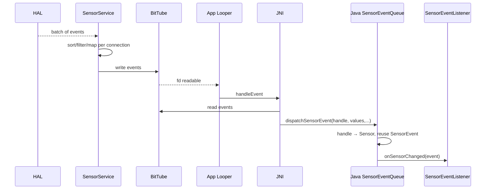
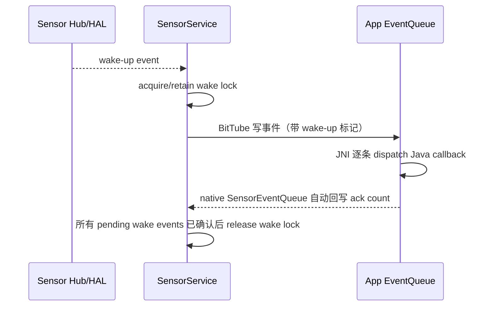

# 32 Android 传感器系统、SensorService 与 Sensor HAL

> 源码版本：Android 11 / API 30 / `android-11.0.0_r48`  
> 学习方式：macOS 只读源码，不要求编译  
> 前置章节：[06 SystemServer 与系统服务](./06-SystemServer与系统服务.md)、[07 Binder 基础](./07-Binder基础与完整调用链.md)、[20 输入系统](./20-InputReader与InputDispatcher输入系统.md)

手机旋转、计步、抬腕亮屏、自动亮度、指南针和游戏姿态都依赖传感器系统。它看起来只有一行 `registerListener()`，实际横跨 App Java、JNI、native Binder、SensorService、Sensors HAL、驱动、Sensor Hub，并包含采样、批处理、唤醒、时间戳、融合和隐私策略。

本章重点回答：

1. App 注册监听后，硬件传感器怎样被真正启用？
2. 多个 App 请求不同频率时，硬件以什么频率工作？
3. 高频事件为何不逐条走 Binder？
4. `samplingPeriodUs` 与 `maxReportLatencyUs` 各控制什么？
5. wake-up sensor 怎样确保 CPU 醒来并等 App 确认？
6. 物理、虚拟、复合、动态、one-shot、direct report 传感器怎样区分？

---

## 1. 总体架构



先区分两组通道：

| 通道 | 主要内容 | 为什么这样设计 |
|---|---|---|
| Binder 控制面 | 建连接、enable、disable、batch、flush | 调用低频、需要权限和对象生命周期 |
| BitTube/FMQ 数据面 | 持续的 sensor events 和确认 | 避免每个高频样本都做 Binder transaction |

---

## 2. 进程与线程边界

Android 11 默认路径中：

- `SystemSensorManager`、Java listener 在 App 进程。
- native `SensorManager`、`SensorEventQueue` 也在 App 进程。
- native `SensorService` 通常由 SystemServer JNI 启动，运行在 `system_server` 进程。
- Sensors HAL service 通常在独立 vendor/system HAL 进程。
- Sensor Hub/MCU 和物理传感器位于 Android CPU 之外。

源码也提供独立 `sensorservice` executable，但不能仅凭该文件存在就断言设备默认采用独立进程。

线程至少包括 App Looper、Binder 线程、SensorService 主线程、HAL/FMQ 线程和 Hub/driver 中断或采样线程。

---

## 3. SystemServer 怎样启动 SensorService

入口：

```text
frameworks/base/services/java/com/android/server/SystemServer.java
frameworks/base/services/core/jni/com_android_server_SystemServer.cpp
frameworks/native/services/sensorservice/SensorService.cpp
```

Java 调用 native `startSensorService()`，JNI 中实例化 `SensorService` 并注册名为 `sensorservice` 的 Binder 服务。

这是“Java SystemServer 调 JNI 创建 C++ 系统服务”的典型案例。它不同于 AMS 这种 Java SystemService，也不同于必须由 init 独立拉起的 daemon。

---

## 4. SensorManager 与 SystemSensorManager

应用获得：

```java
SensorManager sm = context.getSystemService(SensorManager.class);
```

`SensorManager` 是抽象 API 和通用工具方法；真正实现是 `SystemSensorManager`。后者负责：

- 创建 native SensorManager。
- 从 native 枚举传感器列表。
- 维护 listener → SensorEventQueue 映射。
- 选择 callback 所在 Looper。
- JNI enable/disable/flush/direct channel。

不要在 `SensorManager.java` 里苦找完整 Binder 调用，它很多方法最终落到 `SystemSensorManager`。

---

## 5. Sensor 对象描述什么

一个 `Sensor` 包含：

- name、vendor、version。
- type、string type。
- handle。
- maximum range、resolution、power。
- minDelay、maxDelay。
- FIFO reserved/max event count。
- reporting mode。
- wake-up、dynamic、additional info 等 flags。

`handle` 是系统内部标识，不是传感器类型。设备可以有两个相同 type 的加速度计，但 handle 不同。

---

## 6. Type、Handle、Name 不要混用

```text
TYPE_ACCELEROMETER：功能类型
handle：HAL/Framework 用于路由具体 sensor instance
name/vendor：人类可读实现信息
```

`getDefaultSensor(TYPE_ACCELEROMETER)` 只选系统认为的默认实例。需要完整能力时读取 `getSensorList(type)`。

重启或动态 sensor 重连后，不应把 handle 当跨设备、跨版本的稳定业务 ID。

---

## 7. 物理传感器与虚拟传感器

物理传感器直接对应硬件测量，例如 accelerometer、gyroscope、magnetometer。

虚拟/复合传感器由其他数据计算，例如：

- rotation vector。
- gravity。
- linear acceleration。
- orientation（旧类型）。

SensorService 内的 `SensorFusion` 可结合加速度计、陀螺仪和磁力计生成部分虚拟数据；厂商 Sensor Hub/HAL 也可能直接提供融合后的传感器。

所以“虚拟”不等于“在 App Java 中算出来”。

---

## 8. Reporting Mode

| 模式 | 行为 | 示例 |
|---|---|---|
| Continuous | 按采样周期持续产生 | accelerometer、gyro |
| On-change | 值变化时报告，并通常先给当前值 | light、proximity |
| One-shot | 触发一次后自动停用 | significant motion |
| Special trigger | 特殊触发语义 | step detector、tilt detector 等按定义处理 |

one-shot 应使用 `requestTriggerSensor()`，不是普通 `registerListener()`。

---

## 9. registerListener API 参数

常见重载最终表达：

```java
registerListener(listener, sensor, samplingPeriodUs,
                 maxReportLatencyUs, handler)
```

- `samplingPeriodUs`：希望多长时间采一个样本。
- `maxReportLatencyUs`：样本最多可在 FIFO 中攒多久再批量上报。
- `handler`：App callback 使用哪个 Looper。

两个时间参数单位是微秒，不是毫秒。`SensorEvent.timestamp` 又是纳秒，这是高频错误来源。

---

## 10. SENSOR_DELAY_* 不是精确频率

旧常量：

```text
SENSOR_DELAY_FASTEST
SENSOR_DELAY_GAME
SENSOR_DELAY_UI
SENSOR_DELAY_NORMAL
```

它们被映射为建议 delay。即使传入明确微秒值，也只是请求：

- HAL 可根据支持的 ODR 取近似值。
- 事件可能更快到达。
- 系统可因权限、后台策略或设备能力限制速率。
- callback 调度延迟不等于采样周期。

不要用 callback 到达墙钟间隔反推出硬件采样绝对精度。

---

## 11. Java listener 与 EventQueue 的映射

`SystemSensorManager.registerListenerImpl()` 维护：

```text
一个 SensorEventListener
 ↔ 一个 Java SensorEventQueue
 ↔ 一个 Looper
```

同一个 listener 可以监听多个 sensor，它们共享该 queue/Looper。若传入 Handler 则使用 Handler 的 Looper，否则使用 manager 创建时的 main Looper。

因此 callback 卡顿可能是 App Looper 被阻塞，不一定是 HAL 没产出数据。

---

## 12. 注册监听完整控制链



注册返回 `true` 表示配置成功，不表示 callback 已同步收到第一个样本。

---

## 13. native SensorManager

源码：

```text
frameworks/native/libs/sensor/SensorManager.cpp
frameworks/native/libs/sensor/SensorEventQueue.cpp
frameworks/native/libs/sensor/ISensorServer.cpp
frameworks/native/libs/sensor/ISensorEventConnection.cpp
```

native `SensorManager` 从 ServiceManager 获得 `ISensorServer`，读取 sensor list，并为客户端创建 `SensorEventQueue`。

Java JNI 持有 native 对象指针；Java listener 生命周期、native strong reference 和 Binder connection 必须一起收敛。

---

## 14. SensorEventConnection

每个 App event queue 在 SensorService 端对应一个 `SensorEventConnection`。它记录：

- calling UID、package/op package。
- 当前启用的 sensor handles。
- 每个 handle 的采样/批处理请求。
- 向客户端写事件的 channel。
- wake-up event 的 ack 状态。
- cache、first flush pending 等状态。

它是“一个客户端订阅会话”，不是某一个物理传感器。

---

## 15. BitTube 是什么

`BitTube` 基于本地 socket pair，传递结构化的 `sensors_event_t`。服务端写入，App native queue 的 fd 被注册到 Looper；可读时 JNI Receiver 批量读取并分派 Java callback。

```text
SensorService write events
 → BitTube socket
 → App Looper fd ready
 → android_hardware_SensorManager Receiver
 → dispatchSensorEvent
 → SensorEventListener.onSensorChanged
```

因此 Binder 用于创建连接和控制，事件流不逐条做 Binder RPC。

---

## 16. App 侧事件回调链



Java `SensorEvent` 对象可能被复用。callback 返回后不应长期持有其 `values` 并假设内容不变；需要留存时应复制需要的数据。

---

## 17. SensorService 的主事件循环

SensorService 初始化传感器列表和 virtual sensors，创建 event queue，随后从 `SensorDevice` 获取 HAL events，处理：

- dynamic sensor meta event。
- flush complete。
- wake-up flag。
- virtual sensor fusion。
- 按 connection 筛选 enabled handles。
- per-connection cache 和 socket backpressure。
- 写入每个客户端 BitTube。

一个 HAL event 可能被复制/路由给多个连接，但硬件无需为每个 App 各采一次。

---

## 18. SensorDevice

源码：

```text
frameworks/native/services/sensorservice/SensorDevice.cpp
frameworks/native/services/sensorservice/SensorDevice.h
```

`SensorDevice` 封装 Sensors HAL，管理每个 handle 的 active clients 和 batch parameters，并计算当前最佳硬件配置。

它解决的核心问题是：多个客户端对同一传感器提出不同要求时，怎样合并成一份 HAL 配置。

---

## 19. 多客户端采样率仲裁

假设：

```text
App A：accelerometer 每 20 ms
App B：accelerometer 每 5 ms
```

为了满足两者，物理传感器通常按更快的 5 ms 配置。SensorService 再按需要向各 connection 交付；实现和 sensor reporting mode 会影响是否/如何降采样。

一般原则：

```text
硬件 sampling period 取所有 active request 中最严格的要求
```

App A 注销后，SensorDevice 要重新计算，可能把硬件降回较慢频率以省电。

---

## 20. Batch 参数仲裁

对同一 sensor 的多个请求，系统既要满足最快采样，又不能让任何客户端超过其最大报告延迟。

第一层可粗略理解为：

```text
best sampling period = 最小请求周期
best max latency     = 能满足所有客户端的最严格延迟
```

源码中的 `BatchParams::merge()` 更精确：

```text
合并后的 sampling period = min(当前周期, 新请求周期)
合并后的 batch period    = min(当前 batch,
                               max(新请求 batch, 新请求 sampling period))
```

这里 `max(batch, sampling)` 是新请求的 apparent batch period；如果最终 `mTBatch <= mTSample`，代码会把 batch timeout 设为 0，明确要求 streaming mode。除此之外还要处理 disabled client、reserved FIFO、reporting mode、active state 和 HAL 错误。因此不能只背“两个参数都取最小值”，应直接阅读 `SensorDevice::BatchParams::merge()` 与 `Info::selectBatchParams()`。

---

## 21. batch 到底省什么电

支持硬件 FIFO 或 Sensor Hub 时，传感器可持续采样并把多条 event 暂存在低功耗域：

```text
传感器持续采样
 → FIFO 累积 N 条
 → AP 暂时 suspend
 → FIFO 满/延迟到期/flush
 → 一次唤醒并批量上传
```

它减少 Application Processor 唤醒次数，不一定减少传感器自身采样次数。

`maxReportLatencyUs=0` 通常表示尽快连续上报，而不是关闭采样。

---

## 22. FIFO 大小

Sensor 描述中有：

- `fifoReservedEventCount`：为该 sensor 保证的 FIFO 容量。
- `fifoMaxEventCount`：在理想共享条件下最大容量。

实际可批处理时长约为：

```text
FIFO 可用 event 数 × sampling period
```

但 FIFO 可能由多个 sensor 共享，所以 max 并不代表始终独占可用。

---

## 23. flush 的精确语义

`SensorManager.flush(listener)` 要求：把调用时已经在硬件/FIFO/服务 pipeline 中、属于该连接的事件先送完，然后给该 listener 一个 flush complete callback。

顺序意图：

```text
旧事件 A、B、C
flush 请求
可能继续采样 D...
交付 A、B、C
onFlushCompleted(sensor)
```

flush 不是清空并丢弃，也不是停止 sensor。这个词与音频、MediaCodec 的 `flush` 语义不同。

---

## 24. flush complete 怎样匹配调用者

HAL 的 flush complete meta event 面向 handle，但多个 connection 可能都调用 flush。SensorService 的 `SensorRecord` 维护请求队列，把完成事件只交给对应 connection。

Android 规范要求 App 只收到自己显式请求的 flush complete，不能因为另一 App flush 同一硬件就误收到完成通知。

---

## 25. Wake-up Sensor

wake-up sensor 保证：当事件产生时，即使 AP 正在 suspend，也要唤醒系统，并让 SensorService 持有 wake lock，直到接收方确认事件已处理。

典型：significant motion、部分 proximity/step detector，具体由设备声明。

非 wake-up sensor 在 suspend 期间可能继续 batch，也可能丢失，取决于硬件能力和配置；它不承诺唤醒 AP。

---

## 26. Wake Lock 确认协议



这个 ack 没有公开的 App Java API，不要求业务代码在 `onSensorChanged()` 中手动确认。`android_hardware_SensorManager.cpp` 的 Receiver 读完一批 event、完成 Java 分发后调用 native `SensorEventQueue::sendAck()`；只有该批中的 wake-up event 才增加确认数量。

因此业务 callback 若长时间阻塞，自动 ack 也会被推迟。如果 channel 阻塞或客户端死亡，SensorService 还必须通过缓存、连接清理等机制避免永久持锁。

---

## 27. 时间戳是什么时间轴

`SensorEvent.timestamp`：

- 单位是纳秒。
- 表示事件发生的时间，不是 Java callback 到达时间。
- 基于 monotonic/boottime 语义，规范要求在 suspend 前后保持正确关系。

不要使用 `System.currentTimeMillis()` 与它直接相减。墙钟会被网络校时、用户修改，并且单位、epoch 都不同。

---

## 28. 一个时间戳例子

```text
sensor timestamp       = 120,000,000,000 ns
callback 时 elapsed    = 120,035,000,000 ns
pipeline/report latency≈ 35,000,000 ns = 35 ms
```

这 35 ms 可能来自 batch 等待、HAL/FMQ、SensorService 分发和 App Looper 调度，不能直接说“传感器采样慢了 35 ms”。

若要与相机、音频或 VSYNC 对齐，必须确认双方时钟域及设备厂商的 timestamp 同步质量。

---

## 29. Accuracy 不是测量值精度的小数位

`onAccuracyChanged()`/event accuracy 常表达当前校准可信等级，例如 magnetometer accuracy。它不表示 `values[]` 有几位小数，也不是每种 sensor 都以相同方式更新。

磁力计受硬铁/软铁环境干扰，旋转设备做校准可能改善 accuracy；算法应同时考虑噪声、bias、resolution 和 sampling rate。

---

## 30. 坐标系

Android sensor 坐标系固定相对于设备默认自然方向，而不是随屏幕 UI rotation 自动旋转。

典型轴向：

```text
X：设备右侧
Y：设备顶部
Z：垂直屏幕向外
```

横屏应用需要结合 display rotation 使用 `remapCoordinateSystem()` 等转换。屏幕旋转不等于 sensor 硬件坐标轴也旋转。

---

## 31. 加速度计读数包含重力

静止平放时 accelerometer 不会读成全零，它测的是 proper acceleration，某一轴通常接近重力加速度。

```text
linear acceleration ≈ accelerometer - gravity estimate
```

gravity/linear acceleration 是融合或滤波结果，会引入延迟和模型误差。不要把原始 accelerometer 与 linear acceleration 混用。

---

## 32. Rotation Vector

Rotation vector 表达设备相对于参考坐标的姿态，可由 gyro、accelerometer、magnetometer 融合。不同类型：

- rotation vector：通常结合地磁，能给绝对航向但受磁干扰。
- game rotation vector：通常不依赖磁力计，短期平滑但 yaw 会漂移。
- geomagnetic rotation vector：不用 gyro，更省电但动态性能不同。

选择依据是功耗、漂移、绝对方向和运动响应，而不是名字哪个“更高级”。

---

## 33. SensorFusion

源码：

```text
frameworks/native/services/sensorservice/SensorFusion.cpp
frameworks/native/services/sensorservice/RotationVectorSensor.cpp
frameworks/native/services/sensorservice/GravitySensor.cpp
frameworks/native/services/sensorservice/LinearAccelerationSensor.cpp
```

当虚拟 sensor 被激活时，fusion 会请求所需物理 sensor，并以自己的目标周期参与 `SensorDevice` 仲裁。即使没有 App 直接监听 gyro，rotation vector 也可能使 gyro 处于 active。

---

## 34. Sensor Hub

Sensor Hub 是低功耗 MCU，可在主 AP suspend 时完成：

- 采样与 FIFO。
- step detection/counting。
- significant motion。
- 部分融合和手势算法。
- 低功耗唤醒判断。

AOSP 只定义 Framework/HAL 行为，具体 Hub firmware 和算法通常是厂商实现，源码未必在本工程中。

---

## 35. Sensors HAL 版本

Android 11 源码同时有 HIDL Sensors 1.0、2.0、2.1：

```text
hardware/interfaces/sensors/1.0/ISensors.hal
hardware/interfaces/sensors/2.0/ISensors.hal
hardware/interfaces/sensors/2.1/ISensors.hal
```

主要能力包含：

- getSensorsList。
- activate。
- batch。
- flush。
- setOperationMode。
- injectSensorData。
- direct channel。

2.x 使用 Fast Message Queue 搬运事件/唤醒确认，2.1 扩展类型和接口。具体设备使用哪个版本需看 VINTF manifest 和运行时连接。

---

## 36. HAL activate 与 batch 顺序

Framework 通常先调用 `batch(handle, samplingPeriodNs, maxReportLatencyNs)` 配置，再 `activate(handle, true)`。

原因是硬件启用时就应知道采样和批处理参数。改变 active sensor 配置时也会重新计算并下发 batch。

`activate(false)` 停止该 handle；但只有当没有其他客户端或虚拟 sensor 仍依赖它时，底层才真正停采。

---

## 37. HAL 1.0 poll 与 2.x FMQ

概念上：

- 1.0 路径更接近阻塞 `poll()` 从 HAL 取一批 events。
- 2.0/2.1 初始化 event FMQ 与 wake-lock FMQ，HAL 写 queue 后唤醒 Framework reader。

两者最终都被 `SensorDevice` 适配成统一事件供 SensorService 处理。

不要把 HAL FMQ 与 App 的 BitTube 混为一个 queue：它们位于链路两端，跨越不同进程边界。

---

## 38. Multi-HAL

设备可能有多个传感器来源，例如 SoC sensor hub、外接传感器、特殊厂商模块。Sensors Multi-HAL 把多个 sub-HAL 合并为一个 HAL service 视图。

需要解决：

- handle 避免冲突。
- event 路由回正确 sub-HAL。
- 多来源线程和 FMQ 汇聚。
- dynamic sensor 添加移除。

因此 Framework 看到一个 sensor list，不代表所有传感器来自同一芯片或驱动。

---

## 39. Dynamic Sensor

动态传感器可在运行中连接/断开，例如某些 USB、BLE 或可插拔设备提供的 sensor。App 可注册 `DynamicSensorCallback`。

动态 sensor meta event 到达后，SystemSensorManager 更新列表并通知 callback。断开后旧 Sensor handle/connection 不再可靠。

它与 BLE GATT 传感器业务 App 不是同一回事：只有被平台动态 sensor 机制接入，才会出现在 SensorManager 列表中。

---

## 40. One-shot Trigger Sensor

```java
requestTriggerSensor(listener, sensor)
```

事件触发一次后 subscription 自动取消。典型 significant motion 由低功耗域检测运动并唤醒 AP。

如果想继续等待下一次，需在 callback 后重新 request。不能把 one-shot 当 continuous listener，反复等待同一次注册。

---

## 41. Step Detector 与 Step Counter

```text
TYPE_STEP_DETECTOR：每检测到一步发事件，value 通常表示本次步事件
TYPE_STEP_COUNTER：报告设备重启以来累计步数（在激活期间按定义上报）
```

应用自己的“今日步数”应保存基线并结合日期/重启处理，不能直接把硬件累计值当当天数值。

两者算法可运行在 Sensor Hub，功耗通常远低于 App 自己常开高频 accelerometer。

---

## 42. Direct Channel

高性能场景可创建 direct channel，把 sensor event 直接写入共享内存：

```text
SensorDirectChannel
 → shared memory / HardwareBuffer
 → configureDirectChannel
 → HAL direct report
```

适用于 VR/AR 等低延迟高频消费，绕过普通 listener/BitTube 路径。它仍需权限、支持的 sensor、memory type 和 rate level，并非所有 App/传感器可用。

---

## 43. Direct Report Rate Level

Direct channel 使用 rate level：STOP、NORMAL、FAST、VERY_FAST，而不是任意微秒周期。Sensor 的 `getHighestDirectReportRateLevel()` 与 `isDirectChannelTypeSupported()` 描述能力。

direct channel 降低分发开销，但共享内存中的 record 仍需 sequence/timestamp 正确读取；消费者太慢也可能被后续记录覆盖。

---

## 44. 数据注入模式

SensorService/HAL 支持 data injection，主要用于测试。进入 injection mode 后禁用真实 sensor，授权测试来源注入 event，再恢复 normal mode。

这是受严格权限和运行模式保护的能力，不是第三方 App 随意伪造系统传感器数据的 API。

源码可看 `setOperationMode()`、`injectSensorData()` 和 SensorService dump 控制。

---

## 45. 权限与受限传感器

多数基础 motion sensor 无单独运行时权限，但部分 sensor/速率受：

- `BODY_SENSORS` 等权限。
- AppOps。
- target SDK。
- UID active/idle 状态。
- sensor privacy。
- 平台对高采样率的限制。
- device policy/特殊权限。

具体规则随 Android 版本变化。本章只按 Android 11 源码判断，不套用后续版本全部限制。

---

## 46. Sensor Privacy

SensorService 监听 sensor privacy policy。访问被关闭时，会禁用或阻止连接的 sensor 数据，并在恢复时重新评估。

这里的 sensors privacy 与 Camera/Microphone UI 开关在不同 Android 版本有演进。源码中的 `hasSensorAccessLocked()` 还结合 UID active 和 operation restricted 状态。

权限已授予也不代表策略层一定允许当前持续接收。

---

## 47. 后台 UID 限制

SensorService 跟踪 UID active/idle。UID 进入后台或 idle 后，某些连接可能失去访问；回到 active 再恢复订阅。

这意味着：

```text
registerListener 成功
≠ App 生命周期内永远按原速率收事件
```

应把进程生命周期、前后台、Doze 和权限变化纳入诊断。

---

## 48. App 为什么必须 unregister

不再需要时调用：

```java
sensorManager.unregisterListener(listener);
```

否则：

- 硬件可能继续高速采样。
- AP 被频繁唤醒。
- App Looper 持续处理 callback。
- listener/queue 持有对象，形成生命周期泄漏。

SensorService 会在 Binder connection 死亡时清理，但不能用“进程最终会死”代替正确注销。

---

## 49. Backpressure 与事件缓存

如果 App Looper 太慢或 socket 写不进去，SensorEventConnection 会缓存部分事件。缓存有限，持续阻塞可能导致事件丢失、连接异常或 wake lock 压力。

callback 中应：

- 快速复制必要字段。
- 把重计算/IO post 到工作线程。
- 不逐事件写同步数据库或网络。
- 根据业务选择合理采样率，而非一律 FASTEST。

---

## 50. 高频并不等于低延迟

把采样从 50 Hz 提到 200 Hz，只改变样本间隔目标；端到端 latency 还包括：

```text
sensor conversion
 + FIFO/batch wait
 + Hub/HAL transport
 + SensorService queue
 + BitTube
 + App Looper scheduling
```

如果 `maxReportLatencyUs` 很大，200 Hz 的样本仍可能成批晚到。实时交互要同时控制 sampling period、batch latency、线程负载和处理策略。

---

## 51. 功耗估算思路

传感器描述的 `power` 是参考值，不足以代表整机增量。总成本包括：

- sensor/Hub 本身功耗。
- AP 唤醒频率。
- HAL/Framework 处理。
- App CPU 算法。
- 日志、网络、存储。

低频不批处理可能比适度高频、长 batch 更频繁唤醒 AP。功耗优化应以整条链和实测为准。

---

## 52. 与 Input 系统的区别

Sensor 与触摸/按键都来自硬件，但 Framework 不同：

| Sensor | Input |
|---|---|
| Sensor HAL / SensorService | evdev / EventHub / InputReader |
| App 主动订阅某 handle | InputDispatcher 按焦点/触摸目标路由 |
| 连续数值与时间序列 | Key/Motion 输入语义 |
| batch、flush、wake-up sensor | dispatch timeout、finish ack |

部分 HID sensor 或厂商设备可能在更底层有交叉，但不能把 SensorManager 当 InputManager 的包装。

---

## 53. 与 Location 系统的关系

加速度、陀螺仪、气压计可辅助定位，但 SensorService 不负责 GNSS/网络定位，也不直接生成 `Location`。

定位/融合组件可以作为 SensorManager 客户端消费事件。权限和数据流仍分别经过 Location 与 Sensor 子系统。

“允许位置”与“能读所有传感器”不是同一个权限判断。

---

## 54. 常见问题分层诊断

| 症状 | 优先检查 |
|---|---|
| `getDefaultSensor()` 为 null | HAL sensor list、类型是否实现、设备 feature |
| register 返回 false | sensor/reporting mode、参数、listener 数、权限、native enable 错误 |
| 没 callback | App Looper、UID policy、connection、HAL activate、是否有事件 |
| 频率不符合期望 | 单位、minDelay/ODR、其他客户端、后台限制、callback 调度 |
| 数据成批到达 | maxReportLatency、FIFO、HAL batching |
| flush 无 callback | listener 类型、sensor active、HAL flush complete、connection 队列 |
| suspend 后没事件 | 是否 wake-up sensor、FIFO/Hub 能力、wake ack |
| 方向计算错误 | 坐标系、display rotation、单位、fusion 类型、磁干扰 |
| 功耗高 | FASTEST、未 unregister、无 batch、wake-up sensor、callback 重负载 |
| 时间对不上 | ns/us/ms、event time 与 callback time、clock domain |

---

## 55. dumpsys sensorservice

可选真机观察：

```bash
adb shell dumpsys sensorservice
```

通常可看到：

- sensor list、handle、type、flags、minDelay、FIFO。
- active sensors 与 current sampling/batch config。
- active connections、package/UID。
- recent events。
- wake lock/pending ack。
- operating mode、dynamic sensors。
- fusion 状态。

先保存一个空闲快照，再注册 listener 保存第二份，对比比单看长输出更有效。

---

## 56. 源码路线一：服务启动与列表

```text
frameworks/base/services/java/com/android/server/SystemServer.java
frameworks/base/services/core/jni/com_android_server_SystemServer.cpp
frameworks/native/services/sensorservice/SensorService.cpp
frameworks/native/services/sensorservice/SensorDevice.cpp
hardware/interfaces/sensors/2.1/ISensors.hal
```

练习：从 SystemServer 追到 HAL `getSensorsList`，写出每一步进程和对象类型。

---

## 57. 源码路线二：注册控制链

```text
frameworks/base/core/java/android/hardware/SensorManager.java
frameworks/base/core/java/android/hardware/SystemSensorManager.java
frameworks/base/core/jni/android_hardware_SensorManager.cpp
frameworks/native/libs/sensor/SensorEventQueue.cpp
frameworks/native/services/sensorservice/SensorEventConnection.cpp
frameworks/native/services/sensorservice/SensorService.cpp
frameworks/native/services/sensorservice/SensorDevice.cpp
```

练习：追 `registerListener` 到 HAL `batch + activate`，区分 Java queue、native queue、server connection。

---

## 58. 源码路线三：事件返回链

从 HAL event 向上反追：

```text
SensorDevice poll/FMQ
SensorService threadLoop
SensorEventConnection sendEvents
BitTube
SensorEventQueue::read
JNI Receiver::handleEvent
dispatchSensorEvent
onSensorChanged
```

练习：解释为何事件数据路径不需要每条调用 Binder callback。

---

## 59. 源码路线四：batch 与 flush

重点搜索：

```text
SensorDevice::batch
selectBatchParams
SensorService::enable
SensorEventConnection::flush
SensorRecord flush queue
META_DATA_FLUSH_COMPLETE
```

练习：设计两个 App 不同 sampling/latency 的例子，算出应满足的硬件配置与各自完成通知。

---

## 60. 源码路线五：wake-up 事件

```text
SensorService::isWakeUpSensorEvent
SensorEventConnection::sendEvents
SensorEventAckReceiver
WAKE_LOCK_NAME
wakeLockRefCount
```

练习：从 wake-up event 到 App ack 画完整时序，并标出客户端死亡时如何释放资源。

---

## 61. 源码路线六：虚拟传感器

```text
frameworks/native/services/sensorservice/SensorFusion.cpp
frameworks/native/services/sensorservice/RotationVectorSensor.cpp
frameworks/native/services/sensorservice/GravitySensor.cpp
frameworks/native/services/sensorservice/LinearAccelerationSensor.cpp
```

练习：选择 rotation vector，记录它依赖哪些物理 sensor、怎样参与采样率仲裁、输出坐标含义是什么。

---

## 62. 推荐八组只读练习

1. **对象地图**：SensorManager、SystemSensorManager、Java/native EventQueue、Connection、SensorDevice。
2. **注册链**：register → batch → activate。
3. **数据链**：HAL → SensorService → BitTube → App Looper。
4. **参数实验纸算**：10 ms/0 latency 与 50 ms/5 s latency 两客户端如何仲裁。
5. **flush 顺序**：画事件、flush request、flush complete 的先后。
6. **wake ack**：解释 wake lock 为什么不能在写完 socket 后立即释放。
7. **融合链**：从 rotation vector 反查物理依赖。
8. **单位审计**：标记源码中 us、ns、Hz、m/s²、rad/s 的转换点。

---

## 63. 初学者最容易混淆的十五点

1. `SensorManager` 是抽象 API，实际实现是 `SystemSensorManager`。
2. Android 11 默认 SensorService 可运行在 system_server 内的 native 层。
3. Java EventQueue、native EventQueue、server Connection 不是同一个对象。
4. handle 不是 sensor type。
5. register 成功不等于第一个样本已经到达。
6. sampling period 是请求，不是精确 callback 周期保证。
7. samplingPeriodUs/maxReportLatencyUs 是微秒，event timestamp 是纳秒。
8. event timestamp 是采样时间，不是 callback 时间。
9. batch 减少 AP 唤醒，不等于减少采样。
10. sensor flush 是排空并给完成标记，不是丢弃数据。
11. wake-up sensor 与普通 sensor 的 suspend 保证不同。
12. 同一硬件可被多个 App/虚拟 sensor 共享。
13. 加速度计静止时通常不为零。
14. sensor 坐标不随 UI rotation 自动变化。
15. HAL FMQ 与 App BitTube 是两个不同数据通道。

---

## 64. 自测题

1. SensorService 默认在哪个进程，怎样启动？
2. 为什么事件不逐条走 Binder？
3. 一个 listener 监听三个 sensor 会创建几个 Java EventQueue？
4. samplingPeriodUs 和 maxReportLatencyUs 有何区别？
5. 两个 App 请求 20 ms 和 5 ms，硬件通常选哪个？
6. batch 为什么能省电？
7. flush 与 MediaCodec flush 有何根本差别？
8. wake-up event 为什么需要 App ack？
9. SensorEvent.timestamp 能否直接减 currentTimeMillis？
10. accelerometer 与 linear acceleration 有何区别？
11. rotation vector 为什么可能间接启用 gyro？
12. HAL FMQ 和 BitTube 各位于哪段？
13. direct channel 解决什么问题？
14. listener 不注销会带来什么成本？
15. callback 频率低于请求值时应检查哪些层？

---

## 65. 自测答案

1. 通常在 system_server 的 native 层，由 SystemServer Java 经 JNI 实例化并注册 Binder 服务。
2. 高频事件用 HAL FMQ 和 App BitTube 批量传输，Binder 主要负责控制。
3. 一个；SystemSensorManager 以 listener 映射 queue，同一 listener 可添加多个 sensor。
4. 前者控制采样间隔请求，后者控制允许攒批后最迟多久报告。
5. 通常选更严格的 5 ms，再满足各 connection 的交付需求。
6. 让 Hub/FIFO 累积事件，减少主 AP 唤醒和调度次数。
7. sensor flush 要交付此前积压事件后通知完成，不是清空丢弃 pipeline。
8. SensorService 必须保持 AP 清醒直到 wake event 被消费，ack 后才能安全释放 wake lock。
9. 不能；单位和时间轴不同，应与 elapsed realtime/boottime 同域值比较。
10. accelerometer 包含重力影响，linear acceleration 是去除估计重力后的融合/滤波结果。
11. 它是虚拟融合 sensor，激活会注册其所需的物理 sensor。
12. FMQ 在 HAL↔SensorDevice，BitTube 在 SensorService↔App native queue。
13. 让高频低延迟事件直接写共享内存，减少普通 listener 分发开销。
14. 持续采样、唤醒、CPU callback、耗电和对象生命周期泄漏。
15. 检查单位/请求、sensor ODR/minDelay、其他客户端仲裁、batch、HAL 产出、BitTube 和 App Looper。

---

## 66. 本章结论

普通 listener 的主链可以压缩成：

```text
registerListener
 → SystemSensorManager 创建 EventQueue
 → JNI/native SensorManager
 → Binder 创建 SensorEventConnection
 → SensorService 合并多客户端要求
 → SensorDevice batch + activate HAL
 → driver/Hub 采样
 → HAL poll/FMQ
 → SensorService 分发
 → BitTube
 → App Looper/JNI
 → onSensorChanged
```

读任何传感器问题时固定问：

```text
具体 sensor instance 的 type、handle、reporting mode、wake-up flag 是什么？
采样周期、报告延迟和时间戳分别是什么单位与时间轴？
当前配置是哪个客户端或虚拟 sensor 共同仲裁出来的？
事件停在 HAL/FMQ、SensorService、BitTube，还是 App Looper？
系统 suspend 时是否要求唤醒，ack 是否完成？
这是物理数据、厂商融合，还是 Framework virtual sensor？
```

能回答这些问题，就不再只是会调用 SensorManager，而是能从 App 一直读到 Sensor HAL 和硬件采样边界。
