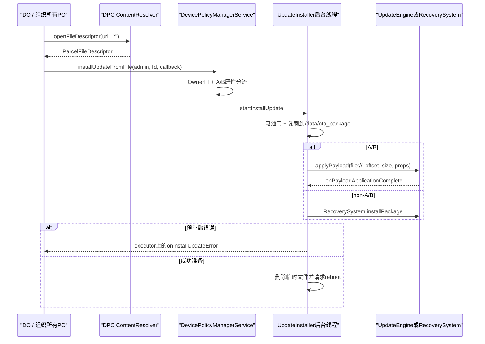
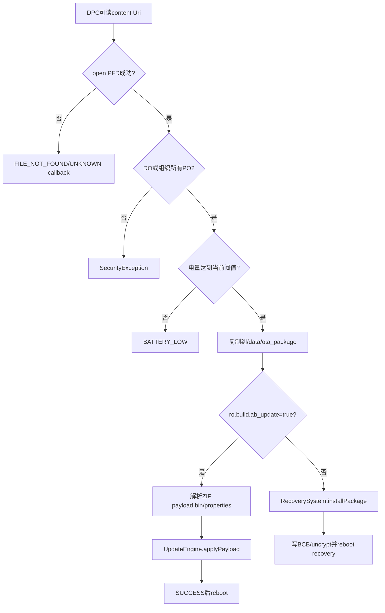
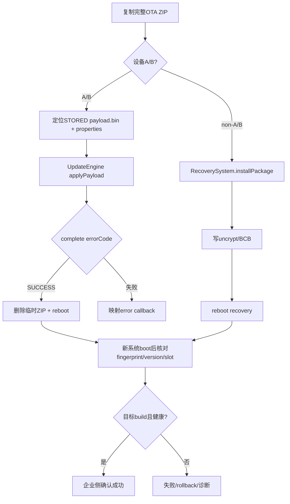

# 320 Android 企业 Install System Update：OTA文件复制、A/B UpdateEngine、Recovery重启及错误证据链

## 1. 本章目标

本章追踪DPC从content Uri主动安装OTA的完整链：客户端打开文件、Binder传FD、system_server复制、电池门、A/B与non-A/B分流、错误回调和重启后验证。

## 2. Android 11版本边界

以android-11.0.0_r48为准，阅读DevicePolicyManager、DevicePolicyManagerService、UpdateInstaller、AbUpdateInstaller、NonAbUpdateInstaller、UpdateEngine与RecoverySystem。

## 3. 它不同于Policy

SystemUpdatePolicy等待系统Updater发现并按政策处理；installSystemUpdate由Owner主动提供完整OTA文件并立即启动安装链。

## 4. 它也不同于Pending Info

本API不要求先存在SystemUpdateInfo，也不会自动把其receivedTime与提供的文件绑定。

## 5. 允许角色

服务端允许Device Owner或organization-owned managed profile的Profile Owner；普通PO和delegate不可调用。

## 6. 必然涉及重启

API文档明确设备会reboot完成安装；DPC必须把未提交业务、密钥轮换、Kiosk会话和用户通知纳入维护计划。

## 7. 重启不等于成功

文档要求重启后再核对Build.FINGERPRINT或Build.VERSION；设备重启本身不能证明新slot/Recovery OTA已成功启动。

## 8. Callback只有错误

InstallSystemUpdateCallback只定义onInstallUpdateError，没有onSuccess。成功路径请求重启，调用者不会收到“成功准备完毕”的普通回调。

## 9. 五类公开错误

UNKNOWN、INCORRECT_OS_VERSION、UPDATE_FILE_INVALID、FILE_NOT_FOUND、BATTERY_LOW是粗分类；errorMessage仅供IT管理员诊断，不适合直接展示用户。

## 10. 端到端主链

## 11. parent实例拒绝

客户端throwIfParentInstance("installUpdate")，组织所有PO以自身admin调用，不能从parent DPM实例发起。

## 12. 四个参数应非空

public注解要求admin、Uri、Executor、callback非空；代码没有统一Objects.requireNonNull，null可能在不同阶段产生NPE而非标准错误回调。

## 13. URI由DPC进程打开

DevicePolicyManager先用自身Context.getContentResolver().openFileDescriptor(uri,"r")，所以Provider只需允许DPC读取，不必直接授权system_server打开Uri。

## 14. Binder传递的是FD

成功open后把ParcelFileDescriptor跨Binder传给DPMS；Binder封送复制文件描述符引用，服务端后台线程可在客户端try-with关闭后继续读取。

## 15. URI grant边界

若Uri来自另一个Provider，DPC必须已获临时/持久read grant；open阶段失败映射FILE_NOT_FOUND，不会进入服务端Owner门。

## 16. FILE_NOT_FOUND含义较宽

它可能是路径不存在、Provider拒绝/无法打开或grant已失效，不必然是磁盘文件真的不存在。

## 17. 客户端IOException

除FileNotFoundException外的IOException映射UNKNOWN，并把stack trace作为管理员诊断message交给指定executor。

## 18. RemoteException

Binder通信失败rethrowFromSystemServer，不走InstallSystemUpdateCallback；调用方必须同时处理同步异常和异步error。

## 19. mService为空

客户端直接return且没有callback；极少见的服务不可用场景可能表现为完全无结果，DPC需有超时/重启恢复策略。

## 20. FD客户端关闭时点

Binder调用返回后try-with关闭本地PFD；服务端持有的副本稍后由AutoCloseInputStream在复制完成时关闭。

## 21. 服务端先记事件

DPMS在授权前记录INSTALL_SYSTEM_UPDATE事件和isDeviceAB布尔；无权尝试也可能留下事件，需要结合授权结果解读。

## 22. Owner权限门

enforceDeviceOwnerOrProfileOwnerOnOrganizationOwnedDevice校验admin和Binder身份；普通系统更新应用不能借此API，除非具备Owner角色。

## 23. clearCallingIdentity

Owner校验后以system_server身份创建Installer和访问/data、UpdateEngine、Recovery与PowerManager，DPC不直接获得这些特权。

## 24. A/B判断

isDeviceAB仅检查系统属性ro.build.ab_update是否忽略大小写等于true；不是运行时询问UpdateEngine能力。

## 25. 属性错误的后果

误配置会选错AbUpdateInstaller或NonAbUpdateInstaller，导致包格式解析或Recovery路径失败；DPC无法覆盖分流。

## 26. 安装对象不持久化

UpdateInstaller及线程只在system_server内存中；system_server崩溃、设备意外重启时没有DPM级任务恢复记录。

## 27. start先做电池检查

检查发生在创建后台线程和复制大文件之前，低电直接回调BATTERY_LOW并返回。

## 28. 默认电池阈值

DevicePolicyConstants默认未充电至少40%，充电时至少20%；可由Global device_policy_constants覆盖。

## 29. 比较包含等号

percentage>=threshold即通过；恰好40%未充电或20%充电默认允许。

## 30. 只检查一次

复制和apply期间不持续监控电量；通过后掉电不会由UpdateInstaller再中止。

## 31. sticky电池来源

通过registerReceiver(null,ACTION_BATTERY_CHANGED)读取level、scale、plugged；它依赖sticky Intent存在且字段有效。

## 32. null Intent缺口

源码未判batteryStatus为null，极端测试/OEM环境可NPE，而且发生在异步线程创建前，不一定转成标准error callback。

## 33. 无效level/scale缺口

默认都是-1，计算100*(-1)/(-1)=100%，可能错误通过电池门；scale=0则产生浮点Infinity/NaN边界。

## 34. 阈值也未钳位

DevicePolicyConstants对两个battery threshold不做0—100 clamp；错误Global值可让门永久失败或总通过。

## 35. 后台线程

通过new Thread启动，设THREAD_PRIORITY_BACKGROUND；没有线程名、任务队列、WakeLock或并发互斥。

## 36. 可并发发起

DPMS没有“已有安装中”全局门；多个调用可同时复制，A/B apply时由UpdateEngine状态产生冲突/异常。

## 37. 没有WakeLock

源码未在复制阶段持WakeLock；设备睡眠通常不等于CPU立刻停所有工作，但长复制可靠性应实机验证。

## 38. 复制目标

File.createTempFile在/data/ota_package创建update*.zip，避免让Recovery/UpdateEngine继续依赖DPC Provider和其生命周期。

## 39. 目标权限

FileUtils设置owner rwx、group r、other r，即0744；更新组件可读取，文件内容仍受/data目录与SELinux保护。

## 40. 无大小/空间预检

FileUtils.copy直到EOF，没有OTA大小上限或可用空间检查；ENOSPC/IO异常通常映射UNKNOWN。

## 41. 复制失败会回调两次吗

copyUpdateFileToDataOtaPackageDir内部catch已notify UNKNOWN并返回null；线程看到null又再次notify“Error while copying file”，因此同一次复制IO错误可触发两次error callback。

## 42. 这是r48明确缺口

DPC callback必须幂等，不能把重复错误当两次安装任务；建议以本地request id和时间窗口聚合。

## 43. 临时半文件清理

内部catch触发notify时mCopiedUpdateFile尚未接收destination，cleanup看见null，已创建的半文件不会被删除，可能残留/data/ota_package。

## 44. 成功复制后所有权

mCopiedUpdateFile设为完整目标，后续任一notify error或success都会尝试delete。

## 45. delete结果被忽略

cleanup不检查File.delete返回值；删除失败无日志、无callback，敏感OTA包可能残留。

## 46. 错误日志含stack trace

客户端与服务端把异常栈作为errorMessage，可能暴露Provider路径、文件名和内部目录；只应传到受控IT后台。

## 47. callback跨回DPC

system_server调用StartInstallingUpdateCallback Binder stub，客户端再用调用者提供Executor执行公开callback。

## 48. Executor也可能失败

executeCallback不捕RejectedExecutionException；如果Executor已shutdown，DPC收不到错误，服务端也无法知道公开callback未执行。

## 49. 没有成功Binder通知

notifyCallbackOnSuccess只cleanup并PowerManager reboot，不调用mCallback，API故意把重启后版本核对作为成功确认。

## 50. 共同前置与分流

## 51. A/B包格式

AbUpdateInstaller假设ZIP包含根目录payload.bin和payload_properties.txt，逻辑注释称其特定于GOTA，其他OEM更新系统应修改。

## 52. ZipFile初始化

setState先把mUpdateInstalled=true，再new ZipFile并初始化entries、properties、size=-1和offset=0；ZipException映射FILE_INVALID。

## 53. once门

同一AbUpdateInstaller二次installUpdateInThread会IllegalStateException，但每个DPM请求创建新对象，因此它不是全局并发保护。

## 54. payload必须STORED

payload.bin若使用DEFLATED而非ZipEntry.STORED，立即FILE_INVALID；UpdateEngine需要能按ZIP内连续offset直接读取原始payload。

## 55. payload size

mSizeForUpdate取entry.getCompressedSize；STORED时压缩大小等于原始大小。

## 56. offset算法

遍历entry，以30字节本地header固定部分、name.length、extra长度和compressedSize累计，payload offset指向其数据开始。

## 57. 文件名字符边界

算法使用Java字符数而非ZIP编码字节数；含非ASCII entry name可能算错offset，企业OTA应使用标准ASCII根entry并按目标OEM格式生成。

## 58. ZIP结构假设

数据描述符、local/central extra差异和entry顺序都可能挑战手算offset；AOSP注释已限定GOTA，不应拿任意ZIP测试。

## 59. directory处理

目录entry先累计再减compressedSize；其local header/name/extra仍计入offset。

## 60. properties读取

payload_properties.txt逐行加入String列表，最终作为headerKeyValuePairs传UpdateEngine；代码未设行数/长度上限。

## 61. properties缺失

源码只硬性检查payload size!=-1，没有显式要求properties entry存在；空header数组交给UpdateEngine后是否接受由payload/engine决定。

## 62. payload缺失

遍历后size仍-1，回调FILE_INVALID并清临时文件。

## 63. ZipFile未显式close

mPackedUpdateFile没有try-with或close调用；成功/失败清理只删File，r48可能让ZipFile FD等到GC，属于资源生命周期缺口。

## 64. Linux删除语义

已打开文件通常可unlink，UpdateEngine另行打开file URI的时序仍关键；cleanup只在engine完成回调后执行，正常不会过早删除。

## 65. apply URI

Paths.get(temp absolute path).toUri().toString产生file:// URI，UpdateEngine按offset/size读取payload。

## 66. UpdateEngine bind

新建UpdateEngine并bind DelegatingUpdateEngineCallback，随后applyPayload；完成回调先unbind。

## 67. 状态进度被忽略

onStatusUpdate(status,percentage)直接return，DPC没有下载/apply进度回调，也无法从此API展示百分比。

## 68. apply同步异常

applyPayload抛任意Exception时映射UNKNOWN，提示可能已有update正在处理；临时文件随error cleanup。

## 69. Engine错误映射

初始化或payload timestamp错误映射INCORRECT_OS_VERSION；哈希、大小、类型、签名/verification错误映射FILE_INVALID；设备/传输/postinstall多为UNKNOWN。

## 70. 映射是有损的

公开五类无法保留全部UpdateEngine error code；message map提供一些英文诊断，未知码为“Unknown error with error code=N”。

## 71. UPDATED_BUT_NOT_ACTIVE

payload写入但active slot没切换映射UNKNOWN，不请求重启；DPC应把它当严重设备状态问题而非普通文件坏。

## 72. SUCCESS时

onPayloadApplicationComplete(SUCCESS)→cleanup→reboot(REBOOT_REQUESTED_BY_DEVICE_OWNER)，没有公开success callback。

## 73. reboot调用返回边界

PowerManager.reboot正常应不返回；若异常/被阻止，notifyCallbackOnSuccess没有try/catch和error回调，可能留下“engine成功但未重启”。

## 74. 临时文件已先删

success函数先cleanup后reboot；如果reboot失败，原OTA ZIP已删除，无法简单重试同一服务端任务。

## 75. A/B安装完成点

UpdateEngine SUCCESS只证明payload apply阶段成功；新slot实际boot、verity、rollback和merge仍需重启后验证。

## 76. fingerprint验证

DPC在持久状态中记录安装前fingerprint和目标版本摘要，BOOT_COMPLETED后比较；仅“发生变化”仍应与目标metadata对应。

## 77. rollback可能再次变化

新slot启动失败触发bootloader rollback后，设备可能回旧fingerprint；后台需要跨多次boot观察，而非首次掉线就报成功。

## 78. Virtual A/B merge

r48策略类不暴露snapshot merge进度；若设备使用相关机制，还需UpdateEngine/OEM诊断接口确认长期完成。

## 79. concurrent UpdateEngine

另一个Updater已占用engine时apply可能抛异常或返回初始化错误；DPM没有排队/取消API。

## 80. retry必须重新提供Uri

任务不持久化且临时文件会清/残留不透明，DPC重试应重新打开可信源文件并发起新请求。

## 81. non-A/B路径

NonAbUpdateInstaller把复制后的/data ZIP交给RecoverySystem.installPackage，不在Java中解析payload.bin。

## 82. Recovery权限

clean identity后的system_server具RECOVERY/REBOOT能力；DPC自身不会得到RecoverySystem权限。

## 83. /data包要uncrypt

RecoverySystem默认processed=false，写/cache/recovery/uncrypt_file并删除旧block.map，让重启阶段先把/data文件转换为Recovery可读block map。

## 84. BCB命令

setupBcb写--update_package=@/cache/recovery/block.map与locale；若临时文件名以_s.zip结尾还加--security。

## 85. 临时名破坏security后缀

UpdateInstaller固定创建update*.zip，不保留原Uri文件名的_s.zip，因此RecoverySystem的endsWith("_s.zip")分类在此链通常不会命中。

## 86. 分类不等签名

--security主要影响Recovery语义/展示，不替代OTA签名验证；文件名后缀本身不是安全证明。

## 87. Recovery成功不返回

installPackage设置BCB后调用pm.reboot(REBOOT_RECOVERY_UPDATE)；正常成功路径设备重启，Java不继续。

## 88. 后续success调用近乎不可达

NonAb代码在installPackage返回后才notifyCallbackOnSuccess，但正常reboot不返回；若reboot返回，RecoverySystem反而抛IOException，走UNKNOWN error。

## 89. non-A/B没有成功callback

因此与A/B一样只能重启后验证；区别是A/B显式engine SUCCESS后由UpdateInstaller请求重启，non-A/B在RecoverySystem内部直接请求recovery reboot。

## 90. A/B与non-A/B证据链

## 91. non-A/B IOException

写uncrypt、BCB或reboot失败都映射公开UNKNOWN，没有INCORRECT_OS_VERSION或FILE_INVALID细分。

## 92. Recovery真正校验在重启后

包格式、签名和设备兼容性错误可能只在Recovery阶段出现，DPC进程已离线，无法通过本callback获知。

## 93. Recovery日志证据

重启回原系统后需查看/cache/recovery相关结果、boot reason和OEM上报；本API不把recovery error转回InstallSystemUpdateCallback。

## 94. Policy不会阻止主动安装

installUpdateFromFile没有读取SystemUpdatePolicy或Freeze Period；Owner主动调用可绕过等待型时间政策，维护系统应在DPC侧自行协调。

## 95. PendingInfo也不自动清

主动成功安装前未调用notifyPendingSystemUpdate(-1)；重启后若fingerprint变化，旧info读取时会失效，否则需Updater清理。

## 96. 文件真实性责任

DPC应只接受经过企业签名/哈希和TLS保护的OTA来源；framework复制阶段不先计算企业提供的hash。

## 97. 平台仍会校验

A/B由UpdateEngine验证payload metadata/hash/signature，non-A/B由Recovery验证OTA；企业预校验是额外供应链防护，不替代平台校验。

## 98. TOCTOU边界

Provider在open后给出FD，服务端复制该打开对象；若底层Provider内容可动态变化，DPC应使用不可变文件并在传前后核对hash。

## 99. 复制完成快照

一旦复制到/data/ota_package，后续源Uri变化不影响本次包；这也隔离DPC进程被杀和Provider撤权。

## 100. 不要用网络流Provider无限等待

openFileDescriptor背后若边下载边供流，Binder已返回但后台copy可长期阻塞，没有超时、取消或进度；最好先本地完整落盘并校验。

## 101. 并发控制在DPC

用持久request id、互斥锁和阶段状态避免重复调用；system_server没有为企业任务提供idempotency key。

## 102. 重启前准备

暂停关键写事务、同步本地/服务端状态、记录旧fingerprint/boot count、保证设备供电，并向用户/运维明确维护窗口。

## 103. 重启后确认

检查BOOT_COMPLETED、目标fingerprint/version/security patch、A/B slot/UpdateEngine健康、核心应用和设备策略恢复，再向后台标成功。

## 104. 错误重试分类

BATTERY_LOW等待充电；FILE_NOT_FOUND修Uri/grant；INCORRECT_OS_VERSION换正确基线/full OTA；FILE_INVALID重新获取可信包；UNKNOWN先查engine/recovery/空间/并发。

## 105. 不直接展示errorMessage

它含内部英文和stack trace，应脱敏上传IT后台；面向用户使用errorCode映射后的本地化提示。

## 106. 故障定位第一层

查Uri读取、PFD、Owner身份、A/B属性、电量Intent/阈值、/data空间和残留temp。

## 107. 故障定位第二层

A/B查ZIP entry method/offset/properties、UpdateEngine error；non-A/B查uncrypt、BCB、Recovery日志和签名。

## 108. 常见误判一

“callback没报错就是成功”错误：没有success callback，任务也可能卡在copy/apply或system_server已崩溃。

## 109. 常见误判二

“重启就证明安装成功”错误：可能rollback、Recovery失败或只是其他原因重启。

## 110. 常见误判三

“低电会持续监控”错误：只在开始时读一次sticky battery。

## 111. 常见误判四

“复制IO错误只回调一次”错误：r48内外两层都notify，且半文件可能因mCopiedUpdateFile尚为null而残留。

## 112. macOS只读练习一：FD寿命

阅读DevicePolicyManager.installSystemUpdate与UpdateInstaller.copyToFile，画出Uri permission、客户端PFD、Binder副本、AutoCloseInputStream和临时文件的关闭/删除时点。

## 113. macOS只读练习二：电池门

阅读isBatteryLevelSufficient和DevicePolicyConstants，手算充电19/20%、未充电39/40%、level=-1/scale=-1，并找出null/scale=0边界。

## 114. macOS只读练习三：A/B offset

阅读updateStateForPayload/buildOffsetForEntry，画出local header、name、extra、data累计方式，解释为何payload必须STORED以及非ASCII名称的风险。

## 115. macOS只读练习四：成功不可见

对比A/B complete SUCCESS、RecoverySystem.installPackage和notifyCallbackOnSuccess，列出callback、cleanup、reboot及重启后验证的实际顺序；不安装、不编译。

## 116. 最小判断口诀

Uri只管来源，复制管快照，电池门只查一次，A/B Engine或Recovery管应用，callback只报预重启错误，目标build健康才是成功。

## 117. 关键源码入口

DPM看Uri/Executor；DPMS看Owner与分流；UpdateInstaller看电量复制；Ab看ZIP/Engine；NonAb与RecoverySystem看BCB/reboot。

## 118. 本章复读修正

复读确认：复制IOException可能双回调并留半文件；等值成功没有callback；non-A/B success后代码基本不可达；temp文件名丢_s后缀；主动安装不读Policy。

## 119. 本章结论

企业主动OTA是一条高风险、跨重启链：DPC提供可信快照，system_server完成预检查与分流，UpdateEngine/Recovery应用，boot后的目标版本与健康检查才闭环。任何“已调用/无错误/已重启”都只是中间证据。

## 120. 下一章预告

下一章进入企业Remote Bugreport：requestBugreport、ActivityManager抓取、用户同意/拒绝、加密共享、URI grant、超时与Owner生命周期清理。
