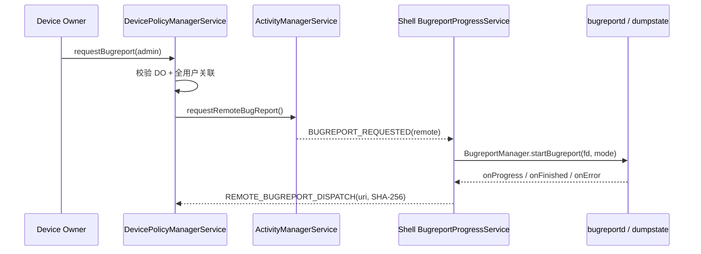
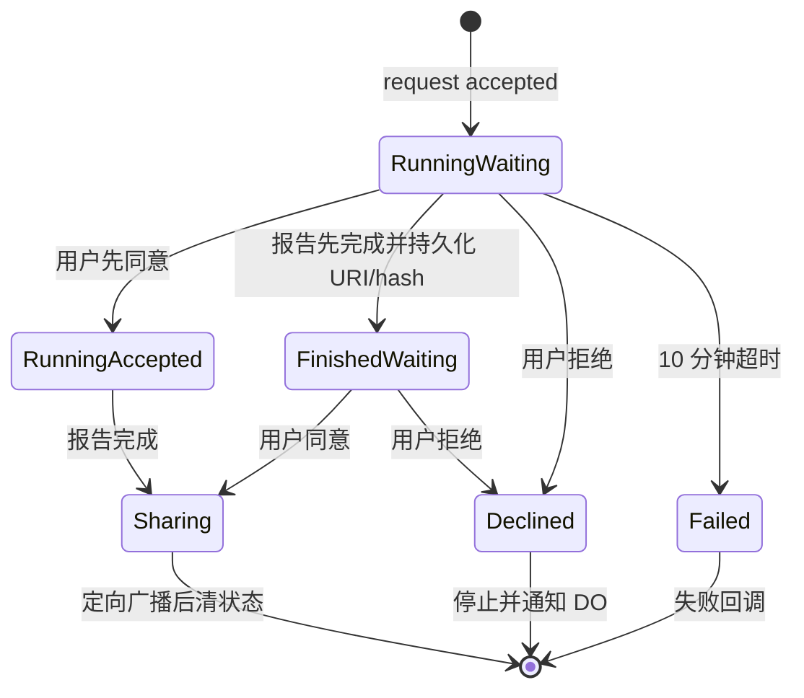
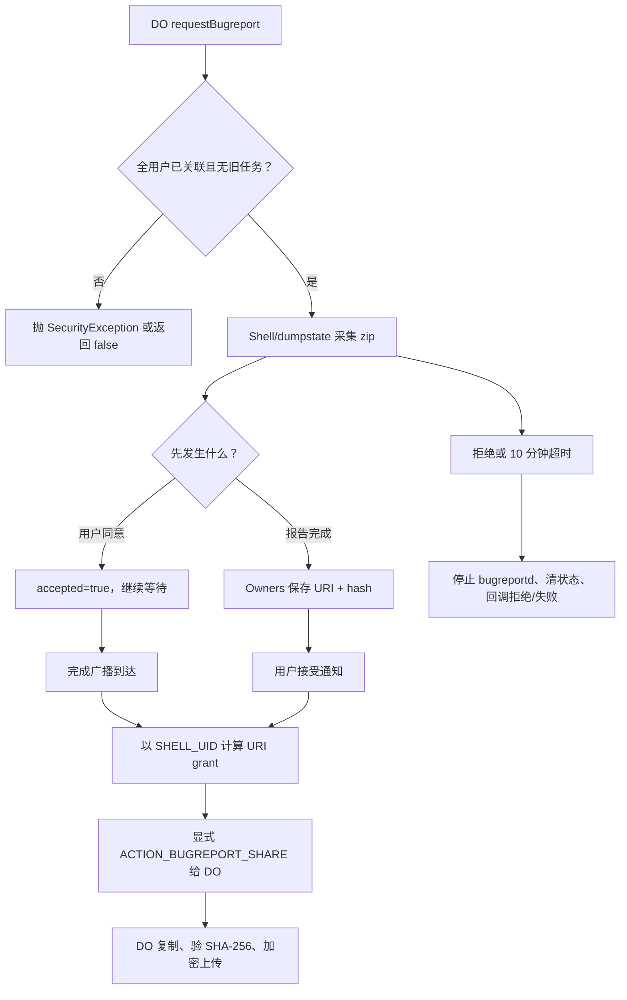

# 第 321 章 Android 企业 Remote Bugreport：请求抓取、用户同意、URI 授权、超时及 Owner 恢复链

> 源码基线：Android 11 / API 30 / `android-11.0.0_r48`。本章只做 macOS 上的源码阅读与推演，不要求编译 AOSP。

## 1. 这一章到底研究什么

企业设备的 Device Owner 可以调用 `DevicePolicyManager.requestBugreport()` 请求系统采集远程 bugreport，但“管理员提出请求”并不等于“管理员立即得到日志”。Android 11 把采集、用户知情同意、文件保存、临时 URI 授权和显式回调串成一条受控链。本章从 DPC API 一直追到 native dumpstate，再从 Shell 文件回到 DPMS 和 DeviceAdminReceiver。

## 2. 先建立正确的心智模型

这不是普通应用直接读取 `/data`，也不是 DPMS 自己遍历日志。DPMS 负责资格和同意状态；ActivityManagerService 负责把请求转给 Shell；Shell 用 `BugreportManager` 驱动 dumpstate 并持有输出文件；最终 DPMS 只把一个临时可读的 `content://com.android.shell/...` URI 定向交给 Device Owner。

## 3. 三个彼此独立的问题

阅读时要始终分开三件事：第一，dumpstate 是否仍在采集；第二，用户是否已经同意共享；第三，采集完成后的 URI 是否已经持久化等待决定。把它们混成一个 `finished` 标志，就无法解释“先同意后完成”和“先完成后同意”两种合法时序。

## 4. 主要源码入口

公开 API 在 `frameworks/base/core/java/android/app/admin/DevicePolicyManager.java`；企业状态机在 `frameworks/base/services/devicepolicy/java/com/android/server/devicepolicy/DevicePolicyManagerService.java`；通知构造在同目录 `RemoteBugreportUtils.java`；DPC 回调分派在 `DeviceAdminReceiver.java`。

## 5. 采集侧源码入口

`ActivityManagerService.requestRemoteBugReport()` 位于 `frameworks/base/services/core/java/com/android/server/am/ActivityManagerService.java`。Shell 接收器和服务分别是 `BugreportRequestedReceiver.java`、`BugreportProgressService.java`；native 模式在 `frameworks/native/cmds/dumpstate/dumpstate.cpp` 和 `dumpstate.rc`。

## 6. 谁能够发起请求

文档称该方法由 Device Owner 调用，服务端也不是只做普通权限检查，而是执行 `ensureDeviceOwnerAndAllUsersAffiliated(who)`。它先以调用者身份取得声明了 Device Owner policy 的活动管理员，再检查设备上的所有相关用户是否已关联。

## 7. Profile Owner 为什么不能直接调用

这里调用的是 `getActiveAdminForCallerLocked(who, DeviceAdminInfo.USES_POLICY_DEVICE_OWNER)`，不是“组织所有设备上的工作资料 PO 也可以”的通用判断。客户端还调用 `throwIfParentInstance("requestBugreport")`，因此 parent-profile 实例同样不是旁路。

## 8. 全用户关联的隐私意义

bugreport 可能包含跨用户的系统状态。若设备存在未关联的次用户或资料，Device Owner 不能仅凭管理主用户就抓取可能涉及其他人的现场；服务端会抛 `SecurityException`，而不是返回 `false`。用户同意仍存在，但它不是关联校验的替代品。

## 9. 返回值不要误读

`true` 只表示 DPMS 成功发起了远程调用并建立自己的跟踪状态；`false` 主要表示设备不支持 device-admin 特性、已有采集正在运行、已有完成文件等待用户决定，或调用 ActivityManager 的 Binder 发生 RemoteException。它不是“bugreport 已生成”的成功证明。

## 10. 从 DPC 到 dumpstate 的总链路

## 11. 第一扇互斥门

DPMS 在请求前检查 `mRemoteBugreportServiceIsActive.get()`。该值为真表示它认为采集仍在运行。这个 `AtomicBoolean` 允许 Handler、动态广播接收器和 Binder 调用线程之间共享状态，但它不是 dumpstate 内部真实进度的权威来源。

## 12. 第二扇互斥门

服务还检查 `getDeviceOwnerRemoteBugreportUri() != null`。这表示上一份报告已经采集完成并写入 Owners 文件，只是用户尚未接受或拒绝；此时再次请求会返回 `false`，避免新报告覆盖待处理的旧 URI/hash。

## 13. 为什么只检查 URI 而不是 hash

待处理状态以 URI 是否存在为门，因为 URI 才是可供打开的文件定位。hash 只是完整性附加信息。理论上的“hash 有而 URI 无”不会挡住新请求，这也说明这两个 XML 属性虽然一起写，却不是一个具有数据库约束的原子对象模型。

## 14. 最近请求时间是什么

请求前 DPMS 读取 `System.currentTimeMillis()`，若它大于 system user 的 `mLastBugReportRequestTime`，便更新并保存用户 policy XML。这个值供管理状态/审计查看，不参与本方法的节流，也不是“最后完成时间”。

## 15. 墙钟回拨时的细节

只有 `currentTime > oldTime` 才更新。若管理员调慢墙钟，下一次请求仍可能成功，但最近请求时间暂时保留较大的旧值。由此可知它是尽量单调的审计字段，而不是严格记录每次调用的事件表。

## 16. 为什么清除 Binder 身份

资格校验与调用者绑定的检查完成后，DPMS 调用 `binderClearCallingIdentity()`，再以 system_server 身份访问 ActivityManager、NotificationManager。这样下游权限判断看到的是受信任系统身份，而不会错误地用 DPC UID 执行系统内部操作；finally 中恢复原身份。

## 17. ActivityManager 的远程入口

`IActivityManager.requestRemoteBugReport()` 最终进入 AMS 的 `requestRemoteBugReport()`，它只是调用 `requestBugReportWithDescription(null, null, BUGREPORT_MODE_REMOTE)`。因此远程企业模式沿用统一 Bugreport API 框架，而不是一套完全独立的采集实现。

## 18. AMS 仍做 DUMP 权限校验

`requestBugReportWithDescription()` 会记录调用 UID，并调用 `enforceCallingPermission(android.Manifest.permission.DUMP, "requestBugReport")`。DPMS 已清除身份，所以 system_server 可通过；普通应用即使试图直接调用隐藏 Binder，也不能靠企业 API 的存在绕过 DUMP。

## 19. AMS 并不直接启动 native 服务

AMS 构造 action 为 `com.android.internal.intent.action.BUGREPORT_REQUESTED` 的 Intent，显式限定包名为 `com.android.shell`，写入 `EXTRA_BUGREPORT_TYPE=BUGREPORT_MODE_REMOTE`，并加入 foreground/include-background receiver flags 后发送广播。

## 20. 包限定的安全作用

`setPackage(SHELL_APP_PACKAGE)` 把内部触发广播限定给 Shell 包，降低第三方接收同名隐式广播并伪造采集 UI 的机会。Shell 的接收器入口本身还声明需要 `TRIGGER_SHELL_BUGREPORT`；这里是权限与包定向的双层边界。

## 21. “请求已发送”与“服务已启动”的间隙

AMS 的方法发送广播后就返回，DPMS 随即把 `mRemoteBugreportServiceIsActive` 设为真。此时 Shell Receiver 可能尚未调度，甚至后续创建输出文件失败。因此本地 active 是工作流乐观状态，不是 native 服务存活探针。

## 22. DPMS 建立跟踪状态的顺序

请求 AMS 返回后，DPMS 依次设置 active=true、sharingAccepted=false、注册完成与同意接收器、显示 started 通知，再向 Handler 投递 10 分钟超时任务。最后写 DevicePolicyEventLogger 事件并返回 true。

## 23. 一个很窄但真实的异常窗口

源码没有把“AMS 请求、布尔状态、接收器注册”包装成事务。理论上 Shell 极快完成并发送完成广播时，DPMS 接收器尚未注册；实际 bugreport 很慢，窗口通常不可见，但阅读源码时不能把时序概率当成严格保证。

## 24. 动态接收器一：完成广播

`mRemoteBugreportFinishedReceiver` 只在 action 为 `ACTION_REMOTE_BUGREPORT_DISPATCH` 且本地 active 仍为真时调用 `onBugreportFinished(intent)`。IntentFilter 还限定 MIME 为 `application/vnd.android.bugreport`。

## 25. 动态接收器二：用户决定

`mRemoteBugreportConsentReceiver` 监听内部 accepted 与 declined 两个 action。收到任一个动作后先取消 DPMS 的通知，再进入对应处理函数，最后注销自身；也就是说，一轮流程通常只接受一次明确决定。

## 26. 同意广播并非 DPC 回调广播

这里容易被名称迷惑：`com.android.server.action.REMOTE_BUGREPORT_SHARING_ACCEPTED` 是系统对 DPMS 的内部 UI 动作；`android.app.action.BUGREPORT_SHARE` 才是 DPMS 最终发给 Device Owner 的显式回调。两者 action、发送者和接收者完全不同。

## 27. 通知是用户控制面的入口

`RemoteBugreportUtils.buildNotification()` 生成 DEVICE_ADMIN 渠道、ongoing、local-only 的通知。点击通知打开 `Settings.ACTION_SHOW_REMOTE_BUGREPORT_DIALOG`，由系统 Settings 展示说明和决定界面，不让 Device Owner 自己绘制一个可伪装的授权框。

## 28. 显式解析 Settings Activity

构造通知时使用 `resolveActivityInfo(..., MATCH_SYSTEM_ONLY)` 找系统 Activity，然后给 Intent 设置显式 component。注释明确说这是为了避免 PendingIntent 被截获并用伪造目标触发；解析失败会 `Slog.wtf`，但仍继续创建 PendingIntent。

## 29. 三种通知类型

`NOTIFICATION_BUGREPORT_STARTED` 表示正在采集；`NOTIFICATION_BUGREPORT_ACCEPTED_NOT_FINISHED` 表示用户已同意、仍在采集；`NOTIFICATION_BUGREPORT_FINISHED_NOT_ACCEPTED` 表示文件完成、等待接受或拒绝。三种文案正对应二维状态机中的三个可见中间态。

## 30. 完成未同意时才有快捷按钮

只有 finished-not-accepted 通知直接添加“拒绝”和“共享”两个 broadcast PendingIntent。started/accepted-not-finished 通知主要通过点击打开系统对话框。不要误以为任何阶段的通知栏都暴露相同按钮。

## 31. Shell Receiver 的职责很薄

`BugreportRequestedReceiver.onReceive()` 记录 Intent，把原始请求放进 `EXTRA_ORIGINAL_INTENT`，然后启动 `BugreportProgressService`。真正创建文件、调用 BugreportManager、接收进度的逻辑全部在 Service。

## 32. Shell 为什么预先创建文件

`BugreportProgressService.startBugreportAPI()` 根据产品名、build id 和时间构造 `files/bugreports/*.zip`，以写入/追加方式打开 ParcelFileDescriptor，再把 FD 交给 `BugreportManager.startBugreport()`。dumpstate 写的是 FD，而不是获得 Shell 私有目录路径权限。

## 33. Remote 模式没有截图

`isDefaultScreenshotRequired()` 只对特定 interactive、full、wear 模式返回真，不包括 remote。native `SetOptionsFromMode(BUGREPORT_REMOTE)` 也设置 `do_screenshot=false`，同时禁用振动；所以企业远程报告不能被理解成“日志包加当前屏幕截图”。

## 34. BugreportManager 才连接 dumpstate Binder

Shell 获取 `Context.BUGREPORT_SERVICE`，调用 `startBugreport(bugreportFd, screenshotFd, new BugreportParams(remote), executor, callback)`。Bugreport API 启动由 init 声明的 `bugreportd`，其命令是 `/system/bin/dumpstate -w`，等待 Binder listener 连接。

## 35. dumpstate 的单任务互斥

`DumpstateService` 用锁保护当前 `ds_`；若已经有报告在生成，就向 listener 返回 `BUGREPORT_ERROR_ANOTHER_REPORT_IN_PROGRESS` 并拒绝新任务。这是 native/服务侧的全局互斥，和 DPMS 只跟踪企业远程请求的 active 标志不是同一个锁。

## 36. Remote native 选项

Android 11 的 remote 模式设置 `do_vibrate=false`、`is_remote_mode=true`、`do_screenshot=false`，HAL 模式为 REMOTE。选项验证还要求 remote 必须输出 zip、带日期，且不能启用 progress updates；这解释了为何 DPMS 只显示不确定进度条。

## 37. “没有 progress updates”不等于没有回调

Shell 的通用 `BugreportCallbackImpl` 实现了 `onProgress()`，但 remote native 配置不启用进度更新，所以通常得不到有意义百分比。DPMS 自己也完全没有接收 Shell 进度的通道，用户看到的是旋转进度，不是精确完成比例。

## 38. native 采集内容与企业策略的边界

REMOTE 主要选择 dumpstate/各 HAL 的远程模式和 UI 行为，它不会因为调用者是 Device Owner 就把 DPC 包权限扩大到所有日志文件。采集发生在受信任系统组件内，DPC 只能在用户同意后读取最终导出的 zip。

## 39. Shell 的 onFinished

dumpstate 完成时，Shell callback 先重命名 bugreport 文件，再进入 `sendBugreportFinishedBroadcastLocked()`。若文件长度为 0，只记录错误并返回；非空且类型为 REMOTE 才走专用的 remote finished broadcast。

## 40. Shell 的 onError 是第一个重要断点

`BugreportCallbackImpl.onError()` 只停止 Shell 自身进度跟踪、删除空文件并写日志，它没有向 DPMS 发送 `ACTION_BUGREPORT_FAILED`。于是 DPMS 的 active 可能继续保持真，直到自己的 10 分钟 timeout 调用 `onBugreportFailed()`；“底层已失败”与“DPC立即获知失败”并不等价。

## 41. 完成时的旧文件清理

Remote 完成广播前，Shell 异步调用 `cleanupOldFiles(REMOTE_BUGREPORT_FILES_AMOUNT, REMOTE_MIN_KEEP_AGE, parent)`。常量分别是 3 份和一天；这是基于数量与年龄的保留清理策略，不是承诺每份 URI 一定可用一天，也不是 DPMS 控制的生命周期。

## 42. 文件不会把真实路径交给 DPC

Shell 用 AndroidX `FileProvider.getUriForFile()` 把私有 `files/bugreports/` 文件转换为 authority 为 `com.android.shell` 的 content URI。Manifest 中 provider 为 `exported=false`、`grantUriPermissions=true`；外部包只能靠系统授予的具体 URI 权限读取。

## 43. SHA-256 是怎样生成的

`generateFileHash(fileName)` 以 64 KiB 缓冲区顺序读取完整 zip，使用 `MessageDigest.getInstance("SHA-256")`，最后转换为小写十六进制字符串。读取或算法异常时记录日志并返回 null，源码没有因此停止发送完成广播。

## 44. Shell 发出的完成 Intent

Shell 构造 `ACTION_REMOTE_BUGREPORT_DISPATCH`，把 FileProvider URI 设为 data、MIME 设为 `application/vnd.android.bugreport`，加入远程 hash 和内部真实文件名 extra，然后以 SYSTEM user 发送广播。

## 45. DUMP 是接收侧门槛

`sendBroadcastAsUser(intent, UserHandle.SYSTEM, Manifest.permission.DUMP)` 的第三个参数要求接收者具备 DUMP，因此普通应用注册同 action 也收不到这份报告。这里的权限参数限制“谁能接收”，不能单独当成“广播发送者身份认证”；DPMS 还依赖 active 状态、MIME 过滤和后续 URI 授权链。

## 46. DPMS 收到完成广播先做什么

`onBugreportFinished()` 先移除 timeout Runnable，再把 active 设为 false；随后取 `intent.getData()`，转成可持久化字符串，并读取 `EXTRA_REMOTE_BUGREPORT_HASH`。至此采集维度结束，但共享维度尚未必结束。

## 47. 情形 A：用户已经先同意

若 `mRemoteBugreportSharingAccepted` 为 true，DPMS 立即调用 `shareBugreportWithDeviceOwnerIfExists(uri, hash)`，再取消通知。此路径不需要先把 URI 写入 Owners XML，因为报告和授权条件在同一时刻已经齐备。

## 48. 情形 B：报告先完成

若用户尚未同意，DPMS 把 URI/hash 写进 Owners 持久化文件，并把通知切换为 finished-not-accepted。之后即使 system_server 或设备重启，仍有机会恢复“报告已完成、等待用户选择”这一状态。

## 49. 二维状态表

可以把流程压缩为：运行中+未同意显示 started；运行中+已同意显示 accepted-not-finished；已完成+未同意持久化 URI 并等待；已完成+已同意立即向 DO 分享。拒绝和失败都会清空状态，而不是进入第五种长期状态。

## 50. 完成与同意的竞态状态机

## 51. 用户先同意的处理

`onBugreportSharingAccepted()` 先将 sharingAccepted 置 true，再查看 Owners 中是否已有 URI。通常采集尚未完成，所以持久化 URI 为 null；只要 active 仍为 true，就把通知更新为 accepted-not-finished，继续等待完成广播。

## 52. 报告先完成后的持久化

`setDeviceOwnerRemoteBugreportUriAndHash()` 最终调用 `Owners.setDeviceOwnerRemoteBugreportUriAndHash()`。它在 Owners 锁内修改 `OwnerInfo.remoteBugreportUri/hash`，然后调用 `writeDeviceOwner()` 写全局 Device Owner 文件。

## 53. XML 中保存了什么

`OwnerInfo.writeToXml()` 仅在字段非 null 时输出 `remoteBugreportUri` 和 `remoteBugreportHash` 两个属性。它保存的是 Shell FileProvider 的定位字符串和校验摘要，不会复制 zip 内容进 device-owner XML。

## 54. 为什么需要跨重启恢复

用户可能在报告完成后长时间不点通知。若只保存内存布尔值，system_server 重启就会丢失待确认状态，同时 Shell 的文件还残留。把 URI/hash 放进 Owners 让授权决策能够恢复，也让新的 `requestBugreport()` 继续被第二扇互斥门阻止。

## 55. 启动恢复发生在哪里

DPMS 的主广播接收器处理 Device Owner 用户的 `BOOT_COMPLETED`：若持久化 URI 非 null，就重新注册 consent receiver，并显示 finished-not-accepted 通知。它不会把 active 恢复为 true，因为此恢复分支只代表已有成品，不代表 dumpstate 仍在运行。

## 56. 恢复后的接受流程

用户点共享后，`onBugreportSharingAccepted()` 能从 Owners 读到 URI/hash，于是立刻进入分享。这里内存中的 sharingAccepted 虽先被设为 true，但真正驱动恢复的是持久化 URI；分享函数结束时会把两者都清掉。

## 57. 运行时拒绝

`onBugreportSharingDeclined()` 若发现 active 为 true，就写系统属性 `ctl.stop=bugreportd`，将 active 置 false，移除 timeout，并注销 finished receiver。随后清 sharingAccepted、清 Owners URI/hash，最后向 Device Owner 发送 sharing-declined 回调。

## 58. 完成后拒绝

若报告已完成，active 已是 false，拒绝路径不会再 stop bugreportd，也不会注销 finished receiver——它已在完成处理末尾注销。它仍会删除 DPMS 保存的 URI/hash并通知 DO；Shell 文件是否马上删除不是这个方法的职责。

## 59. Consent Receiver 的注销位置

无论接受还是拒绝，外层 `mRemoteBugreportConsentReceiver.onReceive()` 在处理函数返回后都会注销自身。接受后若报告仍运行，不再需要第二次同意；完成广播会依据 sharingAccepted 自动分享。

## 60. 十分钟超时从何而来

`RemoteBugreportUtils.REMOTE_BUGREPORT_TIMEOUT_MILLIS` 固定为 `10 * DateUtils.MINUTE_IN_MILLIS`。DPMS 从向 AMS 发请求之后开始计时，而不是从 dumpstate 确认启动或首次进度开始，所以 Shell 调度延迟也占用这十分钟。

## 61. 超时如何停止采集

timeout Runnable 只在 active 仍为 true 时调用 `onBugreportFailed()`。后者通过 init 控制属性 `ctl.stop` 停止服务名 `bugreportd`；它没有调用 Shell 的 `BugreportManager.cancelBugreport()`，而是直接走更底层的服务停止手段。

## 62. 超时对 DPC 的错误码

失败路径构造显式 Device Owner 命令 `ACTION_BUGREPORT_FAILED`，extra `EXTRA_BUGREPORT_FAILURE_REASON` 为 `BUGREPORT_FAILURE_FAILED_COMPLETING(0)`。这个枚举只能说明流程未能完成，不能区分“dumpstate error”“Shell 建文件失败”或“单纯超过十分钟”。

## 63. 失败清理的范围

`onBugreportFailed()` 会清 active、sharingAccepted 和持久化 URI/hash，取消通知，并注销 consent 与 finished 两个动态 receiver。源码假定它们仍然注册；整个操作不是带回滚的事务，理解时要把它看成一次最佳努力的状态收敛。

## 64. 完成与超时同时到来时

完成处理会先移除 timeout 并清 active；timeout Runnable 也会再次检查 active。因此正常 Handler 排队下，先执行的一方通常使另一方不再重复失败。但 AtomicBoolean 只保护单字段，接收器注销、通知与 Owners 写盘仍是多步操作，不能宣称整个流程线性化。

## 65. 真正分享函数的第一道检查

`shareBugreportWithDeviceOwnerIfExists()` 不会只相信非空 URI 字符串。它先解析 URI，再用 system_server 的 ContentResolver 以 `"r"` 打开一个 ParcelFileDescriptor；这样在授予 DO 之前确认 provider 和文件当前仍可访问。

## 66. 为什么打开后马上又关闭

这个 PFD 只是存在性/可读性探针，不通过 Binder 传给 DPC。成功后 DPMS 构造携带 content URI 的广播，finally 再关闭探针；DPC 收到回调后会通过自己获得的 URI grant 重新打开文件。

## 67. 发给 DPC 的 Intent 是显式的

DPMS 创建 `DeviceAdminReceiver.ACTION_BUGREPORT_SHARE`，component 直接设置为 `mOwners.getDeviceOwnerComponent()`，并以 Device Owner 所在 user 发送。它不是让任意具备某权限的广播接收器竞争处理。

## 68. 回调携带的三个关键元素

Intent data 是 bugreport URI，type 是 `application/vnd.android.bugreport`，extra `DeviceAdminReceiver.EXTRA_BUGREPORT_HASH` 是 SHA-256；flags 还包含 `FLAG_GRANT_READ_URI_PERMISSION`。三者分别解决定位、类型/解析、完整性提示和实际读取许可。

## 69. URI grant 为什么从 SHELL_UID 计算

真正拥有 FileProvider URI 的主体是 Shell，不是 system_server。DPMS 调用 `UriGrantsManagerInternal.checkGrantUriPermissionFromIntent()` 时明确传 `Process.SHELL_UID` 作为 source UID，再把目标设为 Device Owner 包与其 user。

## 70. 检查与授予是两个步骤

`checkGrantUriPermissionFromIntent()` 计算 `NeededUriGrants`，随后 `grantUriPermissionUncheckedFromIntent()` 真正安装 grant。名称中的 unchecked 指已完成前一步检查，并不意味着任意 URI 都被无条件放行。

## 71. 为什么仅设置 Intent flag 还不够

通常系统在发送 Intent 时可传播 URI grant，但这里源 URI 属于 Shell，实际发送者是 system_server。源码显式以 Shell UID 计算和授予，避免把 system_server 误当成 URI 所有者；这是跨系统组件代理分享时最关键的一步。

## 72. DeviceAdminReceiver 如何分派

DPC 的 AdminReceiver 收到 `ACTION_BUGREPORT_SHARE` 后，框架取 `EXTRA_BUGREPORT_HASH` 并调用 `onBugreportShared(context, intent, hash)`。DPC 应从原 Intent 的 `getData()` 取 URI，而不是从文件名 extra 猜 Shell 私有路径。

## 73. 成功发送后何时清状态

分享函数的 finally 无条件将 sharingAccepted 设为 false，并把 Owners URI/hash 清为 null。因此 DPMS 把“显式广播已发送”当作本轮交付结束，不等待 DPC 确认文件已经复制、hash 已校验或上传已成功。

## 74. DPC 收到广播不等于业务闭环

BroadcastReceiver 的回调仅表示系统投递。企业应用应在可用的后台执行机制中尽快把 URI 内容复制到自己的受保护存储、计算摘要、再上传；若进程中途被杀，DPMS 不会因为没有业务 ACK 自动重发。

## 75. 文件最终可能消失

Shell 保留策略会清旧报告，系统升级、清数据或维护也可能移除文件。URI 权限只解决访问控制，不能保证底层 inode 永久存在。因此 DPC 不能只把 URI 字符串长期存数据库，等数天后才首次读取。

## 76. 文件不在时的分支

若 URI 为 null，或 ContentResolver 打开时抛 `FileNotFoundException`，DPMS 不发送 share，而是向 Device Owner 发送 `ACTION_BUGREPORT_FAILED`，reason 为 `BUGREPORT_FAILURE_FILE_NO_LONGER_AVAILABLE(1)`。

## 77. 文件不在也会结束本轮

无论打开失败还是分享成功，finally 都清内存接受标志及 Owners URI/hash。于是下一次 `requestBugreport()` 可以重新开始；错误回调是最后证据，旧待处理记录不会无限卡住互斥门。

## 78. 两个失败码的信息上限

`FAILED_COMPLETING` 表示没完成采集工作流，`FILE_NO_LONGER_AVAILABLE` 表示完成后交付时文件失效。Android 11 没有把 native Bugreport API 的细分 error code透传给 DPC，也没有网络上传错误码，因为上传根本不属于系统这条链。

## 79. DPC 应如何使用 SHA-256

应用读完 URI 后应自行对字节流计算 SHA-256，与回调字符串做定长、大小写规范后的比较。它能发现读取内容与 Shell 完成时计算内容不一致，尤其适合在复制或上传后作为完整性检查。

## 80. hash 不提供哪些保证

摘要不是加密，也不是数字签名，更不是服务器可独立验证的设备证明。它和文件由同一设备同一流程交付；攻击者若同时替换二者，单纯比较无法认证来源。传输保密仍要靠 URI grant、应用存储保护和 TLS 等机制。

## 81. Remote 不应翻译成“远端直接拉取”

REMOTE 描述的是 bugreport 的采集模式和企业交付流程，不表示管理服务器能建立连接直接读取设备。真正拿到 URI 的仍是设备上的 Device Owner 应用，是否上传、上传到哪里、失败如何重试都由 DPC 自己实现。

## 82. 也不要自动理解成“加密报告”

本链源码生成 zip、计算 SHA-256、授予 content URI 读取权，但没有用 Device Owner 公钥加密 zip 的步骤。FileProvider URI 不是加密容器。报告含大量敏感诊断数据，落入 DPC 私有存储后仍需自行采用静态加密、认证传输和最短保留期。

## 83. 用户同意保护的是“共享”

采集在请求被接受后已经开始，用户选择控制的是是否把成品交给管理员；在 finished 之前拒绝会主动停止 bugreportd。由此可见，知情 UI 既承担持续告知，也提供停止/拒绝能力，但不能把它描述为所有日志采集前的一次同步许可对话框。

## 84. 通知面向所有用户显示

DPMS 调用 `notifyAsUser(..., UserHandle.ALL)`。这是设备级采集的可见性设计，不只在 Device Owner 所在 user 显示。点击时 PendingIntent 使用 `UserHandle.CURRENT` 打开 Settings 对话框，所以当前前台用户能够看到并作出决定。

## 85. 关联校验与同意是两层保护

全用户 affiliation 决定管理员有没有资格发起；通知/对话框决定这一次结果是否分享。前者是企业关系边界，后者是人的即时选择。任何一个通过都不能替代另一个。

## 86. 报告内容范围不是 DPMS 的 allowlist

DPMS 没有在请求中传“只采集我的应用”或“排除某用户”的过滤器。REMOTE 的具体采集集合由 dumpstate 与各服务/HAL 的实现决定，所以企业部署前应把报告视为设备级敏感资料，而不是普通应用日志附件。

## 87. DPC 回调线程要保持轻量

`DeviceAdminReceiver.onReceive()` 运行时间受 BroadcastReceiver 约束。直接在回调里同步读大型 zip、计算 hash、再上传网络很容易超时。更稳妥的做法是取得 `goAsync()` 或快速调度受约束任务，先可靠复制到应用私有位置，再结束 receiver。

## 88. URI 权限与异步任务的风险

Intent grant 给目标包，但底层文件仍受 Shell 清理策略影响；异步不等于可以无限延迟。实现时应在回调到达后尽早打开流或复制。如果要跨组件传递 URI，还必须保留 grant 语义，不能只传一个被截断的字符串。

## 89. 完整性闭环

合理闭环是：读取回调 hash → 打开 content URI → 流式复制并同步计算 SHA-256 → 比较 → 原子提交私有副本 → 通过认证 TLS 上传 → 服务器确认后按策略删除。系统只负责到“定向广播已发出”，后半段都属于 DPC。

## 90. 双时序与最终交付图

## 91. 一段最值得记住的服务端伪代码

把 DPMS 主干压缩后是：`if (active || savedUri != null) return false; requestRemote(); active=true; timeout();`；完成时是 `active=false; accepted ? share() : save(uri, hash)`；接受时是 `accepted=true; savedUri != null ? share() : wait`。这比背几十个方法名更能解释所有路径。

## 92. 为什么 savedUri 是恢复锚点

`accepted` 只保存在 AtomicBoolean，重启会丢；active 也只在内存。只有“报告已经完成而尚未同意”才被认为值得跨重启保存，因为此时有稳定的内容引用。若用户先同意但采集中设备重启，流程不会凭 accepted 自动恢复。

## 93. 重启中断采集的可观察后果

active 不持久化，DPMS 启动后不会为旧采集重新挂 timeout 或 finished receiver；bugreportd 本身也不会跨完整设备重启继续同一工作。DPC 不应期待一定收到 failed 回调，应该把“请求后设备重启且无回调”当作自身任务状态需要对账的异常。

## 94. Owner 被清除时的边界

待分享 URI/hash属于 OwnerInfo。Device Owner 移除/清理时 Owner 记录会随所有权状态变化而失效，原 DPC 不应再收到分享。企业应用不能把已请求报告当作脱离 Device Owner 身份后仍然拥有的资产。

## 95. “所有用户关联”仍有源码 TODO

`requestBugreport()` 上方 TODO 明确提到：未关联用户被移除后，新请求仍可能采到与该用户有关的残留数据，当前实现没有要求再重启才允许。这说明 affiliation 是调用时用户拓扑校验，不是对报告内容做可证明的数据擦除。

## 96. 事件日志与最近请求时间不能证明交付

DevicePolicyEventLogger 的 `REQUEST_BUGREPORT` 在 DPMS 建立任务后写入，`mLastBugReportRequestTime` 甚至更早更新。两者都只能证明“请求路径曾被接受”，不能证明 dumpstate 完成、用户同意或 DPC 成功读取。

## 97. 用户拒绝回调的语义

`ACTION_BUGREPORT_SHARING_DECLINED` 表示用户取消共享。它与采集失败分开，所以后台管理台应将其记为用户决定，而不是设备故障；不要自动静默重试并再次弹出通知，否则会违背这层选择。

## 98. FAILED_COMPLETING 的监控策略

由于这个码信息很粗，排障要联合时间线：DPMS 请求时间、Shell `BugreportProgressService` 日志、dumpstate/binder error、十分钟边界以及设备是否发生重启。单看 DPC callback 无法反推出根因。

## 99. FILE_NO_LONGER_AVAILABLE 的监控策略

该码通常指向“持久化 URI 还在，实际 Shell 文件已经不可打开”。应检查用户延迟决定、Shell 旧文件清理、包数据变化和 FileProvider 行为。重新请求可能恢复业务，但要先尊重用户流程并记录旧报告无法交付。

## 100. hash 为 null 的易混点

Shell 生成摘要失败仍可能发出完成 Intent；DPMS 不校验 hash 非空，DeviceAdminReceiver 也直接把 extra 传给声明为 `@NonNull` 的回调参数。运行时注解不会自动阻止 null，DPC 实现必须防御缺失 hash，不能直接调用 `hash.equals(...)`。

## 101. URI 为 null 的易混点

DPMS 会把 null data 转成 null URI 字符串。若用户已同意，它立即进入 share 函数并触发 file-no-longer-available；若未同意，则把 null 写入 Owners，仍显示 finished-not-accepted 通知。因为互斥门只看 saved URI，这个异常状态还可能允许新的请求，UI 与门状态出现短暂不一致。

## 102. Shell 空文件的更隐蔽行为

Shell 的 `sendBugreportFinishedBroadcastLocked()` 发现文件长度为 0 时只写错误并 return，既不发完成也不向 DPMS 发失败。DPMS 将一直认为 active，最终由十分钟超时收敛。这再次说明 timeout 不是单纯“采集太慢”，也是跨组件错误兜底。

## 103. startBugreportAPI 早期失败也依赖超时

若 Shell 无法创建 bugreport FD 或截图 FD，方法只记录日志并 return；调用 BugreportManager 抛 RuntimeException 也只关闭 FD。REMOTE 不需要截图，但文件创建/Binder 启动仍可能失败，DPMS 同样没有即时错误通道。

## 104. 10 分钟并非 dumpstate 的通用上限

这是 RemoteBugreportUtils 为企业远程工作流设置的 DPMS 超时，不应推导为所有 `BugreportManager` 模式都只能运行十分钟。interactive/full 等路径由 Shell 自己管理通知与回调，状态机不同。

## 105. stop 服务不等于确认文件擦除

`ctl.stop=bugreportd` 终止 native 服务，但 DPMS 没有随后定位并删除 Shell 已写的部分文件。Shell callback/自身清理可能处理空文件，旧文件策略也会后续清理；从合规角度不能仅凭“拒绝回调已发送”证明所有临时字节即时擦除。

## 106. 通知 ID 的复用

Remote 流程固定使用 `SystemMessage.NOTE_REMOTE_BUGREPORT` 作为通知 ID，同一 tag/ID 更新三种状态或取消。这与 DPMS 自身只允许一个 remote 流程相匹配；它不是按请求 ID 保存多条历史通知。

## 107. 为什么 DPC 没有查询进度 API

公开企业接口只提供 request 的布尔返回和三个异步回调：shared、sharing declined、failed。进度与同意状态是系统 UI 内部状态，没有给 DPC 一个轮询百分比接口，避免管理员用进度 UI 替代系统知情界面。

## 108. 推荐的 DPC 状态命名

应用侧可记录 `REQUEST_ACCEPTED`、`SHARED_URI_RECEIVED`、`USER_DECLINED`、`SYSTEM_FAILED(code)`、`LOCAL_COPY_VERIFIED`、`SERVER_ACKED`。不要只用 `SUCCESS/FAIL`，否则系统交付成功与企业上传成功会被混在一起。

## 109. 推荐的幂等键

框架回调没有 request token；可组合请求时间、回调 hash、设备/租户标识建立业务幂等记录。hash 可能 null，也可能相同内容重复生成，因此它不宜单独充当全球唯一任务 ID。

## 110. 阅读源码时最容易走错的路线

只看 `DevicePolicyManager.requestBugreport()` 会以为一次 Binder 就完成采集；只看 dumpstate 会漏掉用户同意；只看 DeviceAdminReceiver 会误以为 URI 天然可读。正确路线必须跨 `devicepolicy → AMS → Shell → BugreportManager/dumpstate → Shell FileProvider → devicepolicy`。

## 111. 本章只读验证清单

无需编译也能验证：API 的 DO/affiliation 契约；DPMS 两个互斥条件和十分钟 timeout；Shell remote FD、无截图、SHA-256 与完成广播；Owners 的 URI/hash XML；以 SHELL_UID 计算 grant；DeviceAdminReceiver 的三个最终回调。

## 112. macOS 只读练习一：定位入口和资格门

在源码根目录运行 `rg -n "requestBugreport|ensureDeviceOwnerAndAllUsersAffiliated" frameworks/base/core/java/android/app/admin/DevicePolicyManager.java frameworks/base/services/devicepolicy/java/com/android/server/devicepolicy/DevicePolicyManagerService.java`。用自己的话写下：哪种情况抛异常，哪种情况返回 false，true 又能证明到哪一步。

## 113. macOS 只读练习二：还原跨进程采集链

运行 `rg -n "requestRemoteBugReport|INTENT_BUGREPORT_REQUESTED|startBugreportAPI|BUGREPORT_MODE_REMOTE" frameworks/base/services/core/java/com/android/server/am/ActivityManagerService.java frameworks/base/packages/Shell/src/com/android/shell frameworks/native/cmds/dumpstate`。按调用顺序记录 AMS 广播、Shell Service、BugreportManager、bugreportd 四层各自只负责什么。

## 114. macOS 只读练习三：画出两种时序

运行 `sed -n '8330,8410p' frameworks/base/services/devicepolicy/java/com/android/server/devicepolicy/DevicePolicyManagerService.java`，分别手写“用户先同意”和“文件先完成”的状态迁移。标出 active、sharingAccepted、saved URI 三个量在哪一步变化，确认两条路线都汇入 share 函数。

## 115. macOS 只读练习四：核对 URI 与摘要

运行 `sed -n '410,470p' frameworks/base/packages/Shell/src/com/android/shell/BugreportProgressService.java` 与 `sed -n '8405,8455p' frameworks/base/services/devicepolicy/java/com/android/server/devicepolicy/DevicePolicyManagerService.java`。回答：谁拥有 URI、谁计算 hash、为何 grant 的 source UID 是 SHELL_UID、DPMS 在何时清待分享记录。

## 116. 练习答案要点

练习一应得到 DO+全关联、忙时 false、true 非完成；练习二应得到“AMS 定向触发、Shell 持 FD、BugreportManager 连 native、dumpstate 采集”；练习三应看到二维状态汇合；练习四应看到 Shell FileProvider/SHA-256 与 DPMS 代理 grant。

## 117. 复读修正一：不要写成“DPMS 收到 native error”

Android 11 r48 的 Shell `onError()` 没有给 DPMS 发送失败广播。常见文章把 Bugreport API error 直接连到 DPC 的 onBugreportFailed，这是不准确的；在此实现中，多数底层失败要等 DPMS 的 10 分钟 timeout 才转成粗粒度失败回调。

## 118. 复读修正二：不要写成“同意后才开始采集”

DPMS 先请求 remote bugreport、显示 started 通知并启动 timeout；用户可在采集中接受或拒绝。接受只是允许完成后分享，拒绝才会在 active 时 stop bugreportd。这个时序是理解隐私 UI 的核心。

## 119. 复读修正三：不要写成“hash 即加密”

SHA-256 只做内容摘要，FileProvider grant 只做访问授权；两者都不是把报告加密给管理服务器。DPC 在自己的存储和网络链路中仍要完成加密、认证、保留期限、访问审计与服务端确认。

## 120. 本章结论与下一章

Remote Bugreport 是一条跨六层的受控交付链：DO/affiliation 决定能否请求，DPMS 维护采集与同意二维状态，Shell/dumpstate 生成 zip，Owners 保存等待确认的 URI/hash，UriGrantsManager 以 Shell 身份给 DO 临时读权，DPC 回调只证明广播已交付。下一章继续研究企业设备的 `wipeData()` 与 FactoryResetter：从权限/限制、adoptable storage、FRP 数据到 RecoverySystem 重启擦除。
