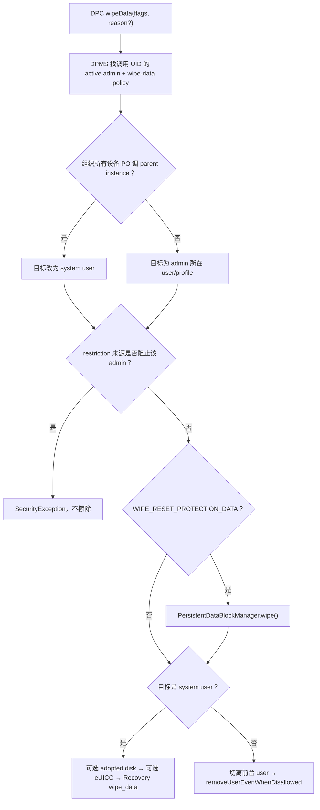
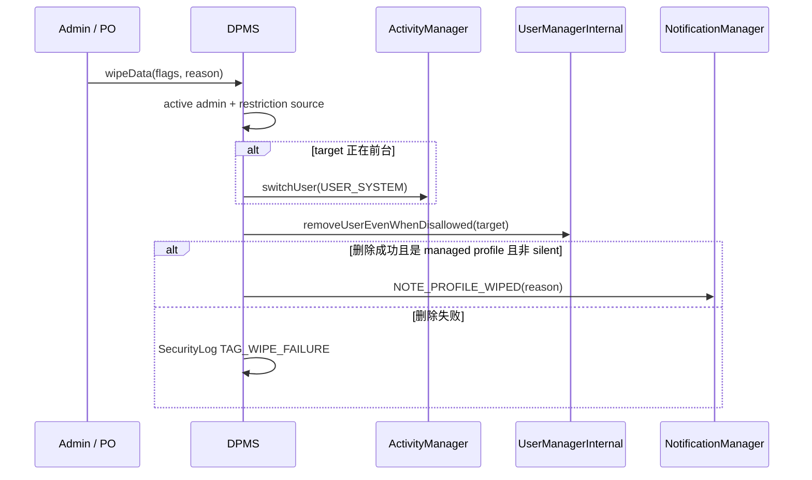
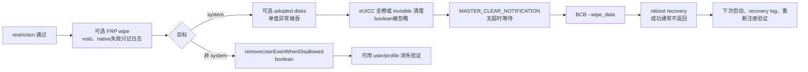

# 第 322 章 Android 企业 wipeData：用户/资料/整机擦除、Adoptable 存储、FRP、eUICC 与 Recovery 边界链

> 源码基线：Android 11 / API 30 / `android-11.0.0_r48`。本章只在 macOS 上阅读和推演源码；擦除 API 具有破坏性，不在真实设备执行。

## 1. 本章研究目标

`DevicePolicyManager.wipeData()` 看似只有一个方法，实际结果可能是删除一个普通次用户、删除 managed profile，或重启进入 recovery 擦除整个设备。本章先判断“目标是谁”，再追可选的 adopted storage、Factory Reset Protection 数据与 eUICC，最后解释成功调用为何没有返回确认。

## 2. 先记住最重要的分叉

服务端最终根据 `userId == UserHandle.USER_SYSTEM` 分流：system user 目标进入 `forceWipeDeviceNoLock()`，其他 user 进入 `forceWipeUser()`。所以真正决定破坏范围的是目标 user，而不是 API 名字里的“wipeData”三个字。

## 3. “Factory reset”并非恢复 system 分区出厂镜像

`RecoverySystem.rebootWipeUserData()` 的注释明确说 factory reset 是一种误称：它擦除 user data 和 cache，但不把 system 分区降级或恢复到出厂软件版本。当前 OTA 后执行擦除，系统版本通常仍是当前已安装版本。

## 4. 主要源码文件

客户端契约与 flags 在 `frameworks/base/core/java/android/app/admin/DevicePolicyManager.java`；核心权限和分流在 `frameworks/base/services/devicepolicy/java/com/android/server/devicepolicy/DevicePolicyManagerService.java`；recovery 命令在 `frameworks/base/core/java/android/os/RecoverySystem.java`。

## 5. 相关底层组件

可采纳存储由 `android.os.storage.StorageManager.wipeAdoptableDisks()` 处理；FRP 数据通过 `PersistentDataBlockManager.wipe()` 清除；eSIM 由 `EuiccManager` 异步擦除；BCB 和 recovery reboot 通过 `RecoverySystemService` 进入 native/bootloader 路径。

## 6. 两个客户端重载

`wipeData(int flags)` 把空字符串作为用户可见理由；`wipeData(int flags, CharSequence reason)` 要求 reason 非 null、非空，并禁止同时使用 `WIPE_SILENTLY`。两者最后都调用隐藏的 `wipeDataInternal()`，跨 Binder 进入 `wipeDataWithReason(flags, reason, mParentInstance)`。

## 7. reason 有两个不同用途

`wipeReasonForUser` 用于删除 managed profile 后的系统通知；`internalReason` 则由 DPMS 根据调用 admin 自动构造，传给整机 Recovery 并出现在日志/recovery reason 中。全机擦除不会把 DPC 自定义的用户文案当作 recovery reason。

## 8. 四个公开 flag

`WIPE_EXTERNAL_STORAGE=1`、`WIPE_RESET_PROTECTION_DATA=2`、`WIPE_EUICC=4`、`WIPE_SILENTLY=8`。它们是位掩码，可组合；但每个 flag 的实际作用范围不同，并不是用户删除和整机擦除两条路径都执行。

## 9. IntDef 不是运行时白名单

API 注解和文档列出支持 flags，但 r48 的客户端/服务端没有统一执行 `flags & ~KNOWN_MASK == 0` 校验。未知高位会被事件日志记录，随后通常被位判断忽略；不能把源码类型提示误当成服务端拒绝未知位的安全检查。

## 10. 从 API 到擦除目标的总图

## 11. 首个服务端特性门

若设备没有 `FEATURE_DEVICE_ADMIN`，`wipeDataWithReason()` 直接 return，不抛异常也不反馈失败。对企业应用来说，方法正常返回并不能证明任何擦除动作已经开始。

## 12. 跨用户权限检查

服务先调用 `enforceFullCrossUsersPermission(callingUserId)`，然后在 DPMS 锁内解析调用者的管理员身份。这里不能通过在参数中伪造 ComponentName，因为 AIDL 方法甚至不接收 admin 参数，服务从 Binder calling UID 反查它拥有的 active admin。

## 13. 必须声明 wipe-data policy

`getActiveAdminForCallerLocked(null, USES_POLICY_WIPE_DATA)` 要求调用 UID 拥有活动 DeviceAdmin，并在 device-admin XML 中请求 `<wipe-data>` policy。没有符合项会抛 `SecurityException`；后面的 `admin == null` 更像防御性代码，正常失败路径已在查询函数内抛出。

## 14. 不只 Device Owner 能调用

Android 11 的 wipe-data 是传统 Device Admin policy，`DA_DISALLOWED_POLICIES` 并未包含它。因此普通 active admin 只要声明该 policy，也能尝试擦除自己对应的目标范围；Device Owner/组织所有 PO 主要拥有额外的 parent 和 FRP 能力。

## 15. 普通次用户调用的范围

若 admin 位于非 system 的普通 secondary user，目标 userId 就是该 admin 所在 user。服务不会做 recovery factory reset，而是删除这个 user；其他用户和 system user 数据保留。

## 16. 普通 managed profile 调用的范围

Profile Owner 位于 managed profile 且不走 parent instance 时，目标是 managed profile 自己。成功后 profile、其中应用数据及相应用户策略随用户删除；个人主资料不因此做整机 reset。

## 17. 组织所有设备 PO 的双语义

Android 11 支持 organization-owned managed profile。它在普通 profile 实例调用 wipeData，含义是“放弃企业所有权并删除工作资料”；在 `getParentProfileInstance()` 返回的 parent 实例调用，则把目标改为 system user，含义是擦除整台设备。

## 18. 谁能在 parent instance 擦整机

若 `calledOnParentInstance=true` 而 admin 不是 organization-owned managed-profile PO，服务抛 `SecurityException`。普通 Profile Owner 不能借 parent facade 擦个人侧，Device Owner 本来也无需通过 profile parent 实例。

## 19. FRP flag 的额外资格

只要设置 `WIPE_RESET_PROTECTION_DATA`，调用者必须是 Device Owner 或 organization-owned managed-profile PO，否则抛异常。这一检查独立于最终目标；源码没有要求 org-owned PO 必须在 parent instance 才能请求清 FRP。

## 20. 空 reason 的服务端默认值

无 reason 重载传空串。若是 org-owned PO 在自己的 profile 实例擦除，默认文案为 `device_ownership_relinquished`；其他情况使用 `work_profile_deleted_description_dpm_wipe`。对整机路径而言，这个用户文案随后不会传给 recovery。

## 21. 自定义 reason 的客户端限制

有 reason 重载先在 DPC 进程抛 NullPointerException/IllegalArgumentException，避免 null、空串和 silent 组合。由于真正权限仍在 system_server 校验，客户端预检查只改善 API 语义，不能当安全边界。

## 22. WIPE_SILENTLY 到底静默什么

该 flag 最终只传入 `forceWipeUser(..., wipeSilently)`，并影响 managed profile 删除成功后是否显示 `NOTE_PROFILE_WIPED`。它不会让 recovery 擦除变成“无重启、无痕”，也不会关闭 SecurityLog。

## 23. flags 在用户删除分支的实际效果

非 system user 路径只读取 `WIPE_SILENTLY`。external storage 与 eUICC flags不会在该分支执行；FRP 若设置却会在分流之前先擦。这种执行顺序意味着不能简单说“这三个 flag 只在全机重置有效”。

## 24. 组织所有 PO 放弃控制前的准备

当 org-owned PO 在 profile 实例擦除时，DPMS 先以干净身份清 system user 上的 `DISALLOW_REMOVE_MANAGED_PROFILE` 与 `DISALLOW_ADD_USER`，并通过 LockPatternUtils 清 device-owner info。注释说明还要清除该 PO 设置的 device-wide policies。

## 25. parent 调用为何不做上述清理

parent instance 直接把目标改为 system user，接下来整机 data wipe 会移除全部用户数据，没必要先按“个人使用接管”路径逐项解除工作资料策略。两种调用虽然来自同一 PO，生命周期目标不同。

## 26. 事件日志记录了什么

执行分流前，DPMS 写 `DevicePolicyEnums.WIPE_DATA_WITH_REASON`，记录 admin、原始 flags，以及 CALLED_FROM_PARENT/NOT_CALLED_FROM_PARENT。这个事件说明请求进入执行路径，不证明后续 PersistentDataBlock、用户删除或 recovery 成功。

## 27. internalReason 的内容

字符串形如 `DevicePolicyManager.wipeDataWithReason() from <component>, organization-owned? <bool>`。它用于整机擦除的 recovery 日志，并附加时间戳；不要把它和 DPC 给用户看的 reason 混为一谈。

## 28. 为什么调用 wipeDataNoLock

方法名直接写出“不持有 DPMS 锁”。擦除涉及 UserManager、StorageManager、eUICC、ordered broadcast 和 reboot 等跨服务/阻塞操作，若持全局 DPMS 锁执行，很容易形成长时间阻塞或死锁。

## 29. 身份切换的位置

`wipeDataNoLock()` 用 `binderWithCleanCallingIdentity()` 包住限制检查和所有副作用。管理员资格在清身份前已经确定；下游服务看到 system_server 身份，从而允许调用 PersistentDataBlock、强制删 user 和 Recovery。

## 30. 限制类型由目标决定

目标为 system user 时检查 `DISALLOW_FACTORY_RESET`；目标为 managed profile 时检查 `DISALLOW_REMOVE_MANAGED_PROFILE`；其他 secondary user 检查 `DISALLOW_REMOVE_USER`。不是所有 wipe 都受同一个 no_factory_reset 控制。

## 31. 限制不是简单布尔值

服务调用 `getUserRestrictionSource(restriction, user)`，再由 `isAdminAffectedByRestriction()` 判断来源。关键不只是“restriction 是否存在”，而是谁设置了它、当前执行 wipe 的 admin 是否就是对应 owner。

## 32. 未设置限制

来源为 `RESTRICTION_NOT_SET` 时返回 false，管理员不受阻。随后可继续 FRP/用户/整机路径。

## 33. Device Owner 来源

来源为 `RESTRICTION_SOURCE_DEVICE_OWNER` 时，仅同一个 user 上的 Device Owner 可豁免；其他管理员受影响。这样 DO 自己设置 no_factory_reset 是为了阻止设置界面或别的 admin，不会反过来永久锁死 DO 的远程擦除。

## 34. Profile Owner 来源

来源为 `RESTRICTION_SOURCE_PROFILE_OWNER` 时，仅该 user 的 Profile Owner 可豁免。managed profile PO 自己设置禁止移除资料，仍能按自己的 wipe policy 删除资料；别的来源不能借此绕过。

## 35. System 或未知来源

switch 的 default 返回 true，因此 system 设置或其他来源的限制会阻止 admin。测试明确覆盖：即使是 DO，若 no_factory_reset 来源是 system，wipeData 也抛 SecurityException。

## 36. 为什么后面 Recovery 还传 force=true

DPMS 已用“限制来源+admin身份”做了更精细校验，进入整机路径后调用 RecoverySystem 时传 `force=true`，让它不再用简单的 `hasUserRestriction(DISALLOW_FACTORY_RESET)` 把同一请求拦一次。force 是完成已授权决策，不是跳过 DPMS 前置校验。

## 37. 限制检查失败没有部分擦除

restriction 判断发生在 FRP wipe、用户删除、外置盘和 recovery 之前。此处抛异常时，这一轮尚未执行这些副作用；它是整条链最重要的前置安全门。

## 38. 但资格检查与最终擦除不是事务

限制通过后，每个步骤顺序执行，没有跨 PersistentDataBlock、StorageManager、EuiccManager 和 Recovery 的事务回滚。一旦前一步完成、后一步失败，系统可能留下“部分擦除”的中间结果。

## 39. 最大解锁失败次数也复用此链

当 `maximumFailedPasswordsForWipe` 达到阈值，DPMS 计算最严格 admin 和目标 user，在不持锁时调用 `wipeDataNoLock(admin, flags=0, reason=reportFailedPasswordAttempt(), ...)`。因此同样应用 restriction 来源判断和 user/device 分流。

## 40. 密码失败触发不是无条件擦除

注释和测试明确：若限制由同一 DO/PO 设置，阈值 wipe 可继续；若由 system 设置，则捕获 SecurityException、记录 warning，不执行擦除。策略阈值达到只表示“尝试 wipe”，不是绕过系统限制的最高优先级命令。

## 41. FRP 擦除发生在分流之前

restriction 通过后，只要 flags 含 `WIPE_RESET_PROTECTION_DATA`，DPMS 先获取 `PersistentDataBlockManager` 并调用 `wipe()`，然后才决定整机还是单用户。这意味着 org-owned PO 在 profile-only wipe 中也可能先清持久化 FRP 数据。

## 42. PersistentDataBlockManager 可能不存在

DPMS 对 manager 做 null 检查；服务不存在时静默跳过，仍继续后面的用户或整机擦除。调用方没有回调得知 FRP 数据并未清除，所以“设置 flag”是请求，不是可验证完成凭据。

## 43. 底层 wipe 的返回值丢失

`PersistentDataBlockService.wipe()` 调 native wipe；返回负值时只写 error log，成功时把分区标为不可写。Binder 方法返回 void，DPMS 无法区分 native 成功或失败，也不会因为失败停止 factory reset。

## 44. FRP 与普通 /data 不是同一份数据

Factory Reset Protection 依赖独立的 persistent data block/厂商实现，用于 reset 后仍保留的保护状态。Recovery 擦 `/data` 不自动等于清 FRP；因此源码把显式 FRP flag 放在 reboot 之前单独处理。

## 45. 清 FRP 是更强的管理动作

普通 admin 即便能删除自己的 user，也不能带 FRP flag；否则它可能削弱整机被盗后的激活保护。DO 和组织所有 PO 的额外资格反映的是设备所有权，而不仅是声明了传统 wipe-data policy。

## 46. 部分完成风险一

如果 PersistentDataBlock 擦除成功，而后续 adopted disk、eUICC 或 BCB/reboot 失败，FRP 已经被清，主用户数据却可能仍在。没有回滚能恢复原 FRP 内容，因此审计必须记录阶段，而不能只写一个最终 boolean。

## 47. 用户删除前先切换前台用户

`forceWipeUser()` 调 ActivityManager 读取 current user。若目标 user 正在前台，先切到 `USER_SYSTEM`，再删除目标，避免继续运行在即将被移除的用户环境中。

## 48. 强制删除 API 的含义

实际调用 `UserManagerInternal.removeUserEvenWhenDisallowed(userId)`。它能绕过普通 remove-user restriction，但前面 DPMS 已根据 restriction 来源自己作出授权判断；这里的 “EvenWhenDisallowed” 不是对所有限制无条件忽略。

## 49. 用户删除的结果通道

该方法返回 boolean。false 时写 warning 和 `SecurityLog.TAG_WIPE_FAILURE`；true 时视为成功。wipeData 公共 API 是 void，不把 boolean 回给 DPC，所以调用进程仍需通过 user/profile 状态变化确认。

## 50. 用户/资料删除路径

## 51. 切换失败的异常细节

`forceWipeUser()` 只显式 catch `RemoteException`，注释认为不应发生；若发生，success 保持 false并记 SecurityLog。它不会在 catch 后再尝试直接删除 user，所以“切换查询/调用的 Binder 故障”会中断本轮删除。

## 52. Profile 删除通知的条件

只有三项同时成立才通知：remove 成功、目标是 managed profile、未设置 WIPE_SILENTLY。普通 secondary user 删除不走这条 `work_profile_deleted` 通知，即便传了自定义 reason。

## 53. 通知显示在哪里

`sendWipeProfileNotification()` 用 DEVICE_ADMIN channel 和固定 `SystemMessage.NOTE_PROFILE_WIPED`，调用普通 `notify()`。由于工作 profile 已被删除，通知由 system_server 在剩余环境显示，告诉个人侧用户工作资料为何消失。

## 54. 自定义 reason 真正可见的范围

文档也提示：primary/system user 触发整机 factory reset 时不会向用户展示 reason，因为设备随即重启擦除。源码中 reason 只传给 profile notification；所以企业控制台不应期待它出现在擦除后的 Setup Wizard 页面。

## 55. silent 不关闭其他证据

WIPE_SILENTLY 仅抑制上述 profile-wiped notification。DevicePolicyEvent、系统日志、user removal 事件与可能的 SecurityLog 不因此关闭，也不能把它当作秘密删除用户的完整隐身开关。

## 56. 整机路径的第一步：adopted disk

`forceWipeDeviceNoLock()` 若看到 `WIPE_EXTERNAL_STORAGE`，先取得 StorageManager 并调用 `wipeAdoptableDisks()`，然后才进入 RecoverySystem。这样可在内部数据分区不可用之前处理被系统采纳为私有存储的介质。

## 57. “external storage”文档与实现差异

API 文档说可擦外置存储如 SD 卡，但 r48 的实现遍历 `getDisks()` 后只对 `disk.isAdoptable()` 的盘操作；非 adoptable 盘明确记录 ignored。它不是枚举每个 USB/便携公共卷并逐字节擦除。

## 58. adopted disk 如何被处理

StorageManager 对每个 adoptable disk 调 `partitionPublic(diskId)`。源码 TODO 承认暂时依赖 vfat format 产生 wipe 效果，而不是使用显式 secure-wipe 命令；这里更接近重新分区/格式化，不应夸大为取证级安全擦除。

## 59. 单盘失败不会阻止整机 reset

`wipeAdoptableDisks()` 对每个盘 catch Exception，写 “but soldiering onward” 后继续。它也不向 DPMS 返回整体成败。因此 SD/adopted disk 擦除失败时，内部 /data recovery wipe 仍会继续。

## 60. 部分完成风险二

若外置介质未插入、不是 adoptable、格式化失败或存储服务异常被内部吞掉，设备仍可能成功 factory reset。DPC 收不到“内部数据已清但某外置盘未清”的细粒度结果，资产处置流程需要额外物理介质策略。

## 61. 整机路径传给 Recovery 的参数

DPMS 固定传 `shutdown=false`、自动生成的 internalReason、`force=true`，并根据 `WIPE_EUICC` 传 wipeEuicc。这里没有把 WIPE_EXTERNAL_STORAGE 再传下去，因为 adopted disk 已在 DPMS 层先处理。

## 62. Recovery 的第二道 restriction 门

`RecoverySystem.rebootWipeUserData()` 仅当 `force=false` 时用 `hasUserRestriction(DISALLOW_FACTORY_RESET)` 拦截。DPMS 总是 force=true，所以不会重复拦；其他调用者若使用默认 overload，则仍受该简单门约束。

## 63. MASTER_CLEAR_NOTIFICATION 是准备通知

RecoverySystem 先发送 action 为 `android.intent.action.MASTER_CLEAR_NOTIFICATION` 的有序广播到 SYSTEM user，要求接收者具备 `MASTER_CLEAR` 权限。它让受信任系统组件在不可逆 reboot 前完成必要准备，而不是向普通用户询问确认。

## 64. 这里存在无超时阻塞

源码创建 `ConditionVariable`，在 ordered broadcast 最终 receiver 中 open，然后直接 `condition.block()`，没有超时参数。若广播链无法完成，调用线程可能一直卡住，也就永远到不了 eUICC 和 BCB。

## 65. 这不是 MasterClearReceiver 的同一入口

DPM 直接调用 RecoverySystem；它没有发送 `ACTION_FACTORY_RESET` 给 `MasterClearReceiver`。MasterClearReceiver 是另一种 factory-reset 请求入口，也会处理 flags，但不能把它的 Thread/AsyncTask 逻辑错误地嫁接到 DPM 调用链。

## 66. Android 11 r48 没有这条链里的 FactoryResetter

在本地 r48 源码中，DPMS Injector 直接调用 `RecoverySystem.rebootWipeUserData()`，并不存在后续版本常见的 `com.android.server.FactoryResetter` 参与本路径。按当前版本讲源码时必须以这条直接链为准。

## 67. WIPE_EUICC=true 的动作

若 eUICC 已 provisioned 且 EuiccManager 可用/启用，`wipeEuiccData()` 注册回调 receiver，调用 `eraseSubscriptions(PendingIntent)`，等待结果。它试图清除 eSIM subscriptions，而不是擦物理 SIM。

## 68. eUICC 超时范围

默认等待 30 秒；Global setting 可配置，但会夹在最小 5 秒、最大 60 秒之间。结果 OK 才返回 true，错误、超时、中断或 manager 不可用返回 false。

## 69. eUICC false 不阻止 recovery

`rebootWipeUserData()` 调用 `wipeEuiccData()` 却完全忽略 boolean 返回值。即使 eSIM 擦除失败或超时，仍继续构造 BCB 并重启擦 /data；WIPE_EUICC 同样是最佳努力，不是全有或全无保证。

## 70. 未请求 WIPE_EUICC 也不是完全不碰 eSIM

当 wipeEuicc=false 时，RecoverySystem 调 `removeEuiccInvisibleSubs()`，尝试删除“embedded + groupUuid 非空 + opportunistic”的不可见订阅。它意在清理不可见机会型 profile，同时保留普通 eSIM profile。

## 71. invisible subscriptions 的等待

它为每个候选调用对应 card 的 `deleteSubscription()`，默认等 45 秒，setting 被夹在 15—90 秒；以成功数等于候选数作为返回值。但调用者同样忽略结果，超时或部分失败不拦 recovery。

## 72. eUICC HandlerThread 的差异

删除 invisible subscriptions 的 finally 显式 `quit()` HandlerThread；`wipeEuiccData()` 的 finally 只注销 receiver，在 r48 代码中没有对应 handler thread quit。复读时应记录这是实现细节/潜在线程资源问题，不能杜撰源码已完整回收。

## 73. 未 provisioned 的快速路径

若 `Settings.Global.EUICC_PROVISIONED == 0`，full wipe 函数认为没有内容要擦，返回 true；invisible 清理函数则直接 return。这个 setting 是决策信号，不是逐卡读取后证明物理 eUICC 空白。

## 74. BCB 命令的四个核心参数

eUICC 阶段后，RecoverySystem 构造可选 `--shutdown_after`、固定 `--wipe_data`、可选 `--reason=...`、以及 `--locale=<language-tag>`。DPMS 传 shutdown=false，所以本路径通常不含 shutdown_after。

## 75. reason 会附加时间戳

非空 reason 后拼接当前墙钟格式 `yyyy-MM-ddTHH:mm:ssZ`，再进入 `--reason=`。这便于 recovery 日志追溯请求来源与时间，但墙钟可能不准，不能替代可信硬件时间证明。

## 76. sanitizeArg 只处理两类字符

Recovery 把命令文件每一行当独立 argv，因此 `sanitizeArg()` 只将 NUL 和换行替换为问号。它不是通用 shell escaping，因为这里不经过 shell；逗号、空格等会保留在同一行参数中。

## 77. bootCommand 的构造

`bootCommand()` 先删除旧 recovery log，再把每个非空参数追加一行。随后获取 RecoverySystem service，调用 `rebootRecoveryWithCommand(command)`，由服务设置 BCB 并请求 PowerManager 以 recovery 原因重启。

## 78. BCB 设置失败如何显现

`RecoverySystemService.rebootRecoveryWithCommand()` 若 `setupOrClearBcb(true, command)` 返回 false，就直接返回而不重启。上层 `bootCommand()` 发现调用返回后无条件抛 `IOException("Reboot failed...")`，最终被 DPMS 捕获并写擦除失败日志。

## 79. 正常成功为何通常不返回

BCB 设置成功后，RecoverySystemService 调 `PowerManager.reboot(REBOOT_RECOVERY)`。正常设备会离开 Android 运行态，原 Binder 调用不会给 DPC 返回一个“擦除完成”值；如果调用真的返回，bootCommand 反而把它视为 reboot 失败。

## 80. Recovery 真正执行什么

bootloader/recovery 读取 BCB 中的 `--wipe_data`，在 Android framework 已停止后擦 user data/cache，再启动常规系统。DPMS 只负责把命令可靠送到重启边界，实际分区擦除成功与否要从下次启动状态、recovery log和设备注册结果验证。

## 81. 整机路径的 success 变量

`forceWipeDeviceNoLock()` 初始 success=false，只在 `recoverySystemRebootWipeUserData()` 正常返回后设 true。失败抛 IOException/SecurityException 时 finally 写 `SecurityLog.TAG_WIPE_FAILURE`；正常 reboot 通常不返回，因此成功也没有一条对称的 Java 返回路径。

## 82. SecurityLog 的信息有限

TAG_WIPE_FAILURE 说明 DPMS 没能成功请求设备/用户 wipe，但不包含所有分步骤结果。adopted disk 内部失败和 eUICC false 被吞掉，仍可能继续重启；反之 FRP 可能已清后才出现 BCB failure。单个 tag 不能证明“什么都没擦”。

## 83. 用户路径的 success 也不是物理擦除证明

`removeUserEvenWhenDisallowed()` 返回 true 表示 UserManager 接受/完成其移除流程所定义的成功，不是 DPC 拿到逐块清零报告。FBE 密钥销毁、目录清理等属于 UserManager/Storage 的后续实现，公共 wipeData API 没有暴露证明材料。

## 84. 公共 API 为什么没有回调

两个 `wipeData` 重载都返回 void，也没有 listener。用户删除可能在 Binder 调用期间返回，但整机成功会重启并杀掉调用进程；统一“成功 callback”在这种语义下并不存在。

## 85. 调用返回时该怎么解释

对于 secondary user/profile，正常返回最多表示服务端没有把异常传回且删除请求执行完其同步部分；对于 system user 整机路径，真正成功通常不会返回。若方法在整机目标上平静返回到 DPC，更应该怀疑 feature gate/no service 等无动作情形，而不是记录 factory reset 成功。

## 86. Binder RemoteException 的客户端表现

客户端把 RemoteException 通过 `rethrowFromSystemServer()` 转成运行时异常。但许多底层失败在 DPMS 内被 catch 后只记日志，或者被更底层吞掉，不会跨 Binder 回到 DPC。因此“没异常”不是充分条件。

## 87. RuntimeException 的空洞

`forceWipeDeviceNoLock()` 只 catch IOException 和 SecurityException。理论上 NullPointerException 或其他 RuntimeException 可能逃出并传回调用者；这不代表系统进行了统一错误映射。生产 DPC 应记录异常，但不能据异常类型猜测哪些前置步骤已发生。

## 88. 多用户目标速查

system user admin/DO 的目标是整机；普通 secondary user admin 的目标是该 user；普通 PO 的目标是 managed profile；organization-owned PO 普通实例删除 profile并放弃控制；同一 PO parent 实例目标为整机。先确定这一行，再讨论 flags。

## 89. flag 作用速查

FRP 在限制通过后、分流前执行；external 和 eUICC 只在 system-user整机分支消费；silent 只在非 system 的 managed-profile成功通知处消费。未知位只随事件记录并被忽略。这个矩阵比 API 文档的一行 flags 列表更接近真实控制流。

## 90. 分步骤完成与失败证据图

## 91. 最危险的误判：把请求当完成

企业后台若在发出 wipe 命令后立刻把资产标记“已安全清除”，会把网络断开、system_server 崩溃、BCB 失败、外置盘遗漏和 eUICC 失败全部藏掉。正确状态至少应分为 requested、device offline/rebooting、reset observed、re-enrolled/retired。

## 92. 整机擦除后的可验证信号

可组合 MDM 心跳中断、boot count/设备启动标识变化、原注册凭据失效、Setup Wizard/未 provisioned 状态、recovery aftermath、零触摸/二维码重新注册等信号。任何单个网络离线都可能只是关机，不能独立证明 wipe。

## 93. Profile 擦除后的可验证信号

在剩余个人侧检查 managed profile user 不再存在、work apps/launcher badge消失、跨资料 service 不可达、系统 profile-wiped 通知出现；服务端还应看到原 profile DPC 身份和密钥不可再使用。

## 94. FRP 的验证要单独做

主 data wipe 成功不代表 persistent block wipe 成功。若业务明确要求移除 FRP，应在受控测试设备上验证 reset 后激活行为与厂商 FRP agent 状态；仅看到 WIPE_RESET_PROTECTION_DATA flag 被记录不足以合规签字。

## 95. eUICC 的验证也要单独做

WIPE_EUICC 结果被 RecoverySystem 忽略，最终设备 reset 不证明 subscription 已删。高价值设备处置需要运营商/eUICC 管理侧核对 profile 状态，并考虑设备在 eraseSubscriptions 前掉电或超时的场景。

## 96. 外置介质必须盘点

portable SD、USB 盘和不可采纳介质可能被 r48 实现忽略。资产流程应在 wipe 前盘点可拆介质并物理回收，不能把 WIPE_EXTERNAL_STORAGE 当成对所有接入存储的全盘覆盖声明。

## 97. FBE 让用户删除更快但不改变 API 证据

现代 Android 常通过丢弃用户加密密钥让残留密文不可解，再异步清理文件。它提高实际安全性，但 wipeData 调用者仍看不到密钥销毁证明；具体实现还取决于设备加密模式和厂商存储栈。

## 98. “force=true”最容易被误解

它只让 RecoverySystem 不再做简单的 no_factory_reset 检查。DPMS 此前仍检查 active admin、parent 资格、FRP资格以及 restriction source；force 也不会强迫 eUICC 成功、外置盘成功或 BCB 成功。

## 99. WIPE_SILENTLY 与 reason 重载

无 reason 的 `wipeData(flags)` 可以带 silent；有 reason 的 overload 在客户端拒绝 silent，因为“提供要显示的原因”和“禁止显示 profile 删除原因”冲突。恶意自写 Binder 客户端即使绕过客户端检查，服务端仍只按 flag 分支，没有重复禁止该组合。

## 100. 服务端没有验证 reason 非空

AIDL 接收 String；正常 SDK 重载会保证有理由时非空，但服务端看到 null/empty 就用默认资源字符串。API 使用者应按公开契约调用，安全分析则要区分客户端 Preconditions 与服务端兜底。

## 101. WIPE_RESET_PROTECTION_DATA 的顺序陷阱

它在 userId 分支前执行，且底层 native 失败不抛。因此日志可能同时显示 wipe 请求和后续用户删除成功，却无法从 DPM 层证明 FRP cleared；也可能 FRP 已清但 user removal 返回 false。这是本章最典型的非事务行为。

## 102. org-owned PO profile wipe 的策略清理不是完整事务

DPMS 先清部分 system restrictions/LockPattern owner info，再尝试删除 profile。若 removeUser 返回 false，前置 device-wide 状态已经改变，源码没有在 finally 恢复。应用必须把失败后的设备管理状态视为需要人工修复。

## 103. adopted disk 操作也会改变形态

`partitionPublic()` 会把 adoptable disk 重新变为公共分区。即使随后 recovery reboot失败，外置盘的分区形态可能已经变化；用户看到的是“内部系统仍在、外置 adopted 数据已丢”的部分完成状态。

## 104. ordered broadcast 可能扩大停顿面

MASTER_CLEAR_NOTIFICATION 在调用线程上无限等待有序广播完成。某个受信任 receiver 挂起会延迟整个 factory reset，而 DPMS 没有自己的 watchdog；排障时应检查广播链，而不只看 RecoverySystemService/BCB。

## 105. recovery reason 不是秘密

internalReason 包含 admin component 并进入 recovery command/log。不要把租户密钥、工单密文或用户隐私塞进 DPC reason；整机路径也不会使用 DPC reason，所以这样做既无展示收益又可能增加日志暴露。

## 106. 何时使用带 reason 重载

它主要适合 profile/user 删除后向仍在使用设备的人解释原因，例如“企业所有权已解除”。整机远程报失/退役更应在调用前通过管理 UI、合规流程和服务器审计沟通，因为 reset 后这段 reason 不会作为业务通知保留下来。

## 107. 安全测试必须用隔离设备

即使本章只读，未来验证也只能用可恢复的专用测试机、已备份账户、测试 eSIM/SD 和明确批准的租户。不要在开发主机连接的日常设备上试 `dpm wipe-data`；该操作的设计目的就是不可逆数据销毁。

## 108. macOS 上可以验证什么

无需 Android 编译或设备执行，可以通过本地 r48 源码证明 caller policy、target user、restriction source、flag 消费点、eUICC 返回值丢失、BCB 参数和错误吞吐边界。无法只靠静态源码证明某厂商硬件实际擦除强度。

## 109. 阅读测试比猜语义可靠

`DevicePolicyManagerTest` 覆盖 managed profile removal、DO factory reset、WIPE_EUICC 参数，以及 restriction 来源为 owner/system 的不同结果。测试是解释 `isAdminAffectedByRestriction()` 的直接证据，但仍是 mock 行为，不替代真机 recovery 验证。

## 110. 建议的排障路径

先看 DPC 是否为 active admin且声明 wipe-data；再看目标 user和 parent 调用；查 restriction source；随后按 FRP → adopted disk → eUICC → master-clear broadcast → RecoverySystemService/BCB → reboot顺序定位。不要从“设备没上线”直接跳到结论。

## 111. 本章只读核对清单

读者应能回答：为什么相同 API 有三种破坏范围；谁能清 FRP；DO 自己设置 no_factory_reset 为何仍可 wipe；external为何只覆盖 adoptable；eUICC失败为何不阻止重启；成功为何通常没有 Java 返回。

## 112. macOS 只读练习一：画出目标 user 分流

运行 `sed -n '7210,7345p' frameworks/base/services/devicepolicy/java/com/android/server/devicepolicy/DevicePolicyManagerService.java`。列出普通次用户 admin、普通 PO、组织所有 PO 当前实例、组织所有 PO parent实例、system user DO 各自最终 userId，并标出哪几种进入 recovery。

## 113. macOS 只读练习二：核对四个 flag 的消费点

运行 `rg -n "WIPE_EXTERNAL_STORAGE|WIPE_RESET_PROTECTION_DATA|WIPE_EUICC|WIPE_SILENTLY" frameworks/base/core/java/android/app/admin/DevicePolicyManager.java frameworks/base/services/devicepolicy/java/com/android/server/devicepolicy/DevicePolicyManagerService.java`。做一张 user/profile/full-device 三列矩阵，注意 FRP 在分流前。

## 114. macOS 只读练习三：追 Recovery 命令

运行 `sed -n '810,870p' frameworks/base/core/java/android/os/RecoverySystem.java` 和 `sed -n '1138,1165p' frameworks/base/core/java/android/os/RecoverySystem.java`。写出 ordered broadcast、eUICC、reason/locale、BCB 和 recovery reboot 的顺序，并解释为什么正常成功不返回。

## 115. macOS 只读练习四：找出最佳努力步骤

运行 `sed -n '1095,1130p' frameworks/base/core/java/android/os/storage/StorageManager.java`、`sed -n '895,945p' frameworks/base/core/java/android/os/RecoverySystem.java` 和 `sed -n '540,565p' frameworks/base/services/core/java/com/android/server/PersistentDataBlockService.java`。分别记录 adopted disk、eUICC、persistent block 的失败是否向 DPMS 传播。

## 116. 练习答案要点

练习一应先由目标 user 决定 remove/recovery；练习二应看到 silent只管 profile通知、external/eUICC只在整机、FRP在两者之前；练习三应得到“成功重启不返回”；练习四应发现多处异常/false只记日志或被忽略。

## 117. 复读修正一：删除 FactoryResetter 误链

一些新版本文章会写 `DPMS → FactoryResetter → RecoverySystem`。本地 Android 11 r48 的 Injector 直接调用 RecoverySystem，没有该类参与这条路径；学习指定版本时不能用新分支架构覆盖旧源码。

## 118. 复读修正二：external 不是所有外置介质

r48 的 `wipeAdoptableDisks()` 只处理 `DiskInfo.isAdoptable()`，并以 partitionPublic 间接格式化；非 adoptable 明确跳过，单盘异常也继续。因此不能声称 WIPE_EXTERNAL_STORAGE 提供所有 SD/USB 的确定性安全擦除。

## 119. 复读修正三：flags 不是原子承诺

FRP void失败不可见、adopted disk异常被吞、eUICC boolean被忽略，最后 recovery仍可执行。反过来前置步骤成功后 BCB也可能失败。正确表述是“按顺序请求多个最佳努力动作”，而不是“一次事务要么全清要么全不清”。

## 120. 本章结论与下一章

`wipeData()` 的本质是“以 admin 所在身份计算目标 user，再在限制来源允许时执行不可逆动作”：非 system user强制移除，system user按需先清 FRP/adopted storage/eUICC，再用 BCB重启 recovery擦 `/data`。公共 API 没有完成回执，多步骤也不原子。下一章继续追 Factory Reset Protection policy：DPC 的账号 allowlist如何持久化、通知 FRP agent，并在 reset 后参与 Setup Wizard 激活。
