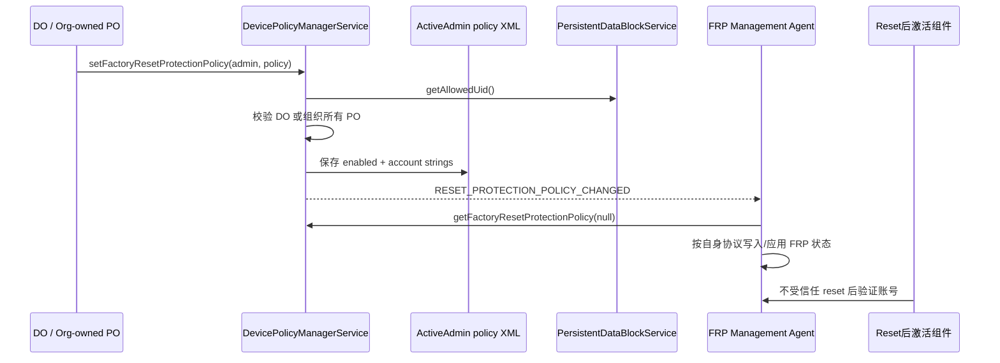
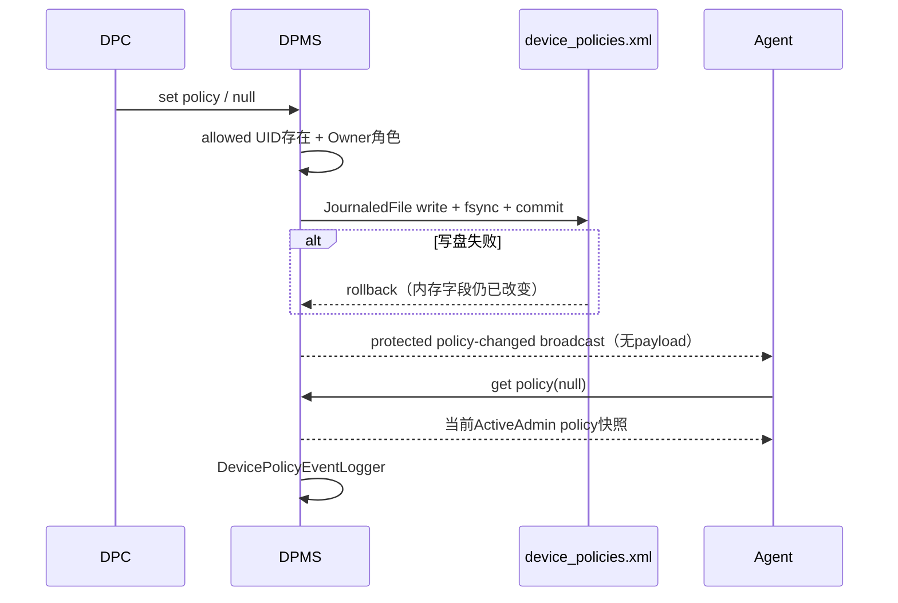
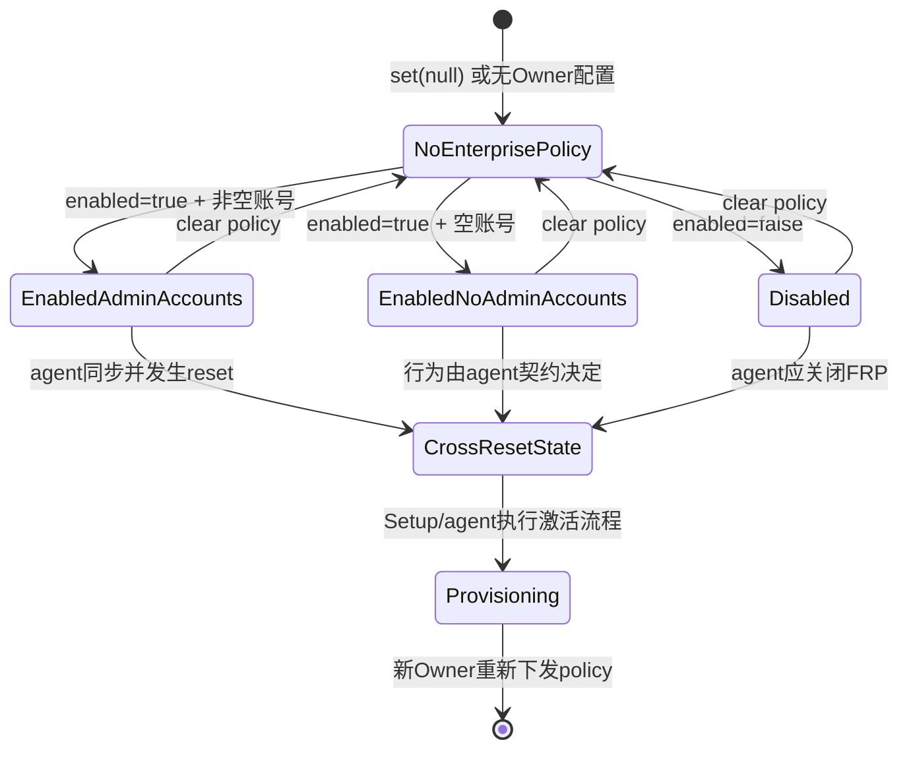

# 第 323 章 Android 企业 FactoryResetProtectionPolicy：账号白名单、持久化、Agent 通知及激活边界链

> 源码基线：Android 11 / API 30 / `android-11.0.0_r48`。本章只在 macOS 上阅读源码，不执行 factory reset。

## 1. 本章要解决的问题

Factory Reset Protection（FRP）用于设备经历“不受信任的恢复出厂”后，要求受认可账号才能重新激活。Android 11 新增企业 FRP policy，让 Device Owner 或组织所有设备上的 Profile Owner指定账号列表或关闭 FRP。本章追踪 policy 对象、DPMS 持久化、FRP management agent 通知与实现缺口。

## 2. 先与上一章的 wipe flag 分开

`FactoryResetProtectionPolicy` 描述 reset 后的激活规则；`WIPE_RESET_PROTECTION_DATA` 请求在 reset 前清 persistent data block。一个是长期 policy，一个是某次 wipe 的破坏性选项。名称相似，但存储位置、调用 API 和安全效果都不同。

## 3. Framework 不负责账号密码验证

DPMS 只保存 `List<String>` 和 enabled 状态，再通知设备预装的 FRP management agent。账号字符串如何解释、凭证如何校验、Setup Wizard 如何呈现激活页，由 agent/厂商实现负责；源码注释明确要求查阅该 agent 的文档。

## 4. 主要源码入口

数据对象在 `frameworks/base/core/java/android/app/admin/FactoryResetProtectionPolicy.java`；公开 API 在 `DevicePolicyManager.java`；服务端 set/get/support、ActiveAdmin XML 在 `DevicePolicyManagerService.java`；agent UID 来源在 `PersistentDataBlockService.java`。

## 5. 为什么还要读资源 overlay

FRP agent 包名不是硬编码在 DPM 中，而由 `config_persistentDataPackageName` 提供。AOSP 默认 `frameworks/base/core/res/res/values/config.xml` 中该字符串为空，真实产品需要资源 overlay 和对应 system package 才能启用。

## 6. policy 只有两个业务字段

`mFactoryResetProtectionAccounts` 是账号字符串列表；`mFactoryResetProtectionEnabled` 表示企业 FRP 总开关。没有密码、token、证书、服务器地址或重试次数，说明 Policy 对象只是控制面配置。

## 7. Builder 的默认 enabled

`new FactoryResetProtectionPolicy.Builder()` 会把 enabled 默认设为 true。调用 `setFactoryResetProtectionEnabled(false)` 才关闭；不要把“没有显式调用 enabled setter”理解成禁用。

## 8. 账号字符串没有统一格式校验

`setFactoryResetProtectionAccounts()` 只把传入 List 复制到新 ArrayList，没有检查 email 格式、去重、大小写、空字符串、账号域或上限。原因是 Framework 不知道具体 agent 支持哪种账号标识。

## 9. null 列表的构造缺口

Builder 的 accounts 初始为 null，`build()` 不做必填检查；但 policy 的 `writeToParcel()`、`writeToXml()`、`isNotEmpty()` 都直接调用 list 方法。因此只设置 enabled 不设置 accounts 可构造出对象，却会在跨 Binder/持久化时触发 NullPointerException。

## 10. 端到端控制面总图

## 11. 谁可以设置 policy

服务端请求特殊 policy `USES_POLICY_ORGANIZATION_OWNED_PROFILE_OWNER`。DPMS 对这个内部 policy 的解释是：Device Owner 或 organization-owned managed profile 的 Profile Owner；普通 Profile Owner 与传统 Device Admin 都不符合。

## 12. 为什么没有要求 manifest 声明某个新 uses-policy

`USES_POLICY_ORGANIZATION_OWNED_PROFILE_OWNER=-3` 是 DPMS 内部角色代号，不是 DeviceAdminInfo XML 中的普通 capability。校验直接读取 Owners/组织所有标志，因此安全边界是所有权身份。

## 13. parent instance 被明确禁止

客户端 set/get 都调用 `throwIfParentInstance()`。组织所有 PO 虽能管理个人侧的一些 device-wide policy，但 FRP policy 必须在它自己的 DPM 实例设置；服务端再把它视为设备级效果。

## 14. policy 可以传 null

`setFactoryResetProtectionPolicy(admin, null)` 表示清除当前企业 FRP policy。DPMS 将 ActiveAdmin 字段设为 null、保存 XML，并照样通知 agent；null 不是“禁用 FRP”对象，而是“没有企业 policy”。

## 15. null policy 与 enabled=false 不同

null 让系统/agent回到没有管理员覆盖的默认语义；非 null 且 enabled=false 明确要求 FRP 在不受信任 reset 后也不启动，包含 consumer flow 与 admin accounts 都禁用。最终行为仍由 agent落实。

## 16. enabled=true 加空列表也不同

该对象表示 FRP 总开关开，但没有管理员指定的可解锁账号。`isNotEmpty()` 会返回 false，因为需要 enabled 且 accounts 非空。agent 如何回退 consumer flow必须遵循平台/产品契约，DPMS 本身不推导。

## 17. isNotEmpty 的准确条件

隐藏方法只返回 `!accounts.isEmpty() && enabled`。名称不是“policy 对象非 null”，而是“该 policy 会锁定到管理员指定账号”。禁用或空列表都被视为不形成 admin-account lock。

## 18. Settings trusted reset 的特殊说明

类注释称通常从 Settings 发起的可信 factory reset 不触发 FRP；DO 设置 policy 时也通常如此。但组织所有 PO 若设置了能锁到特定账号的 policy，即使从 Settings reset也会生效。这是产品/agent契约，不是 DPMS set 方法里的一处分支。

## 19. 不受信任 reset 是什么概念

通常指 recovery、按键组合或未经已解锁系统授权的擦除，使 FRP 状态得以跨 /data 保留。具体可信判定和持久化格式不在 FactoryResetProtectionPolicy 类中，不能仅凭这个 Java 对象定义全部启动行为。

## 20. set 的第一步不是 admin 校验

服务先调用 `getFrpManagementAgentUidOrThrow()`。若 persistent-data service 不支持或 allowed UID 为 -1，先抛 `UnsupportedOperationException`，然后才进入 ActiveAdmin 角色校验。

## 21. AOSP 默认为何大概率 unsupported

默认 `config_persistentDataPackageName` 为空；PersistentDataBlockService 用 `PackageManager.getPackageUidAsUser(empty, MATCH_SYSTEM_ONLY, SYSTEM)` 无法找到包，记录错误并留下 -1。产品 overlay 配好系统包后才会得到有效 UID。

## 22. MATCH_SYSTEM_ONLY 的意义

即使第三方安装一个与 overlay 同名的普通应用，也不能被解析为 allowed package；PackageManager 查询要求 system-only。FRP agent 是产品信任根的一部分，不是用户可替换默认应用。

## 23. UID 在何时解析

PersistentDataBlockService 的异步 onStart 初始化里，以 `USER_SYSTEM` 解析包 UID，并保存到 `mAllowedUid`。DPMS 通过 LocalServices 的 `PersistentDataBlockManagerInternal.getAllowedUid()` 读取，不自行重复查包名。

## 24. UID 不是每次动态刷新

r48 服务启动时解析一次 allowed UID，后续 getter直接返回字段。产品配置与系统包应在系统启动前稳定；运行中改变 overlay/包映射不会让此字段自动重新解析。

## 25. support API 的真实判断

`isFactoryResetProtectionPolicySupported()` 只判断 `getFrpManagementAgentUid() != -1`。它不检查 policy 是否已设置、账号是否有效、agent能否联网，也不通过一次端到端激活自检。

## 26. support 与 FEATURE_DEVICE_ADMIN 的细节

set/get 在 `!mHasFeature` 时分别 return/null；support 方法本身没有同样的 feature gate，只看 agent UID。因此极端产品配置下，两种判定可能不完全一致，应用仍应按 API 异常和实际设备能力处理。

## 27. set 的 admin 查找

取得 caller userId 后，DPMS 在锁内调用 `getActiveAdminForCallerLocked(who, USES_POLICY_ORGANIZATION_OWNED_PROFILE_OWNER)`。它同时核对 component、Binder calling UID 和 Owner角色，不能替另一个 DPC 设置 policy。

## 28. Policy 存到哪里

字段位于该 Owner 对应的 `ActiveAdmin.mFactoryResetProtectionPolicy`，随后 `saveSettingsLocked(userId)` 写该 user 的 `device_policies.xml`。DO 通常写 system user policy文件；组织所有 PO 写 managed-profile自己的 policy文件。

## 29. 它没有直接写 persistent data block

setter只修改 ActiveAdmin XML、发广播和记事件。PersistentDataBlock 在这一步仅用于取得 allowed agent UID；由 agent如何把 policy 转成 reset 后仍可用的数据，不在 DPMS setter 中完成。

## 30. XML 外层标签

ActiveAdmin 非 null policy 时输出 `<factory_reset_protection_policy ...>`。enabled 作为 `factory_reset_protection_enabled` 属性，每个账号作为嵌套 `factory_reset_protection_account value="..."`。

## 31. null 如何清 XML

ActiveAdmin writer仅在字段非 null时输出标签。set null后整份 device_policies.xml 重写，这个标签消失；并非写一个 `enabled=false` 标签，所以重启加载结果是 policy 字段保持默认 null。

## 32. XML 账号顺序会保留

writer按 List 迭代，reader按标签出现顺序 append；没有排序和去重。若 agent把顺序当优先级，Framework不会改写，但 API 文档也没有承诺优先级语义。

## 33. XML 读取的宽松点

enabled 用 `Boolean.parseBoolean(attribute)`；缺失或非“true”值会得到 false。账号 value 属性缺失会把 null加入列表。注释声称系统只读取自己写出的已验证 XML，但实际 builder/写入端并没有完整内容验证。

## 34. XML 解析失败

`readFromXml()` 捕获 XmlPullParserException/IOException、写 warning并返回 null。DPMS 会把该 ActiveAdmin policy当作不存在；不会从 agent反向重建，也不会自动广播“policy丢失”。

## 35. Parcel 格式

跨 Binder 时先写 account count，再逐个写 String，最后写 boolean。CREATOR按该顺序还原。没有版本号或字段长度上限，兼容性依赖同平台 Parcelable 契约。

## 36. Getter 暴露可变 List

`getFactoryResetProtectionAccounts()` 直接返回内部 List，不是 defensive copy或 unmodifiable view。因此本地代码可修改 policy对象；但正常跨 Binder set/get会 Parcel复制，修改 DPC 本地实例不会反向修改 system_server已保存对象。

## 37. 类没有值相等实现

r48 的 FactoryResetProtectionPolicy 没有 override `equals()` 和 `hashCode()`。两个字段内容相同的对象仍按对象身份比较；DPMS setter也没有用内容相等去重。

## 38. 重复设置相同内容会发生什么

每次 set都会替换 ActiveAdmin字段、尝试写 XML、发送 RESET_PROTECTION_POLICY_CHANGED并记录事件。没有“内容没变就 return”的优化，agent应能幂等处理重复通知。

## 39. toString 的隐私风险

`toString()` 会完整输出 account List 和 enabled。账号标识可能是邮箱或企业身份，不应无条件写入普通日志、崩溃上报或管理分析平台；Framework 类可打印不代表业务日志应打印。

## 40. 账号数量与大小没有 Framework 上限

Builder、Parcel和 XML都没有显式限制条数/字符串长度。Binder事务大小、文件写入和 agent能力形成隐式上限；DPC应自行设置合理数量、规范化并避免超大 policy导致 TransactionTooLarge或持久化压力。

## 41. saveSettingsLocked 是同步尝试

setter在 DPMS 锁内调用 `saveSettingsLocked(userId)`。它用 JournaledFile写临时文件、flush、`FileUtils.sync()`、close后 commit，并发送通用 device-policy-state-changed通知；I/O失败则 rollback。

## 42. 写盘失败不会让 setter 抛错

`saveSettingsLocked()` catch XML/IO异常后只写 warning并回滚，返回类型是 void。内存中的 ActiveAdmin字段已经换成新 policy，外层仍会继续发 FRP policy changed广播并记事件，DPC得不到持久化失败回执。

## 43. 写盘失败后的重启差异

当前 system_server生命周期内 getter可能返回新内存值；设备重启后从旧 journal读取，policy可能回到旧值或 null。Agent收到变化广播后读到内存新值并应用，但 DPMS磁盘状态未必与它同步，这是需要日志交叉确认的边界。

## 44. 变更广播没有 policy 内容

`ACTION_RESET_PROTECTION_POLICY_CHANGED` Intent不附加账号、enabled、admin或版本号。Agent收到后必须调用 `getFactoryResetProtectionPolicy(null)` 读取当前权威快照，天然适合把多次通知合并为一次最新状态同步。

## 45. 广播投递到哪个 user

DPMS用 `UserHandle.getUserHandleForUid(frpManagementAgentUid)` 选择 user。allowed UID由 SYSTEM user解析，所以标准实现投递到 system user；不是投递给设置 policy 的 managed-profile user。

## 46. 广播不是显式 package Intent

源码没有 setPackage或 setComponent，只限定目标 user，并要求接收者具有 `MANAGE_FACTORY_RESET_PROTECTION`。同 user中符合 action且持受限权限的 receiver可收到；真正读取 null policy还会再核对 exact allowed UID或 MASTER_CLEAR。

## 47. 两个广播 flags

Intent同时带 `FLAG_RECEIVER_INCLUDE_BACKGROUND` 与 `FLAG_RECEIVER_FOREGROUND`，允许预装 agent在后台收到，并提高广播调度优先级。这不是启动前台服务，也不免除 receiver执行时间限制。

## 48. MANAGE_FACTORY_RESET_PROTECTION 权限

Manifest 将其声明为 `signature|privileged`，不是普通应用可申请的 runtime permission。它用于保护 policy-changed广播接收端，但持有它本身不让普通包调用 setter成为 Owner。

## 49. action 还是 protected-broadcast

Framework manifest把 `android.app.action.RESET_PROTECTION_POLICY_CHANGED` 列为 protected broadcast，普通应用不能伪造发送。发送者保护与接收权限组合，降低第三方诱导 agent错误刷新状态的风险。

## 50. 保存与通知时序图

## 51. setter没有 agent ACK

`sendBroadcastAsUser()` 是异步普通广播调用，没有 ordered result、callback或持久化 job token。方法返回只说明广播已提交到系统分发，不证明 agent已收到、读取、写 persistent storage或能够在 reset后执行。

## 52. 事件日志的位置

`SET_FACTORY_RESET_PROTECTION` 在广播调用之后写入，只记录 admin，没有 accounts、enabled或成功阶段。出于隐私不记录账号是合理的，但该事件也不能证明 agent应用成功。

## 53. getter 的两种身份模式

`getFactoryResetProtectionPolicy(who)` 在 who非 null时走 Owner身份；who为 null时专供 FRP agent或持 `MASTER_CLEAR` 的高权限系统调用者。两条路径最终读同一个 ActiveAdmin字段，但授权逻辑完全不同。

## 54. Owner 获取必须传自己的 component

DO/组织所有 PO调用公开 getter时应传 admin。若随意传 null，服务不会因为 caller恰好是 Owner就放行，而会要求 exact FRP agent UID或 MASTER_CLEAR权限。

## 55. Agent 的 exact UID 校验

null路径检查 `frpManagementAgentUid == Binder.getCallingUid()`。包名相同但 user不同、共享签名的另一个 UID、仅持 MANAGE_FACTORY_RESET_PROTECTION 的 receiver都不能仅凭这些条件通过 getter。

## 56. MASTER_CLEAR 是特殊旁路

若 caller持 `android.permission.MASTER_CLEAR`，即使不是 configured agent UID也可用 null读取。它是系统级恢复出厂权限，不是普通企业 DPC权限；服务没有把 MANAGE_FACTORY_RESET_PROTECTION当作 getter旁路。

## 57. 为什么广播权限和读取权限不同

广播可能由多个受信任组件观察状态变化，但 policy内容只交给配置的 agent或 master-clear组件。把“能收到提示”和“能读取账号白名单”分开，减少敏感账号列表暴露范围。

## 58. null getter如何找到 policy Owner

服务先尝试全局 Device Owner ActiveAdmin；若没有 DO，再在 agent user的 profiles中寻找 organization-owned managed profile PO。标准 agent位于 user 0，因此可沿 user 0 profile group找到其 managed profile里的 COPE PO。

## 59. DO 优先规则

`getDeviceOwnerOrProfileOwnerOfOrganizationOwnedDeviceLocked()` 先返回 DO，只有 null才找组织所有 PO。合法所有权模型通常不会同时存在冲突的二者；代码顺序仍给出明确优先级。

## 60. 组织所有 PO 的 profile 搜索

`getProfileOwnerOfOrganizationOwnedDeviceLocked(userHandle)` 清 Binder身份，遍历 `UserManager.getProfiles(userHandle)`，筛 managed profile、存在 PO且被标记 organization-owned，再返回对应 ActiveAdmin。

## 61. agent不是从所有 user全局扫描

搜索以 agent UID所属 user为 profile group根。若厂商异常地把 allowed package解析到不相关 user或用户拓扑不符合预期，getter可能找不到 org-owned PO并返回 null；DPMS不会遍历全机随便取一个 PO。

## 62. get在 unsupported设备上的行为

和 set一样，getter先调用 `getFrpManagementAgentUidOrThrow()`。即使 policy字段理论上残留，只要 allowed UID为 -1就抛 UnsupportedOperationException，而不是返回旧对象。

## 63. mHasFeature=false 的优先级

getter最先检查 device-admin feature并返回 null，setter最先直接 return；这发生在 agent UID检查之前。support API却只看 UID，因此前述极端配置差异确实存在。

## 64. Getter 返回的是当前管理 policy

它不会读取 persistent data block中的agent编码结果，也不会查询 reset是否已发生。返回值只是 DPMS当前 Owner ActiveAdmin里保存的 policy配置。

## 65. agent需要怎样同步

稳妥 agent在启动、收到 policy changed、Owner变化与持久化服务恢复时都应重新调用 getter，把 null/disabled/empty/non-empty视为完整快照，而不是在旧列表上增量修改。具体实现不在AOSP本章源码中。

## 66. AOSP仓库里没有消费调用

排除测试后，本地源码中 `getFactoryResetProtectionPolicy()` 只有 API/DPMS定义，没有一个开源 Setup Wizard或 FRP agent调用点；ACTION也只在 DPMS发送。由此不能从该仓库证明账号最终写到哪种厂商数据结构。

## 67. 为什么缺失并不等于功能无效

FRP依赖产品预装组件、资源 overlay、可能的Google/厂商服务与持久分区协议，这些不必全部在AOSP公开树中。Framework提供稳定契约，产品负责补齐实现；裸AOSP默认 empty package则明确显示 unsupported。

## 68. 不要虚构“DPMS 写账号到 PDB”

唯一与 PersistentDataBlockInternal 的交互是 `getAllowedUid()`。setter没有调用 `write()`、没有序列化账号到 block，也不知道agent存储格式。任何“DPMS直接写PDB白名单”的流程图都与r48源码不符。

## 69. 不要虚构“Setup Wizard直接读 ActiveAdmin XML”

ActiveAdmin XML位于受保护的 user system目录，并且 /data在 reset时可能被擦。reset后的组件需要依赖跨reset保留的 FRP状态；Framework设计通过 agent契约衔接，而不是让 Setup Wizard在擦除后读原 device_policies.xml。

## 70. Policy XML为何仍有价值

它让 Owner在日常系统运行和重启中保留配置，agent可随时重新同步。在真正 factory reset前，agent应把需要跨reset的信息编码到其保护机制；DPMS XML本身不是跨 /data wipe的最终载体。

## 71. set null的agent语义

广播到达后 getter返回 null，agent应清除“企业覆盖”并回到默认 FRP策略。不能把 null自动等同于 enabled=false，因为后者要求禁用全部FRP，而 null可能恢复consumer FRP。

## 72. disabled policy的agent语义

非 null、enabled=false明确禁止 FRP在不受信任 reset后触发，包括普通consumer账户流程和管理员账号 override。它是高风险配置，应受企业审批；Framework本身没有二次确认对话框。

## 73. non-empty enabled policy的agent语义

它关闭普通 consumer unlock flow，只允许列表中的账号解锁企业FRP。账号解释由agent决定，因此DPC必须按厂商文档生成规范字符串，并在真正设备上验证大小写、租户和别名。

## 74. empty enabled policy的灰区

Framework的 `isNotEmpty()` 认为它不形成admin锁；类文档没有在这一组合上给出完整agent算法。不要猜成“无人能解锁”的永久砖机，也不要猜成“FRP完全关闭”，应按产品agent契约测试。

## 75. Policy对象没有版本/来源字段

agent获取不到setter时间、DPC版本、租户ID或policy revision。若企业需要防止旧配置覆盖新配置，应在DPC控制面自行做序列化更新和服务端幂等，Framework只保存最后一次对象。

## 76. 更新不是 compare-and-set

set API没有期望旧版本参数；两个管理线程并发调用时，最后进入锁并赋值/保存的一次成为当前值，二者都可能发广播。DPC内部应串行化，不要依赖广播次数判断最终版本。

## 77. ActiveAdmin归属的重要性

policy不是 Owners全局文件上的独立字段，而是 Owner ActiveAdmin众多政策之一。这使角色校验、用户级device_policies.xml、管理员移除与所有权转移都能沿现有管理框架处理。

## 78. 所有权转移会保留 policy字段

`transferActiveAdminUncheckedLocked()` 取得原 ActiveAdmin对象，只调用 `adminToTransfer.transfer(incomingDeviceInfo)` 替换 info/component映射，其他政策字段保留。因此 FRP policy随 DO/PO ownership transfer转给新admin。

## 79. 转移不会发送 FRP专用广播

本地源码中 ACTION_RESET_PROTECTION_POLICY_CHANGED只有setter一个发送点。ownership transfer会发送 DO/PO changed及transfer-complete事件，但不会额外发FRP action；agent若只监听FRP action会漏掉“policy相同、管理者已变”的上下文变化。

## 80. Owner移除同样没有专用通知

删除 ActiveAdmin/清 Owner会让其policy随记录消失，但未见 DPMS在该路径发送 RESET_PROTECTION_POLICY_CHANGED。agent实现应结合 DEVICE_OWNER_CHANGED/PROFILE_OWNER_CHANGED、启动同步或其他产品机制重新查询，不能只靠一个action维持永久一致。

## 81. 与 WIPE_RESET_PROTECTION_DATA 的交互

若有资格的 Owner调用 `wipeData(WIPE_RESET_PROTECTION_DATA)`，DPMS先让 PersistentDataBlockManager擦整个持久分区，再继续用户/整机 wipe。该动作不等于调用 `setFactoryResetProtectionPolicy(null)`，也不会走 policy-changed广播。

## 82. 为什么两者不能互相替代

set null只清 DPMS企业配置并通知agent回到默认语义，可能仍保留consumer FRP；wipe flag直接破坏FRP持久数据，且底层native失败不可见。一个是可逆配置更新，一个是随擦除执行的低层清除请求。

## 83. 整机 reset 后 ActiveAdmin XML 会消失

device_policies.xml位于 /data，对 system user factory reset会被清。reset后能够阻止激活的状态必须已由agent写入跨reset机制；不能期待 DPMS在刚擦净的设备上仍返回旧 Owner policy。

## 84. managed-profile-only wipe 的不同结果

组织所有 PO若在当前 profile实例删除工作资料，包含policy的该 profile device_policies.xml和 ActiveAdmin都会消失；若同时带 FRP wipe flag，还可能先清持久分区。个人侧没有原 PO可继续维护企业 policy。

## 85. 重新注册后的 policy 生命周期

设备完成 reset并重新 provision新的 DO/组织所有 PO后，新 Owner需要重新设置 policy。旧 policy不应自动附着到新企业，因为 ActiveAdmin身份和 /data配置都已重建。

## 86. enabled=false 的治理风险

它会要求关闭consumer与admin FRP保护。一旦设备被非授权 reset，可能不再需要旧账号激活；企业应把此设置当高风险资产策略，限制后台角色、保留审批和变更审计。

## 87. non-empty allowlist 的可用性风险

若账号拼写错误、员工离职、域名迁移或agent解释规则变化，reset后可能无人能解锁。至少应保留两个经过验证的 break-glass账号，并在测试机上执行与产品版本一致的恢复演练。

## 88. 账号规范化应在 DPC 做

由于 Framework不去重或验证，DPC应按agent文档 trim、大小写规范、去重、拒绝空项、限制长度和数量，并在提交前显示最终列表供管理员确认。不要让agent首次发现格式错误发生在设备已经 reset之后。

## 89. 推荐的变更闭环

后台下发带版本的预期 policy；DPC构造非 null账号列表并 set；立即用 admin getter读回字段；等待设备/agent侧应用信号若产品提供；记录非敏感摘要与版本；只有闭环完成才允许执行高风险 reset测试。

## 90. Policy 状态与 reset 结果图

## 91. admin getter读回能证明什么

它能证明当前 system_server内存里对应 ActiveAdmin字段的值，通常也经历过一次同步写盘尝试。它不能证明 save成功，因为 save异常被吞；也不能证明agent已消费或跨reset状态已更新。

## 92. policy-changed广播能证明什么

从系统日志看到广播发送，只证明 DPMS执行到通知点。非有序广播没有ACK，接收器可能尚未运行、进程可能崩溃、agent应用可能失败；不能把 sendBroadcast调用当作FRP配置完成。

## 93. support=true 能证明什么

只能证明 PersistentDataBlock internal提供了一个非 -1 allowed UID。它不证明对应receiver声明正确、MANAGE权限已授予、agent协议与policy兼容或底层persistent block可写。

## 94. 账户列表的隐私分类

即便不含密码，它可暴露企业域、管理员身份和应急账户。XML位于受保护系统目录，广播不携带列表，getter又限 exact UID/MASTER_CLEAR；DPC也应避免把列表复制到可备份SP、外部存储或普通analytics。

## 95. Binder不会替你加密字段

Parcel通过 Binder内核在本机跨进程传输，有UID权限边界，但 policy对象本身没有字段级加密。不要把“系统 Binder API”描述成账号列表端到端加密；静态和跨reset保护由系统/agent存储设计承担。

## 96. 字符串不是账户凭证

列表通常表达账号标识，不包含密码或OAuth token。DPC绝不能为了“确保能解锁”把秘密拼进 String；Framework会把它写 XML，toString也能输出，扩大敏感凭据泄露面。

## 97. 恶意 List 元素的边界

XML serializer会转义属性特殊字符，因此不是简单XML注入；但超长、null和agent不认识的字符串仍可能导致NPE、资源消耗或业务拒绝。输入验证责任仍在DPC和agent。

## 98. null元素的具体风险

Builder允许包含 null；Parcel可以写/读 null，XML `out.attribute(..., account)` 对 null的行为可能抛异常，reader也可能产生null元素。正常实现应在set前拒绝，不能依赖saveSettingsLocked吞异常后继续广播。

## 99. Builder缺省对象为何危险

`new Builder().build()` 得到 accounts=null、enabled=true；AIDL序列化前 `writeToParcel()` 就会执行 `mFactoryResetProtectionAccounts.size()` 并在DPC进程崩溃。最小安全构造也要显式 `setFactoryResetProtectionAccounts(Collections.emptyList())`。

## 100. get返回 List也应当只读使用

虽然 getter暴露可变List，调用方不应就地修改后误以为系统 policy改变。应复制成自己的不可变集合，修改后重新 Builder + set，并再次读取验证。

## 101. 并发最后写入者规则

DPMS锁串行化字段赋值与保存，但广播在锁外发送。线程A保存后、线程B覆盖，再由A/B分别广播时，agent每次 getter都可能只看到B的最终快照。这是“通知状态已变化”，不是事件携带的历史版本。

## 102. 写盘失败与重复设置的恢复

因内存字段仍为新值，DPC用getter会看到一致而不知磁盘失败；再次调用同内容仍会重新执行save，因为没有equals去重，反而能补写。这是偶然恢复机会，不是可靠重试协议，仍应结合系统日志。

## 103. XML损坏后的行为

policy子树解析异常返回 null，但外层 device policy加载是否继续取决于解析位置和异常处理。至少能确定 Framework不会从PDB agent状态反向修复 ActiveAdmin policy；Owner应在启动后核对并必要时重设。

## 104. Agent更新后的版本兼容

账号字符串语义由agent定义，系统OTA或厂商组件更新可能改变接受格式。DPC应按设备/agent能力版本管理policy，而不是假定所有 Android 11设备都接受同一种邮箱格式。

## 105. 多租户设备要避免错域

FRP是设备级激活边界，而组织所有 PO存在managed profile中。后台迁移租户、转移ownership或解除管理时，必须先明确最终FRP账户集合；旧租户break-glass账号残留会形成控制权风险。

## 106. ownership transfer的交接动作

虽然 ActiveAdmin字段自动保留，新DPC仍应在 TRANSFER_OWNERSHIP_COMPLETE后读取、展示非敏感摘要、确认agent能力，必要时显式重设同内容以触发专用广播并建立自己的版本记录。

## 107. Owner清除前的动作

若业务希望恢复consumer默认FRP，最好在仍有Owner权限时显式 set null并等待产品级同步，再 clear Owner。只清Owner不会从本地源码看到FRP专用通知，跨reset持久状态可能依赖agent其他清理机制。

## 108. 与普通账号管理系统的边界

FactoryResetProtectionPolicy不调用 AccountManager添加账号，也不验证列表账号当前存在设备上。它描述reset后的授权标识；当前登录账号、工作资料账号和FRP allowlist可以是三套不同集合。

## 109. 与锁屏凭据的边界

FRP解锁不是当前 Android user的PIN/password校验。LockSettingsService甚至注释在FRP flow中不发送credentials；具体桥接由激活组件完成。不要用修改锁屏密码来替代FRP账号治理。

## 110. 静态源码能够证明的上限

本章能证明Framework的角色门、UID发现、policy序列化、通知和getter授权；不能证明某产品的persistent格式、在线账号验证、离线重试或最终UI，因为对应agent源码不在本地AOSP树。

## 111. 本章只读核对清单

读者应能解释：AOSP默认为何unsupported；set为何只用PDB取得UID；null/disabled/empty/non-empty的区别；广播为何无payload；agent为何用null getter；policy为何存在ActiveAdmin而非直接PDB。

## 112. macOS 只读练习一：检查Builder边界

运行 `sed -n '55,165p' frameworks/base/core/java/android/app/admin/FactoryResetProtectionPolicy.java`。列出默认enabled、accounts初值、List复制、build校验缺失、getter可变性，并推演 `new Builder().build().writeToParcel(...)` 在哪里失败。

## 113. macOS 只读练习二：追set与广播

运行 `sed -n '7350,7390p' frameworks/base/services/devicepolicy/java/com/android/server/devicepolicy/DevicePolicyManagerService.java`。按顺序写出agent UID、Owner校验、ActiveAdmin赋值、save、广播user/permission和event，指出哪个步骤没有成功回执。

## 114. macOS 只读练习三：追null getter授权

运行 `sed -n -e '7390,7440p' -e '9345,9385p' frameworks/base/services/devicepolicy/java/com/android/server/devicepolicy/DevicePolicyManagerService.java`。回答 configured agent、MASTER_CLEAR、Owner component三类调用者分别如何读到policy，以及组织所有PO如何从user 0 profiles中找到。

## 115. macOS 只读练习四：证明AOSP实现边界

运行 `rg -n "getFactoryResetProtectionPolicy|ACTION_RESET_PROTECTION_POLICY_CHANGED|config_persistentDataPackageName" --glob '!**/tests/**' .`。分类记录API定义、DPMS发送、PDB UID来源和产品overlay；若没有agent消费调用，明确写“本树证据缺失”，不要补画猜测实现。

## 116. 练习答案要点

练习一会发现accounts必须显式设空列表；练习二会发现save/广播/agent应用无端到端ACK；练习三会看到null只给exact UID或MASTER_CLEAR；练习四应得出bare AOSP默认空配置且具体agent在产品层。

## 117. 复读修正一：policy不直接保存在PDB

DPMS setter只把对象写进Owner ActiveAdmin的device_policies.xml；PDB internal仅提供allowed UID。跨reset数据由被通知agent按产品协议处理，Framework源码没有直接写账号白名单到persistent block。

## 118. 复读修正二：Builder并不安全默认

尽管enabled默认true，accounts默认null且build不校验，后续Parcel/XML/isNotEmpty会NPE。文章若示例只写 `new Builder().setFactoryResetProtectionEnabled(true).build()` 会误导；必须显式设置非null账号List。

## 119. 复读修正三：专用广播不覆盖所有生命周期

set、set null和重复set会发送policy-changed；ownership transfer和Owner清除在r48没有该action发送点。agent必须在启动及Owner变化时重查，DPC转移/解除管理也应显式完成交接。

## 120. 本章结论与下一章

企业FRP policy是一份保存在Owner ActiveAdmin中的控制面快照：仅DO/组织所有PO可写，configured system agent或MASTER_CLEAR可读；DPMS用受保护广播提示agent，却不验证账号、不直接写跨reset格式，也没有应用ACK。下一章进入企业Security Logging，追 `setSecurityLoggingEnabled()`、logd SecurityLog标签、监视器批次、检索节流、用户关联与隐私边界。
