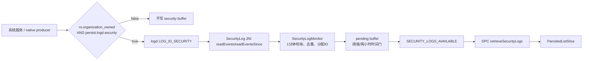
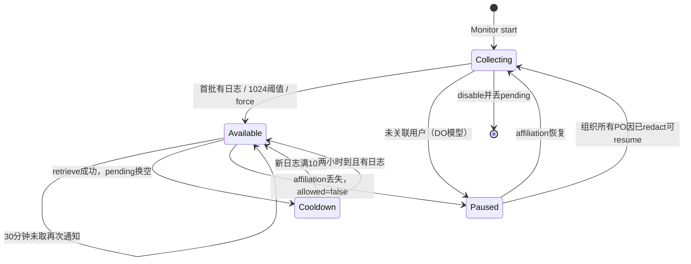
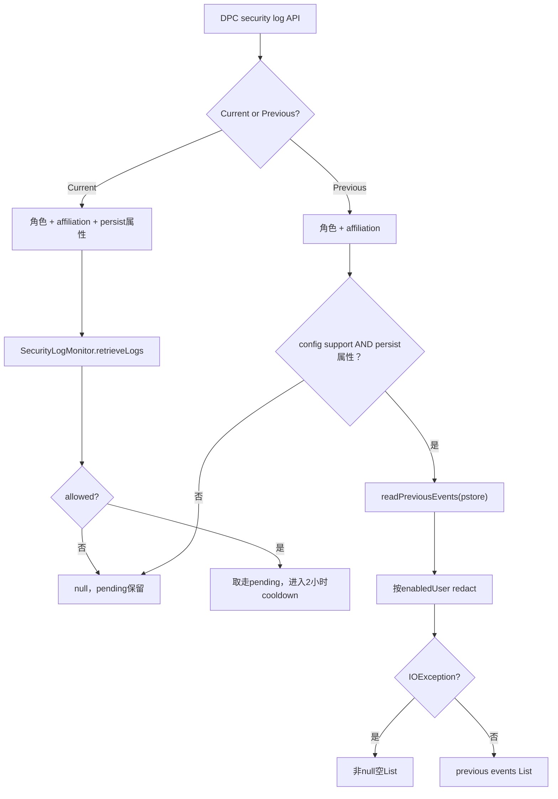

# 第 324 章 Android 企业 Security Logging：属性门、logd 采集、Monitor 批次、检索节流与隐私边界链

> 源码基线：Android 11 / API 30 / `android-11.0.0_r48`。本章在 macOS 上只读分析，不需要编译或连接设备。

## 1. Security Logging 解决什么问题

企业安全日志记录 ADB、进程启动、锁屏认证、系统启停、介质挂载、密钥/CA操作、关键策略变化和擦除失败等事件。Device Owner或组织所有设备上的 Profile Owner可启用并分批检索，用于设备级安全审计，而不是替代应用业务日志。

## 2. 三段状态必须分开

第一段是 producer是否把事件写入 logd security buffer；第二段是 `SecurityLogMonitor` 是否轮询并缓存；第三段是 DPC是否被允许取走当前 batch。属性开启、Monitor运行和 `mAllowedToRetrieve=true` 是三个不同条件。

## 3. 主要源码位置

API和 `SecurityEvent` 在 `frameworks/base/core/java/android/app/admin/DevicePolicyManager.java`、`SecurityLog.java`；策略入口在 `DevicePolicyManagerService.java`；缓存线程在 `SecurityLogMonitor.java`；JNI在 `frameworks/base/core/jni/android_app_admin_SecurityLog.cpp`。

## 4. native属性逻辑在哪里

`system/core/liblog/properties.cpp` 的 `__android_log_security()` 同时读取 `persist.logd.security` 与 `ro.organization_owned`。前者是管理员可切换门，后者证明设备处于组织所有模型。

## 5. 两个属性是逻辑与

native logging enabled条件是 `ro.organization_owned` 为真且 `persist.logd.security` 为 true。只手工打开 persist属性但设备没有组织所有只读属性，producer仍不会写 security log。

## 6. ro.organization_owned 如何产生

DPMS在设备管理状态确定后，把“存在 Device Owner或组织所有 managed profile”写入只读属性。它只在空值时设置，若之后期望值变化只能警告不能修改；这符合 ro属性在启动期固定的设计。

## 7. persist.logd.security 如何切换

`SecurityLog.setLoggingEnabledProperty(boolean)` 直接设置 `persist.logd.security=true/false`。它是持久系统属性，所以重启后仍可能为true；DPMS会在ActivityManagerReady阶段根据native enabled状态恢复Monitor。

## 8. 角色资格

set/get/retrieve面向 Device Owner或 organization-owned managed profile的 Profile Owner。服务用内部 `USES_POLICY_ORGANIZATION_OWNED_PROFILE_OWNER` 或等价角色检查，普通PO和传统Device Admin不能读取设备安全事件。

## 9. parent实例被禁止

客户端所有这些API都调用 `throwIfParentInstance()`。组织所有PO直接从自己的DPM实例管理安全日志，DPMS通过角色和enabled user决定可见范围，不允许用parent facade绕过红action。

## 10. Security Logging 总链路

## 11. setSecurityLoggingEnabled 的 feature门

若设备没有 device-admin feature，服务直接return。客户端API返回void，因此无异常不能证明属性或Monitor发生变化。

## 12. admin非空与角色检查

服务要求admin非null，在DPMS锁内验证调用UID拥有该DO/组织所有PO component。权限持有者不能只传另一个Owner的ComponentName操作。

## 13. 相同属性值会直接return

若 requested enabled与 `getLoggingEnabledProperty()` 相同，setter不启动/停止Monitor，也不写DevicePolicyEvent。它只比较persist属性，不检查Monitor线程是否真的处于对应状态。

## 14. 这个早退可能隐藏状态偏差

若属性为true但Monitor因异常未运行，再调用set(true)不会修复；正常启动路径会在系统阶段恢复Monitor，但setter本身不是“ensure running”。排障时应同时看属性和Monitor日志。

## 15. 启用的准确顺序

DPMS先把persist属性设为true，再调用Monitor.start(enabledUser)，最后根据未关联用户情况决定是否pause。属性先开让Monitor写 `TAG_LOGGING_STARTED` 时native门已经允许。

## 16. 停用的准确顺序

DPMS先把persist属性设为false，再调用Monitor.stop()。stop会尝试写 `TAG_LOGGING_STOPPED`，但native写接口受同一属性门控制；按此顺序，该停止事件可能因门已关闭而无法进入security buffer。

## 17. 启停事件并非可靠完成回执

`TAG_LOGGING_STARTED/STOPPED` 是日志事件，不是DPC callback。started可进入待取buffer，stopped存在上述顺序问题；两者都不能替代读取当前属性和Monitor状态。

## 18. enable后的审计事件

只有真正发生属性切换，外层才写 `DevicePolicyEnums.SET_SECURITY_LOGGING_ENABLED`，包含admin和boolean。重复set同值不会产生该DevicePolicyEvent。

## 19. isSecurityLoggingEnabled 的特殊system路径

非system UID必须传admin并通过角色校验；system UID可以传null，直接读取persist属性。返回值是管理员开关属性，不是native `ro && persist` 的最终结果，也不证明Monitor已运行。

## 20. Monitor在系统启动何时恢复

DPMS到 `PHASE_ACTIVITY_MANAGER_READY` 调 `maybeStartSecurityLogMonitorOnActivityManagerReady()`。它看的是 `SecurityLog.isLoggingEnabled()` native最终门；为true则start、运行crypto self-test，再根据affiliation pause。

## 21. 为什么启动恢复看native门

persist可能残留true，但设备没有organization-owned只读属性时，producer不工作；用native判断避免启动一个永远无事件的Monitor。setter的isEnabled getter与启动恢复因此回答不同层次的问题。

## 22. Monitor构造不受feature门

DPMS构造时无论mHasFeature都创建 `SecurityLogMonitor`，源码甚至有TODO询问原因；但systemReady和公开API feature门通常阻止它启动。构造对象不等于采集已启用。

## 23. enabledUser 如何确定

存在Device Owner时返回 `USER_ALL`；否则返回organization-owned managed profile的userId。这个值传给Monitor，在每次logd读取后用于redaction。

## 24. Device Owner为何看到全设备

USER_ALL让 `SecurityLog.redactEvents()` 直接跳过过滤。但只有所有其他用户/profile都affiliated时DO才能retrieve；隐私边界主要由affiliation门控制。

## 25. 组织所有PO为何只看受管范围

enabledUser是managed profile具体userId。Monitor会删除属于其他user的可识别事件，并对ADB命令、介质详情做字段redaction；它不要求全设备所有user关联，因为个人侧敏感信息应已过滤。

## 26. start会重置哪些状态

若Monitor线程为null，start新建pending list、critical=false、ID=0、allowed=false、nextAllowed=-1、paused=false，再启动新Thread。已有线程时仍先写started event并更新mEnabledUser，但不重置缓存。

## 27. 重复start的隐蔽点

DPMS setter通常通过属性同值早退避免重复start；系统恢复等其他调用若对运行中Monitor调用start，会记录started、更新enabledUser，却不会重建线程。源码没有针对Owner模型在运行中切换做完整迁移事务。

## 28. stop怎样终止线程

stop写stopped事件、加锁、interrupt monitor thread，并在持锁状态join最多5秒。随后无论线程是否完全退出都清pending/ID/allowed/timer/paused并把mMonitorThread=null。

## 29. join超时的竞态风险

若旧线程5秒内没退出，stop仍把引用置null；稍后start可创建新线程，而旧线程理论上仍可能结束前运行。正常JNI非阻塞读取和interruptible wait使概率低，但代码不是强制kill。

## 30. 关闭会丢弃未取日志

stop把pending替换为空List。DPC在disable前应先在收到可取通知的窗口内retrieve；API没有“disable并返回剩余batch”的原子操作。

## 31. Monitor线程优先级

`run()` 把自身设为 `THREAD_PRIORITY_BACKGROUND`，避免审计轮询抢占前台工作。它是持续系统线程，不是每分钟新建一次Job。

## 32. 正常轮询周期

Semaphore无force permit时，`tryAcquire(POLLING_INTERVAL_MS)` 最多等待一分钟；随后非阻塞读取logd、合并、保存overlap信息并判断通知。I/O和处理耗时会叠加，不能把“一分钟”当严格墙钟采样点。

## 33. 第一次读取

`mLastEventNanos=-1` 时调用 `SecurityLog.readEvents()`，立即读取当前security buffer全部事件。启用Monitor不保证只从setter之后开始；logd中仍存在且可读的事件可能进入首批。

## 34. 后续读取

已有last timestamp时调用 `readEventsSince(startNanos)`。若lastEvents非空，start最多回退3秒，以应对logd多个读写者造成的乱序。

## 35. 为什么需要三秒overlap

只从最后时间戳之后读可能漏掉晚到但时间更早的事件。重读三秒窗口，再用上一批末尾事件比较去重，在“少量重复读取”和“不漏乱序事件”之间折中。

## 36. 新批可能先排序

若发现相邻事件时间倒序，Monitor按timestamp排序。比较器使用 `Long.signum(t1-t2)`；这使后面的双指针overlap算法能线性工作。

## 37. redaction发生在分配ID前

`getNextBatch()` 读取/排序后立即调用 `SecurityLog.redactEvents(newLogs, mEnabledUser)`，然后merge才为保留事件分配ID。PO不会因被删除事件看到明显的ID空洞。

## 38. saveLastEvents 保存什么

它保存新批最后timestamp，并向前保留距离末尾小于3秒的事件，用作下次overlap比较。若新批为空，lastEvents清空，但lastEventNanos保留，下一次从最后精确时间开始。

## 39. 同时间戳不一定是重复

merge遇到相同timestamp时还调用 `eventEquals()` 比较底层Event内容；内容相同才跳过，内容不同则视为碰撞并保留。SecurityEvent ID不参与eventEquals。

## 40. 新事件ID的生命周期

Monitor从0递增分配long ID，到Long.MAX_VALUE后回绕0。stop/start会把ID重置0；因此ID只适合当前Monitor会话内排序/去重，不是跨重启全球唯一审计序号。

## 41. pending通知阈值

`BUFFER_ENTRIES_NOTIFICATION_LEVEL=1024`。pending达到该数且当前尚未允许retrieve时，Monitor立刻开放本批并通知，而不必等待正常两小时间隔。

## 42. 最大buffer与critical线

maximum是1024×10=10240条；critical是maximum的90%=9216条。到critical时只写一次 `TAG_LOG_BUFFER_SIZE_CRITICAL`，直到retrieve/截断重置critical flag。

## 43. 超过maximum如何丢日志

条件是 `size > 10240`，然后只保留最新的maximum/2=5120条，较旧事件整段丢弃。不是每超一条丢一条，也不是恰好保持10240。

## 44. 丢弃会造成ID跳跃

事件ID在截断前已经分配，被丢旧事件的ID不会重用。DPC可从首尾ID发现可能不连续，但start、redaction、回绕也能产生其他边界，不能仅靠一个gap精确推算丢失原因。

## 45. critical event也经过同一日志门

`checkCriticalLevel()` 先检查 `SecurityLog.isLoggingEnabled()`，再写critical tag。若native门已关闭，就不写；该事件之后仍需Monitor下次轮询才能进入pending，不能实时越过管线。

## 46. 第一次有日志为何会立即通知

`mNextAllowedRetrievalTimeMillis` 初始为-1。notify检查 `logSize>0 && elapsedRealtime>=-1`，所以第一轮读到任意事件就开放retrieve并发送通知，不会先等两小时。

## 47. 通知后未检索的重试

一旦决定通知，next time设为当前elapsed+30分钟。若DPC忽略且pending仍非空，30分钟后再次通知；`mAllowedToRetrieve` 已true也不阻止时间分支重发。

## 48. 检索后的两小时门

`retrieveLogs()` 在allowed=true时清allowed，把next time设为当前elapsed+2小时，返回整个pending并换成新空List。两小时从成功取走batch时开始，不是从上次通知或事件产生时开始。

## 49. 阈值可突破两小时等待

在两小时窗口内若新pending增长到1024且allowed仍false，阈值分支会立即开放和通知。因此两小时是低流量正常频率上限，高事件量用阈值提前排空。

## 50. 通知与检索状态机

## 51. retrieveLogs 的原子动作

Monitor锁内检查allowed；若true，先关闭许可、设冷却、把旧pending引用作为result，再换新List。后续线程读取的新事件进入新buffer，不会追加到已经交给Binder序列化的batch。

## 52. 未获许可时返回null

allowed=false时不清pending、不改变timer，直接null。客户端文档称rate limit exceeded，但null也可能表示logging disabled（DPMS更早返回）或Monitor尚无可取batch；DPC不能只用null区分原因。

## 53. DPMS retrieve 的前置角色门

`retrieveSecurityLogs(admin)` 先要求非null，再验证DO或组织所有PO。即使logging关闭，未授权调用者仍会先收到SecurityException，而不是通过null探测开关。

## 54. Device Owner affiliation门

如果不是organization-owned-profile设备，服务调用 `ensureAllUsersAffiliated()`，遍历所有非dying users；任一未关联便抛SecurityException。它不是仅过滤那位user的事件。

## 55. 组织所有PO免affiliation的依据

该设备模型跳过ensureAllUsersAffiliated，因为Monitor早已按managed profile user做redaction。个人应用启动等user-specific事件被删除，ADB命令和介质字段被裁剪。

## 56. logging属性检查

资格/affiliation通过后，DPMS检查的是persist property；false返回null。它没有在此处再检查native `ro.organization_owned`，因为合法Owner模型通常已设置只读属性。

## 57. 最近检索时间记录得太早

property为true后，DPMS先 `recordSecurityLogRetrievalTime()`，再调用Monitor.retrieveLogs。即使allowed=false最终返回null，system user policy XML中的“last retrieval time”仍会更新。

## 58. 该时间更准确叫“最近尝试时间”

API文档称most recently retrieved，但r48执行顺序让受限空取也推进时间。后台不能用它证明成功取到非空batch，只能作为调用尝试的近似审计字段。

## 59. 墙钟回拨处理

只有currentTime大于旧值才更新，和Remote Bugreport时间类似。调慢系统墙钟后新尝试可能不改变记录；Monitor自己的rate limit用elapsedRealtime，不受墙钟回拨影响。

## 60. 检索事件日志也可能记录null

DPMS在 `mSecurityLogMonitor.retrieveLogs()` 后无论结果是否null都写 `RETRIEVE_SECURITY_LOGS` DevicePolicyEvent。因此该event表示API执行到Monitor，不表示成功拿到日志。

## 61. ParceledListSlice 的作用

非null List包装成 `ParceledListSlice<SecurityEvent>` 跨Binder，客户端再取 `getList()`。大量事件可能分片序列化，DPC仍应及时持久化，不要长期把整批留在receiver内存。

## 62. pause不会停止采集

`SecurityLogMonitor.pause()` 只把paused=true、allowed=false。Monitor线程继续每分钟从logd读并追加pending，因此未关联期间仍占内存，也可能达到critical并截断。

## 63. 为什么pause而不是stop

affiliation可能很快补齐。继续收集可在恢复后提供连续审计；但为了未关联用户隐私，DO暂时不得取。代价是长时间未关联可能丢较旧日志。

## 64. resume怎样重新开放

resume若确实paused，先清paused并保持allowed=false，然后立即调用 `notifyDeviceOwnerIfNeeded(false)`。只要pending非空且时间条件满足，就可马上通知，不必等下一分钟轮询。

## 65. User added会触发pause

DPMS收到USER_ADDED后发送Owner用户事件，并调用maybePause。新user通常还没设置affiliation，所以DO模型security/network logging暂时不可取。

## 66. User removed的隐私清理

DPMS在删除该user policy数据之前记住它是否affiliated；若被移除的是unaffiliated user，就调用discardDeviceWideLogs清空security/network pending，再检查剩余users并resume。

## 67. 为什么删除后不能保留旧pending

user已不存在后无法再证明其中事件属于可授权关联主体。直接清空避免DO先创建未关联user、收集其活动、删除user后再绕过affiliation检索。

## 68. pre-reboot日志清理仍有TODO

`discardDeviceWideLogsLocked()` 注释明确说还应该丢pre-boot security logs，否则下次启动仍可能看到被删user数据；r48没有实现这一步。这是源码承认的隐私残留边界。

## 69. setAffiliationIds会同时pause/resume

任何user affiliation集合改变都可能改变全局状态，所以setter保存后依次调用maybePause和maybeResume。若所有user重新匹配，Monitor在干净Binder身份下恢复并可能发通知。

## 70. 组织所有PO始终允许Security Monitor resume

`maybeResumeDeviceWideLoggingLocked()` 条件是allUsersAffiliated或orgOwnedProfileDevice。后者不依赖个人user affiliation，因为redaction承担边界；network logging仍只在allUsersAffiliated时resume，二者策略不同。

## 71. SecurityEvent redaction不是全字段通用

switch只为已知tag定义规则。ADB shell command被替换为空字符串；media mount/unmount保留mount point但清另一个敏感字段；若解析payload结构失败，事件直接丢弃。

## 72. user-specific事件过滤

APP_PROCESS_START从payload中的UID取user；CA installed/removed直接取userId；key生成/导入/销毁从UID取user；key integrity violation从另一个UID字段取user。不等于accessing profile的事件被移除。

## 73. 非user-specific事件仍可见

default把userId设USER_NULL并原样保留。因此系统启动、ADB interactive、全局策略等事件可能对组织所有PO可见；redaction不是“只返回工作profile产生的全部和仅这些事件”的形式化证明。

## 74. severity是Framework映射

`SecurityEvent.getLogLevel()` 根据tag和payload success字段映射INFO/WARNING/ERROR。未知tag默认INFO；DPC可用于初筛，但不能替代企业自己的上下文风险评分。

## 75. Monitor通知最终调用谁

`notifyDeviceOwnerIfNeeded()` 固定调用 `mService.sendDeviceOwnerCommand(ACTION_SECURITY_LOGS_AVAILABLE, null)`。方法名不是泛称，它从Owners取Device Owner user/component并发送显式admin广播。

## 76. r48组织所有PO通知存在源码不一致

公开API允许组织所有PO启用/检索，但Monitor仍走sendDeviceOwnerCommand；无DO时Owners的deviceOwnerUserId为USER_NULL、component为null，没有显式路由到该PO。就本地源码而言，无法证明PO会收到 `onSecurityLogsAvailable()`，这很可能是r48实现缺口。

## 77. DeviceAdminReceiver文档也暴露旧假设

`onSecurityLogsAvailable()` 注释仍写“only applicable to device owners”，与DPM API新增组织所有PO描述不一致。阅读版本演进时应把“可调用retrieve”和“可靠收到callback”分别验证。

## 78. PO是否可以主动轮询

allowed状态仍由Monitor内部按时间/阈值置true，与广播投递成功无关。PO理论上调用retrieve可能在开放窗口拿到batch，但API没有公开next-ready时间，频繁轮询又不理想；产品实现应验证对应补丁或管理组件行为。

## 79. 通知不携带token或count

ACTION_SECURITY_LOGS_AVAILABLE无extras，DeviceAdminReceiver只调用无参业务callback。DPC随后retrieve当前唯一batch；这与Network Logging按batch token获取的模型不同。

## 80. callback重发不产生多个batch

30分钟重试只提醒同一个pending状态，allowed仍true，pending还会继续增长。DPC第一次成功retrieve取走当时整个List；不存在每次callback固定对应一份不可变快照。

## 81. forceSecurityLogs 是测试入口

隐藏API只允许shell/root，先要求persist logging property为true，否则抛IllegalStateException，再调用Monitor.forceLogs。普通DPC不能用它绕过batch节流。

## 82. force的十秒节流

Monitor以 `System.nanoTime()` 记录最近force，最少相隔10秒；过早调用返回向上取整的等待毫秒数。构造函数就把lastForce设为当前时间，所以对象创建后的首次force也可能先被节流。

## 83. force如何唤醒轮询

通过检查Semaphore permit，若为0就release一个。Monitor正在一分钟tryAcquire等待时会立即醒来；若permit恰被线程取走，注释认为日志已被force，避免堆积多个请求。

## 84. force不制造事件

它只要求马上fetch；若logd没有新日志，notify的force分支仍要求logSize>0，不会发送空batch通知。返回0表示请求被接受，不表示DPC可拿到非空日志。

## 85. 关闭再开启不会重读旧事件

Monitor线程退出时清lastEvents；若lastEventNanos已存在就加1ns。start没有把该timestamp重置-1，所以重新启用后从旧末尾之后读，避免把关闭前logd残留重复交付。

## 86. 关闭期间事件通常不会产生

native producer受persist属性门，disabled期间调用SecurityLog写入会失败/跳过。但不是所有安全相关系统日志都在LOG_ID_SECURITY；普通logcat事件不因该企业开关被纳入。

## 87. read IOException 后线程继续

run捕获IOException只写error，然后进入下一轮；Monitor不停止、不通知DPC失败。若logd读取长期故障，property仍显示enabled而DPC持续无batch，需要系统日志监控才能区分“安静设备”和“采集坏了”。

## 88. Pre-reboot 是另一条读取链

`retrievePreRebootSecurityLogs()` 不访问Monitor pending，而是直接调用 `SecurityLog.readPreviousEvents()`，JNI以 `ANDROID_LOG_PSTORE` 读取上一次启动前保存在RAM/pstore类区域的security events。

## 89. 默认产品不支持

AOSP `config_supportPreRebootSecurityLogs=false`。厂商必须overlay为true且底层提供previous events；否则API返回null。Android版本相同不代表所有设备都支持。

## 90. 当前与pre-reboot双路径

## 91. Pre-reboot的资格顺序

服务先做admin角色和affiliation检查，再写 `RETRIEVE_PRE_REBOOT_SECURITY_LOGS` DevicePolicyEvent，之后才检查产品support与logging property。unsupported调用也可能留下“尝试读取”事件。

## 92. disabled时不能读取旧日志

即使pstore里存在上次启动事件，只要当前persist logging property为false，API返回null。管理员必须保持/重新开启security logging才可进入readPrevious路径。

## 93. Pre-reboot没有Monitor节流

代码没有mAllowedToRetrieve或两小时timer；满足support+enabled后每次调用都读previous events。底层读取成本和DPC自身频率仍需控制，但不是当前batch的rate-limit模型。

## 94. previous数据可能损坏

API文档明确RAM区域跨电源周期不保证无损。SecurityEvent payload解析应防类型/长度异常，不能因为数据来自系统接口就假定每条结构可靠。

## 95. IOException返回空List而非null

`readPreviousEvents()` 抛IOException时，DPMS记录warning并返回 `ParceledListSlice(emptyList)`。null代表不支持/未启用，空List可能代表读取错误或确实没有事件，客户端仍无法无歧义区分后两者。

## 96. previous也会redact

读取成功后计算enabledUser；若不是USER_ALL，调用同一 `SecurityLog.redactEvents()`。组织所有PO不会因为数据来自上次启动就获得未裁剪个人侧内容。

## 97. Pre-reboot最近检索时间

只有support=true且property=true后才调用record，再开始read；IOException也会推进时间。unsupported/disabled路径虽然先写DevicePolicyEvent，却不更新last retrieval wall-clock。

## 98. 用户删除的pre-reboot漏洞边界

前述discard TODO意味着删除unaffiliated user只清Monitor pending，不清底层previous buffer。下次boot若产品支持、所有剩余users已关联，DO可能读到相关旧事件；源码已明确承认这一风险。

## 99. 常见SecurityLog tags

r48列出ADB interactive/command与sync文件、app process start、keyguard认证、OS startup/shutdown、media mount、密码/限制/camera policy、remote lock、wipe failure、key/CA生命周期、crypto self-test、证书验证失败等。

## 100. 不是所有事件都由一个类生产

DPMS在策略方法中调用 `SecurityLog.writeEvent()`；framework/native其他组件也写ADB、进程和存储事件。SecurityLog.java定义tag/payload契约，真正producer散布多个模块。

## 101. 事件payload必须按tag解释

`getData()`可能返回String、Integer或Object[]。DPC应先switch tag，再按文档检查类型/长度；直接把所有payload强转Object[]会崩溃，redaction代码本身也通过catch异常丢弃格式错误事件。

## 102. ID与timestamp的区别

timestamp来自底层Event，用于跨轮询排序/overlap；ID由Monitor交付前分配，用于当前会话序列。DPC去重最好结合设备启动标识、ID、tag、timestamp与payload摘要，不要单用ID。

## 103. elapsed与wall clock双时间体系

Monitor通知/节流使用elapsedRealtime，避免用户改时间绕过；event timestamp以纳秒记录底层时钟语义；last retrieval记录System.currentTimeMillis。三者不能直接相减得出可靠延迟。

## 104. 高流量攻击会触发有损保护

攻击者若制造大量可记录操作，buffer会到critical并最终从超10240截到最新5120。阈值通知帮助DPC提前取，但DPC离线或affiliation pause时仍会丢旧证据；日志不是无限取证仓库。

## 105. DPC本地持久化建议

收到通知后快速retrieve，把原始Parcelable字段规范化写入加密数据库/append-only审计文件，再异步上传。不要在BroadcastReceiver里完成网络请求，也不要只保存一条“收到callback”记录。

## 106. 服务端去重建议

以设备注册ID+boot session+event ID+timestamp/tag/payload hash做幂等，并保存“Android可能截断”的gap/critical信号。ID回绕和Monitor重启要求服务端不能假定永久单调。

## 107. 隐私与最小保留

ADB命令、文件路径、进程名、证书subject和账号相关字段可高度敏感。即使DO合法获得，也应做访问分级、传输加密、短保留、租户隔离与调查审批。

## 108. 关闭前的安全顺序

先等待/触发合法ready窗口并retrieve可用batch，确认本地持久化，再set(false)。但普通DPC无法force，若当前allowed=false只能按通知/阈值等待；不存在公开的flush-and-disable事务。

## 109. 清除Device Owner的行为

`clearDeviceOwnerLocked()` 把persist property设false并stop Monitor，同时把system user的last security retrieval time重置-1。ro.organization_owned是只读，不能在运行中改回false，但persist门足以停producer。

## 110. 如何只读排障

依次检查Owner模型与ro属性、persist开关、Monitor start/pause日志、affiliation、pending阈值与通知、retrieve null顺序、last retrieval变化和logd read异常。只看isSecurityLoggingEnabled=true证据太弱。

## 111. 本章应形成的最终模型

Security Logging是“属性允许producer → Monitor有重叠地轮询并redact → 有界pending按时间/阈值开放 → DPC一次取走”的流水线；affiliation、产品support和pre-reboot是外部边界。

## 112. macOS 只读练习一：核对双属性门

运行 `sed -n '390,415p' system/core/liblog/properties.cpp` 与 `rg -n "PROPERTY_ORGANIZATION_OWNED|setLoggingEnabledProperty" frameworks/base/services/devicepolicy/java/com/android/server/devicepolicy/DevicePolicyManagerService.java frameworks/base/core/java/android/app/admin/SecurityLog.java`。解释persist getter与native enabled为何可能不同。

## 113. macOS 只读练习二：推演通知时间

运行 `sed -n -e '70,135p' -e '455,510p' frameworks/base/services/devicepolicy/java/com/android/server/devicepolicy/SecurityLogMonitor.java`，分别查看常量和notify函数。计算首批、未取重试、成功取后、1024阈值四种下一次通知时间。

## 114. macOS 只读练习三：追retrieve null

运行 `sed -n '14175,14250p' frameworks/base/services/devicepolicy/java/com/android/server/devicepolicy/DevicePolicyManagerService.java` 与 `sed -n '225,260p' frameworks/base/services/devicepolicy/java/com/android/server/devicepolicy/SecurityLogMonitor.java`。列出当前日志返回null的所有前置分支，并确认哪种null仍更新last retrieval time。

## 115. macOS 只读练习四：验证COPE通知缺口

运行 `sed -n '485,505p' frameworks/base/services/devicepolicy/java/com/android/server/devicepolicy/SecurityLogMonitor.java`、`sed -n '8260,8290p' frameworks/base/services/devicepolicy/java/com/android/server/devicepolicy/DevicePolicyManagerService.java`，再查 `Owners.getDeviceOwnerUserId()` 默认值。说明为什么本地r48不能证明无DO的组织所有PO收到callback。

## 116. 练习答案要点

练习一应得到ro与persist逻辑与；练习二应得到首次立即、30分钟重试、成功后2小时但1024可提前；练习三应看到allowed=false仍记录尝试时间；练习四应看到Monitor固定路由DO与公开PO能力不一致。

## 117. 复读修正一：两小时不是固定批次周期

第一次有日志立即ready；未取每30分钟重发；取走后低流量等2小时；达到1024或shell force可提前。把它写成“系统每两小时生成一个batch”是不准确的。

## 118. 复读修正二：pause不是停止或清空

未关联时Monitor继续从logd收集，只禁通知/retrieve；长期pause会到10240后截成最新5120。只有stop或特定unaffiliated user removal discard才清pending，pre-reboot甚至仍有TODO残留。

## 119. 复读修正三：r48的PO callback不可直接承诺

API允许组织所有PO，但通知实现仍固定sendDeviceOwnerCommand，Receiver文档也只写DO。正文只能确认PO可启用和调用retrieve，不能宣称该本地版本必然把ACTION_SECURITY_LOGS_AVAILABLE投到PO。

## 120. 本章结论与下一章

Android 11安全日志以 `ro.organization_owned && persist.logd.security` 控制producer，Monitor每分钟带3秒overlap读取、按Owner模型redact、用1024/10240有界buffer和动态节流交付；retrieve时间并不等于成功，pre-reboot又是独立pstore路径。下一章研究Common Criteria Mode：企业开关如何持久化、为何Framework几乎只保存状态，以及产品组件必须承担哪些实际合规行为。
